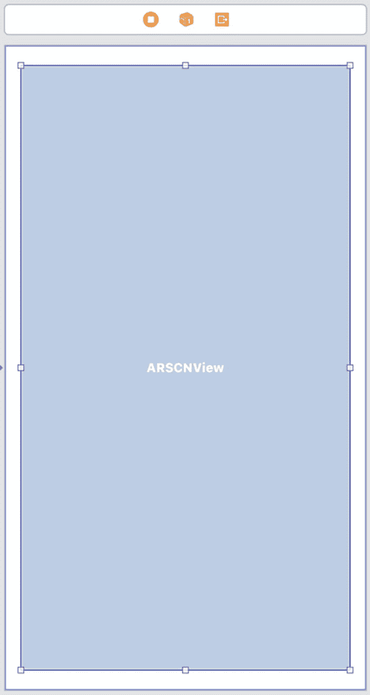
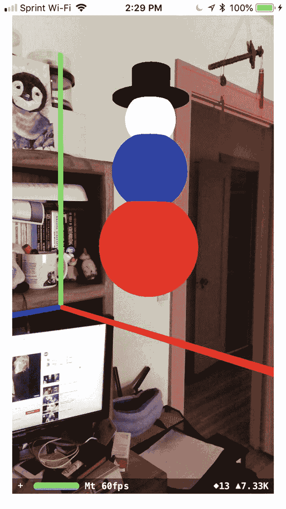

# 第六章 定位物体

当你指定虚拟物体的 x、y 和 z 坐标时，它们就会出现在增强现实视图中。这些虚拟物体会保持固定位置，除非用户重置世界原点，否则它们将基于新的世界原点位置出现。

然而，有时你可能不想通过指定精确坐标来显示虚拟物体。相反，你可能希望根据另一个虚拟物体的当前位置，以特定距离放置一个虚拟物体。与其定义精确坐标，不如定义相对坐标，例如始终将第二个虚拟物体放置在另一个虚拟物体左侧的固定距离处。

很多时候，你需要组合多个虚拟物体来创建一个单一图像，例如一个盒子上放一个金字塔来创建一个房子的图像。在处理由多个虚拟物体构成的单一对象时，相对定位可以轻松正确地显示所有虚拟物体，从而形成统一的视觉外观。


## 定义相对位置

通常，在增强现实视图中放置虚拟对象时，你需要定义两样东西。首先，你需要像这样定义虚拟对象的 x、y 和 z 坐标：

```
node.position = SCNVector3(0, 0, -0.3)
```

这段代码将一个虚拟对象放置在沿 x 轴 0 距离、沿 y 轴 0 距离以及沿 z 轴 -0.3 米的位置。一旦定义了虚拟对象的 x、y 和 z 坐标，第二步就是根据 `rootnode` 的位置来放置该虚拟对象，像这样：

```
sceneView.scene.rootNode.addChildNode(node)
```

`rootnode` 出现在世界原点 (0, 0, 0)，所以 `addChildNode` 命令只是基于 `rootnode` 的位置添加一个节点。

要学习如何在增强现实视图中放置两个虚拟对象，我们首先按照以下步骤创建一个新的 Xcode 项目：

1. 启动 Xcode。（确保你使用的是 Xcode 10 或更高版本。）
2. 选择 文件 ➤ 新建 ➤ 项目。Xcode 要求你选择一个模板。
3. 点击 iOS 类别。
4. 点击 单视图应用程序 图标，然后点击 下一步 按钮。Xcode 要求输入产品名称、组织名称、组织标识符和内容技术。
5. 点击 产品名称 文本框，为你的项目键入一个描述性名称，例如 Positioning。（确切名称不重要。）
6. 点击 下一步 按钮。Xcode 询问你想将项目存储在何处。
7. 选择一个文件夹并点击 创建 按钮。Xcode 创建一个 iOS 项目。

现在，按照以下步骤修改 `Info.plist` 以允许访问相机并使用 ARKit：

1. 在导航器窗格中点击 `Info.plist` 文件。Xcode 显示一个键、类型和值的列表。
2. 点击展开三角形以展开 Required Device Capabilities 类别，显示 Item 0。
3. 将鼠标指针悬停在 Item 0 上，显示一个加号 (`+`) 图标。
4. 点击这个加号 (`+`) 图标，显示一个空白的 Item 1。
5. 在 Item 1 行的 Value 类别下键入 `arkit`。
6. 将鼠标指针悬停在最后一行上，显示一个加号 (`+`) 图标。
7. 点击加号 (`+`) 图标创建新行。出现一个弹出菜单。
8. 选择 Privacy – Camera Usage Description。
9. 在 Privacy – Camera Usage Description 行的 Value 类别下键入 `AR 需要使用相机`。

现在，按照以下步骤修改 `ViewController.swift` 文件以使用 ARKit 和 SceneKit：

1. 在导航器窗格中点击 `ViewController.swift` 文件。
2. 编辑 `ViewController.swift` 文件，使其如下所示：

```
import UIKit
import SceneKit
import ARKit
class ViewController: UIViewController, ARSCNViewDelegate {
let configuration = ARWorldTrackingConfiguration()
override func viewDidLoad() {
super.viewDidLoad()
// Do any additional setup after loading the view, typically from a nib.
}
}
```

为了在我们的应用中查看增强现实，添加一个 ARKit SceneKit 视图 (`ARSCNView`) 用于显示带有相机视图的增强现实，如图 6-1 所示。`ARSCNView` 的确切大小无关紧要。



图 6-1

用户界面只需要一个 `ARSCNView`

在用户界面中添加了一个 ARKit SceneView 后，你需要为这些用户界面项添加约束。要添加约束，请选择 编辑器 ➤ 解决自动布局问题 ➤ 重置为建议的约束，在菜单下半部分的 All Views in Container 类别下。

设计好用户界面后，下一步是将用户界面项连接到 `ViewController.swift` 文件中的 Swift 代码。为此，请按照以下步骤操作：

1. 在导航器窗格中点击 `Main.storyboard` 文件。
2. 点击 助理编辑器 图标或选择 视图 ➤ 助理编辑器 ➤ 显示助理编辑器，以并排显示 `Main.storyboard` 和 `ViewController.swift` 文件。
3. 将鼠标指针悬停在 `ARSCNView` 上，按住 Control 键，并按住 Control 键拖动到 `class ViewController` 行的下方。
4. 松开 Control 键和鼠标左键。出现一个弹出菜单。
5. 点击 名称 文本框并键入 `sceneView`，然后点击 连接 按钮。Xcode 创建一个 IBOutlet，如下所示：

```
@IBOutlet var sceneView: ARSCNView!
```

6. 编辑 `viewDidLoad` 函数，使其如下所示：

```
override func viewDidLoad() {
super.viewDidLoad()
// Do any additional setup after loading the view, typically from a nib.
sceneView.delegate = self
sceneView.showsStatistics = true
sceneView.debugOptions = [ARSCNDebugOptions.showWorldOrigin, ARSCNDebugOptions.showFeaturePoints]
showShape()
}
```

7. 编辑 `viewWillAppear` 函数，使其如下所示：

```
override func viewWillAppear(_ animated: Bool) {
super.viewWillAppear(animated)
sceneView.session.run(configuration)
}
```

这个 `viewDidLoad` 函数调用了 `showShape` 函数。`showShape` 函数显示一个球体。

8. 在 `viewWillAppear` 函数下方键入以下内容：

```
func showShape() {
let sphere = SCNSphere(radius: 0.05)
sphere.firstMaterial?.diffuse.contents = UIColor.orange
let node = SCNNode()
node.geometry = sphere
node.position = SCNVector3(0.2, 0.1, -0.1)
sceneView.scene.rootNode.addChildNode(node)
}
```

整个 `ViewController.swift` 文件应如下所示：

```
import UIKit
import SceneKit
import ARKit
class ViewController: UIViewController, ARSCNViewDelegate  {
@IBOutlet var sceneView: ARSCNView!
let configuration = ARWorldTrackingConfiguration()
override func viewDidLoad() {
super.viewDidLoad()
// Do any additional setup after loading the view, typically from a nib.
sceneView.delegate = self
sceneView.showsStatistics = true
sceneView.debugOptions = [ARSCNDebugOptions.showWorldOrigin, ARSCNDebugOptions.showFeaturePoints]
showShape()
}
override func viewWillAppear(_ animated: Bool) {
super.viewWillAppear(animated)
sceneView.session.run(configuration)
}
func showShape() {
let sphere = SCNSphere(radius: 0.05)
sphere.firstMaterial?.diffuse.contents = UIColor.orange
let node = SCNNode()
node.geometry = sphere
node.position = SCNVector3(0.2, 0.1, -0.1)
sceneView.scene.rootNode.addChildNode(node)
}
}
```

此应用将一个橙色球体放置在 (0.2, 0.1, -0.1) 的位置。要运行此应用，请按照以下步骤操作：

1. 通过 USB 线将 iOS 设备连接到你的 Macintosh。
2. 点击 运行 按钮或选择 产品 ➤ 运行。
3. 应用运行时，会出现一个橙色球体。
4. 点击 停止 按钮或选择 产品 ➤ 停止。

现在，让我们添加第二个虚拟对象，例如一个绿色盒子，但我们希望它出现在第一个虚拟对象左侧 0.4 米（x 轴）、下方 0.3 米（y 轴）以及前方 0.2 米（z 轴）的位置。为此，我们必须使用数学计算。

要使一个虚拟对象出现在第一个虚拟对象左侧 0.4 米处，我们需要使用值 -0.2 (`0.2 – 0.4`)。要使其出现在下方 0.3 米处，我们需要使用值 -0.2 (`0.1 – 0.3`)，要使其出现在前方 0.2 米处，我们需要使用值 0.1 (`-0.1 + 0.2`)。

编辑 `showShape` 函数，使其如下所示：

```
func showShape() {
let sphere = SCNSphere(radius: 0.05)
sphere.firstMaterial?.diffuse.contents = UIColor.orange
let box = SCNBox(width: 0.2, height: 0.2, length: 0.2, chamferRadius: 0.0)
box.firstMaterial?.diffuse.contents = UIColor.green
let boxNode = SCNNode()
boxNode.geometry = box
boxNode.position = SCNVector3(-0.2, -0.2, 0.1) //左侧 0.4 米（x 轴），下方 0.3 米（y 轴），前方 0.2 米（z 轴）
sceneView.scene.rootNode.addChildNode(boxNode)
let node = SCNNode()
node.geometry = sphere
node.position = SCNVector3(0.2, 0.1, -0.1)
sceneView.scene.rootNode.addChildNode(node)
}
```


## 相对定位虚拟对象

如果你运行修改后的 `showShape` 函数，你的应用应该会显示一个橙色球体和一个绿色立方体。这种基于另一个虚拟对象的位置来定位第二个虚拟对象的方法存在一个巨大的问题：你必须手动计算两个虚拟对象之间的距离，这使得该方法容易出错。

与手动计算并期望结果正确相比，一个更好的解决方案是简单地定义你希望一个虚拟对象出现在另一个对象多远的位置。

请记住，当你使用 `SCNVector3` 命令为节点（虚拟对象）定义位置时，你只是基于根节点的位置（即世界原点 `(0, 0, 0)`）来定义虚拟对象的位置，就像这样：

```
node.position = SCNVector3(0.2, 0.1, -0.1)
sceneView.scene.rootNode.addChildNode(node)
```

你可以让一个虚拟对象（节点）相对于另一个虚拟对象定位，而不是相对于根节点（世界原点）。这样做可以避免仅基于世界原点来计算 x、y 和 z 坐标的麻烦。

因此，如果我们想将一个立方体放置在一个虚拟对象的左侧 0.4 米、下方 0.3 米、前方 0.2 米的位置，我们可以简单地使用这些数字，就像这样：

```
boxNode.position = SCNVector3(-0.4, -0.3, 0.2)
```

在定义了这个虚拟对象的位置之后，我们就可以将其相对于另一个虚拟对象放置。我们可以将节点添加到另一个虚拟对象上，而不是添加到根节点，就像这样：

```
node.addChildNode(boxNode)
```

如下修改 `showShape` 函数：

```
func showShape() {
let sphere = SCNSphere(radius: 0.05)
sphere.firstMaterial?.diffuse.contents = UIColor.orange
let box = SCNBox(width: 0.2, height: 0.2, length: 0.2, chamferRadius: 0.0)
box.firstMaterial?.diffuse.contents = UIColor.green
let boxNode = SCNNode()
boxNode.geometry = box
boxNode.position = SCNVector3(-0.4, -0.3, 0.2)
let node = SCNNode()
node.geometry = sphere
node.position = SCNVector3(0.2, 0.1, -0.1)
sceneView.scene.rootNode.addChildNode(node)
node.addChildNode(boxNode)
}
```

这将创建完全相同的结果：绘制一个距离橙色球体特定距离的绿色立方体。最大的区别在于，我们不是将绿色立方体添加到根节点并计算它与橙色球体的距离，而是直接将绿色立方体添加到橙色球体上，并定义了沿 x、y 和 z 轴放置绿色立方体的距离。

相对定位使得将虚拟对象以固定距离放置于另一个虚拟对象旁边变得容易。最初，你需要将一个虚拟对象相对于根节点（世界原点 `(0, 0, 0)`）放置，但在此之后，你可以将虚拟对象相对于其他虚拟对象的位置进行放置。

## 组合几何形状

一旦你知道如何将虚拟对象相对于彼此定位，你就可以轻松地组合多个几何形状，以创建使用单一几何形状无法创建的有趣对象。例如，你可以将棱锥放在立方体顶部来创建一个房屋对象，用多个圆柱体和一个球体来创建一个简笔画人物，或者用一个平面和一个圆环来创建一个篮球框。

为了了解如何使用相对定位将多个几何形状组合在一起，让我们来创建一个雪人。雪人将由三个球体堆叠而成，顶部戴着一顶帽子，这顶帽子由两个圆柱体组成。

首先，我们需要创建三个相互堆叠的球体。让我们从一个相对于根节点（世界原点 `(0, 0, 0)`）定位的大球体开始。然后，我们将使用相对定位在其顶部添加越来越小的球体。

第一个球体基于根节点定位在 x 轴 0.05 米、y 轴 0.05 米、z 轴 -0.05 米的位置，如下所示：

```
let sphere = SCNSphere(radius: 0.04)
sphere.firstMaterial?.diffuse.contents = UIColor.red
let node = SCNNode()
node.geometry = sphere
node.position = SCNVector3(0.05, 0.05, -0.05)
sceneView.scene.rootNode.addChildNode(node)
```

这将创建一个基于根节点定位的红色球体，它出现在世界原点 `(0, 0, 0)`。现在，让我们创建第二个蓝色球体，它出现在红色球体的顶部。我们将使用相对定位，基于红色球体的位置来放置这个蓝色球体，而不是通过根节点（世界原点）在增强现实视图中定位它。

当将虚拟对象相对于另一个虚拟对象放置时，你需要反复试验来定义特定的距离，直到虚拟对象以你想要的方式彼此呈现。

要将这个第二个蓝色球体放置在当前的红色球体顶部，我们可以使用以下代码：

```
let middleSphere = SCNSphere(radius: 0.03)
middleSphere.firstMaterial?.diffuse.contents = UIColor.blue
let middleNode = SCNNode()
middleNode.geometry = middleSphere
middleNode.position = SCNVector3(0, 0.06, 0)
node.addChildNode(middleNode)
```

这段代码创建了一个半径为 0.03 米的球体，并将其着色为蓝色。然后，它基于红色球体的相对位置将其定位在 `(0, 0.06, 0)`。这意味着它出现在红色球体中心上方 0.06 米处。

接下来，我们需要创建第三个也是顶部的球体。这个顶部球体的半径为 0.02 米，颜色为白色。我们将把这个球体放置在中间球体的顶部，距离中间球体中心上方 0.04 米的位置，如下所示：

```
let topSphere = SCNSphere(radius: 0.02)
topSphere.firstMaterial?.diffuse.contents = UIColor.white
let topNode = SCNNode()
topNode.geometry = topSphere
topNode.position = SCNVector3(0, 0.04, 0)
middleNode.addChildNode(topNode)
```

最后，让我们为构成虚拟雪人的三个球体添加一顶黑色帽子。这顶帽子将由两个圆柱体组成。一个宽而扁平的圆柱体将构成帽檐，一个更窄更高的圆柱体将构成帽子的其余部分。帽檐需要相对于顶部球体定位，如下所示：

```
let hatRim = SCNCylinder(radius: 0.03, height: 0.002)
hatRim.firstMaterial?.diffuse.contents = UIColor.black
let rimNode = SCNNode()
rimNode.geometry = hatRim
rimNode.position = SCNVector3(0, 0.016, 0)
topNode.addChildNode(rimNode)
```

帽檐的半径为 0.03 米，高度仅为 0.002 米。这段代码将圆柱体着色为黑色，并将其放置在顶部球体中心上方 0.016 米处。

最后，我们需要用第二个黑色圆柱体来完成帽子。这个圆柱体需要位于帽檐上方 0.01 米处，半径为 0.015 米，高度为 0.025 米，如下所示：


```
let hatTop = SCNCylinder(radius: 0.015, height: 0.025)
hatTop.firstMaterial?.diffuse.contents = UIColor.black
let hatNode = SCNNode()
hatNode.geometry = hatTop
hatNode.position = SCNVector3(0, 0.01, 0)
rimNode.addChildNode(hatNode)
```

要了解如何使用三个球体和两个圆柱体创建一个虚拟雪人，请按照以下步骤操作：

1.  单击停止按钮或选择 Product ➤ Stop。



图 6-2

使用三个球体和两个圆柱体创建一个虚拟雪人

1.  在导航器窗格中单击`ViewController.swift`文件。
2.  编辑`showShape`函数，使其看起来像这样：

```
func showShape() {
    let sphere = SCNSphere(radius: 0.04)
    sphere.firstMaterial?.diffuse.contents = UIColor.red
    let node = SCNNode()
    node.geometry = sphere
    node.position = SCNVector3(0.05, 0.05, -0.05)
    sceneView.scene.rootNode.addChildNode(node)
    let middleSphere = SCNSphere(radius: 0.03)
    middleSphere.firstMaterial?.diffuse.contents = UIColor.blue
    let middleNode = SCNNode()
    middleNode.geometry = middleSphere
    middleNode.position = SCNVector3(0, 0.06, 0)
    node.addChildNode(middleNode)
    let topSphere = SCNSphere(radius: 0.02)
    topSphere.firstMaterial?.diffuse.contents = UIColor.white
    let topNode = SCNNode()
    topNode.geometry = topSphere
    topNode.position = SCNVector3(0, 0.04, 0)
    middleNode.addChildNode(topNode)
    let hatRim = SCNCylinder(radius: 0.03, height: 0.002)
    hatRim.firstMaterial?.diffuse.contents = UIColor.black
    let rimNode = SCNNode()
    rimNode.geometry = hatRim
    rimNode.position = SCNVector3(0, 0.016, 0)
    topNode.addChildNode(rimNode)
    let hatTop = SCNCylinder(radius: 0.015, height: 0.025)
    hatTop.firstMaterial?.diffuse.contents = UIColor.black
    let hatNode = SCNNode()
    hatNode.geometry = hatTop
    hatNode.position = SCNVector3(0, 0.01, 0)
    rimNode.addChildNode(hatNode)
}
```

3.  通过 USB 线将 iOS 设备连接到你的 Mac。
4.  单击运行按钮或选择 Product ➤ Run。注意虚拟雪人出现在增强现实视图中，如图 6-2 所示。

整个`ViewController.swift`文件应如下所示：

```
import UIKit
import SceneKit
import ARKit

class ViewController: UIViewController, ARSCNViewDelegate  {
    @IBOutlet var sceneView: ARSCNView!
    let configuration = ARWorldTrackingConfiguration()
    
    override func viewDidLoad() {
        super.viewDidLoad()
        // Do any additional setup after loading the view, typically from a nib.
        sceneView.delegate = self
        sceneView.showsStatistics = true
        sceneView.debugOptions = [ARSCNDebugOptions.showWorldOrigin, ARSCNDebugOptions.showFeaturePoints]
        showShape()
    }
    
    override func viewWillAppear(_ animated: Bool) {
        super.viewWillAppear(animated)
        sceneView.session.run(configuration)
    }
    
    func showShape() {
        let sphere = SCNSphere(radius: 0.04)
        sphere.firstMaterial?.diffuse.contents = UIColor.red
        let node = SCNNode()
        node.geometry = sphere
        node.position = SCNVector3(0.05, 0.05, -0.05)
        sceneView.scene.rootNode.addChildNode(node)
        let middleSphere = SCNSphere(radius: 0.03)
        middleSphere.firstMaterial?.diffuse.contents = UIColor.blue
        let middleNode = SCNNode()
        middleNode.geometry = middleSphere
        middleNode.position = SCNVector3(0, 0.06, 0)
        node.addChildNode(middleNode)
        let topSphere = SCNSphere(radius: 0.02)
        topSphere.firstMaterial?.diffuse.contents = UIColor.white
        let topNode = SCNNode()
        topNode.geometry = topSphere
        topNode.position = SCNVector3(0, 0.04, 0)
        middleNode.addChildNode(topNode)
        let hatRim = SCNCylinder(radius: 0.03, height: 0.002)
        hatRim.firstMaterial?.diffuse.contents = UIColor.black
        let rimNode = SCNNode()
        rimNode.geometry = hatRim
        rimNode.position = SCNVector3(0, 0.016, 0)
        topNode.addChildNode(rimNode)
        let hatTop = SCNCylinder(radius: 0.015, height: 0.025)
        hatTop.firstMaterial?.diffuse.contents = UIColor.black
        let hatNode = SCNNode()
        hatNode.geometry = hatTop
        hatNode.position = SCNVector3(0, 0.01, 0)
        rimNode.addChildNode(hatNode)
    }
}
```

## 总结

在增强现实视图中放置虚拟对象时，每个虚拟对象都必须分配给一个节点，并且该节点需要 x、y 和 z 坐标来定义其位置。至少有一个虚拟对象需要根据其与`rootnode`的距离来定位，`rootnode`代表世界原点 (0, 0, 0)。在根据`rootnode`放置至少一个虚拟对象后，你可以基于`rootnode`或任何现有的虚拟对象放置额外的虚拟对象。

基于`rootnode`放置虚拟对象允许你定义它们的位置，独立于任何其他虚拟对象。然而，如果你希望一个虚拟对象出现在距离第二个虚拟对象固定距离的位置，使用相对定位会更容易。不是根据虚拟对象到`rootnode`的位置来定义它，而是根据它到另一个虚拟对象的位置来定义它。

没有相对定位，你将不得不根据`rootnode`计算距离，这可能不准确且繁琐。相对定位使得定义虚拟对象彼此之间的固定距离变得容易。

