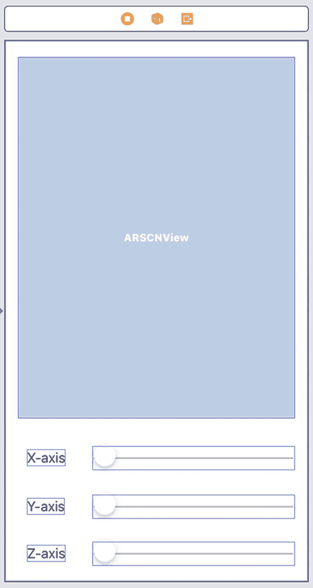
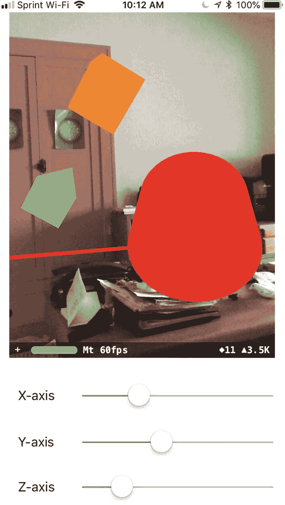

# 7. 旋转对象

当你在增强现实视图中放置一个虚拟对象时，它总是以其默认方向出现，例如圆柱体或金字塔垂直出现。然而，有时你可能希望虚拟对象以不同的方向出现。为了实现这一点，你可能需要围绕虚拟对象的 x、y 和 z 轴旋转它。

旋转虚拟对象涉及更改虚拟对象围绕其 x、y 和 z 轴的欧拉角。除了学习如何围绕 x、y 和 z 轴旋转虚拟对象外，你还将了解 Xcode 如何旋转相对于现有虚拟对象定位的附加虚拟对象。例如，如果你创建一个盒子并相对于盒子放置一个金字塔，旋转盒子也会改变金字塔的位置。


## 使用欧拉角旋转对象

要旋转虚拟对象，你需要像这样定义该虚拟对象的欧拉角：

```
node.eulerAngles = SCNVector3(x, y, z)
```

通过为 `x`、`y` 和 `z` 指定不同的值，`eulerAngles` 可以定义虚拟对象围绕 x、y 和 z 轴的旋转。在为 x、y 和 z 轴指定 `SCNVector3` 值时，请确保使用 `Float` 值，并以弧度指定旋转量。

由于大多数人更熟悉度数，我们需要借助 GLKit 将度数转换为弧度，GLKit 提供了包括度到弧度转换函数在内的数学库。首先，像这样导入 GLKit：

```
import GLKit
```

现在使用 `GLKMathDegreesToRadians` 函数，并像这样以度数指定旋转：

```
GLKMathDegreesToRadians(degrees)
```

此代码将度数转换为弧度。一旦度数被转换为弧度，你就可以使用这些弧度来定义围绕 x、y 和 z 轴的旋转。

为了学习如何在增强现实视图中旋转虚拟对象，让我们从按照以下步骤创建一个新的 Xcode 项目开始：

1.  启动 Xcode。（确保你使用的是 Xcode 10 或更高版本。）
2.  选择**文件** ➤ **新建** ➤ **项目**。Xcode 会要求你选择一个模板。
3.  点击 **iOS** 类别。
4.  点击 **Single View App** 图标，然后点击 **Next** 按钮。Xcode 要求你输入产品名称、组织名称、组织标识符和内容技术。
5.  在 **Product Name** 文本字段中点击，并输入项目的描述性名称，例如 **Rotation**。（确切名称不重要。）
6.  点击 **Next** 按钮。Xcode 询问你希望将项目存储在何处。
7.  选择一个文件夹并点击 **Create** 按钮。Xcode 创建一个 iOS 项目。

现在按照以下步骤修改 `Info.plist` 以允许访问摄像头并使用 ARKit：

1.  在导航器窗格中点击 `Info.plist` 文件。Xcode 会显示一个键、类型和值的列表。
2.  点击展开三角形以展开 **Required device capabilities** 类别，显示 **Item 0**。
3.  将鼠标指针悬停在 **Item 0** 上以显示一个加号 (`+`) 图标。
4.  点击此加号 (`+`) 图标以显示一个空白的 **Item 1**。
5.  在 **Item 1** 行的 **Value** 类别下输入 `arkit`。
6.  将鼠标指针悬停在最后一行上以显示一个加号 (`+`) 图标。
7.  点击加号 (`+`) 图标创建一个新行。会出现一个弹出菜单。
8.  选择 **Privacy – Camera Usage Description**。
9.  在 **Privacy – Camera Usage Description** 行的 **Value** 类别下输入 `AR Needs to Use the Camera`。

现在是时候按照以下步骤修改 `ViewController.swift` 文件以使用 ARKit 和 SceneKit 了：

1.  在导航器窗格中点击 `ViewController.swift` 文件。
2.  编辑 `ViewController.swift` 文件，使其看起来像这样：

```
import UIKit
import SceneKit
import ARKit
import GLKit
class ViewController: UIViewController, ARSCNViewDelegate {
    let configuration = ARWorldTrackingConfiguration()
    let node = SCNNode()
    var currentX : Float = 0
    var currentY : Float = 0
    var currentZ : Float = 0
    override func viewDidLoad() {
        super.viewDidLoad()
        // Do any additional setup after loading the view, typically from a nib.
    }
}
```

为了在我们的应用程序中查看增强现实内容，请将以下内容添加到 `Main.storyboard` 文件的用户界面上：

*   一个 ARKit SceneKit 视图 (`ARSCNView`)
*   三个 `UILabel`
*   三个 `UISlider`

用户界面应类似于图 7-1。



图 7-1

用户界面包含一个 `ARSCNView`、三个标签和三个滑块

设计好用户界面后，需要为这些用户界面项添加约束。要添加约束，请选择 **Editor** ➤ **Resolve Auto Layout Issues** ➤ **Reset to Suggested Constraints**，在菜单底部 **All Views in Container** 类别下。

设计完用户界面后，下一步是将用户界面项连接到 `ViewController.swift` 文件中的 Swift 代码。为此，请按照以下步骤操作：

1.  在导航器窗格中点击 `Main.storyboard` 文件。
2.  点击 **Assistant Editor** 图标或选择 **View** ➤ **Assistant Editor** ➤ **Show Assistant Editor**，以并排显示 `Main.storyboard` 和 `ViewController.swift` 文件。
3.  将鼠标指针移动到 `ARSCNView` 上，按住 **Control** 键，然后按住 **Control** 键拖动到 `class ViewController` 行下方。
4.  释放 **Control** 键和鼠标左键。会出现一个弹出菜单。
5.  在 **Name** 文本字段中点击并输入 `sceneView`，然后点击 **Connect** 按钮。Xcode 创建一个 `IBOutlet`，如下所示：

```
@IBOutlet var sceneView: ARSCNView!
```

6.  编辑 `viewDidLoad` 函数，使其看起来像这样：

```
override func viewDidLoad() {
    super.viewDidLoad()
    // Do any additional setup after loading the view, typically from a nib.
    sceneView.delegate = self
    sceneView.showsStatistics = true
    sceneView.debugOptions = [ARSCNDebugOptions.showWorldOrigin, ARSCNDebugOptions.showFeaturePoints]
    showShape()
}
```

7.  编辑 `viewWillAppear` 函数，使其看起来像这样：

```
override func viewWillAppear(_ animated: Bool) {
    super.viewWillAppear(animated)
    sceneView.session.run(configuration)
}
```

这个 `viewDidLoad` 函数调用了一个 `showShape` 函数。`showShape` 函数会显示一个绿色的金字塔。

8.  在 `viewWillAppear` 函数下方输入以下内容：

```
func showShape() {
    let pyramid = SCNPyramid(width: 0.05, height: 0.1, length: 0.05)
    pyramid.firstMaterial?.diffuse.contents = UIColor.green
    node.geometry = pyramid
    node.position = SCNVector3(0.05, 0.05, -0.05)
    sceneView.scene.rootNode.addChildNode(node)
}
```

9.  点击顶部的滑块（x 轴），按住 **Control** 键，然后按住 **Control** 键拖动到 `ViewController.swift` 文件底部最后一个花括号的上方。
10. 释放 **Control** 键和鼠标左键。会出现一个弹出菜单。
11. 在 **Connection** 弹出菜单中点击并选择 **Action**。
12. 在 **Name** 文本字段中点击并输入 `XChanged`。
13. 在 **Type** 弹出菜单中点击并选择 `UISlider`。
14. 点击 **Connect** 按钮。Xcode 创建一个 `IBAction` 方法，如下所示：

```
@IBAction func XChanged(_ sender: UISlider) {
    currentX = GLKMathDegreesToRadians(sender.value)
    node.eulerAngles = SCNVector3(currentX, currentY, currentZ)
}
```

15. 点击中间的滑块（y 轴），按住 **Control** 键，然后按住 **Control** 键拖动到 `ViewController.swift` 文件底部最后一个花括号的上方。
16. 释放 **Control** 键和鼠标左键。会出现一个弹出菜单。
17. 在 **Connection** 弹出菜单中点击并选择 **Action**。
18. 在 **Name** 文本字段中点击并输入 `YChanged`。
19. 在 **Type** 弹出菜单中点击并选择 `UISlider`。
20. 点击 **Connect** 按钮。Xcode 创建一个 `IBAction` 方法，如下所示：

```
@IBAction func YChanged(_ sender: UISlider) {
    currentY = GLKMathDegreesToRadians(sender.value)
    node.eulerAngles = SCNVector3(currentX, currentY, currentZ)
}
```

21. 点击底部的滑块（z 轴），按住 **Control** 键，然后按住 **Control** 键拖动到 `ViewController.swift` 文件底部最后一个花括号的上方。
22. 释放 **Control** 键和鼠标左键。会出现一个弹出菜单。
23. 在 **Connection** 弹出菜单中点击并选择 **Action**。
24. 在 **Name** 文本字段中点击并输入 `ZChanged`。
25. 在 **Type** 弹出菜单中点击并选择 `UISlider`。
26. 点击 **Connect** 按钮。Xcode 创建一个 `IBAction` 方法，如下所示：


```swift
@IBAction func ZChanged(_ sender: UISlider) {
    currentZ = GLKMathDegreesToRadians(sender.value)
    node.eulerAngles = SCNVector3(currentX, currentY, currentZ)
}
```

整个 `ViewController.swift` 文件应如下所示：

```swift
import UIKit
import SceneKit
import ARKit
import GLKit
class ViewController: UIViewController, ARSCNViewDelegate  {
    @IBOutlet var sceneView: ARSCNView!
    let configuration = ARWorldTrackingConfiguration()
    let node = SCNNode()
    var currentX : Float = 0
    var currentY : Float = 0
    var currentZ : Float = 0
    override func viewDidLoad() {
        super.viewDidLoad()
        // 视图加载后执行任何额外的设置，通常是从 nib 文件加载时进行。
        sceneView.delegate = self
        sceneView.showsStatistics = true
        sceneView.debugOptions = [ARSCNDebugOptions.showWorldOrigin, ARSCNDebugOptions.showFeaturePoints]
        showShape()
    }
    override func viewWillAppear(_ animated: Bool) {
        super.viewWillAppear(animated)
        sceneView.session.run(configuration)
    }
    func showShape() {
        let pyramid = SCNPyramid(width: 0.05, height: 0.1, length: 0.05)
        pyramid.firstMaterial?.diffuse.contents = UIColor.green
        node.geometry = pyramid
        node.position = SCNVector3(0.05, 0.05, -0.05)
        sceneView.scene.rootNode.addChildNode(node)
    }
    @IBAction func XChanged(_ sender: UISlider) {
        currentX = GLKMathDegreesToRadians(sender.value)
        node.eulerAngles = SCNVector3(currentX, currentY, currentZ)
    }
    @IBAction func YChanged(_ sender: UISlider) {
        currentY = GLKMathDegreesToRadians(sender.value)
        node.eulerAngles = SCNVector3(currentX, currentY, currentZ)
    }
    @IBAction func ZChanged(_ sender: UISlider) {
        currentZ = GLKMathDegreesToRadians(sender.value)
        node.eulerAngles = SCNVector3(currentX, currentY, currentZ)
    }
}
```

此应用将一个绿色的金字塔放置在 `SCNVector3(0.05, 0.05, -0.05)` 位置。要运行此应用，请按照以下步骤操作：

1.  通过 USB 线缆将 iOS 设备连接到您的 Macintosh。
2.  点击运行按钮或选择**产品** ➤ **运行**。
3.  当应用运行时，会出现一个绿色的金字塔。
4.  左右滑动 `x`、`y` 和 `z` 轴滑块。请注意，绿色的金字塔会围绕 `x`、`y` 或 `z` 轴旋转，具体取决于您当前正在移动哪个滑块。
5.  点击停止按钮或选择**产品** ➤ **停止**。

## 关联对象的旋转

通过使用欧拉角，可以轻松地使虚拟对象围绕其 `x`、`y` 或 `z` 轴旋转。如果您旋转一个对象，可能会想知道位于旋转对象旁边的任何相邻对象会发生什么变化。如果您使用相对定位将一个虚拟对象放置在另一个虚拟对象旁边，那么旋转一个对象也会导致附近的任何对象改变其位置。

因此，如果您有一个绿色的金字塔，并使用相对定位在绿色金字塔旁边放置一个橙色的盒子，那么旋转绿色金字塔也会移动橙色的盒子。这是因为橙色的盒子使用相对定位，使其与绿色金字塔保持特定的距离。当绿色金字塔旋转时，橙色的盒子也会改变其位置。

让我们添加第二个虚拟对象，例如一个橙色的盒子，并使用相对定位将其放置在绿色金字塔左侧 0.15 米处（`x` 轴），在 `y` 轴上为 0 米，在 `z` 轴上为 0 米。

编辑 `showShape` 函数，使其看起来像这样：

```swift
func showShape() {
    let pyramid = SCNPyramid(width: 0.05, height: 0.1, length: 0.05)
    pyramid.firstMaterial?.diffuse.contents = UIColor.green
    node.geometry = pyramid
    node.position = SCNVector3(0.05, 0.05, -0.05)
    sceneView.scene.rootNode.addChildNode(node)
    let box = SCNBox (width: 0.05, height: 0.05, length: 0.05, chamferRadius: 0)
    box.firstMaterial?.diffuse.contents = UIColor.orange
    let boxNode = SCNNode()
    boxNode.geometry = box
    boxNode.position = SCNVector3(-0.15, 0, 0)
    node.addChildNode(boxNode)
}
```

这段代码创建了一个橙色的盒子，出现在绿色金字塔左侧 0.15 米处。由于橙色的盒子使用基于绿色金字塔位置的相对定位，旋转绿色金字塔会自动迫使橙色的盒子改变其位置，以维持其相对于绿色金字塔的固定位置。

运行这个修改后的应用，并左右滑动 `x` 轴、`y` 轴和 `z` 轴滑块。请注意，绿色金字塔会旋转，并迫使橙色的盒子根据绿色金字塔的旋转而改变其位置。

由于橙色的盒子是相对于绿色金字塔定位的，旋转绿色金字塔也会迫使橙色的盒子移动。如果我们创建第三个虚拟对象，该对象使用相对于橙色盒子的定位，会发生什么情况？那么旋转金字塔将移动橙色的盒子，而橙色的盒子又会移动我们的第三个虚拟对象。让我们看看这是如何工作的。

重写 `showShape` 函数，使其添加一个红色的圆柱体，该圆柱体使用相对定位来根据橙色盒子的位置确定自身方向。现在旋转绿色金字塔会移动橙色的盒子（它维持相对于绿色金字塔的位置），也会移动红色的圆柱体（它维持相对于橙色盒子的位置）。

`showShape` 函数应如下所示：

```swift
func showShape() {
    let pyramid = SCNPyramid(width: 0.05, height: 0.1, length: 0.05)
    pyramid.firstMaterial?.diffuse.contents = UIColor.green
    node.geometry = pyramid
    node.position = SCNVector3(0.05, 0.05, -0.05)
    sceneView.scene.rootNode.addChildNode(node)
    let box = SCNBox (width: 0.05, height: 0.05, length: 0.05, chamferRadius: 0)
    box.firstMaterial?.diffuse.contents = UIColor.orange
    let boxNode = SCNNode()
    boxNode.geometry = box
    boxNode.position = SCNVector3(-0.15, 0, 0)
    node.addChildNode(boxNode)
    let cylinder = SCNCylinder(radius: 0.04, height: 0.06)
    cylinder.firstMaterial?.diffuse.contents = UIColor.red
    let thirdNode = SCNNode()
    thirdNode.geometry = cylinder
    thirdNode.position = SCNVector3(0, -0.15, 0.1)
    boxNode.addChildNode(thirdNode)
}
```


## 相对定位移动所有相关的虚拟对象

这段代码创建了一个半径为 0.04 米、高度为 0.06 米的红色圆柱体。然后将其放置在橙色盒子下方 0.15 米、前方 0.1 米的位置。当你运行此版本的应用时，移动 x、y 和 z 轴的滑块，你将看到绿色金字塔旋转并影响橙色盒子的位置，进而影响红色圆柱体的位置，如图 7-4 所示。



图 7-4
相对定位移动所有相关的虚拟对象

此时，我们有三个虚拟对象——一个绿色金字塔、一个橙色盒子和一个红色圆柱体。但是，我们只旋转绿色金字塔。橙色盒子移动以保持其相对于绿色金字塔的位置，而红色圆柱体移动以保持其相对于橙色盒子的位置。

如果我们添加一个仅相对于`rootnode`定位的第四个虚拟对象会怎样？在这种情况下，旋转绿色金字塔对这个第四个虚拟对象没有影响，因为它仅依赖于`rootnode`（世界原点）。让我们看看这是如何工作的。

编辑`showShape`函数以添加第四个虚拟对象，这次将其设为一个蓝色的圆环，如下所示：

```
let torus = SCNTorus(ringRadius: 0.02, pipeRadius: 0.004)
torus.firstMaterial?.diffuse.contents = UIColor.blue
let fourthNode = SCNNode()
fourthNode.geometry = torus
fourthNode.position = SCNVector3(0, -0.02, 0.1)
sceneView.scene.rootNode.addChildNode(fourthNode)
```

修改`showShape`函数如下：

```
func showShape() {
    let pyramid = SCNPyramid(width: 0.05, height: 0.1, length: 0.05)
    pyramid.firstMaterial?.diffuse.contents = UIColor.green
    node.geometry = pyramid
    node.position = SCNVector3(0.05, 0.05, -0.05)
    sceneView.scene.rootNode.addChildNode(node)

    let box = SCNBox (width: 0.05, height: 0.05, length: 0.05, chamferRadius: 0)
    box.firstMaterial?.diffuse.contents = UIColor.orange
    let boxNode = SCNNode()
    boxNode.geometry = box
    boxNode.position = SCNVector3(-0.15, 0, 0)
    node.addChildNode(boxNode)

    let cylinder = SCNCylinder(radius: 0.04, height: 0.06)
    cylinder.firstMaterial?.diffuse.contents = UIColor.red
    let thirdNode = SCNNode()
    thirdNode.geometry = cylinder
    thirdNode.position = SCNVector3(0, -0.15, 0.1)
    boxNode.addChildNode(thirdNode)

    let torus = SCNTorus(ringRadius: 0.02, pipeRadius: 0.004)
    torus.firstMaterial?.diffuse.contents = UIColor.blue
    let fourthNode = SCNNode()
    fourthNode.geometry = torus
    fourthNode.position = SCNVector3(0, -0.02, 0.1)
    sceneView.scene.rootNode.addChildNode(fourthNode)
}
```

由于圆环是相对于`rootnode`定位，而不是相对于其他任何虚拟对象，因此旋转绿色金字塔不会影响圆环的位置。这说明了在增强现实视图中移动虚拟对象时，相对定位与相对于`rootnode`定位的区别。

## 总结

有两种方法可以在增强现实视图中定义虚拟对象的位置。第一种，你可以相对于`rootnode`定义对象的位置，`rootnode`出现在世界原点(0, 0, 0)。第二种，你可以相对于另一个对象的位置来定义对象的位置。

要旋转一个对象，你需要定义其围绕 x、y 和 z 轴的欧拉角。欧拉角使用弧度，因此你需要使用存储在`GLKit`框架中的函数将度转换为弧度。通过使用`GLKMathDegreesToRadians`函数，你可以轻松地将度转换为弧度。

旋转一个对象也会改变任何定义为相对于该旋转对象的附近对象的位置。只有相对于`rootnode`定位的对象在旋转其他对象时不会改变。

