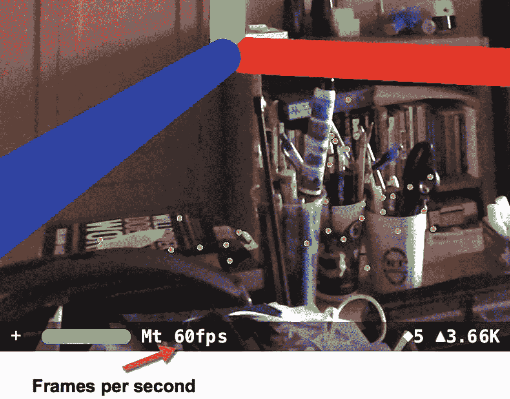
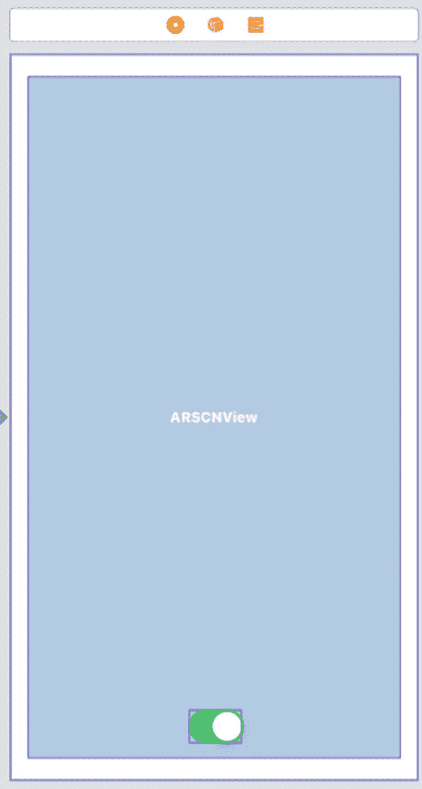
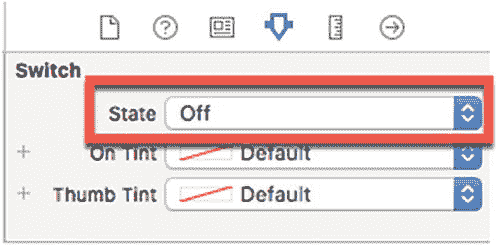
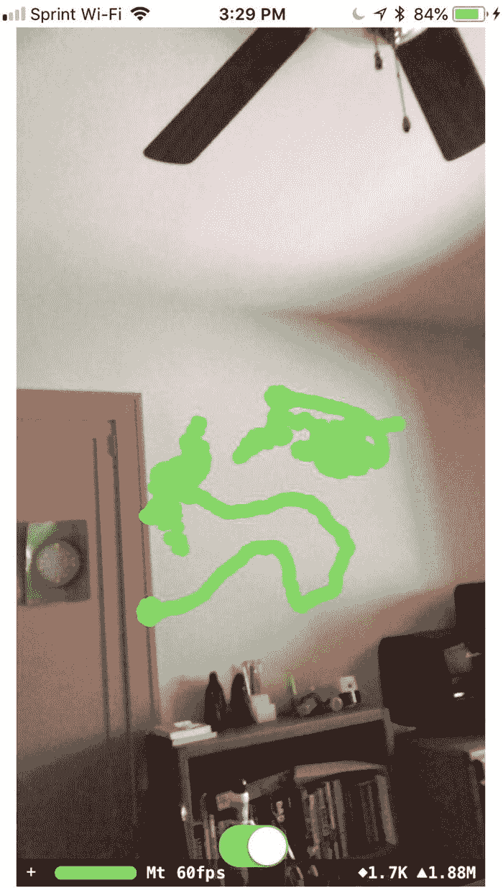

# 8. 在屏幕上绘图

你已经了解了如何在增强现实中绘制常见的几何形状，如圆柱体、盒子、金字塔和球体。你也已经了解了如何通过定义起点和终点来绘制自定义几何形状。在屏幕上创建和显示虚拟对象通常通过代码完成。

但是，如果你想让用户选择在屏幕上绘制物品呢？这就是你将在本章学到的：如何让用户直接在增强现实视图上绘制线条。

首先，解释一下你一直使用的另一个调试功能：

```
sceneView.showsStatistics = true
```

这行代码显示了相机显示的每秒帧数，如图 8-1 所示。



图 8-1
查看增强现实应用中的每秒帧数

每秒帧数定义了相机更新或渲染其视图的频率。每次相机更新或渲染其视图时（通常为每秒 60 帧），它都会运行一个`willRenderScene`函数，如下所示：

```
func renderer(_ renderer: SCNSceneRenderer, willRenderScene scene: SCNScene, atTime time: TimeInterval) {
}
```

因此，要在增强现实视图中绘制某些内容，我们需要使用这个`willRenderScene`函数来更新或渲染屏幕上的图像。

要在增强现实中绘制一个项目，我们需要按照以下步骤创建一个新的 Xcode 项目：

1.  启动 Xcode。（确保你使用的是 Xcode 10 或更高版本。）
2.  选择 File ➤ New ➤ Project。Xcode 会要求你选择一个模板。
3.  点击 iOS 类别。
4.  点击 Single View App 图标，然后点击 Next 按钮。Xcode 要求输入产品名称、组织名称、组织标识符和内容技术。
5.  点击 Product Name 文本字段，为你的项目输入一个描述性名称，例如`Drawing`。（确切的名称不重要。）
6.  点击 Next 按钮。Xcode 询问你要将项目存储在哪里。
7.  选择一个文件夹并点击 Create 按钮。Xcode 创建一个 iOS 项目。

现在按照以下步骤修改`Info.plist`文件以允许访问相机并使用 ARKit：

1.  点击 Navigator 窗格中的`Info.plist`文件。Xcode 显示一个键、类型和值的列表。
2.  点击展开三角形以展开 Required Device Capabilities 类别，显示 Item 0。
3.  将鼠标指针移到 Item 0 上以显示加号(+)图标。
4.  点击这个加号(+)图标以显示一个空白的 Item 1。
5.  在 Item 1 行的 Value 类别下输入`arkit`。
6.  将鼠标指针移到最后一行以显示加号(+)图标。
7.  点击加号(+)图标创建一个新行。会弹出一个菜单。
8.  选择 Privacy – Camera Usage Description。
9.  在 Privacy – Camera Usage Description 行的 Value 类别下输入`AR needs to use the camera`。

现在按照以下步骤修改`ViewController.swift`文件以使用 ARKit 和 SceneKit：

1.  点击 Navigator 窗格中的`ViewController.swift`文件。
2.  编辑`ViewController.swift`文件，使其看起来像这样：

```
import UIKit
import SceneKit
import ARKit

class ViewController: UIViewController, ARSCNViewDelegate {
    let configuration = ARWorldTrackingConfiguration()
    override func viewDidLoad() {
        super.viewDidLoad()
        // Do any additional setup after loading the view, typically from a nib.
    }
}
```

要在我们的应用中查看增强现实，添加一个单独的 ARKit SceneKit 视图(`ARSCNView`)和一个`UISwitch`，使用户界面类似于图 8-2。



图 8-2
用户界面包括一个放置在`ARSCNView`上的`UISwitch`


## 添加约束与连接界面

设计好用户界面后，下一步是添加约束。要添加约束，请在底部菜单的“All Views in Container”分类下选择 **Editor ➤ Resolve Auto Layout Issues ➤ Reset to Suggested Constraints**。

用户界面设计完成后，接下来需要将界面元素连接到`ViewController.swift`文件中的 Swift 代码。请按照以下步骤操作：

1.  在导航窗格中点击`Main.storyboard`文件。
2.  点击助理编辑器图标，或选择 **View ➤ Assistant Editor ➤ Show Assistant Editor**，以并排显示`Main.storyboard`和`ViewController.swift`文件。
3.  将鼠标指针悬停在`ARSCNView`上，按住 Control 键，然后按住 Control 键并拖动到`class ViewController`代码行下方。
4.  松开 Control 键和鼠标左键。此时会弹出一个菜单。
5.  在 Name 文本框中点击并输入`sceneView`，然后点击 Connect 按钮。Xcode 将创建一个 IBOutlet，如下所示：
    ```
    @IBOutlet var sceneView: ARSCNView!
    ```
6.  将鼠标指针悬停在`UISwitch`上，按住 Control 键，然后按住 Control 键并拖动到`@IBOutlet sceneView`代码行下方。
7.  松开 Control 键和鼠标左键。此时会弹出一个菜单。
8.  在 Name 文本框中点击并输入`switchDraw`，然后点击 Connect 按钮。Xcode 将创建一个 IBOutlet，如下所示：
    ```
    @IBOutlet var switchDraw: UISwitch!
    ```
9.  编辑`viewDidLoad`函数，使其内容如下：
    ```
    override func viewDidLoad() {
        super.viewDidLoad()
        // 视图加载后（通常是从 nib 文件加载）进行任何其他设置。
        sceneView.delegate = self
        sceneView.showsStatistics = true
        sceneView.debugOptions = [ARSCNDebugOptions.showWorldOrigin, ARSCNDebugOptions.showFeaturePoints]
    }
    ```
10. 编辑`viewWillAppear`函数，使其内容如下：
    ```
    override func viewWillAppear(_ animated: Bool) {
        super.viewWillAppear(animated)
        sceneView.session.run(configuration)
    }
    ```
11. 在`viewWillAppear`函数下方键入以下代码：
    ```
    func renderer(_ renderer: SCNSceneRenderer, willRenderScene scene: SCNScene, atTime time: TimeInterval) {
    }
    ```

`renderer(_:willRenderScene:atTime:)`函数会在每次应用更新增强现实视图时运行，通常为每秒 60 帧。

## 绘制增强现实视图

要在增强现实视图上进行绘制，首先需要在`willRenderScene`函数中获取 iOS 设备摄像头的位置。为此，我们可以使用以下代码来获取摄像头的位置和方向：
```
guard let pov = sceneView.pointOfView else {return}
```
`guard`语句确保我们从 iOS 设备获取了摄像头信息。如果由于某些原因未能获取，`guard`语句会立即退出`willRenderScene`函数。

假设我们成功从 iOS 设备获取了摄像头信息，下一步是将此信息转换为一个包含摄像头各种信息的 4x4 矩阵：
```
let transform = pov.transform
```

### 获取摄像头旋转与位置

这个 4x4 矩阵的第三行包含了摄像头的 x、y、z 旋转信息。要获取这些信息，我们需要使用以下代码：
```
let rotation = SCNVector3(-transform.m31, -transform.m32, -transform.m33)
```
请注意，从矩阵第三行获取的每个项前面都有一个负号。这个负号反转了旋转信息。如果没有它，在 x 轴上向右移动将为负值（而不是正值），在 y 轴上向上移动将为负值（而不是正值），在 z 轴上向后移动也将为负值（而不是正值）。

旋转定义了摄像头所面对的方向。接下来，我们需要从 4x4 矩阵的第四行获取摄像头的位置，如下所示：
```
let location = SCNVector3(transform.m41, transform.m42, transform.m43)
```
一旦获取了摄像头的旋转和位置，就需要将它们的 x、y 和 z 坐标相加，从而得出摄像头的朝向方位。


```swift
let currentPosition = SCNVector3(rotation.x + location.x, rotation.y + location.y, rotation.z + location.z)
```

## 应用功能与设置

此应用旨在在屏幕中央显示一个红色指针。当用户将`UISwitch`切换到开启位置时，应用将在用户相机指向的任何地方绘制一条绿线。为防止应用立即开始绘制，请按照以下步骤将`UISwitch`切换到关闭位置：



**图 8-3：将 UISwitch 状态值改为 Off**

1.  在导航器面板中点击`Main.storyboard`文件，用户界面将出现。
2.  点击`UISwitch`以选中它。
3.  点击“显示属性检查器”图标或选择 **查看** ➤ **检查器** ➤ **显示属性检查器**。
4.  点击状态弹出菜单并选择 **关闭**（参见图 8-3）。

### 编写渲染器函数代码

现在我们需要在`renderer`函数内部编写额外的代码，它目前应该如下所示：

```swift
func renderer(_ renderer: SCNSceneRenderer, willRenderScene scene: SCNScene, atTime time: TimeInterval) {
    guard let pov = sceneView.pointOfView else {return}
    let transform = pov.transform
    let rotation = SCNVector3(-transform.m31, -transform.m32, -transform.m33)
    let location = SCNVector3(transform.m41, transform.m42, transform.m43)
    let currentPosition = SCNVector3(rotation.x + location.x, rotation.y + location.y, rotation.z + location.z)
}
```

我们需要在这个`renderer`函数内部添加代码，以决定是显示指针还是绘制线条。由于这段额外代码需要在应用显示相机增强现实视图的同时运行，我们需要使用`DispatchQueue`。这允许应用同时显示相机和绘制线条。一个`DispatchQueue`简单定义了与主代码分开运行的代码，如下所示：

```swift
DispatchQueue.main.async {
}
```

在这个`DispatchQueue`内部，我们需要一个`if-else`语句。如果`UISwitch`是打开的，则绘制线条；否则，显示一个指针来指示当开关打开时线条将开始出现的位置。这使得`DispatchQueue`的代码看起来像这样：

```swift
DispatchQueue.main.async {
    if self.switchDraw.isOn {
        // 绘制线条
    } else {
        // 显示指针
    }
}
```

#### 绘制绿线

首先，让我们添加在增强现实视图中绘制绿线的代码。第一步是创建一个节点并将其定义为球体，如下所示：

```swift
let drawNode = SCNNode()
drawNode.geometry = SCNSphere(radius: 0.01)
```

接下来，我们将球体着色为绿色，并将其放置在相机当前位置（结合位置和旋转），使其出现在增强现实视图的中心：

```swift
drawNode.geometry?.firstMaterial?.diffuse.contents = UIColor.green
drawNode.position = currentPosition
```

然后，我们需要将这个绿色球体添加到根节点（世界原点），如下所示：

```swift
self.sceneView.scene.rootNode.addChildNode(drawNode)
```

`DispatchQueue`的`if`部分应如下所示：

```swift
if self.switchDraw.isOn {
    let drawNode = SCNNode()
    drawNode.geometry = SCNSphere(radius: 0.01)
    drawNode.geometry?.firstMaterial?.diffuse.contents = UIColor.green
    drawNode.position = currentPosition
    self.sceneView.scene.rootNode.addChildNode(drawNode)
}
```

这段代码在屏幕上连续绘制绿色球体，创造出线条的错觉。当然，只有当`UISwitch`设置为 **打开** 时，应用才会绘制这条绿线。

#### 显示指针

如果用户将`UISwitch`设置为 **关闭**，则`if-else`语句的`else`部分必须运行，显示指针。

让我们将指针创建为一个红色球体，如下所示：

```swift
let point = SCNNode()
point.geometry = SCNSphere(radius: 0.005)
point.position = currentPosition
point.geometry?.firstMaterial?.diffuse.contents = UIColor.red
```

现在我们需要将其添加到根节点：

```swift
self.sceneView.scene.rootNode.addChildNode(point)
```

与绘制绿线类似，如果仅这样做，这段代码将显示一个红色球体并绘制一条线，这不是我们想要的。问题是当用户移动相机时，应用会不断绘制红色球体，从而形成一条线的错觉。

我们需要的是绘制一个红色球体，然后删除前一个红色球体，这样就不会在屏幕上创建一条线。为此，需要以下代码：

```swift
self.sceneView.scene.rootNode.enumerateChildNodes({ (node, _) in
    if node.name == "aiming point" {
        node.removeFromParentNode()
    }
})
```

`enumerateChildNodes`创建一个循环，检查连接到根节点的每个节点。然后在这个循环内部，我们使用`removeFromParentNode`命令来移除节点。这将删除连接到根节点的所有节点，包括我们的绿线，因此我们需要一个`if`语句来检查节点是否名为 `“aiming point”`。如果是，则只删除该节点。

这意味着我们需要将指针节点命名为 `“aiming point”`：

```swift
point.name = "aiming point"
```

#### 完整的 DispatchQueue 代码

完整的`DispatchQueue`代码应如下所示：

```swift
DispatchQueue.main.async {
    if self.switchDraw.isOn {
        let drawNode = SCNNode()
        drawNode.geometry = SCNSphere(radius: 0.01)
        drawNode.geometry?.firstMaterial?.diffuse.contents = UIColor.green
        drawNode.position = currentPosition
        self.sceneView.scene.rootNode.addChildNode(drawNode)
    } else {
        let point = SCNNode()
        point.name = "aiming point"
        point.geometry = SCNSphere(radius: 0.005)
        point.position = currentPosition
        point.geometry?.firstMaterial?.diffuse.contents = UIColor.red
        self.sceneView.scene.rootNode.enumerateChildNodes({ (node, _) in
            if node.name == "aiming point" {
                node.removeFromParentNode()
            }
        })
        self.sceneView.scene.rootNode.addChildNode(point)
    }
}
```

## 完整的 ViewController.swift 文件

现在整个`ViewController.swift`文件应如下所示：

```swift
import UIKit
import SceneKit
import ARKit

class ViewController: UIViewController, ARSCNViewDelegate {

    @IBOutlet var sceneView: ARSCNView!
    @IBOutlet var switchDraw: UISwitch!
    let configuration = ARWorldTrackingConfiguration()

    override func viewDidLoad() {
        super.viewDidLoad()
        // Do any additional setup after loading the view, typically from a nib.
        sceneView.delegate = self
        sceneView.showsStatistics = true
        sceneView.debugOptions = [ARSCNDebugOptions.showWorldOrigin, ARSCNDebugOptions.showFeaturePoints]
    }

    override func viewWillAppear(_ animated: Bool) {
        super.viewWillAppear(animated)
        sceneView.session.run(configuration)
    }

    func renderer(_ renderer: SCNSceneRenderer, willRenderScene scene: SCNScene, atTime time: TimeInterval) {
        guard let pov = sceneView.pointOfView else {return}
        let transform = pov.transform
        let rotation = SCNVector3(-transform.m31, -transform.m32, -transform.m33)
        let location = SCNVector3(transform.m41, transform.m42, transform.m43)
        let currentPosition = SCNVector3(rotation.x + location.x, rotation.y + location.y, rotation.z + location.z)

        DispatchQueue.main.async {
            if self.switchDraw.isOn {
                let drawNode = SCNNode()
                drawNode.geometry = SCNSphere(radius: 0.01)
                drawNode.geometry?.firstMaterial?.diffuse.contents = UIColor.green
                drawNode.position = currentPosition
                self.sceneView.scene.rootNode.addChildNode(drawNode)
            } else {
                let point = SCNNode()
                point.name = "aiming point"
                point.geometry = SCNSphere(radius: 0.005)
                point.position = currentPosition
                point.geometry?.firstMaterial?.diffuse.contents = UIColor.red
                self.sceneView.scene.rootNode.enumerateChildNodes({ (node, _) in
                    if node.name == "aiming point" {
                        node.removeFromParentNode()
                    }
                })
                self.sceneView.scene.rootNode.addChildNode(point)
            }
        }
    }
}
```

## 运行应用

修改你的`ViewController.swift`文件中的代码以匹配上述代码。然后，要查看应用运行，请执行以下操作：



**图 8-4：在增强现实中绘制线条**

1.  通过 USB 线将 iOS 设备连接到 Mac。
2.  点击 **运行** 按钮或选择 **产品** ➤ **运行**。


