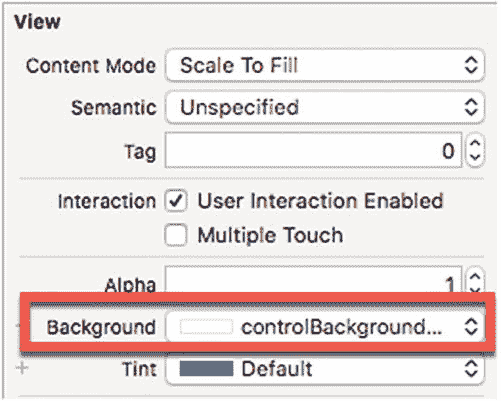

# 3. 应用程序运行步骤

当应用运行时，移动 iOS 设备以查看屏幕中央的红色指针。

点击`UISwitch`将其打开。

移动 iOS 设备，注意到现在会绘制一条绿线。

点击`UISwitch`将其关闭。

将 iOS 设备移动到一个新的位置。

点击`UISwitch`将其打开。

移动 iOS 设备以绘制另一条独立的绿线（见图 8-4）。

点击停止按钮或选择 Product ➤ Stop。

### 功能完善

为了完善这个应用，我们还需要一个功能。您可能注意到，您可以打开`UISwitch`来绘制绿线，然后再次关闭`UISwitch`将相机移动到新位置。现在，如果您再次打开`UISwitch`，可以在增强现实视图的其他地方绘制绿线。

然而，如果我们不断添加绿线，最终屏幕会充满绿线。因此，让我们添加一个简单的功能来清除整个屏幕，步骤如下：

1.  选择 Editor ➤ Resolve AutoLayout Issues ➤ Reset to Suggested Constraints。
2.  点击“显示助理编辑器”图标或选择 View ➤ Assistant Editor ➤ Show Assistant Editor。Xcode 并排显示您的`Main.storyboard`文件和`ViewController.swift`文件。
3.  将鼠标指针悬停在`UIButton`上，按住 Control 键，然后 Ctrl-拖拽到 IBOutlet 下方。出现一个弹出窗口。
4.  在 Name 文本字段中键入`clearButton`。
5.  点击 Connect 按钮。Xcode 创建一个 IBOutlet，如下所示：



图 8-5：更改 UIButton 的背景颜色

1.  在 Navigator 窗格中点击`Main.storyboard`文件。
2.  向用户界面添加一个`UIButton`。
3.  将`UIButton`的标题更改为“Clear”。您可能还想调整按钮大小使其更宽。
4.  点击“显示属性检查器”图标或选择 View ➤ Inspectors ➤ Show Attributes Inspector。
5.  将`UIButton`的背景颜色更改为白色（见图 8-5）。
6.  点击“显示标准编辑器”图标或选择 View ➤ Standard Editor ➤ Show Standard Editor。
7.  点击`ViewController.swift`文件。
8.  将以下代码添加到`DispatchQueue`代码的底部：

```
if self.clearButton.isHighlighted {
    self.sceneView.scene.rootNode.enumerateChildNodes({ (node, _) in
        node.removeFromParentNode()
    })
}
```

完整的`ViewController.swift`文件应如下所示：

```
import UIKit
import SceneKit
import ARKit
class ViewController: UIViewController, ARSCNViewDelegate {
    @IBOutlet var sceneView: ARSCNView!
    @IBOutlet var switchDraw: UISwitch!
    @IBOutlet var clearButton: UIButton!
    let configuration = ARWorldTrackingConfiguration()
    override func viewDidLoad() {
        super.viewDidLoad()
        // Do any additional setup after loading the view, typically from a nib.
        sceneView.delegate = self
        sceneView.showsStatistics = true
        sceneView.debugOptions = [ARSCNDebugOptions.showWorldOrigin, ARSCNDebugOptions.showFeaturePoints]
    }
    override func viewWillAppear(_ animated: Bool) {
        super.viewWillAppear(animated)
        sceneView.session.run(configuration)
    }
    func renderer(_ renderer: SCNSceneRenderer, willRenderScene scene: SCNScene, atTime time: TimeInterval) {
        guard let pov = sceneView.pointOfView else {return}
        let transform = pov.transform
        let rotation = SCNVector3(-transform.m31, -transform.m32, -transform.m33)
        let location = SCNVector3(transform.m41, transform.m42, transform.m43)
        let currentPosition = SCNVector3(rotation.x + location.x, rotation.y + location.y, rotation.z + location.z)
        DispatchQueue.main.async {
            if self.switchDraw.isOn {
                let drawNode = SCNNode()
                drawNode.geometry = SCNSphere(radius: 0.01)
                drawNode.geometry?.firstMaterial?.diffuse.contents = UIColor.green
                drawNode.position = currentPosition
                self.sceneView.scene.rootNode.addChildNode(drawNode)
            } else {
                let point = SCNNode()
                point.name = "aiming point"
                point.geometry = SCNSphere(radius: 0.005)
                point.position = currentPosition
                point.geometry?.firstMaterial?.diffuse.contents = UIColor.red
                self.sceneView.scene.rootNode.enumerateChildNodes({ (node, _) in
                    if node.name == "aiming point" {
                        node.removeFromParentNode()
                    }
                })
                self.sceneView.scene.rootNode.addChildNode(point)
            }
            if self.clearButton.isHighlighted {
                self.sceneView.scene.rootNode.enumerateChildNodes({ (node, _) in
                    node.removeFromParentNode()
                })
            }
        }
    }
}
```

### 运行应用程序

要查看应用程序的运行，请执行以下操作：

1.  通过 USB 线缆将 iOS 设备连接到 Macintosh。
2.  点击运行按钮或选择 Product ➤ Run。
3.  当应用运行时，移动 iOS 设备以查看屏幕中央的红色指针。
4.  点击`UISwitch`将其打开。
5.  移动 iOS 设备，注意到现在会绘制一条绿线。
6.  点击`UISwitch`将其关闭。
7.  将 iOS 设备移动到一个新的位置。
8.  点击`UISwitch`将其打开。
9.  移动 iOS 设备以绘制另一条独立的绿线。
10. 点击 Clear 按钮。注意，应用现在会清除您绘制的所有绿线。
11. 点击停止按钮或选择 Product ➤ Stop。

## 总结

增强现实应用依赖于 iOS 设备中的摄像头。此摄像头通常以每秒 60 帧（fps）的速度刷新图像。您可以通过添加这行代码来查看应用每秒显示的帧数：

```
sceneView.showsStatistics = true)
```

每次应用更新显示图像时，`renderer`函数都会运行，即每秒 60 次。通过在`renderer`函数内绘制对象，您的应用可以持续绘制图像。在我们的示例应用中，我们绘制了一个球体，但由于`renderer`函数持续绘制球体，它绘制了多个球体。当用户移动摄像头时，这会绘制多个绿色球体，从而产生绘制线条的错觉。

要清除虚拟对象，我们可以使用`enumerateChildNodes`循环来检查每个节点：

```
self.sceneView.scene.rootNode.enumerateChildNodes({ (node, _) in
})
```

为了避免移除所有节点，我们可以为节点命名，然后使用`if`语句仅移除某些指定名称的节点。在增强现实视图中进行绘制需要获取相机的当前旋转和位置，以便应用可以在用户指向摄像头的任何地方绘制虚拟对象。


