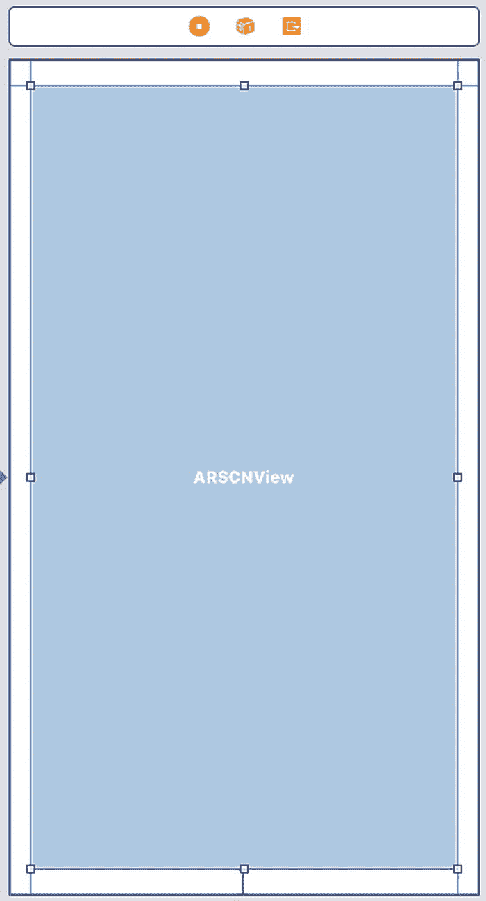
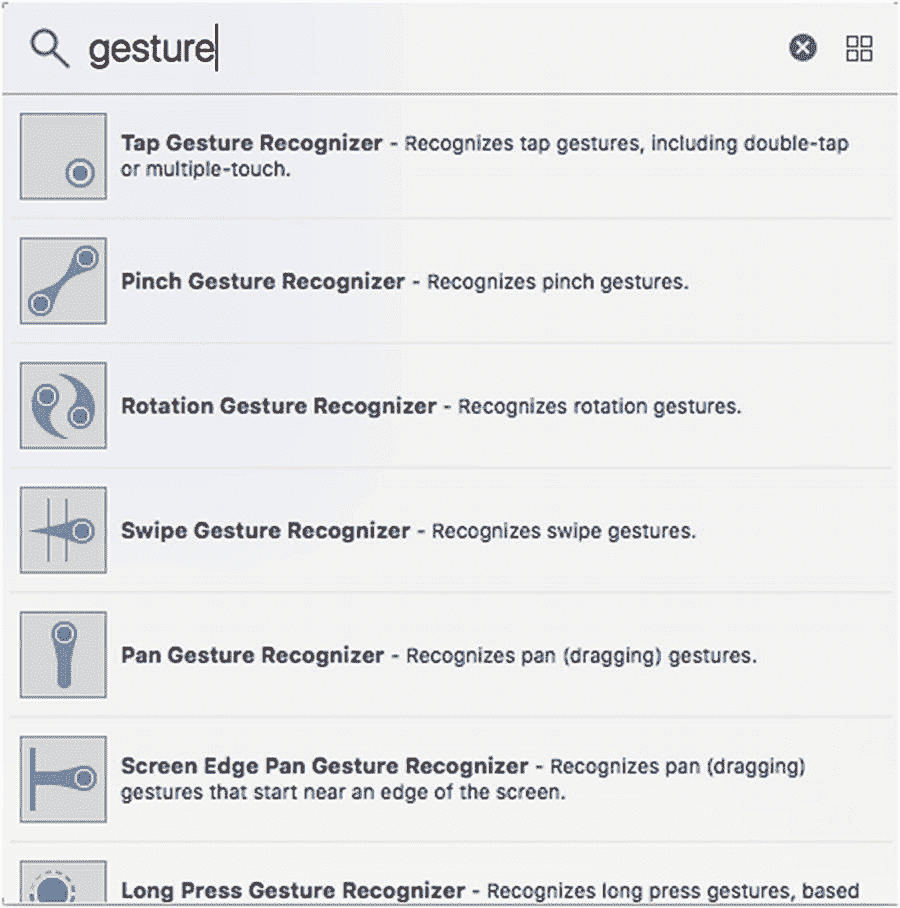
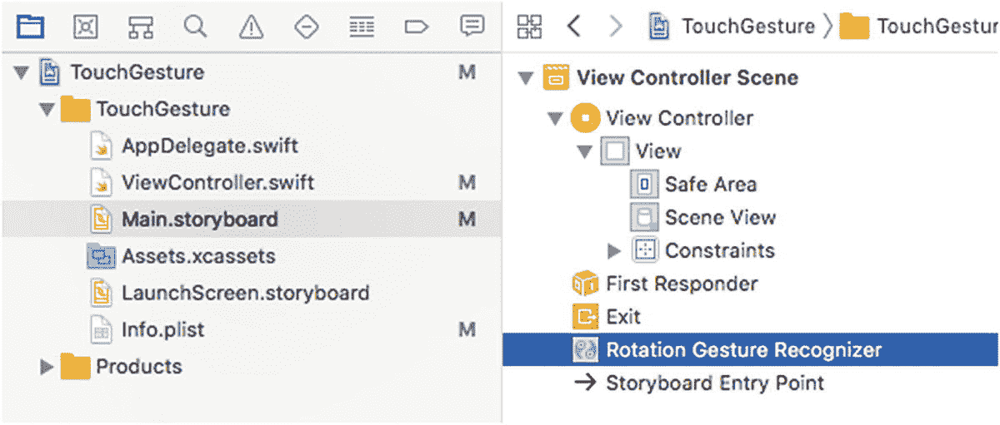
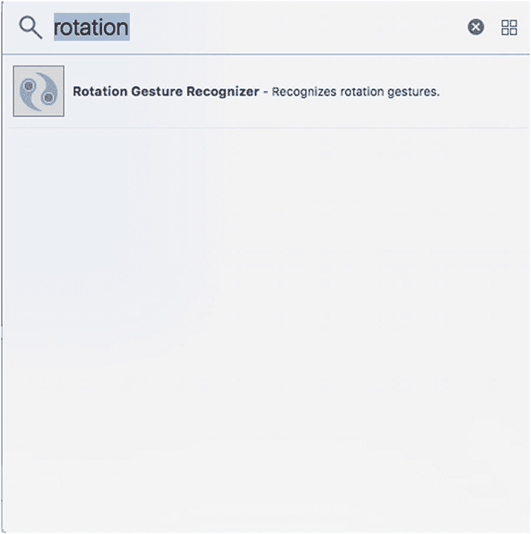
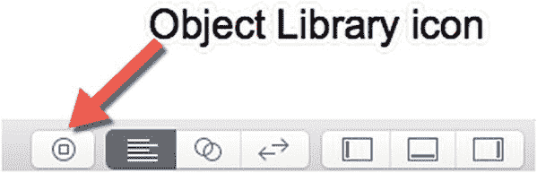

# 9. 为增强现实添加触控手势

到目前为止，我们已经创建了在屏幕上显示虚拟对象的增强现实应用。真正让增强现实更具临场感的是，你能够与虚拟对象进行交互。

当然，你无法用手直接触摸或操控任何虚拟对象，但你可以通过 iOS 屏幕上的增强现实视图来触摸和操控虚拟对象。这意味着你可以用指尖在屏幕上点击、拖动和操作物品。与增强现实的交互能创造出更强的真实感。

可用的手势类型包括以下几种：
*   **轻点**——在屏幕上短暂触碰后抬起手指
*   **长按**——用手指按压屏幕并保持一段时间
*   **轻扫**——用手指在某个区域内向左或向右滑动
*   **平移**——用手指按压屏幕，然后在屏幕上滑动
*   **捏合**——一种双指手势，将两个指尖并拢或分开
*   **旋转**——一种双指手势，使两个指尖做圆周运动

要与增强现实中的虚拟对象交互，我们必须首先检测触控手势，例如轻点或轻扫。一旦能检测到触控手势，下一步就是判断该手势是否触碰到了虚拟对象。

要在增强现实视图中检测触控手势，我们需要按照以下步骤创建一个新的 Xcode 项目：
1.  启动 Xcode。（请确保你使用的是 Xcode 10 或更高版本。）
2.  选择“文件”➤“新建”➤“项目”。Xcode 会要求你选择一个模板。
3.  点击“iOS”类别。
4.  点击“单视图应用”图标，然后点击“下一步”按钮。Xcode 会要求输入产品名称、组织名称、组织标识符和内容技术。
5.  点击“产品名称”文本框，为你的项目输入一个描述性名称，例如 `TouchGesture`。（具体名称并不重要。）
6.  点击“下一步”按钮。Xcode 会询问你想要将项目存储在何处。
7.  选择一个文件夹并点击“创建”按钮。Xcode 将创建一个 iOS 项目。

现在按照以下步骤修改 `Info.plist` 文件，以允许访问摄像头并使用 ARKit：
1.  在导航器面板中点击 `Info.plist` 文件。Xcode 会显示键、类型和值的列表。
2.  点击展开三角形以展开“必需设备功能”类别，显示“Item 0”。
3.  将鼠标指针悬停在“Item 0”上，会出现一个加号 (`+`) 图标。
4.  点击此加号 (`+`) 图标，将显示一个空白的“Item 1”。
5.  在“Item 1”行的“值”类别下输入 `arkit`。
6.  将鼠标指针悬停在最后一行上，会出现一个加号 (`+`) 图标。
7.  点击加号 (`+`) 图标以创建新行。会出现一个弹出菜单。
8.  选择“Privacy – Camera Usage Description”（隐私 - 相机使用说明）。
9.  在“Privacy – Camera Usage Description”行的“值”类别下输入 `AR needs to use the camera`。

现在按照以下步骤修改 `ViewController.swift` 文件以使用 ARKit 和 SceneKit：
1.  在导航器面板中点击 `ViewController.swift` 文件。
2.  编辑 `ViewController.swift` 文件，使其内容如下：

```
import UIKit
import SceneKit
import ARKit
class ViewController: UIViewController, ARSCNViewDelegate {
    let configuration = ARWorldTrackingConfiguration()
    override func viewDidLoad() {
        super.viewDidLoad()
        // Do any additional setup after loading the view, typically from a nib.
    }
}
```

要在我们的应用中查看增强现实，添加一个 ARKit SceneKit 视图 (`ARSCNView`)，使用户界面类似于图 9-1。


图 9-1
用户界面包含一个单独的 ARSCNView

设计好用户界面后，需要添加约束。要添加约束，请选择“Editor”（编辑器）➤“Resolve Auto Layout Issues”（解决自动布局问题）➤“Reset to Suggested Constraints”（重置为建议的约束），此选项位于菜单下半部分的“All Views in Container”（容器中的所有视图）类别下。

下一步是将用户界面项连接到 `ViewController.swift` 文件中的 Swift 代码。为此，请按照以下步骤操作：
1.  在导航器面板中点击 `Main.storyboard` 文件。
2.  点击“Assistant Editor”（辅助编辑器）图标，或选择“View”（视图）➤“Assistant Editor”（辅助编辑器）➤“Show Assistant Editor”（显示辅助编辑器），以并排显示 `Main.storyboard` 和 `ViewController.swift` 文件。
3.  将鼠标指针悬停在 ARSCNView 上，按住 Control 键，然后在 `class ViewController` 行下方进行 Ctrl-拖动。
4.  松开 Control 键和鼠标左键。会出现一个弹出菜单。
5.  点击“Name”（名称）文本框，输入 `sceneView`，然后点击“Connect”（连接）按钮。Xcode 将创建一个 IBOutlet，如下所示：

```
@IBOutlet var sceneView: ARSCNView!
```

6.  编辑 `viewDidLoad` 函数，使其内容如下：

```
override func viewDidLoad() {
    super.viewDidLoad()
    // Do any additional setup after loading the view, typically from a nib.
    sceneView.delegate = self
    sceneView.showsStatistics = true
    sceneView.debugOptions = [ARSCNDebugOptions.showWorldOrigin, ARSCNDebugOptions.showFeaturePoints]
}
```

7.  编辑 `viewWillAppear` 函数，使其内容如下：

```
override func viewWillAppear(_ animated: Bool) {
    super.viewWillAppear(animated)
    sceneView.session.run(configuration)
}
```


## 识别触摸手势

在应用中识别触摸手势包含三步：

*   创建一个函数，用于在识别到触摸手势时进行处理
*   定义一个`UIGestureRecognizer`类，用于指定处理触摸手势的函数
*   将触摸手势识别器添加到 ARKit 场景视图中

首先，你需要创建一个函数，当你的应用识别到触摸手势时运行该函数。与其他函数不同，这个触摸手势处理函数前面需要加上`@objc`关键字。这允许该函数访问用于创建 Apple 框架的 Objective-C 代码，其中一些框架仍在使用 Objective-C。处理触摸手势的函数基本结构如下所示，其中`handleTap`是你可以任意选择的函数名：

```
@objc func handleTap() {
}
```

其次，你需要使用`UITapGestureRecognizer`类来定义将处理点击手势的函数，如下所示：

```
let tapGesture = UITapGestureRecognizer(target: self, action: #selector(handleTap))
```

如果你想检测其他类型的手势，例如旋转或平移，则需要使用不同的类，例如`UIRotationGestureRecognizer`或`UIPanGestureRecognizer`。

`#selector`关键字标识了将处理触摸手势的函数名。实际名称（例如`tapGesture`）是任意的。

最后，第三步是将手势识别器添加到增强现实场景中，如下所示：

```
sceneView.addGestureRecognizer(tapGesture)
```

这段代码将触摸手势（例如`tapGesture`）添加到场景（`sceneView`）中，但两者都是你可以替换为其他任何名称的任意名称。然后，这行代码使得场景（`sceneView`）能够识别触摸手势并通过你定义的`@objc`函数进行处理。

检测触摸手势可以相当简单，让我们通过以下步骤来看看它是如何工作的：

1.  在导航窗格中点击`Main.storyboard`文件，用户界面会出现。
2.  点击助手编辑器图标或选择 视图 ➤ 助手编辑器 ➤ 显示助手编辑器，以并排显示`Main.storyboard`和`ViewController.swift`文件。
3.  将鼠标指针移动到 ARSCNView 上，按住 Control 键，并按住 Control 键将鼠标拖动到`ViewController.swift`文件中的`class ViewController`行下方。
4.  释放 Control 键和鼠标左键。会弹出一个窗口。
5.  点击名称文本字段，输入`sceneView`。
6.  点击连接按钮。Xcode 会创建一个如下所示的 IBOutlet：

    ```
    @IBOutlet var sceneView: ARSCNView!
    ```

7.  编辑`viewDidLoad`函数，使其看起来像这样：

    ```
    override func viewDidLoad() {
        super.viewDidLoad()
        // 加载视图后（通常是从 nib 文件加载）进行任何其他设置。
        sceneView.delegate = self
        sceneView.showsStatistics = true
        sceneView.debugOptions = [ARSCNDebugOptions.showWorldOrigin, ARSCNDebugOptions.showFeaturePoints]
        let tapGesture = UITapGestureRecognizer(target: self, action: #selector(handleTap))
        sceneView.addGestureRecognizer(tapGesture)
    }
    ```

8.  在这个`viewDidLoad`函数下方，添加以下两个函数：

    ```
    override func viewWillAppear(_ animated: Bool) {
        super.viewWillAppear(animated)
        sceneView.session.run(configuration)
    }
    @objc func handleTap() {
        print ("tap detected")
    }
    ```

9.  通过 USB 线将 iOS 设备连接到 Mac。
10.  点击运行按钮或选择 产品 ➤ 运行。
11.  当相机视图出现时，点击屏幕任意位置。请注意，每次点击屏幕时，Xcode 会在其窗口底部窗格打印 "tap detected"。
12.  点击停止按钮或选择 产品 ➤ 停止。

一旦应用能够识别增强现实视图上任意位置的点击，下一步就是检测这些点击手势何时发生在虚拟对象（如球体或盒子）上。

## 识别虚拟对象上的触摸手势

一旦你能识别增强现实视图上的触摸手势，下一步就是识别这些触摸手势何时发生在虚拟对象上。为此，我们需要修改处理触摸手势的函数。目前它看起来像这样：

```
@objc func handleTap() {
}
```

我们需要稍微修改它，使函数接收关于用户实际在屏幕上点击了什么的信息：

```
@objc func handleTap(sender: UITapGestureRecognizer) {
}
```

来自`UITapGestureRecognizer`的这则信息可以告诉我们用户是否点击了虚拟对象。首先，我们需要获取屏幕被点击区域或视图，如下所示：

```
let areaTapped = sender.view as! SCNView
```

一旦知道了被点击的区域，我们就需要获取该区域的实际坐标，如下所示：

```
let tappedCoordinates = sender.location(in: areaTapped)
```

现在我们需要使用一个名为`hitTest`的函数来确定在点击区域内是否存在任何虚拟对象。这个`hitTest`函数负责识别特定坐标集内的虚拟对象：

```
let hitTest = areaTapped.hitTest(tappedCoordinates)
```

我们需要一个`if-else`语句，根据`hitTest`是否识别出虚拟对象来做出响应：

```
if hitTest.isEmpty {
} else {
}
```

如果`hitTest`函数未能识别出虚拟对象，`isEmpty`应为 true，所以我们在里面放一个简单的`print`语句来验证这一点：

```
if hitTest.isEmpty {
    print ("Nothing")
} else {
}
```

如果`hitTest`函数识别出一个虚拟对象，它会将此信息存储在一个数组中，因此我们需要从这个数组中检索第一项：

```
let results = hitTest.first!
```

现在我们将检索`hitTest`函数识别的虚拟对象的名称并打印它：

```
let name = results.node.name
print(name ?? "background")
```

第二行的`print`语句要么打印找到的虚拟对象的名称，要么如果虚拟对象没有分配名称，则默认打印 "background"。这是因为`hitTest`函数并不总是准确的，所以如果你点击远离虚拟对象（如金字塔或盒子）的地方，它可能会将背景图像检测为虚拟对象。

完整的`handleTap`函数应如下所示：

```
@objc func handleTap(sender: UITapGestureRecognizer) {
    let areaTapped = sender.view as! SCNView
    let tappedCoordinates = sender.location(in: areaTapped)
    let hitTest = areaTapped.hitTest(tappedCoordinates)
    if hitTest.isEmpty {
        print ("Nothing")
    } else {
        let results = hitTest.first!
        let name = results.node.name
        print(name ?? "background")
    }
}
```

为了了解`hitTest`函数的工作原理，我们需要创建一个或多个虚拟对象，为每个虚拟对象指定一个名称，并将其放置在增强现实视图中。这意味着需要创建一个`addShapes`函数，如下所示：

```
func addShapes() {
    let node = SCNNode(geometry: SCNBox(width: 0.05, height: 0.05, length: 0.05, chamferRadius: 0))
    node.position = SCNVector3(0.1,0,-0.1)
    node.geometry?.firstMaterial?.diffuse.contents = UIColor.blue
    node.name = "box"
    sceneView.scene.rootNode.addChildNode(node)

    let node2 = SCNNode(geometry: SCNPyramid(width: 0.05, height: 0.06, length: 0.05))
    node2.position = SCNVector3(0.1,0.1,-0.1)
    node2.geometry?.firstMaterial?.diffuse.contents = UIColor.red
    node2.name = "pyramid"
    sceneView.scene.rootNode.addChildNode(node2)
}
```

修改整个`ViewController.swift`文件，使其看起来像这样：


```
import UIKit
import SceneKit
import ARKit
class ViewController: UIViewController, ARSCNViewDelegate {
@IBOutlet var sceneView: ARSCNView!
let configuration = ARWorldTrackingConfiguration()
override func viewDidLoad() {
super.viewDidLoad()
// Do any additional setup after loading the view, typically from a nib.
sceneView.delegate = self
sceneView.showsStatistics = true
sceneView.debugOptions = [ARSCNDebugOptions.showWorldOrigin, ARSCNDebugOptions.showFeaturePoints]
let tapGesture = UITapGestureRecognizer(target: self, action: #selector(handleTap))
sceneView.addGestureRecognizer(tapGesture)
addShapes()
}
override func viewWillAppear(_ animated: Bool) {
super.viewWillAppear(animated)
sceneView.session.run(configuration)
}
func addShapes() {
let node = SCNNode(geometry: SCNBox(width: 0.05, height: 0.05, length: 0.05, chamferRadius: 0))
node.position = SCNVector3(0.1,0,-0.1)
node.geometry?.firstMaterial?.diffuse.contents = UIColor.blue
node.name = "box"
sceneView.scene.rootNode.addChildNode(node)
let node2 = SCNNode(geometry: SCNPyramid(width: 0.05, height: 0.06, length: 0.05))
node2.position = SCNVector3(0.1,0.1,-0.1)
node2.geometry?.firstMaterial?.diffuse.contents = UIColor.red
node2.name = "pyramid"
sceneView.scene.rootNode.addChildNode(node2)
}
@objc func handleTap(sender: UITapGestureRecognizer) {
let areaTapped = sender.view as! SCNView
let tappedCoordinates = sender.location(in: areaTapped)
let hitTest = areaTapped.hitTest(tappedCoordinates)
if hitTest.isEmpty {
print ("Nothing")
} else {
let results = hitTest.first!
let name = results.node.name
print(name ?? "background")
}
}
}
```

## 测试应用

请按照以下步骤测试此应用：

1.  通过 USB 线将 iOS 设备连接到 Mac。
2.  点击`Run`按钮或选择`Product` ➤ `Run`。
3.  点击屏幕任意位置。Xcode 底部的调试面板应显示“Nothing”或“background”。
4.  点击金字塔。Xcode 底部的调试面板应显示“pyramid”。
5.  点击立方体。Xcode 底部的调试面板应显示“box”。请注意，每次点击金字塔或立方体时，你的应用都会按其名称识别。每次点击远离金字塔和立方体的位置时，应用会将其识别为“Nothing”或“background”。
6.  点击`Stop`按钮或选择`Product` ➤ `Stop`。

## 识别虚拟物体上的滑动手势

除了检测对虚拟物体的点击外，你可能还希望允许用户在虚拟物体上滑动。滑动手势可以包含一个或多个手指向上、下、左或右移动。对于你想要检测的每种滑动手势（上、下、左、右），你都必须单独定义一个`UISwipeGestureRecognizer`，如下所示：

```
let swipeRightGesture = UISwipeGestureRecognizer(target: self, action: #selector(handleSwipe))
let swipeLeftGesture = UISwipeGestureRecognizer(target: self, action: #selector(handleSwipe))
let swipeUpGesture = UISwipeGestureRecognizer(target: self, action: #selector(handleSwipe))
let swipeDownGesture = UISwipeGestureRecognizer(target: self, action: #selector(handleSwipe))
```

每个滑动手势识别器都可以定义相同的函数来处理滑动。在这些例子中，所有四个手势都由一个名为`handleSwipe`的函数处理。

默认情况下，每个滑动手势只需要一个手指。如果你需要，可以通过定义`numberOfTouchesRequired`属性来要求两个或更多手指，例如：

```
let swipeRightGesture = UISwipeGestureRecognizer(target: self, action: #selector(handleSwipe))
swipeRightGesture.direction = .right
swipeRightGesture.numberOfTouchesRequired = 2
```

如果你不定义`numberOfTouchesRequired`，Xcode 会默认为 1，即单指滑动。最重要的是，你必须为滑动手势定义一个方向并将其添加到场景中。因此，如果你想检测所有四个方向的滑动手势，你需要像这样单独定义每个滑动手势：

```
let swipeRightGesture = UISwipeGestureRecognizer(target: self, action: #selector(handleSwipe))
swipeRightGesture.direction = .right
sceneView.addGestureRecognizer(swipeRightGesture)
let swipeLeftGesture = UISwipeGestureRecognizer(target: self, action: #selector(handleSwipe))
swipeLeftGesture.direction = .left
sceneView.addGestureRecognizer(swipeLeftGesture)
let swipeUpGesture = UISwipeGestureRecognizer(target: self, action: #selector(handleSwipe))
swipeUpGesture.direction = .up
sceneView.addGestureRecognizer(swipeUpGesture)
let swipeDownGesture = UISwipeGestureRecognizer(target: self, action: #selector(handleSwipe))
swipeDownGesture.direction = .down
sceneView.addGestureRecognizer(swipeDownGesture)
```

定义了四个滑动手势后，下一步就是编写`handleSwipe`函数来响应滑动。在这个例子中，我们将检测滑动手势本身以及滑动手势发生的对象，例如虚拟物体。

`handleSwipe`函数需要接收`UISwipeGestureRecognizer`数据，如下所示：

```
@objc func handleSwipe(sender: UISwipeGestureRecognizer) {
}
```

现在我们需要通过接收视图、获取触摸区域的坐标，然后使用`hitTest`方法来识别用户在视图中的滑动位置：

```
@objc func handleSwipe(sender: UISwipeGestureRecognizer) {
let areaSwiped = sender.view as! SCNView
let tappedCoordinates = sender.location(in: areaSwiped)
let hitTest = areaSwiped.hitTest(tappedCoordinates)
}
```

一旦我们获得了滑动的区域，就可以通过判断用户可能滑过了什么以及用户的滑动方向来做出响应，如下所示：

```
@objc func handleSwipe(sender: UISwipeGestureRecognizer) {
let areaSwiped = sender.view as! SCNView
let tappedCoordinates = sender.location(in: areaSwiped)
let hitTest = areaSwiped.hitTest(tappedCoordinates)
if hitTest.isEmpty {
print ("Nothing")
} else {
let results = hitTest.first!
let name = results.node.name
print(name ?? "background")
}
switch sender.direction {
case.up:
print("Up")
case .down:
print("Down")
case .right:
print("Right")
case .left:
print("Left")
default:
break
}
}
```

## 测试滑动检测应用

请按照以下步骤测试此应用：

1.  通过 USB 线将 iOS 设备连接到 Mac。
2.  点击`Run`按钮或选择`Product` ➤ `Run`。
3.  在屏幕上任意位置滑动。Xcode 底部的调试面板应显示你滑动的方向。如果你滑过立方体或金字塔，则还应看到虚拟物体的名称。
4.  在金字塔上滑动。Xcode 底部的调试面板应显示“pyramid”。
5.  在立方体上滑动。Xcode 底部的调试面板应显示“box”。请注意，每次滑过金字塔或立方体时，你的应用都会按其名称识别。每次在远离金字塔和立方体的位置滑动时，应用会将其识别为“Nothing”或“background”。
6.  点击`Stop`按钮或选择`Product` ➤ `Stop`。


## 识别虚拟物体的平移手势

iOS 可以识别的另一种触摸手势是平移（pan），这本质上意味着将一个或多个指尖放在屏幕上并滑动它们。平移手势与轻扫（swipe）手势类似，但轻扫手势是向上/下或向右/左滑动。平移手势也可以沿直线移动，但也可以是曲线移动。

创建平移手势识别器需要定义一个函数来处理平移手势，然后将该手势分配给场景，如下所示：

```
let panGesture = UIPanGestureRecognizer(target: self, action: #selector(handlePan))
sceneView.addGestureRecognizer(panGesture)
```

为了进一步定制平移手势，我们可以定义开始平移所需的最少指尖数量以及最多数量。因此，如果我们想在平移手势中检测一根、两根或三根手指，我们可以将 `minimumNumberOfTouches` 定义为 `1`，将 `maximumNumberOfTouches` 定义为 `3`，如下所示：

```
panGesture.maximumNumberOfTouches = 3
panGesture.minimumNumberOfTouches = 1
```

如果我们不定义这些属性，Xcode 将简单地允许任意数量的指尖（至少一个）来发起平移手势。

处理平移手势的函数可以对平移手势的三个部分做出响应：

*   **位置（Location）** —— 平移手势在 iOS 设备屏幕上开始的位置，其中左上角是原点 (0, 0)
*   **速度（Velocity）** —— 平移手势在 x 轴和 y 轴上移动的速度，以点/秒为单位
*   **位移（Translation）** —— 平移手势在 x 轴和 y 轴上移动的距离

我们可以在一个处理平移手势的函数中获取位置、速度和位移信息，如下所示：

```
@objc func handlePan(sender: UIPanGestureRecognizer) {
let location = sender.location(in: view)
let velocity = sender.velocity(in: view)
let translation = sender.translation(in: view)
}
```

然后我们可以像这样获取每个项的 x 和 y 值：

```
print(location.x, location.y)
print(velocity.x, velocity.y)
print(translation.x, translation.y)
```

对于我们的应用程序，我们将只使用 `translation` 属性来识别平移手势移动了多远。我们需要识别平移手势是否发生在虚拟对象上，所以我们需要获取平移经过的坐标，如下所示：

```
let areaPanned = sender.view as! SCNView
let tappedCoordinates = sender.location(in: areaPanned)
let hitTest = areaPanned.hitTest(tappedCoordinates)
```

然后我们需要检查平移手势是否发生在盒子或金字塔上，如下所示：

```
if hitTest.isEmpty {
print ("Nothing")
} else {
let results = hitTest.first!
let name = results.node.name
print(name ?? "background")
if sender.state == .began {
print("Gesture began")
} else if sender.state == .changed {
print("Gesture is changing")
print(translation.x, translation.y)
} else if sender.state == .ended {
print("Gesture ended")
}
}
```

整个 `ViewController.swift` 代码应该如下所示：

```
import UIKit
import SceneKit
import ARKit
class ViewController: UIViewController, ARSCNViewDelegate {
@IBOutlet var sceneView: ARSCNView!
let configuration = ARWorldTrackingConfiguration()
override func viewDidLoad() {
super.viewDidLoad()
// Do any additional setup after loading the view, typically from a nib.
sceneView.delegate = self
sceneView.showsStatistics = true
sceneView.debugOptions = [ARSCNDebugOptions.showWorldOrigin, ARSCNDebugOptions.showFeaturePoints]
let tapGesture = UITapGestureRecognizer(target: self, action: #selector(handleTap))
sceneView.addGestureRecognizer(tapGesture)
let swipeRightGesture = UISwipeGestureRecognizer(target: self, action: #selector(handleSwipe))
swipeRightGesture.direction = .right
sceneView.addGestureRecognizer(swipeRightGesture)
let swipeLeftGesture = UISwipeGestureRecognizer(target: self, action: #selector(handleSwipe))
swipeLeftGesture.direction = .left
sceneView.addGestureRecognizer(swipeLeftGesture)
let swipeUpGesture = UISwipeGestureRecognizer(target: self, action: #selector(handleSwipe))
swipeUpGesture.direction = .up
sceneView.addGestureRecognizer(swipeUpGesture)
let swipeDownGesture = UISwipeGestureRecognizer(target: self, action: #selector(handleSwipe))
swipeDownGesture.direction = .down
sceneView.addGestureRecognizer(swipeDownGesture)
let panGesture = UIPanGestureRecognizer(target: self, action: #selector(handlePan))
sceneView.addGestureRecognizer(panGesture)
addShapes()
}
override func viewWillAppear(_ animated: Bool) {
super.viewWillAppear(animated)
sceneView.session.run(configuration)
}
func addShapes() {
let node = SCNNode(geometry: SCNBox(width: 0.05, height: 0.05, length: 0.05, chamferRadius: 0))
node.position = SCNVector3(0.1,0,-0.1)
node.geometry?.firstMaterial?.diffuse.contents = UIColor.blue
node.name = "box"
sceneView.scene.rootNode.addChildNode(node)
let node2 = SCNNode(geometry: SCNPyramid(width: 0.05, height: 0.06, length: 0.05))
node2.position = SCNVector3(0.1,0.1,-0.1)
node2.geometry?.firstMaterial?.diffuse.contents = UIColor.red
node2.name = "pyramid"
sceneView.scene.rootNode.addChildNode(node2)
}
@objc func handleTap(sender: UITapGestureRecognizer) {
let areaTapped = sender.view as! SCNView
let tappedCoordinates = sender.location(in: areaTapped)
let hitTest = areaTapped.hitTest(tappedCoordinates)
if hitTest.isEmpty {
print ("Nothing")
} else {
let results = hitTest.first!
let name = results.node.name
print(name ?? "background")
}
}
@objc func handleSwipe(sender: UISwipeGestureRecognizer) {
let areaSwiped = sender.view as! SCNView
let tappedCoordinates = sender.location(in: areaSwiped)
let hitTest = areaSwiped.hitTest(tappedCoordinates)
if hitTest.isEmpty {
print ("Nothing")
} else {
let results = hitTest.first!
let name = results.node.name
print(name ?? "background")
}
switch sender.direction {
case.up:
print("Up")
case .down:
print("Down")
case .right:
print("Right")
case .left:
print("Left")
default:
break
}
}
@objc func handlePan(sender: UIPanGestureRecognizer) {
//        let location = sender.location(in: view)
//        print(location.x, location.y)
//        let velocity = sender.velocity(in: view)
//        print(velocity.x, velocity.y)
let translation = sender.translation(in: view)
let areaPanned = sender.view as! SCNView
let tappedCoordinates = sender.location(in: areaPanned)
let hitTest = areaPanned.hitTest(tappedCoordinates)
if hitTest.isEmpty {
print ("Nothing")
} else {
let results = hitTest.first!
let name = results.node.name
print(name ?? "background")
if sender.state == .began {
print("Gesture began")
} else if sender.state == .changed {
print("Gesture is changing")
print(translation.x, translation.y)
} else if sender.state == .ended {
print("Gesture ended")
}
}
}
}
```

修改 `ViewController.swift` 文件中的代码以匹配此代码。然后要运行应用程序，请执行以下操作：

1.  通过 USB 数据线将 iOS 设备连接到 Macintosh。
2.  点击运行按钮或选择 **Product ➤ Run**。
3.  将一根手指放在屏幕上的盒子或金字塔上并滑动它。注意 Xcode 中的调试区域会识别出平移经过的区域、平移手势何时开始、停止和改变，以及位移值是多少。
4.  点击停止按钮或选择 **Product ➤ Stop**。


## 识别虚拟物体上的长按手势

轻点手势发生在用户用手指按压屏幕然后松开时。长按手势与之类似，但允许用户将一个或多个手指按压在屏幕上并保持，然后再松开。你可以修改长按手势的四个属性：

*   `minimumPressDuration` —— 定义用户必须按压屏幕多长时间。默认值为 0.5 秒。
*   `numberOfTouchesRequired` —— 定义用户必须用几个手指按压屏幕。默认值为 1。
*   `numberOfTapsRequired` —— 定义用户必须按压并抬起手指多少次来触发长按手势。默认值为 0。
*   `allowableMovement` —— 定义用户滑动手指多远的距离仍可触发长按手势。默认值为 10 个点。

要定义一个长按手势及其任意四个属性，你只需定义一个函数来处理长按手势，然后将长按手势添加到场景中，如下所示：

```
let longPressGesture = UILongPressGestureRecognizer(target: self, action: #selector(handleLongPress))
longPressGesture.minimumPressDuration = 1
sceneView.addGestureRecognizer(longPressGesture)
```

这段代码将 `minimumPressDuration` 定义为 1 秒，但如果你省略此行，它将使用默认的 0.5 秒 `minimumPressDuration`。这段代码还定义了一个名为 `handleLongPress` 的函数来响应长按手势，因此我们需要这样创建这个函数：

```
@objc func handleLongPress(sender: UILongPressGestureRecognizer) {
}
```

要确定用户按压的位置，我们需要像这样识别区域：

```
let areaPressed = sender.view as! SCNView
let tappedCoordinates = sender.location(in: areaPressed)
let hitTest = areaPressed.hitTest(tappedCoordinates)
```

然后我们需要使用 `hitTest` 函数来识别用户是否按压在立方体或金字塔上，像这样：

```
if hitTest.isEmpty {
    print ("Nothing")
} else {
    let results = hitTest.first!
    let name = results.node.name ?? "background"
    print("Long press on \(name)")
}
```

完整的 `handleLongPress` 函数应如下所示：

```
@objc func handleLongPress(sender: UILongPressGestureRecognizer) {
    let areaPressed = sender.view as! SCNView
    let tappedCoordinates = sender.location(in: areaPressed)
    let hitTest = areaPressed.hitTest(tappedCoordinates)
    if hitTest.isEmpty {
        print ("Nothing")
    } else {
        let results = hitTest.first!
        let name = results.node.name ?? "background"
        print("Long press on \(name)")
    }
}
```

将 `handleLongPress` 函数添加到你的 `ViewController.swift` 文件中，并按如下方式定义长按识别器：

```
let longPressGesture = UILongPressGestureRecognizer(target: self, action: #selector(handleLongPress))
sceneView.addGestureRecognizer(longPressGesture)
```

然后，要运行应用，请执行以下操作：

1.  通过 USB 数据线将 iOS 设备连接到 Macintosh。
2.  点击运行按钮或选择 Product ➤ Run。
3.  在屏幕上用一根手指按压立方体或金字塔。注意，调试区域会显示“Long press on box”或“Long press on pyramid”。
4.  点击停止按钮或选择 Product ➤ Stop。

## 添加捏合与旋转手势

到目前为止，我们已通过编写至少两行代码以编程方式添加了手势识别器。首先，我们创建了一个常量来表示手势识别器，并定义了一个处理该手势的函数，如下所示：

```
let tapGesture = UITapGestureRecognizer(target: self, action: #selector(handleTap))
```

其次，我们这样将手势识别器添加到视图中：

```
sceneView.addGestureRecognizer(tapGesture)
```

向应用添加手势识别器的第二种方法是使用对象库，并直接将手势识别器拖放到场景中。如果你点击对象库并搜索“gesture recognizer”，Xcode 会显示所有可用手势识别器的列表，如图 9-2 所示。



图 9-2

在对象库窗口中查看手势识别器列表

将手势识别器拖放到视图上等同于编写代码将手势识别器添加到视图：

```
sceneView.addGestureRecognizer(tapGesture)
```

现在，如果你打开 Assistant Editor，可以按住 Control 键从手势识别器拖动到 `ViewController.swift` 文件。如果你按住 Control 键拖动以创建一个 IBOutlet，这等同于声明一个手势识别器，如下所示：

```
let tapGesture = UITapGestureRecognizer(target: self, action: #selector(handleTap))
```

当然，每个手势识别器都需要一个包含代码来处理手势的函数，因此你还需要按住 Control 键拖动以创建一个 IBAction 方法。通过将手势识别器拖放到视图上，你可以避免编写代码。让我们看看旋转和捏合手势识别器如何通过以下步骤实现这一点：

1.  重复步骤 3-5，但将 Pinch Gesture Recognizer 拖放到 `ARSCNView` 上，这样 Pinch Gesture Recognizer 也会出现在 Document Outline 窗口中。
2.  点击 Assistant Editor 图标或选择 View ➤ Assistant Editor ➤ Show Assistant Editor。Xcode 会并排显示 Document Outline、`Main.storyboard` 文件和 `ViewController.swift` 文件。
3.  在 Document Outline 中点击 Rotation Gesture Recognizer，然后按住 Control 键拖动到 `ViewController.swift` 文件的底部。
4.  松开 Control 键和鼠标左键。出现一个弹出窗口。
5.  确保 Connection 弹出菜单显示 Action。
6.  点击 Name 文本字段并输入 `handleRotation`。
7.  点击 Type 弹出菜单并选择 `UIRotationGestureRecognizer`。
8.  点击 Connect 按钮。Xcode 创建一个空的 IBAction 方法，如下所示：

    ```
    @IBAction func handleRotation(_ sender: UIRotationGestureRecognizer) {
    }
    ```

9.  在 Document Outline 中点击 Pinch Gesture Recognizer，然后按住 Control 键拖动到 `ViewController.swift` 文件的底部。
10.  松开 Control 键和鼠标左键。出现一个弹出窗口。
11.  确保 Connection 弹出菜单显示 Action。
12.  点击 Name 文本字段并输入 `handlePinch`。
13.  点击 Type 弹出菜单并选择 `UIPinchGestureRecognizer`。
14.  点击 Connect 按钮。Xcode 创建一个空的 IBAction 方法，如下所示：

    ```
    @IBAction func handlePinch(_ sender: UIPinchGestureRecognizer) {
    }
    ```

15.  编辑这两个函数，添加 `print` 语句，如下所示：

    ```
    @IBAction func handleRotation(_ sender: UIRotationGestureRecognizer) {
        print("Rotation detected")
    }
    @IBAction func handlePinch(_ sender: UIPinchGestureRecognizer) {
        print("Pinch detected")
    }
    ```

16.  通过 USB 数据线将 iOS 设备连接到 Macintosh。
17.  点击运行按钮或选择 Product ➤ Run。
18.  用两根手指按压屏幕并以圆周运动旋转它们。Xcode 调试区域应显示“Rotation detected”。
19.  用两根手指按压屏幕并将它们捏合。Xcode 调试区域应显示“Pinch detected”。


20.  点击 `Stop` 按钮或选择 `Product` ➤ `Stop`。



**图 9-5**

文档大纲窗格显示所有用户界面项目。

1.  将 `Rotation Gesture Recognizer` 拖拽到 `ARSCNView` 上。Xcode 会在文档大纲中显示 `Rotation Gesture Recognizer`，如图 9-5 所示。（你可以通过选择 `Editor` ➤ `Show/Hide Document Outline` 来切换隐藏或显示文档大纲。）



**图 9-4**

对象库窗口中的旋转手势识别器。

1.  在对象库窗口中输入 `Rotation`。对象库窗口会显示 `Rotation Gesture Recognizer`。



**图 9-3**

对象库图标。

1.  确保你的 `TouchGestures` 项目已打开。
2.  在导航器窗格中点击 `Main.storyboard` 文件。
3.  点击 `Object Library` 图标以显示对象库窗口。

请注意，通过将手势识别器拖放到 `ARSCNView` 上，我们省去了编写代码的工作。你可以使用其中一种方法或两种方法结合使用。

## 总结

iOS 设备的触摸屏可以识别多种类型的触摸手势，从简单的点击到旋转、轻扫和拖拽。要识别手势，你有两种方法。首先，你可以通过编写如下代码来为你的应用添加手势识别器：

```
let panGesture = UIPanGestureRecognizer(target: self, action: #selector(handlePan))
sceneView.addGestureRecognizer(panGesture)
```

然后你需要编写一个函数来处理触摸手势，例如：

```
@objc func handlePan(sender: UIPanGestureRecognizer) {
}
```

另一种方法是，我们可以直接从对象库中拖放手势识别器到 `ARSCNView` 上。然后我们可以通过 Ctrl-拖拽来为手势识别器创建一个 `IBOutlet`，并创建一个 `IBAction` 方法来处理检测到的手势。

