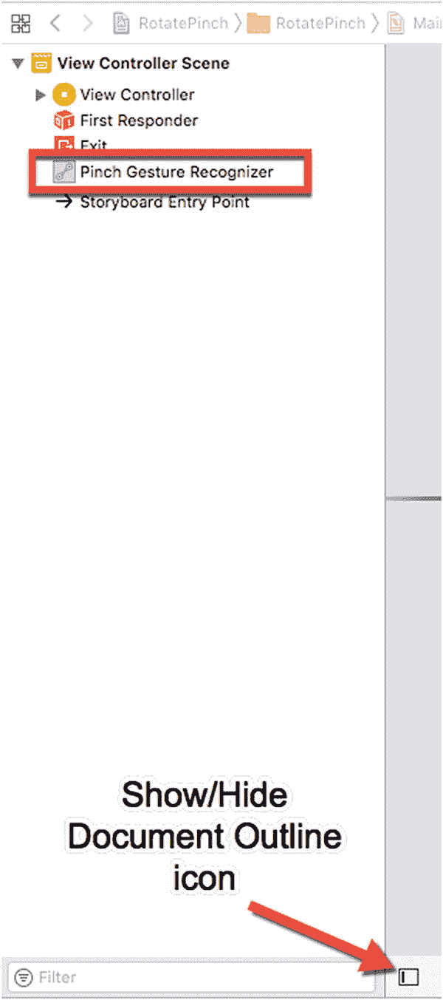
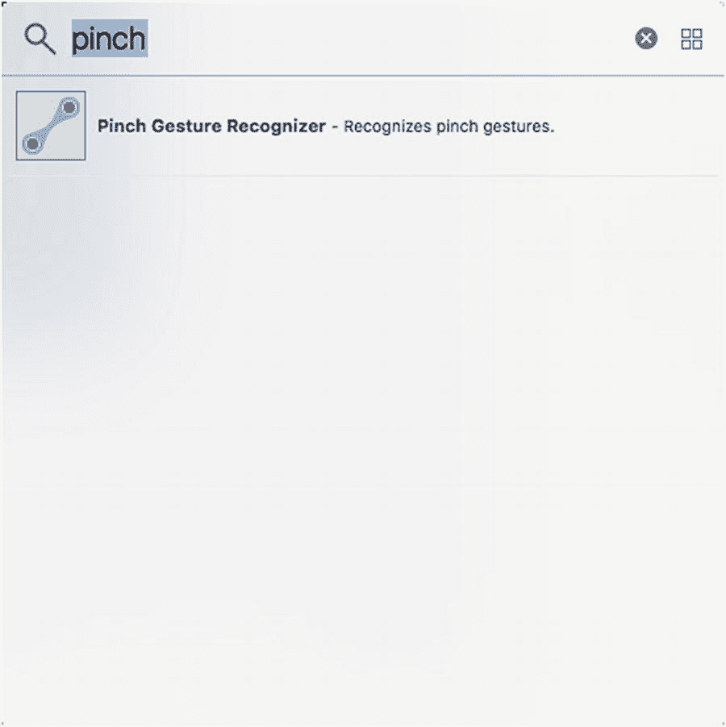
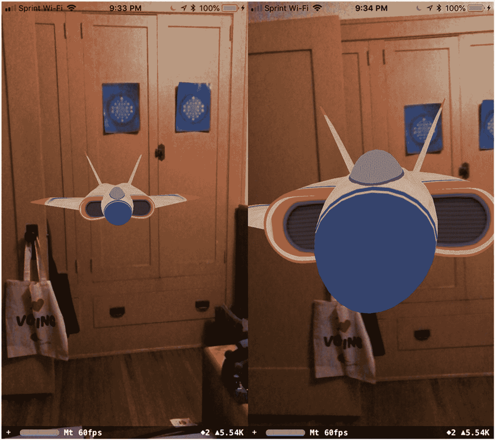
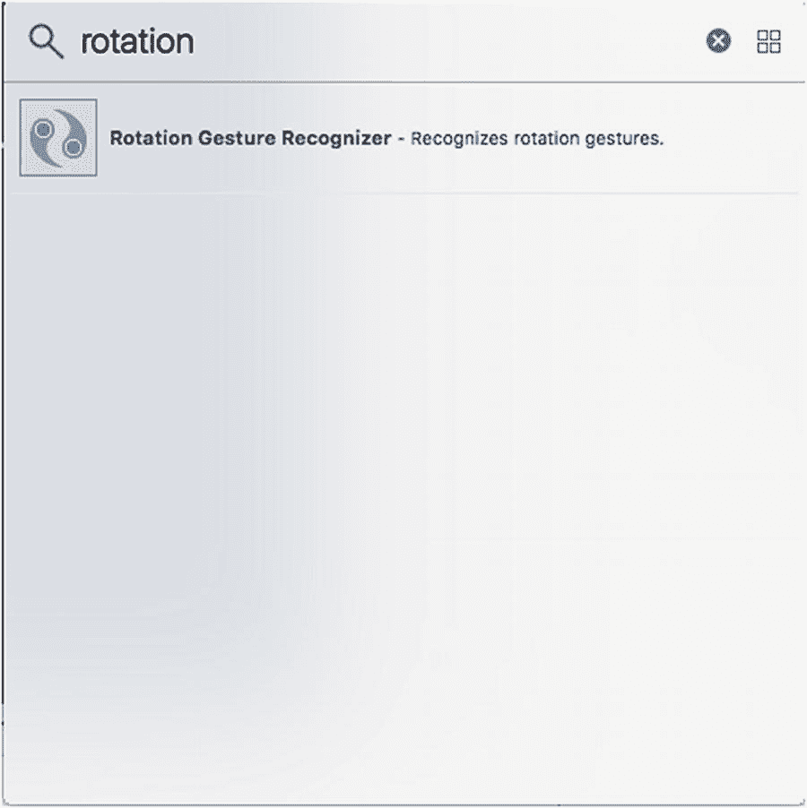
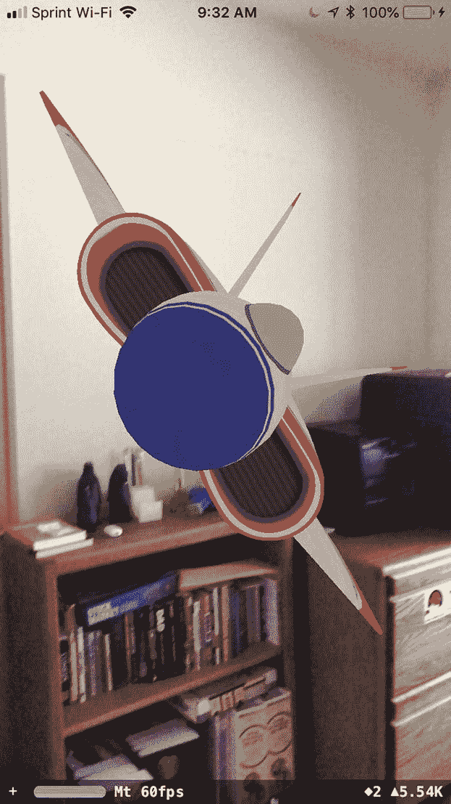
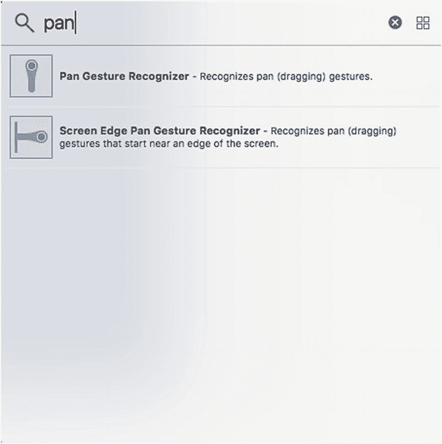

# 10. 与增强现实交互

触摸手势让用户能够仅通过手指动作（如点击、轻扫、旋转和捏合）来控制增强现实应用。一旦你为增强现实应用添加了触摸手势，下一步就是利用这些触摸手势来操控显示在增强现实视图中的虚拟对象。

在上一章中，我们学习了如何识别虚拟对象上发生的简单触摸手势，如点击、长按或轻扫。在本章中，我们将学习如何使用捏合、旋转和拖拽触摸手势来缩放、旋转和移动虚拟对象。

对于本章的示例，我们将通过对象库创建不同的手势识别器。让我们按照以下步骤创建一个新的 Xcode 项目：

1.  启动 Xcode。（确保你使用的是 Xcode 10 或更高版本。）
2.  选择 `File` ➤ `New` ➤ `Project`。Xcode 会要求你选择一个模板。
3.  点击 `iOS` 类别。
4.  点击 `Augmented Reality App` 图标并点击 `Next` 按钮。Xcode 会要求输入产品名称、组织名称、组织标识符和内容技术。
5.  点击 `Product Name` 文本框，为你的项目输入一个描述性名称，例如 `RotatePinch`。（具体名称无关紧要。）
6.  确保 `Content Technology` 弹出菜单显示 `SceneKit`。
7.  点击 `Next` 按钮。Xcode 会询问你想将项目存储在何处。
8.  选择一个文件夹并点击 `Create` 按钮。Xcode 会创建一个 iOS 项目。

这将创建一个简单的增强现实应用，显示一个卡通飞机。既然我们已经自动获得了显示的飞机模型，让我们从学习使用捏合手势在增强现实视图中缩放或调整飞机虚拟对象的大小开始。

捏合手势包括将两个指尖放在屏幕上，然后以捏合动作将它们分开或合拢。要在我们的应用中放置一个捏合手势识别器，请按照以下步骤操作：

1.  点击 `Assistant Editor` 图标或选择 `View` ➤ `Assistant Editor` ➤ `Show Assistant Editor`，以并排显示 `Main.storyboard` 和 `ViewController.swift` 文件。
2.  将鼠标指针移动到文档大纲中的 `Pinch Gesture Recognizer` 上，按住 `Control` 键，然后 Ctrl-拖拽到 `ViewController.swift` 文件底部最后一个大括号的上方。
3.  松开 `Control` 键和鼠标左键。会出现一个弹出菜单。
4.  确保 `Connection` 弹出菜单显示 `Action`。
5.  点击 `Name` 文本框，输入 `pinchGesture`。
6.  点击 `Type` 弹出菜单，选择 `UIPinchGestureRecognizer`。然后点击 `Connect` 按钮。Xcode 会创建一个 `IBAction` 方法，如下所示：

```
@IBAction func pinchGesture(_ sender: UIPinchGestureRecognizer) {
}
```

7.  按如下方式编辑这个 `IBAction` 方法 `pinchGesture`：

```
@IBAction func pinchGesture(_ sender: UIPinchGestureRecognizer) {
    print("Pinch gesture")
}
```

8.  通过 USB 线缆将 iOS 设备连接到你的 Macintosh。
9.  点击 `Run` 按钮或选择 `Product` ➤ `Run`。首次运行此应用时，它会请求访问摄像头的权限，请授予权限。
10. 将两个指尖放在屏幕上并进行捏合或张开操作。Xcode 调试区域应显示 `Pinch Gesture`，让你知道它已成功检测到捏合手势。
11. 点击 `Stop` 按钮或选择 `Product` ➤ `Stop`。



**图 10-2**

文档大纲显示你放置在用户界面上的任何手势识别器。

1.  从对象库窗口中拖拽 `Pinch Gesture Recognizer` 并放到用户界面上的 `ARSCNView` 上。尽管你将捏合手势识别器拖放到了用户界面上，但除了在文档大纲中（如图 10-2 所示），你在其他地方都看不到它的任何迹象。如果文档大纲不可见，点击 `Show Document Outline` 图标或选择 `Editor` ➤ `Show Document Outline`。



**图 10-1**

在对象库窗口中查找捏合手势识别器。

1.  在导航器窗格中点击 `Main.storyboard` 文件。
2.  点击 `Object Library` 图标以显示对象库窗口。
3.  在对象库中输入 `pinch`。对象库会显示捏合手势识别器，如图 10-1 所示。


## 使用捏合触摸手势进行缩放

捏合手势是一种常见的触摸手势，用于放大或缩小屏幕上显示的图像，例如在查看数码照片时。同样，这一捏合手势也可用于缩放增强现实视图中出现的虚拟平面。

触摸手势包含三种状态：
*   `.began` — 当应用首次检测到特定触摸手势时发生
*   `.changed` — 当触摸手势仍在进行时发生
*   `.ended` — 当应用检测到触摸手势已停止时发生

对于捏合手势，我们只关心它何时正在改变，因为随着用户向内或向外捏合，我们希望按比例缩放增强现实视图中虚拟平面的大小。像这样编辑 `pinchGesture` 函数：

```
@IBAction func pinchGesture(_ sender: UIPinchGestureRecognizer) {
    if sender.state == .changed {
        print("Pinch gesture")
    }
}
```

如果你运行此代码并在屏幕上进行捏合操作，应该仍然能在 Xcode 的调试区域看到“Pinch gesture”出现。这验证了应用仍然识别捏合手势。

我们只希望当用户在虚拟平面上直接捏合（而不是在增强现实视图的其他任何部分）时，捏合手势才调整虚拟平面的大小。为了检测用户在屏幕的哪个部分进行了捏合，我们首先需要像这样获取整个增强现实视图：

```
let areaPinched = sender.view as? SCNView
```

现在我们需要获取用户在屏幕上捏合的具体位置：

```
let location = sender.location(in: areaPinched)
```

最后，我们需要使用 `hitTest` 方法来确定用户是否触摸到了虚拟平面：

```
let hitTestResults = sceneView.hitTest(location, options: nil)
if let hitTest = hitTestResults.first {
}
```

如果用户触摸了增强现实视图中的第一个节点（该平面是唯一的节点），那么我们可以用一个任意的名称来标识这个 `hitTest` 节点，例如：

```
if let hitTest = hitTestResults.first {
    let plane = hitTest.node
}
```

现在，根据用户移动捏合手势的距离，我们可以将此值乘以虚拟平面的当前缩放比例。如果用户向外捏合（两指分开），缩放比例会变大，虚拟平面应该增大尺寸。如果用户向内捏合（两指并拢），缩放比例会变小，虚拟平面应该减小尺寸。以下三行代码测量了虚拟平面在 x、y 和 z 方向上应如何改变尺寸：

```
let scaleX = Float(sender.scale) * plane.scale.x
let scaleY = Float(sender.scale) * plane.scale.y
let scaleZ = Float(sender.scale) * plane.scale.z
```

一旦我们知道虚拟平面在 x、y 和 z 方向上的缩放量，就可以将这些值应用到虚拟平面本身，如下所示：

```
plane.scale = SCNVector3(scaleX, scaleY, scaleZ)
```

最后，我们需要将虚拟平面的新尺寸重置为缩放比例为 1：

```
sender.scale = 1
```

完整的 `pinchGesture` IBAction 方法应如下所示：

```
@IBAction func pinchGesture(_ sender: UIPinchGestureRecognizer) {
    if sender.state == .changed {
        let areaPinched = sender.view as? SCNView
        let location = sender.location(in: areaPinched)
        let hitTestResults = sceneView.hitTest(location, options: nil)
        if let hitTest = hitTestResults.first {
            let plane = hitTest.node
            let scaleX = Float(sender.scale) * plane.scale.x
            let scaleY = Float(sender.scale) * plane.scale.y
            let scaleZ = Float(sender.scale) * plane.scale.z
            plane.scale = SCNVector3(scaleX, scaleY, scaleZ)
            sender.scale = 1
        }
    }
}
```

通过连接的 iOS 设备运行此应用，并直接在虚拟平面上进行捏合（不要在虚拟平面周围的区域）。你应该能够根据捏合的方向将虚拟平面缩放得更大或更小。



图 10-3 捏合手势使虚拟平面放大或缩小

## 使用旋转触摸手势进行旋转

旋转手势也使用两根手指，很像捏合手势。最大的区别在于，捏合手势涉及将两根手指指尖移近或移远，而旋转触摸手势则是将两根手指指尖放在屏幕上并顺时针或逆时针旋转，同时保持两指指尖之间的距离不变。

要在我们的应用中放置旋转手势识别器，请按照以下步骤操作：
1.  从对象库窗口中拖动 Rotation Gesture Recognizer（旋转手势识别器），并将其放到用户界面上的 `ARSCNView` 上。尽管你将 Rotation Gesture Recognizer 拖放到了用户界面上，但除了在文档大纲中，你在其他地方看不到它的任何痕迹。
2.  点击 Assistant Editor 图标或选择 View（视图） ➤ Assistant Editor（助理编辑器） ➤ Show Assistant Editor（显示助理编辑器）以并排显示 `Main.storyboard` 和 `ViewController.swift` 文件。
3.  将鼠标指针移到文档大纲中的 Rotation Gesture Recognizer 上，按住 Control 键，然后按住 Control 键并拖动到 `ViewController.swift` 文件底部最后一个花括号的上方。
4.  释放 Control 键和鼠标左键。会出现一个弹出菜单。
5.  确保 Connection（连接）弹出菜单显示为 Action（动作）。
6.  点击 Name（名称）文本字段，输入 `rotationGesture`。
7.  点击 Type（类型）弹出菜单，选择 `UIRotationGestureRecognizer`。然后点击 Connect（连接）按钮。Xcode 将创建一个如下所示的 IBAction 方法：
    ```
    @IBAction func rotationGesture(_ sender: UIRotationGestureRecognizer) {
    }
    ```
8.  按如下方式编辑这个 IBAction 方法 `rotationGesture`：
    ```
    @IBAction func rotationGesture(_ sender: UIRotationGestureRecognizer) {
        print("Rotation gesture")
    }
    ```
9.  通过 USB 数据线将 iOS 设备连接到你的 Macintosh。
10. 点击 Run（运行）按钮或选择 Product（产品）➤ Run（运行）。
11. 将两根手指指尖放在屏幕上，并顺时针或逆时针旋转。Xcode 调试区域应显示“Rotation Gesture”，让你知道它成功检测到了旋转手势。
12. 点击 Stop（停止）按钮或选择 Product（产品）➤ Stop（停止）。



图 10-4 在对象库窗口中查找旋转手势识别器

对于旋转手势，我们需要识别旋转实际何时发生以及旋转最终何时停止。当旋转手势正在进行时，我们需要旋转虚拟平面。一旦旋转结束，我们需要将旋转后的角度存储为虚拟平面的当前角度。

首先，我们需要在 `ARSCNView` 的 IBOutlet 下方创建两个变量，如下所示：

```
var newAngleZ : Float = 0.0
var currentAngleZ : Float = 0.0
```

在这个例子中，我们将围绕虚拟平面的 z 轴进行旋转，因此 `currentAngleZ` 存储虚拟平面的当前角度。然后，我们将基于旋转手势计算一个新角度，并将这个新角度存储在 `newAngleZ` 变量中。

一旦这两个变量可用，我们就可以编写检测旋转何时正在发生（`.changed`）以及旋转何时已停止（`.ended`）的代码：

```
@IBAction func rotationGesture(_ sender: UIRotationGestureRecognizer) {
    if sender.state == .changed {
    } else if sender.state == .ended {
        currentAngleZ = newAngleZ
    }
}
```

一旦旋转手势结束，我们希望将新的旋转角度（`newAngleZ`）存储到 `currentAngleZ` 变量中。


## 旋转虚拟平面

一旦检测到旋转手势，我们需要确认该手势是否发生在虚拟平面上。为此，我们需要获取被触摸的视图、用户指尖的位置，并使用 `hitTest` 方法来判断是否触摸到了增强现实视图中的任何虚拟对象：

```
let areaTouched = sender.view as? SCNView
let location = sender.location(in: areaTouched)
let hitTestResults = sceneView.hitTest(location, options: nil)
```

接下来，我们需要检查旋转手势是否发生在增强现实视图中的第一个（且唯一的）虚拟对象上：

```
if let hitTest = hitTestResults.first {
}
```

然后，我们将创建一个名为 `plane` 的常量来代表用户触摸的节点（即虚拟平面），并将手势的旋转角度存储在 `newAngleZ` 变量中。

```
let plane = hitTest.node
newAngleZ = Float(-sender.rotation)
```

负号对于协调屏幕上的旋转手势与增强现实视图中虚拟平面的旋转是必需的。如果没有这个负号，虚拟平面将朝与旋转手势相反的方向旋转。

我们将把这个新的旋转角度加到虚拟平面的当前角度上，然后将这个新角度赋值以围绕 z 轴旋转虚拟平面。为此，我们需要使用 `eulerAngles` 属性，该属性定义了虚拟对象围绕 x、y 和 z 轴的旋转。由于我们只围绕 z 轴旋转虚拟平面，我们只需要将新的旋转角度赋值给 z 轴，如下所示：

```
newAngleZ += currentAngleZ
plane.eulerAngles.z = newAngleZ
```

完整的旋转手势 `IBAction` 方法应如下所示：

```
@IBAction func rotationGesture(_ sender: UIRotationGestureRecognizer) {
    if sender.state == .changed {
        let areaTouched = sender.view as? SCNView
        let location = sender.location(in: areaTouched)
        let hitTestResults = sceneView.hitTest(location, options: nil)
        if let hitTest = hitTestResults.first {
            let plane = hitTest.node
            newAngleZ = Float(-sender.rotation)
            newAngleZ += currentAngleZ
            plane.eulerAngles.z = newAngleZ
        }
    } else if sender.state == .ended {
        currentAngleZ = newAngleZ
    }
}
```

请记住，你还必须通过在 `ViewController.swift` 类的顶部附近声明两个 `Float` 类型的变量（`newAngleZ` 和 `currentAngleZ`）来添加它们，如下所示：

```
var newAngleZ : Float = 0.0
var currentAngleZ : Float = 0.0
```

如果你运行此应用，可以将两个手指放在虚拟平面上并进行旋转。然后虚拟平面将朝相同方向旋转，如图 [10-5] 所示。



图 10-5
使用旋转手势旋转虚拟平面

## 使用平移手势移动虚拟对象

平移手势发生在用户用一个手指在屏幕上沿任意方向滑动时。你可以为平移手势定义最少和最多的手指数量，例如至少两个但不超过四个。默认情况下，检测平移手势的最少手指数量是 1。

Xcode 提供两种类型的平移手势识别器。我们将使用的那个简称为“平移手势识别器”，它检测屏幕上任意位置的手指移动。另一个平移手势识别器称为“屏幕边缘平移手势识别器”。如果你曾经从 iPhone 屏幕底部向上滑动以显示诸如将 iPhone 变为手电筒之类的选项，那么你就使用了屏幕边缘平移手势识别器，它检测从屏幕边缘开始的平移。

要在我们的应用中放置一个常规的平移手势识别器，请按照以下步骤操作：

1.  从对象库窗口拖动“平移手势识别器”并将其放到用户界面上的 `ARSCNView` 上。虽然你将平移手势识别器拖放到了用户界面上，但除了在文档大纲中，你在任何地方都看不到它的任何迹象。
2.  单击“助理编辑器”图标或选择“查看”➤“助理编辑器”➤“显示助理编辑器”，以并排显示 `Main.storyboard` 和 `ViewController.swift` 文件。
3.  将鼠标指针移动到文档大纲中的“平移手势识别器”上，按住 Control 键，并按住 Control 键拖动到 `ViewController.swift` 文件底部最后一个大括号上方。
4.  释放 Control 键和鼠标左键。会出现一个弹出菜单。
5.  确保“连接”弹出菜单显示“操作”。
6.  在“名称”文本字段中单击并输入 `panGesture`。
7.  单击“类型”弹出菜单并选择 `UIPanGestureRecognizer`。然后单击“连接”按钮。Xcode 将创建一个 `IBAction` 方法，如下所示：
    ```
    @IBAction func panGesture(_ sender: UIPanGestureRecognizer) {
    }
    ```
8.  按如下方式编辑这个 `IBAction` 方法 `panGesture`：
    ```
    @IBAction func panGesture(_ sender: UIPanGestureRecognizer) {
        print ("Pan gesture")
    }
    ```
9.  通过 USB 电缆将 iOS 设备连接到你的 Macintosh。
10. 单击“运行”按钮或选择“产品”➤“运行”。
11. 将一个手指放在屏幕上并在屏幕上滑动。Xcode 调试区域应显示“Pan Gesture”，让你知道它已成功检测到平移手势。
12. 单击“停止”按钮或选择“产品”➤“停止”。



图 10-6
在对象库窗口中查找平移手势识别器

1.  在导航窗格中单击 `Main.storyboard` 文件。
2.  单击“对象库”图标以显示对象库窗口。
3.  在对象库中输入 `pan`。对象库会显示平移手势识别器，如图 [10-6] 所示。

一旦我们确认平移手势有效，第一步是识别用户是否在增强现实视图中平移虚拟平面。我们需要获取用户平移经过的视图位置，并使用 `hitTest` 方法来验证用户的指尖是否在虚拟对象上：

```
let areaPanned = sender.view as? SCNView
let location = sender.location(in: areaPanned)
let hitTestResults = areaPanned?.hitTest(location, options: nil)
```

接下来，我们必须确定用户是否触摸了第一个节点（虚拟平面）：

```
if let hitTest = hitTestResults?.first {
}
```


