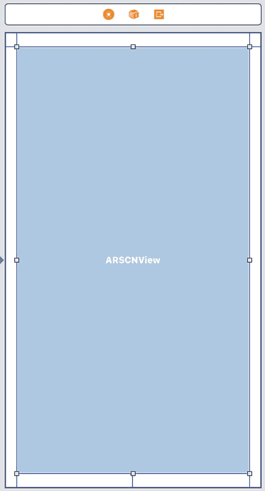
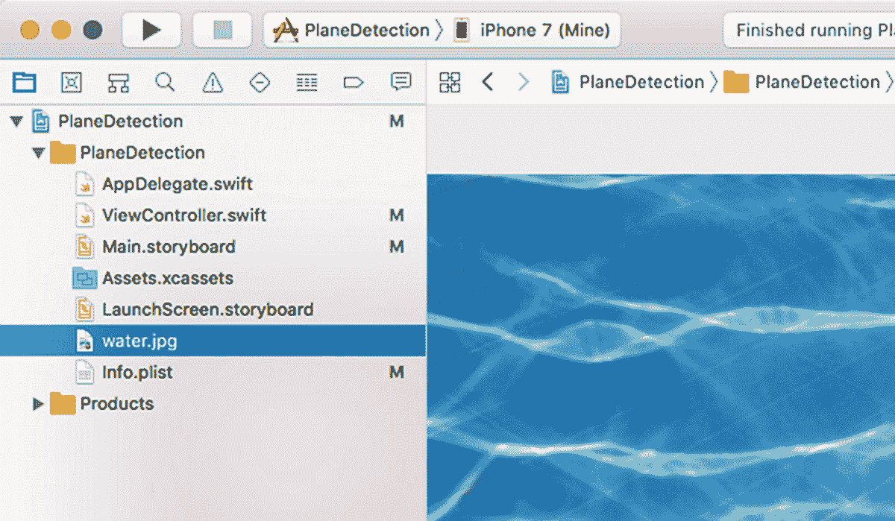
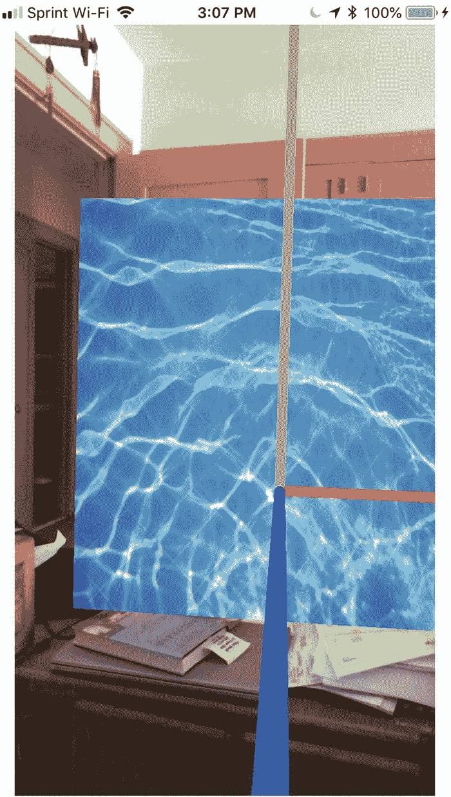
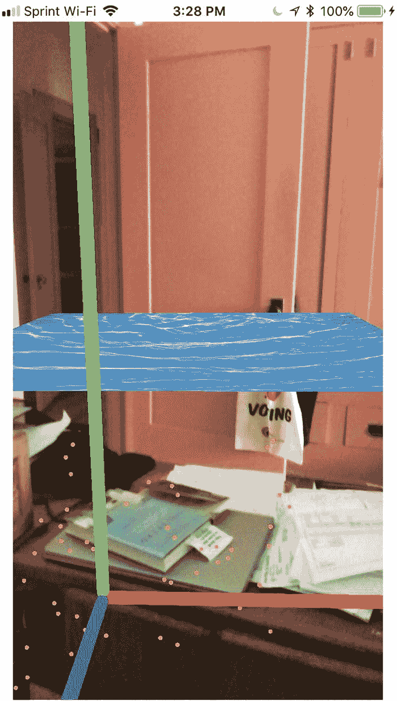
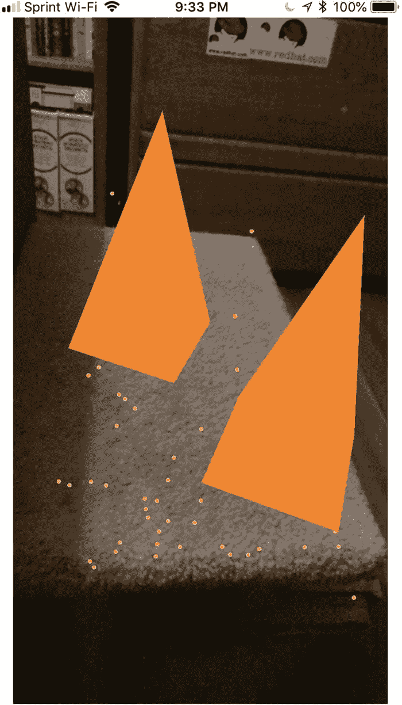
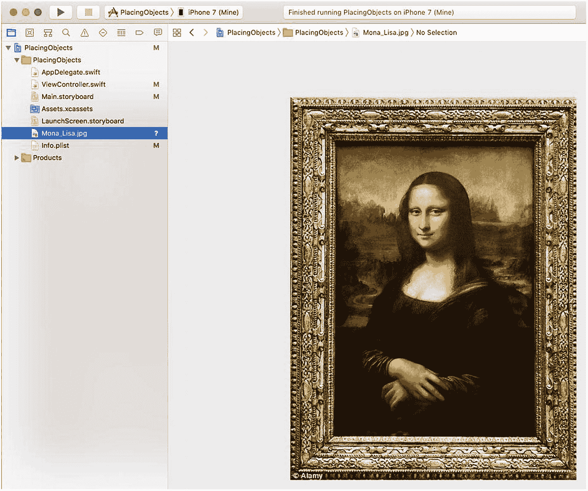
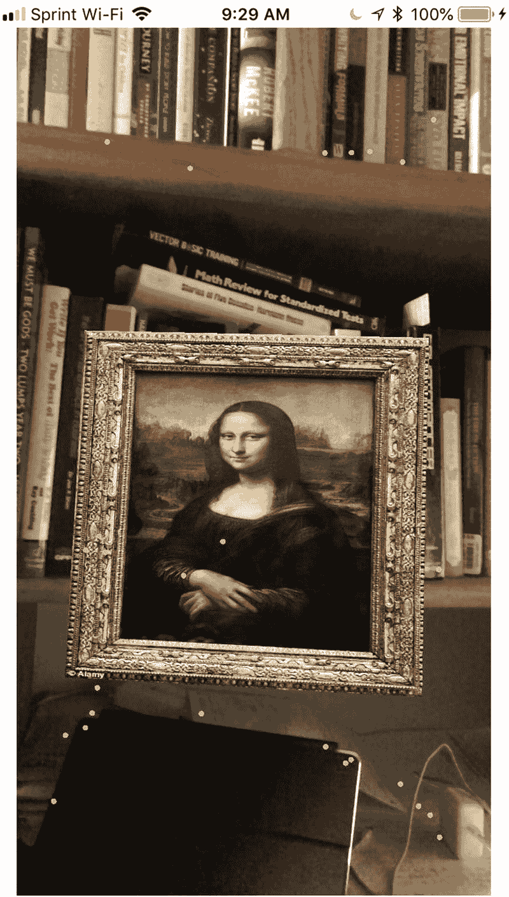

# 11. 平面检测

将虚拟对象悬空放置是可行的，但增强现实在与现实世界互动时效果最佳。增强现实与现实世界互动的最基本方式之一就是检测水平或垂直平面。当 ARKit 能检测到一个平坦表面时，它就可以随后放置一个虚拟对象，使其看起来像是放置在那个真实的平坦表面上，例如桌子或地板。

每当 ARKit 检测到一个平面时，它就会在该增强现实视图中放置一个锚点。每个平面对应一个锚点，其中包含关于该平面的信息：

*   方向
*   位置
*   大小

当你移动 iOS 设备上的摄像头时，ARKit 会不断更新关于平面的信息。通常，这涉及到认识到一个平面可能比最初认为的要大。例如，当你首次将 iOS 设备的摄像头对准地板时，ARKit 只能识别摄像头看到的那部分地板。当你移动 iOS 设备的摄像头时，ARKit 可以检测到地板的其它部分，迫使其更新关于该平面实际可能有多大的信息。

在本章中，让我们按照以下步骤创建一个新的 Xcode 项目：

1.  启动 Xcode。（请确保你使用的是 Xcode 10 或更高版本。）
2.  选择 `File` ➤ `New` ➤ `Project`。Xcode 会要求你选择一个模板。
3.  点击 `iOS` 类别。
4.  点击 `Single View App` 图标，然后点击 `Next` 按钮。Xcode 会要求输入产品名称、组织名称、组织标识符和内容技术。
5.  点击 `Product Name` 文本字段，并为你的项目输入一个描述性名称，例如 `PlaneDetection`。（确切的名称无关紧要。）
6.  点击 `Next` 按钮。Xcode 会询问你想将项目存储在哪里。
7.  选择一个文件夹并点击 `Create` 按钮。Xcode 会创建一个 iOS 项目。

现在，按照以下步骤修改 `Info.plist` 文件以允许访问摄像头并使用 ARKit：

1.  点击导航器窗格中的 `Info.plist` 文件。Xcode 会显示一个键、类型和值的列表。
2.  点击展开三角形以展开 `Required Device Capabilities` 类别，显示 `Item 0`。
3.  将鼠标指针悬停在 `Item 0` 上，会显示一个加号（`+`）图标。
4.  点击这个加号（`+`）图标，显示一个空白的 `Item 1`。
5.  在 `Item 1` 行的 `Value` 类别下输入 `arkit`。
6.  将鼠标指针悬停在最后一行上，会显示一个加号（`+`）图标。
7.  点击加号（`+`）图标以创建一个新行。会出现一个弹出菜单。
8.  选择 `Privacy - Camera Usage Description`。
9.  在 `Privacy - Camera Usage Description` 行的 `Value` 类别下输入 `AR needs to use the camera`。

现在，是时候按照以下步骤修改 `ViewController.swift` 文件以使用 ARKit 和 SceneKit 了：

1.  点击导航器窗格中的 `ViewController.swift` 文件。
2.  编辑 `ViewController.swift` 文件，使其看起来像这样：

```
import UIKit
import SceneKit
import ARKit

class ViewController: UIViewController, ARSCNViewDelegate {
    let configuration = ARWorldTrackingConfiguration()
    override func viewDidLoad() {
        super.viewDidLoad()
        // Do any additional setup after loading the view, typically from a nib.
    }
}
```

为了在我们的应用中查看增强现实，添加一个 ARKit SceneKit 视图（`ARSCNView`），使用户界面看起来类似于图 11-1。



图 11-1 用户界面包含一个单独的 ARSCNView

设计好用户界面后，需要添加约束。要添加约束，请在 `Editor` ➤ `Resolve Auto Layout Issues` ➤ `Reset to Suggested Constraints` 菜单的底部（位于 `All Views in Container` 类别下）选择。

下一步是将用户界面项连接到 `ViewController.swift` 文件中的 Swift 代码。为此，请按照以下步骤操作：

1.  点击导航器窗格中的 `Main.storyboard` 文件。


## 连接视图并配置平面检测

2.  点击助手编辑器图标，或选择“视图”➤“助手编辑器”➤“显示助手编辑器”，以并排显示 `Main.storyboard` 和 `ViewController.swift` 文件。

3.  将鼠标指针悬停在 `ARSCNView` 上，按住 Control 键，并按住 Ctrl 拖曳到 `class ViewController` 行下方。

4.  松开 Control 键和鼠标左键。将出现一个弹出菜单。

5.  在“名称”文本框中输入 `sceneView`，然后点击“连接”按钮。Xcode 将创建一个 IBOutlet，如下所示：

    ```
    @IBOutlet var sceneView: ARSCNView!
    ```

## 配置视图和平面检测

6.  编辑 `viewDidLoad` 函数，使其如下所示：

    ```
    override func viewDidLoad() {
        super.viewDidLoad()
        // 从 nib 加载视图后进行任何其他设置。
        sceneView.debugOptions = [ARSCNDebugOptions.showWorldOrigin, ARSCNDebugOptions.showFeaturePoints]
        sceneView.delegate = self
        configuration.planeDetection = .horizontal
        sceneView.session.run(configuration)
    }
    ```

7.  编辑 `viewWillAppear` 函数，使其如下所示：

    ```
    override func viewWillAppear(_ animated: Bool) {
        super.viewWillAppear(animated)
        sceneView.session.run(configuration)
    }
    ```

请注意，要检测水平平面，我们只需要一行代码：

```
configuration.planeDetection = .horizontal
```

检测水平平面需要 ARKit 在一个平坦的水平表面上识别足够的特征点（那些微小的黄点）。为了提高 ARKit 检测到水平平面的几率，请将 iOS 设备的摄像头对准具有丰富纹理或颜色变化的平坦表面，例如床、地毯或桌子。相比之下，纯白色的地板将更难识别，因为 ARKit 可识别的细节要少得多。

## 实现渲染器委托方法

为了检测 ARKit 是否识别出水平平面，我们需要一个 `didAdd renderer` 函数。该函数在 ARKit 每次识别出一个水平平面并将其识别为一个名为 `ARPlaneAnchor` 的平面锚定时运行，该锚定定义了平坦表面的位置和方向。在您的 `ViewController.swift` 文件中添加以下 `didAdd renderer` 函数：

```
func renderer(_ renderer: SCNSceneRenderer, didAdd node: SCNNode, for anchor: ARAnchor) {
    guard anchor is ARPlaneAnchor else { return }
    print ("plane detected")
}
```

ARKit 首次识别一个水平平面时，它会假定该水平平面仅为其通过 iOS 设备摄像头看到的大小。当您移动 iOS 设备的摄像头时，ARKit 会发现该水平平面的其他点。当这种情况发生时，它会更新其平面锚点信息，以存储一个更大尺寸的水平平面。

每次 ARKit 通过认识到水平平面可能更大而更新其 `ARPlaneAnchor` 信息时，它都会运行一个 `didUpdate renderer` 函数。在 `ViewController.swift` 文件中添加以下 `didUpdate renderer` 函数：

```
func renderer(_ renderer: SCNSceneRenderer, didUpdate node: SCNNode, for anchor: ARAnchor) {
    guard anchor is ARPlaneAnchor else { return }
    print("updating plane anchor")
}
```

在这两个 `renderer` 函数中，都有一个初始的 `guard` 语句，用于检查 `renderer` 函数是否识别到水平平面 (`ARPlaneAnchor`)。如果没有，则 `renderer` 函数退出。如果 `renderer` 函数确实识别到一个水平平面，那么每个 `renderer` 函数都会打印一条语句（`"plane detected"` 或 `"updating plane anchor"`）。

## 完整的 ViewController.swift 文件

完整的 `ViewController.swift` 文件应如下所示：

```
import UIKit
import SceneKit
import ARKit
class ViewController: UIViewController, ARSCNViewDelegate {
    @IBOutlet var sceneView: ARSCNView!
    let configuration = ARWorldTrackingConfiguration()
    override func viewDidLoad() {
        super.viewDidLoad()
        // 从 nib 加载视图后进行任何其他设置。
        sceneView.debugOptions = [ARSCNDebugOptions.showWorldOrigin, ARSCNDebugOptions.showFeaturePoints]
        sceneView.delegate = self
        configuration.planeDetection = .horizontal
        sceneView.session.run(configuration)
    }
    func renderer(_ renderer: SCNSceneRenderer, didAdd node: SCNNode, for anchor: ARAnchor) {
        guard anchor is ARPlaneAnchor else { return }
        print ("plane detected")
    }
    func renderer(_ renderer: SCNSceneRenderer, didUpdate node: SCNNode, for anchor: ARAnchor) {
        guard anchor is ARPlaneAnchor else { return }
        print("updating plane anchor")
    }
}
```

## 测试项目

要测试此项目，请按照以下步骤操作：

1.  通过 USB 数据线将 iOS 设备连接到 Macintosh。
2.  点击“运行”按钮或选择“产品”➤“运行”。首次运行此应用程序时，它会请求访问摄像头的权限，请授予其权限。
3.  将 iOS 设备的摄像头对准水平平面，例如椅子座面或地板。ARKit 首次识别出水平平面时，Xcode 调试区域会显示消息“plane detected”。
4.  移动 iOS 设备以捕捉更多水平平面。每次 ARKit 识别出水平平面的新部分时，Xcode 调试区域会显示消息“updating plane anchor”。
5.  点击“停止”按钮或选择“产品”➤“停止”。


## 在平面上显示图像

一旦能让 ARKit 识别水平面，我们就可以在该水平面上放置图像。首先，你需要获取一张图片，比如在你常用的搜索引擎中搜索“纹理图像 公共领域”。现在，你可以下载任何想要的纹理图像，例如砖砌人行道、木地板或波光粼粼的水面。

要将 .png 或 .jpg 图像添加到 Xcode 项目中，只需将该图像拖放到 Xcode 项目的导航器面板中，如图 11-2 所示。



图 11-2 将图像拖放到导航器面板中

为平面添加纹理图像后，下一步就是创建一个带纹理的平面，并将其添加到 `didAdd renderer` 函数内的 `sceneView` 根节点中，如下所示：

```
let planeNode = displayTexture()
sceneView.scene.rootNode.addChildNode(planeNode)
```

### 创建平面

要创建平面，我们需要创建一个名为 `displayTexture` 的函数，该函数会创建一个 `SCNNode`，将该节点定义为宽度和高度均为 0.5 米的 `SCNPlane`，并使其出现在位置 (0, 0, -0.5) 处。最重要的是，`SCNPlane` 需要使用你拖入导航器面板的纹理图像，例如一个名为 `water.jpg` 的图像（请将此名称更改为你拖入 Xcode 导航器面板的图像名称）。`displayTexture` 函数应如下所示：

```
func displayTexture() -> SCNNode {
    let planeNode = SCNNode()
    planeNode.geometry = SCNPlane(width: 0.5, height: 0.5)
    planeNode.geometry?.firstMaterial?.diffuse.contents = UIImage(named: "water.jpg")
    planeNode.position = SCNVector3(0, 0, -0.5)
    return planeNode
}
```

如果运行此代码，它将创建一个平面，将 `water.jpg` 显示为一个垂直平面，如图 11-3 所示。



图 11-3 在平面上显示图像

### 使平面变为双面且水平

除了将平面沿 x 轴旋转 90 度使其平放外，另一个问题是，如果你看向平面后方，图像只出现在一侧。为了使图像出现在平面的两面，我们需要将平面定义为双面，如下所示：

```
planeNode.geometry?.firstMaterial?.isDoubleSided = true
```

然后，我们需要将平面绕 x 轴旋转 90 度。请记住，Xcode 使用弧度度量所有角度，因此我们首先需要将 90 度转换为弧度，如下所示：

```
let ninetyDegrees = GLKMathDegreesToRadians(90)
```

然后，我们可以通过定义其 `eulerAngles` 位置来将平面绕其 x 轴旋转，如下所示：

```
planeNode.eulerAngles = SCNVector3(ninetyDegrees, 0, 0)
```

整个 `displayTexture` 函数应如下所示：

```
func displayTexture() -> SCNNode {
    let planeNode = SCNNode()
    planeNode.geometry = SCNPlane(width: 0.5, height: 0.5)
    planeNode.geometry?.firstMaterial?.diffuse.contents = UIImage(named: "water.jpg")
    planeNode.position = SCNVector3(0, 0, -0.5)
    let ninetyDegrees = GLKMathDegreesToRadians(90)
    planeNode.eulerAngles = SCNVector3(ninetyDegrees, 0, 0)
    planeNode.geometry?.firstMaterial?.isDoubleSided = true
    return planeNode
}
```

整个 `ViewController.swift` 文件应如下所示，以显示带图像的水平平面：

```
import UIKit
import SceneKit
import ARKit

class ViewController: UIViewController, ARSCNViewDelegate {
    @IBOutlet var sceneView: ARSCNView!
    let configuration = ARWorldTrackingConfiguration()

    override func viewDidLoad() {
        super.viewDidLoad()
        sceneView.debugOptions = [ARSCNDebugOptions.showWorldOrigin, ARSCNDebugOptions.showFeaturePoints]
        sceneView.delegate = self
        configuration.planeDetection = .horizontal
        sceneView.session.run(configuration)

        let planeNode = displayTexture()
        sceneView.scene.rootNode.addChildNode(planeNode)
    }

    func displayTexture() -> SCNNode {
        let planeNode = SCNNode()
        planeNode.geometry = SCNPlane(width: 0.5, height: 0.5)
        planeNode.geometry?.firstMaterial?.diffuse.contents = UIImage(named: "water.jpg")
        planeNode.position = SCNVector3(0, 0, -0.5)
        let ninetyDegrees = GLKMathDegreesToRadians(90)
        planeNode.eulerAngles = SCNVector3(ninetyDegrees, 0, 0)
        planeNode.geometry?.firstMaterial?.isDoubleSided = true
        return planeNode
    }

    func renderer(_ renderer: SCNSceneRenderer, didAdd node: SCNNode, for anchor: ARAnchor) {
        guard anchor is ARPlaneAnchor else { return }
        print ("plane detected")
    }

    func renderer(_ renderer: SCNSceneRenderer, didUpdate node: SCNNode, for anchor: ARAnchor) {
        guard anchor is ARPlaneAnchor else { return }
        print("updating plane anchor")
    }
}
```

如果运行此代码，你将看到一个水平平面，其顶部和底部都显示纹理图像，如图 11-4 所示。



图 11-4 水平显示的平面

### 将平面附加到检测到的表面

目前平面以任意大小和位置出现。我们希望的是让该平面出现在 ARKit 检测到水平面的位置，例如地板或桌面。

首先，从 `viewDidLoad` 函数中删除这两行：

```
let planeNode = displayTexture()
sceneView.scene.rootNode.addChildNode(planeNode)
```

现在，在 `didAdd renderer` 函数中，添加以下两行：

```
let planeNode = displayTexture(anchor: anchor as! ARPlaneAnchor)
node.addChildNode(planeNode)
```

整个 `didAdd renderer` 函数应如下所示：

```
func renderer(_ renderer: SCNSceneRenderer, didAdd node: SCNNode, for anchor: ARAnchor) {
    guard anchor is ARPlaneAnchor else { return }
    let planeNode = displayTexture(anchor: anchor as! ARPlaneAnchor)
    node.addChildNode(planeNode)
    print ("plane detected")
}
```

这个 `didAdd renderer` 函数现在的作用是，一旦检测到水平面，它就会将该水平面的大小和位置存储为 `ARPlaneAnchor`。因此，我们获取此大小和位置信息并将其传递给创建实际平面的 `displayTexture` 函数。

这意味着我们需要修改 `displayTexture` 函数，使其能够接受一个参数，如下所示：

```
func displayTexture(anchor: ARPlaneAnchor) -> SCNNode {
```

在 `displayTexture` 函数内部，我们需要修改平面的大小和位置，这两者都来自传入 `displayTexture` 函数的 `anchor` 参数。首先，我们需要根据锚点定义平面的大小。为此，我们需要将平面的尺寸从任意的固定值更改为锚点的大小，如下所示：

```
planeNode.geometry = SCNPlane(width: CGFloat(anchor.extent.x), height: CGFloat(anchor.extent.z))
```

接下来，我们需要根据锚点定义水平面的位置，如下所示：

```
planeNode.position = SCNVector3(anchor.center.x, anchor.center.y, anchor.center.z)
```

整个修改后的 `ViewController.swift` 文件现在应如下所示：


```swift
import UIKit
import SceneKit
import ARKit
class ViewController: UIViewController, ARSCNViewDelegate {
@IBOutlet var sceneView: ARSCNView!
let configuration = ARWorldTrackingConfiguration()
override func viewDidLoad() {
super.viewDidLoad()
// 视图加载后执行任何额外的设置，通常是从 nib 文件加载。
sceneView.debugOptions = [ARSCNDebugOptions.showWorldOrigin, ARSCNDebugOptions.showFeaturePoints]
sceneView.delegate = self
configuration.planeDetection = .horizontal
sceneView.session.run(configuration)
}
func displayTexture(anchor: ARPlaneAnchor) -> SCNNode {
let planeNode = SCNNode()
planeNode.geometry = SCNPlane(width: CGFloat(anchor.extent.x), height: CGFloat(anchor.extent.z))
planeNode.geometry?.firstMaterial?.diffuse.contents = UIImage(named: "water.jpg")
planeNode.position = SCNVector3(anchor.center.x, anchor.center.y, anchor.center.z)
let ninetyDegrees = GLKMathDegreesToRadians(90)
planeNode.eulerAngles = SCNVector3(ninetyDegrees, 0, 0)
planeNode.geometry?.firstMaterial?.isDoubleSided = true
return planeNode
}
func renderer(_ renderer: SCNSceneRenderer, didAdd node: SCNNode, for anchor: ARAnchor) {
guard anchor is ARPlaneAnchor else { return }
let planeNode = displayTexture(anchor: anchor as! ARPlaneAnchor)
node.addChildNode(planeNode)
print ("plane detected")
}
func renderer(_ renderer: SCNSceneRenderer, didUpdate node: SCNNode, for anchor: ARAnchor) {
guard anchor is ARPlaneAnchor else { return }
print("updating plane anchor")
}
}
```

如果你运行这段代码，你会注意到当应用识别出一个水平面时，它会在那个位置放置一个显示纹理图像的平面。然而，还有一个额外的问题。`didUpdate renderer`函数会不断扫描现实世界，并更新它所识别的水平面的`ARPlaneAnchor`。

这意味着我们需要在这个`didUpdate renderer`函数内部添加代码，以便当它识别出水平面更大时，会在该区域显示一个更大的虚拟平面。

`didUpdate renderer`函数每次在 ARKit 检测到水平面更大时都会运行。每次它都需要在添加更新的水平面之前移除当前显示的水平面。为此，我们使用`enumeratechildNodes`循环来不断移除旧的水平平面，如下所示：

```swift
node.enumerateChildNodes { (childNode, _) in
childNode.removeFromParentNode()
}
```

在移除了旧的水平平面之后，我们需要添加一个新的，所以整个`didUpdate renderer`函数应该如下所示：

```swift
func renderer(_ renderer: SCNSceneRenderer, didUpdate node: SCNNode, for anchor: ARAnchor) {
guard anchor is ARPlaneAnchor else { return }
node.enumerateChildNodes { (childNode, _) in
childNode.removeFromParentNode()
}
let planeNode = displayTexture(anchor: anchor as! ARPlaneAnchor)
node.addChildNode(planeNode)
print("updating plane anchor")
}
```

现在整个`ViewController.swift`文件应该如下所示：

```swift
import UIKit
import SceneKit
import ARKit
class ViewController: UIViewController, ARSCNViewDelegate {
@IBOutlet var sceneView: ARSCNView!
let configuration = ARWorldTrackingConfiguration()
override func viewDidLoad() {
super.viewDidLoad()
// 视图加载后执行任何额外的设置，通常是从 nib 文件加载。
sceneView.debugOptions = [ARSCNDebugOptions.showWorldOrigin, ARSCNDebugOptions.showFeaturePoints]
sceneView.delegate = self
configuration.planeDetection = .horizontal
sceneView.session.run(configuration)
}
func displayTexture(anchor: ARPlaneAnchor) -> SCNNode {
let planeNode = SCNNode()
planeNode.geometry = SCNPlane(width: CGFloat(anchor.extent.x), height: CGFloat(anchor.extent.z))
planeNode.geometry?.firstMaterial?.diffuse.contents = UIImage(named: "water.jpg")
planeNode.position = SCNVector3(anchor.center.x, anchor.center.y, anchor.center.z)
let ninetyDegrees = GLKMathDegreesToRadians(90)
planeNode.eulerAngles = SCNVector3(ninetyDegrees, 0, 0)
planeNode.geometry?.firstMaterial?.isDoubleSided = true
return planeNode
}
func renderer(_ renderer: SCNSceneRenderer, didAdd node: SCNNode, for anchor: ARAnchor) {
guard anchor is ARPlaneAnchor else { return }
let planeNode = displayTexture(anchor: anchor as! ARPlaneAnchor)
node.addChildNode(planeNode)
print ("plane detected")
}
func renderer(_ renderer: SCNSceneRenderer, didUpdate node: SCNNode, for anchor: ARAnchor) {
guard anchor is ARPlaneAnchor else { return }
node.enumerateChildNodes { (childNode, _) in
childNode.removeFromParentNode()
}
let planeNode = displayTexture(anchor: anchor as! ARPlaneAnchor)
node.addChildNode(planeNode)
print("updating plane anchor")
}
}
```

要测试此代码，请按照以下步骤操作：

1.  通过 USB 线缆将 iOS 设备连接到 Mac。
2.  点击运行按钮或选择 **Product** ➤ **Run**。第一次运行此应用时，它会请求访问摄像头的权限，请授予权限。
3.  将 iOS 设备的摄像头对准水平面，例如椅子座面或地板。当 ARKit 第一次识别出水平面时，Xcode 调试区会显示消息“plane detected”。这是 ARKit 第一次显示虚拟平面，该平面会显示你拖放到 Xcode 导航器窗格中的纹理图像。
4.  移动 iOS 设备以捕捉更多的水平面区域。每次 ARKit 识别出水平面的新部分时，Xcode 调试区会显示消息“updating plane anchor”。请注意，水平虚拟平面的尺寸会不断增大。
5.  点击停止按钮或选择 **Product** ➤ **Stop**。


## 在水平面上放置虚拟对象

用户与增强现实互动的一种方式是将虚拟对象放置在现实世界中识别的水平面上，例如地板或桌面。这首先需要检测水平面，然后将虚拟对象放置在该检测到的水平面上。

让我们按照以下步骤创建一个新的 Xcode 项目：

1. 启动 Xcode。（请确保您使用的是 Xcode 10 或更高版本。）
2. 选择 `文件` ➤ `新建` ➤ `项目`。Xcode 会要求您选择一个模板。
3. 点击 `iOS` 类别。
4. 点击 `单视图应用` 图标，然后点击 `下一步` 按钮。Xcode 会要求输入产品名称、组织名称、组织标识符和内容技术。
5. 在 `产品名称` 文本框中点击并为您项目输入一个描述性名称，例如 `PlacingObjects`。（具体名称并不重要。）
6. 点击 `下一步` 按钮。Xcode 会询问您希望将项目存储在哪里。
7. 选择一个文件夹并点击 `创建` 按钮。Xcode 会创建一个 iOS 项目。

## 修改 `Info.plist` 文件

现在按照以下步骤修改 `Info.plist` 文件以允许访问相机并使用 ARKit：

1. 在导航器面板中点击 `Info.plist` 文件。Xcode 会显示一个键、类型和值的列表。
2. 点击展开三角形展开 `必需设备功能` 类别以显示 `Item 0`。
3. 将鼠标指针悬停在 `Item 0` 上会显示一个加号 (`+`) 图标。
4. 点击这个加号 (`+`) 图标会显示一个空白的 `Item 1`。
5. 在 `Item 1` 行的 `Value` 类别下输入 `arkit`。
6. 将鼠标指针悬停在最后一行上会显示一个加号 (`+`) 图标。
7. 点击加号 (`+`) 图标创建一个新行。会出现一个弹出菜单。
8. 选择 `隐私 - 相机使用说明`。
9. 在 `隐私 - 相机使用说明` 行的 `Value` 类别下输入 `AR 需要使用相机`。

## 修改 `ViewController.swift` 文件

现在该修改 `ViewController.swift` 文件以使用 ARKit 和 SceneKit 了，请按照以下步骤操作：

1. 在导航器面板中点击 `ViewController.swift` 文件。
2. 编辑 `ViewController.swift` 文件，使其内容如下：

```
import UIKit
import SceneKit
import ARKit
class ViewController: UIViewController, ARSCNViewDelegate {
let configuration = ARWorldTrackingConfiguration()
override func viewDidLoad() {
super.viewDidLoad()
// Do any additional setup after loading the view, typically from a nib.
}
}
```

要在我们的应用中查看增强现实，添加一个 ARKit SceneKit 视图 (`ARSCNView`)，使其填满整个用户界面。

设计好用户界面后，需要添加约束。要添加约束，请选择 `编辑器` ➤ `解决自动布局问题` ➤ `重置为建议约束`，在菜单下半部分的 `容器中的所有视图` 类别下。

下一步是将用户界面项连接到 `ViewController.swift` 文件中的 Swift 代码。为此，请按照以下步骤操作：

1. 在导航器面板中点击 `Main.storyboard` 文件。
2. 点击 `助理编辑器` 图标或选择 `视图` ➤ `助理编辑器` ➤ `显示助理编辑器`，以并排显示 `Main.storyboard` 和 `ViewController.swift` 文件。
3. 将鼠标指针悬停在 `ARSCNView` 上，按住 `Control` 键，然后按住 Control 键并拖拽到 `class ViewController` 行下方。
4. 松开 `Control` 键和鼠标左键。会出现一个弹出菜单。
5. 在 `名称` 文本框中点击并输入 `sceneView`，然后点击 `连接` 按钮。Xcode 会创建一个 IBOutlet，如下所示：

```
@IBOutlet var sceneView: ARSCNView!
```

6. 编辑 `viewDidLoad` 函数，使其内容如下：

```
override func viewDidLoad() {
super.viewDidLoad()
// Do any additional setup after loading the view, typically from a nib.
sceneView.debugOptions = [ARSCNDebugOptions.showWorldOrigin, ARSCNDebugOptions.showFeaturePoints]
sceneView.delegate = self
configuration.planeDetection = .horizontal
sceneView.session.run(configuration)
}
```

## 添加点击手势识别

此应用目前可以检测水平面，但我们还需要它能接受点击手势，以便在检测到的水平面上放置虚拟对象。要在我们的应用中放置一个点击手势识别器，请按照以下步骤操作：

1. 在导航器面板中点击 `ViewController.swift` 文件。
2. 在 `viewDidLoad` 函数的末尾添加以下两行代码：

```
let tapGesture = UITapGestureRecognizer(target: self, action: #selector(tapResponse))
sceneView.addGestureRecognizer(tapGesture)
```

3. 在 `viewDidLoad` 函数下方输入以下内容：

```
@objc func tapResponse(sender: UITapGestureRecognizer) {
let scene = sender.view as! ARSCNView
let tapLocation = sender.location(in: scene)
let hitTest = scene.hitTest(tapLocation, types: .existingPlaneUsingExtent)
if hitTest.isEmpty{
print ("no plane detected")
} else {
print("found a horizontal plane")
}
}
```

4. 通过 USB 线缆将 iOS 设备连接到您的 Macintosh。
5. 点击 `运行` 按钮或选择 `产品` ➤ `运行`。
6. 将 iOS 设备的摄像头对准一个平坦的水平表面，直到看到大量黄色特征点出现。然后点击屏幕。Xcode 的调试区域应显示 `"found a horizontal plane"` 消息。
7. 将 iOS 设备的摄像头对准一面墙。然后点击屏幕。Xcode 的调试区域应显示 `"no plane detected"` 消息。
8. 点击 `停止` 按钮或选择 `产品` ➤ `停止`。

这段代码表明我们可以检测水平面并识别点击手势。当 ARKit 识别到水平面时，这个点击手势将用于放置虚拟对象。为此，我们首先需要用另外两行代码修改 `tapResponse` 函数，添加在 `print("found a horizontal plane")` 行下方，如下所示：

```
guard let hitResult = hitTest.first else { return }
addObject(hitResult: hitResult)
```

这第一行 `guard` 代码检查以确保用户点击在水平面上。然后第二行调用 `addObject` 函数并发送用户点击的位置。

## 创建 `addObject` 函数

接下来，我们需要创建一个像这样的 `addObject` 函数：

```
func addObject(hitResult: ARHitTestResult) {
}
```

此函数接收由 `tapResponse` 函数发送的水平面位置。我们将在用户每次在水平面上点击屏幕时添加一个橙色金字塔，因此我们可以在 `addObject` 函数内编写以下代码：

```
func addObject(hitResult: ARHitTestResult) {
let objectNode = SCNNode()
objectNode.geometry = SCNPyramid(width: 0.1, height: 0.2, length: 0.1)
objectNode.geometry?.firstMaterial?.diffuse.contents = UIColor.orange
}
```

最后，我们需要定义每个金字塔的位置。用户点击的 x、y 和 z 位置存储在一个名为 `worldTransform` 的 4x4 矩阵中。x、y 和 z 位置存储在此 `worldTransform` 矩阵的第三列中，因此 `addObject` 函数的最后两行代码如下：

```
objectNode.position = SCNVector3(hitResult.worldTransform.columns.3.x, hitResult.worldTransform.columns.3.y, hitResult.worldTransform.columns.3.z)
sceneView.scene.rootNode.addChildNode(objectNode)
```

第一行代码获取屏幕上点击位置的 x、y 和 z 坐标，而第二行代码将虚拟对象（橙色金字塔）放置在用户点击的位置。完整的 `ViewController.swift` 文件应如下所示。


```swift
import UIKit
import SceneKit
import ARKit
class ViewController: UIViewController, ARSCNViewDelegate {
    @IBOutlet var sceneView: ARSCNView!
    let configuration = ARWorldTrackingConfiguration()
    override func viewDidLoad() {
        super.viewDidLoad()
        // Do any additional setup after loading the view, typically from a nib.
        sceneView.debugOptions = [ARSCNDebugOptions.showWorldOrigin, ARSCNDebugOptions.showFeaturePoints]
        sceneView.delegate = self
        configuration.planeDetection = .horizontal
        sceneView.session.run(configuration)
        let tapGesture = UITapGestureRecognizer(target: self, action: #selector(tapResponse))
        sceneView.addGestureRecognizer(tapGesture)
    }
    @objc func tapResponse(sender: UITapGestureRecognizer) {
        let scene = sender.view as! ARSCNView
        let tapLocation = sender.location(in: scene)
        let hitTest = scene.hitTest(tapLocation, types: .existingPlaneUsingExtent)
        if hitTest.isEmpty{
            print ("no plane detected")
        } else {
            print("found a horizontal plane")
            guard let hitResult = hitTest.first else { return }
            addObject(hitResult: hitResult)
        }
    }
    func addObject(hitResult: ARHitTestResult) {
        let objectNode = SCNNode()
        objectNode.geometry = SCNPyramid(width: 0.1, height: 0.2, length: 0.1)
        objectNode.geometry?.firstMaterial?.diffuse.contents = UIColor.orange
        objectNode.position = SCNVector3(hitResult.worldTransform.columns.3.x, hitResult.worldTransform.columns.3.y, hitResult.worldTransform.columns.3.z)
        sceneView.scene.rootNode.addChildNode(objectNode)
    }
}
```

要测试此代码，请按照以下步骤操作：

1.  点击 **Stop** 按钮或选择 **Product** ➤ **Stop**。
    
2.  通过 USB 数据线将 iOS 设备连接到 Mac。
3.  点击 **Run** 按钮或选择 **Product** ➤ **Run**。首次运行此应用时，它会请求访问摄像头的权限，请授予权限。
4.  将 iOS 设备的摄像头对准一个水平平面，例如椅子座面或地板。当 ARKit 首次识别出水平平面时，Xcode 调试区域会显示消息“plane detected”。
5.  点击屏幕。一个橙色金字塔会出现在你点击的位置，如图 11-5 所示。重复步骤 3 和 4 可在检测到的水平平面上添加更多橙色金字塔。

## 检测垂直平面

检测垂直平面与检测水平平面类似。只需将 `configuration.planeDetection` 定义为 `.vertical` 而非 `.horizontal`，如下所示：

```swift
configuration.planeDetection = .vertical
```

现在你的应用可以检测诸如墙壁之类的垂直平面，而不仅仅是像地板这样的水平平面。要了解检测垂直平面的效果，只需修改 `PlacingObjects` 项目，编辑 `viewDidLoad` 函数使其检测垂直平面。整个 `viewDidLoad` 函数应如下所示：

```swift
override func viewDidLoad() {
    super.viewDidLoad()
    // Do any additional setup after loading the view, typically from a nib.
    sceneView.debugOptions = [ARSCNDebugOptions.showWorldOrigin, ARSCNDebugOptions.showFeaturePoints]
    sceneView.delegate = self
    configuration.planeDetection = .vertical
    sceneView.session.run(configuration)
    let tapGesture = UITapGestureRecognizer(target: self, action: #selector(tapResponse))
    sceneView.addGestureRecognizer(tapGesture)
}
```

在 `tapResponse` 函数中，只需将 `print` 语句中的 `horizontal` 替换为 `vertical`。整个 `tapResponse` 函数应如下所示：

```swift
@objc func tapResponse(sender: UITapGestureRecognizer) {
    let scene = sender.view as! ARSCNView
    let tapLocation = sender.location(in: scene)
    let hitTest = scene.hitTest(tapLocation, types: .existingPlaneUsingExtent)
    if hitTest.isEmpty{
        print ("no plane detected")
    } else {
        print("found a vertical plane")
        guard let hitResult = hitTest.first else { return }
        addObject(hitResult: hitResult)
    }
}
```

在互联网上搜索你最喜欢的画作图片，并将其拖入 **Navigator** 窗格，如图 11-6 所示。


大部分修改需要在 `addObject` 函数中进行。首先，我们需要创建一个要添加的平面，定义平面尺寸，并将画作图像显示在该平面上，如下所示：

```swift
let objectNode = SCNNode()
objectNode.geometry = SCNPlane(width: 0.3, height: 0.3)
objectNode.geometry?.firstMaterial?.diffuse.contents = UIImage(named: "Mona_Lisa.jpg")
```

这段代码将名为 `Mona_Lisa.jpg` 的图像添加到平面上，但你需要将此图像名称替换为你拖放到 **Navigator** 窗格中的图像名称。

整个 `addObject` 函数应如下所示：

```swift
func addObject(hitResult: ARHitTestResult) {
    let objectNode = SCNNode()
    objectNode.geometry = SCNPlane(width: 0.3, height: 0.3)
    objectNode.geometry?.firstMaterial?.diffuse.contents = UIImage(named: "Mona_Lisa.jpg")
    objectNode.position = SCNVector3(hitResult.worldTransform.columns.3.x, hitResult.worldTransform.columns.3.y, hitResult.worldTransform.columns.3.z)
    sceneView.scene.rootNode.addChildNode(objectNode)
}
```

整个 `ViewController.swift` 文件应如下所示：


```swift
import UIKit
import SceneKit
import ARKit

class ViewController: UIViewController, ARSCNViewDelegate {
    @IBOutlet var sceneView: ARSCNView!
    let configuration = ARWorldTrackingConfiguration()

    override func viewDidLoad() {
        super.viewDidLoad()
        sceneView.debugOptions = [ARSCNDebugOptions.showWorldOrigin, ARSCNDebugOptions.showFeaturePoints]
        sceneView.delegate = self
        configuration.planeDetection = .vertical
        sceneView.session.run(configuration)
        let tapGesture = UITapGestureRecognizer(target: self, action: #selector(tapResponse))
        sceneView.addGestureRecognizer(tapGesture)
    }

    @objc func tapResponse(sender: UITapGestureRecognizer) {
        let scene = sender.view as! ARSCNView
        let tapLocation = sender.location(in: scene)
        let hitTest = scene.hitTest(tapLocation, types: .existingPlaneUsingExtent)
        if hitTest.isEmpty {
            print ("no plane detected")
        } else {
            print("found a vertical plane")
            guard let hitResult = hitTest.first else { return }
            addObject(hitResult: hitResult)
        }
    }

    func addObject(hitResult: ARHitTestResult) {
        let objectNode = SCNNode()
        objectNode.geometry = SCNPlane(width: 0.3, height: 0.3)
        objectNode.geometry?.firstMaterial?.diffuse.contents = UIImage(named: "Mona_Lisa.jpg")
        objectNode.position = SCNVector3(hitResult.worldTransform.columns.3.x, hitResult.worldTransform.columns.3.y, hitResult.worldTransform.columns.3.z)
        sceneView.scene.rootNode.addChildNode(objectNode)
    }
}
```

要测试此代码，请按照以下步骤操作：

1.  单击停止按钮或选择 Product（产品）➤ Stop（停止）。
    
    图 11-7
    向垂直表面添加平面
2.  使用 USB 数据线将您的 iOS 设备连接到 Mac。
3.  单击运行按钮或选择 Product（产品）➤ Run（运行）。首次运行此应用时，它将请求访问相机权限，请授予权限。
4.  将 iOS 设备的摄像头对准一个垂直平面，例如墙壁或门。选择一个不平坦但具有大量鲜明特征的垂直表面，以便应用能够在屏幕上识别为黄色特征点。ARKit 在垂直平面上识别的特征点越多，检测到该垂直平面的可能性就越大。当 ARKit 首次识别到垂直平面时，Xcode 调试区域将显示“plane detected”消息。
5.  点击屏幕。如图 11-7 所示，您的画作图像将出现在垂直平面上。

正如您所见，检测垂直平面与检测水平平面的方法是相同的。

## 总结

当您想在现实世界中添加虚拟对象时，检测水平或垂直平面至关重要。您只需使用一行代码即可检测水平或垂直平面：

```swift
configuration.planeDetection = .horizontal
```

或

```swift
configuration.planeDetection = .vertical
```

一旦 ARKit 检测到水平或垂直平面，它就可以使用纹理图像（例如水、砖块或沙子）来定义该平面。当您移动 iOS 设备的摄像头时，检测到的平面尺寸会逐渐增大。

