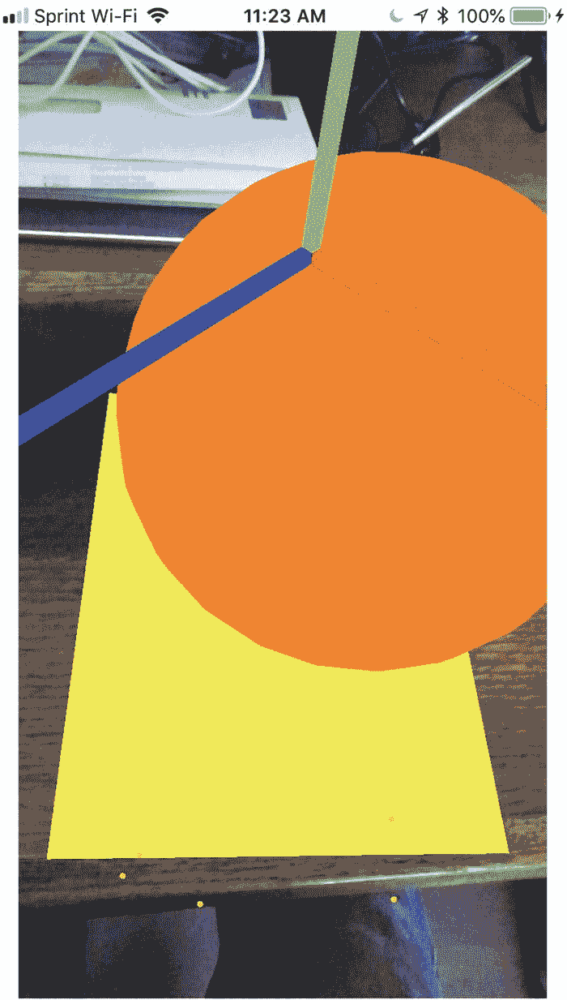
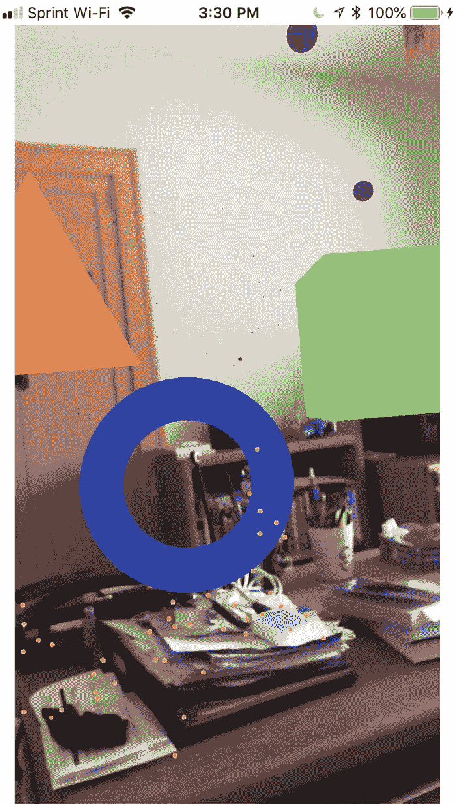

# 12. 虚拟对象的物理特性

迄今为止，当我们向增强现实视图中添加虚拟对象时，这些对象只是漂浮在半空中。虽然在某些情况下这或许可行，但在其他情况下，您可能希望虚拟对象的行为更接近真实物体，能够下落、反弹并相互碰撞。

为了让虚拟对象具备与真实物体相同的特性，您可以为任何虚拟对象定义物理特性。这意味着您可以定义虚拟对象如何与其他对象交互（静态、动态或运动学）、虚拟对象的形状（如盒子或球体）以及施加在虚拟对象上的力。

虚拟对象可以表现为以下三种方式之一：

*   **静态** —— 无法移动，不受碰撞或力的影响。
*   **动态** —— 受力和碰撞的影响。
*   **运动学** —— 不受力或碰撞的影响，但可以影响动态虚拟对象。

静态虚拟对象适用于简单存在的场景。到目前为止，我们创建的所有虚拟对象都是静态的，因为它们不移动，也不影响任何其他虚拟对象。

动态虚拟对象则有趣得多，因为它们可以移动并受重力影响，这意味着它们会沿 y 轴下落至地面。动态虚拟对象可以移动，并与其他动态或运动学虚拟对象发生碰撞并反弹。

运动学虚拟对象本身不移动，但它们可以与动态虚拟对象发生碰撞。在视频游戏中，像道路或障碍物这样的固定物品可以是运动学虚拟对象。

为了了解如何将物理特性应用于虚拟对象，请按照以下步骤创建一个新的 Xcode 项目：

1.  启动 Xcode。（请确保您使用的是 Xcode 10 或更高版本。）
2.  选择 File（文件）➤ New（新建）➤ Project（项目）。Xcode 将要求您选择一个模板。
3.  单击 iOS 类别。
4.  单击 Single View App（单视图应用）图标，然后单击 Next（下一步）按钮。Xcode 会询问产品名称、组织名称、组织标识符和内容技术。
5.  在 Product Name（产品名称）文本框中单击并输入项目的描述性名称，例如 `Physics`。（具体名称不重要。）
6.  单击 Next（下一步）按钮。Xcode 会询问您希望将项目存储在何处。
7.  选择一个文件夹并单击 Create（创建）按钮。Xcode 将创建一个 iOS 项目。

现在，按照以下步骤修改 `Info.plist` 文件以允许访问相机并使用 ARKit：

1.  在导航窗格中单击 `Info.plist` 文件。Xcode 将显示一个包含键、类型和值的列表。
2.  单击展开三角形以展开 Required Device Capabilities（必需的设备功能）类别，显示 Item 0。
3.  将鼠标指针悬停在 Item 0 上以显示加号 (+) 图标。
4.  单击此加号 (+) 图标以显示一个空的 Item 1。
5.  在 Item 1 行的 Value（值）类别下输入 `arkit`。
6.  将鼠标指针移到最后一行以显示一个加号 (+) 图标。
7.  单击加号 (+) 图标以创建新行。将出现一个弹出菜单。
8.  选择 Privacy – Camera Usage Description（隐私 - 相机使用说明）。
9.  在 Privacy – Camera Usage Description（隐私 - 相机使用说明）行的 Value（值）类别下输入 `AR 需要访问相机`。

现在，按照以下步骤修改 `ViewController.swift` 文件以使用 ARKit 和 SceneKit：

1.  在导航窗格中单击 `ViewController.swift` 文件。
2.  编辑 `ViewController.swift` 文件，使其如下所示：

```swift
import UIKit
import SceneKit
import ARKit

class ViewController: UIViewController, ARSCNViewDelegate {
    let configuration = ARWorldTrackingConfiguration()
    override func viewDidLoad() {
        super.viewDidLoad()
    }
}
```

要在我们的应用中查看增强现实内容，请添加一个 ARKit SceneKit View (`ARSCNView`) 并将其展开以填充整个用户界面。然后添加约束：选择 Editor（编辑器）➤ Resolve Auto Layout Issues（解决自动布局问题）➤ Reset to Suggested Constraints（重置为建议约束）（在菜单下半部分的 All Views in Container（容器中的所有视图）类别下）。


## 连接用户界面与代码

下一步是将用户界面项连接到 `ViewController.swift` 文件中的 Swift 代码。为此，请按照以下步骤操作：

1.  在导航器窗格中单击 `Main.storyboard` 文件。
2.  单击“助手编辑器”图标，或选择“视图”➤“助手编辑器”➤“显示助手编辑器”，以并排显示 `Main.storyboard` 和 `ViewController.swift` 文件。
3.  将鼠标指针移到 `ARSCNView` 上，按住 Control 键，然后按住 Control 键并拖动到 `class ViewController` 行的下方。
4.  释放 Control 键和鼠标左键。将出现一个弹出菜单。
5.  在“名称”文本字段中单击并键入 `sceneView`，然后单击“连接”按钮。Xcode 会创建一个 IBOutlet，如下所示：

```
@IBOutlet var sceneView: ARSCNView!
```

6.  编辑 `viewDidLoad` 函数，使其如下所示：

```
override func viewDidLoad() {
    super.viewDidLoad()
    // Do any additional setup after loading the view, typically from a nib.
    sceneView.debugOptions = [ARSCNDebugOptions.showWorldOrigin, ARSCNDebugOptions.showFeaturePoints]
    sceneView.delegate = self
    configuration.planeDetection = .horizontal
    sceneView.session.run(configuration)
    let tapGesture = UITapGestureRecognizer(target: self, action: #selector(tapResponse))
    sceneView.addGestureRecognizer(tapGesture)
}
```

`viewDidLoad` 函数的最后两行创建了一个点击手势，这意味着我们需要一个名为 `tapGesture` 的函数来处理该点击手势。

7.  在 `viewDidLoad` 函数下方，编写以下 `tapResponse` 函数：

```
@objc func tapResponse(sender: UITapGestureRecognizer) {
    let scene = sender.view as! ARSCNView
    let tapLocation = sender.location(in: scene)
    let hitTest = scene.hitTest(tapLocation, types: .existingPlaneUsingExtent)
    if hitTest.isEmpty{
        print ("no plane detected")
    } else {
        print("found a horizontal plane")
        guard let hitResult = hitTest.first else { return }
        addObject(hitResult: hitResult)
    }
}
```

此 `tapResponse` 函数标识用户点击的屏幕位置，然后将此信息发送到一个 `addObject` 函数，这意味着接下来我们需要编写 `addObject` 函数。

8.  在 `tapResponse` 函数下方，编写以下 `addObject` 函数：

```
func addObject(hitResult: ARHitTestResult) {
    let objectNode = SCNNode()
    objectNode.geometry = SCNSphere(radius: 0.1)
    objectNode.geometry?.firstMaterial?.diffuse.contents = UIColor.orange
    objectNode.position = SCNVector3(hitResult.worldTransform.columns.3.x, hitResult.worldTransform.columns.3.y + 0.5, hitResult.worldTransform.columns.3.z)
    objectNode.physicsBody = SCNPhysicsBody(type: .dynamic, shape: nil)
    sceneView.scene.rootNode.addChildNode(objectNode)
}
```

`addObject` 函数创建一个橙色球体。通常，这个橙色球体会悬浮在半空中，但我们通过以下代码行为其赋予了 `physicsBody`：

```
objectNode.physicsBody = SCNPhysicsBody(type: .dynamic, shape: nil)
```

此代码将橙色球体定义为动态物体，这意味着它可以受到力和与其他虚拟对象碰撞的影响。同时，其形状被定义为 `nil`，这意味着 ARKit 在计算与其他虚拟对象的碰撞时，会将球体的边界视为其物理体。

## 检测并绘制虚拟平面

现在我们需要检测水平面并在该位置绘制一个虚拟平面。为此，我们需要一个 `didAdd renderer` 函数，如下所示：

```
func renderer(_ renderer: SCNSceneRenderer, didAdd node: SCNNode, for anchor: ARAnchor) {
    guard anchor is ARPlaneAnchor else { return }
    let planeNode = displayPlane(anchor: anchor as! ARPlaneAnchor)
    node.addChildNode(planeNode)
}
```

请注意，这个 `renderer` 函数会通过持续寻找水平面而多次运行。当它识别到一个水平面时，它会调用 `displayPlane` 函数来创建该虚拟平面。这意味着我们需要编写一个如下所示的 `displayPlane` 函数：

```
func displayPlane(anchor: ARPlaneAnchor) -> SCNNode {
    let planeNode = SCNNode()
    planeNode.geometry = SCNPlane(width: CGFloat(anchor.extent.x), height: CGFloat(anchor.extent.z))
    planeNode.geometry?.firstMaterial?.diffuse.contents = UIColor.yellow
    planeNode.position = SCNVector3(anchor.center.x, anchor.center.y, anchor.center.z)
    let ninetyDegrees = GLKMathDegreesToRadians(90)
    planeNode.eulerAngles = SCNVector3(ninetyDegrees, 0, 0)
    planeNode.physicsBody = SCNPhysicsBody(type: .kinematic, shape: nil)
    planeNode.geometry?.firstMaterial?.isDoubleSided = true
    return planeNode
}
```

这个 `displayPlane` 函数接收存储在 `ARPlaneAnchor` 中的水平面信息，该锚点定义了平面的大小和位置。因此，我们需要创建一个平面节点，并根据 `ARPlaneAnchor` 信息赋予其大小：

```
planeNode.geometry = SCNPlane(width: CGFloat(anchor.extent.x), height: CGFloat(anchor.extent.z))
```

然后我们将虚拟平面着色为黄色，并将其定位在 ARKit 识别的水平面的中心。接下来，我们需要将平面围绕 x 轴旋转 90 度，使其像地板一样水平显示，而不是像墙一样垂直显示。

最重要的是，我们需要像这样为这个虚拟平面赋予物理体：

```
planeNode.physicsBody = SCNPhysicsBody(type: .kinematic, shape: nil)
```

这段代码将虚拟平面定义为运动学类型，这意味着它在与虚拟对象碰撞时不会移动，但会影响与其碰撞的任何虚拟对象。我们将形状定义为 `nil`，这会告诉 ARKit 在计算与其他虚拟对象的碰撞时，将整个虚拟平面视为其物理体。

## 更新虚拟平面

最后，如果用户移动 iOS 设备的摄像头以捕捉更多的水平面，我们需要一个 `renderer didUpdate` 函数来扩展虚拟平面的大小。这个 `renderer didUpdate` 函数如下所示：

```
func renderer(_ renderer: SCNSceneRenderer, didUpdate node: SCNNode, for anchor: ARAnchor) {
    guard anchor is ARPlaneAnchor else { return }
    node.enumerateChildNodes { (childNode, _) in
        childNode.removeFromParentNode()
    }
    let planeNode = displayPlane(anchor: anchor as! ARPlaneAnchor)
    node.addChildNode(planeNode)
}
```

这个 `didUpdate renderer` 函数在每次检测到水平面比最初计算的大时，都会移除虚拟平面并重新绘制一个新的虚拟平面。然后它会调用 `displayPlane` 函数，在增强现实视图中绘制一个虚拟平面。

## 测试项目

要测试此项目，请按照以下步骤操作：

1.  单击“停止”按钮或选择“产品”➤“停止”。
2.  将 iOS 设备通过 USB 数据线连接到 Macintosh。
3.  单击“运行”按钮或选择“产品”➤“运行”。第一次运行此应用程序时，它会请求访问摄像头的权限，请授予该权限。
4.  将 iOS 设备的摄像头对准水平面（例如桌子或地板）。ARKit 第一次识别水平面时，Xcode 调试区域会显示“found a horizontal plane”消息。
5.  移动 iOS 设备以捕捉更多的水平面。每次 ARKit 识别到水平面的新部分时，黄色平面都会变大。



图 12-1：橙色球体可以下落并撞击黄色平面


5.  点击屏幕。每次点击屏幕，会出现一个橙色球体，如图 12-1 所示。因为橙色球体被定义为 `.dynamic` 物理体，它会受到重力等力的影响，导致球体下落。如果橙色球体撞到黄色平面，它要么弹开，要么停留在平面上。如果你持续点击屏幕添加更多橙色球体，这些球体会相互之间以及和黄色平面发生碰撞。这是因为黄色平面被定义为 `.kinematic` 物理体，这意味着重力等力不会影响它，但它可以与其他虚拟对象（如橙色球体）发生碰撞。

由于橙色球体被定义为 `.dynamic` 物理体，它会受到重力影响。而黄色平面被定义为 `.kinematic` 物理体，它不受重力影响，但能与橙色球体等其他虚拟对象交互。

如果你创建了一个定义为 `.dynamic` 物理体的虚拟对象，但又不想让它受重力影响，你可以将其 `isAffectedByGravity` 属性设置为 `false`，如下所示：

```
objectNode.physicsBody?.isAffectedByGravity = false
```

如果你在 `addObject` 函数中添加这行代码，那么每次点击屏幕添加橙色球体时，橙色球体都将悬浮在半空中，因为它不再受重力影响，尽管它被定义为 `.dynamic` 物理体。

## 对虚拟对象施加力

目前，我们创建的虚拟对象要么悬浮在半空中，要么在重力作用下下落。与虚拟对象交互的另一种方式是对其施加一个力。要对虚拟对象施加力，你需要定义力的方向以及施加方式是瞬时的还是持续的。

让我们按照以下步骤创建一个新的 Xcode 项目，用于显示三个目标并向这些目标发射一个抛射物：

1.  启动 Xcode。（确保你使用的是 Xcode 10 或更高版本。）
2.  选择 File ➤ New ➤ Project。Xcode 会要求你选择一个模板。
3.  点击 iOS 类别。
4.  点击 Single View App 图标，然后点击 Next 按钮。Xcode 会询问产品名称、组织名称、组织标识符和内容技术。
5.  在 Product Name 文本框中点击并输入项目描述性名称，例如 `PhysicsForce`。（具体名称无关紧要。）
6.  点击 Next 按钮。Xcode 会询问你想将项目存储在何处。
7.  选择一个文件夹并点击 Create 按钮。Xcode 将创建一个 iOS 项目。

现在按照以下步骤修改 `Info.plist` 文件，以允许访问相机并使用 ARKit：

1.  在导航面板中点击 `Info.plist` 文件。Xcode 会显示一个键、类型和值的列表。
2.  点击展开三角形以展开 Required Device Capabilities 类别，显示 Item 0。
3.  将鼠标指针悬停在 Item 0 上，会显示一个加号 (`+`) 图标。
4.  点击这个加号 (`+`) 图标以显示空白的 Item 1。
5.  在 Item 1 行的 Value 类别下输入 `arkit`。
6.  将鼠标指针悬停在最后一行上，会显示一个加号 (`+`) 图标。
7.  点击加号 (`+`) 图标创建一个新行。会出现一个弹出菜单。
8.  选择 Privacy – Camera Usage Description。
9.  在 Privacy – Camera Usage Description 行的 Value 类别下输入 `AR needs to use the camera`。

现在按照以下步骤修改 `ViewController.swift` 文件以使用 ARKit 和 SceneKit：

1.  在导航面板中点击 `ViewController.swift` 文件。
2.  编辑 `ViewController.swift` 文件，使其如下所示：

```
import UIKit
import SceneKit
import ARKit
class ViewController: UIViewController, ARSCNViewDelegate {
    let configuration = ARWorldTrackingConfiguration()
    override func viewDidLoad() {
        super.viewDidLoad()
        // Do any additional setup after loading the view, typically from a nib.
    }
}
```

为了在我们的应用中查看增强现实，添加一个单一的 ARKit SceneKit 视图 (`ARSCNView`)，使其填满整个用户界面（参见第 11 章的图 11-1）。

设计好用户界面后，你需要添加约束。要添加约束，请选择 Editor ➤ Resolve Auto Layout Issues ➤ Reset to Suggested Constraints，菜单下半部分位于 All Views in Container 类别下。

下一步是将用户界面项连接到 `ViewController.swift` 文件中的 Swift 代码。为此，请按照以下步骤操作：

1.  在导航面板中点击 `Main.storyboard` 文件。
2.  点击 Assistant Editor 图标，或选择 View ➤ Assistant Editor ➤ Show Assistant Editor，以并排显示 `Main.storyboard` 和 `ViewController.swift` 文件。
3.  将鼠标指针悬停在 `ARSCNView` 上，按住 Control 键，然后在 `class ViewController` 行下方进行 Ctrl-拖拽。
4.  松开 Control 键和鼠标左键。会出现一个弹出菜单。
5.  在 Name 文本框中点击并输入 `sceneView`，然后点击 Connect 按钮。Xcode 将创建一个 IBOutlet，如下所示：

```
@IBOutlet var sceneView: ARSCNView!
```

6.  编辑 `viewDidLoad` 函数，使其如下所示：


```swift
override func viewDidLoad() {
    super.viewDidLoad()
    // Do any additional setup after loading the view, typically from a nib.
    sceneView.debugOptions = [ARSCNDebugOptions.showWorldOrigin, ARSCNDebugOptions.showFeaturePoints]
    sceneView.delegate = self
    sceneView.session.run(configuration)
    let tapGesture = UITapGestureRecognizer(target: self, action: #selector(tapResponse))
    sceneView.addGestureRecognizer(tapGesture)
}
```

## 处理点击手势

此时，我们已经添加了一个点击手势识别器，因此需要按照以下步骤编写一个函数来处理这个点击手势：

1.  在导航器窗格中点击`ViewController.swift`文件。
2.  在`viewDidLoad`函数下方键入以下代码：

```swift
@objc func tapResponse(sender: UITapGestureRecognizer) {
}
```

每当用户点击屏幕时，我们希望一个球体从屏幕中心射出并远离用户。要做到这一点，我们必须首先获取摄像机的当前朝向和位置。这意味着要确保用户点击的是增强现实视图，然后使用以下三行代码检索关于摄像机当前朝向和位置的信息（存储在矩阵中）：

```swift
guard let scene = sender.view as? ARSCNView else { return }
guard let pov = scene.pointOfView else { return }
let transform = pov.transform
```

`transform`常量存储了一个 4x4 矩阵，包含摄像机位置和朝向的信息。要检索朝向信息，我们需要访问此矩阵的第三列：

```swift
let orientation = SCNVector3(-transform.m31, -transform.m32, -transform.m33)
```

所有这些信息都需要反转（因此使用负号），因为朝向是面向我们的，而我们需要它面向相反的方向远离我们。

摄像机的位置可以从矩阵的第四列这样获取：

```swift
let location = SCNVector3(transform.m41, transform.m42, transform.m43)
```

要获得摄像机的最终位置，我们需要将朝向与位置相结合，如下所示：

```swift
let position = SCNVector3(orientation.x + location.x, orientation.y + location.y, orientation.z + location.z)
```

一旦我们知道了摄像机的位置，就需要创建一个投射物，它将是一个紫色球体，出现在屏幕中心（即摄像机位置）：

```swift
let projectile = SCNNode()
projectile.geometry = SCNSphere(radius: 0.35)
projectile.geometry?.firstMaterial?.diffuse.contents = UIColor.purple
projectile.position = position
```

这创建了一个紫色球体，当用户点击屏幕时，它会悬浮在屏幕中央的半空中。我们需要给投射物一个物理体，将其类型定义为`.dynamic`，这意味着它可以与其他虚拟对象碰撞：

```swift
projectile.physicsBody = SCNPhysicsBody(type: .dynamic, shape: SCNPhysicsShape(node: projectile, options: nil))
projectile.physicsBody?.isAffectedByGravity = false
```

第一行将紫色球体定义为一个能够移动和碰撞的物理体，第二行关闭了它的重力。否则，重力只会让紫色球体坠落到地面。

现在是对紫色球体施加力的时候了。首先，声明一个名为`force`的常量，并将其值设置为任意值 50。然后使用`applyForce`方法对该投射物施加该力，如下所示：

```swift
let force: Float = 50
projectile.physicsBody?.applyForce(SCNVector3(orientation.x * force, orientation.y * force, orientation.z * force), asImpulse: true)
```

这段代码对投射物施加了一个力，但这个力相对较弱，因此我们需要将其乘以任意的`force`常数（50）。`asImpulse`值设为`true`，以便对投射物创建一个瞬时力。如果这个`asImpulse`值是`false`，那么这个力将持续施加在投射物上。

完整的`tapResponse`函数应如下所示：

```swift
@objc func tapResponse(sender: UITapGestureRecognizer) {
    guard let scene = sender.view as? ARSCNView else { return }
    guard let pov = scene.pointOfView else { return }
    let transform = pov.transform
    let orientation = SCNVector3(-transform.m31, -transform.m32, -transform.m33)
    let location = SCNVector3(transform.m41, transform.m42, transform.m43)
    let position = SCNVector3(orientation.x + location.x, orientation.y + location.y, orientation.z + location.z)
    let projectile = SCNNode()
    projectile.geometry = SCNSphere(radius: 0.35)
    projectile.geometry?.firstMaterial?.diffuse.contents = UIColor.purple
    projectile.position = position
    projectile.physicsBody = SCNPhysicsBody(type: .dynamic, shape: SCNPhysicsShape(node: projectile, options: nil))
    projectile.physicsBody?.isAffectedByGravity = false
    let force: Float = 50
    projectile.physicsBody?.applyForce(SCNVector3(orientation.x * force, orientation.y * force, orientation.z * force), asImpulse: true)
    sceneView.scene.rootNode.addChildNode(projectile)
}
```

## 测试代码

要测试此代码，请按照以下步骤操作：

1.  通过 USB 线缆将 iOS 设备连接到 Mac。
2.  点击运行按钮或选择 Product ➤ Run。首次运行此应用程序时，它会请求访问摄像机的权限，请授予权限。
3.  对准 iOS 设备的摄像头并点击屏幕。每次点击屏幕时，都应有一个紫色球体射出并逐渐消失。
4.  点击停止按钮或选择 Product ➤ Stop。

尝试使用不同的值（如 20 或 75）修改`force`常数，观察它对施加在紫色球体上的力的影响。


## 与虚拟物体发生碰撞

为了使一个虚拟物体与另一个虚拟物体发生碰撞，这两个相互碰撞的虚拟物体必须是`.static`（静态）或`.dynamic`（动态）物理体类型。在`viewDidLoad`函数的末尾，添加下面这行代码来调用一个名为`addTargets`的函数：

```
addTargets()
```

作为发射物的紫色球体被定义为`.dynamic`物理体，这意味着任何我们想要与之发生碰撞的其他虚拟物体必须是`.dynamic`或`.static`物理体。首先，让我们创建一个`addTargets`函数：

```
func addTargets() {
}
```

在`addTargets`函数中添加一个金字塔，定义其颜色为橙色，指定其尺寸，并设置一个基于世界原点的位置。然后将这个金字塔定义为一个`.static`物理体，并将其添加到场景中，如下所示：

```
let pyramidNode = SCNNode()
pyramidNode.geometry = SCNPyramid(width: 4, height: 4.5, length: 4)
pyramidNode.geometry?.firstMaterial?.diffuse.contents = UIColor.orange
pyramidNode.position = SCNVector3(-3, 1, -15)
pyramidNode.physicsBody = SCNPhysicsBody(type: .static, shape: nil)
sceneView.scene.rootNode.addChildNode(pyramidNode)
```

创建一个具有特定尺寸的绿色盒子，并将其放置在附近的位置，如下所示：

```
let boxNode = SCNNode()
boxNode.geometry = SCNBox(width: 3.5, height: 3.5, length: 3.5, chamferRadius: 0)
boxNode.geometry?.firstMaterial?.diffuse.contents = UIColor.green
boxNode.position = SCNVector3(5, 1, -15)
boxNode.physicsBody = SCNPhysicsBody(type: .static, shape: nil)
sceneView.scene.rootNode.addChildNode(boxNode)
```

请注意，当定义金字塔和盒子的物理体时，形状被定义为`nil`，这意味着使用虚拟物体本身的形状作为其碰撞边界，如下所示：

```
pyramidNode.physicsBody = SCNPhysicsBody(type: .static, shape: nil)
boxNode.physicsBody = SCNPhysicsBody(type: .static, shape: nil)
```

在`addTargets`函数内部要创建的最后一个虚拟物体是一个圆环体，它看起来像一个甜甜圈或一个环。创建一个蓝色的圆环体需要定义物理尺寸、颜色和位置：

```
let torusNode = SCNNode()
torusNode.geometry = SCNTorus(ringRadius: 2, pipeRadius: 0.5)
torusNode.geometry?.firstMaterial?.diffuse.contents = UIColor.blue
torusNode.position = SCNVector3(0, -2, -15)
```

首先，我们需要将这个圆环体绕 x 轴旋转 90 度，否则它会显示为一个扁平的圆盘。要旋转圆环体，我们需要先将 90 度转换为弧度，然后将该弧度值应用于绕其 x 轴的旋转，如下所示：

```
let ninetyDegrees = GLKMathDegreesToRadians(90)
torusNode.eulerAngles = SCNVector3(ninetyDegrees, 0, 0)
```

现在我们需要定义圆环体的物理体。如果我们像这样简单地将其形状定义为`nil`：

```
torusNode.physicsBody = SCNPhysicsBody(type: .static, shape: nil)
```

这会创建一个看起来中间有洞但实际上并没有洞的圆环体。这是因为将其形状设置为`nil`值会简单地使用圆环体的整个边界（包括内部空洞）作为检测碰撞的边界。为了使中间的洞表现得像空的空气一样，我们需要定义圆环体的物理体，使其使用实际形状本身的边界，而不仅仅是外部边界。为此，我们可以使用以下代码：

```
torusNode.physicsBody = SCNPhysicsBody(type: .static, shape: SCNPhysicsShape(node: torusNode, options: [SCNPhysicsShape.Option.type: SCNPhysicsShape.ShapeType.concavePolyhedron]))
```

整个`ViewController.swift`文件应该如下所示：

```
import UIKit
import SceneKit
import ARKit
class ViewController: UIViewController, ARSCNViewDelegate  {
@IBOutlet var sceneView: ARSCNView!
let configuration = ARWorldTrackingConfiguration()
override func viewDidLoad() {
super.viewDidLoad()
// Do any additional setup after loading the view, typically from a nib.
sceneView.debugOptions = [ARSCNDebugOptions.showWorldOrigin, ARSCNDebugOptions.showFeaturePoints]
sceneView.delegate = self
sceneView.session.run(configuration)
let tapGesture = UITapGestureRecognizer(target: self, action: #selector(tapResponse))
sceneView.addGestureRecognizer(tapGesture)
addTargets()
}
@objc func tapResponse(sender: UITapGestureRecognizer) {
guard let scene = sender.view as? ARSCNView else { return }
guard let pov = scene.pointOfView else { return }
let transform = pov.transform
let orientation = SCNVector3(-transform.m31, -transform.m32, -transform.m33)
let location = SCNVector3(transform.m41, transform.m42, transform.m43)
let position = SCNVector3(orientation.x + location.x, orientation.y + location.y, orientation.z + location.z)
let projectile = SCNNode()
projectile.geometry = SCNSphere(radius: 0.35)
projectile.geometry?.firstMaterial?.diffuse.contents = UIColor.purple
projectile.position = position
projectile.physicsBody = SCNPhysicsBody(type: .dynamic, shape: SCNPhysicsShape(node: projectile, options: nil))
projectile.physicsBody?.isAffectedByGravity = false
let force: Float = 50
projectile.physicsBody?.applyForce(SCNVector3(orientation.x * force, orientation.y * force, orientation.z * force), asImpulse: true)
sceneView.scene.rootNode.addChildNode(projectile)
}
func addTargets() {
let pyramidNode = SCNNode()
pyramidNode.geometry = SCNPyramid(width: 4, height: 4.5, length: 4)
pyramidNode.geometry?.firstMaterial?.diffuse.contents = UIColor.orange
pyramidNode.position = SCNVector3(-3, 1, -15)
pyramidNode.physicsBody = SCNPhysicsBody(type: .static, shape: nil)
sceneView.scene.rootNode.addChildNode(pyramidNode)
let torusNode = SCNNode()
torusNode.geometry = SCNTorus(ringRadius: 2, pipeRadius: 0.5)
torusNode.geometry?.firstMaterial?.diffuse.contents = UIColor.blue
torusNode.position = SCNVector3(0, -2, -15)
torusNode.physicsBody = SCNPhysicsBody(type: .static, shape: SCNPhysicsShape(node: torusNode, options: [SCNPhysicsShape.Option.type: SCNPhysicsShape.ShapeType.concavePolyhedron]))
let ninetyDegrees = GLKMathDegreesToRadians(90)
torusNode.eulerAngles = SCNVector3(ninetyDegrees, 0, 0)
sceneView.scene.rootNode.addChildNode(torusNode)
let boxNode = SCNNode()
boxNode.geometry = SCNBox(width: 3.5, height: 3.5, length: 3.5, chamferRadius: 0)
boxNode.geometry?.firstMaterial?.diffuse.contents = UIColor.green
boxNode.position = SCNVector3(5, 1, -15)
boxNode.physicsBody = SCNPhysicsBody(type: .static, shape: nil)
sceneView.scene.rootNode.addChildNode(boxNode)
}
}
```

要测试此代码，请按照以下步骤操作：
1.  点击停止按钮或选择 **Product** ➤ **Stop**（产品 ➤ 停止）。



图 12-2
当紫色球体与其他三个虚拟物体碰撞时，它应该会被弹开

2.  通过 USB 数据线将 iOS 设备连接到您的 Macintosh。
3.  点击运行按钮或选择 **Product** ➤ **Run**（产品 ➤ 运行）。
4.  世界原点应该会出现，同时还有一个橙色的金字塔、一个蓝色的圆环体和一个绿色的盒子。将屏幕中心对准目标并点击屏幕以发射出紫色发射物。每次紫色发射物击中虚拟物体时，它都应该被弹开，如图 12-2 所示。确保瞄准所有三个虚拟物体，并瞄准圆环体的中心，以观察紫色球体从其中间穿过。


## 碰撞检测

将虚拟对象设置为 `.dynamic` 和 `.static` 物理体会使它们相互碰撞。然而，在许多情况下，您可能希望知道虚拟对象何时与另一个发生碰撞。要做到这一点，您首先需要创建一个枚举结构，为每个虚拟对象分配一个任意的数值。

在我们的示例中，有一个用作投射物的紫色球体、一个橙色棱锥体、一个蓝色圆环体和一个绿色立方体。因此，我们可以在 `IBOutlet` 下方像这样定义一个枚举结构：

```
enum contactType : Int {
case projectile = 1
case target = 2
}
```

接下来，我们需要在 `addTargets` 函数内，将每个虚拟对象的 `enum` 值赋值给它的 `categoryBitMask` 属性，如下所示：

```
projectile.physicsBody?.categoryBitMask = contactType.projectile.rawValue
pyramidNode.physicsBody?.categoryBitMask = contactType.target.rawValue
torusNode.physicsBody?.categoryBitMask = contactType.target.rawValue
boxNode.physicsBody?.categoryBitMask = contactType.target.rawValue
```

一旦我们为所有虚拟对象的 `categoryBitMask` 属性分配了任意值，我们需要让我们的类使用 `SCNPhysicsContactDelegate`，像这样：

```
class ViewController: UIViewController, ARSCNViewDelegate, SCNPhysicsContactDelegate  {
```

这个委托允许我们在虚拟对象碰撞时收到通知。定义了 `SCNPhysicsContactDelegate` 之后，我们还必须将类设置为接触委托，如下所示：

```
sceneView.scene.physicsWorld.contactDelegate = self
```

我们还需要在 `tapResponse` 函数中为投射物定义 `contactTestBitMask`。这定义了我们要跟踪的碰撞类型。由于我们希望当投射物击中三个虚拟对象（棱锥体、圆环体或立方体）中的任何一个时得到通知，我们可以使用以下代码：

```
projectile.physicsBody?.contactTestBitMask = contactType.target.rawValue
```

由于我们所有的目标（棱锥体、圆环体和立方体）都被分配了相同的 `contactType.target` 枚举值，我们需要识别投射物何时击中每个不同的虚拟对象。这意味着我们需要在 `addTargets` 函数中为每个虚拟对象指定一个唯一的名称，如下所示：

```
projectile.name = "Projectile"
pyramidNode.name = "Pyramid"
torusNode.name = "Torus"
boxNode.name = "Box"
```

现在我们需要使用 `didBegin physicsWorld` 函数来检测碰撞，如下所示：

```
func physicsWorld(_ world: SCNPhysicsWorld, didBegin contact: SCNPhysicsContact) {
}
```

每当两个虚拟对象碰撞时，这个函数就会运行。当两个虚拟对象碰撞时，`didBegin physicsWorld` 将这两个对象识别为 `nodeA` 和 `nodeB`。不幸的是，我们不知道哪个节点代表投射物，哪个节点代表目标。首先，我们需要声明一个变量来保存包含目标的节点：

```
var targetNode : SCNNode!
```

现在我们需要确定 `nodeA` 是被击中的投射物还是目标。要确定这些信息，我们只需要查看节点的名称：

```
if contact.nodeA.name == "Projectile" {
targetNode = contact.nodeB
} else {
targetNode = contact.nodeA
}
```

如果 `nodeA` 的名称为 `Projectile`，那么我们知道 `nodeB` 包含目标。如果 `nodeA` 的名称不是 `Projectile`，那么我们知道 `nodeA` 包含目标。

现在根据 `targetNode` 的名称，我们可以使用 `switch` 语句来改变投射物击中的虚拟对象的颜色。如果投射物击中棱锥体，棱锥体将变为品红色。如果投射物击中圆环体，圆环体将变为黄色。如果投射物击中立方体，立方体将变为红色：

```
switch targetNode.name {
case "Pyramid":
targetNode.geometry?.firstMaterial?.diffuse.contents = UIColor.magenta
case "Torus":
targetNode.geometry?.firstMaterial?.diffuse.contents = UIColor.yellow
case "Box":
targetNode.geometry?.firstMaterial?.diffuse.contents = UIColor.red
default:
return
}
```

完整的 `ViewController.swift` 文件应该如下所示：


```swift
import UIKit
import SceneKit
import ARKit
class ViewController: UIViewController, ARSCNViewDelegate, SCNPhysicsContactDelegate  {
@IBOutlet var sceneView: ARSCNView!
let configuration = ARWorldTrackingConfiguration()
enum contactType : Int {
case projectile = 1
case target = 2
}
override func viewDidLoad() {
super.viewDidLoad()
// 在视图加载后执行额外设置，通常从 nib 文件加载
sceneView.debugOptions = [ARSCNDebugOptions.showWorldOrigin, ARSCNDebugOptions.showFeaturePoints]
sceneView.delegate = self
sceneView.scene.physicsWorld.contactDelegate = self
sceneView.session.run(configuration)
let tapGesture = UITapGestureRecognizer(target: self, action: #selector(tapResponse))
sceneView.addGestureRecognizer(tapGesture)
addTargets()
}
@objc func tapResponse(sender: UITapGestureRecognizer) {
guard let scene = sender.view as? ARSCNView else { return }
guard let pov = scene.pointOfView else { return }
let transform = pov.transform
let orientation = SCNVector3(-transform.m31, -transform.m32, -transform.m33)
let location = SCNVector3(transform.m41, transform.m42, transform.m43)
let position = SCNVector3(orientation.x + location.x, orientation.y + location.y, orientation.z + location.z)
let projectile = SCNNode()
projectile.geometry = SCNSphere(radius: 0.35)
projectile.geometry?.firstMaterial?.diffuse.contents = UIColor.purple
projectile.position = position
projectile.physicsBody = SCNPhysicsBody(type: .dynamic, shape: SCNPhysicsShape(node: projectile, options: nil))
projectile.physicsBody?.isAffectedByGravity = false
projectile.physicsBody?.categoryBitMask = contactType.projectile.rawValue
projectile.physicsBody?.contactTestBitMask = contactType.target.rawValue
projectile.name = "Projectile"
let force: Float = 50
projectile.physicsBody?.applyForce(SCNVector3(orientation.x * force, orientation.y * force, orientation.z * force), asImpulse: true)
sceneView.scene.rootNode.addChildNode(projectile)
}
func addTargets() {
let pyramidNode = SCNNode()
pyramidNode.geometry = SCNPyramid(width: 4, height: 4.5, length: 4)
pyramidNode.geometry?.firstMaterial?.diffuse.contents = UIColor.orange
pyramidNode.position = SCNVector3(-3, 1, -15)
pyramidNode.physicsBody = SCNPhysicsBody(type: .static, shape: nil)
pyramidNode.physicsBody?.categoryBitMask = contactType.target.rawValue
pyramidNode.name = "Pyramid"
sceneView.scene.rootNode.addChildNode(pyramidNode)
let torusNode = SCNNode()
torusNode.geometry = SCNTorus(ringRadius: 2, pipeRadius: 0.5)
torusNode.geometry?.firstMaterial?.diffuse.contents = UIColor.blue
torusNode.position = SCNVector3(0, -2, -15)
torusNode.physicsBody = SCNPhysicsBody(type: .static, shape: SCNPhysicsShape(node: torusNode, options: [SCNPhysicsShape.Option.type: SCNPhysicsShape.ShapeType.concavePolyhedron]))
torusNode.physicsBody?.categoryBitMask = contactType.target.rawValue
torusNode.name = "Torus"
let ninetyDegrees = GLKMathDegreesToRadians(90)
torusNode.eulerAngles = SCNVector3(ninetyDegrees, 0, 0)
sceneView.scene.rootNode.addChildNode(torusNode)
let boxNode = SCNNode()
boxNode.geometry = SCNBox(width: 3.5, height: 3.5, length: 3.5, chamferRadius: 0)
boxNode.geometry?.firstMaterial?.diffuse.contents = UIColor.green
boxNode.position = SCNVector3(5, 1, -15)
boxNode.physicsBody = SCNPhysicsBody(type: .static, shape: nil)
boxNode.physicsBody?.categoryBitMask = contactType.target.rawValue
boxNode.name = "Box"
sceneView.scene.rootNode.addChildNode(boxNode)
}
func physicsWorld(_ world: SCNPhysicsWorld, didBegin contact: SCNPhysicsContact) {
var targetNode : SCNNode!
if contact.nodeA.name == "Projectile" {
targetNode = contact.nodeB
} else {
targetNode = contact.nodeA
}
switch targetNode.name {
case "Pyramid":
targetNode.geometry?.firstMaterial?.diffuse.contents = UIColor.magenta
case "Torus":
targetNode.geometry?.firstMaterial?.diffuse.contents = UIColor.yellow
case "Box":
targetNode.geometry?.firstMaterial?.diffuse.contents = UIColor.red
default:
return
}
}
}
```

要测试此代码，请按以下步骤操作：

1.  通过 USB 线将 iOS 设备连接到 Macintosh。
2.  点击“运行”按钮，或选择**产品** ➤ **运行**。
3.  世界原点应出现，同时还有一个橙色金字塔、一个蓝色圆环和一个绿色盒子。将屏幕中心对准目标，然后点击屏幕即可发射一个紫色抛射体。每当紫色抛射体击中一个虚拟对象时，该虚拟对象会变为不同颜色，让你直观地看到它被击中了。
4.  点击“停止”按钮，或选择**产品** ➤ **停止**。

## 小结

默认情况下，虚拟对象只是悬浮在增强现实视图的半空中。通过为虚拟对象应用物理实体，你可以让它受重力影响而下落，或者让它与其他虚拟对象交互并发生碰撞。

你可以用不同类型的物理实体定义虚拟对象，这些实体决定了它如何响应碰撞。要发起碰撞，你可以沿 x、y 和 z 轴对虚拟对象施加一个力。要确定虚拟对象可能击中了什么，你需要定义一个枚举结构来标识可能发生碰撞的不同虚拟对象。然后你需要编写一个 `didBegin physicsWorld` 函数来响应这一碰撞。

添加物理、受力及碰撞检测功能，能让你的应用中的虚拟对象像真实物体一样做出反应，并在它们因碰撞而发生物理接触时通知你。


