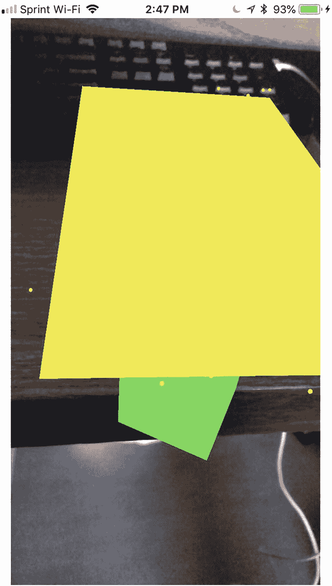
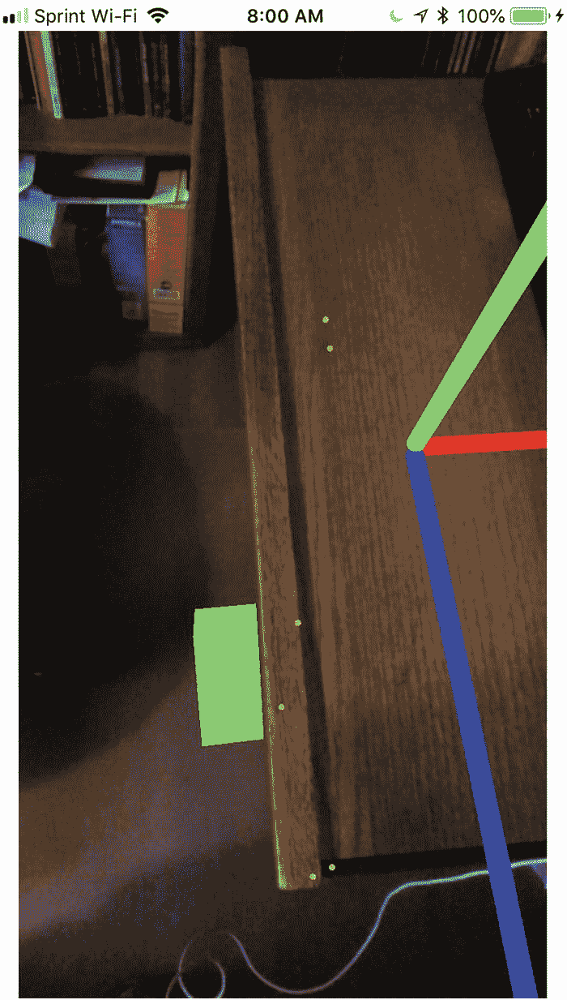
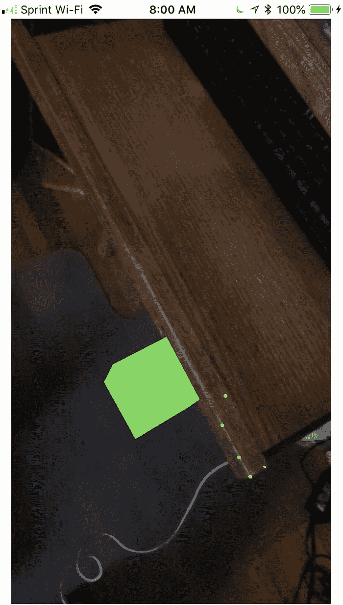
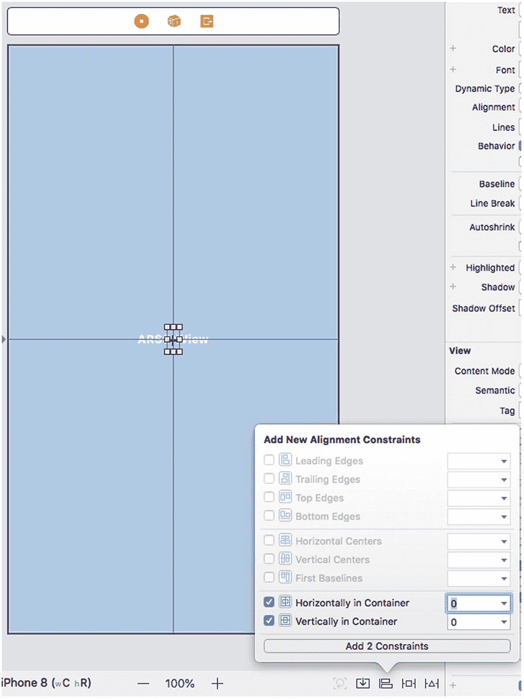
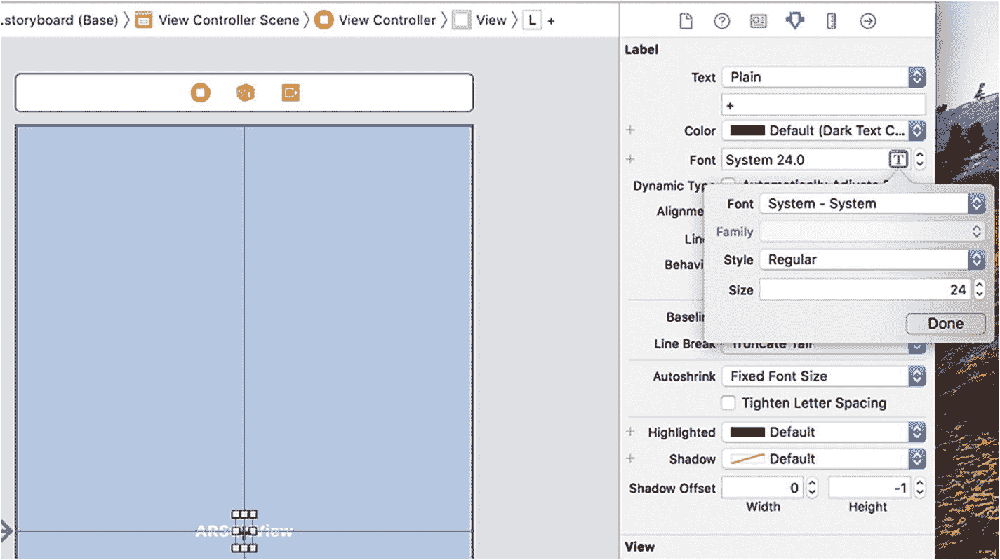
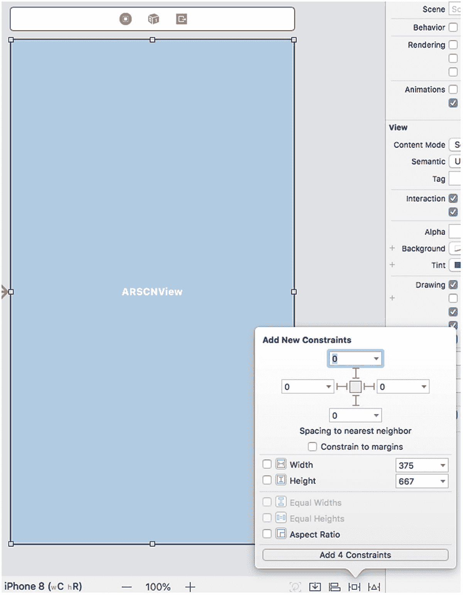
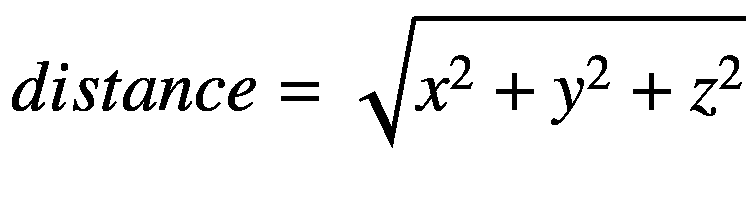
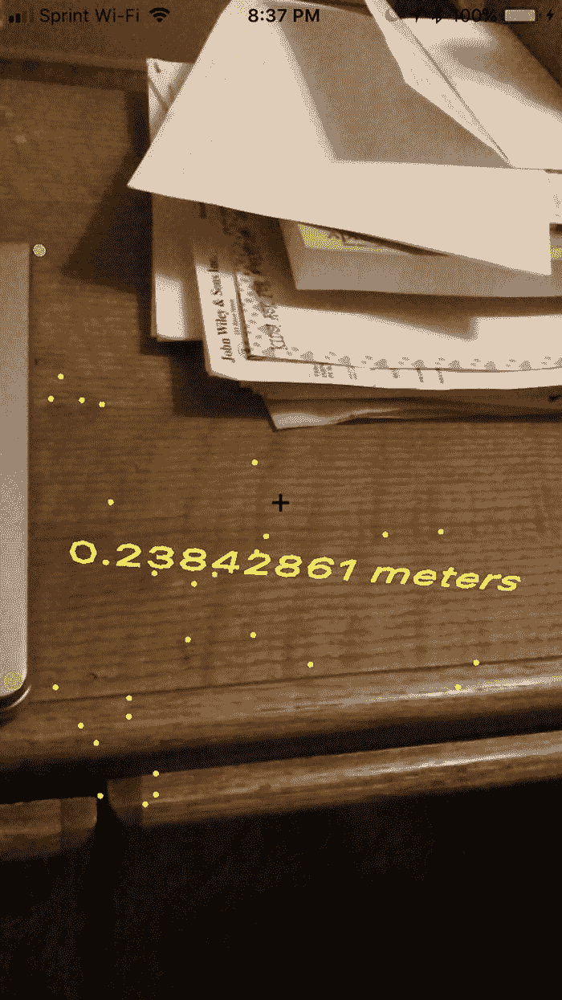

# 13. 与现实世界互动

当我们在增强现实视图中放置虚拟对象时，这些虚拟对象可以以不同方式相互交互。两个虚拟对象交互的最简单方法是将一个放在另一个前面。然后，最近的虚拟对象会遮挡您对第二个虚拟对象的视线。

为了在增强现实视图中实现更高的真实感，您还可以让现实世界中的物体看起来遮挡住虚拟对象，这称为*遮挡*。我们可以通过创建一个与现实世界物体位置和大小匹配的不可见虚拟对象，来模拟现实物体遮挡虚拟对象的效果。

另一种交互形式是虚拟对象与现实世界物体的交互。最简单的例子是水平或垂直平面检测，`ARKit` 可以识别墙壁或地板。当然，`ARKit` 也能识别现实世界中的点。例如，它可以比较现实世界中存在的两个点之间的距离，比如桌子一个角落到另一个角落的距离。

为了学习如何通过虚拟对象实现遮挡，让我们按照以下步骤创建一个新的 Xcode 项目：

1.  启动 Xcode。（确保您的 Xcode 版本为 10 或更高。）
2.  选择“文件”➤“新建”➤“项目”。Xcode 会要求您选择一个模板。
3.  点击“iOS”类别。
4.  点击“单视图 App”图标，然后点击“下一步”按钮。Xcode 会要求您提供产品名称、组织名称、组织标识符和内容技术。
5.  点击“产品名称”文本框，为您的项目输入一个描述性名称，例如 `Occlusion`。（确切名称无关紧要。）
6.  点击“下一步”按钮。Xcode 会询问您想要存储项目的位置。
7.  选择一个文件夹，然后点击“创建”按钮。Xcode 会创建一个 iOS 项目。

现在，按照以下步骤修改 `Info.plist` 文件，以允许访问摄像头并使用 `ARKit`：

1.  在导航器窗格中点击 `Info.plist` 文件。Xcode 会显示键、类型和值的列表。
2.  点击展开三角形，展开“所需设备功能”类别以显示“项目 0”。
3.  将鼠标指针移到“项目 0”上，显示一个加号 (+) 图标。
4.  点击此加号 (+) 图标，显示一个空白的“项目 1”。
5.  在“项目 1”行的“值”类别下输入 `arkit`。
6.  将鼠标指针移到最后一行，显示一个加号 (+) 图标。
7.  点击加号 (+) 图标创建一个新行。会弹出一个菜单。
8.  选择“隐私 – 相机使用说明”。
9.  在“隐私 – 相机使用说明”行的“值”类别下输入 `AR 需要使用摄像头`。

现在是时候按照以下步骤修改 `ViewController.swift` 文件，以使用 `ARKit` 和 `SceneKit` 了：

1.  在导航器窗格中点击 `ViewController.swift` 文件。
2.  编辑 `ViewController.swift` 文件，使其内容如下：

```
import UIKit
import SceneKit
import ARKit
class ViewController: UIViewController, ARSCNViewDelegate {
    let configuration = ARWorldTrackingConfiguration()
    var x : Float = 0
    var y : Float = 0
    var z : Float = 0
    override func viewDidLoad() {
        super.viewDidLoad()
        // Do any additional setup after loading the view, typically from a nib.
    }
}
```

这段代码声明了三个变量 `x`、`y` 和 `z`。这些变量将用于存储水平平面的位置。一旦我们的应用检测到水平平面，我们将使用这些 `x`、`y` 和 `z` 变量在水平平面下方绘制一个虚拟对象。

要在我们的应用中查看增强现实，请添加一个单独的 `ARKit SceneKit 视图`（`ARSCNView`），并将其展开以填满整个用户界面。然后，通过选择“编辑器”➤“解决自动布局问题”➤“重置为建议的约束”（位于菜单下半部分“容器中所有视图”类别下）来添加约束。

下一步是将用户界面项连接到 `ViewController.swift` 文件中的 Swift 代码。为此，请按照以下步骤操作：

1.  在导航器窗格中点击 `Main.storyboard` 文件。
2.  点击“助理编辑器”图标，或选择“视图”➤“助理编辑器”➤“显示助理编辑器”，以并排显示 `Main.storyboard` 和 `ViewController.swift` 文件。
3.  将鼠标指针移到 `ARSCNView` 上，按住 Control 键，然后按 Ctrl 键拖拽至 `class ViewController` 行下方。
4.  松开 Control 键和鼠标左键。会弹出一个菜单。
5.  点击“名称”文本框，输入 `sceneView`，然后点击“连接”按钮。Xcode 会创建一个 `IBOutlet`，如下所示：

```
@IBOutlet var sceneView: ARSCNView!
```

6.  编辑 `viewDidLoad` 函数，使其内容如下：

```
override func viewDidLoad() {
    super.viewDidLoad()
    // Do any additional setup after loading the view, typically from a nib.
    sceneView.debugOptions = [ARSCNDebugOptions.showWorldOrigin, ARSCNDebugOptions.showFeaturePoints]
    sceneView.delegate = self
    configuration.planeDetection = .horizontal
    sceneView.session.run(configuration)
    let tapGesture = UITapGestureRecognizer(target: self, action: #selector(tapResponse))
    sceneView.addGestureRecognizer(tapGesture)
}
```

`viewDidLoad` 函数中的最后两行创建了一个点击手势，这意味着我们需要一个名为 `tapGesture` 的函数来处理此点击手势。

7.  在 `viewDidLoad` 函数下方，编写以下 `tapResponse` 函数：

```
@objc func tapResponse(sender: UITapGestureRecognizer) {
    let boxNode = SCNNode()
    boxNode.geometry = SCNBox(width: 0.08, height: 0.08, length: 0.08, chamferRadius: 0)
    boxNode.geometry?.firstMaterial?.diffuse.contents = UIColor.green
    boxNode.position = SCNVector3(x, y, z)
    sceneView.scene.rootNode.addChildNode(boxNode)
}
```

这个 `tapResponse` 函数会识别用户点击屏幕的位置，然后在代表水平平面中心坐标的 `x`、`y` 和 `z` 坐标处显示一个绿色方块。

8.  在 `tapResponse` 函数下方，编写以下 `didAdd renderer` 函数：

```
func renderer(_ renderer: SCNSceneRenderer, didAdd node: SCNNode, for anchor: ARAnchor) {
    guard anchor is ARPlaneAnchor else { return }
    let planeNode = detectPlane(anchor: anchor as! ARPlaneAnchor)
    node.addChildNode(planeNode)
}
```

这个 `renderer` 函数在 `ARKit` 首次检测到水平平面时运行。一旦检测到水平平面，它就会运行 `detectPlane` 函数（我们需要稍后编写）。

9.  编写以下 `didUpdate renderer` 函数：

```
func renderer(_ renderer: SCNSceneRenderer, didUpdate node: SCNNode, for anchor: ARAnchor) {
    guard anchor is ARPlaneAnchor else { return }
    node.enumerateChildNodes { (childNode, _) in
        childNode.removeFromParentNode()
    }
    let planeNode = detectPlane(anchor: anchor as! ARPlaneAnchor)
    node.addChildNode(planeNode)
    print("updating plane anchor")
}
```

这个 `didUpdate renderer` 函数会在 iOS 摄像头检测到水平平面的更多部分时，不断调整水平平面的大小。请注意，此函数还会调用 `detectPlane` 函数，并在每次检测到平面扩展时打印 "updating plane anchor"。

10. 最后，编写以下 `detectPlane` 函数：

```
func detectPlane(anchor: ARPlaneAnchor) -> SCNNode {
    let planeNode = SCNNode()
    planeNode.geometry = SCNPlane(width: CGFloat(anchor.extent.x), height: CGFloat(anchor.extent.z))
    planeNode.geometry?.firstMaterial?.diffuse.contents = UIColor.yellow
    planeNode.position = SCNVector3(anchor.center.x, anchor.center.y, anchor.center.z)
    x = anchor.center.x
    y = anchor.center.y - 0.4
    z = anchor.center.z
    let ninetyDegrees = GLKMathDegreesToRadians(90)
    planeNode.eulerAngles = SCNVector3(ninetyDegrees, 0, 0)
    planeNode.geometry?.firstMaterial?.isDoubleSided = true
    return planeNode
}
```


`detectPlane`函数的前两行创建了一个节点，然后根据检测到的平面的宽度和高度定义平面的大小。`extent`属性包含检测到的水平平面的宽度和高度。

接下来的两行定义平面的颜色为黄色，并将该平面定位在检测到的平面锚点的中心。

接下来的三行存储平面`x`、`y`和`z`位置的值，但会从平面的`y`位置减去 0.4 米。这创建了一个位于水平平面下方且低于该平面的`y`值。

接下来的两行使用`GLKMathDegreesToRadians`将 90 度转换为弧度。然后，它将平面绕`x`轴旋转 90 度，因为该平面最初是垂直绘制的。将平面绕`x`轴旋转 90 度可以使平面水平显示。

最后，最后一行将平面定义为双面，以便黄色出现在顶部和底部。

要测试此项目，请按照以下步骤操作：

1. 点击“停止”按钮，或选择“产品”➤“停止”。



图 13-1

黄色平面遮挡了绿色盒子的视线

1. 通过 USB 线将 iOS 设备连接到 Macintosh。

2. 点击“运行”按钮，或选择“产品”➤“运行”。首次运行此应用时，它会请求访问相机的权限，因此请授予权限。

3. 将 iOS 设备的摄像头对准一个下方有空间（例如桌子）的水平平面。当 ARKit 识别出足够的特征点时，它会在 iOS 摄像头对准的水平表面上绘制一个黄色平面。

4. 点击屏幕。这将在黄色平面下方 0.4 米处放置一个绿色盒子。您可能需要移动到侧面才能看到黄色平面下方的绿色盒子。请注意，如图 13-1 所示，当黄色平面出现在绿色盒子上方时，它会遮挡您对绿色盒子的视线。

遮挡功能的实现方式是在检测到的水平表面（例如桌面）上显示一个不可见的水平平面。由于不可见的水平平面不可见，因此看起来像不存在。然而，除非您移动到侧面，否则它会遮挡绿色盒子的视线。这营造出一种错觉，即水平表面（例如桌面）实际上遮挡了绿色盒子的视线。

要创建不可见的水平平面，只需注释掉`detectPlane`函数中显示平面为黄色的那一行。然后，用以下两行替换它：

```
planeNode.geometry?.firstMaterial?.colorBufferWriteMask = []
planeNode.renderingOrder = -1
```

这会创建一个没有颜色且渲染顺序为`-1`的平面。大多数虚拟对象的默认`renderingOrder`值为`0`，但更高的`renderingOrder`值意味着虚拟对象会最后绘制。因此，`-1`的`renderingOrder`值意味着该虚拟对象始终显示在其他虚拟对象之上。这有助于营造一种错觉，即真实的水平平面会遮挡绿色虚拟盒子的视线，尽管实际上是一个不可见的水平平面在起作用。

整个`detectPlane`函数应如下所示：

```
func detectPlane(anchor: ARPlaneAnchor) -> SCNNode {
let planeNode = SCNNode()
//planeNode.geometry = SCNPlane(width: CGFloat(anchor.extent.x), height: CGFloat(anchor.extent.z))
planeNode.geometry?.firstMaterial?.colorBufferWriteMask = []
planeNode.renderingOrder = -1
planeNode.geometry?.firstMaterial?.diffuse.contents = UIColor.yellow
planeNode.position = SCNVector3(anchor.center.x, anchor.center.y, anchor.center.z)
x = anchor.center.x
y = anchor.center.y - 0.4
z = anchor.center.z
let ninetyDegrees = GLKMathDegreesToRadians(90)
planeNode.eulerAngles = SCNVector3(ninetyDegrees, 0, 0)
planeNode.geometry?.firstMaterial?.isDoubleSided = true
return planeNode
}
```

要测试此项目，请按照以下步骤操作：

1. 点击“停止”按钮，或选择“产品”➤“停止”。



图 13-3

绿色盒子看起来被真实的水平表面遮挡了

1. 直接移动到绿色盒子上方。请注意，如图 13-3 所示，真实的水平表面似乎切断了您对绿色盒子的视线。



图 13-2

绿色盒子出现在真实的水平表面下方

1. 通过 USB 线将 iOS 设备连接到 Macintosh。

2. 点击“运行”按钮，或选择“产品”➤“运行”。首次运行此应用时，它会请求访问相机的权限，因此请授予权限。

3. 将 iOS 设备的摄像头对准一个下方有空间（例如桌子）的水平平面。当您在水平平面上看到大量特征点，并在 Xcode 调试区域看到“updating plane anchor”时，您就知道 ARKit 已检测到一个水平平面，并在其上放置了一个不可见的虚拟平面。

4. 点击屏幕。这将在不可见水平平面下方 0.4 米处绘制一个绿色盒子，但除非您移动到侧面，否则您将看不到它，如图 13-2 所示。


## 检测现实世界中的点

`ARKit` 可以检测水平面和垂直面，但你也可以让它检测单个点。例如，一款测量应用可以让你将 iOS 设备摄像头的中心对准一个物体来记录该位置。然后，当你移动 iOS 设备摄像头并点击确定另一个位置时，这样的测量应用就能计算出两点之间的距离。

让我们创建一个 Xcode 项目来识别现实世界中的两个点，并通过以下步骤计算它们之间的距离：

1. 启动 Xcode。（确保你使用的是 Xcode 10 或更高版本。）
2. 选择 文件 ➤ 新建 ➤ 项目。Xcode 会要求你选择一个模板。
3. 点击 iOS 类别。
4. 点击“单视图应用”图标，然后点击“下一步”按钮。Xcode 会要求输入产品名称、组织名称、组织标识符和内容技术。
5. 在“产品名称”文本框中点击，然后为你的项目输入一个描述性名称，例如 `Ruler`。（具体名称无关紧要。）
6. 点击“下一步”按钮。Xcode 会询问你想将项目存储在哪里。
7. 选择一个文件夹，然后点击“创建”按钮。Xcode 会创建一个 iOS 项目。

现在按照以下步骤修改 `Info.plist` 文件，以允许访问摄像头并使用 `ARKit`：

1. 在导航器窗格中点击 `Info.plist` 文件。Xcode 会显示一个键、类型和值的列表。
2. 点击展开三角形，展开“所需的设备功能”类别，以显示“项目 0”。
3. 将鼠标指针移到“项目 0”上，显示一个加号（+）图标。
4. 点击这个加号（+）图标，显示一个空白的“项目 1”。
5. 在“项目 1”行的“值”类别下输入 `arkit`。
6. 将鼠标指针移到最后一行，显示一个加号（+）图标。
7. 点击加号（+）图标创建一个新行。会出现一个弹出菜单。
8. 选择“隐私 - 相机使用说明”。
9. 在“隐私 - 相机使用说明”行的“值”类别下输入 `AR 需要使用摄像头`。

现在是时候按照以下步骤修改 `ViewController.swift` 文件以使用 `ARKit` 和 `SceneKit` 了：



图 13-6 在水平和垂直方向上对齐 `UILabel`

1. 在“大小”文本框中点击并输入 `24`。然后点击“完成”按钮。
2. 点击 Xcode 屏幕底部附近的“对齐”图标，显示一个弹出窗口。
3. 选中“在容器中水平居中”和“在容器中垂直居中”复选框。然后点击“添加 2 个约束”按钮。Xcode 会将你的 `UILabel` 居中，并在屏幕中央显示加号，如图 13-6 所示。



图 13-5 为 `UILabel` 中的文本定义大小

1. 点击“添加 4 个约束”按钮，为 `ARSCNView` 定义约束。
2. 将一个 `UILabel` 拖放到 `ARSCNView` 上。
3. 点击该 `UILabel`，然后点击“属性检查器”图标，或者选择 视图 ➤ 检查器 ➤ 显示属性检查器。
4. 在显示“标签”的文本框中点击，并输入一个加号（+）。按 Return 键。
5. 点击字体弹出菜单最右侧出现的 T 图标。会显示一个弹出窗口，如图 13-5 所示。



图 13-4 为 `ARSCNView` 定义约束

1. 在导航器窗格中点击 `ViewController.swift` 文件。
2. 编辑 `ViewController.swift` 文件，使其看起来像这样：

```
import UIKit
import SceneKit
import ARKit
class ViewController: UIViewController, ARSCNViewDelegate {
    let configuration = ARWorldTrackingConfiguration()
    override func viewDidLoad() {
        super.viewDidLoad()
        // 在此处执行任何额外的视图加载后设置，通常来自 nib 文件。
    }
}
```

3. 在导航器窗格中点击 `Main.storyboard` 文件。
4. 拖放一个 `ARSCNView` 并将其展开以填充整个视图。
5. 点击 Xcode 屏幕底部附近的“添加新约束”图标。会显示一个弹出窗口。
6. 确保顶部、底部、左侧和右侧边缘的值都为 0。然后点击每个方向的约束，使其显示为红色，如图 13-4 所示。

标签中加号的整个目的是为了向我们显示，当通过增强现实视图观看时，摄像头的中心在哪里。

下一步是将用户界面元素连接到 `ViewController.swift` 文件中的 Swift 代码。请按照以下步骤操作：

1. 在导航器窗格中点击 `Main.storyboard` 文件。
2. 点击“助理编辑器”图标，或选择 视图 ➤ 助理编辑器 ➤ 显示助理编辑器，以并排显示 `Main.storyboard` 和 `ViewController.swift` 文件。
3. 将鼠标指针移到 `ARSCNView` 上，按住 Control 键，然后将 Control 键拖到 `class ViewController` 行下方。
4. 松开 Control 键和鼠标左键。会出现一个弹出菜单。
5. 在“名称”文本框中点击并输入 `sceneView`，然后点击“连接”按钮。Xcode 会创建一个 `IBOutlet`，如下所示：

```
@IBOutlet var sceneView: ARSCNView!
```

6. 编辑 `viewDidLoad` 函数，使其看起来像这样：

```
override func viewDidLoad() {
    super.viewDidLoad()
    // 在此处执行任何额外的视图加载后设置，通常来自 nib 文件。
    sceneView.debugOptions = [ARSCNDebugOptions.showWorldOrigin, ARSCNDebugOptions.showFeaturePoints]
    sceneView.delegate = self
    sceneView.session.run(configuration)
    let tapGesture = UITapGestureRecognizer(target: self, action: #selector(tapResponse))
    sceneView.addGestureRecognizer(tapGesture)
}
```

此时，我们添加了一个点击手势识别器，因此我们需要按照以下步骤编写一个函数来处理此点击手势：

1. 在导航器窗格中点击 `ViewController.swift` 文件。
2. 在 `viewDidLoad` 函数下面输入以下内容：

```
@objc func tapResponse(sender: UITapGestureRecognizer) {
    print ("已点击屏幕")
}
```

如果你测试这个应用，你会看到加号作为一个微小的黑色十字准线出现在屏幕中央。这个中心就是我们想要用来定义现实世界中要测量的两个点的位置。目前，点击屏幕只会将“已点击屏幕”显示在 Xcode 的调试区域中。


## 在现实世界中定义点

为了让我们的尺子应用能够工作，我们需要在现实世界中定义两个点，然后测量它们之间的距离。这意味着要在现实世界中放置两个点，并存储这些点的位置。

每次用户点击屏幕时，我们希望显示一个小球体来定义现实世界中的一个点。然后用户需要将 iOS 设备对准另一个点并点击，以便应用能够测量这两个点之间的距离。

在 `tapResponse` 函数中，我们需要获取屏幕的中心点，也就是摄像头中心所指向的地方，即屏幕上出现加号的位置。为此，我们需要获取用户点击的场景并像这样确定中心点：

```
let scene = sender.view as! ARSCNView
let location = scene.center
```

接下来，我们需要使用 `hitTest` 方法来识别摄像头所指向的一个特征点。特征点代表 ARKit 能够识别的现实世界表面，因此代码如下所示：

```
let hitTestResults = scene.hitTest(location, types: .featurePoint)
```

只要 ARKit 能够识别到一个特征点，我们就可以继续处理，因此我们需要一个如下的 `if` 语句：

```
if hitTestResults.isEmpty == false {
}
```

在这个 `if` 语句内部，我们需要获取从 `hitTestResults` 常量中检索到的第一个元素：

```
guard let hitTestResults = hitTestResults.first else { return }
```

一旦我们确定了摄像头指向的一个点，就可以创建一个绿色球体出现在该点上：

```
let sphereNode = SCNNode()
sphereNode.geometry = SCNSphere(radius: 0.003)
sphereNode.geometry?.firstMaterial?.diffuse.contents = UIColor.green
```

要将绿色球体放置在摄像头中心指向的位置，我们需要通过其 `worldTransform` 属性（一个矩阵）来获取摄像头的 x、y 和 z 坐标。矩阵的第三列包含我们需要的位置，因此我们可以像这样定义绿色球体的位置：

```
sphereNode.position = SCNVector3(hitTestResults.worldTransform.columns.3.x, hitTestResults.worldTransform.columns.3.y, hitTestResults.worldTransform.columns.3.z)
```

最后，我们需要将球体添加到场景中，如下所示：

```
sceneView.scene.rootNode.addChildNode(sphereNode)
```

整个 `tapResponse` 函数应该如下所示：

```
@objc func tapResponse(sender: UITapGestureRecognizer) {
    let scene = sender.view as! ARSCNView
    let location = scene.center
    let hitTestResults = scene.hitTest(location, types: .featurePoint)
    if hitTestResults.isEmpty == false {
        guard let hitTestResults = hitTestResults.first else { return }
        let sphereNode = SCNNode()
        sphereNode.geometry = SCNSphere(radius: 0.003)
        sphereNode.geometry?.firstMaterial?.diffuse.contents = UIColor.green
        sphereNode.position = SCNVector3(hitTestResults.worldTransform.columns.3.x, hitTestResults.worldTransform.columns.3.y, hitTestResults.worldTransform.columns.3.z)
        sceneView.scene.rootNode.addChildNode(sphereNode)
    }
}
```

如果你测试这个应用，你将能够将屏幕中央的加号指向任何真实物体，并点击屏幕来放置一个绿色球体。

## 测量虚拟物体之间的距离

我们的尺子应用将定义在现实世界中检测到的两个特征点，显示绿色球体来标记它们的位置，然后计算这两个虚拟物体之间的距离。最后，它将在屏幕上显示结果。首先，我们需要使用一个 `SCNNode` 数组来跟踪这两个点：

```
var realPoints = [SCNNode]()
```

这个数组将存储由绿色球体标识的两个特征点的位置。在增强现实视图中放置一个绿色球体后，我们需要使用 `append` 方法将该球体的位置存储到数组中，如下所示：

```
realPoints.append(sphereNode)
```

如果添加到增强现实视图中的球体数量恰好是两个，那么我们就可以计算这两个点之间的距离。如果添加的球体数量只有一个或零个，那么我们不需要做任何操作，因此我们需要一个 `if` 语句来统计数组中的球体数量，如下所示：

```
if realPoints.count == 2 {
}
```

在这个 `if` 语句内部，我们需要检索两个已存储的球体：

```
if realPoints.count == 2 {
    let pointOne = realPoints.first!
    let pointTwo = realPoints.last!
}
```

这段代码会检索 `realPoints` 数组中存储的第一个和最后一个元素。现在，我们需要通过将第二个球体 (`pointTwo`) 的位置减去第一个球体 (`pointOne`) 的位置来获取 x、y 和 z 坐标：

```
if realPoints.count == 2 {
    let pointOne = realPoints.first!
    let pointTwo = realPoints.last!
    let x = pointTwo.position.x - pointOne.position.x
    let y = pointTwo.position.y - pointOne.position.y
    let z = pointTwo.position.z - pointOne.position.z
}
```

我们可以使用这些 x、y 和 z 值来定义位置：

```
if realPoints.count == 2 {
    let pointOne = realPoints.first!
    let pointTwo = realPoints.last!
    let x = pointTwo.position.x - pointOne.position.x
    let y = pointTwo.position.y - pointOne.position.y
    let z = pointTwo.position.z - pointOne.position.z
    let position = SCNVector3(x, y, z)
}
```

现在我们可以使用勾股定理来计算距离。由于我们在三维空间中工作，我们需要使用 x、y 和 z 坐标来定义距离，如下所示：



在 Swift 中，这个公式如下所示：

```
let distance = sqrt(position.x * position.x + position.y * position.y + position.z * position.z)
```

因此完整的 `if` 语句如下所示：

```
if realPoints.count == 2 {
    let pointOne = realPoints.first!
    let pointTwo = realPoints.last!
    let x = pointTwo.position.x - pointOne.position.x
    let y = pointTwo.position.y - pointOne.position.y
    let z = pointTwo.position.z - pointOne.position.z
    let position = SCNVector3(x, y, z)
    let distance = sqrt(position.x * position.x + position.y * position.y + position.z * position.z)
}
```

现在我们已经能够精确计算由增强现实视图中的绿色球体定义的两个点之间的距离，最后一步是在屏幕上显示结果。为此，我们可以创建 `SCNText`，它将文本作为虚拟对象显示。

我们希望将距离显示在两个绿色球体之间。为此，我们需要计算两个绿色球体之间的中点位置，以便显示距离结果。在 `if` 语句的末尾，我们需要像这样计算一个位置：

```
let x1 = (pointOne.position.x + pointTwo.position.x) / 2
let y1 = pointOne.position.y + pointTwo.position.y
let z1 = pointOne.position.z + pointTwo.position.z
let centerPosition = SCNVector3(x1, y1, z1)
```

然后，我们需要调用一个 `displayText` 函数，该函数接受两点之间的距离和一个位置，以将实际答案显示为虚拟文本：

```
displayText(answer: distance, position: centerPosition)
```

这意味着我们需要创建一个 `displayText` 函数，该函数定义 `SCNText` 并将距离显示为在增强现实视图中漂浮的黄色文本。


```swift
func displayText(answer: Float, position: SCNVector3) {
let textDisplay = SCNText(string: "\(answer) meters", extrusionDepth: 0.5)
textDisplay.firstMaterial?.diffuse.contents = UIColor.yellow
let textNode = SCNNode()
textNode.geometry = textDisplay
textNode.position = position
textNode.scale = SCNVector3(0.003, 0.003, 0.003)
sceneView.scene.rootNode.addChildNode(textNode)
}
```

整个`ViewController.swift`文件应如下所示：

```swift
import UIKit
import SceneKit
import ARKit
class ViewController: UIViewController, ARSCNViewDelegate {
@IBOutlet var sceneView: ARSCNView!
var realPoints = [SCNNode]()
let configuration = ARWorldTrackingConfiguration()
override func viewDidLoad() {
super.viewDidLoad()
// Do any additional setup after loading the view, typically from a nib.
sceneView.debugOptions = [ARSCNDebugOptions.showWorldOrigin, ARSCNDebugOptions.showFeaturePoints]
sceneView.delegate = self
sceneView.session.run(configuration)
let tapGesture = UITapGestureRecognizer(target: self, action: #selector(tapResponse))
sceneView.addGestureRecognizer(tapGesture)
}
@objc func tapResponse(sender: UITapGestureRecognizer) {
let scene = sender.view as! ARSCNView
let location = scene.center
let hitTestResults = scene.hitTest(location, types: .featurePoint)
if hitTestResults.isEmpty == false {
guard let hitTestResults = hitTestResults.first else { return }
let sphereNode = SCNNode()
sphereNode.geometry = SCNSphere(radius: 0.003)
sphereNode.geometry?.firstMaterial?.diffuse.contents = UIColor.green
sphereNode.position = SCNVector3(hitTestResults.worldTransform.columns.3.x, hitTestResults.worldTransform.columns.3.y, hitTestResults.worldTransform.columns.3.z)
sceneView.scene.rootNode.addChildNode(sphereNode)
realPoints.append(sphereNode)
if realPoints.count == 2 {
let pointOne = realPoints.first!
let pointTwo = realPoints.last!
let x = pointTwo.position.x - pointOne.position.x
let y = pointTwo.position.y - pointOne.position.y
let z = pointTwo.position.z - pointOne.position.z
let position = SCNVector3(x, y, z)
let distance = sqrt(position.x * position.x + position.y * position.y + position.z * position.z)
let x1 = (pointOne.position.x + pointTwo.position.x) / 2
let y1 = pointOne.position.y + pointTwo.position.y
let z1 = pointOne.position.z + pointTwo.position.z
let centerPosition = SCNVector3(x1, y1, z1)
displayText(answer: distance, position: centerPosition)
}
}
}
func displayText(answer: Float, position: SCNVector3) {
let textDisplay = SCNText(string: "\(answer) meters", extrusionDepth: 0.5)
textDisplay.firstMaterial?.diffuse.contents = UIColor.yellow
let textNode = SCNNode()
textNode.geometry = textDisplay
textNode.position = position
textNode.scale = SCNVector3(0.003, 0.003, 0.003)
sceneView.scene.rootNode.addChildNode(textNode)
}
}
```

要测试此应用，请按照以下步骤操作：

1.  点击停止按钮，或选择产品（Product）➤ 停止（Stop）。



**图 13-7** 测量现实世界中的物体

2.  通过 USB 数据线将 iOS 设备连接到 Macintosh。
3.  点击运行按钮，或选择产品（Product）➤ 运行（Run）。
4.  将屏幕中央的加号移动到要测量的物体（如铅笔、书籍或桌子）的角或尖端。
5.  点击屏幕，放置第一个绿色球体。
6.  将屏幕中央的加号移动到要测量物体的另一个角或尖端。
7.  点击屏幕，放置第二个绿色球体。此时应用将显示距离结果，如图 13-7 所示。

## 总结

增强现实将现实与虚拟对象结合在一起。为了营造虚拟物体能与现实世界互动的错觉，可以使用遮挡技术。通过在现实世界中放置不可见平面，遮挡可以产生一种错觉，即水平或垂直表面等真实物体实际上可以覆盖并隐藏虚拟物体。如果不放置不可见平面来阻挡用户视线，无论现实世界中存在什么物体看似遮挡，虚拟物体始终悬浮在半空中。

与现实世界互动的另一种方法是使用特征点来识别现实世界中的点。通过在这些真实点上放置虚拟对象，可以模仿使用虚拟对象测量两个真实点之间的距离。

通过让虚拟物体看起来能与现实世界的物品进行交互，你可以为应用的用户创造更逼真的增强现实体验。


