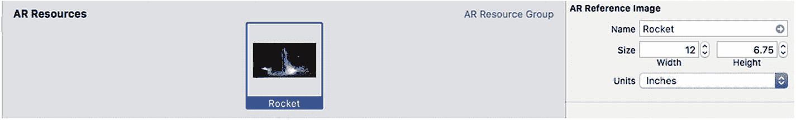
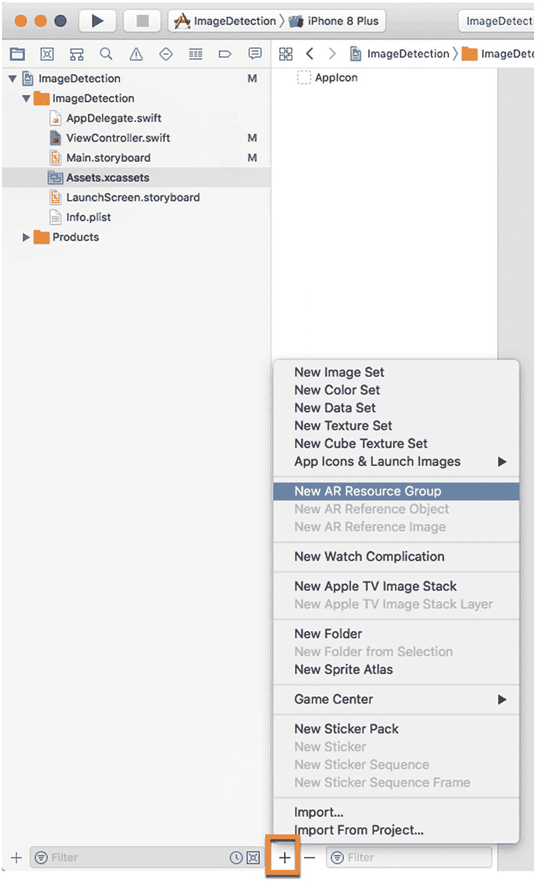
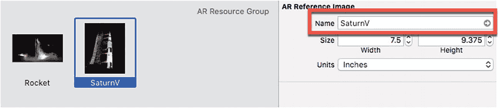
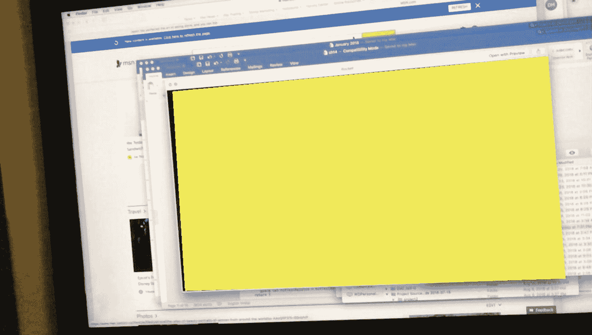
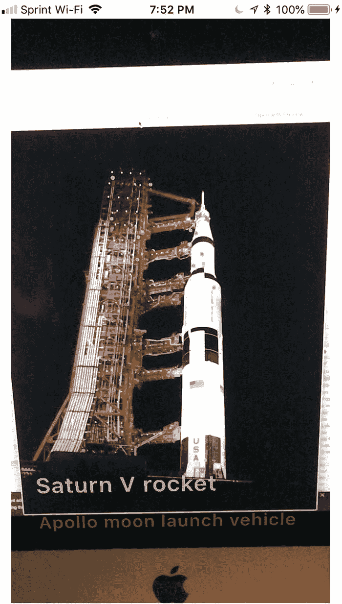

# 图像检测

ARKit 与现实世界交互的另一种方式是通过**图像检测**。图像检测涉及存储图像，然后在通过增强现实视图观看时，利用摄像头识别这些完全相同的图像。

图像检测与机器学习图像识别相似但又有不同。通过图像识别，应用可以识别从未见过的物品，例如不同款式的汽车、铅笔或电脑。而图像检测仅能识别已存储的图像。如果事先没有存储某张图像，图像检测就永远无法识别它。

图像检测非常实用，因为它能让应用识别一张固定图像，然后以不同方式做出响应，例如显示关于该图像的更多信息。举例来说，博物馆可能会提供一款增强现实应用，让用户将 iPhone 对准一幅画作。一旦应用识别出那幅画，它就能以用户的母语（如英语、西班牙语、阿拉伯语或日语）显示关于该画作的附加信息。

为了学习图像检测，让我们按照以下步骤创建一个新的 Xcode 项目：

1. 启动 Xcode。（请确保你使用的是 Xcode 10 或更高版本。）
2. 选择“文件”➤“新建”➤“项目”。Xcode 会要求你选择一个模板。
3. 点击“iOS”类别。
4. 点击“单视图应用”图标，然后点击“下一步”按钮。Xcode 会要求输入产品名称、组织名称、组织标识符和内容技术。
5. 点击“产品名称”文本字段，输入项目的描述性名称，例如`ImageDetection`。（具体名称不重要。）
6. 点击“下一步”按钮。Xcode 会询问你希望将项目存储在哪里。
7. 选择一个文件夹，然后点击“创建”按钮。Xcode 会创建一个 iOS 项目。

现在，按照以下步骤修改`Info.plist`文件，以允许访问摄像头并使用 ARKit：

1. 在导航器面板中点击`Info.plist`文件。Xcode 会显示一个键、类型和值的列表。
2. 点击展开三角形，展开“必需的设备功能”类别，以显示“项目 0”。
3. 将鼠标指针移动到“项目 0”上，显示一个加号（+）图标。
4. 点击这个加号（+）图标，显示一个空白的“项目 1”。
5. 在“项目 1”行的“值”类别下输入`arkit`。
6. 将鼠标指针移动到最后一行，显示一个加号（+）图标。
7. 点击加号（+）图标以创建一个新行。会出现一个弹出菜单。
8. 选择“隐私 - 相机使用说明”。
9. 在“隐私 - 相机使用说明”行的“值”类别下输入`AR 需要使用摄像头`。

现在是时候按照以下步骤修改`ViewController.swift`文件以使用 ARKit 和 SceneKit 了：

1. 在导航器面板中点击`ViewController.swift`文件。
2. 编辑`ViewController.swift`文件，使其看起来像这样：

```
import UIKit
import SceneKit
import ARKit
class ViewController: UIViewController, ARSCNViewDelegate {
    let configuration = ARWorldTrackingConfiguration()
    override func viewDidLoad() {
        super.viewDidLoad()
        // 在这里进行视图加载后的任何额外设置，通常来自 nib 文件
    }
}
```

为了在我们的应用中显示增强现实视图，需要添加一个`ARSCNView`，并将其扩展以填满整个用户界面。然后通过选择“编辑器”➤“解决自动布局问题”➤“重置为建议的约束”（位于菜单下半部分的“容器中的所有视图”类别下）来添加约束。

下一步是将用户界面元素连接到`ViewController.swift`文件中的 Swift 代码。为此，请按照以下步骤操作：

1. 在导航器面板中点击`Main.storyboard`文件。
2. 点击“助理编辑器”图标，或选择“视图”➤“助理编辑器”➤“显示助理编辑器”，以并排显示`Main.storyboard`和`ViewController.swift`文件。
3. 将鼠标指针移动到`ARSCNView`上，按住 Control 键，然后从该类`ViewController`行下方 Ctrl-拖拽。
4. 松开 Control 键和鼠标左键。会出现一个弹出菜单。
5. 点击“名称”文本字段，输入`sceneView`，然后点击“连接”按钮。Xcode 会创建一个`IBOutlet`，如下所示：

```
@IBOutlet var sceneView: ARSCNView!
```

编辑`viewDidLoad`函数，使其看起来像这样：

```
override func viewDidLoad() {
    super.viewDidLoad()
    // 在这里进行视图加载后的任何额外设置，通常来自 nib 文件
    sceneView.debugOptions = [ARSCNDebugOptions.showWorldOrigin, ARSCNDebugOptions.showFeaturePoints]
    sceneView.delegate = self
    sceneView.session.run(configuration)
}
```


## 存储图像

在 ARKit 能够识别现实世界中的物理对象之前，你需要在应用中存储这些物品的图像。除了存储图像，你还必须指定该现实世界物品的宽度和高度。这样，当 ARKit 通过 iOS 设备的摄像头发现实际物品时，它就可以将该图像与存储的图像进行比较。如果外观和尺寸都匹配，那么 ARKit 就能识别出该现实世界物品。

首先，你必须捕获要检测物品的图像。由于这些图像需要高分辨率，你可以从互联网上获取公共领域的图像，例如 NASA 官网（`www.nasa.gov`）。然后，你可以将这些图像显示在电脑屏幕上，供 iOS 设备识别。当你的 Mac 上有了图像后，你需要将其存储到 Xcode 项目中。

要存储一个或多个你希望 ARKit 识别的图像，请遵循以下步骤：

1.  点击宽度和高度文本字段，并输入实际物品的宽度和高度。你也可以点击单位弹出菜单，将默认的测量单位从米更改为其他单位，例如英寸或厘米。



**图 14-2** 定义要识别物品的宽度和高度

2.  将你希望 ARKit 在现实世界中识别的图像拖放到新添加的 AR 资源文件夹中。Xcode 会在图像右下角显示一个黄色警告图标。

3.  点击属性检查器图标，或选择 视图 ➤ 检查器 ➤ 显示属性检查器。将出现一个 AR 参考图像面板，如图 14-2 所示。



**图 14-1** 黄色平面遮挡了绿色盒子

4.  在导航面板中点击 `Assets.xcassets` 文件夹。

5.  点击面板底部的 + 图标。将出现一个弹出菜单。

6.  选择新建 AR 资源组，如图 14-1 所示。Xcode 会创建一个 AR 资源文件夹。

一旦我们添加了期望 ARKit 识别的现实物品的一个或多个图像，就需要编写实际的 Swift 代码，使其在通过 iOS 设备摄像头检测到图像时进行识别。

首先，我们需要访问包含要识别物品图像的文件夹。这个文件夹可以命名为任何名称，例如"AR Resources"。这意味着要使用一个 `guard` 语句来验证图像文件夹是否存在，如下所示：

```
guard let storedImages = ARReferenceImage.referenceImages(inGroupNamed: "AR Resources", bundle: nil) else {
    fatalError("Missing AR Resources images")
}
```

这段代码会查找名为 `AR Resources` 的文件夹。如果找不到，程序将终止并显示"Missing AR Resources Images"。如果找到了 `AR Resources` 文件夹，那么我们可以像这样定义检测到的图像的存储位置：

```
configuration.detectionImages = storedImages
```

最后，我们需要使用 `didAdd renderer` 函数，该函数在摄像头每次更新其视图时运行。如果摄像头检测到已识别的图像（`ARImageAnchor`），那么我们可以通过打印 `"Item recognized"` 来验证这一点，操作如下：

```
func renderer(_ renderer: SCNSceneRenderer, didAdd node: SCNNode, for anchor: ARAnchor) {
    if anchor is ARImageAnchor {
        print("Item recognized")
    }
}
```

整个 `ViewController.swift` 文件应如下所示：

```
import UIKit
import SceneKit
import ARKit

class ViewController: UIViewController, ARSCNViewDelegate {
    @IBOutlet var sceneView: ARSCNView!
    let configuration = ARWorldTrackingConfiguration()

    override func viewDidLoad() {
        super.viewDidLoad()
        // 加载视图后的其他设置（通常来自 nib 文件）
        sceneView.debugOptions = [ARSCNDebugOptions.showWorldOrigin, ARSCNDebugOptions.showFeaturePoints]
        sceneView.delegate = self

        guard let storedImages = ARReferenceImage.referenceImages(inGroupNamed: "AR Resources", bundle: nil) else {
            fatalError("Missing AR Resources images")
        }

        configuration.detectionImages = storedImages
        sceneView.session.run(configuration)
    }

    func renderer(_ renderer: SCNSceneRenderer, didAdd node: SCNNode, for anchor: ARAnchor) {
        if anchor is ARImageAnchor {
            print("Item recognized")
        }
    }
}
```

要测试此应用，请将你拍摄并存储在 `AR Resources` 文件夹中的物品放置在桌子或地板上。然后按照以下步骤操作：

1.  通过 USB 线缆将 iOS 设备连接到 Mac。

2.  点击运行按钮，或选择 产品 ➤ 运行。首次运行此应用时，系统会请求访问摄像头的权限，请授予该权限。

3.  在你的电脑上加载存储在你的项目的 `AR Resources` 文件夹中的图片。

4.  将 iOS 设备的摄像头对准显示你希望 ARKit 识别的图片的屏幕。当 ARKit 识别出图像时，它会在 Xcode 的调试区域中显示 `"Item recognized"`。

5.  点击停止按钮，或选择 产品 ➤ 停止。


## 检测多张图像

仅识别单张图像会有局限性。因此，要让应用识别多张图像，只需在`AR Resources`文件夹中存储多张图像即可。现在，应用将能够识别不同的图像，并根据识别到的图像做出响应。

为了识别 ARKit 具体识别的是哪张图像，你可以为每张图像赋予一个唯一的名称。这样，每次应用识别到图像时，它就能检索该图像的名称，从而精确判断 iOS 设备摄像头前的是哪张图像。

当你在`AR Resources`文件夹中存储图像时，不仅需要定义其宽度和高度，还必须定义其名称。这个名称可以是任意描述性的文字，如图 14-3 所示。



**图 14-3** 每张图像都需要一个唯一名称

一旦你在`AR Resources`文件夹中添加了两张或更多图像，就可以通过检索已识别图像的`name`属性，来判断当前位于 iOS 设备摄像头前的是哪张图像。

为了了解如何识别已识别的图像，让我们按照以下步骤修改`ImageDetection`项目：

1.  将第二张图像拖放至`AR Resources`文件夹中。确保为这第二张图像赋予一个唯一名称，这样存储的两张图像就拥有不同的名字。

2.  在`class ViewController`一行下方，创建如下结构体：

```
struct Images {
    var title: String
    var info: String
}
```

3.  接着，创建一个空数组来存放这个结构体，如下所示：

```
var imageArray: [Images] = []
```

4.  在`viewDidLoad`函数中，添加以下函数调用：

```
getData()
```

5.  在`ViewController.swift`文件的底部，编写如下`getData`函数。在本示例中，项目包含两张火箭图片，因此`getData`函数中的文本也相应体现这一点。当然，你也可以输入任何与你项目中存储的两张图像最匹配的文本：

```
func getData() {
    let item1 = Images(title: "CRS-15 SpaceX rocket", info: "Commercial Resupply Service")
    let item2 = Images(title: "Saturn V rocket", info: "Apollo moon launch vehicle")
    imageArray.append(item1)
    imageArray.append(item2)
}
```

`getData`函数创建了两个结构体，并用文本填充了这些结构体的`title`和`info`属性。然后，它将这个结构体存入一个数组。现在我们需要使用每张图像的`name`属性来识别应用当前识别到的是哪张图像。

6.  编写以下`nodeFor renderer`函数：

```
func renderer(_ renderer: SCNSceneRenderer, nodeFor anchor: ARAnchor) -> SCNNode? {
    guard let imageAnchor = anchor as? ARImageAnchor else { return nil }
    switch imageAnchor.referenceImage.name {
    case "CRS-15":
        print(imageArray[0].title)
        print(imageArray[0].info)
    case "SaturnV":
        print(imageArray[1].title)
        print(imageArray[1].info)
    default:
        print("Nothing found")
    }
    return node
}
```

当识别到图像（`ARImageAnchor`）时，此函数会运行。然后，它使用已识别图像的`name`属性来决定显示哪条信息。整个`ViewController.swift`文件应如下所示：

```
import UIKit
import SceneKit
import ARKit

class ViewController: UIViewController, ARSCNViewDelegate  {
    @IBOutlet var sceneView: ARSCNView!
    let configuration = ARWorldTrackingConfiguration()
    
    struct Images {
        var title: String
        var info: String
    }
    
    var imageArray: [Images] = []
    
    override func viewDidLoad() {
        super.viewDidLoad()
        // Do any additional setup after loading the view, typically from a nib.
        sceneView.debugOptions = [ARSCNDebugOptions.showWorldOrigin, ARSCNDebugOptions.showFeaturePoints]
        sceneView.delegate = self
        
        guard let storedImages = ARReferenceImage.referenceImages(inGroupNamed: "AR Resources", bundle: nil) else {
            fatalError("Missing AR Resources images")
        }
        configuration.detectionImages = storedImages
        
        getData()
        sceneView.session.run(configuration)
    }
    
    func renderer(_ renderer: SCNSceneRenderer, didAdd node: SCNNode, for anchor: ARAnchor) {
        if anchor is ARImageAnchor {
            print("Item recognized")
        }
    }
    
    func renderer(_ renderer: SCNSceneRenderer, nodeFor anchor: ARAnchor) -> SCNNode? {
        guard let imageAnchor = anchor as? ARImageAnchor else { return nil }
        switch imageAnchor.referenceImage.name {
        case "CRS-15":
            print(imageArray[0].title)
            print(imageArray[0].info)
        case "SaturnV":
            print(imageArray[1].title)
            print(imageArray[1].info)
        default:
            print("Nothing found")
        }
        let node = SCNNode()
        node.addChildNode(planeNode)
        return node
    }
    
    func getData() {
        let item1 = Images(title: "CRS-15 SpaceX rocket", info: "Commercial Resupply Service")
        let item2 = Images(title: "Saturn V rocket", info: "Apollo moon launch vehicle")
        imageArray.append(item1)
        imageArray.append(item2)
    }
}
```

要测试此代码，请按以下步骤操作：

1.  通过 USB 线将 iOS 设备连接到你的 Macintosh 电脑。

2.  点击运行按钮，或选择 **产品 ➤ 运行**。

3.  将 iOS 设备的摄像头对准存储在该应用`AR Resources`文件夹中的其中一张图像。

4.  Xcode 的调试区域会显示与你的图像相关的文本。

5.  点击停止按钮，或选择 **产品 ➤ 停止**。


## 在增强现实中显示信息

目前，我们的应用仅将每张图片的信息显示在 Xcode 调试区中，用户是看不到的。我们真正需要做的是，获取每张已识别图片的信息，并在增强现实视图中将其显示出来。

首先，我们需要确定应用所识别图片的边界。我们可以通过创建一个与识别图片精确等宽等高的平面来实现，具体操作如下：

```
let plane = SCNPlane(width: imageAnchor.referenceImage.physicalSize.width, height: imageAnchor.referenceImage.physicalSize.height)
```

现在，我们需要为这个平面赋予颜色，以便我们能够看到它。稍后我们会将该平面设为透明，但现阶段，我们想确保这个平面能完全覆盖任何已识别的图片：

```
plane.firstMaterial?.diffuse.contents = UIColor.yellow
```

接下来，我们需要创建一个节点来承载这个平面。由于这个平面会平铺显示，我们还需要将其旋转 -90 度，以便正面朝向摄像头：

```
let planeNode = SCNNode()
planeNode.geometry = plane
let ninetyDegrees = GLKMathDegreesToRadians(-90)
planeNode.eulerAngles = SCNVector3(ninetyDegrees, 0, 0)
```

最后，我们需要将这个 `planeNode` 添加到增强现实视图中：

```
let node = SCNNode()
node.addChildNode(planeNode)
```

整个 `nodeFor renderer` 函数应该如下所示：

```
func renderer(_ renderer: SCNSceneRenderer, nodeFor anchor: ARAnchor) -> SCNNode? {
    guard let imageAnchor = anchor as? ARImageAnchor else { return nil }
    let plane = SCNPlane(width: imageAnchor.referenceImage.physicalSize.width, height: imageAnchor.referenceImage.physicalSize.height)
    plane.firstMaterial?.diffuse.contents = UIColor.yellow
    let planeNode = SCNNode()
    planeNode.geometry = plane
    let ninetyDegrees = GLKMathDegreesToRadians(-90)
    planeNode.eulerAngles = SCNVector3(ninetyDegrees, 0, 0)
    switch imageAnchor.referenceImage.name {
    case "CRS-15":
        print(imageArray[0].title)
        print(imageArray[0].info)
    case "SaturnV":
        print(imageArray[1].title)
        print(imageArray[1].info)
    default:
        print("Nothing found")
    }
    return node
}
let node = SCNNode()
node.addChildNode(planeNode)
return node
}
```

如果你测试这段代码，你会发现，只要将 iOS 设备的摄像头对准应用能够识别的图片，它就会立即用黄色平面覆盖整张图片，如图 14-4 所示。尝试用不同尺寸的图片进行测试，你会发现黄色平面能正确识别其 `AR Resources` 文件夹中存储的每张图片的形状。



**图 14-4**  
黄色平面完全覆盖了已识别的图片

了解已识别图片尺寸的原因在于，我们可以在该图片的左下角正确显示文本。我们将基于之前创建的结构体来显示每张图片的标题和详细信息：

```
struct Images {
    var title: String
    var info: String
}
```

在编写更多代码之前，既然我们知道这个平面会完全覆盖任何已识别的图片，那我们就不再需要看到这个平面了，因此可以将其设为透明，如下所示：

```
plane.firstMaterial?.diffuse.contents = UIColor.clear
```

尽管这个平面仍然存在，但它对用户是隐藏的。我们只需将这个平面用作参考，这样就能知道文本放置的位置。首先，我们想要将标题文本放置在每个已识别图片的右下角。这涉及到使用我们结构体中存储的标题文本创建 `SCNText`，为其定义 `flatness` 值为 0.1，以及设置字体大小为 10 磅，具体操作如下：

```
let title = SCNText(string: imageArray[0].title, extrusionDepth: 0.0)
title.flatness = 0.1
title.font = UIFont.boldSystemFont(ofSize: 10)
```

现在，我们需要创建一个 `SCNNode`，将 `SCNText` 赋值给该节点，并将其颜色设置为白色，同时按比例缩小其尺寸：

```
let titleNode = SCNNode()
titleNode.geometry = title
titleNode.geometry?.firstMaterial?.diffuse.contents = UIColor.white
titleNode.scale = SCNVector3(0.0015, 0.0015, 0.0015)
```

你可以尝试使用 0.0015 之外的其他缩放值，直到获得你最喜欢的文本外观。最后，我们需要将这个标题文本相对于平面进行定位，并将其添加到 `planeNode` 中，具体操作如下：

```
titleNode.position.x = -Float(plane.width) / 2.2
titleNode.position.y = -Float(plane.height) / 2.2
planeNode.addChildNode(titleNode)
```

x 和 y 位置由平面的宽度和高度除以 2.2 定义。尝试不同的值，这样你就能了解更高或更低的值如何影响文本的位置。

为每张图片显示详细信息文本的方式与此类似：

```
let info = SCNText(string: imageArray[0].info, extrusionDepth: 0.0)
info.flatness = 0.1
info.font = UIFont.boldSystemFont(ofSize: 8)
let infoNode = SCNNode()
infoNode.geometry = info
infoNode.geometry?.firstMaterial?.diffuse.contents = UIColor.gray
infoNode.scale = SCNVector3(0.0015, 0.0015, 0.0015)
infoNode.position.x = -Float(plane.width) / 2.2
infoNode.position.y = -Float(plane.height) / 1.8
planeNode.addChildNode(infoNode)
```

整个 `ViewController.swift` 文件的内容应类似于以下内容，但你可以选择不同的文本来匹配你在 `AR Resources` 文件夹中存储的特定图片。


```swift
import UIKit
import SceneKit
import ARKit
class ViewController: UIViewController, ARSCNViewDelegate  {
@IBOutlet var sceneView: ARSCNView!
let configuration = ARWorldTrackingConfiguration()
struct Images {
var title: String
var info: String
}
var imageArray: [Images] = []
override func viewDidLoad() {
super.viewDidLoad()
// 在加载视图后执行任何额外的设置，通常从 nib 文件加载
sceneView.debugOptions = [ARSCNDebugOptions.showWorldOrigin, ARSCNDebugOptions.showFeaturePoints]
sceneView.delegate = self
guard let storedImages =  ARReferenceImage.referenceImages(inGroupNamed: "AR Resources", bundle: nil) else {
fatalError("缺少 AR Resources 图片")
}
configuration.detectionImages = storedImages
getData()
sceneView.session.run(configuration)
}
func renderer(_ renderer: SCNSceneRenderer, didAdd node: SCNNode, for anchor: ARAnchor) {
if anchor is ARImageAnchor {
print("已识别物品")
}
}
func renderer(_ renderer: SCNSceneRenderer, nodeFor anchor: ARAnchor) -> SCNNode? {
guard let imageAnchor = anchor as? ARImageAnchor else { return nil }
let plane = SCNPlane(width: imageAnchor.referenceImage.physicalSize.width, height: imageAnchor.referenceImage.physicalSize.height)
plane.firstMaterial?.diffuse.contents = UIColor.clear
let planeNode = SCNNode()
planeNode.geometry = plane
let ninetyDegrees = GLKMathDegreesToRadians(-90)
planeNode.eulerAngles = SCNVector3(ninetyDegrees, 0, 0)
switch imageAnchor.referenceImage.name {
case "CRS-15":
let title = SCNText(string: imageArray[0].title, extrusionDepth: 0.0)
title.flatness = 0.1
title.font = UIFont.boldSystemFont(ofSize: 10)
let titleNode = SCNNode()
titleNode.geometry = title
titleNode.geometry?.firstMaterial?.diffuse.contents = UIColor.white
titleNode.scale = SCNVector3(0.0015, 0.0015, 0.0015)
titleNode.position.x = -Float(plane.width) / 2.2
titleNode.position.y = -Float(plane.height) / 2.2
planeNode.addChildNode(titleNode)
let info = SCNText(string: imageArray[0].info, extrusionDepth: 0.0)
info.flatness = 0.1
info.font = UIFont.boldSystemFont(ofSize: 8)
let infoNode = SCNNode()
infoNode.geometry = info
infoNode.geometry?.firstMaterial?.diffuse.contents = UIColor.gray
infoNode.scale = SCNVector3(0.0015, 0.0015, 0.0015)
infoNode.position.x = -Float(plane.width) / 2.2
infoNode.position.y = -Float(plane.height) / 1.8
planeNode.addChildNode(infoNode)
case "SaturnV":
let title = SCNText(string: imageArray[1].title, extrusionDepth: 0.0)
title.flatness = 0.1
title.font = UIFont.boldSystemFont(ofSize: 10)
let titleNode = SCNNode()
titleNode.geometry = title
titleNode.geometry?.firstMaterial?.diffuse.contents = UIColor.white
titleNode.scale = SCNVector3(0.0015, 0.0015, 0.0015)
titleNode.position.x = -Float(plane.width) / 2.2
titleNode.position.y = -Float(plane.height) / 2.2
planeNode.addChildNode(titleNode)
let info = SCNText(string: imageArray[1].info, extrusionDepth: 0.0)
info.flatness = 0.1
info.font = UIFont.boldSystemFont(ofSize: 8)
let infoNode = SCNNode()
infoNode.geometry = info
infoNode.geometry?.firstMaterial?.diffuse.contents = UIColor.gray
infoNode.scale = SCNVector3(0.0015, 0.0015, 0.0015)
infoNode.position.x = -Float(plane.width) / 2.2
infoNode.position.y = -Float(plane.height) / 1.8
planeNode.addChildNode(infoNode)
default:
print("未发现任何内容")
}
let node = SCNNode()
node.addChildNode(planeNode)
return node
}
func getData() {
let item1 = Images(title: "CRS-15 SpaceX 火箭", info: "商业补给服务")
let item2 = Images(title: "土星五号火箭", info: "阿波罗登月运载火箭")
imageArray.append(item1)
imageArray.append(item2)
}
}
```

如果你运行这个应用，你会看到标题文本出现在图像的右下角，而信息文本则显示在下方，如图 14-5 所示。



图 14-5

在增强现实视图中显示文本

## 总结

图像检测的工作原理是将一张或多张图像存储在专门的`AR Resources`文件夹中，然后当 ARKit 识别到其中任何一张存储的图像时，利用 iOS 设备的摄像头运行多个渲染器函数。当你将图像拖放到`AR Resources`文件夹时，必须定义该图像的物理宽度和高度。此外，你还需要为每张图像赋予一个独特的名称，以便之后能使用该名称来识别 iOS 设备摄像头当前找到的是哪张被识别的图像。

一旦你能够利用每张被识别图像的名称来指定具体识别了哪张图像，就可以在增强现实视图中显示与该图像相关的文本。这些文本可以出现在被识别图像的边界之内或之外。

图像检测在高分辨率图片上效果最佳。通过使用图像检测，你的增强现实应用可以响应真实世界中的物体，并以虚拟文本的形式提供关于该物体的信息，这些文本只有通过 iOS 设备的摄像头才能看到。

