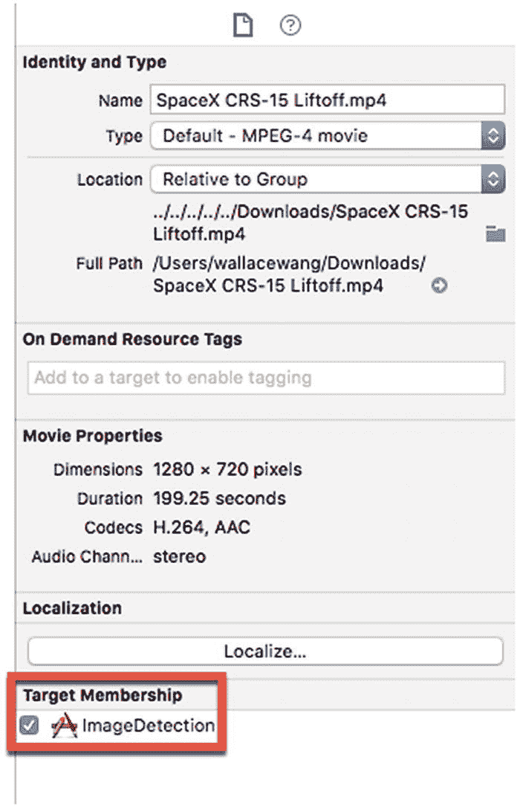
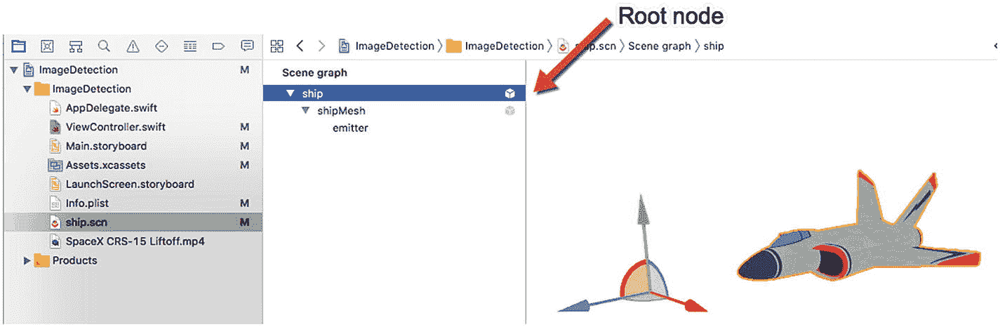
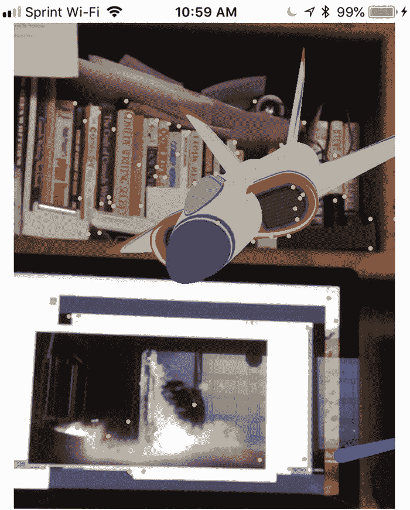
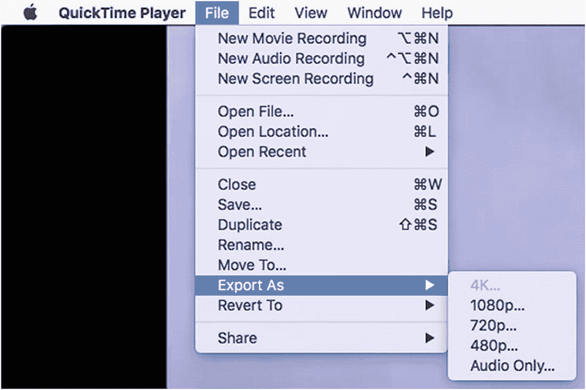

# 15. 显示视频和虚拟模型

在第 14 章中，我们学习了如何使用图像检测来识别特定物品，然后通过显示与该图像相关的文本来进行响应。在本章中，我们将继续使用图像检测，但不再以虚拟对象的形式显示文本，而是学习如何显示视频或虚拟模型。

当在图像检测中使用视频时，用户可以将 iOS 设备的摄像头对准一张静态图像，增强现实视图会在该图像上显示一个视频。

当在图像检测中使用虚拟模型时，用户可以将 iOS 设备的摄像头对准一张静态图像，并看到一个三维虚拟模型漂浮在图像前方的半空中。

为了学习如何在图像检测中使用视频和虚拟模型，我们将修改在第 14 章中创建的图像检测项目。你可以复制该项目，或者直接修改现有的代码。

首先，让我们编辑项目中的代码，为添加显示视频和虚拟模型的代码腾出空间。删除`nodeFor renderer`函数中`switch`语句内的所有代码，使其看起来像这样：

```
switch imageAnchor.referenceImage.name {
case "CRS-15":
print("第一张图片")
case "SaturnV":
print("第二张图片")
default:
print("未发现任何内容")
}
```

现在我们需要将一个`.scn`文件拖放到我们的 Xcode 项目中。最简单的做法是选择“文件”➤“新建”➤“项目”来创建一个增强现实应用。这会创建一个示例增强现实应用，其中在`art.scnassets`文件夹内包含`ship.scn` SceneKit 文件。

将两个 Xcode 窗口并排放置，从示例增强现实项目的 Xcode 窗口中，将`ship.scn`及其附带的`texture.png`文件拖放到当前项目 Xcode 窗口的导航器窗格中。

现在你还需要将一个`.mov`视频文件拖放到导航器窗格中。这个视频可以是任何你想要的，比如从你的 iPhone 上捕获的视频，或者从互联网上下载的视频文件。

当你将`ship.scn`和一个`.mov`文件都放入当前项目的导航器窗格后，点击每个文件，并确保在“目标成员”类别下选中了复选框，如图 15-1 所示。如果“目标成员”复选框未被选中，即使文件出现在导航器窗格中，Xcode 也不会将其包含在当前项目中。



图 15-1

必须为你的`.scn`和`.mp4`文件选中“目标成员”复选框


## 在半空中显示虚拟对象

目标是让 ARKit 使用图像检测来识别现实世界中的图像。一旦识别出图像，它便会在该图像前方显示一个虚拟对象。所有代码都将写在 `nodeFor(renderer:)` 函数中的 `switch` 语句内。要在识别图像后显示虚拟对象，请遵循以下步骤：

1.  在 `switch` 语句的第一个 `case` 中编写以下代码，以创建一个代表 `ship.scn` 虚拟对象的变量，具体如下：
    ```
    let item = SCNScene(named: "ship.scn")
    ```

2.  现在，我们需要通过编写以下代码行来识别虚拟对象的父节点或根节点：
    ```
    let itemNode = item?.rootNode.childNode(withName: "ship", recursively: true)
    ```

3.  接下来，我们需要通过从 `ARImageAnchor` 中获取位置，将虚拟对象节点放置在增强现实视图中：
    ```
    itemNode?.position = SCNVector3(anchor.transform.columns.3.x, anchor.transform.columns.3.y, anchor.transform.columns.3.z)
    sceneView.scene.rootNode.addChildNode(itemNode!)
    ```

到目前为止，代码会识别第一张图像，然后在半空中显示 `ship.scn`。然而，为了创造更有趣的视觉效果，我们还可以让虚拟对象旋转。

4.  在第 3 步的代码上方添加以下两行代码。以下代码定义了围绕 x、y 和 z 轴的旋转，并让此旋转动画永远持续：
    ```
    let rotateMe = SCNAction.rotateBy(x: 0.5, y: 0.1, z: 0.2, duration: 1)
    let repeatMe = SCNAction.repeatForever(rotateMe)
    itemNode?.runAction(repeatMe)
    ```



图 15-2 – 识别图像的根节点名称

1.  在导航窗格中点击 `ship.scn` 文件。Xcode 会同时显示该图像以及构成该图像的节点列表，如图 15-2 所示。`ship.scn` 文件的根节点名称是“ship”。

x、y 和 z 轴的旋转值是任意的，因此，请随意尝试不同的值，以便观察它们如何改变虚拟对象的旋转。

整个 `ViewController.swift` 文件应如下所示：
```
import UIKit
import SceneKit
import ARKit
class ViewController: UIViewController, ARSCNViewDelegate  {
@IBOutlet var sceneView: ARSCNView!
let configuration = ARWorldTrackingConfiguration()
struct Images {
var title: String
var info: String
}
var imageArray: [Images] = []
override func viewDidLoad() {
super.viewDidLoad()
// Do any additional setup after loading the view, typically from a nib.
sceneView.debugOptions = [ARSCNDebugOptions.showWorldOrigin, ARSCNDebugOptions.showFeaturePoints]
sceneView.delegate = self
guard let storedImages =  ARReferenceImage.referenceImages(inGroupNamed: "AR Resources", bundle: nil) else {
fatalError("Missing AR Resources images")
}
configuration.detectionImages = storedImages
getData()
sceneView.session.run(configuration)
}
func renderer(_ renderer: SCNSceneRenderer, nodeFor anchor: ARAnchor) -> SCNNode? {
guard let imageAnchor = anchor as? ARImageAnchor else { return nil }
let plane = SCNPlane(width: imageAnchor.referenceImage.physicalSize.width, height: imageAnchor.referenceImage.physicalSize.height)
plane.firstMaterial?.diffuse.contents = UIColor.clear
let planeNode = SCNNode()
planeNode.geometry = plane
let ninetyDegrees = GLKMathDegreesToRadians(-90)
planeNode.eulerAngles = SCNVector3(ninetyDegrees, 0, 0)
switch imageAnchor.referenceImage.name {
case "CRS-15":
print("1st image")
let item = SCNScene(named: "ship.scn")
let itemNode = item?.rootNode.childNode(withName: "ship", recursively: true)
let rotateMe = SCNAction.rotateBy(x: 0.5, y: 0.1, z: 0.2, duration: 1)
let repeatMe = SCNAction.repeatForever(rotateMe)
itemNode?.runAction(repeatMe)
itemNode?.position = SCNVector3(anchor.transform.columns.3.x, anchor.transform.columns.3.y,anchor.transform.columns.3.z)
sceneView.scene.rootNode.addChildNode(itemNode!)
case "SaturnV":
print("2nd image")
default:
print("Nothing found")
}
let node = SCNNode()
node.addChildNode(planeNode)
return node
}
func getData() {
let item1 = Images(title: "CRS-15 SpaceX rocket", info: "Commercial Resupply Service")
let item2 = Images(title: "Saturn V rocket", info: "Apollo moon launch vehicle")
imageArray.append(item1)
imageArray.append(item2)
}
}
```

要测试此应用，请遵循以下步骤：

1.  点击停止按钮，或选择“产品” ➤ “停止”。



图 15-3 – 当应用识别出第一张图像时，`ship.scn` 虚拟对象出现并旋转

2.  通过 USB 线缆将 iOS 设备连接到你的 Macintosh。
3.  点击运行按钮，或选择“产品” ➤ “运行”。
4.  在电脑上加载你存储在项目“AR Resources”文件夹中的第一张图片。
5.  将 iOS 设备的摄像头对准显示你想要 ARKit 识别的图片的屏幕。当 ARKit 识别出图像时，它会显示 `ship.scn` 虚拟对象，该对象会在空中缓慢旋转，如图 15-3 所示。

重复上述步骤，但将 iOS 设备的摄像头对准存储在“AR Resources”文件夹中的第二张图像。注意，第二个虚拟对象不会出现。


## 在平面上显示视频

在检测到图像后，应用可以通过文本或显示虚拟对象来呈现附加信息。应用的另一种响应方式，是在检测到的图像上播放视频，使图像仿佛有了生命。

第一步是将任何视频文件转换为 QuickTime 的 `.mov` 格式。为此，只需加载 `QuickTime Player` 程序，并加载当前存储为其他格式（例如 `.mp4`）的视频文件。然后选择“文件”➤“导出”。选择一个视频分辨率，如 480p 或 720p，如图 15-4 所示。请注意，更高的分辨率意味着更大的视频文件大小。选择视频分辨率后，`QuickTime Player` 会将视频保存为 QuickTime 影片。



**图 15-4** `QuickTime Player` 程序可以导出 QuickTime `.mov` 文件

在尝试显示视频之前，我们需要确保能通过 iOS 设备的摄像头看到增强现实视图：

```
guard let currentFrame = sceneView.session.currentFrame else { return nil }
```

要播放视频，我们可以使用一个名为 `SKVideoNode` 的 SceneKit 类，它可以加载 QuickTime `.mov` 文件并立即播放，如下所示：

```
let videoNode = SKVideoNode(fileNamed: "SaturnV.mov")
videoNode.play()
```

接下来，我们需要在一个 `SKScene` 类中定义这个 `videoNode`，在该类中定义视频大小、缩放比例（如 `aspectFill` 以保持原始视频的宽高比，无论其所在的平面大小如何），然后将该 `videoNode` 添加到 `SKScene` 中。最后，我们需要将 `videoNode` 定位在中间，如下所示：

```
let videoScene = SKScene(size: CGSize(width: 640, height: 480))
videoScene.scaleMode = .aspectFit
videoScene.addChild(videoNode)
videoNode.position = CGPoint(x: videoScene.size.width/2, y: videoScene.size.height/2)
```

现在，我们需要创建一个将覆盖在检测到的图像上的平面。该平面需要与检测到的图像尺寸完全相同，然后显示视频。视频还需要在平面的两侧播放，因为我们将要翻转这个平面：

```
let videoPlane = SCNPlane(width: imageAnchor.referenceImage.physicalSize.width, height: imageAnchor.referenceImage.physicalSize.height)
videoPlane.firstMaterial?.diffuse.contents = videoScene
videoPlane.firstMaterial?.isDoubleSided = true
```

现在，我们需要创建一个 `SCNNode` 来容纳该平面（它显示视频）。这个 `SCNNode` 将持有该平面，然后我们需要翻转该平面，并将其定位在覆盖检测到的图像的平面上方。最后，我们需要将该平面添加到 `planeNode` 上：

```
let tvPlaneNode = SCNNode(geometry: videoPlane)
var translation = matrix_identity_float4x4
translation.columns.3.z = -1.0
tvPlaneNode.simdTransform = matrix_multiply(currentFrame.camera.transform, translation)
tvPlaneNode.eulerAngles = SCNVector3(Double.pi, 0, 0)
tvPlaneNode.position = SCNVector3(0,0,0)
planeNode.addChildNode(tvPlaneNode)
```

完整的 `ViewController.swift` 文件应如下所示：

```
import UIKit
import SceneKit
import ARKit
class ViewController: UIViewController, ARSCNViewDelegate  {
@IBOutlet var sceneView: ARSCNView!
let configuration = ARWorldTrackingConfiguration()
struct Images {
var title: String
var info: String
}
var imageArray: [Images] = []
override func viewDidLoad() {
super.viewDidLoad()
// 在此处添加视图加载后的任何其他设置，通常从 nib 文件加载。
sceneView.debugOptions = [ARSCNDebugOptions.showWorldOrigin, ARSCNDebugOptions.showFeaturePoints]
sceneView.delegate = self
guard let storedImages =  ARReferenceImage.referenceImages(inGroupNamed: "AR Resources", bundle: nil) else {
fatalError("缺少 AR 资源图像")
}
configuration.detectionImages = storedImages
getData()
sceneView.session.run(configuration)
}
func renderer(_ renderer: SCNSceneRenderer, nodeFor anchor: ARAnchor) -> SCNNode? {
guard let imageAnchor = anchor as? ARImageAnchor else { return nil }
let plane = SCNPlane(width: imageAnchor.referenceImage.physicalSize.width, height: imageAnchor.referenceImage.physicalSize.height)
plane.firstMaterial?.diffuse.contents = UIColor.clear
let planeNode = SCNNode()
planeNode.geometry = plane
let ninetyDegrees = GLKMathDegreesToRadians(-90)
planeNode.eulerAngles = SCNVector3(ninetyDegrees, 0, 0)
switch imageAnchor.referenceImage.name {
case "CRS-15":
print("第一张图片")
let item = SCNScene(named: "ship.scn")
let itemNode = item?.rootNode.childNode(withName: "ship", recursively: true)
let rotateMe = SCNAction.rotateBy(x: 0.5, y: 0.1, z: 0.2, duration: 1)
let repeatMe = SCNAction.repeatForever(rotateMe)
itemNode?.runAction(repeatMe)
itemNode?.position = SCNVector3(anchor.transform.columns.3.x, anchor.transform.columns.3.y,anchor.transform.columns.3.z)
sceneView.scene.rootNode.addChildNode(itemNode!)
case "SaturnV":
print("第二张图片")
guard let currentFrame = sceneView.session.currentFrame else { return nil }
let videoNode = SKVideoNode(fileNamed: "SaturnV.mov")
videoNode.play()
let videoScene = SKScene(size: CGSize(width: 640, height: 480))
videoScene.scaleMode = .aspectFit
videoScene.addChild(videoNode)
videoNode.position = CGPoint(x: videoScene.size.width/2, y: videoScene.size.height/2)
let videoPlane = SCNPlane(width: imageAnchor.referenceImage.physicalSize.width, height: imageAnchor.referenceImage.physicalSize.height)
videoPlane.firstMaterial?.diffuse.contents = videoScene
videoPlane.firstMaterial?.isDoubleSided = true
let tvPlaneNode = SCNNode(geometry: videoPlane)
var translation = matrix_identity_float4x4
translation.columns.3.z = -1.0
tvPlaneNode.simdTransform = matrix_multiply(currentFrame.camera.transform, translation)
tvPlaneNode.eulerAngles = SCNVector3(Double.pi, 0, 0)
tvPlaneNode.position = SCNVector3(0,0,0)
planeNode.addChildNode(tvPlaneNode)
default:
print("未发现任何内容")
}
let node = SCNNode()
node.addChildNode(planeNode)
return node
}
func getData() {
let item1 = Images(title: "CRS-15 SpaceX 火箭", info: "商业补给服务")
let item2 = Images(title: "土星五号火箭", info: "阿波罗月球发射运载火箭")
imageArray.append(item1)
imageArray.append(item2)
}
}
```

要测试此代码，请按照以下步骤操作：

1. 通过 USB 线缆将 iOS 设备连接到 Macintosh 电脑。
2. 点击“运行”按钮，或选择“产品”➤“运行”。
3. 在电脑屏幕上显示一张存储在应用 `AR Resources` 文件夹中的图像。
4. 将 iOS 设备的摄像头对准存储在应用 `AR Resources` 文件夹中的一张图像。
5. 视频开始在检测到的图像上播放。请注意，视频大小与检测到的图像大小相同。
6. 点击“停止”按钮，或选择“产品”➤“停止”。

## 总结

图像检测可以识别出已识别的图像，但应用仍需一种方式来响应用户并提供更多信息。在许多情况下，显示文本是合适的，但提供附加信息的另外两种方式是通过显示虚拟对象或播放视频。

显示虚拟对象可以提供物品的三维视图，同时使用动画让增强现实视图变得生动。显示视频可以使检测到的图像从静态图像变为提供进一步信息的视频。

虚拟对象和视频只是增强现实针对检测到图像进行响应并提供特定图像附加信息的两种方式。


