# 16. 图像跟踪与物体检测

在前面的章节中，我们学习了图像检测技术。它能够让应用识别存储在 `AR Resources` 文件夹中的图像，并在 iOS 设备摄像头识别到现实世界中的该图像时做出响应。图像检测适用于图片和照片等二维物品，但 ARKit 2.0 和 iOS 12 在图像检测基础上增加了两项新功能：**图像跟踪**和**物体检测**。

目前的图像检测技术是通过将文本、虚拟物体或视频链接到被检测图像的位置来实现的。但是，如果被检测的图像发生了移动，那么所显示的文本、虚拟物体或视频并不会随之移动。正因如此，ARKit 2.0 推出了图像跟踪功能，它允许文本、虚拟物体或视频随着被检测图像的移动而移动。

尽管图像检测功能令人印象深刻，但它仅限于图片或照片等二维物品。为了克服这个限制，ARKit 2.0 提供了物体检测功能。首先，你可以扫描一个三维物体。然后，你可以将这个三维物体的扫描数据存储在你的增强现实应用中。

一旦用户扫描到同一个物品，增强现实应用就能识别出这个三维物体，并像图像检测一样，通过显示文本、虚拟物体或视频来做出响应。图像检测针对的是二维平面物品，而物体检测则针对三维物体，这使得用户无论从 iOS 摄像头的哪个位置或角度，都能获取到该物体的相关信息。

在本章中，让我们按照以下步骤创建一个新的 Xcode 项目：

1.  启动 Xcode。（请确保你使用的是 Xcode 10 或更高版本。）
2.  选择“文件”➤“新建”➤“项目”。Xcode 会要求你选择一个模板。
3.  点击 iOS 类别。
4.  点击“单视图应用”图标，然后点击“下一步”按钮。Xcode 会要求输入产品名称、组织名称、组织标识符以及内容技术。
5.  点击“产品名称”文本框，为你的项目输入一个描述性名称，例如 `ImageTracking`。（具体的名称不重要。）
6.  点击“下一步”按钮。Xcode 会询问你项目的存储位置。
7.  选择一个文件夹，然后点击“创建”按钮。Xcode 会创建一个 iOS 项目。

现在，按照以下步骤修改 `Info.plist` 文件，以允许访问摄像头并使用 ARKit：

1.  在导航窗格中点击 `Info.plist` 文件。Xcode 会显示一个包含键、类型和值的列表。
2.  点击展开三角标，展开“所需设备功能”类别，以显示 Item 0。
3.  将鼠标指针移动到 Item 0 上，显示一个加号（+）图标。
4.  点击这个加号（+）图标，显示一个空白的 Item 1。
5.  在 Item 1 行的“值”类别下输入 `arkit`。
6.  将鼠标指针移动到最后一行上，显示一个加号（+）图标。
7.  点击加号（+）图标创建一个新行。会弹出一个菜单。
8.  选择“隐私 - 相机使用说明”。
9.  在“隐私 - 相机使用说明”行的“值”类别下输入 `AR 需要使用摄像头`。

现在，是时候按照以下步骤修改 `ViewController.swift` 文件来使用 ARKit 和 SceneKit 了：

1.  在导航窗格中点击 `ViewController.swift` 文件。
2.  编辑 `ViewController.swift` 文件，使其内容如下：

```
    import UIKit
    import SceneKit
    import ARKit
    class ViewController: UIViewController, ARSCNViewDelegate {
    let configuration = ARImageTrackingConfiguration()
    override func viewDidLoad() {
    super.viewDidLoad()
    // 在此处执行视图加载后的任何额外设置，通常从 nib 文件加载。
    }
    }
```

需要注意的最重要的一行是定义了 `ARImageTrackingConfiguration` 的那一行：

```
let configuration = ARImageTrackingConfiguration()
```

之前，我们只定义过 `ARWorldTrackingConfiguration`，但我们需要 `ARImageTrackingConfiguration` 来让我们的增强现实应用在检测到的图像移动时对其进行跟踪。

要在我们的应用中查看增强现实效果，请添加一个 ARKit SceneKit 视图（`ARSCNView`），使其充满整个视图。设计好用户界面后，需要添加约束。要添加约束，请选择“编辑器”➤“解决自动布局问题”➤“重置为建议的约束”，该选项位于菜单底部“容器中的所有视图”类别下。

下一步是将用户界面元素连接到 `ViewController.swift` 文件中的 Swift 代码。为此，请遵循以下步骤：

1.  在导航窗格中点击 `Main.storyboard` 文件。
2.  点击助理编辑器图标，或者选择“视图”➤“助理编辑器”➤“显示助理编辑器”，以便并排显示 `Main.storyboard` 和 `ViewController.swift` 文件。
3.  将鼠标指针移动到 `ARSCNView` 上，按住 Control 键，然后从 `class ViewController` 行下方开始 Control-拖拽。
4.  释放 Control 键和鼠标左键。会弹出一个菜单。
5.  点击“名称”文本框，输入 `sceneView`，然后点击“连接”按钮。Xcode 会创建一个 `IBOutlet`，如下所示：

```
    @IBOutlet var sceneView: ARSCNView!
```

6.  编辑 `viewDidLoad` 函数，使其内容如下：

```
    override func viewDidLoad() {
    super.viewDidLoad()
    // 在此处执行视图加载后的任何额外设置，通常从 nib 文件加载。
    sceneView.debugOptions = [ARSCNDebugOptions.showWorldOrigin, ARSCNDebugOptions.showFeaturePoints]
    sceneView.delegate = self
    sceneView.session.run(configuration)
    }
```

请记住，只有在你将物品的图像存储到应用中之后，ARKit 才能识别现实世界中的实物。除了存储图像，你还必须指定该实物在现实世界中的宽度和高度。这样，当 ARKit 通过 iOS 设备的摄像头发现实际物品时，它可以将其图像与存储的图像进行比较。如果外观和尺寸都匹配，那么 ARKit 就能识别出这个实物。

首先，你必须捕捉要检测物品的图像。由于这些图像需要高分辨率，你可以从互联网上获取公有领域的图像，例如从 NASA（`www.nasa.gov`）获取。然后，你可以将这些图像显示在笔记本电脑或 iPad 屏幕上，供你的 iOS 设备识别。

要按照以下步骤存储一个或多个希望 ARKit 识别的图像：

1.  在“宽度”和“高度”文本框中点击并输入实物的实际宽度和高度。你也可以点击“单位”弹出菜单，将默认的测量单位从米更改为其他单位，例如英寸或厘米。

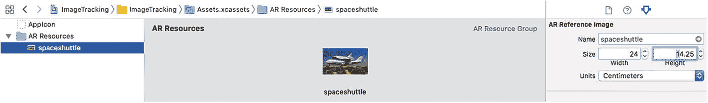

图 16-1 定义待识别物品的宽度和高度

2.  在导航窗格中点击 `Assets.xcassets` 文件夹。
3.  点击窗格底部的加号（+）图标。会弹出一个菜单。
4.  选择“新建 AR 资源组”。Xcode 会创建一个 `AR Resources` 文件夹。
5.  拖拽你希望 ARKit 在现实世界中识别的图像到该文件夹中。Xcode 会在图像右下角显示一个黄色警告图标。
6.  点击属性检查器图标，或者选择“视图”➤“检查器”➤“显示属性检查器”。会出现一个“AR 参考图像”窗格，如图 16-1 所示。

一旦我们添加了一个或多个希望 ARKit 识别的实物图像，就需要编写实际的 Swift 代码，以便在通过 iOS 设备摄像头发现图像时进行识别。

首先，我们需要访问包含待识别物品图像的文件夹。这个文件夹可以任意命名，例如 `AR Resources`。这意味着需要使用一个 `guard` 语句来验证图像文件夹是否存在，如下所示：

```
guard let storedImages =  ARReferenceImage.referenceImages(inGroupNamed: "AR Resources", bundle: nil) else {
fatalError("缺少 AR Resources 图像")
}
```


该代码会查找名为`AR Resources`的文件夹。如果未能找到，程序会终止并显示`"Missing AR Resources images"`。若找到`AR Resources`文件夹，我们便可以定义检测到的图像存储位置，如下所示：

```
configuration.trackingImages = storedImages
```

请注意，这行代码使用的是`trackingImages`而非`detectionImages`。使用`detectionImages`时，只有当图像保持静止时应用才能识别。而使用`trackingImages`，如果被检测图像发生移动，应用也能随之追踪。

最后，我们需要使用`didAdd renderer`函数，该函数在摄像头每次更新视图时运行。如果摄像头检测到已识别的图像（`ARImageAnchor`），我们就要在被检测图像附近显示一个虚拟物体。

在前面示例中，我们通过将虚拟物体附加到场景的`rootNode`上来向检测到的图像显示虚拟物体，方式如下：

```
sceneView.scene.rootNode.addChildNode(objectNode)
```

然而，这会将虚拟物体绑定到增强现实视图中的特定位置。我们期望的是将虚拟物体绑定到检测到的图像上，如下所示：

```
node.addChildNode(objectNode)
```

这样一来，如果被检测图像移动，虚拟物体也会随之移动。要检测和追踪已存储的图像，我们需要使用`didAdd renderer`函数。首先，要确保我们将检测到的存储图像识别为`ARImageAnchor`，具体做法如下：

```
func renderer(_ renderer: SCNSceneRenderer, didAdd node: SCNNode, for anchor: ARAnchor) {
if anchor is ARImageAnchor {
}
}
```

然后，我们可以创建一个虚拟物体，使其出现在检测到的图像上方。在本示例中，我们将按如下方式创建文本：

```
let movingImage = SCNText(string: "Moving Text", extrusionDepth: 0.0)
movingImage.flatness = 0.1
movingImage.font = UIFont.boldSystemFont(ofSize: 10)
```

接下来，我们需要将这个`SCNText`存储在一个节点中，因此需通过定义颜色和缩放来定义节点：

```
let titleNode = SCNNode()
titleNode.geometry = movingImage
titleNode.geometry?.firstMaterial?.diffuse.contents = UIColor.white
titleNode.scale = SCNVector3(0.0015, 0.0015, 0.0015)
```

然后，我们只需将包含`SCNText`的节点添加到检测到的图像上：

```
node.addChildNode(titleNode)
```

完整的`ViewController.swift`文件应如下所示：

```
import UIKit
import SceneKit
import ARKit
class ViewController: UIViewController, ARSCNViewDelegate {
@IBOutlet var sceneView: ARSCNView!
let configuration = ARImageTrackingConfiguration()
override func viewDidLoad() {
super.viewDidLoad()
// 在加载视图后，进行任何额外的设置，通常是从 nib 文件加载。
sceneView.debugOptions = [ARSCNDebugOptions.showWorldOrigin, ARSCNDebugOptions.showFeaturePoints]
sceneView.delegate = self
guard let storedImages =  ARReferenceImage.referenceImages(inGroupNamed: "AR Resources", bundle: nil) else {
fatalError("Missing AR Resources images")
}
configuration.trackingImages = storedImages
sceneView.session.run(configuration)
}
func renderer(_ renderer: SCNSceneRenderer, didAdd node: SCNNode, for anchor: ARAnchor) {
if anchor is ARImageAnchor {
let movingImage = SCNText(string: "Moving Text", extrusionDepth: 0.0)
movingImage.flatness = 0.1
movingImage.font = UIFont.boldSystemFont(ofSize: 10)
let titleNode = SCNNode()
titleNode.geometry = movingImage
titleNode.geometry?.firstMaterial?.diffuse.contents = UIColor.white
titleNode.scale = SCNVector3(0.0015, 0.0015, 0.0015)
node.addChildNode(titleNode)
}
}
}
```

要测试此应用，请将你已拍照并存储在`AR Resources`文件夹中的物品，放在笔记本电脑或 iPad 上展示，并将这些设备置于桌子或地板上。然后按照以下步骤操作：

1. 移动正在显示已检测图像的笔记本电脑或 iPad 屏幕。注意，移动检测图像时，虚拟物体（`"Moving Text"`）会随之移动，始终保持与检测图像的距离和方向一致。

2. 点击“停止”按钮，或选择“产品”>“停止”。

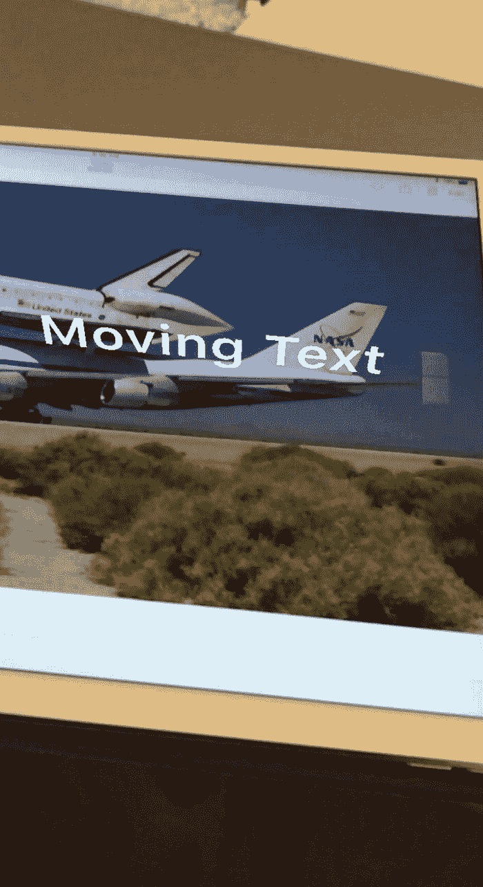

图 16-2

即使移动检测图像，文本仍在检测到的图像上方显示。

3. 通过 USB 线将 iOS 设备连接到 Macintosh。

4. 点击“运行”按钮，或选择“产品”>“运行”。首次运行此应用时，会请求访问摄像头的权限，请授予权限。

5. 使用你存储在项目`AR Resources`文件夹中的图片，在笔记本电脑或 iPad 屏幕上显示该图片。

6. 将 iOS 设备的摄像头对准显示该图片的屏幕，以便 ARKit 识别。当 ARKit 识别出图像时，它会在检测到的图像上方显示文本`"Moving Text"`，如图 16-2 所示。

## 检测物体

在图像检测中，我们需要将应用要检测的实际图像存储在一个专门的`AR Resources`文件夹中。物体检测的工作原理与此类似，区别在于物体检测不是存储单张图像，而是将物体的三维空间特征存储在`AR Resources`文件夹中。要获取日后要检测的物体的三维空间特征，我们必须提前扫描该图像，并将扫描得到的图像表示存储在应用中。

要在应用中启用物体检测，必须遵循以下步骤：

1. 使用苹果的扫描应用扫描你希望应用检测的物体。这会将该物体的三维空间表示存储为`.arobject`文件格式。

2. 将这个`.arobject`文件存储在你自己的应用的`AR Resources`文件夹中。

3. 编写 Swift 代码，使应用在检测到由`.arobject`文件定义的物体时做出响应。


## 扫描对象

你的应用检测物体的能力，其质量取决于事先对该物体的准确扫描。进行扫描需要使用一台运行**iOS 12**且至少配备**A9 处理器**的设备（iPhone 6s、iPhone 6s Plus、iPhone SE 以及 2017 款 iPad）。设备越新（摄像头分辨率更高、处理器速度更快等），扫描捕获的参考数据质量就越好。

为了提高扫描精度，请将你想要检测的物体放在一个平坦且无任何其他物品的表面上。这样扫描就能仅专注于你想要的检测对象。

首先，你需要在 iOS 12 设备上安装 Apple 的 ARKit Scanner 应用。要获取此 ARKit Scanner 应用，请按照以下步骤操作：

1.  访问 `https://developer.apple.com/documentation/arkit/scanning_and_detecting_3d_objects` 并下载 `ScanningApp`，其中包含 Swift 源代码。
2.  在 Xcode 中打开这个 `ScanningApp` 项目。
3.  使用 USB 线将 iOS 12 设备连接到你的 Macintosh 电脑。
4.  点击“运行”按钮或选择“产品”➤“运行”。这会将 ARKit Scanner 应用安装到你的 iOS 设备上。
5.  点击“停止”按钮或选择“产品”➤“停止”。此时，你可以断开 iOS 12 设备与 Macintosh 的连接。

一旦你在 iOS 12 设备上安装了 Apple 的 ARKit Scanner，就可以开始扫描物体了。要扫描一个项目，请按照以下步骤操作：

1.  将你想要应用检测的物体放在一个平坦、光线良好且无其他物品的表面上。
2.  在 iOS 12 设备上运行 ARKit Scanner 应用。
3.  将 iOS 设备的摄像头对准物体，直到一个卡通样式的边界框包围住你想要检测的物体，如图 16-3 所示。

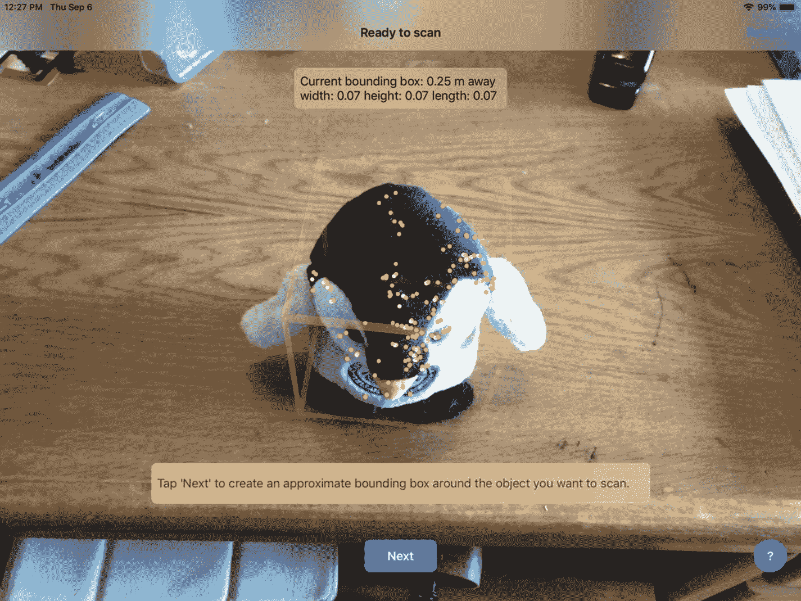

图 16-3：边界框定义了待检测物体的区域

4.  当物体出现在边界框内并居中时，点击“下一步”按钮。ARKit Scanner 应用会在物体周围显示边界框以及关于该物体的测量信息，如图 16-4 所示。

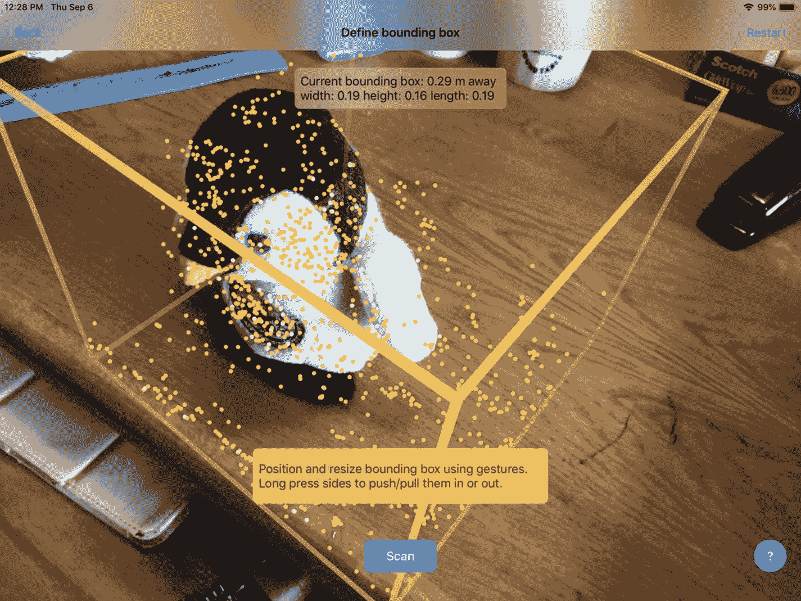

图 16-4：边界框包围了你要检测的物体

5.  点击“扫描”按钮并围绕物体移动。当你移动时，应用会在边界框的侧面和顶部显示黄色平面，以提示它可以检测到的角度，如图 16-5 所示。目标是移动你的 iOS 设备摄像头，覆盖物体的所有侧面和顶部，直到黄色平面完全覆盖整个边界框。

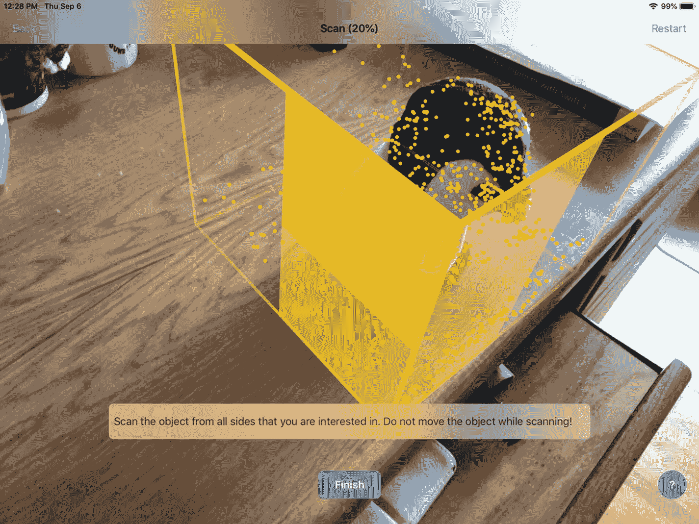

图 16-5：当你扫描物体时，黄色平面会显示你已经扫描过的区域

6.  当黄色平面完全覆盖边界框的所有侧面时，点击“完成”按钮。ARKit Scanner 应用现在会显示检测到的物体的原点，您可以根据需要移动它，如图 16-6 所示。

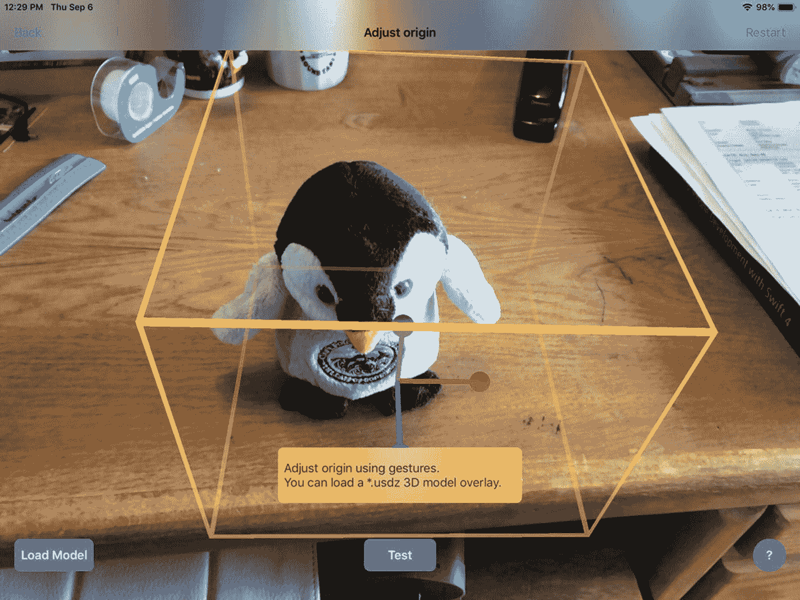

图 16-6：扫描物体后，你可以移动它的原点

7.  通过在原点上滑动手指来移动原点，然后点击“测试”按钮。
8.  将物体移动到一个新位置，并将 iOS 设备的摄像头对准它，以确保 ARKit Scanner 应用能够识别该物体，如图 16-7 所示。

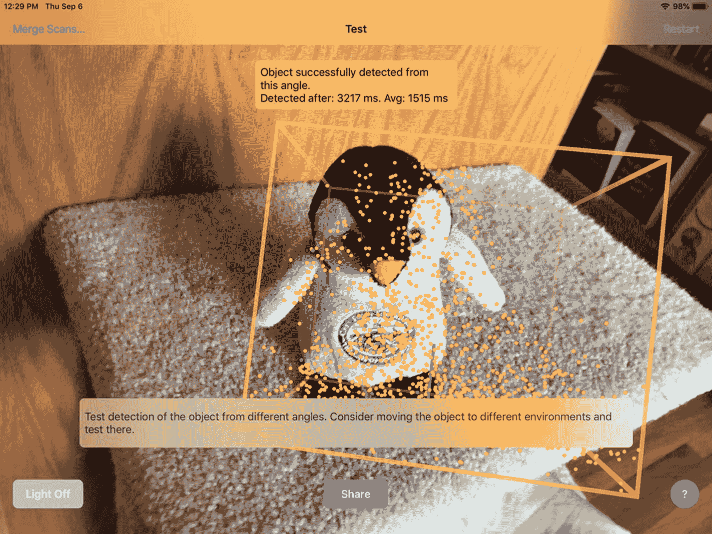

图 16-7：测试物体检测是否成功

9.  在你的 Macintosh 上，打开一个 Finder 窗口并选择“前往”➤“隔空投送”以打开一个隔空投送窗口，如图 16-8 所示。

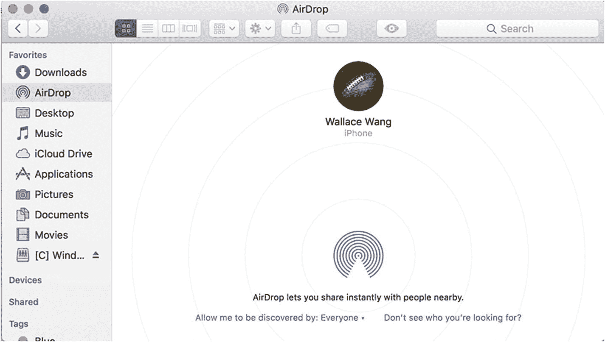

图 16-8：在 Macintosh 上开启隔空投送

10. 在 ARKit Scanner 界面中点击“共享”按钮。会弹出一个窗口，让你选择如何共享 `.arobject` 文件，如图 16-9 所示。

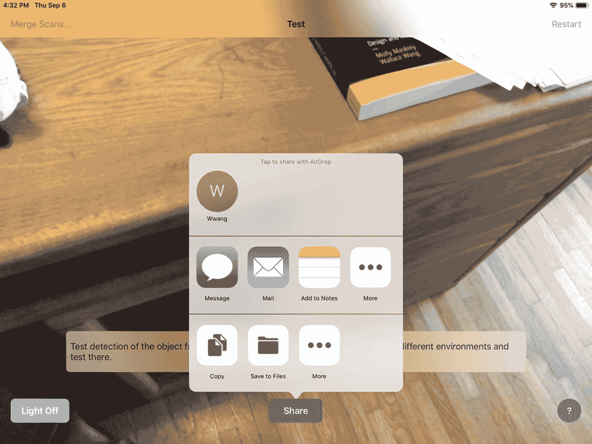

图 16-9：从 iOS 设备访问隔空投送

11. 点击代表你 Macintosh 的顶部灰色圆形图标，将 `.arobject` 文件传输到 Macintosh 的 `Downloads`（下载）文件夹中。


### 在应用中检测物体

将 `.arobject` 文件传输到 Mac 后，您需要创建一个能检测该文件中捕捉到的物体的应用。请按照以下步骤创建一个新的 Xcode 项目来检测物体：

1. 启动 Xcode。（请确保使用的是 Xcode 10 或更高版本。）
2. 选择 **File** ➤ **New** ➤ **Project**。Xcode 会要求您选择一个模板。
3. 点击 **iOS** 分类。
4. 点击 **Single View App** 图标，然后点击 **Next** 按钮。Xcode 会要求您填写产品名称、组织名称、组织标识符和内容技术。
5. 在 **Product Name** 文本框中点击，然后输入一个描述性项目名称，例如 `ObjectDetection`。（具体名称无关紧要。）
6. 点击 **Next** 按钮。Xcode 会询问您希望将项目存储在哪里。
7. 选择一个文件夹，然后点击 **Create** 按钮。Xcode 会创建一个 iOS 项目。

现在，按照以下步骤修改 `Info.plist` 文件以允许访问摄像头并使用 ARKit：

1. 在导航面板中点击 `Info.plist` 文件。Xcode 会显示键、类型和值的列表。
2. 点击展开三角形以展开 **Required Device Capabilities** 类别，显示 **Item 0**。
3. 将鼠标指针移到 **Item 0** 上以显示加号 (+) 图标。
4. 点击此加号 (+) 图标以显示空白的 **Item 1**。
5. 在 **Item 1** 行的 **Value** 类别下输入 `arkit`。
6. 将鼠标指针移到最后一行以显示加号 (+) 图标。
7. 点击加号 (+) 图标以创建一个新行。会出现一个弹出菜单。
8. 选择 **Privacy – Camera Usage Description**。
9. 在 **Privacy – Camera Usage Description** 行的 **Value** 类别下输入 `AR needs to use the camera`。

现在，按照以下步骤修改 `ViewController.swift` 文件以使用 ARKit 和 SceneKit：

1. 在导航面板中点击 `ViewController.swift` 文件。
2. 编辑 `ViewController.swift` 文件，使其内容如下：

```swift
import UIKit
import SceneKit
import ARKit

class ViewController: UIViewController, ARSCNViewDelegate {
    let configuration = ARWorldTrackingConfiguration()
    
    override func viewDidLoad() {
        super.viewDidLoad()
        // Do any additional setup after loading the view, typically from a nib.
    }
}
```

为了在应用中查看增强现实，添加一个单一的 **ARKit SceneKit View**（`ARSCNView`），使其填满整个视图。设计好用户界面后，需要添加约束。要添加约束，请选择 **Editor** ➤ **Resolve Auto Layout Issues** ➤ **Reset to Suggested Constraints**，该选项位于菜单下半部分的 **All Views in Container** 类别下。

下一步是将用户界面项连接到 `ViewController.swift` 文件中的 Swift 代码。请按照以下步骤操作：

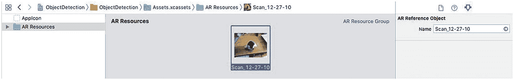

**图 16-10** – 在 AR Resources 文件夹中显示 `.arobject` 文件

1. 在导航面板中点击 `Main.storyboard` 文件。
2. 点击 **Assistant Editor** 图标或选择 **View** ➤ **Assistant Editor** ➤ **Show Assistant Editor**，以并排显示 `Main.storyboard` 和 `ViewController.swift` 文件。
3. 将鼠标指针移到 `ARSCNView` 上，按住 **Control** 键，然后按住 Control 键拖动到 `class ViewController` 行下方。
4. 松开 **Control** 键和鼠标左键。会出现一个弹出菜单。
5. 在 **Name** 文本框中点击，输入 `sceneView`，然后点击 **Connect** 按钮。Xcode 会创建一个 `IBOutlet`，如下所示：

```swift
@IBOutlet var sceneView: ARSCNView!
```

6. 编辑 `viewDidLoad` 函数，使其内容如下：

```swift
override func viewDidLoad() {
    super.viewDidLoad()
    // Do any additional setup after loading the view, typically from a nib.
    sceneView.debugOptions = [ARSCNDebugOptions.showWorldOrigin, ARSCNDebugOptions.showFeaturePoints]
    sceneView.delegate = self
    sceneView.session.run(configuration)
}
```

只有在应用中存储了物体的 `.arobject` 文件后，ARKit 才能识别现实世界中的物理物体。要存储一个或多个希望 ARKit 识别的 `.arobject` 文件，请按照以下步骤操作：

1. 在导航面板中点击 `Assets.xcassets` 文件夹。
2. 点击面板底部的 **+** 图标。会出现一个弹出菜单。
3. 选择 **New AR Resource Group**。Xcode 会创建一个 `AR Resources` 文件夹。
4. 将 `.arobject` 文件拖放到 `AR Resources` 文件夹中，如**图 16-10** 所示。

添加了一个或多个希望 ARKit 识别的真实物体的 `.arobject` 文件后，我们需要编写实际的 Swift 代码，以便在通过 iOS 设备摄像头捕捉到物体时进行识别。

首先，我们需要访问包含待识别物体图像的文件夹。该文件夹可以任意命名，例如 `AR Resources`。这意味着要使用 `guard` 语句来验证 `AR Resources` 文件夹是否存在，如下所示：

```swift
guard let storedObjects = ARReferenceObject.referenceObjects(inGroupNamed: "AR Resources", bundle: nil) else {
    fatalError("Missing AR Resources images")
}
```

这段代码会查找名为 `AR Resources` 的文件夹。如果查找失败，则终止程序并显示 `"Missing AR Resources images"`。如果找到了 `AR Resources` 文件夹，我们可以这样定义检测到的 `.arobject` 文件的存储位置：

```swift
configuration.detectionObjects = storedObjects
```

请注意，这行代码使用了 `detectionObjects`，而 `guard` 语句使用了 `ARReferenceObject.referenceObjects`。

最后，我们需要使用 `didAdd renderer` 函数，该函数在摄像头每次更新视图时运行。如果摄像头检测到已识别的物体（`ARObjectAnchor`），我们希望在检测到的物体附近显示一个虚拟物体。

首先，我们需要确保检测到的 `.arobject` 文件以 `ARObjectAnchor` 的形式存储，如下所示：

```swift
func renderer(_ renderer: SCNSceneRenderer, didAdd node: SCNNode, for anchor: ARAnchor) {
    if let objectAnchor = anchor as? ARObjectAnchor {
    }
}
```

然后，我们可以创建一个虚拟物体，使其覆盖在检测到的图像上。在此示例中，我们将创建如下文本：

```swift
let movingImage = SCNText(string: "Object Detected", extrusionDepth: 0.0)
movingImage.flatness = 0.1
movingImage.font = UIFont.boldSystemFont(ofSize: 10)
```

接下来，我们需要将这个 `SCNText` 存储到一个节点中，因此我们需要定义一个节点，并定义其颜色和缩放比例：

```swift
let titleNode = SCNNode()
titleNode.geometry = movingImage
titleNode.geometry?.firstMaterial?.diffuse.contents = UIColor.white
titleNode.scale = SCNVector3(0.0015, 0.0015, 0.0015)
```

然后，我们只需将包含 `SCNText` 的节点添加到检测到的图像上：

```swift
node.addChildNode(titleNode)
```

完整的 `ViewController.swift` 文件应如下所示：


```swift
import UIKit
import SceneKit
import ARKit

class ViewController: UIViewController, ARSCNViewDelegate {
    @IBOutlet var sceneView: ARSCNView!
    let configuration = ARWorldTrackingConfiguration()
    
    override func viewDidLoad() {
        super.viewDidLoad()
        // 视图加载后的其他设置，通常来自 nib 文件
        sceneView.debugOptions = [ARSCNDebugOptions.showWorldOrigin, ARSCNDebugOptions.showFeaturePoints]
        sceneView.delegate = self
        guard let storedObjects = ARReferenceObject.referenceObjects(inGroupNamed: "AR Resources", bundle: nil) else {
            fatalError("缺少 AR Resources 图片")
        }
        configuration.detectionObjects = storedObjects
        sceneView.session.run(configuration)
    }
    
    func renderer(_ renderer: SCNSceneRenderer, didAdd node: SCNNode, for anchor: ARAnchor) {
        if let objectAnchor = anchor as? ARObjectAnchor {
            let movingImage = SCNText(string: "物体已检测", extrusionDepth: 0.0)
            movingImage.flatness = 0.1
            movingImage.font = UIFont.boldSystemFont(ofSize: 10)
            let titleNode = SCNNode()
            titleNode.geometry = movingImage
            titleNode.geometry?.firstMaterial?.diffuse.contents = UIColor.white
            titleNode.scale = SCNVector3(0.0015, 0.0015, 0.0015)
            node.addChildNode(titleNode)
        }
    }
}
```

要测试这个应用，请将您扫描并存储在 `AR Resources` 文件夹中作为 `.arobject` 文件的物品放在桌子或地板上。然后按照以下步骤操作：

1. 点击停止按钮，或选择 产品 ➤ 停止。

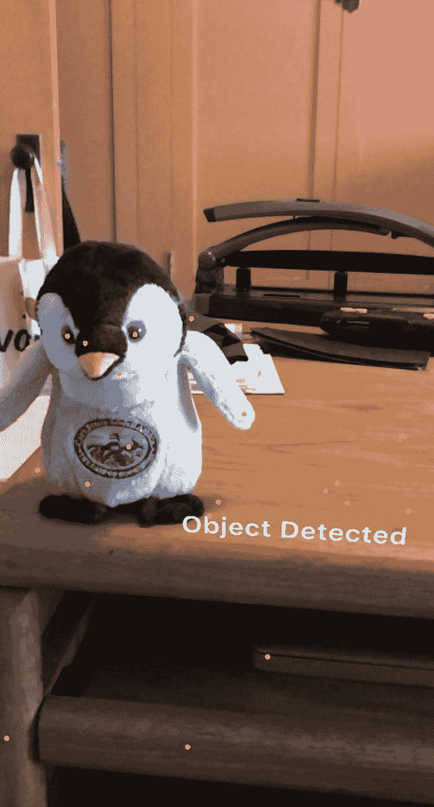

*图 16-11 检测一个物体*

2. 通过 USB 线缆将 iOS 设备连接到您的 Macintosh。
3. 点击运行按钮，或选择 产品 ➤ 运行。首次运行此应用时，它会请求访问相机的权限，请授予权限。
4. 将您想要检测的物体放在一个平坦的表面上。
5. 将 iOS 设备的摄像头对准您希望 ARKit 识别的物体。当 ARKit 识别到该物体时，它会在检测到的物体附近显示文本“物体已检测”，如图 16-11 所示。

## 小结

图像跟踪不仅能让您的应用识别图像并在附近显示虚拟物体，还能在图像移动时保持虚拟物体与该图像的关联。物体检测则能让您的应用检测预扫描的物体，并在其周围显示虚拟物体（如文本）。

使用图像跟踪时，请确保像下面这样使用 `ARImageTrackingConfiguration`（而不是 `ARWorldTrackingConfiguration`）：

```
let configuration = ARImageTrackingConfiguration()
```

然后，使用 `guard` 语句在特定的 `AR Resources` 文件夹中查找存储的图像：

```
guard let storedImages = ARReferenceImage.referenceImages(inGroupNamed: "AR Resources", bundle: nil) else {
    fatalError("缺少 AR Resources 图片")
}
```

最后，使用 `trackingImages` 访问 `AR Resources` 文件夹中存储的图像：

```
configuration.trackingImages = storedImages
```

使用物体检测时，使用 `guard` 语句定义 `AR Resources` 文件夹中存储的 `.arobject` 文件。请确保像下面这样使用 `ARReferenceObject.referenceObjects`：

```
guard let storedObjects = ARReferenceObject.referenceObjects(inGroupNamed: "AR Resources", bundle: nil) else {
    fatalError("缺少 AR Resources 图片")
}
```

这段代码会查找名为 `AR Resources` 的文件夹。如果找不到，程序将终止并显示`"缺少 AR Resources 图片"`。如果找到了 `AR Resources` 文件夹，我们就可以像下面这样定义已检测 `.arobject` 文件的存储位置：

```
configuration.detectionObjects = storedObjects
```

随着 ARKit 2.0 中同时引入了图像跟踪和物体检测，增强现实应用可以变得比以往任何时候都更加通用。

