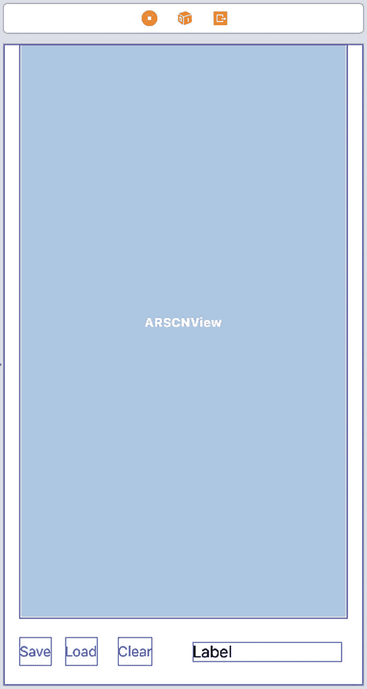
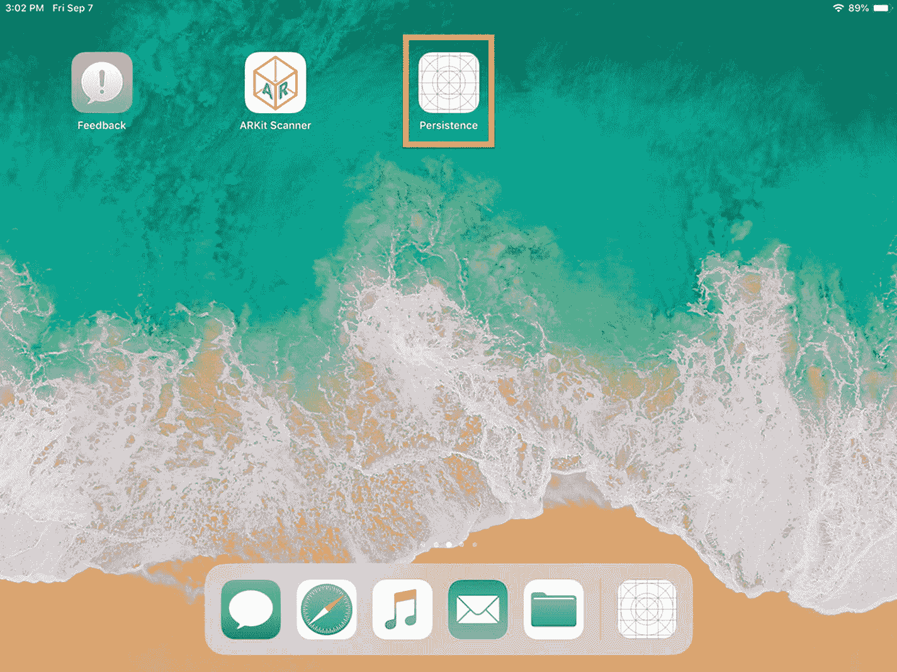
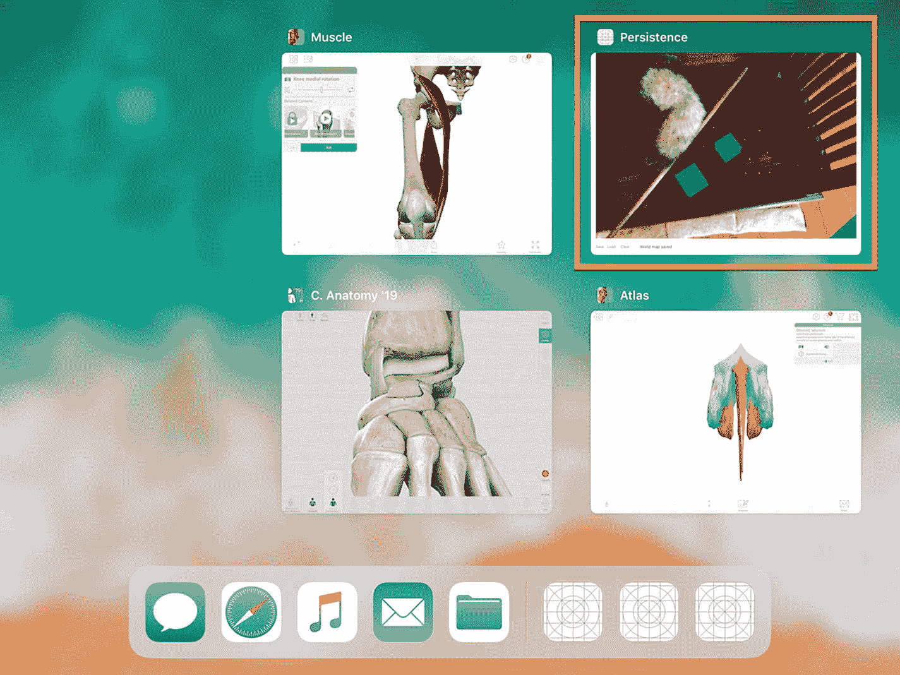
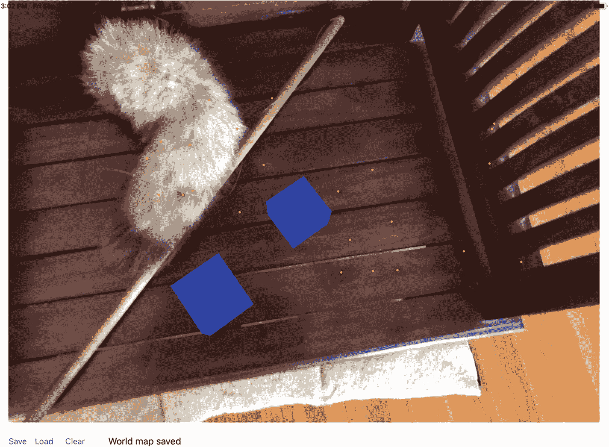

# 17. 持久化

到目前为止，我们创建的每个增强现实视图项目都有一个共同的问题。虽然您可能能够在增强现实视图中添加虚拟物体，但一旦关闭应用并重新启动，之前添加的所有虚拟物体都将消失。

在许多情况下，这正是您所需要的功能，因此重新启动应用会为用户创建一个空白的增强现实视图。然而，有时您可能希望保留视图中放置的任何虚拟物体。为了保存增强现实视图，使其出现在其他人的应用中，或者当您在稍后时间重新启动应用时出现在您自己的应用中，您需要使用*持久化*。

持久化会简单地将增强现实视图中放置的所有虚拟物体保存到一个世界地图中。通过保存这个世界地图，您可以保留虚拟物体的位置。通过稍后加载这个世界地图，您可以将增强现实视图恢复到之前的状态。

要了解持久化，让我们按照以下步骤创建一个新的 Xcode 项目：

1. 启动 Xcode。（确保您使用的是 Xcode 10 或更高版本。）
2. 选择 文件 ➤ 新建 ➤ 项目。Xcode 会要求您选择一个模板。
3. 点击 iOS 类别。
4. 点击单视图应用图标，然后点击下一步按钮。Xcode 会要求提供产品名称、组织名称、组织标识符和内容技术。
5. 在产品名称文本框中点击，并输入一个描述性的项目名称，例如 `Persistence`。（具体名称无关紧要。）
6. 点击下一步按钮。Xcode 会询问您希望将项目存储在哪里。
7. 选择一个文件夹，然后点击创建按钮。Xcode 会创建一个 iOS 项目。

现在，按照以下步骤修改 `Info.plist` 文件，以允许访问相机并使用 ARKit：

1. 在导航器面板中点击 `Info.plist` 文件。Xcode 会显示一个键、类型和值的列表。
2. 点击展开三角形以展开“所需的设备功能”类别，显示项目 0。
3. 将鼠标指针移到项目 0 上，显示一个加号 (+) 图标。
4. 点击此加号 (+) 图标，显示一个空白的项目 1。
5. 在项目 1 行的“值”类别下输入 `arkit`。
6. 将鼠标指针移到最后一行，显示一个加号 (+) 图标。
7. 点击加号 (+) 图标创建一个新行。会弹出一个菜单。
8. 选择“隐私 - 相机使用说明”。
9. 在“隐私 - 相机使用说明”行的“值”类别下输入 `AR 需要使用相机`。

现在是时候按照以下步骤修改 `ViewController.swift` 文件来使用 ARKit 和 SceneKit 了：

1. 在导航器面板中点击 `ViewController.swift` 文件。
2. 编辑 `ViewController.swift` 文件，使其看起来像这样：

```
import UIKit
import SceneKit
import ARKit

class ViewController: UIViewController, ARSCNViewDelegate, ARSessionDelegate {
    let configuration = ARWorldTrackingConfiguration()
    
    override func viewDidLoad() {
        super.viewDidLoad()
        // 视图加载后的其他设置，通常来自 nib 文件
    }
}
```

需要特别注意的最重要的一行是添加了 `ARSCNViewDelegate` 的那一行，因为它包含了我们保存和恢复世界地图所需的函数。

要在我们的应用中查看增强现实，请将以下内容添加到 `Main.storyboard`，如图 17-1 所示：



*图 17-1 用户界面上的三个按钮、一个标签和一个 ARKit SceneKit 视图*

- 一个 ARKit SceneKit 视图（`ARSCNView`）
- 三个 `UIButton`
- 一个 `UILabel`

设计好用户界面后，您需要添加约束。要添加约束，请选择 编辑器 ➤ 解决自动布局问题 ➤ 重置为建议的约束（位于“容器中所有视图”类别下的菜单底部）。

下一步是将用户界面项连接到 `ViewController.swift` 文件中的 Swift 代码。为此，请按照以下步骤操作：

1. 在导航器面板中点击 `Main.storyboard` 文件。


2. 点击“助理编辑器”图标，或选择“视图”➤“助理编辑器”➤“显示助理编辑器”，将`Main.storyboard`和`ViewController.swift`文件并排显示。

3. 将鼠标指针移到 ARSCNView 上，按住 Control 键，然后在`class ViewController`行下方按住 Control 键拖动。

4. 松开 Control 键和鼠标左键。此时会弹出一个菜单。

5. 点击“名称”文本字段，输入`sceneView`，然后点击“连接”按钮。Xcode 会创建一个如下的 IBOutlet：

    ```
    @IBOutlet var sceneView: ARSCNView!
    ```

6. 将鼠标移到标签上，按住 Control 键，然后在刚创建的 IBOutlet 下方按住 Control 键拖动。

7. 松开 Control 键和鼠标左键。此时会弹出一个菜单。

8. 点击“名称”文本字段，输入`lblMessage`，然后点击“连接”按钮。Xcode 会创建一个如下的 IBOutlet：

    ```
    @IBOutlet var lblMessage: UILabel!
    ```

9. 在两个 IBOutlet 下方，输入以下代码：

    ```
    let configuration = ARWorldTrackingConfiguration()
    ```

10. 编辑`viewDidLoad`函数，使其代码如下：

    ```
    override func viewDidLoad() {
        super.viewDidLoad()
        // 加载视图后的其他设置，通常来自 nib 文件
        sceneView.debugOptions = [ARSCNDebugOptions.showWorldOrigin, ARSCNDebugOptions.showFeaturePoints]
        sceneView.delegate = self
        sceneView.session.delegate = self
        configuration.planeDetection = .horizontal
        let tapGesture = UITapGestureRecognizer(target: self, action: #selector(handleTap))
        sceneView.addGestureRecognizer(tapGesture)
        self.lblMessage.text = "点击以放置虚拟对象"
        sceneView.session.run(configuration)
    }
    ```

至此，我们定义了一个点按手势，但还需要创建一个函数来处理该点按手势。在`viewDidLoad`函数下方，添加名为`handleTap`的函数：

```
@objc func handleTap(sender: UITapGestureRecognizer) {
    guard let sceneView = sender.view as? ARSCNView else {
        return
    }
    let touch = sender.location(in: sceneView)
    let hitTestResults = sceneView.hitTest(touch, types: [.featurePoint, .estimatedHorizontalPlane])
    if hitTestResults.isEmpty == false {
        if let hitTestResult = hitTestResults.first {
            let virtualAnchor = ARAnchor(transform: hitTestResult.worldTransform)
            self.sceneView.session.add(anchor: virtualAnchor)
        }
    }
}
```

每次用户点击屏幕时，都会向增强现实视图添加一个`ARAnchor`。这也会触发`didAdd renderer`函数，我们需要编写该函数以在屏幕上显示一个蓝色方块。在`handleTap`函数下方，按如下方式编写`didAdd renderer`函数：

```
func renderer(_ renderer: SCNSceneRenderer, didAdd node: SCNNode, for anchor: ARAnchor) {
    if anchor is ARPlaneAnchor {
        return
    }
    let newNode = SCNNode(geometry: SCNBox(width: 0.05, height: 0.05, length: 0.05, chamferRadius: 0))
    newNode.geometry?.firstMaterial?.diffuse.contents = UIColor.blue
    node.addChildNode(newNode)
}
```

最后，按如下方式添加`viewWillDisappear`函数：

```
override func viewWillDisappear(_ animated: Bool) {
    sceneView.session.pause()
}
```

## 保存世界地图

至此，该应用允许用户点击屏幕并在增强现实视图中放置蓝色方块。然而，你目前还不能保存增强现实视图。要保存增强现实视图，我们需要将当前增强现实视图存储为世界地图。

我们可以将世界地图保存到任何数据库中，但由于世界地图数据量较小，我们将把它存储在用户默认数据库中，该数据库通常用于存储应用设置。要保存世界地图，请按照以下步骤操作：

1. 在导航窗格中点击`Main.storyboard`文件。

2. 点击“助理编辑器”图标，或选择“视图”➤“助理编辑器”➤“显示助理编辑器”，将`Main.storyboard`和`ViewController.swift`文件并排显示。

3. 将鼠标指针移到用户界面上显示“保存”的按钮上，按住 Control 键，然后在`class ViewController`行下方按住 Control 键拖动。

4. 松开 Control 键和鼠标左键。此时会弹出一个菜单。

5. 确保“连接”弹出菜单显示为“操作”，然后点击“名称”文本字段，输入`saveButton`。

6. 点击“类型”弹出菜单，选择 UIButton，然后点击“连接”按钮。Xcode 会创建一个如下的`IBAction`方法：

    ```
    @IBAction func saveButton(_ sender: UIButton) {
    }
    ```

7. 按如下方式编辑这个`saveButton IBAction`方法：

    ```
    @IBAction func saveButton(_ sender: UIButton) {
        saveMap()
    }
    ```

每当用户点击“保存”按钮时，该按钮会运行`saveMap()`函数，我们需要按如下方式编写该函数：

```
func saveMap() {
}
```

保存世界地图的第一步是获取增强现实视图的当前状态：

```
self.sceneView.session.getCurrentWorldMap { worldMap, error in
}
```

这段代码要么获取当前状态（`worldMap`），要么显示错误。如果保存当前增强现实状态时出现错误，我们需要显示一条错误消息并停止尝试保存世界地图：

```
if error != nil {
    print(error?.localizedDescription ?? "未知错误")
    return
}
```

如果成功获取当前状态（`worldMap`），那么我们可以创建一个“map”变量来表示当前的世界地图：

```
if let map = worldMap {
}
```

接下来，我们需要按如下方式归档这个世界地图：

```
let data = try! NSKeyedArchiver.archivedData(withRootObject: map, requiringSecureCoding: true)
```

现在，我们需要将这些数据保存到用户默认数据库中，并为其指定一个任意字符串作为键，以便稍后检索：

```
let savedMap = UserDefaults.standard
savedMap.set(data, forKey: "worldmap")
savedMap.synchronize()
```

最后，我们需要向用户发送一条消息，告知世界地图已保存：

```
DispatchQueue.main.async {
    self.lblMessage.text = "世界地图已保存"
}
```

完整的`saveMap`函数应如下所示：

```
func saveMap() {
    self.sceneView.session.getCurrentWorldMap { worldMap, error in
        if error != nil {
            print(error?.localizedDescription ?? "未知错误")
            return
        }
        if let map = worldMap {
            let data = try! NSKeyedArchiver.archivedData(withRootObject: map, requiringSecureCoding: true)
            // 保存到用户默认数据库
            let savedMap = UserDefaults.standard
            savedMap.set(data, forKey: "worldmap")
            savedMap.synchronize()
            DispatchQueue.main.async {
                self.lblMessage.text = "世界地图已保存"
            }
        }
    }
}
```


## 加载世界地图

保存世界地图后，下一步需要将该地图重新加载到增强现实视图中。这需要使用用户默认项键（定义为`worldmap`）。要检索已存储的世界地图，我们需要将用户界面上的“加载”按钮连接到一个`IBAction`方法，然后编写代码来检索存储在用户默认项数据库中的任何数据。

要加载世界地图，请遵循以下步骤：

1.  在导航器面板中点击`Main.storyboard`文件。
2.  点击“助理编辑器”图标，或选择“视图”➤“助理编辑器”➤“显示助理编辑器”，以并排显示`Main.storyboard`和`ViewController.swift`文件。
3.  将鼠标指针移动到用户界面上显示为“加载”的按钮上，按住 Control 键，并将其 Control 拖拽到`class ViewController`行下方。
4.  松开 Control 键和鼠标左键。此时会出现一个弹出菜单。
5.  确保“连接”弹出菜单显示“操作”，然后点击“名称”文本字段并输入`saveButton`。
6.  点击“类型”弹出菜单并选择`UIButton`，然后点击“连接”按钮。Xcode 会创建一个`IBAction`方法，如下所示：

```
@IBAction func loadButton(_ sender: UIButton) {
}
```

7.  按如下方式编辑这个`saveButton` `IBAction`方法：

```
@IBAction func loadButton(_ sender: UIButton) {
loadMap()
}
```

每次用户点击“加载”按钮时，该按钮都会运行`loadMap()`函数，该函数需要检索之前保存的世界地图，或者在没有保存过世界地图的情况下，直接启动一个普通的增强现实会话。

首先，像这样创建`loadMap`函数：

```
func loadMap() {
}
```

现在，我们需要从用户默认项数据库中检索存储的数据：

```
let storedData = UserDefaults.standard
```

接下来，我们需要一个`if-else`语句：如果找到世界地图（使用自定义的`worldmap`键），则运行第一组代码；如果未找到世界地图，则运行第二组代码：

```
if let data = storedData.data(forKey: "worldmap") {
} else {
}
```

如果找到了`worldmap`键，那么我们需要检索并解档它：

```
if let unarchived = try? NSKeyedUnarchiver.unarchivedObject(ofClasses: [ARWorldMap.classForKeyedUnarchiver()], from: data), let worldMap = unarchived as? ARWorldMap {
}
```

然后，我们可以将之前保存的世界地图存储到`initialWorldMap`属性中，并向用户显示世界地图已加载的消息。最后，我们可以运行该配置：

```
let configuration = ARWorldTrackingConfiguration()
configuration.initialWorldMap = worldMap
configuration.planeDetection = .horizontal
self.lblMessage.text = "已加载之前的世界地图"
sceneView.session.run(configuration)
```

如果使用我们自定义的`worldmap`键未能找到世界地图，我们只需要为增强现实视图加载一个常规配置即可。因此，完整的`loadMap`函数如下所示：

```
func loadMap() {
let storedData = UserDefaults.standard
if let data = storedData.data(forKey: "worldmap") {
if let unarchived = try? NSKeyedUnarchiver.unarchivedObject(ofClasses: [ARWorldMap.classForKeyedUnarchiver()], from: data), let worldMap = unarchived as? ARWorldMap {
let configuration = ARWorldTrackingConfiguration()
configuration.initialWorldMap = worldMap
configuration.planeDetection = .horizontal
self.lblMessage.text = "已加载之前的世界地图"
sceneView.session.run(configuration)
}
} else {
let configuration = ARWorldTrackingConfiguration()
configuration.planeDetection = .horizontal
sceneView.session.run(configuration)
}
}
```

## 清除增强现实视图

至此，我们的应用程序可以保存世界地图并重新加载它，但我们还要进行最后一项调整，创建一个“清除”按钮。当用户点击“清除”按钮时，我们需要移除所有虚拟对象，以便能够创建并保存一个新的增强现实视图。

要清除增强现实视图，请遵循以下步骤：

1.  在导航器面板中点击`Main.storyboard`文件。
2.  点击“助理编辑器”图标，或选择“视图”➤“助理编辑器”➤“显示助理编辑器”，以并排显示`Main.storyboard`和`ViewController.swift`文件。
3.  将鼠标指针移动到用户界面上显示为“清除”的按钮上，按住 Control 键，并将其 Control 拖拽到`class ViewController`行下方。
4.  松开 Control 键和鼠标左键。此时会出现一个弹出菜单。
5.  确保“连接”弹出菜单显示“操作”，然后点击“名称”文本字段并输入`saveButton`。
6.  点击“类型”弹出菜单并选择`UIButton`，然后点击“连接”按钮。Xcode 会创建一个`IBAction`方法，如下所示：

```
@IBAction func clearButton(_ sender: UIButton) {
}
```

7.  按如下方式编辑这个`saveButton` `IBAction`方法：

```
@IBAction func clearButton(_ sender: UIButton) {
clearMap()
}
```

每次用户点击“清除”按钮时，该按钮都会运行`clearMap()`函数，该函数会重置追踪并移除任何存在的锚点（这些锚点所在位置包含了平面和虚拟对象），从而清除增强现实视图。添加如下`clearMap`函数：

```
func clearMap() {
let configuration = ARWorldTrackingConfiguration()
configuration.planeDetection = .horizontal
self.lblMessage.text = "点击放置虚拟对象"
sceneView.debugOptions = [.showWorldOrigin, .showFeaturePoints]
let options: ARSession.RunOptions = [.resetTracking, .removeExistingAnchors]
sceneView.session.run(configuration, options: options)
}
```

完整的`ViewController.swift`文件应如下所示：


```
import UIKit
import SceneKit
import ARKit
class ViewController: UIViewController, ARSCNViewDelegate , ARSessionDelegate {
@IBOutlet var sceneView: ARSCNView!
@IBOutlet var lblMessage: UILabel!
let configuration = ARWorldTrackingConfiguration()
override func viewDidLoad() {
super.viewDidLoad()
// 在此处添加视图加载后的其他设置（通常从 nib 文件加载）
sceneView.debugOptions = [ARSCNDebugOptions.showWorldOrigin, ARSCNDebugOptions.showFeaturePoints]
sceneView.delegate = self
sceneView.session.delegate = self
configuration.planeDetection = .horizontal
let tapGesture = UITapGestureRecognizer(target: self, action: #selector(handleTap))
sceneView.addGestureRecognizer(tapGesture)
self.lblMessage.text = "轻点以放置虚拟对象"
sceneView.session.run(configuration)
}
@objc func handleTap(sender: UITapGestureRecognizer) {
guard let sceneView = sender.view as? ARSCNView else {
return
}
let touch = sender.location(in: sceneView)
let hitTestResults = sceneView.hitTest(touch, types: [.featurePoint, .estimatedHorizontalPlane])
if hitTestResults.isEmpty == false {
if let hitTestResult = hitTestResults.first {
let virtualAnchor = ARAnchor(transform: hitTestResult.worldTransform)
self.sceneView.session.add(anchor: virtualAnchor)
}
}
}
func renderer(_ renderer: SCNSceneRenderer, didAdd node: SCNNode, for anchor: ARAnchor) {
if anchor is ARPlaneAnchor {
return
}
let newNode = SCNNode(geometry: SCNBox(width: 0.05, height: 0.05, length: 0.05, chamferRadius: 0))
newNode.geometry?.firstMaterial?.diffuse.contents = UIColor.blue
node.addChildNode(newNode)
}
func saveMap() {
self.sceneView.session.getCurrentWorldMap { worldMap, error in
if error != nil {
print(error?.localizedDescription ?? "未知错误")
return
}
if let map = worldMap {
let data = try! NSKeyedArchiver.archivedData(withRootObject: map, requiringSecureCoding: true)
// 保存到用户默认设置中
let savedMap = UserDefaults.standard
savedMap.set(data, forKey: "worldmap")
savedMap.synchronize()
DispatchQueue.main.async {
self.lblMessage.text = "世界地图已保存"
}
}
}
}
override func viewWillDisappear(_ animated: Bool) {
sceneView.session.pause()
}
func loadMap() {
let storedData = UserDefaults.standard
if let data = storedData.data(forKey: "worldmap") {
if let unarchived = try? NSKeyedUnarchiver.unarchivedObject(ofClasses: [ARWorldMap.classForKeyedUnarchiver()], from: data), let worldMap = unarchived as? ARWorldMap {
let configuration = ARWorldTrackingConfiguration()
configuration.initialWorldMap = worldMap
configuration.planeDetection = .horizontal
self.lblMessage.text = "已加载之前的世界地图"
sceneView.session.run(configuration)
}
} else {
let configuration = ARWorldTrackingConfiguration()
configuration.planeDetection = .horizontal
sceneView.session.run(configuration)
}
}
@IBAction func saveButton(_ sender: UIButton) {
saveMap()
}
func clearMap() {
let configuration = ARWorldTrackingConfiguration()
configuration.planeDetection = .horizontal
self.lblMessage.text = "轻点以放置虚拟对象"
sceneView.debugOptions = [.showWorldOrigin, .showFeaturePoints]
let options: ARSession.RunOptions = [.resetTracking, .removeExistingAnchors]
sceneView.session.run(configuration, options: options)
}
@IBAction func clearButton(_ sender: UIButton) {
clearMap()
}
@IBAction func loadButton(_ sender: UIButton) {
loadMap()
}
}
```

要测试此应用，请遵循以下步骤：

1. 在“持久化”应用中轻点 `加载` 按钮。出现“已加载之前的世界地图”消息。

2. 将 iOS 设备的摄像头对准之前放置过蓝色方块的平坦表面（增强现实视图中）。当应用识别出同一区域后，便会显示你之前放置的虚拟对象。（你必须将虚拟对象放置在有大量显著特征的平坦表面上，以便 ARKit 轻松识别同一区域，并在同一位置再次显示已保存的虚拟对象。如果 ARKit 无法识别该区域，它将无法显示已保存的世界地图。）

3. 轻点 `清除` 按钮，从增强现实视图中移除所有虚拟对象。此时，你可以再次重复步骤 3–8。

4. 点击 `停止` 按钮，或选择“产品”➤“停止”。



图 17-4

再次在 iOS 设备屏幕上找到“持久化”图标

1. 向上滑动“持久化”应用的缩略图（或对于没有主屏幕按钮的 iOS 设备，用力按压“持久化”应用缩略图，然后轻点红色圆圈内的减号）。

2. 返回主屏幕，轻点“持久化”图标以重新加载应用，如图 17-4 所示。



图 17-3

以缩略图形式显示当前运行的应用

1. 在 iOS 设备上按两次主屏幕按钮，以显示当前运行的应用列表（或在主屏幕向上滑动并暂停（对于没有主屏幕按钮的 iOS 设备））。所有当前运行的应用将以缩略图形式显示，如图 17-3 所示。



图 17-2

在具有显著特征的平坦表面上放置虚拟对象

1. 通过 USB 线缆将 iOS 设备连接到 Macintosh。

2. 点击 `运行` 按钮，或选择“产品”➤“运行”。

3. 将 iOS 设备的摄像头对准具有大量显著特征的平坦表面，并轻点屏幕在增强现实视图中放置蓝色方块，如图 17-2 所示。

## 总结

持久化功能为你的应用提供了一种保存当前增强现实视图的方式，以便用户稍后可以加载并再次查看。如果增强现实会话可能持续较长时间（例如用户可以在增强现实游戏中保存进度并稍后返回），这将非常有用。

将世界地图保存到用户默认设置中是存储增强现实视图的最简单方法。关键在于赋予用户保存世界地图、稍后加载以及清除增强现实视图的能力。

