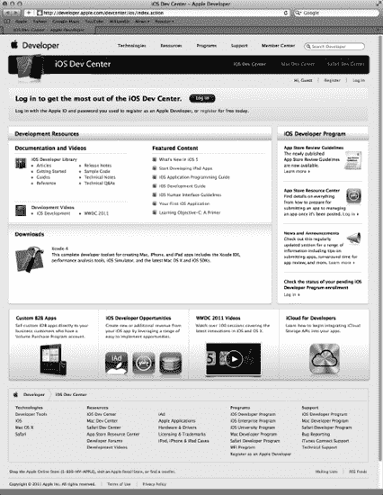

# 第 1 章

## 欢迎来到丛林

那么，你想编写 iPhone、iPod touch 和 iPad 应用程序？嗯，我们不能说你选错了。iOS，这些设备的核心软件，是一个激动人心的平台，自 2007 年首次发布以来，一直呈爆炸式增长。移动软件平台的崛起意味着人们无论走到哪里都在使用软件。随着 iOS 5 和最新版 iOS 软件开发工具包（`SDK`）的发布，情况只会变得更好、更有趣。

### 本书内容

本书是一本指南，旨在帮助你踏上创建自己 iOS 应用程序的道路。我们的目标是帮你跨过最初的学习曲线，帮助你理解 iOS 应用程序的工作方式及其构建方法。

当你在阅读本书的过程中，你将创建许多小型应用程序，每个程序都旨在突出特定的 iOS 功能，并向你展示如何控制或与这些功能交互。如果你将本书中获得的基础知识与自己的创造力和决心结合起来，再加上 Apple 提供的大量且编写精良的文档，你将拥有构建自己的专业 iPhone 和 iPad 应用程序所需的一切。

**提示：** Dave、Jack 和 Jeff 为本书设立了一个论坛。这是一个绝佳的地方，可以结识志同道合的人，解答你的疑问，甚至回答其他人的问题。论坛地址是 [`http://iphonedevbook.com`](http://iphonedevbook.com)。请务必去看看！

### 你需要什么

在开始为 iOS 编写软件之前，你需要准备几样东西。首先，你需要一台运行 Lion（`OS × 10.7`）或更高版本的基于 Intel 的 Macintosh 电脑。任何较新的基于 Intel 的 Macintosh 电脑——笔记本电脑或台式机——都应该可以正常工作。

你还需要注册成为 iOS 开发者。Apple 要求你在下载 iOS SDK 之前完成此步骤。

要注册为开发者，只需导航至 [`http://developer.apple.com/ios/`](http://developer.apple.com/ios/)。这将带你进入一个类似于 图 1-1 所示的页面。

**图 1-1.** *Apple 的 iOS Dev Center 网站*

首先，点击标记为 *Log in* 的按钮。系统会提示你输入你的 *Apple ID*。如果你没有 Apple ID，请点击 *Create Apple ID* 按钮，创建一个然后登录。登录后，你将进入 iOS 开发主页面。你不仅会看到 SDK 下载链接，还会找到大量文档、视频、示例代码等资源的链接——所有这些都旨在教你 iOS 应用程序开发的精妙之处。

你将用于开发 iOS 应用程序最重要的工具叫做 `Xcode`。`Xcode` 是 Apple 的集成开发环境（`IDE`）。`Xcode` 包含用于创建和调试源代码、编译应用程序以及对你编写的应用程序进行性能调优的工具。

一旦你注册了，你可以在 [`http://developer.apple.com/ios/`](http://developer.apple.com/ios/) 上找到 `Xcode` 的下载链接。你也可以从 Macintosh App Store 下载 `Xcode`，你可以通过 Mac 的 Apple 菜单访问该商店。

**SDK 版本和示例的源代码**

随着 SDK 和 `Xcode` 版本的演变，它们的下载机制也会发生变化。有时 SDK 和 `Xcode` 作为单独的下载提供；其他时候，它们会被合并为单个下载。底线是：你想要下载最新发布的（非测试版）`Xcode` 和 iOS SDK。

本书是为与最新版本的 SDK 配合使用而编写的。在某些地方，我们选择使用 iOS 5 引入的新函数或方法，它们可能与早期版本的 SDK 不兼容。我们会在本书中提到这些情况时明确指出。

请务必从本书的网站 [`http://iphonedevbook.com`](http://iphonedevbook.com) 或 [`http://apress.com`](http://apress.com) 上的本书页面下载最新的源代码存档。我们会在新版本 SDK 发布时更新代码，所以请定期查看网站。

#### 开发者选项

免费 SDK 下载选项包含一个模拟器，让你可以在 Mac 上构建和运行 iPhone 及 iPad 应用。这对于学习如何为 iOS 编程而言十分理想。然而，该模拟器并*不*支持许多依赖硬件的功能，例如加速计和摄像头。此外，免费选项不允许你将应用下载到实际的 iPhone 或其他设备上，也无法让你在苹果的 App Store 上分发应用。若要获得这些功能，你需要注册其他非免费的选项：

- **标准版**项目每年费用为 99 美元。它提供一系列开发工具和资源、技术支持、通过苹果 App Store 分发你的应用，以及最重要的是，能够在 iOS 设备上（而不仅仅是模拟器中）测试和调试你的代码。
- **企业版**项目每年费用为 299 美元。它专为开发内部专有 iOS 应用的公司以及那些为苹果 App Store 开发项目、且项目中有多名开发者共同协作的公司而设计。

关于这些项目的更多详细信息，请访问 [`http://developer.apple.com/programs/ios`](http://developer.apple.com/programs/ios) 和 [`http://developer.apple.com/programs/ios/enterprise`](http://developer.apple.com/programs/ios/enterprise) 进行对比。

由于 iOS 支持一种使用其他公司无线基础设施且始终保持连接的移动设备，因此苹果对 iOS 开发者施加的限制远多于对 Mac 开发者的限制（至少截至本文撰写时，Mac 开发者能够编写并分发程序，而无需经过苹果的任何监督或批准）。即便 iPod touch 和仅支持 Wi-Fi 的 iPad 版本并未使用其他公司的基础设施，它们仍受制于同样的限制。

苹果添加这些限制并非出于恶意，而是为了尽可能减少恶意或编写不佳的程序被分发，从而可能降低共享网络性能的风险。为 iOS 进行开发似乎需要跨越许多障碍，但苹果已投入相当多的努力来使这一过程尽可能顺畅。另外也请考虑到，99 美元的价格仍然远低于购买微软软件开发 IDE 例如 Visual Studio 的费用。

这一点可能显而易见，但你还需要一部 iPhone、iPod touch 或 iPad。虽然你的大部分代码可以使用 iOS 模拟器进行测试，但并非所有程序都行。即使那些能在模拟器上运行的程序，在考虑向公众发布应用之前，也必须在实际设备上进行彻底测试。

**注意：** 如果你打算注册标准版或企业版项目，建议你现在就进行。审批过程可能需要一段时间，你需要获得批准才能在真实设备上运行你的应用。不过别担心，因为前几章中的所有项目以及本书中的大部分应用，都能在 iOS 模拟器上正常运行。

#### 你需要了解的知识

本书假设你已经具备一些编程知识。它假定你理解面向对象编程的基础知识（例如，你知道什么是对象、循环和变量）。同时，它也假定你熟悉 Objective-C 编程语言。Cocoa Touch——你在本书大部分章节中将使用的 SDK 部分——使用最新版本的 Objective-C，其中包含早期版本中所没有的若干新特性。但如果你不熟悉 Objective-C 语言的最新添加内容，也不必担心。我们会重点介绍我们所利用的任何新语言特性，并解释它们的工作原理以及我们为何使用它们。

作为用户，你还应该熟悉 iOS 本身。就像对待任何你想为之编写应用的平台一样，去了解 iPhone、iPad 或 iPod touch 的细微差别和特性。花些时间熟悉 iOS 界面以及苹果 iPhone 和/或 iPad 应用的外观和感觉。

是 Objective-C 新手吗？

如果你之前没有用 Objective-C 编程过，以下是一些可以帮助你入门的资源：

- 查看 *Learn Objective-C on the Mac*，这是 Mac 编程专家 Mark Dalrymple 和 Scott Knaster 所著的一本出色且平易近人的 Objective-C 入门书籍（Apress，2009 年）：`http://www.apress.com/book/view/9781430218159`
- 查看苹果对该语言的介绍：*Learning Objective-C: A Primer*：`http://developer.apple.com/library/ios/#referencelibrary/` `GettingStarted/Learning_Objective-C_A_Primer`
- 阅读 *The Objective-C Programming Language*，这是一份非常详细且全面的语言描述与优秀的参考指南：`http://developer.apple.com/library/ios/#documentation/Cocoa/Conceptual/ObjectiveC`

最后这份资料也可以从你的 iPhone、iPod touch 或 iPad 上的 iBooks 免费下载。非常适合随身阅读！苹果已经以这种格式发布了多本开发者书籍，我们希望后续能有更多此类书籍。在 iBooks 中搜索“Apple developer publications”即可找到它们。

### 为 iOS 编码有何不同？

如果你从未使用过 Cocoa 或其前身 NeXTSTEP 或 OpenStep 进行编程，你可能会发现 Cocoa Touch——你将用于编写 iOS 应用的应用程序框架——有点陌生。它与其他常见应用程序框架（例如用于构建 .NET 或 Java 应用的框架）存在一些根本性差异。如果一开始感到有些迷茫，不必过于担心。只要坚持练习，过一段时间一切都会豁然开朗。

如果你曾使用 Cocoa 或 NeXTSTEP 编写过程序，那么 iOS SDK 中的很多内容对你来说都会很熟悉。有大量的类与用于 Mac OS X 开发的版本相比并无变化。即使那些不同的类，也往往遵循相同的基本原则和类似的设计模式。

无论你的背景如何，都需要牢记 iOS 开发与桌面应用开发之间的一些关键区别。这些区别将在以下各节中讨论。

#### 只有一个活动应用

在 iOS 上，任何时候都只能有一个应用处于活动状态并显示在屏幕上。自 iOS 4 以来，应用在用户按下主屏幕按钮后可以在后台运行，但即便如此，这也仅限于少数情况，并且你必须专门为此编写代码。

当你的应用不活跃或不在后台运行时，它完全不会得到 CPU 的任何关注，这将严重破坏开放的网络连接等。iOS 5 在允许后台处理方面取得了长足进步，但要让你的应用在这种情况下良好运作，需要你付出一些努力。

#### 只有一个窗口

桌面和笔记本电脑操作系统允许许多正在运行的程序共存，每个程序都能创建和控制多个窗口。然而，iOS 只给了你的应用一个“窗口”来操作。你的应用与用户的所有交互都发生在这个单一的窗口内，并且其大小被固定为屏幕的尺寸。

### 受限的访问权限

计算机上的程序几乎可以访问启动它的用户所拥有的一切内容。然而，iOS 会严格限制你的应用程序可以访问的内容。

你只能从 iOS 文件系统中为你应用创建的那部分区域读写文件。这个区域被称为你的应用的**沙盒**。你的沙盒是你的应用程序存储文档、偏好设置以及其他任何可能需要保留的数据的地方。

你的应用在其他方面也会受到限制。例如，你无法访问 iOS 上的低编号网络端口，也无法执行任何在桌面计算机上通常需要 `root` 或管理员权限才能进行的操作。

### 有限的响应时间

由于其使用方式，iOS 需要保持快速响应，它也期望你的应用能做到同样。当你的程序启动时，你需要在最多几秒钟内尽快打开应用、加载偏好设置和数据，并在屏幕上显示主视图。

在你的程序运行的任何时刻，它都可能被“釜底抽薪”。如果用户按下主屏幕按钮，iOS 会回到主屏幕，此时你必须快速保存所有内容并退出。如果你保存并放弃控制权的时间超过五秒，你的应用程序进程将被终止，无论你是否保存完毕。请注意，在 iOS 5 中，新 API 的存在在一定程度上改善了这种情况，该 API 允许你的应用在即将进入后台时请求额外的处理时间。

### 有限的屏幕尺寸

iPhone 的屏幕确实很棒。推出之时，它是当时消费类设备中分辨率最高的屏幕。

但 iPhone 的显示屏其实并没有那么大，因此，与现在的计算机相比，你可利用的空间要少得多。在最新的视网膜显示屏设备（iPhone 4 和第四代 iPod touch）上，屏幕仅为 640 × 960，而在较旧的设备上则为 320 × 480 像素。并且，640 × 960 的视网膜显示屏被塞进了同样大小的机身中，所以你不能指望能容纳更多控件之类的元素；它们只是分辨率比以前更高了。

iPad 通过提供 1024 × 768 的显示屏来增加一点可用空间，但即使到今天，这也不算非常大。为了进行有趣的对比，在撰写本文时，苹果公司最便宜的 iMac 支持 1920 × 1080 像素，而其最便宜的笔记本电脑 MacBook 则支持 1280 × 800 像素。在另一端，苹果公司目前最大的显示器——27 英寸的 LED 影院显示屏，则提供了高达 2560 × 1440 像素的分辨率。

### 有限的系统资源

任何正在阅读本文的老派程序员，可能都会对一个至少拥有 256MB RAM 和 8GB 存储空间的机器会受到资源限制而感到好笑，但事实确实如此。为 iOS 开发，也许与在一台只有 48KB 内存的机器上尝试编写复杂的电子表格应用并不完全属于同一级别。但考虑到 iOS 的图形化特性及其所能实现的一切，耗尽内存是件非常容易的事。

目前可用的 iOS 设备要么拥有 256MB，要么拥有 512MB 的物理 RAM，尽管这可能会随着时间推移而增加。其中部分内存用于屏幕缓冲区和其他系统进程。通常，这些内存中只有不到一半留给你的应用程序使用，而且这个数量可能会少得多，尤其是在应用现在可以在后台运行的情况下。

尽管对于如此小巧的计算机来说，这听起来像是留下了相当可观的内存量，但在考虑 iOS 上的内存问题时，还有另一个因素。像 Mac OS X 这样的现代计算机操作系统，会将未被使用的内存块写入到磁盘上称为**交换文件**的东西中。交换文件允许应用程序持续运行，即使它们请求的内存超过了计算机实际可用的内存。然而，iOS 不会将易失性存储器（如应用数据）写入到交换文件中。因此，你的应用程序可用的内存量受到 iOS 设备中未使用的物理内存量的限制。

Cocoa Touch 具有内置机制，可以让你的应用程序知晓内存即将不足。当这种情况发生时，你的应用程序必须释放不需要的内存，否则可能面临被强制退出的风险。

### 没有垃圾回收，但是…

我们之前提到 Cocoa Touch 使用了 Objective-C，但该语言的一个关键新特性在 iOS 上是不可用的：Cocoa Touch 不支持垃圾回收。在为 iOS 编程时需要进行手动内存管理，这对许多刚接触该平台的程序员来说是一个绊脚石，尤其是对于那些来自提供垃圾回收的语言的程序员。

然而，随着 iOS 5 所支持的 Objective-C 版本的出现，这个特殊的绊脚石基本上已经消失了。iOS 5 引入了一个名为**自动引用计数 (ARC)** 的功能，它消除了手动管理 Objective-C 对象内存的需求。我们将在第 3 章中讨论 ARC。

### 一些新功能

既然我们提到 Cocoa Touch 缺少 Cocoa 中的一些功能，那么同样有必要提一下，iOS SDK 包含了一些当前 Cocoa 中没有，或者至少不是每台 Mac 都可用的功能：

- iOS SDK 提供了一种方法，让你的应用能够使用 Core Location 来确定 iOS 设备当前的地理坐标。
- 大多数 iOS 设备都内置了摄像头和照片库，SDK 提供了允许你的应用程序访问这两者的机制。
- iOS 设备内置了加速度计（并且在最新的 iPhone 和 iPod touch 中还有陀螺仪），让你能够检测设备是如何被握持和移动的。

### 一种不同的交互方式

iOS 设备没有的两样东西是物理键盘和鼠标，这意味着你与用户的交互方式，与你为通用计算机编程时的交互方式有着根本的不同。幸运的是，大部分交互工作都为你处理好了。例如，如果你在应用中添加了一个文本字段，iOS 知道当用户点击该字段时调出键盘，而无需你编写任何额外的代码。

**注意：** 当前设备允许你通过蓝牙连接外部键盘，这能提供不错的键盘体验并节省一些屏幕空间，但这仍然是一个相当少见的使用场景。连接鼠标目前仍然不可行。

### 本书内容

以下是本书其余章节的简要概述：

