# 第 2 章

## 安抚提基之神

你可能很清楚，在编程书籍中将第一个项目称为 `Hello, World` 已经成为一种传统。我们考虑过打破这个传统，但又担心提基之神会因为这种严重的失礼行为而对我们施以痛苦的惩罚。所以，让我们按规矩来，好吗？

在本章中，我们将使用 Xcode 创建一个小的 iOS 应用程序，它将显示文本 `Hello, World!`。我们将了解在 Xcode 中创建 iOS 应用程序项目涉及哪些内容，详细了解如何使用 Xcode 的 `Interface Builder` 来设计我们的应用程序用户界面，然后在 iOS 模拟器上运行我们的应用程序。之后，我们将为应用程序添加一个图标，使其更像个真正的 iOS 应用程序。

我们有很多事情要做，让我们开始吧。


### 在 Xcode 中设置你的项目

到目前为止，你应该已经在你的机器上安装了 Xcode 和 iOS SDK。你还应该从本书的网站 ([`http://www.iphonedevbook.com/forum/forum.php`](http://www.iphonedevbook.com/forum/forum.php)) 下载本书的项目存档。本书的论坛是下载最新源代码、解答疑问以及结识志同道合者的好地方。当然，你也可以在 Apress 网站上找到这些源代码。

**注意：** 尽管本书的项目存档中提供了完整的项目文件，但如果你手动创建每个项目，而不是直接运行下载好的版本，你会从本书中获得更多收获。这样，你将熟悉并掌握使用各种应用开发工具的诀窍。

实际创建应用程序是无可替代的；软件开发不是一项旁观者运动。

我们将在本章构建的项目位于项目存档的 *02 Hello World* 文件夹中。

在开始之前，我们需要启动 Xcode。Xcode 是我们完成本书大部分工作所使用的工具，但它并不像大多数 Mac 应用程序那样安装在 `/Applications` 文件夹中。如果你已经按照上一章的概述安装了开发者工具，你会发现 Xcode 位于 `/Developer/Applications` 中。你将频繁使用 Xcode，因此不妨考虑将其拖到 Dock 中，以便随时快速访问。

如果你是第一次使用 Xcode，别担心；我们将引导你完成创建新项目的每一步。苹果最近发布了一个全新的、完全重写的 Xcode 版本，它与之前的版本有很大不同。如果你已经是老手，但尚未使用过 Xcode 4，你会发现有很多变化。

当你首次启动 Xcode 时，会看到一个欢迎窗口，如图 2–1 所示。在此窗口中，你可以选择创建新项目、连接到版本控制系统以检出已有项目，或者从最近打开的项目列表中选择。欢迎窗口还包含指向 iOS 和 Mac OS X 技术文档、教程视频、新闻、示例代码以及其他有用项目的链接。所有这些功能也可以通过 Xcode 菜单访问，但这个窗口为你提供了一个良好的起点，涵盖了启动 Xcode 后你可能想执行的一些最常见任务。如果你想花几分钟浏览一下这里的信息，请便。完成后，关闭窗口，我们继续。如果你以后不想再看到这个窗口，只需在关闭前取消选中 *Show this window when Xcode launches* 复选框即可。

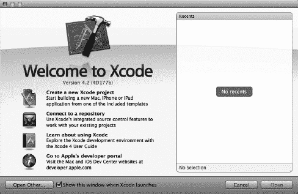

**图 2–1.** *Xcode 欢迎窗口*

**注意：** 如果你有一台 iPhone、iPad 或 iPod touch 连接到你的机器上，当你首次启动 Xcode 时，可能会看到一条消息，询问是否要使用该设备进行开发。目前，请点击 *Ignore* 按钮。或者，*Organizer* 窗口可能会弹出，该窗口会显示（除其他内容外）已与你的电脑同步的设备。在这种情况下，只需关闭 *Organizer* 窗口即可。如果你选择加入付费的 iOS 开发者计划，你将获得一个程序门户，该门户会告诉你如何使用 iOS 设备进行开发和测试。

通过从 **File** 菜单中选择 **New  New Project…**（或按下 `N`）来创建一个新项目。一个新的项目窗口将会打开，并显示项目模板选择表单（见图 2–2）。在此表单中，你将选择一个项目模板，作为构建应用程序的起点。表单左侧的窗格分为两个主要部分：*iOS* 和 *Mac OS X*。由于我们正在构建一个 iOS 应用程序，请选择 *iOS* 部分下的 *Application*，以查看 iOS 应用程序模板。

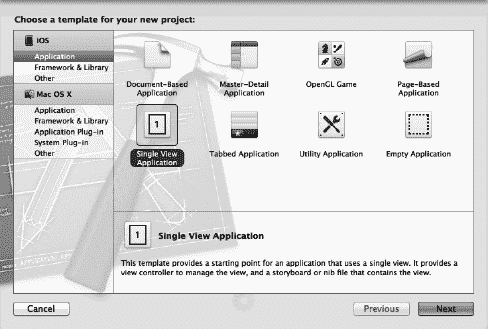

**图 2–2.** *项目模板选择表单允许你在创建新项目时从各种模板中进行选择。*

图 2–2 中右上方面板显示的每个图标都代表一个独立的项目模板，可用作 iOS 应用程序的起点。标有 *Single View Application* 的图标是最简单的模板，也是我们在前几章中将要使用的模板。其他模板提供了创建常见 iPhone 和 iPad 应用程序界面所需的额外代码和/或资源，你将在后续章节中看到。

点击 *Single View Application* 图标（如图 2–2 所示），然后点击 *Next* 按钮。你将看到项目选项表单，它应类似于图 2–3。在此表单中，你需要为项目指定 *Product Name* 和 *Company Identifier*。Xcode 会将这两者结合起来，为你的应用生成一个唯一的 *Bundle Identifier*。将你的产品命名为 *Hello World*，然后在 *Company Identifier* 字段中输入 *com.apress*，如图 2–3 所示。之后，当你注册了开发者计划并了解了配置文件后，你将希望使用自己的公司标识符。我们将在本章后面进一步讨论 bundle identifier。

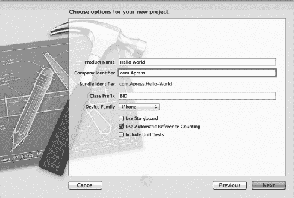

**图 2–3.** *为你的项目选择产品名称和公司标识符。暂时使用这些设置。*

下一个文本框标有 *Class Prefix*，我们应该用至少三个大写字母的序列来填充它。这些字符将被添加到 Xcode 为我们创建的所有类名的开头。这样做是为了避免与苹果（它保留所有两个字母前缀的使用权）以及我们可能使用的其他开发者的代码发生命名冲突。在 Objective-C 中，如果有多个同名的类，将阻止你的应用程序构建。

对于本书中的项目，我们将使用前缀 *BID*，它代表 **B**eginning **i**Phone **D**evelopment。虽然可能会有很多类被命名为 `ViewController`，但命名为 `BIDMyViewController` 的类则要少得多，这意味着冲突的机会大大减少。

我们还需要指定 *Device Family*。换句话说，Xcode 想知道我们是为 iPhone 和 iPod touch 构建应用，还是为 iPad 构建应用，或者是在构建一个适用于所有 iOS 设备的通用应用程序。如果尚未选择，请为 *Device Family* 选择 *iPhone*。这会告诉 Xcode，我们将专门针对屏幕尺寸相同的 iPhone 和 iPod touch 开发这个应用。在本书的前半部分，我们将使用 iPhone 设备系列，但别担心——我们也会涵盖 iPad。

这个表单上有三个复选框。你应该勾选中间那个选项 *Use Automatic Reference Counting*，但取消勾选另外两个。自动引用计数 (ARC) 是 Objective-C 语言的一个新特性，随 iOS 5 引入，它能让你的开发生活轻松许多。我们将在下一章简要讨论 ARC。


*使用故事板*选项将从第 10 章开始介绍。另一个选项——*包含单元测试*——将以一种方式设置你的项目，使你能够向项目中添加称为单元测试的特殊代码片段，这些代码不属于你的应用程序，但每次构建应用程序时都会运行以测试特定功能。单元测试让你能够识别出对代码所做的更改是否破坏了之前能正常工作的部分。虽然这是一个有价值的工具，但本书不会使用自动化单元测试，因此你可以取消勾选该复选框。

再次点击*下一步*，系统会使用标准保存表单询问你保存新项目的位置，如图 2-4 所示。如果你还没有这样做，请跳转到访达（Finder）并为此书项目创建一个新的主目录，然后返回 Xcode 并导航到该目录。在点击*创建*按钮之前，请务必取消勾选*为此项目创建本地 Git 仓库*复选框。在取消勾选*源代码控制*复选框后，点击*创建*按钮创建新项目。

**注意：** 源代码控制仓库是一种用于跟踪应用程序在构建过程中源代码和资源更改的工具。它还能通过提供解决冲突的工具，方便多个开发者同时处理同一应用程序。本书不会使用源代码控制，因此你可以取消勾选该复选框。

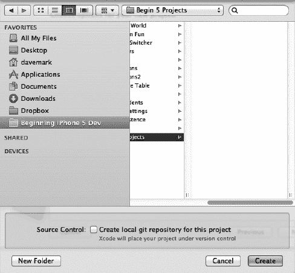

**图 2-4.** *将项目保存到硬盘上的项目文件夹中*

#### Xcode 工作区窗口

关闭保存表单后，Xcode 会创建并打开你的项目。你将看到一个新的工作区窗口，如图 2-5 所示。这个窗口中塞满了大量信息，你将在这里度过大部分 iOS 开发时间。

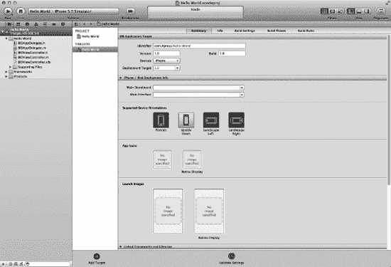

**图 2-5.** *Xcode 中的 Hello World 项目*

即使你是旧版 Xcode 的老手，阅读本节也会让你受益匪浅，因为自上一版本的 Xcode 3.*x* 以来，*很多*内容都发生了变化。让我们快速浏览一下。

##### 工具栏

Xcode 工作区窗口的顶部称为工具栏（参见图 2-6）。工具栏左侧是启动和停止运行项目的控制按钮、用于选择要运行方案的弹出菜单，以及用于开启和关闭断点的按钮。一个**方案**将目标和构建设置结合在一起，工具栏的弹出菜单让你只需点击一下即可选择特定的设置。

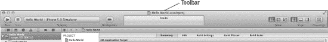

**图 2-6.** *Xcode 工具栏*

工具栏中间的大框是**活动视图**。顾名思义，活动视图会显示当前正在发生的任何操作或进程。例如，当你运行项目时，活动视图会逐步显示构建应用程序所采取的各种步骤。如果遇到任何错误或警告，这些信息也会显示在这里。如果点击警告或错误，你将直接进入问题导航器，那里会提供有关警告或错误的更多信息，如下一节所述。

工具栏右侧是三组按钮。左侧那组标记为*编辑器*，可让你在三种不同的编辑器配置之间切换：

*   **标准视图**提供一个用于编辑文件或项目特定配置值的单窗格。
*   功能极其强大的**助手视图**将编辑器窗格分为左右两个窗格。右侧窗格通常用于显示与左侧文件相关的文件，或者你在编辑左侧文件时可能需要参考的文件。你可以手动指定每个窗格的内容，也可以让 Xcode 为当前任务决定最合适的显示内容。例如，如果你正在编辑一个 Objective-C 类的实现文件（`.m` 文件），Xcode 会自动在右侧窗格中显示该类的头文件（`.h` 文件）。如果你在左侧设计用户界面，Xcode 会在右侧显示该用户界面可以与之交互的代码。你在本书中会看到助手视图的实际运用。
*   **版本**按钮将编辑器窗格转换为类似时间机器的比较视图，可与 Subversion 和 Git 等源代码管理系统配合使用。你可以将源代码文件的当前版本与之前提交的版本进行比较，或者比较任意两个早期版本。

编辑器按钮组右侧是另一组按钮，用于显示和隐藏位于编辑器窗格左右两侧的导航器窗格和实用工具窗格。点击这些按钮即可查看这些窗格的效果。

最后，最右侧的按钮会打开*管理器*窗口，你可以在其中找到大量与项目无关的功能。它用作 Apple API 文档的文档查看器，显示 Xcode 已知的所有源代码仓库，保存你打开过的所有项目列表，并维护已与此电脑同步的所有设备列表。


### 导航视图

位于工作区窗口左侧、工具栏正下方的，是**导航视图**。导航视图提供了七种配置，让你可以从不同角度查看项目。从左到右依次单击导航视图顶部的图标，可在下列导航器之间切换：

-   **项目导航器**：此视图包含项目所使用的文件列表（参见图 2–7）。你可以存储各种预期的引用，从源代码文件到美工素材、数据模型、属性列表（或`plist`）文件（本章稍后在“深入查看我们的项目”一节中讨论），甚至其他项目文件。通过将多个项目存储在同一工作区中，可以轻松实现多个项目间的资源共享。若单击导航视图中的任何文件，该文件将显示在编辑窗格中。除了查看文件外，你还可以编辑该文件（前提是 Xcode 知道如何编辑这种类型的文件）。

    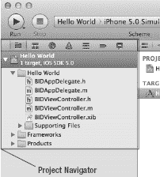

    **图 2–7.** *显示项目导航器的 Xcode 导航视图。单击视图顶部的七个图标之一可切换导航器。*

-   **符号导航器**：顾名思义，此导航器专注于工作区中定义的**符号**（参见图 2–8）。符号基本上就是编译器能够识别的项目，例如 Objective-C 类、枚举、`struct`和全局变量。

    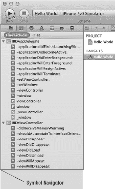

    **图 2–8.** *显示符号导航器的 Xcode 导航视图。打开展开三角形以探索每个组中定义的文件和符号。*

-   **搜索导航器**：你将使用此导航器对工作区中的所有文件执行搜索（参见图 2–9）。你可以从“查找”弹出菜单中选择*替换*，对全部或仅部分搜索结果执行查找和替换。如需更丰富的搜索，请从搜索字段中放大镜关联的弹出菜单中选择*显示查找选项*。

    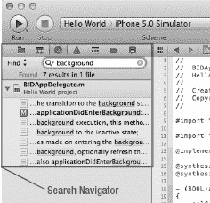

    **图 2–9.** *显示搜索导航器的 Xcode 导航视图。请务必查看隐藏在“查找”字样下以及搜索字段中放大镜下的弹出菜单。*

-   **问题导航器**：当你构建项目时，任何错误或警告都会出现在此导航器中，并且详细说明错误数量的消息会出现在窗口顶部的活动视图中（参见图 2–10）。当你在问题导航器中单击一个错误时，你将跳转到编辑窗格中相应的代码行。

    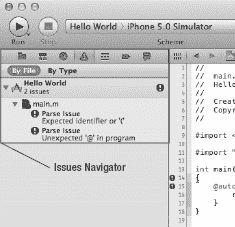

    **图 2–10.** *显示问题导航器的 Xcode 导航视图。你将在此处找到编译器的错误和警告。*

-   **调试导航器**：此导航器是你进行调试过程的主要视图（参见图 2–11）。如果你是调试新手，可以查阅《Xcode 4 用户指南》的这一部分：

    ```
    http://developer.apple.com/library/mac/#documentation/
        ToolsLanguages/Conceptual/Xcode4UserGuide/Debugging/Debugging.html
    ```

    调试导航器列出了每个活动线程的栈帧。**栈帧**是按调用顺序排列的先前被调用的函数或方法的列表。单击某个方法，关联的代码就会出现在编辑窗格中。在编辑器中，会出现第二个窗格，你可以在此控制调试过程、显示和修改数据值，以及访问底层调试器。调试导航器底部的滑块允许你控制其跟踪的详细程度。向右滑动到最右侧可查看所有内容，包括所有系统调用。向左滑动到最左侧则只查看你自己的调用。默认设置为中间位置，这是一个不错的起点。

    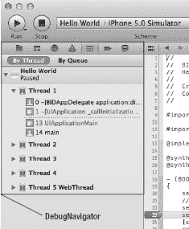

    **图 2–11.** *显示调试导航器的 Xcode 导航视图。请务必尝试窗口底部的细节滑块，它允许你指定希望看到的调试细节级别。*

-   **断点导航器**：断点导航器允许你查看所有已设置的断点（参见图 2–12）。顾名思义，断点是代码中应用程序将停止运行（或**中断**）的点，以便你可以查看变量中的值并执行调试应用程序所需的其他任务。此导航器中的断点列表按文件组织。单击列表中的某个断点，该行代码将出现在编辑窗格中。请务必在断点导航器中查看工作区窗口左下角的弹出菜单。加号弹出菜单允许你添加异常或符号断点，减号弹出菜单则删除任何选中的断点。

    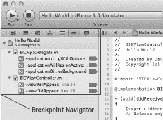

    **图 2–12.** *显示断点导航器的 Xcode 导航视图。断点列表按文件组织。*

-   **日志导航器**：此导航器保留了你最近的构建结果和运行日志的历史记录（参见图 2–13）。单击特定的日志，构建命令和任何构建问题将显示在编辑窗格中。

    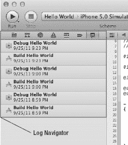

    **图 2–13.** *显示日志导航器的 Xcode 导航视图。日志导航器显示构建列表，并在编辑窗格中显示与所选视图关联的详细信息。*


### 跳转栏

通过单击，`跳转栏` 可让你跳转到当前浏览层级中的特定元素。例如，图 2-14 展示了在编辑窗格中编辑的源文件。跳转栏位于源代码的正上方。其具体构成如下：

- 跳转栏左端那个样式奇特的图标实际上是一个弹出菜单，可以显示子菜单，列出最近文件、未保存文件、对应文件、超类和子类、兄弟类、类别、包含文件以及包含当前文件的文件。
- 在超级菜单的右侧，有左右箭头，分别用于返回上一个文件和前进到下一个文件。
- 跳转栏包含一个分段弹出菜单，显示当前项目下可用于当前编辑器的文件。在图 2-14 中，我们处于源代码编辑器，因此可以看到项目中所有的源文件。跳转栏的末端是一个弹出菜单，显示当前选中文件中包含的方法及其他符号。图 2-14 中的跳转栏显示了文件 `BIDAppDelegate.m`，其子菜单列出了该文件中定义的符号。

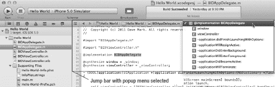

**图 2-14.** *Xcode 编辑器窗格，显示跳转栏，并选中了一个源代码文件。子菜单显示了选中文件中的方法列表。*

跳转栏功能非常强大。在你探索构成 Xcode 4 的各种界面元素时，请留意它的存在。

**提示：** 如果你在 Lion（Mac OS × 10.7）系统下运行 Xcode，则完全支持全屏模式。只需点击项目窗口右上角的全屏按钮，即可体验无干扰的全屏编码！

### Xcode 键盘快捷键

如果你更喜欢使用键盘快捷键而非鼠标操作屏幕控件，那么 Xcode 提供的功能会令你满意。在 Xcode 中，大多数常用操作都分配了键盘快捷键，例如使用  `B` 构建应用程序，或使用  `N` 创建新文件。

你可以更改 Xcode 的所有键盘快捷键，也可以为尚未设置快捷键的命令分配快捷键，这些操作都在 Xcode 偏好设置的 `按键绑定` 标签下进行。

一个非常实用的键盘快捷键是   `O`，这是 Xcode 的 `快速打开` 功能。按下此组合键后，开始输入文件、设置或符号的名称，Xcode 会列出一系列选项。当列表缩小到你想要的文件时，按下回车键即可在编辑窗格中打开它，仅需几次按键就能切换文件。

### 工具面板

正如我们之前提到的，Xcode 工具栏右侧倒数第二个按钮用于打开和关闭工具面板。与检查器类似，工具面板是上下文相关的，其内容会随编辑器窗格中显示的内容而变化。本书中你将看到许多相关示例。

### 界面生成器

早期版本的 Xcode 包含一个名为 `Interface Builder` 的界面设计工具，用于构建和定制项目的用户界面。Xcode 4 引入的重大变化之一是将 `Interface Builder` 集成到了工作区中。`Interface Builder` 不再是一个独立的应用程序，这意味着在代码和界面演进过程中，你无需在 Xcode 和 `Interface Builder` 之间来回切换。太棒了！

在本书中，我们将大量使用 Xcode 的界面构建功能，深入探究其所有细节。事实上，本章稍后我们将进行第一次界面构建实践。

### 新编译器和调试器

Xcode 4 带来的最重要变化之一隐藏在表象之下：全新的编译器和底层调试器。两者都比之前的版本更快、更智能。

新编译器 `LLVM 3` 生成的代码速度远超 `GCC`（GCC 是 Xcode 之前版本中的默认编译器）。除了生成更快的代码，`LLVM` 对代码的理解也更深入，因此能够生成更智能、更精确的错误信息和警告。

`LLVM` 还能提供更精确的代码补全，并且在产生警告时，它能对代码的实际意图做出合理的推断，并提供一个弹出菜单供你选择可能的修复方案。这使得诸如符号名称拼写错误、括号不匹配、缺少分号等错误变得极易发现和修复。

`LLVM` 还带来了一个强大的 `静态分析器`，它可以扫描代码，发现各种潜在问题，包括 Objective-C 内存管理问题。事实上，`LLVM` 在这方面非常智能，只要你在编写代码时遵守一些简单规则，它就能为你处理大部分内存管理任务。我们将在下一章开始，深入研究之前提到的出色的新 `ARC` 功能。

#### 深入了解我们的项目

现在我们已经探索了 Xcode 工作区窗口，接下来让我们看看构成新 `Hello World` 项目的文件。通过单击工作区左侧七个导航器图标中最左侧的那个（如本章前面“导航器视图”部分所述），或按下  `1`，切换到项目导航器。

**提示：** 这七个导航器配置可以使用键盘快捷键  `1` 到  `7` 进行访问。这些数字从左至右对应图标，因此  `1` 是项目导航器， `2` 是符号导航器，以此类推，直到  `7`，它会带你到日志导航器。

项目导航器列表中的第一个项目与你的项目同名——在此例中，就是 `Hello World`。这个项目代表了你的整个项目，同时也是进行项目特定配置的地方。如果你单击它，就可以在 Xcode 编辑器中编辑许多项目配置设置。不过，你目前无需担心这些项目特定的设置。目前，默认设置就可以正常工作。

回头看看图 2-7。注意，`Hello World` 左侧的展开三角形是打开的，显示了许多子文件夹（在 Xcode 中称为 `组`）：


*   `Hello World`: 第一个文件夹，通常以你的项目命名，你将在这里花费大部分时间。你编写的大部分代码，以及构成应用程序用户界面的文件，通常都会放在这里。你可以在`Hello World`文件夹下自由创建子文件夹来组织代码，如果你更喜欢其他的组织方式，甚至可以使用其他组。虽然我们到下一章才会接触这个文件夹中的大多数文件，但在下一节使用 Interface Builder 时，我们会探讨其中一个文件：
    *   `BIDViewController.xib`：包含项目主视图控制器特定的用户界面元素。
*   `Supporting Files`: 此文件夹包含非 Objective-C 类但项目必需的源代码文件和资源。通常，你不会在`Other Sources`文件夹中花费太多时间。当你创建一个新的 iPhone 应用程序项目时，此文件夹包含四个文件：
    *   `Hello_World-Info.plist`：一个包含应用程序信息的属性列表。我们将在本章稍后的“一些 iPhone 打磨——收尾工作”部分简要介绍这个文件。
    *   `InfoPlist.strings`：一个包含可在信息属性列表中引用的人类可读字符串的文本文件。与信息属性列表本身不同，此文件可以本地化，允许你在应用程序中包含多种语言翻译（我们将在第 21 章中介绍此主题）。
    *   `main.m`：包含你的应用程序的`main()`方法。通常你不需要编辑或更改此文件。事实上，如果你不知道自己在做什么，最好别碰它。
    *   `Hello_World_Prefix.pch`：项目使用的外部框架的头文件列表（扩展名`.pch`代表**预编译头**）。此文件中引用的头文件通常不是项目的一部分，并且不太可能经常更改。Xcode 会预编译这些头文件，并在未来的构建中继续使用该预编译版本，这将会减少你选择**Build**或**Run**时编译项目所需的时间。你暂时还不需要担心这个文件，因为最常用的头文件已经为你包含在内。
*   `Frameworks`: 此文件夹是一种特殊的库，可以包含代码以及资源，例如图像和声音文件。你添加到此文件夹的任何框架或库都将链接到你的应用程序中，并且你的代码将能够使用该框架或库中包含的任何对象、函数和资源。最常用的框架和库默认已链接到你的项目中，因此大多数情况下，你无需向此文件夹添加任何内容。如果你确实需要不太常用的库和框架，也可以轻松地将它们添加到`Frameworks`文件夹中。我们将在第 7 章中展示如何添加框架。
*   `Products`: 此文件夹包含项目构建时生成的应用程序。展开`Products`，你会看到一个名为`Hello World.app`的项目，这是此特定项目创建的应用程序。`Hello World.app`是这个项目的唯一产品。因为我们从未构建过它，所以`Hello World.app`是红色的，这是 Xcode 在告诉你文件引用指向了一个不存在的东西。

**注意：** 导航器区域中的“文件夹”不一定对应你 Mac 文件系统中的文件夹。这些是 Xcode 中的逻辑分组，用于帮助你保持一切有序，并在开发应用程序时更快、更轻松地找到所需内容。通常，这两个项目文件夹中包含的项目直接存储在项目的目录中，但你可以将它们存储在任何地方——如果你愿意，甚至可以放在项目文件夹之外。Xcode 内的层次结构与文件系统层次结构完全无关，因此，例如，在 Xcode 中将文件移出`Classes`文件夹并不会改变该文件在硬盘上的位置。

可以使用实用工具面板将组配置为使用特定的文件系统目录。但是，默认情况下，添加到项目中的新组完全独立于文件系统，其内容可以包含在任何位置。


### Xcode 的界面生成器介绍

在工作区窗口的项目导航器中，如果 *Hello World* 组尚未展开，请将其展开，然后选择 `BIDViewController.xib` 文件。选中后，该文件将在编辑窗格中打开，如图 2–15 所示。您应该会看到一个方格纸背景，这为编辑界面提供了良好的背景。这就是 Xcode 的界面生成器（有时简称为 IB），您将在这里设计应用程序的用户界面。

界面生成器历史悠久。它自 1988 年就已存在，并一直用于为 NeXTSTEP、OpenStep、Mac OS X 以及如今的 iOS 设备（如 iPhone 和 iPad）开发应用程序。正如我们之前提到的，在 Xcode 4 之前，界面生成器是一个与 Xcode 一同安装并与其协同工作的独立应用程序。现在，界面生成器已完全集成到 Xcode 中。

界面生成器支持两种文件类型：一种较旧的格式（使用扩展名 `.nib`）和一种较新的格式（使用扩展名 `.xib`）。iOS 项目模板默认都使用 `.xib` 文件，但在最初的 20 年里，所有界面生成器文件的扩展名都是 `.nib`，因此大多数开发者习惯将界面生成器文件称为“nib 文件”。无论文件实际使用的扩展名是 `.xib` 还是 `.nib`，界面生成器文件通常都被称为 nib 文件。事实上，Apple 在其文档中仍沿用 *nib* 和 *nib 文件* 这两个术语。

方格纸左侧边缘的灰色竖条称为**停靠栏**。停靠栏包含 nib 文件中每个顶层对象的图标。如果点击停靠栏底部右侧的圆形三角图标，您将看到这些对象的列表视图。再次点击该图标可返回图标视图。

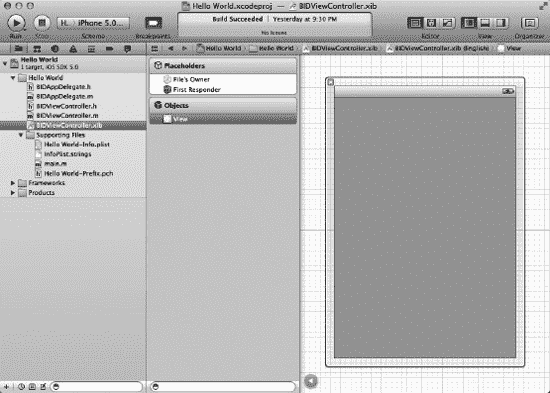

**图 2–15.** *我们在项目导航器中选择了 `BIDViewController.xib`。这将在界面生成器中打开该文件。请注意编辑窗格中的方格纸背景。方格纸左侧的灰色竖条称为停靠栏。*

nib 文件中的顶部两个图标称为 *文件所有者* 和 *第一响应者*，这是每个 nib 文件都有的特殊项目，我们稍后会详细介绍。其余每个图标代表一个 Objective-C 类的单个实例，当此 nib 文件加载时，这些实例将自动为您创建。我们的 nib 文件除了必需的 *文件所有者* 和 *第一响应者* 之外，还有一个额外的图标。第三个图标——即水平线下方的那个——代表一个视图对象。这就是应用程序启动时将显示的视图，当我们选择 *单视图应用程序* 模板时，系统已为我们创建了它。

现在，假设您想要创建一个按钮实例。您可以通过编写代码来创建该按钮，但通过从库中拖出一个按钮并指定其属性来创建界面对象则要简单得多，而且在运行时达到的效果完全相同。

我们正在查看的 `BIDViewController.xib` 文件会在应用程序启动时自动加载——暂时不用担心加载方式——因此它正是添加构成应用程序用户界面的对象的正确位置。当您在界面生成器中创建对象时，这些对象将在该 nib 文件加载时在您的程序中被实例化。在本书中，您将看到许多这样的过程示例。

#### Nib 文件中有什么？

正如我们之前提到的，nib 文件的内容由图标或列表形式表示，位于编辑窗格左侧的停靠栏中（见图 2–15）。每个 nib 文件都以相同的两个图标开始：*文件所有者* 和 *第一响应者*。这两个图标是自动创建的，无法删除。此外，它们通过分隔线与您添加到 nib 文件中的对象视觉上区分开来。由此可见，它们非常重要。

* *文件所有者* 代表从磁盘加载 nib 文件的对象。换句话说，*文件所有者* 是“拥有”此 nib 文件副本的对象。
* *第一响应者*，简单来说，就是用户当前正在交互的对象。例如，如果用户正在文本字段中输入数据，那么该字段就是当前的第一响应者。当用户与用户界面交互时，第一响应者会发生变化，而 *第一响应者* 图标为您提供了一种便捷的方式，可以与当前作为第一响应者的任何控件或其他对象进行通信，而无需编写代码来确定是哪个控件或视图。

我们将在下一章开始详细讨论这些对象，所以如果您现在对何时使用 *第一响应者* 或什么构成 nib 的“所有者”还不太清楚，也不必担心。

除了这两个特殊情况之外，此窗口中的每个其他图标都代表一个对象实例，该实例将在 nib 文件加载时创建，就像您编写代码来 `alloc` 和 `init` 一个新的 Objective-C 对象一样。在我们的例子中，第三个图标称为 *视图*（见图 2–15）。

*视图* 图标代表 `UIView` 类的一个实例。`UIView` 对象是用户可以看到并与之交互的区域。在这个应用程序中，我们将只有一个视图，因此这个图标代表了用户在我们的应用程序中可以看到的一切。稍后，我们将构建更复杂的应用程序，这些应用会包含多个视图。目前，只需将此视为用户在使用您的应用程序时可以看到的内容。

**注意：** 严格来说，我们的应用程序实际上会有多个视图。所有可以显示在屏幕上的用户界面元素——包括按钮、文本字段和标签——都是 `UIView` 的子类。然而，当本书中使用术语 *视图* 时，我们通常仅指 `UIView` 的实际实例，而此应用程序只有一个这样的实例。

如果您点击 *视图* 图标，一个 iPhone 尺寸的屏幕图示将会打开（如果尚未显示）。在这里，您可以以图形方式设计您的用户界面。


#### 库

如图 2–16 所示，构成工作区右侧的实用工具视图分为两个部分。如果你当前没有看到实用工具视图，请点击工具栏中三个*视图*按钮中最右侧的那个，选择**视图****实用工具****显示实用工具**，或者按下`0`（Option-Command-0）。

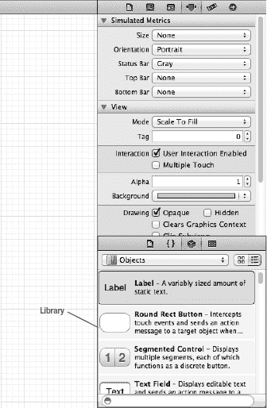

**图 2–16.** *库是存放 Interface Builder 中可用的 UIKit 内置对象的地方。库上方直至工具栏下方的所有区域统称为检查器。*

实用工具视图的下半部分称为**库面板**，或者简称为**库**。库是一组可在自己程序中使用的可复用项目集合。库面板顶部栏中的四个图标将库分为四个部分：

- **文件模板库**：此部分包含一组文件模板，当你需要向项目添加新文件时可使用它们。例如，如果你想向项目添加一个新的 Objective-C 类，可以从文件模板库中拖出一个 Objective-C 类文件。
- **代码片段库**：此部分包含一组可拖入源代码文件中的代码片段。记不住 Objective-C 快速枚举的语法？没关系——只需从库中拖出那个特定片段，无需再查找。你是否写过一些以后可能再次使用的代码？在文本编辑器中选中它，然后拖入代码片段库即可。
- **对象库**：此部分充满了可复用对象，如文本字段、标签、滑块、按钮以及设计 iOS 界面时可能需要的几乎所有对象。本书将大量使用对象库来构建示例程序的界面。
- **媒体库**：顾名思义，此部分用于存放所有媒体文件，包括图片、声音和影片。

**注意：** 对象库中的项目主要来自 iOS UIKit，这是一个用于创建应用用户界面的对象框架。UIKit 在 Cocoa Touch 中的作用与 AppKit 在 Cocoa 中的作用相同。这两个框架在概念上相似，但由于平台差异，它们之间显然存在许多不同之处。另一方面，Foundation 框架类（如`NSString`和`NSArray`）在 Cocoa 和 Cocoa Touch 中是共用的。

请注意库底部的搜索字段。想找一个按钮？在搜索字段中输入 *button*，当前库将只显示名称中包含 *button* 的项目。搜索完成后别忘了清除搜索字段。

#### 向视图中添加标签

让我们来试试 Interface Builder。点击库顶部的对象库图标（看起来像一个立方体）以打开对象库。现在滚动库找到*表视图*。没错——继续滚动，你就会找到它。或者等等！有更好的方法：只需在搜索字段中输入 *Table View*。是不是简单多了？

**提示：** 这是一个便捷的快捷键：按下`^``3`可跳转到搜索字段并高亮其内容。

现在在库中找到一个*标签*。它可能位于列表顶部或靠近顶部的位置。接下来，将标签拖到我们之前看到的视图上。（如果你在编辑器面板中看不到视图，请点击 Interface Builder Dock 中的*视图*图标。）当光标出现在视图上方时，它会变成你熟悉的 Finder 中标准的“正在复制某物”的绿色加号。将标签拖到视图中央。当标签居中时，会出现一对蓝色参考线——一条垂直，一条水平。标签是否居中并不至关重要，但了解这些参考线的存在是件好事。图 2–17 展示了我们即将松开鼠标时工作区的样子。

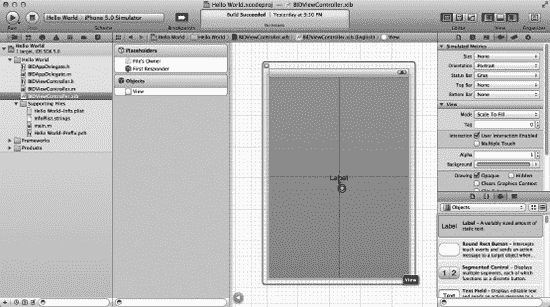

**图 2–17.** *我们在库中找到了一个标签并将其拖到了视图上。请注意，我们在库搜索字段中输入了 label，以将对象列表限制为包含单词 label 的项目。*

用户界面项目按层级存储。大多数视图可以包含**子视图**，但也有一些视图（如按钮和大多数其他控件）不能包含子视图。Interface Builder 很智能。如果某个对象不接受子视图，你将无法将其他对象拖到它上面。

我们将标签添加为主视图（名为*View*的视图）的子视图，这样当该视图显示给用户时，标签会自动出现。将*标签*从库拖到名为*View*的视图上，会将`UILabel`的一个实例添加为应用主视图的子视图。

让我们编辑标签，让它显示一些有意义的内容。双击你刚刚创建的标签，输入文本 *Hello, World!* 。接着，点击标签外部取消选择，然后重新选中标签并拖动它将其重新居中，或者将其放置在屏幕上你希望它出现的任何位置。

猜猜怎么着？保存后，我们就完成了。选择**文件****存储**，或按下`S`。然后点击 Xcode 工作区窗口左上角的弹出菜单，选择**iPhone 模拟器**（该弹出菜单可能还包含版本号——选择最新最好的版本），这样我们的应用就会在模拟器中运行。如果你是苹果付费 iOS 开发者计划的成员，你可以尝试在手机上运行应用。在本书中，我们会尽可能使用模拟器，因为运行模拟器不需要任何付费会员资格。

准备好运行了吗？选择**产品****运行**或按下`R`。Xcode 将编译你的应用并在 iPhone 模拟器中启动它，如图 2–18 所示。

**注意：** 如果你在构建和运行时 iOS 设备连接到了 Mac，事情可能不会完全按计划进行。简而言之，要想在你的 iPhone、iPad 或 iPod touch 上构建和运行应用，你必须注册并付费加入苹果的 iOS 开发者计划之一，然后完成配置 Xcode 的相应过程。加入该计划后，苹果会向你发送完成配置所需的信息。与此同时，本书中的大多数程序使用 iPhone 或 iPad 模拟器都能正常运行。

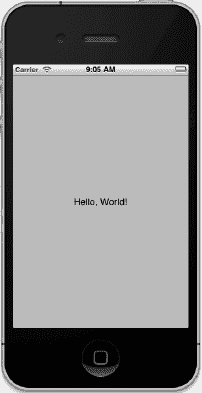

**图 2–18.** *这就是在 iPhone 上大放异彩的“Hello, World”程序！*

当你欣赏完自己的作品后，可以返回 Xcode。Xcode 和模拟器是独立的应用程序。

**提示：** 检查完应用后，你可以退出模拟器，但很快你又会重新启动它。如果你让模拟器保持运行状态，并再次要求 Xcode 运行应用，Xcode 会询问你是想先停止现有的应用，还是以第二个实例运行应用，同时保留第一个实例继续运行。如果这让你感到困惑，你可以每次测试完应用后退出模拟器。没人会知道的！

等等！就这样了？但我们还没有编写任何代码。没错。

是不是挺酷的？

嗯，如果我们想改变标签的一些属性，比如文字大小或颜色，该怎么办？那样我们就需要编写代码了，对吧？不。让我们看看进行更改是多么容易的事情。


#### 更改属性

回到 Xcode，单击 `Hello World` 标签以将其选中。现在将注意力转向库面板上方的区域。实用工具面板的这一部分称为检查器。与库类似，检查器面板顶部也有一系列图标，每个图标都会将检查器切换为查看特定类型的数据。要更改标签的属性，我们需要左起第四个图标，它将调出对象属性检查器，如图 Figure 2–19 所示。

**提示：** 与项目导航器一样，检查器也有对应每个图标的键盘快捷键。检查器的键盘快捷键从左起第一个图标开始是 `1`，下一个图标是 `2`，依此类推。与项目导航器不同，检查器中图标的数量是上下文相关的，会根据导航器和/或编辑器中选中的对象而变化。

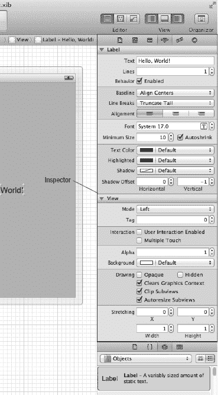

**图 2–19.** *显示我们标签属性的对象属性检查器*

现在，尽情更改标签的外观吧。随意调整文本的字体、大小和颜色。请注意，如果增加字体大小，可能需要调整标签本身的大小，以便为更大的文本腾出空间。调整完毕后，保存文件并再次选择 `Run`。您所做的更改应该会显示在应用程序中，而且再次无需编写任何代码。

**注意：** 不必过于担心对象属性检查器中所有字段的含义，如果某个更改无法显示，也不必烦恼。随着您继续阅读本书，您将了解很多关于对象属性检查器及其各个字段功能的知识。

通过让您以图形方式设计界面，Interface Builder 使您能够将时间花在编写应用程序特有的代码上，而不是编写繁琐的代码来构建用户界面。

大多数现代应用程序开发环境都有某种工具，可以让您以图形方式构建用户界面。Interface Builder 与许多其他工具之间的一个区别在于，Interface Builder 不会生成任何需要维护的代码。相反，Interface Builder 会创建 Objective-C 对象（就像您在自己的代码中做的那样），然后将这些对象序列化到 nib 文件中，以便在运行时直接加载到内存中。这避免了与代码生成相关的许多问题，并且总体而言是一种更强大的方法。

### 一点 iPhone 润色——收尾工作

现在，让我们为应用程序做最后的润色，使其更像一个真正的 iPhone 应用程序。首先，运行您的项目。当模拟器窗口出现时，点击 iPhone 的 Home 按钮（窗口最底部带有白色方块的黑色按钮）。这将使您返回到 iPhone 主屏幕，如图 Figure 2–20 所示。有没有注意到什么有点……嗯，无聊？

看一下屏幕顶部的 `Hello World` 图标。是的，这个图标肯定不行，对吧？要修复它，您需要创建一个图标并将其保存为便携式网络图形（`*.png`）文件。实际上，您应该创建两个图标。一个需要是 114 × 114 像素大小，另一个需要是 57 × 57 像素大小。为什么是两个图标？嗯，iPhone 4 引入了 Retina 显示屏，其分辨率正好是早期 iPhone 机型的两倍。较小的图标将用于非 Retina 设备，而较大的图标将用于配备 Retina 显示屏的设备。

创建图标时，不要试图模仿电话上已有的按钮样式；您的 iPhone 会自动将边缘圆角化，并赋予其漂亮、玻璃般的外观。只需创建普通的平面方形图像即可。我们在项目存档的 `02 - Hello World` 文件夹中提供了两个图标图像，分别名为 `icon.png` 和 `icon@2x.png`，如果您不想自己创建，可以使用它们。较大文件名中的 `@2x` 是一种特殊的命名约定，用于标识该文件是同一文件（同名但去掉 `@2x`）的 Retina 版本。

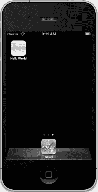

**图 2–20.** *我们的 Hello, World 图标实在太无聊了。它需要一个真正的图标！*

**注意：** 对于应用程序的图标，您必须使用 `*.png` 图像，但实际上，您应该在 iOS 项目中为所有图像使用这种格式。Xcode 会在构建时自动优化 `*.png` 图像，这使其成为 iOS 应用程序中最快、最高效的图像类型。尽管大多数常见的图像格式都能正确显示，但您应该使用 `*.png` 文件，除非您有令人信服的理由使用其他格式。

设计好应用图标后，按下 `1` 打开项目导航器，然后单击导航器中的最顶行——带有蓝色图标和名称 `Hello World` 的那一行。现在，将注意力转向编辑面板。

在编辑面板的左侧，您会看到一个白色列，其中包含标记为 `PROJECT` 和 `TARGETS` 的列表条目。确保选中了 `Hello World` 目标。在该列的右侧，您会看到一个大的灰色设置面板。该面板顶部有五个选项卡。选择 `Summary` 选项卡。在 `Summary` 选项卡中，向下滚动，找到标记为 `App Icons` 的部分（参见 Figure 2–21）。这就是我们将拖动新添加图标的地方。

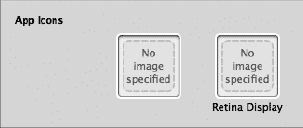

**图 2–21.** *项目 Summary 选项卡上的 App Icon 框。您可以在此处设置应用程序的图标。*

从 Finder 中，将 `icon.png` 拖到左侧的矩形中。这会将 `icon.png` 复制到您的项目中，并将其设置为应用程序的图标。接下来，将 `icon@2x.png` 从 Finder 拖到右侧的矩形中，这将将其设置为应用程序的 Retina 显示屏图标。

如果您再看一下项目导航器，会注意到这两个图像已被添加到项目中，但不在文件夹内（参见 Figure 2–22）。为了保持项目井井有条，请选中 `icon.png` 和 `icon@2x.png`，然后将它们拖到 `Supporting Files` 组中。

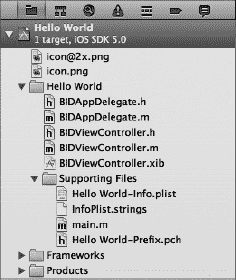

**图 2–22.** *当图标被添加到项目时，它们不会被放置到子文件夹中。如果您想保持项目有条理，需要自己移动它们。*


### 排版后的内容

让我们来看看 Xcode 对这些图标在后台做了哪些操作。在 Xcode 的项目导航器中，再次查看 *Supporting Files* 文件夹，然后单击 *Hello_World-Info.plist* 文件。这是一个**属性列表**文件，包含我们应用程序的一些常规信息，包括项目图标文件的具体内容。

当你选择 `Hello_World-Info.plist` 后，属性列表会显示在编辑面板中。在属性列表中找到左侧标签为 *Icon files* 的行，该行对应的右侧列会显示 *(2 items)*。这一行包含一个数组，意味着它可以存放多个值。本例中，每个指定的图标对应一行。单击名称 *Icon Files* 左侧的展开三角形，你会看到数组中的两个项目，如图 2–23 所示。

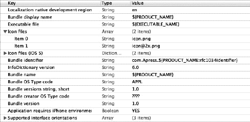

**图 2–23.** *展开三角形后显示 Icon Files 数组的内容。在数组中，你会看到每个图标文件对应的行。*

查看图 2–23 中的 plist 内容时，你可能会注意到另一行键值为 *Icon Files (iOS 5)*。如果单击该条目旁边的展开三角形，你会看到它包含两个命名条目：一个叫 *Primary Icon*，另一个叫 *Newsstand Icon*。展开 *Primary Icon* 后，你会看到与 *Icon Files* 下相同的内容。对此不必过于担心。如果按照我们刚才的方式使用 Xcode 设置图标，Xcode 总会正确地配置属性列表。

相同图标信息出现两次的原因是，在 iOS 5 之前，每个应用程序只有一个图标，因此单个数组（*Icon Files*）就足以存放图标信息。到了 iOS 5，Apple 引入了一种为应用程序指定其他类型图标的方式，包括用于 Apple Newsstand 应用的图标。本书不会涉及 Newsstand，所以你无需担心何时或为何要为其指定图标。只需了解 iOS 5 引入了一种指定图标的新方式，而目前应用程序会同时支持新旧两种方法。

**注：** 如果你只是将两个图标图片文件复制到 Xcode 项目中，而不进行其他操作，你的图标实际上也会显示出来。嗯？这是为什么呢？默认情况下，如果没有提供图标文件名，SDK 会查找名为 `icon.png` 的资源并使用它。你也不需要告诉它 `@2x` 版本的图标。iOS 知道如何在配备 Retina 显示屏的设备上查找该图标。但为了确保万无一失，你应该让你的应用程序面向未来，始终在信息属性列表中指定应用的图标。

现在，看一下 `Hello_World-Info.plist` 中的其他行。虽然大多数设置保持不变即可，但有一项值得我们特别关注：*Bundle identifier*。这是我们在创建项目时输入的唯一标识符。这个值应始终设置。捆绑标识符的标准命名规范是使用顶级互联网域名，例如 `com` 或 `org`，接着加一个句点，然后是你的公司或组织名称，再加一个句点，最后是你的应用程序名称。

创建这个项目时，系统提示我们输入捆绑标识符，我们输入了 `com.apress`。字符串末尾的值是一个特殊代码，在构建应用程序时会被替换为你的应用程序名称。这样可以将应用的捆绑标识符与其名称关联起来。如果创建项目后需要更改应用程序的唯一标识符，就需要在这里进行操作。

现在编译并运行你的应用程序。当模拟器启动完毕后，按下带有白色方块的主屏幕按钮，查看你炫酷的新图标。我们的图标如图 2–24 所示。

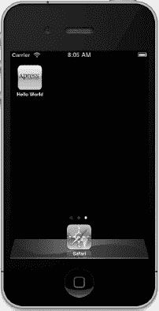

**图 2–24.** *你的应用程序现在有了一个炫酷的图标！*

**注：** 如果你想从 iPhone 模拟器的主屏幕清除旧应用程序，可以选择 iPhone 模拟器  重置内容和设置… 从 iPhone 模拟器的应用程序菜单中。

### 本章小结

为自己鼓鼓掌吧。虽然本章看起来并没有完成太多内容，但实际上我们涉及了很多方面。你了解了 iOS 项目模板，创建了一个应用程序，学习了大量关于 Xcode 4 的知识，开始使用 Interface Builder，并学会了如何设置应用程序图标和捆绑标识符。

然而，Hello, World 程序是一个严格的单向应用程序。我们向用户展示了一些信息，但从未获取过任何用户输入。当你准备好了解如何从 iOS 设备用户那里获取输入并基于输入进行操作时，深吸一口气，然后翻到下一页吧。

