# 第 3 章

## 处理基本交互

我们的 Hello, World 应用程序是对使用 Cocoa Touch 进行 iOS 开发的一次良好入门，但它缺少一项关键能力：与用户交互的能力。没有这一能力，我们的应用程序所能实现的功能将受到极大限制。

在本章中，我们将编写一个稍微复杂一点的应用程序——它包含两个按钮和一个标签，如图 3–1 所示。当用户点击任意一个按钮时，标签的文本会发生变化。这看起来是一个相当简单的示例，但它展示了创建交互式 iOS 应用程序所涉及的关键概念。

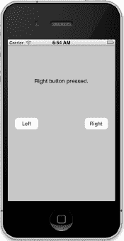

**图 3–1.** *我们将在本章构建的简单双按钮应用程序*


### 模型-视图-控制器范式

在深入探讨之前，有必要先了解一些理论知识。Cocoa Touch 的设计者们遵循着一个名为**模型-视图-控制器**（MVC）的概念，这是一种将构成 GUI 应用程序的代码进行逻辑划分的方式。如今，几乎所有面向对象的框架都在一定程度上借鉴了 MVC，但很少有框架能像 Cocoa Touch 那样忠实地遵循 MVC 模型。

MVC 模式将所有功能划分为三个不同的类别：

- **模型**：持有应用程序数据的类。
- **视图**：由用户可见并可交互的窗口、控件和其他元素组成。
- **控制器**：将模型和视图绑定在一起的代码。它包含决定如何处理用户输入的应用逻辑。

MVC 的目标是让实现这三种代码类型的对象尽可能彼此独立。你创建的任何对象都应能轻松识别为属于这三个类别之一，并且几乎没有或完全没有可归类为其他两个类别的功能。例如，实现按钮的对象不应包含处理按钮点击时处理数据的代码，而实现银行账户的对象也不应包含绘制表格来显示其交易记录的代码。

MVC 有助于确保最大程度的可重用性。实现通用按钮的类可以在任何应用中使用。而实现一个点击时执行特定计算的按钮的类，则只能在其最初编写的应用中使用。

当你编写 Cocoa Touch 应用程序时，你主要会使用 Xcode 中名为 Interface Builder 的可视化编辑器来创建视图组件，尽管你也会通过代码修改，有时甚至创建用户界面。

你的模型将通过编写 Objective-C 类来持有应用程序数据，或使用名为 Core Data 的工具构建数据模型来创建。你将在第 13 章中了解 Core Data 的相关内容。本章的应用程序中我们不会创建任何模型对象，因为我们不需要存储或保留数据，但在后续章节中，随着应用程序变得更加复杂，我们将会引入模型对象。

你的控制器组件通常由你创建且特定于应用程序的类构成。控制器可以是完全自定义的类（`NSObject` 子类），但更常见的情况是，它们将成为 UIKit 框架中几个现有通用控制器类（例如 `UIViewController`，你很快就会看到）的子类。通过继承这些现有类之一，你可以免费获得大量功能，并且无需花费时间重新“造轮子”，可以这么说。

随着我们对 Cocoa Touch 的深入学习，你很快就会发现 UIKit 框架的类是如何遵循 MVC 原则的。如果你在开发过程中始终牢记这一概念，你最终将编写出更清晰、更易于维护的代码。

### 创建我们的项目

是时候创建我们的下一个 Xcode 项目了。我们将使用与前一个章节相同的模板：*单视图应用程序*。通过再次从这个简单的模板开始，你将更容易理解视图和控制器对象在 iOS 应用程序中是如何协同工作的。在后续章节中，我们将使用其他一些模板。

启动 Xcode，选择 **File  New  New Project…** 或按下 **N**。选择 *Single View Application* 模板，然后点击 *Next*。

你会看到与上一章相同的选项表。在 *Product Name* 字段中，输入我们新应用程序的名称 *Button Fun*。*Company Identifier* 字段应仍保留你在上一章中使用的值，因此你可以保持原样。在 *Class Prefix* 字段中，使用与上一章相同的值：*BID*。

就像我们处理 Hello, World 项目时一样，我们将编写一个 iPhone 应用程序，因此为 *Device Family* 选择 *iPhone*。我们不打算使用故事板或单元测试，因此可以保持这两个选项为未选中状态。但是，我们确实希望使用 ARC，因此请勾选 *Use Automatic Reference Counting* 复选框。我们将在本章后面解释 ARC。图 3–2 显示了填写完毕的选项表。

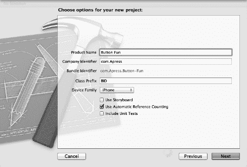

**图 3–2.** *命名你的项目并选择选项*

点击 *Next*，系统会提示你选择一个项目位置。你可以保持 *Create local git repository* 复选框为未选中状态。将项目与其他书籍项目保存在一起。

### 查看视图控制器

在本章稍后部分，我们将使用 Interface Builder 为我们的应用程序设计一个视图（或用户界面），就像我们在上一章所做的那样。在此之前，我们将查看并对为我们创建的源代码文件进行一些修改。没错，Virginia，我们本章确实要编写一些代码了。

在我们进行任何修改之前，让我们先看看为我们创建的文件。在项目导航器中，*Button Fun* 组应该已经展开，但如果没有，请点击其旁边的展开三角形（参见图 3–3）。

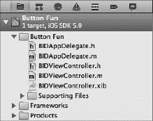

**图 3–3.** *项目导航器显示了项目模板为我们创建的类文件。请注意，我们的类前缀已自动合并到类文件名中。*

*Button Fun* 文件夹应包含四个源代码文件（扩展名为 `.h` 或 `.m` 的文件）和一个单独的 nib 文件。这四个源代码文件实现了我们的应用程序需要的两个类：我们的应用程序委托和应用程序唯一视图的视图控制器。请注意，Xcode 会自动将我们指定的前缀添加到所有类名中。

我们将在本章稍后部分查看应用程序委托。首先，我们将处理为我们创建的视图控制器类。

名为 `BIDViewController` 的控制器类负责管理我们应用程序的视图。名称中的 `BID` 部分是根据我们指定的类前缀自动派生的，而 `ViewController` 部分则标识了该类是一个视图控制器。点击 *Groups & Files* 窗格中的 `BIDViewController.h`，查看该类头文件的内容：

```
#import <UIKit/UIKit.h>

@interface BIDViewController : UIViewController

@end
```

内容不多，对吧？`BIDViewController` 是 `UIViewController` 的子类，`UIViewController` 是我们之前提到的那些通用控制器类之一。它是 UIKit 的一部分，通过继承它，我们可以免费获得大量功能。Xcode 不知道我们的特定应用程序功能会是什么，但它知道我们将会有一些功能，因此它创建了这个类，供我们编写这些特定于应用程序的功能。


### 理解输出口与动作方法

在第 2 章中，你使用 Xcode 的界面生成器设计了一个用户界面。刚才，你看到了一个视图控制器类的框架。这个视图控制器类中的代码一定需要通过某种方式与 nib 文件中的对象进行交互，对吗？

完全正确！控制器类可以通过一种称为**输出口**的特殊属性来引用 nib 文件中的对象。你可以将输出口理解为指向 nib 内部某个对象的指针。例如，假设你在界面生成器中创建了一个文本标签（就像我们在第 2 章中所做的那样），并希望从代码中更改该标签的文本。通过声明一个输出口并将该输出口连接到标签对象，你就可以在代码中使用该输出口来更改标签显示的文本。你将在本章中学习如何做到这一点。

反过来，我们 nib 文件中的界面对象可以被设置为触发控制器类中的特殊方法。这些特殊方法被称为**动作方法**（或简称**动作**）。例如，你可以告诉界面生成器，当用户点击某个按钮时，应该调用代码中的某个特定动作方法。你甚至可以告诉界面生成器，当用户首次触摸按钮时，它应该调用一个动作方法，然后当手指从按钮上抬起时，再调用另一个不同的动作方法。

在 Xcode 4 之前，我们需要先在视图控制器的头文件中创建好输出口和动作方法，然后才能进入界面生成器开始连接输出口和动作。Xcode 4 的助手视图提供了一种更快速、更直观的方法，让我们能够同时创建和连接输出口与动作，我们稍后将讨论这个过程。但在开始建立连接之前，让我们先更详细地讨论一下输出口和动作。输出口和动作是你创建 iOS 应用时将使用的最基本的两个构建块，因此理解它们是什么以及它们如何工作非常重要。

### 输出口

输出口是使用关键字 `IBOutlet` 声明的特殊 Objective-C 类属性。声明输出口是在控制器类的头文件中完成的，可能看起来像这样：

```
@property (nonatomic, retain) IBOutlet UIButton *myButton;
```

这个例子是一个名为 `myButton` 的输出口，它可以被设置为指向界面生成器中的任意按钮。

`IBOutlet` 关键字的定义如下：

```
#ifndef IBOutlet
#define IBOutlet
#endif
```

感到困惑吗？就编译器而言，`IBOutlet` 绝对不做任何事情。它的唯一目的是作为一个提示，告诉 Xcode 这是一个我们想要连接到 nib 文件中某个对象的属性。任何你创建并希望连接到 nib 文件中某个对象的属性，都必须在其前面加上 `IBOutlet` 关键字。幸运的是，现在 Xcode 会为我们自动创建输出口。

**输出口的变更**

随着时间的推移，Apple 更改了声明和使用输出口的方式。由于你可能会在某时某处遇到旧代码，让我们来看看输出口是如何变化的。

在这本书的第一版中，我们为输出口同时声明了属性及其底层的实例变量。当时，属性还是 Objective-C 语言中的一个新结构，它们要求你声明一个对应的实例变量，就像这样：

```
@interface MyViewController : UIViewController
{
    UIButton *myButton;
}
@property (nonatomic, retain) UIButton *myButton;
@end
```

那时，我们将 `IBOutlet` 关键字放在实例变量声明之前，如下所示：

```
IBOutlet UIButton *myButton;
```

这就是当时 Apple 示例代码的写法，也是 `IBOutlet` 关键字在 Cocoa 和 NeXTSTEP 中的传统用法。

到了我们编写本书第二版的时候，Apple 已经不再将 `IBOutlet` 关键字放在实例变量前面，而是将其放在属性声明中成为了标准做法，如下所示：

```
@property (nonatomic, retain) IBOutlet UIButton *myButton;
```

尽管这两种方法仍然都有效（而且现在仍然有效），但我们遵循了 Apple 的引导，更改了书中的代码，将 `IBOutlet` 关键字放在了属性声明中，而不是实例变量声明中。

当 Apple 最近将默认编译器从 GCC 切换到 LLVM 时，就不再需要为属性声明实例变量了。如果 LLVM 发现一个属性没有匹配的实例变量，它会自动创建一个。因此，在本书的这一版中，我们完全停止为输出口声明实例变量了。

所有这些方法做的事情是完全相同的，即告知界面生成器存在一个输出口。将 `IBOutlet` 关键字放在属性声明上是 Apple 当前的推荐做法，所以我们将采用这种方式。但我们希望让你了解这段历史，以防你遇到将 `IBOutlet` 关键字放在实例变量上的旧代码。

你可以从 Mark Dalrymple 和 Scott Knaster 合著的《在 Mac 上学习 Objective-C》（Apress，2009）以及 Apple 开发者网站上的《Objective-C 编程语言介绍》文档中阅读更多关于 Objective-C 属性的内容，文档地址为 [`developer.apple.com/documentation/Cocoa/Conceptual/ObjectiveC。`](http://developer.apple.com/documentation/Cocoa/Conceptual/ObjectiveC.)

### 动作方法

简而言之，动作方法是使用特殊返回类型 `IBAction` 声明的方法，它告诉界面生成器该方法可以被 nib 文件中的控件触发。动作方法的声明通常如下所示：

```
- (IBAction)doSomething:(id)sender;
```

或者像这样：

```
- (IBAction)doSomething;
```

方法的实际名称可以是任何你想要的，但其返回类型必须是 `IBAction`，这与声明返回类型为 `void` 是等价的。`void` 返回类型用于指定方法不返回任何值。此外，方法必须要么不接收参数，要么只接收一个参数，该参数通常被称为 `sender`。当动作方法被调用时，`sender` 将包含一个指向调用它的对象的指针。例如，如果这个动作方法是在用户点击按钮时触发的，那么 `sender` 将指向被点击的按钮。`sender` 参数的存在使得你可以使用单个动作方法来响应多个控件。它为你提供了一种识别是哪个控件调用了该动作方法的方式。

**提示** 实际上还有第三种较少使用的 `IBAction` 声明方式，看起来像这样：

```
- (IBAction)doSomething:(id)sender
               forEvent:(UIEvent *)event;
```

我们将在下一章开始讨论控件事件。

如果你声明一个带有 `sender` 参数的动作方法，然后忽略它，这不会有任何问题。你可能会看到很多代码就是这样做的。在 Cocoa 和 NeXTSTEP 中，动作方法无论是否使用 `sender`，都需要接受它，因此很多 iOS 代码，特别是早期的 iOS 代码，都是这样编写的。

现在你已经理解了什么是动作方法和输出口，接下来你将看到它们在我们设计用户界面时是如何工作的。然而，在开始之前，我们还有一件小小的整理工作要做，以保持一切整洁有序。


### 清理视图控制器

在项目导航器中单击 `BIDViewController.m` 以打开实现文件。如您所见，其中包含相当多由我们选择的项目模板提供的样板代码。这些方法是 `UIViewController` 子类中常用的方法，因此 Xcode 为它们提供了存根实现，我们只需在此添加代码即可。然而，对于本项目，我们不需要这些存根实现中的大部分，它们只会占用空间并使代码难以阅读。为了未来的自己着想，我们将删除不需要的内容。

删除除 `viewDidUnload` 之外的所有方法。完成后，您的实现文件应如下所示：

```
#import "BIDViewController.h"
@implementation BIDViewController

- (void)viewDidUnload
{
    [super viewDidUnload];
    // 释放主视图的任何保留子视图。
    // 例如 self.myOutlet = nil;
}

@end
```

这样简单多了，是吧？不必担心您刚刚删除的那些方法，您将在本书的学习过程中逐步了解它们中的大多数。

我们留下的这个方法是每个包含输出口的视图控制器都应实现的。当视图被卸载时（这可能在系统需要释放更多内存时发生），将输出口设为 `nil` 非常重要。如果不这样做，这些输出口占用的内存将不会被释放。幸运的是，我们只需保留这个空实现，Xcode 就会负责释放我们创建的任何输出口，正如您将在本章中看到的那样。

### 设计用户界面

确保保存刚刚所做的更改，然后单击 `BIDViewController.xib` 以在 Xcode 的 Interface Builder 中打开应用的视图（见图 3-4）。正如您从上一章中回忆的那样，编辑器中显示的灰色窗口代表应用的唯一视图。回顾图 3-1，可以看到我们需要向此视图添加两个按钮和一个标签。

让我们花点时间思考一下应用的设计。我们将向用户界面添加两个按钮和一个标签，这个过程与上一章非常相似。然而，我们还需要输出口和操作来使应用具有交互性。

每个按钮都需要触发控制器的某个操作方法。我们可以选择让每个按钮调用不同的操作方法，但由于它们将执行基本相同的任务（更新标签文本），因此我们将让它们调用同一个操作方法。我们将通过前面在“操作”部分讨论过的 `sender` 参数来区分这两个按钮。除了操作方法之外，我们还需要一个连接到标签的输出口，以便能够更改标签显示的文本。

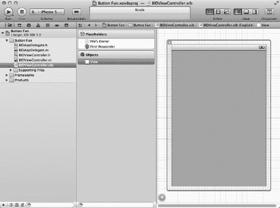

**图 3-4.** *在 Xcode 的 Interface Builder 中打开供编辑的 BIDViewController.xib*

我们先添加按钮，然后放置标签。在设计界面的过程中，我们将创建相应的操作和输出口。我们也可以手动声明操作和输出口，然后将用户界面元素连接到它们，但既然 Xcode 能为我们完成，何必多此一举呢？

### 添加按钮和操作方法

我们的首要任务是向用户界面添加两个按钮。然后，让 Xcode 为我们创建一个空的操作方法，并将两个按钮都连接到该操作方法。这样，当用户点击按钮时，就会调用该操作方法。我们放入该操作方法中的任何代码都将在用户点击按钮时执行。

选择 **View  Utilities  Show Object Library** 或按 ^ **3** 打开对象库。在对象库的搜索框中输入 `UIButton`（实际上只需输入前四个字符 `UIBu` 即可缩小列表范围）。输入完成后，对象库中应该只出现一个项目：*Round Rect Button*（圆角矩形按钮，见图 3-5）。

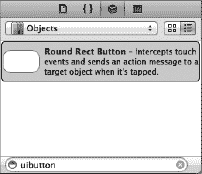

**图 3-5.** *对象库中显示的圆角矩形按钮*

将 *Round Rect Button* 从库中拖到灰色视图上。这将向应用的视图添加一个按钮。将按钮放置在视图的左侧，使用出现的蓝色参考线将其与左边缘对齐，距离适当。对于垂直位置，使用蓝色参考线将按钮放置在视图的中间位置。如果需要，可以参考图 3-1 作为放置指南。

**注意：** 在 Interface Builder 中移动对象时出现的小蓝色参考线，旨在帮助您遵循 *iOS 人机界面指南*（通常称为“HIG”）。Apple 为设计 iPhone 和 iPad 应用的人员提供了 HIG。HIG 告诉您应该如何——以及不应该如何——设计用户界面。您确实应该阅读它，因为它包含每位 iOS 开发人员都需了解的宝贵信息。您可以在 [`developer.apple.com/iphone/library/documentation/UserExperience/Conceptual/MobileHIG/`](http://developer.apple.com/iphone/library/documentation/UserExperience/Conceptual/MobileHIG/) 找到它。

双击新添加的按钮，进入编辑按钮标题的状态。将此按钮的标题设为 *Left*（左）。

现在，是时候体验 Xcode 4 的神奇之处了。选择 **View  Assistant Editor  Show Assistant** Editor 或按  打开 Assistant 编辑器。您也可以通过单击项目窗口右上角七个按钮组中的中间编辑器按钮来显示或隐藏 Assistant 编辑器（见图 3-6）。

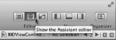

**图 3-6.** *显示 Assistant 编辑器的切换按钮*

除非您特别指定（请参见 **Assistant Editor** 菜单中的选项），否则 Assistant 编辑器将出现在编辑面板的右侧。左侧将继续显示 Interface Builder，而右侧将显示 `BIDViewController.h`，即“拥有”此 nib 的视图控制器的头文件。

**提示：** 打开 Assistant 编辑器后，您可能需要调整窗口大小以获得足够的操作空间。如果您使用的是较小屏幕（例如 MacBook Air 的屏幕），则可能需要关闭实用工具视图和/或项目导航器，以便为有效地使用 Assistant 编辑器腾出空间。您可以使用项目窗口右上角的三个视图按钮轻松完成此操作（参见图 3-6）。


### 连接操作与输出口

还记得我们在上一章讨论的*文件所有者*图标吗？加载 nib 文件的对象被视为其**所有者**。对于像这种为应用程序视图定义用户界面的 nib 文件，其所有者就是相应的视图控制器类。由于我们的视图控制器类是文件所有者，助理编辑器会知道向我们显示视图控制器类的头文件，这最可能成为我们连接操作和输出口的地方。

正如你之前所见，`BIDViewController.h` 中内容并不多。它只是一个空的 `UIViewController` 子类。但它不会一直空下去！

现在，我们将要求 Xcode 自动为我们创建一个新的操作方法，并将该操作与我们刚刚创建的按钮关联起来。

为此，首先单击你的新按钮使其被选中。然后，按住键盘上的 Control 键，从按钮上点击并拖拽到助理编辑器中的源代码区域。你应该会看到一条从按钮延伸到光标处的蓝线（参见图 3–7）。这条蓝线就是我们如何将 nib 中的对象连接到代码或其他对象的方式。

**提示。** 你可以将这条蓝线拖拽到你想要连接到按钮的任何地方：助理编辑器中的头文件、*文件所有者*图标、编辑面板左侧的任何其他图标，甚至 nib 中的其他对象。

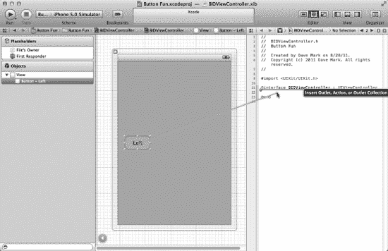

**图 3–7.** *将控件拖拽到源代码会为你提供创建输出口、操作或输出口集合的选项。*

如果你将光标移动到 `@interface` 和 `@end` 关键字之间（如图 3–7 所示），会出现一个灰色框，提示你释放鼠标按钮将为你插入一个输出口、操作或输出口集合。

**注意：** 本书中我们会用到操作和输出口，但不会使用输出口集合。输出口集合允许你将多个相同类型的对象连接到一个 `NSArray` 属性上，而不是为每个对象创建单独的属性。

要完成这个连接，释放鼠标按钮，一个浮动弹出窗口将会出现，如图 3–8 所示。这个窗口让你自定义新的操作。在窗口中，点击标有 *Connection* 的弹出菜单，将选项从 *Outlet* 改为 *Action*。这会告诉 Xcode 我们想要创建一个操作而不是输出口。

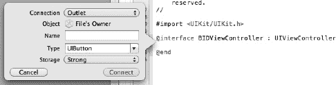

**图 3–8.** *在将控件拖拽到源代码后出现的浮动弹出窗口*

弹出窗口将变为类似图 3–9 的样子。在 *Name* 字段中，输入 *buttonPressed*。完成后，*不要*按回车键。按回车会确认我们的输出口，但我们还没准备好这么做。相反，按 Tab 键移动到 *Type* 字段，输入 `UIButton`，替换默认值 `id`。

**注意：** 你或许还记得，`id` 是一个通用指针，可以指向任何 Objective-C 对象。我们可以将其保留为 `id`，这样也能正常工作。但如果将其改为我们期望调用该方法的类，当我们尝试从错误的对象类型调用时，编译器可以发出警告。有时候你会希望灵活地让不同类型的控件调用同一个操作方法，在这种情况下，你可能希望保留为 `id`。在我们的例子中，我们只会从按钮调用这个方法，所以我们让 Xcode 和 LLVM 知道这一点。现在，如果我们无意中尝试连接其他东西到它，它们就能发出警告。

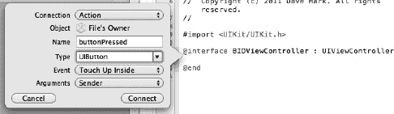

**图 3–9.** *将连接类型改为 Action 会改变弹出窗口的外观。*

*Type* 下面还有两个字段，我们将保留它们的默认值。*Event* 字段让你指定方法何时被调用。默认值 *Touch Up Inside* 会在用户将手指从屏幕上抬起时触发，前提是手指仍然在按钮上。这是按钮的标准事件。这给了用户一个重新考虑的机会。如果用户在抬起手指之前将手指从按钮上移开，该方法就不会触发。

*Arguments* 字段让你在可用于操作方法的三种不同方法签名中进行选择。我们需要 `sender` 参数，以便能够知道是哪个按钮调用了该方法。这是默认选项，所以我们保持原样。

按回车键或点击 *Connect* 按钮，Xcode 将为你插入操作方法。你的 `BIDViewController.h` 文件现在应该看起来像这样：

```
#import <UIKit/UIKit.h>

@interface BIDViewController : UIViewController
- (IBAction)buttonPressed:(id)sender;

@end
```

**注意：** 随着时间的推移，Apple 会对 Xcode 以及我们一直使用的代码模板进行调整。当这种情况发生时，你可能需要根据我们的分步说明做些调整。在当前示例中，我们期望在 `buttonPressed` 参数声明中看到 `UIButton` 而不是 `id`。很可能，这种情况最终会被调整，你需要对这个方法做一两个更改。但这没什么大不了的；这就是事物的本质。

Xcode 现在已向你的类头文件添加了一个方法声明。单击 `BIDViewController.m` 查看实现文件，你会看到它同时也为你添加了一个方法存根。

```
- (IBAction)buttonPressed:(id)sender {

}
```

稍后，我们会回到这里编写用户点击任一按钮时需要运行的代码。除了创建方法声明和实现之外，Xcode 还将该按钮连接到这个操作方法，并将该信息存储在 nib 文件中。这意味着我们无需再做任何其他事情，就能让该按钮在应用程序运行时调用这个方法。

回到 `BIDViewController.xib`，再拖出一个按钮，这次将其放置在屏幕右侧。放置好后，双击它并将其名称改为 *Right*。就像你之前看到的那样，蓝线会弹出以帮助你将其与右侧边距对齐，它们还会帮助你将该按钮与另一个按钮垂直对齐。

**提示：** 你可以按住 Option 键并拖拽原始对象（本例中为 *Left* 按钮）来复制，而不是从库中拖拽新对象。按住 Option 键会告诉 Interface Builder 复制你拖拽的对象。

这次，我们不想创建新的操作方法。相反，我们想将这个按钮连接到 Xcode 刚才为我们创建的现有操作方法。该怎么做呢？方法几乎与第一个按钮完全相同。

更改按钮名称后，按住 Control 键单击新按钮，再次拖向你的头文件。这次，当你的光标靠近 `buttonPressed:` 的声明时，该方法应该会高亮显示，并且你会看到一个灰色弹出窗口显示 *Connect Action*（参见图 3–10）。当你看到该弹出窗口时，松开鼠标按钮，Xcode 就会将这个按钮连接到现有的操作方法。这样，当这个按钮被点击时，就会触发与另一个按钮相同的操作方法。

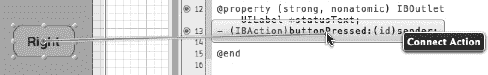

**图 3–10.** *将按钮拖拽到现有操作或空白区域会将其连接到现有操作。*

请注意，即使你按住 Control 键将按钮拖拽到实现文件中的方法，也能生效。换句话说，你可以从新按钮拖拽到 `BIDViewController.h` 中的 `buttonPressed` 声明，或者拖拽到 `BIDViewController.m` 中的 `buttonPressed` 方法实现。Xcode 4 真是太聪明了！


#### 添加标签和输出口

在对象库中，在搜索框中输入 `Label` 来找到标签用户界面项（参见图 3-11）。将 `Label` 拖到你的用户界面上，放置在前述两个按钮上方的某个位置。放置后，使用调整大小手柄将标签从左边缘拉伸到右边缘。这样就能为我们将要显示给用户的文本留出足够的空间。

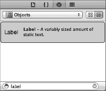

**图 3-11**. *对象库中显示的标签*

默认情况下，标签是左对齐的，但我们希望这个标签居中显示。选择**视图  工具  显示属性检查器**（或按下 **4**），调出属性检查器（参见图 3-12）。确保标签被选中，然后在属性检查器中查找 `Alignment` 按钮。选择中间的 `Alignment` 按钮使标签文本居中。

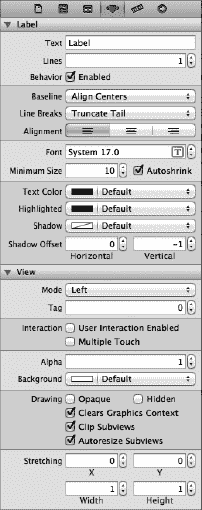

**图 3-12.** *标签的属性检查器*

在用户点击按钮之前，我们不希望标签显示任何内容，因此双击标签（使文本被选中），然后按下键盘上的删除键。这将删除当前分配给标签的文本。按回车键确认更改。即使标签未被选中时你看不到它，也不用担心——它仍然在那里。

**提示：** 如果你有不可见的用户界面元素（如空标签），并且希望看到它们的位置，请从 `Assistant Editor` 菜单中选择 `Canvas`，然后在弹出的子菜单中启用 `Show Bounds Rectangles`。

剩下的工作就是为标签创建一个输出口。我们按照之前创建和连接动作的相同方式来操作。确保辅助编辑器已打开并显示 `BIDViewController.h`。如果需要切换文件，请使用辅助编辑器上方的弹出菜单。

接着，在界面构建器中选择标签，按住 Control 键从标签拖拽到头文件。拖拽直到光标恰好位于现有动作方法的上方。当你看到类似图 3-13 的提示时，松开鼠标按钮，你会再次看到弹出窗口（之前见图 3-8）。

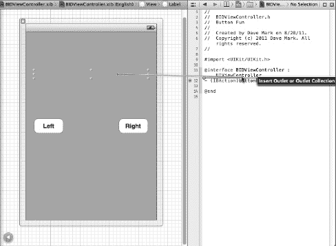

**图 3-13**. *按住 Control 键拖拽以创建输出口*

我们想要创建一个输出口，因此将 `Connection` 保持为默认类型 `Outlet`。我们需要为此输出口选择一个描述性名称，以便在编写代码时记住它的用途。在 `Name` 字段中输入 `statusText`。将 `Type` 字段保持为 `UILabel`。最后一个标记为 `Storage` 的字段可以保持默认值。

按回车键确认更改，Xcode 会将输出口属性插入到你的代码中。你的控制器类的头文件现在应如下所示：

```
#import <UIKit/UIKit.h>

@interface BIDViewController : UIViewController
@property (strong, nonatomic) IBOutlet UILabel *statusText;
- (IBAction)buttonPressed:(id)sender;
@end
```

现在，我们有了一个输出口，Xcode 已经自动将标签连接到了这个输出口。这意味着，如果我们在代码中对 `statusText` 进行任何更改，这些更改都会影响用户界面上的标签。例如，如果我们设置 `statusText` 的 `text` 属性，它将改变显示给用户的文本内容。

在项目导航器中单击 `BIDViewController.m`，查看控制器的实现。在那里，你会看到 Xcode 为我们创建了一个 `@synthesize` 语句。它还做了其他事情。还记得我们删除样板方法时在代码中留下的那个方法吗？现在看看它：

```
- (void)viewDidUnload {
    [self setStatusText:nil];
    [super viewDidUnload];
    // Release any retained subviews of the main view.
    // e.g. self.myOutlet = nil;
}
```

看到调用 `super` 之前的那行代码了吗？Xcode 也自动添加了它。当我们的视图被卸载时，我们需要“释放”所有输出口；否则，它们占用的内存无法被释放。将输出口赋值为 `nil` 正是为了做到这一点——它允许之前的值从内存中释放。

本质上，通过按住 Control 键拖拽来创建输出口，已经完成了设置输出口所需的所有工作。

自动引用计数

如果你已经熟悉 Objective-C，或者读过本书的早期版本，你可能已经注意到我们没有 `dealloc` 方法。我们竟然没有释放实例变量！

警告！警告！危险，威尔·罗宾逊！

实际上，威尔，你可以放心。我们完全没问题。根本没有任何危险——真的。

现在不再需要手动释放对象了。好吧，这话并不完全正确。释放对象仍然是必要的，但苹果随 iOS 5 开始提供的 LLVM 3.0 编译器非常智能，它会使用一种名为“自动引用计数”（Automatic Reference Counting，简称 ARC）的新功能来为我们释放对象，完成繁重的工作。这意味着不再需要 `dealloc` 方法，也无需担心调用 `release` 或 `autorelease`。

ARC 仅适用于 Objective-C 对象，不适用于 Core Foundation 对象或通过 `malloc()` 分配的内存，并且存在一些可能让你陷入困境的注意事项和陷阱，但大多数情况下，担心内存管理已经成为过去式。

要了解更多关于 ARC 的信息，请查看此 URL 的 ARC 发行说明：

`https://developer.apple.com/library/ios/#releasenotes/ObjectiveC/RN-TransitioningToARC/`

ARC 非常酷，但它并非魔法。你仍应了解 Objective-C 中内存管理的基本规则，以避免与 ARC 产生问题。若要温习 Objective-C 内存管理契约，请阅读此 URL 处的苹果《内存管理编程指南》：

`https://developer.apple.com/library/ios/#documentation/Cocoa/Conceptual/MemoryMgmt/`


### 编写操作方法

到目前为止，我们已经设计了用户界面，并将输出口和操作连接到了用户界面。剩下的工作就是使用这些操作和输出口，在按下按钮时设置标签的文本。你应该仍在`BIDViewController.m`文件中，但如果不在，请在项目导航器中单击该文件以在编辑器中打开。找到之前 Xcode 为我们创建的空`buttonPressed:`方法。

为了区分两个按钮，我们将使用`sender`参数。我们将通过`sender`获取被按下按钮的标题，然后基于该标题创建一个新字符串，并将其赋值给标签的文本。将以下粗体代码添加到你的空方法中：

```
- (IBAction)buttonPressed:(UIButton *)sender {
    NSString *title = [sender titleForState:UIControlStateNormal];
    statusText.text = [NSString stringWithFormat:@"%@ button pressed.", title];
}
```

这非常简单。第一行通过`sender`获取被点击按钮的标题。由于按钮可能根据其当前状态有不同的标题，我们使用`UIControlStateNormal`参数来指定我们想要按钮处于正常未点击状态时的标题。这通常是你在向控件（按钮是一种控件）请求其标题时需要指定的状态。我们将在第 4 章中更详细地了解控件状态。

下一行通过在上一行获取的标题后追加文本“button pressed.”来创建一个新字符串。因此，如果左侧按钮（标题为`Left`）被点击，这一行将创建一个字符串，内容为“Left button pressed.”。这个新字符串被赋值给标签的`text`属性，这就是我们更改标签显示文本的方式。

### 消息嵌套

有些开发者经常嵌套 Objective-C 消息。你可能会在开发过程中遇到如下代码：

```
statusText.text = [NSString stringWithFormat:@"%@ button pressed.",
    [sender titleForState:UIControlStateNormal]];
```

这一行代码的功能与构成`buttonPressed:`方法的两行代码完全相同。这是因为 Objective-C 方法可以嵌套，这实际上就是用嵌套方法调用的返回值进行替换。

为了清晰起见，在本书的代码示例中，我们通常不会嵌套 Objective-C 消息，但`alloc`和`init`的调用除外，根据长期以来的惯例，它们几乎总是被嵌套使用。

### 尝试运行

猜猜怎么着？我们基本上完成了。准备好尝试运行我们的应用了吗？开始吧！

选择**Product  Run.** 如果遇到任何编译或链接错误，请返回并对照本章中显示的代码更改进行检查。一旦代码构建成功，Xcode 将启动 iPhone 模拟器并运行你的应用。当你点击右侧按钮时，应显示文本“Right button pressed.”（如图 3-1 所示）。如果随后点击左侧按钮，标签将变为显示“Left button pressed.”。

### 查看应用委托

很好，你的应用运行成功了！在进入下一个主题之前，让我们花点时间查看两个我们尚未检查的源代码文件：`BIDAppDelegate.h`和`BIDAppDelegate.m`。这些文件实现了我们的**应用委托**。

Cocoa Touch 广泛使用**委托**，这些类负责代表另一个对象执行某些任务。应用委托允许我们在预定义的时间点代表`UIApplication`类执行某些操作。每个 iOS 应用有且仅有一个`UIApplication`实例，它负责应用的事件循环，并处理应用级别的功能，例如将输入路由到适当的控制器类。`UIApplication`是 UIKit 的标准组成部分，它主要在后台工作，因此你通常无需担心它。

在应用执行的某些明确定义的时间点，如果存在委托并且该委托实现了特定方法，`UIApplication`将调用其委托上的这些方法。例如，如果你有需要在程序退出前执行的代码，你可以在应用委托中实现`applicationWillTerminate:`方法，并将终止代码放在那里。这种委托机制允许你的应用实现通用的应用级行为，而无需继承`UIApplication`，也无需了解`UIApplication`的内部工作原理。

在项目导航器中单击`BIDAppDelegate.h`以查看应用委托的头文件。它应该类似于这样：

```
#import <UIKit/UIKit.h>

@class BIDViewController;

@interface BIDAppDelegate : UIResponder <UIApplicationDelegate>
@property (strong, nonatomic) UIWindow *window;

@property (strong, nonatomic) BIDViewController *viewController;

@end
```

有一点值得指出的是这一行代码：

```
@interface BIDAppDelegate : UIResponder <UIApplicationDelegate>
```

你看到尖括号之间的值了吗？这表明这个类遵循了一个名为`UIApplicationDelegate`的协议。按住 Option 键。你的光标应变为十字准线。将光标移动到单词`UIApplicationDelegate`上。光标应变为一个带问号的指向手，并且单词`UIApplicationDelegate`应被高亮显示，就像浏览器中的链接一样（参见图 3-14）。

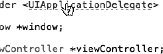

**图 3-14.** *当你在 Xcode 中按住 Option 键并指向代码中的符号时，该符号会被高亮显示，光标变为一个带问号的指向手。*

在仍按住 Option 键的情况下，单击此链接。这将打开一个小的弹出窗口，显示`UIApplicationDelegate`协议的简要概述，如图 3-15 所示。

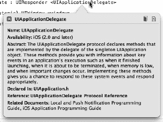

**图 3-15.** *当我们从源代码中按住 Option 键单击`<UIApplicationDelegate>`时，Xcode 弹出了这个称为“快速帮助”面板的窗口，该窗口描述了此协议。*

注意这个新的弹出式文档窗口右上角的两个图标（参见图 3-15）。单击左侧图标可查看此符号的完整文档，或单击右侧图标可在头文件中查看该符号的定义。同样的技巧也适用于类、协议和类别名称，以及编辑窗格中显示的方法名称。只需按住 Option 键单击一个单词，Xcode 就会在文档浏览器中搜索该单词。

知道如何快速查阅文档当然很有价值，但查看此协议的定义可能更为重要。在这里，你将找到应用委托可以实现哪些方法，以及这些方法何时会被调用。花点时间阅读这些方法的描述是值得的。


**注意：** 如果你之前使用过 Objective-C 但未接触过 Objective-C 2.0，需要注意的是，协议现在可以指定可选的（optional）方法。`UIApplicationDelegate` 包含许多可选方法。然而，除非有特定原因，你无需在你的应用程序委托（application delegate）中实现任何可选方法。

回到项目导航区，点击 `BIDAppDelegate.m` 查看该应用委托的实现代码。代码大致如下：

```
#import "BIDAppDelegate.h"
#import "BIDViewController.h"

@implementation BIDAppDelegate

@synthesize window = _window;
@synthesize viewController = _viewController;

- (BOOL)application:(UIApplication *)application
didFinishLaunchingWithOptions:(NSDictionary *)launchOptions
{
    self.window = [[UIWindow alloc] initWithFrame:[[UIScreen mainScreen] bounds]];
    // 应用程序启动后的自定义设置点。
    self.viewController = [[BIDViewController alloc] initWithNibName:@"BIDViewController" bundle:nil];
    self.window.rootViewController = self.viewController;
    [self.window makeKeyAndVisible];
    return YES;
}

- (void)applicationWillResignActive:(UIApplication *)application
{
  /*
   当应用程序即将从活跃状态变为非活跃状态时发送。这可能发生在某些临时中断（如来电或短信）时，或用户退出应用程序并开始进入后台状态时。
   使用此方法来暂停正在进行的任务、禁用定时器并降低 OpenGL ES 帧率。游戏应使用此方法来暂停游戏。
   */
}

- (void)applicationDidEnterBackground:(UIApplication *)application
{
  /*
   使用此方法来释放共享资源、保存用户数据、使定时器失效，并存储足够的应用程序状态信息，以便在应用程序稍后终止时恢复到当前状态。
   如果你的应用程序支持后台执行，当用户退出时，会调用此方法而非 applicationWillTerminate:。
   */
}

- (void)applicationWillEnterForeground:(UIApplication *)application
{
  /*
   作为从后台到非活跃状态转换的一部分被调用；在这里你可以撤销进入后台时所做的许多更改。
   */
}

- (void)applicationDidBecomeActive:(UIApplication *)application
{
  /*
   重新启动在应用程序非活跃期间暂停（或尚未启动）的任何任务。如果应用程序先前处于后台，可选择性地刷新用户界面。
   */
}

- (void)applicationWillTerminate:(UIApplication *)application
{
  /*
   当应用程序即将终止时调用。
   酌情保存数据。
   另请参阅 applicationDidEnterBackground:。
   */
}
@end
```

在文件顶部，你可以看到我们的应用程序委托实现了文档中介绍过的其中一个协议方法，名为 `application:didFinishLaunchingWithOptions:`。你大概能猜到，当应用程序完成所有设置工作并准备开始与用户交互时，这个方法会立即触发。

我们的委托版本的 `application:didFinishLaunchingWithOptions:` 创建了一个窗口，然后通过加载包含我们视图的 nib 文件来创建控制器类的一个实例。接着，它将该控制器的视图作为子视图添加到应用程序的窗口中，从而使视图可见。这就是我们设计的视图如何展示给用户的。你无需做任何额外操作来实现这一点；这部分代码完全由我们创建项目时所用的模板自动生成，但了解这些代码在此处的作用是件好事。

我们只是想在本章结束前，为你提供一些关于应用程序委托的背景知识，并展示这些部分如何整合在一起。

### 回到正题

本章的简单应用程序向你介绍了 MVC、创建和连接输出口与操作、实现视图控制器以及使用应用程序委托。你学习了如何在按下按钮时触发操作方法，并看到了如何在运行时更改标签的文本。尽管我们构建的是一个简单的应用程序，但所用的基本概念与 iOS 下所有控件（不仅仅是按钮）的基础使用原理是一致的。事实上，本章中我们使用按钮和标签的方式，基本上就是我们将在 iOS 下实现和交互大部分标准控件的方式。

理解本章我们所做的每一步及其原因至关重要。如果你没有完全理解，请返回并重新完成你不完全理解的部分。这些都是非常重要的内容！如果现在不确保你理解了所有内容，随着本书后面我们开始创建更复杂的界面，你会变得更加困惑。

在下一章，我们将了解一些其他的标准 iOS 控件。你还将学习如何使用警报（alert）来通知用户重要事件，以及如何使用操作表（action sheet）来提示用户在继续前需要做出选择。当你准备好继续前进时，为自己是这么棒的学生而拍拍肩膀，然后前往下一章吧。

