# 第 4 章

## 更多用户界面趣味

在第 3 章中，我们讨论了 MVC 并使用它构建了一个应用程序。你学习了输出口和操作，并利用它们将一个按钮控件与一个文本标签连接起来。在本章中，我们将构建一个应用程序，它将把你的控件知识提升到一个全新的水平。

我们将实现一个图像视图、一个滑块、两个不同的文本字段、一个分段控件、几个开关，以及一个看起来更像标准 iOS 按钮的按钮。你将学习如何设置和获取各种控件的值。你将学习如何使用操作表来强制用户做出选择，以及如何使用警报来给用户提供重要的反馈。你还将了解控件状态以及如何使用可拉伸图像来让按钮呈现出应有的外观。

由于本章的应用程序使用了如此多的不同用户界面元素，我们的工作方式将与之前两章略有不同。我们将把应用程序分解成多个部分，一次实现一个部分，并在 Xcode 和 iPhone 模拟器之间来回切换，在进入下一部分之前测试每一部分。将构建复杂界面的过程分解成更小的块，会使它不那么令人生畏，也更接近你在构建自己的应用程序时实际经历的过程。这种编码-编译-调试的循环占据了软件开发者日常工作中很大一部分时间。


### 满屏控件

正如我们之前提到的，本章将要构建的应用程序比我们在第 3 章中创建的要复杂一些。我们仍然只使用一个视图和控制器，但正如你在图 4-1 中所见，这个视图中的内容要丰富得多。

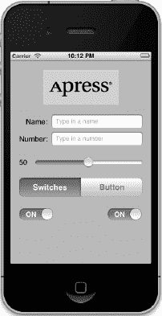

**图 4-1.** *Control Fun 应用，包含文本字段、标签、滑块以及几个其他标准的 iPhone 控件*

iPhone 屏幕顶部的 Logo 是一个**图像视图**，在这个应用中，它仅用于显示一张静态图片。Logo 下方是两个**文本字段**：一个允许输入字母数字文本，另一个只允许输入数字。文本字段下方是一个**滑块**。当用户移动滑块时，旁边标签的值会随之变化，始终反映滑块的当前值。

滑块下方是一个**分段控件**和两个**开关**。分段控件在其下方的空间中切换两种不同类型的控件。当应用首次启动时，分段控件下方会出现两个开关。改变其中任何一个开关的值都会导致另一个开关的值随之匹配。当然，在实际应用中你不太可能这样做，但这确实演示了如何以编程方式改变控件的值，以及 Cocoa Touch 如何在不需你进行任何操作的情况下为某些交互添加动画效果。

图 4-2 展示了用户点击分段控件时的情况。开关消失，并被一个按钮取代。当按下*执行操作*按钮时，会弹出一个操作列表，询问用户是否真的打算点击该按钮（参见图 4-3）。这是处理潜在危险或可能产生重大影响的操作的标准方式，因为它让用户有机会阻止可能的不良后果发生。如果选择*是的，我确定！*，应用会弹出一个警告框，告知用户一切正常（参见图 4-4）。

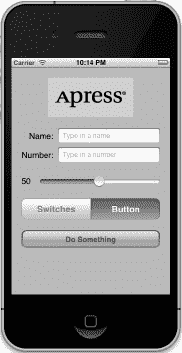

**图 4-2.** *点击左侧分段控制器会显示一对开关。点击右侧则显示一个按钮。*

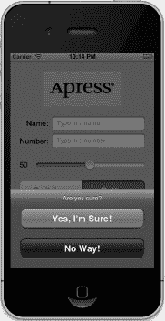

**图 4-3.** *我们的应用使用操作列表来征求用户的响应。*

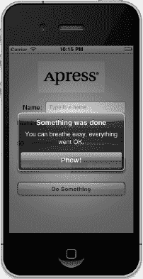

**图 4-4.** *当重要事件发生时，使用警告框通知用户。我们在此处用警告框确认一切正常。*

### 活动控件、静态控件与被动控件

界面控件有三种基本使用模式：活动模式、静态（或不活动）模式以及被动模式。我们在上一章中使用的按钮就是活动控件的典型例子。你按下它们，就会触发某些操作——通常是你编写的某段代码被执行。

尽管你使用的许多控件会直接触发操作方法，但并非所有控件都如此。我们将在本章中实现的图像视图就是一个以静态方式使用控件的良好示例。即使`UIImageView`可以被配置为触发操作方法，但在我们的应用中，该图像视图是被动的——用户无法对其执行任何操作。文本字段和图像控件经常以这种方式使用。

某些控件可以在被动模式下工作，仅仅保存用户输入的值，直到你准备好使用它。这些控件不会触发操作方法，但用户可以与其交互并更改它们的值。被动控件的一个经典例子是网页上的文本字段。虽然可以为字段失焦事件编写验证代码，但绝大多数网页文本字段仅仅是数据的容器，在你点击提交按钮时将数据提交到服务器。文本字段本身通常不会触发任何代码执行，但当你点击提交按钮时，文本字段中的数据会随之提交。

在 iOS 设备上，大多数可用控件都可以在全部三种模式下使用，并且几乎所有的控件都可以根据你的需求在多种模式下运行。所有 iOS 控件都是`UIControl`的子类，因此它们都能够触发操作方法。许多控件可以被被动使用，并且所有控件都可以被设置为不活动或不可见。例如，使用一个控件可能会触发另一个不活动控件变为活动状态。然而，某些控件（如按钮）如果不用来以活动方式触发代码，实际上就没什么太大用处。

iOS 控件与 Mac 上的控件之间存在一些行为差异。以下是一些示例：

- 由于多点触控界面，所有 iOS 控件都可以根据触摸方式的不同触发多个操作。用户用手指在控件上滑动与仅轻点一下可能触发不同的操作。
- 你可以让用户按下按钮时触发一个操作，而手指从按钮上抬起时触发另一个独立的操作。
- 你可以让单个控件在单一事件上调用多个操作方法。你可以让两个不同的操作方法在“触摸内部抬起”事件上触发，这意味着当用户触摸按钮后抬起手指时，这两个方法都会被调用。

**注意：** 尽管在 iOS 上控件可以触发多个方法，但在绝大多数情况下，实现一个能完成你特定控件使用需求的单一操作方法通常是更好的选择。虽然你通常不需要使用这种多方法触发的能力，但在 Interface Builder 中工作时牢记这一点是好的。在 Interface Builder 中将一个事件连接到一个操作时，*不会*断开之前从同一个控件连接的已有操作！这可能导致你的应用出现意外的错误行为，即一个控件会触发多个操作方法。在 Interface Builder 中重新定位事件时请留意，并确保在连接到新操作之前移除旧的操作。

iOS 与 Mac 之间的另一个主要区别源于一个事实：通常，iOS 设备没有物理键盘。标准的 iOS 软件键盘实际上只是一个充满一系列由系统为你管理的按钮控件的视图。你的代码很可能永远不会直接与 iOS 键盘交互。

### 创建应用

我们开始吧。如果 Xcode 尚未打开，请启动它，并创建一个名为 *Control Fun* 的新项目。我们将再次使用“单视图应用程序”模板，所以请像前两章一样创建你的项目。

项目创建完成后，我们来获取将在图像视图中使用的图片。该图片必须先导入到 Xcode，才能在 Interface Builder 中使用，所以我们现在就导入它。你可以使用项目归档中 *04 - Control Fun* 文件夹内名为 `apress_logo.png` 的图片，也可以使用你自己选择的图片。如果你使用自己的图片，请确保它是尺寸适合可用空间的 `.png` 图片。图片高度应小于 100 像素，宽度最大为 300 像素，这样它才能舒适地放置在视图顶部而无需调整大小。

通过将图片从 Finder 拖拽到项目导航器中的 *Supporting Files* 文件夹，将其添加到项目的 *Supporting Files* 文件夹中。系统提示时，勾选“将项目复制到目标组文件夹（如果需要）”复选框，然后点击“完成”。


### 实现图像视图与文本字段

将图像添加到项目后，下一步是实现应用程序屏幕顶部的五个界面元素：图像视图、两个文本字段以及两个标签（见图 4–5）。

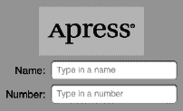

**图 4–5.** *我们将首先实现的图像视图、标签和文本字段*

#### 添加图像视图

在项目导航器中，点击 `BIDViewController.xib` 文件，在 Xcode 的 nib 编辑器（Interface Builder）中打开该文件。你将看到熟悉的方格纸背景和灰色视图，可以在其上布局应用程序界面。

如果对象库未打开，请选择 **View**  **Utilities**  **Show Object Library** 将其打开。滚动列表约四分之一处，找到 `ImageView`（见图 4–6），或者在搜索框中直接输入 *image view*。请记住，对象库是库面板顶部的第三个图标。在其他图标下你是找不到 `Image View` 的。


**图 4–6.** *Interface Builder 库中的图像视图元素*

将一个图像视图拖拽到 nib 编辑器中的视图上。注意，当你将图像视图拖出库时，它的大小会变化两次。当拖拽操作离开库面板时，它会变成一个水平矩形的形状。然后，当拖拽进入视图的边框时，图像视图会调整大小，变成视图的大小（减去顶部的状态栏）。这种行为是正常的，并且在很多情况下正是你想要的，因为你通常在视图中放置的第一个图像就是背景图像。在视图内释放拖拽，小心确保新的 `UIImageView` 吸附到周围视图的侧边和底部。在这个特定案例中，我们实际上不想要图像视图占据整个空间，因此请使用拖拽手柄将图像视图调整到大约等于你导入到 Xcode 中图像的大小尺寸。现在不必担心调整得完全精确；我们将在下一节处理这个问题。图 4–7 显示了调整大小后的 `UIImageView`。

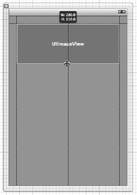

**图 4–7.** *调整大小后的 `UIImageView`，其尺寸已适配我们将放置在此处的图像*

请记住，如果你在 nib 编辑器中选中某个项目时遇到困难，可以点击停靠栏下方的小三角形图标，将 nib 编辑器的停靠栏切换为列表视图。然后，点击列表中你想要选中的项目，果然，该项目就会在 nib 编辑器中被选中。

要访问嵌套在另一个对象内部的对象，请点击外层对象左侧的展开三角形以显示嵌套对象。在我们的例子中，要选择图像视图，首先点击视图左侧的展开三角形。然后，当图像视图出现在停靠栏中时，点击它，对应的图像视图就会在 nib 编辑器中被选中。

选中图像视图后，按下 **4** 调出对象属性检查器，你应该能看到 `UIImageView` 类的可编辑选项，如图 4–8 所示。

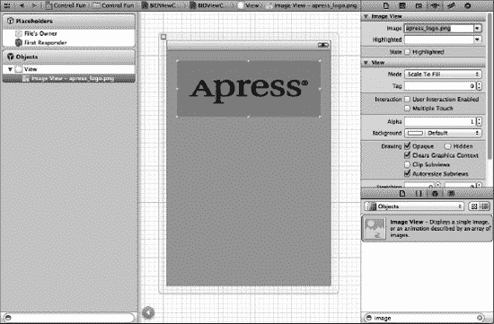

**图 4–8.** *图像视图属性检查器。我们从检查器顶部的 Image 弹出菜单中选择了自己的图像，从而将图像填充到了图像视图中。*

对于我们的图像视图来说，最重要的设置是检查器中最顶部的项目，标记为 *Image*。点击字段右侧的小箭头，会弹出一个列出可用图像的菜单，其中应包含你添加到 Xcode 项目中的所有图像。选择你之前添加的图像。你的图像现在应该会显示在图像视图中。

#### 调整图像视图尺寸

结果发现，我们使用的图像比放置它的图像视图要小得多。再仔细查看一下图 4–8，你会注意到我们使用的图像被缩放以完全填满图像视图。一个明显的线索是属性检查器中的 *Mode* 设置，它被设为 *Scale To Fill*（缩放填充）。

尽管我们可以让应用保持这种状态，但通常最好在运行前完成所有图像缩放，因为图像缩放会消耗时间和处理器周期。让我们将图像视图调整到图像的精确尺寸。

确保图像视图被选中，并且你能看到调整手柄。然后再次选中图像视图。你应该会看到图像视图的轮廓被一个粗的灰色边框取代。最后，按下 = 或选择 **Editor**  **Size to Fit Content**（大小适配内容）。这将使图像视图调整大小以匹配其内容的尺寸。

现在图像视图尺寸已调整好，将其移动到最终位置。你需要先点击它以外的区域，然后再点击它来重新选中它。然后拖拽图像视图，使其顶部对齐视图顶部的蓝色参考线，并根据居中的蓝色参考线居中（见图 4–9）。请注意，你也可以通过选择 **Editor**  **Alignment**  **Align Horizontal Center in Container**（对齐 → 容器中水平居中）来将项目在其容器视图中居中。

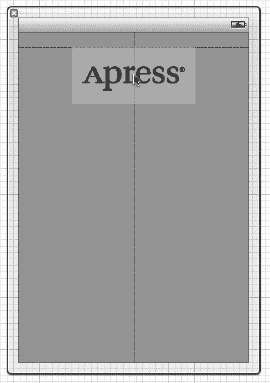

**图 4–9.** *调整图像视图以适配图像尺寸后，我们利用视图的蓝色参考线将其拖拽到合适位置。*

**提示：** 在 Interface Builder 中拖拽和调整视图大小可能有些棘手。别忘了层次列表模式，可以通过点击 nib 编辑器停靠栏底部的小三角形图标激活。至于调整大小，按住 Option 键，Interface Builder 会在屏幕上绘制一些有用的红色线条，这能让你更容易把握图像视图的尺寸。这个技巧在拖拽时不起作用，因为 Option 键会提示 Interface Builder 复制被拖拽的对象。不过，如果你选择 **Editor**  **Canvas**  **Show Bounds Rectangles**（画布 → 显示边界矩形），Interface Builder 会在所有界面元素周围绘制线条，使其更易于查看。再次选择 **Show Bounds Rectangles** 可以关闭这些线条。

#### 设置视图属性

选中你的图像视图，然后将注意力转回属性检查器。在检查器的 *Image View*（图像视图）区域下方是 *View*（视图）区域。你可能已经推断出，这里的模式是：特定于所选对象的属性显示在顶部，然后是应用于所选对象父类的更通用属性。在这种情况下，`UIImageView` 的父类是 `UIView`，因此下一节简单地标记为 *View*，其中包含任何视图类都会具有的属性。

##### 模式属性

视图检查器中的第一个选项是一个标有 **Mode**（模式）的弹出菜单。**Mode** 菜单定义了视图将如何显示其内容。这决定了图像在视图内部的对齐方式，以及是否会被缩放以适配。你可以随意尝试各种选项，但默认值 *Scale To Fill* 目前也可以正常工作。

请记住，选择任何会导致图像缩放的选项都可能增加处理开销，因此最好避免这些选项，并在导入图像之前正确设置其尺寸。如果你想以多种尺寸显示同一张图像，通常更好的做法是项目中包含不同尺寸的多个图像副本，而不是强制 iOS 设备在运行时进行缩放。当然，有时在运行时进行缩放是合适的；这只是一个指导原则，而非硬性规则。


### 标签

下一个值得提及的内容是`Tag`，尽管我们在本章中不会用到它。所有`UIView`的子类（包括所有视图和控件）都有一个名为`tag`的属性，它只是一个数值，你可以在界面生成器（Interface Builder）或代码中设置它。`tag`是供你使用的；系统永远不会设置或改变它的值。如果你为某个控件或视图赋值一个`tag`值，那么可以确信，除非你自行修改，该`tag`将始终保持那个值。

`Tag`提供了一种简单且与语言无关的方式来标识界面上的对象。假设你有五个不同的按钮，每个按钮都有不同的标签，并且你希望用一个动作方法来处理所有五个按钮。在这种情况下，当你的动作方法被调用时，你可能需要某种方式来区分这些按钮。当然，你可以查看按钮的标题，但这样做的代码在应用程序被翻译成斯瓦希里语或梵语时可能无法正常工作。与标签不同，`tag`永远不会改变，因此如果你在界面生成器中设置了一个`tag`值，就可以将其作为一种快速且可靠的方式，检查哪个控件作为`sender`参数传递到了动作方法中。

### 交互 复选框

`交互`部分中的两个复选框与用户交互有关。第一个复选框是*用户交互已启用*，它指定用户是否能对这个对象进行任何操作。对于大多数控件，此框会被勾选，因为如果不勾选，控件将永远无法触发动作方法。然而，图像视图默认未勾选，因为它们通常仅用于显示静态信息。由于我们这里只是在屏幕上显示一张图片，因此没有必要启用此选项。

第二个复选框是*多点触控*，它决定该控件是否能够接收多点触控事件。多点触控事件允许复杂的手势操作，比如许多 iOS 应用中用于放大的捏合手势。我们将在第 13 章中进一步讨论手势和多点触控事件。由于这个图像视图完全不接受用户交互，因此没有理由启用多点触控，请保持该复选框未勾选。

### 透明度值

检查器中的下一个选项是*透明度*。要小心处理这个值。*透明度*定义了你的图像的透明度——即其下方内容有多少能够透出来。它被定义为一个介于 0.0 和 1.0 之间的浮点数，其中 0.0 表示完全透明，1.0 表示完全不透明。如果你将值设置为小于 1.0，你的 iOS 设备将以一定的透明度绘制这个视图，从而使其下方的任何对象都能透出来。即使视图下方实际上没有任何内容，使用小于 1.0 的值也会导致你的应用程序花费处理器周期来计算透明度。因此，除非你有一个非常充分的理由，否则不要将*透明度*设置为除 1.0 以外的任何值。

### 背景

下一个选项是*背景*，它是从`UIView`继承而来的属性，决定了视图的背景颜色。对于图像视图而言，这仅在图像未填满其视图（出现黑边）或图像的某些部分透明时才有影响。由于我们已经调整了视图的大小，使其与图像完美匹配，因此此项设置不会产生可见效果，我们可以保持默认值。

### 绘图 复选框

在*背景*下方是一系列*绘图*复选框。第一个标记为*不透明*。默认情况下它应该已被勾选；如果没有，请点击勾选它。这会告诉 iOS，视图后方不需要绘制任何内容，并使 iOS 的绘制方法能够进行一些优化，从而加速绘制。

你可能会疑惑，为什么在已经将*透明度*值设为 1.0（表示不透明）之后，我们还需要选择*不透明*复选框。*透明度*值适用于要绘制的图像部分，但如果图像没有完全填满图像视图，或者由于 alpha 通道导致图像中存在空洞，那么无论*透明度*设置为何值，下方的对象仍然会透出来。通过选择*不透明*，我们告诉 iOS，无论何种情况，此视图下方的内容都无需绘制，因此它不需要浪费时间处理我们对象下方的任何东西。我们可以放心地勾选*不透明*复选框，因为之前我们选择了*适应大小*，这会使图像视图与其包含的图像大小相匹配。

*隐藏*复选框的作用正如你所想。如果它被勾选，用户将无法看到此对象。在某些时候隐藏对象会很有用，正如本章后面我们隐藏开关和按钮时所展示的那样。但在绝大多数情况下——包括现在——你希望保持此复选框未勾选。

下一个复选框是*清除图形上下文*，很少需要勾选。当它被勾选时，iOS 会在实际绘制对象之前，用透明黑色绘制该对象覆盖的整个区域。同样，出于性能考虑并且因为它很少被用到，应将其关闭。请确保此复选框未勾选（它默认可能是勾选状态）。

*裁剪子视图*是一个有趣的选项。如果你的视图包含子视图，并且这些子视图没有完全包含在其父视图的边界内，此复选框决定了子视图的绘制方式。如果*裁剪子视图*被勾选，则只会绘制子视图中位于父视图边界内的部分。如果*裁剪子视图*未勾选，则子视图将被完整绘制，即使它们位于父视图边界之外。

默认行为可能与实际情况相反——*裁剪子视图*默认应该未勾选。从数学角度来看，计算裁剪区域并仅显示子视图的一部分是一项成本较高的操作。而且通常情况下，子视图不会超出其父视图的边界。如果你确实需要，可以开启*裁剪子视图*，但出于性能考虑，它默认是关闭的。

该部分最后一个复选框是*自动调整子视图大小*，它告诉 iOS 在调整此视图大小时自动调整其所有子视图的大小。保持此复选框勾选（由于我们不允许视图被调整大小，所以它是否勾选其实并不重要）。

### 拉伸

接下来是一个标记为*拉伸*的部分。你可以把瑜伽垫收起来了，因为这里所涉及的“拉伸”是指矩形视图在屏幕上调整大小时被重新绘制的过程。其思想是，与其让视图的整个内容均匀拉伸，不如保持视图的外边缘（例如按钮的边缘）不变，即使中间部分被拉伸。

这里设置的四个浮点数值允许你声明矩形的哪个部分是可拉伸的：通过指定视图左上角的一个点以及可拉伸区域的大小，所有这些都以 0.0 到 1.0 之间的数字表示，代表整体视图尺寸的一部分。例如，如果你想保持每条边缘的 10%不被拉伸，你可以将*X*和*Y*都设为 0.1，将*宽度*和*高度*都设为 0.8。在本例中，我们将保持默认值：*X*和*Y*为 0.0，*宽度*和*高度*为 1.0。大多数情况下，你不需要更改这些值。


#### 添加文本字段

图像视图完成后，就该添加文本字段了。从库中抓取一个文本字段，将其拖入`View`中，放置在图像视图下方。使用蓝色参考线使其与右边距对齐，并紧贴在图像视图下方（参见图 4–10）。

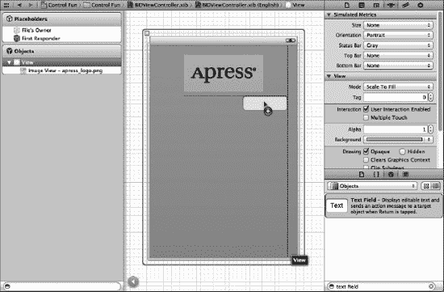

**图 4–10.** *我们从库中拖出一个文本字段，并将其放置到视图上，正好位于图像视图下方，并紧贴右侧蓝色参考线。*

当您将文本字段移动到非常靠近图像视图底部时，其上方会出现一条水平蓝色参考线。这条参考线会提示您，当前拖拽的对象与相邻对象之间是否已保持最小合理距离。您暂时可以将文本字段留在那里，但为了获得平衡的外观，建议再将文本字段向下移动一点。请记住，您始终可以重新编辑 nib 文件来更改界面元素的位置和大小，而无需修改代码或重新建立连接。

放下文本字段后，从库中抓取一个标签，将其拖拽到视图左侧边距对齐的位置，并与刚刚放置的文本字段垂直对齐。请注意，当您移动标签时，会弹出多条蓝色参考线，便于您利用标签的顶部、底部或中间位置与文本字段对齐。我们将使用这些参考线的中间位置来对齐标签和文本字段（参见图 4–11）。

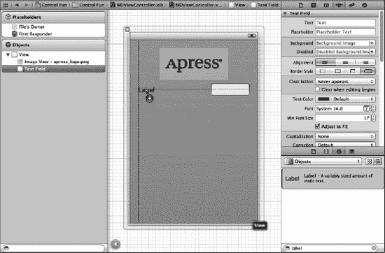

**图 4–11.** *使用基线参考线对齐标签和文本字段*

双击刚刚放置的标签，将其文本从`Label`更改为`Name`：（注意标签末尾的冒号字符），然后按回车键确认更改。

接下来，从库中拖拽另一个文本字段到视图上，并使用参考线将其放置在第一个文本字段下方（参见图 4–12）。

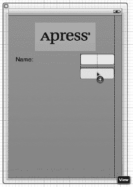

**图 4–12.** *添加第二个文本字段*

添加完第二个文本字段后，再从库中抓取一个标签，将其放置在现有标签下方的左侧。再次使用中间蓝色参考线将新标签与第二个文本字段对齐。双击新标签，将其文本更改为`Number`：（不要忘记冒号）。

现在，我们将底部文本字段的尺寸向左扩展，使其紧贴标签的右侧。为什么先从底部文本字段开始？因为我们希望两个文本字段大小一致，而底部的标签更长。

单击选中底部文本字段，向左拖动左侧的尺寸调整点，直到出现蓝色参考线，提示您已到达与标签的最近安全距离（参见图 4–13）。这条参考线有点细微——它只有文本字段本身那么高，所以请仔细观察。

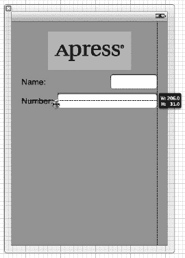

**图 4–13.** *扩展底部文本字段的尺寸*

现在，以同样的方式扩展顶部文本字段，使其与底部字段大小一致。同样，蓝色参考线会提供帮助，而且这条更易于发现。

除了一个小细节外，文本字段基本添加完毕。回顾一下图 4–5。您看到`Name`：和`Number`：是如何右对齐的吗？目前，它们都是靠左对齐的。要对齐两个标签的右侧，请单击`Name`：标签，按住 Shift 键，再单击`Number`：标签，使两个标签同时被选中。然后选择**Editor**  **Align**  **Right Edges**。

完成后，界面应该与图 4–5 中显示的效果非常相似。唯一的区别是文本字段中的浅灰色文本。我们现在就来添加这个。

选择顶部文本字段，按下 **4** 调出属性检查器（参见图 4–14）。文本字段是 iOS 控件中较复杂的之一，也是最常用的控件之一。让我们从检查器顶部开始，逐一浏览各项设置。

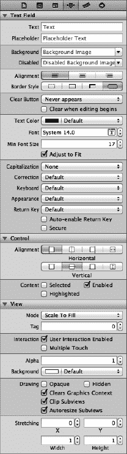

**图 4–14.** *文本字段的检查器，显示默认值*


### 文本字段检查器设置

在第一个字段 `Text` 中，你可以为文本字段设置一个默认值。无论你在此输入什么，应用启动后都会显示在该文本字段中。

第二个字段 `Placeholder`（占位符）允许你指定一段文本，当字段为空时，这段文本会以灰色显示在文本字段内。如果空间紧张，你可以使用占位符代替标签，或者用它来提示用户应在此文本字段中输入什么内容。在文本框中输入 `Type in a name` 作为当前所选文本字段的占位符，然后按回车键提交更改。

接下来的两个字段 `Background`（背景）和 `Disabled`（禁用）仅在需要自定义文本字段外观时才使用。在绝大多数情况下，这完全没有必要，甚至是不明智的。用户对文本字段的外观有既定预期。我们将跳过这两个字段，保留其默认设置。

这些字段下方是三个按钮，用于控制字段内显示文本的对齐方式。我们将此设置保留为左对齐（最左侧按钮）的默认值。

再往下是四个标有 `Border Style`（边框样式）的按钮。它们允许你更改文本字段边缘的绘制方式。默认值（最右侧按钮）会创建用户最熟悉的 iOS 应用中普通文本字段的样式。你可以随意尝试这四种不同的样式。试验结束后，请将此项设置恢复到最右侧按钮。

边框设置下方是一个 `Clear Button`（清除按钮）弹出按钮，用于选择清除按钮何时出现。清除按钮是可能出现在文本字段右端的小 `X`。清除按钮通常用于搜索字段或其他需要频繁更改值的字段。它们通常不会出现在用于持久化数据的文本字段中，因此请将其保留为默认值 `Never appear`（从不出现）。

`Clear when editing begins`（开始编辑时清除）复选框用于指定用户触摸该字段时的行为。如果勾选此框，该字段之前的任何值都会被删除，用户将从空字段开始。如果未勾选，之前的值将保留在字段中，用户可以对其进行编辑。保持此复选框为未勾选状态。

接下来的系列字段允许你设置字体、字体颜色和最小字体大小。我们将 `Text Color`（文本颜色）保留为黑色（默认值）。请注意，`Text Color` 弹出按钮分为两部分：右侧允许你从一组预选颜色中选择，左侧则允许你访问颜色样本以更精确地指定颜色。

`Font`（字体）设置分为三部分。右侧是一个控件，允许你每次增加或减少 1 点字号。左侧允许你手动编辑字体名称和大小。最后，点击带 `T` 字样的方框图标，会弹出一个窗口，让你设置各种字体属性。我们将 `Font` 保留为其默认设置 `System 14.0`。

`Font` 设置之后是一个控件，用于设置文本字段显示文本时使用的最小字体大小。暂时将其保留为默认值。

`Adjust to Fit`（自动调整适应）复选框用于指定当文本字段尺寸缩小时，文本大小是否应随之缩小。自动调整适应可以使全部文本在视图中保持可见，即使文本通常因过大而无法适应指定空间。此复选框与最小字体大小设置协同工作。无论字段尺寸如何，文本都不会被调整到小于该最小大小。指定最小大小可以确保文本不会变得太小而难以阅读。

下一部分定义了当此文本字段正在使用时，键盘的外观和行为。因为我们期望输入名字，让我们将 `Capitalization`（自动大写）弹出按钮更改为 `Words`（词语首字母大写）。这会使每个单词自动大写首字母，这通常是输入名字时所期望的。

接下来的三个弹出按钮——`Correction`（纠错）、`Keyboard`（键盘）和 `Appearance`（外观）——可以保留其默认值。花点时间查看每一项，以了解这些设置的作用。

接下来是 `Return Key`（返回键）弹出按钮。返回键是键盘右下角的按键，其标签会根据你正在执行的操作而变化。例如，如果你在 Safari 的搜索字段中输入文本，它会显示 `Search`（搜索）。在像我们这样的应用中，文本字段与其他控件共享屏幕时，`Done`（完成）是正确的选择。在此处进行该项更改。

如果勾选了 `Auto-enable Return Key`（自动启用返回键）复选框，则在文本字段中输入至少一个字符之前，返回键将处于禁用状态。保持此项为未勾选状态，因为我们希望允许用户不愿输入任何内容时，文本字段可以保持为空。

`Secure`（安全输入）复选框用于指定输入的字符是否显示在文本字段中。如果文本字段用作密码字段，则应勾选此复选框。在我们的应用中，保持其为未勾选状态。

下一部分允许你设置继承自 `UIControl` 的控件属性，但这些通常不适用于文本字段，并且除了 `Enabled`（启用）复选框外，不会影响字段的外观。我们希望保持这些文本字段为启用状态，以便用户可以与其交互。保留此部分的默认设置。

检查器中的最后一个部分 `View`（视图）应该看起来很熟悉。它与我们之前查看的图像视图检查器中同名的部分完全相同。这些是继承自 `UIView` 类的属性，由于所有控件都是 `UIView` 的子类，因此它们都共享此部分属性。如同你之前对图像视图所做的那样，勾选 `Opaque`（不透明）复选框，并取消勾选 `Clears Graphics Context`（清除图形上下文）和 `Clip Subviews`（裁剪子视图），原因我们在前面已讨论过。

### 设置第二个文本字段的属性

接下来，在 `View` 窗口中单击第二个文本字段，然后返回检查器。在 `Placeholder`（占位符）字段中，输入 `Type in a number`，并确保 `Clear When Editing Begins`（开始编辑时清除）处于未勾选状态。再往下一点，点击 `Keyboard`（键盘）弹出菜单。由于我们希望用户只输入数字而非字母，请选择 `Number Pad`（数字键盘）。这样可以确保向用户显示仅包含数字的键盘，意味着他们将无法输入字母字符、符号或除数字以外的任何内容。我们无需为数字键盘设置 `Return Key`（返回键）的值，因为该样式的键盘没有返回键。因此，检查器中所有其他设置均可保留默认值。如同你之前所做的，勾选 `Opaque`（不透明）复选框，并取消勾选 `Clears Graphics Context`（清除图形上下文）和 `Clip Subviews`（裁剪子视图）。


### 创建并连接输出口

我们即将首次测试应用。对于界面的第一部分，剩下的工作就是创建并连接输出口。界面上的图像视图和标签不需要输出口，因为我们无需在运行时修改它们。然而，两个文本字段是用于保存代码中所需数据的被动控件，因此我们需要为它们分别创建输出口。

你可能还记得上一章的内容，Xcode 4 允许我们使用助理编辑器同时创建和连接输出口。现在，请点击中间工具栏上标注为*Editor*的按钮，或依次选择**View**  **Assistant Editor**  **Show Assistant Editor**，进入助理编辑器。

确保项目导航栏中已选中你的 nib 文件。如果你的屏幕空间不够大，建议在此步骤中依次选择**View**  **Utilities**  **Hide Utilities** 来隐藏实用工具面板。当你调出助理编辑器时，nib 编辑面板会一分为二，一半显示 Interface Builder，另一半显示 `BIDViewController.h`（参见图 4–15）。这个新的编辑区域——显示 `BIDViewController.h` 的部分——就是助理编辑器。

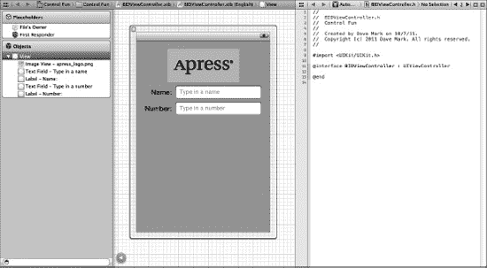

**图 4–15.** *开启助理编辑器后的 nib 编辑区域。你可以在右侧看到助理编辑器，其中显示了 `BIDViewController.h` 的代码。*

你会注意到助理编辑器的顶部边界有一个跳转栏，与普通编辑器面板类似。助理编辑器的跳转栏新增了一组“智能”选项，让你能够根据主视图的内容，在 Xcode 认为相关的多个文件之间切换。默认情况下，它显示一组标注为*Top Level Objects*的文件，包括控制器类的源代码（因为它是 nib 中的顶级对象之一），以及 `UIResponder` 和 `UIView` 的头文件（因为这些类也出现在 nib 的顶层）。花几分钟时间点击助理编辑器顶部的跳转栏，熟悉一下各个选项。等你对跳转栏及其代表的文件有了基本了解后，再继续操作。

现在进入有趣的部分。确保助理编辑器中仍显示 `BIDViewController.h`（如有必要，使用跳转栏返回）。然后，从视图中的顶部文本字段按住 Control 键拖动到 `BIDViewController.h` 源代码中，放在 `@interface` 行下方。你应该会看到一个灰色弹出窗口，显示 *Insert Outlet, Action, or Outlet Collection*（参见图 4–16）。松开鼠标按钮，会弹出你在上一章看到的相同弹出窗口。我们要创建一个名为 `nameField` 的输出口，因此在*Name*字段中输入 `nameField`（快速重复五遍！），然后按回车键。

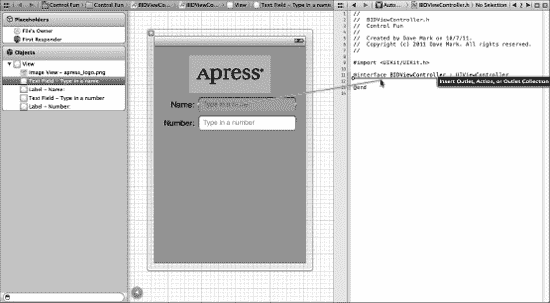

**图 4–16.** *开启助理编辑器后，我们按住 Control 键拖动到 `nameField` 的声明处，以连接该输出口。*

现在，`BIDViewController` 中有一个名为 `nameField` 的属性，并且它已连接到顶部文本字段。对第二个文本字段执行相同操作，创建一个名为 `numberField` 的属性并将其连接。

### 关闭键盘

来看看我们的应用运行效果如何？依次选择 **Product**  **Run**。应用应在 iPhone 模拟器中启动。点击*Name*文本字段，传统键盘会弹出。输入一个名字。然后，点击*Number*字段，数字键盘会出现（参见图 4–17）。Cocoa Touch 只需我们在界面中添加文本字段，就能免费提供所有这些功能。

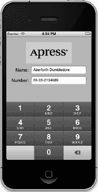

**图 4–17.** *当你点击文本字段或数字字段时，键盘会自动弹出。*

呜呼！但有个小问题：如何让键盘消失？请自行尝试。我们在这里等你。

#### 点击“完成”时关闭键盘

由于键盘是基于软件而非实体键盘，我们需要多做一些步骤，确保用户使用完后键盘能关闭。当用户点击文本键盘上的*Done*按钮时，会触发一个*Did End On Exit*事件，此时我们需要告诉文本字段放弃控制权，以便键盘消失。为此，我们需要向控制器类添加一个操作方法。

在项目导航栏中选择 `BIDViewController.h`，添加以下代码行（以粗体显示）：

```
#import <UIKit/UIKit.h>

@interface BIDViewController : UIViewController
@property (strong, nonatomic) IBOutletUITextField *nameField;
@property (strong, nonatomic) IBOutletUITextField *numberField;

- (IBAction)textFieldDoneEditing:(id)sender;

@end
```

当你在项目导航栏中选择头文件时，你可能已经注意到之前打开的助理编辑器会自动适应主编辑面板中选中的源代码文件，并显示对应文件。如果你选择了一个 `.h` 文件，助理编辑器会自动显示匹配的 `.m` 文件，反之亦然。这是 Xcode 4 非常实用的新增功能！因此，`BIDViewController.m` 现在显示在助理编辑器中，方便我们实现这个方法。

在 `BIDViewController.m` 的底部，`@end` 之前添加这个操作方法：

```
- (IBAction)textFieldDoneEditing:(id)sender {
    [sender resignFirstResponder];
}
```

如第 2 章所学，第一响应者是用户当前正在交互的控件。在我们的新方法中，我们告诉控件放弃第一响应者身份，将这一角色交还给用户之前使用的控件。当文本字段放弃第一响应者状态时，与之关联的键盘就会消失。

保存你刚才编辑的两个文件。让我们回到 nib 文件，为两个文本字段触发此操作。

在项目导航栏中选择 `BIDViewController.xib`，单击*Name*文本字段，然后按 **6** 调出连接检查器。这次，我们不使用上一章用过的*Touch Up Inside*事件，而是使用*Did End On Exit*，因为当用户点击文本键盘上的*Done*按钮时，该事件会触发。

将*Did End On Exit*旁边的圆圈拖到*File's Owner*图标上，并连接到 `textFieldDoneEditing:` 操作。你也可以通过拖到助理编辑器中的 `textFieldDoneEditing:` 方法来实现。对另一个文本字段重复此操作，保存更改，然后按 **R** 再次运行应用。

模拟器出现后，点击*Name*字段，输入一些内容，然后点击*Done*按钮。果然，键盘如预期般消失。太好了！不过，*Number*字段呢？嗯，那个字段上的*Done*按钮在哪（参见图 4–17）？

哎，糟糕！并非所有键盘布局都配有*Done*按钮。我们可以强制用户点击*Name*字段，然后再点击*Done*，但这不太友好，对吧？而我们最希望应用做到友好。让我们来看看如何处理这种情况。


#### 触摸背景关闭键盘

你还记得苹果 iPhone 的应用程序在这种情况下的处理方式吗？在大多数有文本输入框的地方，点击视图中没有活动控件的任意位置，键盘就会消失。我们该如何实现这一点呢？

答案可能会让你惊讶，因为实现起来非常简单。我们的视图控制器有一个名为 `view` 的属性，这是它从 `UIViewController` 继承来的。这个 `view` 属性对应着 nib 文件中的 *View*。`view` 属性指向 nib 文件中作为用户界面所有项目容器的 `UIView` 实例。它在用户界面中没有外观，但会覆盖整个 iPhone 窗口，位于所有其他用户界面对象的“下方”。有时它被称为 nib 的**容器视图**，因为其主要用途就是承载其他视图和控件。实际上，容器视图就是我们用户界面的背景。

使用 Interface Builder，我们可以更改 `view` 指向的对象的类，使其底层类变为 `UIControl` 而不是 `UIView`。由于 `UIControl` 是 `UIView` 的子类，将 `view` 属性连接到 `UIControl` 的实例是完全可行的。记住，当一个类继承另一个对象时，它只是该类的一个更具体的版本，所以 `UIControl` 本身*就是*一个 `UIView`。我们只需将创建的实例从 `UIView` 改为 `UIControl`，就能获得触发操作方法的能力。不过在此之前，我们需要先创建一个在点击背景时调用的操作方法。

我们需要向控制器类再添加一个操作。在你的 *BIDViewController.h* 文件中添加以下代码行：

```
#import <UIKit/UIKit.h>

@interface BIDViewController : UIViewController
@property (strong, nonatomic) IBOutletUITextField *nameField;
@property (strong, nonatomic) IBOutletUITextField *numberField;

- (IBAction)textFieldDoneEditing:(id)sender;
- (IBAction)backgroundTap:(id)sender;

@end
```

保存头文件。

现在，切换到实现文件，在文件末尾、`@end` 之前添加以下方法：

```
- (IBAction)backgroundTap:(id)sender {
    [nameField resignFirstResponder];
    [numberField resignFirstResponder];
}
```

此方法会指示两个文本输入框，如果它们拥有第一响应者状态，则放弃该状态。在一个不是第一响应者的控件上调用 `resignFirstResponder` 是完全安全的，因此我们可以无需检查哪个是当前第一响应者，直接对两个文本框都调用此方法。

**提示：** 编码时，你会频繁地在头文件和实现文件之间切换。幸运的是，除了助手提供的便利外，Xcode 还提供了一组快捷键，可以在两个对应文件间快速切换。默认快捷键是 `^`，你也可以在 Xcode 的偏好设置中将其更改为任意组合。

保存此文件。现在，再次选择 nib 文件。确保你的 dock 处于列表模式（点击 dock 右下角的三角形图标切换到列表视图）。单击选择 *View*。*不要*选择视图中的任何子项。我们需要的是容器视图本身。

接下来，按下 `3` 调出**身份检查器**（参见 图 4-18）。在这里你可以更改 nib 文件中任何对象实例的底层类。

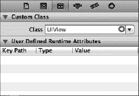

**图 4–18.** *我们将 Interface Builder 切换为列表视图，然后选中了我们的视图。接着切换到身份检查器，它允许我们更改 nib 文件中任何对象实例的底层类。*

标有 *Class* 的字段当前应显示为 *UIView*。如果不是，你可能没有选中容器视图。现在，将该设置改为 *UIControl*。按回车键确认更改。所有能够触发操作方法的控件都是 `UIControl` 的子类，因此通过更改底层类，我们刚刚赋予了此视图触发操作方法的能力。你可以通过按下 `6` 调出连接检查器来验证这一点。现在，你应该能看到上一章中连接按钮与操作时所见到的所有事件。

从 *Touch Down* 事件拖拽到 *File's Owner* 图标（参见 图 4-19），并选择 `backgroundTap:` 操作。现在，点击视图内任何没有活动控件的位置都会触发我们的新操作方法，从而使键盘收起。像这样连接到 *File's Owner* 与在代码中连接到方法完全相同。对于视图控制器 nib 文件来说，*File's Owner* 就是视图控制器类，所以这只是用一种稍微不同的方式实现了完全相同的结果。

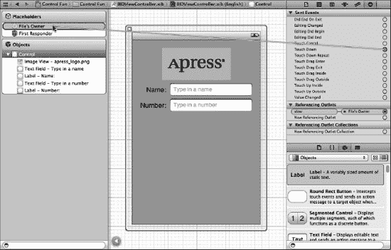

**图 4–19.** *通过将视图的类从 `UIView` 更改为 `UIControl`，我们获得了在任何标准事件上触发操作方法的能力。我们将视图的 Touch Down 事件连接到 `backgroundTap:` 操作。*

**注意：** 你可能会疑惑为什么我们选择了 *Touch Down* 而不是上一章用到的 *Touch Up Inside*。答案是背景本身不是按钮。在用户看来它不是一个控件，所以大多数用户不会想到要拖动手指到别处来取消操作。

保存 nib 文件，然后再次编译并运行你的应用程序。这一次，键盘不仅会在点击 *完成* 按钮时消失，点击任何非活动控件的位置时也会消失，这正是你的用户所期望的行为。

太好了！现在这部分已经全部搞定，你准备好学习下一组控件了吗？


### 添加滑块和标签

现在该添加滑块及其配套标签了。请记住，标签中的数值会随着滑块的移动而变化。在项目导航器中选择`BIDViewController.xib`，这样我们就能为应用程序的用户界面添加更多元素。

在放置滑块之前，我们先在设计上增加一些留白空间。之前我们用来确定上方文本字段与其上方图片间距的蓝色参考线，实际上只是最小间距的建议。换句话说，蓝色参考线告诉你：“不要比这个距离更近了。” 参考图 4-1，将两个文本字段及其标签向下拖动一些。现在我们来添加滑块。

从对象库中拖出一个滑块，将其排列在*数字*文本字段下方，以右侧的蓝色参考线作为停止点，并在底部文本字段下方留下一些留白空间。我们的滑块最终位于视图大约一半的位置。单击新添加的滑块以选中它，然后按**4** 返回对象属性检查器（如果它尚未显示，请参考图 4-20）。

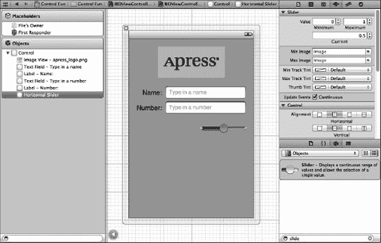

**图 4-20.** *显示滑块默认属性的检查器*

滑块允许您在给定范围内选择一个数值。使用检查器将*最小值*设置为 *1.00*，将*最大值*设置为 *100.00*，并将*当前值*设置为 *50.00*。保持选中*更新事件，持续*复选框。这确保了当滑块值变化时，事件流是连续的。这就是我们现在需要关注的所有内容。

拖出一个标签，并将其放置在滑块旁边，使用蓝色参考线使其与滑块垂直对齐，并将其左边框与视图的左边距对齐（请参考图 4-21）。

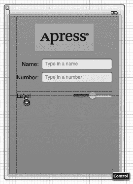

**图 4-21.** *放置滑块的标签*

双击新放置的标签，将其文本从*Label*更改为*100*。这是滑块可以容纳的最大值，我们可以利用它来确定滑块的正确宽度。由于“100”比“Label”短，我们可以让标签更短一些。通过抓住中间右侧的调整大小点并向左拖动来调整标签大小。确保在文本开始变小之前停止调整。如果文本确实开始变小，请将调整大小点向右移回，直到其恢复原始大小。你也可以像我们之前讨论的那样，通过按= 或选择**编辑器**  **按内容调整大小** 来自动调整标签以适合文本。

接下来，通过单击滑块以选中它，然后向左拖动左侧调整大小点，直到蓝色参考线提示您应该停止，来调整滑块的大小。

现在，再次双击标签，将其值更改为*50*。这是滑块的起始值，我们需要将其改回，以确保界面在启动时看起来是正确的。一旦滑块被使用，我们刚才编写的代码将确保标签持续显示正确的值。

#### 创建并连接操作和插座

针对这两个控件，剩下的工作就是连接插座和操作。我们需要一个指向标签的插座，以便在滑块被使用时更新标签的值，并且我们需要一个滑块在变化时调用的操作方法。

确保你正在使用助理编辑器并编辑`BIDViewController.h`，然后按住 Control 键从滑块拖拽到助理编辑器中`@end`声明的正上方。当弹出窗口出现时，将*Connection*弹出菜单更改为*Action*，然后在*名称*字段中输入 `sliderChanged`。按回车键创建并连接操作。

接下来，按住 Control 键从新添加的标签拖拽到助理编辑器。这次，拖拽到最后一个属性的正下方和第一个操作方法的上方。当弹出窗口出现时，在*名称*文本字段中输入 `sliderLabel`，然后按回车键创建并连接插座。

#### 实现操作方法

尽管 Xcode 已经创建并连接了我们的操作方法，但我们仍然需要实际编写构成该操作方法的代码，使其完成应有的功能。保存 nib 文件，然后在项目导航器中，单击`BIDViewController.m`并找到`sliderChanged:`方法，该方法目前应该是空的。向该方法添加以下代码：

```
- (IBAction)sliderChanged:(id)sender {
    UISlider *slider = (UISlider *)sender;
    int progressAsInt = (int)roundf(slider.value);
    sliderLabel.text = [NSString stringWithFormat:@"%d", progressAsInt];
}
```

该方法中的第一行将`sender`赋值给一个`UISlider`指针，以便编译器允许我们使用`UISlider`的方法和属性而不会产生警告。然后，我们获取滑块的当前值，将其四舍五入到最接近的整数，并赋值给一个整型变量。最后一行代码创建了一个包含该数字的字符串，并将其赋值给标签。

保存文件。接下来，按**R** 在 iPhone 模拟器中构建并启动您的应用程序，然后尝试使用滑块。当您移动滑块时，您应该会看到标签的文本实时变化。又一个部分就位了。现在，我们来看看如何实现开关。

### 实现开关、按钮和分段控件

我们再次回到 Xcode。是不是开始觉得有点晕了？这种反复操作可能看起来有点奇怪，但在 Xcode 中，在源代码和 nib 文件之间切换，并在开发过程中在 iOS 模拟器中测试应用，这是相当常见的。

我们的应用程序将有两个开关，它们是一种小型控件，只能有两种状态：开和关。我们还将添加一个分段控件来隐藏和显示这些开关。与这个控件一起，我们还将添加一个按钮，当点击分段控件的右侧时，该按钮会显示出来。接下来我们来实现这些。

回到 nib 文件中，从对象库中拖出一个分段控件（参见图 4-22），并将其放置在*View*窗口中，滑块稍下方。

**提示：** 为了让您了解我们想要的间距，请看一下带有 Apress 标志的图像视图。我们试图在图像视图上方和下方留出大致相同的空间。我们对滑块也做了同样的事情：试图在滑块上方和下方留出大致相同的空间。这只是 boyeez 的一个建议。

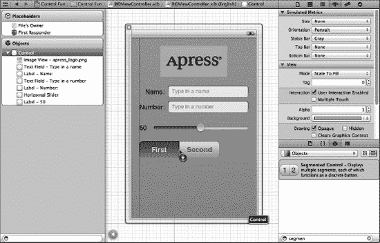

**图 4-22.** *将分段控件从库拖拽到父视图左侧。接下来，我们将调整分段控件的大小，使其延伸到视图右侧。*

展开分段控件的宽度，使其从视图的左边距延伸到右边距。双击分段控件上的文字*First*，将标题从*First*更改为*Switches*。完成此操作后，对*Second*分段重复此过程，将其重命名为*Button*（参见图 4-23）。

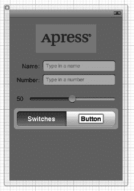

**图 4-23.** *在分段控件中重命名分段*

#### 添加两个带标签的开关

接下来，从库中抓取一个开关，将其放置在视图上，位于分段控件下方，紧靠左边距。再拖出第二个开关，将其紧靠右边距放置，并与第一个开关垂直对齐（参见图 4-24）。

**提示：** 在 Interface Builder 中按住 Option 键并拖拽对象会创建该对象的副本。当需要创建同一对象的多个实例时，从库中只拖出一个对象，然后按住 Option 键拖拽出所需数量的副本，这样更快。

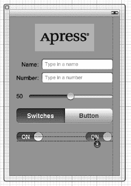

**图 4-24.** *向视图中添加开关*


### 连接并创建输出口和操作

在添加按钮之前，我们先为两个开关创建输出口并建立连接。我们即将添加的按钮实际上会覆盖在开关之上，这会使得从开关拖拽连线到其他控件变得困难，因此我们希望先处理好开关的连接再添加按钮。由于按钮和开关永远不会同时可见，将它们放在同一物理位置不会有问题。

使用辅助编辑器，从左侧开关拖拽连线到头文件最后一个输出口的下方。当弹出窗口出现时，将输出口命名为 `leftSwitch` 并按回车。对另一个开关重复此操作，将其输出口命名为 `rightSwitch`。

现在，通过单击再次选中左侧开关。再次向辅助编辑器拖拽连线。这次，拖拽到 `@end` 声明上方再松开。当弹出窗口出现时，将 *Connection* 弹出菜单改为 *Action*，将其命名为 `switchChanged:`，并按回车创建新的操作。对右侧开关重复此操作，但不是创建新操作，而是拖拽到刚创建的 `switchChanged:` 操作上并建立连接。正如我们在上一章中所做的那样，我们将使用一个方法来处理两个开关。

最后，从分段控件拖拽连线到辅助编辑器，位置在 `@end` 声明正上方。插入一个名为 `toggleControls:` 的新操作方法。

### 实现开关操作

保存 nib 文件并单击 `BIDViewController.m`。找到自动添加的 `switchChanged:` 方法，并添加以下代码：

```
- (IBAction)switchChanged:(id)sender {
    UISwitch *whichSwitch = (UISwitch *)sender;
    BOOL setting = whichSwitch.isOn;
    [leftSwitch setOn:setting animated:YES];
    [rightSwitch setOn:setting animated:YES];
}
```

每当两个开关中有一个被点击时，`switchChanged:` 方法就会被调用。在这个方法中，我们只需获取 `sender` 的值（它代表被按下的开关），并用该值来设置两个开关。既然 `sender` 总是要么是 `leftSwitch` 要么是 `rightSwitch`，你可能会好奇为什么我们要同时设置两个。原因在于实用性。每次都设置两个开关的值，比判断是哪个开关触发了调用然后再设置另一个要省事。无论哪个开关调用了该方法，它本身已经被设置为正确的值，再把它设置成相同的值不会产生任何影响。

### 添加按钮

接下来，返回 Interface Builder，从控件库中拖拽一个*圆角矩形按钮*到你的视图上。将此按钮直接放在最左侧开关的上方，使其左侧与左边界对齐，垂直方向中心与两个开关对齐（参见图 4–25）。

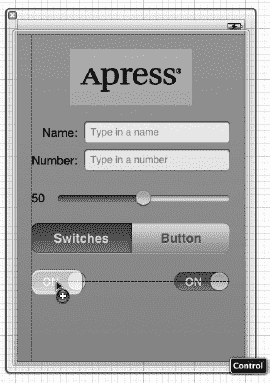

**图 4–25.** *在现有开关上方添加一个圆角矩形按钮*

现在，拖动右侧中间的大小调整手柄，一直向右拖到标示右边界的蓝色辅助线处。这个按钮应该完全覆盖两个开关（参见图 4–26）。

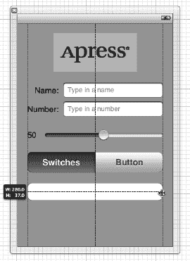

**图 4–26.** *放置并调整大小后的圆角矩形按钮将完全遮住两个开关*

双击新添加的按钮，将其标题设为 *Do Something*。

### 连接并创建按钮的输出口和操作

从新按钮拖拽连线到辅助编辑器，位置在头文件中最后一个输出口的下方。当弹出窗口出现时，创建一个名为 `doSomethingButton` 的新输出口。完成后，再次从按钮向 `@end` 声明上方拖拽连线。这次，不要创建输出口，而是创建一个名为 `buttonPressed:` 的操作。

如果你保存工作并试运行应用程序，你会看到分段控件是可用的，但它还没有任何实际作用。我们需要添加一些逻辑来让按钮和开关显示或隐藏。

我们还需要从一开始就将按钮标记为隐藏。之前我们不想这样做，因为这会使连接输出口和操作变得更加困难。既然已经完成了连接，让我们隐藏按钮。当用户点击分段控件的右侧时，我们会显示按钮，但在应用启动时，我们希望按钮隐藏。按下 **4** 打开属性检查器，滚动到 *View* 部分，并勾选 *Hidden* 复选框。按钮将会消失。

### 实现分段控件的操作

保存 nib 文件并单击 `BIDViewController.m`。找到 Xcode 为我们创建的 `toggleControls:` 方法，并添加以下代码：

```
- (IBAction)toggleControls:(id)sender {
    // 0 == 开关索引
    if ([sender selectedSegmentIndex] == 0) {
        leftSwitch.hidden = NO;
        rightSwitch.hidden = NO;
        doSomethingButton.hidden = YES;
    }
    else {
        leftSwitch.hidden = YES;
        rightSwitch.hidden = YES;
        doSomethingButton.hidden = NO;
    }
}
```

这段代码检查 `sender` 的 `selectedSegmentIndex` 属性，该属性告诉我们当前选中了哪个分段。第一个分段名为 `switches`，索引为 0，我们将这个事实写在注释中，以便之后重新查看代码时能够理解。根据选中的分段，我们隐藏或显示相应的控件。

此时，保存并在 iOS 模拟器中尝试运行应用程序。如果你正确输入了所有内容，你应该能够通过分段控件在按钮和两个开关之间切换，并且如果点击任一开关，另一个开关也会改变其值。然而，按钮仍然没有任何作用。在实现它之前，我们需要讨论一下操作表和警告框。

### 实现操作表和警告框

**操作表**和**警告框**都用于向用户提供反馈。如下所示：

- **操作表**用于强制用户在两个或更多选项之间做出选择。操作表从屏幕底部弹出并显示一系列按钮（参见图 4–3）。用户必须点击其中一个按钮后才能继续使用应用程序。操作表通常用于确认可能危险或不可逆的操作，例如删除对象。
- **警告框**以屏幕中央的蓝色圆角矩形形式出现（参见图 4–4）。与操作表类似，警告框强制用户在继续使用应用程序之前做出响应。警告框通常用于通知用户发生了重要或异常的事情。与操作表不同，警告框可以只显示一个按钮，但如果需要多个响应，你也可以选择显示多个按钮。

**注意：** 强制用户在选择后才能继续使用应用程序的视图称为**模态视图**。


### 遵循操作表单代理方法

还记得在第 3 章中我们讨论应用委托吗？实际上，`UIApplication`并不是 Cocoa Touch 中唯一使用委托的类。事实上，委托是 Cocoa Touch 中一种常见的设计模式。操作表单和警告框都使用委托，以便在它们被关闭时知道通知哪个对象。在我们的应用中，当操作表单被关闭时，我们需要得到通知。我们不需要知道警告框何时被关闭，因为我们只是用它来通知用户某些事情，而不是征求用户的选择。

为了让我们的控制器类能够充当操作表单的委托，它需要遵循一个名为`UIActionSheetDelegate`的协议。我们通过在类声明中，在父类之后的尖括号中添加协议名称来实现这一点。将以下协议声明添加到`BIDViewController.h`中：

```objectivec
#import <UIKit/UIKit.h>

@interface BIDViewController : UIViewController <UIActionSheetDelegate>
@property (strong, nonatomic) IBOutlet UITextField *nameField;
@property (strong, nonatomic) IBOutlet UITextField *numberField;
. . .
```

### 显示操作表单

让我们切换到`BIDViewController.m`，并实现按钮的操作方法。实际上，除了现有的操作方法之外，我们还需要实现另一个方法：操作表单用于通知我们它已被关闭的`UIActionSheetDelegate`方法。

首先，找到 Xcode 为你创建的空的`buttonPressed:`方法。将以下代码添加到该方法中，以创建并显示操作表单：

```objectivec
- (IBAction)buttonPressed:(id)sender {
    UIActionSheet *actionSheet = [[UIActionSheet alloc]
        initWithTitle:@"Are you sure?"
        delegate:self
        cancelButtonTitle:@"No Way!"
        destructiveButtonTitle:@"Yes, I'm Sure!"
        otherButtonTitles:nil];
    [actionSheet showInView:self.view];
}
```

接下来，在现有的`buttonPressed:`方法之后添加一个新方法：

```objectivec
- (void)actionSheet:(UIActionSheet *)actionSheet
didDismissWithButtonIndex:(NSInteger)buttonIndex
{
    if (buttonIndex != [actionSheet cancelButtonIndex])
    {
        NSString *msg = nil;

        if (nameField.text.length > 0)
            msg = [[NSString alloc] initWithFormat:
                @"You can breathe easy, %@, everything went OK.",
                nameField.text];
        else
            msg = @"You can breathe easy, everything went OK.";

        UIAlertView *alert = [[UIAlertView alloc]
            initWithTitle:@"Something was done"
            message:msg
            delegate:self
            cancelButtonTitle:@"Phew!"
            otherButtonTitles:nil];
        [alert show];
    }
}
```

我们究竟做了什么？首先，在`doSomething:`操作方法中，我们分配并初始化了一个`UIActionSheet`对象，该对象表示一个操作表单（以防你无法自行推断出这一点）：

```objectivec
UIActionSheet *actionSheet = [[UIActionSheet alloc]
               initWithTitle:@"Are you sure?"
               delegate:self
               cancelButtonTitle:@"No Way!"
               destructiveButtonTitle:@"Yes, I'm Sure!"
               otherButtonTitles:nil];
```

初始化方法接受多个参数。让我们逐一看看它们。

第一个参数是要显示的标题。请参考图 4–3 了解我们提供的标题将如何显示在操作表单的顶部。

下一个参数是操作表单的委托。当操作表单上的某个按钮被点击时，操作表单的委托将被通知。更具体地说，将调用委托的`actionSheet:didDismissWithButtonIndex:`方法。通过传递`self`作为委托参数，我们确保会调用我们自己的`actionSheet:didDismissWithButtonIndex:`版本。

接下来，我们传递用户点击以表示不想继续的按钮标题。所有操作表单都应该有一个取消按钮，尽管你可以为其指定适合你场景的任何标题。如果不需要做选择，则不应使用操作表单。当你希望在不提供选择选项的情况下通知用户时，使用警告视图更合适。

下一个参数是破坏性按钮，你可以将其视为“是的，请继续”按钮，当然，同样你也可以为它赋予任何标题。

最后一个参数允许你指定可能希望在操作表单上显示的任何数量其他按钮。这个最终参数可以接受可变数量的值，这是 Objective-C 语言的一个不错特性。如果我们希望在操作表单上有另外两个按钮，我们可以像这样实现：

```objectivec
       UIActionSheet *actionSheet = [[UIActionSheet alloc]
           initWithTitle:@"Are you sure?"
           delegate:self
           cancelButtonTitle:@"No Way!"
           destructiveButtonTitle:@"Yes, I'm Sure!"
           otherButtonTitles:@"Foo", @"Bar", nil];
```


这段代码将会生成一个包含四个按钮的操作表。你可以向 `otherButtonTitles` 参数传递任意数量的参数，只需确保最后一个参数是 `nil` 即可。当然，根据屏幕空间的可用大小，按钮数量存在实际限制。

创建操作表后，我们让它显示出来：

```
[actionSheet showInView:self.view];
```

操作表始终需要一个父视图，该视图必须是当前用户可见的视图。在我们的例子中，我们希望使用在 Interface Builder 中设计的视图作为父视图，因此使用了 `self.view`。请注意这里使用了 Objective-C 的点语法。`self.view` 等价于 `[self view]`，即通过访问器返回 `view` 属性的值。

为什么我们不直接使用 `view`，而是用 `self.view` 呢？`view` 是父类 `UIViewController` 的私有实例变量，这意味着我们无法直接访问它，而必须通过访问器方法。

嗯，这并不难，对吧？只需几行代码，我们就显示了一个操作表，并要求用户做出决定。iOS 甚至会为我们自动运行动画效果，无需任何额外操作。现在，我们只需要找出用户点击了哪个按钮。刚刚实现的另一个方法 `actionSheet:didDismissWithButtonIndex` 是 `UIActionSheetDelegate` 协议中的方法之一。由于我们将 `self` 指定为操作表的代理，当按钮被点击时，操作表会自动调用该方法。

参数 `buttonIndex` 会告诉我们实际点击的是哪个按钮。但我们如何知道哪个按钮索引对应取消按钮，哪个对应破坏性按钮呢？幸运的是，委托方法会接收一个指向代表该操作表的 `UIActionSheet` 对象的指针，而这个操作表对象知道哪个按钮是取消按钮。我们只需要查看它的一个属性 `cancelButtonIndex` 即可：

```
if (buttonIndex != [actionSheet cancelButtonIndex])
```

这行代码确保用户没有点击取消按钮。由于我们只给用户提供了两个选项，因此可以确定：如果取消按钮未被点击，那么破坏性按钮一定被点击了，可以继续执行后续操作。一旦确认用户没有取消，我们首先创建一个新的字符串，用于显示给用户。在实际应用中，这里会执行用户请求的任何处理操作。我们只是假装做了某些处理，然后通过警告框通知用户。

如果用户在顶部文本字段中输入了名称，我们将获取该名称，并在警告框中显示的消息中使用它。否则，我们只会生成一条通用消息来显示。

```
NSString *msg = nil;

if (nameField.text.length > 0)
    msg = [[NSString alloc] initWithFormat:
        @"你可以放心了，%@，一切正常。",
        nameField.text];
else
    msg = @"你可以放心了，一切正常。";
```

接下来的几行代码看起来会有些熟悉。警告视图和操作表的创建及使用方式非常相似。

```
UIAlertView *alert = [[UIAlertView alloc]
    initWithTitle:@"已执行操作"
    message:msg
    delegate:nil
    cancelButtonTitle:@"呼！"
    otherButtonTitles:nil];
```

同样，我们传入一个要显示的标题。还传入了一个更详细的消息，即刚才创建的字符串。警告视图也有委托，如果我们需要知道用户何时关闭了警告视图或点击了哪个按钮，可以像操作表那样将 `self` 指定为委托。如果那样做，我们现在还需要让类遵循 `UIAlertViewDelegate` 协议，并实现该协议中的一个或多个方法。但在本例中，我们只是通知用户某些信息，并且只给用户一个按钮。我们并不关心按钮何时被点击，而且已经知道哪个按钮会被点击，因此这里直接指定 `nil`，表示用户完成警告视图操作后我们无需被通知。

与操作表不同，警告视图不依赖于特定视图，因此我们只需让警告视图自行显示，无需指定父视图。之后，只需进行一些内存清理工作即可完成。保存文件，然后构建、运行，并尝试使用完成后的应用程序。

### 美化按钮

如果你将运行中的应用与图 4–2 进行比较，可能会注意到一个有趣的差异。你的 *Do Something* 按钮看起来与图中的不一样。而且它看起来也不像操作表或其他 iPhone 应用中的按钮，对吧？默认的圆角矩形按钮看起来确实不太美观，所以在完成应用之前，我们先来处理这个问题。

你在 iOS 设备上看到的大多数按钮都是使用图像绘制的。别担心；你不需要为每个按钮在图像编辑器中创建图像。你只需要指定一种模板图像，iOS 在绘制按钮时会使用它。

请务必牢记，你的应用是运行在沙盒环境中的。你无法访问 iOS 设备上其他应用或 iOS 自身使用的模板图像，因此必须确保所需的所有图像都位于应用的 bundle 中。那么，从哪里获取这些图像模板呢？

幸运的是，Apple 已经为你提供了很多。你可以从名为 `UICatalog` 的 iPhone 示例应用中获取它们，该应用可在 iOS 开发者库中找到：

```
http://developer.apple.com/library/ios/#samplecode/UICatalog/index.html
```

或者，你也可以直接从本书项目存档的 *04 - Control Fun* 文件夹中复制这些图像。是的，在你的应用中使用这些图像是允许的，因为 Apple 的示例代码许可明确允许你使用和分发它们。

因此，从 *04 - Control Fun* 文件夹或 `UICatalog` 项目文件夹的 *Images* 子文件夹中，将名为 `blueButton.png` 和 `whiteButton.png` 的两个图像添加到你的 Xcode 项目中。

如果你点击项目导航器中的某个按钮，你会发现这些图像本身并没有什么特别之处。将它们用于按钮时有一个技巧。

回到你正在处理的 nib 文件，单击 *Do Something* 按钮。是的，我们知道，按钮现在因为被标记为隐藏而不可见，但你应该能轻松看到它的幽灵图像。此外，你还可以点击停靠栏列表中的按钮。

选中按钮后，按下 **4** 打开属性检查器。在检查器中，使用第一个弹出菜单将类型从 *圆角矩形* 改为 *自定义*。你会在检查器中看到，可以为按钮指定一个图像，但我们不打算这么做，因为这些图像模板需要以稍微不同的方式处理。


### 使用 `viewDidLoad` 方法

我们控制器的父类 `UIViewController` 有一个名为 `viewDidLoad` 的方法，如果我们需要修改从 nib 文件中创建的任何对象，可以重写该方法。由于我们无法完全在 Interface Builder 中实现我们想要的效果，因此我们将利用 `viewDidLoad` 方法。

保存您的 nib 文件。然后切换到 `BIDViewController.m` 文件，找到 `viewDidLoad` 方法。Xcode 项目模板已经为您创建了一个空的该方法版本。找到它，并向其中添加以下代码。完成后，我们将讨论该方法的作用。

```
- (void)viewDidLoad{
    [super viewDidLoad];
    // 在加载视图后进行任何额外的设置，通常来自 nib 文件。
    UIImage *buttonImageNormal = [UIImage imageNamed:@"whiteButton.png"];
    UIImage *stretchableButtonImageNormal = [buttonImageNormal
stretchableImageWithLeftCapWidth:12 topCapHeight:0];
    [doSomethingButton setBackgroundImage:stretchableButtonImageNormal
forState:UIControlStateNormal];

    UIImage *buttonImagePressed = [UIImage imageNamed:@"blueButton.png"];
    UIImage *stretchableButtonImagePressed = [buttonImagePressed
stretchableImageWithLeftCapWidth:12 topCapHeight:0];
    [doSomethingButton setBackgroundImage:stretchableButtonImagePressed
forState:UIControlStateHighlighted];
}
```

这段代码基于我们添加到项目中的那些模板图片为按钮设置了背景图像。它指定了按钮在被触摸时，应从使用白色图像切换为蓝色图像。这个简短的方法引入了两个新概念：**控制状态（control states）** 和**可拉伸图像（stretchable images）**。我们来逐一了解。

### 控制状态

每个 iOS 控件都有四种可能的控制状态，并且在任何给定时刻总是处于其中一种，且只能是其中一种状态：

- **正常（Normal）**：最常见的状态是正常控制状态，即默认状态。这是控件在不处于任何其他状态时所处的状态。
- **高亮（Highlighted）**：高亮状态是控件在被使用时所处的状态。对于按钮来说，就是用户手指按在按钮上的时候。
- **禁用（Disabled）**：控件在被关闭时处于禁用状态。这可以通过在 Interface Builder 中取消勾选 *已启用（Enabled）* 复选框，或将控件的 `enabled` 属性设置为 `NO` 来实现。
- **选中（Selected）**：只有部分控件支持选中状态。它通常用于指示控件已开启或已被选中。选中状态与高亮状态类似，但当用户不再直接使用该控件时，控件可以继续保持选中状态。

某些 iOS 控件的属性可以根据其状态取不同的值。例如，通过为 `UIControlStateNormal` 指定一个图像，并为 `UIControlStateHighlighted` 指定另一个不同的图像，我们告诉 iOS 在用户手指按在按钮上时使用一个图像，而在其他时间则使用另一个图像。

### 可拉伸图像

可拉伸图像是一个有趣的概念。可拉伸图像是一种可调整大小的图像，它知道如何智能地调整自身大小，从而保持正确的外观。对于这些按钮模板，我们不希望边缘与图像的其余部分均匀拉伸。**端盖（End caps）** 是图像中不应调整大小的部分，以像素为单位测量。我们希望无论按钮的大小如何，边缘的斜角都保持不变，因此我们指定了左侧端盖大小为 12。

因为我们向按钮传递的是新的可拉伸图像，而不是原始图像模板，所以 iOS 知道如何以任何尺寸正确地绘制按钮。我们现在可以在 nib 文件中更改按钮的大小，它仍然会被正确绘制。如果我们直接在 nib 文件中指定了按钮图像，它会均匀地调整整个图像的大小，那么我们的按钮在大多数尺寸下看起来都会很奇怪。

**提示：** 我们怎么知道端盖要用什么值呢？其实很简单：我们从 Apple 的示例代码中复制过来的。

为什么不保存文件并尝试运行我们的应用呢？现在，“Do Something”按钮看起来应该更 iPhone 风格一些了，但所有功能都应该正常工作。

### 冲过终点线

这一章内容相当丰富。在概念上，我们没有给你灌输太多全新的东西，但我们带你使用了不少控件，并向你展示了许多不同的实现细节。你对 Outlet 和 Action 进行了大量练习，并了解了如何利用视图的层次结构。你学习了控制状态和可拉伸图像，还学习了如何使用操作表单（action sheets）和警告（alerts）。

这个小应用中有很多值得探索的地方。随时可以回过头来摆弄它。修改值，通过添加和修改代码进行实验，看看在 Interface Builder 中进行不同设置会产生什么效果。我们不可能带你遍历 iOS 中每个控件的所有排列方式，但你刚刚完成的这个应用是一个很好的起点，涵盖了很多基础知识。

在下一章中，我们将探讨当用户将 iOS 设备从纵向旋转到横向，或反之亦然时会发生什么。你可能很清楚，许多应用会根据用户握持设备的方式改变其显示内容，我们将向你展示如何在自己的应用中实现这一点。

