# 第 5 章

## 自动旋转与自动调整大小

iPhone 和 iPad 是了不起的工程杰作。Apple 的工程师们想方设法在一个非常小巧的封装中塞入了最大化的功能。其中一个例子就是这些设备既可以在纵向（高而窄）模式下使用，也可以在横向（矮而宽）模式下使用，并且可以在运行时简单地通过旋转设备来改变模式。你可以在 iOS 的网络浏览器 Mobile Safari 中看到这种被称为**自动旋转（autorotation）** 的行为示例（请参见 图 5–1）。

在本章中，我们将详细讨论自动旋转。我们将首先概述自动旋转的细节，然后讨论在应用中实现该功能的不同方法。

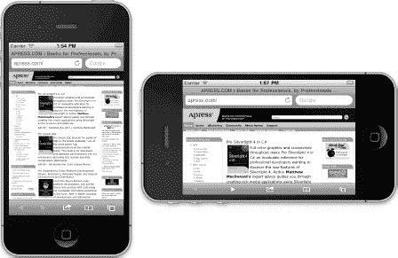

**图 5–1.** *与许多 iOS 应用一样，Mobile Safari 会根据其握持方式改变显示内容，从而充分利用可用的屏幕空间。*


### 自动旋转的机制

自动旋转功能并不适用于所有应用。苹果的几款 iPhone 应用仅支持单一方向。例如，通讯录只能在竖屏模式下编辑。但 iPad 应用则不同。苹果建议所有应用程序（除了那些围绕特定布局设计的沉浸式应用，如游戏）都应支持所有方向。

事实上，苹果所有自带的 iPad 应用在横竖屏模式下都能良好运行。其中许多应用利用方向来展示数据的不同视图。例如，邮件和备忘录应用在横屏模式下会将项目列表（文件夹、邮件或备忘录）显示在左侧，选中的项目显示在右侧；而在竖屏模式下，则会让你专注于所选项目的细节。

对于 iPhone 应用，基本规则是：如果自动旋转能提升用户体验，就应该将其添加到应用中。对于 iPad 应用，规则是：除非有充分理由不这么做，否则应添加自动旋转功能。幸运的是，苹果在 iOS 和 UIKit 中很好地隐藏了自动旋转的复杂性，因此在你的 iOS 应用中实现这一功能其实相当简单。

自动旋转是通过视图控制器来指定的。如果用户旋转设备，系统会询问当前的视图控制器是否允许旋转到新的方向（本章将介绍具体做法）。如果视图控制器回复“允许”，应用的窗口和视图就会被旋转，并且窗口和视图会重新调整大小以适应新方向。

在 iPhone 和 iPod touch 上，初始为竖屏模式的视图宽度为 320 点，高度为 480 点。在 iPad 上，竖屏模式意味着宽度为 768 点，高度为 1024 点。如果你的应用显示了`status bar`（状态栏），则可供应用使用的屏幕区域垂直方向会减少 20 点。状态栏是屏幕顶部 20 点高的条状区域（参见图 5–1），显示信号强度、时间、电池电量等信息。

当设备切换到横屏模式时，视图会随应用的窗口一起旋转，并重新调整大小以适应新方向，变为宽度 480 点、高度 320 点（iPhone 和 iPod touch）或宽度 1024 点、高度 768 点（iPad）。和之前一样，如果你显示状态栏（大多数应用都会这样做），应用实际可用的垂直空间会减少 20 点。

### 点、像素与视网膜显示屏

你可能会疑惑为什么我们谈论的是“点”而非像素。本书的早期版本确实是使用像素而非点来描述屏幕尺寸的。发生变化的原因是苹果推出了`retina display`（视网膜显示屏）。

视网膜显示屏是苹果对 iPhone 4、iPhone 4s 以及后续 iPod touch 上高分辨率屏幕的市场营销术语。它将屏幕分辨率从原始的 320×480 像素提升至 640×960 像素。

幸运的是，在大多数情况下，你无需为此做任何额外工作。当我们处理屏幕元素时，我们使用`points`（点）来指定尺寸和距离，而非像素。对于旧款 iPhone 和所有 iPad，点与像素是等同的：1 点等于 1 像素。然而，在较新型号的 iPhone 和 iPod touch 上，1 点对应 4 个像素，屏幕仍是 320×480 点，尽管实际有 640×960 个像素。你可以将其视为一种“虚拟分辨率”，由 iOS 自动将点映射到屏幕的物理像素上。我们将在第 16 章中进一步讨论。

在典型应用中，实际移动屏幕上像素的大部分工作由 iOS 管理。你的应用在此过程中的主要任务是确保在调整大小后的窗口中，所有内容都能合适地摆放，并看起来美观。

### 自动旋转的实现方法

在管理旋转时，你的应用可以采用三种通用的方法。使用哪一种取决于界面的复杂程度。本章将探讨所有三种方法。

对于较简单的界面，你可以为构成界面的所有对象指定正确的`autosizeattributes`（自动调整大小属性）。自动调整大小属性告诉 iOS 设备，当控件所在的视图调整大小时，控件应如何表现。如果你在 Mac OS X 上使用过 Cocoa，那么你已经熟悉这个过程，因为它与指定 Cocoa 控件在用户调整其所在窗口大小时的行为所用的方法相同。

自动调整大小属性使用起来快速方便，但并非适用于所有应用。更复杂的界面必须以不同的方式处理自动旋转。对于更复杂的视图，还有另外两种方法：

- 在视图旋转时收到通知后，通过代码手动重新定位视图中的对象。
- 在 Xcode 的 Interface Builder 中设计两个不同的视图版本：一个用于竖屏模式，另一个用于横屏模式。

在这两种情况下，你都需要在你的视图控制器类中重写`UIViewController`的方法。

我们开始吧，好吗？首先来看一下自动调整大小。

### 使用自动调整大小属性处理旋转

我们将创建一个简单的应用来演示如何使用自动调整大小属性。在 Xcode 中新建一个*Single View Application*项目，命名为*Autosize*。选择*iPhone*作为*Device Family*，并确保使用 ARC。在 nib 文件中布置 GUI 之前，我们需要告诉 iOS 我们的视图支持自动旋转。这可以通过修改视图控制器类来实现。


#### 配置支持的方向

首先，我们需要指定应用程序支持哪些方向。当你的窗口出现时，它应该已经打开了项目设置。如果没有，请点击项目导航器中的最顶行（以项目名称命名的行），然后确保你处于*摘要*（Summary）选项卡。在摘要中提供的选项中，你应该会看到一个名为*iPhone / iPod 部署信息*（iPhone / iPod Deployment Info）的部分，其中包含一个名为*支持的设备方向*（Supported Device Orientations）的子部分（参见图 5-2）。

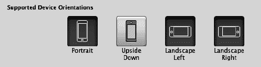

**图 5-2.** *项目摘要选项卡显示了支持的设备方向等内容。*

这就是你如何指定应用程序支持的方向。这并不一定意味着应用程序中的每个视图都会使用所有选中的方向，但如果你打算在应用程序的任何一个视图中支持某个方向，那么该方向必须在这里被选中。

**注意：** 图 5-2 中显示的四个按钮实际上只是添加和删除应用程序 *Info.plist* 文件中条目的快捷方式。如果你在项目导航器的*支持文件*（Supporting Files）文件夹中单击 *Autosize-Info.plist*，你会看到一个名为 `UISupportedInterfaceOrientations` 或*支持的界面方向*（Supported interface orientations）的条目，其下包含三个子条目，分别对应当前选中的三个方向。在项目摘要中选择和取消选择这些按钮，实际上就是在从这个数组中添加和移除条目。使用按钮更简单且不易出错，因此我们强烈建议使用按钮，但我们认为你应该了解它们的作用。

你是否注意到*倒置*（Upside Down）方向默认是关闭的？这是因为如果手机在倒置时接到电话，你接电话时手机很可能仍然处于倒置状态。iPad 应用项目默认支持所有四个方向，因为 iPad 旨在任何方向上使用。由于我们的项目是 iPhone 项目，我们可以保留按钮的当前设置。

我们已经确定了应用程序将支持的方向，但这并不是全部。我们还需要为每个视图控制器指定支持哪些方向，并且这些方向必须是此处选择方向的一个子集。

#### 指定旋转支持

单击 `BIDViewController.m` 文件。在已有的代码中，你会看到一个名为 `shouldAutorotateToInterfaceOrientation:` 的方法，这是模板为你提供的：

```
- (BOOL)shouldAutorotateToInterfaceOrientation:
                         (UIInterfaceOrientation)interfaceOrientation{

    // 返回 YES 表示支持的方向
    return (interfaceOrientation != UIInterfaceOrientationPortraitUpsideDown);
}
```

这个方法是 iOS 用来询问视图控制器是否可以旋转到特定方向的机制。四个已定义的方向对应 iOS 设备被持有的四种常规方式：

*   `UIInterfaceOrientationPortrait`
*   `UIInterfaceOrientationPortraitUpsideDown`
*   `UIInterfaceOrientationLandscapeLeft`
*   `UIInterfaceOrientationLandscapeRight`

对于 iPhone 来说，模板默认支持除倒置外的所有方向，正如你在支持的方向设置中看到的那样。如果我们创建的是一个 iPad 项目，模板创建的 `shouldAutorotateToInterfaceOrientation:` 方法的默认版本只会返回 `YES`。

当 iOS 设备的方向改变时，会在当前活动的视图控制器上调用 `shouldAutorotateToInterfaceOrientation:` 方法。参数 `interfaceOrientation` 将包含上面列表中的四个值之一，该方法需要返回 `YES` 或 `NO`，以指示应用程序的窗口是否应该旋转以匹配新的方向。由于每个视图控制器子类都可以以不同方式实现此方法，因此一个应用程序可能在某些视图中支持自动旋转，而在其他视图中不支持，或者一个视图控制器在特定条件下只支持某些方向。

**代码感知在行动**

你是否注意到 iPhone 上定义的系统常量总是设计成一起使用的值以相同的字母开头？`UIInterfaceOrientationPortrait`、`UIInterfaceOrientationPortraitUpsideDown`、`UIInterfaceOrientationLandscapeLeft` 和 `UIInterfaceOrientationLandscapeRight` 都以 `UIInterfaceOrientation` 开头的一个原因，是为了让你利用 Xcode 的**代码感知**（Code Sense）特性。

你可能已经注意到，当你输入代码时，Xcode 经常尝试补全你正在输入的单词。这就是代码感知在起作用。

开发者不可能记住系统中所有各种定义的常量，但你可以记住你经常使用的那些组的共同开头。当你需要指定一个方向时，只需输入 `UIInterfaceOrientation`（甚至 `UIInterf`），然后按 escape 键调出所有匹配项的列表。（在 Xcode 的偏好设置中，你可以将该匹配键从 escape 更改为其他键。）你可以使用箭头键浏览出现的列表，并通过按 tab 或 return 键进行选择。这比在文档或头文件中查找值要快得多。

再次强调，模板已经预测了我们的需求，所以我们现在可以保留这段代码不变。不过，你可以随意尝试这个方法，为不同的方向返回 `YES` 或 `NO`。

**注意：** iOS 实际上有两种不同类型的方向。我们在这里讨论的是**界面方向**（interface orientation）。还有一个独立但相关的概念是**设备方向**（device orientation）。设备方向指定了设备当前被持有的方式。界面方向则是屏幕上的内容被旋转的方向。如果你将一个标准 iPhone 应用倒置，设备方向将是倒置的，但界面方向将是其他三个方向之一，因为 iPhone 应用通常不支持竖屏倒置。


#### 设计具有自动调整大小属性的界面

在 Xcode 中，选择 `BIDViewController.xib` 以在 Interface Builder 中编辑该文件。使用自动调整大小属性的一个好处是，它们几乎不需要编写代码。我们确实需要在代码中指定支持哪些方向，但自动调整大小的其余实现可以就在 Interface Builder 中完成。

为了了解其原理，从库中将六个*圆角矩形按钮*拖到您的视图中，并按照图 5-3 所示放置它们。双击每个按钮，并为每个按钮指定一个标题，以便稍后区分。我们将左上角按钮命名为 *UL*，右上角按钮命名为 *UR*，中间左侧按钮命名为 *L*，中间右侧按钮命名为 *R*，左下角按钮命名为 *LL*，右下角按钮命名为 *LR*。

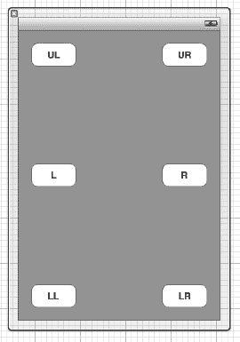

**图 5-3.** *向界面添加六个带标签的按钮*

现在，让我们看看在我们指定了支持自动旋转但未设置任何自动调整大小属性的情况下会发生什么。构建并运行应用程序。iPhone 模拟器启动后，选择 **Hardware  Rotate Left**，这将模拟将 iPhone 旋转到横向模式。查看图 5-4。哦，天哪。

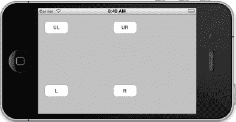

**图 5-4.** *嗯，这样不太有用，对吧？按钮 LL 和 LR 去哪了？*

大多数控件默认设置为相对于屏幕左侧和顶部保持其位置。这条规则有一些例外，但通常如此。对于某些控件来说，这完全合适。例如，左上角按钮 (*UL*) 可能正好在我们希望它出现的位置。然而，其余的按钮就没那么幸运了。

退出模拟器，让我们着手修复 GUI，使其能够以合理的方式适应屏幕尺寸。

#### 使用尺寸检查器的自动调整大小属性

单击视图中的左上角按钮，然后按  `5` 调出**尺寸检查器**，它应该看起来像图 5-5。

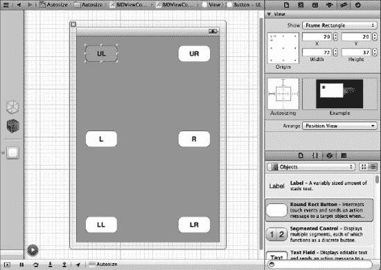

**图 5-5.** *尺寸检查器允许您设置对象的自动调整大小属性。*

尺寸检查器允许您设置对象的自动调整大小属性等。图 5-6 中左侧的框是您实际设置属性的地方。右侧的框会运行一个小动画（将光标移到框上以激活动画），该动画将向您展示对象在调整大小时的行为方式。在左侧的框中，内层正方形代表当前对象。如果选中了一个按钮，内层正方形就代表该按钮。

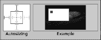

**图 5-6.** *尺寸检查器的自动调整大小部分*

内层正方形内部的红色箭头代表所选对象内部水平和垂直方向的空间。单击任一箭头会将其从虚线变为实线，或从实线变回虚线。如果水平箭头是实线，则对象的宽度可以随着窗口调整大小而自由改变；如果水平箭头是虚线，则 iOS 会尽可能保持对象的宽度为其原始值。对象的高度和垂直箭头也是如此。

内层框外部的四个红色 *I* 形状代表所选对象边缘与其所在视图的相同边缘之间的距离。如果 *I* 是虚线，则该空间是灵活的；如果它是实线红色，则应尽可能保持该空间大小不变。

嗯？

或许，如果你实际看到它的运作，这个概念会更有意义。图 5-6 展示了默认的自动调整大小设置，这些设置指定对象的大小在其父视图调整大小时保持不变，并且到左边缘和上边缘的距离也应保持不变。如果你查看自动调整大小控件旁边的动画，可以看到对象在调整大小时的行为方式。请注意，当父视图改变大小时，内层框相对于父视图左边缘和上边缘的位置保持不变。

尝试这个实验。选中您的左上角 (*UL*) 按钮，单击两个实心红色 *I* 形状（内层框的上方和左侧），使其变为虚线，看起来像图 5-7 中所示的那样。将所有可能的线条都设置为虚线，对象的大小将保持不变，并且在父视图调整大小时，它将浮动在父视图的中央。


**图 5-7.** *所有线条都为虚线时，您的控件在父视图中浮动并保持其大小。*

现在，单击框内部的垂直箭头以及框上方和下方的 *I* 形状，使您的自动调整大小属性看起来像图 5-8 中所示的那样。

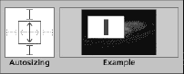

**图 5-8.** *此配置允许对象的垂直尺寸发生变化。*

在这里，我们表明对象的垂直尺寸可以改变，并且从对象顶部到窗口顶部的距离以及从对象底部到窗口底部的距离应保持不变。使用此配置，对象的宽度不会改变，但其高度会改变。

再更改几次自动调整大小属性，并观察动画，直到您理解不同的设置将如何影响视图旋转和调整大小时的行为。

#### 设置按钮的自动调整大小属性

现在，让我们为六个按钮设置自动调整大小属性。请继续，看看您是否能自行弄清楚。如果您感到困惑，请查看图 5-9，该图显示了在旋转手机时为了将所有按钮保留在屏幕上，每个按钮所需的自动调整大小属性。

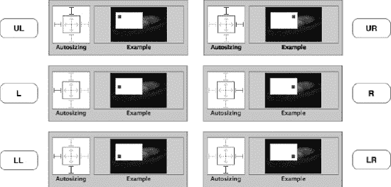

**图 5-9.** *所有六个按钮的自动调整大小属性*

一旦将属性设置成图 5-9 所示的样子，保存 nib 文件，然后构建并运行应用程序。这次，当 iPhone 模拟器启动时，您应该能够选择 **Hardware  Rotate Left** 或 **Rotate Right**，并且所有按钮都将保留在屏幕上（参见图 5-10）。如果您旋转回来，它们应该会返回到原始位置。此技术适用于大量应用程序。

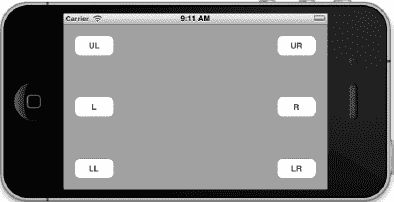

**图 5-10.** *旋转后处于新位置的按钮*

在此示例中，我们保持了按钮的大小不变，因此现在所有按钮都可见且可用，但屏幕上有大量未使用的空间。或许，如果我们允许按钮的宽度或高度发生变化，那么界面上的空白空间会更少，这样会更好？请随意试验这六个按钮的自动调整大小属性，甚至可能添加一些其他按钮。不断尝试，直到您对自动调整大小的运作方式感到得心应手。

在您的实验过程中，您一定会注意到，有时没有任何自动调整大小属性的组合能完全满足您的需求。在某些情况下，您需要比此技术所能处理的更大幅度地重新排列界面。对于这些情况，需要编写更多代码。接下来让我们看看这一点。


### 旋转时重构视图

回到你的 nib 文件，单击每个按钮，然后使用尺寸检查器将*宽度*和*高度*字段改为*125*，这将把按钮的宽度和高度设置为 125 点。如果你愿意，可以选中全部六个按钮，并通过尺寸检查器一次性修改它们。完成后，使用蓝色对齐线重新排列按钮，使你的视图看起来像图 5-11。

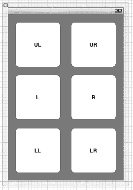

**图 5-11.** *调整所有按钮大小后的视图*

你能猜到现在旋转屏幕时会发生什么吗？嗯，假设你保留了按钮的自动调整大小属性，设置如图 5-9 所示，你可能不会满意。按钮会重叠在一起，看起来像图 5-12，因为在横屏模式下屏幕高度根本不够容纳三个 125 点高的按钮。

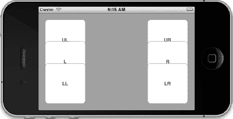

**图 5-12.** *这不是我们想要的。重叠太多。我们需要另一种解决方案。*

我们可以通过允许按钮高度变化来利用自动调整大小属性适应这种情况，但这并不能最佳利用屏幕空间，因为它会在屏幕中间留下一个大间隙。如果在竖屏模式下能容纳六个方形按钮，那么在横屏模式下也应该能容纳六个方形按钮——我们只需要重新排列它们。处理这个问题的一种方法是在视图旋转时为每个按钮指定新位置。

### 创建并连接输出口

编辑`BIDViewController.xib`并打开辅助编辑器（如上一章所做）。确保除了 GUI 布局区域外还能看到`BIDViewController.h`，然后从六个按钮中的每一个按住 Control 键拖拽到右侧的头文件，创建六个名为`buttonUL`、`buttonUR`、`buttonL`、`buttonR`、`buttonLL`和`buttonLR`的输出口。确保每个新输出口都指定为*weak*。

将所有六个按钮连接到新输出口后，保存 nib 文件。你的头文件应如下所示：

```
#import <UIKit/UIKit.h>

@interface BIDViewController : UIViewController
@property (weak, nonatomic) IBOutlet UIButton *buttonUL;
@property (weak, nonatomic) IBOutlet UIButton *buttonUR;
@property (weak, nonatomic) IBOutlet UIButton *buttonL;
@property (weak, nonatomic) IBOutlet UIButton *buttonR;
@property (weak, nonatomic) IBOutlet UIButton *buttonLL;
@property (weak, nonatomic) IBOutlet UIButton *buttonLR;

@end
```

### 在旋转时移动按钮

为了移动这些按钮以最佳利用空间，我们需要在`BIDViewController.m`中重写方法`willAnimateRotationToInterfaceOrientation:duration:`。此方法在旋转发生后但在最终旋转动画完成前自动调用。

将以下方法添加到`BIDViewController.m`底部，位于`@end`之前：

```objc
- (void)willAnimateRotationToInterfaceOrientation:(UIInterfaceOrientation)
                    interfaceOrientation duration:(NSTimeInterval)duration {
    if (UIInterfaceOrientationIsPortrait(interfaceOrientation)) {
        buttonUL.frame = CGRectMake(20, 20, 125, 125);
        buttonUR.frame = CGRectMake(175, 20, 125, 125);
        buttonL.frame = CGRectMake(20, 168, 125, 125);
        buttonR.frame = CGRectMake(175, 168, 125, 125);
        buttonLL.frame = CGRectMake(20, 315, 125, 125);
        buttonLR.frame = CGRectMake(175, 315, 125, 125);
    } else {
        buttonUL.frame = CGRectMake(20, 20, 125, 125);
        buttonUR.frame = CGRectMake(20, 155, 125, 125);
        buttonL.frame = CGRectMake(177, 20, 125, 125);
        buttonR.frame = CGRectMake(177, 155, 125, 125);
        buttonLL.frame = CGRectMake(328, 20, 125, 125);
        buttonLR.frame = CGRectMake(328, 155, 125, 125);
    }
}
```

所有视图（包括按钮等控件）的大小和位置都在一个名为`frame`的属性中指定，该属性是`CGRect`类型的结构体。`CGRectMake`是 Apple 提供的一个函数，通过指定`x`和`y`位置以及宽度和高度，可以轻松创建`CGRect`。

保存此代码。现在构建并运行应用程序以查看效果。尝试旋转，观察按钮如何移动到新位置。

### 交换视图

像上一节那样将控件移动到不同位置可能是一个非常繁琐的过程，尤其是在复杂界面中。如果我们能分别设计横屏和竖屏视图，然后在手机旋转时交换它们，那该多好啊？

嗯，我们可以做到。但这是一个相当复杂的选项，你可能只在非常复杂的界面中才会用到。

虽然两个视图上的控件都可以触发相同的操作，但我们需要跟踪多个输出口指向执行相同功能的对象这一事实。例如，如果我们有一个名为*foo*的按钮，实际上会有两个该按钮的副本——一个在横屏布局中，一个在竖屏布局中——我们对其中一个所做的任何更改都需要对另一个进行同样的操作。因此，如果我们想禁用或隐藏该按钮，就需要同时禁用或隐藏两个 foo 按钮。

我们可以通过使用多个输出口来处理这个问题，例如`fooPortrait`和`fooLandscape`，每个指向一个按钮。事实上，在本书的先前版本中，我们正是这样做的。现在生活变得更美好了。iOS 有一个相对较新的特性称为**输出口集合**，我们可以用它让代码更简单、更易于管理。输出口集合在各方面与输出口完全相同，除了一点不同。输出口只能指向单个元素，而输出口集合实际上是一个数组，可以指向任意数量的对象。这将使我们能够拥有一个指向同一按钮两个版本的属性。

为了演示其工作原理，我们将构建一个具有独立竖屏和横屏视图的应用程序。虽然我们构建的界面并不复杂到足以证明使用这种技术的合理性，但保持界面简单有助于阐明过程。

在 Xcode 中再次使用*单视图应用程序*模板创建一个新项目（我们将在下一章开始使用其他模板）。将此项目命名为*Swap*。应用程序将以竖屏模式启动，包含两个按钮，一个在另一个之上（见图 5-13）。

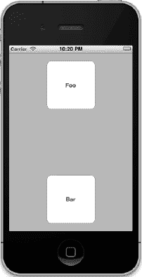

**图 5-13.** *启动时的 Swap 应用程序。这是竖屏视图及其两个按钮。*

旋转手机将切换到一个完全不同的视图，专门为横屏设计。横屏视图也将包含两个具有完全相同标签的按钮（见图 5-14），因此用户不会知道他们在看两个不同的视图。

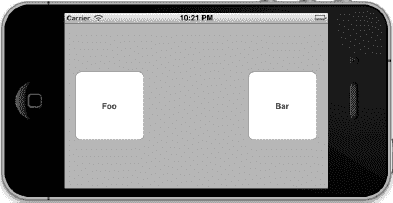

**图 5-14.** *相似但不同。这是横屏视图，有两个不同的按钮。*

当按钮被点击时，它会显示一个警报，标识哪个按钮被点击了。不过，我们不会像第 3 章那样从`sender`获取按钮的名称。我们将使用输出口集合来确定哪个按钮被点击了。


#### 设计两个视图

我们将在 nib 文件中需要两个视图。可以使用 Xcode 为我们创建的现有视图作为其中之一，但需要添加第二个视图。获取第二个视图最简单的方法是复制现有视图，然后进行必要的修改。

选择 `BIDViewController.xib` 在 Interface Builder 中编辑文件。在 nib 编辑器停靠栏中，应该有三个图标。底部的一个代表 Xcode 为我们创建的视图。按住键盘上的 option 键，然后点击并将该图标向下拖动。当你的图标上出现绿色加号时，表明你已经移动了足够距离以进行复制。松开鼠标按钮即可复制该视图。

单击新添加的视图，然后按下 `imagesz4` 打开属性检查器。在 *模拟指标* 标题下，寻找一个名为 *方向* 的弹出菜单。将其从 *竖屏* 改为 *横屏*。

我们需要在代码中能够访问这两个视图，以便在它们之间进行切换，因此需要一对输出口。确保打开了助理编辑器并显示 `BIDViewController.h`。从竖屏视图按住 Control 键拖拽到 `BIDViewController.h`，当系统提示时，创建一个名为 `portrait` 的输出口。确保在 *存储* 弹出菜单中指定为 `Strong`。对横屏视图执行相同操作，创建一个名为 `landscape` 的输出口。

下一步是拖入我们的按钮。前往对象库，拖出一对 *圆角矩形按钮* 放到我们的每个视图上。参考图 5–15 作为指导。点击每个按钮，使用尺寸检查器（**视图  实用工具  尺寸**）将 *宽度* 和 *高度* 属性改为 `125`。将每个按钮居中，并拖到视图边缘附近的蓝色辅助线上。双击每个按钮，将其标签改为 *Foo* 或 *Bar*。再次参考图 5–15 即可明确。

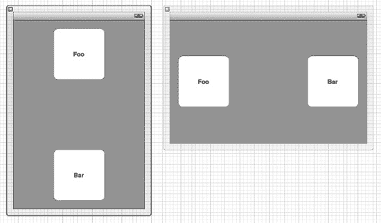

**图 5–15.** 我们在两个视图上各拖了两个按钮，在每个视图中将一个标记为 Foo，另一个标记为 Bar。

现在，让我们创建并连接按钮输出口。再次确保助理编辑器已打开并显示 `BIDViewController.h`。从横屏视图上的 *Foo* 按钮按住 Control 键拖拽到右侧的头文件。当系统提示时，将 *连接* 弹出菜单从 *输出口* 改为 *输出口集合*，并将其命名为 `foos`。接着，从竖屏视图上的 *Foo* 按钮拖拽并连接到现有的 `foos` 输出口连接。重申一遍，你首先从横屏视图的 *Foo* 按钮按住 Control 键拖拽创建了输出口集合，然后从另一个视图的 *Foo* 按钮按住 Control 键拖拽将其连接到同一个输出口集合。

对 *Bar* 按钮重复这些步骤。按住 Control 键从其中一个按钮拖拽创建一个名为 `bars` 的新输出口集合，然后从另一个 *Bar* 按钮按住 Control 键拖拽将其连接到同一个集合。

最后，我们需要创建一个动作方法，并将所有四个按钮连接到该方法。从横屏视图的 *Foo* 按钮按住 Control 键拖拽到 `BIDViewController.h`，当系统提示时，将连接类型从 *输出口* 改为 *动作*。将动作命名为 `buttonTapped:`。然后将其他三个按钮连接到该动作，并保存 nib 文件。

#### 实现切换

单击 `BIDViewController.m` 以打开视图控制器的实现文件进行编辑。首先，在文件顶部添加以下 C 宏：

```
#define degreesToRadians(x) (M_PI * (x) / 180.0)
```

这个宏允许我们在角度和弧度之间进行转换，我们将在代码中用到它来处理旋转视图的切换。向下滚动一点，在最后一个 `@synthesize` 调用之后添加以下方法。它看起来有点吓人，但别担心；你输入完成后我们会解释发生了什么。

```
- (void)willAnimateRotationToInterfaceOrientation:(UIInterfaceOrientation)
interfaceOrientation duration:(NSTimeInterval)duration {
    if (interfaceOrientation == UIInterfaceOrientationPortrait) {
        self.view = self.portrait;
        self.view.transform = CGAffineTransformIdentity;
        self.view.transform =
        CGAffineTransformMakeRotation(degreesToRadians(0));
self.view.bounds = CGRectMake(0.0, 0.0, 320.0, 460.0);
    }
    else if (interfaceOrientation == UIInterfaceOrientationLandscapeLeft) {
        self.view = self.landscape;
        self.view.transform = CGAffineTransformIdentity;
        self.view.transform =
        CGAffineTransformMakeRotation(degreesToRadians(-90));
        self.view.bounds = CGRectMake(0.0, 0.0, 480.0, 300.0);
    }
    else if (interfaceOrientation ==
             UIInterfaceOrientationLandscapeRight) {
        self.view = self.landscape;
        self.view.transform = CGAffineTransformIdentity;
        self.view.transform =
        CGAffineTransformMakeRotation(degreesToRadians(90));
        self.view.bounds = CGRectMake(0.0, 0.0, 480.0, 300.0);
    }
}
```

`willAnimateRotationToInterfaceOrientation:duration:` 方法实际上是我们重写的父类方法。这个方法在旋转开始但实际旋转发生之前被调用。我们在此方法中采取的动作将作为旋转动画的一部分被动画化。

在这个方法中，我们查看要旋转到的方向，并根据新方向将 `view` 属性设置为 `landscape` 或 `portrait`，以确保显示正确的视图。然后我们调用 `CGAffineTransformMakeRotation`（这是 Core Graphics 框架的一部分）来创建一个旋转变换。

变换是对对象大小、位置或角度变化的数学描述。通常情况下，iOS 会在设备旋转时自动设置变换值。然而，它只对视图层次结构中的视图进行处理，这意味着只有已经显示的视图才会被正确更新。

当我们在这里切换新视图时，我们切换进来的视图尚未被系统调整，因此我们需要确保给它正确的变换，使其正确显示。这就是 `willAnimateRotationToInterfaceOrientation:duration:` 每次设置视图的 `transform` 属性时所做的事情。视图旋转后，我们调整其 frame，使其在当前方向下舒适地适应窗口。

接下来，我们需要实现 `buttonTapped:` 方法。Xcode 已经为你创建了这个方法的存根实现。将以下粗体代码添加到现有方法中：

```
- (IBAction)buttonTapped:(id)sender {
NSString *message = nil;

    if ([self.foos containsObject:sender])
        message = @"Foo button pressed";
    else
        message = @"Bar button pressed";

    UIAlertView *alert = [[UIAlertView alloc] initWithTitle:message
                                                    message:nil
                                                   delegate:nil
                                          cancelButtonTitle:@"Ok"
                                          otherButtonTitles:nil];
    [alert show];
}
```

这里没什么太让人意外的。我们创建的指向按钮的输出口集合是标准的 `NSArray` 对象。要判断 `sender` 是否是 *Foo* 按钮之一，我们只需检查 `foos` 是否包含它。如果 `foos` 不包含，那么我们就知道它是 *Bar* 按钮。

现在，编译应用程序并运行它。


#### 更改插座集合

我们用于视图切换的应用程序显然只是一个相当简单的例子。在更复杂的用户界面中，你可能需要更改用户界面元素。在这种情况下，请确保你对竖屏和横屏版本都进行相同的更改。

让我们看看这具体是如何实现的。我们来更改一下 `buttonTapped:` 方法，使其在按钮被点击时，让该按钮消失。我们不能直接使用 `sender` 来实现，因为我们还需要隐藏另一种方向下对应的按钮。

将你现有的 `buttonTapped:` 实现替换为以下代码：

```
- (IBAction)buttonTapped:(id)sender {
    if ([self.foos containsObject:sender]) {
        for (UIButton *oneFoo in foos) {
            oneFoo.hidden = YES;
        }
    }
    else {
        for (UIButton *oneBar in bars) {
            oneBar.hidden = YES;
        }
    }
}
```

重新构建并运行应用程序，然后尝试一下。点击其中一个按钮，然后旋转到另一种方向。如果你点击了 *Foo* 按钮，那么在横屏或竖屏模式下都不应该看到 *Foo* 按钮。这是因为我们遍历了插座集合中的元素并将它们全部隐藏了。

**注意：** 如果你不小心点击了两个按钮，让它们重新出现的唯一方法是退出模拟器并重新运行项目。请不要在你自己的应用程序中使用这种方法。

### 旋转出此处

在本章中，你尝试了在应用程序中支持自动旋转的三种完全不同的方法。你了解了自动调整大小属性，以及如何在 iOS 设备旋转时通过代码重构视图。你看到了当设备旋转时如何在两个完全不同的视图之间进行切换。

此外，你通过在同一 Nib 文件中的两个视图之间进行切换，首次体验了在应用程序中使用多个视图。在下一章中，我们将开始研究真正的多视图应用程序。

到目前为止，我们编写的每一个应用程序都只使用了一个视图控制器，除了本章的最后一个示例外，都只使用了单个内容视图。许多复杂的 iOS 应用程序，例如“邮件”和“通讯录”，只有通过使用多个视图和视图控制器才能实现。我们将在第 6 章中详细研究其工作原理。

