# 第 6 章

## 多视图应用程序

到目前为止，我们编写的应用程序都只有一个视图控制器。虽然单个视图确实可以实现很多功能，但 iOS 平台的真正强大之处在于能够根据用户输入切换视图。多视图应用程序有几种不同的类型，但无论应用程序在屏幕上如何显示，其底层机制都是相同的。

在本章中，我们将通过从头构建我们自己的多视图应用程序，专注于多视图应用程序的结构以及切换内容视图的基础知识。我们将编写自己的自定义控制器类，用于在两个不同的内容视图之间切换，这将为你提供一个坚实的基础，以便利用 Apple 提供的各种多视图控制器。

但在开始构建应用程序之前，让我们先看看多视图应用程序有哪些用处。

### 常见的多视图应用程序类型

严格来说，我们在之前的应用程序中已经处理过多个视图，因为按钮、标签和其他控件都是 `UIView` 的子类，它们都可以进入视图层次结构。但是，当 Apple 在文档中使用术语*视图*时，通常指的是一个 `UIView` 或其子类，并且该视图具有相应的视图控制器。这类视图有时也被称为**内容视图**，因为它们是应用程序内容的主要容器。

多视图应用程序最简单的例子是实用工具应用程序。实用工具应用程序主要专注于单个视图，但提供第二个视图，用于配置应用程序或提供比主视图更详细的信息。iPhone 自带的“股票”应用程序就是一个很好的例子（参见图 6-1）。如果你点击右下角的小 *i* 图标，视图会翻转过来，让你配置应用程序跟踪的股票列表。

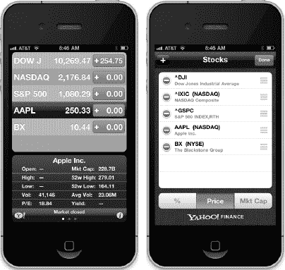

**图 6-1** *iPhone 自带的“股票”应用程序有两个视图：一个用于显示数据，另一个用于配置股票列表。*

iPhone 还自带了几款标签栏应用程序，例如“电话”应用程序（参见图 6-2）和“时钟”应用程序。标签栏应用程序是一种多视图应用程序，它在屏幕底部显示一行按钮，称为**标签栏**。点击其中一个按钮会导致一个新的视图控制器变为活动状态，并显示一个新视图。例如，在“电话”应用程序中，点击*通讯录*显示的视图与点击*拨号键盘*时显示的视图不同。

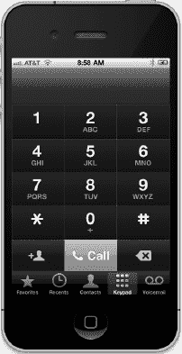

**图 6-2** *“电话”应用程序是使用标签栏的多视图应用程序的一个示例*

另一种常见的 iPhone 多视图应用程序是基于导航的应用程序，其特点是一个导航控制器，它使用**导航栏**来控制一系列层次化的视图。“设置”应用程序就是一个很好的例子。在“设置”中，你看到的第一个视图是一系列行，每一行对应一组设置或一个特定的应用程序。触摸其中一行会带你进入一个新视图，你可以在其中自定义特定的设置组。某些视图会显示一个列表，允许你深入更多层级。导航控制器会跟踪你进入的深度，并提供一个控件让你返回上一个视图。

例如，如果你选择*声音*偏好设置，你会看到一个包含声音相关选项列表的视图。在该视图的顶部有一个导航栏，带有一个左箭头，点击它可以返回上一个视图。在声音选项内，有一个标记为*铃声*的行。点击*铃声*，你将被带到一个新视图，其中包含一个铃声列表和一个导航栏，导航栏可以将你带回主*声音*偏好设置视图（参见图 6-3）。当你想要呈现一个视图层次结构时，基于导航的应用程序非常有用。

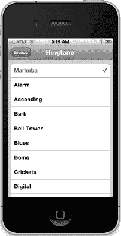

**图 6-3** *iPhone 的“设置”应用程序是使用导航栏的多视图应用程序的一个示例。*

在 iPad 上，大多数基于导航的应用程序，例如“邮件”，都是使用**拆分视图**实现的，其中导航元素出现在屏幕的左侧，而你选择要查看或编辑的项目则出现在右侧。你将在第 10 章中了解更多关于拆分视图和其他 iPad 特有 GUI 元素的信息。


由于视图本身在本质上是层级化的，甚至在单个应用程序中，也可能组合不同的机制来切换视图。例如，iPhone 的 iPod 应用程序使用标签栏来切换不同的音乐整理方式，并使用导航控制器及其关联的导航栏，让你能够基于所选分类浏览音乐。在图 6-4 中，屏幕底部是标签栏，屏幕顶部是导航栏。

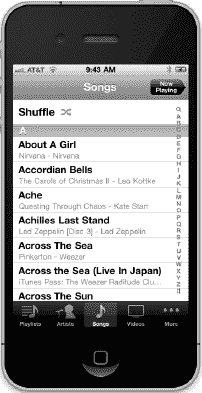

**图 6-4** *iPod 应用程序同时使用了导航栏和标签栏。*

有些应用程序会使用**工具栏**，它常与标签栏混淆。标签栏用于从两个或多个选项中只选择一个选项。工具栏可以包含按钮和其他某些控件，但这些项并不是互斥的。工具栏的一个完美例子是 Safari 主视图底部的工具栏（参见图 6-5）。如果你将 Safari 视图底部的工具栏与“电话”或 iPod 应用程序底部的标签栏进行比较，你会发现两者很容易区分。标签栏被划分为清晰定义的几个分段，而通常工具栏并非如此划分。

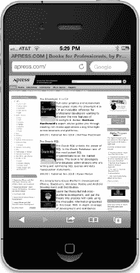

**图 6-5** *移动版 Safari 在底部有一个工具栏。工具栏像一个自由格式的栏，允许你包含各种控件。*

这些多视图应用程序类型各自使用了 UIKit 中的一个特定控制器类。标签栏界面使用 `UITabBarController` 类实现，导航界面使用 `UINavigationController` 实现。

### 多视图应用程序的架构

我们将在本章构建的应用程序 *View Switcher*，外观上相当简单，但就我们将要编写的代码而言，它是迄今为止我们处理过的最复杂的应用程序。*View Switcher* 将由三个不同的控制器、三个 nib 文件和一个应用程序委托组成。

首次启动时，*View Switcher* 将看起来像图 6-6，底部有一个工具栏，其中包含一个按钮。视图的其余部分将包含一个蓝色背景和一个渴望被按下的按钮。

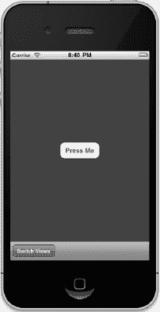

**图 6-6** *首次启动 View Switcher 应用程序时，你会看到一个包含一个按钮的蓝色视图，以及一个带有其自身按钮的工具栏。*

当按下 *Switch Views* 按钮时，背景将变为黄色，按钮的标题也会改变（参见图 6-7）。

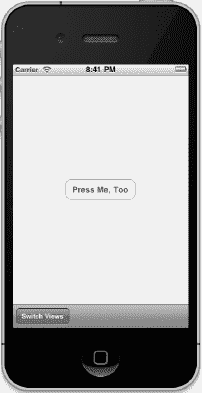

**图 6-7** *当你按下 Switch Views 按钮时，蓝色视图翻转为黄色视图。*

如果按下 *Press Me* 或 *Press Me, Too* 按钮，将会弹出一个警告，指示哪个视图的按钮被按下了（参见图 6-8）。

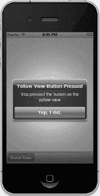

**图 6-8** *当按下 Press Me 或 Press Me, Too 按钮时，会显示一个警告。*

虽然我们可以通过编写一个单视图应用程序来实现相同的功能，但我们采用这种更复杂的方法是为了演示多视图应用程序的机制。在这个简单的应用程序中，实际上有三个视图控制器在交互：一个控制蓝色视图，一个控制黄色视图，以及第三个特殊控制器，当按下 *Switch Views* 按钮时，它会切换另外两个视图。

在开始构建我们的应用程序之前，让我们讨论一下 iPhone 多视图应用程序的构建方式。大多数多视图应用程序都使用相同的基本模式。

#### 根控制器

nib 文件在这里扮演着关键角色。对于我们的 *View Switcher* 应用程序，你会在项目窗口的 `Resources` 文件夹中找到 `MainWindow.xib` 文件。该文件包含了应用程序委托和应用程序的主窗口，以及 *File's Owner* 和 *First Responder* 图标。我们将添加一个控制器类的实例，它负责管理当前向用户显示的是哪个其他视图。我们称这个控制器为**根控制器**（就像“树根”或“万恶之源”一样），因为它是用户看到的第一个控制器，也是应用程序加载时被加载的控制器。这个根控制器通常是 `UINavigationController` 或 `UITabBarController` 的一个实例，尽管它也可以是 `UIViewController` 的一个自定义子类。

在多视图应用程序中，根控制器的工作是获取两个或更多其他视图，并根据用户的输入，以适当的方式将它们呈现给用户。例如，标签栏控制器会根据最后点击的标签栏项来切换不同的视图和视图控制器。导航控制器会在用户深入和返回层级数据时做同样的事情。

**注意：** 根控制器是应用程序的主要视图控制器，因此，它是决定是否允许自动旋转到新方向的视图。然而，根控制器可以将此类任务的职责传递给当前活动的控制器。

在多视图应用程序中，屏幕的大部分区域将被内容视图占据，每个内容视图都有其自己的控制器以及自己的输出口和操作。例如，在标签栏应用程序中，点击标签栏会传递给标签栏控制器，但点击屏幕上的其他任何地方则传递给与当前显示的内容视图相对应的控制器。

#### 内容视图的结构

在多视图应用程序中，每个视图控制器控制一个内容视图，而这些内容视图是构建应用程序用户界面的主要部分。每个内容视图通常由三部分组成：视图控制器、nib 文件和 `UIView` 的子类。除非你在做一些非常特殊的事情，否则你的内容视图通常会有一个关联的视图控制器，通常会有一个 nib 文件，并且有时会继承 `UIView`。虽然你可以用代码而不是 nib 文件来创建你的界面，但很少有人选择这种方式，因为它更耗时且代码难以维护。在本章中，我们将只为每个内容视图创建 nib 文件和控制器类。

在 *View Switcher* 项目中，我们的根控制器控制一个内容视图，该视图由一个占据屏幕底部的工具栏组成。然后，根控制器加载一个蓝色视图控制器，将蓝色内容视图作为子视图放置到根控制器视图中。当根控制器的 *Switch Views* 按钮（该按钮在工具栏中）被按下时，根控制器会移除蓝色视图控制器并换入黄色视图控制器，如果需要则会实例化该控制器。感到困惑吗？别担心，当我们逐步浏览代码时，这会变得清晰。

好的，作为一名高级文档工程师和翻译员，我将严格按照您提供的注意事项和示例，对给定的英文文本进行翻译。


### 构建视图切换器

理论说得够多了！让我们开始构建项目吧。选择 **文件  新建  新建项目…** 或按下 **N**。当模板选择面板打开时，选择 *空应用程序* (参见 图 6–9)，然后点击 *下一步*。在向导的下一页，输入 *View Switcher* 作为*产品名称*，保留 *BID* 作为*类前缀*，并将*设备系列*弹出按钮设置为 *iPhone*。同时确保名为*使用 Core Data 和包含单元测试*的复选框未被选中，而*使用自动引用计数*已被选中。点击 *下一步* 继续。在下一个屏幕上，导航到您想要保存项目的磁盘位置，然后点击 *创建* 按钮来创建一个新的项目目录。

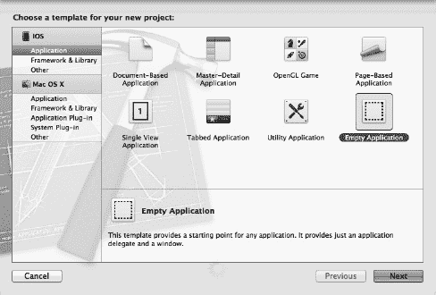

**图 6–9** *使用空应用程序项目模板创建一个新项目*

我们刚刚选择的模板实际上比我们一直使用的*单视图应用程序*模板更简单。这个模板只会给我们一个窗口和一个应用程序委托，除此之外什么都没有——没有视图，没有控制器，什么都没有。

**注意**：**window** 是 iOS 中最基本的容器。每个应用都恰好拥有一个属于自己的窗口，虽然屏幕上同时可以看到多个窗口。例如，如果你的应用程序正在运行，并且收到一条短消息服务（SMS）消息，你会看到该 SMS 消息显示在它自己的窗口中。你的应用无法访问那个叠加的窗口，因为它属于 SMS 应用。

在创建应用程序时，你不会经常使用*空应用程序*模板，但是通过从零开始构建我们的示例，你将真正体会到多视图应用程序是如何组合在一起的。

如果项目导航器中的 *View Switcher* 文件夹尚未展开，请花点时间将其展开，同时将其包含的 *Supporting Files* 文件夹也展开。在 *View Switcher* 文件夹内，你会找到实现应用程序委托的两个文件。在 *Supporting Files* 文件夹内，你会找到 `ViewSwitcher-Info.plist` 文件、`InfoPlist.strings` 文件（包含 *Info.plist* 文件的本地化版本）、标准的 `main.m` 以及预编译头文件（`View Switcher-Prefix.pch`）。我们应用程序所需的其他所有内容，都必须由我们自行创建。

#### 创建我们的视图控制器和 Nib 文件

从头开始构建多视图应用程序比较令人生畏的一个方面是，我们需要创建多个相互关联的对象。在 Interface Builder 中做任何事以及编写任何代码之前，我们将先创建构成应用程序的所有文件。通过先创建所有文件，我们将能够使用 Xcode 的“代码感知”功能来加快代码编写速度。如果类尚未声明，代码感知就无法知道它的存在，因此我们每次都需要完整地输入它的名称，这会花费更长时间，也更容易出错。

幸运的是，除了项目模板之外，Xcode 还为许多标准文件类型提供了文件模板，这有助于简化我们创建应用程序基本框架的过程。

在项目导航器中单击 *View Switcher* 文件夹，然后按下 **N** 或选择 **文件  新建  新建文件…**。查看打开的窗口 (参见 图 6–10)。

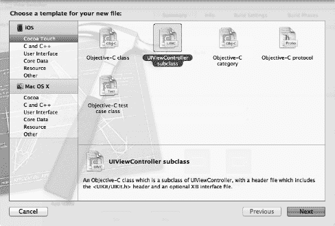

**图 6–10** *我们将用来创建新视图控制器子类的模板*

如果在左窗格中选择 *Cocoa Touch*，你将看到一系列常见 Cocoa Touch 类的模板。选择 *UIViewController 子类*并点击 *下一步*。在向导的下一页，你会看到一个文本框，可以在其中输入新类的名称。输入 `BIDSwitchViewController`，然后将注意力转向其他三个可用于配置子类的控件：

-   第一个是带有标签 *Subclass of* 的组合框，其可选项为 *UIViewController* 和 *UITableViewController*。例如，如果我们想要创建一个基于表格的布局，我们可能会将其更改为 *UITableViewController*。就我们的目的而言，*UIViewController* 就能满足我们的需求。
-   第二个是一个标签为 *Targeted for iPad* 的复选框。如果它默认被选中，你现在就应该取消选中它（因为我们不是要制作 iPad 的 GUI）。
-   第三个是另一个复选框，标签为 *With XIB for user interface*。如果该框已选中，也请取消选中它。如果保留该复选框的选中状态，Xcode 将会创建一个与此控制器类对应的 nib 文件。我们将在下一章开始使用该选项，但现在，我们希望你们通过单独创建各个部分，来了解整个拼图中不同部分是如何组合在一起的。

点击 *下一步*。会出现一个窗口，让你选择保存文件的特定目录，并为文件选择组和目标。默认情况下，此窗口会显示与你在项目导航器中所选文件夹最相关的目录。为了保持一致性，你应该将新类保存到 *View Switcher* 文件夹中，这个文件夹是你在创建此项目时 Xcode 设置的；它应该已经包含了 `BIDAppDelegate` 类。Xcode 将作为项目一部分创建的所有 Objective-C 类都放在这里，这里也是存放你自己类的最佳位置。

在窗口大约一半的位置，你会找到 *Group* 弹出列表。你需要将新文件添加到 *View Switcher* 组。最后，在点击 *保存* 按钮之前，确保 *Targets* 列表中选中了 *View Switcher* 目标。

Xcode 应该会将两个文件添加到你的 *View Switcher* 文件夹中：`BIDSwitchViewController.h` 和 `BIDSwitchViewController.m`。`BIDSwitchViewController` 将是你的根控制器——负责切换其他视图进出屏幕的控制器。现在，我们需要为将要被切换进出的两个内容视图创建控制器。再重复同样的步骤两次，创建 `BIDBlueViewController.m`、`BIDYellowViewController.m` 以及它们对应的 `*.h` 文件，并将它们添加到项目层次结构中的相同位置。

**注意：**请务必检查拼写，因为这里的拼写错误会导致创建的类与本章后面的源代码不匹配。

下一步，为我们刚刚创建的两个内容视图各创建一个 nib 文件。在项目导航器中单击 *View Switcher* 文件夹，然后再次按下 **N** 或选择 **文件  新建  新建文件…**。这次，在左窗格的 *iOS* 标题下选择 *用户界面* (参见 图 6–11)。接着，选择 *视图* 模板的图标，这将创建一个带有内容视图的 nib。然后点击 *下一步*。在下一个屏幕上，从 *设备家族* 弹出菜单中选择 *iPhone*，然后点击 *下一步* 按钮。

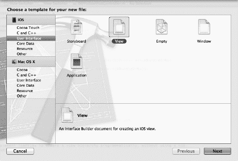

**图 6–11.** 我们正在创建一个新的 nib 文件，使用的是用户界面部分中的视图模板。

当提示输入文件名时，输入 `SwitchView.xib`。就像之前一样，你应该选择 *View Switcher* 文件夹作为保存位置。选中 *View Switcher* 后，确保从 *Group* 弹出菜单中选中了 *View Switcher*，并且 *View Switcher* 目标被勾选，然后点击 *保存*。当文件 `SwitchView.xib` 出现在项目导航器的 *View Switcher* 组中时，你就知道操作成功了。

现在重复这些步骤，创建第二个名为 `BlueView.xib` 的 nib 文件，然后再创建一次 `YellowView.xib`。完成所有这些之后，你就拥有了所需的所有文件。是时候开始将所有东西连接起来了。


#### 修改应用委托

多视图开发的第一站是应用委托。在项目导航器中单击文件`BIDAppDelegate.h`（确保是应用委托文件，而非`SwitchViewController.h`），然后对该文件进行以下修改：

```
#import <UIKit/UIKit.h>
@class BIDSwitchViewController;
@interface BIDAppDelegate : UIResponder<UIApplicationDelegate>

@property (strong, nonatomic) UIWindow *window;
@property (strong, nonatomic) BIDSwitchViewController
*switchViewController;
@end
```

你刚刚添加的`BIDSwitchViewController`声明是一个属性，它将指向我们应用的根控制器。之所以需要它，是因为我们即将编写代码，在应用启动时将根控制器的视图添加到应用的主窗口中。

现在，我们需要将根控制器的视图添加到应用的主窗口中。单击`BIDAppDelegate.m`，并添加以下代码：

```
#import "BIDAppDelegate.h"
#import "BIDSwitchViewController.h"
@implementation BIDAppDelegate

@synthesize window = _window;
@synthesize switchViewController;

- (BOOL)application:(UIApplication *)application
didFinishLaunchingWithOptions:(NSDictionary *)launchOptions
{
    self.window = [[UIWindow alloc] initWithFrame:[[UIScreen mainScreen] bounds]];
    // 应用启动后的自定义覆盖点
    self.switchViewController = [[BIDSwitchViewController alloc]
        initWithNibName:@"SwitchView" bundle:nil];
    UIView *switchView = self.switchViewController.view;
    CGRect switchViewFrame = switchView.frame;
    switchViewFrame.origin.y += [UIApplication
        sharedApplication].statusBarFrame.size.height;
    switchView.frame = switchViewFrame;
    [self.window addSubview:switchView];
    self.window.backgroundColor = [UIColor whiteColor];
    [self.window makeKeyAndVisible];
    return YES;
}

.
.
.

@end
```

除了合成`switchViewController`属性外，我们还创建了它的一个实例，并从`SwitchView.xib`加载了对应的视图。接下来，我们调整视图的几何属性，使其不会被状态栏遮挡。如果我们在处理包含视图的 nib 文件且视图已放置在窗口中，则无需进行此调整；但由于我们是完全从头创建整个视图层次结构，因此必须手动调整视图的框架，使其紧贴状态栏底部。

调整完视图后，将其添加到窗口中，从而有效地使`switchViewController`成为根控制器。请记住，窗口是与用户交互的唯一通道，因此任何需要显示给用户的内容都必须作为应用窗口的子视图添加。

如果你返回第 5 章的*Swap*项目，并检查`SwapAppDelegate.m`中的代码，你会发现模板已自动将视图控制器的视图添加到应用窗口中。由于我们在此项目中使用了更简单的模板，因此需要自行处理这些连接工作。

#### 修改`BIDSwitchViewController.h`

由于我们将在`SwitchView.xib`中设置`BIDSwitchViewController`实例，现在是时候向`BIDSwitchViewController.h`头文件中添加任何所需的插座变量（outlets）或动作方法（actions）了。

我们将需要一个动作方法来切换蓝色和黄色视图。我们不会创建任何插座变量，但需要另外两个指针：一个指向我们将要切换进来的每个视图控制器。这些不需要是插座变量，因为我们将在代码中创建它们，而不是在 nib 文件中。在`BIDSwitchViewController.h`中添加以下代码：

```
#import <UIKit/UIKit.h>

@class BIDYellowViewController;
@class BIDBlueViewController;

@interface BIDSwitchViewController : UIViewController

@property (strong, nonatomic) BIDYellowViewController *yellowViewController;
@property (strong, nonatomic) BIDBlueViewController *blueViewController;

-(IBAction)switchViews:(id)sender;

@end
```

既然我们已经声明了所需的动作，就可以在`SwitchView.xib`中设置这个控制器了。

#### 添加视图控制器

保存你的源代码，并单击`SwitchView.xib`来编辑该应用的核心图形用户界面（GUI）。nib 的停靠栏（dock）中会出现三个图标：*文件所有者*、*第一响应者*和*视图*（参见图 6–12）。

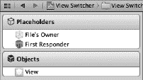

**图 6–12** *SwitchView.xib，停靠栏中显示了三个默认图标，分别代表文件所有者、第一响应者和视图*

默认情况下，*文件所有者*被配置为`NSObject`的一个实例。我们需要将其改为`BIDSwitchViewController`，以便 Interface Builder 允许我们建立与`BIDSwitchViewController`插座变量和动作的连接。单击 nib 停靠栏中的*文件所有者*图标，然后按下**3**打开身份检查器（参见图 6–13）。

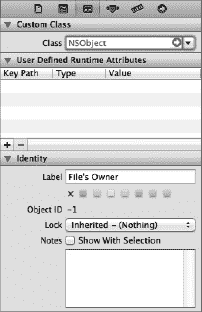

**图 6–13** *注意，在身份检查器中，文件所有者的类字段当前设置为 NSObject。我们即将将其改为 BIDSwitchViewController。*

身份检查器允许你指定当前选中对象的类。我们的*文件所有者*当前被指定为`NSObject`，并且没有定义任何动作。单击检查器顶部标签为*Class*的组合框（当前显示为*NSObject*），将*Class*改为*BIDSwitchViewController*。

完成此更改后，按下**6**切换到连接检查器，你将看到`switchViews:`动作方法现在出现在标有*接收到的动作*的部分中（参见图 6–14）。连接检查器的*接收到的动作*部分显示了为当前类定义的所有动作。当我们将*文件所有者*更改为`BIDSwitchViewController`时，`BIDSwitchViewController`的动作`switchViews:`便可用于连接。你将在下一节中看到我们如何使用这个动作。

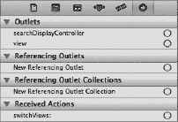

**图 6–14.** *连接检查器显示`switchViews:`动作已添加到接收到的动作部分*

**注意：** 如果你没有看到如图 6–14 所示的`switchViews:`动作，请检查你的类文件名拼写。如果名称不完全正确，将无法匹配。请注意拼写！

保存你的 nib 文件，然后进入下一步。


### 使用工具栏构建视图

现在我们需要构建一个视图，并将其添加到 `BIDSwitchViewController` 中。提醒一下，这个新的视图控制器将成为我们的根视图控制器——即应用程序启动时处于活动状态的控制器。`BIDSwitchViewController` 的内容视图将包含一个位于屏幕底部的工具栏。其作用是切换蓝色视图和黄色视图，因此需要为用户提供一种更改视图的方式。为此，我们将使用一个带按钮的工具栏。现在开始构建工具栏视图。

仍在 *SwitchView.xib* 中，在 nib 文件的 dock 区域，点击 *View* 图标使视图显示在编辑窗口（如果尚未显示）。这也会选中该视图。此视图是 `UIView` 的一个实例，如图 6-15 所示，目前它是空白的，略显单调。我们将从这里开始构建 GUI。

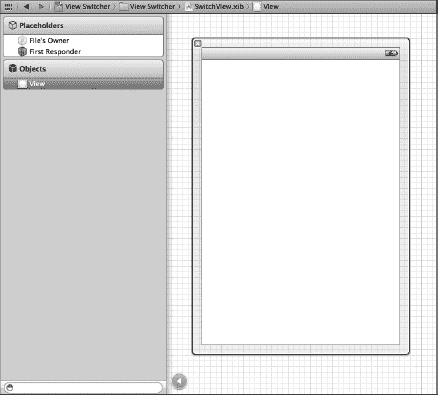

**图 6-15**   *nib 文件中包含的默认视图，正等待填充有趣的内容！*

现在，让我们在视图底部添加一个工具栏。从库中抓取一个 *Toolbar*，将其拖到您的视图上，并放置在底部，使其看起来像图 6-16 所示。

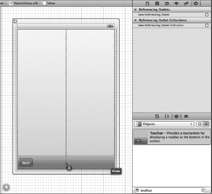

**图 6-16**  *我们将一个工具栏拖到了视图上。请注意，该工具栏包含一个按钮，标签为 Item。*

该工具栏包含一个按钮。我们将使用这个按钮让用户在不同的内容视图间切换。双击该按钮，将其标题改为 *Switch Views*。按回车键确认更改。

现在，我们可以将工具栏按钮连接到我们的操作方法。不过，在此之前，我们应该提醒您：工具栏按钮与其他 iOS 控件不同。它们只支持单一的目标动作，并且只在定义好的一个特定时刻触发该动作——相当于其他 iOS 控件中的“触摸内部弹起”事件。

在 Interface Builder 中选择工具栏按钮可能有点棘手。点击视图，以便我们统一从同一位置开始。然后，单击工具栏按钮。注意，这会选中工具栏，而不是按钮。再次单击按钮。这样应该就能选中按钮本身。您可以通过切换到对象属性检查器（`` **4**）并确保顶部的组名是 *Bar Button Item* 来确认您已选中按钮。

一旦选中了 *Switch Views* 按钮，按住 Control 键，从它拖到 *File's Owner* 图标上，然后选择 `switchViews:` 动作。如果没有弹出 `switchViews:` 动作，而是看到名为 `delegate` 的出口，那么您很可能是在从工具栏而不是按钮拖拽。要解决此问题，只需确保您选中的是按钮而不是工具栏，然后重新进行 Control 拖拽操作。

**提示：** 请记住，您始终可以以列表模式查看 nib 的 dock，并使用展开三角形来深入层次结构，以访问视图层次结构中的任何元素。

在这个 nib 文件中，我们还有一件事要做：将 `BIDSwitchViewController` 的 `view` 出口连接到 nib 文件中的视图。`view` 出口继承自父类 `UIViewController`，使控制器能够访问它所控制的视图。当我们更改文件所有者的底层类时，现有的出口连接被断开了。因此，我们需要重新建立从控制器到其视图的连接。按住 Control 键，从 *File's Owner* 图标拖到 *View 图标*，然后选择 `view` 出口来完成连接。

这就是我们需要在此处完成的所有操作，因此请保存您的 nib 文件。接下来，让我们开始实现 `BIDSwitchViewController`。

### 编写根视图控制器

是时候编写我们的根视图控制器了。它的作用是在用户点击 *Switch Views* 按钮时，在蓝色视图和黄色视图之间进行切换。

在 `BIDSwitchViewController.m` 中，首先取消 `viewDidLoad` 方法周围的注释。稍后我们将替换该方法。如果您想缩短代码，可以删除模板提供的其余被注释掉的方法。

首先，在文件顶部添加以下代码：

```
#import "BIDSwitchViewController.h"
#import "BIDYellowViewController.h"
#import "BIDBlueViewController.h"

@implementation BIDSwitchViewController
@synthesize yellowViewController;
@synthesize blueViewController;
.
.
.
```

接下来，用以下版本替换 `viewDidLoad`：

```
- (void)viewDidLoad
{
    self.blueViewController = [[BIDBlueViewController alloc]
                  initWithNibName:@"BlueView" bundle:nil];
    [self.view insertSubview:self.blueViewController.view atIndex:0];
    [super viewDidLoad];
}
```

现在，添加 `switchViews:` 方法：

```
- (IBAction)switchViews:(id)sender{
    if (self.yellowViewController.view.superview == nil){
        if (self.yellowViewController == nil){
            self.yellowViewController =
            [[BIDYellowViewController alloc] initWithNibName:@"YellowView"
                                                   bundle:nil];
        }
        [blueViewController.view removeFromSuperview];
        [self.view insertSubview:self.yellowViewController.view atIndex:0];
    }else{
        if (self.blueViewController == nil){
            self.blueViewController =
            [[BIDBlueViewController alloc] initWithNibName:@"BlueView"
                                                 bundle:nil];
        }
        [yellowViewController.view removeFromSuperview];
        [self.view insertSubview:self.blueViewController.view atIndex:0];
    }
}
.
.
.
```

另外，将以下代码添加到现有的 `didReceiveMemoryWarning` 方法中：

```
- (void)didReceiveMemoryWarning {
    // Releases the view if it doesn't have a superview
    [super didReceiveMemoryWarning];

    // Release any cached data, images, etc, that aren't in use
    if (self.blueViewController.view.superview == nil) {
        self.blueViewController = nil;
    } else {
        self.yellowViewController = nil;
    }
}
```

我们修改的第一个方法 `viewDidLoad`，重写了在 nib 加载时调用的一个 `UIViewController` 方法。我们如何能知道？按住 Option 键并单击方法名 `viewDidLoad`。将出现一个文档弹出窗口（参见图 6-17）。或者，您可以选择 **View  Utilities  Show Quick Help Inspector** 来在“快速帮助”面板中查看类似信息。`viewDidLoad` 在我们的超类 `UIViewController` 中定义，旨在被那些需要在视图加载完成时收到通知的类所重写。

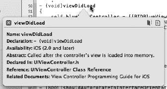

**图 6-17**  *当您 Option-单击 viewDidLoad 方法名时出现的此文档窗口。*

此版本的 `viewDidLoad` 创建了一个 `BIDBlueViewController` 的实例。我们使用 `initWithNibName:bundle:` 方法从 nib 文件 *BlueView.xib* 加载 `BIDBlueViewController` 实例。请注意，提供给 `initWithNibName:bundle:` 的文件名不包含 *.xib* 扩展名。创建 `BIDBlueViewController` 后，我们将此新实例分配给我们的 `blueViewController` 属性。

```
    self.blueViewController = [[BIDBlueViewController alloc]
          initWithNibName:@"BlueView" bundle:nil];
```


接下来，我们将蓝色视图作为根视图的子视图插入。我们将其插入到索引 0 的位置，这会告诉 iOS 将该视图置于所有其他视图的后方。将视图置于底层可确保我们刚才在 Interface Builder 中创建的工具栏始终显示在屏幕上，因为我们将内容视图插入到了它的后方。

```
[self.view insertSubview:self.blueViewController.view atIndex:0];
```

那么，为什么我们不同时加载黄色视图呢？我们迟早需要加载它，既然如此为什么不现在就加载呢？问得好。答案是用户可能永远不会点击*切换视图*按钮。用户可能只使用应用启动时显示的视图，然后就退出了。在这种情况下，为什么要耗费资源去加载黄色视图及其控制器呢？

相反，我们只在第一次真正需要黄色视图时才会加载它。这被称为懒加载，是降低内存开销的一种标准做法。黄色视图的实际加载发生在`switchViews:`方法中，让我们来看一下这部分代码。

`switchViews:`首先通过检查`yellowViewController`的`view`属性的父视图是否为`nil`，来判断当前正在交换的是哪个视图。如果以下两种情况之一成立，该表达式将返回`true`：

*   如果`yellowViewController`存在，但其视图未显示给用户，则该视图没有父视图（因为它当前不在视图层次结构中），表达式将计算为`true`。
*   如果`yellowViewController`不存在（因为尚未创建或已从内存中清除），表达式也将返回`true`。

接着，我们会检查`yellowViewController`是否为`nil`。

```
if (self.yellowViewController.view.superview == nil){
```

如果它为`nil`，意味着没有`yellowViewController`的实例，我们需要创建一个。这可能是因为用户第一次按下按钮，或者系统内存不足导致该实例被清除。在这种情况下，我们需要像在`viewDidLoad`方法中创建`BIDBlueViewController`那样，创建一个`BIDYellowViewController`的实例：

```
if (self.yellowViewController == nil){
    self.yellowViewController =
    [[BIDYellowViewController alloc] initWithNibName:@"YellowView"
                                              bundle:nil];
}
```

至此，我们确定已经有了一个`yellowViewController`实例，因为我们要么之前已经拥有，要么刚刚创建了它。然后，我们将`blueViewController`的视图从视图层次结构中移除，并添加`yellowViewController`的视图：

```
[blueViewController.view removeFromSuperview];
[self.view insertSubview:self.yellowViewController.view atIndex:0];
```

如果`self.yellowViewController.view.superview`不为`nil`，那么我们需要对`blueViewController`执行同样的操作。虽然我们在`viewDidLoad`中创建了`BIDBlueViewController`的实例，但由于内存不足，该实例仍有可能被清除。在此应用中，内存耗尽的可能性较小，但我们仍要做一个良好的内存使用者，确保在继续操作前拥有一个实例：

```
} else{
    if (self.blueViewController == nil){
        self.blueViewController =
        [[BIDBlueViewController alloc] initWithNibName:@"BlueView"
                                                bundle:nil];
    }
    [yellowViewController.view removeFromSuperview];
    [self.view insertSubview:self.blueViewController.view atIndex:0];
}
```

除了在用户从不点击*切换视图*按钮时避免为黄色视图和控制器占用资源外，懒加载还使我们能够释放当前未显示的视图，从而释放其内存。当内存低于系统设定的阈值时，iOS 会调用每个视图控制器继承自`UIViewController`的`didReceiveMemoryWarning`方法。

由于我们知道任意一个视图在下次显示给用户时都会被重新加载，因此我们可以安全地释放任意一个控制器。我们通过在现有的`didReceiveMemoryWarning`方法中添加几行代码来实现这一点：

```
- (void)didReceiveMemoryWarning {
    [super didReceiveMemoryWarning]; // 如果视图没有父视图，则释放该视图
    // 释放任何非必要的内容，例如缓存数据
    if (self.blueViewController.view.superview == nil)
        self.blueViewController = nil;
    else
        self.yellowViewController = nil;
}
```

这段新增的代码会检查当前正在显示的是哪个视图，并通过将另一个视图的控制器的属性赋值为`nil`来释放该控制器。这将导致控制器及其所控制的视图被释放，从而释放其内存。

**提示：** 懒加载是 iOS 资源管理的关键组成部分，你应在任何可能的地方实现它。在一个复杂的多视图应用中，负责任地管理并清除内存中未使用的对象，是决定一个应用运行良好还是因内存耗尽而周期性崩溃的关键。


### 实现内容视图

我们在此应用中创建的两个内容视图极其简单。每个视图都有一个由按钮触发的操作方法，并且两者都不需要任何输出口。这两个视图也几乎完全相同。事实上，它们如此相似，以至于本可以由同一个类来表示。我们选择将它们做成两个独立的类，是因为大多数多视图应用都是这样构建的。

让我们在每个头文件中声明一个操作方法。首先，在`BIDBlueViewController.h`中添加以下声明：

```
#import <UIKit/UIKit.h>
@interface BIDBlueViewController : UIViewController
- (IBAction)blueButtonPressed;
@end
```

保存该文件。然后，将以下行添加到`BIDYellowViewController.h`中：

```
#import <UIKit/UIKit.h>
@interface BIDYellowViewController : UIViewController
- (IBAction)yellowButtonPressed;
@end
```

也保存此文件。

接下来，选择`BlueView.xib`在 Interface Builder 中打开，以便我们进行一些修改。首先，我们需要指定从文件系统加载此 nib 的类是`BIDBlueViewController`。单击*File's Owner*图标，然后按3 调出身份检查器。*File's Owner*默认为`NSObject`；将其改为`BIDBlueViewController`。

单击停靠栏中的*View*图标，然后按**4**调出对象属性检查器。在检查器的*View*部分，单击标记为*Background*的颜色井，并使用弹出颜色选择器将此视图的背景颜色更改为漂亮的蓝色。对蓝色满意后，关闭颜色选择器。

接下来，我们将在 nib 中更改视图的大小。在对象属性检查器中，顶部区域标记为*Simulated Metrics*（参见图 6–18）。如果我们设置这些下拉菜单以反映应用中使用了哪些顶部和底部元素，Interface Builder 将自动计算剩余空间的大小。

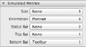

**图 6–18** *视图属性检查器中的 Simulated Metrics 部分*

状态栏已经指定，但这里有一个棘手的地方：由于此视图将包含在我们在`SwitchView.xib`中创建的视图内部，我们实际上不应指定状态栏，因为这样做会将我们的内容在包含视图内稍微移动。因此，单击*Status Bar*弹出按钮，然后单击*None*。接下来，选择*Bottom Bar*弹出菜单并选择*Toolbar*，以指示包含视图有一个工具栏。

这些设置将导致 Interface Builder 自动计算我们视图的正确大小，这样我们就知道有多少空间可用。您可以按**5**调出大小检查器来确认这一点。更改后，窗口的高度应为 436 像素，宽度仍为 320 像素。

从库中拖出一个*Round Rect Button*到视图上，使用对齐参考线将按钮在视图中水平和垂直居中。双击按钮，将其标题更改为*Press Me*。接下来，在按钮仍处于选中状态时，切换到连接检查器（按`6`），从*Touch Up Inside*事件拖到*File's Owner*图标，并连接到`blueButtonPressed`操作方法。

我们在这个 nib 中还有一件事要做，即连接`BIDBlueViewController`的`view`输出口到 nib 中的视图，就像之前在`SwitchView.xib`中所做的那样。按住 Control 键从*File's Owner*图标拖到*View 图标*，然后选择*view*输出口。

保存 nib，然后前往项目导航器并单击`YellowView.xib`。我们将对这个 nib 文件进行几乎完全相同的更改。

首先，单击停靠栏中的*File's Owner*图标，并使用身份检查器将其类改为`BIDYellowViewController`。

接下来，选择视图并切换到对象属性检查器。在那里，单击*Background*颜色井并选择亮黄色，然后关闭颜色选择器。此外，在*Simulated Metrics*部分，从*Bottom Bar*弹出菜单中选择*Toolbar*，并将*Status Bar*弹出菜单切换为*None*。

接下来，从库中拖出一个*Round Rect Button*，并使用对齐参考线将其在视图中居中。然后将其标题改为*Press Me, Too*。在按钮仍处于选中状态时，使用连接检查器从*Touch Up Inside*事件拖到*File's Owner*图标，并连接到`yellowButtonPressed`操作方法。

最后，按住 Control 键从*File's Owner*图标拖到*View 图标*，并选择*view*输出口。

完成后，保存 nib，并准备输入更多代码。

我们将实现的两个操作方法除了显示一个警告（如第 4 章的 Control Fun 应用中所做的那样）之外，不做其他任何事情。因此，继续向`BIDBlueViewController.m`中添加以下代码：

```
#import "BIDBlueViewController.h"
@implementation BIDBlueViewController
- (IBAction)blueButtonPressed{
    UIAlertView *alert = [[UIAlertView alloc]
        initWithTitle:@"Blue View Button Pressed"
              message:@"You pressed the button on the blue view"
             delegate:nil
    cancelButtonTitle:@"Yep, I did."
    otherButtonTitles:nil];
    [alert show];
}
...
```

保存该文件。接下来，切换到`BIDYellowViewController.m`，并将这段非常相似的代码添加到该文件中：

```
#import "BIDYellowViewController.h"
@implementation BIDYellowViewController
- (IBAction)yellowButtonPressed{
    UIAlertView *alert = [[UIAlertView alloc]
        initWithTitle:@"Yellow View Button Pressed"
              message:@"You pressed the button on the yellow view"
             delegate:nil
    cancelButtonTitle:@"Yep, I did."
    otherButtonTitles:nil];
    [alert show];
}
...
```

保存代码，然后让我们运行这个应用。如果应用在启动时或切换视图时崩溃，请返回并确保连接了所有三个`view`输出口。

当我们的应用启动时，它会显示我们在`BlueView.xib`中构建的视图。当您点击*Switch Views*按钮时，它会切换显示我们在`YellowView.xib`中构建的视图。再次点击它，则会回到`BlueView.xib`中的视图。如果您点击蓝色或黄色视图上居中的按钮，您将看到一个带有消息的警告视图，指示哪个按钮被按下。此警告表明正在为显示的视图调用正确的控制器类。

不过，两个视图之间的过渡有点突兀。天哪，要是有什么方法能让过渡看起来更美观就好了。

当然，有一种方法可以让过渡看起来更美观！我们可以为过渡添加动画效果，以便给用户提供视觉上的变化反馈。


### 动画转场

`UIView` 提供了几个类方法，我们可以调用它们来指示视图之间的转场应带有动画效果，指定应使用的转场类型，以及设定转场持续的时间。

回到 `BIDSwitchViewController.m`，将你的 `switchViews:` 方法替换为以下新版本：

```
- (IBAction)switchViews:(id)sender{
    [UIView beginAnimations:@"视图翻转" context:nil];
    [UIView setAnimationDuration:1.25];
    [UIView setAnimationCurve:UIViewAnimationCurveEaseInOut];

    if (self.yellowViewController.view.superview == nil) {
        if (self.yellowViewController == nil) {
            self.yellowViewController =
            [[BIDYellowViewController alloc] initWithNibName:@"YellowView"
                                                   bundle:nil];
        }
        [UIView setAnimationTransition:
         UIViewAnimationTransitionFlipFromRight
                               forView:self.view cache:YES];

        [self.blueViewController.view removeFromSuperview];
        [self.view insertSubview:self.yellowViewController.view atIndex:0];
    } else {
        if (self.blueViewController == nil) {
            self.blueViewController =
            [[BIDBlueViewController alloc] initWithNibName:@"BlueView"
                                                 bundle:nil];
        }
        [UIView setAnimationTransition:
         UIViewAnimationTransitionFlipFromLeft
                               forView:self.view cache:YES];

        [self.yellowViewController.view removeFromSuperview];
        [self.view insertSubview:self.blueViewController.view atIndex:0];
    }
    [UIView commitAnimations];
}
```

编译这个新版本并运行你的应用。当你点击*切换视图*按钮时，新视图不会直接突兀地出现，而是旧视图翻转过来展示新视图，如图 6–19 所示。

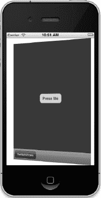

**图 6–19** *使用翻转动画样式从一个视图转场到另一个视图*

为了告诉 iOS 我们希望某个变化带有动画，我们需要声明一个**动画块**并指定动画持续的时间。动画块通过使用 `UIView` 的类方法 `beginAnimations:context:` 来声明，示例如下：

```
    [UIView beginAnimations:@"视图翻转" context:NULL];
    [UIView setAnimationDuration:1.25];
```

`beginAnimations:context:` 接受两个参数。第一个是动画块的标题。只有在你更直接地利用 Core Animation（这个动画背后的框架）时，这个标题才会发挥作用。就我们的目的而言，使用 `nil` 也可以。第二个参数是一个 `(void *)` 类型，允许你指定一个对象（或任何其他 C 数据类型），其指针可以与此动画块关联。这里我们使用了 `NULL`，因为我们不需要这样做。

之后，我们设置**动画曲线**，它决定了动画的时间节奏。默认是线性曲线，导致动画以恒定速度进行。我们在此设置的选项 `UIViewAnimationCurveEaseInOut` 指定动画应开始缓慢，中间加速，最后再减速。这使动画看起来更自然，不那么机械。

```
    [UIView setAnimationCurve:UIViewAnimationCurveEaseInOut];
```

接下来，我们需要指定要使用的转场效果。在撰写本文时，有四种 iOS 视图转场可用：

- `UIViewAnimationTransitionFlipFromLeft`
- `UIViewAnimationTransitionFlipFromRight`
- `UIViewAnimationTransitionCurlUp`
- `UIViewAnimationTransitionCurlDown`

我们根据切换的是哪个视图选择了两种不同的效果。对一个转场使用向左翻转，对另一个使用向右翻转，让视图看起来像是在来回翻转。

`cache` 选项通过在动画开始时对视图进行快照并使用该图像，而不是在动画的每一步都重新绘制视图，从而加快绘制速度。除非视图的外观可能在动画过程中需要改变，否则你应该始终缓存动画。

```
    [UIView setAnimationTransition:UIViewAnimationTransitionFlipFromRight
                       forView:self.view cache:YES];
```

然后，我们从控制器的视图中移除当前显示的视图，并添加另一个视图。

当我们完成对要动画化的变化的指定后，我们对 `UIView` 调用 `commitAnimations`。动画块开始到调用 `commitAnimations` 之间的所有内容将一起进行动画处理。

得益于 Cocoa Touch 在底层使用了 Core Animation，我们只需少量代码就能实现相当复杂的动画。

### 切换结束

哇哦！自己创建多视图控制器费了不少功夫，对吧？现在你已经从头构建了一个，应该对多视图应用是如何组合的有很好的理解了。

尽管 Xcode 包含了最常见的多视图应用的项目模板，但你仍需要理解这类应用的总体结构，以便能自己从零开始构建它们。提供的模板能节省大量时间，但有时它们就是无法满足你的需求。

在接下来的几章中，我们将继续构建多视图应用，以巩固本章的概念，并让你体会更复杂的应用是如何构建的。在第 7 章中，我们将构建一个标签栏应用。让我们开始吧！

