# 第 7 章

## 标签栏与选择器

在上一章中，你构建了第一个多视图应用。在本章中，你将构建一个完整的标签栏应用，包含五个不同的标签和五个不同的内容视图。构建这个应用将巩固你在第 6 章中学到的许多内容。不过，你如今已经足够聪明，不会花一整章去做你已经大致知道怎么做的事情，所以我们将利用这五个内容视图来演示一种我们尚未介绍过的 iOS 控件。这种控件称为**选择器视图**，或者简称为**选择器**。

你可能对这个名称不熟悉，但如果你拥有 iPhone 或 iPod touch 超过 10 分钟，几乎肯定使用过选择器。选择器是带有可旋转拨盘的控件。你在日历应用中用它输入日期，在时钟应用中用它设定计时器（见图 7–1）。在 iPad 上，选择器视图并不那么常见，因为更大的显示屏允许你以其他方式从多个项目中进行选择，但即便如此，它在日历应用中也有使用。

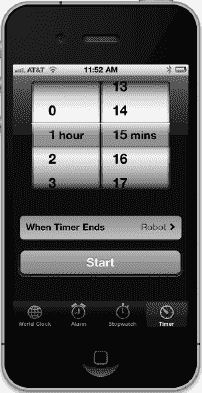

**图 7–1.** *时钟应用中的选择器*

选择器比你到目前为止见过的 iOS 控件要复杂一些，因此值得更多关注。选择器可以配置为显示一个拨盘或多个拨盘。默认情况下，选择器显示文本列表，但也可以设置为显示图片。


### Pickers 应用

本章的应用 `Pickers` 将包含一个标签栏。在构建 `Pickers` 的过程中，你会将默认的标签栏修改为包含五个标签，为每个标签项添加图标，然后创建一系列内容视图并将每个视图连接到一个标签。该应用的内容视图将展示五种不同的选择器：

*   **日期选择器**：我们将构建的第一个内容视图将包含一个日期选择器，这是最容易实现的选择器类型（见图 7-2）。该视图还将包含一个按钮，点击该按钮将弹出一个显示所选日期的提示框。

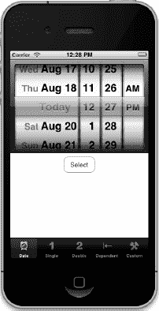

**图 7-2.** *第一个标签将显示一个日期选择器。*

*   **单列选择器**：第二个标签将包含一个显示单一值列表的选择器（见图 7-3）。这种选择器比日期选择器实现起来稍复杂一些。你将学习如何通过使用委托和数据源来指定选择器中显示的值。

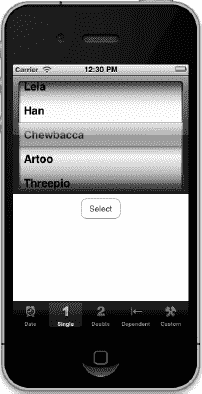

**图 7-3.** *一个显示单一值列表的选择器*

*   **多列选择器**：在第三个标签中，我们将创建一个包含两个独立滚轮的选择器。每个滚轮的技术术语是选择器组件（component），因此这里我们创建的是一个包含两个组件的选择器。你将看到如何使用数据源和委托为选择器提供两个独立的数据列表（见图 7-4）。此选择器的每个组件都可以独立更改，互不影响。

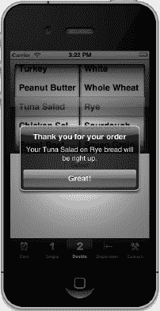

**图 7-4.** *一个双组件选择器，显示一个反映我们选择的提示框*

*   **含依赖组件的选择器**：在第四个内容视图中，我们将构建另一个包含两个组件的选择器。但这次，右侧组件中显示的值将根据左侧组件中所选的值而变化。在我们的示例中，左侧组件将显示一个州列表，右侧组件将显示该州的邮政编码列表（见图 7-5）。

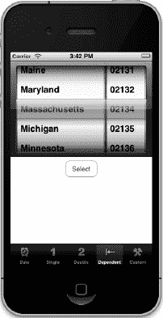

**图 7-5.** *在此选择器中，一个组件依赖于另一个组件。当你在左侧组件中选择一个州时，右侧组件会变为该州的邮政编码列表。*

*   **带图像的自定义选择器**：最后但同样重要的是，我们将在第五个内容视图中找点乐子。我们将演示如何向选择器添加图像数据，具体做法是编写一个小游戏，该游戏使用一个包含五个组件的选择器。在苹果文档的多个地方，选择器的外观被描述为有点像老虎机。那么，还有什么比编写一个老虎机小游戏更合适的呢（见图 7-6）？对于这个选择器，用户无法手动更改组件的值，但可以选择*旋转*按钮，使五个滚轮旋转到新的随机值。如果同一图像的三个副本连续出现，用户就获胜了。

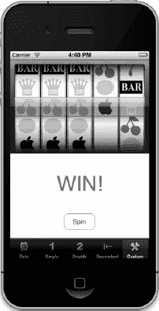

**图 7-6.** *我们的第五个组件选择器。请注意，我们不赞成将你的 iPhone 当作迷你赌场使用。*

### 委托和数据源

在我们深入并开始构建应用之前，先来看看是什么让选择器比你目前使用过的其他控件更复杂。除了日期选择器之外，你不能仅仅通过从对象库中拖拽一个选择器、将其放置到内容视图上并进行配置来使用它。你还需要为每个选择器提供一个选择器委托和一个选择器数据源。

到目前为止，你应该已经熟悉委托的使用了。我们已经使用过应用委托和操作表委托，这里的基本思想是相同的。选择器将若干工作委托给它的委托。其中最重要的是确定在每个组件的每一行中实际绘制什么内容的任务。选择器要求委托提供一个字符串或一个视图，该视图将绘制在给定组件的指定位置上。选择器从委托那里获取其数据。

除了委托之外，选择器还需要有一个数据源。在这里，*数据源*这个名称有点用词不当。数据源告诉选择器它将处理多少个组件，以及每个组件由多少行组成。数据源的工作方式与委托类似，其方法会在某些预定的时间被调用。没有数据源和委托，选择器就无法完成工作；事实上，它们甚至不会被绘制出来。

数据源和委托通常是同一个对象，同样常见的是，该对象是选择器所在视图的视图控制器，这也是我们在本应用中采用的方法。我们应用中每个内容面板的视图控制器将成为其选择器的数据源和委托。

 **注意：** 来个小测验：选择器数据源是属于应用程序的模型、视图还是控制器部分？这是一个陷阱题。数据源听起来像是必须属于模型的一部分，但实际上，它属于控制器。数据源通常不是一个设计用来保存数据的对象。在简单的应用程序中，数据源可能保存数据，但其真正的工作是从模型中检索数据并将其传递给选择器。

让我们启动 Xcode 开始吧。

### 设置标签栏框架

尽管 Xcode 确实为标签栏应用提供了一个模板，但我们打算从头开始构建。这并不会多花太多功夫，而且是一次很好的练习。创建一个新项目，再次选择*空应用程序*模板，然后选择*下一步*进入下一个屏幕。在*产品名称*字段中，输入 *Pickers*。确保*使用 Core Data*复选框未选中，并将*设备系列*弹出菜单设置为 *iPhone*。然后再次选择*下一步*，Xcode 将允许你选择保存项目的文件夹。

我们将带领你完成构建整个应用的过程，但在过程中的任何一步，如果你觉得可以挑战自己，超越我们的进度，请尽管去做。如果你遇到困难，随时可以回来。如果你不想跳过，那也没关系。我们很享受有你的陪伴。


#### 创建文件

在上一章中，我们创建了一个根视图控制器（简称根控制器）来管理应用其他视图的切换过程。这一次我们将再次执行此操作，但无需自行创建根视图控制器类。苹果提供了一个非常出色的类来管理标签栏视图，因此我们只需使用一个 `UITabBarController` 实例作为根控制器。

首先，我们需要在 Xcode 中创建五个新类：即根控制器将切换的五个视图控制器。

展开项目导航器中的 *Pickers* 文件夹，你会看到 Xcode 为启动项目而创建的源代码文件。单击 *Pickers* 文件夹，按下 **N** 或选择 **File**  **New**  **New File…**。

在新文件助手的左窗格中选择 *Cocoa Touch*，然后选择 *UIViewController subclass* 图标，并点击 *Next* 继续。下一界面让你为新类命名，在 *Class* 字段中输入 *BIDDatePickerViewController*。与往常一样，命名新类文件时要仔细检查拼写，此处拼写错误将导致新类名称不正确。你还会看到一个控件，用于选择或输入新类的父类，请保持为 *UIViewController*。在该控件下方，有一个标有 *With XIB for user interface* 的复选框（见图 7–7）。在点击 *Next* 之前，请确保该复选框已选中（且仅选中此项；*Targeted for iPad* 选项应保持未选中状态）。

最后，系统会显示一个文件夹选择窗口，让你选择类的保存位置。选择 *Pickers* 目录，其中已包含 `BIDAppDelegate` 类及其他几个文件。同时确保 *Group* 弹出菜单选择了 *Pickers* 文件夹，并且 *Pickers* 的目标复选框已勾选。

点击 *Create* 按钮后，*Pickers* 文件夹中会出现三个新文件：`BIDDatePickerViewController.h`、`BIDDatePickerViewController.m` 和 `BIDDatePickerViewController.xib`。

重复上述步骤四次，依次使用名称 `BIDSingleComponentPickerViewController`、`BIDDoubleComponentPickerViewController`、`BIDDependentComponentPickerViewController` 和 `BIDCustomPickerViewController`。每次创建新文件时，务必在项目导航器中选中 *Pickers* 文件夹，以便新创建的文件整齐地归集在一起。

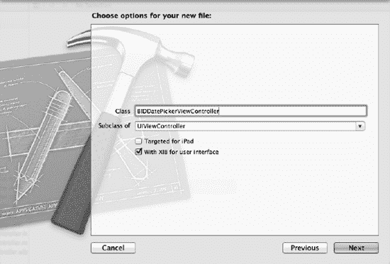

**图 7–7.** *创建 UIViewController 子类时，若勾选 With XIB for user interface 复选框，Xcode 将自动为你生成对应的 .xib 文件。*

#### 添加根视图控制器

我们将在 Interface Builder 中创建根视图控制器，它将是一个 `UITabBarController` 实例。但在此之前，我们需要为其声明一个输出口。单击 `BIDAppDelegate.h`，并添加以下代码：

```
#import <UIKit/UIKit.h>

@interface BIDAppDelegate : UIResponder<UIApplicationDelegate>

@property (strong, nonatomic) IBOutlet UIWindow *window;
@property (strong, nonatomic) IBOutlet UITabBarController *rootController;

@end
```

在进入 Interface Builder 创建根视图控制器之前，我们先在 `BIDAppDelegate.m` 中添加以下代码：

```
#import "BIDAppDelegate.h"

@implementation BIDAppDelegate

@synthesize window = _window;
@synthesize rootController;

- (BOOL)application:(UIApplication *)application
    didFinishLaunchingWithOptions:(NSDictionary *)launchOptions
{
    self.window = [[UIWindow alloc] initWithFrame:[[UIScreen mainScreen] bounds]];
    // 应用启动后的自定义覆盖点
    [[NSBundle mainBundle] loadNibNamed:@"TabBarController" owner:self options:nil];
    [self.window addSubview:rootController.view];
    self.window.backgroundColor = [UIColor whiteColor];
    [self.window makeKeyAndVisible];
    return YES;
}

@end
```

这段代码对你来说应该不难理解。我们执行的操作与上一章基本相同，只是这次使用的是苹果提供的控制器类，而非我们自己编写的类。此外，我们还尝试了一个新技巧：通过加载包含视图控制器的 nib 文件，而不是直接在代码中创建视图控制器。在下一节中，我们将创建这个 `.xib` 文件并进行配置，使其加载时，应用委托的 `rootController` 变量能连接到 `UITabBarController`，随后该控制器即可插入到应用窗口中。

标签栏使用图标来代表每个标签，因此我们还需要在编辑此类的 nib 文件之前添加要使用的图标。你可以在本书附带的项目归档文件的 *07 Pickers/Tab Bar Icons/* 文件夹中找到一些合适的图标。将该文件夹中的所有五个图标添加到项目中。你只需从访达中拖动该文件夹，并将其放到项目导航器的 *Pickers* 文件夹上。系统询问时，选择 *Create groups for any added folders*，Xcode 就会在 *Pickers* 文件夹中添加一个 *Tab Bar Icons* 子文件夹。

使用的图标应为 24×24 像素，并以 `.png` 格式保存。图标文件应具有透明背景。通常，中灰色图标在标签栏上效果最佳。无需担心如何匹配标签栏的外观，与应用程序图标一样，iOS 会自动处理你的图片，使其呈现合适的效果。


### `CreatingTabBarController.xib`

现在，我们来创建包含标签栏控制器的 `.xib` 文件。在项目导航器中选择 `Pickers` 文件夹，然后按 `N` 键创建一个新文件。当标准文件创建助手出现时，在左侧的 iOS 部分选择 `User Interface`，然后在右侧选择 `Empty` 模板并点击 `Next`。在下一个界面保持 `Device Family` 设置为 `iPhone`，再次点击 `Next`，你将进入最后一个界面，助手会要求你为文件命名。将其命名为 `TabBarController.xib`，务必确保拼写与我们之前输入的代码完全一致——否则，应用将无法定位并加载该 nib 文件。确保已选中 `Pickers` 目录、`Pickers` 组和 `Pickers` 目标。这些默认应全部选中，但最好还是再次确认一下。

一切就绪后，点击 `Create`。Xcode 会创建文件 `TabBarController.xib`，你可以在项目导航器中看到它出现。选中它，熟悉的 Interface Builder 编辑视图就会显示出来。

此时，这个 nib 文件还完全是一张白纸。让我们从对象库（参见图 7–8）中拖拽一个 `Tab Bar Controller` 到 nib 的主窗口来解决这个问题。

**图 7–8.** *从库中将标签栏控制器拖入 nib 编辑器*

一旦你将标签栏控制器放到 nib 的主窗口中，一个代表 `UITabBarController` 的新窗口就会出现（参见图 7–9），并且标签栏控制器的图标会出现在 Interface Builder 的停靠栏中。如果你以列表模式查看停靠栏（点击停靠栏底部右侧的圆形三角图标），可以展开标签栏控制器图标，以显示标签栏以及默认出现的两个视图控制器及其关联项。

**图 7–9.** *标签栏控制器的窗口。请注意窗口底部的标签栏，其中有两个单独的标签。还要注意视图区域中的文本，它标记了标签栏控制器内的视图控制器。*

这个标签栏控制器将作为我们的根控制器。提醒一下，根控制器控制着程序运行时用户将看到的第一个视图。它负责切换其他视图的进入和退出。由于我们每个视图都会连接到某个标签栏标签，因此标签栏控制器作为根控制器是一个逻辑选择。

在上一节中，我们向 `BIDAppDelegate` 类添加了一些代码，用于加载我们当前正在创建的 nib，并使用 `rootController` 输出口将根控制器的视图添加到应用窗口中。但目前的问题是，这个 nib 文件还完全不了解 `BIDAppDelegate` 类。它不知道其 File's Owner 应该是谁，因此我们无法将各个部分连接起来。

打开标识检查器，然后在停靠栏中选择 File's Owner。标识检查器会在自定义类的 `Class` 字段中显示 `NSObject`。我们需要将 `NSObject` 更改为 `BIDAppDelegate`，将应用委托标记为 File's Owner，这将使我们能够将 `rootController` 输出口连接到新的控制器。继续输入 `BIDAppDelegate` 或从弹出菜单中选择它。

按回车键以确保设置了新值，然后切换到连接检查器，你会看到 File's Owner 现在有一个名为 `rootController` 的输出口，可以连接了！机不可失，现在就从 `rootController` 输出口的小连接环拖拽到停靠栏中的 `Tab Bar Controller` 上。

我们的下一步是自定义标签栏，使其反映出图 7–2 中所示的五个标签。这五个标签中的每一个都代表我们的一个选择器。

在 nib 编辑器中，如果停靠栏不是列表视图，请点击停靠栏底部右侧的圆形三角图标进行切换。展开 `Tab Bar Controller` 左侧的展开三角形，显示 `Tab Bar` 和两个 `View Controller` 条目。接下来，展开每个 `View Controller` 左侧的展开三角形，以显示每个控制器关联的 `Tab Bar Item`（参见图 7–10）。通过展开所有内容，你将更好地理解我们自定义这个标签栏时发生的情况。

**图 7–10.** *展开标签栏控制器以显示其中嵌套的项*

让我们再向标签栏添加三个 `Tab Bar Items`。你会看到，每次我们拖入一个新的 `Tab Bar Item` 时，关联的 `View Controllers` 会自动添加。

调出对象库（`View` `Utilities` `Show Object Library`）。找到一个 `Tab Bar Item` 并将其拖到标签栏上（参见图 7–11）。注意插入点。这表示你的新项将落在标签栏上的什么位置。由于我们将自定义所有的标签栏项，因此它落在哪里无关紧要。

**图 7–11.** *从库中将一个标签栏项拖到我们的标签栏上。请注意插入点，它会显示你的新项最终将落在哪里。*

现在再拖出两个 `Tab Bar Items`，这样你总共有五个。如果你查看停靠栏，你会发现标签栏现在由五个 `View Controllers` 组成，每个都有其自己的 `Tab Bar Item`。展开每个 `View Controller` 左侧的展开三角形，以便你能看到所有（参见图 7–12）。

**图 7–12.** *展开标签栏控制器以显示五个视图控制器及其关联的标签栏项*

我们的下一步是自定义这五个视图控制器中的每一个。在停靠栏中，选择第一个 `View Controller`，然后调出属性检查器（`View` `Utilities` `Show Attributes Inspector`）。这是我们将每个标签的视图控制器与相应 nib 关联的地方。

在属性检查器中，将 `Title` 字段留空（参见图 7–13）。标签栏视图控制器不会使用这个标题做任何事情。指定 `NIB Name` 为 `BIDDatePickerViewController`。不要包含 `.xib` 扩展名。

就在 `NIB Name` 字段下方，标记为 `Wants Full Screen` 的复选框表示，当你选择此标签时出现的视图会重叠并隐藏标签栏。如果你勾选此复选框，则必须提供一种替代机制来导航离开该标签。我们将为所有标签保持此复选框未选中。此外，保持 `Resize View From NIB` 复选框为选中状态。由于我们的视图将设计成我们想要的大小且不需要调整大小，因此这最后一个复选框实际上无关紧要。

**图 7–13.** *我们已选择了五个视图控制器中的第一个，并将名为 `BIDDatePickerViewController.xib` 的 nib 与此控制器关联。请注意我们省略了扩展名 `.xib`。它会自动添加到 nib 名称中。*

在这里操作的同时，调出最左侧标签关联的视图控制器的标识检查器。在检查器的 `Custom Class` 部分，将类更改为 `BIDDatePickerViewController`，然后按回车或 Tab 键进行设置。你会看到停靠栏中选定控件的名称更改为 `Date Picker View Controller – Item 1`，反映了你所做的更改。


现在对接下来四个视图控制器重复相同的过程。在各自的属性检查器中，确保复选框配置正确，并分别输入 nib 名称`BIDSingleComponentPickerViewController`、`BIDDoubleComponentPickerViewController`、`BIDDependentComponentPickerViewController`和`BIDCustomPickerViewController`。对于每个视图控制器，你需要在两个地方进行修改：使用标识检查器设置类名，并在属性检查器的`NIB Name`字段中进行相同的更改。

你刚刚做了大量修改。检查你的工作并保存。现在让我们自定义五个标签栏项目，使它们具有正确的图标和标签。

在停靠区中，选择作为日期选择器视图控制器子项的标签栏项目。按  **4** 返回属性检查器（参见图 7–14）。

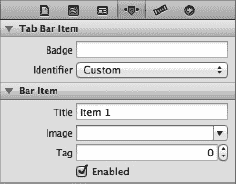

**图 7–14.** *标签栏项目属性检查器*

标签栏项目部分的第一个字段标为`Badge`。这可用于在标签栏项目上放置红色图标，类似于邮件图标上显示未读邮件数量的红色数字。本章中我们不会使用`Badge`字段，因此你可以将其留空。

下方是一个名为`Identifier`的弹出按钮。此字段允许你从一组常用的标签栏项目名称和图标中进行选择，例如收藏夹和搜索。如果你选择其中一项，标签栏将根据你的选择提供项目的名称和图标。我们不使用标准项目，因此将其保留为"自定义"。

接下来的两个字段用于指定标签栏项目的标题和自定义标签图标。将`Title`从`Item 1`更改为`Date`。接下来，点击`Image`组合框，选择`clockicon.png`图像。如果你使用自己的一套图标，请改为选择你的一个`.png`文件。在本章剩余部分，我们将假设你使用了我们的资源。如有需要，请相应调整你的思路。

如果你看向标签栏控制器窗口，会发现最左侧的标签栏项目现在显示为`Date`，并带有一个时钟图片（参见图 7–15）。

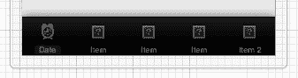

**图 7–15.** *我们第一个标签栏项目已更改为标题 Date 和时钟图标。酷！*

对其余四个标签栏项目重复此过程：

*   将第二个标签栏项目的标题更改为`Single`，并指定图像为`singleicon.png`。
*   将第三个标签栏项目的标题更改为`Double`，并指定图像为`doubleicon.png`。
*   将第四个标签栏项目的标题更改为`Dependent`，并指定图像为`dependenticon.png`。
*   将第五个标签栏项目的标题更改为`Custom`，并指定图像为`toolicon.png`。

图 7–16 展示了我们完成的标签栏。

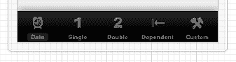

**图 7–16.** *我们完成的标签栏，五个标题和图标均已就位*

 **注意：** 不用担心视图控制器的`Title`字段。在此应用中我们不会用到它们。这些字段是留空还是包含文本都无关紧要。然而，我们*确实*会用到标签栏项目的`Title`字段。不要将两者混淆。

在继续下一部分 nib 编辑之前，保存你的 nib 文件。

我们一直在描述如何通过导航停靠区列表视图来选择一个项目，但同样也可以在图形布局区域中选择项目，所以现在将注意力移至那里。双击 nib 窗口中的标签栏控制器。这将打开界面生成器编辑面板中的标签栏控制器（如果尚未打开）。在该标签栏控制器中，点击其中一个标签栏项目，同时注视属性检查器。第一次点击标签栏项目时，你会选中该项目的视图控制器。再点击第二次，你将选中标签栏项目本身。

我们发现通过停靠区列表视图选择所需项目更不易混淆，但了解"单击一次，单击两次"的技巧绝对值得。同样的点击方法也适用于其他嵌套的 nib 元素。尝试一下，并使用检查器确保你选中的正是你所认为的元素。

### 初始测试运行

此时，标签栏和内容视图应该都已连接并正常运作。返回 Xcode，编译并运行，你的应用应启动并显示一个功能正常的标签栏。依次点击每个标签。每个标签都应能被选中。

目前内容视图中没有任何元素，因此变化不会很明显。但如果一切顺利，多视图应用的基本框架现已搭建并运行，我们可以开始设计各个内容视图了。

 **提示：** 如果点击某个标签时模拟器突然崩溃，不要惊慌！很可能是你漏掉了某一步或输入有误。返回并检查所有 nib 文件名，确保连接正确，并确认类名都已正确设置。

如果你想加倍确认一切正常，可以在每个内容视图中添加不同的标签或其他对象，然后重新启动应用。这样当你选择不同标签时，应该能看到不同视图的内容发生变化。


### 实现日期选择器

要实现日期选择器，我们需要一个输出口和一个操作。输出口用于获取日期选择器的值；操作则由按钮触发，并通过弹窗显示从选择器获取的日期值。单击 `BIDDatePickerViewController.h`，并添加以下代码：

```
#import <UIKit/UIKit.h>

@interface BIDDatePickerViewController : UIViewController

@property (strong, nonatomic) IBOutlet UIDatePicker *datePicker;
- (IBAction)buttonPressed;

@end
```

保存该文件，然后单击 `BIDDatePickerViewController.xib`，为第一个标签页编辑内容视图。

我们需要做的第一件事是调整视图大小，使其适应标签栏。单击 *View* 图标，按下 **4** 打开属性检查器。在 *Simulated Metrics*（模拟指标）部分，将 *Bottom Bar*（底部栏）弹出菜单设置为 *Tab Bar*（标签栏）。这将使 Interface Builder 自动将视图高度减少到 411 像素，并显示模拟的标签栏。

接下来，在库中找到 *Date Picker*（日期选择器），并将其拖放到 *View* 窗口中。将 *Date Picker* 放置在视图顶部，紧挨状态栏底部。它应占据内容视图的整个宽度和相当一部分高度。对于选择器，不要使用蓝色辅助线；它设计为紧贴视图边缘（参见图 7–17）。

**图 7–17.** *我们从库中拖拽了一个日期选择器。注意它占据了视图的整个宽度，且我们将其放置在视图顶部，状态栏正下方。*

如果尚未选中日期选择器，请单击它，然后返回属性检查器。如图 7–18 所示，日期选择器可配置多个属性。我们将保留大部分默认值（但完成后可随意调整选项以查看效果）。我们要做的一件事是限制选择器的日期范围为合理值。找到标题为 *Constraints*（约束）的部分，勾选 *MinimumDate*（最小日期）复选框，并将值保留为默认的 *1/1/1970*。同时勾选 *Maximum Date*（最大日期）复选框，并将值设置为 *12/31/2200*。

**图 7–18.** *日期选择器的属性检查器。设置最小和最大日期，其余设置保留默认值。*

接着，从库中获取一个 *Round Rect Button*（圆角矩形按钮），并将其放置在日期选择器下方。双击该按钮，将其标题设置为 *Select*（选择）。

保持按钮选中状态，按下 **6** 切换到连接检查器。从 *Touch Up Inside*（触摸并松开）事件旁边的圆圈拖拽到 *File's Owner*（文件所有者）图标，并连接到 `buttonPressed` 操作。然后按住 Control 键从 *File's Owner* 图标拖拽回日期选择器，选择 `datePicker` 输出口。最后，保存对 nib 文件的更改，至此 GUI 这部分工作完成。

现在只需实现 `BIDDatePickerViewController`。单击 `BIDDatePickerViewController.m`，首先在文件顶部添加以下代码：

```
#import "BIDDatePickerViewController.h"

@implementation BIDDatePickerViewController
@synthesize datePicker;

- (IBAction)buttonPressed {
    NSDate *selected = [datePicker date];
    NSString *message = [[NSString alloc] initWithFormat:
        @"您选择的日期和时间是：%@", selected];
    UIAlertView *alert = [[UIAlertView alloc]
              initWithTitle:@"日期和时间已选择"
                    message:message
                delegate:nil
          cancelButtonTitle:@"是的，我确认了。"
          otherButtonTitles:nil];
    [alert show];
}
.
.
.
```

然后在 `viewDidLoad:` 方法中添加一些设置代码：

```
- (void)viewDidLoad {
    [super viewDidLoad];
    // 从 nib 加载视图后的任何其他设置
    NSDate *now = [NSDate date];
    [datePicker setDate:now animated:NO];
}
.
.
.
```

接下来，在现有的 `viewDidUnload:` 方法中添加一行代码：

```
- (void)viewDidUnload {
    [super viewDidUnload];
    // 释放主视图的任何保留子视图
    // 例如 self.myOutlet = nil;
    self.datePicker = nil;
}
```

这里，我们首先合成了 `datePicker` 输出口的访问器和修改器，然后添加了 `buttonPressed` 的实现并重写了 `viewDidLoad`。在 `buttonPressed` 中，我们使用 `datePicker` 输出口从日期选择器获取当前日期值，然后基于该日期构建一个字符串，并用它来显示一个警告面板。

在 `viewDidLoad` 中，我们创建了一个新的 `NSDate` 对象。以这种方式创建的 `NSDate` 对象将保存当前日期和时间。然后我们将 `datePicker` 设置为该日期，这确保了每次从 nib 加载此视图时，选择器都会重置为当前日期和时间。

请继续构建并运行，确保日期选择器正常工作。如果一切顺利，应用程序运行时应该看起来像图 7–2。如果选择 *Select*（选择）按钮，将弹出一个警告面板，显示日期选择器中当前选择的日期和时间。

**注意：** 日期选择器不允许您指定秒数或时区。警告显示的时间包含秒数，且基于格林尼治标准时间（GMT）。我们本可以添加一些代码来简化警告中显示的字符串，但这章还不够长吗？如果您对自定义日期格式感兴趣，请查看 `NSDateFormatter` 类。

### 实现单组件选择器

下一个选择器允许用户从值列表中进行选择。在本示例中，我们将创建一个 `NSArray` 来保存要在选择器中显示的值。

选择器本身不保存任何数据。相反，它们会调用数据源和委托的方法来获取需要显示的数据。选择器并不关心底层数据的存储位置。它在需要数据时发出请求，数据源和委托（在实践中通常是同一个对象）协作提供这些数据。因此，数据可以来自静态列表（如本节所示），也可以从文件或 URL 加载，甚至可以在运行中生成或计算。

#### 声明输出口和操作

同往常一样，在开始处理 GUI 之前，我们需要确保在控制器的头文件中正确设置输出口和操作。在项目导航器中，单击 `BIDSingleComponentPickerViewController.h`。这个控制器类将充当选择器的数据源和委托，因此我们需要确保它符合这两个角色的协议。此外，我们需要声明一个输出口和一个操作。添加以下代码：

```
#import <UIKit/UIKit.h>

@interface BIDSingleComponentPickerViewController : UIViewController
    <UIPickerViewDelegate, UIPickerViewDataSource>

@property (strong, nonatomic) IBOutlet UIPickerView *singlePicker;
@property (strong, nonatomic) NSArray *pickerData;
- (IBAction)buttonPressed;

@end
```

首先，我们使控制器类遵循两个协议：`UIPickerViewDelegate` 和 `UIPickerViewDataSource`。之后，我们为选择器声明一个输出口，以及一个指向 `NSArray` 的指针，该数组将用于保存在选择器中显示的项目列表。最后，我们为按钮声明操作方法，就像对日期选择器所做的那样。


####构建视图

现在选择 `BIDSingleComponentPickerViewController.xib` 来编辑标签栏中第二个标签的内容视图。点击*View*图标，然后按下 **4** 调出属性检查器。在*模拟指标*部分将*底部栏*设置为*标签栏*。接下来，从库中拖出一个*选择器视图*（参见图 7–19），并将其添加到 nib 文件的*View*窗口中，紧贴视图顶部放置，就像之前处理日期选择器视图一样。

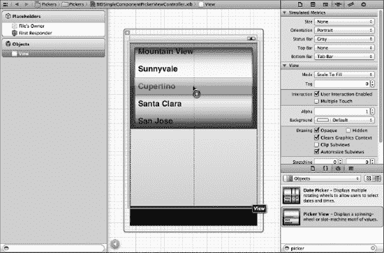

**图 7-19.** *将选择器视图从库中拖拽到我们的第二个视图上*

放置选择器后，按住 Control 键从*File's Owner*拖拽到选择器，并选择 `singlePicker` 输出口。

接下来，选中选择器，按下 **6** 调出连接检查器。查看选择器视图可用的连接，前两项是*dataSource*和*delegate*。如果没有看到这两个输出口，请确保选中了选择器，而不是包含它的 UIView！从*dataSource*旁边的圆圈拖拽到*File's Owner*图标。然后从*delegate*旁边的圆圈拖拽到*File's Owner*图标。现在，选择器知道 nib 文件中的`BIDSingleComponentPickerViewController`类实例是它的数据源和代理，并将请求它提供要显示的数据。换句话说，当选择器需要了解它将要显示的数据信息时，它会请求控制此视图的`BIDSingleComponentPickerViewController`实例提供这些信息。

将一个*圆角矩形按钮*拖拽到视图上，双击它，设置标题为*选择。*按下 Return 键确认更改。在连接检查器中，从*Touch Up Inside*旁边的圆圈拖拽到*File's Owner*图标，选择`buttonPressed`操作。至此，第二个标签的 GUI 构建完成。保存 nib 文件，让我们回到代码编写。

#### 将控制器实现为数据源和代理

为了使控制器能够正确作为选择器的数据源和代理工作，我们首先编写一些你已经熟悉的代码，然后添加几个你从未见过的方法。

单击 `BIDSingleComponentPickerViewController.m`，在文件开头添加以下代码：

```objectivec
#import "BIDSingleComponentPickerViewController.h"

@implementation BIDSingleComponentPickerViewController
@synthesize singlePicker;
@synthesize pickerData;

- (IBAction)buttonPressed {
    NSInteger row = [singlePicker selectedRowInComponent:0];
    NSString *selected = [pickerData objectAtIndex:row];
    NSString *title = [[NSString alloc] initWithFormat:
                       @"您选择了 %@!", selected];
    UIAlertView *alert = [[UIAlertView alloc] initWithTitle:title
                                      message:@"感谢您的选择。"
                                     delegate:nil
                            cancelButtonTitle:@"不客气"
                             otherButtonTitles:nil];
    [alert show];
}

...

- (void)viewDidLoad {
    [super viewDidLoad];
    // 在从 nib 加载视图后进行任何额外的设置
    NSArray *array = [[NSArray alloc] initWithObjects:@"卢克", @"莱娅",
           @"汉", @"丘巴卡", @"R2-D2", @"C-3PO", @"兰多", nil];
    self.pickerData = array;
}

...
```

现在你应该对这两个方法很熟悉了。`buttonPressed`方法与我们在日期选择器中使用的几乎相同。

与日期选择器不同，普通选择器无法告知我们它包含哪些数据，因为它不维护数据本身。它将这项工作委托给了代理和数据源。相反，我们需要询问选择器当前选中了哪一行，然后从我们的`pickerData`数组中获取对应的数据。以下是询问选中行的方法：

```objectivec
NSInteger row = [singlePicker selectedRowInComponent:0];
```

注意，我们需要指定想要查询的是哪个组件。这个选择器中只有一个组件，因此我们只需传入`0`，即第一个组件的索引。

**注意：** 你是否注意到，在请求选中行时，`NSInteger`和`row`之间没有星号？在大多数 iOS SDK 中，前缀`NS`通常表示 Foundation 框架中的 Objective-C 类，但这里是该通用规则的一个例外。`NSInteger`始终被定义为整数数据类型，即`int`或`long`。我们使用`NSInteger`而不是`int`或`long`，因为使用`NSInteger`时，编译器会自动选择最适合当前编译平台的大小。在编译 32 位处理器时，它会创建一个 32 位的`int`；在编译 64 位架构时，则会创建一个更长的 64 位`long`。目前，还没有 64 位的 iOS 设备，但谁知道呢？未来某天很可能会出现。你可能还会为自己编写的 iOS 应用程序创建类，稍后希望将它们回收利用到 Mac OS X 的 Cocoa 应用程序中，而 Mac OS X 确实同时运行在 32 位和 64 位机器上。


在`viewDidLoad`中，我们创建了一个包含多个对象的数组，以便为选择器提供数据。通常，您的数据会来自其他来源，例如项目`Resources`文件夹中的属性列表。像我们这样在代码中嵌入项目列表，如果需要更新此列表或希望将应用程序翻译成其他语言，将使事情变得困难得多。但这种方法是为演示目的将数据填充到数组中最快、最简单的方式。尽管您通常不会像这样创建数组，但几乎总是会在`viewDidLoad`方法中配置某种对应用程序模型对象的访问，这样您就不必在每次选择器向您请求数据时都访问磁盘或网络。

 **提示：** 如果您不应该像刚才在`viewDidLoad`中那样从对象列表创建数组，那该如何做呢？将列表嵌入到属性列表文件中，并将这些文件添加到项目的`Resources`文件夹中。属性列表文件可以在不重新编译源代码的情况下进行更改，这意味着这样做时引入新错误的风险很小。您还可以为不同语言提供不同的列表版本，正如您将在第 20 章中看到的那样。属性列表可以使用属性列表编辑器应用程序（`/Developer/Applications/Utilities/Property List Editor.app`）创建，或直接在 Xcode 中创建，后者在新文件助手的`Resource`部分提供了创建属性列表的模板，并支持在编辑器窗格中编辑属性列表。`NSArray`和`NSDictionary`都提供了一个名为`initWithContentsOfFile:`的方法，允许您从属性列表文件初始化实例，就像我们稍后在本章实现“Dependent”标签时将要做的。

接下来，将以下新代码行插入到现有的`viewDidUnload`方法中：

```
- (void)viewDidUnload {
    [super viewDidUnload];
    // Release any retained subviews of the main view.
    // e.g. self.myOutlet = nil;
    self.singlePicker = nil;
    self.pickerData = nil;
}
```

注意，我们将`singlePicker`和`pickerData`都设置为`nil`。在大多数情况下，您只将输出口设置为`nil`，而不设置其他属性。但是，这里将`pickerData`设置为`nil`是合适的，因为每次重新加载视图时都会重新创建`pickerData`数组，并且我们希望在视图卸载时释放该内存。在`viewDidLoad`方法中创建的任何内容都可以在`viewDidUnload`中释放，因为当视图重新加载时，`viewDidLoad`将再次触发。

最后，在文件末尾插入以下新代码：

```
.
.
.
#pragma mark -
#pragma mark Picker Data Source Methods

- (NSInteger)numberOfComponentsInPickerView:(UIPickerView *)pickerView {
    return 1;
}

- (NSInteger)pickerView:(UIPickerView *)pickerView
numberOfRowsInComponent:(NSInteger)component {
    return [pickerData count];
}

#pragma mark Picker Delegate Methods
- (NSString *)pickerView:(UIPickerView *)pickerView
             titleForRow:(NSInteger)row
            forComponent:(NSInteger)component {
    return [pickerData objectAtIndex:row];
}

@end
```

在文件底部，我们开始实现选择器所需的新方法。前两个方法来自`UIPickerViewDataSource`协议，并且它们对所有选择器（日期选择器除外）都是必需的。以下是第一个方法：

```
- (NSInteger)numberOfComponentsInPickerView:(UIPickerView *)pickerView {
    return 1;
}
```

选择器可以有多个转轮（或组件），选择器通过此方法询问它应该显示多少个组件。这次我们只想显示一个列表，因此返回值`1`。请注意，`UIPickerView`作为参数传入。此参数指向正在向我们提问的选择器视图，这使得拥有多个选择器由同一个数据源控制成为可能。在我们的例子中，我们知道只有一个选择器，因此可以安全地忽略此参数，因为我们已经知道是哪个选择器在调用我们。

第二个数据源方法用于选择器询问给定组件有多少行数据：

```
- (NSInteger)pickerView:(UIPickerView *)pickerView
numberOfRowsInComponent:(NSInteger)component {
    return [pickerData count];
}
```

**#PRAGMA 是什么？**

您注意到了来自`BIDSingleComponentPickerViewController.m`的以下几行代码吗？

```
#pragma mark -
#pragma mark Picker Data Source Methods
```

任何以`#pragma`开头的代码行在技术上都是一种编译器指令。更具体地说，`#pragma`标记了一个**实用**的（或特定于编译器的）指令，该指令不一定能用于其他编译器或其他环境。如果编译器不识别该指令，它会忽略它，尽管可能会生成一个警告。在这种情况下，`#pragma`指令实际上是针对 IDE 的，而不是编译器，它们告诉 Xcode 的编辑器在编辑器窗格顶部的“方法”和“函数”弹出菜单中设置一个分隔符。第一条指令在菜单中放置一个分隔符。第二条指令创建一个包含该行其余内容的文本条目，您可以将其用作源代码中方法组的描述性标题。

您的一些类，尤其是一些控制器类，可能会变得相当长，而“方法”和“函数”弹出菜单使浏览代码变得更加容易。加入`#pragma`指令并逻辑组织您的代码将使该弹出菜单更高效地使用。

再次，我们被告知是哪个选择器视图在询问，以及该选择器在询问哪个组件。由于我们知道只有一个选择器和一个组件，我们无需理会这两个参数，只需从唯一的数据数组中返回对象的数量。

在两个数据源方法之后，我们实现了一个委托方法。与数据源方法不同，所有委托方法都是可选的。术语“可选”有点误导，因为您确实需要实现至少一个委托方法。您通常会实现我们在这里实现的方法。但是，如果您想在选择器中显示文本以外的内容，则必须实现一个不同的方法，正如您在本章后面实现自定义选择器时将会看到的那样。

```
- (NSString *)pickerView:(UIPickerView *)pickerView
             titleForRow:(NSInteger)row
            forComponent:(NSInteger)component {
    return [pickerData objectAtIndex:row];
}
```

在这个方法中，选择器要求我们为特定组件中的特定行提供数据。我们获得了指向发出询问的选择器的指针，以及它正在询问的组件和行。由于我们的视图只有一个带一个组件的选择器，我们只需忽略除`row`参数之外的所有内容，并使用它从数据数组中返回相应的项目。

继续编译并再次运行。当模拟器启动时，切换到第二个标签——标记为“Single”的标签——并查看您新的自定义选择器，它应该看起来像图 7-3。

当您重温完所有《星球大战》的回忆后，回到 Xcode，我们将向您展示如何实现一个带有两个组件的选择器。如果您觉得有挑战性，那么接下来的内容视图实际上是一个很适合您自己尝试的练习。您已经看到了此选择器所需的所有方法，所以请大胆尝试一下。我们在这里等着。您可能想先仔细看看图 7-4，只是回顾一下。完成后，请继续阅读，您将看到我们是如何解决这个问题的。


### 实现多组件选择器

下一个内容窗格将包含一个带有两个滚轮（即组件）的选择器，这两个组件彼此独立。左侧滚轮将显示三明治馅料列表，右侧滚轮则提供面包种类的选择。我们将编写与单组件选择器相同的数据源和委托方法，只需在部分方法中额外编写少量代码，以确保能为每个组件返回正确的值和行数。

#### 声明输出口与操作方法

单击`BIDDoubleComponentPickerViewController.h`文件，并添加以下代码：

```objective-c
#import <UIKit/UIKit.h>

#define kFillingComponent 0
#define kBreadComponent   1

@interface BIDDoubleComponentPickerViewController : UIViewController
    <UIPickerViewDelegate, UIPickerViewDataSource>

@property(strong, nonatomic) IBOutlet UIPickerView *doublePicker;
@property(strong, nonatomic) NSArray *fillingTypes;
@property(strong, nonatomic) NSArray *breadTypes;

-(IBAction)buttonPressed;
@end
```

如你所见，我们首先定义了两个常量来表示这两个组件，这纯粹是为了让代码更易读。组件会被分配编号，最左侧组件编号为 0，每向右移动一个组件，编号递增 1。

接下来，我们使控制器类同时遵循委托和数据源协议，并为选择器声明一个输出口，同时声明两个数组来保存两个选择器组件的数据。在声明完每个实例变量的属性后，我们为按钮声明了一个操作方法，这与前两个内容窗格的做法一致。保存此文件，然后点击`BIDDoubleComponentPickerViewController.xib`来打开 nib 文件进行编辑。

#### 构建视图

选择`View`图标，使用对象属性检查器在`模拟指标`部分将`底部栏`设置为`标签栏`。

向视图中添加一个选择器视图和一个按钮，将按钮标签改为`选择`，然后建立必要的连接。这次我们不再逐步引导你完成，但如果你需要分步指南，可以参阅上一节，因为这两个应用在 nib 文件方面是完全相同的。以下是需要完成的操作摘要：

1. 将`文件所有者`的`doublePicker`输出口连接到选择器。
2. 将选择器视图的`数据源`和`委托`连接连接到`文件所有者`（使用连接检查器）。
3. 将按钮的`触摸内部触发`事件连接到`文件所有者`的`buttonPressed`操作（使用连接检查器）。

确保保存 nib 文件并在返回代码编辑前将其关闭。哦，对了，请将本页折角标记（如果更喜欢用书签也可以）。稍后你需要参考这一部分内容。

#### 实现控制器

选择`BIDDoubleComponentPickerViewController.m`文件，并在文件顶部添加以下代码：

```objective-c
#import "BIDDoubleComponentPickerViewController.h"

@implementation BIDDoubleComponentPickerViewController
@synthesize doublePicker;
@synthesize fillingTypes;
@synthesize breadTypes;

-(IBAction)buttonPressed
{
    NSInteger fillingRow = [doublePicker selectedRowInComponent:
                          kFillingComponent];
    NSInteger breadRow = [doublePicker selectedRowInComponent:
                          kBreadComponent];

    NSString *bread = [breadTypes objectAtIndex:breadRow];
    NSString *filling = [fillingTypes objectAtIndex:fillingRow];

    NSString *message = [[NSString alloc] initWithFormat:
            @"您的%@夹在%@面包里，马上就好。", filling, bread];

    UIAlertView *alert = [[UIAlertView alloc] initWithTitle:
                                       @"感谢您的订单"
                                                    message:message
                                                   delegate:nil
                                          cancelButtonTitle:@"太棒了！"
                                          otherButtonTitles:nil];
    [alert show];
}
.
.
.
```

接着，在`viewDidLoad`方法中添加以下代码行：

```objective-c
- (void)viewDidLoad {
    [super viewDidLoad];
    // 从 nib 加载视图后的任何额外设置
    NSArray *fillingArray = [[NSArray alloc] initWithObjects:@"火腿",
                     @"火鸡", @"花生酱", @"金枪鱼沙拉",
                     @"鸡肉沙拉", @"烤牛肉", "维吉麦酱", nil];
    self.fillingTypes = fillingArray;

    NSArray *breadArray = [[NSArray alloc] initWithObjects:@"白面包",
         @"全麦面包", @"黑麦面包", @"酸面包", @"七谷面包", nil];
    self.breadTypes = breadArray;
}
```

另外，在现有的`viewDidUnload`方法中添加以下代码行：

```objective-c
- (void)viewDidUnload {
    [super viewDidUnload];
    // 释放主视图的任何保留子视图。
    // 例如 self.myOutlet = nil;
    self.doublePicker = nil;
    self.breadTypes = nil;
    self.fillingTypes = nil;
}
```

并在文件底部添加委托和数据源方法：

```objective-c
.
.
.
#pragma mark -
#pragma mark 选择器数据源方法
- (NSInteger)numberOfComponentsInPickerView:(UIPickerView *)pickerView {
    return 2;
}

- (NSInteger)pickerView:(UIPickerView *)pickerView
numberOfRowsInComponent:(NSInteger)component {
    if (component == kBreadComponent)
        return [self.breadTypes count];

    return [self.fillingTypes count];
}

#pragma mark 选择器委托方法
- (NSString *)pickerView:(UIPickerView *)pickerView
             titleForRow:(NSInteger)row
            forComponent:(NSInteger)component {
    if (component == kBreadComponent)
        return [self.breadTypes objectAtIndex:row];
    return [self.fillingTypes objectAtIndex:row];
}

@end
```

这次`buttonPressed`方法稍微复杂了一些，但对你来说几乎没有新内容。我们只需要在请求选定行时，使用之前定义的常量`kBreadComponent`和`kFillingComponent`来指定所谈论的是哪个组件。

```objective-c
NSInteger breadRow = [doublePicker selectedRowInComponent:
        kBreadComponent];
NSInteger fillingRow = [doublePicker selectedRowInComponent:
        kFillingComponent];
```

这里可以看到，使用这两个常量代替`0`和`1`使我们的代码可读性大大提高。从这一点开始，`buttonPressed`方法与我们上次编写的方法基本相同。


`viewDidLoad:` 与之前为选择器编写的版本非常相似。唯一的区别在于我们加载了两个数组的数据，而非仅一个。同样，我们只是从硬编码的字符串列表中创建数组——通常你不会在自己的应用中这样做。

当处理数据源方法时，情况开始有所变化。在第一个方法中，我们指定选择器应包含两个组件，而非仅一个：

```
- (NSInteger)numberOfComponentsInPickerView:(UIPickerView *)pickerView {
    return 2;
}
```

这次，当询问行数时，我们需要判断选择器询问的是哪个组件，并返回对应数组的正确行数。

```
- (NSInteger)pickerView:(UIPickerView *)pickerView
numberOfRowsInComponent:(NSInteger)component {
    if (component == kBreadComponent)
        return [self.breadTypes count];

    return [self.fillingTypes count];
}
```

接着，在委托方法中，我们执行同样的操作：检查组件，为所请求的组件使用正确的数组，以获取并返回正确的值。

```
- (NSString *)pickerView:(UIPickerView *)pickerView
             titleForRow:(NSInteger)row
            forComponent:(NSInteger)component {
    if (component == kBreadComponent)
        return [self.breadTypes objectAtIndex:row];
    return [self.fillingTypes objectAtIndex:row];
}
```

这并不难，对吧？编译并运行你的应用，确保*双组件*内容窗格看起来像图 7–4。

请注意，每个滚轮完全独立于另一个。转动一个滚轮对另一个没有影响。在本例中这样处理是合适的。但有时一个组件会依赖于另一个组件。日期选择器就是一个很好的例子：当你更改月份时，显示当月天数的拨盘可能需要变化，因为并非所有月份都有相同的天数。一旦你知道方法，实现这一点并不难，但靠自己摸索并非易事，所以我们接下来就做这个。

#### 实现依赖组件

我们现在渐入佳境。在下一节中，对于我们已经涵盖的内容，我们不会手把手地指导。相反，我们将专注于新内容。新的选择器将在左侧组件中显示美国各州列表，在右侧组件中显示与左侧当前选中州相对应的邮政编码列表。

我们需要为左侧组件中的每一项单独准备一组邮政编码值。像上次一样，我们将声明两个数组，每个组件一个。我们还需要一个 `NSDictionary`。在这个字典中，我们将为每个州存储一个 `NSArray`（参见图 7–20）。之后，我们将实现一个委托方法，当选择器的选择发生变化时，该方法会通知我们。如果左侧的值发生变化，我们将从字典中取出正确的数组，并将其赋值给用于右侧组件的数组。如果你没能完全理解，别担心；随着我们深入代码，我们会进一步讨论。

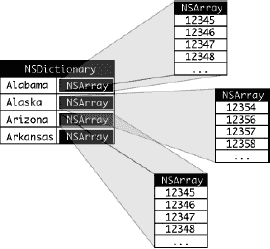

**图 7–20.** *应用的数据。对于每个州，字典中将有一个条目，以州名作为键。该键下存储的是一个包含该州所有邮政编码的 `NSArray` 实例。*

将以下代码添加到你的 `BIDDependentComponentPickerViewController.h` 文件中：

```
#import <UIKit/UIKit.h>
#define kStateComponent   0
#define kZipComponent     1

@interface BIDDependentComponentPickerViewController : UIViewController
    <UIPickerViewDelegate, UIPickerViewDataSource>

@property (strong, nonatomic) IBOutlet UIPickerView *picker;
@property (strong, nonatomic) NSDictionary *stateZips;
@property (strong, nonatomic) NSArray *states;
@property (strong, nonatomic) NSArray *zips;

- (IBAction) buttonPressed;
@end
```

现在是构建内容视图的时候了。该过程与我们之前构建的两个组件视图几乎相同。如果遇到困难，可以翻回单组件选择器的“构建视图”部分，并按照那些逐步说明操作。提示：首先打开 `BIDDependentComponentPickerViewController.xib`，然后重复你在本章中为所有其他内容视图所做的相同基本步骤。完成后，保存 nib 文件。

好了，深吸一口气。让我们来实现这个控制器类。这个实现起初可能看起来有点棘手。通过使一个组件依赖于另一个组件，我们为控制器类增加了一个全新的复杂度。尽管选择器一次只显示两个列表，但我们的控制器类必须知道并管理 51 个列表。我们在这里使用的技术实际上简化了这一过程。数据源方法看起来几乎与我们在*双组件选择器*视图中实现的方法完全相同。所有额外的复杂性都在 `viewDidLoad` 和一个名为 `pickerView:didSelectRow:inComponent:` 的新委托方法之间处理。

在编写代码之前，我们需要一些数据来展示。到目前为止，我们通过指定字符串列表在代码中创建数组。由于我们不想让你手动输入数千个值，并且认为应该向你展示正确的方法，我们将从属性列表加载数据。正如我们之前提到的，`NSArray` 和 `NSDictionary` 对象都可以从属性列表创建。我们在项目归档文件的 `07 Pickers` 文件夹中包含了一个名为 `statedictionary.plist` 的属性列表。

将该文件复制到 Xcode 项目中的 `Pickers` 文件夹。如果在项目窗口中单击该 plist 文件，你可以查看甚至编辑其中包含的数据（参见图 7–21）。

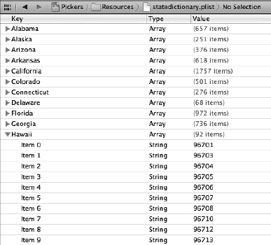

**图 7–21.** *`statedictionary.plist` 文件，显示州列表。在夏威夷内部，你可以看到邮政编码列表的开头部分。*


现在，让我们来编写一些代码。将以下内容添加到 `BIDDependentComponentPickerViewController.m` 中，然后我们将其分解为更易于理解的几个部分：

```objectivec
#import "BIDDependentComponentPickerViewController.h"

@implementation BIDDependentComponentPickerViewController
@synthesize picker;
@synthesize stateZips;
@synthesize states;
@synthesize zips;

- (IBAction) buttonPressed {
    NSInteger stateRow = [picker selectedRowInComponent:kStateComponent];
    NSInteger zipRow = [picker selectedRowInComponent:kZipComponent];

    NSString *state = [self.states objectAtIndex:stateRow];
    NSString *zip = [self.zips objectAtIndex:zipRow];

    NSString *title = [[NSString alloc] initWithFormat:
                       @"You selected zip code %@.", zip];
    NSString *message = [[NSString alloc] initWithFormat:
                         @"%@ is in %@", zip, state];

    UIAlertView *alert = [[UIAlertView alloc] initWithTitle:title
                                                    message:message
                                                   delegate:nil
                                          cancelButtonTitle:@"OK"
                                          otherButtonTitles:nil];
    [alert show];
}
```

然后，将以下代码添加到现有的 `viewDidLoad` 方法中：

```objectivec
- (void)viewDidLoad {
    [super viewDidLoad];
    // Do any additional setup after loading the view from its nib.

    NSBundle *bundle = [NSBundle mainBundle];
    NSURL *plistURL = [bundle URLForResource:@"statedictionary"
                               withExtension:@"plist"];

    NSDictionary *dictionary = [NSDictionary
                                dictionaryWithContentsOfURL:plistURL];
    self.stateZips = dictionary;

    NSArray *components = [self.stateZips allKeys];
    NSArray *sorted = [components sortedArrayUsingSelector:
                       @selector(compare:)];
    self.states = sorted;

    NSString *selectedState = [self.states objectAtIndex:0];
    NSArray *array = [stateZips objectForKey:selectedState];
    self.zips = array;
}
```

接下来，将以下几行代码添加到现有的 `viewDidUnload` 方法中：

```objectivec
- (void)viewDidUnload {
    [super viewDidUnload];
    // Release any retained subviews of the main view.
    // e.g. self.myOutlet = nil;
    self.picker = nil;
    self.stateZips = nil;
    self.states = nil;
    self.zips = nil;
}
```

最后，在文件底部添加委托和数据源方法：

```objectivec
#pragma mark -
#pragma mark Picker Data Source Methods
- (NSInteger)numberOfComponentsInPickerView:(UIPickerView *)pickerView {
    return 2;
}

- (NSInteger)pickerView:(UIPickerView *)pickerView
numberOfRowsInComponent:(NSInteger)component {
    if (component == kStateComponent)
        return [self.states count];
    return [self.zips count];
}

#pragma mark Picker Delegate Methods
- (NSString *)pickerView:(UIPickerView *)pickerView
             titleForRow:(NSInteger)row
            forComponent:(NSInteger)component {
    if (component == kStateComponent)
        return [self.states objectAtIndex:row];
    return [self.zips objectAtIndex:row];
}

- (void)pickerView:(UIPickerView *)pickerView
       didSelectRow:(NSInteger)row
        inComponent:(NSInteger)component {
    if (component == kStateComponent) {
        NSString *selectedState = [self.states objectAtIndex:row];
        NSArray *array = [stateZips objectForKey:selectedState];
        self.zips = array;
        [picker selectRow:0 inComponent:kZipComponent animated:YES];
        [picker reloadComponent:kZipComponent];
    }
}

@end
```

无需讨论 `buttonPressed` 方法，因为它与之前的方法基本相同。不过，我们应该讨论一下 `viewDidLoad` 方法。其中有一些你需要注意的内容，所以请坐好，我们来聊聊。

在这个新的 `viewDidLoad` 方法中，我们做的第一件事是获取对应用程序主包（main bundle）的引用。

```objectivec
NSBundle *bundle = [NSBundle mainBundle];
```

你可能会问，什么是包（bundle）？实际上，**包**只是一种特殊类型的文件夹，其内容遵循特定的结构。应用程序和框架都是包，而这个调用会返回一个代表我们应用程序的包对象。

`NSBundle` 的主要用途之一是访问你添加到项目 Resources 文件夹中的资源。当你构建应用程序时，这些文件会被复制到应用程序的包中。我们曾向项目中添加过图像等资源，但到目前为止，我们只在 Interface Builder 中使用了它们。如果我们想在代码中访问这些资源，通常需要使用 `NSBundle`。我们使用主包来获取我们所关心资源的 URL。

```objectivec
NSURL *plistURL = [bundle URLForResource:@"statedictionary"
                               withExtension:@"plist"];
```

这将返回一个包含 `statedictionary.plist` 文件位置的 URL。然后，我们可以使用该 URL 创建一个 `NSDictionary` 对象。一旦完成，该属性列表的全部内容将被加载到新创建的 `NSDictionary` 对象中，然后我们将其赋值给 `stateZips`。

```objectivec
NSDictionary *dictionary = [NSDictionary
                            dictionaryWithContentsOfURL:plistURL];
    self.stateZips = dictionary;
```

我们刚刚加载的字典以州名作为键，并以一个包含该州所有邮政编码的 `NSArray` 作为值。为了填充左侧组件的数据源，我们从字典中获取所有键的列表，并将其赋值给 `states` 数组。不过，在赋值之前，我们按字母顺序对其进行了排序。

```objectivec
    NSArray *components = [self.stateZips allKeys];
    NSArray *sorted = [components sortedArrayUsingSelector:
        @selector(compare:)];
    self.states = sorted;
```

除非我们特别将选择项设置为其他值，否则选择器默认选中第一行（行 0）。为了获取与 `states` 数组第一行相对应的 `zips` 数组，我们从 `states` 数组中获取索引为 0 的对象。这将返回程序启动时将被选中的州名。然后，我们使用该州名获取该州的邮政编码数组，并将其赋值给 `zips` 数组，该数组将用于为右侧组件提供数据。

```objectivec
    NSString *selectedState = [self.states objectAtIndex:0];
    NSArray *array = [stateZips objectForKey:selectedState];
    self.zips = array;
```

这两个数据源方法与之前的版本几乎相同。我们返回相应数组中的行数。我们实现的第一个委托方法也是如此。第二个委托方法是新增的，魔法就发生在这里。

```objectivec
- (void)pickerView:(UIPickerView *)pickerView
      didSelectRow:(NSInteger)row
       inComponent:(NSInteger)component {
    if (component == kStateComponent) {
        NSString *selectedState = [self.states objectAtIndex:row];
        NSArray *array = [stateZips objectForKey:selectedState];
        self.zips = array;
        [picker selectRow:0 inComponent:kZipComponent animated:YES];
        [picker reloadComponent:kZipComponent];
    }
}
```


在此方法中（每当选择器的选择发生变化时都会调用），我们会查看组件并检查左侧组件是否发生了变化。如果发生了变化，就获取与新选择对应的数组，并将其赋值给`zips`数组。然后，我们将右侧组件重置为第一行，并告诉它重新加载自身。通过在状态变化时交换`zips`数组，其余代码与`DoublePicker`示例中的代码基本保持不变。

我们还没有完全完成。编译并运行你的应用程序，然后查看`Dependent`标签页（参见图 7-22）。你是否看到了什么不喜欢的东西？

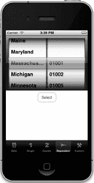

**图 7-22.** *我们真的希望两个组件大小相同吗？注意长州名被截断的情况。*

这两个组件的大小相同。尽管邮政编码的长度永远不会超过五个字符，但它却被赋予了与州名同等的地位。由于像`Mississippi`和`Massachusetts`这样的州名无法在半个选择器中完全显示，这看起来不太理想。幸运的是，我们可以实现另一个委托方法来指示每个组件应该有多宽。在竖屏方向下，我们大约有`295`像素可供选择器组件使用，但每增加一个组件，绘制新组件边缘就会占用一点空间。你可能需要尝试不同的值，才能让外观看起来合适。将以下方法添加到`BIDDependentComponentPickerViewController.m`的委托部分：

```
- (CGFloat)pickerView:(UIPickerView *)pickerView
    widthForComponent:(NSInteger)component {
    if (component == kZipComponent)
        return 90;
    return 200;
}
```

在此方法中，我们返回一个数字，表示每个组件应该有多少像素宽，选择器会尽力满足这个要求。保存、编译并运行，`Dependent`标签页上的选择器看起来会更像图 7-5 所示。

至此，你应该对选择器和标签栏应用程序都非常熟悉了。关于选择器，我们还有一件事要展示，并且我们打算在做的过程中找点乐趣。让我们创建一个简单的老虎机游戏。

### 使用自定义选择器创建一个简单游戏

接下来，我们将创建一个实际可用的老虎机。好吧，它不会吐出银币，但看起来很酷。在继续之前，请先回顾一下图 7-6，这样你就知道我们在构建什么了。

#### 编写控制器头文件

首先，将以下代码添加到`BIDCustomPickerViewController.h`中：

```
#import <UIKit/UIKit.h>

@interface BIDCustomPickerViewController : UIViewController
       <UIPickerViewDataSource, UIPickerViewDelegate>

@property(strong, nonatomic) IBOutlet UIPickerView *picker;
@property(strong, nonatomic) IBOutlet UILabel *winLabel;
@property(strong, nonatomic) NSArray *column1;
@property(strong, nonatomic) NSArray *column2;
@property(strong, nonatomic) NSArray *column3;
@property(strong, nonatomic) NSArray *column4;
@property(strong, nonatomic) NSArray *column5;

- (IBAction)spin;
@end
```

我们声明了两个`outlet`，一个用于选择器视图，另一个用于标签。该标签将用于在用户获胜时（即同一行出现三个相同符号时）告知用户。

我们还创建了五个指向`NSArray`对象的指针。我们将用这些指针来保存包含选择器要绘制的图片的图片视图。尽管我们在所有五列中都使用了相同的图片，但每列都需要有自己独立的数组，并包含自己的一组图片视图，因为每个视图在同一时间只能被绘制在选择器中的一个位置。我们还声明了一个名为`spin`的动作方法。

#### 构建视图

尽管图 7-6 中的选择器看起来比我们构建的其他选择器花哨得多，但在设计`nib`文件的方式上其实差别很小。所有额外的工作都在控制器的委托方法中完成。

确保你已经保存了新的源代码，然后在项目导航器中选择`BIDCustomPickerViewController.xib`来编辑 GUI。将*模拟度量*设置为模拟视图底部的标签栏，然后添加一个选择器视图、一个在它下面的标签，以及一个在标签下面的按钮。使用视图底部的蓝色参考线来放置按钮的底部，并将标签和按钮居中。给按钮设置标题为`Spin`。

现在，移动你的标签，使其与视图的左侧参考线对齐，并接触选择器视图下方的参考线。接着，调整标签的大小，使其一直延伸到右侧参考线，并向下延伸到按钮上方的参考线。

选中标签，打开属性检查器。将*对齐*设置为居中。然后点击*文本颜色*，将颜色设置为一种喜庆的颜色，比如亮紫红色（我们实际上不知道那是什么颜色，但它听起来确实喜庆）。

接下来，让文本变大一些。在检查器中找到*字体*设置，点击其中的图标（看起来像是一个小方框里的字母“T”）以弹出字体选择器。这个控件允许你切换设备的标准系统字体到其他字体（如果你喜欢），或者仅仅更改大小。现在，只需将大小更改为`48`。在你调整好文本样式后，删除单词`Label`，因为我们不希望在任何文本显示出来，直到用户第一次获胜。

之后，将所有连接到`outlet`和动作的连线连接好。你需要将*文件所有者*的`picker` `outlet`连接到选择器视图，将*文件所有者*的`winLabel` `outlet`连接到标签，并将按钮的*Touch Up Inside*事件连接到`spin`动作。之后，只需确保为选择器指定了委托和数据源即可。

哦，还有一件事你需要做。选择选择器，打开属性检查器。你需要取消选中*视图*设置中标记为*User Interaction Enabled*的复选框，这样用户就不能手动更改转盘并作弊了。完成所有这些后，保存你对`nib`文件所做的更改。

**iOS 设备支持的字体**

在 Interface Builder 中使用字体面板设计 iOS 界面时要小心。属性检查器的字体选择器让你可以从多种字体中进行选择，但并非所有 iOS 设备都拥有相同的可用字体集。例如，在撰写本文时，有几种字体在 iPad 上可用，但在 iPhone 或 iPod touch 上不可用。你应该将字体选择限制在目标 iOS 设备上可用的字体族中。Jeff LaMarche 优秀的 iOS 博客上的这篇文章展示了如何以编程方式获取此列表：[`http://iphonedevelopment.blogspot.com/2010/08/fonts-and-font-families.html`](http://iphonedevelopment.blogspot.com/2010/08/fonts-and-font-families.html)。

简而言之，创建一个基于视图的应用程序，并将以下代码添加到应用程序委托的`application:didFinishLaunchingWithOptions:`方法中：

```objective-c
for (NSString *family in [UIFont familyNames]){
    NSLog(@"%@", family);
    for (NSString *font in [UIFont fontNamesForFamilyName:family]){
        NSLog(@"\t%@", font);
    }
}
```

在相应的模拟器中运行该项目，你的字体将显示在项目的控制台日志中。


#### 添加图片资源

现在我们需要添加游戏中将会用到的图片。我们在项目归档文件的 `07 Pickers/Custom Picker Images` 文件夹中为你准备了一组六个图像文件（`seven.png`、`bar.png`、`crown.png`、`cherry.png`、`lemon.png` 和 `apple.png`）。将整个文件夹拖入 Xcode 的 `Pickers` 文件夹中（就像你之前处理标签栏图标那样），即可将所有文件添加到项目中。当系统提示时，最好选择将它们复制到项目文件夹中。

#### 实现控制器

在这个控制器的实现部分，我们有很多新内容要介绍。在 `BIDCustomPickerViewController.m` 文件的开头添加以下代码：

```objc
#import "BIDCustomPickerViewController.h"

@implementation BIDCustomPickerViewController
@synthesize picker;
@synthesize winLabel;
@synthesize column1;
@synthesize column2;
@synthesize column3;
@synthesize column4;
@synthesize column5;

- (IBAction)spin {
    BOOL win = NO;
    int numInRow = 1;
    int lastVal = -1;
    for (int i = 0; i < 5; i++) {
        int newValue = random() % [self.column1 count];

        if (newValue == lastVal)
            numInRow++;
        else
            numInRow = 1;

        lastVal = newValue;
        [picker selectRow:newValue inComponent:i animated:YES];
        [picker reloadComponent:i];
        if (numInRow>= 3)
            win = YES;
    }
    if (win)
        winLabel.text = @"WIN!";
    else
        winLabel.text = @"";
}
.
.
.
```

然后，在 `viewDidLoad` 方法中插入以下代码：

```objc
- (void)viewDidLoad {
    [super viewDidLoad];
    // Do any additional setup after loading the view from its nib.
    UIImage *seven = [UIImage imageNamed:@"seven.png"];
    UIImage *bar = [UIImage imageNamed:@"bar.png"];
    UIImage *crown = [UIImage imageNamed:@"crown.png"];
    UIImage *cherry = [UIImage imageNamed:@"cherry.png"];
    UIImage *lemon = [UIImage imageNamed:@"lemon.png"];
    UIImage *apple = [UIImage imageNamed:@"apple.png"];

    for (int i = 1; i <= 5; i++) {
        UIImageView *sevenView = [[UIImageView alloc] initWithImage:seven];
        UIImageView *barView = [[UIImageView alloc] initWithImage:bar];
        UIImageView *crownView = [[UIImageView alloc] initWithImage:crown];
        UIImageView *cherryView = [[UIImageView alloc]
                                       initWithImage:cherry];
        UIImageView *lemonView = [[UIImageView alloc] initWithImage:lemon];
        UIImageView *appleView = [[UIImageView alloc] initWithImage:apple];
        NSArray *imageViewArray = [[NSArray alloc] initWithObjects:
            sevenView, barView, crownView, cherryView,
            lemonView,appleView, nil];

        NSString *fieldName =
            [[NSString alloc] initWithFormat:@"column%d", i];
        [self setValue:imageViewArray forKey:fieldName];
    }

    srandom(time(NULL));
}
```

接下来，在 `viewDidUnload` 方法中插入以下新代码行：

```objc
- (void)viewDidUnload {
    [super viewDidUnload];
    // Release any retained subviews of the main view.
    // e.g. self.myOutlet = nil;
    self.picker = nil;
    self.winLabel = nil;
    self.column1 = nil;
    self.column2 = nil;
    self.column3 = nil;
    self.column4 = nil;
    self.column5 = nil;
}
```

最后，在文件末尾添加以下代码：

```objc
.
.
.
#pragma mark -
#pragma mark Picker Data Source Methods
- (NSInteger)numberOfComponentsInPickerView:(UIPickerView *)pickerView {
    return 5;
}

- (NSInteger)pickerView:(UIPickerView *)pickerView
    numberOfRowsInComponent:(NSInteger)component {
    return [self.column1 count];
}

#pragma mark Picker Delegate Methods
- (UIView *)pickerView:(UIPickerView *)pickerView
            viewForRow:(NSInteger)row
          forComponent:(NSInteger)component reusingView:(UIView *)view {
    NSString *arrayName = [[NSString alloc] initWithFormat:@"column%d",
        component+1];
    NSArray *array = [self valueForKey:arrayName];
    return [array objectAtIndex:row];
}

@end
```

这里内容很多，对吧？让我们逐一分析这些新方法。

##### `spin` 方法

当用户点击 *Spin* 按钮时，`spin` 方法会被触发。在该方法中，我们首先声明了几个变量，用于跟踪用户是否获胜。我们将使用 `win` 来记录是否出现了三个连续相同值的情况，如果出现则将其设为 `YES`。我们将使用 `numInRow` 来记录当前连续相同值的数量，同时通过 `lastVal` 跟踪上一个组件中的值，这样我们就可以将当前值与上一个值进行比较。我们将 `lastVal` 初始化为 `-1`，因为我们知道这个值不会匹配任何实际值。

```objc
    BOOL win = NO;
    int numInRow = 1;
    int lastVal = -1;
```

接下来，我们遍历全部五个组件，并将每个组件设置为随机生成的新行选择。我们通过 `column1` 数组来获取计数，这是一种快捷方式，因为我们知道所有五个列的值数量相同。

```objc
    for (int i = 0; i < 5; i++) {
        int newValue = random() % [self.column1 count];
```

我们将新值与上一个值进行比较，如果匹配则 `numInRow` 加 1。如果值不匹配，则将 `numInRow` 重置为 1。然后我们将新值赋给 `lastVal`，以便在下一次循环时进行比较。

```objc
        if (newValue == lastVal)
            numInRow++;
        else
            numInRow = 1;
        lastVal = newValue;
```

之后，我们将对应的组件设置为新值，并设置动画效果，同时告诉选择器重新加载该组件。

```objc
        [picker selectRow:newValue inComponent:i animated:YES];
        [picker reloadComponent:i];
```

每次循环结束时，我们会检查是否出现了三个连续相同值，如果是，则将 `win` 设为 `YES`。

```objc
        if (numInRow>= 3)
            win = YES;
    }
```

循环结束后，我们设置标签文本，用于显示这次旋转是否获胜。

```objc
    if (win)
        winLabel.text = @"Win!";
    else
        winLabel.text = @"";
```


### `viewDidLoad` 方法

新版本的`viewDidLoad`看起来有点吓人，对吧？别担心——一旦我们将其拆解，它就不会再像你衣柜里的怪物那样可怕了。

我们做的第一件事是加载六张不同的图片。我们通过`UIImage`类上一个名为`imageNamed:`的便捷方法来实现这一点。

```
UIImage *seven = [UIImage imageNamed:@"seven.png"];
UIImage *bar = [UIImage imageNamed:@"bar.png"];
UIImage *crown = [UIImage imageNamed:@"crown.png"];
UIImage *cherry = [UIImage imageNamed:@"cherry.png"];
UIImage *lemon = [UIImage imageNamed:@"lemon.png"];
UIImage *apple = [UIImage imageNamed:@"apple.png"];
```

加载完这六张图片后，我们需要为选择器的五个组件分别创建`UIImageView`实例，每个组件对应每张图片各一个。我们在一个循环中完成这些操作。

```
for (int i = 1; i <= 5; i++) {
    UIImageView *sevenView = [[UIImageView alloc] initWithImage:seven];
    UIImageView *barView = [[UIImageView alloc] initWithImage:bar];
    UIImageView *crownView = [[UIImageView alloc] initWithImage:crown];
    UIImageView *cherryView = [[UIImageView alloc] initWithImage:cherry];
    UIImageView *lemonView = [[UIImageView alloc] initWithImage:lemon];
    UIImageView *appleView = [[UIImageView alloc] initWithImage:apple];
```

创建好图片视图后，我们将它们放入一个数组中。这个数组将用于为选择器的五个组件之一提供数据。

```
NSArray *imageViewArray = [[NSArray alloc] initWithObjects:
                           sevenView, barView, crownView, cherryView,
                           lemonView, appleView, nil];
```

现在，我们只需要将这个数组分配给我们五个数组中的一个。为此，我们创建一个与其中一个数组名称匹配的字符串。第一次循环时，这个字符串将是`column1`，它对应的数组将用于馈送选择器的第一个组件。第二次循环时，它会变成`column2`，依此类推。

```
NSString *fieldName = [[NSString alloc] initWithFormat:@"column%d", i];
```

有了这五个数组中的某个名称后，我们可以使用一个非常方便的方法`setValue:forKey:`将该数组赋值给对应的属性。这个方法允许你根据属性的名称来设置属性值。所以，如果我们调用它并传入值`"column1"`，就相当于调用了赋值方法`setColumn1:`。

```
[self setValue:imageViewArray forKey:fieldName];
```

在这个方法中，我们最后要做的事情是初始化随机数生成器。如果不这样做，游戏每次运行的方式都会相同，那样就会变得有点无聊。

```
srandom(time(NULL));
}
```

这不算太糟糕，对吧？但是，嗯，现在我们已经用图片视图填满了那五个数组，接下来该拿它们做什么呢？如果你向下滚动刚刚输入的代码，你会看到两个数据源方法看起来和之前几乎一样，但如果你继续往下查看代理方法，你会发现我们正在使用一个完全不同的代理方法来为选择器提供数据。之前使用的方法返回的是`NSString *`，而这个方法返回的是`UIView *`。

改用这个方法后，我们可以为选择器提供任何能绘制到`UIView`中的内容。当然，考虑到选择器尺寸较小，能够在此工作且同时呈现良好效果的内容是有限制的。但这个方法在显示内容方面给了我们更大的自由度，尽管工作量会稍大一些。

```
- (UIView *)pickerView:(UIPickerView *)pickerView
       viewForRow:(NSInteger)row
      forComponent:(NSInteger)component
       reusingView:(UIView *)view {
```

这个方法从五个数组之一中返回一个图片视图。为此，我们再次创建一个包含某个数组名称的`NSString`。由于`component`是从零开始索引的，我们对其加一，就得到了介于`column1`和`column5`之间的一个值，该值对应于选择器正在请求数据的那个组件。

```
NSString *arrayName = [[NSString alloc] initWithFormat:@"column%d",
    component+1];
```

获得要使用的数组名称后，我们通过一个名为`valueForKey:`的方法来检索该数组，该方法与我们在`viewDidLoad`中使用的`setValue:forKey:`方法相对应。使用它等同于调用指定属性的访问方法。因此，调用`valueForKey:`并指定`"column1"`，就等同于使用`column1`的访问方法。一旦我们获取到该组件对应的正确数组，只需从数组中返回与选中行对应的图片视图即可。

```
NSArray *array = [self valueForKey:arrayName];
return [array objectAtIndex:row];
}
```

哇，深吸一口气。你安然无恙地完成了所有内容，现在可以把它运行起来试试看了。


#### 最终细节

我们的游戏相当有趣，尤其是想到构建它几乎没费什么力气。现在，让我们再做一些调整来改进它。目前这个游戏有两件事让我们很困扰：

- 它太安静了。老虎机可不会这么安静！
- 在转轮停止转动之前，它就显示我们已经赢了。虽然这是个小问题，但确实消除了期待感。要亲眼看到这个效果，请再次运行你的应用程序。这很微妙，但标签确实在轮子停止旋转之前就出现了。

本书附带项目档案中的 `07 Pickers/Custom Picker Sounds` 文件夹包含两个音频文件：`crunch.wav` 和 `win.wav`。将此文件夹添加到项目的 `Pickers` 文件夹中。当用户点击 `Spin` 按钮时，我们会播放这些声音，当他们获胜时，会播放胜利音效。

要处理声音，我们需要访问 iOS Audio Toolbox 类。在 `BIDCustomPickerViewController.m` 顶部插入以下代码行：

```
#import <AudioToolbox/AudioToolbox.h>
```

接下来，我们需要添加一个指向按钮的出口。在转轮旋转时，我们将隐藏按钮。我们不希望用户在当前旋转完成之前再次点击按钮。在 `BIDCustomPickerViewController.h` 中添加以下代码：

```
#import <UIKit/UIKit.h>

@interface BIDCustomPickerViewController : UIViewController
       <UIPickerViewDataSource, UIPickerViewDelegate>

@property(strong, nonatomic) IBOutlet UIPickerView *picker;
@property(strong, nonatomic) IBOutlet UILabel *winLabel;
@property(strong, nonatomic) NSArray *column1;
@property(strong, nonatomic) NSArray *column2;
@property(strong, nonatomic) NSArray *column3;
@property(strong, nonatomic) NSArray *column4;
@property(strong, nonatomic) NSArray *column5;
@property(strong, nonatomic) IBOutlet UIButton *button;

-(IBAction)spin;

@end
```

输入上述代码并保存文件后，点击 `BIDCustomPickerViewController.xib` 以编辑 nib 文件。打开后，从 `File's Owner` 控件拖拽到 `Spin` 按钮，并将其连接到我们刚刚创建的新 `button` 出口。保存 nib 文件。

现在，我们需要在控制器类的实现中做几件事。首先，需要为新出口合成访问器和修改器。打开 `BIDCustomPickerViewController.m` 并添加以下代码行：

```
@implementation BIDCustomPickerViewController
@synthesize picker;
@synthesize winLabel;
@synthesize column1;
@synthesize column2;
@synthesize column3;
@synthesize column4;
@synthesize column5;
@synthesize button;
.
.
.
```

我们还需要为控制器类添加几个方法。将以下两个方法添加到 `BIDCustomPickerViewController.m` 中，作为该类的头两个方法：

```
-(void)showButton {
    self.button.hidden = NO;
}

-(void)playWinSound {
    NSURL *soundURL = [[NSBundle mainBundle] URLForResource:@"win"
                                              withExtension:@"wav"];
    SystemSoundID soundID;
    AudioServicesCreateSystemSoundID((__bridge CFURLRef)soundURL, &soundID);
    AudioServicesPlaySystemSound(soundID);
    winLabel.text = @"WINNING!";
    [self performSelector:@selector(showButton) withObject:nil
        afterDelay:1.5];
}
```

第一个方法用于显示按钮。如前所述，当用户点击按钮时，我们会隐藏它，因为如果转轮已经在旋转，没理由让它们在停止之前再次旋转。

第二个方法将在用户获胜时被调用。该方法的第一个行向主 bundle 请求名为 `win.wav` 的声音路径，与我们加载 Dependent 选择器视图的属性列表时相同。有了该资源的路径后，接下来的三行代码加载并播放声音文件。然后，我们将标签设置为 `WINNING!` 并调用 `showButton` 方法，但这里我们使用一个名为 `performSelector:withObject:afterDelay:` 的方法以特殊方式调用 `showButton`。这是一个对所有对象都非常便捷的方法。它允许你在未来的某个时间点调用该方法——在本例中，是未来 1.5 秒——这将在告知用户结果之前，给转盘足够的时间旋转到最终位置。

 **注意：** 你可能注意到我们调用 `AudioServicesCreateSystemSoundID` 函数的方式有些奇怪。该函数的第一个参数需要一个 URL，但它并不要求 `NSURL` 的实例，而是需要一个 `CFURLRef` 结构。苹果通过 Core Foundation 框架为许多常见组件（如 URL、数组、字符串等）提供了 C 语言接口。这使得即使是完全用 C 语言编写的应用程序也能访问我们通常从 Objective-C 中使用的功能。有趣的是，这些 C 组件与其 Objective-C 对应物是“桥接”的，例如 `CFURLRef` 在功能上等同于 `NSURL` 指针。这意味着在 Objective-C 中创建的某些类型的对象可以通过桥接使用 C API，反之亦然。这是通过使用 C 语言类型转换实现的，即在变量名前括号内放置你希望变量被解释为的类型。从 iOS 5 开始，在使用 ARC 的情况下，类型名称本身必须加上关键字 `__bridge`，这给 ARC 一个提示，告知它应如何处理这个进入 C API 调用的 Objective-C 对象。

我们还需要对 `spin:` 方法进行一些修改。我们将编写代码来播放音效，并在玩家获胜时调用 `playerWon` 方法。现在对 `spin:` 方法进行如下修改：

```
-(IBAction)spin {
    BOOL win = NO;
    int numInRow = 1;
    int lastVal = -1;
    for (int i = 0; i < 5; i++) {
        int newValue = random() % [self.column1 count];

        if (newValue == lastVal)
            numInRow++;
        else
            numInRow = 1;

        lastVal = newValue;
        [picker selectRow:newValue inComponent:i animated:YES];
        [picker reloadComponent:i];
        if (numInRow>= 3)
            win = YES;
    }

    self.button.hidden = YES;
    NSString *path = [[NSBundle mainBundle] pathForResource:@"crunch"
        ofType:@"wav"];
    SystemSoundID soundID;
    AudioServicesCreateSystemSoundID(
        (__bridge CFURLRef)[NSURL fileURLWithPath:path], &soundID);
    AudioServicesPlaySystemSound (soundID);

    if (win)
        [self performSelector:@selector(playWinSound)
            withObject:nil
            afterDelay:.5];
    else
        [self performSelector:@selector(showButton)
            withObject:nil
            afterDelay:.5];

    winLabel.text = "";

//    if (win)
//        winLabel.text = "WIN!";
//    else
//        winLabel.text = "";
}
```

我们添加的第一行代码隐藏了 `Spin` 按钮。接下来的四行播放音效，让玩家知道他们已经转动了转轮。然后，我们没有在知道用户获胜后立即将标签设置为 `WIN!`，而是采取了一个巧妙的方法。我们调用了刚刚创建的两个方法之一，但通过 `performSelector:afterDelay:` 方法实现了延迟调用。如果用户获胜，我们在半秒后调用 `playerWon` 方法，这将给转盘足够的时间旋转到位；否则，我们只需等待半秒，然后重新启用 `Spin` 按钮。


唯一剩下要做的就是释放`button`插座。请对`viewDidUnload`方法进行以下修改：

```
- (void)viewDidUnload {
    [super viewDidUnload];
    // Release any retained subviews of the main view.
    // e.g. self.myOutlet = nil;
    self.picker = nil;
    self.winLabel = nil;
    self.column1 = nil;
    self.column2 = nil;
    self.column3 = nil;
    self.column4 = nil;
    self.column5 = nil;
    self.button = nil;
}
```

### 链接音频工具箱框架

如果现在尝试编译，将会遇到链接错误。问题出在我们用来加载和播放声音的那些函数上。它们并不包含在默认链接的任何框架中。快速按住 Command 键双击`AudioServicesCreateSystemSoundID`函数，会跳转到声明该函数的头文件。如果滚动到该头文件的顶部，会看到以下内容：

```
/*=======================================================================
     File: AudioToolbox/AudioServices.h

     Contains: API for general high level audio services.

     Copyright: (c) 2006 - 2008 by Apple Inc., all rights reserved.
…
```

这表明我们尝试调用的函数属于`Audio Toolbox`，因此需要手动将项目链接到该框架。

操作非常简单。在项目导航器中，点击顶部的`Pickers`目标。在出现的编辑面板中，找到`TARGETS`区域并点击`Pickers`。在出现的面板中，点击`Build Phases`标签页，然后展开`Link Binary With Libraries`折叠三角形。注意`Add items`图标，它是一个加号（见图 7–23）。

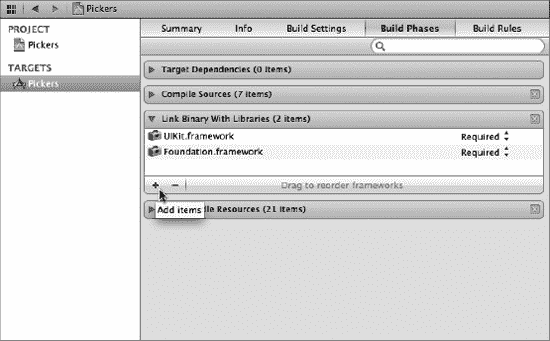

**图 7–23.** *要向项目中添加框架，请在项目导航器中选择目标，然后在出现的面板中选择相应的目标。最后，选择 Build Phases 标签页并展开 Link Binary With Libraries 折叠三角形。注意光标正悬停在 Add items 加号图标上。*

点击`Add items`图标，会弹出一个下拉列表，列出可用的框架。选择`AudioToolbox.framework`并点击`Add`按钮（见图 7–24）。

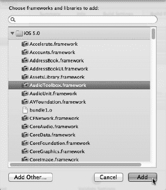

**图 7–24.** *向项目中添加框架*

现在，应用程序应该能够正确链接。运行时，`Spin`按钮会播放一个声音，中奖时也会播放胜利音效。太棒了！

### 最终旋转

到现在为止，你应该已经熟悉了标签栏应用程序和选择器。在本章中，我们从零开始构建了一个包含五个不同内容视图的完整标签栏应用程序。你学习了如何在不同配置下使用选择器，如何创建多组件选择器，甚至如何让一个组件中的值依赖于另一个组件中选择的值。你还看到了如何让选择器显示图像而不仅仅是文本。

在此过程中，你学习了选择器委托和数据源，以及如何加载图像、播放声音、从属性列表创建字典，并将项目链接到额外框架。这一章内容很多，恭喜你坚持完成了！当你准备好开始学习表视图时，翻到下一页，我们将继续前进。

