# 第 8 章

## 表视图入门

在下一章中，我们将构建一个类似于 iOS 设备上 Mail 应用程序的层次化导航应用程序。我们的应用程序允许用户深入嵌套的数据列表并编辑数据。但在构建该应用程序之前，你需要掌握表视图的概念。这就是本章的目标。

表视图是向用户显示数据列表的最常用机制。它们是高度可配置的对象，几乎可以以任何你想要的外观呈现。Mail 使用表视图显示账户、文件夹和消息列表，但表视图不仅限于显示文本数据。YouTube、设置和 iPod 应用程序也使用了表视图，尽管它们的外观截然不同（见图 8–1）。

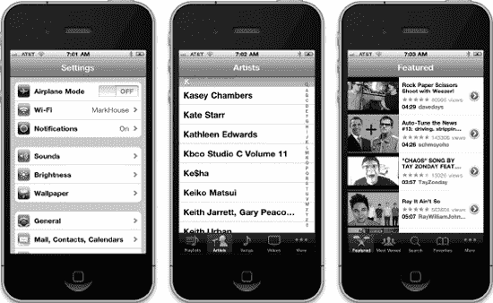

**图 8–1.** *尽管外观不同，设置、iPod 和 YouTube 应用程序都使用表视图来显示数据。*

### 表视图基础

表用于显示数据列表。表中的每一项都是一行。iOS 表可以有无限行，仅受可用内存量限制。iOS 表只能有一列宽。

#### 表视图与表视图单元格

表视图是显示表数据的视图对象，是`UITableView`类的实例。每个可见行由`UITableViewCell`类实现。因此，表视图是显示表可见部分的对象，而表视图单元格负责显示表中的单一行（见图 8–2）。

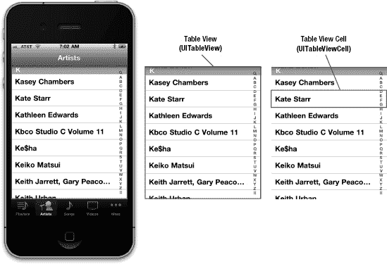

**图 8–2.** *每个表视图是`UITableView`的实例，每个可见行是`UITableViewCell`的实例。*

表视图不负责存储表的数据。它们只存储足够的数据来绘制当前可见的行。表视图从符合`UITableViewDelegate`协议的对象获取配置数据，从符合`UITableViewDataSource`协议的对象获取行数据。在本章稍后的示例程序中，你将看到这一切是如何工作的。

如前所述，所有表都实现为单列。但图 8–1 右侧显示的 YouTube 应用程序，看起来至少有兩列，如果算上图标甚至可能是三列。然而，表中的每一行都由一个`UITableViewCell`对象表示。每个`UITableViewCell`对象可以配置图像、文本以及可选的辅助图标（右侧的小图标，我们将在下一章详细讨论辅助图标）。

如果需要，你还可以通过向`UITableViewCell`添加子视图来放入更多数据，使用两种基本技术之一：创建单元格时以编程方式添加子视图，或从 nib 文件加载子视图。你可以以任何喜欢的方式布局表视图单元格，并包含任何想要的子视图。因此，单列限制远没有听起来那么有限。如果这让你感到困惑，别担心——我们将在本章中展示如何使用这两种技术。


#### 分组表与纯表

表视图有两种基本样式：

- **分组**：分组表中的每个分组都是一组嵌入圆角矩形中的行，如图 8-3 最左侧图片所示。请注意，分组表可以由单个分组构成。
- **纯表**：纯表是默认样式。任何不带圆角矩形的表都是纯表视图。当使用索引时，这种样式也称为**索引表**。

如果你的数据源提供了必要信息，表视图将允许用户通过显示在右侧的索引来浏览列表。图 8-3 展示了一个分组表、一个无索引的纯表，以及一个带索引的纯表（即索引表）。

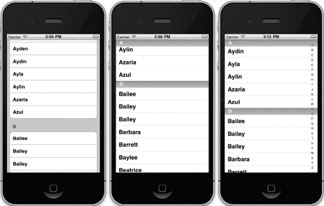

**图 8-3.** *同一个表视图以分组表（左）、无索引纯表（中）和带索引纯表（也称索引表，右）三种形式呈现*

表中的每个分区在数据源中被称为一个**节**。在分组表中，每个分组就是一个节。在索引表中，每个索引分组数据就是一个节。例如，在图 8-3 所示的索引表中，所有以 *A* 开头的姓名组成一个节，以 *B* 开头的组成另一个节，以此类推。

节有两个主要用途。在分组表中，每个节代表一个分组。在索引表中，每个节对应一个索引条目。例如，如果你想按字母顺序显示一个列表，并为每个字母提供索引条目，那么你将拥有 26 个节，每个节包含所有以该特定字母开头的值。

**注意：** 尽管从技术上讲可以创建一个带索引的分组表，但你不应这样做。*《iPhone 人机界面指南》* 明确说明分组表不应提供索引。

### 实现一个简单表格

让我们来看一个最简单的表视图示例，以了解其工作原理。在这个示例中，我们只需显示一个文本值列表。

在 Xcode 中创建一个新项目。本章我们将回到*单视图应用程序*模板，因此选择该模板。将项目命名为 *Simple Table*，将*类前缀*设为 *BID*，并将*设备系列*设为 *iPhone*。确保未勾选*使用故事板*和*包含单元测试*复选框。

#### 设计视图

在项目导航器中，展开 *Simple Table* 项目及 *Simple Table* 文件夹。这个应用程序非常简单，我们不需要任何输出口或动作。继续选择 `BIDViewController.xib` 来编辑 GUI。如果*视图*窗口在布局区域中不可见，请单击其停靠栏中的图标以打开它。然后在对象库中找到*表视图*（参见图 8-4），并将其拖到*视图*窗口中。

表视图应自动调整自身大小以匹配视图的高度和宽度。这正是我们想要的。表视图旨在填充屏幕的整个宽度，以及未被应用程序导航栏、工具栏和标签栏占用的高度。

将表视图拖放到*视图*窗口并使其紧贴状态栏下方后，它应该仍处于选中状态。如果没有，请单击表视图以将其选中。然后按 `6` 打开连接检查器。你会注意到表视图的前两个可用连接与选取器视图的前两个相同：`dataSource` 和 `delegate`。将这两个连接旁边的圆圈拖到*文件所有者*图标上。通过这种方式，我们使控制器类成为该表的数据源和委托。

设置连接后，保存 nib 文件，并准备深入研究一些 `UITableView` 代码。

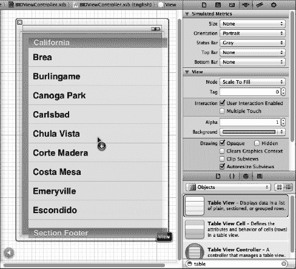

**图 8-4.** *将表视图从库中拖到我们的主视图上。请注意，表视图会自动调整大小以填满视图的完整尺寸。*


#### 编写控制器

接下来是控制器类的头文件。单击 `BIDViewController.h`，然后添加以下代码：

```
#import <UIKit/UIKit.h>

@interface BIDViewController : UIViewController
<UITableViewDelegate, UITableViewDataSource>

@property (strong, nonatomic) NSArray *listData;
@end
```

这里我们只是让类遵循两个协议，以便它能够作为表视图的委托和数据源，然后声明一个数组来保存要显示的数据。

保存更改。接着，切换到 `BIDViewController.m`，并在文件开头添加以下代码：

```
#import "BIDViewController.h"

@implementation BIDViewController
@synthesize listData;
.
.
.
- (void)viewDidLoad {
    [super viewDidLoad];
    // 加载视图后执行其他初始化工作，通常从 nib 文件加载。
    NSArray *array = [[NSArray alloc] initWithObjects:@"Sleepy", @"Sneezy",
        @"Bashful", @"Happy", @"Doc", @"Grumpy", @"Dopey", @"Thorin",
        @"Dorin", @"Nori", @"Ori", @"Balin", @"Dwalin", @"Fili", @"Kili",
        @"Oin", @"Gloin", @"Bifur", @"Bofur", @"Bombur", nil];
    self.listData = array;
}
.
.
.
```

现在，将以下一行代码添加到现有的 `viewDidUnload` 方法中：

```
- (void)viewDidUnload {
    [super viewDidUnload];
    // 释放主视图的任何保留子视图。
    // 例如 self.myOutlet = nil;
self.listData = nil;
}
```

最后，在文件末尾添加以下代码：

```
.
.
.
#pragma mark -
#pragma mark 表视图数据源方法
- (NSInteger)tableView:(UITableView *)tableView
    numberOfRowsInSection:(NSInteger)section {
    return [self.listData count];
}

- (UITableViewCell *)tableView:(UITableView *)tableView
       cellForRowAtIndexPath:(NSIndexPath *)indexPath {

    static NSString *SimpleTableIdentifier = @"SimpleTableIdentifier";

    UITableViewCell *cell = [tableView dequeueReusableCellWithIdentifier:
        SimpleTableIdentifier];
    if (cell == nil) {
        cell = [[UITableViewCell alloc]
           initWithStyle:UITableViewCellStyleDefault
           reuseIdentifier:SimpleTableIdentifier];
    }

    NSUInteger row = [indexPath row];
    cell.textLabel.text = [listData objectAtIndex:row];
    return cell;
}

@end
```

我们向控制器添加了三个方法。第一个方法 `viewDidLoad` 你应该很熟悉，因为之前做过类似的事情。这里只是创建一个数据数组传递给表格。在实际应用中，这个数组可能来自其他来源，比如文本文件、属性列表或 URL。

如果你滚动到底部，会看到我们添加了两个数据源方法。第一个方法 `tableView:numberOfRowsInSection:` 被表格用来询问特定分区中有多少行。正如你所料，默认分区数为 1，这个方法将被调用来获取构成列表的这一分区中的行数。我们只需返回数组中的元素个数。

下一个方法可能需要稍作解释，让我们更详细地看看它。

```
- (UITableViewCell *)tableView:(UITableView *)tableView
       cellForRowAtIndexPath:(NSIndexPath *)indexPath {
```

当表格需要绘制某一行时，会调用此方法。注意，该方法的第二个参数是 `NSIndexPath` 实例。这是表视图用来将分区和行封装到单个对象中的机制。要从 `NSIndexPath` 中获取行号或分区号，只需调用它的 `row` 方法或 `section` 方法，两者都返回一个 `int`。

第一个参数 `tableView` 是请求数据的表格的引用。这允许我们创建能够作为多个表格数据源的类。

接下来，我们声明一个静态字符串实例。

```
static NSString *SimpleTableIdentifier = @"SimpleTableIdentifier";
```

这个字符串将用作键，代表我们表格单元格的类型。我们的表格只会使用一种类型的单元格。

在 iPhone 的小屏幕上，一次只能显示几行，但表格本身理论上可以包含更多行。记住，表格中的每一行都由 `UITableViewCell` 的一个实例表示，它是 `UIView` 的子类，这意味着每一行都可以包含子视图。对于一个大型表格，如果表格试图为每一行都保留一个表格视图单元格实例（无论该行当前是否正在显示），那将产生巨大的开销。幸运的是，表格并非如此工作。

相反，当表格视图单元格滚出屏幕时，它们会被放入一个可重用单元格队列中。如果系统内存不足，表格视图会丢弃队列中的单元格。但只要系统有足够的内存来保留这些单元格，它就会保留它们，以备你再次使用。

每当一个表格视图单元格滚出屏幕时，很可能另一个单元格正从另一侧滚入屏幕。如果这个新行可以重用已经滚出屏幕的单元格之一，系统就能避免不断创建和释放这些视图的开销。为了利用这种机制，我们会请求表格视图提供一个之前使用过的指定类型的单元格。注意，我们使用了之前声明的 `NSString` 标识符。实际上，我们是在请求一个类型为 `SimpleTableIdentifier` 的可重用单元格。

```
   UITableViewCell *cell = [tableView dequeueReusableCellWithIdentifier:
       SimpleTableIdentifier];
```

当然，表格视图可能没有任何空闲单元格（例如，在初始填充时），所以我们在调用后检查 `cell` 是否为 `nil`。如果是，我们就手动使用该标识符字符串创建一个新的表格视图单元格。在某个时刻，我们必然会在代码中重用这里创建的某个单元格，因此我们需要确保使用 `SimpleTableIdentifier` 来创建它。

```
   if (cell == nil) {
       cell = [[UITableViewCell alloc]
            initWithStyle:UITableViewCellStyleDefault
            reuseIdentifier:SimpleTableIdentifier];
   }
```

对 `UITableViewCellStyleDefault` 感到好奇吗？先记住这个问题，我们会在讨论表格视图单元格样式时详细讲解。

现在，我们有了一个可以返回给表格视图使用的表格视图单元格。接下来要做的就是将我们想要显示的信息放入这个单元格。在表格行中显示文本是一个非常常见的任务，因此表格视图单元格提供了一个名为 `textLabel` 的 `UILabel` 属性，我们可以设置它来显示字符串。这只需要从我们的 `listData` 数组中获取正确的字符串，并用它来设置单元格的 `textLabel`。

为了获取正确的值，我们需要知道表格视图正在请求哪一行。我们从 `indexPath` 变量中获取该信息，如下所示：

```
NSUInteger row = [indexPath row];
```

我们使用表格的行号从数组中获取对应的字符串，将其赋值给单元格的 `textLabel.text` 属性，然后返回该单元格。

```
   cell.textLabel.text = [listData objectAtIndex:row];
   return cell;
}
```

这不算太难，对吧？编译并运行你的应用程序，你应该会看到数组值显示在表视图中（见图 8-5）。

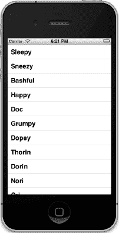

**图 8-5.** *简单表格应用，尽显矮人风采*


### 添加图片

如果我们能在每一行都添加一张图片，那就更好了。你可能觉得，为此我们需要创建一个 `UITableViewCell` 的子类，或者添加子视图，对吧？其实不然——如果你能接受图片位于每行左侧的话，默认的表格视图单元格就能很好地处理这种情况。我们来看看具体操作。

在项目归档文件的 *08 - Simple Table* 文件夹中，找到名为 *star.png* 的文件，并将其添加到项目的 *Simple Table* 文件夹中。*star.png* 是我们为此项目准备的一个小图标。

接下来，我们进入代码部分。在文件 `BIDViewController.m` 中，将以下代码添加到 `tableView:cellForRowAtIndexPath:` 方法中：

```
- (UITableViewCell *)tableView:(UITableView *)tableView
         cellForRowAtIndexPath:(NSIndexPath *)indexPath {

    static NSString *SimpleTableIdentifier = @" SimpleTableIdentifier ";

    UITableViewCell *cell = [tableView dequeueReusableCellWithIdentifier:
                                SimpleTableIdentifier];
    if (cell == nil) {
        cell = [[UITableViewCell alloc]
            initWithStyle:UITableViewCellStyleDefault
            reuseIdentifier:SimpleTableIdentifier];
    }

    UIImage *image = [UIImage imageNamed:@"star.png"];
    cell.imageView.image = image;

    NSUInteger row = [indexPath row];
    cell.textLabel.text = [listData objectAtIndex:row];

    return cell;
}
@end
```

没错，就是这样。每个单元格都有一个 `imageView` 属性。每个 `imageView` 除了有 `image` 属性外，还有一个 `highlightedImage` 属性。图片会显示在单元格文本的左侧，并且如果设置了 `highlightedImage`，当单元格被选中时，就会显示该高亮图片。你只需将单元格的 `imageView.image` 属性设置为你想要显示的图片即可。

现在编译并运行你的应用程序，你会看到一个列表，每一行的左侧都显示了一排漂亮的小星星图标（见图 8–6）。当然，我们也可以为表格中的每一行设置不同的图片。或者，只需稍加改动，就可以为迪士尼先生的所有小矮人使用一个图标，而为托尔金先生的人物使用另一个图标。

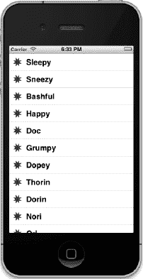

**图 8–6.** *我们利用单元格的 image 属性，为表格视图的每个单元格添加了一张图片。*

如果你愿意，可以复制一份 *star.png*，用你喜欢的图形软件给它上点色，然后添加到项目中，通过 `imageNamed:` 加载它，并用它来设置 `imageView.highlightedImage`。现在，当你点击一个单元格时，就会显示你新制作的图片。如果你不想上色，也可以使用项目归档文件中提供的 *star2.png* 图标。

**注意：** `UIImage` 会基于文件名使用缓存机制，所以每次调用 `imageNamed:` 时，并不会重新加载新的 `image` 属性，而是会使用已经缓存过的版本。

### 使用表格视图单元格样式

到目前为止，你对表格视图的操作都使用了默认的单元格样式，如图 8–6 所示，该样式由常量 `UITableViewCellStyleDefault` 表示。但 `UITableViewCell` 类还包含其他几种预定义的单元格样式，可以让你轻松地为表格视图增添一些变化。这些单元格样式使用了三种不同的单元格元素：

- **图片**：如果指定的样式包含图片，图片会显示在单元格文本的左侧。
- **文本标签**：这是单元格的主要文本。在我们之前使用的 `UITableViewCellStyleDefault` 样式中，文本标签是单元格中唯一显示的文本。
- **详细文本标签**：这是单元格的次要文本，通常用作解释性说明或标签。

为了看看这些新增样式的效果，请在 `BIDViewController.m` 的 `tableView:cellForRowAtIndexPath:` 方法中添加以下代码：

```
- (UITableViewCell *)tableView:(UITableView *)tableView
         cellForRowAtIndexPath:(NSIndexPath *)indexPath {

    static NSString *SimpleTableIdentifier = @"SimpleTableIdentifier";

    UITableViewCell *cell = [tableView dequeueReusableCellWithIdentifier:
                             SimpleTableIdentifier];
    if (cell == nil) {
        cell = [[UITableViewCell alloc]
            initWithStyle:UITableViewCellStyleDefault
            reuseIdentifier: SimpleTableIdentifier];
    }

    UIImage *image = [UIImage imageNamed:@"star.png"];
    cell.imageView.image = image;

    NSUInteger row = [indexPath row];
    cell.textLabel.text = [listData objectAtIndex:row];

    if (row < 7)
            cell.detailTextLabel.text = @"Disney 先生";
        else
            cell.detailTextLabel.text = @"Tolkien 先生";

    return cell;
}
```

我们在这里只设置了单元格的详细文本。对于前七行，我们使用字符串 `@"Disney 先生"`，其余行使用 `@"Tolkien 先生"`。当你运行这段代码时，每个单元格看起来和之前一模一样（见图 8–7）。这是因为我们使用的样式是 `UITableViewCellStyleDefault`，而该样式并不使用详细文本。


**图 8–7.** *默认单元格样式将图片和文本标签显示在同一行。*

现在，将 `UITableViewCellStyleDefault` 改为 `UITableViewCellStyleSubtitle`，然后再次运行应用程序。使用副标题样式时，两个文本元素都会显示，一个在另一个的下方（见图 8–8）。

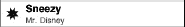

**图 8–8.** *副标题样式将详细文本以较小的灰色字体显示在文本标签下方。*

将 `UITableViewCellStyleSubtitle` 改为 `UITableViewCellStyleValue1`，然后构建并运行。这种样式会将文本标签和详细文本标签放在同一行，分别位于单元格的两侧（见图 8–9）。

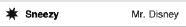

**图 8–9.** *样式值 1 会将文本标签以黑色字体放在左侧，详细文本以蓝色字体右对齐放在右侧。*

最后，将 `UITableViewCellStyleValue1` 改为 `UITableViewCellStyleValue2`。这种格式通常用于显示信息，并附带一个描述性标签。它不会显示单元格图标，而是将详细文本标签放在文本标签的左侧（见图 8–10）。在这种布局中，详细文本标签充当了描述文本标签数据类型的标签。

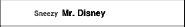

**图 8–10.** *样式值 2 不显示图片，并将详细文本标签以蓝色字体放在文本标签的左侧。*

现在你已经了解了可用的单元格样式，请继续之前，把样式改回 `UITableViewCellStyleDefault`。在本章稍后的内容中，你将学习如何自定义表格的外观。但在你决定这么做之前，请务必考虑一下已有的样式，看看它们中是否有一种能满足你的需求。

你可能已经注意到，我们让控制器同时充当了这个表格视图的数据源和委托，但到目前为止，我们还没有实际实现 `UITableViewDelegate` 中的任何方法。与选择器视图不同，较简单的表格视图不需要依赖委托就能完成其功能。数据源提供了绘制表格所需的所有数据。委托的作用是配置表格视图的外观，并处理某些用户交互。现在，我们来看看一些配置选项。我们将在下一章讨论更多相关内容。


#### 设置缩进级别

通过委托可以指定某些行应当进行缩进。在文件 `BIDViewController.m` 中，在 `@end` 声明之前添加以下方法：

```
#pragma mark -
#pragma mark Table Delegate Methods

- (NSInteger)tableView:(UITableView *)tableView    indentationLevelForRowAtIndexPath:(NSIndexPath *)indexPath {
       NSUInteger row = [indexPath row];
    return row;
}
```

此方法将每行的`缩进级别`设置为其行号，因此第 0 行的缩进级别为 0，第 1 行的缩进级别为 1，依此类推。缩进级别本质上是一个整数，用于告知表格视图将该行向右移动一点。该值越大，行向右缩进的距离就越远。例如，你可以用这种技术来表示某一行从属于另一行，就像邮件应用在显示子文件夹时所做的那样。

当你再次运行程序时，可以看到每一行都比上一行稍微向右偏移了一些（参见图 8–11）。

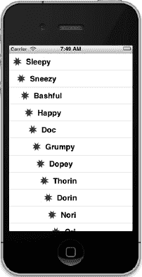

**图 8–11.** *表格中的每一行都绘制为比前一行更高的缩进级别。*

#### 处理行选择

表格的委托可以使用两个方法来判断用户是否选择了某一行。一个方法在行被选中之前调用，可用于阻止该行被选中，甚至更改被选中的行。让我们实现该方法，并指定第一行不可选。在`BIDViewController.m` 文件末尾、`@end` 声明之前添加以下方法：

```
-(NSIndexPath *)tableView:(UITableView *)tableView
      willSelectRowAtIndexPath:(NSIndexPath *)indexPath {
   NSUInteger row = [indexPath row];

   if (row == 0)
       return nil;

   return indexPath;
}
```

该方法接收 `indexPath` 参数，代表即将被选中的项目。我们的代码查看即将被选中的是哪一行。如果该行是第一行（索引始终为 0），则返回 `nil`，表示实际上不应选中任何行。否则，返回 `indexPath`，通过这种方式我们表示允许继续执行选择操作。

在编译并运行之前，我们还要实现行被选中后调用的委托方法，这通常是实际处理选择操作的地方。在这里，你可以根据用户选中的行执行相应的操作。在下一章中，我们将用此方法来处理下钻操作，但本章我们仅弹出一个警告框来显示被选中的行。在`BIDViewController.m` 底部、`@end` 声明之前再次添加以下方法：

```
- (void)tableView:(UITableView *)tableView
       didSelectRowAtIndexPath:(NSIndexPath *)indexPath {
    NSUInteger row = [indexPath row];
    NSString *rowValue = [listData objectAtIndex:row];

    NSString *message = [[NSString alloc] initWithFormat:
        @"You selected %@", rowValue];
    UIAlertView *alert = [[UIAlertView alloc]
        initWithTitle:@"Row Selected!"
              message:message
              delegate:nil
    cancelButtonTitle:@"Yes I Did"
    otherButtonTitles:nil];
    [alert show];

    [tableView deselectRowAtIndexPath:indexPath animated:YES];
}
```

添加完此方法后，编译并运行应用程序，进行测试。尝试能否选中第一行（你应该无法选中），然后选择其他行。被选中的行应当高亮，随后弹出警告框，告知你选择了哪一行，同时被选中的行在背景中淡出（参见图 8–12）。

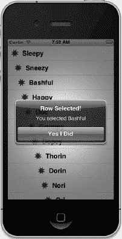

**图 8–12.** *在此示例中，第一行不可选，当选择任何其他行时，会显示一个警告框。这是通过使用委托方法实现的。*

请注意，你也可以在返回之前修改索引路径，这会导致选中不同的行和/或分区。这种做法不常用，因为改变用户的选择需要有非常充分的理由。在绝大多数情况下，使用此方法时，要么原样返回 `indexPath` 以允许选择，要么返回 `nil` 以禁止选择。

#### 更改字体大小与行高

假设我们要更改表格视图中使用的字体大小。在大多数情况下，不应覆盖默认字体，因为这是用户期望看到的。但有时确实有正当理由更改字体。在 `tableView:cellForRowAtIndexPath:` 方法中添加以下代码行：

```
- (UITableViewCell *)tableView:(UITableView *)tableView
         cellForRowAtIndexPath:(NSIndexPath *)indexPath
{
    static NSString *SimpleTableIdentifier = @"SimpleTableIdentifier";

    UITableViewCell *cell = [tableView dequeueReusableCellWithIdentifier:
                             SimpleTableIdentifier];
    if (cell == nil) {
        cell = [[UITableViewCell alloc]
            initWithStyle:UITableViewCellStyleDefault
            reuseIdentifier: SimpleTableIdentifier];
    }

    UIImage *image = [UIImage imageNamed:@"star.png"];
    cell.image = image;

    NSUInteger row = [indexPath row];
    cell.textLabel.text = [listData objectAtIndex:row];
    cell.textLabel.font = [UIFont boldSystemFontOfSize:50];

    if (row < 7)
        cell.detailTextLabel.text = @"Mr. Disney";
    else
        cell.detailTextLabel.text = @"Mr. Tolkein";
    return cell;
}
```

现在运行程序时，列表中的值会以非常大的字体显示，但它们无法完全适应行宽（参见图 8–13）。

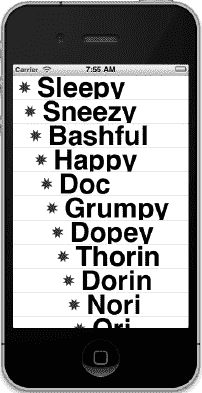

**图 8–13.** *看这又大又漂亮的字体！但是，如果能看到全部内容就更好了。*

好吧，现在轮到表格视图委托来救场了！表格视图委托可以指定表格视图行的高度。事实上，如果有必要，它可以为每一行指定唯一的高度值。继续在控制器类中添加此方法，放在 `@end` 之前：

```
- (CGFloat)tableView:(UITableView *)tableView
    heightForRowAtIndexPath:(NSIndexPath *)indexPath {
    return 70;
}
```

我们刚刚告知表格视图将所有行的高度设置为 70 像素。编译并运行，表格的行应该会变得高很多（参见图 8–14）。

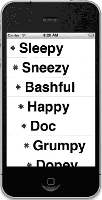

**图 8–14.** *使用委托更改行大小*

委托还处理其他任务，但剩余的大多数任务会在你开始处理分层数据时发挥作用，我们将在下一章中介绍。要了解更多信息，请使用文档浏览器探索 `UITableViewDelegate` 协议，查看还有哪些其他可用方法。

### 自定义表格视图单元格

表格视图开箱即可实现很多功能，但通常你需要以 `UITableViewCell` 本身不支持的方式来格式化每行的数据。在这种情况下，有两种基本方法：一种是在创建单元格时通过编程方式向 `UITableViewCell` 添加子视图，另一种是从 nib 文件加载一组子视图。让我们看看这两种技术。


### 向表格视图单元格添加子视图

为了演示如何使用自定义单元格，我们将创建一个包含另一个表格视图的新应用程序。在每一行中，我们将显示两行信息以及两个标签（参见图 8-15）。我们的应用将展示一系列可能熟悉的计算机型号的名称和颜色，并通过向表格视图单元格添加子视图的方式，将这两项信息同时显示在同一个表格单元格中。

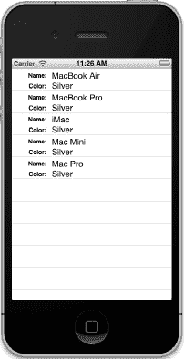

**图 8-15** *向表格视图单元格添加子视图可以实现多行显示。*

使用*单视图应用*模板创建一个新的 Xcode 项目。将项目命名为*Cells*，并使用与上一个项目相同的设置。点击*BIDViewController.xib*，在 Interface Builder 中编辑该 nib 文件。

向主视图添加一个*表格视图*，使用连接检查器将其 `delegate` 和 `dataSource` 设置为*文件所有者*（就像我们在 Simple Table 应用中所做的那样），然后保存 nib。

### 创建 UITableViewCell 子类

到目前为止，我们一直使用的标准表格视图单元格已经为我们处理了所有单元格布局的细节。我们的控制器代码无需处理标签和图片放置位置的繁琐细节，只需将显示值传递给单元格即可。这样可以将展示逻辑与控制器分离，这是值得坚持的良好设计。对于这个项目，我们将创建一个自己的新单元格子类，负责处理新布局的细节，从而使我们的控制器尽可能保持简单。

#### 添加新单元格

在项目导航器中选择*Cells*文件夹，然后按  **N** 创建一个新文件。在弹出的向导中，从*Cocoa Touch*部分选择*Objective-C 类*，然后点击*下一步*。在接下来的屏幕上，输入*BIDNameAndColorCell*作为新类的名称，在*继承自*弹出列表中选择*UITableViewCell*，再次点击*下一步*。在最后一步，选择已包含其他源代码的*Cells*文件夹，确保底部的*组*和*目标*都选择了*Cells*，然后点击*创建*。

选择*BIDNameAndColorCell.h*，添加以下代码：

```
#import <UIKit/UIKit.h>
@interface BIDNameAndColorCell : UITableViewCell

@property (copy, nonatomic) NSString *name;
@property (copy, nonatomic) NSString *color;

@end
```

这里，我们定义了两个属性，控制器将使用它们向每个单元格传递值。注意，我们并没有使用 `strong` 语义声明 `NSString` 属性，而是使用了 `copy`。对于 `NSString` 值，这样做始终是个好主意，因为传递给属性设置器的字符串值有可能实际上是一个 `NSMutableString`，发送者稍后可能会修改它，从而导致问题。复制传递给属性的每个字符串，可以为我们提供一个在调用设置器时该字符串内容的稳定且不可更改的快照。

这就是我们在头文件中需要暴露的全部内容，接下来进入*BIDNameAndColorCell.m*。在文件顶部添加以下代码：

```
#import "BIDNameAndColorCell.h"

#define kNameValueTag    1
#define kColorValueTag   2

@implementation BIDNameAndColorCell

@synthesize name;
@synthesize color;
.
.
.
```

注意，我们定义了两个常量。我们将使用这些常量为将要添加到表格视图单元格的一些子视图分配标签。我们将向单元格添加四个子视图，其中两个需要为每一行进行更改。为此，我们需要某种机制，使得在更新特定行数据到单元格时，能够从单元格中检索这两个字段。如果我们为每个稍后会再次使用的标签设置了唯一的标签值，我们就可以从表格视图单元格中检索它们并设置其值。我们还声明了 `name` 和 `color` 属性，控制器将使用它们来设置单元格中应显示的值。

现在，编辑现有的 `initWithStyle:reuseIdentifier:` 方法，创建我们需要显示的视图。

```
- (id)initWithStyle:(UITableViewCellStyle)style reuseIdentifier:(NSString
*)reuseIdentifier
{
    self = [super initWithStyle:style reuseIdentifier:reuseIdentifier];
    if (self) {
        // 初始化代码
        CGRect nameLabelRect = CGRectMake(0, 5, 70, 15);
        UILabel *nameLabel = [[UILabel alloc] initWithFrame:nameLabelRect];
        nameLabel.textAlignment = UITextAlignmentRight;
        nameLabel.text = @"名称:";
        nameLabel.font = [UIFont boldSystemFontOfSize:12];
        [self.contentView addSubview: nameLabel];

        CGRect colorLabelRect = CGRectMake(0, 26, 70, 15);
        UILabel *colorLabel = [[UILabel alloc] initWithFrame:colorLabelRect];
        colorLabel.textAlignment = UITextAlignmentRight;
        colorLabel.text = @"颜色:";
        colorLabel.font = [UIFont boldSystemFontOfSize:12];
        [self.contentView addSubview: colorLabel];

        CGRect nameValueRect = CGRectMake(80, 5, 200, 15);
        UILabel *nameValue = [[UILabel alloc] initWithFrame:
                              nameValueRect];
        nameValue.tag = kNameValueTag;
        [self.contentView addSubview:nameValue];

        CGRect colorValueRect = CGRectMake(80, 25, 200, 15);
        UILabel *colorValue = [[UILabel alloc] initWithFrame:
                               colorValueRect];
        colorValue.tag = kColorValueTag;
        [self.contentView addSubview:colorValue];
    }
    return self;
}
```

这应该相当直观。我们创建了四个 `UILabel` 并将它们添加到表格视图单元格。表格视图单元格本身已经有一个名为 `contentView` 的 `UIView` 子视图，用于分组其所有子视图，就像我们在第 4 章中将那两个开关分组到一个 `UIView` 中一样。因此，我们不是直接将标签作为子视图添加到表格视图单元格，而是添加到它的 `contentView` 中。

`[self.contentView addSubview:colorValue];`

其中两个标签包含静态文本。标签 `nameLabel` 包含文本*名称:*，标签 `colorLabel` 包含文本*颜色:*。这些是无需更改的标签。但我们将使用另外两个标签来显示特定行的数据。请记住，我们稍后需要某种方式来检索这些字段，因此我们为它们都分配了值。例如，我们将常量 `kNameValueTag` 分配给 `nameValue` 的标签字段。

`nameValue.tag = kNameValueTag;`

最后，为了完成 `BIDNameAndColorCell` 类的收尾工作，请在 `@end` 之前添加这两个设置器方法：

```
- (void)setName:(NSString *)n {
    if (![n isEqualToString:name]) {
        name = [n copy];
        UILabel *nameLabel = (UILabel *)[self.contentView viewWithTag:
                                    kNameValueTag];
        nameLabel.text = name;
    }
}

- (void)setColor:(NSString *)c {
    if (![c isEqualToString:color]) {
        color = [c copy];
        UILabel *colorLabel = (UILabel *)[self.contentView viewWithTag:
                                    kColorValueTag];
        colorLabel.text = color;
    }
}
```

你已经知道，使用 `@synthesize`（正如我们在文件顶部所做的那样）会为每个属性创建 getter 和 setter 方法。然而，这里我们为 `name` 和 `color` 定义了自定义的设置器！事实证明，这完全没问题。只要一个类定义了自己的 getter 或 setter，就会使用这些自定义方法，而不是 `@synthesize` 提供的默认方法。在这个类中，我们使用了默认合成的 getter，但定义了自定义的设置器，这样每当我们为 `name` 或 `color` 属性传递新值时，就会更新之前创建的标签。


### 实现控制器的代码

现在，我们来设置这个简易控制器，以便在漂亮的新单元格中显示数值。首先选中`BIDViewController.h`，在其中添加以下代码：

```
#import <UIKit/UIKit.h>

@interface BIDViewController : UIViewController <UITableViewDataSource, UITableViewDelegate>

@property (strong, nonatomic) NSArray *computers;
@end
```

在控制器中，我们需要准备一些待使用的数据，然后实现表格数据源方法，将这些数据提供给表格。切换到`BIDViewController.m`，在文件开头添加以下代码：

```
#import "BIDViewController.h"
#import "BIDNameAndColorCell.h"

@implementation ViewController
@synthesize computers;
.
.
.
- (void)viewDidLoad {
    [super viewDidLoad];
    // 此处可添加从 nib 加载视图后的其他设置

    NSDictionary *row1 = [[NSDictionary alloc] initWithObjectsAndKeys:
                      @"MacBook", @"Name", @"White", @"Color", nil];
    NSDictionary *row2 = [[NSDictionary alloc] initWithObjectsAndKeys:
                      @"MacBook Pro", @"Name", @"Silver", @"Color", nil];
    NSDictionary *row3 = [[NSDictionary alloc] initWithObjectsAndKeys:
                      @"iMac", @"Name", @"Silver", @"Color", nil];
    NSDictionary *row4 = [[NSDictionary alloc] initWithObjectsAndKeys:
                      @"Mac Mini", @"Name", @"Silver", @"Color", nil];
    NSDictionary *row5 = [[NSDictionary alloc] initWithObjectsAndKeys:
                      @"Mac Pro", @"Name", @"Silver", @"Color", nil];

    self.computers = [[NSArray alloc] initWithObjects:row1, row2,
                      row3, row4, row5, nil];
}
.
.
.
```

当然，我们要养成良好的内存管理习惯，因此对现有的`viewDidUnload`方法进行如下修改：

```
- (void)viewDidUnload {
    [super viewDidUnload];
    // 释放主视图中所有持有的子视图。
    // 例如: self.myOutlet = nil;
    self.computers = nil;
}
```

然后在文件末尾、`@end`声明上方添加以下代码：

```
.
.
.
#pragma mark -
#pragma mark 表格数据源方法
- (NSInteger)tableView:(UITableView *)tableView
    numberOfRowsInSection:(NSInteger)section {
    return [self.computers count];
}

-(UITableViewCell *)tableView:(UITableView *)tableView
    cellForRowAtIndexPath:(NSIndexPath *)indexPath {
    static NSString *CellTableIdentifier = @"CellTableIdentifier";

    BIDNameAndColorCell *cell = [tableView dequeueReusableCellWithIdentifier:
                             CellTableIdentifier];
    if (cell == nil) {
        cell = [[BIDNameAndColorCell alloc]
                 initWithStyle:UITableViewCellStyleDefault
                 reuseIdentifier:CellTableIdentifier];
    }

    NSUInteger row = [indexPath row];
    NSDictionary *rowData = [self.computers objectAtIndex:row];

    cell.name = [rowData objectForKey:@"Name"];
    cell.color = [rowData objectForKey:@"Color"];

    return cell;
}

@end
```

这个版本的`viewDidLoad`创建了一系列字典。每个字典包含表格中一行的名称和颜色信息。该行的名称以`Name`为键存储在字典中，颜色以`Color`为键存储。我们将所有字典放入一个数组中，这就是该表格的数据。

**注意：** 还记得 Mac 曾经有过各种颜色吗？比如米色、铂金色、黑色和白色？更别提最初 iMac 和 MacBook 系列那美丽的彩虹色系了。如今只剩下一种颜色：银色。唉。

让我们聚焦于`tableView:cellForRowWithIndexPath:`方法，因为这里才真正涉足新内容。前两行代码与之前的版本几乎相同。我们创建了一个标识符，并请求表格复用已有的表格视图单元格（如果有）。唯一的不同在于，我们将`cell`变量声明为`BIDNameAndColorCell`类的实例，而不是标准的`UITableViewCell`。这样我们就能访问专门为表格视图单元格子类添加的属性。

如果表格没有可复用的单元格，我们需要创建一个新单元格。这与之前的技巧本质上相同，只是这里我们同样使用了自定义类，而非`UITableViewCell`。我们指定了默认样式，但实际上样式并不重要，因为我们会添加自己的子视图来显示数据，而不是使用系统提供的视图。

```
   cell = [[BIDNameAndColorCell alloc]
       initWithStyle:UITableViewCellStyleDefault
       reuseIdentifier:CellTableIdentifier];
```

创建好新单元格后，我们利用传入的`indexPath`参数，确定表格请求的是哪一行单元格，然后用该行数值从字典中取出对应行的数据。请记住，字典有两个键值对：一个包含名称，另一个包含颜色。

```
    NSUInteger row = [indexPath row];
    NSDictionary *rowData = [self.computers objectAtIndex:row];
```

现在，剩下要做的就是使用我们在子类中定义的属性，将所选行的数据填充到单元格中。

```
    cell.name = [rowData objectForKey:@"Name"];
    cell.color = [rowData objectForKey:@"Color"];
```

编译并运行你的应用程序。你会看到一个包含多行的表格，每行显示两行数据，如图 8–15 所示。

能够为表格视图单元格添加视图的方式，相比单独使用标准表格视图单元格提供了更大的灵活性，但通过编程方式创建、定位和添加所有子视图可能会有些繁琐。啊，要是能使用 Xcode 的 nib 编辑器以图形方式设计表格视图单元格，那该多好。幸运的是，我们确实可以。正如之前提到的，你可以使用 Interface Builder 设计表格视图单元格，然后在创建新单元格时直接从 nib 文件加载这些视图。


#### 从 Nib 加载 `UITableViewCell`

我们将利用 Xcode 在 Interface Builder 中提供的可视化布局能力，重新创建刚才用代码编写的那个两行界面。为此，我们需要创建一个新的 nib 文件，该文件将包含表格视图单元格，并使用 Interface Builder 来布局其视图。这样，当我们需要一个表格视图单元格来表示某一行时，就不必创建标准的表格视图单元格了，而只需加载这个 nib 文件，并使用我们在单元格类中已定义的属性来设置名称和颜色。除了利用 Interface Builder 的可视化布局外，我们还可以在其他几个地方简化代码。

首先，我们对 `BIDNameAndColorCell` 类进行一些修改。由于我们将在 nib 编辑器中进行连线，因此需要添加输出口（outlets）来指向需要访问的标签。在 *BIDNameAndColorCell.h* 文件的 `@interface` 声明中添加以下几行：

```
@interface BIDNameAndColorCell : UITableViewCell

@property (copy, nonatomic) NSString *name;
@property (copy, nonatomic) NSString *color;

@property (strong, nonatomic) IBOutlet UILabel *nameLabel;
@property (strong, nonatomic) IBOutlet UILabel *colorLabel;

@end
```

既然有了这些输出口，我们就不再需要标签（tags）了！切换到 *BIDNameAndColorCell.m* 文件，删除标签定义，并为我们的两个新输出口添加方法合成：

```
#import "BIDNameAndColorCell.h"

~~#define kNameValueTag    1~~
~~#define kColorValueTag   2~~

@implementation BIDNameAndColorCell

@synthesize name;
@synthesize color;
@synthesize nameLabel;
@synthesize colorLabel;
```

有了这些输出口，还意味着我们的两个 setter 方法都可以通过删除几行代码来简化：

```
- (void)setName:(NSString *)n {
    if (![n isEqualToString:name]) {
        name = [n copy];
~~      UILabel *nameLabel = (UILabel *)[self.contentView viewWithTag:
                                         kNameValueTag];~~
        nameLabel.text = name;
    }
}

- (void)setColor:(NSString *)c {
    if (![c isEqualToString:color]) {
        color = [c copy];
~~      UILabel *colorLabel = (UILabel *)[self.contentView viewWithTag:
                                          kColorValueTag];~~
        colorLabel.text = color;
    }
}
```

最后但同样重要的是，还记得我们在 `initWithStyle:reuseIdentifier:` 方法中创建标签时所做的那套设置吗？这些都可以删除了。实际上，你应该直接删除整个方法，因为所有这些设置现在都将由 Interface Builder 来完成。

做完这些之后，你得到的单元格类比以前更小巧、更简洁了。它现在唯一的实际功能就是将数据传送到标签上。接下来，我们需要在 Interface Builder 中重新创建这些标签。

在 Xcode 中右键点击 *Cells* 文件夹，然后从上下文菜单中选择 **New File…**。在新文件助手的左侧窗格中，点击 *User Interface*（确保选择的是 *iOS* 部分，而非 *Mac OS X* 部分）。从右上方的窗格中选择 *Empty*，然后点击 *Next*。在接下来的屏幕上，将 *Device Family* 弹出菜单保持为 *iPhone*，并再次点击 *Next*。当提示输入文件名时，键入 *BIDNameAndColorCell.xib*。确保文件浏览器中选中了主项目目录，并且 *Group* 弹出菜单中选中了 *Cells* 分组。

##### 在 Interface Builder 中设计表格视图单元格

接下来，在项目导航器中选择 *BIDNameAndColorCell.xib* 文件，打开进行编辑。这个 nib 的 dock 区域中只有两个图标：*File's Owner* 和 *First Responder*。在库中查找 *Table View Cell*（参见图 8–16），然后将其中一个拖拽到 GUI 布局区域中。

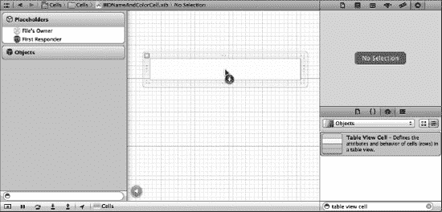

**图 8–16.** *我们将一个表格视图单元格从库中拖拽到了 nib 编辑器的 GUI 布局区域。*

确保选中的是表格视图单元格，按下 **5** 键打开尺寸检查器，在 *View* 部分将单元格的高度从 *44* 改为 *65*。这将为我们提供更多一点的操作空间。

接下来，按下 **4** 键转到属性检查器（参见图 8–17）。你会在那里看到第一个字段是 *Identifier*。这就是我们之前在代码中一直使用的重用标识符。如果对此没有印象，请回看本章并查找 `CellTableIdentifier`。将 *Identifier* 的值设置为 *CellTableIdentifier*。

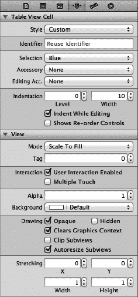

**图 8–17.** *表格视图单元格的属性检查器*

这样做是为了：当我们因滚动新单元格到视野中而需要获取一个可重用的单元格时，确保我们能得到正确的单元格类型。当这个特定的单元格从 nib 文件被实例化时，它的重用标识符实例变量会被预先填充你在属性检查器的 *Identifier* 字段中输入的那个 `NSString`——此处为 *CellTableIdentifier*。

设想这样一个场景：你创建了一个包含表头和一系列“中间”单元格的表格。如果你将一个中间单元格滚动到视野中，确保获取的是一个中间单元格进行重用，而不是一个表头单元格，这一点至关重要。*Identifier* 字段让你能够恰当地标记这些单元格。

下一步是编辑我们的表格单元格的内容视图。前往库，拖出四个 *Label* 控件，并将它们放置在内容视图中，以图 8–18 作为参考。标签距离顶部和底部可能太近，导致参考线的作用有限，但左侧参考线和对齐参考线应该能发挥作用。请注意，你可以拖出一个标签，然后按住 option 键拖拽来创建副本，如果这种方式对你来说更方便的话。

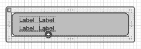

**图 8–18.** *表格视图单元格的内容视图，已拖入四个标签*

接下来，双击左上角的标签，将其改为 *Name:*。然后将左下角的标签改为 *Color:*。

现在，同时选中 *Name:* 和 *Color:* 这两个标签，然后按下属性检查器 *Font* 字段中的小 *T* 按钮。这将打开一个小面板，其中包含一个 *Font* 弹出按钮。点击该按钮，并选择 *System Bold* 作为字体。如有必要，选中右侧两个未修改的标签字段，并将它们稍微向右拖拽一点，以便给设计留出一些呼吸空间。

最后，调整右侧两个标签的大小，使它们一直延伸到右侧参考线。图 8–19 应该能让你了解我们最终的单元格内容视图的样子。

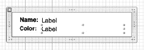

**图 8–19.** *表格视图单元格的内容视图，左侧标签名称已更改并设置为粗体，右侧标签已略微移动并调整大小*

现在，我们需要让 Interface Builder 知道，这个表格视图单元格并非普通的单元格，而是我们特殊的子类。否则，我们将无法将我们的输出口连接到相应的标签上。选择表格视图单元格，按下 **3** 键调出身份检查器，然后在 *Class* 控件中选择 *BIDNameAndColorCell*。

接下来，切换到连接检查器（**6**），你会看到 `colorLabel` 和 `nameLabel` 这两个输出口。将它们分别拖拽到 GUI 中对应的标签上。


### 使用新的表视图单元格

要使用我们设计的单元格，只需在 `BIDViewController.m` 中对 `tableView:cellForRowAtIndexPath:` 方法做一些非常简单的修改。我们将添加一些代码，同时移除一些代码。

```
-(UITableViewCell *)tableView:(UITableView *)tableView
        cellForRowAtIndexPath:(NSIndexPath *)indexPath {
    static NSString *CellTableIdentifier = @"CellTableIdentifier";
    static BOOL nibsRegistered = NO;
    if (!nibsRegistered) {
        UINib *nib = [UINib nibWithNibName:@"BIDNameAndColorCell" bundle:nil];
        [tableView registerNib:nib forCellReuseIdentifier:CellTableIdentifier];
        nibsRegistered = YES;
    }

    BIDNameAndColorCell *cell = [tableView dequeueReusableCellWithIdentifier:
                             CellTableIdentifier];

    NSUInteger row = [indexPath row];
    NSDictionary *rowData = [self.computers objectAtIndex:row];

    cell.name = [rowData objectForKey:@"Name"];
    cell.color = [rowData objectForKey:@"Color"];

    return cell;
}
```

这里你看到的第一个变化是添加了一个新的静态 `BOOL` 变量。这个变量在该方法的多次调用间保持其状态，并且仅在第一次调用此方法时初始化为 `NO`。这让我们可以插入几行只会被调用一次（即该方法首次被调用时）的代码，以便向表视图注册我们的 nib 文件。这意味着什么？

从 iOS 5 开始，表视图可以跟踪哪些 nib 文件需要与特定的重用标识符关联。`UITableView` 的 `dequeueReusableCellWithIdentifier:` 方法现在非常智能，即使没有可用的单元格，它也能利用这个 nib 注册表从 nib 文件中加载新的单元格。这意味着，只要我们已经为表视图注册了所有将要使用的重用标识符，它的 `dequeueReusableCellWithIdentifier:` 方法就总会返回一个单元格，并且永远不会返回 `nil`。因此，我们可以移除检查 `nil` 单元格值的代码行，因为这种情况再也不会发生了。

我们还需要进行另一项添加。虽然已经在 `CustomCell.xib` 中将表视图单元格的高度从默认值修改了，但这还不够。我们还需要将这一事实告知表视图；否则，它将没有足够的空间来正确显示单元格。最简单的方法是实现一个表视图委托方法，让我们指定单元格高度。将以下新方法添加到 `BIDViewController.m` 中类定义的底部：

```
- (CGFloat)tableView:(UITableView *)tableView
        heightForRowAtIndexPath:(NSIndexPath *)indexPath {
    return 65.0; // 与我们在 Interface Builder 中使用的数值一致
}
```

就这样。构建并运行。现在你的双行表单元格就基于你精湛的 Interface Builder 设计技巧了。

那么，既然你已经了解了两种方法，觉得怎么样？许多深入 iOS 开发的人起初对 Interface Builder 的侧重感到有些困惑，但正如你所见，它有很多优势。除了让你能够可视化设计 GUI 这一明显吸引力外，这种方法还促进了 nib 文件的正确使用，这有助于你遵循 MVC 架构模式。此外，它还能让你的应用代码更简洁、更具模块化，并且编写起来也更简单。就像我们的好哥们 Mark Dalrymple 说的：“没有代码就是最好的代码！”

### 分组与索引分区

我们的下一个项目将探索表格的另一个基本方面。我们依然会使用一个单独的表视图——还没有层级结构——但我们会将数据分成多个分区。再次使用*单视图应用*模板创建一个新的 Xcode 项目，这次将其命名为 `Sections`。

#### 构建视图

打开 `Sections` 文件夹，点击 `BIDViewController.xib` 进行编辑。像之前一样，将一个表视图拖放到*视图*窗口中。然后按下 **6**，将 `dataSource` 和 `delegate` 连接连接到*文件所有者*图标上。

接下来，确保表视图被选中，然后按下 **4** 调出属性检查器。将表视图的*样式*从*普通*改为*分组*（参见图 8–20）。你应该能在表视图中显示的示例表格里看到这一变化。保存你的 nib 文件，然后继续。（我们在本章开头讨论过索引样式和分组样式的区别。）

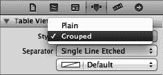

**图 8–20.** *表视图的属性检查器，显示样式弹出菜单中已选中“分组”*

#### 导入数据

这个项目需要相当多的数据才能正常工作。为了节省你几小时的输入时间，我们为你准备的表格练习提供了另一个属性列表。从本书项目归档的 *08 Sections/Sections* 子文件夹中获取名为 `sortednames.plist` 的文件，并将其添加到你的项目*Sections*文件夹中。

将 `sortednames.plist` 添加到项目后，单击它来大致了解一下其内容（参见图 8–21）。这是一个包含字典的属性列表，字母表中的每个字母都有一个条目。在每个字母下，是以该字母开头的名称列表。

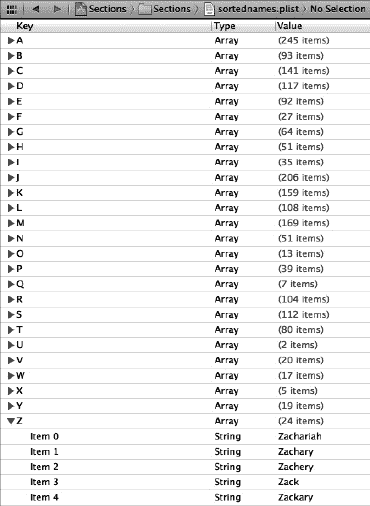

**图 8–21.** *sortednames.plist 属性列表文件。我们展开了字母 Z，以便让你了解其中一个字典的结构。*

我们将使用这个属性列表中的数据来填充表视图，为每个字母创建一个分区。


#### 实现控制器

单击 `BIDViewController.h` 文件，添加一个 `NSDictionary` 和一个 `NSArray` 实例变量及对应的属性声明。字典将保存所有数据，数组将保存按字母顺序排序的分区。我们还需要让该类遵循 `UITableViewDataSource` 和 `UITableViewDelegate` 协议。

```objectivec
#import <UIKit/UIKit.h>

@interface BIDViewController : UIViewController
<UITableViewDataSource, UITableViewDelegate>

@property (strong, nonatomic) NSDictionary *names;
@property (strong, nonatomic) NSArray *keys;
@end
```

现在，切换到 `BIDViewController.m`，并在文件开头添加以下代码：

```objectivec
#import "BIDViewController.h"

@implementation BIDViewController
@synthesize names;
@synthesize keys;
.
.
.
- (void)viewDidLoad {
    [super viewDidLoad];
    // Do any additional setup after loading the view, typically from a nib.
    NSString *path = [[NSBundle mainBundle] pathForResource:@"sortednames"
                                                     ofType:@"plist"];
    NSDictionary *dict = [[NSDictionary alloc]
                          initWithContentsOfFile:path];
    self.names = dict;

    NSArray *array = [[names allKeys] sortedArrayUsingSelector:
                      @selector(compare:)];
    self.keys = array;
}
.
.
.
```

在现有的 `viewDidUnload` 方法中插入以下代码行：

```objectivec
- (void)viewDidUnload {
    [super viewDidUnload];
    // Release any retained subviews of the main view.
    // e.g. self.myOutlet = nil;
    self.names = nil;
    self.keys = nil;
}
```

现在，在文件末尾，`@end` 声明之前添加以下代码：

```objectivec
.
.
.
#pragma mark -
#pragma mark Table View Data Source Methods
- (NSInteger)numberOfSectionsInTableView:(UITableView *)tableView {
    return [keys count];
}

- (NSInteger)tableView:(UITableView *)tableView
        numberOfRowsInSection:(NSInteger)section {
    NSString *key = [keys objectAtIndex:section];
    NSArray *nameSection = [names objectForKey:key];
    return [nameSection count];
}

- (UITableViewCell *)tableView:(UITableView *)tableView
    cellForRowAtIndexPath:(NSIndexPath *)indexPath {
    NSUInteger section = [indexPath section];
    NSUInteger row = [indexPath row];

    NSString *key = [keys objectAtIndex:section];
    NSArray *nameSection = [names objectForKey:key];

    static NSString *SectionsTableIdentifier = @"SectionsTableIdentifier";
    UITableViewCell *cell = [tableView dequeueReusableCellWithIdentifier:
        SectionsTableIdentifier];
    if (cell == nil) {
        cell = [[UITableViewCell alloc]
            initWithStyle:UITableViewCellStyleDefault
            reuseIdentifier:SectionsTableIdentifier];
    }

    cell.textLabel.text = [nameSection objectAtIndex:row];
    return cell;
}

- (NSString *)tableView:(UITableView *)tableView
    titleForHeaderInSection:(NSInteger)section {
    NSString *key = [keys objectAtIndex:section];
    return key;
}

@end
```

这段代码与之前看到的差别不大。在 `viewDidLoad` 方法中，我们从项目添加的属性列表中创建了一个 `NSDictionary` 实例，并将其赋值给 `names`。之后，我们获取了该字典的所有键，并对其进行排序，得到按字母顺序排列的 `NSArray`，其中包含字典中所有键值。请记住，`NSDictionary` 使用字母表中的字母作为键，因此这个数组将包含 26 个字母，按从 *A* 到 *Z* 的顺序排列，我们将利用该数组来跟踪分区。

向下滚动到数据源方法。我们添加到类中的第一个方法用于指定分区数量。在前面的例子中，我们没有实现这个方法，因为默认设置为 1 就能满足需求。这次，我们要告诉表格视图，字典中的每个键对应一个分区。

```objectivec
- (NSInteger)numberOfSectionsInTableView:(UITableView *)tableView {
    return [keys count];
}
```

下一个方法计算特定分区中的行数。在前一个例子中，我们只有一个分区，所以直接返回了数组中的行数。这次，我们需要按分区进行细分。我们可以通过获取与当前分区对应的数组，并返回该数组的长度来实现。

```objectivec
- (NSInteger)tableView:(UITableView *)tableView
        numberOfRowsInSection:(NSInteger)section {
    NSString *key = [keys objectAtIndex:section];
    NSArray *nameSection = [names objectForKey:key];
    return [nameSection count];
}
```

在 `tableView:cellForRowAtIndexPath:` 方法中，我们需要从索引路径中提取分区和行，并使用它们来确定要使用的值。分区将告诉我们从 `names` 字典中取出哪个数组，然后我们可以利用行来确定该数组中的哪个值。该方法中其他内容与本章前面“简单表格”应用中使用的版本基本相同。

`tableView:titleForHeaderInSection` 方法允许你为每个分区指定可选的头部标题，我们只需返回该分组的字母即可。

```objectivec
- (NSString *)tableView:(UITableView *)tableView
    titleForHeaderInSection:(NSInteger)section {
    NSString *key = [keys objectAtIndex:section];
    return key;
}
```

编译并运行项目，感受其酷炫之处。请记住，我们将表格的 *Style（样式）* 更改为 *Grouped（分组）*，因此最终得到了一个包含 26 个分区的分组表格，效果应如 图 8–22 所示。

作为对比，让我们将表格视图改回普通样式，看看多分区普通表格视图的效果。再次选择 `BIDViewController.xib` 并在 Interface Builder 中编辑文件。选中表格视图，使用属性检查器将样式切换为 *Plain（普通）*。保存项目，然后构建并运行——数据相同，但风格不同（见 图 8–23）。

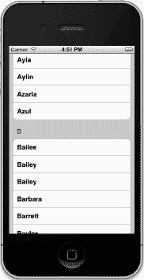

**图 8–22.** *多分区分组表格*

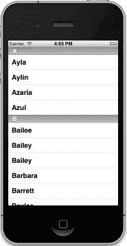

**图 8–23.** *无索引的多分区普通表格*

#### 添加索引

当前表格的一个问题是行数过多。列表中有 2000 个名字。要想找到 Zachariah 或 Zayne，甚至 Zoie，你的手指会非常疲劳。

解决这个问题的方法之一是在表格视图右侧添加索引。既然我们已经将表格视图样式改回 *Plain（普通）*，这做起来就相对简单了。在 `BIDViewController.m` 底部、`@end` 之前添加以下方法：

```objectivec
- (NSArray *)sectionIndexTitlesForTableView:(UITableView *)tableView {
    return keys;
}
```

没错，就这么简单。在这个方法中，委托要求返回一个数组，其中包含索引要显示的值。使用索引时，表格视图必须包含多个分区，并且该数组中的条目必须与这些分区对应。返回的数组必须与分区数量相同，且值必须与相应的分区匹配。换句话说，该数组中的第一项将用户带到第一个分区，即分区 0。

再次编译并运行应用，你将看到一个漂亮的索引（见 图 8–24）。

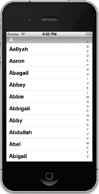

**图 8–24.** *带索引的表格视图*


### 实现搜索栏

索引固然有用，但即便如此，我们这里还是有一大堆名字。例如，如果我们想检查列表中是否有 Arabella 这个名字，即使使用了索引，也需要滚动好一会儿。如果能允许用户通过指定搜索词来精简列表，那不是很好吗？那将非常用户友好。好吧，这需要多做一些工作，但也不算太难。我们将实现一个标准的 iOS 搜索栏，就像图 8-25 中显示的那样。

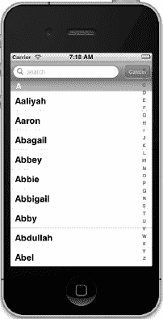

**图 8-25.** *添加了搜索栏的表格应用*

#### 重新思考设计方案

在我们开始添加搜索栏之前，需要先思考一下方法。目前，我们有一个字典，其中包含一系列数组，每个字母对应一个数组。这个字典是不可变的，这意味着我们不能从中添加或删除值，它所包含的数组也是如此。当用户点击取消或清除搜索词时，我们还需要保留恢复原始数据集的能力。

解决方案是创建两个字典：一个不可变字典用于保存完整数据集，另一个可变副本用于从中移除行。委托和数据源将从可变字典中读取数据，当搜索条件改变或搜索被取消时，我们可以从不可变字典中刷新可变字典。听起来是个好计划。我们开始吧。

**注意：** 接下来的这个项目有点高级，如果操之过急可能会导致明显的挫败感。如果其中某些概念让你头疼，不妨找回 Mark Dalrymple 和 Scott Knaster 合著的 *Learn Objective-C on the Mac*（Apress，2009 年），重温一下关于类别和可变性的内容。

#### 深层可变复制

要实现我们的新方法，有一个问题需要解决。`NSDictionary` 遵循 `NSMutableCopying` 协议，该协议会返回一个 `NSMutableDictionary`，但这个方法创建的是所谓的**浅**复制。这意味着当你调用 `mutableCopy` 方法时，它会创建一个新的 `NSMutableDictionary` 对象，其中包含原字典中的所有对象。但它们不是副本；它们是相同的实际对象。例如，如果我们处理的是一个存储字符串的字典，这没问题，因为从副本中移除一个值不会对原字典产生影响。然而，由于我们的字典里全是数组，如果我们从副本的数组中移除对象，也会同时从原数组移除它们，因为副本和原字典指向同一个对象。在这种特定情况下，原数组是不可变的，所以你实际上无法从中移除对象，但我们的意图只是为了说明这一点。

为了正确处理这个问题，我们需要能够对一个包含数组的字典进行深层可变复制。这并不太难，但我们应该把这个功能放在哪里呢？

如果你说“放在一个类别里”，那太好了，你开始用传送门思考了！如果你没想到，不用担心，适应这门语言需要一些时间。提醒一下，类别允许你在不创建子类的情况下，为现有对象添加更多方法。新接触 Objective-C 的人经常忽略类别，因为大多数其他语言都没有这个特性。

通过类别，我们可以为 `NSDictionary` 添加一个执行深层复制的方法，返回一个包含相同数据但不包含相同实际对象的 `NSMutableDictionary`。

**注意：** 在继续执行下一步系列操作之前，请考虑备份你的项目。这样，如果接下来的更改出现问题，你可以确保有一个可用的版本可以回退。

在项目窗口中，选择 *Sections* 文件夹，然后按下 **N** 创建一个新文件。当新文件助手出现时，从 *iOS* 部分的最顶部选择 *Cocoa Touch*。在右侧面板中，选择 *Objective-C category*，这正是我们要创建的，然后点击 *Next*。在下一个屏幕上，将协议命名为 *MutableDeepCopy*，并在 *Category on* 字段中输入 *NSDictionary*。然后再次点击 *Next*。在最后一个屏幕上，确保文件浏览器、*Group* 弹出菜单和 *Target* 控件中选择了 *Sections*。

将以下代码放入 `NSDictionary+MutableDeepCopy.h`：

```
#import <Foundation/Foundation.h>

@interface NSDictionary (MutableDeepCopy)
- (NSMutableDictionary *)mutableDeepCopy;
@end
```

切换到 `NSDictionary+MutableDeepCopy.m`，并添加实现：

```
#import "NSDictionary+MutableDeepCopy.h"

@implementation NSDictionary (MutableDeepCopy)

- (NSMutableDictionary *)mutableDeepCopy {
    NSMutableDictionary *returnDict = [[NSMutableDictionary alloc]
        initWithCapacity:[self count]];
    NSArray *keys = [self allKeys];
    for (id key in keys) {
        id oneValue = [self valueForKey:key];
        id oneCopy = nil;

        if ([oneValue respondsToSelector:@selector(mutableDeepCopy)])
            oneCopy = [oneValue mutableDeepCopy];
        else if ([oneValue respondsToSelector:@selector(mutableCopy)])
            oneCopy = [oneValue mutableCopy];
        if (oneCopy == nil)
            oneCopy = [oneValue copy];
        [returnDict setValue:oneCopy forKey:key];
    }
    return returnDict;

}
@end
```

这个方法创建了一个新的可变字典，然后遍历原字典的所有键，对遇到的每个数组进行可变复制。由于这个方法表现得就像 `NSDictionary` 的一部分，任何对 `self` 的引用都是指调用该方法的字典。该方法首先尝试进行深层可变复制，如果对象没有响应 `mutableDeepCopy` 消息，则尝试进行可变复制。如果对象也没有响应 `mutableCopy` 消息，则回退到常规复制，以确保字典中包含的所有对象都被复制。通过这种方式，如果我们有一个包含字典（或其他支持深层可变复制的对象）的字典，其中包含的对象也会被深层复制。

对你们中的一些人来说，这可能是第一次在 Objective-C 中看到这样的语法：

`for (id key in keys)`

Objective-C 2.0 引入了一个称为快速枚举的特性。**快速枚举**是 `NSEnumerator` 的语言级替代品。它允许你快速遍历一个集合（如 `NSArray`），而无需创建额外的对象或循环变量。

所有现有的 Cocoa 集合类——包括 `NSDictionary`、`NSArray` 和 `NSSet`——都支持快速枚举，当你需要遍历集合时，应该使用这个语法。它将确保你获得最高效的循环。

如果我们将 `NSDictionary+MutableDeepCopy.h` 头文件包含在我们的其他类中，我们将能够在任何 `NSDictionary` 对象上调用 `mutableDeepCopy`。现在就来利用这一点吧。


### 更新控制器头文件

接下来，我们需要为控制器类头文件添加一些输出口（outlet）。我们将为表格视图添加一个输出口。到目前为止，我们还没有在数据源方法之外需要指向表格视图的指针。但为了实现搜索栏功能，我们需要一个指针来告诉表格根据搜索结果重新加载自身。我们还将为搜索栏添加一个输出口，搜索栏嘛，顾名思义就是用于搜索的控件。

除了这两个输出口，我们还会添加另一个字典。现有的字典和数组都是不可变对象，我们需要将它们都改为对应的可变版本，因此 `NSArray` 会变成 `NSMutableArray`，`NSDictionary` 会变成 `NSMutableDictionary`。

我们的控制器中不需要任何新的操作方法，但我们会使用一些新方法。现在，只需声明它们，等你录入代码后再详细讨论。

此外，我们必须让我们的类遵循 `UISearchBarDelegate` 协议。除了作为表格视图的委托之外，我们还需要成为搜索栏的委托。

对 `BIDViewController.h` 进行如下修改：

```
#import <UIKit/UIKit.h>

@interface ViewController : UIViewController
<UITableViewDataSource, UITableViewDelegate, UISearchBarDelegate>

@property (strong, nonatomic) IBOutlet UITableView *table;
@property (strong, nonatomic) IBOutlet UISearchBar *search;
@property (strong, nonatomic) NSDictionary *allNames;
@property (strong, nonatomic) NSMutableDictionary *names;
@property (strong, nonatomic) NSMutableArray *keys;
- (void)resetSearch;
- (void)handleSearchForTerm:(NSString *)searchTerm;
@end
```

以下是刚刚所做的操作：

-   输出口 `table` 将指向我们的表格视图。
-   输出口 `search` 将指向搜索栏。
-   字典 `allNames` 将保存完整的数据集。
-   字典 `names` 将保存符合当前搜索条件的数据集。
-   `keys` 将保存索引值和区段名称。

如果你对这些都清楚了，那就继续前进，修改我们的视图吧。

### 修改视图

每个表格视图都允许在表格视图的顶端、所有内容之上放置一个视图。那个页眉视图会随其他内容一起滚动。`UISearchBar` 就是一个完美的例子。如果你从对象库中拖出一个*搜索栏*，并将其放置在表格视图的正上方，界面构建器（Interface Builder）会自动调整搜索栏的大小，使其适合表格视图的顶部，并随表格视图一起滚动。

不幸的是，`UISearchBar` 与右侧的索引功能配合得并不好。看看图 8–26，你就会明白原因。注意，索引重叠在搜索栏上，遮住了*取消*按钮的一部分。

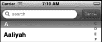

**图 8–26.** *在应用程序的当前版本中，搜索栏的取消按钮被索引覆盖。*

幸运的是，有一个解决方案，我们可以在不更改现有代码的情况下实现它，完全通过在界面构建器中配置视图层级。思路是将搜索栏放入一个普通的 `UIView` 中。这样，表格视图会确保 `UIView` 填满空间，但 `UIView` 的内容仍会按照我们设置的方式呈现。

选择 `BIDViewController.xib` 在 Xcode 的界面构建器中编辑文件，然后在编辑区域选择表格视图。使用对象库找到一个*视图*，并将其拖到表格视图的顶部。

你要尝试将视图放入表格视图的页眉区，这是表格视图中位于第一个区段之前的一个特殊部分。具体做法是将视图放在表格视图的顶部。在松开鼠标按钮之前，你应该会在表格视图的顶部看到一个圆角蓝色矩形（见图 8–27）。这表示如果你现在放下视图，它将进入表格页眉。一旦看到那个蓝色矩形，松开鼠标按钮即可放下视图。

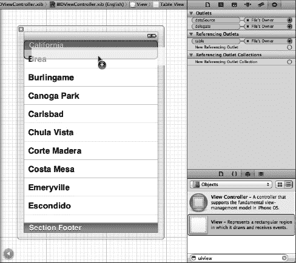

**图 8–27.** *将视图拖放到表格视图上。注意表格视图顶部出现的圆角矩形，表示该视图将被添加到表格的页眉中。*

现在，从对象库中抓取一个*搜索栏*，然后直接将其拖放到你刚刚添加的视图上。你会看到熟悉的蓝色矩形，并发现搜索栏完美地适配在视图内（见图 8–28）。

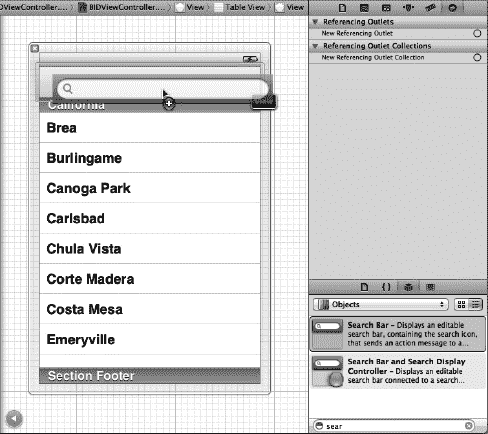

**图 8–28.** *将搜索栏拖放到我们之前放置在表格视图页眉中的视图上*

接下来，让我们调整搜索栏的大小，为索引腾出空间。首先，选中搜索栏，然后抓住搜索栏右侧的调整大小手柄，向左拖动 25 像素。这应该能为表格视图的索引列留出足够的空间。拖动时，你会看到一个小小的浮动尺寸面板。搜索栏初始宽度为 320 像素，因此将其宽度调整为 295 像素（见图 8–29）。

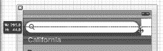

**图 8–29.** *我们抓住了搜索栏的右边缘并向左拖动了 25 像素。注意左侧的提示，它能帮你判断何时将搜索栏宽度调整为 295 像素。*

到目前为止一切顺利。下一步是处理搜索栏右侧那个碍眼的白色间隙。幸运的是，还有另一个背景看起来与 `UISearchBar` 完全一样的类，我们可以用它来填补这个空间。

导航栏（`UINavigationBar`）通常用于包含导航元素（你将在第 9 章中了解更多），但本质上，它毕竟是 `UIView` 的一个子类。这意味着它可以像其他任何视图一样被放置在屏幕上并调整大小。


在库中找到`Navigation Bar`，并将其拖入表视图顶部的视图中。你会看到它也填满了整个`UIView`，遮住了搜索栏。双击`Title`文本并将其删除，只保留渐变背景。现在返回停靠栏并选择导航栏（删除文本后可能会选择导航项，这不是你想要的）。选中导航栏后，从其左边缘抓住调整大小手柄并将其向右拖动，直到导航栏只有 25 像素宽（与我们之前从搜索栏中切割出的尺寸相同）。你会看到空隙现在被覆盖，并且屏幕上出现了同样平滑的渐变（参见图 8-30）。错觉完成了！

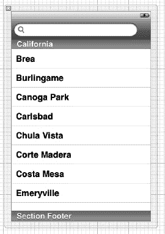

**图 8-30.** *我们在表视图的头部视图中插入了一个导航栏。我们删除了它的标题并将其调整为 25 像素宽。这样看起来不错，我们的搜索栏也不会与索引发生冲突。*

接下来，从`File's Owner`图标按住 Control 键拖拽到表视图，并选择`table`出口。对搜索栏重复此过程，并选择`search`出口。单击搜索栏，然后按**4**进入属性检查器。它应该看起来像图 8-31。

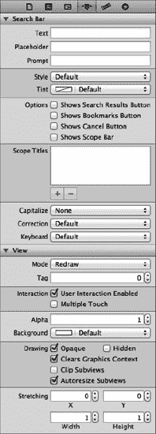

**图 8-31.** *搜索栏的属性检查器*

在`Placeholder`字段中输入`search`。单词“search”将以非常淡的方式出现在搜索字段中。

再往下一点，在`Options`部分，你会看到一系列复选框，用于在搜索栏的最右端添加搜索结果显示按钮或书签按钮。这些按钮本身不做任何事情（除了用户点击时切换状态），但你可以使用它们让委托根据切换按钮的状态设置不同的显示内容。

让前两个保持未选中状态，但选中标记为`Shows Cancel Button`的复选框。一个`Cancel`按钮将出现在搜索字段的右侧。用户可以点击此按钮取消搜索。最后一个复选框用于启用范围栏，这是一系列连接的按钮，旨在让用户从各种可搜索物类别中进行选择（由它下方的系列`Scope Titles`指定）。我们不打算使用范围功能，所以保持这些部分不变。

在复选框和`Scope Titles`下方，将`Correction`弹出菜单设置为`No`，以指示搜索栏不应尝试纠正用户的拼写。

通过按**6**切换到连接检查器，并从`delegate`连接拖拽到`File's Owner`图标，以告知此搜索栏我们的视图控制器也是搜索栏的委托。

这应该就是我们需要的一切，所以在继续之前请确保保存你的工作。现在，让我们深入研究一些代码。

### 修改控制器实现

为适应搜索栏而做的更改是相当重大的。对`BIDViewController.m`做如下修改：

```objc
#import "BIDViewController.h"
#import "NSDictionary+MutableDeepCopy.h"

@implementation ViewController
@synthesize names;
@synthesize keys;
@synthesize table;
@synthesize search;
@synthesize allNames;

#pragma mark -
#pragma mark Custom Methods
- (void)resetSearch {
    self.names = [self.allNames mutableDeepCopy];
    NSMutableArray *keyArray = [[NSMutableArray alloc] init];
    [keyArray addObjectsFromArray:[[self.allNames allKeys]
        sortedArrayUsingSelector:@selector(compare:)]];
    self.keys = keyArray;
}

- (void)handleSearchForTerm:(NSString *)searchTerm {
    NSMutableArray *sectionsToRemove = [[NSMutableArray alloc] init];
    [self resetSearch];

    for (NSString *key in self.keys) {
        NSMutableArray *array = [names valueForKey:key];
        NSMutableArray *toRemove = [[NSMutableArray alloc] init];
        for (NSString *name in array) {
            if ([name rangeOfString:searchTerm
                            options:NSCaseInsensitiveSearch].location == NSNotFound)
                [toRemove addObject:name];
        }
        if ([array count] == [toRemove count])
            [sectionsToRemove addObject:key];

        [array removeObjectsInArray:toRemove];
    }
    [self.keys removeObjectsInArray:sectionsToRemove];
    [table reloadData];
}
.
.
.
- (void)viewDidLoad {
    [super viewDidLoad];
    // Do any additional setup after loading the view, typically from a nib.
    NSString *path = [[NSBundle mainBundle] pathForResource:@"sortednames"
        ofType:@"plist"];
    NSDictionary *dict = [[NSDictionary alloc]
        initWithContentsOfFile:path];
    self.allNames = dict;

    [self resetSearch];
    [table reloadData];
    [table setContentOffset:CGPointMake(0.0, 44.0) animated:NO];
}

- (void)viewDidUnload {
    [super viewDidUnload];
    // Release any retained subviews of the main view.
    // e.g. self.myOutlet = nil;
    self.table = nil;
    self.search = nil;
    self.allNames = nil;
    self.names = nil;
    self.keys = nil;
}
.
.
.
#pragma mark -
#pragma mark Table View Data Source Methods
- (NSInteger)numberOfSectionsInTableView:(UITableView *)tableView {
    return ([keys count] > 0) ? [keys count] : 1;
}

- (NSInteger)tableView:(UITableView *)aTableView
       numberOfRowsInSection:(NSInteger)section {
    if ([keys count] == 0)
        return 0;
    NSString *key = [keys objectAtIndex:section];
    NSArray *nameSection = [names objectForKey:key];
    return [nameSection count];
}

- (UITableViewCell *)tableView:(UITableView *)aTableView
       cellForRowAtIndexPath:(NSIndexPath *)indexPath {
    NSUInteger section = [indexPath section];
    NSUInteger row = [indexPath row];

    NSString *key = [keys objectAtIndex:section];
    NSArray *nameSection = [names objectForKey:key];

    static NSString *sectionsTableIdentifier = @"SectionsTableIdentifier";

    UITableViewCell *cell = [aTableView dequeueReusableCellWithIdentifier:
        sectionsTableIdentifier];
    if (cell == nil) {
        cell = [[[UITableViewCell alloc] initWithFrame:CGRectZero
            reuseIdentifier: sectionsTableIdentifier] autorelease];
    }

    cell.textLabel.text = [nameSection objectAtIndex:row];
    return cell;
}

- (NSString *)tableView:(UITableView *)tableView
    titleForHeaderInSection:(NSInteger)section {
    if ([keys count] == 0)
        return nil;

    NSString *key = [keys objectAtIndex:section];
    return key;
}
```


```objective-c
- (NSArray *)sectionIndexTitlesForTableView:(UITableView *)tableView {
    return keys;
}

#pragma mark -
#pragma mark Table View Delegate Methods
- (NSIndexPath *)tableView:(UITableView *)tableView
    willSelectRowAtIndexPath:(NSIndexPath *)indexPath {
    [search resignFirstResponder];
    return indexPath;
}

#pragma mark -
#pragma mark Search Bar Delegate Methods
- (void)searchBarSearchButtonClicked:(UISearchBar *)searchBar {
    NSString *searchTerm = [searchBar text];
    [self handleSearchForTerm:searchTerm];
}

- (void)searchBar:(UISearchBar *)searchBar
    textDidChange:(NSString *)searchTerm {
    if ([searchTerm length] == 0) {
        [self resetSearch];
        [table reloadData];
        return;
    }
    [self handleSearchForTerm:searchTerm];
}

- (void)searchBarCancelButtonClicked:(UISearchBar *)searchBar {
    search.text = @"";
    [self resetSearch];
    [table reloadData];
    [searchBar resignFirstResponder];
}
@end

哇，打完这么多代码你还撑得住吗？我们来逐步拆解看看刚刚做了什么。先从新增的第一个方法开始。

##### 从 allNames 复制数据

我们的新方法 `resetSearch` 会在搜索被取消或搜索词改变时被调用。

```
- (void)resetSearch {
    self.names = [self.allNames mutableDeepCopy];
    NSMutableArray *keyArray = [[NSMutableArray alloc] init];
    [keyArray addObjectsFromArray:[[self.allNames allKeys]
                  sortedArrayUsingSelector:@selector(compare:)]];
    self.keys = keyArray;
}
```

这个方法所做的就是创建 `allNames` 的一个可变副本，并将其赋值给 `names`，然后刷新 `keys` 数组，使其包含所有字母。

我们需要刷新 `keys` 数组，因为如果搜索将某个分节中的所有值都清除了，我们也需要移除该分节。否则，屏幕上会充满标题和空分节，看起来很不美观。我们也不希望为不存在的内容提供索引，所以当根据搜索词筛选名称时，也要同时剔除空分节。

##### 实现搜索

我们添加的另一个新方法是实际的搜索逻辑。

```
- (void)handleSearchForTerm:(NSString *)searchTerm {
    NSMutableArray *sectionsToRemove = [[NSMutableArray alloc] init];
    [self resetSearch];

    for (NSString *key in self.keys) {
        NSMutableArray *array = [names valueForKey:key];
        NSMutableArray *toRemove = [[NSMutableArray alloc] init];
        for (NSString *name in array) {
            if ([name rangeOfString:searchTerm
                options:NSCaseInsensitiveSearch].location == NSNotFound)
                    [toRemove addObject:name];
        }

        if ([array count] == [toRemove count])
            [sectionsToRemove addObject:key];

        [array removeObjectsInArray:toRemove];
    }
    [self.keys removeObjectsInArray:sectionsToRemove];
    [table reloadData];
}
```

虽然我们会在搜索栏代理方法中启动搜索，但我们将 `handleSearchForTerm:` 抽离成独立方法，因为需要在两个不同的代理方法中使用完全相同的功能。通过将搜索逻辑封装在 `handleSearchForTerm:` 方法中，我们将功能集中到一处，便于维护，之后按需调用这个新方法即可。由于这是本节的核心内容（如果你偏好素食，也可以称之为“豆腐”），让我们把这个方法拆解成更小的块。

首先，创建一个数组，用于存放找到的空分节。我们稍后用这个数组来移除那些空分节，因为在遍历集合的同时移除其中的对象是不安全的。由于我们使用的是快速枚举，尝试这样做会引发异常。因此，既然不能在遍历键的同时移除它们，我们就将待移除的分节存储在一个数组中，等枚举完成后，再一次性移除所有对象。分配数组之后，我们重置搜索。

```
   NSMutableArray *sectionsToRemove = [[NSMutableArray alloc] init];
   [self resetSearch];
```

接下来，枚举新恢复的 `keys` 数组中的所有键。

```
   for (NSString *key in self.keys) {
```

每次循环时，我们获取当前键对应的名称数组，并创建另一个数组来存放需要从 `names` 数组中移除的值。记住，我们既要移除名称也要移除分节，因此必须跟踪哪些键是空的，以及哪些名称不符合搜索条件。

```
      NSMutableArray *array = [names valueForKey:key];
      NSMutableArray *toRemove = [[NSMutableArray alloc] init];
```

接着，遍历当前数组中的所有名称。所以，如果我们当前正在处理键 *A*，这个循环会枚举所有以 *A* 开头的名称。

```
      for (NSString *name in array) {
```

在这个循环内部，我们使用 `NSString` 的一个方法，该方法返回子字符串在字符串中的位置。我们指定选项 `NSCaseInsensitiveSearch`，以表明我们不关心搜索词的大小写——换句话说，*A* 和 *a* 是一样的。此方法返回的值是一个 `NSRange` 结构体，包含两个成员：`location` 和 `length`。如果未找到搜索词，`location` 将被设置为 `NSNotFound`，我们只需检查这个条件。如果返回的 `NSRange` 包含 `NSNotFound`，我们就将该名称添加到待移除对象的数组中。

```
         if ([name rangeOfString:searchTerm
             options:NSCaseInsensitiveSearch].location == NSNotFound)
                 [toRemove addObject:name];
      }
```

在遍历完某个字母的所有名称后，我们检查待移除名称数组的长度是否等于名称数组的长度。如果相等，说明该分节已经为空，我们将其添加到稍后要移除的键数组中。

```
      if ([array count] == [toRemove count])
          [sectionsToRemove addObject:key];
```

接下来，我们从该分节的数组中实际移除不匹配的名称。

```
       [array removeObjectsInArray:toRemove];
}
```

最后，移除空分节，释放用于跟踪空分节的数组，并通知表格重新加载数据。

```
   [self.keys removeObjectsInArray:sectionsToRemove];
   [sectionsToRemove release];
   [table reloadData];
}
```


### `viewDidLoad` 的修改

在 `viewDidLoad` 方法中，我们做了一些修改。首先，我们现在将属性列表加载到 `allNames` 字典中，而不是 `names` 字典中，并删除了加载 `keys` 数组的代码，因为这些工作现在交由 `resetSearch` 方法完成。接着，我们调用 `resetSearch` 方法，由它来为我们填充 `names` 可变字典和 `keys` 数组。之后，我们在 `tableView` 上调用 `reloadData`。在程序的正常运行流程中，`reloadData` 会在用户看到表格之前被调用，因此大多数情况下不需要在 `viewDidLoad:` 中调用它。但是，为了让其后的 `setContentOffset:animated:` 行能够正常工作，我们需要确保表格已经完全准备好，而这可以通过在表格上调用 `reloadData` 来实现。

```
[table reloadData];
[table setContentOffset:CGPointMake(0.0, 44.0) animated:NO];
```

那么，`setContentOffset:animated:` 的作用是什么呢？它如其名，就是偏移表格的内容——在我们的例子中，偏移量为 44 像素，即搜索栏的高度。这使得表格首次出现时，搜索栏被滚动到顶部之外。实际上，我们是把搜索栏“隐藏”在顶部，让用户在第一次向上滚动到底时才能发现它。这与邮件、通讯录以及其它标准 iOS 应用支持搜索的方式类似。用户一开始看不到搜索栏，但只需向下轻轻滑动即可将其显示出来。

隐藏搜索栏存在一定风险，用户可能一开始不会发现搜索功能，甚至可能永远都不会发现！然而，这是众多 iOS 应用共同面临的风险，而且这种搜索栏的用法如今已非常普遍，因此没有必要再显示更明确的提示。我们将在接下来的“为索引添加放大镜”一节中进一步讨论。

### 数据源方法的修改

如果你往下看到数据源方法，会发现我们做了一些小的修改。由于 `names` 字典和 `keys` 数组仍然用于提供数据源，这些方法基本与以前相同。

我们确实需要考虑一个事实：表格视图至少有一个区段，而搜索可能会从所有区段中排除所有名称。因此，我们添加了一些代码来检查所有区段都被移除的情况。在这些情况下，我们为表格视图提供一个包含 0 行且名称为空的单区段。这避免了任何问题，并且不会向用户提供错误的反馈。

### 添加表格视图委托方法

在数据源方法之下，我们添加了一个委托方法。如果用户在使用搜索栏时点击某一行，我们希望键盘消失。我们通过实现 `tableView:willSelectRowAtIndexPath:` 并告知搜索栏放弃第一响应者状态来实现这一点，这会导致键盘收起。接着，我们原样返回 `indexPath`。

```
- (NSIndexPath *)tableView:(UITableView *)tableView
    willSelectRowAtIndexPath:(NSIndexPath *)indexPath {
    [search resignFirstResponder];
    return indexPath;
}
```

我们也可以在 `tableView:didSelectRowAtIndexPath:` 中实现此操作，但在这里实现可以让键盘收起得稍快一些。

### 添加搜索栏委托方法

搜索栏有许多方法会调用其委托。当用户点击键盘上的返回键或搜索键时，会调用 `searchBarSearchButtonClicked:`。我们的这个版本从搜索栏中获取搜索词，并调用我们的搜索方法，该方法会从 `names` 中移除不匹配的名称，并从 `keys` 中移除空的区段。

```
- (void)searchBarSearchButtonClicked:(UISearchBar *)searchBar {
    NSString *searchTerm = [searchBar text];
    [self handleSearchForTerm:searchTerm];
}
```

任何时候使用搜索栏，都应该实现 `searchBarSearchButtonClicked:` 方法。

我们还实现了另一个搜索栏委托方法，这需要谨慎对待。接下来的这个方法实现了实时搜索。每次搜索词发生变化时，无论用户是否点击了搜索按钮或返回键，我们都会重新执行搜索。这种行为对用户非常友好，因为用户可以在输入时看到结果的变化。如果用户在输入第三个字符时就能将列表缩减到足够程度，他们可以停止输入并选择所需的行。

实现实时搜索很容易拖累应用程序的性能，尤其是在显示图像或数据模型复杂的情况下。在这个例子中，面对 2000 个字符串且没有图片或附属图标，即使是在初代 iPhone 或 iPod touch 上，性能表现也相当不错。

**注意：** 不要认为模拟器上的流畅性能等同于设备上的流畅性能。如果你打算实现这样的实时搜索，必须在实际硬件上进行广泛测试，以确保应用程序保持响应。如有疑问，请不要使用实时搜索功能。用户很可能会很乐意点击搜索按钮。

要处理实时搜索，需要像这样实现搜索栏委托方法 `searchBar:textDidChange:`：

```
- (void)searchBar:(UISearchBar *)searchBar
    textDidChange:(NSString *)searchTerm {
    if ([searchTerm length] == 0) {
        [self resetSearch];
        [table reloadData];
        return;
    }
    [self handleSearchForTerm:searchTerm];
}
```

请注意，我们检查了空字符串。如果字符串为空，我们知道所有名称都会匹配，因此只需重置搜索并重新加载数据，而无需遍历所有名称。

最后，我们实现了一个方法，以便在用户点击搜索栏上的 *取消* 按钮时收到通知。

```
- (void)searchBarCancelButtonClicked:(UISearchBar *)searchBar {
    search.text = @"";
    [self resetSearch];
    [table reloadData];
    [searchBar resignFirstResponder];
}
```

当用户点击 *取消* 时，我们将搜索词设置为空字符串，重置搜索并重新加载数据，以便显示所有名称。我们还告知搜索栏放弃第一响应者状态，这样键盘就会收起，用户可以继续与表格视图进行交互。

如果还没有运行，请启动我们的应用程序并尝试搜索功能。记住，搜索栏被滚动到屏幕顶部之外，所以向下拖动才能使其显示出来。点击搜索字段并开始输入。名称列表应该会缩减以匹配你输入的文本（图 8-32）。它起作用了，对吧？

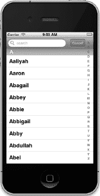

**图 8-32.** *我们的 Sections 应用的完整面貌。正如所承诺的，索引不再与取消按钮重叠。很好！*

接下来，我们琢磨一下如何让索引在点击搜索字段时消失。这不是强制性的——这纯粹是一个设计决策——但值得了解如何实现。

首先，我们添加一个属性变量来跟踪用户是否正在使用搜索栏。在 `BIDViewController.h` 中添加以下内容：

```
@interface ViewController : UIViewController
<UITableViewDataSource, UITableViewDelegate, UISearchBarDelegate>
```


```objectivec
@property (strong, nonatomic) IBOutlet UITableView *table;
@property (strong, nonatomic) IBOutlet UISearchBar *search;
@property (strong, nonatomic) NSDictionary *allNames;
@property (strong, nonatomic) NSMutableDictionary *names;
@property (strong, nonatomic) NSMutableArray *keys;
@property (assign, nonatomic) BOOL isSearching;
- (void)resetSearch;
- (void)handleSearchForTerm:(NSString *)searchTerm;
@end
```

保存文件，让我们将注意力转向 `BIDViewController.m`。首先，为新属性添加方法合成器：

```objectivec
@implementation ViewController
@synthesize names;
@synthesize keys;
@synthesize table;
@synthesize search;
@synthesize allNames;
@synthesize isSearching;
```

接下来，我们需要修改 `sectionIndexTitlesForTableView:` 方法，使其在用户搜索时返回 `nil`：

```objectivec
- (NSArray *)sectionIndexTitlesForTableView:(UITableView *)tableView {
    if (isSearching)
        return nil;
    return keys;
}
```

我们需要实现一个新的代理方法，以便在搜索开始时将 `isSearching` 设置为 `YES`。将以下方法添加到 `BIDViewController.m` 的搜索栏代理方法区域中：

```objectivec
- (void)searchBarTextDidBeginEditing:(UISearchBar *)searchBar {
    isSearching = YES;
    [table reloadData];
}
```

当搜索栏被点击时，此方法会被调用。在其中，我们将 `isSearching` 设置为 `YES`，然后让表格重新加载自身，这会使索引消失。我们还需要记住在用户完成搜索后，将 `isSearching` 设置为 `NO`。用户完成搜索有两种方式：点击*取消*按钮或点击表格中的某一行。因此，我们需要在 `searchBarCancelButtonClicked:` 方法中添加代码：

```objectivec
- (void)searchBarCancelButtonClicked:(UISearchBar *)searchBar {
    isSearching = NO;
    search.text = @"";
    [self resetSearch];
    [table reloadData];
    [searchBar resignFirstResponder];
}
```

我们还需要对 `tableView:willSelectRowAtIndexPath:` 方法进行同样的修改：

```objectivec
- (NSIndexPath *)tableView:(UITableView *)tableView
  willSelectRowAtIndexPath:(NSIndexPath *)indexPath {
    [search resignFirstResponder];
    isSearching = NO;
    search.text = @"";
    [tableView reloadData];
    return indexPath;
}
```

现在，再试一次。你会发现，当点击搜索栏时，索引会消失，直到你完成搜索。

### 在索引中添加放大镜图标

因为我们偏移了表格视图的内容，所以应用首次启动时搜索栏不可见，但快速向下滑动即可让搜索栏显示出来，以便使用。也可以将搜索栏放在表格视图的上方（而非内部），这样搜索栏始终可见，但这会占用宝贵的屏幕空间。让搜索栏随表格滚动可以更高效地利用 iPhone 的小屏幕，而且用户始终可以通过点击屏幕顶部的状态栏快速访问搜索栏。

问题在于，并非所有人都知道点击状态栏会跳转到当前表格的顶部。理想的解决方案是在索引顶部放置一个放大镜图标，就像通讯录应用那样（参见图 8–33）。猜猜怎么着？我们确实可以做到这一点。iOS 支持在表格索引中放置放大镜图标。现在，我们就为应用实现这一功能。

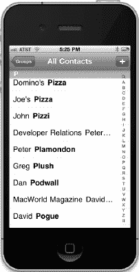

**图 8–33.** *通讯录应用的索引中有一个放大镜图标，点击可直接跳转到搜索栏。在 iOS 3 之前，其他应用无法使用此功能，但现在可以了。*

添加放大镜图标只需三个步骤：

- 向 `keys` 数组添加一个特殊值，以表明我们需要放大镜图标。
- 阻止 iOS 为这个特殊值在表格中打印节标题。
- 告诉表格在选中该项时滚动到顶部。

我们按顺序来处理这些任务。

#### 向键数组添加特殊值

要向 `keys` 数组添加特殊值，我们只需在 `resetSearch` 方法中添加一行代码：

```objectivec
- (void)resetSearch {
    self.names = [self.allNames mutableDeepCopy];
    NSMutableArray *keyArray = [[NSMutableArray alloc] init];
    [keyArray addObject:UITableViewIndexSearch];
    [keyArray addObjectsFromArray:[[self.allNames allKeys]
            sortedArrayUsingSelector:@selector(compare:)]];
    self.keys = keyArray;
}
```

#### 抑制节标题

现在，我们需要阻止这个特殊值作为节标题显示。我们通过在现有的 `tableView:titleForHeaderInSection:` 方法中添加检查，并在询问特殊搜索节的标题时返回 `nil` 来实现：

```objectivec
- (NSString *)tableView:(UITableView *)tableView
    titleForHeaderInSection:(NSInteger)section {
    if ([keys count] == 0)
        return nil;

    NSString *key = [keys objectAtIndex:section];
    if (key == UITableViewIndexSearch)
        return nil;
    return key;
}
```

#### 告诉表格视图如何响应

最后，我们需要告诉表格视图当用户在索引中点击放大镜图标时该怎么做。如果实现了代理方法 `tableView:sectionForSectionIndexTitle:atIndex:`，那么在用户点击放大镜图标时，该方法会被调用。

将此方法添加到 `BIDViewController.m` 的末尾，紧接在 `@end` 之前：

```objectivec
- (NSInteger)tableView:(UITableView *)tableView
        sectionForSectionIndexTitle:(NSString *)title
        atIndex:(NSInteger)index {
    NSString *key = [keys objectAtIndex:index];
    if (key == UITableViewIndexSearch) {
        [tableView setContentOffset:CGPointZero animated:NO];
        return NSNotFound;
    } else return index;
}
```

要告诉它跳转到搜索框，我们必须做两件事。首先，需要移除之前添加的内容偏移，然后必须返回 `NSNotFound`。当表格视图收到这个响应时，它会知道滚动到顶部。既然我们已经移除了偏移，它就会滚动到搜索栏，而不是顶部节。

**注意：** 在 `tableView:sectionForSectionIndexTitle:atIndex:` 方法中，我们使用了一个名为 `CGPointZero` 的特殊常量，它代表坐标系中的点 (0, 0)。这是一个方便且可读性强的常量，但使用它需要 Core Graphics 框架。当你构建项目时，如果遇到关于 `_CGPointZero` 引用的链接错误，说明 Xcode 默认没有包含该框架，你需要自行添加。要添加此框架，请进入项目导航器，选择顶层的 *Sections* 项。接着，点击主面板顶部的 *Build Phases* 标签。然后展开 *Link Binary With Libraries* 部分，点击加号按钮，从出现的列表中选择 `CoreGraphics.framework`，然后点击 *Add* 按钮。

现在，你可以构建并运行应用了。大功告成——在 iPhone 表格中实现了实时搜索，并且索引中带有放大镜图标！

**提示：** iOS 还提供了更多酷炫的搜索功能。感兴趣吗？前往文档浏览器，搜索 `UISearchDisplay`，即可了解 `UISearchDisplayController` 和 `UISearchDisplayDelegate` 的相关内容。读完第 9 章后，你可能会觉得这些材料更容易理解。


### 全盘托出

好了，你感觉如何？这一章内容相当丰富，你学到了海量知识！现在，你应该对平面表格的工作方式有了非常扎实的理解。你应该知道如何自定义表格和表格视图单元格，以及如何配置表格视图。你还了解了如何实现搜索栏，这是在任何呈现大量数据的 iOS 应用中都至关重要的工具。请确保你理解了本章中我们所做的所有内容，因为我们将在此基础上继续深入。

在下一章中，我们将继续研究表格视图。你将学习如何使用它们来呈现层级数据。你将看到如何创建内容视图，允许用户编辑在表格视图中选中的数据，以及如何在表格中呈现清单、在表格行中嵌入控件以及删除行。

# 第 9 章

## 导航控制器与表格视图

在上一章中，你已经掌握了表格视图的基础知识。在这一章中，你将获得更多的练习，因为我们将探索**导航控制器**。

表格视图和导航控制器是相辅相成的。严格来说，导航控制器并不需要表格视图才能工作。然而，在实际应用中，当你实现导航控制器时，几乎总是会至少实现一个表格，通常会是多个，因为导航控制器的优势在于它能够轻松处理复杂的层级数据。在 iPhone 的小屏幕上，层级数据的最佳呈现方式是使用一系列连续的表格视图。

在本章中，我们将逐步构建一个应用，就像我们在第 7 章中构建选择器应用一样。我们会先让导航控制器和第一个视图控制器工作起来，然后开始向层级结构中添加更多的控制器和层级。我们创建的每个视图控制器都会强化表格使用或配置的某个方面：

*   如何从表格视图向下钻取到子表格
*   如何从表格视图向下钻取到内容视图，在其中可以查看甚至编辑详细数据
*   如何使用表格列表让用户从多个值中进行选择
*   如何使用编辑模式允许从表格视图中删除行

内容很多，对吧？那么，让我们开始介绍导航控制器吧。

### 导航控制器基础

构建层级应用的主要工具是 `UINavigationController`。`UINavigationController` 与 `UITabBarController` 类似，它管理并切换多个内容视图。两者主要区别在于，`UINavigationController` 是作为栈实现的，这使得它非常适合处理层级结构。

你是不是已经对栈了如指掌了？快速浏览一下下面的小节，我们将在下一个小节“控制器栈”的开头等你。如果你是栈的新手，请继续阅读。幸运的是，栈是一个非常容易理解的概念。

#### 栈的妙用

**栈**是一种常用的数据结构，它遵循后进先出的原则。信不信由你，Pez 糖果盒就是一个很好的栈的例子。你试过装填它吗？根据每个 Pez 糖果盒附带的说明小纸条，有几个简单的步骤。首先，打开 Pez 糖果的包装纸。其次，将糖果盒的头部向后仰，打开它。第三，拿起那叠（注意，我们巧妙地在这里插入了“叠”这个字！）糖果，用食指和拇指紧紧地捏住，然后将糖果柱插入打开的糖果盒中。第四，捡起所有散落一地的糖果碎屑，因为这份说明从来就没用对。

好吧，到目前为止，这个例子并不是特别有用。但接下来发生的事就有用了。当你捡起糖果碎屑，一个一个地塞进糖果盒时，你就是在操作一个栈。还记得我们说栈是后进先出吗？这也意味着先进后出。你第一个推入糖果盒的 Pez 糖果会是最后一个弹出来的。你最后一个推入的 Pez 糖果会是第一个弹出来的。计算机的栈遵循同样的规则：

*   当你向栈中添加一个对象时，这称为**压栈**。你将一个对象压入栈。
*   你压入栈的第一个对象称为栈的**底部**。
*   你压入栈的最后一个对象称为栈的**顶部**（至少在它被下一个压入栈的对象取代之前）。
*   当你从栈中移除一个对象时，这称为**出栈**。当你从栈中弹出一个对象时，它总是你最后压入栈的那个对象。相反，你第一个压入栈的对象将总是最后一个被弹出栈的对象。

#### 控制器栈

导航控制器维护着一个视图控制器的栈。任何类型的视图控制器都可以入栈。当你设计导航控制器时，需要指定用户首先看到的视图。正如我们在前几章中讨论过的，这个视图被称为**根视图控制器**，或简称为**根控制器**，它是导航控制器栈的底部。当用户选择要显示的下一个视图时，一个新的视图控制器会被压入栈，它所控制的视图就会显示出来。我们将这些新的视图控制器称为**子控制器**。如你所见，本章的应用 Nav 由一个导航控制器和六个子控制器组成。

看一下图 9-1。请注意当前视图左上角的**导航按钮**。导航按钮类似于网页浏览器的返回按钮。当用户点击该按钮时，当前的视图控制器会从栈中弹出，前一个视图成为当前视图。

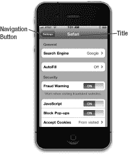

**图 9–1.** *设置应用使用了导航控制器。左上角是导航按钮，用于将当前视图控制器从栈中弹出，返回到层级结构的上一级。当前内容视图控制器的标题也会显示。*

我们喜欢这种设计模式。它使得我们可以迭代地构建复杂的层级应用。我们不需要了解整个层级结构就能让应用跑起来。每个控制器只需要知道它的子控制器，以便在用户做出选择时，将相应的新控制器对象压入栈。通过这种方式，你可以用许多小块构建一个大型应用，这正是我们将在本章中所做的。

导航控制器确实是许多 iPhone 应用的核心与灵魂，但当涉及到 iPad 应用时，导航控制器扮演的角色则更为边缘化。一个典型的例子是邮件应用，它使用了一个层级导航控制器，让用户在所有邮件服务器、文件夹和消息之间导航。在 iPad 版的邮件中，导航控制器从不占满整个屏幕，而是以侧边栏或临时弹出窗口的形式出现。我们将在第 11 章介绍 iPad 特有的 GUI 功能时，再深入探讨这种用法。


### Nav，一个六部分的分层应用程序

我们将要构建的应用程序将向您展示如何完成与显示数据层次结构相关的大多数常见任务。当应用程序启动时，您将看到一个选项列表（参见图 9–2）。

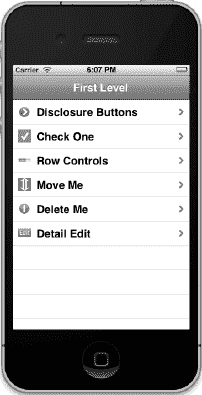

**图 9–2.** *本章应用程序的顶级视图。请注意视图右侧的辅助图标。这种特定类型的辅助图标被称为**展开指示符**。它告诉用户触摸该行会向下钻取到另一个表视图。*

此顶级视图中的每一行都代表一个不同的视图控制器，当选中该行时，该控制器将被推送到导航控制器的堆栈上。每行右侧的图标称为**辅助图标**。这个特定的辅助图标（灰色箭头）被称为**展开指示符**，因为它让用户知道触摸该行会向下钻取到另一个表视图。

#### 认识子控制器

在我们开始构建 Nav 应用程序之前，让我们快速浏览一下由六个子控制器显示的每个视图。

##### 展开按钮视图

触摸图 9–2 所示表格的第一行将弹出一个子视图，如图 9–3 所示。


**图 9–3.** *Nav 应用程序的六个子控制器中的第一个实现了一个表格，其中每一行都包含一个详细信息展开按钮。*

图 9–3 中每行右侧的辅助图标略有不同。这些图标中的每一个都被称为**详细信息展开按钮**。点击详细信息展开按钮应允许用户查看，甚至编辑关于当前行的更详细信息。

与展开指示符不同，详细信息展开按钮不仅仅是一个图标——它是一个用户可以点击的控件。这意味着您可以为给定行提供两个不同的选项：一个操作在用户选择该行时触发，另一个操作在用户点击展开按钮时触发。

在 iPhone 的电话应用中可以找到正确使用详细信息展开按钮的一个好例子。从“收藏夹”标签页中选择一个人的行会给您触摸的行所在的人打电话，但选择名字旁边的展开按钮会带您进入详细的联系人信息。YouTube 应用程序提供了另一个很好的例子。选择一行会播放视频，但点击详细信息展开按钮会带您进入关于该视频的更详细信息。在通讯录应用程序中，联系人列表没有详细信息展开按钮，即使选择一行确实会带您进入详细信息视图。由于通讯录应用程序中的每一行只有一个选项可用，因此不显示任何辅助图标。

以下是关于何时使用展开指示符和详细信息展开按钮的总结：

*   如果您想为行点击提供单一选择，并且行点击*仅*会导向该行的更详细视图，则不要使用辅助图标。
*   如果行点击将导向一个新视图（*不是*详细视图），请使用展开指示符（灰色箭头）标记该行。
*   如果您想为一行提供两个选择，请使用详细信息展开按钮标记该行。这允许用户点击行以进入新视图，或点击展开按钮以获取更多详细信息。

##### 复选框视图

我们应用程序的六个子控制器中的第二个如图 9–4 所示。这是在图 9–2 中选择*选择一个*时出现的视图。

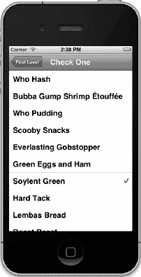

**图 9–4.** *Nav 应用程序的六个子控制器中的第二个允许您从多个行中选择一行。*

当您想要呈现一个只能从中选择一个项目的列表时，此视图很有用。这种方法之于 iOS 就像单选按钮之于 Mac OS X。这些列表使用复选标记来标记当前选定的行。

##### 行控制视图

我们应用程序的六个子控制器中的第三个如图 9–5 所示。该视图在每个行的**辅助视图**中有一个可点击的按钮。辅助视图是表格视图单元格的最右侧部分，通常容纳辅助图标，但也可用于其他用途。当我们进入应用程序的这一部分时，您将看到如何在辅助视图中创建控件。

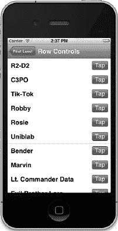

**图 9–5.** *Nav 应用程序的六个子控制器中的第三个在每个表格视图单元格的辅助视图中添加了一个按钮。*

##### 可移动行视图

我们应用程序的六个子控制器中的第四个如图 9–6 所示。在此视图中，我们将通过让表格进入编辑模式（更多内容将在本章后续代码部分介绍）来允许用户重新排列列表中行的顺序。

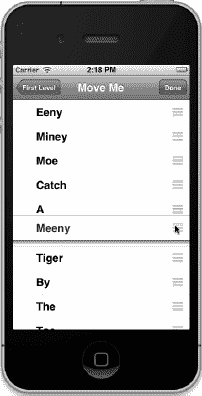

**图 9–6.** *Nav 应用程序的六个子控制器中的第四个允许用户通过触摸并拖动移动图标来重新排列列表中的行。注意到押韵了吗？*

##### 可删除行视图

我们应用程序的六个子控制器中的第五个如图 9–7 所示。在此视图中，我们将通过允许用户从我们的表格中删除行来演示编辑模式的另一种用途。

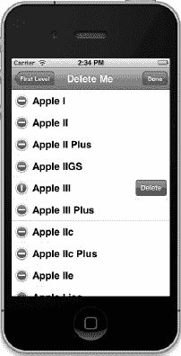

**图 9–7.** *Nav 应用程序的六个子控制器中的第五个实现了编辑模式，允许用户从表格中删除项目。*

##### 可编辑详细信息视图

我们应用程序的第六个也是最后一个子控制器如图 9–8 所示。它展示了一个使用分组表格的可编辑详细信息视图。这种用于详细信息视图的技术被 iPhone 上预装的应用程序广泛使用。

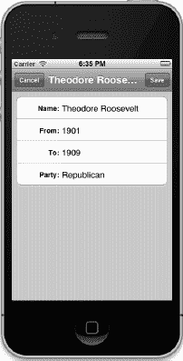

**图 9–8.** *Nav 应用程序的第六个也是最后一个子控制器实现了一个使用分组表格的可编辑详细信息视图。*

我们有太多事情要做。让我们开始吧！

#### Nav 应用程序的骨架

Xcode 提供了一个非常适合创建基于导航的应用程序的模板，当您需要创建分层应用程序时，大多数时候您可能会使用它。但是，我们今天不会使用那个模板。相反，我们将从头开始构建我们基于导航的应用程序，以便您了解所有部分是如何组合在一起的。这与我们在第 7 章中构建标签栏控制器的方式并没有太大不同，因此您应该能够轻松跟上。

在 Xcode 中，按下  **N** 创建一个新项目，从 iOS *应用程序*模板列表中选择*空应用程序*，然后单击*下一步*继续。将*产品名称*设置为`Nav`，*公司标识符*设置为`com.apress`，*类前缀*设置为`BID`。确保未勾选*使用 Core Data*和*包含单元测试*，已勾选*使用自动引用计数*，并且*设备系列*设置为`iPhone`。

如果您选择项目导航器并打开`Nav`文件夹，您会发现此模板为您提供了一个应用程序委托，除此之外没有其他内容。此时，没有视图控制器或导航控制器。

要使此应用程序运行，我们需要添加一个导航控制器，其中包含一个导航栏。我们还需要为导航栏添加一系列视图和视图控制器以显示。这些视图中的第一个是图 9–2 中所示的顶级视图。

该顶级视图中的每一行都与一个子视图控制器相关联，如图 9–3 至 9–8 所示。不必担心具体细节。在您阅读本章的过程中，您会看到这些连接是如何工作的。


### 创建顶层视图控制器

在本章中，我们将创建`UITableViewController`的子类（而非`UIViewController`）来管理表格视图。当继承`UITableViewController`时，我们会继承该类的一些便捷功能，使其无需 nib 文件即可自动创建表格视图。虽然也可以像上一章那样在 nib 中提供表格视图，但若不提供，`UITableViewController`会自动创建一个占满全部可用空间的表格视图，并连接控制器类中的相应插座变量，使控制器类成为该表格的委托和数据源。当某个控制器只需要一个表格时，继承`UITableViewController`是最佳选择。

我们将创建一个名为`BIDFirstLevelController`的类，它代表导航层次结构中的第一级。该表格的每一行对应一个二级表格视图，而每个二级表格视图由`BIDSecondLevelViewController`类表示。随着本章内容推进，你将理解这个机制如何运作。

在项目窗口中，选择导航器中的 *Nav* 文件夹，然后按下  **N** 或选择 **File  New  New File…**。在新文件助手中，选择 *Cocoa Touch*，再选择 *Objective-C class*，点击 *Next*。在下一界面中，在 *Class* 字段输入 *BIDFirstLevelController*，在 *Subclass of* 字段输入 *UITableViewController*。一如既往，点击 *Next* 前请仔细检查拼写。然后在点击 *Create* 前，确保文件浏览器中选中了 *Nav* 文件夹或分组、*Group* 和 *Target* 控件。

你可能注意到文件模板选择器中有一个名为 *UIViewController* 的条目。该选项提供若干空白的“桩”方法作为构建视图控制器的起点，甚至允许你选择`UIViewController`的子类（如`UITableViewController`），并自动生成更多空白方法等待你填入额外功能。创建自己的应用时，可以自由使用这些模板。但本章并未使用任何视图控制器模板，以免浪费时间筛选无用模板方法并确定代码插入或删除位置。通过创建纯 Objective-C 对象并将其父类设为`UITableViewController`，我们获得了更精简、更易管理的文件。

创建文件后，单击 *BIDFirstLevelController.h* 查看其内容：

```
#import <UIKit/UIKit.h>

@interface BIDFirstLevelController : UITableViewController

@end
```

由于我们选择的父类是 UIKit 类，Xcode 自动导入了 UIKit 框架而非仅 Foundation。创建的两个文件包含顶层视图的控制器类，如图 9-2 所示。下一步是设置导航控制器。

### 设置导航控制器

我们的目标是编辑应用委托，将导航控制器的视图添加到应用窗口中。

首先编辑 *BIDAppDelegate.h*，添加一个指向导航控制器的属性 `navController`：

```
#import <UIKit/UIKit.h>

@interface BIDAppDelegate : UIResponder<UIApplicationDelegate>

@property (strong, nonatomic) UIWindow *window;
@property (strong, nonatomic) UINavigationController *navController;
@end
```

接下来转到实现文件，导入刚创建的视图控制器类的头文件，并为 `navController` 添加 `@synthesize` 语句。在 `application:didFinishLaunchingWithOptions:` 方法中，我们将创建 `navController`，用将要显示的初始视图控制器进行配置，并将其视图作为子视图添加到应用窗口中，以便用户可见。稍后将逐一解释这些步骤。现在选择 *BIDAppDelegate.m* 并做出以下修改：

```
#import "BIDAppDelegate.h"
#import "BIDFirstLevelController.h"

@implementation BIDAppDelegate

@synthesize window = _window;
@synthesize navController;

#pragma mark -
#pragma mark Application lifecycle

- (BOOL)application:(UIApplication *)application
        didFinishLaunchingWithOptions:(NSDictionary *)launchOptions {
    self.window = [[UIWindow alloc] initWithFrame:[[UIScreen mainScreen] bounds]];
    // 应用启动后的自定义覆盖点

    BIDFirstLevelController *first = [[BIDFirstLevelController alloc]
        initWithStyle:UITableViewStylePlain];
    self.navController = [[UINavigationController alloc]
        initWithRootViewController:first];
    [self.window addSubview:navController.view];

    self.window.backgroundColor = [UIColor whiteColor];
    [self.window makeKeyAndVisible];

    return YES;
}
.
.
.

@end
```

添加到 `application:didFinishLaunchingWithOptions:` 方法中的代码值得注意。第一件事是创建 `BIDFirstLevelController` 的实例：

```
    BIDFirstLevelController *first = [[BIDFirstLevelController alloc]
        initWithStyle:UITableViewStylePlain];
```

由于 `BIDFirstLevelController` 是 `UITableViewController` 的子类，它可以调用该类定义的方法，包括便捷的 `initWithStyle:` 方法。该方法允许在无需 nib 文件的情况下，创建表格视图样式为“普通”或“分组”的控制器。许多 iOS 应用的表格视图外观完全由单元格内容决定，表格视图本身无需 nib 定制。因此，使用 `initWithStyle:` 方法是一种常见的快速实例化表格视图控制器的方式。

接着，我们创建导航控制器的实例：

```
    self.navController = [[UINavigationController alloc]
        initWithRootViewController:first];
```

这里可以看到，`UINavigationController` 和 `UITableViewController` 一样有专属的初始化方法。`initWithRootViewController:` 方法允许传入导航控制器用于显示初始内容的顶层控制器——此例中即为 `first` 变量引用的 `BIDFirstLevelController`。

最后，我们将 `navController` 的视图添加到窗口中以便显示：

```
    [self.window addSubview:navController.view];
```


花点时间思考一下这个问题是有必要的。我们通过`addSubview:`方法传递的视图到底是什么？它是由导航控制器提供的一个复合视图，包含两个部分：屏幕顶部的导航栏（通常显示某种标题，左侧往往还有一个返回按钮）以及导航控制器当前视图控制器想要显示的任何内容。在我们的例子中，显示器的下半部分将由我们几行前创建的`BIDFirstLevelController`实例所关联的表视图填充。

随着我们继续学习，你会了解更多关于如何控制导航控制器在导航栏中显示内容的知识。你还会理解导航控制器如何在不同的从属视图控制器之间切换焦点。目前，我们已经打下了足够的基础，可以开始定义我们自己的自定义视图控制器将要做什么了。

现在，我们需要为`BIDFirstLevelController`要显示的行提供一个列表。在上一章中，我们使用简单的字符串数组来填充表格行。在这个应用程序中，第一级视图控制器将管理其子控制器的列表，我们将在本章中逐步构建这些子控制器。

在设计这个应用程序时，我们决定让第一级视图控制器在每个子控制器名称的左侧显示一个图标。为了避免给每个子控制器都添加一个`UIImage`属性，我们将创建一个`UITableViewController`的子类，让这个子类拥有一个`UIImage`属性来保存行图标。然后我们将继承这个新类，而不是直接继承`UITableViewController`。这样一来，我们所有的子类都将自动获得这个`UIImage`属性，这会让我们的代码更简洁。

**注意：** 我们实际上永远不会创建我们新的`UITableViewController`子类的实例。它存在的唯一目的是让我们能够向将要编写的其他控制器添加一个公共项。在许多语言中，我们会将其声明为**抽象类**，但 Objective-C 不包含任何支持抽象类的语法。我们可以创建不打算被实例化的类，但 Objective-C 编译器实际上不会像许多其他语言的编译器那样阻止我们编写创建此类实例的代码。Objective-C 比大多数其他流行语言宽松得多，这一点可能需要一些时间来适应。

在 Xcode 中单击`Nav`文件夹，然后按下**N**键调出新文件助手。从左侧窗格中选择`CocoaTouch`，选择`Objective-C`类，然后点击`Next`。在下一个屏幕上，将新类命名为`BIDSecondLevelViewController`，并在`Subclass of`中填入`UITableViewController`。然后再次点击`Next`，像往常一样保存类文件。新文件创建后，选择`BIDSecondLevelViewController.h`，并进行以下修改：

```
#import <UIKit/UIKit.h>

@interface BIDSecondLevelViewController : UITableViewController

@property (strong, nonatomic) UIImage *rowImage;

@end
```

在`BIDSecondLevelViewController.m`中，添加以下代码行：

```
#import "BIDSecondLevelViewController.h"

@implementation BIDSecondLevelViewController
@synthesize rowImage;

@end
```

任何我们想要实现为第二级控制器的控制器类——换句话说，用户可以从我们应用程序中显示的第一个表格直接导航到的任何控制器——都应该继承`BIDSecondLevelViewController`，而不是直接继承`UITableViewController`。由于我们继承的是`BIDSecondLevelViewController`，所有这些类都将拥有一个用于存储行图标的属性。通过使用`BIDSecondLevelViewController`作为占位符，我们可以在实际编写任何具体的第二级控制器类之前，就在`BIDFirstLevelController`中编写代码。

现在让我们实现`BIDFirstLevelController`类。请确保保存你对`BIDSecondLevelViewController`所做的修改。然后对`BIDFirstLevelController.h`进行以下修改：

```
#import <UIKit/UIKit.h>

@interface BIDFirstLevelController : UITableViewController

@property (strong, nonatomic) NSArray *controllers;

@end
```

我们刚刚添加的数组将保存第二级视图控制器的实例。我们将使用它为表格提供数据。

将以下代码添加到`BIDFirstLevelController.m`中，然后回来和我们一起讨论吧，好吗？

```
#import "BIDFirstLevelController.h"
#import "BIDSecondLevelViewController.h"

@implementation BIDFirstLevelController
@synthesize controllers;

- (void)viewDidLoad {
    [super viewDidLoad];
    self.title = @"First Level";
    NSMutableArray *array = [[NSMutableArray alloc] init];
    self.controllers = array;
}

- (void)viewDidUnload {
   [super viewDidUnload];
   self.controllers = nil;
}

#pragma mark -
#pragma mark Table Data Source Methods
- (NSInteger)tableView:(UITableView *)tableView
 numberOfRowsInSection:(NSInteger)section {
    return [self.controllers count];
}

- (UITableViewCell *)tableView:(UITableView *)tableView
         cellForRowAtIndexPath:(NSIndexPath *)indexPath {

    static NSString *FirstLevelCell = @"FirstLevelCell";
    UITableViewCell *cell = [tableView dequeueReusableCellWithIdentifier:
                             FirstLevelCell];
    if (cell == nil) {
        cell = [[UITableViewCell alloc]
                initWithStyle:UITableViewCellStyleDefault
                reuseIdentifier: FirstLevelCell];
    }
    // 配置单元格
    NSUInteger row = [indexPath row];
    BIDSecondLevelViewController *controller =
        [controllers objectAtIndex:row];
    cell.textLabel.text = controller.title;
    cell.imageView.image = controller.rowImage;
    cell.accessoryType = UITableViewCellAccessoryDisclosureIndicator;
    return cell;
}

#pragma mark -
#pragma mark Table View Delegate Methods
- (void)tableView:(UITableView *)tableView
        didSelectRowAtIndexPath:(NSIndexPath *)indexPath {
    NSUInteger row = [indexPath row];
    BIDSecondLevelViewController *nextController = [self.controllers
                                                 objectAtIndex:row];
    [self.navigationController pushViewController:nextController
                                         animated:YES];
}

@end
```

首先，请注意我们导入了新的`BIDSecondLevelViewController.h`头文件。这样我们就可以在代码中使用`BIDSecondLevelViewController`类，从而让编译器知道`rowImage`属性。

接下来是`viewDidLoad`方法。我们做的第一件事是设置`self.title`。导航控制器通过询问当前活动控制器的标题，来确定在导航栏标题中显示什么内容。因此，在基于导航的应用程序中，为所有控制器实例设置标题非常重要，这样用户可以随时知道自己的当前位置。

然后，我们创建一个可变数组并将其赋值给我们之前声明的`controllers`属性。稍后，当我们准备好向表格添加行时，我们将把视图控制器添加到这个数组中，它们会自动显示在表格中。选择任何行都会自动将相应控制器的视图呈现给用户。


**提示：** 你是否注意到，我们的 `controllers` 属性被声明为 `NSArray`，但实际上我们创建的是一个 `NSMutableArray`？将子类实例赋值给父类类型的属性是完全可行的。在这里，我们在 `viewDidLoad` 中使用可变数组，是为了能够更方便地以迭代方式添加新控制器；同时，将属性声明为不可变数组，也是向其他代码传递一个信息：不应该修改这个数组。

`viewDidLoad` 方法的最后一步是调用 `[super viewDidLoad]`。我们这样做是因为正在继承 `UITableViewController`。当重写 `viewDidLoad` 方法时，你*总是*应该调用 `[super viewDidLoad]`，因为你无法知道父类在其自身的 `viewDidLoad` 方法中是否执行了某些重要操作。

这里的 `tableView:numberOfRowsInSection:` 方法与你之前见过的完全一样。它只是从我们的控制器数组中返回元素数量。`tableView:cellForRowAtIndexPath:` 方法也与我们之前编写的非常相似。它会获取一个可重用的单元格，如果没有可重用的则创建一个新单元格，然后从数组中取出与当前行对应的控制器对象。接着，它使用该控制器的 `title` 和 `rowImage` 属性来设置单元格的 `textLabel` 和 `image` 属性。注意，这种情况下，我们使用的是 `UITableViewCell` 的内置样式，而不是在 nib 文件中布局自定义子类，因此我们没有需要向表格视图注册的 nib 文件，也就不能依赖 `dequeue...` 方法返回任何内容。所以，如同你之前所见，我们需要包含对 `nil` 的检查以及相应的单元格创建代码。

请注意，我们假设从数组中取出的对象是 `BIDSecondLevelViewController` 的实例，并将控制器的 `rowImage` 属性赋值给 `UIImage`。当我们声明并向数组添加第一个具体的二级控制器时，这一步会更容易理解。

我们添加的最后一个方法在此处最为重要，也是唯一真正全新的功能。你之前已经见过 `tableView:didSelectRowAtIndexPath:` 方法——它是在用户点击某一行后被调用的。如果点击某一行需要触发层级下钻，我们就通过这种方式来实现。首先，我们从 `indexPath` 中获取行号。

```
NSUInteger row = [indexPath row];
```

接下来，我们从数组中取出与该行对应的正确控制器。

```
BIDSecondLevelViewController *nextController =
    [self.controllers objectAtIndex:row];
```

然后，我们使用指向应用程序导航控制器的 `navigationController` 属性，将下一个控制器——也就是我们从数组中取出的那个——推入导航控制器的栈中。

```
[self.navigationController pushViewController:nextController
                                     animated:YES];
```

其实就这么简单。层级结构中的每个控制器只需要了解其子级控制器。当某一行被选中时，当前活跃的控制器负责获取或创建新的子级控制器，必要时设置其属性（此处不需要），然后将这个新的子级控制器推入导航控制器的栈中。一旦完成这些操作，其余所有事情都由导航控制器自动处理。

至此，应用程序的骨架已经完成。保存所有文件，构建并运行应用程序。如果一切顺利，应用程序应该启动，并显示一个标题为 *First Level* 的导航栏。由于我们的数组当前为空，此时不会显示任何行（请参阅图 9-9）。

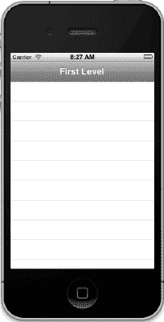

**图 9-9.** *运行中的应用程序骨架*

#### 将图像添加到项目

现在，我们准备开始开发二级视图。在此之前，请从 *09 Nav* 源代码归档目录中获取图像图标文件夹。你会发现一个名为 *Images* 的文件夹，内含八个 *.png* 图像文件：其中六个将用作行图像，另外两个将在本章后面用于美化按钮外观。

在项目导航器中，确保你能够看到 *Nav* 文件夹。然后，将 *Images* 文件夹从 Finder 拖拽到该 *Nav* 文件夹中（**不要**拖到 *Nav* 文件夹上方的 *Nav* 目标中），以将图像添加到项目。

#### 第一个子控制器：披露按钮视图

让我们实现第一个二级视图控制器。为此，我们需要创建一个 `BIDSecondLevelViewController` 的子类。

在项目导航器中，选择 *Nav* 文件夹，然后按 **N** 调出新建文件助手。在左侧窗格中选择 *Cocoa Touch*，然后选择 *Objective-C class* 并点击 *Next*。在接下来的屏幕上，将类命名为 `BIDDisclosureButtonController`，并在 *Subclass of* 中输入 `BIDSecondLevelViewController`。务必检查你的拼写！当用户从顶级视图中点击 *Disclosure Buttons* 项目时，该类将管理显示的电影名称表格（请参阅图 9-3）。


### 创建详情视图

当用户点击任意电影标题时，应用程序将下钻进入另一个视图，该视图会报告选中了哪一行。因此，我们还需要创建一个详情视图供用户下钻进入。重复刚才的步骤，创建一个名为 `BIDDisclosureDetailController` 的 Objective-C 类，这次使用 `UIViewController` 作为父类。再次提醒，请务必确认拼写正确。

**注意：** 提醒一下：`BIDDisclosureDetailController` 负责记录电影名称的表格，而 `BIDDisclosureDetailController` 则管理下一层级，即当选中某部特定电影时，被推送到导航堆栈上的详情视图。

详情视图将只包含一个我们可以设置的标签。它不可编辑；我们只用它来演示如何将值传递给子控制器。由于此控制器不负责表格视图，我们还需要一个与控制器类配套的 nib 文件。在创建 nib 之前，我们先快速添加标签的出口。对 `BIDDisclosureDetailController.h` 进行以下更改：

```
#import <UIKit/UIKit.h>

@interface BIDDisclosureDetailController : UIViewController

@property (strong, nonatomic) IBOutlet UILabel *label;
@property (copy, nonatomic) NSString *message;
@end
```

请问，为什么我们要同时添加标签和字符串？还记得懒加载的概念吗？其实，视图控制器也在后台使用了懒加载。当我们创建控制器时，它直到实际显示时才会加载其 nib 文件。当控制器被推送到导航控制器的堆栈上时，我们不能保证标签已经存在。如果 nib 文件尚未加载，`label` 将只是一个指向 `nil` 的指针。但这没关系。相反，我们将把所需的值赋给 `message`，然后在 `viewWillAppear:` 方法中，根据 `message` 的值来设置 `label`。

为什么我们要使用 `viewWillAppear:` 来更新，而不是像之前那样使用 `viewDidLoad`？问题在于，`viewDidLoad` 只在控制器视图第一次加载时被调用。但在我们的案例中，我们正在重用 `BIDDisclosureDetailController` 的视图。无论你选择哪一部精彩的皮克斯电影，当你点击披露按钮时，详情信息都会出现在同一个 `BIDDisclosureDetailController` 视图中。如果我们使用 `viewDidLoad` 来管理更新，那么该视图只会在 `BIDDisclosureDetailController` 视图第一次出现时更新。当我们选择第二部精彩的皮克斯电影时，我们仍然会看到第一部皮克斯电影的详情信息（试着快速说十遍）——这可不行。由于 `viewWillAppear:` 在每次视图即将绘制时都会被调用，用它来更新是没问题的。

回到属性声明，你可能注意到 `message` 属性使用的是 `copy` 关键字而不是 `strong`。这是怎么回事？为什么我们要随意复制字符串？原因是可变字符串可能存在。

想象一下，如果我们用 `strong` 声明属性，外部代码传入一个 `NSMutableString` 实例来设置 `message` 属性的值。当你在处理用户界面对象中用户输入的字符串时，这种情况经常发生。如果那个原始调用者之后决定更改该字符串的内容，`BIDDisclosureDetailController` 实例最终会进入不一致状态，`message` 的值与文本字段中显示的值不一致！使用 `copy` 消除了这种风险，因为对任何 `NSString`（包括可变子类）调用 `copy` 总是会得到一个不可变的副本。此外，我们也不必太担心性能影响。事实证明，向任何不可变字符串实例发送 `copy` 实际上并不会复制该字符串。相反，它会在增加其引用计数后返回同一个字符串对象。实际上，对不可变字符串调用 `copy` 等同于调用 `retain`，这正是一个 ARC 在你设置 `strong` 属性时可能在幕后做的事情。所以，这对大家都好，因为对象永远不会改变。

将以下代码添加到 `BIDDisclosureDetailController.m` 中：

```
#import "BIDDisclosureDetailController.h"

@implementation BIDDisclosureDetailController
@synthesize label;
@synthesize message;

- (void)viewWillAppear:(BOOL)animated {
    label.text = message;
    [super viewWillAppear:animated];
}

- (void)viewDidUnload {
   self.label = nil;
   self.message = nil;
   [super viewDidUnload];
}

@end
```

这些都很简单明了，对吧？现在，让我们创建与这段源代码配套的 nib 文件。请确保你已经保存了源代码的更改。

在项目导航器中选择 `Nav` 文件夹，然后按 **N** 创建另一个新文件。这次，在左侧窗格的 `iOS` 部分选择 `User Interface`，在右上方选择 `View`。然后点击 `Next`。在下一个屏幕中，将 `Device Family` 设置为 `iPhone`。进入下一个屏幕，将此文件命名为 `BIDDisclosureDetail.xib`。该文件将实现用户点击某个电影按钮时看到的视图。

在项目导航器中选择 `BIDDisclosureDetail.xib` 以打开文件进行编辑。打开后，单击 `File's Owner`，然后按 **3** 调出身份检查器。将底层类更改为 `BIDDisclosureDetailController`。现在，按住 Control 键从 `File's Owner` 图标拖拽到 `View` 图标，并选择 `view` 出口，以建立控制器到其视图的链接。

从库中拖拽一个 `Label` 到 `View` 窗口上，将标签在垂直和水平方向上居中。它不需要完美居中。调整标签大小，使其从左边的蓝色参考线延伸到右边的蓝色参考线，然后使用属性检查器（**4**）将文本对齐方式改为居中。按住 Control 键从 `File's Owner` 拖拽到标签，并选择 `label` 出口。保存你的更改。


### 修改信息披露按钮控制器

在此示例中，电影表将基于数组中的行来获取数据，因此我们将声明一个名为`list`的`NSArray`来达到此目的。我们还需要声明一个属性来保存子控制器的一个实例，该实例将指向我们刚刚构建的`BIDDisclosureDetailController`类的一个实例。我们可以每次用户点击详细信息披露按钮时分配该控制器类的新实例，但更有效的方法是创建一个实例并重复使用它。对`BIDDisclosureButtonController.h`进行以下更改：

```
#import "BIDSecondLevelViewController.h"

@interface BIDDisclosureButtonController : BIDSecondLevelViewController
@property (strong, nonatomic) NSArray *list;
@end
```

现在进入核心部分。将以下代码添加到`BIDDisclosureButtonController.m`中，我们稍后将讨论其内容。

```
#import "BIDDisclosureButtonController.h"
#import "BIDAppDelegate.h"
#import "BIDDisclosureDetailController.h"

@interface BIDDisclosureButtonController ()
@property (strong, nonatomic) BIDDisclosureDetailController *childController;
@end

@implementation BIDDisclosureButtonController

@synthesize list;
@synthesize childController;
- (void)viewDidLoad {
    [super viewDidLoad];
    NSArray *array = [[NSArray alloc] initWithObjects:@"Toy Story",
                      @"A Bug's Life", @"Toy Story 2", @"Monsters, Inc.",
                      @"Finding Nemo", @"The Incredibles", @"Cars",
                      @"Ratatouille", @"WALL-E", @"Up", @"Toy Story 3",
                      @"Cars 2", @"Brave", nil];
    self.list = array;
}

- (void)viewDidUnload {
   [super viewDidUnload];
   self.list = nil;
   self.childController = nil;
}

#pragma mark -
#pragma mark Table Data Source Methods
- (NSInteger)tableView:(UITableView *)tableView
 numberOfRowsInSection:(NSInteger)section {
    return [list count];
}

- (UITableViewCell *)tableView:(UITableView *)tableView
         cellForRowAtIndexPath:(NSIndexPath *)indexPath {

    static NSString * DisclosureButtonCellIdentifier =
    @"DisclosureButtonCellIdentifier";

    UITableViewCell *cell = [tableView dequeueReusableCellWithIdentifier:
                             DisclosureButtonCellIdentifier];
    if (cell == nil) {
        cell = [[UITableViewCell alloc]
                initWithStyle:UITableViewCellStyleDefault
                reuseIdentifier: DisclosureButtonCellIdentifier];
    }
    NSUInteger row = [indexPath row];
    NSString *rowString = [list objectAtIndex:row];
    cell.textLabel.text = rowString;
    cell.accessoryType = UITableViewCellAccessoryDetailDisclosureButton;
    return cell;
}

#pragma mark -
#pragma mark Table Delegate Methods
- (void)tableView:(UITableView *)tableView
didSelectRowAtIndexPath:(NSIndexPath *)indexPath {
    UIAlertView *alert = [[UIAlertView alloc] initWithTitle:
          @"Hey, do you see the disclosure button?"
          message:@"If you're trying to drill down, touch that instead"
          delegate:nil
          cancelButtonTitle:@"Won't happen again"
          otherButtonTitles:nil];
    [alert show];
}

- (void)tableView:(UITableView *)tableView
accessoryButtonTappedForRowWithIndexPath:(NSIndexPath *)indexPath {
    if (childController == nil) {
        childController = [[BIDDisclosureDetailController alloc]
                           initWithNibName:@"BIDDisclosureDetail" bundle:nil];
    }
    childController.title = @"Disclosure Button Pressed";
    NSUInteger row = [indexPath row];
    NSString *selectedMovie = [list objectAtIndex:row];
    NSString *detailMessage = [[NSString alloc]
             initWithFormat:@"You pressed the disclosure button for %@.",
             selectedMovie];
    childController.message = detailMessage;
    childController.title = selectedMovie;
    [self.navigationController pushViewController:childController
                                         animated:YES];
}

@end
```

在这段大代码的开头附近，您可能注意到了以下`@interface`声明，它出现在通常期望`@implementation`部分开始的地方：

```
@interface BIDDisclosureButtonController ()
@property (strong, nonatomic) BIDDisclosureDetailController *childController;
@end
```

这种类别声明，其中括号为空而不是包含您正在声明的类别名称，称为**类扩展**。这是一个方便的地方来声明属性和方法，这些属性和方法将位于包含您类的主`@implementation`部分中，但您不希望它们出现在公共头文件中。

类扩展是放置`childController`属性的好地方。我们在类内部使用此属性，不希望将其暴露给其他人，因此我们不在头文件中声明它。

到目前为止，您应该对包括我们刚刚编写的三个数据源方法在内的所有内容相当熟悉。让我们看看我们添加的两个委托方法，您之前没有见过。

第一个方法`tableView:didSelectRowAtIndexPath:`在选中行时被调用。它会弹出一个礼貌的小提示，告诉用户点击披露按钮而不是选择行。如果用户实际点击了详细信息披露按钮，则调用我们的另一个新委托方法`tableView:accessoryButtonTappedForRowWithIndexPath:`。

在`tableView:accessoryButtonTappedForRowWithIndexPath:`中，我们首先检查`childController`实例变量以查看它是否为`nil`。如果是，我们尚未分配并初始化`BIDDetailDisclosureController`的新实例，因此我们接下来执行该操作。

```
    if (childController == nil)
        childController = [[BIDDisclosureDetailController alloc]
                           initWithNibName:@"BIDDisclosureDetail" bundle:nil];
```

这样我们就得到了一个新控制器，可以将其推送到导航堆栈上，就像之前在`BIDFirstLevelController`中所做的那样。但在将其推送到堆栈之前，我们需要给它一些文本显示。

```
    childController.title = @"Disclosure Button Pressed";
```

在此情况下，我们设置`message`以反映其披露按钮被点击的行。我们还根据选中的行设置新视图的标题。

```
    NSUInteger row = [indexPath row];
    NSString *selectedMovie = [list objectAtIndex:row];
    NSString *detailMessage = [[NSString alloc]
             initWithFormat:@"You pressed the disclosure button for %@.",
             selectedMovie];
    childController.message = detailMessage;
    childController.title = selectedMovie;
```

最后，我们将详细信息视图控制器推送到导航堆栈上。

```
    [self.navigationController pushViewController:childController
                                         animated:YES];
```

至此，我们的第一个二级控制器以及详细信息控制器都已完成。剩下的唯一任务是创建二级控制器的一个实例，并将其添加到`BIDFirstLevelController`的`controllers`数组中。


#### 添加一个公开按钮控制器实例

选择 `BIDFirstLevelController.m`。在文件顶部，我们需要添加一行代码，以导入新类的头文件。将这行代码直接插入到 `@implementation` 声明上方：

```
#import "BIDDisclosureButtonController.h"
```

然后在 `viewDidLoad` 方法中插入以下代码：

```
- (void)viewDidLoad {
    [super viewDidLoad];
    self.title = @"第一级";
    NSMutableArray *array = [[NSMutableArray alloc] init];

    // 公开按钮
    BIDDisclosureButtonController *disclosureButtonController =
        [[BIDDisclosureButtonController alloc]
        initWithStyle:UITableViewStylePlain];
    disclosureButtonController.title = @"公开按钮";
    disclosureButtonController.rowImage = [UIImage
        imageNamed:@"disclosureButtonControllerIcon.png"];
    [array addObject:disclosureButtonController];

    self.controllers = array;
}
```

我们所做的只是创建一个 `BIDDisclosureButtonController` 的新实例。我们指定 `UITableViewStylePlain`，表示需要普通表格，而不是分组表格。接着，我们设置标题和图片为我们添加到项目中的某个 `.png` 文件，将控制器添加到数组中，并释放控制器。

保存更改，然后尝试构建。如果一切顺利，项目应该编译成功并在模拟器中启动。启动后，应该只显示一行（参见图 9–10）。

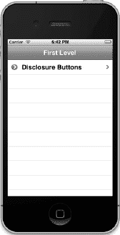

**图 9–10.** *添加第一个二级控制器后的应用*

如果点击这一行，它将带你进入我们刚刚实现的 `BIDDisclosureButtonController` 表格视图（参见图 9–11）。

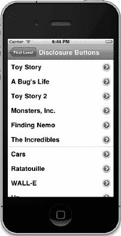

**图 9–11.** *公开按钮视图*

请注意，我们为控制器设置的标题现在显示在导航栏中，而之前使用的视图控制器标题（*第一级*）则包含在一个导航按钮中。点击该按钮将返回第一级。选择此表格中的任意一行，你会看到一个温和的提示，表示详细公开按钮可用于向下钻取（参见图 9–12）。

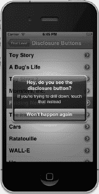

**图 9–12.** *当详细公开按钮可见时，选择行不会向下钻取*

如果点击详细公开按钮本身，将向下钻取到 `BIDDisclosureDetailController` 视图（参见图 9–13）。此视图显示我们传入的信息。尽管这是一个简单的示例，但显示详细视图时使用的都是相同的基本技术。

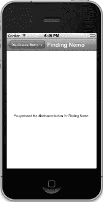

**图 9–13.** *详细视图*

请注意，当你向下钻取到详细视图时，标题再次改变，返回按钮也随之改变，现在它带你回到上一个视图，而不是根视图。

第一个视图控制器就完成了。你现在是否明白了苹果使用导航控制器的设计如何让你能够分块构建应用？这很酷，不是吗？

### 第二个子控制器：清单

我们要实现的第二个二级视图是另一个表格视图。但这次，我们将使用附件图标让用户从列表中选择一个且仅一个项目。我们将使用附件图标在当前选中的行旁边放置一个勾选标记，并在用户点击其他行时更改选择。

由于此视图是一个表格视图，没有详细视图，我们不需要新的 nib 文件，但需要创建另一个 `BIDSecondLevelViewController` 的子类。在 Xcode 的项目导航器中选择 *Nav* 文件夹，然后选择 **文件  新建  新建文件…** 或按下 **N**。选择左侧的 *Cocoa Touch*，右侧的 *Objective-C 类*，然后点击 *下一步*。将新类命名为 `BIDCheckListController`，在 *子类* 字段中输入 `BIDSecondLevelViewController`，然后点击 *下一步* 按钮。在最终屏幕上，确保 *Nav* 文件夹、*组* 和 *目标* 已选中（就像你为本项目中其他类所做的那样）。


### 创建复选标记视图

为了呈现一个复选清单，我们需要一种方法来追踪当前选中的行。我们将声明一个`NSIndexPath`属性来记录上次选中的行。单击`BIDCheckListController.h`，并进行如下修改：

```objc
#import "BIDSecondLevelViewController.h"

@interface BIDCheckListController : BIDSecondLevelViewController

@property (strong, nonatomic) NSArray *list;
@property (strong, nonatomic) NSIndexPath *lastIndexPath;
@end
```

然后切换到`BIDCheckListController.m`，并添加以下代码：

```objc
#import "BIDCheckListController.h"

@implementation BIDCheckListController
@synthesize list;
@synthesize lastIndexPath;

- (void)viewDidLoad {
    [super viewDidLoad];
    NSArray *array = [[NSArray alloc] initWithObjects:@"Who Hash",
       @"Bubba Gump Shrimp Étouffée", @"Who Pudding", @"Scooby Snacks",
       @"Everlasting Gobstopper", @"Green Eggs and Ham", @"Soylent Green",
       @"Hard Tack", @"Lembas Bread", @"Roast Beast", @"Blancmange", nil];
    self.list = array;
}

- (void)viewDidUnload {
    [super viewDidUnload];
    self.list = nil;
    self.lastIndexPath = nil;
}

#pragma mark -
#pragma mark Table Data Source Methods
- (NSInteger)tableView:(UITableView *)tableView
 numberOfRowsInSection:(NSInteger)section {
    return [list count];
}

- (UITableViewCell *)tableView:(UITableView *)tableView
         cellForRowAtIndexPath:(NSIndexPath *)indexPath {
    static NSString *CheckMarkCellIdentifier = @"CheckMarkCellIdentifier";

    UITableViewCell *cell = [tableView dequeueReusableCellWithIdentifier:
                             CheckMarkCellIdentifier];
    if (cell == nil) {
        cell = [[UITableViewCell alloc]
            initWithStyle:UITableViewCellStyleDefault
            reuseIdentifier:CheckMarkCellIdentifier];
    }
    NSUInteger row = [indexPath row];
    NSUInteger oldRow = [lastIndexPath row];
    cell.textLabel.text = [list objectAtIndex:row];
    cell.accessoryType = (row == oldRow && lastIndexPath != nil) ?
    UITableViewCellAccessoryCheckmark : UITableViewCellAccessoryNone;

    return cell;
}

#pragma mark -
#pragma mark Table Delegate Methods
- (void)tableView:(UITableView *)tableView
didSelectRowAtIndexPath:(NSIndexPath *)indexPath {
    int newRow = [indexPath row];
    int oldRow = (lastIndexPath != nil) ? [lastIndexPath row] : -1;

    if (newRow != oldRow) {
        UITableViewCell *newCell = [tableView cellForRowAtIndexPath:
                                    indexPath];
        newCell.accessoryType = UITableViewCellAccessoryCheckmark;

        UITableViewCell *oldCell = [tableView cellForRowAtIndexPath:
                                    lastIndexPath];
        oldCell.accessoryType = UITableViewCellAccessoryNone;
        lastIndexPath = indexPath;
    }
    [tableView deselectRowAtIndexPath:indexPath animated:YES];
}

@end
```

我们先从`tableView:cellForRowAtIndexPath:`方法开始讲起，这个方法里有一些值得注意的新内容。最开始的几行你应该很熟悉。

```objc
    static NSString *CheckMarkCellIdentifier = @"CheckMarkCellIdentifier";

    UITableViewCell *cell = [tableView dequeueReusableCellWithIdentifier:
        CheckMarkCellIdentifier];
    if (cell == nil) {
        cell = [[UITableViewCell alloc]
                initWithStyle:UITableViewCellStyleDefault
                reuseIdentifier:CheckMarkCellIdentifier];
    }
```

接下来就是关键部分。首先，我们从当前单元格和当前选中行中提取出行号。

```objc
    NSUInteger row = [indexPath row];
    NSUInteger oldRow = [lastIndexPath row];
```

我们从数组中获取当前行的值，并将其赋值给单元格的标题。

```objc
    cell.textLabel.text = [list objectAtIndex:row];
```

然后我们根据两行是否相同，设置辅助视图为复选标记或空白。换句话说，如果表格正在请求一个单元格的行恰好是当前选中的行，我们就将辅助图标设置为复选标记；否则，就设置为无。请注意，我们还要检查`lastIndexPath`以确保它不是`nil`。这样做是因为`nil`的`lastIndexPath`表示没有选中任何行。然而，对`nil`对象调用`row`方法会返回`0`，这本身是一个有效的行号，但我们不想在实际上没有选中任何行的情况下，在第 0 行显示复选标记。

```objc
    cell.accessoryType = (row == oldRow && lastIndexPath != nil) ?
      UITableViewCellAccessoryCheckmark : UITableViewCellAccessoryNone;
```

现在跳转到最后一个方法。你之前已经见过`tableView:didSelectRowAtIndexPath:`方法，但这里我们做了一些新的事情。我们不仅获取了刚刚选中的行，还获取了之前选中的行。

```objc
    int newRow = [indexPath row];
    int oldRow = [lastIndexPath row];
```

我们这样做是为了在新行和旧行相同时，不进行任何修改。

```objc
    if (newRow != oldRow) {
```

接下来，我们获取刚刚选中的单元格，并将其辅助图标设置为复选标记。

```objc
        UITableViewCell *newCell = [tableView
            cellForRowAtIndexPath:indexPath];
        newCell.accessoryType = UITableViewCellAccessoryCheckmark;
```

然后，我们获取之前选中的单元格，并将其辅助图标设置为无。

```objc
        UITableViewCell *oldCell = [tableView cellForRowAtIndexPath:
            lastIndexPath];
        oldCell.accessoryType = UITableViewCellAccessoryNone;
```

之后，我们将刚刚选中的索引路径存储到`lastIndexPath`中，这样下次选中行时我们就能获取到它。

```objc
        lastIndexPath = indexPath;
    }
```

处理完成后，我们告诉表格视图取消选中刚刚选中的行，因为我们不想让该行保持高亮状态。我们已经用复选标记标记了该行，如果让它保持蓝色反而会分散注意力。

```objc
    [tableView deselectRowAtIndexPath:indexPath animated:YES];
}
```


### 添加待办清单控制器实例

下一步，我们需要将这个控制器的一个实例添加到 `BIDFirstLevelController` 的 `controllers` 数组中。首先，导入新的头文件，在文件顶部所有其他 `#import` 语句之后添加这一行：

`#import "BIDCheckListController.h"`

然后，通过在 `BIDFirstLevelController.m` 的 `viewDidLoad` 方法中添加以下代码，创建一个 `BIDCheckListController` 实例：

```
- (void)viewDidLoad {
    [super viewDidLoad];
    self.title = @"第一级";
    NSMutableArray *array = [[NSMutableArray alloc] init];

    // 展开按钮
    BIDDisclosureButtonController *BIDDisclosureButtonController =
        [[BIDDisclosureButtonController alloc]
        initWithStyle:UITableViewStylePlain];
    BIDDisclosureButtonController.title = @"展开按钮";
    BIDDisclosureButtonController.rowImage = [UIImage imageNamed:
        @"BIDDisclosureButtonControllerIcon.png"];
    [array addObject:BIDDisclosureButtonController];

    // 待办清单
    BIDCheckListController *checkListController = [[BIDCheckListController alloc]
        initWithStyle:UITableViewStylePlain];
    checkListController.title = @"勾选一项";
    checkListController.rowImage = [UIImage imageNamed:
        @"checkmarkControllerIcon.png"];
    [array addObject:checkListController];

    self.controllers = array;
}
```

还等什么呢？保存修改，编译并运行。如果一切顺利，应用程序会在模拟器中再次启动，令人欢欣鼓舞。这次将显示两行（见图 9-14）。

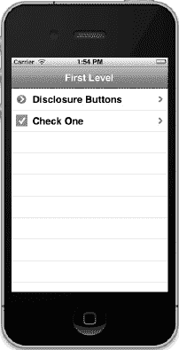

**图 9-14.** *两个二级控制器和两行。真是巧合！*

如果你点击*勾选一项*这一行，它会带你进入我们刚刚实现的视图控制器（见图 9-15）。首次出现时，没有行被选中，也看不到任何勾选符号。如果你点击某一行，就会出现一个勾选符号。如果你随后点击另一行，勾选符号会切换到新行。太棒了！


**图 9-15.** *待办清单视图。注意，一次只能勾选一个项目。有人要来点“绿色黄豆”吗？*

### 第三个子控制器：表格行上的控件

在上一章中，我们向你展示了如何向表格视图单元格添加子视图来自定义其外观。然而，我们并没有在内容视图中放置任何活动控件；只有标签。现在，让我们看看如何向表格视图单元格添加控件。

在我们的示例中，我们会在每一行添加一个按钮，但同样的技术适用于大多数控件。我们会将控件添加到附件视图中，即每行右侧的区域，你在本章前面部分已经见过附件图标所在的位置。

为了在我们的 `BIDFirstLevelController` 表格中添加新的一行，我们需要另一个二级控制器。操作步骤你懂的：在项目导航器中选择 *Nav* 文件夹，然后按下 **N** 或选择 **文件  新建  新建文件...**。选择 *Cocoa Touch*，选择 *Objective-C 类*，然后点击 *下一步*。将类命名为 `BIDRowControlsController`，在 *Subclass of* 中填入 `BIDSecondLevelViewController`。像往常一样，将文件保存在 *Nav* 文件夹中，并确保 *Target* 和 *Group* 都选择了 *Nav*。和之前的子控制器一样，这个控制器可以完全由一个表格视图实现，不需要 nib 文件。

#### 创建行控件视图

单击 `BIDRowControlsController.h`，并进行以下修改：

```
#import "BIDSecondLevelViewController.h"

@interface BIDRowControlsController : BIDSecondLevelViewController

@property (strong, nonatomic) NSArray *list;
- (IBAction)buttonTapped:(id)sender;
@end
```

没什么内容，是吧？我们修改了父类，并创建了一个数组来存放表格数据。然后我们为这个数组定义了一个属性，并声明了一个动作方法，当行按钮被按下时会调用该方法。

**注意：** 严格来说，我们不需要通过指定 `IBAction` 来将 `buttonTapped:` 方法声明为动作方法，因为我们不会通过 nib 文件中的控件来触发它。然而，由于它是一个动作方法，并且会被某个控件调用，使用 `IBAction` 关键字仍然是个好主意，因为它向将来阅读此代码的人表明了我们的意图。

切换到 `BIDRowControlsController.m`，并进行以下修改：

```
#import "BIDRowControlsController.h"

@implementation BIDRowControlsController
@synthesize list;

- (IBAction)buttonTapped:(id)sender {
    UIButton *senderButton = (UIButton *)sender;
    UITableViewCell *buttonCell =
        (UITableViewCell *)[senderButton superview];
    NSUInteger buttonRow = [[self.tableView
        indexPathForCell:buttonCell] row];
    NSString *buttonTitle = [list objectAtIndex:buttonRow];
    UIAlertView *alert = [[UIAlertView alloc]
                     initWithTitle:@"你点击了按钮"
                     message:[NSString stringWithFormat:
                         @"你为 %@ 点击了按钮", buttonTitle]
                     delegate:nil
                     cancelButtonTitle:@"确定"
                     otherButtonTitles:nil];
    [alert show];
}

- (void)viewDidLoad {
    [super viewDidLoad];
    NSArray *array = [[NSArray alloc] initWithObjects:@"R2-D2",
           @"C3PO", @"Tik-Tok", @"Robby", @"Rosie", @"Uniblab",
           @"Bender", @"Marvin", @"Lt. Commander Data",
           @"Evil Brother Lore", @"Optimus Prime", @"Tobor", @"HAL",
           @"Orgasmatron", nil];
    self.list = array;
}

- (void)viewDidUnload {
    [super viewDidUnload];
    self.list = nil;
}

#pragma mark -
#pragma mark 表格数据源方法
- (NSInteger)tableView:(UITableView *)tableView
        numberOfRowsInSection:(NSInteger)section {
    return [list count];
}

- (UITableViewCell *)tableView:(UITableView *)tableView
         cellForRowAtIndexPath:(NSIndexPath *)indexPath {
    static NSString *ControlRowIdentifier = @"ControlRowIdentifier";
```


```objc
UITableViewCell *cell = [tableView
    dequeueReusableCellWithIdentifier:ControlRowIdentifier];
if (cell == nil) {
    cell = [[UITableViewCell alloc]
                 initWithStyle:UITableViewCellStyleDefault
                 reuseIdentifier:ControlRowIdentifier];
    UIImage *buttonUpImage = [UIImage imageNamed:@"button_up.png"];
    UIImage *buttonDownImage = [UIImage imageNamed:@"button_down.png"];
    UIButton *button = [UIButton buttonWithType:UIButtonTypeCustom];
    button.frame = CGRectMake(0.0, 0.0, buttonUpImage.size.width,
        buttonUpImage.size.height);
    [button setBackgroundImage:buttonUpImage
        forState:UIControlStateNormal];
    [button setBackgroundImage:buttonDownImage
       forState:UIControlStateHighlighted];
    [button setTitle:@"Tap" forState:UIControlStateNormal];
    [button addTarget:self action:@selector(buttonTapped:)
       forControlEvents:UIControlEventTouchUpInside];
    cell.accessoryView = button;
}
NSUInteger row = [indexPath row];
NSString *rowTitle = [list objectAtIndex:row];
cell.textLabel.text = rowTitle;

return cell;
```

```objc
#pragma mark -
#pragma mark Table Delegate Methods
- (void)tableView:(UITableView *)tableView
        didSelectRowAtIndexPath:(NSIndexPath *)indexPath {
    NSUInteger row = [indexPath row];
    NSString *rowTitle = [list objectAtIndex:row];
    UIAlertView *alert = [[UIAlertView alloc]
                           initWithTitle:@"You tapped the row."
                           message:[NSString
                           stringWithFormat:@"You tapped %@.", rowTitle]
                           delegate:nil
                           cancelButtonTitle:@"OK"
                           otherButtonTitles:nil];
    [alert show];
    [tableView deselectRowAtIndexPath:indexPath animated:YES];
}
```

`@end`

现在开始编写新的操作方法。我们要做的第一件事是声明一个新的 `UIButton` 变量，并将其设置为 `sender`。这样做是为了避免在整个方法中多次对 `sender` 进行强制转换。

```objc
UIButton *senderButton = (UIButton *)sender;
```

接下来，我们获取该按钮的父视图，即该行所在的表格视图单元格，然后用它来确定被按下的行，并获取该行的标题。

```objc
UITableViewCell *buttonCell =
    (UITableViewCell *)[senderButton superview];
NSUInteger buttonRow = [[self.tableView
    indexPathForCell:buttonCell] row];
NSString *buttonTitle = [list objectAtIndex:buttonRow];
```

然后，我们显示一个提示框，告知用户已按下按钮。

```objc
UIAlertView *alert = [[UIAlertView alloc]
                 initWithTitle:@"You tapped the button"
                 message:[NSString stringWithFormat:
                     @"You tapped the button for %@", buttonTitle]
                 delegate:nil
                 cancelButtonTitle:@"OK"
                 otherButtonTitles:nil];
[alert show];
```

从这里到 `tableView:cellForRowAtIndexPath:` 之间的内容你应该已经熟悉，所以直接跳转到该方法，我们要在这里设置带按钮的表格视图单元格。该方法照常开始。我们声明一个标识符，然后用它来请求一个可重用的单元格。

```objc
static NSString *ControlRowIdentifier = @"ControlRowIdentifier";
UITableViewCell *cell = [tableView
    dequeueReusableCellWithIdentifier:ControlRowIdentifier];
```

如果没有可重用的单元格，我们就创建一个。

```objc
if (cell == nil) {
    cell = [[UITableViewCell alloc]
                 initWithStyle:UITableViewCellStyleDefault
                 reuseIdentifier:ControlRowIdentifier];
```

为了创建按钮，我们加载之前导入的*Images*文件夹中的两张图片。一张表示按钮的正常状态；另一张表示按钮的高亮状态——换句话说，就是按钮被按下时的状态。

```objc
    UIImage *buttonUpImage = [UIImage imageNamed:@"button_up.png"];
    UIImage *buttonDownImage = [UIImage imageNamed:@"button_down.png"];
```

接下来，我们创建一个按钮。因为 `UIButton` 的 `buttonType` 属性被声明为只读，所以我们需要使用工厂方法 `buttonWithType:` 来创建按钮。如果我们使用 `alloc` 和 `init` 来创建，就无法将按钮的类型更改为 `UIButtonTypeCustom`，而这是使用自定义按钮图片所必需的。

```objc
    UIButton *button = [UIButton buttonWithType:UIButtonTypeCustom];
```

接着，我们将按钮的大小设置为与图片匹配，为两种状态分配图片，并给按钮设置一个标题。

```objc
    button.frame = CGRectMake(0.0, 0.0, buttonUpImage.size.width,
        buttonUpImage.size.height);
    [button setBackgroundImage:buttonUpImage
        forState:UIControlStateNormal];
    [button setBackgroundImage:buttonDownImage
        forState:UIControlStateHighlighted];
    [button setTitle:@"Tap" forState:UIControlStateNormal];
```

最后，我们告诉按钮在触摸结束时调用我们的操作方法，并将其分配给单元格的附件视图。

```objc
    [button addTarget:self action:@selector(buttonTapped:)
        forControlEvents:UIControlEventTouchUpInside];
    cell.accessoryView = button;
```

`tableView:cellForRowAtIndexPath:` 方法中的其他内容与之前完全相同。

我们实现的最后一个方法是 `tableView:didSelectRowAtIndexPath:`，这是用户选择某行后调用的委托方法。我们在这里所做的就是找出选中了哪一行，并从数组中获取相应的标题。

```objc
NSUInteger row = [indexPath row];
NSString *rowTitle = [list objectAtIndex:row];
```

然后，我们创建另一个提示框，告知用户有一行被点击了，但不是按钮。

```objc
UIAlertView *alert = [[UIAlertView alloc]
                       initWithTitle:@"You tapped the row."
                       message:[NSString
                       stringWithFormat:@"You tapped %@.", rowTitle]
                       delegate:nil
                       cancelButtonTitle:@"OK"
                       otherButtonTitles:nil];
[alert show];
[tableView deselectRowAtIndexPath:indexPath animated:YES];
```


### 添加行控件控制器实例

现在，我们只需将这个控制器添加到 `BIDFirstLevelController` 的数组中即可。单击 `BIDFirstLevelController.m`，在 `@implementation` 行之前添加以下代码行，以导入 `BIDRowControlsController` 类的头文件：

```
#import "BIDRowControlsController.h"
```

接着，继续在 `viewDidLoad` 方法中添加以下代码：

```
- (void)viewDidLoad {
    [super viewDidLoad];
    self.title = @"根级别";
    NSMutableArray *array = [[NSMutableArray alloc] init];

    // 公开按钮
    BIDDisclosureButtonController *BIDDisclosureButtonController =
        [[BIDDisclosureButtonController alloc]
       initWithStyle:UITableViewStylePlain];
    BIDDisclosureButtonController.title = @"公开按钮";
    BIDDisclosureButtonController.rowImage = [UIImage
        imageNamed:@"BIDDisclosureButtonControllerIcon.png"];
    [array addObject:BIDDisclosureButtonController];
    [BIDDisclosureButtonController release];

    // 复选框列表
    BIDCheckListController *checkListController = [[BIDCheckListController alloc]
              initWithStyle:UITableViewStylePlain];
    checkListController.title = @"勾选一项";
    checkListController.rowImage = [UIImage
        imageNamed:@"checkmarkControllerIcon.png"];
    [array addObject:checkListController];
    [checkListController release];

    // 表格行控件
    BIDRowControlsController *rowControlsController =
        [[BIDRowControlsController alloc]
        initWithStyle:UITableViewStylePlain];
    rowControlsController.title = @"行控件";
    rowControlsController.rowImage = [UIImage imageNamed:
        @"rowControlsIcon.png"];
    [array addObject:rowControlsController];

    self.controllers = array;
}
```

保存所有文件并编译。这一次，当应用程序启动时，你应该会看到多出了一行（参见图 9–16）。

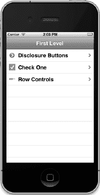

**图 9–16.** *行控件控制器已添加到根级别控制器*

如果你点击这一新行，将进入一个新列表，其中每一行的右侧都有一个按钮控件。点击按钮或行本身都会弹出一个提示，告诉你点击了哪个元素（参见图 9–17）。


**图 9–17.** *辅助视图中带有按钮的表格*

点击行中除开关以外的任意位置，将显示一个提示，告知你该行的开关是打开还是关闭状态。

至此，你应该对这个整体工作机制比较熟悉了，那么我们来尝试一个稍微复杂一点的例子吧？接下来，我们将介绍如何允许用户重新排列表格中的行。

**注意：** 你感觉如何？还在坚持吗？我们知道这一章内容繁多，像一场马拉松，需要吸收很多东西。到现在为止，你已经完成了不少内容。为什么不休息一下，喝杯汽水，吃点贝伦蛋挞呢？我们也要歇一歇。等你精神焕发、准备好继续前进时再回来。

### 第四个子控制器：可移动行

移动行、删除行以及在表格的特定位置插入行，这些任务实现起来都相当简单。这三种操作都是通过启用所谓的**编辑模式**（editing mode）来实现的，该模式使用表格视图上的 `setEditing:animated:` 方法。

`setEditing:animated:` 方法接受两个布尔值参数。第一个参数表示你是否要开启或关闭编辑模式，第二个参数表示表格是否应动画过渡。如果你将编辑模式设置为当前已处的模式（换句话说，当编辑模式已开启时将其设为开启，或已关闭时将其设为关闭），那么无论第二个参数指定什么，过渡都不会有动画效果。

一旦启用编辑模式，就会触发许多新的委托方法。表格视图会通过这些方法来询问某一行是否可以被移动或编辑，并在用户实际移动或编辑某一行时通知你。这听起来比实际复杂。让我们在可移动行控制器中实际操作看看。

由于我们不需要显示详细视图，因此这个视图控制器可以通过单个控制器类实现，无需使用 nib 文件。在 Xcode 的项目导航器中选择 `Nav` 文件夹，然后按下 `N` 或选择 **文件  新建  新建文件…**。选择 `Cocoa Touch`，再选择 `Objective-C 类`，然后点击 *下一步*。接着在类名栏中输入 `BIDMoveMeController`，并在*子类*控件中输入 `BIDSecondLevelViewController`。再次点击 *下一步*，并照常保存类文件。


### 创建可移动行视图

在我们的头文件中，需要完成两件事。首先，需要一个可变数组来存储数据并跟踪行的顺序。该数组必须是可变的，因为当收到移动通知时，我们需要能够移动项目。其次，需要一个操作方法来切换编辑模式的开启与关闭。该操作方法将由我们稍后创建的导航栏按钮调用。

单击 `BIDMoveMeController.h`，并进行以下修改：

```
#import "BIDSecondLevelViewController.h"

@interface BIDMoveMeController : BIDSecondLevelViewController

@property (strong, nonatomic) NSMutableArray *list;
- (IBAction)toggleMove;
@end
```

现在，切换到 `BIDMoveMeController.m`，并添加以下代码：

```
#import "BIDMoveMeController.h"

@implementation BIDMoveMeController
@synthesize list;

- (IBAction)toggleMove{
    [self.tableView setEditing:!self.tableView.editing animated:YES];

    if (self.tableView.editing)
        [self.navigationItem.rightBarButtonItem setTitle:@"Done"];
    else
        [self.navigationItem.rightBarButtonItem setTitle:@"Move"];
}

- (void)viewDidLoad {
    [super viewDidLoad];
    if (list == nil) {
        NSMutableArray *array = [[NSMutableArray alloc] initWithObjects:
                    @"Eeny", @"Meeny", @"Miney", @"Moe", @"Catch", @"A",
                    @"Tiger", @"By", @"The", @"Toe", nil];
        self.list = array;
    }

    UIBarButtonItem *moveButton = [[UIBarButtonItem alloc]
                                   initWithTitle:@"Move"
                                   style:UIBarButtonItemStyleBordered
                                   target:self
                                   action:@selector(toggleMove)];
    self.navigationItem.rightBarButtonItem = moveButton;
}

#pragma mark -
#pragma mark Table Data Source Methods
- (NSInteger)tableView:(UITableView *)tableView
        numberOfRowsInSection:(NSInteger)section {
    return [list count];
}

- (UITableViewCell *)tableView:(UITableView *)tableView
         cellForRowAtIndexPath:(NSIndexPath *)indexPath {

    static NSString *MoveMeCellIdentifier = @"MoveMeCellIdentifier";
    UITableViewCell *cell = [tableView
        dequeueReusableCellWithIdentifier:MoveMeCellIdentifier];
    if (cell == nil) {
        cell = [[UITableViewCell alloc]
                  initWithStyle:UITableViewCellStyleDefault
                  reuseIdentifier:MoveMeCellIdentifier];
        cell.showsReorderControl = YES;
    }
    NSUInteger row = [indexPath row];
    cell.textLabel.text = [list objectAtIndex:row];

    return cell;
}

- (UITableViewCellEditingStyle)tableView:(UITableView *)tableView
           editingStyleForRowAtIndexPath:(NSIndexPath *)indexPath {
    return UITableViewCellEditingStyleNone;
}

- (BOOL)tableView:(UITableView *)tableView
        canMoveRowAtIndexPath:(NSIndexPath *)indexPath {
    return YES;
}

- (void)tableView:(UITableView *)tableView
moveRowAtIndexPath:(NSIndexPath *)fromIndexPath
    toIndexPath:(NSIndexPath *)toIndexPath {
    NSUInteger fromRow = [fromIndexPath row];
    NSUInteger toRow = [toIndexPath row];

    id object = [list objectAtIndex:fromRow];
    [list removeObjectAtIndex:fromRow];
    [list insertObject:object atIndex:toRow];
}

@end
```

让我们逐步分析。我们添加的第一段代码是操作方法的实现。

```
- (IBAction)toggleMove{
    [self.tableView setEditing:!self.tableView.editing animated:YES];

    if (self.tableView.editing)
        [self.navigationItem.rightBarButtonItem setTitle:@"Done"];
    else
        [self.navigationItem.rightBarButtonItem setTitle:@"Move"];
}
```


我们在这里所做的就是切换编辑模式，然后将按钮标题设置为适当的值。很简单，对吧？

我们接触的下一个方法是`viewDidLoad`。该方法的第一部分没有你之前没见过的地方。它检查`list`是否为`nil`，如果是（意味着这是该方法第一次被调用），它会创建一个填充有值的可变数组，这样我们的表格就有一些数据可以显示。不过，在那之后，出现了一些新内容。

```
    UIBarButtonItem *moveButton = [[UIBarButtonItem alloc]
              initWithTitle:@"Move"
              style:UIBarButtonItemStyleBordered
              target:self
              action:@selector(toggleMove)];
    self.navigationItem.rightBarButtonItem = moveButton;
```

在这里，我们创建了一个按钮栏项（`UIBarButtonItem`），这是一个会位于导航栏上的按钮。我们为其设置标题为`Move`，并指定一个常量`UIBarButtonItemStyleBordered`，以表明我们想要一个标准的有边框栏按钮。最后两个参数`target`和`action`告诉按钮在被点击时该做什么。通过将`self`作为目标，并为其提供一个指向`toggleMove`方法的选择器作为动作，我们告诉按钮：每当按钮被点击时，就调用我们的`toggleMove`方法。因此，只要用户点击此按钮，编辑模式就会被切换。创建完按钮后，我们将其添加到导航栏的右侧，然后释放它。

与我们创建的大多数视图控制器不同，这个控制器没有`viewDidUnload`方法。这是有意为之。我们没有输出口（outlets），而且如果我们清空`list`数组，当视图被清空时，我们将丢失用户已经完成的任何重新排序，这是我们不希望发生的。因此，由于在`viewDidUnload`方法中无事可做，我们就不去重写它了。

现在，往下跳到我们刚刚添加的`tableView:cellForRowAtIndexPath:`方法。你注意到下面这行新代码了吗？

```
    cell.showsReorderControl = YES;
```

可以通过设置单元格的`accessoryType`属性来指定标准的辅助图标。但重新排序控件并不是标准的辅助图标。这是一个特殊情况，仅在表格处于编辑模式时才会显示。要启用重新排序控件，我们需要在单元格本身上设置一个属性。不过要注意，将此属性设置为`YES`并不会实际显示重新排序控件，直到表格进入编辑模式。此方法中的其他内容都是我们之前做过的事情。

下一个新方法简短但重要。在我们的表格视图中，我们希望能够对行进行重新排序，但又不希望用户能够删除或插入行。因此，我们实现了`tableView:editingStyleForRowAtIndexPath:`方法。此方法允许表格视图询问特定行是否可以被删除，或者是否可以在特定位置插入新行。通过为每一行返回`UITableViewCellEditingStyleNone`，我们表明我们不支持任何行的插入或删除操作。

接下来是`tableView:canMoveRowAtIndexPath:`方法。每一行都会调用此方法，它让你有机会禁止特定行的移动。如果你对任何行从此方法返回`NO`，则该行将不会显示重新排序控件，并且用户将无法将其从当前位置移开。我们希望允许完全重新排序，因此我们只为每一行返回`YES`。

最后一个方法`tableView:moveRowAtIndexPath:fromIndexPath:`是当用户移动行时实际被调用的方法。除了`tableView`之外的两个参数都是`NSIndexPath`实例，它们标识了被移动的行以及该行的新位置。表格视图已经移动了表格中的行，因此用户看到的是正确的显示，但我们需要更新我们的数据模型以保持两者同步，并避免引起显示问题。

首先，我们检索需要移动的行。然后，我们检索该行的新位置。

```
    NSUInteger fromRow = [fromIndexPath row];
    NSUInteger toRow = [toIndexPath row];
```

现在，我们需要从数组中移除指定的对象，并将其重新插入到新的位置。

```
    id object = [list objectAtIndex:fromRow];
    [list removeObjectAtIndex:fromRow];
```

移除之后，我们需要将其重新插入到指定的新位置。

```
    [list insertObject:object atIndex:toRow];
```

好了，就是这样。我们实现了一个允许对行进行重新排序的表格。


#### 添加“移动我”控制器实例

现在，我们只需将这个新类的一个实例添加到 `BIDFirstLevelController` 的控制器数组中。你对此应该已经相当熟练了，但为了保险起见，我们还是会一步步带你完成。

在 `BIDFirstLevelController.m` 文件中，在 `@implementation` 声明之前添加以下代码行，以导入新视图的头文件：

```objective-c
#import "BIDMoveMeController.h"
```

现在，在同一文件的 `viewDidLoad` 方法中添加以下代码：

```objective-c
- (void)viewDidLoad {
    [super viewDidLoad];
    self.title = @"第一级";
    NSMutableArray *array = [[NSMutableArray alloc] init];

    // 披露按钮
    BIDDisclosureButtonController *BIDDisclosureButtonController =
        [[BIDDisclosureButtonController alloc]
        initWithStyle:UITableViewStylePlain];
    BIDDisclosureButtonController.title = @"披露按钮";
    BIDDisclosureButtonController.rowImage = [UIImage
        imageNamed:@"BIDDisclosureButtonControllerIcon.png"];
    [array addObject:BIDDisclosureButtonController];

    // 清单
    BIDCheckListController *checkListController = [[BIDCheckListController alloc]
        initWithStyle:UITableViewStylePlain];
    checkListController.title = @"勾选一项";
    checkListController.rowImage = [UIImage
        imageNamed:@"checkmarkControllerIcon.png"];
    [array addObject:checkListController];

    // 表格行控件
    BIDRowControlsController *rowControlsController =
        [[BIDRowControlsController alloc]
        initWithStyle:UITableViewStylePlain];
    rowControlsController.title = @"行控件";
    rowControlsController.rowImage = [UIImage imageNamed:
        @"rowControlsIcon.png"];
    [array addObject:rowControlsController];

    // 移动我
    BIDMoveMeController *moveMeController = [[BIDMoveMeController alloc]
          initWithStyle:UITableViewStylePlain];
    moveMeController.title = @"移动我";
    moveMeController.rowImage = [UIImage imageNamed:@"moveMeIcon.png"];
    [array addObject:moveMeController];

    self.controllers = array;
}
```

好了，我们来编译这个“小坏蛋”，看看效果如何。如果一切顺利，我们的应用程序会在模拟器中启动，根级表格中会显示（数一数）四行（参见图 9–18）。如果你点击名为“移动我”的新行，将进入一个表格，其中每一行都让人联想到童年熟悉的选人童谣（参见图 9–6）。

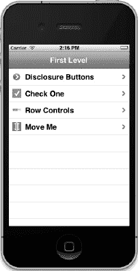

**图 9–18.** *“移动我”行已添加到我们的表格中。*

要重新排序行，请点击右上角的“移动”按钮，重新排序控件就会出现。如果你点击某行的重新排序控件并拖动，该行会随着拖动而移动，如图 图 9–6 所示。当行移动到满意的新位置后，松开拖拽。该行会稳稳地停留在新位置。你甚至可以导航回顶级菜单再返回，这些行依然会保持在您离开时的位置。如果退出并重新进入，它们会恢复为原始顺序，不过别担心；在后面的几章中，我们会教你如何更持久地保存和恢复数据。

**注意：** 如果你发现自己很难与移动控件建立有效接触，请不要慌张。这种手势实际上需要一点耐心。尝试在移动之前，保持鼠标按钮按下（如果你在模拟器中）或手指按压在控件上（如果你在设备上）的时间稍长一些，以便拖拽重排手势生效。

现在让我们进入第五个子控制器，它演示了编辑模式的另一种用法。这次，我们将允许用户删除我们宝贵的行。啊！

### 第五个子控制器：可删除行

允许用户删除行实际上并不比允许他们移动行复杂多少。让我们来看看这个过程。

这次，我们不再从硬编码的对象列表创建数组，而是加载一个属性列表文件，以节省一些打字时间。你可以从本书附带的项目归档中 `09 Nav` 文件夹里获取名为 `computers.plist` 的文件，并将其添加到你的 Xcode 项目中的 `Nav` 文件夹里。

在项目导航器中选中 `Nav` 文件夹，然后按  **N** 或选择 **文件  新建  新建文件...**。选择“Cocoa Touch”，选择“Objective-C class”，然后点击“下一步”。将新类命名为 `BIDDeleteMeController`，并在“Subclass of”中输入 `BIDSecondLevelViewController`。


### 创建可删除行视图

我们将要对 `BIDDeleteMeController.h` 所做的修改看起来应该很熟悉，因为它们与我们刚刚构建的可移动行视图控制器中的修改几乎完全相同。现在就来完成这些修改：

```
#import "BIDDeleteMeController.h"

@interface BIDDeleteMeController : BIDSecondLevelViewController

@property (strong, nonatomic) NSMutableArray *list;
- (IBAction)toggleEdit:(id)sender;
@end
```

没什么意外，对吧？我们声明了一个可变数组来存储数据，以及一个用于切换编辑模式的操作方法。

在之前的控制器中，我们使用编辑模式让用户重新排列行。在这个版本中，编辑模式将用于让用户删除行。实际上，如果你愿意，可以在同一个表格中同时实现这两种功能。我们将它们分开是为了让概念更容易理解，不过删除和重新排序操作确实可以很好地协同工作。

当表格处于编辑模式时，可重新排序的行会始终显示重新排序图标。当你点击行左侧的红色圆形图标时（参见图 9–7），*删除*按钮会弹出，暂时遮挡住重新排序图标。

切换到 `BIDDeleteMeController.m`，并添加以下代码：

```
#import "BIDDeleteMeController.h"

@implementation BIDDeleteMeController
@synthesize list;

- (IBAction)toggleEdit:(id)sender {
    [self.tableView setEditing:!self.tableView.editing animated:YES];

    if (self.tableView.editing)
        [self.navigationItem.rightBarButtonItem setTitle:@"完成"];
    else
        [self.navigationItem.rightBarButtonItem setTitle:@"删除"];
}

- (void)viewDidLoad {
    [super viewDidLoad];
    if (list == nil){
        NSString *path = [[NSBundle mainBundle]
            pathForResource:@"computers" ofType:@"plist"];
        NSMutableArray *array = [[NSMutableArray alloc]
                                 initWithContentsOfFile:path];
        self.list = array;
    }
    UIBarButtonItem *editButton = [[UIBarButtonItem alloc]
                                   initWithTitle:@"删除"
                                   style:UIBarButtonItemStyleBordered
                                   target:self
                                   action:@selector(toggleEdit:)];
    self.navigationItem.rightBarButtonItem = editButton;
}

#pragma mark -
#pragma mark 表格数据源方法
- (NSInteger)tableView:(UITableView *)tableView
numberOfRowsInSection:(NSInteger)section {
    return [list count];
}

- (UITableViewCell *)tableView:(UITableView *)tableView
         cellForRowAtIndexPath:(NSIndexPath *)indexPath {
    static NSString *DeleteMeCellIdentifier = @"DeleteMeCellIdentifier";

    UITableViewCell *cell = [tableView dequeueReusableCellWithIdentifier:
                             DeleteMeCellIdentifier];

    if (cell == nil) {
        cell = [[UITableViewCell alloc]
            initWithStyle:UITableViewCellStyleDefault
            reuseIdentifier:DeleteMeCellIdentifier];
    }
    NSInteger row = [indexPath row];
    cell.textLabel.text = [self.list objectAtIndex:row];
    return cell;
}

#pragma mark -
#pragma mark 表格视图数据源方法
- (void)tableView:(UITableView *)tableView
    commitEditingStyle:(UITableViewCellEditingStyle)editingStyle
    forRowAtIndexPath:(NSIndexPath *)indexPath {

    NSUInteger row = [indexPath row];
    [self.list removeObjectAtIndex:row];
    [tableView deleteRowsAtIndexPaths:[NSArray arrayWithObject:indexPath]
                     withRowAnimation:UITableViewRowAnimationAutomatic];
}

@end
```

这里，新的操作方法 `toggleEdit:` 与我们之前的版本几乎完全相同。如果当前编辑模式处于关闭状态，则将其打开，反之亦然，然后相应地设置按钮标题。`viewDidLoad` 方法也与之前视图控制器中的类似，同样，我们没有使用 `viewDidUnload` 方法，因为我们没有设置出口，并且希望保留在编辑模式下对可变数组所做的更改。唯一的区别是我们从属性列表加载数组，而不是向它提供一个硬编码的字符串列表。我们使用的属性列表是一个包含多种计算机型号名称的扁平字符串数组，这些名称可能有些眼熟。我们还将编辑按钮命名为*删除*，以使按钮的效果对用户显而易见。

两个数据源方法中没有什么新内容，但类中的最后一个方法是你从未见过的，所以让我们仔细看看它。

```
- (void)tableView:(UITableView *)tableView
    commitEditingStyle:(UITableViewCellEditingStyle)editingStyle
    forRowAtIndexPath:(NSIndexPath *)indexPath {
```

当用户进行了编辑（即删除或插入操作）时，表格视图会调用此方法。第一个参数是发生行编辑的表格视图。第二个参数 `editingStyle` 是一个常量，用于告诉我们刚刚发生了哪种编辑。当前定义了三种编辑样式：

*   `UITableViewCellEditingStyleNone`：我们在之前的控制器中使用这种样式来表示某行不可编辑。选项 `UITableViewCellEditingStyleNone` 永远不会被传入此方法，因为它用于表示不允许对该行进行编辑。
*   `UITableViewCellEditingStyleDelete`：这是默认选项。我们忽略这个参数，因为行的默认编辑样式是删除样式，所以我们知道每次调用此方法时，它都会请求删除操作。你可以使用这个参数在单个表格中同时允许插入和删除操作。
*   `UITableViewCellEditingStyleInsert`：这通常用于当需要让用户在列表中的特定位置插入行时。在由系统维护顺序的列表中（例如按字母顺序排列的名称列表），用户通常会点击工具栏或导航栏按钮，要求系统在详细视图中创建一个新对象。一旦用户完成指定新对象，系统会将其放置在相应的行中。

最后一个参数 `indexPath` 告诉我们哪一行正在被编辑。对于删除操作，该索引路径表示要删除的行。对于插入操作，它表示新行应被插入的位置索引。

**注意：** 我们不会涵盖插入操作的使用，但插入功能的工作原理与我们即将实现的删除功能基本相同。唯一的区别是，你不需要从数据模型中删除指定行，而是需要创建一个新对象并将其插入到指定位置。

在我们的方法中，首先从 `indexPath` 中获取正在被编辑的行。

```
    NSUInteger row = [indexPath row];
```

然后，我们从之前创建的可变数组中移除该对象。

```
    [self.list removeObjectAtIndex:row];
```

最后，我们告诉表格删除该行，并指定常量 `UITableViewRowAnimationAutomatic`，该常量设置了动画效果，使得该行消失时，其下方或上方的行会看起来像滑过它。表格视图会根据被删除的行自行决定滑动动画的方向。

```
    [tableView deleteRowsAtIndexPaths:[NSArray arrayWithObject:indexPath]
        withRowAnimation:UITableViewRowAnimationAutomatic];
}
```

**注意：** 表格视图有多种动画类型可供选择。你可以在 Xcode 的文档浏览器中查找 `UITableViewRowAnimation`，查看还有哪些其他动画可用。

以上就是全部内容。这就是这个类的全部代码了。


#### 添加“删除我”控制器实例

现在，让我们向根视图控制器添加一个新控制器的实例并进行测试。在 `BIDFirstLevelController.m` 文件中，我们首先需要导入新控制器类的头文件，因此请在 `@implementation` 声明之前添加以下代码行：

```
#import "BIDDeleteMeController.h"
```

接下来，将以下代码添加到 `viewDidLoad` 方法中：

```
- (void)viewDidLoad {
    [super viewDidLoad];
    self.title = @"First Level";
    NSMutableArray *array = [[NSMutableArray alloc] init];

    // Disclosure Button
    BIDDisclosureButtonController *disclosureButtonController =
        [[BIDDisclosureButtonController alloc]
        initWithStyle:UITableViewStylePlain];
    disclosureButtonController.title = @"Disclosure Buttons";
    disclosureButtonController.rowImage = [UIImage imageNamed:
        @"disclosureButtonControllerIcon.png"];
    [array addObject:disclosureButtonController];

    // Checklist
    BIDCheckListController *checkListController = [[BIDCheckListController alloc]
        initWithStyle:UITableViewStylePlain];
    checkListController.title = @"Check One";
    checkListController.rowImage = [UIImage imageNamed:
        @"checkmarkControllerIcon.png"];
    [array addObject:checkListController];

    // Table Row Controls
    RowControlsController *rowControlsController =
        [[RowControlsController alloc]
        initWithStyle:UITableViewStylePlain];
    rowControlsController.title = @"Row Controls";
    rowControlsController.rowImage = [UIImage imageNamed:
        @"rowControlsIcon.png"];
    [array addObject:rowControlsController];

    // Move Me
    BIDMoveMeController *moveMeController = [[BIDMoveMeController alloc]
        initWithStyle:UITableViewStylePlain];
    moveMeController.title = @"Move Me";
    moveMeController.rowImage = [UIImage imageNamed:@"moveMeIcon.png"];
    [array addObject:moveMeController];

    // Delete Me
    BIDDeleteMeController *deleteMeController = [[BIDDeleteMeController alloc]
        initWithStyle:UITableViewStylePlain];
    deleteMeController.title = @"Delete Me";
    deleteMeController.rowImage = [UIImage imageNamed:@"deleteMeIcon.png"];
    [array addObject:deleteMeController];

    self.controllers = array;
}
```

保存所有内容，编译并运行它。当模拟器启动时，根级菜单将出现——你能猜到吗？——五行。如果选择新的 `DeleteMe` 行，你将看到一个计算机型号列表（见图 9–19）。这些型号你拥有过多少？

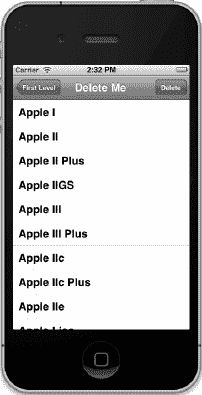

**图 9–19.** *“删除我”视图首次启动时的样子。能认出这些电脑吗？*

注意，导航栏右侧再次出现了一个按钮，这次标记为 `Delete`。如果点击它，表格将进入编辑模式，效果如图 9–20 所示。

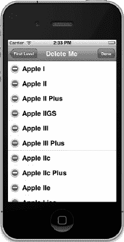

**图 9–20.** *“删除我”视图在编辑模式下的样子*

每个可编辑行旁边都有一个类似“禁止驶入”路标的小图标。点击该图标，它会旋转成横向，并出现一个标记为 `Delete` 的按钮（见图 9–7）。点击该按钮将导致该行被删除，无论是从底层模型还是从表格中都会删除，并采用我们指定的动画样式。

当你实现允许删除的编辑模式时，你还会免费获得额外功能。在行上水平滑动手指。看！仅针对该行会出现 `Delete` 按钮，就像在邮件应用中一样。

我们现在快要接近终点了，虽然终点线还在稍远的地方。如果你还在坚持，就给自己一个鼓励，或者让别人代劳。这是一章漫长而艰难的内容。

### 第六个子控制器：可编辑的详情面板

接下来我们要探讨的概念是如何实现一个可重用的可编辑详情视图。你可能会注意到，在浏览 iPhone 上自带的各种应用时，包括通讯录应用在内，很多应用都使用了分组表格来呈现详情视图（见图 9–21）。

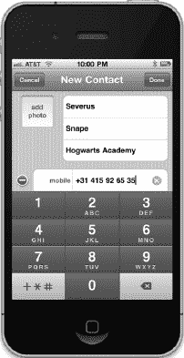

**图 9–21.** *使用分组表格视图呈现可编辑表格视图的示例*

现在让我们看看如何实现这一点。在开始之前，我们需要一些要显示的数据，而且不能只是一组字符串。在前两章中，当我们需要更复杂的数据时，例如第 8 章中的多行表格或第 7 章中的邮编选择器，我们使用了 `NSArray` 来保存一组填充了数据的 `NSDictionary` 实例。这种方法效果很好且非常灵活，但使用起来有点麻烦。对于这个表格的数据，让我们创建一个自定义的 Objective-C 数据对象来保存将在列表中显示的各个实例。


### 创建数据模型对象

在本节应用中所使用的属性列表包含了关于美国总统的数据：每位总统的姓名、所属政党、任职起始年份以及离任年份。接下来，我们创建用于存储这些数据的类。

同样，在 Xcode 中单击 `Nav` 文件夹选中它，然后按下 `N` 调出新文件助手。从左侧窗格中选择 `Cocoa Touch`，再从右侧窗格中选择 `Objective-C class`，点击 `Next`。将新类命名为 `BIDPresident`，并在 `Subclass of` 中选择 `NSObject`。

点击 `BIDPresident.h`，并进行如下修改：

```objective-c
#import <Foundation/Foundation.h>

#define kPresidentNumberKey            @"President"
#define kPresidentNameKey              @"Name"
#define kPresidentFromKey              @"FromYear"
#define kPresidentToKey                @"ToYear"
#define kPresidentPartyKey             @"Party"

@interface BIDPresident : NSObject <NSCoding>

@property int number;
@property (nonatomic, copy) NSString *name;
@property (nonatomic, copy) NSString *fromYear;
@property (nonatomic, copy) NSString *toYear;
@property (nonatomic, copy) NSString *party;
@end
```

这五个常量将在从文件系统读取数据时用于标识字段。让此类遵循 `NSCoding` 协议，即可实现对象的文件写入与读取。我们在头文件中新增的其他内容，都是为了实现存储数据所需的属性。切换到 `BIDPresident.m`，并进行如下修改：

```objective-c
#import "BIDPresident.h"

@implementation BIDPresident
@synthesize number;
@synthesize name;
@synthesize fromYear;
@synthesize toYear;
@synthesize party;

#pragma mark -
#pragma mark NSCoding
- (void)encodeWithCoder:(NSCoder *)coder {
    [coder encodeInt:self.number forKey:kPresidentNumberKey];
    [coder encodeObject:self.name forKey:kPresidentNameKey];
    [coder encodeObject:self.fromYear forKey:kPresidentFromKey];
    [coder encodeObject:self.toYear forKey:kPresidentToKey];
    [coder encodeObject:self.party forKey:kPresidentPartyKey];
}

- (id)initWithCoder:(NSCoder *)coder {
    if (self = [super init]) {
        number = [coder decodeIntForKey:kPresidentNumberKey];
        name = [coder decodeObjectForKey:kPresidentNameKey];
        fromYear = [coder decodeObjectForKey:kPresidentFromKey];
        toYear = [coder decodeObjectForKey:kPresidentToKey];
        party = [coder decodeObjectForKey:kPresidentPartyKey];
    }
    return self;
}

@end
```

暂时不必过多关注 `encodeWithCoder:` 和 `initWithCoder:` 方法。我们将在第 13 章中详细讲解。目前你只需知道这两个方法是 `NSCoding` 协议的一部分，可用于将对象保存到磁盘并重新加载。`encodeWithCoder:` 方法对要保存的对象进行编码，而 `initWithCoder:` 则用于从已保存的文件中创建新对象。通过这些方法，我们可以从属性列表归档文件中创建 `BIDPresident` 对象。该类中的其他内容都相当直观易懂。

我们已经为你提供了一个包含所有美国总统数据的属性列表文件，可用于创建我们刚刚编写的 `BIDPresident` 对象的新实例。我们将在下一节中使用它，因此你无需手动输入大量数据。从项目归档的 `09 Nav` 文件夹中获取 `Presidents.plist` 文件，并将其添加到项目中的 `Nav` 文件夹。

现在，我们开始编写两个控制器类。

### 创建详细信息列表控制器

在应用的这一部分，我们需要两个新的控制器：一个用于显示待编辑的列表，另一个用于查看和编辑列表中选中项的详细信息。由于这两个视图控制器都基于表格，我们不需要创建任何 nib 文件，但需要两个独立的控制器类。现在先为这两个类创建文件，然后再实现它们。

在项目导航器中选择 `Nav` 文件夹，然后按下 `N` 或选择 **File > New > New File…**。选择 `Cocoa Touch`，然后选择 `Objective-C class`，点击 `Next`。将新类命名为 `BIDPresidentsViewController`，并在 `Subclass of` 中输入 `BIDSecondLevelViewController`。务必检查拼写是否正确。

重复相同的过程，第二次使用名称 `BIDPresidentDetailController`，但这次在 `Subclass of` 字段中使用 `UITableViewController`。

**注意：** 你可能注意到 `BIDPresidentDetailController` 是单数形式（而不是 `BIDPresidentsDetailController`），因为它处理的是单个总统的详细信息。没错，我们确实为了这个细节打过一架，但在一场激烈的彩弹射击之后，我们又和好如初了。

首先创建显示总统列表的视图控制器。单击 `BIDPresidentsViewController.h`，并进行如下修改：

```objective-c
#import "BIDSecondLevelViewController.h"

@interface BIDPresidentsViewController : BIDSecondLevelViewController

@property (strong, nonatomic) NSMutableArray *list;
@end
```

然后切换到 `BIDPresidentsViewController.m` 并进行如下修改：

```objective-c
#import "BIDPresidentsViewController.h"
#import "BIDPresidentDetailController.h"
#import "BIDPresident.h"

@implementation BIDPresidentsViewController
@synthesize list;

- (void)viewDidLoad {
    [super viewDidLoad];
    NSString *path = [[NSBundle mainBundle] pathForResource:@"Presidents"
                                                     ofType:@"plist"];
    NSData *data;
    NSKeyedUnarchiver *unarchiver;

    data = [[NSData alloc] initWithContentsOfFile:path];
    unarchiver = [[NSKeyedUnarchiver alloc] initForReadingWithData:data];
    NSMutableArray *array = [unarchiver decodeObjectForKey:@"Presidents"];
    self.list = array;
    [unarchiver finishDecoding];
}

- (void)viewWillAppear:(BOOL)animated {
    [super viewWillAppear:animated];
    [self.tableView reloadData];
}

#pragma mark -
#pragma mark 表格数据源方法
- (NSInteger)tableView:(UITableView *)tableView
 numberOfRowsInSection:(NSInteger)section {
    return [list count];
}

- (UITableViewCell *)tableView:(UITableView *)tableView
         cellForRowAtIndexPath:(NSIndexPath *)indexPath {

    static NSString *PresidentListCellIdentifier =
        @"PresidentListCellIdentifier";

    UITableViewCell *cell = [tableView
        dequeueReusableCellWithIdentifier:PresidentListCellIdentifier];
    if (cell == nil) {
        cell = [[UITableViewCell alloc]
            initWithStyle:UITableViewCellStyleSubtitle
            reuseIdentifier:PresidentListCellIdentifier];
    }
    NSUInteger row = [indexPath row];
    BIDPresident *thePres = [self.list objectAtIndex:row];
    cell.textLabel.text = thePres.name;
    cell.detailTextLabel.text = [NSString stringWithFormat:@"%@ - %@",
        thePres.fromYear, thePres.toYear];
    return cell;
}

#pragma mark -
#pragma mark 表格委托方法
- (void)tableView:(UITableView *)tableView
didSelectRowAtIndexPath:(NSIndexPath *)indexPath {
    NSUInteger row = [indexPath row];
    BIDPresident *prez = [self.list objectAtIndex:row];
```


**`BIDPresidentDetailController *childController =`**
**`[[BIDPresidentDetailController alloc] initWithStyle:UITableViewStyleGrouped];`**

**`childController.title = prez.name;`**
**`childController.president = prez;`**

**`[self.navigationController pushViewController:childController`**
**`    animated:YES];`**
**`}`**

`@end`

大部分你刚才输入的代码都是你已经见过的。新出现的一个东西是在`viewDidLoad`方法中，我们使用了一个`NSKeyedUnarchiver`方法从属性列表文件中创建了一个包含`BIDPresident`类实例的数组。只要你知道我们正在加载一个装满`President`对象的数组，就无需精确理解这里发生了什么。

首先，我们获取属性文件的路径。

`NSString *path = [[NSBundle mainBundle] pathForResource:@"Presidents"`
`    ofType:@"plist"];`

接着，我们声明一个将临时保存编码归档的数据对象，以及一个`NSKeyedUnarchiver`对象，我们将用它来实际从归档中恢复对象。

`NSData *data;`
`NSKeyedUnarchiver *unarchiver;`

我们将属性列表加载到`data`中，然后用`data`来初始化`unarchiver`。

`data = [[NSData alloc] initWithContentsOfFile:path];`
`unarchiver = [[NSKeyedUnarchiver alloc] initForReadingWithData:data];`

现在，我们从归档中解码一个数组。键`@"Presidents"`与创建此归档时使用的值相同。

`NSMutableArray *array = [unarchiver decodeObjectForKey:@"Presidents"];`

然后我们将这个解码后的数组赋值给我们的`list`属性，并完成解码过程。

`self.list = array;`
`[unarchiver finishDecoding];`

我们还需要在`viewWillAppear:`方法中告诉我们的`tableView`重新加载它的数据。如果用户在详情视图中更改了某些内容，我们需要确保父视图能显示这些新数据。我们不测试是否发生了更改，而是强制父视图在每次出现时重新加载数据并重绘。

```
- (void)viewWillAppear:(BOOL)animated {
    [super viewWillAppear:animated];
    [self.tableView reloadData];
}
```

与上次创建详情视图相比，还有一个变化，发生在最后一个方法`tableView:didSelectRowAtIndexPath:`中。当我们创建“Disclosure Button”视图时，我们每次都重用同一个子控制器，只更改它的值。当你有带输出口的 NIB 文件时，这样做相对容易。当你使用表视图来实现详情视图时，第一次触发的方法和后续触发的方法是不同的。此外，用于显示和更改数据的表格单元格会被重用。这两点细节的结合意味着，如果你试图让代码每次都表现得完全一样，并确保能够跟踪所有更改，代码会变得非常复杂。因此，分配和释放新控制器对象所带来的少量额外开销，对于降低控制器类的复杂度是非常值得的。

我们来看看详情控制器，因为这一次大部分新内容都在那里。当用户在`BIDPresidentsViewController`表格中点击某一行以编辑对应总统的数据时，这个新控制器会被推入导航栈。现在我们来实现详情视图。

#### 创建详情视图控制器

女士们先生们，请系好安全带。前方预计会有气流颠簸。呕吐袋位于您前方座椅口袋中。

下一个控制器会有点棘手，但我们会安全度过的。请保持坐姿。单击`BIDPresidentDetailController.h`，并进行以下修改：

```
#import <UIKit/UIKit.h>

@class BIDPresident;
#define kNumberOfEditableRows        4
#define kNameRowIndex                0
#define kFromYearRowIndex            1
#define kToYearRowIndex              2
#define kPartyIndex                  3

#define kLabelTag                    4096

@interface BIDPresidentDetailController : UITableViewController
         <UITextFieldDelegate>

@property (strong, nonatomic) BIDPresident *president;
@property (strong, nonatomic) NSArray *fieldLabels;
@property (strong, nonatomic) NSMutableDictionary *tempValues;
@property (strong, nonatomic) UITextField *currentTextField;

- (IBAction)cancel:(id)sender;
- (IBAction)save:(id)sender;
- (IBAction)textFieldDone:(id)sender;
@end
```

这是怎么回事？这些内容是新出现的。在之前的所有表视图示例中，每个表格行都对应数组中的一行。数组提供了表格所需的所有数据。例如，我们的皮克斯电影表格由一个字符串数组驱动，每个字符串包含一部皮克斯电影的标题。

我们的总统示例包含两个不同的表格。一个是总统姓名列表，由一个数组驱动，每行对应一位总统。第二个表格实现了所选总统的详情视图。由于这个表格有固定数量的字段，我们定义了一系列常量用于表格数据源方法，而不是用数组来提供数据。这些常量定义了可编辑字段的数量，以及将存放每个属性的行的索引值。

还有一个名为`kLabelTag`的常量，我们将用它来从单元格中获取`UILabel`，以便为行正确设置标签。难道不应该有另一个`UITextField`的标签吗？通常是的，但我们需要将文本字段的`tag`属性用于其他目的。在需要设置其值时，我们将使用另一种稍微不那么方便的方法来获取文本字段。如果这看起来令人困惑，请不要担心；当我们实际编写代码时，一切都会变得清晰。

你应该注意到，这个类这次遵循了三个协议：表格数据源和委托协议（该类由于是`UITableViewController`的子类而继承）以及一个新的协议`UITextFieldDelegate`。通过遵循`UITextFieldDelegate`，当用户更改文本字段时我们会收到通知，从而可以保存该字段的值。这个应用没有足够多的行以至于表格需要滚动，但在许多应用中，文本字段可能会滚出屏幕，并可能被释放或重用。如果文本字段丢失，其中存储的值也会丢失，因此在用户做出更改时保存该值是一个好办法。

再往下一点，我们声明了一个指向`BIDPresident`对象的指针。这是我们实际上将使用此视图进行编辑的对象，并且它是在父控制器的`tableView:didSelectRowAtIndexPath:`方法中根据所选行设置的。例如，当用户点击 Thomas Jefferson 所在的行时，`BIDPresidentsViewController`将创建一个`BIDPresidentDetailController`的实例。然后`BIDPresidentsViewController`会将该实例的`president`属性设置为代表 Thomas Jefferson 的对象，并将新创建的`BIDPresidentDetailController`实例推入导航栈。


第二个实例变量`fieldLabels`是一个数组，存储与常量`kNameRowIndex`、`kFromYearRowIndex`、`kToYearRowIndex`和`kPartyIndex`对应的标签列表。例如，`kNameRowIndex`被定义为`0`。因此，显示总统姓名行的标签存储在`fieldLabels`数组的索引`0`处。在后续代码中你将看到其实际应用。

接下来，我们定义了一个可变字典`tempValues`，用于存储用户更改的字段值。我们不希望直接修改`president`对象，因为如果用户选择了*Cancel*按钮，我们需要原始数据以便回退。相反，我们将所有更改的值存储在新的可变字典`tempValues`中。例如，如果用户编辑了*Name*字段，然后点击*Party*字段开始编辑，`BIDPresidentDetailController`会作为文本字段的委托，在此时收到*Name*字段已被编辑的通知。

当`BIDPresidentDetailController`收到更改通知时，它会使用所代表的属性名称作为键，将新值存储到字典中。在我们的例子中，对*Name*字段的更改会以`@"name"`为键进行存储。这样，无论用户是保存还是取消，我们都有所需的数据进行处理。如果用户取消，只需丢弃此字典；如果用户保存，则将更改的值复制到`president`中。

接下来是一个指向`UITextField`的指针，名为`currentTextField`。当用户点击`BIDPresidentDetailController`的某个文本字段时，`currentTextField`会被设置为指向该文本字段。为什么需要这个文本字段指针？因为我们遇到了一个有趣的时序问题，而`currentTextField`正是解决方案。

用户完成文本字段编辑有两种基本路径。第一，他们可以触摸另一个控件或文本字段，使其成为第一响应者。在这种情况下，正在编辑的文本字段将失去第一响应者状态，并调用委托方法`textFieldDidEndEditing:`。`textFieldDidEndEditing:`获取文本字段的新值并将其存储在`tempValues`中。

用户完成文本字段编辑的第二种方式是点击*Save*或*Cancel*按钮。当用户点击时，会调用`save:`或`cancel:`操作方法。在这两个方法中，`BIDPresidentDetailController`的视图必须从栈中弹出，因为保存和取消操作都会结束编辑会话。这带来了一个问题：`save:`和`cancel:`操作方法没有简单的方法找到刚刚编辑的文本字段来保存数据。

委托方法`textFieldDidEndEditing:`可以直接访问文本字段，因为文本字段作为参数传入。这正是`currentTextField`发挥作用的地方。`cancel:`操作方法会忽略`currentTextField`，因为用户不想保存更改，所以丢弃更改也不会造成任何问题。但`save:`方法需要处理这些更改，并需要一种保存它们的方式。

由于`currentTextField`维护为指向当前正在编辑的文本字段的指针，`save:`使用该指针将文本字段中的值复制到`tempValues`中。现在，`save:`可以完成其工作，并将`BIDPresidentDetailController`的视图从栈中弹出，这将使我们的总统列表回到栈顶。当视图从栈中弹出时，文本字段及其值都会丢失。但由于我们已经保存了该值，一切都安然无恙。

单击`BIDPresidentDetailController.m`，并做出以下更改：

```objectivec
#import "BIDPresidentDetailController.h"
#import "BIDPresident.h"

@implementation BIDPresidentDetailController
@synthesize president;
@synthesize fieldLabels;
@synthesize tempValues;
@synthesize currentTextField;

- (IBAction)cancel:(id)sender {
    [self.navigationController popViewControllerAnimated:YES];
}

- (IBAction)save:(id)sender {
    if (currentTextField != nil) {
        NSNumber *tagAsNum= [NSNumber numberWithInt:currentTextField.tag];
        [tempValues setObject:currentTextField.text forKey:tagAsNum];
    }
    for (NSNumber *key in [tempValues allKeys]) {
        switch ([key intValue]) {
            case kNameRowIndex:
                president.name = [tempValues objectForKey:key];
                break;
            case kFromYearRowIndex:
                president.fromYear = [tempValues objectForKey:key];
                break;
            case kToYearRowIndex:
                president.toYear = [tempValues objectForKey:key];
                break;
            case kPartyIndex:
                president.party = [tempValues objectForKey:key];
            default:
                break;
        }
    }
    [self.navigationController popViewControllerAnimated:YES];

    NSArray *allControllers = self.navigationController.viewControllers;
    UITableViewController *parent = [allControllers lastObject];
    [parent.tableView reloadData];
}

- (IBAction)textFieldDone:(id)sender {
    [sender resignFirstResponder];
}

#pragma mark -
- (void)viewDidLoad {
    [super viewDidLoad];
    NSArray *array = [[NSArray alloc] initWithObjects:@"Name:", @"From:",
                      @"To:", @"Party:", nil];
    self.fieldLabels = array;

    UIBarButtonItem *cancelButton = [[UIBarButtonItem alloc]
                                     initWithTitle:@"Cancel"
                                     style:UIBarButtonItemStylePlain
                                     target:self
                                     action:@selector(cancel:)];
    self.navigationItem.leftBarButtonItem = cancelButton;

    UIBarButtonItem *saveButton = [[UIBarButtonItem alloc]
                                   initWithTitle:@"Save"
                                   style:UIBarButtonItemStyleDone
                                   target:self
                                   action:@selector(save:)];
    self.navigationItem.rightBarButtonItem = saveButton;

    NSMutableDictionary *dict = [[NSMutableDictionary alloc] init];
    self.tempValues = dict;
}

#pragma mark -
#pragma mark Table Data Source Methods
- (NSInteger)tableView:(UITableView *)tableView
 numberOfRowsInSection:(NSInteger)section {
    return kNumberOfEditableRows;
}

- (UITableViewCell *)tableView:(UITableView *)tableView
         cellForRowAtIndexPath:(NSIndexPath *)indexPath {
    static NSString *PresidentCellIdentifier = @"PresidentCellIdentifier";

    UITableViewCell *cell = [tableView dequeueReusableCellWithIdentifier:
                             PresidentCellIdentifier];
    if (cell == nil) {

        cell = [[UITableViewCell alloc]
            initWithStyle:UITableViewCellStyleDefault
            reuseIdentifier:PresidentCellIdentifier];
        UILabel *label = [[UILabel alloc] initWithFrame:
                      CGRectMake(10, 10, 75, 25)];
        label.textAlignment = UITextAlignmentRight;
        label.tag = kLabelTag;
        label.font = [UIFont boldSystemFontOfSize:14];
        [cell.contentView addSubview:label];
```


```objectivec
UITextField *textField = [[UITextField alloc] initWithFrame:
                                  CGRectMake(90, 12, 200, 25)];
textField.clearsOnBeginEditing = NO;
[textField setDelegate:self];
textField.returnKeyType = UIReturnKeyDone;
[textField addTarget:self
              action:@selector(textFieldDone:)
    forControlEvents:UIControlEventEditingDidEndOnExit];
[cell.contentView addSubview:textField];
}

NSUInteger row = [indexPath row];

UILabel *label = (UILabel *)[cell viewWithTag:kLabelTag];
UITextField *textField = nil;
for (UIView *oneView in cell.contentView.subviews) {
    if ([oneView isMemberOfClass:[UITextField class]])
        textField = (UITextField *)oneView;
}
label.text = [fieldLabels objectAtIndex:row];
NSNumber *rowAsNum = [NSNumber numberWithInt:row];
switch (row) {
    case kNameRowIndex:
        if ([[tempValues allKeys] containsObject:rowAsNum])
            textField.text = [tempValues objectForKey:rowAsNum];
        else
            textField.text = president.name;
        break;
    case kFromYearRowIndex:
        if ([[tempValues allKeys] containsObject:rowAsNum])
            textField.text = [tempValues objectForKey:rowAsNum];
        else
            textField.text = president.fromYear;
         break;
    case kToYearRowIndex:
         if ([[tempValues allKeys] containsObject:rowAsNum])
             textField.text = [tempValues objectForKey:rowAsNum];
         else
             textField.text = president.toYear;
         break;
    case kPartyIndex:
    if ([[tempValues allKeys] containsObject:rowAsNum])
        textField.text = [tempValues objectForKey:rowAsNum];
    else
        textField.text = president.party;
    default:
        break;
}
if (currentTextField == textField) {
    currentTextField = nil;
}
textField.tag = row;
return cell;
}

#pragma mark -
#pragma mark Table Delegate Methods
- (NSIndexPath *)tableView:(UITableView *)tableView
  willSelectRowAtIndexPath:(NSIndexPath *)indexPath {
    return nil;
}

#pragma mark Text Field Delegate Methods
- (void)textFieldDidBeginEditing:(UITextField *)textField {
    self.currentTextField = textField;
}

- (void)textFieldDidEndEditing:(UITextField *)textField {
    NSNumber *tagAsNum = [NSNumber numberWithInt:textField.tag];
    [tempValues setObject:textField.text forKey:tagAsNum];
}

@end
```

第一个新方法是我们的 `cancel:` 操作方法。当用户点击*取消*按钮时，这个方法会被调用。点击*取消*按钮后，当前视图会从导航堆栈中弹出，上一个视图则会回到堆栈顶部。通常，这项工作由导航控制器处理，但在后续代码中，我们会手动设置左侧栏按钮项。这意味着我们替换了导航控制器原本用于此目的的按钮。我们可以通过获取导航控制器的引用并告诉它执行弹出操作，从而将当前视图从堆栈中移除。

```objectivec
- (IBAction)cancel:(id)sender {
    [self.navigationController popViewControllerAnimated:YES];
}
```

下一个方法是 `save:`，当用户点击*保存*按钮时会被调用。点击*保存*按钮时，用户输入的值已经存储在 `tempValues` 字典中，除非键盘仍然可见且光标仍在某个文本字段中。在这种情况下，该文本字段可能还有尚未存入 `tempValues` 字典的更改。为了解决这个问题，`save:` 方法首先检查当前是否有正在编辑的文本字段。每当用户开始编辑文本字段时，我们都会将该文本字段的指针存储在 `currentTextField` 中。如果 `currentTextField` 不为 `nil`，我们就获取其值并放入 `tempValues` 中。

```objectivec
    if (currentTextField != nil) {
        NSNumber *tfKey= [NSNumber numberWithInt:currentTextField.tag];
        [tempValues setObject:currentTextField.text forKey:tfKey];
    }
```

然后，我们使用快速枚举遍历字典中的所有键值，将行号作为键使用。我们不能在 `NSDictionary` 中存储像 `int` 这样的原始数据类型，因此我们根据行号创建 `NSNumber` 对象，并使用它们。我们使用 `intValue` 将 `key` 所代表的数字转换回 `int`，然后使用之前定义的常量对值进行 `switch` 判断，并将 `tempValues` 数组中的相应值赋回给 `president` 对象上的指定字段。

```objectivec
    for (NSNumber *key in [tempValues allKeys]) {
        switch ([key intValue]) {
            case kNameRowIndex:
                president.name = [tempValues objectForKey:key];
                break;
            case kFromYearRowIndex:
                president.fromYear = [tempValues objectForKey:key];
                break;
            case kToYearRowIndex:
                president.toYear = [tempValues objectForKey:key];
                break;
            case kPartyIndex:
                president.party = [tempValues objectForKey:key];
            default:
                break;
        }
    }
```

现在，我们的 `president` 对象已更新，我们需要在视图层级中向上移动一层。点击详情视图上的*保存*或*完成*按钮通常会将用户带回上一层级，因此我们获取应用程序委托，并使用其 `navController` 出口将自身从导航堆栈中弹出，将用户带回总统列表：

```objectivec
    [self.navigationController popViewControllerAnimated:YES];
```

这里我们还需要做一件事：通知父视图的表格重新加载数据。因为用户可以编辑的字段之一是名称字段，它显示在 `BIDPresidentsViewController` 的表格中，如果我们不让该表格重新加载数据，它将仍然显示旧值。

```objectivec
    UINavigationController *navController = [delegate navController];
    NSArray *allControllers = navController.viewControllers;
    UITableViewController *parent = [allControllers lastObject];
    [parent.tableView reloadData];
```

第三个操作方法将在用户点击键盘上的*完成*按钮时被调用。如果没有这个方法，用户点击*完成*按钮后键盘将不会收起。在我们的应用程序中，这种方法并非绝对必要，因为此处可编辑的四个行都位于键盘上方的区域。但如果你添加了一行，或者在未来的应用程序中需要更大的屏幕空间，你就会需要这个方法。即使这样做对你的应用程序功能并非关键，保持应用程序之间的行为一致性也是一个好习惯。

```objectivec
-(IBAction)textFieldDone:(id)sender {
    [sender resignFirstResponder];
}
```

`viewDidLoad` 方法没有包含任何特别令人惊讶的内容。我们创建了字段名称数组，并将其赋值给 `fieldLabels` 属性。


`NSArray *array = [[NSArray alloc] initWithObjects:@"Name:", @"From:", @"To:", @"Party:", nil];`
`self.fieldLabels = array;`

接下来，我们创建两个按钮并将其添加到导航栏。我们将*取消*按钮放在左侧栏按钮项的位置，该位置会替换自动放置的导航按钮。我们将*保存*按钮放在右侧位置，并为其指定样式`UIBarButtonItemStyleDone`。这种样式专门为此场景设计——当用户满意更改并准备离开视图时点击的按钮。采用此样式的按钮会显示为蓝色而非灰色，通常带有*保存*或*完成*标签。

`UIBarButtonItem *cancelButton = [[UIBarButtonItem alloc] initWithTitle:@"Cancel" style:UIBarButtonItemStylePlain target:self action:@selector(cancel:)];`
`self.navigationItem.leftBarButtonItem = cancelButton;`

`UIBarButtonItem *saveButton = [[UIBarButtonItem alloc] initWithTitle:@"Save" style:UIBarButtonItemStyleDone target:self action:@selector(save:)];`
`self.navigationItem.rightBarButtonItem = saveButton;`

最后，我们创建一个新的可变字典并将其赋值给`tempValues`，以便有一个存储已更改值的位置。如果直接对`president`对象进行修改，当用户点击*取消*时，我们将无法轻松回滚到原始数据。

`NSMutableDictionary *dict = [[NSMutableDictionary alloc] init];`
`self.tempValues = dict;`

第一个数据源方法没有新内容，可以跳过。但我们需要重点讨论`tableView:cellForRowAtIndexPath:`方法，因为这里存在几个陷阱。该方法的第一部分与我们之前编写的所有`tableView:cellForRowAtIndexPath:`方法完全一致。

`- (UITableViewCell *)tableView:(UITableView *)tableView cellForRowAtIndexPath:(NSIndexPath *)indexPath {`
`    static NSString *PresidentCellIdentifier = @"PresidentCellIdentifier";`
`    UITableViewCell *cell = [tableView dequeueReusableCellWithIdentifier:PresidentCellIdentifier];`
`    if (cell == nil) {`
`        cell = [[UITableViewCell alloc] initWithFrame:CGRectZero reuseIdentifier:PresidentCellIdentifier];`

当我们创建新单元格时，会创建一个标签，将其设置为右对齐和粗体，并分配一个标记以便稍后重新获取。接着，将其添加到单元格的`contentView`中并释放。

`        UILabel *label = [[UILabel alloc] initWithFrame:CGRectMake(10, 10, 75, 25)];`
`        label.textAlignment = UITextAlignmentRight;`
`        label.tag = kLabelTag;`
`        label.font = [UIFont boldSystemFontOfSize:14];`
`        [cell.contentView addSubview:label];`

之后，我们创建一个新的文本字段。用户将在此字段中实际输入内容。我们将其设置为编辑时不清除当前值，以免丢失现有数据，并将`self`设置为文本字段的委托。通过将文本字段的委托设置为`self`，当用户实现`UITextFieldDelegate`协议中的相应方法时，我们可以收到文本字段的通知。如您所见，我们在此类中实现了两个文本字段委托方法。当用户开始和结束编辑文本字段中的内容时，所有行上的文本字段都会调用这些方法。我们还设置了键盘的**返回键类型**，以此指定键盘右下角按键的文本。默认值为*返回*，但由于我们只有单行字段，我们希望该键显示*完成*，因此传递`UIReturnKeyDone`。

`        UITextField *textField = [[UITextField alloc] initWithFrame:CGRectMake(90, 12, 200, 25)];`
`        textField.clearsOnBeginEditing = NO;`
`        [textField setDelegate:self];`
`        textField.returnKeyType = UIReturnKeyDone;`

之后，我们告诉文本字段在*编辑结束退出*事件发生时调用我们的`textFieldDone:`方法。这与在 Interface Builder 中从*编辑结束退出*事件拖拽到*文件所有者*并选择操作方法完全相同。由于我们没有 nib 文件，因此必须以编程方式实现，但结果是相同的。

完成文本字段的配置后，将其添加到单元格的内容视图中。但请注意，在将其添加到该视图之前，我们并未设置标记。

`         [textField addTarget:self action:@selector(textFieldDone:) forControlEvents:UIControlEventEditingDidEndOnExit];`
`         [cell.contentView addSubview:textField];`
`   }`

此时，我们知道当前单元格要么是全新的，要么是重复使用的单元格，但无法确定是哪种情况。首先要做的是确定这个单元格将要代表哪一行。

`    NSUInteger row = [indexPath row];`

接下来，我们需要从该单元格内部获取标签和文本字段的引用。标签很容易获取，只需使用分配给它的标记从`cell`中检索即可。

`UILabel *label = (UILabel *)[cell viewWithTag:kLabelTag];`

然而，文本字段的获取并不那么容易，因为我们需要标记来告知文本字段的委托哪个文本字段在调用它们。因此，我们依赖于这样一个事实：单元格的`contentView`中只有一个文本字段作为子视图。我们将使用快速枚举遍历其所有子视图，当找到文本字段时，将其赋值给之前声明的指针。循环结束后，`textField`指针应指向该单元格中包含的唯一文本字段。

`    UITextField *textField = nil;`
`    for (UIView *oneView in cell.contentView.subviews) {`
`        if ([oneView isMemberOfClass:[UITextField class]])`
`            textField = (UITextField *)oneView;`
`    }`

现在，我们同时拥有标签和文本字段的指针，可以根据此单元格所表示的`president`对象中的字段为其分配正确的值。同样，标签的值来自`fieldLabels`数组。

`    label.text = [fieldLabels objectAtIndex:row];`

要为文本字段分配值，首先需要检查`tempValues`字典中是否存在与当前行对应的值。如果存在，则将其赋值给文本字段。如果`tempValues`中没有对应的值，则表明该字段尚未被修改，因此将`president`中对应的值赋给该字段。


```objc
NSNumber *rowAsNum = [NSNumber numberWithInt:row];
switch (row) {
    case kNameRowIndex:
        if ([[tempValues allKeys] containsObject:rowAsNum])
            textField.text = [tempValues objectForKey:rowAsNum];
        else
            textField.text = president.name;
        break;
    case kFromYearRowIndex:
        if ([[tempValues allKeys] containsObject:rowAsNum])
            textField.text = [tempValues objectForKey:rowAsNum];
        else
            textField.text = president.fromYear;
        break;
    case kToYearRowIndex:
        if ([[tempValues allKeys] containsObject:rowAsNum])
            textField.text = [tempValues objectForKey:rowAsNum];
        else
            textField.text = president.toYear;
        break;
    case kPartyIndex:
        if ([[tempValues allKeys] containsObject:rowAsNum])
            textField.text = [tempValues objectForKey:rowAsNum];
        else
            textField.text = president.party;
    default:
        break;
}
```

如果我们当前使用的字段正是正在编辑的字段，那意味着 `currentTextField` 中保存的值已不再有效，因此我们将 `currentTextField` 设置为 `nil`。如果文本字段确实被释放或重用，我们的文本字段委托方法应该已经被调用，正确的值应该已经存在于 `tempValues` 字典中。

```objc
if (currentTextField == textField) {
    currentTextField = nil;
}
```

接下来，我们将文本字段的 `tag` 设置为其对应的行号，这样我们就能知道是哪个字段正在调用我们的文本字段委托方法。最后，我们返回这个 `cell`。

```objc
textField.tag = row;
return cell;
}
```

这次我们确实实现了一个表格委托方法，即 `tableView:willSelectRowAtIndexPath:`。请记住，这个方法在行被选中之前调用，允许我们阻止行的选中。在这个视图中，我们从不希望行看起来是被选中的。我们需要知道用户选择了一行，以便在它旁边打上勾选标记，但我们不希望该行实际被高亮。别担心，行不需要被选中，该行上的文本字段就能被编辑，所以这个方法只是防止行在被触摸后保持高亮状态。

```objc
- (NSIndexPath *)tableView:(UITableView *)tableView
   willSelectRowAtIndexPath:(NSIndexPath *)indexPath {
    return nil;
}
```

剩下的就是两个文本字段的委托方法。我们实现的第一个方法是 `textFieldDidBeginEditing:`，每当作为委托的文本字段成为第一响应者时，它就会被调用。因此，如果用户点击某个字段并弹出键盘，我们会收到通知。在这个方法中，我们存储一个指向当前正在编辑的字段的指针，这样我们就能在点击*保存*按钮之前获取到最后的修改内容。

```objc
- (void)textFieldDidBeginEditing:(UITextField *)textField {
    self.currentTextField = textField;
}
```

我们编写的最后一个方法在用户通过点击另一个文本字段或按下*完成*按钮停止编辑当前文本字段时被调用，或者当另一个字段成为第一响应者时也会被调用（例如用户导航返回总统列表时）。在这里，我们将该字段的值保存到 `tempValues` 字典中，这样如果用户点击*保存*按钮来确认修改，我们就能获取到这些变更。

```objc
- (void)textFieldDidEndEditing:(UITextField *)textField {
    NSNumber *tagAsNum = [NSNumber numberWithInt:textField.tag];
    [tempValues setObject:textField.text forKey:tagAsNum];
}
```

就是这样。我们完成了这两个视图控制器的实现。

### 添加可编辑详情视图控制器实例

现在，我们只需要将这个类的实例添加到顶层视图控制器中。你现在应该知道如何操作了。单击 `BIDFirstLevelController.m` 文件。

首先，通过在 `@implementation` 声明之前直接添加以下代码行，导入新的二级视图的头文件：

```objc
#import "BIDPresidentsViewController.h"
```

然后，在 `viewDidLoad` 方法中添加以下代码：

```objc
- (void)viewDidLoad {
    [super viewDidLoad];
    self.title = @"顶层";
    NSMutableArray *array = [[NSMutableArray alloc] init];

    // 披露按钮
    BIDDisclosureButtonController *BIDDisclosureButtonController =
        [[BIDDisclosureButtonController alloc]
              initWithStyle:UITableViewStylePlain];
    BIDDisclosureButtonController.title = @"披露按钮";
    BIDDisclosureButtonController.rowImage = [UIImage
        imageNamed:@"BIDDisclosureButtonControllerIcon.png"];
    [array addObject:BIDDisclosureButtonController];

    // 勾选列表
    BIDCheckListController *checkListController = [[BIDCheckListController alloc]
        initWithStyle:UITableViewStylePlain];
    checkListController.title = @"勾选其一";
    checkListController.rowImage = [UIImage
       imageNamed:@"checkmarkControllerIcon.png"];
    [array addObject:checkListController];

    // 表格行控件
    RowControlsController *rowControlsController =
        [[RowControlsController alloc]
        initWithStyle:UITableViewStylePlain];
    rowControlsController.title = @"行控件";
    rowControlsController.rowImage =
        [UIImage imageNamed:@"rowControlsIcon.png"];
    [array addObject:rowControlsController];

    // 移动我
    BIDMoveMeController *moveMeController = [[BIDMoveMeController alloc]
        initWithStyle:UITableViewStylePlain];
    moveMeController.title = @"移动我";
    moveMeController.rowImage = [UIImage imageNamed:@"moveMeIcon.png"];
    [array addObject:moveMeController];
    [moveMeController release];

    // 删除我
    BIDDeleteMeController *deleteMeController = [[BIDDeleteMeController alloc]
              initWithStyle:UITableViewStylePlain];
    deleteMeController.title = @"删除我";
    deleteMeController.rowImage = [UIImage imageNamed:@"deleteMeIcon.png"];
    [array addObject:deleteMeController];

    // BIDPresident 查看/编辑
    BIDPresidentsViewController *presidentsViewController =
        [[BIDPresidentsViewController alloc]
        initWithStyle:UITableViewStylePlain];
    presidentsViewController.title = @"详情编辑";
    presidentsViewController.rowImage = [UIImage imageNamed:
        @"detailEditIcon.png"];
    [array addObject:presidentsViewController];

    self.controllers = array;
}
```

保存所有内容，深吸一口气，屏住呼吸，然后构建这个应用程序。如果一切正常，模拟器将启动，第六个也是最后一个行会出现，就像图 9–2 中所示的一样。如果你点击新行，将会进入美国总统列表（见图 9–22）。


**图 9–22.** *我们的第六个也是最后一个子控制器展示了一个美国总统列表。点击其中一位总统，你将进入详情视图（或者特工人员会把你按倒在地）。*


点击任意行将跳转到我们刚构建的详情视图（参见图 9–8），你可以在其中编辑数值。如果点击键盘上的*完成*按钮，键盘将收起。点击任意可编辑数值，键盘会重新出现。修改内容后点击*取消*，应用将返回到总统列表。若再次进入刚才取消编辑的总统详情页，会发现修改已丢失。反之，修改后点击*保存*，更改将反映在父级表格中，且当返回详情视图时，新数值仍会保留。

### 但还有一件事……

为了让应用表现得更完美，我们还需添加一些优化。在刚构建的版本中，键盘包含一个*完成*按钮，点击后键盘会收起。如果视图上还有其他用户需要访问的控件，这样的行为是合理的。但由于该表格视图的每一行都是文本字段，我们需要一个略有不同的解决方案。键盘应显示*返回*按钮而非*完成*按钮。点击该按钮时，应跳转到下一行的文本字段。

要实现这一点，第一步是将*完成*按钮替换为*返回*按钮。只需从`BIDPresidentDetailController.m`中删除一行代码。在`tableView:cellForRowAtIndexPath:`方法中，删除以下代码行：

```
- (UITableViewCell *)tableView:(UITableView *)tableView
       cellForRowAtIndexPath:(NSIndexPath *)indexPath {
    static NSString *PresidentCellIdentifier = @"PresidentCellIdentifier";
    UITableViewCell *cell = [tableView dequeueReusableCellWithIdentifier:
        PresidentCellIdentifier];
    if (cell == nil) {

        cell = [[UITableViewCell alloc] initWithFrame:CGRectZero
                     reuseIdentifier:PresidentCellIdentifier];
        UILabel *label = [[UILabel alloc] initWithFrame:
            CGRectMake(10, 10, 75, 25)];
        label.textAlignment = UITextAlignmentRight;
        label.tag = kLabelTag;
        label.font = [UIFont boldSystemFontOfSize:14];
        [cell.contentView addSubview:label];

        UITextField *textField = [[UITextField alloc] initWithFrame:
           CGRectMake(90, 12, 200, 25)];
        textField.clearsOnBeginEditing = NO;
        [textField setDelegate:self];
// textField.returnKeyType = UIReturnKeyDone;
        [textField addTarget:self
                     action:@selector(textFieldDone:)
                     forControlEvents:UIControlEventEditingDidEndOnExit];
        [cell.contentView addSubview:textField];
    }
    NSUInteger row = [indexPath row];
...
```

下一步则不那么直接。在我们的`textFieldDone:`方法中，不能仅让`sender`放弃第一响应者状态，而需要设法确定下一个字段是什么，并让该字段成为第一响应者。将当前的`textFieldDone:`替换为以下新版本，然后我们来讨论其工作原理。

```
- (IBAction)textFieldDone:(id)sender {
    UITableViewCell *cell =
        (UITableViewCell *)[[sender superview] superview];
    UITableView *table = (UITableView *)[cell superview];
    NSIndexPath *textFieldIndexPath = [table indexPathForCell:cell];
    NSUInteger row = [textFieldIndexPath row];
    row++;
    if (row >= kNumberOfEditableRows) {
        row = 0;
    }
    NSIndexPath *newPath = [NSIndexPath indexPathForRow:row inSection:0];
    UITableViewCell *nextCell = [self.tableView
        cellForRowAtIndexPath:newPath];
    UITextField *nextField = nil;
    for (UIView *oneView in nextCell.contentView.subviews) {
        if ([oneView isMemberOfClass:[UITextField class]])
            nextField = (UITextField *)oneView;
    }
    [nextField becomeFirstResponder];
}
```

不幸的是，单元格本身不知道它们代表哪一行。但表格视图知道指定单元格当前代表哪一行。因此，我们获取对表格视图单元格的引用。我们知道，触发此操作方法的文本字段是表格单元格视图内容视图的子视图，因此只需获取`sender`的父视图的父视图（现在试着快速说十遍）。

如果这听起来令人困惑，可以这样理解：在本例中，`sender`是正在编辑的文本字段。`sender`的父视图是包含文本字段及其标签的内容视图。而`sender`的父视图的父视图则是包含该内容视图的单元格。

```
    UITableViewCell *cell = (UITableViewCell *)[[(UIView *)sender
         superview] superview];
```

我们还需要访问单元格所属的表格视图，这很容易，因为它是单元格的父视图。

```
    UITableView *table = (UITableView *)[cell superview];
```

然后我们询问表格该单元格代表哪一行。返回的是一个`NSIndexPath`，我们从中获取行号。

```
    NSIndexPath *textFieldIndexPath = [table indexPathForCell:cell];
    NSUInteger row = [textFieldIndexPath row];
```

接下来，我们将`row`加 1，这代表了表格中的下一行。如果递增行号后超过了最后一行，我们将`row`重置为`0`。

```
    row++;
    if (row >= kNumberOfEditableRows) {
        row = 0;
    }
```

然后我们构建一个新的`NSIndexPath`来表示下一行，并使用该索引路径获取当前代表下一行的单元格引用。

```
    NSIndexPath *newPath = [NSIndexPath indexPathForRow:row inSection:0];
    UITableViewCell *nextCell = [self.tableView
         cellForRowAtIndexPath:newPath];
```

请注意，我们没有使用`alloc`和`init`方法创建`NSIndexPath`，而是使用了一个特殊的工厂方法，该方法专门用于创建指向`UITableView`中某行的索引路径。通常情况下，创建`NSIndexPath`需要先创建一个 C 数组，然后将其与数组长度一起传递给`initWithIndexes:length:`方法。我们这里采用的方法要直接得多。

对于文本字段，我们已经将`tag`用于其他目的，因此需要通过循环遍历单元格内容视图的子视图来查找文本字段，而不是直接使用`tag`获取。

```
    UITextField *nextField = nil;
    for (UIView *oneView in nextCell.contentView.subviews) {
        if ([oneView isMemberOfClass:[UITextField class]])
            nextField = (UITextField *)oneView;
   }
```

最后，我们可以让新的文本字段成为第一响应者。

```
    [nextField becomeFirstResponder];
```

现在，编译并运行。当你下钻到详情视图时，点击*返回*按钮将跳转到表格中的下一个字段，这将使用户的数据输入更加便捷。


### 冲破终点线

这一章就像一场马拉松，如果你还坚持到了这里，那真该为自己感到骄傲。深入理解这些神秘的表格视图和导航控制器对象至关重要，因为它们是众多 iOS 应用程序的基石。如果你没有真正理解它们的复杂性，就很容易陷入困境。

在开始构建自己的表格时，不妨回顾一下本章和前一章的内容，同时也不要畏惧苹果的官方文档。表格视图极其复杂，我们不可能涵盖所有可能的组合，但你现在应该已经掌握了一套非常实用的表格视图构建模块，可以在设计和构建自己的应用程序时加以运用。像往常一样，欢迎你在自己的应用中重用这些代码。这是我们送给你的礼物，尽情享用吧！

在下一章中，我们将向你介绍故事板，这是 iOS 5 为开发者带来的最大新特性之一。没错，故事板的概念其实并非面向最终用户的功能，而是 Xcode 的一系列增强以及 UIKit 中的新 API，它们让开发者能够以全新的方式设计基于导航的复杂应用程序结构。故事板会让你的工作变得更加轻松，甚至更有趣！

# 第 10 章

## 故事板

在过去的几章中，你已经深入熟悉了 nib 文件、`UITableView` 类以及使用 `UINavigationViewController` 在视图之间导航。这些构建模块共同构成了一套强大而灵活的工具包，用于开发移动应用，过去几年中创建的数十万款 iPhone 和 iPad 应用就是最好的证明。

然而，总有改进的余地。随着越来越多人开始使用这些工具，它们的一些缺点开始显得像是一种负担。在你学习的过程中，可能也对这些问题的某些方面感到疑惑：

-    用于指定 `UITableView` 内容的委托 / `dataSource` 模式非常适合创建动态表格，但如果你事先确切知道表格中将包含什么内容，这种模式是不是有些过于冗长了？如果能以更声明式的方式指定表格内容，跳过当前系统所需的所有调用和响应，那该多好？
-    使用 nib 文件来存储冻结的对象图固然很好。但如果你的应用有多个视图控制器（几乎所有应用都是如此），在它们之间切换总需要一定的手动操作，即大量重复的样板代码。如果这个过程能简化呢？
-    在拥有许多视图控制器的复杂应用中，很难看清全局。控制器之间的通信和转换都编码在每个控制器类中。这不仅让阅读应用的源代码变得困难（需要你研究每个控制器中的委托和操作方法才能了解它如何与其他控制器连接），也让应用的代码更加脆弱。如果有一种方法能够描述视图控制器之间的交互，且不局限于控制器本身，让你在一个地方就能看到数据流动和交互的完整流程，那该多好？

如果你曾对这些问题感到困扰，那你运气真好！事实证明，苹果也注意到了这些问题。他们在 iOS 5 SDK 中引入了一个名为“故事板”的新系统，旨在解决上述每一个问题。

故事板建立在大家熟悉的 nib 概念之上，编辑方式也相同，都是使用 Xcode 的 Interface Builder。但与 nib 不同的是，故事板还允许你在一个可视化工作区中处理多个视图，每个视图都挂载到自己的视图控制器上。你可以配置视图控制器之间的转换方式，还可以用一组预定义的固定单元格来配置表格视图。在本章中，我们将探索其中一些新功能，让你了解故事板，看看它们与 nib 文件有何不同，并找出在哪些地方可以将故事板应用到自己的应用中。

**注意：** 正如你将看到的，故事板非常棒。但需要注意的是，至少在目前，故事板只能在运行 iOS 5 及更高版本的设备上运行。随着时间的推移，越来越多的用户升级到 iOS 5，这一问题将不再那么突出。


### 创建简单的故事板

让我们从一个简单的项目开始，以展示故事板的一些基本特性。在 `Xcode` 中，选择 **文件**  **新建**  **新建项目**… 来创建一个新项目。从 `iOS 应用程序组`中选择`单视图应用程序`，然后点击`下一步`。将项目命名为`Simple Storyboard`，勾选`使用故事板`复选框，然后再次点击`下一步`。最后，选择保存项目的目录，点击`创建`。

项目创建完成后，查看项目导航器。你会看到一些熟悉的文件，例如 `BIDAppDelegate` 和 `BIDViewController` 类文件。你还会注意到，这里没有 `BIDViewController.xib`，但有一个 `MainStoryboard.storyboard` 文件。故事板文件并非以视图控制器命名，因为与 nib 文件不同，故事板被设计为能够轻松表示多个视图控制器的内容。

选中 `MainStoryboard.storyboard`，你会看到 Xcode 切换到熟悉的界面构建器显示方式，如图 10-1 所示。我们之前使用的 nib 编辑界面与故事板编辑界面之间存在一些细微差异。例如，在处理故事板时，故事板界面构建器编辑器不包含图标模式。相反，点击停靠区底部右侧的展开三角形会使整个停靠区折叠并消失。


**图 10-1.** *故事板中的视图控制器*

另一个例子涉及第一响应者和视图控制器图标。如果你在停靠区中选中`视图控制器`，则除了在停靠区中显示外，`第一响应者`和`视图控制器`图标也会出现在视图控制器下方（参见图 10-2）。在故事板中，每个视图及其对应的视图控制器始终以这种方式一起出现，它们共同构成一个**场景**。


**图 10-2.** *当你选中视图控制器时，“第一响应者”和“视图控制器”图标会出现在视图控制器下方。*

你还会看到编辑区中显示的视图上有一个大箭头指向它。这在本章后面我们创建包含多个视图的故事板时会派上用场。该箭头指出了当应用加载此故事板时，应该加载并显示的初始视图控制器是哪一个。当你的故事板中实际包含多个视图时，只需拖动箭头指向正确的初始视图控制器即可。目前，我们只有一个视图。如果你尝试拖动箭头，你会发现一旦松开鼠标按钮，它总是会弹回起点。

编辑区的另一个重大变化是，你可以通过编辑面板右下角的一组控件进行放大和缩小。这在处理故事板中大量视图控制器时非常方便，因为它能让你同时看到多个视图控制器以及它们之间的连接。请注意，当缩小显示时，界面构建器不允许你将对象库中的任何对象拖入视图。当缩小显示时，你也不能选择视图内的任何对象。因此，总的来说，这并不是编辑视图的有用模式，但却是了解全景概览的好方法。

现在，让我们向视图添加一个标签。确保你已完全放大，然后将一个`标签`从对象库拖到视图的中心。双击标签以选中其文本，并将文本更改为`Simple`。运行你的应用，你将看到应用启动并显示你刚刚创建的标签。

之前你已经看过一些模板生成的应用，但使用故事板时，情况会有些不同。让我们看看项目的其余部分，了解基于故事板的应用在后台是如何运作的。

在项目导航器中，选中 `BIDViewController.m`，然后浏览代码。除了自动旋转方法外，该文件中的所有方法都向父类发送一条消息，然后返回。显然，这里没有提及我们的故事板。

接着查看 `BIDAppDelegate.m`。你会看到一系列空方法。将注意力转向 `application:didFinishLaunchingWithArguments:`，它与我们在其他应用中实现的同一方法看起来有很大不同。在我们目前创建的应用中，该方法包含了创建 `UIWindow` 的代码，可能还会打开一个 nib 文件等。然而，这个方法几乎是空的！那么，我们的应用如何知道它应该加载故事板，以及它的初始视图如何放入窗口中呢？根本原因在于：这个问题的关键就在目标设置中。

转到项目导航器，选中顶部的 `Simple Storyboard` 项（代表项目本身）。确保同时选中了 `Simple Storyboard` 目标以及顶部的`摘要`标签，然后找到 `iPhone / iPod 部署信息`部分，你会看到 `MainStoryboard` 被配置为`主故事板`（参见图 10-3）。

事实证明，这就是让应用自动创建窗口、加载故事板及其初始视图、创建故事板中指定的初始视图控制器并将所有内容连接起来所需的全部配置。这意味着，除此之外，应用程序委托会变得稍微简单一些，因为窗口和初始视图的创建都已为你处理好了。所有的连接工作都在后台完成，但如果你在项目中启用了故事板，就能免费获得这种简化。


**图 10-3.** *Simple Storyboard 目标的摘要*

### 动态原型单元格

你可能还记得第 8 章中的内容，iOS 5 允许你创建一个包含 `UITableViewCell` 以及你想要单元格包含的任何对象的 nib 文件，并使用唯一标识符将该单元格注册到表格视图中。然后，在运行时，你可以请求表格视图根据标识符提供一个单元格，如果该标识符与你之前的注册匹配，你就会得到该单元格。

使用故事板，这个概念得到了进一步提升。现在，你无需为每种类型的单元格创建单独的 nib 文件，而是可以在单个故事板中、直接在将要呈现单元格的表格视图内部创建它们！让我们来看看具体如何操作。


#### 动态表格内容，故事板风格

接下来，我们将制作一个控制器来显示项目列表。根据每个项目的内容，我们会用相对朴素的样式，或者更醒目的样式来展示它们，以提醒用户需要特别关注这些项目。为了具体说明，假设这些项目是待办事项列表条目，我们希望提醒用户注意那些紧急的条目。为了保持简单，我们将对每个可显示的单元格使用普通的 `UITableViewCell`，而不定义任何单元格子类。在实际应用中，如果显示内容更复杂，你可能会想创建自己的单元格子类来使用。不过无论哪种情况，设置和工作流程都是一样的。

既然你已经创建了一个新项目，并且几乎没做什么改动，那我们继续使用 *Simple Storyboard* 项目。在 Xcode 项目窗口中创建一个新类。选择 **File** **New**  **New File**…，然后在 *Cocoa Touch* 部分选择 *UIViewController subclass*，再点击 *Next*。将类命名为 `BIDTaskListController`，并从 *Subclass of* 弹出菜单中选择 `UITableViewController`。取消勾选“创建新 XIB 文件”的复选框，因为我们将在故事板中工作。

类文件创建完成后，切换回 `MainStoryboard.storyboard`，我们将在其中放置新控制器的一个实例（当然，也会有一个匹配的视图）。从对象库中拖出一个 *Table View Controller*，放到编辑区域中，放在初始控制器的右侧。现在它看起来应该像图 10-4。你可能会看到一个警告，提示“原型表格单元格必须具有复用标识符”，但别担心，我们很快就会处理。


**图 10-4**. *原始视图控制器右侧的新表格视图控制器*

现在，我们需要将表格视图控制器配置为我们的控制器类的实例，而不是默认的 `UITableViewController`。选择新插入的表格视图控制器，确保你选中的是控制器本身，而不是它包含的表格视图。最简单的方法是点击表格视图下方的图标栏，或者点击停靠栏中的 *Table View Controller* 行。当表格视图和图标栏都显示蓝色轮廓时，你就知道选中了。打开身份检查器，将控制器的类更改为 `BIDTaskListController`，这样表格视图就知道从哪里获取数据了。

#### 编辑原型单元格

你会看到表格视图顶部有一个包含一个项目的分组，标签为 *Prototype Cells*。在这里，你可以按任意喜好图形化地布局单元格，并为它们指定唯一的标识符，以便稍后在代码中检索。

首先选择已有的那个空白单元格，打开属性检查器。将此单元格的 *Identifier* 设置为 `plainCell`，然后从对象库中拖出一个 *Label* 直接放到该单元格中。将标签拖到靠近左侧边缘的位置，直到出现蓝色参考线，然后调整其宽度，将右侧边缘向右拖到单元格的右边缘，直到蓝色参考线再次出现。最后，选中标签，使用对象检查器将其 tag 设置为 `1`（见图 10-5）。这将让我们能够在代码中找到这个标签。


**图 10-5**. *选中标签后，我们使用属性检查器将标签的 tag 改为 1。注意，Tag 字段位于检查器底部附近的 View 部分。光标正指向该字段。*

现在，选择表格视图单元格本身（而不是它包含的标签），然后选择 **Edit**  **Duplicate**。这会将单元格的一个新副本直接放在原始单元格下方。

**注意：** 选择表格视图单元格可能有点棘手。在我们编写本章时使用的 Xcode 版本中，我们需要实际点击表格单元格才能复制它。仅在停靠栏中选择该单元格是不够的。这种情况可能会随着时间的推移而改变。

选中新单元格后，使用对象检查器将其 identifier 设置为 `attentionCell`。然后选择新单元格的标签，使用属性检查器将标签的 *Text Color* 字段改为红色，并将其 *Font* 设置为 *System Bold*。

现在，我们有两个原型单元格可以在该表格视图中使用了。在实现代码填充此表格之前，我们还需要对故事板做一项更改。还记得那个指向原始视图的、巨大的浮动箭头吗？将它拖过来，指向我们的新视图。保存你的故事板。


### 好旧式表格视图数据源

转到 `BIDTaskListController.m` 文件中，我们将添加一些代码来填充表格。这部分代码大多是标准的表格视图内容，你之前已经见过多次，因此我们会快速过一遍，仅对最新部分进行解释。首先，在文件顶部附近添加以下加粗行：

`#import "BIDTaskListController.h"`

`@interface BIDTaskListController ()`
`@property (strong, nonatomic) NSArray *tasks;`
`@end`

`@implementation BIDTaskListController`

`@synthesize tasks;`

这行代码设置了一个属性，用于包含我们要显示的列表项。

现在，在 `viewDidLoad` 中插入以下代码，以填充 `tasks` 属性。请注意，我们省略了代码中的注释。

```
- (void)viewDidLoad
{
    [super viewDidLoad];

    self.tasks = [NSArray arrayWithObjects:
                  @"遛狗",
                  @"紧急：买牛奶",
                  @"清理秘密巢穴",
                  @"发明微型海豚",
                  @"寻找新手下",
                  @"向行善英雄复仇",
                  @"紧急：叠衣服",
                  @"挟持全世界",
                  @"修指甲",
                  nil];
}
```

当然，我们需要在视图不再显示时妥善清理资源：

```
- (void)viewDidUnload
{
    [super viewDidUnload];
    // 释放主视图的所有保留子视图。
    // 例如 self.myOutlet = nil;

    self.tasks = nil;
}
```

现在，我们触及控制器的核心部分，实现为表格视图提供内容的方法。先从简单方法开始，告诉表格视图有多少个分区和行：

```
- (NSInteger)numberOfSectionsInTableView:(UITableView *)tableView
{
    // 返回分区数。
    return 1;
}

- (NSInteger)tableView:(UITableView *)tableView numberOfRowsInSection:(NSInteger)section
{
    // 返回分区中的行数。
    return [tasks count];
}
```

接下来，替换填充每个单元格的方法内容：

```
- (UITableViewCell *)tableView:(UITableView *)tableView
cellForRowAtIndexPath:(NSIndexPath *)indexPath
{
    NSString *identifier = nil;
    NSString *task = [self.tasks objectAtIndex:indexPath.row];
    NSRange urgentRange = [task rangeOfString:@"紧急"];
    if (urgentRange.location == NSNotFound) {
        identifier = @"plainCell";
    } else {
        identifier = @"attentionCell";
    }
    UITableViewCell *cell = [tableView dequeueReusableCellWithIdentifier:identifier];

    // 配置单元格...

    UILabel *cellLabel = (UILabel *)[cell viewWithTag:1];
    cellLabel.text = task;

    return cell;
}
```

我们首先从数组中获取一个任务，并检查它是否包含字符串 `"紧急"`。这并不是特别高级的查找紧急待办事项算法，但目前够用。我们根据测试关键词是否存在来决定加载哪个单元格，并据此选择单元格标识符。

回顾第 8 章，我们展示了如何告诉表格视图，它可以在特定名称的 nib 文件中找到给定标识符的单元格。在故事板中将动态单元格原型放入表格视图的工作方式类似，区别在于你无需编写任何代码来告知表格视图这些单元格原型。相反，从故事板加载的任何表格视图都会自动访问其关联的单元格原型。与注册 nib 的方式一样，当你使用 `dequeueReusableCellWithIdentifier:` 方法请求时，表格视图会即时创建这些单元格，因此无需检查返回值是否为 `nil`，这使得该方法的其余部分变得非常简单。

点击*运行*按钮查看效果（参见图 10-6）。应用启动并显示完整的任务列表，其中标记为“紧急”的项目以红色显示。请注意，代码并不知晓也不关心每个单元格中显示的颜色或字体。实际上，它对所使用的单元格几乎一无所知！它仅假设每个单元格包含一个标签为 1 的 `UILabel`。这样一来，图形界面与控制器代码实现了良好的解耦，这意味着我们可以轻松更改表格视图单元格的外观，而无需修改源代码。


**图 10-6**。*运行我们的自定义单元格故事板应用。注意使用了两种不同的单元格类型。最好赶紧去清理那个秘密巢穴，对吧？*

#### 它会加载吗？

这里值得提一下，`BIDTaskListController` 及其对应视图的创建方式可能与您习惯的方式不同。到目前为止，每次我们想要显示一个视图控制器时，都是在代码中显式创建它，通常会告诉它从 nib 文件加载视图（表格视图控制器除外，它们大多在没有 nib 的情况下创建，从而触发它们从头创建自己的视图）。

在最简单的应用中，我们在应用委托中创建视图控制器并加载其 nib。在其他情况下，我们根据用户操作创建它们，然后将其推入导航堆栈。然而，在当前示例中，视图控制器在应用启动时自动创建，就像模板最初生成的 `BIDViewController` 一样。这种魔法发生在应用启动过程中，但在应用运行时，也有编程方式从故事板中取出任何视图控制器。我们将在本章稍后部分对此进行讨论。


### 静态单元格

接下来，我们来看看故事板提供的一种新的表格视图配置：静态单元格。到目前为止，你在本章及之前章节中看到的所有表格视图单元格，都是在控制器的 `UITableViewDataSource` 方法中动态创建并填充数据的。这对于显示运行时大小可能变化的列表非常有用，但有时，你明确知道自己想要显示什么内容。如果单元格的数量和类型完全事先已知，实现一个 `dataSource` 就可能显得有些繁琐。

幸运的是，故事板提供了一种动态单元格的替代方案：静态单元格！现在，你可以在表格视图内定义一组单元格，它们在运行的应用中将会与在 Interface Builder 中完全一致地显示出来。请注意，这些单元格仅在每次运行应用时其存在本身会保持一致这个意义上是“静态”的，但它们的内容可以动态变化。实际上，你可以为它们连接输出口，以便从控制器中访问并设置其内容。让我们开始吧！

在 Xcode 项目浏览器中选择 *Simple Storyboard* 文件夹，然后选择 **文件**  **新建**  **新建文件**……在文件创建助手的 *iOS / Cocoa Touch* 部分，选择 *UIViewController 子类*，然后点击 *下一步*。将新类命名为 `BIDStaticCellsController`，在 *子类* 弹出菜单中选择 *UITableViewController*，确保创建匹配 XIB 文件的复选框处于关闭状态，然后创建你的新文件。在配置 GUI 之后，我们将对这个控制器的实现进行一些修改。

返回到 *MainStoryboard.storyboard* 中，从库中再拖入一个 `UITableViewController`，将其与你已有的两个控制器放在一起。现在，继续移动大的箭头（即指向初始视图控制器的那个箭头），使其指向我们的新控制器。

如果你担心现在有三个视图控制器，但只有一个会被显示，别担心！在构建真实应用时，我们通常不会让故事板中堆满废弃的视图和控制器，但现在，我们只是在做一些探索性的编程。本章后面，我们将展示如何在一个故事板中利用多个视图控制器。

那么，让我们回到静态单元格的话题上。

#### 静态化

选择你刚刚随控制器一起拖入的表格视图，然后打开属性检查器。点击最顶部的弹出菜单，标签为 *内容*，将其从 *动态原型* 改为 *静态单元格*。这会改变此表格视图的基本功能，尽管它看起来仍然大致相同。现在，当你从故事板加载此表格视图及其控制器时，任何你添加的单元格都将按照你指定的顺序原样创建。

为了让这个表格看起来与任务列表略有不同，使用 *样式* 弹出菜单选择 *分组*。表格视图开始时只有一个分区，你会看到它现在获得了典型分组表格视图的圆角外观。点击选择分区（不是单元格，而是分区本身），对象检查器会显示一些你可以在此设置的选项。将行数设置为 *2*，并将页眉设置为 *最蠢时钟*，因为这个控制器将要实现的就是这个功能。

现在，选择第一个单元格，使用属性检查器将其 *样式* 设置为 *左侧详情*。这是你之前见过的内置表格视图单元格样式之一。它在单元格左侧显示一个描述性标签，右侧有一个更大的标签用于容纳你想要显示的值。双击选择左侧标签的文本，将其改为 *日期*。对第二个单元格重复相同的步骤，将其文本改为 *时间*（参见 图 10-7）。


**图 10-7**. 新表格视图中静态单元格的修改

我们将创建一对输出口，将控制器直接连接到详情标签，以便在应用运行时设置它们的值。首先，在面板中选择新的视图控制器，打开身份检查器，将视图控制器的 *类* 改为 `BIDStaticCellsController`。按回车键提交更改。你应该会看到面板中视图控制器的名称变为 *静态单元格控制器*。

通过点击面板中的图标选择 *静态单元格控制器*。打开辅助编辑器，确保它显示的是 `BIDStaticCellsController.h` 文件。

选择表格视图第一个单元格中右侧的标签（位于 *日期* 标签旁边），然后按住 Control 键从它拖拽到头文件中，在 `@interface` 行和 `@end` 行之间的任意位置释放鼠标按钮。在出现的弹出窗口中，将其 *名称* 设置为 `dateLabel`，其余选项保持默认值。然后对表格视图的第二个单元格执行相同操作，但将其命名为 `timeLabel`。通过这几个简单的步骤，你一次性创建了新的输出口属性并正确连接了它们。

接下来，让我们切换到 `BIDStaticCellsController.m` 文件，使其显示日期和时间值。

#### 再见，老朋友表格视图数据源

在 `BIDStaticCellsController.m` 中，我们需要删除我们的老朋友——`dataSource` 方法。所有这三个方法都必须删除！否则，我们的表格视图可能会混淆它真正要显示的内容。直接完全移除这些方法，包括花括号之间的内容（此处未展示）。

```
- (NSInteger)numberOfSectionsInTableView:(UITableView *)tableView
{
    ...
}

- (NSInteger)tableView:(UITableView *)tableView numberOfRowsInSection:(NSInteger)section
{
    ...
}

- (UITableViewCell *)tableView:(UITableView *)tableView cellForRowAtIndexPath:(NSIndexPath *)indexPath
{
    ...
}
```

消除了这些方法之后，让我们的愚蠢时钟显示日期和时间就变得简单了，只需在 `viewDidLoad` 方法的末尾插入以下几行代码：

```
- (void)viewDidLoad
{
    [super viewDidLoad];

    // 此处有一些你现在可以安全忽略的注释！

    NSDate *now = [NSDate date];
    dateLabel.text = [NSDateFormatter localizedStringFromDate:now
                                                    dateStyle:NSDateFormatterLongStyle
                                                    timeStyle:NSDateFormatterNoStyle];
    timeLabel.text = [NSDateFormatter localizedStringFromDate:now
                                                    dateStyle:NSDateFormatterNoStyle
                                                    timeStyle:NSDateFormatterLongStyle];
}
```

这里，我们获取当前日期，然后使用一个便捷的 `NSDateFormatter` 类方法分别提取日期和时间值，并将它们传递给相应的标签。这就是我们需要做的全部！点击 *运行* 按钮，你会看到我们炫酷的新时钟运行良好（参见 图 10-8）。


**图 10-8**. 我们最愚蠢的时钟尽显风采

正如你所见，对于这里想要实现的目标，使用带有静态单元格的表格视图比采用基于 `dataSource` 的方法要简单得多，因为我们的设计允许我们使用一组固定的单元格。如果你想显示更开放的数据集，则需要使用 `dataSource` 方法，但静态单元格为创建某些类型的显示（如菜单和详细信息）提供了一种更简单的方式。


### 你说 Segue，我说 Segue

接下来要介绍苹果在 iOS 5 中内置的另一个新功能：`segue`。借助 Segue，你可以使用 Interface Builder 来定义场景之间的转场方式。这一功能仅在故事板（storyboard）中有效，不适用于 nib 文件。

其核心理念是，你可以用一个故事板来呈现应用图形界面的大部分内容，所有场景及其相互连接的 segue 都会显示在图形布局视图中。这带来了几个不错的附带好处。其一，你可以在一个地方查看并编辑整个应用的流程，这使得把握全局变得更加容易。此外，正如你稍后将看到的，这还能减少视图控制器中的部分代码。

**注意**：我们注意到有人对 *segue* 一词及其发音感到困惑。这是一个英语单词（借自意大利语），含义与 *transition*（转场）大致相同。它主要在某些新闻和音乐语境中使用，相对不常见。其发音为 "seg-way"，与赛格威（Segway）代步车同名（现在你应该明白了，它的名称本质上就是将 *segue* 重拼后注册为商标）。

在基于导航的应用中，Segue 最为实用——经过前几章的学习，你对这类应用已经相当熟悉。在这里，我们不会像第 9 章那样构建大型应用，而是演示如何通过结合使用 segue 和静态表格，沿着这条路起步。

#### 创建 Segue Navigator

使用 Xcode 创建一个新的 iOS 应用项目，选择 *Empty Application* 模板。将项目命名为 *Seg Nav*。这会创建一个与前几章所见相同的空应用，包括应用委托中创建窗口的非故事板代码。由于我们要创建一个故事板并希望它自动加载，与之前的项目一样，选择 `BIDAppDelegate.m`，找到 `application:didFinishLaunchingWithOptions:` 方法，删除该方法中除最后一行之外的所有内容。

```
- (BOOL)application:(UIApplication *)application
didFinishLaunchingWithOptions:(NSDictionary *)launchOptions
{
~~    self.window = [[UIWindow alloc] initWithFrame:[[UIScreen mainScreen] bounds]];~~
~~    // 应用启动后的自定义覆盖点~~
~~    self.window.backgroundColor = [UIColor whiteColor];~~
~~    [self.window makeKeyAndVisible];~~
    return YES;
}
```

在项目导航器中选择 *Seg Nav* 文件夹，然后选择 **文件**  **新建**  **新建文件**... 来创建一个新文件。从*用户界面*部分选择 *Storyboard*，然后点击 *Next*。将新文件命名为 `MainStoryboard.storyboard`。

文件创建完成后，我们需要配置项目，以便应用启动时加载该故事板。在项目导航器顶部选择代表 *Seg Nav* 项目的图标。在目标的 *Summary* 选项卡中，你会找到一个弹出按钮，用于设置 *Main Storyboard*。点击该弹出按钮并选择 `MainStoryboard`（方便的是，它是列表中唯一的选项），将其设置为 `MainStoryboard`。

#### 填充空白画布

在项目导航器中选择 `MainStoryboard.storyboard`。你会看到熟悉的布局区域，但现在是完全空白的。通过在对象库中找到 *Navigation Controller* 并将其拖入布局区域来创建应用的初始场景，即可解决这个问题。

你可能还记得，`UINavigationController` 类本身不显示任何内容，它只显示导航栏。因此，当你将 `UINavigationController` 拖入故事板时，Interface Builder 会帮你一个忙，同时创建一个 `UIViewController` 及其视图。你会看到这两个控制器并排显示，有一个特殊的箭头从导航控制器指向视图控制器。这个箭头代表导航控制器的 `rootViewController` 属性，它连接到视图控制器，以便你有内容可以加载。

现在，你可以开始用一些内容填充该视图，但在本例中，创建一个模仿我们在第 9 章中构建的 Nav 应用部分行为的故事板应用会更具指导意义。因此，让我们插入一个表视图控制器作为起始屏幕。为此，选择右侧的*视图控制器*（即被箭头指向的那个，而不是发出箭头的导航控制器），然后按删除键将其删除。接着，从对象库中拖出一个 *Table View Controller* 到布局区域，将其放置在导航控制器的右侧，就像原来的视图控制器那样。

此时，导航控制器不知道去哪里找它的 `rootViewController`，因此我们需要用新的视图控制器重新建立这个连接。按住 Control 键从导航控制器拖拽到表视图控制器，你会看到一个弹出菜单，看起来与之前连接输出口和动作时看到的菜单类似（参见图 10-9）。不过这次，它显示的不是输出口或动作，而是一组标记为 *Storyboard Segues* 的连接。其中包含一个名为 *Relationship - rootViewController* 的项，后面跟着三个标记为 *Push*、*Modal* 和 *Custom* 的项。最后三个选项用于在场景之间创建 segue，我们稍后会介绍它们。现在，选择 `rootViewController` 项来建立该关系。


**图 10-9**. *此图显示按住 Control 键从导航控制器拖拽到新的表视图控制器后出现的弹出菜单。我们正在选择将表视图控制器设置为根视图控制器的项。*

现在，让我们让这个表视图显示一个菜单项列表。我们希望它的工作方式大致与第 9 章中 Nav 应用的根表视图相同。不过，使用静态表视图单元格会让这变得容易得多！

使用停靠栏选择表视图（而非表视图控制器），然后使用属性检查器将其 *Content* 更改为 *Static Cells*。你会看到表视图立即获得了三个单元格。我们只使用两个，因此选中其中一个单元格并将其删除。

分别选中剩下的两个表视图单元格，使用检查器将其 *Style* 更改为 *Basic*，使它们获得标题。然后将标题分别更改为 *Single view* 和 *Sub-menu*（参见图 10-10）。


**图 10-10**. *我们的两个静态单元格及其修改后的标题*


现在，我们将添加一些标题，以便表格视图能够与导航控制器良好配合。选中显示在表格视图顶部的导航项（它看起来像一个空工具栏）。使用属性检查器将其*标题*设置为*Segue Navigator*，并将其*返回按钮*设置为*Seg Nav*。注意，*返回按钮*设置并非定义此视图显示时的值；相反，它定义了后续视图控制器在其返回按钮中显示的值，以引导用户返回此根视图。

运行应用，感受一下当前进展。你应该会看到刚刚创建的根表格视图，其中包含两个单元格，显示着你刚刚指定的标题。

实际上，对于这个根视图，我们只需做这些，而且全部是在 Interface Builder 中完成的，没有编写一行代码！你可能还记得第 9 章的导航应用中，我们有一个自定义的`UITableViewController`子类，其中包含分配和初始化所有其他视图控制器的代码。每次添加一个新的二级控制器时，我们都需要导入它的头文件并添加代码来创建它的实例。得益于 Storyboard，我们不再需要这些。

当我们将每个二级控制器添加到 Storyboard 时，我们会通过 Interface Builder 中的 Segue 将根表格视图单元格连接到它。我们的根控制器类不需要知道任何其他控制器的存在，因为它不直接参与创建或显示它们。这也是我们在这里只使用一个普通的`UITableViewController`而无需创建自定义子类的原因。

#### 第一个转场

是时候创建我们的第一个 Segue 了。首先，从对象库中拖拽一个*视图控制器*到布局区域，将其放置在其它视图的右侧。我们不会在这里显示任何特殊内容，因为我们只想直接进入 Segue 的使用。话虽如此，你仍然需要某种方式来直观地确认正在显示正确的视图，因此，从对象库中拖拽一个*UILabel*到新视图中，将其文本改为*Single View*，并将标签在视图中水平和垂直居中。

现在进入创建 Segue 的神奇环节。从中间表格视图控制器中的*Single View*单元格按住 Control 键拖拽到你刚刚添加的新视图。你会再次看到*Storyboard Segues*弹出菜单，但这次没有之前看到的`rootViewController`关系项。它只包含 Interface Builder 支持的三种 Segue：*Push*、*Modal* 和 *Custom*。选择*Push*，因为我们希望实现标准的导航控制器模型，即视图控制器入栈。完成此操作后，你会看到一个新的连接箭头出现，从根视图控制器指向我们的新控制器。你还会看到根表格视图中的*Single View*行右侧出现了一个展开指示器，让用户知道点击该单元格可以发现更多内容。

再次运行你的应用，你会看到顶部单元格现在包含了你刚刚看到的展开指示器，点击该行会带你到刚设置好的新视图。你会看到你添加的标签、屏幕顶部的标题以及返回按钮，按钮上写着*Seg Nav*（还记得吗，几页前我们配置了这个）。按下返回按钮，确保它能带你回到根视图。

到目前为止，我们已经实现了相当多的视图导航，而且没有编写任何代码。消除这些无聊的胶水代码是使用 Segue 最大的优势之一。但是，当然，你无法消除所有代码。让我们看看如何创建一个 GUI，使其能够显示一个普通的、动态调整大小的列表项，并允许你选择其中一项以查看更详细的信息。注意，这需要一些代码，以便列表控制器能够将选中的项传递给详情控制器。通过 Segue，这种事情的处理方式比以前要简单得多，你很快就会看到。

#### 一个稍微更有用的任务列表

我们将制作一个比之前“简单 Storyboard”示例中创建的任务列表功能稍强的版本。在这个版本中，你会看到一个任务列表，并且可以点击其中一个来编辑它。幸运的是，我们可以基于之前创建的内容，轻松地实现这个功能。

打开本章前面创建的*Simple Storyboard*项目，将`BIDTaskListController.h`和`BIDTaskListController.m`文件从该项目拖拽到*Seg Nav*项目中的*Seg Nav*文件夹下。当 Xcode 询问时，确保勾选“将文件复制到项目中”的复选框。这会将文件从硬盘上的*Simple Storyboard*项目文件夹复制到硬盘上的*SeqNav*文件夹，并将这两个文件添加到*SeqNav*项目中。

接下来，在项目导航器中选择*Seg Nav*文件夹，然后选择**文件**  **新建**  **新建文件**…来创建一个新文件。选择左侧的*Cocoa Touch*部分，选择*UIViewController 子类*，然后点击*下一步*。将这个类命名为`BIDTaskDetailController`，并选择`UIViewController`作为其父类。不要让 Xcode 创建附带的 nib 文件。创建此类，但暂时不要以任何方式编辑它。稍后，在设置完 GUI 之后，我们会再回来处理它。

切换到`MainStoryboard.storyboard`。是时候在 Storyboard 中创建下一个场景了，这个场景将是任务列表的显示界面。从对象库中拖拽一个`UITableViewController`到布局区域，将其放置在其他控制器的右侧。使用标识检查器将新控制器的类更改为`BIDTaskListController`。

在 Dock 中，选择与新控制器关联的表格视图。现在，打开属性检查器，查看*内容*弹出菜单。由于我们刚刚添加的表格视图将显示一个动态项目列表，我们将保持其设置为*动态原型*，而不是切换到*静态单元格*。

我们将使用之前在“动态原型单元格”一节中描述的两个相同的原型单元格。你可以返回该节查看如何配置它们，或者打开*Simple Storyboard*项目，复制这两个单元格，然后粘贴到你的新表格中。回顾一下，关键的配置点是确保每个单元格都有一个标签，每个标签的 tag 值设置为`1`，并且单元格的标识符分别设置为`plainCell`和`attentionCell`。

如果你想从*Simple Storyboard*项目复制这两个单元格而不是重新创建，请切换到*Simple Storyboard*项目，在*Task List Controller Scene*中找到这两个表格视图单元格。它们应该被标记为`plainCell`和`attentionCell`。折叠展开三角，然后选中这两个单元格（这样，你也能一同选中标签）。复制，然后切换回*Seg Nav*项目，选中新的表格视图，再粘贴。你的单元格和标签应该会出现在新控制器中。删除原始的单元格，这样你就剩下两个原型单元格，而不是三个。


### 查看任务详情

现在，我们添加另一个场景来管理当用户在任务列表中选择一行时显示的详情界面。从对象库中拖拽一个*视图控制器*（*不是*表格视图控制器）到布局区域，将其放置在之前场景的右侧。使用标识检查器将控制器的类更改为 `BIDTaskDetailController`。

该场景主要负责编辑选定任务的详情，在这个简单示例中，仅涉及编辑一个字符串。为实现此功能，我们将使用 `UITextView`，这是 iOS 系统中广泛使用的多功能多行文本编辑器。从对象库中拖拽一个到新场景中，你会看到它自动吸附并填满整个空间。由于我们希望用户编辑此文本，全屏显示并非理想选择。更好的做法是使用一个较小的文本视图，仅填充屏幕键盘未覆盖的区域。抓住底部边缘中央的缩放手柄，向上拖拽直至文本视图高度为 200 像素。开始拖拽时，视图顶部会出现坐标显示，便于操作。

接下来，我们需要为控制器添加一个输出口（outlet），以便它能找到此文本视图并设置或获取其中的字符串。我们可以利用 Interface Builder 的拖拽到代码功能一步创建并连接该输出口，现在我们开始操作。首先调出助手编辑器。在布局编辑器中选中 `BIDTaskDetailController` 或其视图的任意部分，助手编辑器应显示控制器的头文件 `BIDTaskDetailController.h`。如果没有显示，说明助手编辑器可能未处于自动模式。你可以通过助手编辑器上方的跳转栏点击箭头右侧的图标，选择*自动*来修复。

现在，选中文本视图，按住 Control 键从它拖拽到代码中，放置在 `@interface` 和 `@end` 行之间的任意位置。在弹出的对话框中，确保 *Connection* 类型设置为 *Outlet*，并将其命名为 `textView`。同时确保 *Storage* 设置为 *Weak*，然后点击 *Connect*。这将在 `BIDTaskDetailController.h` 中创建一个新输出口，并在 `BIDTaskDetailController.m` 中合成其 getter 和 setter 方法。

### 创建更多 Segue

新场景的基本图形用户界面设置完成后，接下来使用 segue 将它们连接起来。首先回到根表格视图（即包含 *Simple View* 和 *Sub-menu* 单元格的那个）。选中 *Sub-menu* 单元格，按住 Control 键从它拖拽到任务列表控制器。在文档大纲中操作可能最方便。请注意，此次拖拽将越过 *Single View* 场景。在弹出的对话框中，选择 *Push*，这样当点击 *Sub-menu* 时，segue 会将任务列表场景推入导航栈。

现在，选中任务列表控制器场景中的第一个原型单元格（在文档大纲中称为 *Table View Cell – plainCell*，你可能需要展开展开三角形才能看到它），按住 Control 键从它拖拽到*任务详情控制器*，同样选择 *Push*。对第二个原型单元格（在文档大纲中称为 *Table View Cell – attentionCell*）执行相同操作，使两者都连接到*任务详情控制器*。这将显示为两条从任务列表指向任务详情的箭头。每条箭头代表一个 segue，并且每个 segue 都来自一个特定的原型单元格。稍后运行应用时，为任务列表创建的所有单元格都将从这些原型之一复制而来，因此每个单元格都将拥有一个 segue，使其能够创建并激活任务详情控制器。

至此，我们的图形用户界面配置完成。接下来只需实现几个方法，将选中的任务从列表视图传递到详情视图，然后在用户查看并编辑任务后，再将数据传回。

### 从列表中传递任务

选择 `BIDTaskListController.m`，并在文件末尾、`@end` 上方添加以下方法到类中：

```
- (void)prepareForSegue:(UIStoryboardSegue *)segue sender:(id)sender {
    UIViewController *destination = segue.destinationViewController;
    if ([destination respondsToSelector:@selector(setDelegate:)]) {
        [destination setValue:self forKey:@"delegate"];
    }
    if ([destination respondsToSelector:@selector(setSelection:)]) {
        // prepare selection info
        NSIndexPath *indexPath = [self.tableView indexPathForCell:sender];
        id object = [self.tasks objectAtIndex:indexPath.row];
        NSDictionary *selection = [NSDictionary dictionaryWithObjectsAndKeys:
                                   indexPath, @"indexPath",
                                   object, @"object",
                                   nil];
        [destination setValue:selection forKey:@"selection"];
    }
}
```

这个新的 `prepareForSegue:sender:` 方法会在我们的控制器视图即将因 segue 被激活而被另一个控制器的视图替换时被调用。在我们的场景中，这意味着当表格视图中的任何单元格被选中时，该单元格会激活其关联的 segue，并且此方法会在我们的控制器中被调用。这让我们有机会准备要传递给下一个控制器的数据。过去，我们是在表格视图的委托方法（当行被选中时调用）中处理这类事宜，但这种新方法更加灵活。例如，我们可以将表格视图的单元格替换为按钮，只要这些按钮使用 segue 启动其他视图控制器，这个方法就会像现在一样被调用。

这里有一些新内容，让我们一起来分析 `prepareForSegue:sender:` 方法。通过传入的 `segue` 参数，我们可以访问 `destinationViewController`（即将显示的那个控制器）和 `sourceViewController`（即将从显示中移除的控制器）。在此例中，我们将使用 `destinationViewController` 属性来配置详情视图控制器，因此将其存入局部变量以便访问：

```
    UIViewController *destination = segue.destinationViewController;
```

接下来，如果目标控制器有 `delegate` 属性，我们将其配置为指向当前控制器自身。这将允许目标控制器在完成任务后将数据传回给我们。目前，我们的详情显示还没有 `delegate` 属性，但稍后会添加。

```
    if ([destination respondsToSelector:@selector(setDelegate:)]) {
        [destination setValue:self forKey:@"delegate"];
    }
```

#### 键值编码

我们并未直接调用 `setDelegate:` 方法，而是使用了称为键值编码（KVC）的技术。它允许我们通过字符串（而非方法名）间接使用任何对象的 getter 和 setter 方法。KVC 是 Cocoa Touch 框架的核心特性，其两个主要方法——`setValue:forKey:` 和 `valueForKey:`——内置于 `NSObject` 中，因此随处可用。本书不会详细讨论此主题，在此仅作简要使用。


#### 为什么要使用 KVC 而不是直接设置代理？KVC 的一个好处是它使我们无需了解其他类接口的具体细节，从而实现了更松散的代码耦合。如果我们想直接调用方法，就需要声明某种包含`setDelegate:`方法的接口，并将目标变量转换为实现了该方法的类型。使用 KVC，我们的代码不需要了解`setDelegate:`方法的任何信息（除了接收方能够响应它），因此我们不需要声明任何接口。`BIDTaskListController`不会导入`BIDTaskDetailController`的头文件，实际上甚至不知道它的存在，这是一件好事！通常，类之间的依赖关系越少越好。正确应用 KVC 可以帮助你朝着这个方向改进代码。

然后我们将选中的任务和选中行的索引放入一个字典中，传递给详情视图控制器。我们在这里需要包含行索引，以便稍后当详情视图完成时，其控制器可以将相同的索引传递回来，从而知道要修改哪个任务。否则，我们只会得到一个字符串，而不知道它在列表中的位置。

```
if ([destination respondsToSelector:@selector(setSelection:)]) {
    // prepare selection info
    NSIndexPath *indexPath = [self.tableView indexPathForCell:sender];
    id object = [self.tasks objectAtIndex:indexPath.row];
    NSDictionary *selection = [NSDictionary dictionaryWithObjectsAndKeys:
                               indexPath, @"indexPath",
                               object, @"object",
                               nil];
    [destination setValue:selection forKey:@"selection"];
}
```

就像我们设置目标对象的`delegate`一样，我们使用 KVC 设置它的`selection`。目前，我们的详情视图控制器还没有`selection`属性，但我们即将改变这一点。

### 处理任务详情

选择`BIDTaskDetailViewController.h`。你会看到之前从故事板拖拽插座时添加的`textView`属性。现在，按照如下所示添加两个新属性：

```objc
#import <UIKit/UIKit.h>

@interface BIDTaskDetailController : UIViewController
@property (weak, nonatomic) IBOutlet UITextView *textView;
@property (copy, nonatomic) NSDictionary *selection;
@property (weak, nonatomic) id delegate;

@end
```

注意，`selection`属性指定了`copy`存储（这在处理基于值的类（如`NSString`和`NSDictionary`）时通常使用），而`delegate`指定了`weak`存储。我们需要为`delegate`属性使用`weak`存储，以避免意外保留我们的代理对象，而代理对象可能已经在保留我们！在我们的场景中，我们碰巧知道代理对象并未保留此对象，但 Cocoa Touch 中使用的标准模式是确保代理对象不被保留，我们也没有理由在这里做不同的事情。

切换到`BIDTaskDetailViewController.m`，并在顶部附近添加一些代码，为新属性合成 getter 和 setter：

```objc
@implementation BIDTaskDetailController
@synthesize textView;
@synthesize selection;
@synthesize delegate;
.
.
.
```

向下滚动一点，你会看到`viewDidLoad`方法默认被注释掉了。移除注释标记，并插入如下所示的代码：

```objc
- (void)viewDidLoad
{
    [super viewDidLoad];
    textView.text = [selection objectForKey:@"object"];
    [textView becomeFirstResponder];
}
```

当这段代码被调用时，segue 已经正在进行中，列表视图控制器已经设置好了我们的`selection`属性。我们取出其中包含的值，并将其传递给文本视图。然后我们告诉文本视图成为第一响应者，这实际上是在说“轮到你了”，这将立即显示屏幕键盘。

运行你的应用，导航到任务列表，并选择一个任务。你应该能看到它的值显示在一个可编辑的文本字段中。到目前为止，一切顺利。

### 传回详情

现在剩下的工作就是将用户的编辑结果带回列表。不幸的是，当用户点击返回按钮时，详情视图不会收到`prepareForSegue:sender:`方法。该方法仅在 segue 将新控制器推入堆栈时调用，而不是在弹出控制器时调用。相反，我们将使用一个标准的`UIViewController`方法来实现与我们在`BIDTaskListController`中所做的类似功能。在`viewDidLoad`之后添加此方法：

```objc
- (void)viewWillDisappear:(BOOL)animated {
    [super viewWillDisappear:animated];

    if ([delegate respondsToSelector:@selector(setEditedSelection:)]) {
        // finish editing
        [textView endEditing:YES];
        // prepare selection info
        NSIndexPath *indexPath = [selection objectForKey:@"indexPath"];
        id object = textView.text;
        NSDictionary *editedSelection = [NSDictionary dictionaryWithObjectsAndKeys:
                                         indexPath, @"indexPath",
                                         object, @"object",
                                         nil];
        [delegate setValue:editedSelection forKey:@"editedSelection"];
    }
}
```

在这里，我们再次使用 KVC 设置代理对象的`editedSelection`属性（如果它有的话）。和之前一样，这使我们无需了解其他控制器类的任何具体信息。这段代码中唯一可能让你觉得新鲜的部分是调用`[textView endEditing:YES]`，它强制文本视图完成用户可能正在进行的任何编辑，以便其文本值（我们几行后获取）是最新的。


#### 让列表接收详细信息

这个难题的最后一块已经准备就绪了。我们需要回到列表视图控制器，确保它能够接收 `editedSelection` 并对其做出合理的处理。返回 `BIDTaskListController.m`，对顶部的类扩展进行以下修改：

```
@interface BIDTaskListController ()
~~@property (strong, nonatomic) NSArray *tasks;~~
@property (strong, nonatomic) NSMutableArray *tasks;
@property (copy, nonatomic) NSDictionary *editedSelection;
@end
.
.
.
```

第一个修改是将 `tasks` 属性变为可变数组，这样当用户编辑任务时，我们就可以修改它。正如我们刚才所描述的，`editedSelection` 属性将包含从详情控制器传回的被编辑的值。

接下来，为 `editedSelection` 合成 getter 和 setter 方法：

```
.
.
.
@implementation BIDTaskListController

@synthesize tasks;
@synthesize editedSelection;
```

然后对 `viewDidLoad` 进行细微修改，将之前的 `NSArray` 用法替换为 `NSMutableArray`：

```
- (void)viewDidLoad
{
    [super viewDidLoad];

.
.
.  
~~    self.tasks = [NSArray arrayWithObjects:~~
    self.tasks = [NSMutableArray arrayWithObjects:
.
.
.
```

最后，我们将为 `editedSelection` 属性实现一个自定义的 setter 方法。这将替换之前由 `@synthesize` 声明隐式创建的 setter。你可以将此方法放在文件末尾，紧挨着 `@end` 之前：

```
- (void)setEditedSelection:(NSDictionary *)dict {
    if (![dict isEqual:editedSelection]) {
        editedSelection = dict;
        NSIndexPath *indexPath = [dict objectForKey:@"indexPath"];
        id newValue = [dict objectForKey:@"object"];
        [tasks replaceObjectAtIndex:indexPath.row withObject:newValue];
        [self.tableView reloadRowsAtIndexPaths:[NSArray arrayWithObject:indexPath]
                              withRowAnimation:UITableViewRowAnimationAutomatic];
    }
}
```

这个方法会提取传回给我们的索引和值（代表被编辑的项目）。然后，它将新值放入 `tasks` 数组中的正确位置，并重新加载对应的单元格，以便显示正确的值。

再次运行你的应用程序，导航到任务列表，选择一个任务并进行编辑。当你点击返回按钮时，你会看到编辑后的值替换了列表中的旧值。此外，由于受影响的单元格实际上是被重新加载的，单元格的类型可以从 `plainCell` 变为 `attentionCell`，反之亦然，这取决于编辑后的值。尝试给一个原本没有 `URGENT` 字样的任务加上这个词，或者从一个包含该词的任务中移除它，看看会发生什么。

#### 要是能用平滑过渡收尾就好了

现在你已经翻阅过了故事板，你为它们倾倒了吗？我们认为它们对于各种基于导航的应用程序都非常棒，并且我们将在本书中多次使用它们。正如我们在本章开头提到的，在编写本书时，使用故事板的一个缺点是它们仅适用于 iOS 5 及更高版本，这意味着你只能面向那些已经升级或刚刚购买新设备的用户。随着时间的推移，随着越来越多的人升级到 iOS 5，这种情况将会改变。

继续前进，现在是时候考虑更多的导航问题了，因为你将在第 11 章中学习关于 iPad 专用视图控制器的内容。

# 第 11 章

## iPad 相关考量

从技术角度来看，为 iPad 编程与其他 iOS 平台编程几乎完全相同。除了屏幕尺寸，3G 版 iPad 与 iPhone，或 Wi-Fi 版 iPad 与 iPod touch 之间几乎没有区别。尽管 iPhone 和 iPad 在本质上有相似之处，但从用户的角度来看，这些设备实际上是非常不同的。幸运的是，苹果公司从一开始就明智地认识到了这一点，并为 iPad 配备了额外的 UIKit 组件，以帮助创建更好地利用 iPad 屏幕尺寸和使用模式的应用程序。在本章中，你将学习如何使用这些组件。让我们开始吧！

### 分割视图与弹出框

在第 9 章中，你花了很多时间处理基于表格视图选择的应用程序导航，其中每次选择都会导致填充整个屏幕的顶级视图向左滑动，并引入层级中的下一个视图，可能又是另一个表格视图。大量的 iPhone 和 iPod touch 应用程序都是这样工作的，包括苹果自家的应用程序和第三方应用程序。

一个典型的例子是邮件应用，它让你逐层深入服务器和文件夹，直到最终找到一条消息。从技术上讲，这种方法在 iPad 上也能工作，但这会导致用户交互问题。

在 iPhone 或 iPod touch 大小的屏幕上，让一个屏幕大小的视图滑开以显示另一个屏幕大小的视图效果很好。然而，在 iPad 大小的屏幕上，同样的交互会感觉有点不对劲，有点夸张，甚至有点过于强烈。此外，在大多数情况下，用单个表格视图占据这么大的显示屏效率低下。因此，你会看到内置的 iPad 应用程序实际上并非如此。相反，任何向下钻取的导航功能（如邮件应用中所使用的）都被限制在一个窄列中，当用户深入或返回时，该列的内容会向左或向右滑动。当 iPad 处于横屏模式时，导航列固定在左侧，而所选项目的内容显示在右侧。这就是在 iPad 世界中所谓的**分割视图**（见图 11–1）。


**图 11–1.** *这个处于横屏模式的 iPad 显示了一个分割视图。左侧是导航列。点击导航列中的一个项目——此处是一个特定的邮件账户——该账户的内容就会显示在右侧区域。*

分割视图的左侧宽度始终为 320 点（与竖屏状态下的 iPhone 宽度相同）。分割视图本身，其导航和内容并排显示，仅在横屏模式下出现。如果你将设备旋转到竖屏方向，分割视图仍然有效，但不再以同样的方式可见。导航视图失去了它的固定位置，只能通过按下工具栏按钮来激活，这会导致导航视图以一个浮动在屏幕上所有其它内容之上的视图形式弹出（见图 11–2）。这就是所谓的**弹出框**。


**图 11–2.** *这个处于竖屏模式的 iPad 不会显示与横屏模式相同的分割视图。相反，横屏模式下构成分割视图左侧的信息被嵌入到一个弹出框中。嗯，弹出框。*

在本章的示例项目中，你将看到如何创建一个同时使用分割视图和弹出框的 iPad 应用程序。


### 创建一个 SplitView 项目

我们先从一个比较简单的步骤开始，利用 Xcode 预定义的模板来创建一个分视图项目。我们将构建一个应用，该应用以略有不同的方式呈现第 9 章的总统应用，列出所有美国总统，并显示你选中的任何一位总统的维基百科条目。

前往 Xcode，选择**文件**  **新建**  **新建项目…**。在 iOS 应用程序组中，选择 *主从应用* 并点击“下一步”。在下一个屏幕上，将新项目命名为 *Presidents*，将 *类前缀* 设置为 `BID`，并将 *设备系列* 切换为 *iPad*。确保勾选了 *使用故事板和自动引用计数* 复选框，但 *使用 Core Data* 和 *包含单元测试* 复选框未被勾选。点击 *下一步*，选择项目的存储位置，然后点击 *创建*。Xcode 会像往常一样处理，为你创建一些类和故事板文件，然后显示项目。如果它还没有打开，展开 *Presidents* 文件夹，看看里面包含什么内容。

一开始，项目中包含一个应用委托（像往常一样）、一个名为 `BIDMasterViewController` 的类，以及一个名为 `BIDDetailViewController` 的类。这两个视图控制器分别代表将显示在分视图左侧和右侧的视图。`BIDMasterViewController` 定义了导航结构的顶层，而 `BIDDetailViewController` 则定义了当选择一个导航元素时在大面积区域中显示的内容。应用启动时，两者都被包含在一个分视图中，你可能还记得，当设备旋转时，分视图的形状会发生变化。

要查看这个特定应用模板在功能上提供了什么，请构建应用并在模拟器中运行它。在横向模式（见图 11–3）和纵向模式（见图 11–4）之间切换，你将看到分视图的实际效果。在横向模式下，分视图的工作方式是在左侧显示导航视图，在右侧显示详细视图。在纵向模式下，详细视图占据大部分画面，导航元素被限制在弹出框中，通过点击视图左上角的按钮即可显示该弹出框。


**图 11–3.** *横向模式下的默认主从应用模板。请注意此图与图 11–1 的相似性。*


**图 11–4.** *纵向模式下显示弹出框的默认主从应用模板。请注意此图与图 11–2 的相似性。*

我们将在此基础上构建我们想要的总统展示应用，但首先，让我们深入了解一下已有的内容。

### 故事板定义了结构

从一开始，你就有了一个相当复杂的视图控制器集合：

- 一个包含所有元素的分视图控制器
- 一个用于处理分视图左侧内容导航控制器
- 位于导航控制器内部的一个主视图控制器（显示主项目列表）
- 右侧的一个详细视图控制器

在我们使用的默认主从应用模板中，这些视图控制器主要在主故事板文件中设置并互连，而不是在代码中。除了进行 GUI 布局之外，Interface Builder 的真正亮点在于它允许你在不编写大量代码建立关系的情况下连接不同组件。让我们深入探讨项目的故事板，看看它们是如何设置的。

选择 *MainStoryboard.storyboard*，在 Interface Builder 中打开它。这个故事板确实包含了很多内容。为了获得最佳效果，你肯定希望启用列表视图（你可以回顾第 10 章了解故事板基础知识），参见图 11–5。


**图 11–5.** *在 Interface Builder 中打开的 MainStoryboard.storyboard。这种复杂的对象层次结构最好在列表模式下查看。*

为了更好地理解这些控制器之间的关系，请打开连接检查器，然后花一些时间依次点击每个视图控制器。

分视图控制器和两个导航控制器对象一开始都与其他控制器有一个或多个连接，如连接检查器的“故事板转场”部分所示。在第 10 章中，你已经对这些类型的连接有了一些了解，包括每个 `UINavigationController` 都具有的 `rootViewController` 关系。在这里，你会发现 `UISplitViewController` 实际上有两个关系连接到其他控制器：`masterViewController` 和 `detailViewController`。这些关系用于告诉 `UISplitViewController` 在左侧或弹出框中显示的内容（`masterViewController`）以及在大面积显示区域中显示的内容（`detailViewController`）。

此时，*MainStoryboard.storyboard* 的内容实际上是应用各个控制器之间如何互连的定义。就像大多数使用故事板的情况一样，这消除了大量代码，这通常是一件好事。如果你喜欢在代码中看到所有此类配置，你也可以自由选择这样做，但在这个例子中，我们将坚持使用 Xcode 提供的内容。

### 代码定义了功能

将视图控制器的互连保留在故事板中的主要原因之一是，它们不会用不必要的配置信息来塞满你的源代码。剩下的只是定义实际功能的代码。

让我们看看我们拥有的起点。在创建项目时，Xcode 为我们定义了几个类，在开始进行任何修改之前，我们将逐一查看它们。


### 应用委托

首先来看 `BIDAppDelegate.h` 文件，内容如下所示：

```
#import <UIKit/UIKit.h>

@interface BIDAppDelegate : UIResponder <UIApplicationDelegate>

@property (strong, nonatomic) UIWindow *window;

@end
```

这与本书此前展示的多个应用委托非常相似。

接下来切换到 `BIDAppDelegate.m` 中的实现代码，内容大致如下（为简洁起见，我们删除了大部分注释和空方法）：

```
#import "BIDAppDelegate.h"

@implementation BIDAppDelegate

@synthesize window = _window;

- (BOOL)application:(UIApplication *)application
    didFinishLaunchingWithOptions:(NSDictionary *)launchOptions {
    // 应用启动后的自定义覆盖点。
    UISplitViewController *splitViewController =
        (UISplitViewController *)self.window.rootViewController;
    UINavigationController *navigationController =
        [splitViewController.viewControllers lastObject];
    splitViewController.delegate = (id)navigationController.topViewController;
    return YES;
 }

@end
```

这段代码实际上只做了一件事：设置 `UISplitViewController` 的 `delegate` 属性，将其指向主显示区域的控制器（即 图 11–5 中标为“详情”的视图）。在本章后续深入研究拆分视图时，我们将探讨 `UISplitViewController` 委托连接背后的逻辑。但为什么要通过代码建立这个连接，而不是直接在故事板中完成呢？毕竟，消除诸如“将这个东西连接到那个东西”之类的枯燥代码，正是 nib 文件和故事板的主要优势之一。而且我们此前多次展示了如何在 nib 文件中连接委托，那么为什么在这里不能这样做呢？

要理解为何无法通过故事板有效建立连接，需要先了解故事板与 nib 文件的差异。nib 文件本质上是一个冻结的对象图。当将 nib 加载到运行中的应用时，其中包含的对象都会“解冻”并实例化，包括 nib 文件中指定的所有内部连接。然而，故事板的意义远不止于此。

想象故事板中的每个场景对应一个 nib 文件。当添加描述场景如何通过 segue 连接的元数据时，就构成了故事板。与单个 nib 文件不同，复杂的故事板通常不会一次性全部加载。相反，任何导致新场景进入焦点的活动，都会从故事板中加载该场景的冻结对象图。这意味着你在故事板中看到的对象不一定同时存在。

由于 Interface Builder 无法预知哪些场景会共存，它实际上禁止你从一个场景的对象到另一个场景的对象建立任何输出口或目标/动作连接。实际上，它允许跨场景建立的唯一连接就是 segue。

不过，别光听我们说，你可以亲自尝试！首先，在故事板中选择“拆分视图控制器”（你可以在“拆分视图控制器场景”的停靠栏中找到它）。然后，打开连接检查器，尝试从 `delegate` 输出口拖出一条连接到其他视图控制器或对象。你可以在布局视图和列表视图中随意拖拽，但不会找到任何高亮位置（高亮表示可以接受拖拽）。实际上，唯一能接受拖拽的项是“拆分视图控制器”同一场景中的“第一响应者”代理对象（但这并非我们需要的）。

因此，我们需要在代码中将 `UISplitViewController` 的委托输出口连接到其目标对象。回到 `BIDAppDelegate.m`，该序列起始代码如下：

```
    UISplitViewController *splitViewController =
        (UISplitViewController *)self.window.rootViewController;
```

这让我们获取了窗口的 `rootViewController`，你可能还记得，故事板中指向 `UISplitViewController` 实例的自由箭头指的就是它。接下来是：

```
UINavigationController *navigationController =
        [splitViewController.viewControllers lastObject];
```

在这一行，我们深入 `UISplitViewController` 的 `viewControllers` 数组。我们恰好知道它始终包含两个视图控制器：一个用于左侧，一个用于右侧（稍后详解）。因此，我们获取右侧的视图控制器，它将包含我们的详情视图。最后，我们看到：

```
    splitViewController.delegate = (id)navigationController.topViewController;
```

这最后一行代码简单地将详情视图控制器赋值给委托。

总体而言，考虑到使用故事板消除了大量其他代码，这额外的少量代码代价微不足道。


#### 主视图控制器

现在，我们来看看 `BIDMasterViewController`，它负责设置包含应用导航的表格视图。`BIDMasterViewController.h` 的内容如下：

```
#import <UIKit/UIKit.h>

@class BIDDetailViewController;

@interface BIDMasterViewController : UITableViewController

@property (strong, nonatomic) BIDDetailViewController *detailViewController;

@end
```

其对应的 `BIDMasterViewController.m` 文件内容如下（已移除非代码部分以及仅调用父类实现的方法）：

```
#import "BIDMasterViewController.h"
#import "BIDDetailViewController.h"

@implementation BIDMasterViewController

@synthesize detailViewController = _detailViewController;

- (void)awakeFromNib
{
    self.clearsSelectionOnViewWillAppear = NO;
    self.contentSizeForViewInPopover = CGSizeMake(320.0, 600.0);
    [super awakeFromNib];
}
.
.
.
- (void)viewDidLoad
{
    [super viewDidLoad];
    // 加载视图后的额外设置，通常来自 nib 文件
    self.detailViewController = (BIDDetailViewController *)[[self.splitViewController.viewControllers lastObject] topViewController];
    [self.tableView selectRowAtIndexPath:[NSIndexPath indexPathForRow:0 inSection:0]
                              animated:NO scrollPosition:UITableViewScrollPositionMiddle];
}
.
.
.
- (BOOL)shouldAutorotateToInterfaceOrientation:
(UIInterfaceOrientation)interfaceOrientation
{
    // 返回支持的旋转方向
    return YES;
}
.
.
.
@end
```

这里进行了相当多的配置，但幸运的是，Xcode 将其作为拆分视图模板的一部分提供。这段代码中包含一些与 iPad 相关且你之前可能未曾接触过的内容。

首先，`awakeFromNib` 方法以如下代码开始：

```
self.clearsSelectionOnViewWillAppear = NO;
```

`clearsSelectionOnViewWillAppear` 属性定义在 `UITableViewController` 类（我们的父类）中，它允许我们稍微调整控制器的行为。默认情况下，`UITableViewController` 会在每次显示时取消所有行的选中状态。这在 iPhone 应用中可能没问题，因为每个表格视图通常独立显示，但在使用拆分视图的 iPad 应用中，你可能不希望选中状态消失。回顾之前的例子，以邮件应用为例：用户在左侧选中一条消息，即使在消息列表消失后（由于旋转 iPad 或关闭包含列表的弹出框），该选中状态仍应保持。这行代码就解决了这个问题。

`awakeFromNib` 方法还包含一行设置视图的 `contentSizeForViewInPopover` 属性的代码。你大概能猜到它的作用：如果此视图控制器被用作弹出控制器的显示内容，它会设置视图的尺寸。这个矩形宽度必须至少为 320 像素，但除此之外，你可以随意设置尺寸。我们将在本章后面进一步讨论弹出框的相关问题。

另一个值得关注的点是 `viewDidLoad` 方法。在前面的章节中，当你实现一个响应用户行选择的表格视图控制器时，通常的做法是创建一个新的视图控制器并将其推入导航控制器的堆栈。然而，在这个应用中，我们想要显示的视图控制器从一开始就已经就位，并且每次用户在左侧做出选择时都会重复使用它。它就是 storyboard 文件中包含的 `BIDDetailViewController` 实例。在这里，我们获取那个 `BIDDetailViewController` 实例，以备将来有内容要显示时使用。

最后需要提及的是 `shouldAutorotateToInterfaceOrientation:` 方法。通常，在 iPhone 应用中，你会使用此方法来指定某个特定方向是否适合你的应用需求。然而，在 iPad 应用中，通常建议让用户自己选择旋转方向。除非你正在制作一个需要强制显示屏为特定方向的游戏，否则 iPad 应用几乎总是希望此方法返回 `YES`。


### 详情视图控制器

Xcode 为我们创建的最后一个类是 `BIDDetailViewController`，它负责实际显示用户选择的条目。`BIDDetailViewController.h` 文件的内容如下：

```
#import <UIKit/UIKit.h>

@interface BIDDetailViewController : UIViewController <UISplitViewControllerDelegate>

@property (strong, nonatomic) id detailItem;

@property (strong, nonatomic) IBOutlet UILabel *detailDescriptionLabel;

@end
```

除了我们之前（在 `BIDMasterViewController` 类中）见过的 `detailItem` 属性之外，`BIDDetailViewController` 还包含一个用于连接故事板中标签（`detailDescriptionLabel`）的插座变量。

切换到 `BIDDetailViewController.m` 文件，你会看到以下内容（再次说明，内容有所删减）：

```
#import "BIDDetailViewController.h"

@interface BIDDetailViewController ()
@property (strong, nonatomic) UIPopoverController *masterPopoverController;
- (void)configureView;
@end

@implementation BIDDetailViewController

@synthesize detailItem = _detailItem;
@synthesize detailDescriptionLabel = _detailDescriptionLabel;
@synthesize masterPopoverController = _masterPopoverController;

- (void)setDetailItem:(id)newDetailItem
{
    if (_detailItem != newDetailItem) {
        _detailItem = newDetailItem;

        // 更新视图。
        [self configureView];
    }

    if (self.masterPopoverController != nil) {
        [self.masterPopoverController dismissPopoverAnimated:YES];
    }
}

- (void)configureView
{
    // 为用户界面更新详情条目。

    if (self.detailItem) {
        self.detailDescriptionLabel.text = [self.detailItem description];
    }
}
.
.
.
- (void)viewDidLoad
{
    [super viewDidLoad];
    // 执行任何额外的设置，通常在加载 nib 文件之后进行。
    [self configureView];
}
.
.
.
- (BOOL)shouldAutorotateToInterfaceOrientation:
(UIInterfaceOrientation)interfaceOrientation
{
    // 返回支持的朝向
    return YES;
}

- (void)splitViewController:(UISplitViewController *)splitController
willHideViewController:(UIViewController *)viewController
withBarButtonItem:(UIBarButtonItem *)barButtonItem
forPopoverController:(UIPopoverController *)popoverController
{
    barButtonItem.title = NSLocalizedString(@"Master", @"Master");
    [self.navigationItem setLeftBarButtonItem:barButtonItem animated:YES];
    self.masterPopoverController = popoverController;
}

- (void)splitViewController:(UISplitViewController *)splitController
willShowViewController:(UIViewController *)viewController
invalidatingBarButtonItem:(UIBarButtonItem *)barButtonItem
{
    // 当视图在分隔视图中再次显示时调用，使按钮和弹出控制器失效。
    [self.navigationItem setLeftBarButtonItem:nil animated:YES];
    self.masterPopoverController = nil;
}

@end
```

其中大部分内容你应该都很熟悉，但这个类包含一些值得仔细研究的元素。首先是位于文件顶部附近的**类扩展**声明：

```
@interface BIDDetailViewController ()
@property (strong, nonatomic) UIPopoverController *masterPopoverController;
- (void)configureView;
@end
```

我们之前简单讨论过类扩展，但它的用途值得再次强调。创建类扩展可以让你定义一些将在类内部使用，但又不希望暴露到头文件中给其他类的方法和属性。在这里，我们声明了一个 `popoverController` 属性（它将使用我们之前声明的实例变量）和一个实用方法，该方法会在我们需要更新显示时被调用。我们还没有告诉你 `masterPopoverController` 属性具体是做什么用的，但马上就会揭晓！

再往下一点，你会看到这个方法：

```
- (void)setDetailItem:(id)newDetailItem
{
    if (_detailItem != newDetailItem) {
        _detailItem = newDetailItem;

        // 更新视图。
        [self configureView];
    }

    if (self.masterPopoverController != nil) {
        [self.masterPopoverController dismissPopoverAnimated:YES];
    }
}
```

`setDetailItem:` 方法可能会让你感到惊讶。毕竟，我们将 `detailItem` 定义为一个属性，并通过 `@synthesize` 为其生成了 getter 和 setter 方法，那为什么还要在代码中创建一个 setter 呢？在这种情况下，我们需要能够在用户调用 setter 时（通过选择左侧主列表中的一行）做出反应，以便更新显示，而这是一个很好的方式。该方法的开头部分看起来相当直接，但最后却调用了 `dismissPopoverAnimated` 来关闭当前的 `masterPopoverController`（如果存在的话）。那么这个假设中的 `masterPopoverController` 到底是从哪里来的呢？向下滚动一点，你会发现这个方法中包含了答案：

```
- (void)splitViewController:(UISplitViewController *)splitController
willHideViewController:(UIViewController *)viewController
withBarButtonItem:(UIBarButtonItem *)barButtonItem
forPopoverController:(UIPopoverController *)popoverController
{
    barButtonItem.title = NSLocalizedString(@"Master", @"Master");
    [self.navigationItem setLeftBarButtonItem:barButtonItem animated:YES];
    self.masterPopoverController = popoverController;
}
```

这是 `UISplitViewController` 的一个委托方法。当分隔视图控制器不再将左侧视图作为固定部分显示时（即 iPad 旋转为竖屏方向时），就会调用此方法。该方法首先做的是使用 `NSLocalizedString` 函数配置 `barButtonItem` 标题中显示的文本，如果你准备了其他语言的文本字符串，这个函数可以让你利用它们。我们将在第 21 章中更详细地讨论本地化问题，但现在你只需要知道，其中一个参数基本上是一个键，该函数会使用这个键从字典中检索本地化字符串；另一个参数是后备值，当没有找到其他值时将使用该值。

当分隔视图的左侧即将消失时，分隔视图控制器会在委托中调用此方法，并传递几个有趣的条目：一个 `UIBarButtonItem` 和一个 `UIPopoverController`。`UIPopoverController` 已经预先配置好，包含分隔视图左侧的任何内容，而 `UIBarButtonItem` 则被设置用于显示同一个弹出视图。这意味着，如果我们的图形用户界面包含 `UIToolBar` 或 `UINavigationItem`（`UINavigationController` 提供的标准工具栏），我们只需将按钮项添加到其中，用户就可以通过点击按钮项，在弹出的视图（popover）中打开导航视图。

在这种情况下，由于该控制器本身被包裹在一个 `UINavigationController` 中，我们可以直接访问一个 `UINavigationItem`，并将按钮项放置在其中。如果我们的图形用户界面没有包含 `UINavigationItem` 或 `UIToolbar`，我们仍然会获得传递进来的弹出控制器，可以将其分配给图形用户界面的其他元素，以便弹出视图为我们打开。我们还会获得包裹着的 `UIViewController` 本身（在本例中是 `BIDMasterViewController`），以防我们想以其他方式呈现其内容。

所以，这就是弹出控制器的来源。你也许不会太惊讶，接下来的方法实际上会将其移除：


```objc
- (void)splitViewController:(UISplitViewController *)splitController
willShowViewController:(UIViewController *)viewController
invalidatingBarButtonItem:(UIBarButtonItem *)barButtonItem
{
    // 当视图再次在分视图中显示时调用，使按钮和弹出控制器失效
    [self.navigationItem setLeftBarButtonItem:nil animated:YES];
    self.masterPopoverController = nil;
}
```

当用户切换回横屏模式时，会调用此方法。此时，分视图控制器希望再次将左侧视图永久显示，因此它会通知我们移除之前提供的`UIBarButtonItem`。

至此，我们完成了对 Xcode 主从应用模板所提供的功能的概述。初看之下可能信息量较大，但理想情况下，通过逐步拆解介绍，我们已经帮助您理解了所有部分如何协同工作。

### 总统登场

现在您已经了解了项目的基本布局，是时候填充内容，将这个自动生成的应用改造成属于我们自己的作品了。首先，在本书的源代码归档文件中找到`11 – Presidents`文件夹，其中包含一个名为`PresidentList.plist`的文件。将该文件拖入 Xcode 项目的`Presidents`文件夹中，并确保勾选了“复制文件”复选框。这个 plist 文件包含了迄今为止所有美国总统的信息，每位总统仅包含姓名和对应的维基百科条目 URL。

接下来，让我们看看`BIDMasterViewController`类，并了解需要如何修改它以正确处理总统数据。主要工作就是加载总统列表、在表格视图中展示它们，并将 URL 传递给详情视图进行显示。在`BIDMasterViewController.h`中，添加如下加粗显示的行：

```objc
#import <UIKit/UIKit.h>

@class BIDDetailViewController;

@interface BIDMasterViewController : UITableViewController

@property (strong, nonatomic) BIDDetailViewController *detailViewController;
@property (strong, nonatomic) NSArray *presidents;
@end
```

然后切换到`BIDMasterViewController.m`，这里的修改稍微复杂一些（但也不算太糟）。首先，在文件顶部附近合成`presidents`属性：

```objc
@implementation BIDMasterViewController

@synthesize detailViewController = _detailViewController;
@synthesize presidents;
```

接下来，更新`viewDidLoad`方法，添加几行代码来加载总统列表：

```objc
- (void)viewDidLoad {
    [super viewDidLoad];
    // 执行从 nib 加载视图后的额外设置

    NSString *path = [[NSBundle mainBundle] pathForResource:@"PresidentList"
        ofType:@"plist"];
    NSDictionary *presidentInfo = [NSDictionary dictionaryWithContentsOfFile:path];
    self.presidents = [presidentInfo objectForKey:@"presidents"];

    self.detailViewController = (BIDDetailViewController
*)[[self.splitViewController.viewControllers lastObject] topViewController];
    [self.tableView selectRowAtIndexPath:[NSIndexPath indexPathForRow:0 inSection:0]
animated:NO scrollPosition:UITableViewScrollPositionMiddle];
}
```

完成该类的“簿记”部分，对下方的`viewDidUnload`方法进行以下修改：

```objc
- (void)viewDidUnload {
    [super viewDidUnload];
    // 释放主视图的所有保留子视图
    // 例如 self.myOutlet = nil;

    self.presidents = nil;
}
```

现在，在查看这个类时，您可能会惊讶地发现，`BIDMasterViewController`虽然是一个用于显示列表项的表格视图控制器，却没有实现任何表格视图委托或数据源方法！由于我们继承自`UITableViewController`（它已以基本方式实现了所需方法），暂时可以蒙混过关，但现在该开始填充代码以展示数据了。

首先，让表格视图知道它会有几个分区。在`BIDMasterViewController.m`文件的底部，`@end`之前添加此方法：

```objc
- (NSInteger)numberOfSectionsInTableView:(UITableView *)tableView {
    return 1;
}
```

严格来说，这个方法并非必需。如果缺失，表格视图会默认分区数为`1`。但为了保持一致性，包含此方法是有意义的。有了这个方法，表格视图的分区数就变得明确清晰。

接下来，添加告知表格视图显示行数的方法：

```objc
- (NSInteger)tableView:(UITableView *)tableView numberOfRowsInSection:(NSInteger)section
{
    return [self.presidents count];
}
```

然后，编写`tableView:cellForRowAtIndexPath:`方法，让每个单元格显示一位总统的姓名：


- (UITableViewCell *)tableView:(UITableView *)tableView
        cellForRowAtIndexPath:(NSIndexPath *)indexPath {
    static NSString *Identifier = @"Master List Cell";
    UITableViewCell *cell = [tableView dequeueReusableCellWithIdentifier:Identifier];
    if (!cell) {
        cell = [[UITableViewCell alloc]
                initWithStyle:UITableViewCellStyleDefault
                reuseIdentifier:Identifier];
    }

    // 配置单元格。
    NSDictionary *president = [self.presidents objectAtIndex:indexPath.row];
    cell.textLabel.text = [president objectForKey:@"name"];

    return cell;
}

最后，是时候实现 `tableView:didSelectRowAtIndexPath:` 方法，将 URL 传递给详细视图控制器，如下所示：

- (void)tableView:(UITableView *)aTableView
        didSelectRowAtIndexPath:(NSIndexPath *)indexPath {
    NSDictionary *president = [self.presidents objectAtIndex:indexPath.row];
    NSString *urlString = [president objectForKey:@"url"];
    self.detailViewController.detailItem = urlString;
}

这就是我们针对 `BIDMasterViewController` 需要做的全部工作。但在运行这个应用之前，我们需要对故事板（storyboard）做一些修改。正如你在第 10 章中回忆的那样，`UITableView` 可以配置为显示一组固定的单元格，而不是从数据源中获取的动态集合。实际上，这个项目创建的默认故事板中的 `UITableView` 正是以这种方式配置的，所以我们需要更改它。

选择 `MainStoryboard.storyboard` 并打开属性检查器（attributes inspector），然后一路点击找到 `UITableView`。为此，请在停靠栏（dock）列表中找到 *Master View Controller – Master Scene*。展开 *Master View Controller – Master* 项左侧的展开三角，这将显示 *Table View* 项。或者，你也可以在停靠栏底部的搜索字段中键入 *table view*。无论你如何找到它，选择该项。

选中表格视图后，属性检查器会在第一组控件的顶部显示 *Table View*。该组中的第一个选项是 *Content*，你现在应该将其从 *Static Cells* 改为 *Dynamic Prototypes*。顺便，你也可以将 *Prototype Cells* 的数量减少到 *0*。我们不会使用默认存在的那个原型单元格，而在这里留下未使用且未标识的单元格原型，只会在稍后生成一个烦人的编译器警告。

至此，你可以构建并运行应用。点击左上角的 *Master* 按钮，会弹出一个包含总统列表的弹出框（参见图 11-6）。点击某位总统的名字，详细视图中就会显示该总统维基百科页面的 URL。


**图 11-6.** *我们首次运行 Presidents 应用。注意，我们点击了 Master 按钮来调出弹出框。点击某位总统的名字，将会显示该总统维基百科条目的链接。*

让我们通过让详细视图利用 URL 做一些更有用的事情来结束这一节。从 `BIDDetailViewContoller.h` 开始，我们将为网页视图（web view）添加一个输出口（outlet），用来显示所选总统的维基百科页面。添加如下所示的粗体行：

```objc
#import <UIKit/UIKit.h>

@interface BIDDetailViewController : UIViewController < UISplitViewControllerDelegate>

@property (strong, nonatomic) id detailItem;

@property (strong, nonatomic) IBOutlet UILabel *detailDescriptionLabel;
@property (weak, nonatomic) IBOutlet UIWebView *webView;

@end
```

然后切换到 `BIDDetailViewController.m`，这里我们有更多工作要做（但实际上也不算太多）。从类的 `@implementation` 块顶部附近开始，为 `webView` 属性添加合成代码：

```objc
@synthesize detailItem = _detailItem;
@synthesize detailDescriptionLabel = _detailDescriptionLabel;
@synthesize masterPopoverController = _masterPopoverController;
@synthesize webView;
```

接着向下滚动到 `configureView` 方法，并添加以粗体显示的方法：

- (void)configureView
{
    // 更新详细项目的用户界面。
    NSURL *url = [NSURL URLWithString:self.detailItem];
    NSURLRequest *request = [NSURLRequest requestWithURL:url];
    [self.webView loadRequest:request];

    if (self.detailItem) {
        self.detailDescriptionLabel.text = [self.detailItem description];
    }
}

这些新行就是让网页视图加载请求页面所需的全部代码。

接下来，继续向下到 `splitViewController:willHideViewController:withBarButtonItem:forPopoverController:` 方法，我们只需为 `UIBarButtonItem` 设置一个更相关的标题：

~~`barButtonItem.title = NSLocalizedString(@"Master", @"Master");`~~
`barButtonItem.title = NSLocalizedString(@"Presidents", @"Presidents");`

剩下要做的就是清理 `viewDidUnload` 方法中的内容：

- (void)viewDidUnload {
    // 释放主视图的任何保留子视图。
    // 例如 self.myOutlet = nil;
    self.webView = nil;
}

信不信由你，这几处编辑就是我们此时需要编写的所有代码。

最后需要做的更改是在 `MainStoryboard.storyboard` 中。打开它进行编辑，在右下角找到详细视图，首先处理 GUI 中的标签（其文本显示为 "Detail view content goes here"）。

先从选中标签开始。你可能会发现，在停靠栏列表中，在 *Detail View Controller – Detail Scene* 部分选中标签是最简单的方法。通过在停靠栏搜索字段中键入 *label* 可以快速找到它。

选中标签后，将其拖到窗口顶部。注意，标签应从左到右对齐蓝色参考线，并紧密贴合在工具栏下方。这个标签将被重新用于显示当前 URL。但当应用启动时，在用户选择总统之前，我们希望这个字段给用户一个操作提示。

双击标签，将其改为 *Select a President*。你还应该使用大小检查器（size inspector）确保标签的位置固定在左右两侧以及顶部边缘，并且允许水平调整大小，以便在横屏和竖屏方向之间自适应（参见图 11-7）。


**图 11-7.** *大小检查器，显示 "Select a President" 标签的设置*

接下来，使用库（library）找到一个 `UIWebView`，并将其拖到你刚刚移动的标签下方的空间中。将网页视图放下后，使用调整手柄使其填充标签下方视图的其余部分。使其从左边框延伸到右边框，并从标签底部下方的蓝色参考线一直延伸到窗口的最底部。然后使用大小检查器将网页视图锚定到所有四个边缘，并允许它在水平和垂直方向上调整大小（参见图 11-8）。


**图 11-8.** *大小检查器，显示网页视图的设置*

我们还有最后一点技巧要执行。为了连接你创建的输出口，按住 Control 键从 *Detail View Controller* 图标（位于停靠栏中的 *Detail View Controller – Detail* 部分，就在 *First Responder* 图标下方）拖拽到我们的新网页视图（同一部分，就在标签下方），然后连接 `webView` 输出口。保存你的更改，就完成了！

现在，你可以构建并运行应用，它将让你看到每位总统的维基百科条目。在两种方向之间旋转显示屏，你会看到分割视图控制器如何在详细视图控制器的辅助下为你处理一切，以便处理显示弹出框所需的工具栏项（就像我们进行更改之前的原始应用一样）。


#### 本节最后一项调整纯粹是外观上的。当您在横屏模式下运行此应用时，左侧导航视图上方的标题仍然是*Master*。请切换到竖屏模式，点击*Presidents*工具栏按钮，您会看到相同的标题。

要修正这个标题，请打开`MainStoryboard.storyboard`，双击右上角表格视图上方的导航栏，再双击其中显示的文本，将其改为*Presidents*（参见图 11-9）。保存故事板，构建并运行应用，您应该就能看到修改生效了。


**图 11-9.** *`MainStoryboard.storyboard`的当前状态。我们已将主从视图的表格视图标题改为 Presidents。*

### 创建自己的弹出框

iPad GUI 技术中还有一项我们尚未详细探讨：即创建并显示自己的弹出框。到目前为止，我们通过`UISplitView`委托方法获得了一个`UIPopoverController`，并用实例变量跟踪它以便强制关闭；但当您想展示自己的视图控制器时，弹出框才能真正派上用场。

为了了解其工作原理，我们将添加一个由永久工具栏项激活的弹出框（与`UISplitView`委托方法提供的临时弹出框不同）。这个弹出框将显示一个包含语言列表的表格视图。如果用户从列表中选择了一种语言，网页视图将加载当前维基百科条目在该语言下的版本。实现起来很简单，因为维基百科切换语言只需更改 URL 中嵌入国家代码的那一小部分。

**注意：** 本例中两次使用弹出框都是为了展示`UITableView`，但请不要因此产生误解——`UIPopoverController`可以用于显示您想要的任何视图控制器内容！我们在此示例中坚持使用表格视图，是因为这是一种常见用例，用相对较少的代码即可轻松展示，并且您应该已经相当熟悉。

首先，在 Xcode 中右键点击*Presidents*文件夹，从上下文菜单中选择**New File…**。当助手出现时，选择*Cocoa Touch*，然后选择*UIViewController subclass*，点击*Next*。在下一屏中，将新类命名为`BIDLanguageListController`，并从*Subclass of*字段中选择*UITableViewController*。勾选*Targeted for iPad*旁边的复选框，取消勾选*With XIB for user interface*旁边的复选框。点击*Next*，仔细检查文件保存位置，然后点击*Create*。

`BIDLanguageListController`将是一个非常标准的表格视图控制器类。它会显示一个项目列表，并通过指向详细信息视图控制器的指针，在做出选择时通知详细视图控制器。编辑`BIDLanguageListController.h`，添加下面以粗体显示的行：

```
#import <UIKit/UIKit.h>

@class BIDDetailViewController;

@interface BIDLanguageListController : UITableViewController

@property (weak, nonatomic) BIDDetailViewController *detailViewController;
@property (strong, nonatomic) NSArray *languageNames;
@property (strong, nonatomic) NSArray *languageCodes;

@end
```

这些添加内容定义了一个指向详细视图控制器的指针（当我们即将显示语言列表时，将在详细视图控制器自身的代码中设置此指针），以及两个数组，分别用于存储将要显示的值（英语、法语等）和用于根据所选语言构建 URL 的底层值（en、fr 等）。

如果您从本书的源代码档案（或电子书）中复制粘贴了这段代码，或者自己输入时稍显粗心，您可能没有注意到之前声明`detailViewController`属性时的一个重要区别。与大多数引用对象指针的属性不同，我们在这里使用了`weak`而不是`strong`来声明这个属性。这是为了避免循环引用而必须采取的做法。


### 什么是**保留循环**？
它是一组两个或多个对象以循环方式相互保留的情况。每个对象都拥有一个为 1 或更高的保留计数器，因此它们永远不会释放其包含的指针，从而也永远不会被释放。大多数潜在的保留循环可以通过仔细考虑对象的创建来避免，通常是尝试弄清楚谁“拥有”谁。在这个意义上，`BIDDetailViewController`的实例拥有一个`BIDLanguageListController`的实例，因为正是`BIDDetailViewController`为了完成某项工作而实际创建了`BIDLanguageListController`。当你有一对对象需要相互引用时，通常希望所有者对象保留另一个对象，而另一个对象特别不应该保留其所有者。由于我们使用了苹果在 Xcode 4.2 中引入的 ARC 特性，编译器为我们完成了大部分工作。我们无需关注关于释放和保留对象的细节，只需要使用`weak`关键字而不是`strong`来声明属性即可。ARC 将处理其余部分！

现在，切换到`BIDLanguageListController.m`来实现以下更改。在文件顶部，首先导入`BIDDetailViewController`的头文件，然后为已声明的属性合成 getter 和 setter：

```
#import "BIDLanguageListController.h"
#import "BIDDetailViewController.h"

@implementation BIDLanguageListController

@synthesize languageNames;
@synthesize languageCodes;
@synthesize detailViewController;
.
.
.
```

然后向下滚动到`viewDidLoad`方法，并添加一些设置代码：

```
- (void)viewDidLoad {
    [super viewDidLoad];

    self.languageNames = [NSArray arrayWithObjects:@"English", @"French",
        @"German", @"Spanish", nil];
    self.languageCodes = [NSArray arrayWithObjects:@"en", @"fr", @"de", @"es", nil];
    self.clearsSelectionOnViewWillAppear = NO;
    self.contentSizeForViewInPopover = CGSizeMake(320.0,
        [self.languageCodes count] * 44.0);
}
```

这会设置语言数组，并定义如果此视图在弹出窗口中显示时将使用的大小（我们知道，它确实会显示）。如果不定义大小，即使只有四个条目，弹出窗口也会垂直拉伸以几乎填满整个屏幕。

再往下，有几个由 Xcode 模板生成的方法，它们不包含特别有用的代码——只是一条警告和一些占位文本。让我们用实际内容替换它们：

```
- (NSInteger)numberOfSectionsInTableView:(UITableView *)tableView {
    // 返回节的数量。
    return 1;
}

- (NSInteger)tableView:(UITableView *)tableView numberOfRowsInSection:(NSInteger)section
{
    // 返回节中的行数。
    return [self.languageCodes count];
}
```

然后在`tableView:cellForRowAtIndexPath:`末尾附近添加一行，将语言名称放入单元格：

```
    // 配置单元格。
    cell.textLabel.text = [languageNames objectAtIndex:[indexPath row]];
    return cell;
```

接下来，通过删除其中包含的注释块并添加以下新代码来修复`tableView:didSelectRowAtIndexPath:`：

```
- (void)tableView:(UITableView *)tableView didSelectRowAtIndexPath:(NSIndexPath
*)indexPath {
    detailViewController.languageString = [self.languageCodes objectAtIndex:
        [indexPath row]];
}
```

请注意，`BIDDetailViewController`实际上并没有`languageString`属性。稍后我们会处理这个问题。但首先，通过进行以下簿记更改来完成`BIDLanguageListController`：

```
- (void)viewDidUnload {
    [super viewDidUnload];

    self.detailViewController = nil;
    self.languageNames = nil;
    self.languageCodes = nil;
}
```

现在，是时候为`BIDDetailViewController`进行所需的更改，以处理弹出窗口，并在用户更改显示语言或选择不同总统时生成正确的 URL。首先在`BIDDetailViewController.h`中进行以下更改：

```
#import <UIKit/UIKit.h>

@interface BIDDetailViewController : UIViewController <UISplitViewControllerDelegate>

@property (strong, nonatomic) id detailItem;

@property (strong, nonatomic) IBOutlet UILabel *detailDescriptionLabel;
@property (weak, nonatomic) IBOutlet UIWebView *webView;

@property (strong, nonatomic) UIBarButtonItem *languageButton;
@property (strong, nonatomic) UIPopoverController *languagePopoverController;
@property (copy, nonatomic) NSString *languageString;
- (IBAction)touchLanguageButton;
@end
```

我们现在要做的只是修复`BIDDetailViewController.m`，以便它能处理语言弹出窗口和 URL 构造。首先在顶部某处添加此导入：

```
#import "BIDLanguageListController.h"
```

然后在`@implementation`行下方合成新属性：

```
@synthesize languageButton;

@synthesize languagePopoverController;

@synthesize languageString;
```

接下来我们要添加一个函数，该函数接受一个指向 Wikipedia 页面的 URL 和一个双字母语言代码作为参数，并返回一个结合了两者的 URL。稍后我们会在控制器代码的适当位置使用它。你可以将此函数放在几乎任何地方，包括在类的实现内部。编译器足够聪明，总是将函数视为一个函数。你为什么不把它放在文件顶部最后一个`synthesize`语句之后呢？

```
static NSString * modifyUrlForLanguage(NSString *url, NSString *lang) {
    if (!lang) {
        return url;
    }

    // 我们依赖于特定的 Wikipedia URL 格式。这有点脆弱！
    NSRange languageCodeRange = NSMakeRange(7, 2);
    if ([[url substringWithRange:languageCodeRange] isEqualToString:lang]) {
        return url;
    } else {
        NSString *newUrl = [url stringByReplacingCharactersInRange:languageCodeRange
            withString:lang];
        return newUrl;
    }
}
```

为什么将其制作成函数而不是方法？有几个原因。首先，类中的实例方法通常用于涉及一个或多个实例变量的事情。这个函数没有使用任何实例变量。它只是在两个字符串上执行操作并返回另一个字符串。我们本可以将其制作成类方法，但即使那样也感觉有点不合适，因为该方法所做的事情实际上与我们的控制器类没有特别关系。有时，函数正是你所需要的。

我们的下一步是更新`setDetailItem:`方法。此方法将使用我们刚刚定义的函数，结合传入的 URL 与选定的`languageString`来生成正确的 URL。它还能确保我们的第二个弹出窗口（如果存在）与第一个弹出窗口（为我们定义的那个）一样消失。

```
- (void)setDetailItem:(id)newDetailItem {
    if (detailItem != newDetailItem) {
        _detailItem = modifyUrlForLanguage(newDetailItem, languageString);

        // 更新视图。
        [self configureView];
    }

    if (self.masterPopoverController != nil) {
        [self.masterPopoverController dismissPopoverAnimated:YES];
    }
}
```

现在，让我们更新`viewDidLoad`方法。在这里，我们将创建一个`UIBarButtonItem`并将其放入屏幕顶部的`UINavigationItem`中。


### iPad 应用开发：Popover 与 Split View

`- (void)viewDidLoad`
```
{
    [super viewDidLoad];
    // Do any additional setup after loading the view, typically from a nib.
    self.languageButton = [[UIBarButtonItem alloc] init];
    languageButton.title = @"Choose Language";
    languageButton.target = self;
    languageButton.action = @selector(touchLanguageButton);
    self.navigationItem.rightBarButtonItem = self.languageButton;

    [self configureView];
}
```

接下来，我们实现`setLanguageString:`。该方法也会调用`modifyUrlForLanguage()`函数，以便立即重新生成 URL（并加载新页面）。将此方法添加到文件底部，位于`@end`之前：

`- (void)setLanguageString:(NSString *)newString {`
```
    if (![newString isEqualToString:languageString]) {
        languageString = [newString copy];
        self.detailItem = modifyUrlForLanguage(_detailItem, languageString);
    }
    if (languagePopoverController != nil) {
        [languagePopoverController dismissPopoverAnimated:YES];
        self.languagePopoverController = nil;
    }
}
```

现在，定义当用户点击 **Choose Language** 按钮时会发生什么。简单来说，我们创建一个`BIDLanguageListController`，将其包装在`UIPopoverController`中，然后显示它。将此方法放在文件底部，`@end`之前：

`- (IBAction)touchLanguageButton {`
```
    if (self.languagePopoverController == nil) {
        BIDLanguageListController *languageListController =
            [[BIDLanguageListController alloc]init];
        languageListController.detailViewController = self;
        UIPopoverController *poc = [[UIPopoverController alloc]
            initWithContentViewController:languageListController];
        [poc presentPopoverFromBarButtonItem:languageButton
                permittedArrowDirections:UIPopoverArrowDirectionAny
                                animated:YES];
        self.languagePopoverController = poc;
    } else {
        if (languagePopoverController != nil) {
            [languagePopoverController dismissPopoverAnimated:YES];
            self.languagePopoverController = nil;
        }
    }
}
```

最后的改动是将这些行添加到`viewDidUnload`方法中：

```
self.languageButton = nil;
self.languagePopoverController = nil;
```

这样就完成了！现在你可以运行这个应用，在总统和语言之间自由切换。切换语言时应始终保留当前选中的总统，同样，切换总统时也应保留当前语言。

### iPad 总结

在本章中，你学习了仅在 iPad 上可用的主要 GUI 组件：Popover 和 Split View。你还看到了一个示例，展示了如何在 Interface Builder 中完全配置一个包含多个相互连接的视图控制器的复杂 iPad 应用。掌握了这些来之不易的知识后，你应该能够顺利构建自己的第一个优秀 iPad 应用。如果你想深入了解 iPad 开发的细节，可以参考 David Mark、Jack Nutting 和 Dave Wooldridge 合著的 *Beginning iPad Development for iPhone Developers*（Apress, 2010）。

接下来，我们将讨论应用设置和用户默认值。

# 第 12 章

## 应用设置与用户默认值

如今，除了最简单的计算机程序外，大多数程序都有一个偏好设置窗口，用户可以在其中设置应用特定的选项。在 Mac OS X 上，**Preferences…** 菜单项通常位于应用菜单中。选择它会打开一个窗口，用户可以在其中输入和更改各种选项。iPhone 和其他 iOS 设备有一个名为 **设置** 的专用应用，你肯定已经使用过多次了。在本章中，我们将向你展示如何为你的应用向设置应用添加设置，以及如何在应用内部访问这些设置。

### 了解设置 Bundle

设置应用允许用户为任何包含设置 bundle 的应用输入和更改偏好设置。**设置 bundle** 是一组内置于应用中的文件，用于告知设置应用该应用希望从用户那里收集哪些偏好设置。

拿起你的 iOS 设备，找到设置图标。默认情况下，你会在主屏幕上找到它（参见图 12–1）。


**图 12–1.** *设置应用图标位于此 iPhone 最后一列的中间。在你的设备上它可能位于不同位置，但它始终可用。*

当你触摸该图标时，设置应用将启动。我们的设置应用如图 图 12–2 所示。


**图 12–2.** *设置应用*

设置应用充当 iOS 用户默认值机制的通用用户界面。用户默认值是系统的一部分，用于存储和检索偏好设置。

在 iOS 应用中，用户默认值由`NSUserDefaults`类实现。如果你在 Mac 上进行过 Cocoa 编程，你可能已经熟悉`NSUserDefaults`，因为它是 Mac 上用于存储和读取偏好设置的同一个类。你的应用将使用`NSUserDefaults`通过键值来读取和存储偏好数据，就像从`NSDictionary`中访问键控数据一样。不同之处在于，`NSUserDefaults`数据会持久化到文件系统，而不是存储在内存中的对象实例中。

在本章中，我们将创建一个应用，添加并配置一个设置 bundle，然后从我们的应用内部访问和编辑这些偏好设置。

设置应用的一个好处是，它提供了一种解决方案，使你无需为偏好设置设计自己的用户界面。你创建一个属性列表来定义应用的可用设置，然后设置应用会为你创建界面。

沉浸式应用（例如游戏）通常应提供自己的偏好设置视图，以便用户无需退出应用即可进行更改。即使是实用程序和生产力应用，有时也可能需要用户在不离开应用的情况下更改偏好设置。我们还将向你展示如何直接在应用中收集用户的偏好设置，并将其存储在 iOS 的用户默认值中。

此外，随着 iOS 4 中后台处理的引入，你实际上可以切换到设置应用，更改偏好设置，然后切换回你的应用。我们将在本章末尾向你展示如何处理这种情况。


### AppSettings 应用

在本章中，我们将构建一个简单的应用程序。首先，我们会实现一个设置包，这样当用户启动“设置”应用时，其中会显示我们应用程序 `AppSettings` 的入口（参见图 12–3）。


**图 12–3.** *“设置”应用在模拟器中显示了我们 `AppSettings` 应用的入口*

如果用户选择我们的应用程序，设置界面将下钻到一个视图，显示与我们应用相关的偏好设置。从图 12–4 可以看出，“设置”应用使用了文本字段、安全文本字段、开关和滑块来从我们勇敢的用户那里获取配置值。


**图 12–4.** *我们应用的主设置视图*

另外请注意，视图中还有两个带有展开指示符的条目。第一个是 `Protocol`，它将用户带到另一个表格视图，显示该条目可用的选项。在该表格视图中，用户可以选择单个值（参见图 12–5）。

`More Settings` 展开指示符允许用户下钻到另一组偏好设置（参见图 12–6）。这个子视图可以包含与主设置视图相同类型的控件，甚至还可以拥有自己的子视图。你可能已经注意到，“设置”应用使用了一个导航控制器，这是因为它需要支持分层偏好设置视图的构建。


**图 12–5.** *从列表中选择单个偏好设置项*


**图 12–6.** *我们应用的子设置视图*

当用户启动我们的应用时，他们会看到在“设置”应用中收集的偏好设置列表（参见图 12–7）。


**图 12–7.** *我们应用的主视图*

为了演示如何从应用内部更新偏好设置，我们还在右下角提供了一个小的信息按钮。这个按钮将用户带到另一个视图，在那里他们可以直接在我们的应用中更改其他偏好设置（参见图 12–8）。


**图 12–8.** *在我们的应用中直接设置一些偏好设置*

让我们开始构建 `AppSettings` 吧，好吗？

#### 创建项目

在 Xcode 中，按下 `N` 或选择 **文件  新建  项目…**。当新建项目向导出现时，在左侧窗格中的 `iOS` 标题下选择 `应用`，点击 `实用工具应用` 图标，然后点击 `下一步`。在下一个屏幕上，将项目命名为 `AppSettings`。将 `设备系列` 设置为 `iPhone`。接下来，确保选中 `使用故事板` 和 `使用自动引用计数` 复选框，并确保 `使用 Core Data` 和 `包含单元测试` 复选框未被选中，然后点击 `下一步` 按钮。最后，为你的项目选择一个位置并点击 `创建`。

我们之前没有使用过这个特定的项目模板，所以在继续之前，让我们快速浏览一下这个项目。实用工具应用模板创建的应用类似于我们在第 6 章中构建的多视图应用。该应用有一个主视图和一个称为**翻转视图**的辅助视图。点击主视图上的信息按钮会跳转到翻转视图，而点击翻转视图上的 `Done` 按钮则会返回主视图。

实现这种类型的应用需要多个控制器和视图。模板以存根形式提供了所有这些内容。展开 `AppSettings` 文件夹，你会找到常见的应用代理类，以及另外两个控制器类和一个包含 GUI 的故事板文件（参见图 12–9）。


**图 12–9.** *我们从实用工具应用模板创建的项目。注意应用代理、故事板以及主视图和翻转视图控制器。*

#### 使用设置包

“设置”应用会根据应用内部的设置包内容来显示该应用的偏好设置。每个设置包都必须有一个名为 `Root.plist` 的属性列表，它定义了根级别的偏好设置视图。该属性列表必须遵循非常精确的格式，我们将在为应用设置属性列表时讨论这一点。

当“设置”应用启动时，它会检查每个应用是否包含设置包，并为每个包含设置包的应用添加一个设置组。如果我们希望偏好设置包含任何子视图，则需要向包中添加属性列表，并为每个子视图在 `Root.plist` 中添加一个条目。在本章中，你将看到具体如何操作。

##### 向项目添加设置包

在项目导航器中，点击 `AppSettings` 文件夹，然后选择 **文件  新建  文件…** 或按下 `N`。在左侧窗格中，选择 `iOS` 标题下的 `资源`，然后选择 `设置包` 图标（参见图 12–10）。点击 `下一步` 按钮，保留默认名称 `Settings.bundle`，然后点击 `创建`。


**图 12–10.** *在 Xcode 中创建设置包*

现在，你会在项目窗口中看到一个新项目，名为 `Settings.bundle`。如果尚未展开，请展开 `Settings.bundle`，你会看到两个子项：一个名为 `en.lproj` 的文件夹，其中包含一个名为 `Root.strings` 的文件，以及一个名为 `Root.plist` 的图标。我们将在第 21 章讨论如何将应用本地化为其他语言时再讨论 `en.lproj`。在这里，我们将专注于 `Root.plist`。


### 设置属性列表

选择 `Root.plist`，查看编辑器窗格。您正在查看的是 Xcode 的属性列表编辑器（参见图 12-11）。该编辑器的功能与位于 `/Developer/Applications/Utilities` 中的“属性列表编辑器”应用程序相同。


**图 12-11.** *属性列表编辑器窗格中的 `Root.plist`。如果您的编辑窗格看起来略有不同，请不要惊慌。在编辑窗格中按住 Control 键并单击，从出现的上下文菜单中选择**显示原始键/值**。*

请注意属性列表中各项的组织方式。属性列表本质上是字典，用于存储项目类型和值，并使用键来检索它们，这与 `NSDictionary` 的工作方式完全相同。

可以将几种不同类型的节点放入属性列表中。*布尔*、*数据*、*日期*、*数字*和*字符串*节点类型用于保存单个数据片段，但您也有几种方法来处理整个节点集合。除了*字典*节点类型（允许您在一个键下存储其他节点）之外，还有*数组*节点，它们存储类似于 `NSArray` 的其他节点的有序列表。*字典*和*数组*类型是唯一可以包含其他节点的属性列表节点类型。

**注意：** 尽管您可以在 `NSDictionary` 中使用大多数类型的对象作为键，但属性列表字典节点中的键必须是字符串。但是，您可以使用任何节点类型作为值。

在创建设置属性列表时，您需要遵循非常特定的格式。幸运的是，`Root.plist`（您刚刚添加到项目中的设置包附带的属性列表）完全遵循了这种格式。让我们来看一下。

在 `Root.plist` 编辑器窗格中，键的名称可以以其真实“原始”形式显示，也可以以更易于阅读的形式显示。我们非常支持尽可能看到事情的本来面目，因此在编辑器中的任意位置右键单击，并确保上下文菜单中的 **显示原始键/值** 选项已被勾选（参见图 12-12）。我们接下来的讨论都将使用所有键的真实名称，因此这一步很重要。


**图 12-12.** *在属性列表编辑窗格中的任意位置按住 Control 键并单击，确保 **显示原始键/值** 选项已被勾选。这将确保属性列表编辑器中使用真实名称，从而使您的编辑体验更加精确。*

**警告：** 在撰写本文时，如果通过编辑其他文件或退出 Xcode 来离开属性列表，**显示原始键/值** 选项会重置为未勾选状态。如果您的文本突然看起来略有不同，请再次查看该菜单项并确保其已被勾选。

字典中的一项是 `StringsTable`。字符串表用于将您的应用程序翻译成其他语言。我们将在第 21 章介绍本地化时，详细讨论字符串表。由于字符串表是可选的，您可以通过单击它并按删除键来删除该条目。或者，如果您愿意，也可以将其保留在那里，因为它不会造成任何损害。

除了 `StringsTable` 之外，属性列表还包含一个名为 `PreferenceSpecifiers` 的节点，它是一个数组。此数组节点旨在保存一组字典节点，每个节点代表用户可以输入的单个偏好设置或用户可以深入查看的单个子视图。

您会注意到 Xcode 的模板友好地提供了四个节点（参见图 12-13）。这些节点可能无法反映我们的实际偏好，因此请删除 `Item 1`、`Item 2` 和 `Item 3`（依次选中每个节点并按删除键），只保留 `Item 0`。

**注意：** 要在属性列表中选择一个项目，最好在*键*列的任意一侧单击，以避免弹出*键*列的下拉菜单。


**图 12-13.** *编辑器窗格中的 `Root.plist`，这次展开了 `PreferenceSpecifiers`*

单击一下 `Item 0`，但不要展开它。Xcode 的属性列表编辑器允许您通过按回车键来添加行。当前的选中状态（包括选中了哪一行以及它是否展开）决定了新行将插入的位置。当选中一个未展开的数组或字典时，按回车键会在选中行之后添加一个同级节点。换句话说，它会在当前选择的同一层级添加另一个节点。如果您按下回车键（但现在不要这样做），您会在 `Item 0` 之后立即得到一个新行，名为 `Item 1`。图 12-14 显示了按回车键创建新行的示例。请注意，下拉菜单允许您指定此项目代表的偏好设置说明符类型——稍后会详细介绍。


**图 12-14.** *我们选中了 `Item 0` 并按回车键创建了一个新的同级行。请注意出现的下拉菜单，允许我们指定该项目代表的偏好设置说明符类型。*

现在展开 `Item 0`，看看它包含什么（参见图 12-15）。编辑器现在已准备好向选中的项目添加子节点。如果您此时按回车键（再次提醒，现在不要实际按下它），您将在 `Item 0` 内部添加一个新的第一个子行。


**图 12-15.** *当您展开 `Item 0` 时，您会发现一个键为 `Type` 的行和一个键为 `Title` 的行。这代表一个标题为 `Group` 的组。*

`Item 0` 中的一项具有键 `Type`。`PreferenceSpecifiers` 数组中的每个属性列表节点都必须有一个带有此键的条目。`Type` 键通常是第一个条目，但字典中的顺序无关紧要，因此 `Type` 键不必是第一个。`Type` 键告诉“设置”应用程序与此项目关联的数据类型。

在 `Item 0` 中，`Type` 项目的值为 `PSGroupSpecifier`。这表示该项目代表一个新组的开始。之后的每个项目都将成为此组的一部分，直到遇到下一个 `Type` 值为 `PSGroupSpecifier` 的项目为止。

如果您回头看一下图 12-4，您会看到“设置”应用程序在分组表格中呈现应用程序设置。设置包属性列表的 `PreferenceSpecifiers` 数组中的 `Item 0` 应始终是 `PSGroupSpecifier`，以便设置从一个新组开始，因为您在每个设置表格中至少需要一个组。

`Item 0` 中唯一的另一个条目具有键 `Title`，它用于在所启动的组上方设置一个可选的标题。

现在，仔细看看 `Item 0` 行本身，您会发现它实际上显示为 `Item 0 (Group – Group)`。括号中的值代表 `Type` 项目（第一个 *Group*）和 `Title` 项目（第二个 *Group*）的值。这是 Xcode 提供的一个很好的快捷方式，以便您可以直观地扫描设置包的内容。

如前面图 12-4 所示，我们将第一个组命名为 *General Info*。双击 `Title` 旁边的值，并将其从 `Group` 更改为 `General Info`（参见图 12-16）。当您输入新标题时，您可能会注意到 `Item 0` 有细微变化。为了反映新标题，它现在显示为 `Item 0 (Group – General Info)`。


**图 12-16.** *我们将 `Item 0` 组的标题从 `Group` 更改为 `General Info`。*


#### 添加文本字段设置

现在我们需要在此数组中添加第二个项目，它将代表第一个实际的偏好字段。我们将从一个简单的文本字段开始。

如果在编辑器窗格中单击 `PreferenceSpecifiers` 行（请不要真的这样做，继续阅读即可），然后按回车键添加子项，新行将被插入到列表的开头，这不是我们想要的结果。我们希望在数组的末尾添加一行。

要添加该行，请单击 `Item 0` 左侧的展开三角形将其折叠，然后选中 `Item 0` 并按回车键，这将在当前行之后创建一个新的同级行（参见图 12-17）。与往常一样，当项目被添加时，会出现一个下拉菜单，显示默认值为 `Text Field`。


**图 12-17.** *为 Item 0 添加新的同级行*

点击下拉菜单之外的某个位置使其消失，然后单击 `Item 1` 旁边的展开三角形将其展开。你会看到它包含一个设置为 `PSTextFieldSpecifier` 的 `Type` 行。这个 `Type` 值用于告知“设置”应用程序我们希望用户在此文本字段中编辑该设置。它还包含两个空行，分别用于 `Title` 和 `Key`（参见图 12-18）。


**图 12-18.** *我们的文本字段项目，展开后显示类型、标题和键*

选中 `Title` 行，然后在 `Value` 列的空白区域双击。输入 `Username` 来设置 `Title` 值。这将是在“设置”应用程序中显示的文本。

现在对 `Key` 行执行同样的操作（不，这不是笔误，你确实看到了一个名为 `Key` 的键）。在值字段中输入 `username`（注意首字母小写）。请记住，用户默认设置的工作方式类似于字典。这一条目告诉“设置”应用程序在存储此文本字段中输入的值时应使用哪个键。

回想一下我们之前关于 `NSUserDefaults` 的讨论？它允许你使用键来存储值，类似于 `NSDictionary`。实际上，“设置”应用程序会为它替你保存的每个偏好设置执行相同的操作。如果你给它一个值为 `foo` 的键，稍后在应用程序中，你可以请求 `foo` 的值，它就会返回用户为该偏好设置输入的值。稍后我们将使用相同的键值从应用程序的用户默认设置中检索此设置。

**注意：** 请注意，我们的 `Title` 值为 `Username`，而 `Key` 值为 `username`。这种大小写差异会经常出现。`Title` 是在屏幕上显示的内容，因此使用大写 `U` 是合理的。而 `Key` 是用于从用户默认设置中检索偏好设置的文本字符串，因此全部小写是合理的。是否可以对 `Title` 全部使用小写？当然可以。是否可以对 `Key` 全部使用大写？当然可以！只要你在保存和检索时以相同的方式使用大小写，那么使用哪种约定来命名偏好设置的键都没有关系。

现在，选中 `Item 1` 的三行中的最后一行（即 `Key` 为 `Key` 的那一行），然后按回车键向 `Item 1` 的字典中添加另一个条目，将此条目的键设为 `AutocapitalizationType`，值设为 `None`。这指定了文本字段不应尝试对用户在此字段中输入的内容进行自动大写。请注意，一旦你开始输入 `AutocapitalizationType`，Xcode 会显示一个匹配选项列表，因此你可以直接从列表中选取一个，而无需输入完整名称。

创建最后一个新行，并将其键设为 `AutocorrectionType`，值设为 `No`。这将告知“设置”应用程序不要尝试对此文本字段中输入的值进行自动纠正。如果你希望文本字段使用自动纠正功能，请将此行的值改为 `Yes`。同样，当你开始输入 `AutocorrectionType` 时，Xcode 会显示一个匹配选项列表。

完成后，你的属性列表应类似于图 12-19 所示。


**图 12-19.** *在 Root.plist 中完成的文本字段设置*

#### 添加应用程序图标

在尝试我们的新设置之前，我们先为项目添加一个应用程序图标。你之前已经做过类似操作。

保存你刚刚编辑过的属性文件 `Root.plist`。然后进入源代码归档中的 `12 – AppSettings` 文件夹。将 `icon.png` 文件拖入项目的 `AppSettings` 文件夹，并在提示时让 Xcode 复制该图标。

接下来，打开 `Supporting Files` 文件夹，点击文件 `AppSettings-info.plist`。当属性列表编辑器出现时，展开 `Icon files` 行。然后，选中 `Icon files` 行，按回车键在其中创建一个新项目，并将新项目的值改为 `icon.png`。

就这样。现在，选择 **产品  运行** 来编译并运行应用程序。按下 Home 键，然后点击“设置”应用程序的图标。你会看到我们的应用程序有一个条目，并使用我们之前添加的应用程序图标（参见图 12-3）。点击 `AppSettings` 行，你将看到一个包含单个文本字段的简单设置视图，如图 12-20 所示。


**图 12-20.** *添加分组和文本字段后，在“设置”应用程序中显示的根视图*

退出模拟器，返回 Xcode。我们还没有完成，但你现在应该已经体会到为应用程序添加偏好设置是多么简单了。让我们为根设置视图添加其余字段。第一个要添加的是用于用户密码的安全文本字段。

#### 添加安全文本字段设置

点击 `Root.plist` 返回你的设置说明符（不要忘记打开“显示原始键/值”，假设 Xcode 的朋友们已经重置了此选项）。折叠 `Item 0` 和 `Item 1`。现在选中 `Item 1`。按 **C** 将其复制到剪贴板，然后按 **V** 粘贴回来。这将创建一个与 `Item 1` 完全相同的新 `Item 2`。展开这个新项目，将 `Title` 改为 `Password`，将 `Key` 改为 `password`（一个使用大写 `P`，一个使用小写 `p`）。

接下来，为新项目再添加一个子项。请记住，项目的顺序无关紧要，因此随意将其放在你刚刚编辑的 `Key` 项目下方即可。为此，请选中 `Key`/`password` 行，然后按回车键。

将新项目的键设为 `IsSecure`（注意开头的 `I` 大写），并将 `Type` 改为 `Boolean`。现在将其 `Value` 从 `NO` 改为 `YES`，这告知“设置”应用程序该字段需要是一个密码字段，而不仅仅是一个普通的文本字段。我们完成的 `Item 2` 如图 12-21 所示。


**图 12-21.** *我们完成的 Item 2，一个设计用于接受密码的文本字段*


### 添加多值字段

接下来要添加的是一个多值字段。这种字段会自动生成一个带有展开指示符的行。点击它，会导航到另一个表格，你可以在其中选择多行中的一项。

折叠`Item 2`，选中该行，然后按回车添加`Item 3`。使用附加在`Key`字段上的弹出菜单选择`Multi Value`，并通过点击展开三角形来展开`Item 3`。

展开后的`Item 3`已经包含了几行。其中，`Type`行设置为`PSMultiValueSpecifier`。找到`Title`行，将其值设置为`Protocol`。然后找到`Key`行，将其值设置为`protocol`。下一部分有点复杂，所以我们先讨论一下再动手。

我们将为`Item 3`再添加两个子节点，但它们将是`Array`类型的节点，而不是`String`类型，具体如下：

- 一个名为`Titles`的数组，将保存用户可供选择的值的列表。
- 另一个名为`Values`的数组，将保存实际存储在用户默认设置中的值列表。

因此，如果用户选择了列表中的第一个项目（对应于`Titles`数组中的第一个项目），设置应用程序实际上会存储`Values`数组中的第一个值。这种`Titles`和`Values`的配对方式，让你可以向用户显示友好的文本，但实际上存储的是其他内容，比如数字、日期或不同的字符串。

这两个数组都是必需的。如果你希望它们内容相同，可以创建一个数组，复制它，粘贴回来，然后修改键值，这样就能得到两个内容相同但存储在不同键下的数组。我们接下来就会这样做。

选中`Item 3`（保持展开状态）并按回车添加一个新的子节点。你会再次看到，Xcode 知道我们正在编辑的文件类型，似乎能预判我们想做什么，因为新的子行已经将其`Key`设置为`Titles`，并配置为`Array`类型。正是我们想要的！展开`Titles`行，按回车添加一个子节点。重复此操作四次，这样你总共就有五个子节点。所有五个节点都应该是`String`类型，并包含以下值：`HTTP`、`SMTP`、`NNTP`、`IMAP`和`POP3`。

输入完所有五个节点后，折叠`Titles`，并选中它。然后按`**C**`复制它，再按`**V**`粘贴回来。这将创建一个键为`Titles - 2`的新项目。双击`Titles - 2`，将其更改为`Values`。

我们的多值字段差不多完成了。字典中还有一个必需的值，即默认值。多值字段必须选中一行——且只能选中一行。因此，我们需要指定在尚未选择任何值时使用的默认值，并且它必须对应于`Values`数组中的某个项目（如果与`Titles`数组不同，则不对应于`Titles`数组中的项目）。当我们创建这个项目时，Xcode 已经添加了一个`DefaultValue`行，现在我们只需要将其值设置为`SMTP`。图 12-22 展示了我最终的`Item 3`。


**图 12-22.** *我们完成的 Item 3，一个多值字段，旨在让用户从五个可选值中选择一个*

让我们检查一下工作。保存属性列表，然后再次构建并运行应用程序。当你的应用程序启动后，按下 Home 键，启动设置应用程序。当你选择`AppSettings`时，应该会在根级视图上看到三个字段（参见图 12-23）。去玩玩你创造的成果吧，然后我们继续。


**图 12-23.** *三个字段完成了。还不赖嘛！*

### 添加切换开关设置

接下来，我们需要从用户那里获取一个布尔值，用以指示我们的曲速引擎是否已开启。为了在偏好设置中捕获这个布尔值，我们将告诉设置应用程序使用一个`UISwitch`，方法是在`PreferenceSpecifiers`数组中再添加一个项目，其类型为`PSToggleSwitchSpecifier`。

如果`Item 3`当前是展开的，请折叠它，然后单击选中它。按回车创建`Item 4`。使用下拉菜单选择`Toggle Switch`，然后点击展开三角形展开`Item 4`。你会看到已经有一个子行，其`Key`为`Type`，`Value`为`PSToggleSwitchSpecifier`。将空的`Title`行的值设置为`Warp Drive`，并将`Key`行的值设置为`warp`。

这个字典中还有一个必需的项目，即默认值。就像`Multi Value`设置一样，这里 Xcode 已经为我们创建了一个`DefaultValue`行。让我们通过将`DefaultValue`行的值设置为`YES`来默认开启曲速引擎。图 12-24 展示了我完成的`Item 4`。


**图 12-24.** *我们完成的 Item 4，一个用于开启和关闭曲速引擎的切换开关。启动！*

### 添加滑块设置

接下来需要实现的是一个滑块。在设置应用程序中，滑块可以在两端各有一个小图像，但不能有标签。让我们把滑块放在它自己的分组里，并加上标题，这样用户就能知道滑块的作用了。

首先折叠`Item 4`。现在，单击`Item 4`并按回车创建一个新行。使用弹出菜单将新项目变为`Group`，然后点击该项目的展开三角形将其展开。你会看到`Type`已经设置为`PSGroupSpecifier`。这将告诉设置应用程序在此处开始一个新分组。双击`Title`行中的值，将其更改为`Warp Factor`。

折叠`Item 5`并选中它，然后按回车添加一个新的同级行。使用弹出菜单将新项目更改为`Slider`，这向设置应用程序表明它应使用`UISlider`来从用户那里获取此信息。展开`Item 6`并将`Key`行的值设置为`warpFactor`，这样设置应用程序就知道在存储该值时使用哪个键。

我们将允许用户输入从 1 到 10 的值，并将默认值设置为`warp 5`。滑块需要有最小值、最大值和起始（或默认）值，所有这些都需要以数字（而非字符串）的形式存储在属性列表中。幸运的是，Xcode 已经为所有这些值创建了行。将`DefaultValue`行设置为`5`，`MinimumValue`行设置为`1`，`MaximumValue`行设置为`10`。

如果你想测试滑块，尽管去，但要快点回来。我们还要再做一点定制。

如前所述，滑块可以带有图像。你可以在滑块的两端各放置一个 21×21 像素的小图像。让我们提供一些小图标，以表明向左移动滑块是减速，向右移动滑块是加速。


### 向设置捆绑包中添加图标

在本书附带的项目归档中的 `12 - AppSettings` 文件夹里，你可以找到两个图标文件，分别命名为 `rabbit.png` 和 `turtle.png`。我们需要将这两个图标都添加到设置捆绑包中。由于这些图片需要被“设置”应用使用，我们不能简单地将它们放入 `AppSettings` 文件夹；而是必须将它们放入设置捆绑包，这样“设置”应用才能访问到它们。

为此，请在项目导航器中找到 `Settings.bundle`。我们需要在访达（Finder）中打开这个捆绑包。在项目导航器中按住 Control 键单击 `Settings.bundle` 图标。当出现上下文菜单时，选择**在访达中显示**（参见图 12-25）即可在访达中显示该捆绑包。


**图 12-25.** *Settings.bundle 的上下文菜单*

请记住，捆绑包在访达中看起来像文件，但它们实际上是文件夹。当访达窗口打开并显示 `Settings.bundle` 文件时，按住 Control 键单击该文件，并从出现的上下文菜单中选择**显示包内容**。这将在新的访达窗口中打开设置捆绑包，你应该会看到与 Xcode 中 `Settings.bundle` 相同的两个项目。将这两个图标文件 `rabbit.png` 和 `turtle.png`，从 `12 - AppSettings` 文件夹复制到 `Settings.bundle` 包内容的访达窗口中。

你可以让这个访达窗口保持打开状态，因为我们很快还要再复制另一个文件进去。现在，返回 Xcode，告诉滑块使用这两个图像。

回到 Xcode，返回 `Root.plist`，在 `Item 6` 下再添加两个子行。将其中一个的键（Key）设为 `MinimumValueImage`，值（Value）设为 `turtle.png`。将另一个的键设为 `MaximumValueImage`，值设为 `rabbit.png`。我们完成的 `Item 6` 如图 12-26 所示。


**图 12-26.** *我们完成的 Item 6，一个带有乌龟和兔子图标的滑块，分别代表慢和快*

保存你的属性列表，然后构建并运行我们的应用，以确保一切仍然正常。你应该能够导航到“设置”应用，找到那个滑块，两端分别显示着慢吞吞的乌龟和快乐的兔子（参见图 12-27）。


**图 12-27.** *我们现在有了文本字段、多值字段、一个开关和一个滑块。就快完成了。*

### 添加子设置视图

我们将添加另一个偏好设置描述符，告诉“设置”应用我们希望它显示一个子设置视图。这个描述符会显示一个带有展开指示器（披露指示器）的行，当用户点击它时，将进入一个全新的、充满偏好设置的视图。让我们开始吧。

我们不希望这个新的偏好设置与滑块分在同一组，因此首先复制 `Item 0` 中的组描述符，并将其粘贴到 `PreferenceSpecifiers` 数组的末尾，为我们的子设置视图创建一个新组。

在 `Root.plist` 中，折叠所有打开的项目，然后单击 `Item 0` 以选中它，按 **C** 将其复制到剪贴板。接下来，选择 `Item 6`，然后按 **V** 粘贴，得到一个新的 `Item 7`。展开 `Item 7`，双击键（Key）为 `Title` 的那一行的值（Value）列，将其从 `General Info` 更改为 `Additional Info`。

现在，再次折叠 `Item 7`。选中它，按回车键添加 `Item 8`，这将是我们的实际子视图。单击其展开三角形以展开它。找到 `Type` 行，将其值设为 `PSChildPaneSpecifier`。然后将 `Title` 行的值设为 `More Settings`。你可以忽略 `Key` 行。

我们需要在 `Item 8` 中添加最后一行，它将告诉“设置”应用为 `More Settings` 视图加载哪个属性列表。再添加一个子行，将其键设为 `File`，值设为 `More`（参见图 12-28）。文件扩展名 `.plist` 是默认的，不能包含在内（如果包含了，“设置”应用将找不到该 plist 文件）。


**图 12-28.** *我们完成的 Item 7 和 Item 8，设置了新的 Additional Info 设置组，并提供了指向文件 `More.plist` 的子窗格链接*

我们正在为主偏好设置视图添加一个子视图。该子视图中的设置在 `More.plist` 文件中指定。我们需要将 `More.plist` 复制到设置捆绑包中。我们不能在 Xcode 中向捆绑包添加新文件，而且属性列表编辑器的“保存”对话框也不允许我们保存到捆绑包中。因此，我们需要创建一个新的属性列表，将其保存到其他地方，然后通过访达将其拖入 `Settings.bundle` 窗口。

现在你已经看到了可以在设置捆绑包 plist 文件中使用的所有不同类型的偏好设置字段。为了节省输入时间，你可以从本书附带的项目归档中的 `12 - AppSettings` 文件夹里取出 `More.plist`，然后将其拖入我们之前打开的 `Settings.bundle` 窗口中。

**提示：** 当你创建自己的子设置视图时，最简单的方法是复制一份 `Root.plist` 并为其赋予新名称。然后，除了第一项之外，删除所有现有的偏好设置描述符，再为你需要的新文件添加任何所需的偏好设置描述符。

我们的设置捆绑包就完成了。请随意编译、运行并测试“设置”应用。你应该能够进入子视图，并为所有其他字段设置值。继续操作并试验它，如果你想的话，也可以对属性列表进行修改。

**提示：** 我们已经介绍了几乎所有可用的配置选项（至少在撰写本文时是如此）。你可以在 iOS 开发者中心名为 *Settings Application Schema Reference* 的文档中找到有关设置属性列表格式的完整文档。你可以从以下页面获取该文档以及大量其他有用的参考文档：[`http://developer.apple.com/library/ios/navigation/`](http://developer.apple.com/library/ios/navigation/)。

在继续之前，将项目归档中 `12 - AppSettings` 文件夹里的 `rabbit.png` 和 `turtle.png` 图标复制到你项目的 `AppSettings` 文件夹中。我们将在应用中使用它们来显示当前设置的值。

你可能已经注意到，你刚刚添加的两个图标与你之前添加到设置捆绑包中的图标完全相同，你可能会好奇原因。请记住，iOS 应用无法读取其他应用沙盒中的文件。设置捆绑包不会成为我们应用沙盒的一部分；它成为了“设置”应用沙盒的一部分。由于我们也想在应用中使用这些图标，因此我们需要将它们单独添加到 `AppSettings` 文件夹中，这样它们也会被复制到我们应用的沙盒中。

### 在应用中读取设置

现在我们已经解决了问题的一半。用户可以访问我们的偏好设置，但我们如何访问它们呢？事实证明，这部分很容易。


### 获取用户设置

我们将利用一个名为 `NSUserDefaults` 的类来读取用户设置。`NSUserDefaults` 以单例模式实现，这意味着在你的应用程序中只有一个 `NSUserDefaults` 实例在运行。为了获取该实例，我们调用类方法 `standardUserDefaults`，操作如下：

```
NSUserDefaults *defaults = [NSUserDefaults standardUserDefaults];
```

一旦我们获得了标准用户默认设置的指针，就可以像使用 `NSDictionary` 一样使用它。要从中获取值，我们可以调用 `objectForKey:`，该方法会返回一个 Objective-C 对象，比如 `NSString`、`NSDate` 或 `NSNumber`。如果我们想将值作为标量类型（如 int、`float` 或 BOOL）来检索，可以使用其他方法，例如 `intForKey:`、`floatForKey:` 或 `boolForKey:`。

在为此应用创建属性列表时，你添加了一个包含 *PreferenceSpecifiers* 的数组。其中一些描述符用于创建分组，另一些则用于创建供用户设置值的界面对象。这些才是我们真正关心的描述符，因为它们保存了实际数据。每个与用户设置绑定的描述符都有一个名为 *Key* 的键。花一分钟回去检查一下。例如，滑块对应的 *Key* 的值是 *warpfactor*，*Password* 字段对应的 *Key* 的值是 *password*。我们将使用这些键来获取用户设置。

为了有一个显示设置的位置，让我们快速用一组标签搭建好主视图。在转到 Interface Builder 之前，先为我们需要的所有标签创建输出口（outlet）。单击 `BIDMainViewController.h`，并做出以下更改：

```
#import "BIDFlipsideViewController.h"
#define kUsernameKey        @"username"
#define kPasswordKey        @"password"
#define kProtocolKey        @"protocol"
#define kWarpDriveKey       @"warp"
#define kWarpFactorKey      @"warpFactor"
#define kFavoriteTeaKey     @"favoriteTea"
#define kFavoriteCandyKey   @"favoriteCandy"
#define kFavoriteGameKey    @"favoriteGame"
#define kFavoriteExcuseKey  @"favoriteExcuse"
#define kFavoriteSinKey     @"favoriteSin"

@interface BIDMainViewController : UIViewController
        <BIDFlipsideViewControllerDelegate>

@property (weak, nonatomic) IBOutlet UILabel *usernameLabel;
@property (weak, nonatomic) IBOutlet UILabel *passwordLabel;
@property (weak, nonatomic) IBOutlet UILabel *protocolLabel;
@property (weak, nonatomic) IBOutlet UILabel *warpDriveLabel;
@property (weak, nonatomic) IBOutlet UILabel *warpFactorLabel;
@property (weak, nonatomic) IBOutlet UILabel *favoriteTeaLabel;
@property (weak, nonatomic) IBOutlet UILabel *favoriteCandyLabel;
@property (weak, nonatomic) IBOutlet UILabel *favoriteGameLabel;
@property (weak, nonatomic) IBOutlet UILabel *favoriteExcuseLabel;
@property (weak, nonatomic) IBOutlet UILabel *favoriteSinLabel;

- (void)refreshFields;
@end
```

这里没有新内容。我们声明了一组常量，这些就是我们在 plist 文件中为不同偏好字段使用的键值。然后我们声明了十个输出口，它们都是标签，并为每个标签创建了属性。最后，我们声明了一个方法，该方法将从用户默认设置中读取设置值，并将这些值推送到各个标签中。我们将此功能放在独立的方法中，因为我们需要在多个地方执行相同的任务。

保存更改。现在我们已经声明了输出口，接下来让我们进入故事板文件来创建图形用户界面（GUI）。

### 创建主视图

选择 `MainStoryboard.storyboard` 并在 Interface Builder 中进行编辑。打开后，你会看到左侧是主视图，右侧是翻转视图，两者通过一个 segue（转场）连接。注意主视图的背景是深灰色。我们将其改为白色。

单击属于 *Main View Controller* 的 *View*，并调出属性检查器（attributes inspector）。使用标记为 *Background* 的颜色条将背景改为白色。注意，该颜色条也充当弹出菜单。如果喜欢，也可以使用该菜单选择 *White Color*。

如果布局区域的停靠栏尚未处于列表模式，请单击小三角形图标将其切换至列表模式。在停靠栏的 *Main View Controller Scene* 中，展开 *Main View Controller*，然后在其内部展开 *View*。这会显示一个名为 *Button* 的项目（参见 图 12–29）。


**图 12–29.** *在停靠栏中，找到 Main View Controller Scene 并展开 Main View Controller，然后展开 View 并找到 Button 项目。*

**提示：** 想要一次性展开复杂的 Interface Builder 列表模式层次结构吗？无需逐个展开每个项目，你可以按住 option 键并单击任意列表的展开三角形，即可展开整个层次结构。

位于视图右下角的 *Button* 包含一个几乎全白的图标，因此在白色背景上很难看到。我们将更改此图标，使其在白色背景上看起来效果好。选中 *Button*，调出属性检查器。将按钮的 *Type* 从 *Info Light* 更改为 *Info Dark*。

现在，我们要向 *View* 中添加一组标签，使其看起来像 图 12–30 所示。我们总共需要 20 个标签。其中一半是右对齐的静态标签，并使用**粗体**；另一半用于显示从用户默认设置中获取的实际值，并且会有相应的输出口指向它们。

以 图 12–30 为指导来构建此视图。你不需要完全匹配外观，但必须为每个声明的输出口在视图上放置一个标签。请继续设计视图。这部分你不需要我们的帮助。完成后，当视图看起来符合你的喜好时，再回来继续。顺便提一下，我们所有的标签都使用了 15 磅的系统字体（或系统粗体字体），但你可以随意发挥自己的设计风格。


**图 12–30.** *Interface Builder 中的 View 窗口，显示了我们添加的 20 个标签*

接下来，我们需要按住 Control 键，从 *Main View Controller* 图标（它在故事板中代表 *File's Owner*）拖动到每个用于显示设置值的标签。你将总共进行十次 Control-拖动，将每个标签设置为不同的输出口。将所有十个输出口连接到标签后，保存更改。


### 更新主视图控制器

在 Xcode 中，选择 `BIDMainViewController.m`，并在文件开头添加以下代码：

`#import "BIDMainViewController.h"`

```objc
@implementation BIDMainViewController
@synthesize usernameLabel;
@synthesize passwordLabel;
@synthesize protocolLabel;
@synthesize warpDriveLabel;
@synthesize warpFactorLabel;
@synthesize favoriteTeaLabel;
@synthesize favoriteCandyLabel;
@synthesize favoriteGameLabel;
@synthesize favoriteExcuseLabel;
@synthesize favoriteSinLabel;
```

```objc
- (void)refreshFields {
    NSUserDefaults *defaults = [NSUserDefaults standardUserDefaults];
    usernameLabel.text = [defaults objectForKey:kUsernameKey];
    passwordLabel.text = [defaults objectForKey:kPasswordKey];
    protocolLabel.text = [defaults objectForKey:kProtocolKey];
    warpDriveLabel.text = [defaults boolForKey:kWarpDriveKey]
                              ? @"已启动" : @"已禁用";
    warpFactorLabel.text = [[defaults objectForKey:kWarpFactorKey]
                            stringValue];
    favoriteTeaLabel.text = [defaults objectForKey:kFavoriteTeaKey];
    favoriteCandyLabel.text = [defaults objectForKey:kFavoriteCandyKey];
    favoriteGameLabel.text = [defaults objectForKey:kFavoriteGameKey];
    favoriteExcuseLabel.text = [defaults objectForKey:kFavoriteExcuseKey];
    favoriteSinLabel.text = [defaults objectForKey:kFavoriteSinKey];
}
```

```objc
- (void)viewDidAppear:(BOOL)animated {
    [super viewDidAppear:animated];
    [self refreshFields];
}
```

此外，为了良好的内存管理习惯，请在现有的 `viewDidUnload` 方法中插入以下代码：

```objc
- (void)viewDidUnload {
    [super viewDidUnload];
    // 释放主视图的任何保留子视图。
    // 例如 self.myOutlet = nil;
    self.usernameLabel = nil;
    self.passwordLabel = nil;
    self.protocolLabel = nil;
    self.warpDriveLabel = nil;
    self.warpFactorLabel = nil;
    self.favoriteTeaLabel = nil;
    self.favoriteCandyLabel = nil;
    self.favoriteGameLabel = nil;
    self.favoriteExcuseLabel = nil;
    self.favoriteSinLabel = nil;
}
```

当用户完成对背面视图（可在其中更改某些偏好设置）的使用后，我们的控制器将收到通知。此时，我们需要确保更新标签以显示任何更改。在现有的 `flipsideViewControllerDidFinish:` 方法中添加以下代码行：

```objc
- (void)flipsideViewControllerDidFinish:
        (BIDFlipsideViewController *)controller {
    [self refreshFields];
    [self dismissModalViewControllerAnimated:YES];
}
```

这里实际上没有太多会让你困惑的内容。新方法 `refreshFields` 仅仅是获取标准的用户默认设置，并使用我们放在 plist 文件中的键值，将所有标签的 `text` 属性设置为用户默认设置中相应的对象。注意，对于 `warpFactorLabel`，我们在返回的对象上调用了 `stringValue`。我们所有的其他偏好设置都是字符串，它们以 `NSString` 对象的形式从用户默认设置中返回。然而，滑块存储的偏好设置以 `NSNumber` 形式返回，因此我们对其调用 `stringValue` 以获取它所保存值的字符串表示形式。

之后，我们充实了 `viewDidAppear:` 方法，在其中调用了 `refreshFields` 方法。当收到背面控制器被关闭的通知时，我们再次调用 `refreshFields`。这将使我们的显示字段在视图加载时设置为相应的偏好值，然后在背面视图被切换出去时刷新。由于背面视图是以模态方式处理的，主视图作为其模态父视图，因此当背面视图被关闭时，`BIDMainViewController` 的 `viewDidAppear:` 方法不会被调用。幸运的是，我们选择的实用应用程序模板非常贴心地为我们提供了一个可用于此目的的委托方法。

### 注册默认值

我们已经创建了一个设置 bundle，其中包含一些值的默认设置，以便“设置”应用能够访问我们应用的偏好设置。我们还设置了我们的应用来访问相同的信息，并提供了一个图形界面供用户查看和编辑。然而，缺少一块：我们的应用完全不知道设置 bundle 中指定的默认值。你可以通过从 iOS 模拟器或你正在运行的设备上删除 `AppSettings` 应用（从而删除为该应用存储的偏好设置），然后从 Xcode 再次运行它来自行验证。在全新启动时，应用将显示所有设置的空白值。即使是我们在设置 bundle 中为曲速引擎设置定义的默认值也无处可寻。如果你随后切换到“设置”应用，你会看到默认值，但除非你实际在那里更改数值，否则在 `AppSettings` 应用中永远不会看到它们！

我们的设置消失的原因是，我们的应用对其包含的设置 bundle 一无所知。因此，当它尝试从 `NSUserDefaults` 读取 `warpFactor` 的值，却发现该键下没有保存任何内容时，它就没什么可显示的。幸运的是，`NSUserDefaults` 包含一个名为 `registerDefaults:` 的方法，该方法允许我们指定默认值，以便在尝试查找尚未设置的键/值对时使用。为了使这在整个应用中生效，最好在应用启动初期就调用此方法。选择 `BIDAppDelegate.m`，并在文件顶部的某处包含这个头文件，以便我们可以访问之前定义的键名：

`#import "BIDMainViewController.h"`

然后修改 `application:didFinishLaunchingWithOptions:` 方法，如下所示：

```objc
- (BOOL)application:(UIApplication *)application
didFinishLaunchingWithOptions:(NSDictionary *)launchOptions
{
    // 应用启动后的自定义覆盖点。
    NSDictionary *defaults = [NSDictionary dictionaryWithObjectsAndKeys:
                              [NSNumber numberWithBool:YES], kWarpDriveKey,
                              [NSNumber numberWithInt:5], kWarpFactorKey,
                              @"贪婪", kFavoriteSinKey,
                              nil];
    [[NSUserDefaults standardUserDefaults] registerDefaults:defaults];
    return YES;
}
```

我们在这里做的第一件事是创建一个包含三组键/值对的字典，每组对应“设置”中需要默认值的键。我们使用之前定义的相同键名，以减少输错键名的风险。然后我们将整个字典传递给标准的 `NSUserDefaults` 实例。从那时起，只要我们在应用或“设置”应用中没有设置不同的值，`NSUserDefaults` 就会提供我们在此处指定的值。

这个类已经完成。你应该能够编译并运行你的应用。它看起来会像图 12–7 所示，当然，除了你的应用会显示你在“设置”应用中输入的任何值。没有比这更简单的了，对吧？


#### 更改应用程序的默认设置

现在我们已经让主视图运行起来了，接下来构建翻转视图。如图 12-31 所示，翻转视图包含了我们的曲速引擎开关以及曲速因子滑块。我们将使用与"设置"应用程序相同的控件来处理这两个项目：一个开关和一个滑块。除了声明输出口之外，我们还将声明一个名为`refreshFields`的方法（就像我们在`BIDMainViewController`中所做的那样），以及两个将由用户触摸控件触发的操作方法。


**图 12-31.** *在 Interface Builder 中设计翻转视图*

选择`BIDFlipsideViewController.h`，并进行以下修改：

```
#import <UIKit/UIKit.h>

@class BIDFlipsideViewController;

@protocol BIDFlipsideViewControllerDelegate
- (void)flipsideViewControllerDidFinish:(BIDFlipsideViewController *)controller;
@end

@interface BIDFlipsideViewController : UIViewController

@property (weak, nonatomic) id <BIDFlipsideViewControllerDelegate> delegate;
@property (weak, nonatomic) IBOutlet UISwitch *engineSwitch;
@property (weak, nonatomic) IBOutlet UISlider *warpFactorSlider;

- (void)refreshFields;
- (IBAction)engineSwitchTapped;
- (IBAction)warpSliderTouched;
- (IBAction)done:(id)sender;

@end
```

**注意：** 不必过分担心这里的额外代码。如之前所见，Utility Application 模板将`BIDMainViewController`设置为`BIDFlipsideViewController`的委托。这里我们所用到的其他文件模板中尚未出现的这部分额外代码，正是用于实现该委托关系的。

现在保存更改，选择`MainStoryboard.storyboard`在 Interface Builder 中编辑 GUI，这次重点关注*Flipside View Controller Scene*。按住 Option 键展开*Flipside View Controller*及其下方所有内容。接着，双击标题栏中的翻转视图标题，将其从*Title*改为*Warp Settings*。

接下来，选择*Flipside View Controller Scene*中的*View*，然后调出属性检查器。首先，通过*Background*弹出菜单选择*Light Gray Color*来更改背景颜色。默认的翻转视图背景色对于黑色文字来说太暗，视觉效果不佳，但亮到足以让白色文字难以阅读。

然后，从库中拖拽两个*标签*到*View*窗口上。双击其中一个，将其文字改为*Warp Engines:*。双击另一个，命名为*Warp Factor:*。你可以参考图 12-31 作为放置指南。

接着，从库中拖拽一个*开关*，将其放置在视图的右侧，与显示*Warp Engines*的标签相对。按住 Control 键从*Flipside View Controller*图标拖拽到新的开关，连接到`engineSwitch`输出口。然后按住 Control 键从开关拖拽回*Flipside View Controller*图标，连接到`engineSwitchTapped`操作。

现在从库中拖拽一个*滑块*，将其放置在显示*Warp Factor:*的标签下方。调整滑块大小，使其从左边缘的蓝色辅助线延伸到右边缘的辅助线。然后按住 Control 键从*Flipside View Controller*图标拖拽到滑块，连接到`warpFactorSlider`输出口。接着按住 Control 键从滑块拖拽到*Flipside View Controller*，选择`warpSliderTouched`操作。

如果滑块尚未选中，请单击选中它，然后调出属性检查器。将*Minimum*设置为`1.00`，*Maximum*设置为`10.00`，*Current*设置为`5.00`。接着，为*Min Image*选择`turtle.png`，为*Max Image*选择`rabbit.png`（你已经把这些图片拖拽到项目中了，对吧？）。

现在，让我们完成翻转视图控制器。选择`BIDFlipsideViewController.m`，并进行以下修改：

```
#import "BIDFlipsideViewController.h"
#import "BIDMainViewController.h"

@implementation BIDFlipsideViewController

@synthesize delegate = _delegate;
@synthesize engineSwitch;
@synthesize warpFactorSlider;

.
.
.

- (void)viewDidLoad {
    [super viewDidLoad];
    // 执行视图加载后的额外设置，通常来自 nib 文件
    [self refreshFields];
}

- (void)refreshFields {
    NSUserDefaults *defaults = [NSUserDefaults standardUserDefaults];
    engineSwitch.on = [defaults boolForKey:kWarpDriveKey];
    warpFactorSlider.value = [defaults floatForKey:kWarpFactorKey];
}

- (IBAction)engineSwitchTapped {
    NSUserDefaults *defaults = [NSUserDefaults standardUserDefaults];
    [defaults setBool:engineSwitch.on forKey:kWarpDriveKey];
}

- (IBAction)warpSliderTouched {
    NSUserDefaults *defaults = [NSUserDefaults standardUserDefaults];
    [defaults setFloat:warpFactorSlider.value forKey:kWarpFactorKey];
}
.
.
.
```

将以下几行代码添加到现有的`viewDidUnload`方法中：

```
- (void)viewDidUnload {
    [super viewDidUnload];
    // 释放主视图的任何保留子视图
    // 例如：self.myOutlet = nil;
    self.engineSwitch = nil;
    self.warpFactorSlider = nil;
}
```

我们添加了对`refreshFields`方法的调用，该方法的三行代码获取了标准用户默认设置的引用，然后利用开关和滑块的输出口，使它们显示存储在用户默认设置中的值。

```
- (void)refreshFields {
    NSUserDefaults *defaults = [NSUserDefaults standardUserDefaults];
    engineSwitch.on = [defaults boolForKey:kWarpDriveKey];
    warpFactorSlider.value = [defaults floatForKey:kWarpFactorKey];
}
```

我们还实现了`engineSwitchTapped`和`warpSliderTouched`操作方法，这样当用户更改控件值时，就能将控件中的值回存到用户默认设置中。


### 保持同步

现在，你应该能够运行应用、查看设置，然后按下主页按钮并打开“设置”应用来调整一些数值。再次按下主页按钮，重新启动你的应用，你可能会大吃一惊。如果你在 iOS 设备或模拟器上运行的是 iOS 4.0 或更高版本（我们猜你用的正是），那么当你返回应用时，设置的变化**不会**显示出来！它们仍会保持原样，显示旧的数值。

当使用 iOS 4 时，在应用运行时按下主页按钮并不会真正退出应用。相反，操作系统会将应用挂起到后台，使其随时可以快速重新启动。这在应用之间来回切换时非常棒，因为唤醒一个挂起应用所需的时间比从头启动它要短得多。然而，在我们的案例中，我们需要做更多的工作，以便当我们的应用被唤醒时，它能有效地“被扇一巴掌”，重新加载用户偏好设置，并重新显示其中的数值。

你将在第 15 章中了解更多关于后台应用的知识，但我们会先让你一窥基础知识——如何让你的应用注意到自己已被重新激活。为此，我们将让每个控制器类注册接收一个通知，该通知由应用在从挂起执行状态唤醒时发送。

**通知**是一种轻量级机制，对象可以通过它相互通信。任何对象都可以定义一个或多个通知，并将其发布到应用的**通知中心**。通知中心是一个单例对象，其唯一作用就是在对象之间传递这些通知。通知通常表示某些事件已发生，发布通知的对象会在其文档中包含一个通知列表。`UIApplication` 类发布了许多通知（你可以在 Xcode 文档查看器中 `UIApplication` 页面的底部找到它们）。大多数通知的用途从其名称中就能一目了然，但如果某个通知的用途不明确，文档中会包含进一步的信息。

我们的应用需要在即将进入前台时刷新其显示，因此我们感兴趣的是名为 `UIApplicationWillEnterForegroundNotification` 的通知。当编写 `viewDidLoad` 方法时，我们将订阅该通知，并告诉通知中心在通知发生时调用此方法。将此方法添加到 `BIDMainViewController.m` 和 `BIDFlipsideViewController.m` 中：

```
- (void)applicationWillEnterForeground:(NSNotification *)notification {
    NSUserDefaults *defaults = [NSUserDefaults standardUserDefaults];
    [defaults synchronize];
    [self refreshFields];
}
```

这个方法本身非常简单。首先，它获取标准用户默认对象的引用，并调用其 `synchronize` 方法，这会强制“用户默认设置”系统保存任何未保存的更改，并从存储中重新加载任何未修改的偏好设置。实际上，我们是在强制它重新读取存储的偏好设置，以便能够获取在“设置”应用中所做的更改。然后，它调用 `refreshFields` 方法，每个类都使用该方法来更新其显示。

现在，我们需要让每个控制器订阅我们感兴趣的通知，方法是将以下代码行添加到 `BIDMainViewController.m` 和 `BIDFlipsideViewController.m` 中 `viewDidLoad` 方法的末尾。以下是 `BIDMainViewController.m` 的版本：

```
- (void)viewDidLoad {
    [super viewDidLoad];
    // 加载视图后的任何额外设置，通常来自 nib 文件。

    UIApplication *app = [UIApplication sharedApplication];
    [[NSNotificationCenter defaultCenter] addObserver:self
              selector:@selector(applicationWillEnterForeground:)
              name:UIApplicationWillEnterForegroundNotification
              object:app];
}
```

以下是 `BIDFlipsideViewController.m` 的版本：

```
- (void)viewDidLoad {
    [super viewDidLoad];
    // 加载视图后的任何额外设置，通常来自 nib 文件。

    [self refreshFields];

    UIApplication *app = [UIApplication sharedApplication];
    [[NSNotificationCenter defaultCenter] addObserver:self
              selector:@selector(applicationWillEnterForeground:)
              name:UIApplicationWillEnterForegroundNotification
              object:app];
}
```

我们首先获取应用实例的引用，并使用该引用订阅 `UIApplicationWillEnterForegroundNotification`，这里使用了默认的 `NSNotificationCenter` 实例和一个名为 `addObserver:selector:name:object:` 的方法。然后，我们将以下参数传递给该方法：

*   对于观察者，我们传递 `self`，这意味着我们的控制器类（每个类都单独传递，因为此代码将同时进入两个类）是需要被通知的对象。
*   对于 `selector`，我们传递一个指向刚编写的 `applicationWillEnterForeground:` 方法的选择器，告诉通知中心在通知发布时调用该方法。
*   第三个参数 `name:` 是我们感兴趣接收的通知的名称。
*   最后一个参数 `object:` 是我们希望从中获取通知的对象。如果我们为最后一个参数传递 `nil`，那么每当任何方法发布 `UIApplicationWillEnterForegroundNotification` 时，我们都会收到通知。

这样就处理了更新显示的问题，但我们还需要考虑用户在我们的应用中操作控件时，这些值被放入用户默认设置后会发生什么。我们需要确保在控制权转移到另一个应用之前，这些值已保存到存储中。最简单的方法是在设置发生更改后立即调用 `synchronize`，具体做法是在 `BIDFlipsideViewController.m` 中每个新操作方法的末尾添加一行代码：

```
- (IBAction)engineSwitchTapped {
    NSUserDefaults *defaults = [NSUserDefaults standardUserDefaults];
    [defaults setBool:engineSwitch.on forKey:kWarpDriveKey];
    [defaults synchronize];
}

- (IBAction)warpSliderTouched {
    NSUserDefaults *defaults = [NSUserDefaults standardUserDefaults];
    [defaults setFloat:warpFactorSlider.value forKey:kWarpFactorKey];
    [defaults synchronize];
}
```

**注意：** 调用 `synchronize` 方法可能是一项开销较大的操作，因为必须将内存中用户默认设置的整个内容与存储中的内容进行比较。当你一次性处理大量用户默认设置并且希望确保一切同步时，最好尽量减少对 `synchronize` 的调用，以免重复进行这种全量比较。不过，像我们这样，每次用户操作后调用一次，不会引起任何明显的性能问题。


## 基本数据持久化

为了让这一切尽可能干净利落地运作，还有一件事需要处理。你已经知道，当属性不再使用时，必须将其设置为 `nil` 来清理内存，同时还要执行其他清理任务。通知系统是另一个需要你自行清理的地方，你需要告诉默认的 `NSNotificationCenter` 你不再想监听任何通知。在我们的案例中，我们在每个视图控制器的 `viewDidLoad` 方法中注册了观察者来监听这个通知，那么就应该在对应的 `viewDidUnload` 方法中取消注册。因此，在 `BIDMainViewController.m` 和 `BIDFlipsideViewController.m` 中，将下面这行代码放在 `viewDidUnload` 方法的顶部：

```
- (void)viewDidUnload {
    [[NSNotificationCenter defaultCenter] removeObserver:self];
    .
    .
    .
}
```

请注意，也可以使用 `removeObserver:name:object:` 方法来取消注册特定的通知，只需传入与最初注册观察者时相同的值即可。但上面这行代码是一种简便的方法，可以确保通知中心完全忘记我们的观察者，无论它注册了多少个通知。

完成这些后，是时候构建并运行应用了，看看在应用和“设置”应用之间切换时会发生什么。现在，当你在“设置”应用中做出更改并切换回应用时，这些更改应该会立即反映出来。

#### 斯科蒂，带我走

至此，你应该对“设置”应用和“用户默认值”机制有了非常扎实的理解。你知道了如何向应用添加设置 bundle，以及如何为应用的首选项构建视图层级。你还学会了如何使用 `NSUserDefaults` 读写偏好设置，以及如何让用户在应用内部更改偏好设置。你甚至有机会在 Xcode 中使用一个新的项目模板。现在，对于应用首选项的处理，你应该已经装备齐全了。

在下一章中，我们将向你展示如何在应用退出后保留应用的数据。准备好了吗？出发！

# 第 13 章

## 基本数据持久化

到目前为止，我们一直专注于 MVC 范式中的控制器和视图方面。尽管我们的一些应用从应用 bundle 中读取了数据，但没有一个应用将数据保存到任何形式的持久化存储中——即那种在计算机或设备重启后依然存在的非易失性存储。除了“应用设置”（在第 12 章中），到目前为止，每个示例应用要么不存储数据，要么使用易失性或非持久化存储。每次我们的示例应用启动时，它显示的数据都与第一次启动时完全相同。

这种方法到目前为止对我们来说是可行的。但在现实世界中，你的应用需要持久化数据。当用户做出更改时，他们通常希望再次启动程序时能看到这些更改。

在 iOS 设备上，有多种不同的机制可用于持久化数据。如果你曾在 Mac OS X 上使用 Cocoa 编程，你可能已经使用过其中一些或全部技术。

在本章中，我们将探讨四种不同的将数据持久化到 iOS 文件系统的机制：

*   属性列表
*   对象归档（或归档）
*   SQLite3（iOS 的嵌入式关系型数据库）
*   Core Data（Apple 提供的持久化工具）

我们将编写使用所有这四种方法的示例应用。

**注意：** 属性列表、对象归档、SQLite3 和 Core Data 并非在 iOS 上持久化数据的唯一方式，它们只是最常用且最简单的方式。你始终可以选择使用传统的 C I/O 调用（如 `fopen()`）来读写数据。你也可以使用 Cocoa 的底层文件管理工具。几乎在所有情况下，这样做都会导致大量额外的编码工作，而且很少有必要，但当你需要时，这些工具确实存在。

### 应用的沙盒

本章这四种数据持久化机制都有一个重要的共同元素：你的应用的 `/Documents` 文件夹。每个应用都有自己专属的 `/Documents` 文件夹，并且应用只能从自己的 `/Documents` 目录中读写数据。

为了让你有个背景了解，我们通过查看 iPhone 模拟器使用的文件夹布局，来看看应用在 iOS 中是如何组织的。为此，你需要查看主目录下包含的 `Library` 目录。在 Mac OS X 10.6 及更早版本中，这没问题，但从 10.7 开始，Apple 决定默认隐藏 `Library` 文件夹，所以需要额外一步操作。打开一个 Finder 窗口，导航到你的主目录。如果你能看到 `Library` 文件夹，那很好。如果看不到，选择 **前往  前往文件夹…**，会打开一个小的输入框，提示你输入目录名称。输入 `Library` 并按回车，Finder 就会带你到那里。

在 `Library` 文件夹内，深入找到 `Application Support/iPhone Simulator/`。在该目录中，你会看到当前 Xcode 安装所支持的每个 iOS 版本都有一个子目录。例如，你可能会看到一个名为 `4.3` 的目录和另一个名为 `5.0` 的目录。进入代表你 Xcode 版本所支持的最新 iOS 版本的目录。此时，你应该会看到四个子文件夹，其中包括一个名为 `Applications` 的文件夹（见图 13–1）。

**注意：** 如果你安装了多个版本的 SDK，你可能会在 `iPhone Simulator` 目录内看到一些额外的文件夹，其名称表示它们代表的 iOS 版本号。这完全正常。


**图 13–1.** *某用户的 `Library/Application Support/iPhone Simulator/5.0/` 目录布局，显示了 `Applications` 文件夹*

虽然此列表代表的是模拟器，但其文件结构与实际设备上的类似。很明显，`Applications` 文件夹是 iOS 存储其应用的地方。如果你打开 `Applications` 文件夹，会看到许多文件夹和文件，它们的名称都是一长串字符。这些名称是全局唯一标识符（GUID），由 Xcode 自动生成。每个这样的文件夹都包含一个应用及其支持文件夹。

如果你打开其中一个应用子目录，应该会看到一些熟悉的东西。你会发现一个你构建过的 iOS 应用，以及三个支持文件夹：

*   ***Documents***: 你的应用将数据存储在 `Documents` 中，除了基于 `NSUserDefaults` 的偏好设置。
*   ***Library***: 基于 `NSUserDefaults` 的偏好设置存储在 `Library/Preferences` 文件夹中。
*   ***tmp***: `tmp` 目录为你的应用提供了一个存储临时文件的位置。当你的 iOS 设备同步时，写入 `tmp` 的文件不会被 iTunes 备份，但你的应用需要负责在不再需要这些文件时删除 `tmp` 中的文件，以避免填满文件系统。


#### 获取 Documents 目录

由于我们的应用程序位于一个名称看似随机的文件夹中，我们如何获取 *Documents* 目录的完整路径，以便读写文件呢？其实非常简单。C 函数 `NSSearchPathForDirectoriesInDomain()` 可以为你定位各种目录。这是一个 Foundation 函数，因此它与 Mac OS X 的 Cocoa 共享。其许多可用选项是为 Mac OS X 设计的，在 iOS 上不会返回任何值，这要么是因为这些位置在 iOS 上不存在（例如 *Downloads* 文件夹），要么是因为由于 iOS 的沙盒机制，你的应用程序没有访问该位置的权限。

以下是一些用于获取 *Documents* 目录路径的代码：

```
NSArray *paths = NSSearchPathForDirectoriesInDomains(NSDocumentDirectory,
    NSUserDomainMask, YES);
NSString *documentsDirectory = [paths objectAtIndex:0];
```

常量 `NSDocumentDirectory` 表示我们正在寻找 *Documents* 目录的路径。第二个常量 `NSUserDomainMask` 表示我们希望将搜索范围限制在应用程序的沙盒内。在 Mac OS X 中，这个相同的常量用于表示我们希望该函数在用户的 home 目录中查找，这解释了它名称略显奇怪的原因。

尽管返回了一个匹配路径的数组，但我们可以确定我们的 *Documents* 目录位于数组的索引 0 处。为什么？因为我们知道只有一个目录符合我们指定的条件，因为每个应用程序只有一个 *Documents* 目录。

我们可以通过将另一个字符串附加到刚检索到的路径末尾来创建文件名。我们将使用一个专门用于此目的的 `NSString` 方法，名为 `stringByAppendingPathComponent:`。

```
NSString *filename = [documentsDirectory
    stringByAppendingPathComponent:@"theFile.txt"];
```

此调用之后，`filename` 将包含我们应用程序的 *Documents* 目录中一个名为 *theFile.txt* 的文件的完整路径，我们可以使用 `filename` 来创建、读取和写入该文件。

#### 获取 tmp 目录

获取对应用程序临时目录的引用甚至比获取 *Documents* 目录的引用更简单。名为 `NSTemporaryDirectory()` 的 Foundation 函数将返回一个字符串，其中包含应用程序临时目录的完整路径。要为将存储在临时目录中的文件创建文件名，请首先找到临时目录：

```
NSString *tempPath = NSTemporaryDirectory();
```

然后，通过将文件名附加到该路径，创建该目录中某个文件的路径，如下所示：

```
NSString *tempFile = [tempPath
    stringByAppendingPathComponent:@"tempFile.txt"];
```

### 文件存储策略

本章将要探讨的所有四种方法都利用了 iOS 文件系统。对于 SQLite3，你将创建一个单一的 SQLite3 数据库文件，并让 SQLite3 负责存储和检索你的数据。在其最简单的形式下，Core Data 为你处理所有的文件系统管理。对于其他两种持久化机制——属性列表和归档——你需要思考是将数据存储在单个文件中还是多个文件中。

#### 单文件持久化

使用单个文件进行数据存储是最简单的方法，并且对于许多应用程序来说，这是一种完全可以接受的方法。你首先创建一个根对象，通常是一个 `NSArray` 或 `NSDictionary`（使用归档时，根对象也可以基于自定义类）。接下来，你将所有需要持久化的程序数据填入根对象。每当需要保存时，你的代码都会将该根对象的全部内容重写到一个单独的文件中。当你的应用程序启动时，它会将该文件的全部内容读入内存。当它退出时，它会写出全部内容。这就是我们在本章中使用的方法。

使用单个文件的缺点是你需要将应用程序的所有数据加载到内存中，并且即使是最小的更改，也必须将其全部写入文件系统。但是，如果你的应用程序不太可能需要管理超过几兆字节的数据，这种方法可能没问题，并且其简单性无疑会让你的生活更轻松。

#### 多文件持久化

使用多个文件进行持久化是一种替代方法。例如，电子邮件应用程序可能会将每封电子邮件存储在其自己的文件中。

这种方法有明显的好处。它允许应用程序仅加载用户请求的数据（另一种形式的懒加载），并且当用户进行更改时，只需要保存更改过的文件。当你收到低内存警告时，这种方法也提供了释放内存的机会。任何用于存储用户当前未查看数据的记忆体都可以被清除，然后在下次需要时简单地从文件系统重新加载。

多文件持久化的缺点是为应用程序增加了相当多的复杂性。目前，我们将坚持使用单文件持久化。

接下来，我们将深入探讨每种持久化方法的具体细节：属性列表、对象归档、SQLite3 和 Core Data。我们将依次探索每一种方法，并构建一个使用每种机制将一些数据保存到设备文件系统的应用程序。我们将从属性列表开始。

### 使用属性列表

我们的几个示例应用程序都使用了属性列表，最近一次是我们使用属性列表来指定应用程序偏好设置。属性列表很方便。你可以使用 Xcode 或“属性列表编辑器”应用程序手动编辑它们。此外，只要字典或数组仅包含特定的可序列化对象，`NSDictionary` 和 `NSArray` 实例就可以从属性列表创建并写入属性列表。


#### 属性列表序列化

**序列化对象**是指已被转换为字节流的对象，以便将其存储在文件中或通过网络传输。尽管任何对象都可以实现序列化，但只有特定对象能放入集合类（如 `NSDictionary` 或 `NSArray`）中，并通过集合类的 `writeToFile:atomically:` 方法存储到属性列表。以下 Objective-C 类可以通过这种方式序列化：

- `NSArray`
- `NSMutableArray`
- `NSDictionary`
- `NSMutableDictionary`
- `NSData`
- `NSMutableData`
- `NSString`
- `NSMutableString`
- `NSNumber`
- `NSDate`

如果你能仅用这些对象构建数据模型，就可以使用属性列表来保存和加载数据。

如果你打算使用属性列表来持久化应用程序数据，则需要使用 `NSArray` 或 `NSDictionary` 来保存需要持久化的数据。假设你放入 `NSArray` 或 `NSDictionary` 的所有对象都是上述列表中的可序列化对象，你可以通过调用字典或数组实例的 `writeToFile:atomically:` 方法来写入属性列表，例如：

`[myArray writeToFile:@"/some/file/location/output.plist" atomically:YES];`

**注意：** 你可能好奇，`atomically` 参数的作用是告诉方法将数据写入辅助文件，而不是直接写入指定位置。一旦文件成功写入，它会将该辅助文件复制到第一个参数指定的位置。这是一种更安全的文件写入方式，因为如果在保存过程中应用程序崩溃，现有文件（如果存在）不会损坏。这会产生一些额外开销，但在大多数情况下，这种代价是值得的。

属性列表方法的一个问题是自定义对象无法序列化为属性列表。你也不能使用先前可序列化对象列表之外的、Cocoa Touch 中提供的其他类，这意味着像 `NSURL`、`UIImage` 和 `UIColor` 这样的类无法直接使用。

除了序列化问题之外，将所有模型数据以属性列表形式保存意味着你无法轻松创建派生或计算属性（例如，两个其他属性之和的属性），并且某些本应包含在模型类中的代码必须移到控制器类中。同样，这些限制对于简单的数据模型和简单应用程序是可以接受的。然而，在大多数情况下，如果你创建专门的模型类，应用程序将更容易维护。

简单的属性列表在复杂应用程序中仍然很有用。它们是在应用程序中包含静态数据的绝佳方式。例如，当你的应用程序有一个选择器时，通常包含项目列表的最佳方法是创建一个 plist 文件，并将其放在项目中的 *Resources* 文件夹中，这样它就会被编译到应用程序中。

让我们构建一个使用属性列表存储数据的简单应用程序。

### 持久化应用程序的第一个版本

我们将构建一个程序，允许你在四个文本字段中输入数据，在应用程序退出时将这些字段保存到 plist 文件，并在下次应用程序启动时从该 plist 文件重新加载数据（请参见图 13-2）。


**图 13-2.** *持久化应用程序*

**注意：** 在本章的应用程序中，我们不会花时间设置之前示例中添加的所有用户界面便利功能。例如，按下回车键既不会关闭键盘，也不会将光标移到下一个字段。如果你想为应用程序添加这些优化细节，这是一个很好的练习，因此我们鼓励你自己完成。

#### 创建持久化项目

在 Xcode 中，使用 *Single View Application* 模板创建一个新项目，将其命名为 *Persistence*，并确保取消勾选 *Use Storyboard* 选项。该项目包含构建应用程序所需的所有文件，因此我们可以直接开始。

在我们用四个文本字段构建视图之前，先创建所需的输出口。展开 *Classes* 文件夹。然后单击 *BIDViewController.h* 文件，并进行以下修改：

```
#import <UIKit/UIKit.h>

@interface BIDViewController : UIViewController

@property (weak, nonatomic) IBOutlet UITextField *field1;
@property (weak, nonatomic) IBOutlet UITextField *field2;
@property (weak, nonatomic) IBOutlet UITextField *field3;
@property (weak, nonatomic) IBOutlet UITextField *field4;
- (NSString *)dataFilePath;
- (void)applicationWillResignActive:(NSNotification *)notification;
@end
```

除了定义四个文本字段输出口之外，我们还定义了两个额外的方法。一个方法 `dataFilePath` 将通过将文件名拼接到 *Documents* 目录路径上来创建并返回数据文件的完整路径名。另一个方法 `applicationWillResignActive:` 将在应用程序退出时被调用，并将数据保存到 plist 文件。我们将在编辑持久化类时讨论这些方法。

接下来，选择 *BIDViewController.xib* 来编辑图形用户界面。

#### 设计持久化应用程序视图

一旦 Xcode 切换到 Interface Builder 模式，单击 *View* 图标以打开 nib 编辑窗格中的 *View* 窗口。从库中拖拽一个 *Text Field*，并将其放置在顶部和右侧的蓝色参考线处。调出属性检查器。确保取消勾选标记为 *Clear When Editing Begins* 的复选框。

现在，拖拽一个 *Label* 到窗口中，使用左侧蓝色参考线将其放置在文本字段的左侧，并使用水平居中蓝色参考线使标签与文本字段对齐。双击标签并将其改为 *Line 1:*。最后，使用左侧调整手柄调整文本字段的大小，使其靠近标签。请参考图 13-3 进行操作。

接下来，选中标签和文本字段，按住 Option 键，向下拖拽以在第一组下方复制一份。使用蓝色参考线引导放置位置。现在，选中两个标签和两个文本字段，按住 Option 键，再次向下拖拽。你应该得到四个标签和四个文本字段。双击其余每个标签，将其名称改为 *Line 2:*、*Line 3:* 和 *Line 4:*。再次将你的结果与图 13-3 进行对比。


**图 13-3.** *设计持久化应用程序的视图*

放置好所有四个文本字段和标签后，按住 Control 键从 *File's Owner* 图标拖拽到每个文本字段。将最顶层的文本字段连接到名为 `field1` 的输出口，第二个连接到 `field2`，第三个连接到 `field3`，最底部的连接到 `field4`。当所有四个文本字段都连接到输出口后，保存对 *BIDViewController.xib* 所做的更改。


#### 编辑持久化类

在项目导航器中，选择 `BIDViewController.m`，并在文件开头添加以下代码：

```
#import "BIDViewController.h"

#define kFilename        @"data.plist"

@implementation BIDViewController
@synthesize field1;
@synthesize field2;
@synthesize field3;
@synthesize field4;

- (NSString *)dataFilePath {
    NSArray *paths = NSSearchPathForDirectoriesInDomains(
        NSDocumentDirectory, NSUserDomainMask, YES);
    NSString *documentsDirectory = [paths objectAtIndex:0];
    return [documentsDirectory stringByAppendingPathComponent:kFilename];
}
.
.
.
```

然后向下滚动，找到 `viewDidLoad` 和 `viewDidUnload` 方法，并按如下方式填充其内容：

```
- (void)viewDidLoad {
    [super viewDidLoad];
    // 执行从 nib 加载视图后的任何额外设置
    NSString *filePath = [self dataFilePath];
    if ([[NSFileManager defaultManager] fileExistsAtPath:filePath]) {
        NSArray *array = [[NSArray alloc] initWithContentsOfFile:filePath];
        field1.text = [array objectAtIndex:0];
        field2.text = [array objectAtIndex:1];
        field3.text = [array objectAtIndex:2];
        field4.text = [array objectAtIndex:3];
    }

    UIApplication *app = [UIApplication sharedApplication];
    [[NSNotificationCenter defaultCenter] addObserver:self
        selector:@selector(applicationWillResignActive:)
        name:UIApplicationWillResignActiveNotification
        object:app];

}
- (void)viewDidUnload {
    [super viewDidUnload];
    // 释放主视图中任何保留的子视图。
    // 例如：self.myOutlet = nil;
    self.field1 = nil;
    self.field2 = nil;
    self.field3 = nil;
    self.field4 = nil;

}
```

最后，在文件底部，`@end` 之前，添加以下新方法：

```
- (void)applicationWillResignActive:(NSNotification *)notification {
    NSMutableArray *array = [[NSMutableArray alloc] init];
    [array addObject:field1.text];
    [array addObject:field2.text];
    [array addObject:field3.text];
    [array addObject:field4.text];
    [array writeToFile:[self dataFilePath] atomically:YES];
}
```

我们添加的第一个方法 `dataFilePath` 通过查找 Documents 目录并将 `kFilename` 附加到其路径，返回数据文件的完整路径名。任何需要加载或保存数据的代码都会调用此方法。

```
- (NSString *)dataFilePath {
    NSArray *paths = NSSearchPathForDirectoriesInDomains(
        NSDocumentDirectory, NSUserDomainMask, YES);
    NSString *documentsDirectory = [paths objectAtIndex:0];
    return [documentsDirectory stringByAppendingPathComponent:kFilename];
}
```

在 `viewDidLoad` 方法中，我们做了几件额外的事情。首先，我们检查数据文件是否已经存在。如果不存在，就不必尝试加载它。如果文件确实存在，我们就用文件内容实例化一个数组，然后将数组中的对象复制到四个文本字段中。由于数组是有序列表，通过按照与保存时相同的顺序复制它们，我们总能确保在正确的字段中获得正确的值。

```
- (void)viewDidLoad {
    [super viewDidLoad];
    NSString *filePath = [self dataFilePath];
    if ([[NSFileManager defaultManager] fileExistsAtPath:filePath]) {
        NSArray *array = [[NSArray alloc] initWithContentsOfFile:filePath];
        field1.text = [array objectAtIndex:0];
        field2.text = [array objectAtIndex:1];
        field3.text = [array objectAtIndex:2];
        field4.text = [array objectAtIndex:3];
    }
}
```

从属性列表加载数据后，我们获取应用程序实例的引用，并使用默认的 `NSNotificationCenter` 实例和名为 `addObserver:selector:name:object:` 的方法，订阅 `UIApplicationWillResignActiveNotification`。我们将观察者设置为 `self`，指定我们的 `BIDViewController` 实例应收到通知。对于 `selector`，我们传递一个指向 `applicationWillResignActive:` 方法的选择器，告诉通知中心在发布该通知时调用该方法。第三个参数 `name:` 是我们感兴趣接收的通知名称。最后一个参数 `object:` 是我们关注其发出通知的对象。

```
    UIApplication *app = [UIApplication sharedApplication];
    [[NSNotificationCenter defaultCenter] addObserver:self
              selector:@selector(applicationWillResignActive:)
              name:UIApplicationWillResignActiveNotification
        object:app];
```

最后一个新方法名为 `applicationWillResignActive:`。注意它接受一个指向 `NSNotification` 的指针作为参数。你可能从第 12 章中认出了这种模式。`applicationWillResignActive:` 是一个通知方法，所有通知都接受一个 `NSNotification` 实例作为其参数。

我们的应用程序需要在被终止或发送到后台之前保存其数据，因此我们关注名为 `UIApplicationWillResignActiveNotification` 的通知。只要应用程序不再是用户与其交互的对象，就会发布此通知。这包括用户退出应用程序时，以及（在 iOS 4 及更高版本中）应用程序被推送到后台时（可能稍后会被带回前台）。之前，在 `viewDidLoad` 方法中，我们使用通知中心订阅了该特定通知。当该通知发生时，会调用此方法：

```
- (void)applicationWillResignActive:(NSNotification *)notification {
    NSMutableArray *array = [[NSMutableArray alloc] init];
    [array addObject:field1.text];
    [array addObject:field2.text];
    [array addObject:field3.text];
    [array addObject:field4.text];
    [array writeToFile:[self dataFilePath] atomically:YES];
}
```

这个方法相当简单。我们创建一个可变数组，将四个字段的文本添加到数组中，然后将该数组的内容写入一个 plist 文件。这就是使用属性列表保存数据的全部过程。

这并不太难，对吧？当主视图加载完成时，我们查找一个 plist 文件。如果存在，我们就从中复制数据到文本字段中。接下来，我们注册以在应用程序变为非活动状态（无论是通过退出还是被推送到后台）时接收通知。当这种情况发生时，我们收集四个文本字段的值，将它们放入一个可变数组，然后将该可变数组写入一个属性列表。

为什么不编译并运行一下应用程序呢？它应该会在模拟器中构建并启动。启动后，你应该能够在四个文本字段中的任意一个输入内容。当你输入一些内容后，按下 Home 键（模拟器窗口底部带有圆角正方形的圆形按钮）。按下 Home 键非常重要。如果你只是退出模拟器，这相当于强制退出你的应用程序。在这种情况下，你将永远收不到应用程序正在终止的通知，并且你的数据将不会被保存。


**注意：** 从 iOS 4 开始，按下 Home 键通常不会立即退出应用——至少一开始不会。应用会进入后台状态，以备用户切换回来时能立刻重新激活。我们将在第 15 章深入探讨这些状态及其对运行和退出应用的影响。在此期间，如果你想验证数据是否真的保存了，可以完全退出 iPhone 模拟器，然后从 Xcode 重新启动你的应用。退出模拟器基本上相当于重启 iPhone，因此当它再次启动时，你的应用将获得全新的启动体验。

属性列表序列化非常简洁且易于使用。不过它也有局限，因为只有一小部分对象可以存储在属性列表中。现在我们来看一种更为稳健的方法。

### 归档模型对象

在第 9 章的最后一部分，我们构建`Presidents`数据模型对象时，你看到了使用`NSCoder`加载归档数据的过程示例。在 Cocoa 世界中，**归档**一词指的是另一种形式的序列化，但它是一种更通用的类型，任何对象都可以实现。任何专门为存储数据而编写的模型对象都应支持归档。这种模型对象归档技术让你能轻松地将复杂对象写入文件，然后再读取回来。

只要你在类中实现的每个属性要么是标量（如`int`或`float`），要么是遵循`NSCoding`协议的类的实例，你就可以完全归档你的对象。由于大多数能够存储数据的 Foundation 和 Cocoa Touch 类都遵循`NSCoding`（尽管有一些值得注意的例外，例如`UIImage`），因此对于大多数类来说，归档实际上相对容易实现。

虽然并非严格强制要求，但与`NSCoding`一起实现的还有另一个协议：`NSCopying`协议，该协议允许你的对象被复制。能够复制对象会让你在使用数据模型对象时拥有更大的灵活性。例如，在第 9 章的 Presidents 应用中，我们编写了复杂的代码来存储用户所做的更改，以便处理*取消*和*保存*按钮，而实际上我们可以制作一份`president`对象的副本，并将更改存储在该副本中。如果用户点击*保存*，我们只需将修改后的版本复制过来替换原版本即可。

#### 遵循 NSCoding

`NSCoding`协议声明了两个方法，这两个方法都是必需的。一个将你的对象编码到归档中；另一个通过解码归档来创建新对象。这两个方法都接收一个`NSCoder`实例，你的操作方式与上一章介绍的`NSUserDefaults`非常相似。你可以使用键值编码对对象以及像`int`和`float`值这样的原生数据类型进行编码和解码。

一个编码对象的方法可能如下所示：

```
- (void)encodeWithCoder:(NSCoder *)encoder {
    [encoder encodeObject:foo forKey:kFooKey];
    [encoder encodeObject:bar forKey:kBarKey];
    [encoder encodeInt:someInt forKey:kSomeIntKey];
    [encoder encodeFloat:someFloat forKey:kSomeFloatKey]
}
```

为了在我们的对象中支持归档，我们需要使用适当的编码方法将每个实例变量编码到`encoder`中。我们需要实现一个方法，该方法通过`NSCoder`初始化对象，使我们能够恢复之前归档的对象。如果你正在子类化一个也遵循`NSCoding`的类，你需要确保在父类上调用`encodeWithCoder:`，这意味着你的方法应该像这样：

```
- (void)encodeWithCoder:(NSCoder *)encoder {
    [super encodeWithCoder:encoder];
    [encoder encodeObject:foo forKey:kFooKey];
    [encoder encodeObject:bar forKey:kBarKey];
    [encoder encodeInt:someInt forKey:kSomeIntKey];
    [encoder encodeFloat:someFloat forKey:kSomeFloatKey]
}
```

实现`initWithCoder:`方法比实现`encodeWithCoder:`稍微复杂一些。如果你直接子类化`NSObject`，或者子类化其他不遵循`NSCoding`的类，你的方法将类似于下面这样：

```
- (id)initWithCoder:(NSCoder *)decoder {
    if (self = [super init]) {
        foo = [decoder decodeObjectForKey:kFooKey];
        bar = [decoder decodeObjectForKey:kBarKey];
        someInt = [decoder decodeIntForKey:kSomeIntKey];
        someFloat = [decoder decodeFloatForKey:kAgeKey];
    }
    return self;
}
```

该方法使用`[super init]`初始化一个对象实例。如果初始化成功，它会通过解码传入的`NSCoder`实例中的值来设置其属性。当为一个父类也遵循`NSCoding`的类实现`NSCoding`时，`initWithCoder:`方法需要略有不同。它需要在`super`上调用`initWithCoder:`而不是`init`，如下所示：

```
- (id)initWithCoder:(NSCoder *)decoder {
    if (self = [super initWithCoder:decoder]) {
        foo = [decoder decodeObjectForKey:kFooKey];
        bar = [decoder decodeObjectForKey:kBarKey];
        someInt = [decoder decodeIntForKey:kSomeIntKey];
        someFloat = [decoder decodeFloatForKey:kAgeKey];
    }
    return self;
}
```

基本上就是这样。只要你实现了这两个方法来编码和解码对象的所有属性，你的对象就是可归档的，并且可以写入和读取归档。

#### 实现 NSCopying

正如我们之前提到的，对于任何数据模型对象来说，遵循`NSCopying`都是一个非常好的做法。`NSCopying`有一个名为`copyWithZone:`的方法，它允许对象被复制。实现`NSCopying`类似于实现`initWithCoder:`。你只需要创建同一个类的新实例，然后将该新实例的所有属性设置为与当前对象属性相同的值。下面是一个`copyWithZone:`方法可能的实现：

```
- (id)copyWithZone:(NSZone *)zone {
    MyClass *copy = [[[self class] allocWithZone:zone] init];
    copy.foo = [self.foo copyWithZone:zone];
    copy.bar = [self.bar copyWithZone:zone];
    copy.someInt = self.someInt;
    copy.someFloat = self.someFloat;
    return copy;
}
```

**注意：** 不必过于担心`NSZone`参数。这个指针指向一个用于系统管理内存的`struct`。只有在极少数情况下，开发者才需要担心 zone 或创建自己的 zone，而现在，拥有多个 zone 几乎闻所未闻。在对象上调用`copy`等同于使用默认 zone 调用`copyWithZone:`，而这几乎总是你想要的。


### 数据对象的归档与解档

从遵循 `NSCoding` 协议的一个或多个对象创建归档相对简单。首先，创建一个 `NSMutableData` 实例来保存编码后的数据，然后创建一个 `NSKeyedArchiver` 实例，用于将对象归档到该 `NSMutableData` 实例中：

```
NSMutableData *data = [[NSMutableData alloc] init];
NSKeyedArchiver *archiver = [[NSKeyedArchiver alloc]
    initForWritingWithMutableData:data];
```

创建完这两个实例后，使用键值编码将任何希望包含在归档中的对象进行归档，如下所示：

```
[archiver encodeObject:myObject forKey:@"keyValueString"];
```

编码完所有需要包含的对象后，只需告知归档器已完成操作，然后将 `NSMutableData` 实例写入文件系统：

```
[archiver finishEncoding];
BOOL success = [data writeToFile:@"/path/to/archive" atomically:YES];
```

如果在写入文件时出现任何问题，`success` 将被设为 `NO`。如果 `success` 为 `YES`，则数据已成功写入指定文件。从此归档创建的任何对象都是最后写入文件的对象精确副本。

要从归档中重建对象，需要执行类似的过程：从归档文件创建一个 `NSData` 实例，并创建一个 `NSKeyedUnarchiver` 来解码数据：

```
NSData *data = [[NSData alloc] initWithContentsOfFile:path];
NSKeyedUnarchiver *unarchiver = [[NSKeyedUnarchiver alloc]
    initForReadingWithData:data];
```

之后，使用与归档时相同的键从解档器中读取对象：

```
self.object = [unarchiver decodeObjectForKey:@"keyValueString"];
```

最后，告知归档器已完成操作：

```
[unarchiver finishDecoding];
```

如果你觉得归档有些复杂，别担心。实际上它相当直接明了。我们接下来将改造 Persistence 应用以使用归档，你可以看到实际效果。多操作几次后，归档就会变得得心应手，因为本质上你做的只是用键值编码来存储和读取对象的属性。

### 归档应用

现在我们来重做 Persistence 应用，使用归档替代属性列表。我们将对 Persistence 源代码做出一些重大修改，因此建议在继续之前先复制一份项目。

#### 实现 BIDFourLines 类

准备就绪并在 Xcode 中打开 Persistence 项目的副本后，选择 *Persistence* 文件夹，按下  `N` 或选择 File  New New File… 当新建文件助手出现时，选择 *Cocoa Touch*，接着选择 *Objective-C class*，然后点击 *Next*。在下个界面中，将类命名为 `BIDFourLines`，并在 *Subclass of* 控件中选择 `NSObject`。再次点击 *Next*。然后选择 *Persistence* 文件夹保存文件，并点击 *Create*。这个类将作为我们的数据模型。它用于保存在属性列表应用中当前以字典形式存储的数据。

单击 `BIDFourLines.h`，并做出以下修改：

```
#import <Foundation/Foundation.h>
@interface BIDFourLines : NSObject <NSCoding, NSCopying>

@property (copy, nonatomic) NSString *field1;
@property (copy, nonatomic) NSString *field2;
@property (copy, nonatomic) NSString *field3;
@property (copy, nonatomic) NSString *field4;
@end
```

这是一个非常直接的数据模型类，包含四个字符串属性。注意我们使该类遵循了 `NSCoding` 和 `NSCopying` 协议。现在切换到 `BIDFourLines.m`，并添加以下代码：

```
#import "BIDFourLines.h"

#define    kField1Key    @"Field1"
#define    kField2Key    @"Field2"
#define    kField3Key    @"Field3"
#define    kField4Key    @"Field4"

@implementation BIDFourLines
@synthesize field1;
@synthesize field2;
@synthesize field3;
@synthesize field4;

#pragma mark NSCoding
- (void)encodeWithCoder:(NSCoder *)encoder {
    [encoder encodeObject:field1 forKey:kField1Key];
    [encoder encodeObject:field2 forKey:kField2Key];
    [encoder encodeObject:field3 forKey:kField3Key];
    [encoder encodeObject:field4 forKey:kField4Key];
}

- (id)initWithCoder:(NSCoder *)decoder {
    if (self = [super init]) {
        field1 = [decoder decodeObjectForKey:kField1Key];
        field2 = [decoder decodeObjectForKey:kField2Key];
        field3 = [decoder decodeObjectForKey:kField3Key];
        field4 = [decoder decodeObjectForKey:kField4Key];
    }
    return self;
}

#pragma mark -
#pragma mark NSCopying
- (id)copyWithZone:(NSZone *)zone {
    BIDFourLines *copy = [[[self class] allocWithZone:zone] init];
    copy.field1 = [self.field1 copyWithZone:zone];
    copy.field2 = [self.field2 copyWithZone:zone];
    copy.field3 = [self.field3 copyWithZone:zone];
    copy.field4 = [self.field4 copyWithZone:zone];
    return copy;
}
@end
```

我们刚实现了遵循 `NSCoding` 和 `NSCopying` 所需的所有方法。在 `encodeWithCoder:` 中对全部四个属性进行编码，并在 `initWithCoder:` 中使用相同的四个键值对它们进行解码。在 `copyWithZone:` 中，创建一个新的 `BIDFourLines` 对象，并将所有四个字符串复制到其中。看吧？其实一点都不难。


#### 实现 `BIDViewController` 类

现在我们已经有了一个可归档的数据对象，接下来就用它来持久化存储应用程序的数据。选择 `BIDViewController.m`，并进行如下修改：

```
#import "BIDViewController.h"
#import "BIDFourLines.h"

#define kFilename         @"archive"
#define kDataKey          @"Data"

@implementation BIDViewController
@synthesize field1;
@synthesize field2;
@synthesize field3;
@synthesize field4;

- (NSString *)dataFilePath {
    NSArray *paths = NSSearchPathForDirectoriesInDomains(
        NSDocumentDirectory, NSUserDomainMask, YES);
    NSString *documentsDirectory = [paths objectAtIndex:0];
    return [documentsDirectory stringByAppendingPathComponent:kFilename];
}

#pragma mark -
- (void)viewDidLoad {
    [super viewDidLoad];
    // 加载视图后执行额外设置（通常从 nib 文件加载）
    NSString *filePath = [self dataFilePath];
    if ([[NSFileManager defaultManager] fileExistsAtPath:filePath]) {
        NSData *data = [[NSMutableData alloc]
            initWithContentsOfFile:[self dataFilePath]];
        NSKeyedUnarchiver *unarchiver = [[NSKeyedUnarchiver alloc]
            initForReadingWithData:data];
        BIDFourLines *fourLines = [unarchiver decodeObjectForKey:kDataKey];
        [unarchiver finishDecoding];

        field1.text = fourLines.field1;
        field2.text = fourLines.field2;
        field3.text = fourLines.field3;
        field4.text = fourLines.field4;
    }

    UIApplication *app = [UIApplication sharedApplication];
    [[NSNotificationCenter defaultCenter] addObserver:self
              selector:@selector(applicationWillResignActive:)
              name:UIApplicationWillResignActiveNotification
              object:app];
}

- (void)applicationWillResignActive:(NSNotification *)notification {
    BIDFourLines *fourLines = [[BIDFourLines alloc] init];
    fourLines.field1 = field1.text;
    fourLines.field2 = field2.text;
    fourLines.field3 = field3.text;
    fourLines.field4 = field4.text;

    NSMutableData *data = [[NSMutableData alloc] init];
    NSKeyedArchiver *archiver = [[NSKeyedArchiver alloc]
        initForWritingWithMutableData:data];
    [archiver encodeObject:fourLines forKey:kDataKey];
    [archiver finishEncoding];
    [data writeToFile:[self dataFilePath] atomically:YES];
}
```

保存你的修改，然后运行这个版本的 Persistence 程序试试看。

其实变化并不大。我们首先指定了一个新的文件名，这样程序就不会尝试将旧的属性列表作为归档文件来加载。同时定义了一个新的常量，它将作为编码和解码对象时的键值。接着，我们重新定义了加载和保存操作，使用 `BIDFourLines` 来保存数据，并利用 `NSCoding` 方法实现实际的加载与保存。图形界面则与之前的版本完全相同。

相比属性列表序列化，这个新版本需要多写几行代码来实现，所以你可能会疑惑：使用归档比起直接序列化属性列表是否真的更有优势。对于这个应用，答案是简单的：不，其实没有优势。但回想一下第 9 章中的最后一个示例，我们在其中允许用户编辑一个总统列表，而每位总统有四个不同的可编辑字段。如果要用属性列表归档那个总统列表，就需要遍历列表，为每位总统创建一个 `NSDictionary` 实例，将其每个字段的值复制到 `NSDictionary` 实例中，然后将该实例添加到另一个数组中，最后才能写入 plist 文件。这还是假设我们只使用了可序列化的属性。如果没有这样做，除非进行大量的转换工作，否则根本无法使用属性列表序列化。

另一方面，如果我们拥有一个可归档对象的数组，比如刚刚构建的 `BIDFourLines` 类，那么只需归档数组实例本身，就可以完成整个数组的归档。像 `NSArray` 这样的集合类，在归档时会将其包含的所有对象一并归档。只要放入数组或字典中的每个对象都遵循 `NSCoding` 协议，你就可以归档该数组或字典，并在恢复时让所有对象完整重现——也就是说，归档时数组或字典中的对象，在恢复后的数组或字典中都会存在。

换句话说，这种方法（至少在代码规模上）具有极佳的可扩展性。无论添加多少对象，将这些对象写入磁盘所需的工作量（假设采用单文件持久化）完全相同。而使用属性列表时，工作量会随着每个新增对象而增加。


```markdown

### 使用 iOS 的嵌入式 SQLite3

我们将讨论的第三种持久化选项是使用 iOS 的嵌入式 SQL 数据库，即 SQLite3。SQLite3 在存储和检索大量数据方面非常高效。它还能对数据进行复杂的聚合操作，其速度远快于使用对象完成相同任务。

例如，如果你的应用需要计算所有对象中某个特定字段的总和，或者只需要计算符合特定条件的对象的总和，SQLite3 允许你在不将所有对象加载到内存中的情况下完成此操作。从 SQLite3 获取聚合结果比将所有对象加载到内存并求和快几个数量级。作为一个功能完备的嵌入式数据库，SQLite3 包含了一些工具来进一步提升速度，例如创建可以加速查询的表索引。

**注意：** 关于“SQL”和“SQLite”的发音存在几种不同的观点。大多数官方文档建议将“SQL”读作“Ess-Queue-Ell”，将“SQLite”读作“Ess-Queue-Ell-Light”。许多人则分别将其读作“Sequel”和“Sequel Light”。还有一小部分顽固的叛逆者更喜欢“Squeal”和“Squeal Light”。选择你觉得最顺口的发音（并准备好，如果你选择加入“Squeal”阵营，可能会被异教徒嘲笑和排斥）。

SQLite3 使用结构化查询语言（SQL）。SQL 是与关系型数据库交互的标准语言。关于 SQL 语法（实际上有数百本），以及 SQLite 本身的书籍已经有很多。因此，如果你还不了解 SQL，并且想在应用中使用 SQLite3，你还需要做一些功课。我们将向你展示如何在 iOS 应用中设置和与 SQLite 数据库交互，你将在本章中看到一些基本的语法。但要真正充分利用 SQLite3，你还需要进行一些额外的研究和探索。两个不错的起点是：“An Introduction to the SQLite3 C/C++ Interface”（`http://www.sqlite.org/cintro.html`）和“SQL As Understood by SQLite”（`http://www.sqlite.org/lang.html`）。

关系型数据库（包括 SQLite3）和面向对象编程语言在存储和组织数据方面采用的方法根本不同。这些方法差异巨大，以至于已经开发出许多用于在两者之间进行转换的技术、库和工具。这些不同的技术被统称为**对象关系映射**（ORM）。目前有几种可用于 Cocoa Touch 的 ORM 工具。事实上，本章稍后我们将介绍 Apple 提供的一个 ORM 解决方案，即 Core Data。

在本章中，我们将重点关注 SQLite3 的基础知识，包括设置它、创建用于保存数据的表，以及在应用中使用该数据库。显然，在现实世界中，像我们正在开发的这么简单的应用不值得投入使用 SQLite3。但这个应用的简单性正是使其成为一个良好学习示例的原因。

#### 创建或打开数据库

在使用 SQLite3 之前，你必须先打开数据库。用于执行此操作的函数是 `sqlite3_open()`，它会打开一个现有的数据库，如果在指定位置不存在，则会创建一个新的数据库。以下是打开新数据库的代码示例：

```
sqlite3 *database;
int result = sqlite3_open("/path/to/database/file", &database);
```

如果 `result` 等于常量 `SQLITE_OK`，则表示数据库已成功打开。请注意，数据库文件的路径必须以 C 字符串形式传递，而不是 `NSString`。SQLite3 是用可移植的 C 语言编写的，而不是 Objective-C，它完全不知道 `NSString` 是什么。幸运的是，有一个 `NSString` 方法可以从 `NSString` 实例生成 C 字符串：

```
const char *stringPath = [pathString UTF8String];
```

当你用完 SQLite3 数据库后，需要关闭它：

```
sqlite3_close(database);
```

数据库将所有数据存储在表中。你可以通过编写一条 SQL `CREATE` 语句，并使用 `sqlite3_exec` 函数将其传递给打开的数据库来创建新表，如下所示：

```
char *errorMsg;
const char *createSQL = "CREATE TABLE IF NOT EXISTS PEOPLE (ID INTEGER PRIMARY KEY AUTOINCREMENT, FIELD_DATA TEXT)";
int result = sqlite3_exec(database, createSQL, NULL, NULL, &errorMsg);
```

和之前一样，你需要验证 `result` 是否等于 `SQLITE_OK`，以确保命令成功运行。如果未成功，`errorMsg` 将包含所发生问题的描述。

`sqlite3_exec` 函数用于对 SQLite3 运行任何不返回数据的命令，包括更新、插入和删除。从数据库中检索数据会稍微复杂一些。你首先需要通过提供 SQL `SELECT` 命令来准备语句：

```
NSString *query = @"SELECT ID, FIELD_DATA FROM FIELDS ORDER BY ROW";
sqlite3_stmt *statement;
int result = sqlite3_prepare_v2(database, [query UTF8String], -1, &statement, nil);
```

**注意：** 所有接受字符串的 SQLite3 函数都需要老式的 C 字符串。在示例中，我们创建并传递了一个 C 字符串。我们创建了一个 `NSString`，并通过使用 `NSString` 的方法 `UTF8String` 派生出一个 C 字符串。两种方法都可以接受。如果你需要对字符串进行操作，使用 `NSString` 或 `NSMutableString` 会更方便，但从 `NSString` 转换为 C 字符串会产生一些额外的开销。

如果 `result` 等于 `SQLITE_OK`，则表示语句已成功准备就绪，你可以开始逐步遍历结果集。以下是遍历结果集并从数据库中检索一个 `int` 和一个 `NSString` 的示例：

```
while (sqlite3_step(statement) == SQLITE_ROW) {
    int rowNum = sqlite3_column_int(statement, 0);
    char *rowData = (char *)sqlite3_column_text(statement, 1);
    NSString *fieldValue = [[NSString alloc] initWithUTF8String:rowData];
    // 在此处处理数据
}
sqlite3_finalize(statement);
```

```


#### 使用绑定变量

虽然可以构建 SQL 字符串来插入值，但通常的做法是使用所谓的**绑定变量**来实现此目的。正确处理字符串——确保它们没有无效字符并且引号被正确插入——可能相当繁琐。使用绑定变量，这些问题都为我们处理好了。

要使用绑定变量插入值，请像往常一样创建 SQL 语句，但在 SQL 字符串中放入一个问号（`?`）。每个问号代表一个必须在语句执行前绑定的变量。然后准备 SQL 语句，为每个变量绑定一个值，并执行命令。

以下是一个示例，它准备了一个带有两个绑定变量的 SQL 语句，将一个 `int` 绑定到第一个变量，将一个字符串绑定到第二个变量，然后执行并最终确定该语句：

```
    char *sql = "insert into foo values (?, ?);";
    sqlite3_stmt *stmt;
    if (sqlite3_prepare_v2(database, sql, -1, &stmt, nil) == SQLITE_OK) {
        sqlite3_bind_int(stmt, 1, 235);
        sqlite3_bind_text(stmt, 2, "Bar", -1, NULL);
    }
    if (sqlite3_step(stmt) != SQLITE_DONE)
        NSLog(@"This should be real error checking!");
    sqlite3_finalize(stmt);
```

有多种绑定语句可用，具体取决于你要使用的数据类型。大多数绑定函数只接受三个参数：

- 无论数据类型如何，任何绑定函数的第一个参数都是指向 `sqlite3_stmt` 的指针，该指针之前已在 `sqlite3_prepare_v2()` 调用中使用过。
- 第二个参数是你要绑定的变量的索引。这是一个从 1 开始索引的值，意味着 SQL 语句中的第一个问号索引为 1，并且其后的每个问号都比它左边的问号索引大 1。
- 第三个参数始终是应替换问号的值。

少数绑定函数（例如用于绑定文本和二进制数据的函数）有两个额外的参数：

- 第一个额外参数是在第三个参数中传递的数据的长度。对于 C 字符串，你可以传递 `-1` 而不是字符串的长度，该函数将使用整个字符串。在所有其他情况下，你需要告知它传入数据的长度。
- 最后一个参数是一个可选的函数回调，以防你需要在语句执行后执行任何内存清理。通常，此类函数将用于释放使用 `malloc()` 分配的内存。

跟在绑定语句后面的语法可能看起来有点奇怪，因为我们正在执行插入操作。使用绑定变量时，查询和更新都使用相同的语法。如果 SQL 字符串包含的是 SQL 查询（而非更新），我们将需要多次调用 `sqlite3_step()`，直到它返回 `SQLITE_DONE`。由于这是更新，我们只调用它一次。

### SQLite3 应用

我们已经介绍了基础知识，现在让我们看看这在实际中是如何工作的。我们将再次改造我们的 Persistence 应用程序，这次使用 SQLite3 存储其数据。我们将使用一个表，并将字段值存储在该表的四个不同行中。我们将为每一行分配一个与其字段对应的行号，例如，来自 `field1` 的值将存储在该表的行号为 1 的行中。让我们开始吧。

#### 链接到 SQLite3 库

SQLite 3 通过一个过程式 API 进行访问，该 API 提供了对许多 C 函数调用的接口。要使用此 API，我们需要将我们的应用程序链接到一个名为 `libsqlite3.dylib` 的动态库，该库位于 Mac OS X 和 iOS 上的 `/usr/lib` 中。将动态库链接到项目中的过程与链接框架完全相同。

使用 Finder 复制你上一个 *Persistence* 项目目录，然后打开新副本的 `.xcodeproj` 文件。选择项目导航器列表（最左侧窗格）最顶部的 *Persistence* 项，然后从主区域（中间窗格；参见图 13–4）的 *TARGETS* 部分选择 *Persistence*。注意，确保你从 *TARGETS* 部分选择了 *Persistence*，而不是从 *PROJECT* 部分。


**图 13–4.** *在项目导航器中选择 Persistence 项目，然后选择 Persistence target，最后选择 Build Phases 标签页*

选中 *Persistence* target 后，在最右侧窗格中点击 *Build Phases* 标签页。你会看到一个项目列表，初始时全部折叠，代表 Xcode 构建应用程序所经历的各种步骤。展开标记为 *Link Binary With Libraries* 的项。你会看到我们的应用程序默认设置链接的标准框架：`UIKit.framework`、`Foundation.framework` 和 `CoreGraphics.framework`。

现在，让我们将 SQLite3 库添加到我们的项目中。点击链接框架列表底部的 `+` 按钮，将会出现一个工作表，列出所有可用的框架和库。在列表中找到 `libsqlite3.dylib`（或使用方便的搜索字段），然后点击 *Add* 按钮。请注意，该目录中可能还有其他几个以 `libsqlite3` 开头的条目。确保你选择了 `libsqlite3.dylib`。它是一个别名，始终指向最新版本的 SQLite3 库。将其添加到项目中后，它会出现在项目导航器的顶层。为了保持组织有序，你可能希望将其拖到项目的 *Frameworks* 文件夹中。


#### 修改持久化视图控制器

现在，是时候再次调整代码了。这次，我们将用对应的 SQLite 代码替换 `NSCoding` 代码。同样地，我们也会修改文件名，以避免使用之前版本中相同的文件，并且新的文件名能够正确反映其存储的数据类型。接着，我们将修改保存和加载数据的方法。

选择 `BIDViewController.m` 文件，并进行以下修改：

```objc
#import "BIDViewController.h"
// #import "BIDFourLines.h"
#import <sqlite3.h>

// #define kFilename    @"archive.plist"
// #define kDataKey     @"Data"
#define kFilename    @"data.sqlite3"

@implementation BIDViewController
@synthesize field1;
@synthesize field2;
@synthesize field3;
@synthesize field4;

- (NSString *)dataFilePath {
    NSArray *paths = NSSearchPathForDirectoriesInDomains(
        NSDocumentDirectory, NSUserDomainMask, YES);
    NSString *documentsDirectory = [paths objectAtIndex:0];
    return [documentsDirectory stringByAppendingPathComponent:kFilename];
}

#pragma mark -
- (void)viewDidLoad {
    [super viewDidLoad];
    // Do any additional setup after loading the view, typically from a nib.
    /*  // 旧的 NSCoding 代码：
    NSString *filePath = [self dataFilePath];
    if ([[NSFileManager defaultManager] fileExistsAtPath:filePath])
    {
        NSData *data = [[NSMutableData alloc]
            initWithContentsOfFile:[self dataFilePath]];
        NSKeyedUnarchiver *unarchiver =
            [[NSKeyedUnarchiver alloc] initForReadingWithData:data];
        BIDFourLines *fourLines = [unarchiver decodeObjectForKey:kDataKey];
        [unarchiver finishDecoding];

        field1.text = fourLines.field1;
        field2.text = fourLines.field2;
        field3.text = fourLines.field3;
        field4.text = fourLines.field4;
    }
    */
    sqlite3 *database;
    if (sqlite3_open([[self dataFilePath] UTF8String], &database)
            != SQLITE_OK) {
        sqlite3_close(database);
        NSAssert(0, @"Failed to open database");
    }

    // 有用的 C 语言小知识：如果两个内联字符串之间仅由空白字符（包括换行符）分隔，它们会被拼接成一个字符串：
    NSString *createSQL = @"CREATE TABLE IF NOT EXISTS FIELDS "
                           "(ROW INTEGER PRIMARY KEY, FIELD_DATA TEXT);";
    char *errorMsg;
    if (sqlite3_exec (database, [createSQL UTF8String],
        NULL, NULL, &errorMsg) != SQLITE_OK) {
        sqlite3_close(database);
        NSAssert(0, @"Error creating table: %s", errorMsg);
    }
    NSString *query = @"SELECT ROW, FIELD_DATA FROM FIELDS ORDER BY ROW";
    sqlite3_stmt *statement;
    if (sqlite3_prepare_v2(database, [query UTF8String],
        -1, &statement, nil) == SQLITE_OK) {
         while (sqlite3_step(statement) == SQLITE_ROW) {
             int row = sqlite3_column_int(statement, 0);
             char *rowData = (char *)sqlite3_column_text(statement, 1);

             NSString *fieldName = [[NSString alloc]
                 initWithFormat:@"field%d", row];
             NSString *fieldValue = [[NSString alloc]
                 initWithUTF8String:rowData];
             UITextField *field = [self valueForKey:fieldName];
             field.text = fieldValue;
            }
        sqlite3_finalize(statement);
    }
    sqlite3_close(database);

    UIApplication *app = [UIApplication sharedApplication];
    [[NSNotificationCenter defaultCenter] addObserver:self
              selector:@selector(applicationWillResignActive:)
              name:UIApplicationWillResignActiveNotification
              object:app];
}

- (void)applicationWillResignActive:(NSNotification *)notification {
    /*  // 旧的 NSCoding 代码：
    BIDFourLines *fourLines = [[BIDFourLines alloc] init];
    fourLines.field1 = field1.text;
    fourLines.field2 = field2.text;
    fourLines.field3 = field3.text;
    fourLines.field4 = field4.text;

    NSMutableData *data = [[NSMutableData alloc] init];
    NSKeyedArchiver *archiver = [[NSKeyedArchiver alloc]
        initForWritingWithMutableData:data];
    [archiver encodeObject:fourLines forKey:kDataKey];
    [archiver finishEncoding];
    [data writeToFile:[self dataFilePath] atomically:YES];
    */
    sqlite3 *database;
    if (sqlite3_open([[self dataFilePath] UTF8String], &database)
        != SQLITE_OK) {
        sqlite3_close(database);
        NSAssert(0, @"Failed to open database");
    }
    for (int i = 1; i <= 4; i++) {
        NSString *fieldName = [[NSString alloc]
                               initWithFormat:@"field%d", i];
        UITextField *field = [self valueForKey:fieldName];

        // 再次使用内联字符串拼接技巧：
        char *update = "INSERT OR REPLACE INTO FIELDS (ROW, FIELD_DATA)"
                       "VALUES (?, ?);";
        char *errorMsg;
        sqlite3_stmt *stmt;
        if (sqlite3_prepare_v2(database, update, -1, &stmt, nil)
                == SQLITE_OK) {
            sqlite3_bind_int(stmt, 1, i);
            sqlite3_bind_text(stmt, 2, [field.text UTF8String], -1, NULL);
        }
        if (sqlite3_step(stmt) != SQLITE_DONE)
            NSAssert(0, @"Error updating table: %s", errorMsg);
        sqlite3_finalize(stmt);

    }
    sqlite3_close(database);
}
.
.
.
```

第一个新代码位于 `viewDidLoad` 方法中。我们从打开数据库开始。如果打开数据库时遇到问题，我们会关闭它并触发一个断言。

```objc
    sqlite3 *database;
    if (sqlite3_open([[self dataFilePath] UTF8String], &database)
        != SQLITE_OK) {
        sqlite3_close(database);
        NSAssert(0, @"Failed to open database");
    }
```

接下来，我们需要确保有一个表来保存数据。可以使用 SQL 的 `CREATE TABLE` 来实现这一点。通过指定 `IF NOT EXISTS`，我们可以防止数据库覆盖现有数据。如果已存在同名表，该命令会静默退出而不执行任何操作，因此在每次应用启动时调用它都是安全的，无需显式检查表是否存在。

```objc
NSString *createSQL = @"CREATE TABLE IF NOT EXISTS FIELDS"
                       "(ROW INTEGER PRIMARY KEY, FIELD_DATA TEXT);";
char *errorMsg;
if (sqlite3_exec (database, [createSQL UTF8String], NULL, NULL,
    &errorMsg) != SQLITE_OK) {
    sqlite3_close(database);
    NSAssert1(0, @"Error creating table: %s", errorMsg);
}
```

最后，我们需要加载数据。这通过 SQL 的 `SELECT` 语句实现。在这个简单的例子中，我们创建了一个 SQL `SELECT` 来请求数据库中的所有行，并让 SQLite3 准备这个 `SELECT`。我们还告诉 SQLite3 按行号对行进行排序，这样总能以相同的顺序获取数据。如果不这样做，SQLite3 会按照内部存储的顺序返回行。

```objc
    NSString *query = @"SELECT ROW, FIELD_DATA FROM FIELDS ORDER BY ROW";
    sqlite3_stmt *statement;
    if (sqlite3_prepare_v2( database, [query UTF8String],
        -1, &statement, nil) == SQLITE_OK) {
```

然后，我们遍历每个返回的行：

```objc
        while (sqlite3_step(statement) == SQLITE_ROW) {
```

我们获取行号并将其存储为 `int`，然后将字段数据作为 C 字符串获取。

```objc
            int row = sqlite3_column_int(statement, 0);
            char *rowData = (char *)sqlite3_column_text(statement, 1);
```

接下来，我们根据行号创建一个字段名称（例如第 1 行对应 `field1`），将 C 字符串转换为 `NSString`，并用该名称将数据库中检索到的值设置到相应的字段中。


`NSString *fieldName = [[NSString alloc] initWithFormat:@"field%d", row];`  
`NSString *fieldValue = [[NSString alloc] initWithUTF8String:rowData];`  
`UITextField *field = [self valueForKey:fieldName];`  
`field.text = fieldValue;`

最后，我们关闭数据库连接，一切就完成了。

`}`  
`sqlite3_finalize(statement);`  
`}`  
`sqlite3_close(database);`

请注意，我们在完成创建表和加载其中包含的任何数据后，会立即关闭数据库连接，而不是在应用程序运行的整个过程中保持其打开状态。这是管理连接的最简单方式，在这个小程序中，我们只需在需要时打开连接几次即可。在数据库操作更密集的应用程序中，你可能希望始终保持连接打开。

我们做的其他修改在`applicationWillResignActive:`方法中，需要在此保存我们的应用程序数据。由于数据库中的数据存储在表中，因此保存后，我们的应用程序数据将类似于表 13-1 所示。


`applicationWillResignActive:`方法首先再次打开数据库。

```objc
sqlite3 *database;
if (sqlite3_open([[self dataFilePath] UTF8String], &database) != SQLITE_OK) {
    sqlite3_close(database);
    NSAssert(0, @"Failed to open database");
}
```

为了保存数据，我们遍历所有四个字段，并发出单独的命令来更新数据库的每一行。

```objc
for (int i = 1; i <= 4; i++) {
    NSString *fieldName = [[NSString alloc] initWithFormat:@"field%d", i];
    UITextField *field = [self valueForKey:fieldName];
```

我们在循环中做的第一件事是构建一个字段名称，以便可以检索到正确的文本字段出口。请记住，`valueForKey:`允许你根据名称检索属性。如果遇到错误，我们还会声明一个用于错误消息的指针。

我们构建一个包含两个绑定变量的 `INSERT OR REPLACE` SQL 语句。第一个表示正在存储的行；第二个用于存储实际的字符串值。通过使用 `INSERT OR REPLACE` 而不是更标准的 `INSERT`，我们无需担心某行是否已存在。

```objc
char *update = "INSERT OR REPLACE INTO FIELDS (ROW, FIELD_DATA)"
               "VALUES (?, ?);";
```

接下来，我们声明一个指向语句的指针，使用绑定变量准备语句，然后将值绑定到这两个绑定变量。

```objc
sqlite3_stmt *stmt;
if (sqlite3_prepare_v2(database, update, -1, &stmt, nil) == SQLITE_OK) {
    sqlite3_bind_int(stmt, 1, i);
    sqlite3_bind_text(stmt, 2, [field.text UTF8String], -1, NULL);
}
```

然后我们调用 `sqlite3_step` 来执行更新，检查确保其正常工作，并最终确定语句，结束循环。

```objc
if (sqlite3_step(stmt) != SQLITE_DONE) {
    NSAssert(0, @"Error updating table.");
}
sqlite3_finalize(stmt);
```

请注意，我们在此处使用了断言来检查错误条件。我们使用断言而不是异常或手动错误检查，因为这种情况只会在我们（开发者）犯错时发生。使用此断言宏将有助于我们调试代码，并且在最终应用程序中可以将其剥离。如果错误条件是用户可能合理遇到的情况，那么你应该使用其他形式的错误检查。

**注意：** 在前面的 SQLite 代码中，有一种情况可能导致错误，且并非程序员错误。如果设备的存储空间完全已满——以至于 SQLite 无法将其更改保存到数据库——那么此处也会发生错误。然而，这种情况相当罕见，并且很可能会给用户带来更深层次的问题，超出了我们应用程序数据的范围。如果系统处于那种状态，我们的应用程序可能甚至无法成功启动。因此，我们将完全避开这个问题。

循环完成后，我们关闭数据库。

```objc
sqlite3_close(database);
```

为什么不编译并运行该应用程序呢？输入一些数据，然后按下 iPhone 模拟器的主屏幕按钮。退出模拟器（以强制应用实际退出），然后重新启动 Persistence 应用。数据应该仍在您离开时的位置。对用户而言，此应用的各个版本之间绝对没有区别，但每个版本都使用了截然不同的持久化机制。

### 使用 Core Data

本章中我们将演示的最终技术是如何使用 Apple 的 Core Data 框架实现持久化。Core Data 是一个健壮、功能齐全的持久化工具。在这里，我们将向您展示如何使用 Core Data 重新创建您在 Persistence 应用中看到的相同持久化功能。

**注意：** 如需更全面地了解 Core Data，请参阅 Alex Horovitz 和 Kevin Kim 所著的 *More iOS 5 Development*（Apress，2011 年）。那本书用了好几章来讲解 Core Data。

在 Xcode 中，新建一个项目。这次，选择 *Empty Application* 模板，然后点击 *Next*。将产品命名为 *Core Data Persistence*，并从 *Device Family* 弹出菜单中选择 *iPhone*，但暂时不要点击 *Next* 按钮。如果您查看 *Device Family* 弹出菜单的下方，应该会看到一个标记为 *Use Core Data* 的复选框。向现有项目添加 Core Data 涉及一定的复杂性，因此 Apple 体贴地在某些应用程序项目模板中提供了一个选项，可以为您完成大部分工作。

勾选 *Use Core Data* 复选框（参见图 13-5），然后点击 *Next* 按钮。出现提示时，选择一个目录来存储您的项目，然后点击 *Create*。


**图 13-5.** *包括 Empty Application 在内的一些项目模板，提供了使用 Core Data 进行持久化的选项。*

在我们进入代码之前，先看一下项目窗口，其中包含一些新的内容。展开 *Core Data Persistence* 和 *Supporting Files* 文件夹（参见图 13-6）。


**图 13-6.** *我们的项目模板，包含了 Core Data 所需的文件。Core Data 模型已被选中，数据模型编辑器显示在编辑窗格中。*


#### 实体与托管对象

在项目导航器中看到的大部分内容应该都很熟悉：应用程序委托以及 *Supporting Files* 文件夹中的各种文件。此外，你会发现一个名为 `Core_Data_Persistence.xcdatamodeld` 的文件，其中包含我们的数据模型。在 Xcode 中，Core Data 允许我们以可视化方式设计数据模型，无需编写代码，并将该数据模型存储在 `.xcdatamodeld` 文件中。

现在单击 `.xcdatamodeld` 文件，你将看到**数据模型编辑器**（参见图 13-6 右侧）。数据模型编辑器提供两种不同的视图来查看数据模型，具体取决于项目窗口右下角控件的设置。在图 13-6 所示的表格模式下，构成数据模型的元素将显示在一系列可编辑的表格中。在图形模式下，你会看到相同元素的图形化描述。目前，两种视图都反映同一个空数据模型。

在 Core Data 出现之前，创建数据模型的传统方式是创建 `NSObject` 的子类，并使其遵循 `NSCoding` 和 `NSCopying` 协议，以便它们可以被归档，正如本章前面所做的那样。Core Data 采用了一种根本不同的方法。它不再使用类，而是在数据模型编辑器中创建**实体**，然后在代码中根据这些实体创建**托管对象**。

**注：** *实体*和*托管对象*这两个术语可能有点令人困惑，因为它们都指向数据模型对象。*实体*指的是对象的描述。*托管对象*指的是在运行时创建的具体实例。因此，在数据模型编辑器中，你创建的是实体；而在代码中，你创建并检索的是托管对象。实体与托管对象的区别类似于类与其实例之间的区别。

实体由属性组成。属性分为三种类型：

*   **属性（Attributes）**：属性在 Core Data 实体中的作用与实例变量在 Objective-C 类中的作用相同。它们都用于保存数据。
*   **关系（Relationships）**：顾名思义，关系定义了实体之间的联系。例如，要创建一个 `Person` 实体，你可以先定义一些属性，如 `hairColor`、`eyeColor`、`height` 和 `weight`。你可以定义地址属性，如 `state` 和 `ZIP` 码，或者将这些信息嵌入到一个单独的 `HomeAddress` 实体中。如果采用后一种方法，你就需要在 `Person` 和 `HomeAddress` 之间创建一个关系。关系可以是**一对一**的或**一对多**的。`Person` 到 `HomeAddress` 的关系很可能是一对一的，因为大多数人只有一个家庭地址。而 `HomeAddress` 到 `Person` 的关系可能是一对多的，因为同一个 `HomeAddress` 可能住着多个 `Person`。
*   **获取属性（Fetched properties）**：获取属性是关系的一种替代方案。获取属性允许你创建一个查询，该查询在获取时进行评估，以确定哪些对象属于该关系。扩展我们之前的例子，一个 `Person` 对象可以有一个名为 `Neighbors` 的获取属性，该属性在数据存储中查找所有与 `Person` 自身的 `HomeAddress` 具有相同 ZIP 码的 `HomeAddress` 对象。由于获取属性的构建和使用方式，它们始终是单向关系。获取属性也是唯一能够跨多个数据存储进行遍历的关系类型。

通常，属性、关系和获取属性是使用 Xcode 的数据模型编辑器定义的。在我们的 Core Data 持久化应用程序中，我们将构建一个简单的实体，以便让你了解这一切是如何协同工作的。

#### 键值编码

在代码中，你将使用**键值编码**来设置属性或检索其现有值，而不是使用访问器和修改器。键值编码听起来可能令人生畏，但你在本书中已经多次使用它了。例如，每次我们使用 `NSDictionary` 时，其实就是在使用键值编码，因为字典中的每个对象都存储在一个唯一的键值下。Core Data 使用的键值编码比 `NSDictionary` 使用的要复杂一些，但基本概念是相同的。

在处理托管对象时，用于设置或检索属性值的键就是你要设置的属性名称。下面演示如何从托管对象中检索名为 `name` 的属性中存储的值：

```
NSString *name = [myManagedObject valueForKey:@"name"];
```

类似地，要设置托管对象属性的新值，可以这样做：

```
[myManagedObject setValue:@"Gregor Overlander" forKey:@"name"];
```


#### 综合上下文

那么，这些托管对象存在于何处？它们存在于一种称为**持久化存储**（persistent store）的组件中，也称为**后端存储**（backing store）。持久化存储可以有多种不同的形式。默认情况下，Core Data 应用会将后端存储实现为一个存储在应用 `Documents` 目录下的 SQLite 数据库。尽管你的数据是通过 SQLite 存储的，但 Core Data 框架中的类会负责所有与数据加载和保存相关的工作。如果你使用 Core Data，就无需编写任何 SQL 语句。你只需操作对象，Core Data 会在幕后自行处理所需的一切。

SQLite 并非 Core Data 存储的唯一选择。后端存储也可以实现为二进制平面文件，甚至以 XML 格式存储。另一种选择是创建内存存储（in-memory store），如果你正在编写缓存机制，可能会用到它，但它不会在当前会话结束后保存数据。在几乎所有情况下，你应该保留默认设置，使用 SQLite 作为你的持久化存储。

尽管大多数应用只有一个持久化存储，但在同一个应用中使用多个持久化存储也是可行的。如果你好奇后端存储是如何创建和配置的，请查看 Xcode 项目中的 `BIDAppDelegate.m` 文件。我们选择的 Xcode 项目模板已经为我们提供了为应用设置单个持久化存储所需的所有代码。

除了创建持久化存储（这在应用委托中已为你处理）之外，你通常不会直接操作它，而是会使用一种称为**托管对象上下文**（managed object context）的组件，通常简称为**上下文**（context）。上下文管理对持久化存储的访问，并维护自上次保存对象以来哪些属性已发生更改的信息。此外，上下文还会将所有更改注册到撤销管理器（undo manager）中，这意味着你始终能够撤销单个更改，或者一直回滚到上次保存数据时的状态。

**注意：** 你可以有多个上下文指向同一个持久化存储，不过大多数 iOS 应用只会使用一个。你可以在 Apress 出版的《More iOS 5 Development》一书中找到关于使用多个上下文和撤销管理器的更多信息。

许多 Core Data 方法调用都需要一个 `NSManagedObjectContext` 作为参数，或者必须在一个上下文中执行。除了非常复杂的多线程 iOS 应用之外，你只需使用应用委托提供的 `managedObjectContext` 属性即可，这是一个为你自动创建的默认上下文，同样得益于 Xcode 项目模板。

你可能注意到，除了托管对象上下文和持久化存储协调器（persistent store coordinator）之外，提供的应用委托还包含一个 `NSManagedObjectModel` 实例。这个类负责在运行时加载和表示你将使用 Xcode 中的数据模型编辑器创建的数据模型。你通常不需要直接与这个类交互。它被其他 Core Data 类在幕后使用，以便这些类能够识别你在数据模型中定义哪些实体和属性。只要你使用提供的文件创建数据模型，就完全无需担心这个类。

#### 创建新的托管对象

创建托管对象的新实例非常简单，尽管不像使用 `alloc` 和 `init` 创建普通对象实例那么直接。相反，你需要使用一个名为 `NSEntityDescription` 的类中的工厂方法 `insertNewObjectForEntityForName:inManagedObjectContext:`。`NSEntityDescription` 的职责是追踪应用数据模型中定义的所有实体。这个方法会返回一个代表内存中单个实体的实例。它返回的要么是一个为特定实体设置了正确属性的 `NSManagedObject` 实例，要么——如果你已将实体配置为使用 `NSManagedObject` 的特定子类来实现——返回该子类的一个实例。请记住，实体就像类一样。实体是对一个对象的描述，并定义特定实体拥有哪些属性。

要创建一个新对象，请执行以下操作：

```
    theLine = [NSEntityDescription
        insertNewObjectForEntityForName:@"EntityName"
                 inManagedObjectContext:context];
```

该方法之所以被称为 `insertNewObjectForEntityForName:inManagedObjectContext:`，是因为除了创建对象，它还会将新创建的对象插入到上下文中，然后返回该对象。在此调用之后，对象存在于上下文中，但尚未成为持久化存储的一部分。该对象将在下次调用托管对象上下文的 `save:` 方法时被添加到持久化存储中。

#### 检索托管对象

要从持久化存储中检索托管对象，你将使用**获取请求**（fetch request），这是 Core Data 处理预定义查询的方式。例如，你可能会说：“把所有 `eyeColor` 是 `blue` 的 `Person` 对象给我。”

在首次创建获取请求后，你需要为其提供一个 `NSEntityDescription`，以指定你想要检索的一个或多个对象所属的实体。以下是一个创建获取请求的示例：

```
    NSFetchRequest *request = [[NSFetchRequest alloc] init];
    NSEntityDescription *entityDescr = [NSEntityDescription
        entityForName:@"EntityName" inManagedObjectContext:context];
    [request setEntity:entityDescr];
```

可选地，你还可以使用 `NSPredicate` 类为获取请求指定条件。**谓词**（predicate）类似于 SQL 的 `WHERE` 子句，允许你定义用于确定获取请求结果的标准。以下是一个简单的谓词示例：

```
NSPredicate *pred = [NSPredicate predicateWithFormat:@"(name = %@)", nameString];
[request setPredicate: pred];
```

由第一行代码创建的谓词告诉获取请求，不是检索指定实体的所有托管对象，而是只检索那些 `name` 属性设置为 `nameString` 变量当前存储值的对象。所以，如果 `nameString` 是一个持有值 `@"Bob"` 的 `NSString`，我们就是在告诉获取请求只返回 `name` 属性设置为 `"Bob"` 的托管对象。这是一个简单的例子，但谓词可以变得相当复杂，并可以使用布尔逻辑来指定你在大多数情况下可能需要的精确条件。

**注意：** Mark Dalrymple 和 Scott Knaster 所著的《Learn Objective-C on the Mac》（Apress，2009）中有一整章专门介绍 `NSPredicate` 的使用。

在创建好获取请求、为其提供实体描述并（可选地）赋予其谓词之后，你使用 `NSManagedObjectContext` 上的一个实例方法来**执行**（execute）该获取请求：

```
NSError *error;
NSArray *objects = [context executeFetchRequest:request error:&error];
if (objects == nil) {
    // 处理错误
}
```

`executeFetchRequest:error:` 会从持久化存储中加载指定的对象，并将它们以数组形式返回。如果遇到错误，你将得到一个 `nil` 数组，而你提供的错误指针将指向一个描述具体问题的 `NSError` 对象。否则，你将得到一个有效的数组，尽管其中可能不包含任何对象，因为有可能没有任何对象满足指定条件。从此刻起，你对返回的数组中的托管对象所做的任何更改，都将由你执行该请求时所使用的托管对象上下文进行追踪，并在你向该上下文发送 `save:` 消息时被保存。

### Core Data 应用实践

现在，让我们来实际运用一下 Core Data。首先，我们将注意力转回 Xcode，创建我们的数据模型。


#### 设计数据模型

选择 `Core_Data_Persistence.xcdatamodel` 以打开 Xcode 的数据模型编辑器。数据模型编辑窗格会显示数据模型中包含的所有实体、获取请求和配置。

**注意：** Core Data 中的 **配置** 概念允许你定义数据模型中实体子集的一个或多个命名子集，这在某些情况下非常有用。例如，如果你想创建一组共享相同数据模型的应用程序，但某些应用不应访问所有内容（比如一个用于普通用户，另一个用于系统管理员），这种方法就能实现。你也可以在单个应用中使用多个配置，以在不同操作模式间切换。在本书中，我们不会涉及配置，但由于配置列表（包括包含模型中所有内容的单个默认配置）就在实体和获取请求下方，直接映入眼帘，我们认为值得一提。

如图 13-6 所示，这些列表目前是空的，因为我们还没创建任何内容。点击实体窗格左下角标有 *添加实体* 的加号图标即可解决问题。这将创建一个名为 *Entity* 的全新实体（见图 13-7）。


**图 13-7.** *数据模型编辑器，显示我们新添加的实体*

在构建数据模型时，你可能会发现自己在编辑区右下角的控制项之间切换表格视图和图形视图。现在切换到图形视图。图形视图会显示一个代表我们实体的小方框，该方框本身包含显示实体属性和关系的区域，目前也还是空的（见图 13-8）。如果你的模型包含多个实体，图形视图非常有用，因为它能以图形方式展示实体之间的所有关系。


**图 13-8.** *使用右下角的控制项，我们将数据模型编辑器切换到了图形模式。注意，图形模式显示的是与表格模式相同的实体，只是以图形形式呈现。如果你的多个实体之间存在关系，这会很有用。*

**注意：** 如果你更喜欢以图形方式工作，实际上可以在图形视图中构建整个模型。本章我们将坚持使用表格视图，因为这样更容易解释。在创建自己的数据模型时，如果更适合你，完全可以自由地在图形视图中工作。

无论你是使用表格视图还是图形视图来设计数据模型，几乎总是需要调出 Core Data 数据模型检查器。这个检查器允许你查看和编辑数据模型编辑器中选中项的相关细节——无论是实体、属性、关系还是其他内容。没有数据模型检查器也可以浏览现有模型，但要真正处理模型，你必然需要使用这个检查器，就像编辑 nib 文件时经常使用属性检查器一样。

按下 **样式**（菜单快捷键）以打开数据模型检查器。此时，检查器显示的是我们刚添加的实体的信息。将 *名称* 字段从 *Entity* 改为 *Line*（见图 13-9）。


**图 13-9.** *使用数据模型检查器将实体名称改为 Line*

如果你当前在图形视图，现在请切换到表格视图。表格视图会显示我们正在处理的实体的每个部分的更多细节，因此在创建新实体时通常比图形视图更有用。在表格视图中，数据模型编辑器的大部分区域被显示实体属性、关系和获取属性的表格占据。我们将在这里设置我们的实体。

注意，编辑区的右下方有一个包含加号的图标，类似于左下方你用来创建实体的那个。如果你选中实体，然后点击加号并按住鼠标按钮，将出现一个弹出菜单，允许你向实体添加属性、关系或获取属性（见图 13-10）。

**注意**：请注意，添加属性时不需要按住。点击加号图标也会得到相同的结果。快捷方式！


**图 13-10.** *选中一个实体后，按住右侧的加号图标以向实体添加属性、关系或获取属性。*

请使用这种方法为你的 *Line* 实体添加一个属性。一个被富有创意地命名为 *attribute* 的新属性会添加到表格的 *Attributes* 部分并被选中。在表格中，你会看到不仅是行被选中，属性的名称也被选中了。这意味着点击加号后，你可以立即开始输入新属性的名称，而无需进一步点击。

将新属性的名称从 *attribute* 改为 `lineNum`，并点击名称旁边的弹出菜单，将其 *类型* 从 *Undefined* 改为 *Int16*，这将使该属性成为用于保存整数值的属性。我们将使用这个属性来标识托管对象保存的是四个字段中的哪一个。由于我们只有四个选项，所以选择了可用的最小整数类型。

现在将注意力转向数据模型检查器，那里可以配置更多细节。右侧 *名称* 字段下方的复选框 *可选* 默认是选中状态。点击它以取消选中。我们不希望这个属性是可选的——一个与界面标签不对应的行是没有用的。

选中 *瞬态* 复选框将创建一个瞬态属性，用于指定应用运行时由托管对象保存但从不保存到数据存储中的值。因为我们确实希望将行号保存到数据存储中，所以让 *瞬态* 复选框保持未选中状态。

选中 *已索引* 复选框将导致在底层 SQL 数据库中为保存该属性数据的列创建索引。让 *已索引* 复选框保持未选中状态。由于数据量很小，并且我们不会为用户提供搜索功能，因此不需要索引。

其下方有更多设置，允许你通过指定整数的最小值和最大值、默认值等来进行简单的数据验证。在此示例中，我们不会使用这些设置中的任何一个。

现在，确保 *Line* 实体被选中，然后点击加号以添加第二个属性。将新属性的名称改为 `lineText`，并将其 *类型* 改为 *String*。该属性将保存来自文本字段的实际数据。为这个属性保留 *可选* 复选框的选中状态；用户完全有可能不为某个字段输入值。

**注意：** 当你将 *类型* 改为 *String* 时，你会注意到检查器显示了一组略有不同的选项，用于设置默认值或限制字符串长度。虽然在此应用中我们不会使用这些选项，但知道它们存在总是好的。

你猜怎么着？你的数据模型已经完成了。就这么简单。Core Data 让你通过指向和点击来构建应用数据模型。让我们完成应用的构建，这样你就能看到如何从代码中使用我们的数据模型了。


### 创建持久化视图与控制器

由于我们选择了*空应用程序*模板，因此没有自动提供视图控制器。返回项目导航器，单击*Core Data Persistence*文件夹，然后按`N`或选择**File `` New `` New File**…打开新建文件助手。从*Cocoa Touch*下选择*UIViewController subclass*，并点击*Next*。在下一个界面中，将类命名为`BIDViewController`，选择*Subclass of `UIViewController`*，确保*Targeted for iPad*复选框未被选中，并勾选*With XIB for user interface*以便 Xcode 自动创建 nib 文件。点击*Next*，选择保存文件的目录。完成后，`BIDViewController.h`、`BIDViewController.m`和`BIDViewController.xib`将被放入*Core Data Persistence*文件夹中。

选择`BIDViewController.h`，进行以下修改——这些代码你应该非常熟悉：

```
#import <UIKit/UIKit.h>

@interface BIDViewController : UIViewController

@property (weak, nonatomic) IBOutlet UITextField *line1;
@property (weak, nonatomic) IBOutlet UITextField *line2;
@property (weak, nonatomic) IBOutlet UITextField *line3;
@property (weak, nonatomic) IBOutlet UITextField *line4;
@end
```

保存此文件。接下来，选择`BIDViewController.xib`在 Interface Builder 中编辑 GUI。按照本章前面“设计持久化应用程序视图”部分的说明设计视图并连接输出口。设计完成后，选择视图，打开属性检查器，从*Background*弹出菜单中选择*Light Gray Color*。你也可以参考图 13–3。视图创建完成后，保存 nib 文件。

在`BIDViewController.m`中，在文件顶部插入以下代码：

```
#import "BIDViewController.h"
#import "BIDAppDelegate.h"

@implementation BIDViewController
@synthesize line1;
@synthesize line2;
@synthesize line3;
@synthesize line4;
```

然后在现有的`viewDidLoad`和`viewDidUnload`方法中插入以下代码：

```
- (void)viewDidLoad {
    [super viewDidLoad];
    // Do any additional setup after loading the view from its nib.
    BIDAppDelegate *appDelegate =
        [[UIApplication sharedApplication] delegate];
    NSManagedObjectContext *context = [appDelegate managedObjectContext];
    NSEntityDescription *entityDescription = [NSEntityDescription
                 entityForName:@"Line"
        inManagedObjectContext:context];
    NSFetchRequest *request = [[NSFetchRequest alloc] init];
    [request setEntity:entityDescription];

    NSError *error;
    NSArray *objects = [context executeFetchRequest:request error:&error];
    if (objects == nil) {
        NSLog(@"There was an error!");
        // Do whatever error handling is appropriate
    }

    for (NSManagedObject *oneObject in objects) {
        NSNumber *lineNum = [oneObject valueForKey:@"lineNum"];
        NSString *lineText = [oneObject valueForKey:@"lineText"];

        NSString *fieldName = [NSString
            stringWithFormat:@"line%d", [lineNum integerValue]];
        UITextField *theField = [self valueForKey:fieldName];
        theField.text = lineText;
    }

    UIApplication *app = [UIApplication sharedApplication];
    [[NSNotificationCenter defaultCenter] addObserver:self
        selector:@selector(applicationWillResignActive:)
        name:UIApplicationWillResignActiveNotification
        object:app];
}

- (void)viewDidUnload {
    [super viewDidUnload];
    // Release any retained subviews of the main view.
    // e.g. self.myOutlet = nil;
    self.line1 = nil;
    self.line2 = nil;
    self.line3 = nil;
    self.line4 = nil;
}
```

然后在底部、`@end`标记之前添加以下新方法：

```
- (void)applicationWillResignActive:(NSNotification *)notification {
    BIDAppDelegate *appDelegate =[[UIApplication sharedApplication] delegate];
    NSManagedObjectContext *context = [appDelegate managedObjectContext];
    NSError *error;
    for (int i = 1; i <= 4; i++) {
        NSString *fieldName = [NSString stringWithFormat:@"line%d", i];
        UITextField *theField = [self valueForKey:fieldName];

        NSFetchRequest *request = [[NSFetchRequest alloc] init];

        NSEntityDescription *entityDescription = [NSEntityDescription
            entityForName:@"Line"
            inManagedObjectContext:context];
        [request setEntity:entityDescription];
        NSPredicate *pred = [NSPredicate
            predicateWithFormat:@"(lineNum = %d)", i];
        [request setPredicate:pred];

        NSManagedObject *theLine = nil;

        NSArray *objects = [context executeFetchRequest:request
            error:&error];

        if (objects == nil) {
            NSLog(@"There was an error!");
            // Do whatever error handling is appropriate
        }
        if ([objects count] > 0)
            theLine = [objects objectAtIndex:0];
        else
            theLine = [NSEntityDescription
                   insertNewObjectForEntityForName:@"Line"
                            inManagedObjectContext:context];

        [theLine setValue:[NSNumber numberWithInt:i] forKey:@"lineNum"];
        [theLine setValue:theField.text forKey:@"lineText"];

    }
    [context save:&error];
}
.
.
.
```

现在，我们来看`viewDidLoad`方法，它需要检查持久化存储中是否已存在数据。如果存在，则应加载这些数据并填充到文本字段中。在该方法中，我们首先获取应用程序委托的引用，然后用它来获取已为我们创建的托管对象上下文。

```
    BIDAppDelegate *appDelegate = [[UIApplication sharedApplication] delegate];
    NSManagedObjectContext *context = [appDelegate managedObjectContext];
```

接下来，我们创建一个描述实体的实体描述。

```
    NSEntityDescription *entityDescription = [NSEntityDescription
                 entityForName:@"Line"
        inManagedObjectContext:context];
```

下一步是创建一个获取请求，并将实体描述传递给它，以便它知道要检索哪种类型的对象。

```
    NSFetchRequest *request = [[NSFetchRequest alloc] init];
    [request setEntity:entityDescription];
```

由于我们想要检索持久化存储中所有的`Line`对象，因此不创建谓词。通过执行一个没有谓词的请求，我们告诉上下文返回存储中的所有`Line`对象。

```
    NSError *error;
    NSArray *objects = [context executeFetchRequest:request error:&error];
```

我们确保返回了一个有效的数组，如果不是，则记录日志。

```
    if (objects == nil) {
        NSLog(@"There was an error!");
        // Do whatever error handling is appropriate
    }
```

接着，我们使用快速枚举遍历检索到的托管对象数组，从中提取`lineNum`和`lineText`值，并用这些信息更新用户界面中的一个文本字段。

```
    for (NSManagedObject *oneObject in objects) {
        NSNumber *lineNum = [oneObject valueForKey:@"lineNum"];
        NSString *lineText = [oneObject valueForKey:@"lineText"];

        NSString *fieldName = [NSString stringWithFormat:@"line%@",
            lineNum];
        UITextField *theField = [self valueForKey:fieldName];
        theField.text = lineText;
    }
```


然后，正如本章中所有其他应用程序一样，我们会注册以在应用程序即将离开活动状态（无论是被移至后台还是完全退出）时收到通知，以便保存用户对数据所做的任何更改。

```
UIApplication *app = [UIApplication sharedApplication];
[[NSNotificationCenter defaultCenter] addObserver:self
    selector:@selector(applicationWillResignActive:)
        name:UIApplicationWillResignActiveNotification
      object:app];
[super viewDidLoad];
```

接下来，我们来看`applicationWillResignActive:`。我们采用与之前方法相同的方式开始，获取对应用程序委托的引用，并使用它来获取指向我们应用程序默认上下文的指针。

```
BIDAppDelegate *appDelegate = [[UIApplication sharedApplication] delegate];
NSManagedObjectContext *context = [appDelegate managedObjectContext];
```

之后，我们进入一个循环执行四次，每个标签执行一次。

```
for (int i = 1; i <= 4; i++) {
```

我们通过将`i`附加到单词`line`后面来构造四个字段之一的名称，并使用`valueForKey:`获取对相应字段的引用。

```
NSString *fieldName = [NSString stringWithFormat:@"line%d", i];
UITextField *theField = [self valueForKey:fieldName];
```

接下来，我们创建获取请求：

```
NSFetchRequest *request = [[NSFetchRequest alloc] init];
```

之后，我们创建一个实体描述，描述我们之前在数据模型编辑器中设计的*Line*实体，并使用我们从应用程序委托中获取的上下文。创建描述后，我们将其提供给获取请求，以便请求知道要查找哪种类型的实体。

```
NSEntityDescription *entityDescription = [NSEntityDescription
                 entityForName:@"Line"
    inManagedObjectContext:context];
[request setEntity:entityDescription];
```

接下来，我们需要找出持久化存储中是否已存在与此字段对应的托管对象，因此我们创建一个谓词来标识该字段的正确对象。

```
NSPredicate *pred = [NSPredicate
    predicateWithFormat:@"(lineNum = %d)", i];
[request setPredicate:pred];
```

之后，我们声明一个指向`NSManagedObject`的指针并将其设置为`nil`。我们这样做是因为我们尚不知道是要从持久化存储加载托管对象还是创建一个新对象。我们还声明了一个`NSError`，如果返回`nil`数组，系统将使用它来通知我们问题的具体性质。

```
NSManagedObject *theLine = nil;
NSError *error;
```

接下来，我们针对上下文执行获取请求。

```
NSArray *objects = [context executeFetchRequest:request
    error:&error];
```

然后我们检查以确保`objects`不为`nil`。如果为`nil`，则表示存在错误，我们应该执行适用于我们应用程序的任何错误检查。对于这个简单的应用程序，我们只是记录错误并继续。

```
if (objects == nil) {
    NSLog(@"There was an error!");
    // Do whatever error handling is appropriate
}
```

之后，我们检查是否返回了与我们的条件匹配的对象。如果存在，我们将其加载。如果不存在，我们创建一个新的托管对象来保存此字段的文本。

```
if ([objects count] > 0)
    theLine = [objects objectAtIndex:0];
else
    theLine = [NSEntityDescription
                insertNewObjectForEntityForName:@"Line"
                         inManagedObjectContext:context];
```

然后我们使用键值编码设置此托管对象的行号和文本。

```
[theLine setValue:[NSNumber numberWithInt:i] forKey:@"lineNum"];
[theLine setValue:theField.text forKey:@"lineText"];
}
```

最后，完成循环后，我们告诉上下文保存其更改。

```
[context save:&error];
}
```

### 使持久化视图控制器成为应用程序的根控制器

因为我们使用了空应用程序模板而不是单视图应用程序模板，所以在我们全新的 Core Data 应用程序运行之前，还有一步需要完成。我们需要创建`BIDViewController`的一个实例来充当我们的应用程序的根控制器，并将其视图添加为应用程序主窗口的子视图。让我们现在就动手。

首先，应用程序委托需要一个指向我们视图控制器的属性。选择`BIDAppDelegate.h`，并进行以下更改以声明该属性：

```
#import <UIKit/UIKit.h>

@class BIDViewController;

@interface BIDAppDelegate : UIResponder <UIApplicationDelegate>

@property (strong, nonatomic) IBOutlet UIWindow *window;

@property (readonly, strong, nonatomic)NSManagedObjectContext
    *managedObjectContext;
@property (readonly, strong, nonatomic)NSManagedObjectModel
    *managedObjectModel;
@property (readonly, strong, nonatomic)NSPersistentStoreCoordinator
    *persistentStoreCoordinator;
@property (strong, nonatomic) BIDViewController *rootController;

- (void)saveContext;
- (NSURL *)applicationDocumentsDirectory;

@end
```

为了使根控制器的视图成为应用程序窗口的子视图，以便用户可以与其交互，切换到`BIDAppDelegate.m`，并在该文件顶部进行以下更改：

```
#import "BIDAppDelegate.h"
#import "BIDViewController.h"

@implementation BIDAppDelegate

@synthesize window = _window;
@synthesize managedObjectContext = __managedObjectContext;
@synthesize managedObjectModel = __managedObjectModel;
@synthesize persistentStoreCoordinator = __persistentStoreCoordinator;
@synthesize rootController;

- (BOOL)application:(UIApplication *)application
    didFinishLaunchingWithOptions:(NSDictionary *)launchOptions {
    self.window = [[UIWindow alloc] initWithFrame:[[UIScreen mainScreen] bounds]];
    // Override point for customization after application launch.
    self.rootController = [[BIDViewController alloc]
                           initWithNibName:@"BIDViewController" bundle:nil];

    UIView *rootView = self.rootController.view;
    CGRect viewFrame = rootView.frame;
    viewFrame.origin.y += [UIApplication
        sharedApplication].statusBarFrame.size.height;
    rootView.frame = viewFrame;
    [self.window addSubview:rootView];
    self.window.backgroundColor = [UIColor whiteColor];
    [self.window makeKeyAndVisible];
    return YES;
}
.
.
.
```

就是这样！构建并运行应用程序以确保其正常工作。你的 Core Data 版本应用的行为应与之前的版本完全相同。

可能看起来 Core Data 涉及大量工作，对于像这样的简单应用程序，并没有提供多少优势。但在更复杂的应用程序中，Core Data 可以大幅减少你设计和编写数据模型所花费的时间。


### 坚持终有回报

至此，你应该已经掌握了在应用会话之间持久化数据的四种不同方式——如果算上上一章中学过的用户默认设置，那就是五种。我们构建了一个使用属性列表持久化数据的应用，然后将其修改为使用对象归档保存数据。接着，我们改用 iOS 内置的 SQLite3 机制来存储应用数据。最后，我们使用 Core Data 重新构建了同一个应用。这些机制是几乎所有 iOS 应用中保存和加载数据的基本构建模块。

准备好迎接更多内容了吗？在下一章中，我们将继续讨论保存和加载数据，并向你介绍 iOS 5 的文档系统。这个系统不仅为你处理设备上存储文件中文档的保存和加载提供了良好的抽象，还允许你将文档保存到 Apple 的 iCloud——这是 iOS 5 中最大的新特性之一。

# 第 14 章

## 嘿！就是你！快上 iCloud！

iOS 5 发布时宣传的最大新特性之一，是 Apple 全新的 iCloud 服务。该服务为 iOS 5 设备以及运行 Mac OS X 和 Microsoft Windows 的电脑提供云存储服务。大多数 iOS 用户在设置新设备或升级旧设备到 iOS 5 时，很可能会立即遇到 iCloud 设备备份选项，并很快发现甚至无需电脑即可自动备份的优势。

无需电脑即可备份是一项很棒的功能，但这只是 iCloud 能力的冰山一角。iCloud 更重要的特性或许是它为应用开发者提供了一种机制，使其能够以极少的精力将数据透明地保存到 Apple 的云服务器上。你可以让你的应用将数据保存到 iCloud，这些数据会自动传输到注册了同一 iCloud 用户的其他任何设备上。用户可以在 iPad 上创建文档，稍后在 iPhone 上查看同一文档，无需任何中间步骤；文档会直接出现。

系统进程会负责确保用户拥有有效的 iCloud 登录状态，并管理文件传输，因此你无需担心网络或身份验证问题。除了少量应用配置外，只需对保存文件和定位可用文件的方法进行少量修改，就能让你的应用顺利支持 iCloud。

iCloud 文件系统的一个关键组件是 `UIDocument` 类，这也是 iOS 5 的新特性。`UIDocument` 通过处理读写文件的一些常见方面，分担了创建基于文档的应用的部分工作。这样一来，你就可以将更多时间专注于应用的独特功能，而不是为每个应用重复构建相同的基础架构。

无论你是否使用 iCloud，`UIDocument` 都为管理 iOS 中的文档文件提供了一些强大的工具。为了演示这些特性，本章的第一部分将专门构建 TinyPix，一个将文件保存到本地存储的简单文档型应用。这种方法适用于各种基于 iOS 的应用。

在本章的后续部分，我们将向你展示如何为 TinyPix 启用 iCloud 功能。为此，你需要准备好一台或多台已连接 iCloud 的 iOS 设备。你还需要一个付费的 iOS 开发者账号，以便在设备上安装应用，因为模拟器中运行的应用无法访问 iCloud 服务。

### 使用 UIDocument 管理文档存储

任何使用过台式电脑（不仅仅是上网浏览）的人，很可能都接触过基于文档的应用。从 TextEdit 到 Microsoft Word，再到 GarageBand 和 Xcode，任何允许你处理多个数据集合，并将每个集合保存到单独文件的软件，都可以被视为基于文档的应用。通常，屏幕上的窗口与其包含的文档之间存在一一对应关系，但有时（例如在 Xcode 中），单个窗口可以显示多个以某种方式相互关联的文件。

在 iOS 设备上，我们无法享受多窗口的便利，但许多应用仍然可以从基于文档的方法中受益。现在，得益于 `UIDocument` 类，iOS 开发者在实现这一功能时获得了一点助力，该类处理了文档文件存储中最常见的方面。你无需直接处理文件（只需处理 URL），所有必要的读写操作都在后台线程中进行，因此即使在文件访问期间，你的应用也能保持响应。它还会在编辑后定期自动保存文档，并且在应用被挂起时（例如设备关机、按下 Home 键等情况下）自动保存，因此不需要任何保存按钮。所有这些都有助于让你的应用按照用户期望的 iOS 应用方式运行。

#### 构建 TinyPix

我们将构建一个名为 TinyPix 的应用，让你能够编辑简单的 8×8 图像，采用华丽的 1 位色（参见图 14-1）！为了方便用户，每张图片都会被放大到全屏尺寸进行编辑。当然，我们将使用 `UIDocument` 来表示每张图像的数据。


**图 14-1**. *在 TinyPix 中编辑一张极低分辨率图标*

首先，在 Xcode 中创建一个新项目。从 *iOS Application* 部分选择 *Master-Detail Application* 模板，然后点击 *Next*。将这个新应用命名为 *TinyPix*，将 *Device Family* 弹出菜单设置为 *iPhone*，并确保 *Use Storyboard* 复选框已勾选。然后再次点击 *Next*，选择保存项目的位置。

在 Xcode 的项目导航器中，你会看到项目包含 `BIDAppDelegate`、`BIDMasterViewController` 和 `BIDDetailViewController` 的文件，以及 *MainStoryboard.storyboard* 文件。我们将在一定程度上修改大部分这些文件，同时还会创建一些新类。


### 创建 `BIDTinyPixDocument`

我们将要创建的第一个新类是文档类，它将包含从文件存储加载的每个 `TinyPix` 图像的数据。在 Xcode 中选择 `TinyPix` 文件夹，然后按 `Cmd+N` 创建一个新文件。从 *iOS Cocoa Touch* 部分，选择 *Objective-C class*，然后点击 *Next*。在 *Class* 字段中输入 `BIDTinyPixDocument`，在 *Subclass of* 字段中输入 `UIDocument`，然后点击 *Next*。接着点击 *Create* 创建文件。

在深入研究其实现细节之前，我们先来思考这个类的公共 API。这个类将表示一个 8×8 的像素网格，其中每个像素包含一个开或关的值。因此，让我们为它提供一个方法，该方法接收一组行和列索引并返回一个 `BOOL` 值。我们还要提供一个方法用于在指定的行和列设置特定的状态，并且为了方便起见，再添加一个方法，用于简单地切换特定位置的状态。

选择 `BIDTinyPixDocument.h` 来编辑新类的头文件。添加以下粗体行：

```objectivec
#import <UIKit/UIKit.h>

@interface BIDTinyPixDocument : UIDocument

// 行和列的范围从 0 到 7
- (BOOL)stateAtRow:(NSUInteger)row column:(NSUInteger)column;
- (void)setState:(BOOL)state atRow:(NSUInteger)row column:(NSUInteger)column;
- (void)toggleStateAtRow:(NSUInteger)row column:(NSUInteger)column;

@end
```

现在切换到 `BIDTinyPixDocument.m`，我们将在其中实现 8×8 网格的存储、公共 API 中定义的方法，以及实现文档加载和保存所需的 `UIDocument` 方法。

让我们先定义 8×8 位图数据的存储。我们将把这些数据保存在 `NSMutableData` 的实例中，这让我们可以直接操作包含在对象内部的字节数据数组，这样标准的 Cocoa 内存管理会在我们使用完数据后负责释放内存。添加这个类扩展和属性合成来实现这一点：

```objectivec
#import "BIDTinyPixDocument.h"

@interface BIDTinyPixDocument ()
@property (strong, nonatomic) NSMutableData *bitmap;
@end

@implementation BIDTinyPixDocument
@synthesize bitmap;

@end
```

`UIDocument` 类有一个所有子类都应使用的指定初始化器。我们将在这里创建初始位图。按照真正的位图风格，我们将通过使用一个字节来包含每一行，从而最大限度地减少内存使用。字节中的每个位代表该行中某个列索引的开/关值。总体而言，我们的文档只包含 8 个字节。

**注意：** 本节包含少量位运算，以及一些 C 指针和数组操作。对于 C 语言开发者来说，这些都很平常，但如果你没有太多 C 语言经验，可能会感到困惑甚至难以理解。在这种情况下，请直接复制并使用所提供的代码（它运行良好）。如果你真的想理解其中的原理，你可能需要更深入地学习 C 语言本身，例如在书架上添一本 Dave Mark 所著的 *Learn C on the Mac*（Apress，2009）。

将这个方法添加到文档的实现中，放在文件底部 `@end` 的上方：

```objectivec
- (id)initWithFileURL:(NSURL *)url {
    self = [super initWithFileURL:url];
    if (self) {
        unsigned char startPattern[] = {
            0x01,
            0x02,
            0x04,
            0x08,
            0x10,
            0x20,
            0x40,
            0x80
        };

        self.bitmap = [NSMutableData dataWithBytes:startPattern length:8];
    }
    return self;
}
```

这会让每个位图从一个从一角延伸到另一角的简单对角线图案开始。

现在，是时候实现我们在头文件中定义的公共 API 的方法了。首先处理读取单个位状态的方法。这个方法简单地获取字节数组中的相关字节，然后进行位移和与运算来确定指定的位是否已设置，并相应地返回 `YES` 或 `NO`。在 `@end` 上方添加这个方法：

```objectivec
- (BOOL)stateAtRow:(NSUInteger)row column:(NSUInteger)column {
    const char *bitmapBytes = [bitmap bytes];
    char rowByte = bitmapBytes[row];
    char result = (1 << column) & rowByte;
    if (result != 0)
        return YES;
    else
        return NO;
}
```

接下来是相反的操作：一个设置指定行和列的值的方法。在这里，我们再次获取指定行的相关字节的指针并进行位移。但这次，我们不是使用移位后的位来检查行的内容，而是用它来设置或取消设置行中的某个位。在 `@end` 上方添加这个方法：

```objectivec
- (void)setState:(BOOL)state atRow:(NSUInteger)row column:(NSUInteger)column {
    char *bitmapBytes = [bitmap mutableBytes];
    char *rowByte = &bitmapBytes[row];

    if (state)
        *rowByte = *rowByte | (1 << column);
    else
        *rowByte = *rowByte & ~(1 << column);
}
```

现在，让我们添加一个便捷方法，让外部代码能够简单地切换单个单元格。在 `@end` 上方添加这个方法：

```objectivec
- (void)toggleStateAtRow:(NSUInteger)row column:(NSUInteger)column {
    BOOL state = [self stateAtRow:row column:column];
    [self setState:!state atRow:row column:column];
}
```

我们的文档类还需要最后两个部分才能融入基于文档的应用中：读写方法。正如我们之前提到的，你不需要直接处理文件。你甚至不需要担心之前传入 `initWithFileURL:` 方法的 URL。你只需要实现一个方法，将文档的数据结构转换为 `NSData` 对象以便保存，以及另一个方法，从新加载的 `NSData` 对象中提取出对象的数据结构。由于我们的文档内部结构已经包含在 `NSMutableData` 对象中（它是 `NSData` 的子类），这些实现出奇地简单。在 `@end` 上方添加这两个方法：

```objectivec
- (id)contentsForType:(NSString *)typeName error:(NSError **)outError {
    NSLog(@"正在保存文档到 URL %@", self.fileURL);
    return [bitmap copy];
}

- (BOOL)loadFromContents:(id)contents ofType:(NSString *)typeName
        error:(NSError **)outError {
    NSLog(@"正在从 URL %@ 加载文档", self.fileURL);
    self.bitmap = [contents mutableCopy];
    return true;
}
```

第一个方法 `contentsForType:error:` 在我们的文档即将保存到存储时被调用。它只返回我们的位图数据的不可变副本，系统之后会负责存储它。

第二个方法 `loadFromContents:ofType:error:` 在系统刚加载完存储数据并希望将这些数据提供给我们文档类的实例时被调用。在这里，我们只需获取传入数据的可变副本。我们包含了一些日志语句，以便你稍后可以在 Xcode 日志中看到发生了什么。

每个方法都允许你做一些我们在本应用中忽略的事情。它们都提供了一个 `typeName` 参数，你可以用它来区分文档可以加载或保存的不同数据存储类型。它们还有一个 `outError` 参数，你可以用它来指定在将数据复制到文档的内存数据结构或从中复制数据时发生的错误。然而，在我们的案例中，我们所做的事情非常简单，这些都不是重要的问题。


#### 我们的文档类只需要这些

遵循 MVC 设计原则，我们的文档类严格归属于模型层，完全不了解其显示方式。得益于`UIDocument`父类，文档甚至无需关心大部分存储细节。

### 代码大师

现在文档类已准备就绪，是时候处理用户运行应用时看到的第一个视图：由`BIDMasterViewController`类管理的现有 TinyPix 文档列表。我们需要让该类知道如何获取可用文档列表、创建并命名新文档，以及允许用户选择现有文档。当文档被创建或选择后，它会被传递给详情控制器进行显示。

首先打开`BIDMasterViewController.h`文件进行修改。稍后我们将使用警告面板让用户为新文档命名，因此需要声明该类实现了相关的委托协议。

我们还会在 GUI 中添加分段控件，让用户选择用于显示 TinyPix 像素的颜色。虽然这个功能本身并非特别实用，但它将帮助演示 iCloud 机制——高亮颜色设置可以自动从当前设备同步到其他运行相同应用的设备。当前版本会将该颜色作为设备本地设置。在本章后续部分，我们将添加代码使颜色设置通过 iCloud 传播到用户的其他设备。

为了实现颜色分段控件，我们需要在代码中添加输出口和操作方法。请对`BIDMasterViewController.h`进行以下修改：

```
#import <UIKit/UIKit.h>

@interface BIDMasterViewController : UITableViewController
@property (weak, nonatomic) IBOutlet UISegmentedControl *colorControl;
- (IBAction)chooseColor:(id)sender;

@end
```

现在切换到`BIDMasterViewController.m`文件。首先导入文档类的头文件，在类扩展中添加一些私有属性和方法（供后续使用），并为刚添加的新属性生成访问器方法。

```
#import "BIDMasterViewController.h"
#import "BIDTinyPixDocument.h"

@interface BIDMasterViewController () <UIAlertViewDelegate>
@property (strong, nonatomic) NSArray *documentFilenames;
@property (strong, nonatomic) BIDTinyPixDocument *chosenDocument;
- (NSURL *)urlForFilename:(NSString *)filename;
- (void)reloadFiles;
@end

@implementation BIDMasterViewController
@synthesize colorControl;
@synthesize documentFilenames;
@synthesize chosenDocument;
.
.
.
```

现在立即处理这些私有方法。第一个方法接收文件名，将其与应用的`Documents`目录路径拼接，返回指向该特定文件的`URL`。`Documents`目录是 iOS 为每个应用预留的特殊位置。您可以使用它存储应用创建的文档，当用户备份 iOS 设备（无论是通过 iTunes 还是 iCloud）时，这些文档都会被自动包含。

将此方法添加到实现文件，位于文件底部`@end`的上方：

```
- (NSURL *)urlForFilename:(NSString *)filename {
    NSArray *paths = NSSearchPathForDirectoriesInDomains(NSDocumentDirectory,
        NSUserDomainMask, YES);
    NSString *documentDirectory = [paths objectAtIndex:0];
    NSString *filePath = [documentDirectory stringByAppendingPathComponent:filename];
    NSURL *url = [NSURL fileURLWithPath:filePath];
    return url;
}
```

第二个私有方法稍长。它同样使用`Documents`目录来搜索代表现有文档的文件。该方法按创建日期对找到的文件进行排序，使用户看到的文档列表按"博客风格"排列，最新的在最前面。文档文件名存储在`documentFilenames`属性中，然后重新加载表格视图（我们尚未处理）。将此方法添加到`@end`上方：

```
- (void)reloadFiles {
    NSArray *paths = NSSearchPathForDirectoriesInDomains(NSDocumentDirectory,
        NSUserDomainMask, YES);
    NSString *path = [paths objectAtIndex:0];
    NSFileManager *fm = [NSFileManager defaultManager];

    NSError *dirError;
    NSArray *files = [fm contentsOfDirectoryAtPath:path error:&dirError];
    if (!files) {
        NSLog(@"尝试列出目录 %@ 中的文件时遇到错误: %@",
            path, dirError);
    }
    NSLog(@"找到的文件: %@", files);

    files = [files sortedArrayUsingComparator:
             ^NSComparisonResult(id filename1, id filename2) {
        NSDictionary *attr1 = [fm attributesOfItemAtPath:
                               [path stringByAppendingPathComponent:filename1]
                                                   error:nil];
        NSDictionary *attr2 = [fm attributesOfItemAtPath:
                               [path stringByAppendingPathComponent:filename2]
                                                   error:nil];
        return [[attr2 objectForKey:NSFileCreationDate] compare:
                [attr1 objectForKey:NSFileCreationDate]];
    }];
    self.documentFilenames = files;
    [self.tableView reloadData];
}
```

现在来处理我们熟悉的表格视图数据源方法。这些方法对您来说应该已经非常熟悉。在`@end`上方添加以下三个方法：

```
- (NSInteger)numberOfSectionsInTableView:(UITableView *)tableView {
    return 1;
}

- (NSInteger)tableView:(UITableView *)tableView
        numberOfRowsInSection:(NSInteger)section {
    return [self.documentFilenames count];
}

- (UITableViewCell *)tableView:(UITableView *)tableView
        cellForRowAtIndexPath:(NSIndexPath *)indexPath {
    UITableViewCell *cell = [tableView dequeueReusableCellWithIdentifier:@"FileCell"];

    NSString *path = [self.documentFilenames objectAtIndex:indexPath.row];
    cell.textLabel.text = path.lastPathComponent.stringByDeletingPathExtension;
    return cell;
}
```

这些方法基于存储在`documentFilenames`属性中的数组内容。`tableView:cellForForAtIndexPath:`方法依赖于表格视图中存在标识符为`"FileCell"`的单元格，因此稍后我们需要在故事板中确保正确设置。

如果不是因为我们尚未处理故事板，现有的代码几乎可以运行并看到效果——但由于没有预设的 TinyPix 文档，表格视图将无内容可显示。到目前为止，我们也没有创建新文档的方法。此外，我们尚未处理即将添加的颜色选择控件。所以在尝试运行应用之前，我们还需要做些更多的工作。

用户选择的高亮颜色将存储在`NSUserDefaults`中供后续检索。以下操作将通过传递分段控件选中的索引来实现该功能。将此方法添加到`@end`上方：


```objc
- (IBAction)chooseColor:(id)sender {
    NSInteger selectedColorIndex = [(UISegmentedControl *)sender selectedSegmentIndex];
    NSUserDefaults *prefs = [NSUserDefaults standardUserDefaults];
    [prefs setInteger:selectedColorIndex forKey:@"selectedColorIndex"];
}
```

我们知道还没有在故事板中设置这个，但我们会实现的！

我们还需要在 `viewWillAppear:` 方法中添加以下几行代码，以确保应用界面中的分段控件在即将显示时能展示 `NSUserDefaults` 中的当前值：

```objc
- (void)viewWillAppear:(BOOL)animated
{
    [super viewWillAppear:animated];
    NSUserDefaults *prefs = [NSUserDefaults standardUserDefaults];
    NSInteger selectedColorIndex = [prefs integerForKey:@"selectedColorIndex"];
    self.colorControl.selectedSegmentIndex = selectedColorIndex;
}
```

现在，让我们在 `viewDidLoad` 方法中设置一些内容。首先，在导航栏右侧添加一个按钮，用户将按下此按钮来创建新的 TinyPix 文档。最后，调用我们之前实现的 `reloadFiles` 方法。请对 `viewDidLoad` 进行如下修改：

```objc
- (void)viewDidLoad
{
    [super viewDidLoad];
    // 从 nib 加载视图后的额外设置

    UIBarButtonItem *addButton = [[UIBarButtonItem alloc]
        initWithBarButtonSystemItem:UIBarButtonSystemItemAdd
        target:self
        action:@selector(insertNewObject)];
    self.navigationItem.rightBarButtonItem = addButton;

    [self reloadFiles];
}
```

你可能已经注意到，在此方法中创建 `UIBarButtonItem` 时，我们指定它在被按下时调用 `insertNewObject` 方法。我们尚未编写该方法，现在就来完成它。在 `@end` 之前添加此方法：

```objc
- (void)insertNewObject {
    // 获取文件名
    UIAlertView *alert =
    [[UIAlertView alloc] initWithTitle:@"文件名"
                               message:@"请为新的 TinyPix 文档输入名称。"
                              delegate:self
                     cancelButtonTitle:@"取消"
                     otherButtonTitles:@"创建", nil];
    alert.alertViewStyle = UIAlertViewStylePlainTextInput;
    [alert show];
}
```

此方法创建一个包含文本输入字段的警告面板并显示它。创建新项目的任务则交付给警告视图完成时调用的委托方法，我们现在也来处理它。在 `@end` 之前添加此方法：

```objc
- (void)alertView:(UIAlertView *)alertView
        didDismissWithButtonIndex:(NSInteger)buttonIndex {
    if (buttonIndex == 1) {
        NSString *filename = [NSString stringWithFormat:@"%@.tinypix",
                              [alertView textFieldAtIndex:0].text];
        NSURL *saveUrl = [self urlForFilename:filename];
        self.chosenDocument = [[BIDTinyPixDocument alloc] initWithFileURL:saveUrl];    
        [chosenDocument saveToURL:saveUrl
                 forSaveOperation:UIDocumentSaveForCreating
                completionHandler:^(BOOL success) {
            if (success) {
                NSLog(@"保存成功");
                [self reloadFiles];
                [self performSegueWithIdentifier:@"masterToDetail" sender:self];
            } else {
                NSLog(@"保存失败！");
            }
        }];
    }
}
```

此方法开始时很简单。它检查 `buttonIndex` 的值以确定按下了哪个按钮（0 表示用户按下了*取消*按钮）。然后根据用户输入创建文件名，基于该文件名创建 URL（使用我们之前编写的 `urlForFilename:` 方法），并使用该 URL 创建一个新的 `BIDTinyPixDocument` 实例。

接下来的处理稍微复杂一些。需要理解的是，仅通过给定 URL 创建新文档并不会真正创建文件。实际上，在调用 `initWithFileURL:` 时，文档还不知道给定的 URL 是指向现有文件还是需要创建的新文件。我们需要告诉它该怎么做。在本例中，我们使用以下代码告知它保存一个位于给定 URL 的新文件：

```objc
        [chosenDocument saveToURL:saveUrl
                 forSaveOperation:UIDocumentSaveForCreating
                completionHandler:^(BOOL success) {
.
.
.
        }];
```

值得关注的是作为最后一个参数传入的 block 的用途和用法。我们调用的 `saveToURL:forSaveOperation:completionHandler:` 方法没有返回值来告知操作结果。实际上，该方法在被调用后会立即返回，远在文件实际保存之前。相反，它会启动文件保存工作，并在完成后调用我们提供的 block，通过 `success` 参数告知是否成功。为尽可能流畅地运行，文件保存工作实际上在后台线程执行。但我们传入的 block 会在主线程被调用，因此可以安全使用任何需要主线程的功能（例如 UIKit）。基于此，让我们再次查看 block 内部的处理：

```objc
            if (success) {
                NSLog(@"保存成功");
                [self reloadFiles];
                [self performSegueWithIdentifier:@"masterToDetail" sender:self];
            } else {
                NSLog(@"保存失败！");
            }
```

这是我们传入文件保存方法的 block 的内容，它在文件操作完成后被调用。我们检查是否保存成功；如果成功，则立即重新加载文件，并启动到另一个视图控制器的转场（segue）。这是第 10 章中未涉及的转场方面，但相当直接。

思路是：故事板文件中的转场可以像表格视图单元格一样拥有标识符，你可以使用该标识符以编程方式触发转场。在本例中，我们只需记住在配置故事板时设置该转场。但在那之前，让我们为此类添加最后一个方法，以处理该转场。在 `@end` 之前插入此方法：

```objc
- (void)prepareForSegue:(UIStoryboardSegue *)segue sender:(id)sender {
    if (sender == self) {
        // 如果 sender == self，表示刚创建了一个新文档，
        // 且 chosenDocument 已设置。

        UIViewController *destination = segue.destinationViewController;
        if ([destination respondsToSelector:@selector(setDetailItem:)]) {
            [destination setValue:self.chosenDocument forKey:@"detailItem"];
        }
    } else {
        // 从表格视图中找到选中的文档
        NSIndexPath *indexPath = [self.tableView indexPathForSelectedRow];
        NSString *filename = [documentFilenames objectAtIndex:indexPath.row];
        NSURL *docUrl = [self urlForFilename:filename];
        self.chosenDocument = [[BIDTinyPixDocument alloc] initWithFileURL:docUrl];
        [self.chosenDocument openWithCompletionHandler:^(BOOL success) {
            if (success) {
                NSLog(@"加载成功");
                UIViewController *destination = segue.destinationViewController;
                if ([destination respondsToSelector:@selector(setDetailItem:)]) {
                    [destination setValue:self.chosenDocument forKey:@"detailItem"];
                }
            } else {
                NSLog(@"加载失败！");
            }
        }];
    }
}
```


该方法具有两条清晰的执行路径，由顶部的条件决定。回顾我们在第 10 章关于情节串连图板的讨论，每当一个新控制器即将被推送到导航堆栈时，该方法会在视图控制器上被调用。`sender`参数指向发起转场的对象，我们利用它来确定此处具体要执行的操作。如果转场是由我们在警告视图委托方法中通过程序化方法调用发起的，那么`sender`将等于`self`。在这种情况下，我们知道`chosenDocument`属性已经设置好，只需将其值传递给目标视图控制器即可。

否则，我们判定自己是在响应用户触摸表格视图中的某一行，这时情况会变得稍微复杂一些。此时需要构造一个 URL（与我们创建文档时的方式类似），创建文档类的新实例，并尝试打开该文件。你会看到，我们用来打开文件的方法`openWithCompletionHandler:`与我们之前使用的保存方法类似。我们向其传递一个代码块，该代码块会被保存以供稍后执行。与文件保存方法一样，加载操作在后台进行，完成后该代码块会在主线程上执行。这时，如果加载成功，我们将文档传递给详情视图控制器。

请注意，这两种方法都使用了我们之前多次使用过的键值编码技术（例如在第 10 章中），这让我们能够设置转场目标控制器的`detailItem`属性，即使我们没有包含其头文件。这对我们来说完全可行，因为`BIDDetailViewController`（作为 Xcode 项目一部分创建的详情视图控制器类）恰好自带一个名为`detailItem`的属性。

现在我们已经有了大量代码，是时候配置情节串连图板了，这样我们就可以运行应用并看到效果。保存代码并继续。

#### 初始情节串连图板

在 Xcode 项目导航器中选择`MainStoryboard.storyboard`，查看已经存在的内容。你会看到导航控制器、主视图控制器和详情视图控制器的场景（参见图 14-2）。你可以完全忽略导航控制器，因为我们的所有工作都将针对另外两个控制器进行。


**图 14-2.** *TinyPix 情节串连图板，显示了导航控制器、主视图控制器和详情视图控制器*

让我们从处理主视图控制器场景开始。这里配置了显示所有 TinyPix 文档列表的表格视图。默认情况下，此场景的表格视图配置为使用静态单元格而不是动态单元格（关于这两种单元格类型的区别，如需复习，请参见第 10 章）。我们希望表格视图从我们实现的数据源方法中获取内容，因此选择该表格视图。你可以通过以下方式在停靠栏中进行选择：首先找到名为*Master View Controller – Master*的项，然后打开其展开三角，选择其下方的*Table View*项。选中表格视图后，打开属性检查器，将*Content*弹出菜单设置为*Dynamic Prototypes*。

此更改实际上删除了之前连接表格视图单元格与详情视图控制器的转场。重新创建该转场：首先选择*Table View*中的*Table View Cell*。然后，按住 Control 键从该单元格拖拽到详情视图控制器，并在弹出的情节串连图板转场菜单中选择*Push*。

现在，选择你刚才拖拽的同一个原型表格视图单元格，使用属性检查器将其*Style*设置为*Basic*，*Identifier*设置为*FileCell*。这将使我们之前编写的数据源代码能够访问表格视图单元格。

我们还需要创建在代码中触发的转场。通过按住 Control 键从主详情视图控制器的图标（其场景底部的橙色圆圈或停靠栏中的*Master View Controller - Master*图标）拖拽到详情视图控制器，并在情节串连图板转场菜单中选择*Push*。

你现在会看到两个似乎连接两个场景的转场。通过分别选择它们，可以判断它们来自何处。选择一个转场会高亮整个主场景；选择第二个转场则仅高亮表格视图单元格。选择高亮整个场景的转场，使用属性检查器将其*Identifier*设置为`masterToDetail`。

主视图控制器场景的最后一步是让用户选择在详情视图中用来表示“开”点的颜色。我们无需实现某种复杂的颜色选择器，只需添加一个分段控件，让用户从一组预定义的颜色中进行选择。

在对象库中找到*Segmented Control*，将其拖出，放到主视图顶部的导航栏中（参见图 14-3）。


**图 14-3.** *TinyPix 情节串连图板，显示了主视图控制器，一个分段控件正被放置到控制器的导航栏上*

确保分段控件被选中，并打开属性检查器。在检查器顶部的*Segmented Control*区域，使用步进控件将*Segments*的数量从*2*更改为*3*。然后依次双击每个分段的标题，分别将其改为*Black*、*Red*和*Green*。

接下来，按住 Control 键从分段控件拖拽到代表主控制器的图标（控制器下方的橙色圆圈或标有*Master View Controller – Master*的停靠栏图标），并选择`chooseColor:`方法。然后，按住 Control 键从主控制器拖拽回分段控件，并选择`colorControl`输出口。

我们终于达到了可以运行应用并看到所有辛勤工作成果的时刻！运行你的应用。你会看到它启动并显示一个空的表格视图，顶部有一个分段控件，右上角有一个加号按钮（参见图 14-4）。

点击加号按钮，应用会要求你命名新文档。给它一个名称，点击*Create*，你会看到应用转换到详情显示界面，这个界面目前还在建设中。详情视图控制器的所有默认实现只是在一个标签中显示其`detailItem`的描述。当然，控制台窗格中有更多信息。虽然不多，但总算是有所进展！


**图 14-4.** *TinyPix 应用首次出现时的界面。点击加号图标添加新文档。系统会提示你命名新的 TinyPix 文档。目前，详情视图仅在标签中显示文档名称。*

点击返回按钮返回主列表，你会看到你添加的项。继续创建一两个新项，以确保它们被正确添加到列表中。然后返回 Xcode，因为我们还有更多工作要做！


#### 创建 BIDTinyPixView

我们的下一个任务是创建一个视图类来显示网格并让用户编辑它。在项目导航器中选择 `TinyPix` 文件夹，然后按 `?N` 创建一个新文件。在 `iOS Cocoa Touch` 部分中，选择 `Objective-C class`，并点击 *Next*。将新类命名为 `BIDTinyPixView`，并在 `Subclass of` 弹出菜单中选择 `UIView`。点击 *Next*，确认保存位置无误，然后点击 *Create*。

**注意：** 我们视图类的实现包含一些尚未涉及的绘图和触摸处理。为了避免在本章中过多地深入这些主题的细节，我们只是快速向您展示代码。我们将在第 16 章中介绍绘图的细节，并在第 17 章中介绍响应触摸和拖动的细节。

选择 `BIDTinyPixView.h`，并进行以下修改：

```
#import <UIKit/UIKit.h>
#import "BIDTinyPixDocument.h"

@interface BIDTinyPixView : UIView

@property (strong, nonatomic) BIDTinyPixDocument *document;
@property (strong, nonatomic) UIColor *highlightColor;

@end
```

这里我们只是添加了两个属性，以便控制器可以传递文档，并设置网格中“开”状态方块的颜色。

现在，切换到 `BIDTinyPixView.m`，我们将会有更实质性的工作要做。首先，在文件顶部添加这个类扩展，并合成所有属性：

```
#import "BIDTinyPixView.h"

typedef struct {
    NSUInteger row;
    NSUInteger column;
} GridIndex;

@interface BIDTinyPixView ()
@property (assign, nonatomic) CGSize blockSize;
@property (assign, nonatomic) CGSize gapSize;
@property (assign, nonatomic) GridIndex selectedBlockIndex;
- (void)initProperties;
- (void)drawBlockAtRow:(NSUInteger)row column:(NSUInteger)column;
- (GridIndex)touchedGridIndexFromTouches:(NSSet *)touches;
- (void)toggleSelectedBlock;
@end

@implementation BIDTinyPixView

@synthesize document;
@synthesize highlightColor;

@synthesize blockSize;
@synthesize gapSize;
@synthesize selectedBlockIndex;
.
.
.
```

在这里，我们定义了一个名为 `GridIndex` 的 C 语言 `struct`，用于方便地处理行/列配对。我们还定义了一个类扩展，其中包含一些稍后会用到的属性和私有方法，并在实现中合成了所有属性。

默认的空 `UIView` 子类包含一个 `initWithFrame:` 方法，这实际上是 `UIView` 类的默认初始化方法。然而，由于这个类将从故事板加载，它将使用 `initWithCoder:` 方法进行初始化。我们将实现这两个方法，并让它们都调用第三个方法来初始化我们的属性。对 `initWithFrame:` 进行此更改，并在其下方添加代码：

```
- (id)initWithFrame:(CGRect)frame
{
    self = [super initWithFrame:frame];
    if (self) {
        // Initialization code
        [self initProperties];

    }
    return self;
}

- (id)initWithCoder:(NSCoder *)aDecoder {
    self = [super initWithCoder:aDecoder];
    if (self) {
        [self initProperties];
    }
    return self;
}

- (void)initProperties {
    blockSize = CGSizeMake(34, 34);
    gapSize = CGSizeMake(5, 5);
    selectedBlockIndex.row = NSNotFound;
    selectedBlockIndex.column = NSNotFound;
    highlightColor = [UIColor blackColor];
}
```

`blockSize` 和 `gapSize` 的值是专门针对宽度为 310 像素的视图进行调整的。如果我们想更巧妙一些，可以根据视图的实际框架动态定义它们，但这是适用于我们情况的最简单方法，因此我们就坚持使用它！

现在，让我们来看看绘图例程。我们重写标准的 `UIView` 的 `drawRect:` 方法，用它来遍历网格中的所有方块，并为每个方块调用另一个方法。添加以下粗体代码，并不要忘记移除 `drawRect:` 方法周围的注释标记：

```
// Only override drawRect: if you perform custom drawing.
// An empty implementation adversely affects performance during animation.
- (void)drawRect:(CGRect)rect
{
    // Drawing code
    if (!document) return;

    for (NSUInteger row = 0; row < 8; row++) {
        for (NSUInteger column = 0; column < 8; column++) {
            [self drawBlockAtRow:row column:column];
        }
    }  

}

- (void)drawBlockAtRow:(NSUInteger)row column:(NSUInteger)column {
    CGFloat startX = (blockSize.width + gapSize.width) * (7 - column) + 1;
    CGFloat startY = (blockSize.height + gapSize.height) * row + 1;
    CGRect blockFrame = CGRectMake(startX, startY, blockSize.width, blockSize.height);
    UIColor *color = [document stateAtRow:row column:column] ?
        self.highlightColor : [UIColor whiteColor];
    [color setFill];
    [[UIColor lightGrayColor] setStroke];
    UIBezierPath *path = [UIBezierPath bezierPathWithRect:blockFrame];
    [path fill];
    [path stroke];
}
```

最后，我们添加一组响应用户触摸事件的方法。`touchesBegan:withEvent:` 和 `touchesMoved:withEvent:` 都是标准方法，每个 `UIView` 子类都可以实现它们来捕获视图框架内发生的触摸事件。这两个方法使用了我们在类扩展中定义的其他方法，根据触摸位置计算网格位置，并切换文档中的特定值。将这四种方法添加到文件底部，紧接在 `@end` 之前：

```
- (GridIndex)touchedGridIndexFromTouches:(NSSet *)touches {
    GridIndex result;
    UITouch *touch = [touches anyObject];
    CGPoint location = [touch locationInView:self];
    result.column = 8 - (location.x * 8.0 / self.bounds.size.width);
    result.row = location.y * 8.0 / self.bounds.size.height;
    return result;
}

- (void)toggleSelectedBlock {
    [document toggleStateAtRow:selectedBlockIndex.row column:selectedBlockIndex.column];
    [[document.undoManager prepareWithInvocationTarget:document]
     toggleStateAtRow:selectedBlockIndex.row column:selectedBlockIndex.column];
    [self setNeedsDisplay];
}

- (void)touchesBegan:(NSSet *)touches withEvent:(UIEvent *)event {
    self.selectedBlockIndex = [self touchedGridIndexFromTouches:touches];
    [self toggleSelectedBlock];
}

- (void)touchesMoved:(NSSet *)touches withEvent:(UIEvent *)event {
    GridIndex touched = [self touchedGridIndexFromTouches:touches];
    if (touched.row != selectedBlockIndex.row
        || touched.column != selectedBlockIndex.column) {
        selectedBlockIndex = touched;
        [self toggleSelectedBlock];
    }
}
```

眼尖的读者可能已经注意到 `toggleSelectedBlock` 方法做了一些特别的事情。在调用文档的 `toggleStateAtRow:column:` 方法之后，它又做了一些额外的工作。让我们再看一下：

```
- (void)toggleSelectedBlock {
    [document toggleStateAtRow:selectedBlockIndex.row column:selectedBlockIndex.column];
    [[document.undoManager prepareWithInvocationTarget:document]
        toggleStateAtRow:selectedBlockIndex.row column:selectedBlockIndex.column];
    [self setNeedsDisplay];
}
```


```markdown

`document.undoManager`的调用会返回一个`NSUndoManager`实例。我们在本书其他部分并未直接处理过这个问题，但`NSUndoManager`是 iOS 和 Mac OS X 中撤销/重做功能的结构基础。基本思路是：每当用户在 GUI 中执行一个操作时，你就使用`NSUndoManager`通过"记录"一个将撤销用户刚才操作的方法调用来留下某种"面包屑"（轨迹）。`NSUndoManager`会将该方法调用存储在一个特殊的撤销堆栈上，当用户激活系统的撤销功能时，就可以利用这个堆栈回溯文档的状态。

其工作方式是：`prepareWithInvocationTarget:`方法返回一种特殊的代理对象，你可以向它发送任何消息，该消息会与目标一起被打包并推送到撤销堆栈上。所以，虽然看起来你连续调用了两次`toggleStateAtRow:column:`，但第二次并没有真正被调用，而是被排队供以后可能使用。这种极其动态的行为是 Objective-C 相对于 C++等静态语言的突出优势之一。在 C++中，诸如让一个对象充当另一个对象的代理、或将方法调用打包供以后使用等技术，由于缺乏语言支持，几乎是不可能实现的（因此，构建撤销支持等许多任务可能相当繁琐）。

那么，我们为什么要这样做？此前我们一直未考虑撤销/重做问题，为何现在要开始考虑？原因是：向文档的`undoManager`注册一个可撤销操作会将文档标记为"脏"（已修改），并确保它将在接下来的几秒内自动保存。用户操作可撤销只是锦上添花——至少在这个应用中是这样。在具有更复杂文档结构的应用中，允许文档范围的撤销支持可能会非常有益。

保存你的更改。现在我们的视图类已准备就绪，让我们返回故事板来配置详情视图的 GUI。

### 故事板细节处理

选择`MainStoryboard.storyboard`，找到详情场景，并查看当前的内容。

该 GUI 目前仅包含一个标签（"Detail view content goes here"），即你之前运行应用时显示文档描述的那个标签。这个标签没什么用，所以在详情视图控制器中选择该标签，按删除键将其移除。

使用对象库找到一个*视图*（View），将其拖入详情视图。Interface Builder 会帮助你对齐，使其填满整个区域。放置后，使用尺寸检查器将其宽度和高度均设置为 310。最后，拖动该视图并利用辅助线使其在容器中居中（参见图 14-5）。


**图 14-5.** *我们用另一个 310×310 像素、在其容器视图中居中的视图替换了详情视图中的标签。*

切换到标识检查器，将`UIView`实例更改为我们自定义类的实例。在检查器顶部的*自定义类*（Custom Class）部分，选择*类*（Class）弹出列表并选择`BIDTinyPixView`。

现在，我们需要将自定义视图连接到详情视图控制器。我们尚未为自定义视图准备插座变量，但没关系，因为 Xcode 4 的拖拽编码功能会帮我们完成。

激活辅助编辑器。文本编辑器应会出现在 GUI 编辑器旁边，显示`BIDDetailViewController.h`的内容。如果显示的是其他内容，请使用文本编辑器顶部的跳转栏，使`BIDDetailViewController.h`显示出来。

要建立连接，从*Tiny Pix View*按住 Control 键拖拽到代码，在`@end`行上方释放拖拽。在弹出的窗口中，确保*连接*（Connection）设置为*输出口*（Outlet），将新插座变量命名为`pixView`，然后点击*连接*（Connect）按钮。

你应该会看到，建立这些连接后，在`BIDDetailViewController.h`中添加了以下代码行：

`@property (weak, nonatomic) IBOutlet BIDTinyPixView *pixView;`

不过，它没有添加自定义视图的头文件导入。让我们在`BIDDetailViewController.h`顶部附近添加以下代码行来处理这个问题：

`#import <UIKit/UIKit.h>`
`#import "BIDTinyPixView.h"`

`@interface BIDDetailViewController : UIViewController`
`.`
`.`
`.`

接下来，切换到`BIDDetailViewController.m`，你会看到 Xcode 还在文件顶部附近添加了该方法合成器：

`@synthesize pixView = _pixView;`

Xcode 还在`viewDidUnload`顶部添加了一行代码：

`- (void)viewDidUnload`
`{`
`    [self setPixView:nil];`
`    [super viewDidUnload];`
`    // Release any retained subviews of the main view.`
`    // e.g. self.myOutlet = nil;`
`}`

在此基础上，该类已经有一个声明了私有方法的类扩展。让我们在`BIDDetailViewController.m`中添加一个属性，用于跟踪用户选择的颜色：

`.`
`.`
`.`
`@interface BIDDetailViewController ()`
`@property (assign, nonatomic) NSUInteger selectedColorIndex;`
`- (void)configureView;`
`@end`
`.`
`.`
`.`

接下来，我们将实现该属性的 getter 和 setter。我们将使用合成的 getter，但编写自己的 setter，以便每当设置此值时（当用户点击分段控件时会发生），我们就在自定义视图中设置高亮颜色。

`.`
`.`
`.`
`@synthesize pixView = _pixView;`
`@synthesize selectedColorIndex;`

`- (void)setSelectedColorIndex:(NSUInteger)i {`
`    if (selectedColorIndex == i) return;`


`selectedColorIndex = i;`
`switch (selectedColorIndex) {`
`    case 0:`
`        self.pixView.highlightColor = [UIColor blackColor];`
`        break;`
`    case 1:`
`        self.pixView.highlightColor = [UIColor redColor];`
`        break;`
`    case 2:`
`        self.pixView.highlightColor = [UIColor greenColor];`
`        break;`
`    default:`
`        break;`
`}`
`[self.pixView setNeedsDisplay];`
`}`

`.`
`.`
`.`

现在，让我们来修改`configureView`方法。这并不是一个标准的`UIViewController`方法，它只是项目模板包含在该类中的一个私有方法，方便在数据发生任何变更后需要更新视图时，将相关代码集中放置。由于我们不再使用描述标签，因此删除了设置该标签的代码行。然后我们添加一点代码，将所选文档传递给我们自定义的视图，并调用`setNeedsDisplay`让视图重新绘制自身。

`- (void)configureView`
`{`
`    // 更新详情项的用户界面。`

`    if (self.detailItem) {`
~~`        self.detailDescriptionLabel.text = [self.detailItem description];`~~
`        self.pixView.document = self.detailItem;`
`        [self.pixView setNeedsDisplay];`

`    }`
`    NSUserDefaults *prefs = [NSUserDefaults standardUserDefaults];`
`    self.selectedColorIndex = [prefs integerForKey:@"selectedColorIndex"];`

`}`

我们在该方法末尾，从`NSUserDefaults`中读取颜色选择。我们设置了自定义的`selectedColorIndex`属性，这反过来会调用我们之前定义的设置器，将所选颜色传递给自定义视图。

既然谈到了处理颜色选择，请向下滚动到文件底部，编写`chooseColor:`方法的实现：

`- (IBAction)chooseColor:(id)sender {`
`    NSInteger selectedColorIndex = [(UISegmentedControl *)sender`
`                                    selectedSegmentIndex];`
`    NSUserDefaults *prefs = [NSUserDefaults standardUserDefaults];`
`    [prefs setInteger:selectedColorIndex forKey:@"selectedColorIndex"];`
`}`

我们对这个类的修改已接近完成，但还需要再做一处改动。还记得我们提到过，当文档通过注册一个可撤销操作而收到发生编辑的通知时，会自动保存吗？保存通常会在编辑发生后大约十秒内进行。就像本章前面介绍的其他保存和加载流程一样，这发生在后台线程中，因此用户通常甚至不会察觉。然而，这只有在文档实例仍然存在时才有效。

按照我们目前的设置，存在一个风险：当用户点击返回按钮返回主列表时，文档实例可能会在没有执行任何保存操作的情况下被释放，导致用户最新的更改丢失。为了确保这种情况不会发生，我们需要在`viewWillDisappear:`方法中添加一些代码，以便在用户离开详情视图时立即关闭文档。关闭文档会导致其自动保存，同样，保存操作发生在后台线程中。在这种特定情况下，我们不需要在保存完成后做任何事，因此我们传入`nil`而非一个代码块。

对`viewWillDisappear:`方法进行如下修改：

`- (void)viewWillDisappear:(BOOL)animated`
`{`
`    [super viewWillDisappear:animated];`
`    UIDocument *doc = self.detailItem;`
`    [doc closeWithCompletionHandler:nil];`

`}`

至此，我们第一个真正基于文档的应用程序的这个版本就准备好试用了！启动它，享受成果吧。你可以创建新文档，编辑它们，切换回列表，然后选择另一个文档（或同一个文档），一切都能正常工作。如果在此过程中打开 Xcode 控制台，你会看到每次加载或保存文档时的一些输出。使用自动保存系统，你无法直接控制保存发生的具体时间（关闭文档除外），但观察日志，了解它们何时发生，也是一件很有趣的事。

### 添加 iCloud 支持

你现在已经拥有一个功能完善的基于文档的应用程序，但我们不会止步于此。本章我们承诺过要加入 iCloud 支持，现在是时候兑现了！

将 TinyPix 修改为支持 iCloud 是非常直接的。考虑到后台发生的所有事情，所需的改动少得令人惊讶。我们需要对加载可用文件列表的方法以及指定加载新文件 URL 的方法进行一些修改，但基本就是这些了。

除了代码改动，我们还需要处理一些额外的管理细节。Apple 只允许应用在包含已配置为允许使用 iCloud 的内置配置文件时，才能保存数据到 iCloud。这意味着要为我们的应用添加 iCloud 支持，你必须拥有一个付费的 iOS 开发者会员资格，并且已经安装了你的开发者证书。此外，这仅在真实设备上有效，模拟器不行，因此你至少需要有一台已注册 iCloud 的 iOS 设备来运行新的、支持 iCloud 的 TinyPix。如果你有两台设备，乐趣会更多，因为你可以看到在一台设备上所做的更改如何传播到另一台设备。


### 创建配置文件（Provisioning Profile）

首先，你需要为`TinyPix`创建一个启用了 iCloud 的配置文件。前往[`developer.apple.com`](http://developer.apple.com)并登录你的开发者账户。然后找到 iOS 配置门户。Apple 会不时调整开发者区域的布局，因此我们不会详细描述网站的外观，而是直接说明你需要执行的基本步骤。

前往`App IDs`部分，基于创建`TinyPix`时使用的标识符创建一个新的应用 ID。你可以通过在 Xcode 的项目导航器中选择顶层的`TinyPix`项目，选择`Summary`标签页，然后在`iOS Application Target`区域中找到`Identifier`字段来查看此标识符。如果你一直使用`com.apress`作为应用标识符的基础，那么`TinyPix`的标识符将是`com.apress.TinyPix`。你懂的。

在当前版本的门户中，我们将`通用名称`设置为`TinyPix AppID`，将弹出菜单保持为`使用团队 ID`，并在`Bundle Identifier`中输入`com.apress.TinyPix`。然后点击`提交`。

创建应用 ID 后，你会看到它出现在一个表格中，其中显示了每个应用 ID 的各项特征。在`iCloud`列下，你应该会看到一个黄点和`可配置`字样。点击旁边的`配置`链接，在下一页中，勾选`启用 iCloud`复选框。然后点击`完成`返回应用 ID 列表。

现在，切换到配置部分，为这个应用 ID 创建一个新的配置文件。`配置`部分就在`App IDs`部分下方。点击`新建配置文件`按钮，在`配置文件名称`中输入`TinyPixAppPP`。如果你还没有开发证书，则需要创建一个。此时，点击`开发证书`链接，并按照页面上的说明操作。设置好开发证书后，选择`TinyPix AppID`作为你的`App ID`。最后，选择你希望应用运行的设备。

准备就绪后，将新的配置文件下载到你的 Mac 上，并双击它将其安装到 Xcode 中。在`TinyPix`项目窗口中，选择顶层的`TinyPix`对象，选择`TinyPix`项目本身（而非`TinyPix`构建目标），然后选择`构建设置`标签页。向下滚动到`代码签名`部分，你会找到一项名为`代码签名标识`的设置。其中包含一个名为`调试`的项，里面又有一个标有`任意 iOS SDK`的项。点击该行中浅绿色的弹出菜单，并选择`TinyPixAppPP`下列出的开发证书名称。

**注意**：处理证书和配置文件确实令人头疼，但在编程领域的这个小角落里，这似乎是不可避免的麻烦。如果这能带来些许安慰的话，尽管当前工具的工作流程看似随意，但实际上已经比几年前好多了。如果这一趋势持续下去，也许几年后，配置配置文件就会像创建新项目一样简单了。我们不会屏息以待，但会翘首以盼。你可能会发现，与一位有经验的朋友一起处理配置细节，并详细记录笔记会非常有帮助！

值得庆幸的是，另一项新的配置则简单得多。我们需要为这个项目启用 iCloud 授权，以便它能够利用配置文件中内置的 iCloud 功能。

### 启用 iCloud 授权

在项目导航器中选中顶层的`TinyPix`项后，从导航器右侧显示的项目和目标列表中选择`TinyPix`目标。切换到`摘要`标签页，向下滚动到当前为空的`授权`部分。点击该部分顶部的`启用授权`复选框，你会看到 Xcode 为你填充了剩余的字段。它会指定一个名为`TinyPix`的`授权文件`，并在其他三个部分中填充了你的应用标识符。

大功告成！你的应用现在拥有了从代码中访问 iCloud 的必要权限。剩下的就只是简单的编程工作了。


#### 如何查询

选择 `BIDMasterViewController.m` 文件，这样我们就可以开始为 iCloud 进行修改。最大的变化将体现在我们查找可用文档的方式上。在 TinyPix 的第一个版本中，我们使用 `NSFileManager` 来查看本地文件系统中有什么内容。这次，我们将采用稍有不同的方法。这里，我们将启动一种特殊的查询来查找文档。

首先，添加两个属性：一个用于保存指向正在进行的查询的指针，另一个用于保存查询找到的所有文档列表。

```
@interface BIDMasterViewController ()
@property (strong, nonatomic) NSArray *documentFilenames;
@property (strong, nonatomic) BIDTinyPixDocument *chosenDocument;
@property (strong, nonatomic) NSMetadataQuery *query;
@property (strong, nonatomic) NSMutableArray *documentURLs;>
- (NSURL *)urlForFilename:(NSString *)filename;
- (void)reloadFiles;
@end

@implementation BIDMasterViewController
@synthesize documentFilenames;
@synthesize chosenDocument;
@synthesize query;
@synthesize documentURLs;
```

现在来看新的文件列表方法。删除整个 `reloadFiles` 方法，并用以下代码替换：

```
- (void)reloadFiles {
    NSFileManager *fileManager = [NSFileManager defaultManager];
    // 这里传入 nil 是可以的，它会匹配第一个授权
    NSURL *cloudURL = [fileManager URLForUbiquityContainerIdentifier:nil];
    NSLog(@"got cloudURL %@", cloudURL);  // 在模拟器中返回 nil

    self.query = [[NSMetadataQuery alloc] init];
    query.predicate = [NSPredicate predicateWithFormat:@"%K like '*.tinypix'",
                       NSMetadataItemFSNameKey];
    query.searchScopes = [NSArray arrayWithObject:
                          NSMetadataQueryUbiquitousDocumentsScope];
    [[NSNotificationCenter defaultCenter]
     addObserver:self
     selector:@selector(updateUbiquitousDocuments:)
     name:NSMetadataQueryDidFinishGatheringNotification
     object:nil];
    [[NSNotificationCenter defaultCenter]
     addObserver:self
     selector:@selector(updateUbiquitousDocuments:)
     name:NSMetadataQueryDidUpdateNotification
     object:nil];
    [query startQuery];
}
```

这里有一些新内容，非常值得一提。首先看这一行：

```
    NSURL *cloudURL = [fileManager URLForUbiquityContainerIdentifier:nil];
```

这确实是一个很长的词句。Ubiquity？我们在这里讨论的是什么？当涉及到 iCloud 时，Apple 用于标识 iCloud 存储中资源的许多术语都包含像 "ubiquity" 和 "ubiquitous" 这样的词，用以表示某物是无所不在的——可以从任何使用相同 iCloud 登录凭据的设备访问。

在这个例子中，我们请求文件管理器提供一个基础 URL，以便我们能够访问与特定容器标识符关联的 iCloud 目录。容器标识符通常是一个包含你公司唯一捆绑种子 ID 和应用标识符的字符串，用于选择你应用内包含的某个 iCloud 授权。这里传入 `nil` 是一种快捷方式，意思就是“给我列表中的第一个”。由于我们的应用在该列表中只包含一项（在前一节中创建），这个快捷方式完全满足我们的需求。

之后，我们创建并配置了一个 `NSMetadataQuery` 实例：

```
    self.query = [[NSMetadataQuery alloc] init];
    query.predicate = [NSPredicate predicateWithFormat:@"%K like '*.tinypix'",
                       NSMetadataItemFSNameKey];
    query.searchScopes = [NSArray arrayWithObject:
                          NSMetadataQueryUbiquitousDocumentsScope];
```

这个类最初是为 Mac OS X 上的 Spotlight 搜索功能编写的，但现在它额外承担了让 iOS 应用搜索 iCloud 目录的任务。我们给查询设定了一个谓词，将搜索结果限制为仅包含具有正确文件名格式的文件，并设定了一个搜索范围，将其限制为仅查找应用 iCloud 存储中的 *Documents* 文件夹。然后，我们设置了一些通知，以便在查询完成时得到通知，并启动查询。

现在，我们需要实现查询完成时这些通知调用的方法。在 `reloadFiles` 方法下方添加此方法：

```
- (void)updateUbiquitousDocuments:(NSNotification *)notification {
    self.documentURLs = [NSMutableArray array];
    self.documentFilenames = [NSMutableArray array];

    NSLog(@"updateUbiquitousDocuments, results = %@", self.query.results);
    NSArray *results = [self.query.results sortedArrayUsingComparator:
        ^NSComparisonResult(id obj1, id obj2) {
        NSMetadataItem *item1 = obj1;
        NSMetadataItem *item2 = obj2;
        return [[item2 valueForAttribute:NSMetadataItemFSCreationDateKey] compare:
                [item1 valueForAttribute:NSMetadataItemFSCreationDateKey]];
    }];

    for (NSMetadataItem *item in results) {
        NSURL *url = [item valueForAttribute:NSMetadataItemURLKey];
        [self.documentURLs addObject:url];
        [(NSMutableArray *)documentFilenames addObject:[url lastPathComponent]];
    }

    [self.tableView reloadData];
}
```

查询的结果包含一个 `NSMetadataItem` 对象列表，我们可以从中获取文件 URL 和创建日期等信息。我们利用这些信息按日期对项目进行排序，然后抓取所有 URL 以备后用。

#### 保存在哪里？

下一个改变是 `urlForFilename:` 方法，这次它再次变得完全不同。这里，我们使用一个无所不在的 URL 来为给定的文件名创建完整路径 URL。我们还在生成的路径中插入 `"Documents"`，以确保我们使用的是应用的 *Documents* 目录。删除旧方法，并用以下新方法替换：

```
- (NSURL *)urlForFilename:(NSString *)filename {
    // 务必在路径中插入 "Documents"
    NSURL *baseURL = [[NSFileManager defaultManager]
                      URLForUbiquityContainerIdentifier:nil];
    NSURL *pathURL = [baseURL URLByAppendingPathComponent:@"Documents"];
    NSURL *destinationURL = [pathURL URLByAppendingPathComponent:filename];
    return destinationURL;
}
```

现在，在你的实际 iOS 设备上（而不是模拟器）构建并运行你的应用。如果你之前在该设备上运行过旧版本的应用，你会发现之前创建的任何 TinyPix 杰作现在都找不到了。这个新版本忽略了应用的本地 *Documents* 目录，完全依赖 iCloud。然而，你应该能够创建新文档，并且你会发现它们在退出并重新启动应用后仍然存在。此外，你甚至可以完全从设备上删除 TinyPix 应用，然后从 Xcode 再次运行它，会发现所有 iCloud 保存的文档立即可用。如果你有另一台配置了相同 iCloud 用户的 iOS 设备，使用 Xcode 在该设备上运行应用，你会看到所有相同的文档也出现在那里！这真是太棒了。


### 未涉及的内容

至此，我们已经掌握了基于 iCloud 的文档型应用的基本搭建与运行方法，但还有一些你可能需要考虑的问题。本书不打算深入探讨这些主题，但如果你真心想打造一款优秀的 iCloud 应用，建议思考以下方面：

- 存储在 iCloud 中的文档容易发生冲突。如果你同时在多台设备上编辑同一个 `TinyPix` 文件，会发生什么？幸运的是，苹果已经考虑到了这一点，并提供了在应用中处理这些冲突的方法。你需要自行决定是忽略冲突、尝试自动修复，还是让用户协助解决问题。详细内容可在 Xcode 文档查看器中搜索“解决文档版本冲突”。
- 苹果建议你将应用设计为可完全离线运行，以防用户因某些原因未使用 iCloud。同时，苹果也建议你提供让用户在 iCloud 存储和本地存储之间移动文件的功能。遗憾的是，苹果并未提供或建议任何标准 GUI 来帮助用户管理这一操作，而当前提供此功能的应用（如苹果的 iWork 应用）处理方式似乎也并非特别用户友好。更多信息可参见 Xcode 文档中的“管理文档生命周期”。
- 苹果支持使用 iCloud 进行 Core Data 存储，甚至还提供了一个名为 `UIManagedDocument` 的类，你可以通过子类化来实现这一功能。更多信息请参阅 `UIManagedDocument` 类参考，或参考 Dave Mark、Alex Horowitz、Kevin Kim 和 Jeff LaMarche 所著的 *《More iOS 5 Development: Further Explorations of the iOS SDK》*（Apress, 2012），([`apress.com/book/view/1430232528`](http://apress.com/book/view/1430232528))，该书提供了构建基于 iCloud 的 Core Data 应用的实践指南。

接下来是什么？在第 15 章中，我们将带你了解如何让应用在多线程、多任务环境中正常运行。

