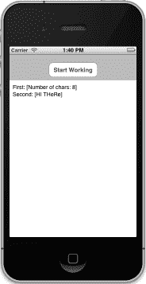
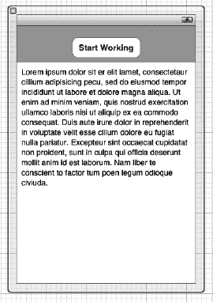
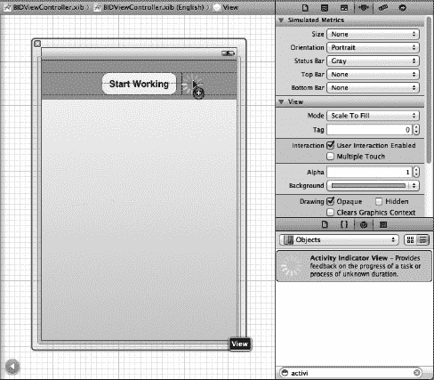
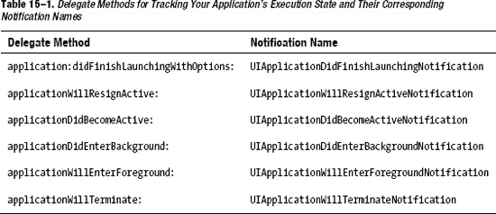
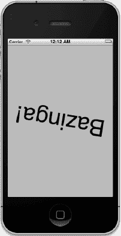
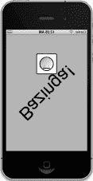

# 第 15 章

## 中央调度、后台处理与你

如果你曾在任何环境下尝试过多线程编程，很可能对那种体验感到畏惧、恐惧甚至更糟。幸运的是，技术不断进步，苹果最近提出了一种使多线程编程更简单的新方法。这种方法被称为**中央调度**，本章将带你入门。我们还将深入探讨 iOS 的多任务处理能力，展示如何调整应用以在这个新环境中良好运作，并利用新特性让应用比以往更出色。

### 中央调度

当今开发者面临的最大挑战之一，是编写能够响应用户输入并执行复杂操作，同时保持流畅响应，避免用户因处理器处理后台任务而长时间等待的软件。仔细想想，这个挑战一直存在，尽管计算技术的进步带来了更快的 CPU，问题却依然存在。如果你想要证据，只需看看最近的电脑屏幕。很可能你上次坐在电脑前工作时，工作流程曾被某种旋转的鼠标光标打断。

那么，在系统架构如此进步的情况下，为什么这个问题仍然困扰着我们？部分原因在于软件的典型编写方式：即按顺序执行一系列事件。这种软件可以随 CPU 速度提升而扩展，但仅限于一定程度。一旦程序陷入等待外部资源（如文件或网络连接）的状态，整个事件序列就会暂停。所有现代操作系统都允许在程序中使用多线程执行，这样即使某个线程因等待特定事件而阻塞，其他线程仍能继续运行。即便如此，许多开发者仍将多线程编程视为某种黑魔法而避之不及。

幸运的是，对于那些希望将代码拆分为并发块，而又不想过多接触系统线程层的开发者来说，苹果带来了好消息。这个好消息就是中央调度（GCD）。它提供了一套全新的 API，用于将应用需要执行的工作拆分为更小的块，这些块可以分布在多个线程上，并在合适的硬件上跨多个 CPU 运行。

这套新 API 的许多功能都通过**块**来访问，这是苹果的另一项创新，为 C 和 Objective-C 增添了类似匿名内联函数的功能。块与 Ruby 和 Lisp 等语言的类似特性有很多共同之处，它们可以提供有趣的新方式来组织不同对象之间的交互，同时将相关代码更紧密地保留在方法中。


### 认识 SlowWorker

为了展示 GCD 的工作原理，我们将创建一个名为 `SlowWorker` 的应用程序，它由一个简单的界面构成，包含一个按钮和一个文本视图。点击按钮，会立即启动一个同步任务，导致应用锁定大约十秒钟。任务完成后，文本视图中会显示一些文本（参见图 15–1）。



**图 15–1.** *SlowWorker 应用将其界面隐藏在一个按钮之下。点击按钮后，在应用执行其工作期间，界面会挂起大约十秒钟。*

首先，像之前多次操作的那样，使用*单视图应用*模板在 Xcode 中创建一个新应用。将其命名为 `SlowWorker`，将*设备系列*设置为 *iPhone*，并关闭*使用故事板*选项。对 `BIDViewController.h` 文件进行如下添加：

```
#import <UIKit/UIKit.h>

@interface BIDViewController : UIViewController

@property (strong, nonatomic) IBOutlet UIButton *startButton;
@property (strong, nonatomic) IBOutlet UITextView *resultsTextView;

- (IBAction)doWork:(id)sender;

@end
```

这段代码简单地定义了两个关联到图形界面中两个可见对象的输出口，以及一个由按钮触发的操作方法。

现在，在 `BIDViewController.m` 文件的顶部输入以下代码：

```
#import "BIDViewController.h"

@implementation BIDViewController

@synthesize startButton, resultsTextView;

- (NSString *)fetchSomethingFromServer {
    [NSThread sleepForTimeInterval:1];
    return @"Hi there";
}

- (NSString *)processData:(NSString *)data {
    [NSThread sleepForTimeInterval:2];
    return [data uppercaseString];
}

- (NSString *)calculateFirstResult:(NSString *)data {
    [NSThread sleepForTimeInterval:3];
    return [NSString stringWithFormat:@"Number of chars: %d",
            [data length]];
}

- (NSString *)calculateSecondResult:(NSString *)data {
    [NSThread sleepForTimeInterval:4];
    return [data stringByReplacingOccurrencesOfString:@"E"
                                           withString:@"e"];
}

- (IBAction)doWork:(id)sender {
    NSDate *startTime = [NSDate date];
    NSString *fetchedData = [self fetchSomethingFromServer];
    NSString *processedData = [self processData:fetchedData];
    NSString *firstResult = [self calculateFirstResult:processedData];
    NSString *secondResult = [self calculateSecondResult:processedData];
    NSString *resultsSummary = [NSString stringWithFormat:
                                @"First: [%@]\nSecond: [%@]", firstResult,
                                secondResult];
    resultsTextView.text = resultsSummary;
    NSDate *endTime = [NSDate date];
    NSLog(@"Completed in %f seconds",
          [endTime timeIntervalSinceDate:startTime]);
}

.
.
.
```

接下来，在 `viewDidUnload` 方法中添加常用的清理代码：

```
- (void)viewDidUnload {
    [self viewDidUnload];
    // Release any retained subviews of the main view.
    // e.g. self.myOutlet = nil;
    self.startButton = nil;
    self.resultsTextView = nil;
}
```

如你所见，这个类的工作（尽管简单）被分割成了若干小部分。这段代码只是为了模拟一些耗时的活动，这些方法本身实际上并不占用多少时间。为了增加效果，每个方法中都包含了对 `NSThread` 的 `sleepForTimeInterval:` 类方法的调用，这会使程序（具体来说是调用该方法的线程）暂停并在指定秒数内完全不做任何事。`doWork:` 方法在开始和结束处也包含了计算所有工作所花费时间的代码。

现在，打开 `BIDViewController.xib`，将一个*圆角矩形按钮*和一个*文本视图*拖拽到空的*视图*窗口中，布局方式如图 15–2 所示。按住 Control 键从*文件所有者*拖拽，将视图控制器的两个输出口分别连接到按钮和文本视图。

接着，选中按钮，进入连接检查器，将按钮的*触摸内部*事件连接到*文件所有者*，选择视图控制器的 `doWork:` 方法。最后，选中文本视图，使用属性检查器取消勾选*可编辑*复选框（位于右上角），并删除文本视图中的默认文本。



**图 15–2.** *SlowWorker 的界面包含一个圆角矩形按钮和一个文本视图。请务必取消勾选文本视图的“可编辑”复选框，并删除其所有文本。*

保存你的工作。然后选择*运行*。你的应用应该会启动，按下按钮后，它会运行大约十秒钟（所有睡眠时间的总和），然后显示结果。在等待期间，你会看到*开始工作！*按钮始终保持深蓝色，直到“工作”完成后才会恢复为正常颜色。此外，在工作完成之前，应用的视图是无响应的。在屏幕上任意点击都没有效果。实际上，在此期间你能与应用交互的唯一方式就是点击主页按钮切换到其他应用。这正是我们要避免的情况！

在这个特定案例中，等待时间还算可以接受，因为应用似乎只挂起了几秒钟，但如果你的应用经常这样长时间无响应，使用体验就会令人沮丧。在最糟糕的情况下，如果应用无响应时间过长，操作系统甚至可能将其杀死。无论如何，你最终都会惹恼一些用户——甚至失去一些用户！


### 线程基础

在开始实现解决方案之前，我们先回顾一下并发涉及的一些基础知识。这远非对 iOS 线程或线程概念的完整描述，我们只想提供足够的解释，让你理解本章将要进行的工作。

大多数现代操作系统（当然包括 iOS）都支持**执行线程**的概念。每个进程可以包含多个线程，它们并发运行。如果只有一个处理器核心，操作系统会在所有执行线程之间切换，就像它在所有执行进程之间切换一样。如果有多个核心可用，线程就会像进程一样被分配到各个核心上。

一个进程中的所有线程共享相同的可执行程序代码和相同的全局数据。每个线程还可以拥有一些专属于该线程的数据。线程可以使用一种称为 `mutex`（互斥锁的缩写）或锁的特殊结构，它可以确保某段特定代码不会被多个线程同时运行。当多个线程同时访问同一数据时，通过在一个线程更新值（在你的代码中称为**临界区**）时锁定其他线程，这对确保正确的结果很有用。

处理线程时的一个常见问题是代码的**线程安全**性。有些软件库在编写时考虑了线程并发性，并用互斥锁妥善保护了其所有临界区。有些代码库则不是线程安全的。

例如，在 Cocoa Touch 中，Foundation 框架（包含适用于各类 Objective-C 编程的基本类，如 `NSString`、`NSArray` 等）通常被认为是线程安全的。然而，UIKit 框架（包含专用于构建 GUI 应用程序的类，如 `UIApplication`、`UIView` 及其所有子类等）在很大程度上不是线程安全的。这意味着在运行的 iOS 应用程序中，所有涉及 UIKit 对象的方法调用都应该在同一线程内执行，该线程通常被称为**主线程**。如果你从另一个线程访问 UIKit 对象，后果难料！你很可能会遇到看似无法解释的 Bug（或者更糟的是，你不会遇到任何问题，但你的部分用户在应用发布后会受到影响）。

默认情况下，主线程是 iOS 应用所有活动（例如处理由用户事件触发的操作）发生的地方，因此对于简单的应用程序，你无需担心这一点。由用户触发的操作方法已经在主线程中运行。到目前为止，本书中的代码一直只在主线程上运行，但这种状况即将改变。

**提示：** 关于线程安全已有大量论述，深入研究并尽可能多地消化这些知识是非常值得的。Apple 自己的文档是一个很好的起点。花几分钟时间阅读这个页面（肯定会有所帮助）：

`http://developer.apple.com/library/ios/#documentation/Cocoa/Conceptual/Multithreading/ThreadSafetySummary/ThreadSafetySummary.html`

### 工作单元

前面描述的线程模型的问题在于，对于普通程序员来说，编写无误的多线程代码几乎是不可能的。这并不是对我们行业或普通程序员能力的批评；这仅仅是一种观察。在跨多个线程同步数据和操作时，你必须在代码中考虑到的复杂交互，对大多数人来说确实太过艰巨。想象一下，只有 5% 的人有能力编写软件。而在这 5% 中，只有一小部分人真正有能力编写重量级的多线程应用程序。即使是成功做到这一点的人，也常常会建议他人不要效仿他们的做法！

幸运的是，并非没有希望。无需进行太多底层的线程操作，也可以实现一定程度的并发。就像我们可以不直接向视频 RAM 写入比特位来在屏幕上显示数据，不直接与磁盘控制器交互就能从磁盘读取数据一样，也存在一些软件抽象，让我们可以在多个线程上运行代码，而无需直接处理线程。

Apple 鼓励我们使用的解决方案核心在于：将长时间运行的任务拆分为工作单元，并将这些单元放入队列中执行。系统为我们管理队列，在多个线程上执行工作单元。我们不需要直接启动和管理后台线程，并且从通常实现并发应用程序所需的大量维护工作中解放出来；系统会为我们处理这些。

### GCD：底层队列

将工作单元放入可以在后台执行的队列中，由系统为你管理线程，这个想法非常强大，并且极大地简化了许多需要并发的开发场景。在 Mac OS X 10.6 版本中，GCD 首次亮相，提供了实现这一功能的基础设施。随着 iOS 4.0 的发布，这项技术也出现在了 iOS 平台上。这项技术不仅适用于 Objective-C，也适用于 C 和 C++。

GCD 将一些伟大的概念——工作单元、轻松的后台处理、以及自动线程管理——融入到一个 C 接口中，该接口可用于所有基于 C 的语言。最锦上添花的是，Apple 已经将其 GCD 实现开源，因此它也可以移植到其他类 Unix 操作系统上。

GCD 的关键概念之一是队列。系统提供了许多预定义的队列，包括一个保证始终在主线程上执行其工作的队列。这对于非线程安全的 UIKit 来说非常完美！你也可以创建自己的队列——数量不限。GCD 队列严格遵循先进先出（FIFO）原则。添加到 GCD 队列的工作单元将始终按照它们被放入队列的顺序启动。话虽如此，它们可能并不总是以相同的顺序完成，因为 GCD 队列会在可能的情况下自动将工作分布到多个线程中。

每个队列都可以访问一个线程池，该线程池在应用程序的整个生命周期中被重复使用。GCD 会尝试维护一个适合机器架构的线程池，当有工作要做时，它会自动利用更多处理器核心来发挥更强大机器的性能。直到最近，iOS 设备都是单核的，所以这不是什么大问题。但现在，从 iPad 2 和 iPhone 4S 开始，Apple 目前的一批 iOS 设备都配备了双核处理器，GCD 正变得越来越实用。


### 认识 Block

与 GCD 一同推出的，是 Apple 在 C 语言（并扩展至 Objective-C 和 C++）中增加的一点新语法，用以实现一种名为 **block** 的语言特性（在其他语言中也被称为**闭包**或**lambda**）。对于充分发挥 GCD 的威力而言，block 至关重要。block 背后的理念是：让特定的代码块能够像其他 C 语言类型一样被对待。block 可以赋值给变量，作为参数传递给函数或方法，并且（与大多数其他类型不同）还能被执行。如此一来，block 可以作为 Objective-C 中委托模式或 C 语言中回调函数的一种替代方案。

与函数或方法类似，block 可以接受一个或多个参数，并指定一个返回值。要声明一个 block 变量，需要使用脱字符（`^`）以及一些额外的括号位来声明参数和返回类型。而要定义 block 本身，做法大致相同，但需在其后跟上用花括号包裹的、定义 block 实际代码的内容。

```
// 声明一个名为 "loggerBlock" 的 block 变量，无参数，无返回值。
void (^loggerBlock)(void);

// 为上面声明的变量赋值。像这样无参数且无返回值的 block，无需像前面的变量声明那样使用 void 这类“装饰”。
loggerBlock = ^{ NSLog(@"我很高兴他们没叫它 lambda"); };

// 执行 block，就像调用函数一样。
loggerBlock();  // 这会在控制台输出一些内容
```

如果你做过不少 C 语言编程，可能会发现这与 C 语言中函数指针的概念类似。然而，两者存在一些关键区别。也许最大的区别——也是你第一次看到时最令人印象深刻的——在于 block 可以在代码中内联定义。你可以在 block 即将被传递给另一个方法或函数的地方直接定义它。另一个重要区别是，block 可以访问其创建时所在作用域内的变量。默认情况下，block 会对你以这种方式访问的任何变量进行拷贝，保持原变量不变，但你可以在变量声明前添加存储限定符 `__block`，使其变为“可读写”的外部变量。请注意 `block` 前有两个下划线，而非一个。

```
// 定义一个可由 block 修改的变量
__block int a = 0;

// 定义一个试图修改其作用域内变量的 block
void (^sillyBlock)(void) = ^{ a = 47; };

// 在调用 block 前检查变量的值
NSLog(@"a == %d", a); // 输出 "a == 0"

// 执行 block
sillyBlock();

// 在调用 block 后再次检查变量的值
NSLog(@"a == %d", a); // 输出 "a == 47"
```

正如我们提到的，block 在与 GCD 配合使用时才真正大放异彩。GCD 让你能够一步完成获取 block 并将其添加到队列的操作。当你将即时定义的 block（而非存储在变量中的 block）用于此操作时，还有一个额外的好处：你可以直接在代码的上下文环境中看到相关逻辑。

### 改进 SlowWorker

为了了解 block 如何工作，让我们重新审视 SlowWorker 的 `doWork:` 方法。它目前看起来是这样的：

```
- (IBAction)doWork:(id)sender {
    NSDate *startTime = [NSDate date];
    NSString *fetchedData = [self fetchSomethingFromServer];
    NSString *processedData = [self processData:fetchedData];
    NSString *firstResult = [self calculateFirstResult:processedData];
    NSString *secondResult = [self calculateSecondResult:processedData];
    NSString *resultsSummary = [NSString stringWithFormat:
                                @"First: [%@]\nSecond: [%@]", firstResult,
                                secondResult];
    resultsTextView.text = resultsSummary;
    NSDate *endTime = [NSDate date];
    NSLog(@"Completed in %f seconds",
          [endTime timeIntervalSinceDate:startTime]);
}
```

我们可以将这段方法中的所有代码包装进一个 block，并将其传递给名为 `dispatch_async` 的 GCD 函数，从而使整个方法在后台运行。此函数接受两个参数：一个 GCD 队列和一个要分配给该队列的 block。对你的 `doWork:` 副本进行这两处修改。请确保在方法的末尾添加右花括号和右括号。

```
- (IBAction)doWork:(id)sender {
    NSDate *startTime = [NSDate date];
    dispatch_async(dispatch_get_global_queue(0, 0), ^{
        NSString *fetchedData = [self fetchSomethingFromServer];
        NSString *processedData = [self processData:fetchedData];
        NSString *firstResult = [self calculateFirstResult:processedData];
        NSString *secondResult = [self calculateSecondResult:processedData];
        NSString *resultsSummary = [NSString stringWithFormat:
                                    @"First: [%@]\nSecond: [%@]", firstResult,
                                    secondResult];
        resultsTextView.text = resultsSummary;
        NSDate *endTime = [NSDate date];
        NSLog(@"Completed in %f seconds",
              [endTime timeIntervalSinceDate:startTime]);
    });

}
```

第一行使用 `dispatch_get_global_queue()` 函数获取一个始终可用的、预先存在的全局队列。该函数接受两个参数：第一个参数允许你指定优先级，第二个参数目前未使用且应始终为 `0`。如果你在第一个参数中指定了不同的优先级，例如 `DISPATCH_QUEUE_PRIORITY_HIGH` 或 `DISPATCH_QUEUE_PRIORITY_LOW`（传递 `0` 等同于传递 `DISPATCH_QUEUE_PRIORITY_DEFAULT`），实际上会得到一个不同的全局队列，系统会对其赋予不同的优先级。目前，我们坚持使用默认的全局队列。

然后，该队列与紧随其后的代码 block 一起被传递给 `dispatch_async()` 函数。GCD 接收整个 block 并将其传递给一个后台线程，在那里它将一步一步地执行，就像在主线程中运行时一样。

请注意，我们在 block 创建之前定义了一个名为 `startTime` 的变量，然后在 block 的末尾使用了它的值。直觉上，这似乎说不通，因为当 block 被执行时，`doWork:` 方法早已退出，因此 `startTime` 变量所指向的 `NSDate` 实例应该已经被释放了！这是 block 使用中的一个关键点：如果 block 在执行期间访问了任何“外部”的变量，那么在 block 创建时就会进行一些特殊设置，允许 block 访问这些变量。这些变量所包含的值要么被复制（如果它们是像 `int` 或 `float` 这样的纯 C 类型），要么被保留（如果它们是指向对象的指针），以便这些值可以在 block 内部使用。当 `dispatch_async` 在 `doWork:` 的第二行被调用，并且代码中显示的 block 被创建时，`startTime` 实际上收到了一个 `retain` 消息，其返回值被赋值给 block 内部一个本质上与外部同名的新的静态变量（`startTime`）。

`startTime` 变量在 block 内部需要是静态的，这样 block 内部的代码就不会意外地弄乱在 block 外部定义的变量。如果一直允许这样，只会让每个人都感到困惑。然而，有时候你确实希望让 block 写入一个在外部定义的值，这就是 `__block` 存储限定符（我们在几页前提到过）派上用场的地方。如果使用 `__block` 定义一个变量，那么它就可以被同一个作用域内定义的所有 block 直接访问。这样做的一个有趣的副作用是，被 `__block` 限定的变量在 block 内部使用时不会被复制或保留。


### 别忘了主线程

回到手头的项目，这里存在一个问题：UIKit 的线程安全性。请记住，从后台线程向任何 GUI 对象（包括我们的 `resultsTextView`）发送消息都是不被允许的。幸运的是，GCD 也提供了一种处理方式。在代码块内部，我们可以调用另一个调度函数，将工作传回主线程！做法是再次调用 `dispatch_async()`，这次传入由 `dispatch_get_main_queue()` 函数返回的队列。这会始终为我们提供驻留在主线程上的特殊队列，随时准备执行需要使用主线程的代码块。对你的 `doWork:` 版本再做一处修改：

```
- (IBAction)doWork:(id)sender {
    NSDate *startTime = [NSDate date];
    dispatch_async(dispatch_get_global_queue(0, 0), ^{
        NSString *fetchedData = [self fetchSomethingFromServer];
        NSString *processedData = [self processData:fetchedData];
        NSString *firstResult = [self calculateFirstResult:processedData];
        NSString *secondResult = [self calculateSecondResult:processedData];
        NSString *resultsSummary = [NSString stringWithFormat:
                                    @"First: [%@]\nSecond: [%@]", firstResult,
                                    secondResult];
        dispatch_async(dispatch_get_main_queue(), ^{
            resultsTextView.text = resultsSummary;
        });
        NSDate *endTime = [NSDate date];
        NSLog(@"Completed in %f seconds",
              [endTime timeIntervalSinceDate:startTime]);
    });
}
```

### 提供一些反馈

如果你此时构建并运行应用，你会发现它至少在某种意义上运行得更流畅了。触摸按钮后，它不再卡在高亮状态，这或许会导致你一次又一次地点击。如果你查看 Xcode 的控制台日志，会看到每次点击的结果，但只有最后一次点击的结果会显示在文本视图中。

我们真正想要做的是增强 GUI，使得用户按下按钮后，显示能立即更新，指示某项操作正在进行中，并且在处理过程中按钮被禁用。我们将通过在显示中添加一个 `UIActivityIndicatorView` 来实现这一点。这个类提供了许多应用和网站中常见的那种旋转指示器。首先在 `BIDViewController.h` 中声明它：

```
@interface BIDViewController : UIViewController

@property (strong, nonatomic) IBOutlet UIButton *startButton;
@property (strong, nonatomic) IBOutlet UITextView *resultsTextView;
@property (strong, nonatomic) IBOutlet UIActivityIndicatorView *spinner;

.
.
.
```

然后打开 `BIDViewController.xib`，在库中找到 *Activity Indicator View*，将其拖入我们的视图，放置在按钮旁边（参见图 15–3）。



**图 15–3.** *在 Interface Builder 中将活动指示器视图拖入主视图*

选中活动指示器旋转器，使用属性检查器勾选 *Hide When Stopped* 复选框，这样我们的旋转器只会在我们指示它开始旋转时出现（没人希望在 GUI 中看到一个不动的旋转器）。

接下来，从 *File's Owner* 图标按住 Control 键拖拽到旋转器上，连接 `spinner` 输出口。保存你的更改。

现在，打开 `BIDViewController.m`。在这里，我们首先添加处理输出口的常规代码：

```
@implementation BIDViewController

@synthesize startButton, resultsTextView;
@synthesize spinner;

.
.
.
- (void)viewDidUnload {
    [super viewDidUnload];
    // Release any retained subviews of the main view.
    // e.g. self.myOutlet = nil;
    self.startButton = nil;
    self.resultsTextView = nil;
    self.spinner = nil;

}
```

接下来，我们稍微修改一下 `doWork:` 方法，添加几行代码来管理用户点击时以及工作完成时按钮和旋转器的外观。我们首先将按钮的 `enabled` 属性设置为 `NO`，这可以防止它注册任何点击，但不会提供任何视觉提示。为了让用户看到按钮已被禁用，我们将其 `alpha` 值设置为 `0.5`。你可以将 `alpha` 值理解为透明度设置，其中 0.0 表示完全透明（即不可见），1.0 表示完全不透明。我们将在第 16 章中进一步讨论 alpha 值。

```
- (IBAction)doWork:(id)sender {
    startButton.enabled = NO;
    startButton.alpha = 0.5;
    [spinner startAnimating];
    NSDate *startTime = [NSDate date];
    dispatch_async(dispatch_get_global_queue(0, 0), ^{
        NSString *fetchedData = [self fetchSomethingFromServer];
        NSString *processedData = [self processData:fetchedData];
        NSString *firstResult = [self calculateFirstResult:processedData];
        NSString *secondResult = [self calculateSecondResult:processedData];
        NSString *resultsSummary = [NSString stringWithFormat:
                                    @"First: [%@]\nSecond: [%@]", firstResult,
                                    secondResult];
        dispatch_async(dispatch_get_main_queue(), ^{
            startButton.enabled = YES;
            startButton.alpha = 1.0;
            [spinner stopAnimating];
            resultsTextView.text = resultsSummary;
        });
        NSDate *endTime = [NSDate date];
        NSLog(@"Completed in %f seconds",
              [endTime timeIntervalSinceDate:startTime]);
    });
}
```

构建并运行应用，然后按下按钮。感觉好多了，对吧？尽管所执行的工作需要几秒钟，但用户并未被晾在一边。按钮被禁用，并且外观上也表现出禁用状态。此外，动画旋转器让用户知道应用实际上并未挂起，并且可以预期在某个时刻恢复正常。


### 并发块

到目前为止一切顺利，但还没完全结束！目光敏锐的读者可能会注意到，经过这些操作后，我们仍未真正改变算法（如果这种简单的步骤列表也能被称为算法）的基本顺序执行模式。我们所做的只是将这个方法的一部分移动到后台线程，然后在主线程中完成收尾。Xcode 的控制台输出证明了这一点：这项任务仍然需要十秒钟完成，和最初一样。这里最显而易见的问题是：`calculateFirstResult:` 和 `calculateSecondResult:` 并不需要顺序执行，并行执行它们可以显著提升速度。

幸运的是，GCD 提供了一种通过**调度组**来实现此功能的方法。所有通过 `dispatch_group_async()` 函数在组内异步调度的块，都会被释放并尽可能快地执行，包括在可能的情况下分发到多个线程进行并发执行。我们还可以使用 `dispatch_group_notify()` 来指定一个额外的块，当组内所有块都执行完毕后，该块将被执行。

对您的 `doWork:` 副本进行以下修改。同样，请确保您保留了末尾的花括号和括号。

```
- (IBAction)doWork:(id)sender {
    NSDate *startTime = [NSDate date];
    dispatch_async(dispatch_get_global_queue(0, 0), ^{
        NSString *fetchedData = [self fetchSomethingFromServer];
        NSString *processedData = [self processData:fetchedData];
~~        NSString *firstResult = [self calculateFirstResult:processedData];~~
~~        NSString *secondResult = [self calculateSecondResult:processedData];~~
        __block NSString *firstResult;
        __block NSString *secondResult;
        dispatch_group_t group = dispatch_group_create();
        dispatch_group_async(group, dispatch_get_global_queue(0, 0), ^{
            firstResult = [self calculateFirstResult:processedData];
        });
        dispatch_group_async(group, dispatch_get_global_queue(0, 0), ^{
            secondResult = [self calculateSecondResult:processedData];
        });
        dispatch_group_notify(group, dispatch_get_global_queue(0, 0), ^{
            NSString *resultsSummary = [NSString stringWithFormat:
                                        @"First: [%@]\nSecond: [%@]", firstResult,
                                        secondResult];
            dispatch_async(dispatch_get_main_queue(), ^{
                startButton.enabled = YES;
                startButton.alpha = 1.0;
                [spinner stopAnimating];
                resultsTextView.text = resultsSummary;
            });
            NSDate *endTime = [NSDate date];
            NSLog(@"Completed in %f seconds",
                  [endTime timeIntervalSinceDate:startTime]);
        });

    });
}
```

这里一个复杂之处在于，每个 `calculate` 方法都会返回一个我们想要获取的值，因此我们必须首先使用 `__block` 存储类型修饰符创建这些变量。这确保了在块内部设置的值对后续运行的代码可用。

完成这些修改后，再次构建并运行应用。您会发现您的努力得到了回报。曾经需要十秒钟的操作现在只需七秒钟，这得益于我们同时运行了两个计算任务。

显然，我们这个刻意构造的例子获得了最大效果，因为这两个“计算”实际上除了让它们运行的线程休眠外，什么也不做。在真实应用中，加速效果将取决于执行的工作类型以及可用的资源。CPU 密集型计算的性能仅在有多个 CPU 核心可用时才会通过此技术得到提升。在撰写本文时，只有最新的 iOS 设备——iPhone 4S 和 iPad 2——拥有不止一个 CPU 核心。其他用途，例如同时从多个网络连接获取数据，即使只有一个 CPU 也能看到速度提升。

如您所见，GCD 并非万能药。使用 GCD 并不能自动加速每个应用。但是，通过在应用中那些速度至关重要、或者您发现应用对用户操作的响应感觉滞后的地方，仔细应用这些技术，即使无法提升实际性能，您也能轻松提供更好的用户体验。


### 后台处理

iOS 4 带来的另一项重要新增功能是引入了后台处理。这允许你的应用在后台运行——在某些情况下，甚至在用户按下主屏幕按钮后也能继续运行。

此功能不应与现代桌面操作系统所具备的真正多任务处理相混淆。在真正多任务处理中，你启动的所有程序都会保留在系统 RAM 中，直到你明确退出它们。iOS 设备的 RAM 仍然太小，无法很好地实现这一点。相反，这种后台处理的目的是允许需要特定类型系统功能的应用以受限的方式继续运行。例如，如果你有一个播放网络电台音频流的应用，即使切换到另一个应用，iOS 也会让该应用继续运行。除此之外，当你的应用正在播放音频时，它甚至会在 iOS 系统任务栏（双击主屏幕按钮时出现在底部的栏）中提供标准的暂停和音量控制。

**注意：** 后台处理功能仅在满足特定最低硬件标准的设备上可用。在撰写本文时，这包括 iPhone 3GS 及更高版本、第三代和第四代 iPod touch 以及 iPad。基本上，如果你拥有任何在 2009 年中之前上市的 iPhone 或 iPod touch，那么你的设备就无法进入多任务处理的赛场了。抱歉！

具体来说，如果你正在创建一个播放音频、需要持续获取位置更新或实现互联网协议语音（VoIP）以允许用户通过网络发送和接听电话的应用，你可以在应用的 `Info.plist` 文件中声明这种情况，系统将以特殊方式对待你的应用。这种用法虽然有趣，但可能不是本书大多数读者会涉及的内容，因此我们不会在此深入探讨。

除了在后台运行应用外，iOS 还具备在用户按下主屏幕按钮后将应用置于挂起状态的能力。这种挂起执行状态在概念上类似于将你的 Mac 置于睡眠模式。应用程序的整个工作内存都保存在 RAM 中；只是在挂起期间不执行。因此，切换回此类应用程序的速度非常快。这并不限于特殊应用。事实上，这是你用 iOS 5 SDK 编译的任何应用的默认行为（尽管可以通过 `Info.plist` 文件中的另一个设置禁用此功能）。要查看实际效果，请打开设备上的邮件应用并深入查看一条消息。然后按下主屏幕按钮，打开备忘录应用并选择一条备忘录。现在双击主屏幕按钮并切换回邮件应用。你会发现没有任何明显的延迟；它就像一直在运行一样无缝切入到位。

对于大多数应用而言，这种自动挂起和恢复可能就是你所需要的一切。然而，在某些情况下，你的应用可能需要知道它何时即将被挂起以及何时刚刚被唤醒。系统通过 `UIApplication` 类提供了通知应用其执行状态变化的方法，该类拥有多个专门用于此目的的委托方法和通知。我们将在本章后面向你展示如何使用它们。

当你的应用即将被挂起时，无论它是否是特殊的可后台运行的应用类型，它都可以做一件事：请求额外一点时间在后台运行。其目的是确保你的应用有足够的时间关闭任何打开的文件、网络资源等。稍后我们会给你一个这方面的例子。

#### 应用生命周期

在我们深入探讨如何处理应用执行状态变化的具体细节之前，先来讨论一下各种状态：

*   **未运行**：这是所有应用在刚重启的设备上的状态。在设备开机后任何时刻启动过的应用，只有在特定条件下才会返回此状态：
    *   如果其 `Info.plist` 包含 `UIApplicationExitsOnSuspend` 键（且其值设置为 `YES`）
    *   如果它之前处于挂起状态，且系统需要清理一些内存
    *   如果在运行时崩溃
*   **活跃**：这是应用显示在屏幕上时的正常运行状态。它可以接收用户输入并更新显示。
*   **后台**：在此状态下，应用有一定时间执行一些代码，但无法直接访问屏幕或获取任何用户输入。当用户按下主屏幕按钮时，所有应用都会短暂进入此状态；大多数会很快过渡到挂起状态。想要在后台运行的应用会停留在此状态，直到它们再次变为活跃状态。
*   **挂起**：挂起的应用被冻结。这就是普通应用在后台状态短暂停留后发生的情况。应用在活跃时使用的所有内存都保持原样。如果用户将应用带回活跃状态，它将从中断处继续运行。另一方面，如果系统需要为当前活跃的应用腾出更多内存，任何挂起的应用都可能被终止（并放回未运行状态），其内存被释放供其他用途。
*   **非活跃**：应用仅在两个其他状态之间作为临时休息站进入非活跃状态。应用能够较长时间保持非活跃状态的唯一情况是，用户正在处理系统提示（例如来电或短信显示的那些提示），或者用户已锁定屏幕。此状态基本上是一种待定状态。


#### 状态变更通知

为了管理这些状态之间的变化，`UIApplication` 定义了一系列可由其委托实现的方法。除了委托方法外，`UIApplication` 还定义了一组对应的通知名称（参见表 15-1）。这使得应用委托之外的其他对象也能在应用状态变更时注册通知。



请注意，每个方法都直接对应一种运行状态：活跃、非活跃和后台。每个委托方法（以及每次通知发布）都只在其中一种状态下发生。最重要的状态转换发生在活跃状态与其他状态之间。有些转换，例如从后台到挂起，则是在没有任何通知的情况下发生的。让我们逐一了解这些方法，并讨论它们应有的用途。

第一个方法是 `application:didFinishLaunchingWithOptions:`，你在本书中已经见过多次。它是在应用启动后直接执行应用级编码的主要方式。

接下来的两个方法 `applicationWillResignActive:` 和 `applicationDidBecomeActive:` 都会在多种情况下被调用。如果用户按下主屏幕按钮，`applicationWillResignActive:` 会被调用。如果用户稍后将应用带回前台，`applicationDidBecomeActive:` 会被调用。如果用户接到电话，也会发生同样的事件序列。更关键的是，`applicationDidBecomeActive:` 在应用首次启动时也会被调用！总的来说，这两个方法界定了应用从活跃状态到非活跃状态的移动。它们是启用和禁用动画、应用内音频或其他与应用向用户展示内容相关项目的好时机。由于 `applicationDidBecomeActive:` 会在多种情况下被使用，你可能希望将部分应用初始化代码放在这里，而不是放在 `application:didFinishLaunchingWithOptions:` 中。请注意，在 `applicationWillResignActive:` 中，你不应假设应用即将被发送到后台，因为它可能只是一个临时变化，最终会回到活跃状态。

在这些方法之后是 `applicationDidEnterBackground:` 和 `applicationWillEnterForeground:`，它们的用途略有不同：处理明确要被发送到后台的应用。

`applicationDidEnterBackground:` 是你的应用释放所有后续可重新创建的资源、保存所有用户数据、关闭网络连接等的地方。这也是你可以请求更多时间在后台运行的地方（稍后我们会演示）。如果你在 `applicationDidEnterBackground:` 中花费了过多时间（超过大约五秒），系统会判定你的应用行为异常并终止它。你应该实现 `applicationWillEnterForeground:` 来重新创建在 `applicationDidEnterBackground:` 中销毁的一切，例如重新加载用户数据、重新建立网络连接等。请注意，当 `applicationDidEnterBackground:` 被调用时，你可以安全地假设 `applicationWillResignActive:` 也刚刚被调用过。同样，当 `applicationWillEnterForeground:` 被调用时，你可以假设 `applicationDidBecomeActive:` 很快也会被调用。

列表中的最后一个是 `applicationWillTerminate:`，你可能很少会用到它（如果曾用过的话）。在 iOS 4 之前，这是用于保存用户数据等操作的方法，但现在既然有了 `applicationDidEnterBackground:`，我们就不需要这个旧方法了。它仅在应用已处于后台，而系统因某种原因决定跳过挂起、直接终止应用时才会被调用。

现在，你应该对应用状态转换有了基本的理论理解。让我们用一个简单的应用来检验这些知识：这个应用在每个方法被调用时，只会向 Xcode 的控制台日志写入一条消息。然后，我们会像用户一样，以多种方式操作运行中的应用，观察会发生哪些状态转换。

#### 创建状态实验室

在 Xcode 中，基于“单视图应用”模板创建一个新项目，并将其命名为“State Lab”。这个应用不会显示任何内容，只会显示默认的灰色屏幕。它产生的所有输出最终都会出现在 Xcode 控制台中。`BIDAppDelegate.m` 文件中已经包含了我们感兴趣的所有方法。我们只需要添加一些日志记录，如下文粗体所示。请注意，为简洁起见，我们还删除了这些方法中的注释。

```
- (BOOL)application:(UIApplication *)application didFinishLaunchingWithOptions:
    (NSDictionary *)launchOptions
{
    self.window = [[UIWindow alloc] initWithFrame:[[UIScreen mainScreen] bounds]];
    // 应用启动后的自定义覆盖点。
    NSLog(@"%@", NSStringFromSelector(_cmd));

    self.viewController = [[BIDViewController alloc]
        initWithNibName:@"BIDViewController" bundle:nil];
    self.window.rootViewController = self.viewController;
    [self.window makeKeyAndVisible];
    return YES;
}

- (void)applicationWillResignActive:(UIApplication *)application
{
    NSLog(@"%@", NSStringFromSelector(_cmd));

}

- (void)applicationDidEnterBackground:(UIApplication *)application
{
    NSLog(@"%@", NSStringFromSelector(_cmd));

}

- (void)applicationWillEnterForeground:(UIApplication *)application
{
    NSLog(@"%@", NSStringFromSelector(_cmd));

}

- (void)applicationDidBecomeActive:(UIApplication *)application
{
    NSLog(@"%@", NSStringFromSelector(_cmd));

}

- (void)applicationWillTerminate:(UIApplication *)application
{
    NSLog(@"%@", NSStringFromSelector(_cmd));

}
```

你可能对我们在这所有方法中使用的 `NSLog` 调用感到好奇。Objective-C 提供了一个方便的內建变量 `_cmd`，它总是包含当前方法的选择器。选择器（如果你需要复习一下）就是 Objective-C 中引用方法的方式。`NSStringFromSelector` 函数返回给定选择器的 `NSString` 表示形式。我们在此的使用只是提供了一种快捷方式，以便输出当前方法名，而无需重新输入或复制粘贴它。


### 探索执行状态

现在，构建并运行应用。模拟器将会出现并启动我们的应用程序。切换回 Xcode，查看控制台（View  Debug Area  Activate Console），你应该能看到类似如下的内容：

```
2011-10-31 11:56:52.674 State Lab[83116:f803] application:didFinishLaunchingWithOptions:
2011-10-31 11:56:52.677 State Lab[83116:f803] applicationDidBecomeActive:
```

这里，你可以看到应用已成功启动并进入活动状态。现在，回到模拟器并按 Home 键，你会在控制台中看到如下内容：

```
2011-10-31 11:56:55.874 State Lab[83116:f803] applicationWillResignActive:
2011-10-31 11:56:55.875 State Lab[83116:f803] applicationDidEnterBackground:
```

这两行展示了应用在两个状态之间转换的过程：它首先变为不活动状态，然后进入后台状态。这里你看不到的是，应用还会切换到第三个状态：挂起状态。请记住，你不会收到任何关于此状态发生的通知；这完全在你的控制之外。请注意，应用在某种意义上仍然是“存活”的，并且 Xcode 仍然与其连接，尽管它实际上并未获得任何 CPU 时间。通过点击应用图标重新启动来验证这一点，这应该会产生如下输出：

```
2011-10-31 11:57:00.886 State Lab[83116:f803] applicationWillEnterForeground:
2011-10-31 11:57:00.888 State Lab[83116:f803] applicationDidBecomeActive:
```

你又回来了。应用之前处于挂起状态，被唤醒到不活动状态，然后最终再次变为活动状态。那么，当应用真正被终止时会发生什么？再次点击 Home 键，你会看到如下内容：

```
2011-10-31 11:57:03.569 State Lab[83116:f803] applicationWillResignActive:
2011-10-31 11:57:03.570 State Lab[83116:f803] applicationDidEnterBackground:
```

现在双击 Home 键。应用列表会出现。长按 State Lab 图标直到出现小的“杀戮”图标（红色圆圈中的减号）。按下该杀戮图标以终止 State Lab。会发生什么？你可能会惊讶地发现，我们的 `NSLog` 调用没有向控制台打印任何内容。相反，Xcode 本身会打印一行略显隐晦的文本，如 `sharedlibrary apply-load-rules all`，然后留给你一个 `(gdb)` 提示。此时，State Lab 被真正且完全地终止了。

事实证明，当系统将应用从挂起状态移动到未运行状态时，`applicationWillTerminate:` 方法通常不会被调用。当应用处于挂起状态时，无论系统决定丢弃它以回收内存，还是你手动强制退出它，应用都会直接消失，没有机会做任何事情。`applicationWillTerminate:` 方法仅在被终止的应用处于后台状态时才会被调用。例如，如果你的应用正在后台状态下活跃运行，以预定义的方式之一（如音频播放、GPS 使用等）使用系统资源，并且被用户或系统强制退出，就会发生这种情况。在我们刚才用 State Lab 探索的案例中，应用处于挂起状态，而非后台状态，因此它被立即终止，且没有任何通知。

这里还有一个有趣的交互需要检查。那就是当系统显示一个警告对话框，临时接管应用的输入流并将其置入不活动状态时会发生什么。这种状态只能在真实设备上运行，而非模拟器上，通过使用内置的“信息”应用来轻松触发。像许多其他应用一样，“信息”应用可以从外部接收消息，并以多种方式显示它们。

要查看这些是如何设置的，请在设备上运行“设置”应用，从左上角的列表中选择“通知”，然后从右侧的应用列表中选择“信息”应用。在 iOS 5 中显示消息的热门新方式称为横幅。这种方式通过在屏幕顶部叠加显示一个小横幅，不会中断当前正在运行的任何应用。我们想展示的是旧的、糟糕的“提醒”方式，它会在当前应用前面出现一个模态面板，需要用户操作。选择该方式，使“信息”应用变回 iOS 4 及以下版本的用户总是不得不面对的那种具有侵犯性的“讨厌鬼”。

现在回到你的电脑。在 Xcode 中，使用左上角的下拉菜单从模拟器切换到你的设备，然后点击*运行*按钮，在设备上构建并运行应用。现在，你需要做的只是从外部向你的设备发送一条消息。如果你的设备是 iPhone，你可以从另一部手机向它发送一条 SMS 短信。如果它是 iPod touch 或 iPad，你只能使用 Apple 自家的 iMessage 通讯功能，该功能可在所有 iOS 5 设备（包括 iPhone）上使用。找出适合你设置的方法，并让别人通过 SMS 或 iMessage 向你的设备发送一条消息。当你的设备显示系统警告，提示收到新消息时，Xcode 控制台中会出现如下内容：

```
2011-10-31 12:05:15.391 State Lab[1069:307] applicationWillResignActive:
```

请注意，我们的应用并没有被发送到后台。它处于不活动状态，并且仍然可以在系统警告后面被看到。如果这个应用是游戏或有任何视频、音频或动画在运行，这通常是我们希望暂停它们的地方。

按下警告上的“关闭”按钮，你会得到如下内容：

```
2011-10-31 12:05:24.808 State Lab[1069:307] applicationDidBecomeActive:
```

现在让我们看看如果你选择回复消息会发生什么。让别人再给你发一条消息，生成如下内容：

```
2011-10-31 12:11:04.154 State Lab[1069:307] applicationWillResignActive:
```

这次点击“回复”，这将把你切换到“信息”应用，你应该会看到如下一系列活动：

```
2011-10-31 12:11:07.826 State Lab[1069:307] applicationDidBecomeActive:
2011-10-31 12:11:07.966 State Lab[1069:307] applicationWillResignActive:
2011-10-31 12:11:07.984 State Lab[1069:307] applicationDidEnterBackground:
```

有趣！我们的应用很快再次变为活动状态，然后再次变为不活动状态，最后进入后台状态（然后，静默地，进入挂起状态）。

### 利用执行状态变化

那么，我们应该如何理解这一切呢？基于我们刚才的演示，在处理这些状态变化时，似乎有一个清晰的策略可以遵循：

#### 活动  不活动

使用 `applicationWillResignActive:`/`UIApplicationWillResignActiveNotification` 来“暂停”应用的显示。如果你的应用是一个游戏，你可能已经具备了以某种方式暂停游戏的能力。对于其他类型的应用，请确保没有对用户输入有时间要求的关键任务正在进行，因为你的应用将在短时间内无法获得任何用户输入。

#### 不活动  后台

使用 `applicationDidEnterBackground:`/`UIApplicationDidEnterBackgroundNotification` 来释放那些在应用进入后台后不需要保留的资源（例如缓存的图像或其他易于重新加载的数据），或者那些在后台状态下无法存活的资源（例如活跃的网络连接）。在此处减少不必要的内存使用，将使你的应用最终的挂起快照变得更小，从而降低你的应用被完全从 RAM 中清除的风险。你还应该利用这个机会保存任何应用数据，以帮助用户在下次应用重新启动时，从他们离开的地方继续。如果你的应用回到活动状态，这通常无关紧要，但万一它被清除而必须重新启动，用户会感激能从同一个地方开始。

#### 后台  不活动

使用 `applicationWillEnterForeground:`/`UIApplicationWillEnterForeground` 来撤销你在从不活动状态切换到后台状态时所做的任何操作。例如，在这里你可以重新建立持久的网络连接。


### 非活跃状态与活跃状态

使用 `applicationDidBecomeActive:`/`UIApplicationDidBecomeActive` 来撤销你在从活跃切换到非活跃时所做的一切。请注意，如果你的应用是一个游戏，这通常并不意味着直接从暂停状态跳回游戏；你应该让用户自行选择进入游戏。另外请记住，当应用刚刚启动时也会调用此方法和通知，因此你在此处执行的任何操作都必须能在该场景下正常工作。

对于从非活跃到后台的转换，有一个特殊注意事项。它不仅在上面的列表中有最长的描述，而且很可能也是应用中最耗费代码和处理时间的转换，因为你可能希望应用执行大量的记录工作。当此转换正在进行时，系统不会给你无限的时间来保存更改。它只给你大约五秒钟的时间。如果你的应用从委托方法返回（以及处理你已注册的任何通知）所需的时间超过这个时限，那么你的应用将被立即从内存中清除并进入“未运行”状态！如果这看起来不公平，别担心，因为还有缓刑的机会。在处理那个委托方法或通知时，你可以请求系统在后台队列中为你执行一些额外工作，这样就能争取到更多时间。我们将在下一节演示该技术。

#### 处理非活跃状态

你的应用可能遇到的最简单的状态变化是从活跃到非活跃，然后再回到活跃。你可能还记得，当你的 iPhone 在运行你的应用时收到一条短信并向用户显示时，就会发生这种情况。在本节中，我们将让 State Lab 做一些视觉上有趣的事情，以便让你看到如果忽略状态变化会发生什么，然后我们将演示如何修复它。

我们将向显示界面添加一个 `UILabel`，并使用 Core Animation 让它移动，这是 iOS 中一种非常优秀的对象动画方式。

首先在 `BIDViewController.h` 中将 `UILabel` 添加为实例变量和属性：

```
@interface BIDViewController : UIViewController

@property (strong, nonatomic) UILabel *label;

@end
```

然后在 `BIDViewController.m` 中对该属性执行常规的内存管理工作：

```
@implementation BIDViewController
@synthesize label;
.
.
.
- (void)viewDidUnload {
    [super viewDidUnload];
    // 释放主视图的任何保留子视图。
    // 例如：self.myOutlet = nil;
    self.label = nil;
}
```

现在，当视图加载时设置标签。将以下粗体行添加到 `viewDidLoad` 方法中：

```
- (void)viewDidLoad {
    [super viewDidLoad];
    // 加载视图后的任何其他设置，通常来自 nib 文件。

    CGRect bounds = self.view.bounds;
    CGRect labelFrame = CGRectMake(bounds.origin.x, CGRectGetMidY(bounds) - 50,
                                   bounds.size.width, 100);
    self.label = [[UILabel alloc] initWithFrame:labelFrame];
    label.font = [UIFont fontWithName:@"Helvetica" size:70];
    label.text = @"Bazinga!";
    label.textAlignment = UITextAlignmentCenter;
    label.backgroundColor = [UIColor clearColor];
    [self.view addSubview:label];
}
```

是时候设置一些动画了。我们将定义两个方法：一个用于将标签旋转到倒立位置，另一个用于将其旋转回正常位置。让我们在文件顶部的类扩展中声明这些方法，就在类的 `@implementation` 开始之前：

```
@interface BIDViewController ()
- (void)rotateLabelUp;
- (void)rotateLabelDown;
@end
```

然后可以将方法定义本身插入到 `@implementation` 块中的任何位置：

```
- (void)rotateLabelDown {
    [UIView animateWithDuration:0.5
                     animations:^{
                         label.transform = CGAffineTransformMakeRotation(M_PI);
                     }
                     completion:^(BOOL finished){
                         [self rotateLabelUp];
                     }];
}

- (void)rotateLabelUp {
    [UIView animateWithDuration:0.5
                     animations:^{
                         label.transform = CGAffineTransformMakeRotation(0);
                     }
                     completion:^(BOOL finished){
                         [self rotateLabelDown];
                     }];
}
```

这值得稍作解释。`UIView` 定义了一个名为 `animateWithDuration:animations:completion:` 的类方法，用于设置动画。我们在动画块中设置的任何可动画属性都不会立即对接收者产生影响。相反，Core Animation 会将该属性从其当前值平滑过渡到我们指定的新值。这就是所谓的隐式动画，也是 Core Animation 的主要特性之一。最后的完成块让我们可以指定动画完成后将发生什么。

因此，每个方法都将标签的 `transform` 属性设置为特定的旋转角度（以弧度为单位）。每个方法还设置了一个完成块，仅用于调用另一个方法，因此文本将持续来回动画，永不停止。


```markdown

最后，我们需要设置一种启动动画的方式。现在，我们将通过在`viewDidLoad`末尾添加下面这行代码来实现（但我们稍后会更改此操作，原因将在那时说明）：

```
[self rotateLabelDown];
```

现在，构建并运行应用程序。您应该会看到 *Bazinga!* 标签来回旋转（参见 图 15–4）。

要测试活跃非活跃过渡，您确实需要再次在真实的 iPhone 上运行它，并从其他地方向它发送短信。不幸的是，在苹果迄今为止发布的任何版本的 iOS 模拟器中都无法模拟此行为。如果您还没有构建并安装到设备的能力，或者没有 iPhone，您将无法亲自尝试，但请尽量跟上！

在 iPhone 上构建并运行该应用程序，会看到动画正在运行。现在，向设备发送一条短信。当系统弹出消息提示时，您会看到动画仍在继续！这或许有点滑稽，但对用户来说可能很烦人。当这种情况发生时，我们将使用过渡通知来停止动画。



**图 15–4.** *State Lab 应用程序正在执行其标签旋转魔法*

我们的控制器类需要有一些内部状态来跟踪它在任何时候是否应该动画。为此，我们在`BIDViewController.m`中添加一个实例变量。因为这个简单的`BOOL`不需要被任何外部类访问，所以我们跳过头文件，直接将其添加到我们之前创建的类扩展中。

```
@interface BIDViewController ()
@property (assign, nonatomic) BOOL animate;

- (void)rotateLabelUp;
- (void)rotateLabelDown;
@end

@implementation BIDViewController
@synthesize label;
@synthesize animate;
```

由于我们的类不是应用程序委托，我们不能仅仅实现委托方法并期望它们工作。相反，当执行状态改变时，我们注册以接收来自应用程序的通知。通过在`BIDViewController.m`的`viewDidLoad`方法顶部添加几行代码来实现这一点：

```
- (void)viewDidLoad {
    [super viewDidLoad];
    // Do any additional setup after loading the view, typically from a nib.

    [[NSNotificationCenter defaultCenter] addObserver:self
                                          selector:@selector(applicationWillResignActive)
                                              name:UIApplicationWillResignActiveNotification
                                            object:[UIApplication sharedApplication]];
    [[NSNotificationCenter defaultCenter] addObserver:self
                                          selector:@selector(applicationDidBecomeActive)
                                              name:UIApplicationDidBecomeActiveNotification
                                            object:[UIApplication sharedApplication]];

    CGRect bounds = self.view.bounds;
.
.
.
```

这样设置后，这两个通知会在适当的时候分别调用我们类中的一个方法。在`@implementation`块内的任意位置定义这些方法：

```
- (void)applicationWillResignActive {
    NSLog(@"VC: %@", NSStringFromSelector(_cmd));
    animate = NO;
}

- (void)applicationDidBecomeActive {
    NSLog(@"VC: %@", NSStringFromSelector(_cmd));
    animate = YES;
    [self rotateLabelDown];
}
```

在这里，我们像之前一样包含了相同的方法日志记录，以便您可以在 Xcode 控制台中看到这些方法的出现位置。我们添加了前缀`"VC: "`来将其与委托中的`NSLog()`调用区分开（`VC`代表视图控制器）。这些方法中的第一个只是关闭了`animate`标志。第二个重新打开了该标志，然后实际重新启动动画。为了让第一个方法产生效果，我们需要添加一些代码来检查`animate`标志，并且仅当它启用时才继续动画。

```
- (void)rotateLabelUp {
    [UIView animateWithDuration:0.5
                     animations:^{
                         label.transform = CGAffineTransformMakeRotation(0);
                     }
                     completion:^(BOOL finished){
                         if (animate) {

                             [self rotateLabelDown];
                         }

                     }];
}
```

我们将此添加到了`rotateLabelUp`的完成块中，并且仅在那里添加，这样只有当文本是正面朝上时，我们的动画才会停止。

现在，重新构建并运行应用程序，看看会发生什么。您很可能会看到一些闪烁的混乱现象，标签快速上下翻转，甚至没有旋转！原因很简单，但可能不太明显（尽管我们之前确实暗示过）。

还记得我们在`viewDidLoad`末尾通过调用`rotateLabelDown`启动了动画吗？嗯，我们现在也在`applicationDidBecomeActive`中调用了`rotateLabelDown`。并且请记住，`applicationDidBecomeActive`不仅会在我们从非活跃切换回活跃时被调用，而且当应用程序首次启动并变为活跃时也会被调用！这意味着我们启动了两次动画，而 Core Animation 似乎无法很好地处理多个动画同时尝试更改相同属性的情况。解决方案很简单，只需删除您之前添加到`viewDidLoad`末尾的那行代码：

~~`[self rotateLabelDown];`~~

现在再次构建并运行应用程序，您应该会看到它正常播放动画。再次向您的 iPhone 发送一条短信。这次当系统提示出现时，您会看到一旦文本正面朝上，背景中的动画就会停止。点击“关闭”按钮，动画重新开始。

现在您已经了解了对于从活跃切换到非活跃再切换回来的简单情况该如何处理。更大的任务——也许也是更重要的一个——是处理切换到后台然后再回到前台。

#### 处理后台状态

正如我们之前提到的，切换到后台状态对于确保最佳用户体验非常重要。在这里，您需要丢弃那些可以轻松重新获取的资源（或者在您的应用程序进入静默状态时无论如何都会丢失的资源），并保存有关您应用程序当前状态的信息，所有这些操作都不能占用主线程超过五秒钟。

为了演示其中一些行为，我们将在几个方面扩展 State Lab。首先，我们将向显示界面添加一个图像，以便稍后向您展示如何处理内存中的图像。然后，我们将向您展示如何保存一些关于应用程序状态的信息，以便稍后轻松恢复。最后，我们将通过将所有这项工作放到后台队列中，向您展示如何确保这些活动不会占用过多的主线程时间。

```


### 进入后台时释放资源

首先，将本书源代码归档中的 `smiley.png` 添加到项目的 *State Lab* 文件夹中。请确保勾选复选框，告诉 Xcode 将该文件复制到项目目录中。

接下来，我们在 `BIDViewController.h` 中为图像和图像视图添加属性：

```
@interface BIDViewController : UIViewController

@property (strong, nonatomic) UILabel *label;
@property (strong, nonatomic) UIImage *smiley;
@property (strong, nonatomic) UIImageView *smileyView;

@end
```

然后，再次切换到 `.m` 文件，并添加常规的内存管理代码：

```
@implementation BIDViewController

@synthesize label;
@synthesize animate;
@synthesize smiley, smileyView;
.
.
.
- (void)viewDidUnload {
    // 释放主视图的任何保留子视图
    // 例如：self.myOutlet = nil;
    self.label = nil;
    self.smiley = nil;
    self.smileyView = nil;
    [super viewDidUnload];
}
```

现在，我们通过修改 `viewDidLoad` 方法来设置图像视图并将其显示在屏幕上，如下所示：

```
- (void)viewDidLoad {
    [super viewDidLoad];
    [[NSNotificationCenter defaultCenter] addObserver:self
                                      selector:@selector(applicationWillResignActive)
                                          name:UIApplicationWillResignActiveNotification
                                        object:[UIApplication sharedApplication]];
    [[NSNotificationCenter defaultCenter] addObserver:self
                                      selector:@selector(applicationDidBecomeActive)
                                          name:UIApplicationDidBecomeActiveNotification
                                        object:[UIApplication sharedApplication]];
    CGRect bounds = self.view.bounds;
    CGRect labelFrame = CGRectMake(bounds.origin.x, CGRectGetMidY(bounds) - 50,
                                   bounds.size.width, 100);
    self.label = [[UILabel alloc] initWithFrame:labelFrame];
    label.font = [UIFont fontWithName:@"Helvetica" size:70];
    label.text = @"Bazinga!";
    label.textAlignment = UITextAlignmentCenter;
    label.backgroundColor = [UIColor clearColor];

    // smiley.png 尺寸为 84 x 84
    CGRect smileyFrame = CGRectMake(CGRectGetMidX(bounds) - 42,
                                    CGRectGetMidY(bounds)/2 - 42,
                                    84, 84);
    self.smileyView = [[UIImageView alloc] initWithFrame:smileyFrame];
    self.smileyView.contentMode = UIViewContentModeCenter;
    NSString *smileyPath = [[NSBundle mainBundle] pathForResource:@"smiley"
                                                           ofType:@"png"];
    self.smiley = [UIImage imageWithContentsOfFile:smileyPath];
    self.smileyView.image = self.smiley;

    [self.view addSubview:smileyView];
    [self.view addSubview:label];
}
```

构建并运行应用，你将看到一个非常开心的笑脸位于屏幕顶部（参见图 15–5）。



**图 15–5.** *State Lab 应用在添加笑脸图标后，展示了其标签旋转的魔力*

接下来，按下 Home 键将应用切换到后台，然后点击其图标再次启动。你会发现应用从离开时的状态继续运行。这对用户来说很好，但我们并没有尽可能优化系统资源。

请记住，当应用处于挂起状态时，我们使用的资源越少，iOS 完全终止应用的风险就越低。通过尽可能清除可以从内存中轻松重新创建的资源，我们增加了应用留在系统中的机会，从而使其能够极快地重新启动。

让我们看看针对这个笑脸我们能做些什么。我们希望在进入后台状态时释放该图像，并在从后台状态返回时重新创建它。为此，我们需要在 `viewDidLoad` 的顶部，即 `[super viewDidLoad]` 之后，再添加两个通知注册：

```
    [[NSNotificationCenter defaultCenter] addObserver:self
                                   selector:@selector(applicationDidEnterBackground)
                                       name:UIApplicationDidEnterBackgroundNotification
                                     object:[UIApplication sharedApplication]];
    [[NSNotificationCenter defaultCenter] addObserver:self
                                   selector:@selector(applicationWillEnterForeground)
                                       name:UIApplicationWillEnterForegroundNotification
                                     object:[UIApplication sharedApplication]];
```

然后，实现这两个新方法：

```
- (void)applicationDidEnterBackground {
    NSLog(@"VC: %@", NSStringFromSelector(_cmd));
    self.smiley = nil;
    self.smileyView.image = nil;
}

- (void)applicationWillEnterForeground {
    NSLog(@"VC: %@", NSStringFromSelector(_cmd));
    NSString *smileyPath = [[NSBundle mainBundle] pathForResource:@"smiley"
                                                           ofType:@"png"];
    self.smiley = [UIImage imageWithContentsOfFile:smileyPath];
    self.smileyView.image = self.smiley;
}
```

构建并运行应用，重复将应用切到后台再切回的步骤。你会发现从用户角度来看，行为几乎没有变化。如果你想自行验证这一过程确实发生，可以注释掉 `applicationWillEnterForeground` 方法中的内容，然后再次构建并运行应用，你会看到图像确实消失了。


### 进入后台时保存状态

看过如何在进入后台状态时释放部分资源的示例后，现在是时候考虑保存状态了。请记住，其核心理念是保存与用户当前操作相关的所有信息，这样当你的应用后续被系统从内存中清除后，用户下次返回时仍能准确接续之前的进度。

这里所说的“状态”完全取决于具体应用场景。你可能需要记录用户正在查看的文档、文本字段中的光标位置、当前打开的应用视图等等。而在我们的示例中，只需要记录分段控件的选中状态。

首先，在 `BIDViewController.h` 中添加一个新的实例变量和属性：

```
@interface BIDViewController : UIViewController

@property (strong, nonatomic) UILabel *label;
@property (strong, nonatomic) UIImage *smiley;
@property (strong, nonatomic) UIImageView *smileyView;
@property (strong, nonatomic) UISegmentedControl *segmentedControl;

@end
```

然后在 `BIDViewController.m` 中实现访问器和内存管理的常规代码：

```
.
.
.
@implementation BIDViewController

@synthesize label;
@synthesize smiley, smileyView;
@synthesize segmentedControl;

.
.
.
- (void)viewDidUnload {
    [super viewDidUnload];
    // 释放主视图的所有保留子视图
    // 例如：self.myOutlet = nil;
    self.label = nil;
    self.smiley = nil;
    self.smileyView = nil;
    self.segmentedControl = nil;
}
```

现在，定位到 `viewDidLoad` 方法的末尾，我们将在这里创建分段控件并添加到视图中：

```
.
.
.
    self.smileyView.image = self.smiley;

    self.segmentedControl = [[UISegmentedControl alloc] initWithItems:
                              [NSArray arrayWithObjects:
                               @"One", @"Two", @"Three", @"Four", nil]] ;
    self.segmentedControl.frame = CGRectMake(bounds.origin.x + 20,
                                             CGRectGetMaxY(bounds) - 50,
                                             bounds.size.width - 40, 30);

[self.view addSubview:segmentedControl];
    [self.view addSubview:smileyView];
    [self.view addSubview:label];
}
```

构建并运行应用。你应该能看到分段控件，并且可以点击其分段逐一选中。

这里需要提及一个轻微的向后兼容性问题，因为 iOS 4 和 iOS 5 之间发生了一些细微但重要的变化。为了看清差异，我们将穿越回到 iOS 4.3 的“黑暗时代”，看看会发生什么。别担心，你无需降级设备，我们直接在 Xcode 和 iOS 模拟器中操作。

### 短暂回溯往昔

在项目导航器中，选择最顶层的项目条目，查看项目详情。这个视图你之前见过，它显示了项目和应用目标的各种设置。在 *TARGETS* 部分选中 *State Lab* 项，并确保详情视图顶部选中了 *Summary* 选项卡。最上方的 *iOS Application Target* 区域包含一个 *Deployment Target* 弹出菜单，当前设置为你的 Xcode 所支持的最新 iOS 版本。点击该菜单并选择 *4.3*。这不仅告诉 Xcode 应基于 iOS 4.3 构建应用，还会让 iOS 模拟器以 iOS 4.3 模式运行。接下来，点击窗口左上角附近的方案/设备弹出菜单，从弹出列表中选择 *iPhone 4.3 Simulator*。现在，你已准备好搭乘时光机了！

如果此时构建并运行应用，你会发现一个明显的问题：分段控件似乎无法正常工作！无论你怎么点击分段，都不会有任何反应。问题实际上出在动画上。默认情况下，我们用于设置动画的 Core Animation 方法在动画运行期间会阻止收集部分用户输入（这可能是出于性能优化考虑）。iOS 4 与 iOS 5 在此处的关键区别在于：iOS 5 会关闭当前正在动画的视图的用户交互，而 iOS 4 则会关闭整个应用的用户交互！

幸运的是，有一种可选方法可以启用用户交互，这要求我们在每个旋转方法中使用更长的方法名。请按如下所示进行修改：

```
- (void)rotateLabelDown {
    [UIView animateWithDuration:0.5
                          delay:0
                        options:UIViewAnimationOptionAllowUserInteraction
                     animations:^{
                         label.transform = CGAffineTransformMakeRotation(M_PI);
                     }
                     completion:^(BOOL finished){
                         [self rotateLabelUp]; }];
}
- (void)rotateLabelUp {
    [UIView animateWithDuration:0.5
                          delay:0
                        options:UIViewAnimationOptionAllowUserInteraction

                     animations:^{
                         label.transform = CGAffineTransformMakeRotation(0);
                     }
                     completion:^(BOOL finished){
                         if (animate) {
                             [self rotateLabelDown];
                         }
                     }];
}
```

再次构建并运行应用，看看效果。是不是感觉好多了？正如我们所说，iOS 4 和 iOS 5 之间的这个差异虽然细微，但如果你的应用使用了 Core Animation 且需要支持 iOS 4，这点就相当重要。尽管你可以删除这段代码（因为我们即将返回到 iOS 5 模拟器），但保留它并让代码也能在 iOS 4 下运行，也并无坏处。


### 回到后台

让我们回到当前状态。从项目窗口左上角的下拉菜单中选择 `iPhone 5.0 Simulator`。现在，轻触四个分段中的任意一个，然后按顺序执行将应用置于后台并重新调回的操作流程。你会发现所选分段（估计是 `Three`）仍处于选中状态——这并不意外。再次点击主屏幕按钮将应用置于后台，调出任务栏（双击主屏幕按钮），杀掉应用，然后重新启动。你会发现一切归零，没有分段被选中。这就是我们接下来需要解决的问题。

**注意：** 在模拟器中杀掉应用时，有可能（取决于你所运行的 Xcode 版本）在重新启动应用后，由于收到了 `SIGKILL` 信号而回到 Xcode 界面。这是完全正常的。如果发生这种情况，请点击项目窗口左上角的停止按钮，然后重新运行你的项目，让其在模拟器中恢复运行。

保存选择状态相当简单。我们只需在 `BIDViewController.m` 的 `applicationDidEnterBackground` 方法末尾添加几行代码：

```
- (void)applicationDidEnterBackground {
    NSLog(@"VC: %@", NSStringFromSelector(_cmd));
    self.smiley = nil;
    self.smileyView.image = nil;

    NSInteger selectedIndex = self.segmentedControl.selectedSegmentIndex;
    [[NSUserDefaults standardUserDefaults] setInteger:selectedIndex
                                               forKey:@"selectedIndex"];

}
```

但我们应该在哪里恢复这个选择索引，并用它来配置分段控件呢？它的逆方法 `applicationWillEnterForeground` 并不是我们想要的。当该方法被调用时，应用已经在运行中，设置状态仍然保持不变。相反，我们需要在新启动后设置相关配置时获取这个值，这就回到了 `viewDidLoad` 方法。在方法末尾添加如下加粗显示的行：

```
    [self.view addSubview:label];

    NSNumber *indexNumber;
    if (indexNumber = [[NSUserDefaults standardUserDefaults]
                       objectForKey:@"selectedIndex"]) {
        NSInteger selectedIndex = [indexNumber intValue];
        self.segmentedControl.selectedSegmentIndex = selectedIndex;
    }

```

这里我们需要加入一个简单的合理性检查，看 `selectedIndex` 键是否存有值，以覆盖首次启动应用等尚未选择任何内容的情况。

现在构建并运行应用，轻触一个分段，然后执行完整的“后台-杀掉-重启”流程。看，你的选择完好如初！

显然，我们这里展示的内容非常基础，但这个概念可以扩展到各种应用状态。为了维持用户“应用始终在运行，只等他们回来”的错觉，如何深入运用这个概念由你决定。

### 请求更多后台时间

之前我们提到，如果进入后台状态耗时过长，应用可能会被从内存中清除。例如，你的应用可能正在进行文件传输，如果没有完成会很可惜，但试图通过劫持 `applicationDidEnterBackground` 方法，在应用真正进入后台前完成所有工作，并不是一个明智的选择。相反，你应该将 `applicationDidEnterBackground` 作为一个平台，告知系统你有一些额外工作要做，然后启动一个代码块来实际执行这些工作。假设系统有足够的可用 RAM 来将你的应用保留在内存中，以便用户进行其他操作，系统会允许你的应用继续运行一段时间。

我们将用一个简单的休眠调用来演示这一点，而不是实际的文件传输。我们会再次使用新学的 GCD 和代码块，使 `applicationDidEnterBackground` 方法的内容在一个独立的队列中运行。

在 `BIDViewController.m` 中，按如下方式修改 `applicationDidEnterBackground` 方法：

```
- (void)applicationDidEnterBackground {
    NSLog(@"VC: %@", NSStringFromSelector(_cmd));
    UIApplication *app = [UIApplication sharedApplication];

    __block UIBackgroundTaskIdentifier taskId;
    taskId = [app beginBackgroundTaskWithExpirationHandler:^{
        NSLog(@"Background task ran out of time and was terminated.");
        [app endBackgroundTask:taskId];
    }];

    if (taskId == UIBackgroundTaskInvalid) {
        NSLog(@"Failed to start background task!");
        return;
    }

    dispatch_async(dispatch_get_global_queue(0, 0), ^{
        NSLog(@"Starting background task with %f seconds remaining",
              app.backgroundTimeRemaining);

        self.smiley = nil;
        self.smileyView.image = nil;

        NSInteger selectedIndex = self.segmentedControl.selectedSegmentIndex;
        [[NSUserDefaults standardUserDefaults] setInteger:selectedIndex
                                                   forKey:@"selectedIndex"];
        // simulate a lengthy (25 seconds) procedure
        [NSThread sleepForTimeInterval:25];

        NSLog(@"Finishing background task with %f seconds remaining",
              app.backgroundTimeRemaining);
        [app endBackgroundTask:taskId];
    });

}
```

让我们逐段分析这段代码。首先，我们获取了共享的 `UIApplication` 实例，因为在此方法中会多次用到它。接着是这部分：

```
    __block UIBackgroundTaskIdentifier taskId;
    taskId = [app beginBackgroundTaskWithExpirationHandler:^{
        NSLog(@"Background task ran out of time and was terminated.");
        [app endBackgroundTask:taskId];
    }];
```

调用 `beginBackgroundTaskWithExpirationHandler:` 会返回一个标识符，我们需要记录下来供后续使用。我们使用 `__block` 存储限定符声明了存储该标识符的 `taskId` 变量，因为我们要确保方法返回的标识符能在此方法中创建的所有代码块之间共享。

通过调用 `beginBackgroundTaskWithExpirationHandler:`，我们基本上是告诉系统我们需要更多时间来完成某些任务，并且承诺在完成后会通知系统。如果系统认为我们的运行时间过长并决定终止运行，作为参数传入的代码块可能会被调用。

请注意，我们传入的代码块以调用 `endBackgroundTask:` 并传入 `taskId` 结束。这告诉系统，我们先前请求额外时间的工作已经完成。平衡好每次对 `beginBackgroundTaskWithExpirationHandler:` 的调用与相应的 `endBackgroundTask:` 调用非常重要，这样系统才能知道我们何时完成了工作。


  
**注意：** 根据你的计算背景，此处使用的*任务*一词可能会让你联想到我们通常所说的*进程*，即一个包含多线程的运行程序。在此请暂时抛开这种联想。本文语境下的*任务*仅仅指“需要完成的事情”。你在此创建的任何任务都运行在你仍在执行的应用中。

接下来，我们执行以下操作：

```
if (taskId == UIBackgroundTaskInvalid) {
    NSLog(@"无法启动后台任务！");
    return;
}
```

如果我们之前对`beginBackgroundTaskWithExpirationHandler:`的调用返回了特殊值`UIBackgroundTaskInvalid`，这意味着系统拒绝授予我们额外的时间。在这种情况下，你可以尝试先完成最紧急的部分，并希望它能在应用被终止前快速完成。这在较老设备上（例如运行 iOS 4 但不支持多任务的 iPhone 3G）更容易出现问题。不过，在这个示例中，我们直接忽略该情况。

接下来是实际执行工作的关键部分：

```
dispatch_async(dispatch_get_global_queue(0, 0), ^{
    NSLog(@"开始后台任务，剩余时间 %f 秒",
          app.backgroundTimeRemaining);
    self.smiley = nil;
    self.smileyView.image = nil;
    
    NSInteger selectedIndex = self.segmentedControl.selectedSegmentIndex;
    [[NSUserDefaults standardUserDefaults] setInteger:selectedIndex
                                               forKey:@"selectedIndex"];
    // 模拟一个耗时（25 秒）的过程
    [NSThread sleepForTimeInterval:25];
    
    NSLog(@"完成后台任务，剩余时间 %f 秒",
          app.backgroundTimeRemaining);
    [app endBackgroundTask:taskId];
});
```

这段代码的作用是将原本方法中执行的工作转移到后台队列中。在该代码块末尾，我们调用`endBackgroundTask:`通知系统任务已完成。

完成上述修改后，构建并运行应用，然后按下主页键将其转入后台。观察 Xcode 控制台以及 Xcode 窗口底部的状态栏。你会发现这次应用会持续运行（状态栏不会显示“调试已终止”消息），25 秒后终端将输出最后的日志。至此，应用完整运行的输出结果如下：

```
2011-10-30 22:35:28.608 State Lab[7449:207] application:didFinishLaunchingWithOptions:
2011-10-30 22:35:28.616 State Lab[7449:207] applicationDidBecomeActive:
2011-10-30 22:35:28.617 State Lab[7449:207] VC: applicationDidBecomeActive
2011-10-30 22:35:31.869 State Lab[7449:207] applicationWillResignActive:
2011-10-30 22:35:31.870 State Lab[7449:207] VC: applicationWillResignActive
2011-10-30 22:35:31.871 State Lab[7449:207] applicationDidEnterBackground:
2011-10-30 22:35:31.873 State Lab[7449:207] VC: applicationDidEnterBackground
2011-10-30 22:35:31.874 State Lab[7449:1903] 开始后台任务，剩余时间 599.995069 秒
2011-10-30 22:35:56.877 State Lab[7449:1903] 完成后台任务，剩余时间 574.993956 秒
```

如你所见，系统在后台运行时提供的时间远多于主线程，因此如果你有持续任务需要处理，遵循此流程将大有帮助。

请注意，我们只请求了一个后台任务标识符，但实际上你可以根据需要请求任意数量。例如，如果后台时有多个网络传输需要完成，你可以为每个传输请求一个标识符，让它们在后台队列中继续运行。这样，你就能在可用时间内轻松实现多个操作并行执行。此外，你收到的任务标识符是一个普通的 C 语言值（非对象），除了存入本地`__block`变量外，如果更适合你的类设计，也可以直接存入实例变量。

### 大中枢调度，收尾

本章内容较为厚重，引入了大量新概念。你不仅学习了 Apple 为 C 语言新增的完整功能集，还掌握了一种无需担心线程即可处理并发的新思维范式。我们还演示了如何确保应用在 iOS 多任务环境中良好运行的技巧。现在，我们已经解决了这些复杂内容，接下来让我们进入下一章，专注于绘图。准备好铅笔，开始绘图！

