# 第 16 章：使用 Quartz 和 OpenGL 绘图

到目前为止，我们构建的所有应用都由 UIKit 框架中的视图和控件构成。UIKit 的标准组件能实现很多功能，大量应用仅用这些对象就能构建完成。然而，有些应用仅靠 UIKit 标准组件无法完全实现其功能。

有时，应用需要具备自定义绘图能力。幸运的是，我们至少有两个独立的库可以用于绘图需求：

- Quartz 2D（Core Graphics 框架的一部分）
- OpenGL ES（跨平台图形库）

OpenGL ES 是另一个名为 OpenGL 的跨平台图形库的精简版本。OpenGL ES 是 OpenGL 的子集，专门为嵌入式系统（因此名称中包含*ES*）设计，例如 iPhone、iPad 和 iPod touch。

在本章中，我们将探索这些强大的图形开发环境。我们将分别构建示例应用，并帮助你理解在何种场景下选择哪种开发环境。


### 图形世界的两种视角

尽管 `Quartz 2D` 和 `OpenGL ES` 在功能上有很多重叠之处，但它们之间也存在显著差异。

`Quartz 2D` 是一组函数、数据类型和对象的集合，旨在让你能够直接在视图或内存中的图像上绘制。`Quartz 2D` 将正在绘制的视图或图像视为一个虚拟画布。它遵循所谓的**画家模型**，简单来说就是绘图命令的应用方式与在画布上涂抹颜料非常相似。

如果一位画家先将整张画布涂成红色，然后再将画布下半部分涂成蓝色，那么画布会变成上半部分红色，下半部分要么是蓝色，要么是紫色（如果颜料不透明则为蓝色；如果颜料半透明则为紫色）。`Quartz 2D` 的虚拟画布运作方式与此相同。如果你将整个视图涂成红色，然后将视图下半部分涂成蓝色，那么视图就会变成上半部分红色，下半部分要么是蓝色，要么是紫色，具体取决于第二次绘图操作是完全不透明还是部分透明。每次绘图操作都会应用在画布上，覆盖之前的所有绘图操作。

另一方面，`OpenGL ES` 是作为一种**状态机**实现的。这个概念相对更难理解，因为它无法像在虚拟画布上绘画那样用一个简单的比喻来解释。`OpenGL ES` 不是让你直接对视图、窗口或图像进行操作，而是维护一个虚拟的三维世界。当你向这个世界添加对象时，`OpenGL ES` 会跟踪所有对象的状态。

与虚拟画布不同，`OpenGL ES` 为你提供了一个进入其世界的虚拟窗口。你将对象添加到这个世界中，并定义你的虚拟窗口相对于该世界的位置。然后，`OpenGL ES` 根据其配置方式以及各个对象之间的相对位置，绘制出你通过该窗口能看到的内容。这个概念有点抽象，但当我们稍后在本章中构建 `OpenGL ES` 绘图应用时，它会变得更加清晰。

`Quartz 2D` 提供了多种线条、形状和图像绘制函数。虽然易于使用，但 `Quartz 2D` 仅限于二维绘图。尽管许多 `Quartz 2D` 函数确实会利用硬件加速进行绘制，但并不能保证你在 `Quartz 2D` 中执行的任何特定操作都会被加速。

`OpenGL ES` 虽然复杂得多，概念上也更难理解，但比 `Quartz 2D` 强大得多。它拥有用于二维和三维绘图的工具，并且专门设计为充分利用硬件加速。`OpenGL ES` 还非常适合编写游戏和其他复杂、图形密集型的程序。

既然你对这两个绘图库有了大致的了解，那就让我们来试试它们吧。我们将从 `Quartz 2D` 的工作原理基础开始，然后使用它构建一个简单的绘图应用程序。接着，我们将使用 `OpenGL ES` 重新创建相同的应用程序。

### Quartz 2D 的绘图方法

使用 `Quartz 2D`（简称 Quartz）时，你通常会将绘图代码添加到执行绘图的视图中。例如，你可以创建一个 `UIView` 的子类，并将 Quartz 函数调用添加到该类的 `drawRect:` 方法中。`drawRect:` 方法是 `UIView` 类定义的一部分，每当视图需要重绘时就会被调用。如果你将 Quartz 代码插入到 `drawRect:` 中，这些代码就会被执行，然后视图就会进行重绘。

#### Quartz 2D 的图形上下文

在 Quartz 中，与 Core Graphics 的其他部分一样，绘图发生在**图形上下文**中，通常简称为**上下文**。每个视图都有一个关联的上下文。你可以获取当前上下文，使用该上下文进行各种 Quartz 绘图调用，然后让上下文负责将你的绘图渲染到视图上。

下面这行代码用于获取当前上下文：

`CGContextRef context = UIGraphicsGetCurrentContext();`

**注意：** 请注意，我们使用的是 Core Graphics 的 C 函数，而不是 Objective-C 对象来进行绘图。Core Graphics 和 OpenGL 都是基于 C 的 API，因此我们在本章这部分编写的大多数代码都将由 C 函数调用组成。

一旦你定义了图形上下文，就可以通过将该上下文传递给各种 Core Graphics 绘图函数来在其中进行绘制。例如，以下序列将在上下文中创建一个由 4 像素宽线条组成的**路径**，然后绘制该线条：

```
CGContextSetLineWidth(context, 4.0);
CGContextSetStrokeColorWithColor(context, [UIColor redColor].CGColor);
CGContextMoveToPoint(context, 10.0f, 10.0f);
CGContextAddLineToPoint(context, 20.0f, 20.0f);
CGContextStrokePath(context);
```

第一次调用指定用于创建当前路径的线条应绘制为 4 像素宽。可以将其想象成选择你将要使用的画笔大小。在你使用不同数值再次调用此函数之前，所有线条绘制时的宽度都将是 4 像素。然后，我们指定描边颜色应为红色。在 Core Graphics 中，绘图操作关联着两种颜色：

- **描边颜色** 用于绘制线条和形状的轮廓。
- **填充颜色** 用于填充形状。

上下文有一个与之关联的隐形“笔”，用于绘制线条。随着绘图命令的执行，这支笔的移动会形成一条路径。当你调用 `CGContextMoveToPoint()` 时，你会将当前路径的端点移动到该位置，但并不实际绘制任何东西。接下来的任何操作都将相对于你移动笔的这一点进行。例如，在前面的示例中，我们首先将笔移动到 (10, 10)。下一个函数调用从当前笔的位置 (10, 10) 到指定位置 (20, 20) 画了一条线，而 (20, 20) 成为了新的笔位置。

在 Core Graphics 中绘图时，你实际上并没有绘制任何可见的东西。你只是在创建一条路径，它可以是一个形状、一条线或其他对象，但它本身不包含颜色或其他使其可见的特征。这就像用隐形墨水书写。在你采取行动使其可见之前，路径是看不见的。因此，下一步是告诉 Quartz 使用 `CGContextStrokePath()` 来绘制这条线。这个函数将使用我们之前设置的线宽和描边颜色来实际为路径着色（或“绘制”），使其可见。


#### 坐标系

在前一段代码中，我们向`CGContextMoveToPoint()`和`CGContextLineToPoint()`传递了一对浮点数作为参数。这些数字代表了 Core Graphics 坐标系中的位置。该坐标系中的位置由其`x`和`y`坐标表示，我们通常表示为`(x, y)`。上下文的左上角为`(0, 0)`。向下移动时，`y`值增加。向右移动时，`x`值增加。

在前面的代码片段中，我们绘制了一条从`(10, 10)`到`(20, 20)`的对角线，效果应如图 16-1 所示。

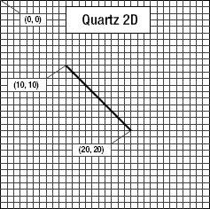

**图 16–1.** *使用 Quartz 2D 坐标系绘制线条*

该坐标系是使用 Quartz 绘图时容易出错的问题之一，因为 Quartz 的坐标系与许多图形库使用的坐标系以及传统的笛卡尔坐标系（由勒内·笛卡尔在 17 世纪提出）相比是翻转的。例如，在 OpenGL ES 中，`(0, 0)`位于左下角，随着`y`坐标的增加，你会向上下文或视图的顶部移动，如图 16-2 所示。在使用 OpenGL 时，必须将位置从视图的坐标系转换到 OpenGL 的坐标系。这很容易实现，本章后面处理 OpenGL ES 时你会看到。

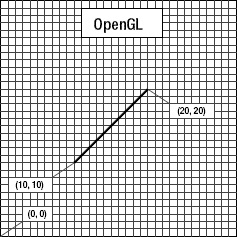

**图 16–2.** *在包括 OpenGL 在内的许多图形库中，从 (10, 10) 绘制到 (20, 20) 会生成像这样的线条，而不是图 16-1 中的线条。*

为了在坐标系中指定一个点，有些 Quartz 函数需要两个浮点数作为参数。其他 Quartz 函数则要求将该点嵌入到`CGPoint`中，这是一个包含两个浮点值`x`和`y`的结构体。为了描述视图或其他对象的大小，Quartz 使用`CGSize`，这是一个也包含两个浮点值`width`和`height`的结构体。Quartz 还声明了一个名为`CGRect`的数据类型，用于定义坐标系中的一个矩形。`CGRect`包含两个元素：一个名为`origin`的`CGPoint`，用于标识矩形的左上角；一个名为`size`的`CGSize`，用于标识矩形的`width`和`height`。

#### 指定颜色

绘图的一个重要部分是颜色，因此理解颜色在 iOS 上的工作方式至关重要。这是 UIKit 确实提供了 Objective-C 类`UIColor`的领域之一。你不能在 Core Graphics 调用中直接使用`UIColor`对象，但由于`UIColor`只是`CGColor`（Core Graphics 函数所需的数据类型）的包装器，你可以通过`UIColor`实例的`CGColor`属性获取`CGColor`引用，正如我们之前在代码片段中展示的那样：

`CGContextSetStrokeColorWithColor(context, [UIColor redColor].CGColor);`

我们使用一个名为`redColor`的便捷方法创建了`UIColor`实例，然后获取其`CGColor`属性并将其传递给该函数。

##### 关于 iOS 设备屏幕的一点色彩理论

在现代计算机图形学中，一种常见的颜色表示方法是使用四个分量：红色、绿色、蓝色和透明度。在 Quartz 中，每个值都表示为`CGFloat`（一个 4 字节浮点值，与`float`相同）。这些值应始终介于 0.0 和 1.0 之间。

**注意：**预期在 0.0 到 1.0 范围内的浮点值通常称为**钳位浮点变量**，或简称为**钳位值**。

红色、绿色和蓝色分量相对容易理解，它们代表**加色三原色**，即**RGB 颜色模型**（见图 16-3）。如果你将等比例的这三种颜色的光加在一起，结果在眼睛看来将是白色或灰色的色调，具体取决于混合光的强度。以不同比例组合这三种加色原色，可以得到一系列不同的颜色，称为**色域**。

在小学时，你可能学过三原色是红、黄、蓝。这些原色被称为**历史减色三原色**或**RYB 颜色模型**，在现代色彩理论中应用很少，几乎从未用于计算机图形学。RYB 颜色模型的色域比 RGB 颜色模型受限得多，并且也不容易进行数学定义。虽然我们很不愿意告诉你三年级那位可爱的美术老师斯梅德利夫人是错的，但在计算机图形学领域，她确实错了。出于我们的目的，三原色是红、绿、蓝，而不是红、黄、蓝。

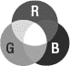

**图 16–3.** *构成 RGB 颜色模型的加色三原色的简单表示*

除了红色、绿色和蓝色，Quartz 和 OpenGL ES 都使用另一个颜色分量，称为**透明度**，它表示颜色的透明程度。当一种颜色绘制在另一种颜色之上时，透明度用于确定最终绘制的颜色。透明度为 1.0 时，绘制的颜色 100%不透明，并遮盖其下方的任何颜色。当值小于 1.0 时，下方的颜色会透出并与上方的颜色混合。当使用透明度分量时，该颜色模型有时称为**RGBA 颜色模型**，尽管从技术上讲，透明度并不真正属于颜色的一部分；它只是定义了颜色在绘制时如何与其他颜色交互。

##### 其他颜色模型

虽然 RGB 模型在计算机图形学中最常用，但它并非唯一的颜色模型。其他几种也在使用中，包括：

*   色调、饱和度、明度（HSV）
*   色调、饱和度、亮度（HSL）
*   青色、品红色、黄色、黑色（CMYK），用于四色胶印
*   灰度

更令人困惑的是，其中一些模型有不同的版本，包括 RGB 色彩空间的几种变体。

幸运的是，对于大多数操作，我们不需要担心正在使用的颜色模型。我们可以直接从`UIColor`对象传递`CGColor`，在大多数情况下，Core Graphics 会处理任何必要的转换。如果在使用 OpenGL ES 时使用`UIColor`或`CGColor`，务必记住它们支持其他颜色模型，因为 OpenGL ES 要求颜色以 RGBA 格式指定。

##### 颜色便捷方法

`UIColor`有大量便捷方法，这些方法返回初始化为特定颜色的`UIColor`对象。在我们之前的代码示例中，我们使用了`redColor`方法将颜色初始化为红色。

幸运的是，大多数这些便捷方法创建的`UIColor`实例都使用 RGBA 颜色模型。唯一的例外是预定义的表示灰度值的`UIColor`——例如`blackColor`、`whiteColor`和`darkGrayColor`——这些仅根据白电平和透明度定义。在我们这里的示例中，我们没有使用这些，因此目前可以假设是 RGBA。

如果你需要对颜色进行更多控制，而不是使用那些基于颜色名称的便捷方法，你可以通过指定所有四个分量来创建颜色。示例如下：

```
return [UIColor colorWithRed:1.0f green:0.0f blue:0.0f alpha:1.0f];
```


#### 在上下文中绘制图像

Quartz 允许你直接将图像绘制到上下文中。这是 Objective-C 类（`UIImage`）的另一个示例，你可以用它替代 Core Graphics 数据结构（`CGImage`）。`UIImage` 类包含将自身图像绘制到当前上下文的方法。你需要使用以下任一技术来确定图像在上下文中的显示位置：

- 指定 `CGPoint` 来确定图像左上角的位置
- 指定 `CGRect` 作为图像的外框，如有必要，图像会调整大小以适合该外框

你可以像这样将 `UIImage` 绘制到当前上下文中：

```
CGPoint drawPoint = CGPointMake(100.0f, 100.0f);
[image drawAtPoint:drawPoint];
```

#### 绘制形状：多边形、线条和曲线

Quartz 提供了许多函数，可以更轻松地创建复杂形状。要绘制矩形或多边形，你无需计算角度、绘制线条或进行任何数学运算。只需调用 Quartz 函数即可为你完成工作。例如，要绘制椭圆，你只需定义椭圆需要适应的矩形，然后让 Core Graphics 来完成工作：

```
CGRect theRect = CGMakeRect(0,0,100,100);
CGContextAddEllipseInRect(context, theRect);
CGContextDrawPath(context, kCGPathFillStroke);
```

绘制矩形时也会使用类似的方法。Quartz 还提供了一些方法，让你可以创建更复杂的形状，例如弧线和贝塞尔路径。

**注意：** 本章示例中不会涉及复杂形状。要了解有关 Quartz 中弧线和贝塞尔路径的更多信息，请查看 iOS 开发中心或 Xcode 在线文档中的 *Quartz 2D 编程指南*，网址为 [`http://developer.apple.com/documentation/GraphicsImaging/Conceptual/drawingwithquartz2d/`](http://developer.apple.com/documentation/GraphicsImaging/Conceptual/drawingwithquartz2d/)。

#### Quartz 2D 工具示例：图案、渐变和虚线样式

虽然不如 OpenGL ES 功能强大，但 Quartz 提供的工具集也相当令人印象深刻。例如，Quartz 支持使用渐变（而不仅仅是纯色）填充多边形，并且除了实线之外，还支持各种虚线样式。看一下 图 16–4 中的截图，它们来自 Apple 的 QuartzDemo 示例代码，了解 Quartz 能为你做些什么。

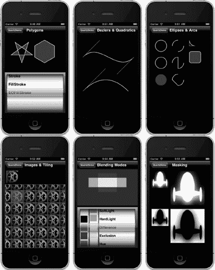

**图 16–4.** *来自 Apple 提供的 QuartzDemo 示例项目，展示了 Quartz 2D 的部分功能*

现在你已经对 Quartz 的工作原理及其能力有了基本了解，让我们动手尝试一下。

### QuartzFun 应用程序

我们的下一个应用程序是一个简单的绘图程序（参见 图 16–5）。我们将构建此应用程序两次：现在使用 Quartz，稍后使用 OpenGL ES。这将让你真正感受到这两种环境之间的差异。

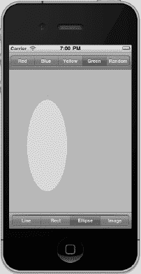

**图 16–5.** *我们本章的简单绘图应用程序运行效果图*

该应用程序的顶部和底部各有一个工具栏，每个工具栏上都有一个分段控件。顶部的控件允许你更改绘图颜色，底部的控件允许你更改要绘制的形状。当你触摸并拖动时，所选的形状将以选定的颜色绘制。为了最大限度地降低应用程序的复杂性，一次只绘制一个形状。

#### 设置 QuartzFun 应用程序

在 Xcode 中，使用 *Single View Application* 模板（使用 ARC 但不使用故事板）创建一个新的 iPhone 项目，并将其命名为 *QuartzFun*。该模板已经为我们提供了一个应用程序委托和一个视图控制器。我们将在自定义视图中执行自定义绘图，因此我们还需要创建 `UIView` 的子类，通过重写 `drawRect:` 方法来绘制内容。

选中 *QuartzFun* 文件夹（当前包含应用程序委托和视图控制器文件的文件夹），按下 **N** 调出新建文件助手，然后从 *Cocoa Touch* 部分选择 *Objective-C class*。将新类命名为 `BIDQuartzFunView`，并将其设置为 `UIView` 的子类。

我们将像之前项目那样定义一些常量，但这次，我们的常量需要被多个类使用。我们将专门为常量创建一个头文件。

再次选中 *QuartzFun* 组，按下 N 调出新建文件助手。从 *C and C++* 标题下选择 *Header File* 模板，并将文件命名为 `BIDConstants.h`。

我们还需要创建两个文件。看一下 图 16–5，你会发现我们提供了选择随机颜色的选项。`UIColor` 没有返回随机颜色的方法，因此我们需要编写代码来实现。我们可以将该代码放入控制器类中，但作为精明的 Objective-C 程序员，我们将它放入 `UIColor` 的分类中。

再次选中 *QuartzFun* 文件夹，按下 **N** 调出新建文件助手。从 *Cocoa Touch* 标题下选择 *Objective-C category*，然后点击 *Next*。当提示时，将分类命名为 `BIDRandom`，并将其设置为 `UIColor` 的 *Category on*。点击 *Next*，并将文件保存到你的项目文件夹中。

你现在应该得到一对新文件：用于分类的 `UIColor+BIDRandom.h` 和 `UIColor+BIDRandom.m`。

##### 创建随机颜色

我们先处理这个分类。将以下代码行添加到 `UIColor+BIDRandom.h` 中：

```
#import <UIKit/UIKit.h>

@interface UIColor (BIDRandom)
+ (UIColor *)randomColor;
@end
```

现在，切换到 `UIColor+BIDRandom.m` 并添加以下代码：

```
#import "UIColor+BIDRandom.h"

@implementation UIColor (BIDRandom)
+ (UIColor *)randomColor {
    static BOOL seeded = NO;
    if (!seeded) {
        seeded = YES;
        srandom(time(NULL));
    }
    CGFloat red = (CGFloat)random() / (CGFloat)RAND_MAX;
    CGFloat blue = (CGFloat)random() / (CGFloat)RAND_MAX;
    CGFloat green = (CGFloat)random() / (CGFloat)RAND_MAX;
    return [UIColor colorWithRed:red green:green blue:blue alpha:1.0f];
}
@end
```

这段代码相当简单。我们声明了一个静态变量，用于判断是否首次进入该方法。在应用程序运行期间，首次调用此方法时，我们会为随机数生成器提供种子。在此处执行此操作意味着我们不需要依赖应用程序在其他地方执行此操作，而且因此，我们可以在其他 iOS 项目中重用此分类。

确保随机数生成器已播种后，我们生成三个介于 0.0 和 1.0 之间的随机 `CGFloat` 值，并使用这三个值创建一个新的颜色。我们将 alpha 设置为 1.0，以确保所有生成的颜色都是不透明的。


### 定义应用程序常量

接下来，我们将为分段控制器中用户可选择的每个选项定义常量。单击`BIDConstants.h`，并添加以下代码：

```
#ifndef QuartzFun_BIDConstants_h
#define QuartzFun_BIDConstants_h

typedef enum {
    kLineShape = 0,
    kRectShape,
    kEllipseShape,
    kImageShape
} ShapeType;

typedef enum {
    kRedColorTab = 0,
    kBlueColorTab,
    kYellowColorTab,
    kGreenColorTab,
    kRandomColorTab
} ColorTabIndex;

#define degreesToRadian(x) (M_PI * (x) / 180.0)

#endif
```

为了使代码更易读，我们使用`typedef`声明了两个枚举类型。一个将表示应用中可用的形状选项；另一个将表示可用的各种颜色选项。这些常量保存的值将对应我们将在应用中创建的两个分段控制器上的分段。

**注意：** 以防你之前没见过这种形式，`#ifndef`编译指令的目的是先测试`QuartzFun_BIDConstants_h`是否已定义，如果没有则定义它。为什么不直接用`#define`呢？通过这种方式，如果某个`.h`文件被直接或通过其他`.h`文件间接包含多次，该指令就不会被重复执行。

### 实现 `QuartzFunView` 骨架

由于我们将在`UIView`的子类中执行绘制操作，让我们先设置好这个类，使其具备除实际绘制代码之外的所有必需部分。绘制代码我们稍后添加。单击`BIDQuartzFunView.h`，并添加以下代码：

```
#import <UIKit/UIKit.h>
#import "BIDConstants.h"

@interface BIDQuartzFunView : UIView
@property (nonatomic) CGPoint firstTouch;
@property (nonatomic) CGPoint lastTouch;
@property (strong, nonatomic) UIColor *currentColor;
@property (nonatomic) ShapeType shapeType;
@property (nonatomic, strong) UIImage *drawImage;
@property (nonatomic) BOOL useRandomColor;
@end
```

首先，我们导入刚刚创建的`BIDConstants.h`头文件，以便使用枚举值。然后声明属性。前两个属性将跟踪用户手指在屏幕上拖动的位置。我们将用户首次触摸屏幕的位置存储在`firstTouch`中。将用户手指拖动期间以及拖动结束时的位置存储在`lastTouch`中。我们的绘制代码将使用这两个变量来确定在何处绘制请求的形状。

接下来，定义颜色以保存用户的颜色选择，以及`ShapeType`以跟踪用户想要绘制的形状。之后是一个`UIImage`属性，当用户选择底部工具栏最右边的工具栏项时（见图 16-6），该属性将保存要绘制在屏幕上的图像。最后一个属性是一个布尔值，用于跟踪用户是否请求随机颜色。

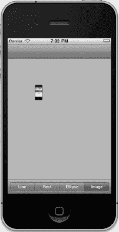

**图 16-6.** *在屏幕上绘制`UIImage`时，注意颜色控件消失了。你能分辨出这个小 iPhone 上运行的是哪个应用吗？*

切换到`BIDQuartzFunView.m`。我们需要对这个文件进行几处修改。首先，我们需要访问本章前面编写的`randomColor`分类方法，该方法位于文件顶部。我们还需要合成属性。因此，在现有的`import`语句下方直接添加以下代码行：

```
#import "UIColor+BIDRandom.h"
```

并在`@implementation`声明之后立即添加以下代码行：

```
@synthesize firstTouch, lastTouch, currentColor, drawImage, useRandomColor, shapeType;
```

模板为我们提供了一个名为`initWithFrame:`的方法，但我们不会使用它。请记住，nib 中的对象实例是作为归档对象存储的，这与我们在第 13 章中用来归档和加载对象到磁盘的机制相同。因此，当从 nib 加载对象实例时，既不会调用`init`也不会调用`initWithFrame:`。而是使用`initWithCoder:`，因此我们需要在此处添加任何初始化代码。在我们的例子中，我们会将初始颜色值设置为红色，将`useRandomColor`初始化为`NO`，并加载我们稍后将在本章中绘制的图像文件。删除现有的`initWithFrame:`存根实现，并替换为以下方法：

```
- (id)initWithCoder:(NSCoder*)coder {
    if (self = [super initWithCoder:coder]) {
        currentColor = [UIColor redColor];
        useRandomColor = NO;
        self.drawImage = [UIImage imageNamed:@"iphone.png"] ;
    }
    return self;
}
```

在`initWithCoder:`之后，我们需要再添加几个方法来响应用户的触摸。在`initWithCoder:`之后插入以下三个方法。

```
#pragma mark - Touch Handling

- (void)touchesBegan:(NSSet *)touches withEvent:(UIEvent *)event {
    if (useRandomColor) {
        self.currentColor = [UIColor randomColor];
    }
    UITouch *touch = [touches anyObject];
    firstTouch = [touch locationInView:self];
    lastTouch = [touch locationInView:self];
    [self setNeedsDisplay];
}
- (void)touchesEnded:(NSSet *)touches withEvent:(UIEvent *)event {
    UITouch *touch = [touches anyObject];
    lastTouch = [touch locationInView:self];

    [self setNeedsDisplay];
}
- (void)touchesMoved:(NSSet *)touches withEvent:(UIEvent *)event {
    UITouch *touch = [touches anyObject];
    lastTouch = [touch locationInView:self];

    [self setNeedsDisplay];
}
```

这三个方法继承自`UIView`（但实际上是在`UIView`的父类`UIResponder`中声明的）。它们可以被重写，以找出用户触摸屏幕的位置。它们的工作方式如下：

*   `touchesBegan:withEvent:`：当用户的手指第一次触摸屏幕时调用。在该方法中，如果用户选择了随机颜色，我们将使用之前添加到`UIColor`中的新`randomColor`方法来更改颜色。之后，我们存储当前触摸位置，以便知道用户首次触摸屏幕的位置，并通过在`self`上调用`setNeedsDisplay`来指示视图需要重绘。
*   `touchesMoved:withEvent:`：当用户在屏幕上拖动手指时被连续调用。我们在这里做的只是将新位置存储到`lastTouch`中，并指示屏幕需要重绘。
*   `touchesEnded:withEvent:`：当用户将手指从屏幕上抬起时调用。与`touchesMoved:withEvent:`方法一样，我们所做的只是将最终位置存储到`lastTouch`变量中，并指示视图需要重绘。

如果你不完全理解这里的其余代码，请不要担心。我们将在第 17 章中详细介绍处理触摸的细节以及`touchesBegan:withEvent:`、`touchesMoved:withEvent:`和`touchesEnded:withEvent:`方法的具体实现。

一旦我们的应用骨架启动并运行，我们再回来处理这个类。目前被注释掉的`drawRect:`方法将完成这个应用的实际工作，我们还没有编写它。在添加绘制代码之前，让我们先完成应用的设置。


#### 创建并连接输出口与操作

在开始绘制之前，我们需要将分段控件添加到 nib 文件中，然后连接操作和输出口。单击 `BIDViewController.xib` 进行编辑。

首要任务是更改视图的类。单击 Dock 中的 `View` 图标，然后按 3 打开标识检查器。将类从 `UIView` 更改为 `BIDQuartzFunView`。

选择重命名后的 `QuartzFunView` 图标，并在库中查找 `Navigation Bar`（导航栏）。请确保你选取的是 `Navigation Bar`，而不是 `Navigation Controller`（导航控制器）。我们需要的是位于视图顶部的导航栏。将导航栏紧贴视图顶部放置，刚好在状态栏下方。

接下来，在库中查找 `Segmented Control`（分段控件），并将其直接拖拽到导航栏上。将其放置在导航栏的中央，而不是左侧或右侧（参见图 16-7）。

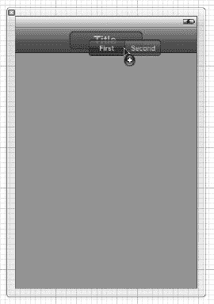

**图 16-7.** *拖拽出一个分段控件，确保将其放置在导航栏顶部*

放下控件后，它应保持选中状态。抓住分段控件任意一侧的调整大小控点，并调整其大小，使其占据导航栏的整个宽度。你不会看到任何蓝色辅助线，但在这种情况下，Interface Builder 不会让你把控件拉得超过所需大小，所以只需拖拽直到它无法再扩展为止。

保持分段控件处于选中状态，打开属性检查器，将分段数量从 `2` 更改为 `5`。依次双击每个分段，将其标签从左到右依次更改为 `Red`（红色）、`Blue`（蓝色）、`Yellow`（黄色）、`Green`（绿色）和 `Random`（随机）。此时，你的视图应如图 16-8 所示。

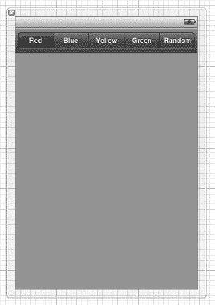

**图 16-8.** *完成后的导航栏*

如果助手编辑器尚未打开，请将其打开，并从跳转栏中选择 `BIDViewController.h`。现在，按住 Control 键从 Dock 中的分段控件拖拽到右侧的 `BIDViewController.h` 文件。当光标位于 `@interface` 和 `@end` 声明之间时，松开鼠标以创建一个新的输出口。将新输出口命名为 `colorControl`，并保持所有其他选项为默认值。确保你是从分段控件拖拽，而不是从导航栏或导航项拖拽。

接下来，我们来添加一个操作。再次按住 Control 键，从同一个分段控件拖拽到头文件，放置在 `@end` 声明的正上方。这次，插入一个名为 `changeColor:` 的操作。弹出窗口应默认使用 `Value Changed`（值已更改）事件，这正是我们需要的。

现在，在库中查找 `Toolbar`（工具栏）（*不是* `Navigation Bar`），拖拽一个到视图窗口的底部，并紧贴底部边缘。库中的工具栏自带一个我们不需要的按钮，因此选中该按钮并按下键盘上的删除键。按钮应消失，取而代之的是一个空白工具栏。

工具栏就位后，再抓取一个 `Segmented Control`，并将其拖到工具栏上（参见图 16-9）。

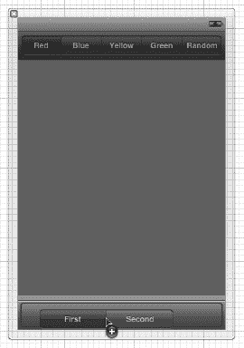

**图 16-9.** *视图显示窗口底部有一个工具栏，工具栏上放置了一个分段控件*

事实证明，分段控件在工具栏中居中比在导航栏中稍难一些，因此我们需要借助一点帮助。从库中拖拽一个 `Flexible Space Bar Button Item`（灵活间距栏按钮项）到工具栏上，放置在我们的分段控件左侧。接着，拖拽第二个 `Flexible Space Bar Button Item` 到工具栏上，放置在分段控件的右侧（参见图 16-10）。当我们调整大小时，这些项将使分段控件保持在工具栏中央。

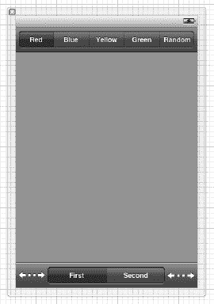

**图 16-10.** *在两侧放置灵活间距栏按钮项后的分段控件。请注意，我们尚未调整分段控件的大小以填满工具栏。*

现在该调整分段控件的大小了。在 Dock 中，选择三个 `Bar Button Item`（栏按钮项）中间的那个，即其子项包含 `Segmented Control` 的那个。编辑区域中分段控件的左侧应出现一个调整大小手柄。拖动该手柄来调整分段控件的大小，使其填满工具栏，左右两边各留一点空白。与导航栏的情况不同，Interface Builder 不会为你提供辅助线，也不会阻止你将分段控件做得比工具栏更宽，因此你需要稍微小心地将分段控件调整到正确大小。

然后，在 Dock 中选择 `Segmented Control`，打开属性检查器，将分段数量从 `2` 更改为 `4`。接着双击每个分段，依次将四个分段的标题更改为 `Line`（线条）、`Rect`（矩形）、`Ellipse`（椭圆）和 `Image`（图像）。

完成上述操作后，确保在 Dock 中选中了 `Segmented Control`，然后按住 Control 键从该分段控件拖拽到 `BIDViewController.h`，以创建另一个操作。将连接类型更改为 `Action`，并将这个新操作命名为 `changeShape:`。

下一步的任务是实现我们的操作方法。


#### 实现动作方法

保存 nib 文件后可以关闭助理编辑器。现在，单击 `BIDViewController.m`。我们首先要做的是导入常量文件，以便能够访问枚举值。此外，我们还需要与自定义视图交互，因此也需要导入它的头文件。在文件顶部，紧挨着现有的 `import` 语句下方，添加以下代码行：

```
#import "BIDConstants.h"
#import "BIDQuartzFunView.h"
```

接下来，找到 Xcode 为你创建的 `changeColor:` 方法的占位实现，并向其中添加以下代码：

```
- (IBAction)changeColor:(id)sender {
    UISegmentedControl *control = sender;
    NSInteger index = [control selectedSegmentIndex];

    BIDQuartzFunView *quartzView = (BIDQuartzFunView *)self.view;

    switch (index) {
        case kRedColorTab:
            quartzView.currentColor = [UIColor redColor];
            quartzView.useRandomColor = NO;
            break;
        case kBlueColorTab:
            quartzView.currentColor = [UIColor blueColor];
            quartzView.useRandomColor = NO;
            break;
        case kYellowColorTab:
            quartzView.currentColor = [UIColor yellowColor];
            quartzView.useRandomColor = NO;
            break;
        case kGreenColorTab:
            quartzView.currentColor = [UIColor greenColor];
            quartzView.useRandomColor = NO;
            break;
        case kRandomColorTab:
            quartzView.useRandomColor = YES;
            break;
        default:
            break;
    }
}
```

这段代码逻辑非常直接。我们只需查看选择了哪个分段，并根据该选择创建一种新颜色作为当前绘图颜色。为了让编译器满意，我们将父类中声明为 `UIView` 实例的 `view` 强制转换为 `QuartzFunView` 类型。之后，我们设置 `currentColor` 属性，以便类知道绘图时使用哪种颜色（除非选择了随机颜色）。当选择随机颜色时，代码会检查 `useRandomColor` 属性，因此我们也要根据每个选择将其设置为适当的值。由于所有绘图代码都将位于视图本身，因此此方法中无需执行其他操作。

接下来，找到现有的 `changeShape:` 实现，并向其中添加以下代码：

```
- (IBAction)changeShape:(id)sender {
    UISegmentedControl *control = sender;
    [(BIDQuartzFunView *)self.view setShapeType:[control
                                                          selectedSegmentIndex]];

    if ([control selectedSegmentIndex] == kImageShape)
        colorControl.hidden = YES;
    else
        colorControl.hidden = NO;
}
```

在这个方法中，我们要做的就是根据控件的选中分段设置形状类型。你还记得 `ShapeType` `enum` 吗？该枚举的四个元素对应应用程序视图底部的四个工具栏分段。我们将形状设置为与当前选中分段相同，并根据是否选中*图片*分段来隐藏或显示 `colorControl`。

**注意：** 你可能曾好奇为什么我们在视图顶部放置导航栏、底部放置工具栏。根据苹果公司发布的*人机界面指南*，导航栏是专门设计用于屏幕顶部的，而工具栏则用于屏幕底部。如果你在 Interface Builder 的库窗口中阅读*工具栏*和*导航栏*的描述，就会发现这种设计意图已经明确说明。

通过编译并运行应用来确保一切正常。虽然此时你还无法在屏幕上绘制形状，但分段控件应该能正常工作，并且当你点击底部控件中的*图片*分段时，颜色控件应该会消失。

现在所有功能都已就绪，让我们开始进行绘图。

### 添加 Quartz 2D 绘图代码

我们准备添加执行绘图的代码。我们将绘制一条线、一些形状和一张图片。我们将逐步推进，每次添加一小段代码，然后运行应用查看该代码的效果。

#### 绘制线条

我们先实现最简单的绘图选项：绘制一条直线。选择 `BIDQuartzFunView.m`，并用以下代码替换被注释掉的 `drawRect:` 方法：

```
- (void)drawRect:(CGRect)rect {
    CGContextRef context = UIGraphicsGetCurrentContext();

    CGContextSetLineWidth(context, 2.0);
    CGContextSetStrokeColorWithColor(context, currentColor.CGColor);

    switch (shapeType) {
        case kLineShape:
            CGContextMoveToPoint(context, firstTouch.x, firstTouch.y);
            CGContextAddLineToPoint(context, lastTouch.x, lastTouch.y);
            CGContextStrokePath(context);
            break;
        case kRectShape:
            break;
        case kEllipseShape:
            break;
        case kImageShape:
            break;
        default:
            break;
    }
}
```

首先，我们获取当前上下文的引用，以便知道在哪里绘图。

```
    CGContextRef context = UIGraphicsGetCurrentContext();
```

接下来，我们将线宽设置为 `2.0`，这意味着我们描边的任何线条宽度都将为 2 像素。

```
    CGContextSetLineWidth(context, 2.0);
```

然后，我们设置描边线条的颜色。由于 `UIColor` 包含一个 `CGColor` 属性（这正是该方法需要的），我们使用 `currentColor` 属性的该属性将正确的颜色传递给此函数。

```
    CGContextSetStrokeColorWithColor(context, currentColor.CGColor);
```

我们使用 `switch` 语句跳转到每个形状类型对应的代码。如前所述，我们将从处理 `kLineShape` 的代码开始，使其正常工作，然后在此示例推进过程中依次为每个形状添加代码。

```
    switch (shapeType) {
        case kLineShape:
```

要绘制线条，我们告诉图形上下文，从用户首次触摸的位置开始创建一个路径。请记住，我们已在 `touchesBegan:` 方法中存储了该位置，因此它始终反映最近一次触摸或拖动的起始点。

```
           CGContextMoveToPoint(context, firstTouch.x, firstTouch.y);
```

接着，我们从该点向用户最后触摸的位置绘制一条线。如果用户的手指仍与屏幕保持接触，`lastTouch` 包含手指的当前位置。如果用户已不再触摸屏幕，`lastTouch` 包含用户手指抬起时的位置。

```
           CGContextAddLineToPoint(context, lastTouch.x, lastTouch.y);
```

然后我们描边路径。此函数将使用我们之前设置的颜色和线宽描边刚才绘制的线条：

```
           CGContextStrokePath(context);
```

之后，我们结束 `switch` 语句。

```
           break;
       case kRectShape:
           break;
       case kEllipseShape:
           break;
       case kImageShape:
           break;
       default:
           break;
    }
```

至此，当前阶段就完成了。此时，你应该可以再次编译并运行应用。尽管“矩形”、“椭圆”和“图片”选项还无法工作，但你应该能够使用任何颜色选项流畅地绘制线条（参见图 16–11）。

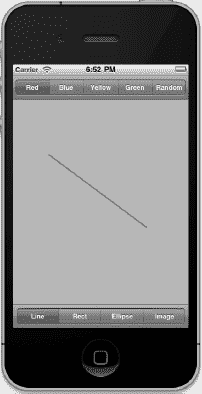

**图 16–11.** *应用中的线条绘制部分现已完成。这里我们使用红色进行绘制。*


#### 绘制矩形和椭圆

现在编写同时绘制矩形和椭圆的代码，因为 Quartz 对这两种对象的实现方式基本相同。将以下加粗代码添加到现有的`drawRect:`方法中：

```
- (void)drawRect:(CGRect)rect {
    CGContextRef context = UIGraphicsGetCurrentContext();

    CGContextSetLineWidth(context, 2.0);
    CGContextSetStrokeColorWithColor(context, currentColor.CGColor);

    CGContextSetFillColorWithColor(context, currentColor.CGColor);
    CGRect currentRect = CGRectMake(firstTouch.x,
                                    firstTouch.y,
                                    lastTouch.x - firstTouch.x,
                                    lastTouch.y - firstTouch.y);

    switch (shapeType) {
        case kLineShape:
            CGContextMoveToPoint(context, firstTouch.x, firstTouch.y);
            CGContextAddLineToPoint(context, lastTouch.x, lastTouch.y);
            CGContextStrokePath(context);
            break;
        case kRectShape:
            CGContextAddRect(context, currentRect);
            CGContextDrawPath(context, kCGPathFillStroke);
            break;
        case kEllipseShape:
            CGContextAddEllipseInRect(context, currentRect);
            CGContextDrawPath(context, kCGPathFillStroke);
            break;
        case kImageShape:
            break;
        default:
            break;
    }
}
```

因为我们希望用纯色同时绘制椭圆和矩形，所以添加了使用`currentColor`设置填充颜色的调用。

`CGContextSetFillColorWithColor(context, currentColor.CGColor);`

接下来，声明一个`CGRect`变量。这里这样做的原因是矩形和椭圆都是基于矩形绘制。我们将使用`currentRect`来保存描述用户拖拽操作的矩形。请记住，`CGRect`有两个成员：`size`和`origin`。函数`CGRectMake()`允许我们通过指定`x`、`y`、`width`和`height`值来创建`CGRect`，所以我们用它来创建矩形。

创建矩形的代码非常直接。我们使用`firstTouch`中存储的点来创建原点。然后通过计算两个`x`值和两个`y`值之间的差值来确定大小。请注意，根据拖拽的方向，一个或两个尺寸值可能为负数，但这没关系。具有负尺寸的`CGRect`将简单地相对于其原点反向渲染（负宽度向左；负高度向上）。

```
    CGRect currentRect = CGRectMake(firstTouch.x,
                                    firstTouch.y,
                                    lastTouch.x - firstTouch.x,
                                    lastTouch.y - firstTouch.y);
```

一旦定义了该矩形，绘制矩形或椭圆就变得十分简单：只需调用两个函数——一个用于在我们定义的`CGRect`中绘制矩形或椭圆，另一个用于描边和填充。

```
        case kRectShape:
            CGContextAddRect(context, currentRect);
            CGContextDrawPath(context, kCGPathFillStroke);
            break;
        case kEllipseShape:
            CGContextAddEllipseInRect(context, currentRect);
            CGContextDrawPath(context, kCGPathFillStroke);
            break;
```

编译并运行你的应用。尝试*矩形*和*椭圆*工具，看看效果如何。别忘了更改颜色，包括使用随机颜色。

#### 绘制图像

最后一步，我们来绘制图像。*16 - QuartzFun*文件夹中有一个名为`iphone.png`的图像，你可以将其添加到*Supporting Files*文件夹中，或者使用任何你喜欢的`.png`文件，只要记得在代码中更改文件名以指向该图像即可。

将以下代码添加到你的`drawRect:`方法中：

```
- (void)drawRect:(CGRect)rect {

    CGContextRef context = UIGraphicsGetCurrentContext();

    CGContextSetLineWidth(context, 2.0);
    CGContextSetStrokeColorWithColor(context, currentColor.CGColor);

    CGContextSetFillColorWithColor(context, currentColor.CGColor);
    CGRect currentRect = CGRectMake(firstTouch.x,
                                    firstTouch.y,
                                    lastTouch.x - firstTouch.x,
                                    lastTouch.y - firstTouch.y);

    switch (shapeType) {
        case kLineShape:
            CGContextMoveToPoint(context, firstTouch.x, firstTouch.y);
            CGContextAddLineToPoint(context, lastTouch.x, lastTouch.y);
            CGContextStrokePath(context);
            break;
        case kRectShape:
            CGContextAddRect(context, currentRect);
            CGContextDrawPath(context, kCGPathFillStroke);
            break;
        case kEllipseShape:
            CGContextAddEllipseInRect(context, currentRect);
            CGContextDrawPath(context, kCGPathFillStroke);
            break;
        case kImageShape:{
            CGFloat horizontalOffset = drawImage.size.width / 2;
            CGFloat verticalOffset = drawImage.size.height / 2;
            CGPoint drawPoint = CGPointMake(lastTouch.x - horizontalOffset,
                                            lastTouch.y - verticalOffset);
            [drawImage drawAtPoint:drawPoint];            
            break;
        }
        default:
            break;
    }
}
```

**注意：** 请注意，在`switch`语句中，我们在`case kImageShape:`下的代码周围添加了花括号。编译器对于在`case`语句后第一行声明的变量会有问题。这些花括号是我们告诉编译器停止报错的方式。我们也可以在`switch`语句之前声明`horizontalOffset`，但这种做法可以使相关代码保持在一起。

首先，我们计算图像的中心，因为我们希望图像以用户最后一次触摸的点为中心绘制。如果不进行此调整，图像将以左上角绘制在用户手指位置，这也是一个有效选项。然后，我们通过从`lastTouch`的`x`和`y`值中减去这些偏移量来创建一个新的`CGPoint`。

```
CGFloat horizontalOffset = drawImage.size.width / 2;
CGFloat verticalOffset = drawImage.size.height / 2;
CGPoint drawPoint = CGPointMake(lastTouch.x - horizontalOffset,
                             lastTouch.y - verticalOffset);
```

现在，我们告诉图像绘制自身。这行代码即可实现：

`[drawImage drawAtPoint:drawPoint];`


### 优化 QuartzFun 应用

我们的应用现在能完成预期功能，但还需考虑一些优化。在这个小型应用中，你可能感觉不到卡顿，但在更复杂的应用中，若运行在处理器速度较慢的设备上，就可能出现延迟。

问题出现在 `BIDQuartzFunView.m` 文件的 `touchesMoved:` 和 `touchesEnded:` 方法中。这两个方法都包含了这行代码：

```
[self setNeedsDisplay];
```

显然，这是告诉视图内容已变更、需要重绘自身的方式。这段代码能工作，但会导致整个视图被擦除并重绘——即使只有极小区域发生了变化。我们在准备拖拽新图形时需要擦除屏幕，但在拖拽过程中，并不希望每秒多次清屏。

相比在拖拽过程中强制整个视图多次重绘，我们可以改用 `setNeedsDisplayInRect:`。`setNeedsDisplayInRect:` 是 `UIView` 的方法，它仅将视图某一矩形区域标记为需要重绘。通过使用该方法，只需标记当前绘图操作所影响的视图区域，就能提升效率。

我们不仅需要重绘 `firstTouch` 与 `lastTouch` 之间的矩形，还需要重绘当前拖拽涉及到的所有屏幕区域。如果用户在屏幕上随意涂抹，而我们只重绘 `firstTouch` 与 `lastTouch` 之间的部分，就会在屏幕上留下大量不应保留的绘制内容。

解决方案是使用一个 `CGRect` 实例变量来记录某次拖拽所影响的全部区域。在 `touchesBegan:` 中，将该实例变量重置为用户触摸点的位置。然后在 `touchesMoved:` 和 `touchesEnded:` 中，利用一个 Core Graphics 函数获取当前矩形与存储矩形的并集，并存储该结果矩形。同时用它指定视图需要重绘的部分。这种方法能让我们持续累加当前拖拽所影响的区域。

现在，我们需要将 `drawRect:` 方法中用于绘制椭圆和矩形的当前矩形计算，迁移到一个新方法中，以便在三个地方复用，避免重复代码。准备好了吗？开始吧。

对 `BIDQuartzFunView.h` 进行如下修改：

```
#import <UIKit/UIKit.h>
#import "BIDConstants.h"

@interface BIDQuartzFunView : UIView
@property (nonatomic) CGPoint firstTouch;
@property (nonatomic) CGPoint lastTouch;
@property (nonatomic, strong) UIColor *currentColor;
@property (nonatomic) ShapeType shapeType;
@property (nonatomic, strong) UIImage *drawImage;
@property (nonatomic) BOOL useRandomColor;
@property (readonly) CGRect currentRect;
@property CGRect redrawRect;
@end
```

我们声明了一个名为 `redrawRect` 的 `CGRect` 属性，用于跟踪需要重绘的区域。同时声明了一个只读属性 `currentRect`，它将返回之前我们在 `drawRect:` 中计算的矩形。

切换到 `BIDQuartzFunView.m`，在文件顶部，现有 `@synthesize` 语句之后，插入以下代码：

```
@synthesize redrawRect, currentRect;

- (CGRect)currentRect {
    return CGRectMake (firstTouch.x,
                       firstTouch.y,
                       lastTouch.x - firstTouch.x,
                       lastTouch.y - firstTouch.y);
}
```

现在，在 `drawRect:` 方法中，将所有对 `currentRect` 的引用改为 `self.currentRect`，以使用我们刚刚创建的新访问器。然后删除原来计算 `currentRect` 的代码行。

```
- (void)drawRect:(CGRect)rect {
    CGContextRef context = UIGraphicsGetCurrentContext();

    CGContextSetLineWidth(context, 2.0);
    CGContextSetStrokeColorWithColor(context, currentColor.CGColor);

    CGContextSetFillColorWithColor(context, currentColor.CGColor);

    switch (shapeType) {
        case kLineShape:
            CGContextMoveToPoint(context, firstTouch.x, firstTouch.y);
            CGContextAddLineToPoint(context, lastTouch.x, lastTouch.y);
            CGContextStrokePath(context);
            break;
        case kRectShape:
            CGContextAddRect(context, self.currentRect);
            CGContextDrawPath(context, kCGPathFillStroke);
            break;
        case kEllipseShape:
            CGContextAddEllipseInRect(context, self.currentRect);
            CGContextDrawPath(context, kCGPathFillStroke);
            break;
        case kImageShape:{
            CGFloat horizontalOffset = drawImage.size.width / 2;
            CGFloat verticalOffset = drawImage.size.height / 2;
            CGPoint drawPoint = CGPointMake(lastTouch.x - horizontalOffset,
                                            lastTouch.y - verticalOffset);
            [drawImage drawAtPoint:drawPoint];
            break;
        }
        default:
            break;
    }
}
```

我们还需要对 `touchesEnded:withEvent:` 和 `touchesMoved:withEvent:` 进行一些修改。我们将重新计算当前操作影响的区域，并以此指明仅需重绘视图的一部分。将现有的 `touchesEnded:` 和 `touchesMoved:` 方法替换为以下新版本：

```
-  (void)touchesEnded:(NSSet *)touches withEvent:(UIEvent *)event {
    UITouch *touch = [touches anyObject];
    lastTouch = [touch locationInView:self];
    if (shapeType == kImageShape) {
        CGFloat horizontalOffset = drawImage.size.width / 2;
        CGFloat verticalOffset = drawImage.size.height / 2;
        redrawRect = CGRectUnion(redrawRect,
                                 CGRectMake(lastTouch.x - horizontalOffset,
                                            lastTouch.y - verticalOffset,
                                            drawImage.size.width,
                                            drawImage.size.height));
    }
    else
        redrawRect = CGRectUnion(redrawRect, self.currentRect);
    redrawRect = CGRectInset(redrawRect, -2.0, -2.0);
    [self setNeedsDisplayInRect:redrawRect];
}

-  (void)touchesMoved:(NSSet *)touches withEvent:(UIEvent *)event {
    UITouch *touch = [touches anyObject];
    lastTouch = [touch locationInView:self];

    if (shapeType == kImageShape) {
        CGFloat horizontalOffset = drawImage.size.width / 2;
        CGFloat verticalOffset = drawImage.size.height / 2;
        redrawRect = CGRectUnion(redrawRect,
                                 CGRectMake(lastTouch.x - horizontalOffset,
                                            lastTouch.y - verticalOffset,
                                            drawImage.size.width,
                                            drawImage.size.height));
    }
    redrawRect = CGRectUnion(redrawRect, self.currentRect);
    [self setNeedsDisplayInRect:redrawRect];
}
```

仅需添加几行代码，我们就能减少视图重绘所需的工作量，不再需要擦除和重绘当前拖拽未影响的任何视图区域。像这样善待 iOS 设备宝贵的处理器周期，能对应用的性能产生显著影响，尤其是在应用变得愈发复杂时。


**注意：** 如果你想更深入地探索 Quartz 2D 主题，可以阅读 Jack Nutting、Dave Wooldridge 和 David Mark（Apress，2010 年）合著的 *《从 iPhone 开发者到 iPad 开发：精通 iPad SDK》*，这本书涵盖了大量有关 Quartz 2D 绘图的内容。书中所有的绘图代码和解释同样适用于 iPhone 和 iPad。

### GLFun 应用程序

如本章前面所述，OpenGL ES 和 Quartz 在绘图方面采用了根本不同的方法。对 OpenGL ES 进行详细介绍本身就是一本书的内容，因此我们在此不打算深入讲解。相反，我们将使用 OpenGL ES 重新创建我们的 Quartz 应用程序，旨在让你了解基础概念，并提供一些示例代码，帮助你启动自己的 OpenGL ES 应用程序。

让我们开始创建应用程序。

**提示：** 如果你想创建一个全屏的 OpenGL ES 应用程序，不需要手动构建。Xcode 提供了相应的模板。该模板会为你设置屏幕和缓冲区，甚至在类中加入一些示例绘制和动画代码，方便你了解应将代码放在何处。如果你在完成 `GLFun` 后想尝试此功能，可以创建一个新的 *iOS* *应用程序*，并选择 *OpenGL ES 应用程序* 模板。

#### 设置 GLFun 应用程序

我们在新应用中做的几乎所有事情都与 `QuartzFun` 相同，唯一的区别是绘图代码。由于绘图代码包含在单个类（`BIDQuartzFunView`）中，我们可以直接复制现有应用，并用新视图替换该视图。这样我们就不需要重复完成启动和运行应用所需的所有工作。

关闭 *QuartzFun* Xcode 项目，在 Finder 中复制项目文件夹。将副本重命名为 *GLFun*（*不要*在 Finder 中重命名项目本身——只需重命名其所在的文件夹），然后双击该文件夹将其打开，再双击 *QuartzFun.xcodeproj* 打开该文件。

打开 *QuartzFun.xcodeproj* 后，你会注意到项目导航器顶部仍然显示 *QuartzFun*。直接单击项目导航器最顶端的 *QuartzFun* 名称，等待大约一秒钟，然后再次单击它。当名称变为可编辑状态时，将其改为 *GLFun*，然后按回车键确认更改。重命名项目的时机把握有些技巧，你可能需要尝试多次才能成功。

更改项目名称后，系统会弹出一个表单，询问你是否要重命名其内容。点击 *重命名* 按钮，系统将遍历并重命名项目的所有组件，使其与新的项目名称匹配。在重命名之前，系统会提示你创建一个快照。快照就像是项目在某个时间点的备份，Xcode 通常会在执行可能造成影响的操作之前要求你创建快照。

现在，除了包含所有源代码文件的 *QuartzFun* 组之外，其他所有内容都已重命名。你可以使用同样的技巧重命名该组。单击一次，暂停，再单击一次，即可将 *QuartzFun* 修改为 *GLFun*。

在继续之前，你需要在项目中添加更多文件。在 *16 - GLFun* 文件夹中，你会找到四个文件：*Texture2D.h*、*Texture2D.m*、*OpenGLES2DView.h* 和 *OpenGLES2DView.m*。前两个文件中的代码由 Apple 编写，旨在使在 OpenGL ES 中绘制图像变得更容易。后两个文件是我们根据 Apple 的示例代码提供的类，用于配置 OpenGL ES 进行二维绘图（换句话说，我们已经为你完成了必要的配置）。如果你愿意，可以在自己的程序中随意使用这些文件。将所有四个文件添加到你的项目中。

最后，我们不再需要用于 Quartz 绘图的类。选中 `BIDQuartzFunView.h` 和 `BIDQuartzFunView.m`，然后按键盘上的删除键将其删除。当系统询问是要移除引用还是删除时，选择 *删除*。

#### 创建 BIDGLFunView

在项目中创建一个新文件，选中 *GLFun* 文件夹并按下 N。从 *Cocoa Touch 类* 标题下选择 *Objective-C 类*，然后点击 *下一步*。在提示时，将类命名为 `BIDGLFunView`，并使其成为 `OpenGLES2DView` 的子类。

`OpenGLES2DView` 是 `UIView` 的一个子类，它使用 OpenGL ES 进行二维绘图。我们设置此视图的目的是使 OpenGL ES 的坐标系与视图的坐标系一一对应。要使用 `OpenGLES2DView` 类，我们只需创建其子类，然后实现 `draw` 方法来完成实际的绘图工作。

点击 *下一步*，将文件保存到项目文件夹中。这应该会创建一对新文件：`BIDGLFunView.h` 和 `BIDGLFunView.m`，它们将用于实现基于 OpenGL ES 的绘图。

单击新创建的 `BIDGLFunView.h` 文件，并将其内容替换为以下代码：

```
#import "BIDConstants.h"
#import "OpenGLES2DView.h"

@class Texture2D;

@interface BIDGLFunView : OpenGLES2DView
@property CGPoint firstTouch;
@property CGPoint lastTouch;
@property (nonatomic, strong) UIColor *currentColor;
@property BOOL useRandomColor;
@property ShapeType shapeType;
@property (nonatomic, strong) Texture2D *sprite;
@end
```

OpenGL ES 本身没有精灵或图像的概念；它有一种叫做纹理的图像。纹理必须绘制到形状或对象上。在 OpenGL ES 中绘制图像的方法是绘制一个正方形（严格来说，是两个三角形），然后将纹理映射到正方形上，使其与正方形的大小完全匹配。`Texture2D` 是一个由 Apple 提供的类，它将这个相对复杂的过程封装成一个简单易用的类。

请注意，尽管视图与 OpenGL 上下文之间是一一对应的关系，但 y 坐标仍然是翻转的。我们需要将 y 坐标从视图坐标系（其中 y 值增加表示向下移动）转换为 OpenGL 坐标系（其中 y 值增加表示向上移动）。

切换到 `BIDGLFunView.m`，并添加以下代码：

```
#import "BIDGLFunView.h"
#import "UIColor+BIDRandom.h"
#import "Texture2D.h"

@implementation BIDGLFunView
@synthesize firstTouch;
@synthesize lastTouch;
@synthesize currentColor;
@synthesize useRandomColor;
@synthesize shapeType;
@synthesize sprite;

- (id)initWithCoder:(NSCoder*)coder {
    if (self = [super initWithCoder:coder]) {
        self.currentColor = [UIColor redColor];
        useRandomColor = NO;
        sprite = [[Texture2D alloc] initWithImage:[UIImage
                                                   imageNamed:@"iphone.png"]];
        glBindTexture(GL_TEXTURE_2D, sprite.name);
    }
    return self;
}

- (void)draw  {
    glLoadIdentity();

    glClearColor(0.78f, 0.78f, 0.78f, 1.0f);
    glClear(GL_COLOR_BUFFER_BIT);

    CGColorRef color = currentColor.CGColor;
    const CGFloat *components = CGColorGetComponents(color);
    CGFloat red = components[0];
    CGFloat green = components[1];
    CGFloat blue = components[2];

    glColor4f(red,green, blue, 1.0);
    switch (shapeType) {
        case kLineShape: {
            glDisable(GL_TEXTURE_2D);
            GLfloat vertices[4];
```


```objective-c
// 转换坐标
vertices[0] = firstTouch.x;
vertices[1] = self.frame.size.height - firstTouch.y;
vertices[2] = lastTouch.x;
vertices[3] = self.frame.size.height - lastTouch.y;
glLineWidth(2.0);
glVertexPointer(2, GL_FLOAT, 0, vertices);
glDrawArrays(GL_LINES, 0, 2);
break;
}
case kRectShape: {
glDisable(GL_TEXTURE_2D);
// 计算边界矩形并存储在顶点中
GLfloat vertices[8];
GLfloat minX = (firstTouch.x > lastTouch.x) ?
lastTouch.x : firstTouch.x;
GLfloat minY = (self.frame.size.height - firstTouch.y >
                self.frame.size.height - lastTouch.y) ?
self.frame.size.height - lastTouch.y :
self.frame.size.height - firstTouch.y;
GLfloat maxX = (firstTouch.x > lastTouch.x) ?
firstTouch.x : lastTouch.x;
GLfloat maxY = (self.frame.size.height - firstTouch.y >
                self.frame.size.height - lastTouch.y) ?
self.frame.size.height - firstTouch.y :
self.frame.size.height - lastTouch.y;

vertices[0] = maxX;
vertices[1] = maxY;
vertices[2] = minX;
vertices[3] = maxY;
vertices[4] = minX;
vertices[5] = minY;
vertices[6] = maxX;
vertices[7] = minY;

glVertexPointer(2, GL_FLOAT , 0, vertices);
glDrawArrays(GL_TRIANGLE_FAN, 0, 4);
break;
}
case kEllipseShape: {
glDisable(GL_TEXTURE_2D);
GLfloat vertices[720];

GLfloat xradius = fabsf((firstTouch.x - lastTouch.x) / 2);
GLfloat yradius = fabsf((firstTouch.y - lastTouch.y) / 2);
for (int i = 0; i <= 720; i += 2) {
    GLfloat xOffset = (firstTouch.x > lastTouch.x) ?
    lastTouch.x + xradius : firstTouch.x + xradius;
    GLfloat yOffset = (firstTouch.y < lastTouch.y) ?
    self.frame.size.height - lastTouch.y + yradius :
    self.frame.size.height - firstTouch.y + yradius;
    vertices[i] = (cos(degreesToRadian(i / 2)) * xradius) + xOffset;
    vertices[i+1] = (sin(degreesToRadian(i / 2)) * yradius) +
    yOffset;
}

glVertexPointer(2, GL_FLOAT , 0, vertices);
glDrawArrays(GL_TRIANGLE_FAN, 0, 360);
break;
}
case kImageShape:
glEnable(GL_TEXTURE_2D);
[sprite drawAtPoint:CGPointMake(lastTouch.x,
                                self.frame.size.height - lastTouch.y)];
break;
default:
break;
}

glBindRenderbufferOES(GL_RENDERBUFFER_OES, viewRenderbuffer);
[context presentRenderbuffer:GL_RENDERBUFFER_OES];
}

- (void)touchesBegan:(NSSet *)touches withEvent:(UIEvent *)event {
if (useRandomColor)
    self.currentColor = [UIColor randomColor];

UITouch* touch = [[event touchesForView:self] anyObject];
firstTouch = [touch locationInView:self];
lastTouch = [touch locationInView:self];
[self draw];
}

- (void)touchesMoved:(NSSet *)touches withEvent:(UIEvent *)event {

UITouch *touch = [touches anyObject];
lastTouch = [touch locationInView:self];

[self draw];
}

- (void)touchesEnded:(NSSet *)touches withEvent:(UIEvent *)event {
UITouch *touch = [touches anyObject];
lastTouch = [touch locationInView:self];

[self draw];
}
@end
```

可见，使用 OpenGL ES 并不比使用 Quartz 更简单或更简洁。虽然 OpenGL ES 比 Quartz 更强大，但可以说它更接近底层硬件。OpenGL ES 有时会让人望而生畏。

由于这个视图是从 nib 文件中加载的，我们添加了一个`initWithCoder:`方法，并在其中创建了一个`UIColor`并赋值给`currentColor`。我们还将`useRandomColor`默认设置为`NO`，并创建了`Texture2D`对象，正如之前在*QuartzFunView*中所做的那样。

在`initWithCoder:`方法之后，是我们的`draw`方法，在这里你能真正看出两个库之间的区别。

让我们来看看绘制一条线的过程。以下是在 Quartz 版本中绘制这条线的方式（已移除与绘制不直接相关的代码）：

```
CGContextRef context = UIGraphicsGetCurrentContext();
CGContextSetLineWidth(context, 2.0);
CGContextSetStrokeColorWithColor(context, currentColor.CGColor);
CGContextMoveToPoint(context, firstTouch.x, firstTouch.y);
CGContextAddLineToPoint(context, lastTouch.x, lastTouch.y);
CGContextStrokePath(context);
```

在 OpenGL ES 中，绘制相同的线需要多几个步骤。首先，我们重置虚拟世界，以清除可能应用到其上的任何旋转、平移或其他变换。

```
glLoadIdentity();
```

接下来，我们将背景清除为与 Quartz 版本应用程序中相同的灰色调。

```
glClearColor(0.78, 0.78f, 0.78f, 1.0f);
glClear(GL_COLOR_BUFFER_BIT);
```

之后，我们需要通过分解`UIColor`并从中提取 RGB 分量来设置 OpenGL ES 的绘制颜色。幸运的是，由于我们使用了便捷类方法，无需担心`UIColor`使用哪种颜色模型。我们可以安全地假设它使用 RGBA 色彩空间。

```
CGColorRef color = currentColor.CGColor;
const CGFloat *components = CGColorGetComponents(color);
CGFloat red = components[0];
CGFloat green = components[1];
CGFloat blue = components[2];
glColor4f(red,green, blue, 1.0);
```

接下来，我们关闭 OpenGL ES 的纹理映射功能。

```
glDisable(GL_TEXTURE_2D);
```

从我们调用此方法开始，直到调用`glEnable(GL_TEXTURE_2D)`为止，期间触发的所有绘制代码都将不应用纹理进行绘制，这正是我们想要的。如果允许使用纹理，我们刚刚设置的颜色将无法显示。

要绘制一条线，我们需要两个顶点，这意味着需要一个包含四个元素的数组。正如我们讨论过的，二维空间中的点由两个值表示：`x`和`y`。在 Quartz 中，我们使用`CGPoint`结构体来存储这些值。在 OpenGL ES 中，点并不嵌入在结构体中。相反，我们将组成需要绘制形状的所有点打包到一个数组中。因此，要在 OpenGL ES 中从点(100, 150)绘制一条线到点(200, 250)，我们需要创建一个如下所示的顶点数组：

```
vertex[0] = 100;
vertex[1] = 150;
vertex[2] = 200;
vertex[3] = 250;
```

我们的数组格式为`{x1, y1, x2, y2, x3, y3}`。该方法中的下一段代码将两个`CGPoint`结构体转换为一个顶点数组。

```
GLfloat vertices[4];
vertices[0] = firstTouch.x;
vertices[1] = self.frame.size.height - firstTouch.y;
vertices[2] = lastTouch.x;
vertices[3] = self.frame.size.height - lastTouch.y;
```

一旦我们定义了描述要绘制内容（本例中为一条线）的顶点数组，我们就指定线宽，使用`glVertexPointer()`方法将数组传递给 OpenGL ES，并告诉 OpenGL ES 绘制该数组。

```
glLineWidth(2.0);
glVertexPointer (2, GL_FLOAT , 0, vertices);
glDrawArrays (GL_LINES, 0, 2);
```


每次在 OpenGL ES 中完成绘制后，我们都需要指示它渲染其缓冲区，并告诉视图的上下文显示新渲染的缓冲区。

```
glBindRenderbufferOES(GL_RENDERBUFFER_OES, viewRenderbuffer);
[context presentRenderbuffer:GL_RENDERBUFFER_OES];
```

澄清一下，在 OpenGL ES 中绘制的过程包含三个步骤：

1.  在上下文中绘制。
2.  完成所有绘制后，将上下文渲染到缓冲区中。
3.  呈现你的渲染缓冲区，此时像素才真正绘制到屏幕上。

如你所见，OpenGL ES 的例子要长得多。

当我们查看绘制椭圆的过程时，Quartz 和 OpenGL ES 之间的差异变得更加显著。OpenGL ES 不知道如何绘制椭圆。OpenGL 作为 OpenGL ES 的老大哥和前身，拥有许多用于生成常见二维和三维形状的便捷函数，但这些便捷函数正是为了精简 OpenGL ES、使其更适合 iPhone 等嵌入式设备而被剥离的部分功能。因此，更多的责任落到了开发者肩上。

提醒一下，以下是使用 Quartz 绘制椭圆的方式：

```
CGContextRef context = UIGraphicsGetCurrentContext();
CGContextSetLineWidth(context, 2.0);
CGContextSetStrokeColorWithColor(context, currentColor.CGColor);
CGContextSetFillColorWithColor(context, currentColor.CGColor);
CGRect currentRect;
CGContextAddEllipseInRect(context, self.currentRect);
CGContextDrawPath(context, kCGPathFillStroke);
```

对于 OpenGL ES 版本，我们从与之前相同的步骤开始：重置任何移动或旋转，清除背景为白色，并根据 `currentColor` 设置绘制颜色。

```
glLoadIdentity();
glClearColor(1.0f, 1.0f, 1.0f, 1.0f);
glClear(GL_COLOR_BUFFER_BIT);
glDisable(GL_TEXTURE_2D);
CGColorRef color = currentColor.CGColor;
const CGFloat *components = CGColorGetComponents(color);
CGFloat red = components[0];
CGFloat green = components[1];
CGFloat blue = components[2];
glColor4f(red,green, blue, 1.0);
```

由于 OpenGL ES 不知道如何绘制椭圆，我们需要自己动手实现，这意味着要唤起对帕克波姆老师的几何课的痛苦回忆。我们将定义一个包含 720 个 `GLfloat` 的顶点数组，用于存放 360 个点的 x 和 y 坐标，圆上每度一个点。我们可以改变点的数量来增加或减少圆的平滑度。这种方法在 iPhone 屏幕上的任何视图中看起来都很好，但如果只是绘制较小的圆，可能需要进行比严格必要更多的处理。

```
GLfloat vertices[720];
```

接下来，我们根据存储在 `firstTouch` 和 `lastTouch` 中的两个点计算椭圆的水平和垂直半径。

```
GLfloat xradius = fabsf((firstTouch.x - lastTouch.x)/2);
GLfloat yradius = fabsf((firstTouch.y - lastTouch.y)/2);
```

然后我们围绕圆循环，计算圆上的正确点。

```
for (int i = 0; i <= 720; i+=2) {
    GLfloat xOffset = (firstTouch.x > lastTouch.x) ?
        lastTouch.x + xradius : firstTouch.x + xradius;
    GLfloat yOffset = (firstTouch.y < lastTouch.y) ?
        self.frame.size.height - lastTouch.y + yradius :
        self.frame.size.height - firstTouch.y + yradius;
        vertices[i] = (cos(degreesToRadian(i / 2))*xradius) + xOffset;
        vertices[i+1] = (sin(degreesToRadian(i / 2))*yradius) +
            yOffset;
}
```

最后，我们将顶点数组提供给 OpenGL ES，告诉它进行绘制和渲染，然后告诉我们的上下文呈现新渲染的图像。

```
glVertexPointer (2, GL_FLOAT , 0, vertices);
glDrawArrays (GL_TRIANGLE_FAN, 0, 360);
. . .
glBindRenderbufferOES(GL_RENDERBUFFER_OES, viewRenderbuffer);
[context presentRenderbuffer:GL_RENDERBUFFER_OES];
```

我们不会回顾矩形方法，因为它使用了相同的基本技术。我们定义一个包含四个顶点的顶点数组来定义矩形，然后进行渲染和呈现。

关于图像绘制，也没有太多要讨论的，因为 Apple 那个可爱的 `Texture2D` 类使得绘制精灵就像在 Quartz 中一样简单。不过，有一个重要的地方需要注意：

```
glEnable(GL_TEXTURE_2D);
```

由于绘制纹理的功能可能先前已被禁用，我们在尝试使用 `Texture2D` 类之前必须确保它已启用。

在 `draw` 方法之后，我们拥有与先前版本相同的触摸相关方法。唯一的区别是，我们不再告诉视图需要显示，而是直接调用 `draw` 方法。我们不需要告诉 OpenGL ES 屏幕的哪些部分将被更新；它会自己计算出来，并利用硬件加速以最有效的方式进行绘制。

#### 更新 BIDViewController

我们需要在 *BIDViewController.m* 中做一些小改动。一是将所有对 *BIDQuartzFunView* 的引用改为 *BIDGLFunView*。首先，将这一行

```
#import "BIDQuartzFunView.h"
```

替换为

```
#import "BIDGLFunView.h"
```

接下来，将 `changeColor:` 方法替换为以下版本：

```
- (IBAction)changeColor:(id)sender {
    UISegmentedControl *control = sender;
    NSInteger index = [control selectedSegmentIndex];

    BIDGLFunView *glView = (BIDGLFunView *)self.view;

    switch (index) {
        case kRedColorTab:
            glView.currentColor = [UIColor redColor];
            glView.useRandomColor = NO;
            break;
        case kBlueColorTab:
            glView.currentColor = [UIColor blueColor];
            glView.useRandomColor = NO;
            break;
        case kYellowColorTab:
            glView.currentColor = [UIColor yellowColor];
            glView.useRandomColor = NO;
            break;
        case kGreenColorTab:
            glView.currentColor = [UIColor greenColor];
            glView.useRandomColor = NO;
            break;
        case kRandomColorTab:
            glView.useRandomColor = YES;
            break;
        default:
            break;
    }
}
```

最后，在 `changeShape:` 方法中，将这一行：

```
[(BIDQuartzFunView *)self.view setShapeType:[control
                                  selectedSegmentIndex]];
```

改为：

```
[(BIDGLFunView *)self.view setShapeType:[control
                                  selectedSegmentIndex]];
```

#### 更新 Nib

我们还需要修改 nib 中的视图。由于我们复制了 *QuartzFun* 项目，视图仍然配置为使用 `BIDQuartzFunView` 作为其底层类，我们需要将其改为 `BIDGLFunView`。

单击 *BIDViewController.xib* 打开 Interface Builder。在停靠栏中单击 *Quartz Fun View*，然后按 3 打开标识检查器。将类从 *BIDQuartzFunView* 改为 *BIDGLFunView*。


### 完成 GLFun 项目

在编译并运行此程序之前，你需要在项目中链接两个框架。请按照第 7 章中的说明（在“链接 Audio Toolbox 框架”部分）添加 Audio Toolbox 框架，但这次不要选择 `AudioToolbox.framework`，而是选择 `OpenGLES.framework` 和 `QuartzCore.framework`。

框架添加好了吗？很好。现在去运行你的项目。它看起来应该和 Quartz 版本一模一样。至此，你已经掌握了足够的 OpenGL ES 知识，可以入门了。

**注意：** 如果你有兴趣在 iPhone 应用中使用 OpenGL ES，可以访问 [`http://www.khronos.org/opengles/`](http://www.khronos.org/opengles/) 获取 OpenGL ES 规范，以及相关书籍、文档和论坛的链接，这些论坛专门讨论 OpenGL ES 相关问题。此外，还可以访问 [`http://www.khronos.org/developers/resources/opengles/`](http://www.khronos.org/developers/resources/opengles/)，并搜索“tutorial”。也别忘了查看 Jeff 的 iPhone 博客中的 OpenGL 教程，地址是 [`http://iphonedevelopment.blogspot.com/2009/05/opengl-es-from-ground-up-table-of.html`](http://iphonedevelopment.blogspot.com/2009/05/opengl-es-from-ground-up-table-of.html)。

### 绘图接近尾声

在本章中，我们仅仅触及了 iOS 绘图能力的皮毛。现在你应该对 Quartz 2D 感到相当得心应手了，偶尔参考一下 Apple 的文档，就能应对大多数绘图需求。同时，你也应该对 OpenGL ES 是什么以及它如何与 iOS 视图系统集成有了基本的理解。

接下来呢？你将学习如何为应用添加手势支持。

