# 第 17 章

## 点击、触摸与手势

iPhone、iPod touch 和 iPad 的屏幕——以其清晰、明亮且支持触控的显示屏——堪称美学的杰作和工程的典范。所有 iOS 设备通用的多点触控屏幕是该平台卓越易用性的关键因素之一。由于屏幕能够同时检测多点触控并独立追踪它们，应用就能够识别各种手势，为用户提供超越界面的强大操控能力。

假设你正在 Mail 应用中浏览一长串想要删除的垃圾邮件。你可以逐一点击每封邮件，点击垃圾箱图标将其删除，然后等待下一封下载，再依次删除。如果你希望在删除前阅读每封邮件，这种方法是最好的。

另一种方法是，在邮件列表中，你可以点击右上角的 `Edit` 按钮，然后点击每封邮件行以标记它们，最后点击 `Delete` 按钮删除所有已标记的邮件。如果你不需要在删除前阅读每封邮件，这种方法最好。还有一种方法是在列表中左右滑动某封邮件。这个手势会为该邮件生成一个 `Delete` 按钮。点击 `Delete` 按钮，邮件就被删除了。

这个例子只是多点触控显示所实现的无数手势中的一个。你可以在查看图片时捏合手指以缩小，或者反向捏合以放大。你也可以长按图标以进入“抖动模式”，从而从 iOS 设备上删除应用。

在本章中，我们将探讨用于检测手势的底层架构。你将学习如何检测最常见的手势，以及如何创建和检测全新的手势。

### 多点触控术语

在深入架构之前，我们先了解一些基本术语。首先，**手势（gesture）** 是指从你用一个或多个手指触摸屏幕开始，到你将手指从屏幕抬起为止所发生的一系列事件。无论耗时多久，只要有一个或多个手指保持在屏幕上，你就仍然处于一个手势之中（除非有系统事件，如来电，将其中断）。注意，Cocoa Touch 并未公开任何代表手势的类或结构体。从某种意义上说，手势是一个动词，正在运行的应用程序可以观察用户输入流，以判断是否有手势发生。

手势通过一系列**事件（events）** 在系统中传递。当你与设备的多点触控屏幕交互时，就会生成事件。这些事件包含了关于所发生的触摸的信息。

**触摸（touch）** 指手指放在屏幕上、在屏幕上拖动或从屏幕上抬起。一个手势所涉及的触摸次数等于同时放在屏幕上的手指数量。你实际上可以将所有五根手指都放在屏幕上，只要它们彼此之间不太靠近，iOS 就能识别并追踪它们。当然，并没有多少有用的五指手势，但知道 iOS 在必要时能够处理五根手指也是件好事。事实上，实验表明 iPad 可以同时处理多达 11 个触摸！这看起来可能有些过头，但如果你正在开发一个多人游戏，多名玩家同时与屏幕交互，这就会很有用。

**点击（tap）** 是指你用一根手指触摸屏幕，然后立即将手指抬起，而不移动它。iOS 设备会追踪点击次数，并能告诉你用户是双击、三击，甚至是 20 击。例如，它会处理所有必要的计时和其他工作，以区分两次单击和一次双击。

**手势识别器（gesture recognizer）** 是一个对象，它知道如何观察用户生成的流事件，并在用户以匹配预定义手势的方式进行触摸和拖动时进行识别。`UIGestureRecognizer` 类及其各种子类可以在你需监控常见手势时帮你省去大量工作，因为它巧妙地将查找手势的工作封装起来，并且可以轻松地应用于应用程序中的任何视图。

### 响应者链

由于手势是通过事件在系统中传递的，而事件又是通过**响应者链（responder chain）** 传递的，因此你需要了解响应者链的工作原理，才能正确处理手势。如果你曾使用过 Mac OS X 的 Cocoa 框架，你可能对响应者链的概念很熟悉，因为 Cocoa 和 Cocoa Touch 中使用的是相同的基本机制。如果这是新内容，也不用担心；我们会解释它是如何工作的。


#### 响应事件

本书中多次提及第一响应者，它通常是用户当前正在交互的对象。第一响应者是响应链的起点。此外还存在其他响应者。任何以 `UIResponder` 作为其父类之一的类都是**响应者**。`UIView` 是 `UIResponder` 的子类，而 `UIControl` 又是 `UIView` 的子类，因此所有视图和所有控件都是响应者。`UIViewController` 也是 `UIResponder` 的子类，这意味着它是一个响应者，其所有子类（例如 `UINavigationController` 和 `UITabBarController`）也都是响应者。响应者之所以得名，是因为它们会响应系统生成的事件，例如屏幕触摸。

如果第一响应者不处理特定事件（例如手势），它就会将该事件沿着响应链向上传递。如果链中的下一个对象响应该特定事件，它通常会消费该事件，从而停止事件在响应链中的传递。在某些情况下，如果某个响应者仅部分处理了事件，该响应者会执行一个操作，并将事件转发给链中的下一个响应者。不过，这通常不是常见情况。通常，当一个对象响应事件时，该事件的处理就到此为止。如果事件遍历了整个响应链而没有任何对象处理它，则该事件会被丢弃。

让我们更具体地了解一下响应链。第一响应者几乎总是一个视图或控件，它拥有最先响应事件的机会。如果第一响应者不处理事件，它会将事件传递给它的视图控制器。如果视图控制器没有消费该事件，事件随后会被传递给第一响应者的父视图。如果父视图不响应，事件会继续传递给父视图的控制器（如果存在的话）。

事件会沿着视图层级向上传递，每个视图及其控制器都有机会处理该事件。如果事件一路向上传递到视图层级的顶端，仍未被任何视图或控制器处理，事件就会被传递给应用程序的窗口。如果窗口不处理该事件，它就会将事件传递给应用程序的 `UIApplication` 对象实例。

如果 `UIApplication` 不响应事件，还有一处地方可以让你构建一个全局的兜底机制作为响应链的末端：应用委托。如果应用委托是 `UIResponder` 的子类（如果你从苹果的应用模板之一创建项目，通常情况下确实如此），应用会尝试将任何未处理的事件传递给它。最后，如果应用委托不是 `UIResponder` 的子类，或者不处理该事件，那么该事件就悄无声息地“结束”了。

这个流程之所以重要，原因有很多。首先，它控制着手势的处理方式。假设用户正在查看一个表格，并在表格的某一行上滑动手指。哪个对象会处理这个手势？

如果滑动发生在表格视图单元格的子视图（视图或控件）内，该视图或控件将有机会响应。如果它不响应，则表格视图单元格获得机会。在 Mail 这样的应用中，滑动可用于删除消息，因此表格视图单元格可能需要检查该事件，看看它是否包含滑动手势。然而，大多数表格视图单元格并不响应手势。如果它们不响应，事件就会向上传递到表格视图，然后继续沿着响应链的其余部分传递，直到有对象响应它，或者到达链条的末端。

### 转发事件：保持响应链的活力

让我们回头看看 Mail 应用中的那个表格视图单元格。我们不知道苹果 Mail 应用的内部细节，但暂且假设表格视图单元格只处理删除滑动操作，并且仅处理删除滑动。该表格视图单元格必须实现与接收触摸事件相关的方法（稍后讨论），以便它能检查事件是否包含滑动手势。如果事件包含滑动，表格视图单元格就会执行一个操作，事情就此结束；事件不再继续传递。

如果事件不包含滑动手势，表格视图单元格有责任手动将该事件转发给响应链中的下一个对象。如果它没有履行转发职责，那么表格及其上层的其他对象将永远没有机会响应，应用程序也可能无法按用户期望的方式运行。该表格视图单元格可能会阻止其他视图识别手势。

每当你响应一个触摸事件时，都需要记住，你的代码并非在真空中运行。如果一个对象拦截了它不处理的事件，它需要通过调用下一个响应者上的相同方法来手动传递该事件。以下是一段虚构的代码：

```
-(void)respondToFictionalEvent:(UIEvent *)event {
    if (someCondition)
        [self handleEvent:event];
    else
        [self.nextResponder respondToFictionalEvent:event];
}
```

注意我们如何在下一个响应者上调用相同的方法。这就是成为响应链中“好公民”的方式。幸运的是，大多数情况下，响应事件的方法也会消费该事件，但了解这一点很重要：如果不是这种情况，你需要确保将该事件重新推回响应链。

### 多点触控架构

既然你已经对响应链有了一定了解，我们来看看手势处理的过程。正如我们指出的，手势是嵌入在事件中沿着响应链传递的。这意味着处理多点触控屏幕任何交互的代码都需要包含在响应链中的某个对象里。通常，这意味着我们可以选择将该代码嵌入到 `UIView` 的子类中，或者嵌入到 `UIViewController` 中。

那么，这段代码属于视图还是视图控制器呢？

如果视图需要根据用户的触摸对自己执行某些操作，该代码很可能属于定义该视图的类。例如，许多控件类（如 `UISwitch` 和 `UISlider`）会响应与触摸相关的事件。一个 `UISwitch` 可能希望根据触摸来开启或关闭自身。创建 `UISwitch` 类的人将手势处理代码嵌入到了该类中，以便 `UISwitch` 能够响应触摸。

然而，通常当被处理的手势影响的范围超出被触摸的对象本身时，手势代码实际上属于视图的控制器类。例如，如果用户触摸某一行做出的手势表明应该删除所有行，那么该手势应由视图控制器中的代码处理。在这两种情况下，响应触摸和手势的方式是完全相同的，无论代码属于哪个类。


### 四种触摸通知方法

有四种方法用于向响应者通知触摸事件。当用户首次触摸屏幕时，系统会寻找一个实现了`touchesBegan:withEvent:`方法的响应者。若希望获知用户何时开始手势或轻点屏幕，可在你的视图或视图控制器中实现此方法。以下是一个该方法的示例：

```
- (void)touchesBegan:(NSSet *)touches withEvent:(UIEvent *)event {
    NSUInteger numTaps = [[touches anyObject] tapCount];
    NSUInteger numTouches = [touches count];

    // 在此处执行处理
}
```

这个方法以及每个与触摸相关的方法，都会接收一个名为`touches`的`NSSet`实例和一个`UIEvent`实例。通过获取`touches`中对象的数量，可以确定当前按压在屏幕上的手指数量。`touches`中的每个对象都是一个`UITouch`事件，代表触摸屏幕的一根手指。如果该触摸是一系列连击的一部分，可以通过询问任意`UITouch`对象来获取连击次数。在上述示例中，`numTaps`值为`2`表示屏幕上发生了快速双击，而`numTouches`值为`2`表示用户用两根手指同时触摸屏幕。如果两者值都为`2`，则表示用户用两根手指进行了双击。

并非`touches`中的所有对象都与实现该方法的视图或视图控制器相关。例如，表格视图单元格可能不会关心其他行或导航栏中的触摸。你可以从事件中获取`touches`的子集，该子集只包含落在特定视图内的触摸，如下所示：

```
NSSet *myTouches = [event touchesForView:self.view];
```

每个`UITouch`代表一根不同的手指，每根手指在屏幕上的位置也不同。你可以通过`UITouch`对象获取特定手指的位置。如果你要求，它甚至可以将该点转换到视图的本地坐标系中，就像这样：

```
CGPoint point = [touch locationInView:self];
```

通过实现`touchesMoved:withEvent:`，你可以在用户手指在屏幕上移动时收到通知。在长距离拖拽过程中，此方法会被多次调用，每次调用时，你都会收到另一组触摸对象和另一个事件。除了可以从`UITouch`对象中获取每根手指的当前位置外，你还可以发现该触摸的上一个位置，即上一次调用`touchesMoved:withEvent:`或`touchesBegan:withEvent:`时手指所在的位置。

当用户手指离开屏幕时，会触发另一个事件`touchesEnded:withEvent:`。当此方法被调用时，表明用户已完成一个手势。

还有最后一个与触摸相关的方法，响应者可以实现它。它叫做`touchesCancelled:withEvent:`，当用户在做一个手势的过程中被某些事件中断（例如来电）时，此方法会被调用。在这里你可以进行任何必要的清理工作，以便为新的手势重新开始。当此方法被调用时，`touchesEnded:withEvent:`将不会为当前手势调用。

好了，理论讲得够多了——让我们实际看看一些应用。

### TouchExplorer 应用程序

我们将构建一个小型应用程序，让你更直观地了解四个触摸相关响应者方法何时被调用。在 Xcode 中，使用*单视图应用程序*模板创建一个新项目。将*产品名称*设为*TouchExplorer*，并将*设备系列*选为*iPhone*。

每次调用触摸相关方法时，TouchExplorer 都会在屏幕上打印包含触摸次数和连击次数的消息（参见图 17-1）。

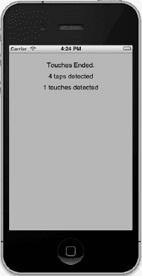

**图 17–1.** *TouchExplorer 应用程序*

**注意：** 尽管本章中的应用程序可以在模拟器上运行，但除非你在真实的 iOS 设备上运行，否则无法看到所有可用的多点触控功能。如果你已被 iOS 开发者计划接纳，就可以在你选择的设备上运行编写的程序。Apple 网站出色地引导你完成准备连接 Xcode 到设备所需的一切步骤。

这个应用程序需要三个标签：一个用于指示最后调用的方法，另一个用于报告当前的连击次数，第三个用于报告触摸次数。单击`BIDViewController.h`，添加三个输出口和一个方法声明，如下所示。这个方法将用于从多个地方更新标签。

```
#import <UIKit/UIKit.h>

@interface BIDViewController : UIViewController

@property (weak, nonatomic) IBOutlet UILabel *messageLabel;
@property (weak, nonatomic) IBOutlet UILabel *tapsLabel;
@property (weak, nonatomic) IBOutlet UILabel *touchesLabel;
- (void)updateLabelsFromTouches:(NSSet *)touches;
@end
```

现在，选择`BIDViewController.xib`来编辑文件。如果视图编辑器尚未打开，单击 dock 中的*视图*图标来编辑视图。将一个标签拖到视图上，使用蓝色参考线将标签放置在视图的左上角附近。使用调整大小手柄将标签向右扩展到右侧蓝色参考线。接下来，使用属性检查器将标签对齐设置为居中。最后，按住 option 键，从原始标签再拖出两个标签，将它们垂直排列，最终得到三个标签（参见图 17-1）。

接下来，按住 control 键从*文件所有者*图标拖到每个标签，将顶部标签连接到`messageLabel`输出口，中间标签连接到`tapsLabel`输出口，底部标签连接到`touchesLabel`输出口。

如果你觉得有点毕加索风格，可以随意调整字体和颜色。放置好标签后，双击每个标签，按 delete 键删除其中的文本。

接着，单击 nib dock 中的*视图*图标，调出属性检查器（参见图 17-2）。在检查器中，转到*视图*部分，确保*用户交互已启用*和*多点触控*都已勾选。如果*多点触控*未勾选，你的控制器类的触摸方法将始终只接收一个触摸，无论实际有多少根手指触摸手机屏幕。

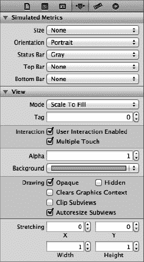

**图 17–2.** *在视图属性中，确保用户交互已启用和多点触控都已勾选。*

完成后，保存 nib 文件。接下来，选择`BIDViewController.m`，在文件开头添加以下代码：

```
#import "BIDViewController.h"

@implementation BIDViewController
@synthesize messageLabel;
@synthesize tapsLabel;
@synthesize touchesLabel;

- (void)updateLabelsFromTouches:(NSSet *)touches {
    NSUInteger numTaps = [[touches anyObject] tapCount];
    NSString *tapsMessage = [[NSString alloc]
        initWithFormat:@"检测到 %d 次连击", numTaps];
    tapsLabel.text = tapsMessage;
```


```
NSUInteger numTouches = [touches count];
NSString *touchMsg = [[NSString alloc] initWithFormat:
    @"%d touches detected", numTouches];
touchesLabel.text = touchMsg;
}
.
.
.

然后，将以下代码行插入现有的 `viewDidUnload` 方法中：

```
- (void)viewDidUnload {
    [super viewDidUnload];
    // 释放主视图的任何保留子视图。
    // 例如 self.myOutlet = nil;
    self.messageLabel = nil;
    self.tapsLabel = nil;
    self.touchesLabel = nil;
}
```

并在文件末尾添加以下新方法：

```
#pragma mark -
- (void)touchesBegan:(NSSet *)touches withEvent:(UIEvent *)event {
    messageLabel.text = @"Touches Began";
    [self updateLabelsFromTouches:touches];
}

- (void)touchesCancelled:(NSSet *)touches withEvent:(UIEvent *)event{
    messageLabel.text = @"Touches Cancelled";
    [self updateLabelsFromTouches:touches];
}
- (void)touchesEnded:(NSSet *)touches withEvent:(UIEvent *)event {
    messageLabel.text = @"Touches Ended.";
    [self updateLabelsFromTouches:touches];
}

- (void)touchesMoved:(NSSet *)touches withEvent:(UIEvent *)event {
    messageLabel.text = @"Drag Detected";
    [self updateLabelsFromTouches:touches];
}
@end
```

在这个控制器类中，我们实现了之前讨论过的所有四个触摸相关方法。每个方法都会设置 `messageLabel`，以便用户能看到每个方法被调用时的状态。接着，这四个方法都调用 `updateLabelsFromTouches:` 来更新另外两个标签。`updateLabelsFromTouches:` 方法从其中一个触摸中获取点击次数，通过查看 `touches` 集合的计数来确定触摸数量，并根据这些信息更新标签。

编译并运行应用程序。如果你在模拟器中运行，请尝试反复点击屏幕以增加点击次数，并尝试按住鼠标按钮同时在视图中拖动来模拟触摸和拖动。请注意，拖动不同于点击，因此一旦开始拖动，应用程序将报告点击次数为零。

你可以在 iOS 模拟器中通过按住 Option 键同时用鼠标点击并拖动来模拟双指捏合操作。还可以模拟双指滑动：首先按住 Option 键模拟捏合操作，然后移动鼠标使代表虚拟手指的两个点彼此相邻，再按住 Shift 键（同时仍按住 Option 键）。按住 Shift 键将锁定两个手指的相对位置，你可以进行滑动和其他双指手势。你无法进行需要三指或更多手指的手势，但可以通过组合使用 Option 和 Shift 键在模拟器中完成大多数双指手势。

如果你能在 iPhone 或 iPod touch 上运行此程序，试试看最多可以同时注册多少个触摸点。尝试用一根手指拖动，再用两根、三根手指拖动。尝试双击和三击屏幕，看看能否通过用两根手指点击来增加点击次数。

随意操作 TouchExplorer 应用程序，直到你熟悉其运行原理以及四个触摸方法的工作方式。准备好后，继续学习如何检测最常见的手势之一：轻扫。

### Swipes 应用程序

我们即将构建的应用程序仅用于检测水平方向和垂直方向的轻扫。如果你在屏幕上从左向右、从右向左、从上向下或从下向上滑动手指，应用程序将在屏幕顶部显示一条消息，持续几秒钟，告知你检测到了轻扫（参见 图 17–3）。

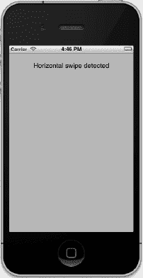

**图 17–3.** *Swipes 应用程序能够检测垂直和水平方向的轻扫。*

检测轻扫相对简单。我们将定义一个最小手势长度（以像素为单位），即用户需要滑动多远才能使手势被视为轻扫。我们还将定义一个偏差值，即用户在手势可以被视为水平或垂直轻扫时，可以偏离直线多远。对角线通常不被视为轻扫，但稍微偏离水平或垂直方向的手势则可被识别。

当用户触摸屏幕时，我们将第一个触摸的位置保存到一个变量中。然后，当用户手指在屏幕上移动时，我们检查是否达到了足够远且足够直的点，从而判定为轻扫。现在开始构建。

在 Xcode 中使用 *Single View Application* 模板创建一个新项目，*Device Family* 选择 *iPhone*，并将项目命名为 *Swipes*。

单击 `BIDViewController.h`，并添加以下代码：

```
#import <UIKit/UIKit.h>

@interface BIDViewController : UIViewController

@property (weak, nonatomic) IBOutlet UILabel *label;
@property CGPoint gestureStartPoint;
@end
```

我们首先为唯一的标签声明一个输出口，并声明一个变量用于存储用户触摸的第一个位置。然后声明一个方法，用于在几秒后清除文本。

选择 `BIDViewController.xib` 打开进行编辑。确保在属性检查器中，视图的 *User Interaction Enabled* 和 *Multiple Touch* 均已勾选。从库中拖拽一个 *Label* 到 *View* 窗口中。将标签设置为从蓝色参考线到蓝色参考线的整个视图宽度，并对齐方式设为居中。可以自由调整文本属性使标签更易阅读。按住 Control 键从 *File's Owner* 图标拖拽到标签，并将其连接到 `label` 输出口。最后，双击标签并删除其文本。

保存 nib 文件。然后返回 Xcode，选择 `BIDViewController.m`，并在顶部添加以下代码：

```
#import "BIDViewController.h"

#define kMinimumGestureLength    25
#define kMaximumVariance         5

@implementation BIDViewController
@synthesize label;
@synthesize gestureStartPoint;

- (void)eraseText {
    label.text = @"";
}
.
.
.
```

我们首先定义最小手势长度为 25 像素，偏差值为 5。如果用户进行水平轻扫，只要其水平移动了 25 像素，即使手势在垂直方向上与起始位置偏差 5 像素以内，仍可被视为轻扫。在实际应用中，你可能需要调整这些数值以找到最适合你的应用的值。

将以下代码行插入现有的 `viewDidUnload` 方法中：

```
- (void)viewDidUnload
{
    [super viewDidUnload];
    // 释放主视图的任何保留子视图。
    // 例如 self.myOutlet = nil;
    self.label = nil;
}
```

并在类末尾添加以下方法：

```
#pragma mark -
- (void)touchesBegan:(NSSet *)touches withEvent:(UIEvent *)event {
    UITouch *touch = [touches anyObject];
    gestureStartPoint = [touch locationInView:self.view];
}

- (void)touchesMoved:(NSSet *)touches withEvent:(UIEvent *)event {
    UITouch *touch = [touches anyObject];
    CGPoint currentPosition = [touch locationInView:self.view];
```


`CGFloat deltaX = fabsf(gestureStartPoint.x - currentPosition.x);`
`CGFloat deltaY = fabsf(gestureStartPoint.y - currentPosition.y);`

`if (deltaX >= kMinimumGestureLength && deltaY <= kMaximumVariance) {`
`    label.text = @"Horizontal swipe detected";`
`    [self performSelector:@selector(eraseText)`
`               withObject:nil afterDelay:2];`
`} else if (deltaY >= kMinimumGestureLength &&`
`           deltaX <= kMaximumVariance){`
`    label.text = @"Vertical swipe detected";`
`    [self performSelector:@selector(eraseText)`
`               withObject:nil afterDelay:2];`
`}`

`@end`

让我们从 `touchesBegan:withEvent:` 方法开始。我们在这里所做的只是从 `touches` 集合中获取任意触摸并存储其坐标点。目前我们主要关注单指滑动，因此不必关心触摸的数量；只需获取其中一个即可。

```
UITouch *touch = [touches anyObject];
gestureStartPoint = [touch locationInView:self.view];
```

在下一个方法 `touchesMoved:withEvent:` 中，我们执行实际工作。首先，获取用户手指的当前坐标：

```
UITouch *touch = [touches anyObject];
CGPoint currentPosition = [touch locationInView:self.view];
```

之后，我们计算用户手指从起始位置在水平和垂直方向上移动了多少距离。函数 `fabsf()` 来自标准 C 数学库，用于返回 `float` 类型的绝对值，这样我们可以在进行相减时无需关心哪个值更大：

```
CGFloat deltaX = fabsf(gestureStartPoint.x - currentPosition.x);
CGFloat deltaY = fabsf(gestureStartPoint.y - currentPosition.y);
```

得到两个差值后，我们检查用户在某一方向上是否移动了足够距离，而在另一方向上未移动过远，从而判断是否构成一次滑动。如果条件成立，我们设置标签文本以指示检测到水平或垂直滑动，并使用 `performSelector:withObject:afterDelay:` 在文本显示 2 秒后将其清除。这样，用户可以多次练习滑动，而无需担心标签所指代的是之前还是最近的一次尝试。

```
if (deltaX >= kMinimumGestureLength && deltaY <= kMaximumVariance) {
    label.text = @"Horizontal swipe detected";
    [self performSelector:@selector(eraseText)
               withObject:nil afterDelay:2];
} else if (deltaY >= kMinimumGestureLength &&
           deltaX <= kMaximumVariance){
    label.text = @"Vertical swipe detected";
    [self performSelector:@selector(eraseText)
               withObject:nil afterDelay:2];
}
```

继续编译并运行应用程序。如果你发现点击并拖动后没有任何可见结果，请耐心些。垂直向下或水平直线拖动，直到你掌握滑动的要领。

### 自动手势识别

我们刚才用于检测滑动的方法已经相当不错。所有复杂性都集中在 `touchesMoved:withEvent:` 方法中，而该方法甚至也不算复杂。但还有一种更简单的方式能实现同样的效果。iOS 包含一个名为 `UIGestureRecognizer` 的类，它消除了手动监测所有事件以观察手指移动的必要。你无需直接使用 `UIGestureRecognizer`，而是创建其某个子类的实例，每个子类专门用于识别特定类型的手势，例如滑动、捏合、双击、三击等。

让我们看看如何修改 Swipes 应用，以使用手势识别器替代我们手动编写的过程。和往常一样，你可能需要先复制一份 *Swipes* 项目文件夹，然后从那里开始操作。

首先，选中 *BIDViewController.m*，删除其中的 `touchesBegan:withEvent:` 和 `touchesMoved:withEvent:` 方法。没错，你不再需要它们了。然后在原位置添加几个新方法：

```
- (void)reportHorizontalSwipe:(UIGestureRecognizer *)recognizer {
    label.text = @"Horizontal swipe detected";
    [self performSelector:@selector(eraseText) withObject:nil afterDelay:2];
}

- (void)reportVerticalSwipe:(UIGestureRecognizer *)recognizer {
    label.text = @"Vertical swipe detected";
    [self performSelector:@selector(eraseText) withObject:nil afterDelay:2];
}
```

这些方法实现了滑动手势带来的实际“功能”（如果这能称之为功能的话），与之前 `touchesMoved:withEvent:` 所做的工作类似。现在，将以下新代码添加到 `viewDidLoad` 方法中：

```
- (void)viewDidLoad
{
    [super viewDidLoad];
    // Do any additional setup after loading the view, typically from a nib.

    UISwipeGestureRecognizer *vertical = [[UISwipeGestureRecognizer alloc]
        initWithTarget:self action:@selector(reportVerticalSwipe:)];
    vertical.direction = UISwipeGestureRecognizerDirectionUp|
        UISwipeGestureRecognizerDirectionDown;
    [self.view addGestureRecognizer:vertical];

    UISwipeGestureRecognizer *horizontal = [[UISwipeGestureRecognizer alloc]
        initWithTarget:self action:@selector(reportHorizontalSwipe:)];
    horizontal.direction = UISwipeGestureRecognizerDirectionLeft|
        UISwipeGestureRecognizerDirectionRight;
    [self.view addGestureRecognizer:horizontal];
}
```

大功告成！为了进一步精简代码，还可以从 *BIDViewController.h* 和 *BIDViewController.m* 中删除与 `gestureStartPoint` 相关的行（但保留它们也无妨）。多亏了 `UIGestureRecognizer`，我们只需创建并配置一些手势识别器，然后将它们添加到视图中。当用户以识别器能够识别的方式与屏幕交互时，我们指定的动作方法就会被调用。

就总代码行数而言，对于这样简单的场景，两种方法差别不大。但使用手势识别器的代码无疑更易于理解和编写。你甚至无需考虑计算手指随时间移动的问题，因为 `UISwipeGestureRecognizer` 已经为你完成了这项工作。


### 实现多指滑动

在 Swipes 应用中，我们只关注单指滑动，因此仅从 `touches` 集合中获取任意触摸对象来确定用户手指在滑动期间的位置。如果你只关心最常用的单指滑动，这种方法完全可行。

但如果你想处理双指或三指滑动呢？在本书的先前版本中，我们曾用了约 50 行代码并配合大量解释，通过跨多个触摸事件追踪多个 `UITouch` 实例来实现这一功能。如今有了手势识别器，这已不再是难题。`UISwipeGestureRecognizer` 可以配置为识别任意数量的同时触摸。默认情况下，每个实例只识别单指滑动，但你可以配置它来检测同时按压屏幕的任意手指数量。每个实例仅响应你指定的精确触摸数量，因此我们将在循环中创建一系列手势识别器。

复制你的 *Swipes* 项目文件夹。

编辑 *BIDViewController.m*，修改 `viewDidLoad` 方法，替换为如下代码：

```
- (void)viewDidLoad
{
    [super viewDidLoad];
    // Do any additional setup after loading the view, typically from a nib.

    for (NSUInteger touchCount = 1; touchCount <= 5; touchCount++) {
        UISwipeGestureRecognizer *vertical;
        vertical = [[UISwipeGestureRecognizer alloc] initWithTarget:self
            action:@selector(reportVerticalSwipe:)];
        vertical.direction = UISwipeGestureRecognizerDirectionUp
            | UISwipeGestureRecognizerDirectionDown;
        vertical.numberOfTouchesRequired = touchCount;
        [self.view addGestureRecognizer:vertical];

        UISwipeGestureRecognizer *horizontal;
        horizontal = [[UISwipeGestureRecognizer alloc] initWithTarget:self
            action:@selector(reportHorizontalSwipe:)];
        horizontal.direction = UISwipeGestureRecognizerDirectionLeft
            | UISwipeGestureRecognizerDirectionRight;
        horizontal.numberOfTouchesRequired = touchCount;
        [self.view addGestureRecognizer:horizontal];
    }
}
```

请注意，在实际应用中，你可能希望不同数量的手指在屏幕上滑动时触发不同的行为。使用手势识别器可以轻松实现这一点，只需让每个手势识别器调用不同的操作方法即可。

现在，我们需要修改日志记录：添加一个返回触摸数量描述的方法，并在报告方法中使用它，如下所示。在 `BIDViewController` 类的底部，两个滑动报告方法的上方添加此方法：

```
- (NSString *)descriptionForTouchCount:(NSUInteger)touchCount {
    switch (touchCount) {
        case 2:
            return @"双指 ";
        case 3:
            return @"三指 ";
        case 4:
            return @"四指 ";
        case 5:
            return @"五指 ";
        default:
            return @"";
    }
}
```

接下来，修改两个滑动报告方法如下：

```
- (void)reportHorizontalSwipe:(UIGestureRecognizer *)recognizer {
    label.text = [NSString stringWithFormat:@"%@水平滑动已检测",
        [self descriptionForTouchCount:[recognizer numberOfTouches]]];
    [self performSelector:@selector(eraseText) withObject:nil afterDelay:2];
}

- (void)reportVerticalSwipe:(UIGestureRecognizer *)recognizer {
    label.text = [NSString stringWithFormat:@"%@垂直滑动已检测",
        [self descriptionForTouchCount:[recognizer numberOfTouches]]];
    [self performSelector:@selector(eraseText) withObject:nil afterDelay:2];
}
```

编译并运行应用。你应该能够在两个方向上触发双指和三指滑动，同时仍然可以触发单指滑动。如果你的手指较小，甚至可能触发四指或五指滑动。

**提示：** 在模拟器中，按住 option 键时会出现一对代表两根手指的圆点。将它们靠近，然后按住 shift 键，这两个圆点将保持相对位置不变，从而允许你在屏幕上移动这对手指。现在，点击并向下拖动屏幕即可模拟双指滑动。很酷吧！

在进行多指滑动时，需要注意手指不要靠得太近。如果两根手指非常接近，系统可能只会识别为单次触摸。因此，不建议将四指或五指滑动用于任何重要手势，因为许多人手指较粗，无法有效完成这些滑动操作。


### 检测多次点按

在 `TouchExplorer` 应用中，我们将点按次数打印到了屏幕上，因此你已经看到检测多次点按是多么简单。然而，实际情况并非看上去那样直截了当，因为你通常需要根据点按次数执行不同的操作。如果用户连按三次，你会收到三次独立的通知：分别是一次、两次和三次点按的通知。如果你希望在双击时做某件事，而在三击时做完全不同的事，那么收到三次独立的通知就会造成麻烦。

幸运的是，苹果公司的工程师们预见到了这种情况，并提供了一种机制，使得多个手势识别器能够良好地协同工作，即使它们面对的是那些看似能触发其中任何一个识别器的模糊输入。其基本思路是，你为手势识别器设置一个约束条件，告知它只有在其他某个手势识别器未能触发其自身方法时，才触发关联的方法。

这听起来有点抽象，那么我们来让它变得更具体一些。一个常用的手势识别器由 `UITapGestureRecognizer` 类表示。点按识别器可以配置为在发生特定次数的点按时触发其动作。假设我们有一个视图，希望为用户单击或双击时分别定义不同的操作。你可能一开始会写下类似这样的代码：

```
    UITapGestureRecognizer *singleTap = [[UITapGestureRecognizer alloc] initWithTarget:
        self action:@selector(doSingleTap)];
    singleTap.numberOfTapsRequired = 1;
    [self.view addGestureRecognizer:singleTap];

    UITapGestureRecognizer *doubleTap = [[UITapGestureRecognizer alloc] initWithTarget:
        self action:@selector(doDoubleTap)];
    doubleTap.numberOfTapsRequired = 2;
    [self.view addGestureRecognizer:doubleTap];
```

这段代码的问题在于，两个识别器彼此并不知晓，它们无法判断用户的操作可能更适合另一个识别器。使用上述代码，如果用户双击视图，`doDoubleTap` 方法会被调用，但 `doSingleMethod` 方法也会被调用——而且会调用两次！——每次点按都会调用一次。

解决这个问题的方法是创建一种失败依赖关系。我们告诉 `singleTap`，只有当 `doubleTap` 没有识别并响应用户输入时，它才触发自己的动作，具体做法是添加下面这行代码：

```
    [singleTap requireGestureRecognizerToFail:doubleTap];
```

这意味着当用户点按一次时，`singleTap` 不会立即执行其工作。相反，`singleTap` 会一直等待，直到它确认 `doubleTap` 已决定不再关注当前手势（也就是说，用户没有点按两次）。我们将在下一个项目中进一步扩展这个思路。

在 Xcode 中，使用 *Single View Application* 模板创建一个新项目。将这个新项目命名为 *TapTaps*，并使用 *Device Family* 弹出菜单选择 *iPhone*。

这个应用将包含四个标签：分别用于告知我们检测到了单击、双击、三击和四击（参见 图 17-4）。

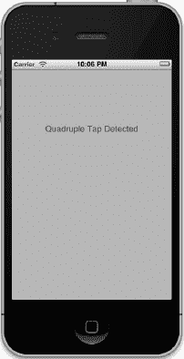

**图 17-4.** *TapTaps 应用最多可检测四次同时点按。*

我们需要为这四个标签建立输出口，并且还需要为每种点按场景编写独立的方法，以模拟你在真实应用中的情况。我们还将包含一个用于清除文本字段的方法。单击 `BIDViewController.h`，并进行如下修改：

```
#import <UIKit/UIKit.h>

@interface BIDViewController : UIViewController

@property (weak, nonatomic) IBOutlet UILabel *singleLabel;
@property (weak, nonatomic) IBOutlet UILabel *doubleLabel;
@property (weak, nonatomic) IBOutlet UILabel *tripleLabel;
@property (weak, nonatomic) IBOutlet UILabel *quadrupleLabel;
- (void)tap1;
- (void)tap2;
- (void)tap3;
- (void)tap4;
- (void)eraseMe:(UILabel *)label;
@end
```

保存文件。然后选择 `BIDViewController.xib` 来编辑图形用户界面。进入界面后，从库中向视图添加四个 *Label*。将四个标签都从蓝色参考线拉伸到另一条蓝色参考线，将其对齐方式设置为居中，然后按你喜欢的格式进行设置。你可以随意为每个标签设置不同的颜色，但这并非必要。完成后，从 *File's Owner* 图标拖线到每个标签，并分别将它们连接到 `singleLabel`、`doubleLabel`、`tripleLabel` 和 `quadrupleLabel`。最后，确保你双击了每个标签并按删除键以清除所有文本。

保存你的更改。然后选择 `BIDViewController.m`，并在文件顶部添加以下代码：

```
#import "BIDViewController.h"

@implementation BIDViewController
@synthesize singleLabel;
@synthesize doubleLabel;
@synthesize tripleLabel;
@synthesize quadrupleLabel;

- (void)tap1 {
    singleLabel.text = @"检测到单击";
    [self performSelector:@selector(eraseMe:)
        withObject:singleLabel afterDelay:1.6f];
}

- (void)tap2 {
    doubleLabel.text = @"检测到双击";
    [self performSelector:@selector(eraseMe:)
        withObject:doubleLabel afterDelay:1.6f];
}

- (void)tap3 {
    tripleLabel.text = @"检测到三击";
    [self performSelector:@selector(eraseMe:)
        withObject:tripleLabel afterDelay:1.6f];
}

- (void)tap4 {
    quadrupleLabel.text = @"检测到四击";
    [self performSelector:@selector(eraseMe:)
        withObject:quadrupleLabel afterDelay:1.6f];
}

- (void)eraseMe:(UILabel *)label {
    label.text = @"";
}
.
.
.
```

将以下几行代码插入到现有的 `viewDidUnload` 方法中：

```
- (void)viewDidUnload {
    [super viewDidUnload];
    // Release any retained subviews of the main view.
    // e.g. self.myOutlet = nil;
    self.singleLabel = nil;
    self.doubleLabel = nil;
    self.tripleLabel = nil;
    self.quadrupleLabel = nil;
}
```

现在，将以下代码添加到 `viewDidLoad` 中：

```
- (void)viewDidLoad {
    [super viewDidLoad];
    // Do any additional setup after loading the view, typically from a nib.
    UITapGestureRecognizer *singleTap =
        [[UITapGestureRecognizer alloc] initWithTarget:self
                                                action:@selector(tap1)];
    singleTap.numberOfTapsRequired = 1;
    singleTap.numberOfTouchesRequired = 1;
    [self.view addGestureRecognizer:singleTap];

    UITapGestureRecognizer *doubleTap =
        [[UITapGestureRecognizer alloc] initWithTarget:self
                                                action:@selector(tap2)];
    doubleTap.numberOfTapsRequired = 2;
    doubleTap.numberOfTouchesRequired = 1;
    [self.view addGestureRecognizer:doubleTap];
    [singleTap requireGestureRecognizerToFail:doubleTap];

    UITapGestureRecognizer *tripleTap =
        [[UITapGestureRecognizer alloc] initWithTarget:self
                                                action:@selector(tap3)];
    tripleTap.numberOfTapsRequired = 3;
    tripleTap.numberOfTouchesRequired = 1;
    [self.view addGestureRecognizer:tripleTap];
    [doubleTap requireGestureRecognizerToFail:tripleTap];

    UITapGestureRecognizer *quadrupleTap =
        [[UITapGestureRecognizer alloc] initWithTarget:self
                                                action:@selector(tap4)];
    quadrupleTap.numberOfTapsRequired = 4;
    quadrupleTap.numberOfTouchesRequired = 1;
    [self.view addGestureRecognizer:quadrupleTap];
    [tripleTap requireGestureRecognizerToFail:quadrupleTap];
}
```


此应用中的四种轻点方法仅用于设置四个标签之一，并通过 `performSelector:withObject:afterDelay:` 在 1.6 秒后擦除该标签。`eraseMe:` 方法用于擦除传入的任何标签中的文本。

有趣的部分在于 `viewDidLoad` 方法中发生的事件。我们以相当简单的方式开始，创建一个轻点手势识别器并将其附加到视图上。

```
    UITapGestureRecognizer *singleTap =
        [[UITapGestureRecognizer alloc] initWithTarget:self
                                                action:@selector(tap1)];
    singleTap.numberOfTapsRequired = 1;
    singleTap.numberOfTouchesRequired = 1;
    [self.view addGestureRecognizer:singleTap];
```

请注意，我们将触发操作所需的轻点次数（在同一位置连续触摸）和触摸点数（同时触摸屏幕的手指数量）都设置为 `1`。之后，我们设置了另一个轻点手势识别器来处理双击操作。

```
    UITapGestureRecognizer *doubleTap =
        [[UITapGestureRecognizer alloc] initWithTarget:self
                                                action:@selector(tap2)];
    doubleTap.numberOfTapsRequired = 2;
    doubleTap.numberOfTouchesRequired = 1;
    [self.view addGestureRecognizer:doubleTap];
    [singleTap requireGestureRecognizerToFail:doubleTap];
```

这与之前的代码非常相似，直到最后一行，我们为 `singleTap` 提供了额外的上下文。实际上，我们是在告诉 `singleTap`，只有当另一个手势识别器（在此例中是 `doubleTap`）认定当前用户输入不符合其要求时，才应触发其操作。

我们来思考一下这意味着什么。有了这两个轻点手势识别器后，视图中的一次轻点会立刻让 `singleTap` 认为：“嘿，这看起来是针对我的。” 同时，`doubleTap` 会认为：“嘿，这看起来*可能*是针对我的，但我需要再等一次轻点。” 由于 `singleTap` 被设置为等待 `doubleTap` 的“失败”，它不会立即发送其操作方法；相反，它会等待查看 `doubleTap` 的情况。

在第一次轻点之后，如果紧接着发生了另一次轻点，那么 `doubleTap` 会说：“嘿，这完全是我的。” 并触发其操作。此时，`singleTap` 会意识到发生了什么，并放弃对该手势的处理。另一方面，如果经过了一段特定时间（系统认为双击操作中两次轻点之间最长间隔的时间），`doubleTap` 会放弃，而 `singleTap` 会看到这次失败，并最终触发其事件。

该方法其余部分继续定义了用于三次和四次轻点的手势识别器，并在每处配置一个手势依赖于下一个手势的失败。

```
    UITapGestureRecognizer *tripleTap =
        [[UITapGestureRecognizer alloc] initWithTarget:self
                                                action:@selector(tap3)];
    tripleTap.numberOfTapsRequired = 3;
    tripleTap.numberOfTouchesRequired = 1;
    [self.view addGestureRecognizer:tripleTap];
    [doubleTap requireGestureRecognizerToFail:tripleTap];

    UITapGestureRecognizer *quadrupleTap =
        [[UITapGestureRecognizer alloc] initWithTarget:self
                                                action:@selector(tap4)];
    quadrupleTap.numberOfTapsRequired = 4;
    quadrupleTap.numberOfTouchesRequired = 1;
    [self.view addGestureRecognizer:quadrupleTap];
    [tripleTap requireGestureRecognizerToFail:quadrupleTap];
```

请注意，我们不需要显式地配置每个手势都依赖于更高轻点次数手势的失败。这种多重依赖关系自然源于代码中建立的失败链。由于 `singleTap` 需要 `doubleTap` 失败，`doubleTap` 需要 `tripleTap` 失败，而 `tripleTap` 需要 `quadrupleTap` 失败，因此，`singleTap` 实际上要求所有其他手势都失败。

编译并运行应用，无论你是单次、双次、三次还是四次轻点，都只会看到显示一个标签。


### 检测捏合手势

另一种常见手势是双指捏合。它被用于许多应用程序中，包括 Mobile Safari、Mail 和 Photos，让你可以放大（双指张开）或缩小（双指并拢）。

得益于 `UIPinchGestureRecognizer`，检测捏合手势非常简单。它被称为连续手势识别器，因为在捏合过程中会反复调用其动作方法。当手势进行时，识别器会经历多个状态。我们唯一需要关注的是 `UIGestureRecognizerStateBegan`，即识别器在检测到捏合发生后首次调用动作方法时的状态。此时，捏合手势识别器的 `scale` 属性始终设置为 `1.0`；在手势的其余阶段，该数值会随着用户手指从起始位置的移动距离相对上下变化。我们将使用 `scale` 值来调整标签中的文本大小。

在 Xcode 中创建一个新项目，仍然使用*单视图应用程序*模板，并将项目命名为 *PinchMe*。PinchMe 应用程序只需要一个标签的 outlet，但还需要一个属性来保存捏合开始时标签字体的大小。展开 *PinchMe* 文件夹，单击 `BIDViewController.h`，并进行以下修改：

```
#import <UIKit/UIKit.h>

@interface BIDViewController : UIViewController

@property (weak, nonatomic) IBOutlet UILabel *label;
@property (assign, nonatomic) CGFloat initialFontSize;
@end
```

现在我们有了 outlet，编辑 `BIDViewController.xib`。在 Interface Builder 中，确保视图显示在其编辑窗口中，然后向视图中拖入一个标签，使其与左上角的蓝色对齐线对齐。抓住标签的右下角并调整大小，使其对齐到右下角的蓝色对齐线。

与我们展示的其他示例不同，我们需要在标签中放入一些文本，以便有内容可看。双击标签，将文本改为单个大写字母 *X*。我们将对这个字母进行放大和缩小操作。将标签的对齐方式设置为居中。接下来，按住 Control 键从 *File's Owner* 图标拖动到标签，并将其连接到 `label` outlet。

保存 nib 文件。现在，切换到 `BIDViewController.m`，并在文件顶部添加以下代码：

```
#import "BIDViewController.h"

@implementation BIDViewController
@synthesize label;
@synthesize initialFontSize;
.
.
.
```

在 `viewDidUnload` 方法中清理我们的 outlet：

```
- (void)viewDidUnload
{
    [super viewDidUnload];
    // 释放主视图的任何保留子视图。
    // 例如 self.myOutlet = nil;
    self.label = nil;
}
```

然后在 `viewDidLoad` 方法中添加以下代码：

```
- (void)viewDidLoad
{
    [super viewDidLoad];
    // 从 nib 加载视图后的任何额外设置。
    UIPinchGestureRecognizer *pinch = [[UIPinchGestureRecognizer alloc]
        initWithTarget:self action:@selector(doPinch:)];
    [self.view addGestureRecognizer:pinch];
}
```

并在文件末尾添加以下方法：

```
.
.
.
- (void)doPinch:(UIPinchGestureRecognizer *)pinch {
    if (pinch.state == UIGestureRecognizerStateBegan) {
        initialFontSize = label.font.pointSize;
    } else {
        label.font = [label.font fontWithSize:initialFontSize * pinch.scale];
    }
}
@end
```

在 `viewDidLoad` 中，我们设置了一个捏合手势识别器，并告诉它在发生捏合时通过 `doPinch:` 方法通知我们。在 `doPinch:` 内部，我们检查捏合的状态，看它是否刚刚开始，如果是，就存储当前字体大小以备后用。否则，如果捏合已经在进行中，我们就使用存储的初始字体大小和当前的捏合比例来计算新的字体大小。

这就是检测捏合手势的全部内容。编译并运行应用程序试试看。当你进行捏合操作时，你会看到文本大小随之变化（参见 Figure 17-5）。如果你在模拟器上运行，请记住你可以按住 option 键并在模拟器窗口中用鼠标点击并拖动来模拟捏合操作。

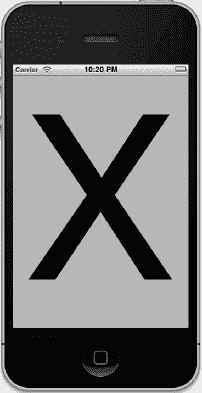

**Figure 17-5.** *PinchMe 应用程序检测捏合手势，用于放大和缩小。*

### 定义自定义手势

现在你已经了解了如何检测 iPhone 上最常用的手势。当你开始定义自己的自定义手势时，真正的乐趣才刚开始！你已经学会了如何使用几个 `UIGestureRecognizer` 的子类，现在是时候学习如何创建你自己的手势了，这些手势可以轻松附加到任何你喜欢的视图上。

定义自定义手势很有技巧。你已经掌握了基本机制，这并不太难。困难的部分在于定义手势时要保持灵活性。

大多数人在使用手势时并不精确。还记得我们在实现轻扫手势时使用的容差吗？这样即使是并非完全水平或垂直的轻扫也能被识别？这就是你需要添加到自定义手势定义中的精细处理的完美示例。如果你对手势的定义过于严格，它就会毫无用处。如果你定义得过于宽泛，又会出现太多误判，这会让用户感到沮丧。从某种意义上说，定义自定义手势可能很困难，因为你必须精确地定义手势的不精确性。如果你试图捕捉复杂的手势，比如画一个 8 字形，那么检测该手势背后的数学计算也会变得非常复杂。


### CheckPlease 应用

在我们的示例中，将定义一个形似对勾（勾号）的手势（见图 17–6）。

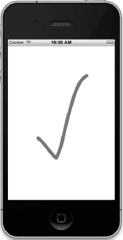

**图 17–6.** *对勾手势示意图*

这个对勾手势的关键特征是什么？最主要的一点是两条线之间锐利的角度变化。我们还需要确保用户的手指在产生这个锐角之前，已经沿直线移动了一小段距离。在图 17–6 中，对勾的两条边以一个略小于 90 度的锐角相交。如果要求角度恰好是 85 度，那么手势将极难准确做出，因此我们将定义一组可接受的角度范围。

在 Xcode 中使用“单视图应用”模板创建一个新项目，并将其命名为 *CheckPlease*。在这个项目中，我们需要使用一些相当标准的解析几何方法，来计算诸如两点之间的距离以及两条直线之间的夹角。如果你对几何知识记忆不多也不必担心，我们已经为你提供了函数来执行这些计算。

在 *17 - CheckPlease* 文件夹中查找两个文件，分别名为 *CGPointUtils.h* 和 *CGPointUtils.c*。将这两个文件拖拽到项目的 *CheckPlease* 文件夹中。你可以在自己的应用中随意使用这些工具函数。

在 *CheckPlease* 文件夹中按住 Control 键单击，然后向项目添加一个新文件。使用文件创建向导创建一个名为 `BIDCheckMarkRecognizer` 的新 Objective-C 类。在“Subclass of”控件中输入 *UIGestureRecognizer*。接着选择 *BIDCheckMarkRecognizer.h*，并进行如下修改：

```
#import <UIKit/UIKit.h>

@interface BIDCheckMarkRecognizer : UIGestureRecognizer

@property (assign, nonatomic) CGPoint lastPreviousPoint;
@property (assign, nonatomic) CGPoint lastCurrentPoint;
@property (assign, nonatomic) CGFloat lineLengthSoFar;
@end
```

在这里，我们声明了三个属性：`lastPreviousPoint`、`lastCurrentPoint` 和 `lineLengthSoFar`。每次我们收到触摸通知时，都会得到前一个触摸点和当前触摸点。这两个点定义了一个线段。下一次触摸会添加另一个线段。我们将上一次触摸的前一个点和当前点分别存储在 `lastPreviousPoint` 和 `lastCurrentPoint` 中，这样就得到了前一个线段。然后，我们可以将该线段与当前触摸的线段进行比较。通过比较这两个线段，我们就能判断当前是仍在画一条直线，还是两个线段之间形成了足够锐利的角度，从而实际上是在画一个对勾。

请记住，每个 `UITouch` 对象都知道其在视图中的当前位置和上一个位置。然而，为了比较角度，我们需要知道前两个点所形成的直线，因此必须存储用户上次触摸屏幕时的当前点和前一个点。每次调用此方法时，我们都会使用这两个变量来存储这两组值，以便能够将当前直线与上一条直线进行比较并检查角度。

我们还声明了一个属性，用于持续记录用户手指拖动的距离。如果手指移动距离未达到至少 10 像素（我们将在 `kMinimumCheckMarkLength` 中定义该值），那么无论角度是否在正确范围内都无关紧要。如果不要求这个距离，我们将会收到大量误报。

现在选择 *BIDCheckMarkRecognizer.m*，并进行如下修改：

```
#import "BIDCheckMarkRecognizer.h"
#import "CGPointUtils.h"
#import <UIKit/UIGestureRecognizerSubclass.h>

#define kMinimumCheckMarkAngle    50
#define kMaximumCheckMarkAngle    135
#define kMinimumCheckMarkLength   10

@implementation BIDCheckMarkRecognizer
@synthesize lastPreviousPoint;
@synthesize lastCurrentPoint;
@synthesize lineLengthSoFar;

- (void)touchesBegan:(NSSet *)touches withEvent:(UIEvent *)event {
    [super touchesBegan:touches withEvent:event];
    UITouch *touch = [touches anyObject];
    CGPoint point = [touch locationInView:self.view];
    lastPreviousPoint = point;
    lastCurrentPoint = point;
    lineLengthSoFar = 0.0f;
}

- (void)touchesMoved:(NSSet *)touches withEvent:(UIEvent *)event {
    [super touchesMoved:touches withEvent:event];
    UITouch *touch = [touches anyObject];
    CGPoint previousPoint = [touch previousLocationInView:self.view];
    CGPoint currentPoint = [touch locationInView:self.view];
    CGFloat angle = angleBetweenLines(lastPreviousPoint,
                                      lastCurrentPoint,
                                      previousPoint,
                                      currentPoint);
    if (angle >= kMinimumCheckMarkAngle && angle <= kMaximumCheckMarkAngle
        && lineLengthSoFar > kMinimumCheckMarkLength) {
        self.state = UIGestureRecognizerStateEnded;
    }
    lineLengthSoFar += distanceBetweenPoints(previousPoint, currentPoint);
    lastPreviousPoint = previousPoint;
    lastCurrentPoint = currentPoint;
}
@end
```

在导入之前提到的 *CGPointUtils.h* 之后，我们导入了一个特殊的头文件 *UIGestureRecognizerSubclass.h*，其中包含仅适用于子类的声明。这样做的重要作用是使手势识别器的 `state` 属性变得可写。这正是我们的子类用来确认所监测的手势已成功完成的机制。

接着我们定义了一些参数，用于判断用户的手指划动是否符合我们对勾号的定义。你可以看到，我们定义了一个最小角度 50 度和一个最大角度 135 度。这是一个相当宽泛的范围，根据你的需求，你可能会决定限制这个角度。我们对此进行了一些实验，发现我们练习画对勾手势时产生的角度分布在一个相当宽的范围内，这就是我们在此选择较大容差的原因。我们画对勾手势时有些不严谨，因此我们预计至少部分用户也会如此。正如一位智者所言：“对自己要严格，对别人要宽容。”


### CheckPlease 触摸方法

现在我们来审视一下触摸方法。你会注意到每个方法都首先调用了父类的实现——这是我们之前从未做过的事情。在 `UIGestureRecognizer` 子类中我们需要这样做，以便父类能够像我们一样掌握事件的相关信息。接下来看具体代码。

在 `touchesBegan:withEvent:` 方法中，我们确定用户当前触摸的点，并将该值存储在 `lastPreviousPoint` 和 `lastCurrentPoint` 中。由于该方法在手势开始时被调用，我们确认无需考虑上一个点，因此将当前点同时存储在这两个变量中。同时，我们将累计的线条长度计数器重置为 0。

接着，在 `touchesMoved:withEvent:` 方法中，我们计算两个线段之间的夹角：一个是从当前触摸的上一个位置到当前位置的线段，另一个是存储在实例变量 `lastPreviousPoint` 和 `lastCurrentPoint` 中的两个点之间的线段。一旦得到这个角度，我们会检查它是否落在可接受的角度范围内，并确保用户的手指在急转弯之前已经移动了足够距离。如果上述两个条件都成立，我们就设置标签以显示检测到了勾号手势。随后，计算触摸位置与其上一个位置之间的距离，将其累加到 `lineLengthSoFar` 中，并将 `lastPreviousPoint` 和 `lastCurrentPoint` 的值替换为当前触摸的两个点，以便下次执行此方法时使用。

现在我们有了一个自定义的手势识别器可以试用，接下来要做的就是将其连接到一个视图上，就像我们对之前使用过的手势识别器所做的那样。选择 `BIDViewController.h` 文件，并进行如下修改：

```objectivec
#import <UIKit/UIKit.h>

@interface BIDViewController : UIViewController

@property (weak, nonatomic) IBOutlet UILabel *label;
@end
```

这里，我们简单地定义了一个指向标签的输出口，用于在检测到勾号手势时通知用户。

选择 `BIDViewController.xib` 来编辑图形界面。从素材库中拖拽一个 `Label` 到左上角的蓝色参考线，调整其大小使其从左蓝色参考线延伸至右蓝色参考线，并将其对齐方式设置为居中。按住 Control 键从 *File's Owner* 图标拖拽到该标签，将其连接到 `label` 输出口，然后双击标签以删除其文本内容。保存 nib 文件。

现在切换到 `BIDViewController.m` 文件，并在文件顶部添加以下代码：

```objectivec
#import "BIDViewController.h"
#import "BIDCheckMarkRecognizer.h"

@implementation BIDViewController
@synthesize label;

- (void)doCheck:(BIDCheckMarkRecognizer *)check {
    label.text = @"Checkmark";
    [self performSelector:@selector(eraseLabel)
               withObject:nil afterDelay:1.6];
}

- (void)eraseLabel {
    label.text = @"";
}

.
.
.
```

这为我们提供了一个动作方法，用于连接识别器，该方法进而会触发我们熟悉的 `eraseLabel` 方法。接下来，编辑 `viewDidLoad` 方法，添加以下几行代码，将新识别器的实例连接到视图：

```objectivec
- (void)viewDidLoad
{
    [super viewDidLoad];
    // Do any additional setup after loading the view, typically from a nib.
    BIDCheckMarkRecognizer *check = [[BIDCheckMarkRecognizer alloc] initWithTarget:self
        action:@selector(doCheck:)];
    [self.view addGestureRecognizer:check];
}
```

现在剩下的工作是在现有的 `viewDidUnload` 方法中添加以下代码：

```objectivec
- (void)viewDidUnload
{
    [super viewDidUnload];
    // Release any retained subviews of the main view.
    // e.g. self.myOutlet = nil;
    self.label = nil;
}
```

编译并运行该应用，然后尝试手势操作。

在为你的应用程序定义新的手势时，请务必进行彻底测试，而且如果可能的话，也让其他人帮你测试。你需要确保手势对用户来说易于操作，但又不至于过于简单而意外触发。同时，你还必须确保不与应用中使用的其他手势发生冲突。例如，单个手势不应同时被识别为自定义手势和捏合手势。

### 结账？请确认！

现在你应该理解了 iOS 用于将触摸、轻点和手势信息传递给应用程序的机制。你还学会了如何检测最常用的 iOS 手势，甚至初步了解了如何定义自己的自定义手势。iPhone 界面的易用性在很大程度上依赖于手势，因此在大多数 iOS 开发中，你都会需要掌握这些技术。

当你准备好继续学习时，翻到下一页，我们将告诉你如何利用 Core Location 来确定自己在地球上的位置。

# 第 18 章

## 我在哪里？使用 Core Location 定位

每台 iOS 设备都能利用一个名为 Core Location 的框架来确定其在地球上的位置。Core Location 实际上可以利用三种技术来实现这一点：GPS、手机基站三角定位和 Wi-Fi 定位服务（WPS）。

GPS 是这三种技术中最精确的，但第一代 iPhone、iPod touch 或纯 Wi-Fi 版 iPad 并不支持。简而言之，任何具备 3G 数据连接的设备也都包含 GPS 单元。GPS 通过读取来自多颗卫星的微波信号来确定当前位置。

**注意：** 从技术上讲，苹果使用的是一种名为辅助 GPS（A-GPS）的 GPS 版本。A-GPS 利用网络资源来帮助提升独立 GPS 的性能。

手机基站三角定位通过计算手机信号覆盖范围内基站的位置来确定当前位置。在基站密度较高的城市和其他区域，手机基站三角定位相当精确，但在基站间距较大的区域，其精度会降低。三角定位需要蜂窝无线电连接，因此仅适用于 iPhone（所有型号，包括第一代）和具备 3G 数据连接的 iPad。

WPS 选项利用附近 Wi-Fi 接入点的 MAC 地址，通过参考一个包含了已知服务提供商及其服务区域的大型数据库来推测你的位置。WPS 并不精确，误差可能达到数英里。

所有这三种方法都会显著消耗电池电量，因此在使用 Core Location 时要牢记这一点。你的应用程序不应过于频繁地请求位置信息，除非确实必要。使用 Core Location 时，你可以指定所需的精度等级。通过精确设定最低精度要求，你可以避免不必要的电池消耗。

Core Location 所依赖的技术对你的应用来说是透明的。我们无需告诉 Core Location 是使用 GPS、三角定位还是 WPS。我们只需指定所需的精度，它便会从可用技术中选择最合适的来实现我们的请求。

### 位置管理器

Core Location API 实际上相当易用。我们将使用的主要类是 `CLLocationManager`，通常称为**位置管理器**。要与 Core Location 进行交互，你需要创建一个位置管理器的实例，如下所示：

```objectivec
CLLocationManager *locationManager = [[CLLocationManager alloc] init];
```

这会创建一个位置管理器的实例，但并不会立即开始轮询你设备的位置。你必须创建一个遵守 `CLLocationManagerDelegate` 协议的对象，并将其设置为位置管理器的委托。当位置信息可用或发生变化时，位置管理器会调用委托方法。确定位置的过程可能会花费一些时间，甚至需要几秒钟。


### 设置期望精度

设置委托后，你还需要设定请求的精度。正如我们提到的，不要指定超出你绝对需求的精度。如果你正在编写一款只需知道手机位于哪个州或国家的应用，就不要指定高精度。请记住，你对 Core Location 要求的精度越高，消耗的电量就越多。同时，也要注意无法保证一定能获得你请求的精度。

以下是一个设置委托并请求特定精度的示例：

```
locationManager.delegate = self;
locationManager.desiredAccuracy = kCLLocationAccuracyBest;
```

精度是通过 `CLLocationAccuracy` 值来设置的，该类型被定义为 `double`。该值以米为单位，因此如果你将 `desiredAccuracy` 指定为 `10`，就是告诉 Core Location 尽量在可能的情况下将当前位置确定在 10 米范围内。像我们之前那样指定 `kCLLocationAccuracyBest`，或者指定 `kCLLocationAccuracyBestForNavigation`（此时还会使用其他传感器数据），是告诉 Core Location 使用当前可用的最精确方法。此外，你还可以使用 `kCLLocationAccuracyNearestTenMeters`、`kCLLocationAccuracyHundredMeters`、`kCLLocationAccuracyKilometer` 和 `kCLLocationAccuracyThreeKilometers`。

### 设置距离过滤器

默认情况下，位置管理器会就设备位置的任何检测变化通知委托。通过指定距离过滤器，你可以告诉位置管理器不要通知你每一次变化，而是仅在位置变化超过一定量时才通知你。设置距离过滤器可以减少应用轮询的次数。

距离过滤器同样以米为单位设置。将距离过滤器指定为 `1000`，即告诉位置管理器直到 iPhone 移动了至少 1000 米（相对于上次报告的位置）时，才通知其委托。示例如下：

```
locationManager.distanceFilter = 1000.0f;
```

如果你希望将位置管理器恢复为无过滤器的默认设置，可以使用常量 `kCLDistanceFilterNone`，如下所示：

```
locationManager.distanceFilter = kCLDistanceFilterNone;
```

就像指定期望精度时一样，你应当注意避免更新频率超过实际需求，否则会浪费电池电量。一个基于用户位置计算用户速度的测速应用，可能需要尽可能快地获取更新；而一个用于显示最近快餐店的应用，则可以用较低的频率来获取。

### 启动位置管理器

当你准备好开始轮询位置时，可以告诉位置管理器启动。它会开始执行操作，并在确定当前位置后调用一个委托方法。在你告诉它停止之前，每当它检测到超出当前距离过滤器的变化时，它都会持续调用你的委托方法。

以下是启动位置管理器的方法：

```
[locationManager startUpdatingLocation];
```

### 明智地使用位置管理器

如果你只需要确定当前位置，而无需持续轮询位置，你应该让位置委托在获取到应用所需信息后立即停止位置管理器。如果你需要持续轮询，请确保尽可能早地停止轮询。请记住，只要你在从位置管理器获取更新，就会消耗用户的电池电量。

要告诉位置管理器停止向其委托发送更新，可以调用 `stopUpdatingLocation`，如下所示：

```
[locationManager stopUpdatingLocation];
```

### 位置管理器委托

位置管理器委托必须遵循 `CLLocationManagerDelegate` 协议，该协议定义了两个方法，两者都是可选的。其中一个方法由位置管理器在确定当前位置或检测到位置变化时调用。另一个方法则在位置管理器遇到错误时调用。

### 获取位置更新

当位置管理器想要将其当前位置告知委托时，会调用 `locationManager:didUpdateToLocation:fromLocation:` 方法。该方法接受三个参数：

* 第一个参数是调用该方法的 location manager。
* 第二个参数是一个 `CLLocation` 对象，定义了设备的当前位置。
* 第三个参数是一个 `CLLocation` 对象，定义了上次更新时的前一个位置。

第一次调用此方法时，前一个位置对象将为 `nil`。


#### 使用 `CLLocation` 获取经纬度

位置信息通过 `CLLocation` 类的实例从位置管理器传递给你的应用程序。该类包含五个可能对你的应用有用的属性。纬度和经度存储在一个名为 `coordinate` 的属性中。要以度为单位获取纬度和经度，请执行以下操作：

```
CLLocationDegrees latitude = theLocation.coordinate.latitude;
CLLocationDegrees longitude = theLocation.coordinate.longitude;
```

`CLLocation` 对象还能告诉你位置管理器对其经纬度计算结果的置信度。`horizontalAccuracy` 属性描述了以 `coordinate` 为圆心的一个圆的半径。`horizontalAccuracy` 的值越大，表明 Core Location 对位置的确定性越低。非常小的半径则表示对确定位置有很高的置信度。

你可以在“地图”应用中看到 `horizontalAccuracy` 的图形化表示（参见**图 18-1**）。当“地图”应用检测到你的位置时，其显示的圆圈就以 `horizontalAccuracy` 为半径。位置管理器认为你位于该圆圈的中心。如果你不在中心，也几乎肯定在圆圈内的某处。`horizontalAccuracy` 的值为负数表明，由于某些原因，你不能依赖 `coordinate` 中的值。

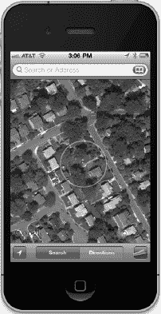

**图 18-1.** “地图”应用使用 Core Location 来确定你的当前位置。外圈是水平精度的可视化表示。

`CLLocation` 对象还有一个名为 `altitude` 的属性，它可以告诉你当前海拔高于或低于海平面多少米：

```
CLLocationDistance altitude = theLocation.altitude;
```

每个 `CLLocation` 对象都维护一个名为 `verticalAccuracy` 的属性，该属性表示 Core Location 对其海拔高度测定结果的置信度。`altitude` 的值可能与 `verticalAccuracy` 的值存在同等米数的偏差。如果 `verticalAccuracy` 值为负数，则表明 Core Location 无法确定有效海拔高度。

`CLLocation` 对象还有一个时间戳，记录了位置管理器进行定位的时间。

除了这些属性，`CLLocation` 还提供了一个有用的实例方法，可以让你确定两个 `CLLocation` 对象之间的距离。这个方法叫做 `distanceFromLocation:`，用法如下：

```
CLLocationDistance distance = [fromLocation distanceFromLocation:toLocation];
```

上面这行代码将返回两个 `CLLocation` 对象（`fromLocation` 和 `toLocation`）之间的距离。返回的这个 `distance` 值是大圆距离计算的结果，该计算会忽略 `altitude` 属性，假设两点都在海平面上计算距离。对于大多数用途来说，大圆计算已经足够，但如果你希望在计算距离时考虑海拔高度，则需要自己编写代码来实现。

**注意：** 如果你不确定 *大圆距离* 的含义，或许可以回想一下地理课上学过的 *大圆航线* 概念。其核心思想是，地球表面任意两点之间的最短距离，是沿着一条环绕地球的路径——即“大圆”——来测量的。`CLLocation` 执行的计算就是确定两点沿此路径的距离，并考虑了地球的曲率。如果不考虑曲率，你会得到连接两点的直线长度，而这用处不大，因为这条线几乎总会径直穿过地球本身的一部分！

#### 错误通知

如果 Core Location 无法确定你的当前位置，它会调用第二个委托方法 `locationManager:didFailWithError:`。导致错误的最可能原因是用户拒绝访问。用户必须授权使用位置管理器，因此当你的应用首次尝试确定位置时，屏幕上会弹出一个提示框，询问是否允许当前程序访问你的位置（参见**图 18-2**）。

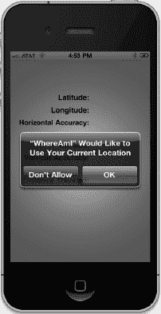

**图 18-2.** 位置管理器的访问必须得到用户批准。

如果用户点击了*不允许*按钮，位置管理器将通过 `locationManager:didFailWithError:` 方法通知你的委托，并附带错误代码 `kCLErrorDenied`。在撰写本文时，位置管理器支持的其他错误代码只有 `kCLErrorLocationUnknown`，它表示 Core Location 无法确定位置，但会继续尝试。`kCLErrorDenied` 错误通常意味着在当前会话的剩余时间内，你的应用都无法访问 Core Location。而 `kCLErrorLocationUnknown` 错误则表示一个可能是暂时性的问题。

**注意：** 在模拟器中工作时，模拟器窗口外会出现一个对话框，要求使用你当前的位置。在这种情况下，你的位置将通过一个超级秘密算法来确定，该算法被锁在苹果总部库比蒂诺深处的一个上锁的保险库中。


### 尝试使用 Core Location

我们来构建一个小应用，用于检测 iPhone 的当前位置以及程序运行期间移动的总距离。你可以从 图 18-3 中看到最终应用的样子。

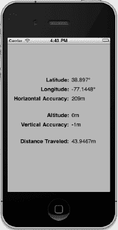

**图 18-3.** *WhereAmI 应用运行时的界面。此截图是在模拟器中拍摄的。请注意，垂直精度是一个负数，这表明它无法确定海拔高度。*

在 Xcode 中，使用 *SingleView Application* 模板创建一个新项目，将项目命名为 *WhereAmI*，并将 *设备系列* 设置为 *iPhone*。选择 `BIDViewController.h`，进行如下修改：

```
#import <UIKit/UIKit.h>
#import <CoreLocation/CoreLocation.h>

@interface BIDViewController :
UIViewController <CLLocationManagerDelegate>

@property (strong, nonatomic) CLLocationManager *locationManager;
@property (strong, nonatomic) CLLocation *startingPoint;
@property (strong, nonatomic) IBOutlet UILabel *latitudeLabel;
@property (strong, nonatomic) IBOutlet UILabel *longitudeLabel;
@property (strong, nonatomic) IBOutlet UILabel *horizontalAccuracyLabel;
@property (strong, nonatomic) IBOutlet UILabel *altitudeLabel;
@property (strong, nonatomic) IBOutlet UILabel *verticalAccuracyLabel;
@property (strong, nonatomic) IBOutlet UILabel *distanceTraveledLabel;
@end
```

首先，注意我们已经包含了 Core Location 的头文件。Core Location 不属于 UIKit 或 Foundation 的一部分，因此我们需要手动导入这些头文件。接着，我们让这个类遵循 `CLLocationManagerDelegate` 协议，以便能够从位置管理器接收位置信息。

之后，我们声明了一个 `CLLocationManager` 指针，用于保存我们创建的 Core Location 实例。我们还声明了一个指向 `CLLocation` 的指针，我们会将其设置为从位置管理器首次更新中接收到的位置。这样，如果用户运行我们的程序并移动了足够距离以触发更新，我们就能够计算出用户移动了多少距离。每次调用时，代理都会收到上一个位置的通知，但不会收到原始起始位置的通知，这就是我们存储它的原因。

剩下的属性都是用于更新用户界面标签的输出口。

选择 `BIDViewController.xib` 来创建图形用户界面。以 图 18-3 为参考，从库中拖动 12 个*标签*到*视图*窗口中。其中六个标签应放置在屏幕左侧，右对齐，并设置为粗体。给这六个粗体标签赋予以下值：*Latitude:*、*Longitude:*、*Horizontal Accuracy:*、*Altitude:*、*Vertical Accuracy:* 和 *Distance Traveled:*。由于 *Horizontal Accuracy:* 标签最长，你可以先放置它，然后按住 Option 键拖动复制该标签，来创建其他五个左侧标签。右侧的六个标签应左对齐，并放置在每个粗体标签的旁边。

右侧的每个标签都需要连接到我们之前在头文件中定义的相应输出口。当六个输出口都连接完成后，依次双击每个标签，删除其包含的文本。

保存你的更改。接下来，返回 Xcode，选择 `BIDViewController.m`，并在文件顶部进行如下修改：

```
#import "BIDViewController.h"

@implementation BIDViewController
@synthesize locationManager;
@synthesize startingPoint;
@synthesize latitudeLabel;
@synthesize longitudeLabel;
@synthesize horizontalAccuracyLabel;
@synthesize altitudeLabel;
@synthesize verticalAccuracyLabel;
@synthesize distanceTraveledLabel;

.
.
.
```

在 `viewDidLoad` 中插入以下代码行，以配置位置管理器：

```
- (void)viewDidLoad {
    [super viewDidLoad];
    // 加载视图后的其他设置，通常从 nib 文件加载
    self.locationManager = [[CLLocationManager alloc] init];
    locationManager.delegate = self;
    locationManager.desiredAccuracy = kCLLocationAccuracyBest;
    [locationManager startUpdatingLocation];
}
```

在 `viewDidUnload` 中插入以下代码行，以清理输出口：

```
- (void)viewDidUnload {
[super viewDidUnload];
    // 释放主视图的任何保留子视图
    // 例如 self.myOutlet = nil;
self.locationManager = nil;
self.latitudeLabel = nil;
self.longitudeLabel = nil;
self.horizontalAccuracyLabel = nil;
self.altitudeLabel = nil;
self.verticalAccuracyLabel = nil;
self.distanceTraveledLabel= nil;
}
```

并在文件末尾插入以下新方法：

```
.
.
.
#pragma mark -
#pragma mark CLLocationManagerDelegate 方法
- (void)locationManager:(CLLocationManager *)manager
       didUpdateToLocation:(CLLocation *)newLocation
       fromLocation:(CLLocation *)oldLocation {

    if (startingPoint == nil)
         self.startingPoint = newLocation;

    NSString *latitudeString = [NSString stringWithFormat:@"%g\u00B0",
                                newLocation.coordinate.latitude];
    latitudeLabel.text = latitudeString;

    NSString *longitudeString = [NSString stringWithFormat:@"%g\u00B0",
                                 newLocation.coordinate.longitude];
    longitudeLabel.text = longitudeString;

    NSString *horizontalAccuracyString = [NSString stringWithFormat:@"%gm",
                                          newLocation.horizontalAccuracy];
    horizontalAccuracyLabel.text = horizontalAccuracyString;

    NSString *altitudeString = [NSString stringWithFormat:@"%gm",
                                newLocation.altitude];
    altitudeLabel.text = altitudeString;

    NSString *verticalAccuracyString = [NSString stringWithFormat:@"%gm",
                                        newLocation.verticalAccuracy];
    verticalAccuracyLabel.text = verticalAccuracyString;

    CLLocationDistance distance = [newLocation
                                   distanceFromLocation:startingPoint];
    NSString *distanceString = [NSString stringWithFormat:@"%gm", distance];
    distanceTraveledLabel.text = distanceString;
}
- (void)locationManager:(CLLocationManager *)manager
       didFailWithError:(NSError *)error {
    NSString *errorType = (error.code == kCLErrorDenied) ?
              @"访问被拒绝" : @"未知错误";
    UIAlertView *alert = [[UIAlertView alloc]
                          initWithTitle:@"获取位置时出错"
                          message:errorType
                          delegate:nil
                          cancelButtonTitle:@"确定"
                          otherButtonTitles:nil];
    [alert show];
}
@end
```

在 `viewDidLoad` 方法中，我们分配并初始化了一个 `CLLocationManager` 实例，将控制器类设置为代理，将所需精度设置为可用的最佳精度，然后告诉位置管理器实例开始提供位置更新。

```
- (void)viewDidLoad {
    self.locationManager = [[CLLocationManager alloc] init];
    locationManager.delegate = self;
    locationManager.desiredAccuracy = kCLLocationAccuracyBest;
    [locationManager startUpdatingLocation];
}
```


#### 更新位置管理器

由于该类已将自身设为位置管理器的委托，因此我们知道，只要实现委托方法 `locationmanager:didUpdateToLocation:fromLocation:`，位置更新就会传入该类。现在，让我们来看看该方法的实现。

在该委托方法中，我们做的第一件事就是检查 `startingPoint` 是否为 `nil`。如果是，则表明此次更新是来自位置管理器的首次更新，于是我们将当前位置赋值给 `startingPoint` 属性。

```
    if (startingPoint == nil)
        self.startingPoint = newLocation;
```

之后，使用传入 `newLocation` 参数中的 `CLLocation` 对象的值，更新前六个标签。

```
    NSString *latitudeString = [NSString stringWithFormat:@"%g\u00B0",
                                newLocation.coordinate.latitude];
    latitudeLabel.text = latitudeString;
```

```
    NSString *longitudeString = [NSString stringWithFormat:@"%g\u00B0",
                                 newLocation.coordinate.longitude];
    longitudeLabel.text = longitudeString;
```

```
    NSString *horizontalAccuracyString = [NSString stringWithFormat:@"%gm",
                                          newLocation.horizontalAccuracy];
    horizontalAccuracyLabel.text = horizontalAccuracyString;
```

```
    NSString *altitudeString = [NSString stringWithFormat:@"%gm",
                                newLocation.altitude];
    altitudeLabel.text = altitudeString;
```

```
    NSString *verticalAccuracyString = [NSString stringWithFormat:@"%gm",
                                        newLocation.verticalAccuracy];
    verticalAccuracyLabel.text = verticalAccuracyString;
```

**注意：** 经度和纬度在格式化字符串中均使用了看起来晦涩的 `\u00B0`。这代表度符号 (°) 的 Unicode 表示。在源代码文件中直接放入除 ASCII 字符以外的任何字符都不是好做法，但在字符串中包含十六进制值则完全没有问题，这正是我们在此处所做的。

#### 确定行进距离

最后，我们确定当前位置与存储在 `startingPoint` 中的位置之间的距离，并显示该距离。在此应用程序运行期间，如果用户移动的距离足够大，以至于位置管理器能够检测到变化，那么 *距离已行进* 字段将持续更新，显示用户与启动应用程序时所在位置的距离。

```
    CLLocationDistance distance = [newLocation
                                   distanceFromLocation:startingPoint];
    NSString *distanceString = [NSString stringWithFormat:@"%gm", distance];
    distanceTraveledLabel.text = distanceString;
```

就是这样。Core Location 相当简单直接，易于使用。

在编译此程序之前，你需要将 `CoreLocation.framework` 添加到项目中。添加方式与第 7 章中添加 `AudioToolbox.framework` 时相同，只不过这次选择的是 `CoreLocation.framework` 而不是 `AudioToolbox.framework`。这里有个提示：单击项目导航器中的第一行（蓝色的 *WhereAmI* 图标），单击 *TARGETS* 下的 *WhereAmI* 图标，再单击 *Build Phases* 标签页。展开 *Link Binary With Libraries* 展开三角形，然后添加你的框架。

编译并运行应用程序，然后进行测试。如果你能在 iPhone 或 iPad 上运行该应用程序，不妨带着运行中的应用程序去兜兜风，观察行驶过程中数值的变化。嗯，实际上，最好让其他人来开车！

### 无论你身在何处，你都在那里

现在你已经基本了解了 Core Location 的全部内容。尽管底层技术相当复杂，但 Apple 提供了一个简单的接口，隐藏了大部分复杂性，使得在应用程序中添加与位置相关的功能变得非常容易，从而可以判断用户的位置并识别他们何时移动。

说到移动，当你准备好后，请直接进入下一章，我们将研究 iPhone 内置的加速度计。

# 第 19 章

## 哇哦！陀螺仪和加速度计！

iPhone、iPad 和 iPod touch 最酷的功能之一就是内置的加速度计——这个小装置能让 iOS 知道设备的握持方式以及是否在移动。iOS 使用加速度计来处理自动旋转，许多游戏也将其用作控制机制。加速度计还可用于检测摇晃和其他突然移动。iPhone 4 的推出进一步扩展了这一功能，它还包含一个内置陀螺仪，可以让你确定设备围绕每个轴的角度。如今，陀螺仪和加速度计已成为所有新款 iPad 和 iPod touch 的标准配置。在本章中，我们将向你介绍如何使用 Core Motion 框架在应用程序中访问陀螺仪和加速度计的值。

### 加速度计物理原理

**加速度计**通过感应给定方向上的惯性力大小来测量加速度和重力。iOS 设备内部的加速度计是一个三轴加速度计，这意味着它能够检测三维空间中的运动或重力牵引。这意味着，你不仅可以使用加速度计来发现设备当前的握持方式（如同自动旋转那样），还可以判断它是否平放在桌面上，甚至判断它是面朝下还是面朝上。

加速度计的测量单位是 g 力（*g* 代表重力），因此加速度计返回的值为 1.0 意味着在特定方向上感应到了 1 g 的力，例如以下情况：

- 如果设备静止不动，地球引力将对其施加约 1 g 的力。
- 如果设备垂直竖立，处于纵向方向，它将检测并报告在其 y 轴上施加了约 1 g 的力。
- 如果设备以一定角度握持，这 1 g 的力将根据握持方式分布在不同的轴上。当以 45 度角握持时，1 g 的力将大致平均分布在两个轴上。

可以通过寻找明显大于 1 g 的加速度计值来检测突然移动。在正常使用中，加速度计在任何轴上检测到的力都不会显著超过 1 g。如果你摇晃、掉落或扔出设备，加速度计将检测到一个或多个轴上更大的力。（请不要为了验证这个理论而掉落或扔出自己的 iOS 设备。）

图 19-1 展示了加速度计所使用的三个轴的图形表示。请注意，加速度计使用了更标准的 y 坐标约定，y 的增加表示向上的力，这与 Quartz 2D 的坐标系相反（在第 16 章中讨论过）。当你将加速度计与 Quartz 2D 一起用作控制机制时，需要转换 y 坐标。当使用 OpenGL ES 时——当加速度计用于控制动画时可能性更大——则无需转换。

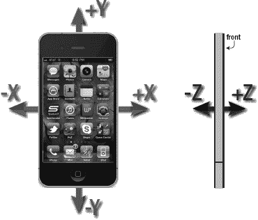

**图 19-1.** *iPhone 加速度计在三维空间中的轴。左侧的 iPhone 4 正面视图显示了 x 轴和 y 轴。右侧的 iPhone 4 侧视图显示了 z 轴。*


### 别忘了旋转

我们之前提到，iPhone 4 还包含一个陀螺仪传感器，可以读取描述设备绕其轴旋转的值。

如果陀螺仪和加速度计之间的区别尚不明确，不妨设想一台 iPhone 平放在桌上。当你在手机平放的状态下开始转动它时，加速度计的值不会发生变化。这是因为施加在手机上的力——在此情境下，只有沿 z 轴垂直向下的重力——并未改变。（实际上，情况会比这更复杂一些，而你手部碰撞手机的动作肯定会引发轻微的加速度计反应。）然而，在相同的运动过程中，设备的旋转值会发生变化——特别是 z 轴旋转值。顺时针转动设备会产生负值，逆时针转动则产生正值。停止转动后，z 轴旋转值将归零。

陀螺仪并非记录绝对旋转值，而是告诉你设备旋转过程中发生的变化。你将在本章的第一个示例中看到其工作原理，该示例即将呈现。

### Core Motion 与运动管理器

在 iOS 4 及更高版本中，加速度计和陀螺仪的值通过 Core Motion 框架进行访问。该框架提供了 `CMMotionManager` 类，它充当一个网关，用于获取描述用户如何移动设备的所有值。你的应用程序会创建一个 `CMMotionManager` 实例，然后以下列两种模式之一使用它：

- 当运动发生时，它可以为你执行某些代码。
- 它可以保留一个持续更新的结构，让你随时访问最新值。

后一种方法非常适合游戏和其他需要能在每次游戏循环中轮询设备当前状态的高度交互式应用程序。我们将演示如何实现这两种方法。

请注意，`CMMotionManager` 类实际上并非单例，但你的应用程序应将其视为单例。每个应用只应通过常规的 `alloc` 和 `init` 方法创建一个实例。因此，如果你需要从应用中的多个位置访问运动管理器，最好在应用委托中创建它，并从此处提供访问权限。

除了 `CMMotionManager` 类，Core Motion 还提供了其他一些类，例如 `CMAccelerometerData` 和 `CMGyroData`，它们是简单的容器，你的应用程序可通过它们访问运动数据。我们将在用到这些类时进行介绍。

#### 基于事件的运动

我们提到过，运动管理器可以以一种模式运行：每次运动数据发生变化时，它都会为你执行某些代码。大多数其他 Cocoa Touch 类通过让你连接到一个委托来提供此类功能，该委托会在适当时收到消息，但 Core Motion 的做法略有不同。

由于它是一个仅在 iOS 4 及更高版本中可用的新框架，Apple 决定让 `CMMotionManager` 使用 iOS 4 SDK 的另一个新特性：block。我们在本书中已经多次使用 block，现在你将看到这项技术的另一种应用。

使用 Xcode 创建一个名为 `MotionMonitor` 的新 *Single View Application* 项目，并关闭 *Use Storyboard* 选项。这将是一个简单的应用，用于读取加速度计数据和陀螺仪数据（如果可用），并在屏幕上显示信息。

**注意：** 本章中的应用程序无法在模拟器上运行，因为模拟器没有加速度计。唉，真遗憾。

首先，我们需要将 Core Motion 链接到应用中。这是一个可选的系统框架，因此我们必须手动添加。按照第 7 章中关于添加 Audio Toolbox 框架的说明（在“链接 Audio Toolbox 框架”部分），但这次选择 `CoreMotion.framework` 而不是 `AudioToolbox.framework`。（简而言之，在项目导航器中选择项目，选择目标和 *Build Phases* 选项卡，展开 *Link Binary with Libraries* 视图，然后点击加号按钮。）

现在，选择 `BIDViewController.h` 文件，并做出以下更改：

```
#import <UIKit/UIKit.h>
#import <CoreMotion/CoreMotion.h>

@interface BIDViewController : UIViewController

@property (strong, nonatomic) CMMotionManager *motionManager;
@property (weak, nonatomic) IBOutlet UILabel *accelerometerLabel;
@property (weak, nonatomic) IBOutlet UILabel *gyroscopeLabel;

@end
```

这为我们提供了一个用于访问运动管理器本身的指针，以及一对用于显示信息的标签的插座。这里无需过多解释，直接保存更改即可。

接下来，在 Interface Builder 中打开 `BIDViewController.xib`。通过在 nib 窗口中选择其图标打开视图，然后从库中拖出一个 *Label* 到视图中。调整标签大小，使其从左蓝色参考线延伸到右蓝色参考线，高度大约为整个视图的一半，然后将标签顶部与顶部蓝色参考线对齐。

现在，打开属性检查器，将 *Lines* 字段从 `1` 改为 `0`。*Lines* 属性用于指定标签中可显示的文本行数，并提供一个硬性上限。如果设置为 `0`，则不应用限制，标签可以包含任意多行文本。

接下来，按住 Option 键拖拽标签以创建副本，并将副本与视图下半部分的蓝色参考线对齐。

现在，按住 Control 键从 *File's Owner* 图标拖拽到每个标签，将 `accelerometerLabel` 连接到上方的标签，将 `gyroscopeLabel` 连接到下方的标签。

最后，双击每个标签，删除现有文本。

这个简单的 GUI 就完成了，保存你的工作，准备开始编码。

接下来，选择 `BIDViewController.m`。在这里，将属性合成添加到实现块的顶部，并将内存管理调用添加到 `viewDidUnload` 方法中：

```
#import "BIDViewController.h"

@implementation BIDViewController
@synthesize motionManager;
@synthesize accelerometerLabel;
@synthesize gyroscopeLabel;
.
.
.
- (void)viewDidUnload
{
    [super viewDidUnload];
    // 释放主视图的任何保留子视图。
    // 例如 self.myOutlet = nil;
    self.motionManager = nil;
    self.accelerometerLabel = nil;
    self.gyroscopeLabel = nil;
}
.
.
.
```


接下来是精彩的部分。在 `viewDidLoad` 方法中填入以下代码：

```
- (void)viewDidLoad
{
    [super viewDidLoad];
    // 加载视图后执行任何额外设置，通常来自 nib 文件
    self.motionManager = [[CMMotionManager alloc] init];
    NSOperationQueue *queue = [[NSOperationQueue alloc] init];
    if (motionManager.accelerometerAvailable) {
        motionManager.accelerometerUpdateInterval = 1.0/10.0;
        [motionManager startAccelerometerUpdatesToQueue:queue withHandler:
        ^(CMAccelerometerData *accelerometerData, NSError *error){
            NSString *labelText;
            if (error) {
                [motionManager stopAccelerometerUpdates];
                labelText = [NSString stringWithFormat:
                             @"加速计遇到错误：%@", error];
            } else {
                labelText = [NSString stringWithFormat:
                    @"加速计\n-----------\nx: %+.2f\ny: %+.2f\nz: %+.2f",
                    accelerometerData.acceleration.x,
                    accelerometerData.acceleration.y,
                    accelerometerData.acceleration.z];
            }
            [accelerometerLabel performSelectorOnMainThread:@selector(setText:)
                                                 withObject:labelText
                                              waitUntilDone:NO];
}];
} else {
accelerometerLabel.text = @"此设备没有加速计。";
}
    if (motionManager.gyroAvailable) {
        motionManager.gyroUpdateInterval = 1.0/10.0;
        [motionManager startGyroUpdatesToQueue:queue withHandler:
        ^(CMGyroData *gyroData, NSError *error){
            NSString *labelText;
            if (error) {
                [motionManager stopGyroUpdates];
                labelText = [NSString stringWithFormat:
                             @"陀螺仪遇到错误：%@", error];
            } else {
                labelText = [NSString stringWithFormat:
                             @"陀螺仪\n--------\nx: %+.2f\ny: %+.2f\nz: %+.2f",
                             gyroData.rotationRate.x,
                             gyroData.rotationRate.y,
                             gyroData.rotationRate.z];
            }
            [gyroscopeLabel performSelectorOnMainThread:@selector(setText:)
                                             withObject:labelText
                                          waitUntilDone:NO];
        }];
    } else {
        gyroscopeLabel.text = @"此设备没有陀螺仪";
    }
}
```

这个方法包含了我们启动传感器所需的所有代码，指示它们每隔 1/10 秒向应用报告一次数据，并在收到数据后更新屏幕。

得益于 Block 的强大功能，这一切变得非常简单且紧凑。我们不再需要将部分功能分散到代理方法中，而是通过 Block 定义行为，让我们能够在配置行为的同一个方法中看到这些行为。我们来稍微剖析一下这段代码。首先从这部分开始：

```
    self.motionManager = [[CMMotionManager alloc] init];
    NSOperationQueue *queue = [[NSOperationQueue alloc] init];
```

这段代码首先创建了一个 `CMMotionManager` 实例，我们将用它来监测运动事件。然后创建了一个操作队列，正如你可能从 第 15 章 中回忆起的，操作队列只是一个用于存放待处理任务的容器。

**注意：** 运动管理器需要一个队列来存放每次事件发生时，由你提供的 Block 所指定的待处理任务。使用系统的默认队列来完成这个任务可能会很诱人，但 `CMMotionManager` 的文档明确警告不要这样做！因为默认队列最终可能会被这些事件塞满，从而难以处理其他关键的系统事件。

接下来我们开始配置加速计。我们首先检查设备是否确实拥有加速计。到目前为止，所有已发布的便携式 iOS 设备都配备有加速计，但为了防止未来某些设备没有，进行检查是值得的。然后我们设置更新间隔，单位是秒。这里，我们要求的是 1/10 秒。请注意，设置这个值并不能保证我们会以精确的速度收到更新。实际上，这个设置更像是一个上限，指定了运动管理器允许提供给我们的最佳速率。在现实中，它的更新频率可能会低于这个值。

```
    if (motionManager.accelerometerAvailable) {
        motionManager.accelerometerUpdateInterval = 1.0/10.0;
```

接下来，我们告诉运动管理器开始报告加速计更新。我们传入了它将用于存放任务的队列，以及定义了每次更新时要执行任务的 Block。请记住，Block 总是以脱字符（`^`）开头，接着是一对圆括号包裹的参数列表，这些参数会在 Block 执行时被填充（在本例中，是加速计数据和可能用于提醒我们出现问题的错误），最后以包含待执行代码的花括号部分结尾。

```
        [motionManager startAccelerometerUpdatesToQueue:queue withHandler:
         ^(CMAccelerometerData *accelerometerData, NSError *error) {
```

然后是 Block 的内容。它根据当前的加速计值创建一个字符串，或者如果出现问题则生成一条错误消息。然后将该字符串值推送到 `accelerometerLabel` 中。在这里，我们不能直接这样做，因为像 `UILabel` 这样的 UIKit 类通常只能在主线程中安全访问。由于这段代码的执行方式（在一个 `NSOperationQueue` 内部），我们无法确定具体在哪条线程上执行。因此，我们使用 `performSelectorOnMainThread:withObject:waitUntilDone:` 方法让主线程处理这个操作。

请注意，加速计的值是通过传入的 `accelerometerData` 的 `acceleration` 属性来访问的。`acceleration` 属性的类型是 `CMAcceleration`，它仅仅是一个包含三个 `float` 值的简单 `struct`。而 `accelerometerData` 本身是 `CMAccelerometerData` 类的一个实例，它实际上只是 `CMAcceleration` 的一个包装器！如果你觉得为了传递三个 `float` 值而引入如此多余的类和类型似乎不必要，好吧，你并不是唯一这么想的人。无论如何，以下是它的用法：

```
            NSString *labelText;
            if (error) {
                [motionManager stopAccelerometerUpdates];
                labelText = [NSString stringWithFormat:
                             @"加速计遇到错误：%@", error];
            } else {
                labelText = [NSString stringWithFormat:
                    @"加速计\n-----------\nx: %+.2f\ny: %+.2f\nz: %+.2f",
                    accelerometerData.acceleration.x,
                    accelerometerData.acceleration.y,
                    accelerometerData.acceleration.z];
            }
            [accelerometerLabel performSelectorOnMainThread:@selector(setText:)
                withObject:labelText
                waitUntilDone:NO];
```


然后我们结束这个代码块，并完成之前传入该代码块的方法调用的方括号。最后，我们提供一个完全不同的代码路径，以防设备没有加速度计。如前所述，所有 iOS 设备至今都内置加速度计，但谁知道未来会怎样呢？

```
        }];
    } else {
        accelerometerLabel.text = @"This device has no accelerometer.";
    }
```

你肯定已经注意到，陀螺仪的代码在结构上是相同的，区别仅在于调用的具体方法以及访问报告值的方式。两者足够相似，因此无需在此逐行讲解。

现在，在你拥有的任意 iOS 设备上构建并运行你的应用，然后进行测试（见图 19–2）。当你以不同方式倾斜设备时，你会看到加速度计的值如何适应每个新位置，并且在您保持设备静止时，这些值也会保持稳定。

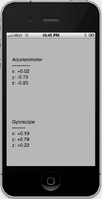

**图 19–2.** *在 iPhone 4 上运行的 MotionMonitor。遗憾的是，如果在模拟器中运行此应用，你只会看到一对错误信息。*

如果你在带有陀螺仪的设备上运行此应用，你会看到这些值也会随之变化。当设备静止不动时，无论处于哪种方向，陀螺仪的值都会在零附近徘徊。当你旋转设备时，你会看到陀螺仪的值会根据你在各个轴上的旋转方式而变化。当你停止移动设备时，这些值总会回归到零。

### 主动运动访问

你已经了解了如何通过向 `CMMotionManager` 传递代码块（block）来在运动发生时获取运动数据。这种事件驱动的运动处理方式对于普通 Cocoa 应用来说已经足够，但有时并不完全符合应用的特定需求。例如，交互式游戏通常有一个持续运行的循环，用于处理用户输入、更新游戏状态并重绘屏幕。在这种情况下，事件驱动的方法并不太合适，因为你需要实现一个对象，该对象等待运动事件，记住每个传感器报告的最新位置，并在必要时准备好将数据返回给主游戏循环。

幸运的是，`CMMotionManager` 内置了解决方案。我们可以不必传入代码块，而是直接告诉它使用 `startAccelerometerUpdates` 和 `startGyroUpdates` 方法激活传感器，之后我们只需在任何需要的时候直接从运动管理器中读取值！

让我们修改 MotionMonitor 应用来使用这种方法，这样你就能看到它是如何工作的了。首先，复制你的 *MotionMonitor* 项目文件夹。然后，在 *BIDViewController.h* 中添加一个新属性，一个指向 `NSTimer` 的指针，它将触发我们所有的显示更新：

```
#import <UIKit/UIKit.h>
#import <CoreMotion/CoreMotion.h>

@interface BIDViewController : UIViewController

@property (retain) CMMotionManager *motionManager;
@property (retain) IBOutlet UILabel *accelerometerLabel;
@property (retain) IBOutlet UILabel *gyroscopeLabel;
@property (retain) NSTimer *updateTimer;

@end
```

现在，切换到 *BIDViewController.m*，你需要在其中合成新属性：

```
@implementation BIDViewController
@synthesize motionManager;
@synthesize accelerometerLabel;
@synthesize gyroscopeLabel;
@synthesize updateTimer;
```

删除我们之前编写的整个 `viewDidLoad` 方法，并将其替换为这个更简单的版本，它仅设置运动管理器，并为缺少传感器的设备提供信息标签：

```
- (void)viewDidLoad {
    [super viewDidLoad];
    self.motionManager = [[CMMotionManager alloc] init];

    if (motionManager.accelerometerAvailable) {
        motionManager.accelerometerUpdateInterval = 1.0/10.0;
        [motionManager startAccelerometerUpdates];
    } else {
        accelerometerLabel.text = @"This device has no accelerometer.";
    }
    if (motionManager.gyroAvailable) {
        motionManager.gyroUpdateInterval = 1.0/10.0;
        [motionManager startGyroUpdates];
    } else {
        gyroscopeLabel.text = @"This device has no gyroscope.";
    }
}
```

通常，我们使用 `viewDidLoad` 和 `viewDidUnload` 来“包围”与 GUI 显示相关的属性的创建和销毁。然而，对于我们的新定时器，我们希望它仅在视图实际显示时的一小段时间窗口内保持活动。这样，我们就能将主游戏循环的使用量降到最低。我们可以通过如下方式实现 `viewWillAppear:` 和 `viewDidDisappear:`。将这段代码添加到这两个方法中：

```
- (void)viewWillAppear:(BOOL)animated {
    [super viewWillAppear:animated];
    self.updateTimer = [NSTimer scheduledTimerWithTimeInterval:1.0/10.0
                                                        target:self
                                                      selector:@selector(updateDisplay)
                                                      userInfo:nil
                                                       repeats:YES];
}

- (void)viewDidDisappear:(BOOL)animated {
    [super viewDidDisappear:animated];
    self.updateTimer = nil;
}
```

`viewWillAppear:` 中的代码创建了一个新定时器，并将其设置为每 1/10 秒触发一次，调用 `updateDisplay` 方法（我们尚未创建）。将此方法添加到 `ViewDidDisappear` 下方：

```
- (void)updateDisplay {
    if (motionManager.accelerometerAvailable) {
        CMAccelerometerData *accelerometerData = motionManager.accelerometerData;
        accelerometerLabel.text  = [NSString stringWithFormat:
                     @"Accelerometer\n-----------\nx: %+.2f\ny: %+.2f\nz: %+.2f",
                     accelerometerData.acceleration.x,
                     accelerometerData.acceleration.y,
                     accelerometerData.acceleration.z];
    }
    if (motionManager.gyroAvailable) {
        CMGyroData *gyroData = motionManager.gyroData;
        gyroscopeLabel.text = [NSString stringWithFormat:
                     @"Gyroscope\n--------\nx: %+.2f\ny: %+.2f\nz: %+.2f",
                     gyroData.rotationRate.x,
                     gyroData.rotationRate.y,
                     gyroData.rotationRate.z];
    }
}
```

在你的设备上构建并运行该应用，你应该会看到它的行为与第一个版本完全相同。至此，你已经了解了访问运动数据的两种方式。请选择最适合你应用需求的那种。


#### 加速计结果

我们之前提到，iPhone 的加速计会检测沿三个轴方向的加速度，并通过`CMAcceleration struct`结构体提供这些信息。每个`CMAcceleration`结构体都包含 x、y 和 z 三个字段，每个字段都存储一个浮点数值。数值为 0 表示加速计在该轴向上未检测到任何运动。正值或负值则指示某一方向上的作用力。例如，y 轴为负值表示检测到向下的拉力，这通常表明手机正以竖直方向（竖屏模式）被握持。y 轴为正值则表明在相反方向上存在作用力，这可能意味着手机被倒置，或者正在向下移动。

结合图 19–1 的示意图，我们来看一些加速计的结果（参见图 19–3）。请注意，在现实生活中，你几乎永远无法得到如此精确的数值，因为加速计非常灵敏，甚至能感知到微小的运动，通常你会在三个轴上至少检测到一些微小的作用力。这是现实世界中的物理现象，而非高中物理。

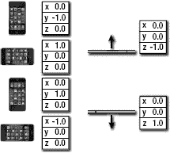

**图 19–3.** *不同设备方向下的理想化加速度值*

在第三方应用中，加速计最常见的用途可能是作为游戏控制器。我们将在本章稍后部分创建一个使用加速计进行输入的程序，但首先，我们将探讨加速计的另一个常见用途：检测摇晃。

### 检测摇晃

与手势一样，摇晃也可以作为应用程序的一种输入形式。例如，作为 iOS 示例代码项目之一的绘图程序 GLPaint，允许用户通过摇晃 iOS 设备来擦除绘图，这有点像神奇画板（Etch A Sketch）。

检测摇晃相对简单。它只需要检查某个轴上的绝对值是否超过设定的阈值。在正常使用过程中，三个轴中的一个达到约 1.3 g 的数值并不罕见，但要想获得远高于此的数值通常需要施加有意的作用力。加速计似乎无法注册高于约 2.3 g 的数值（至少根据我们的经验），因此你的阈值不应设得更高。

要检测摇晃，你可以检查绝对值：轻微摇晃大于 1.5，剧烈摇晃大于 2.0，如下所示：

```
- (void)accelerometer:(UIAccelerometer *)accelerometer
        didAccelerate:(UIAcceleration *)acceleration {

    if (fabsf(acceleration.x) > 2.0
       || fabsf(acceleration.y) > 2.0
       || fabsf(acceleration.z) > 2.0) {
       // 在此处执行某些操作...
    }
}
```

该方法能够检测任何轴上超过 2 个重力加速度的运动。

你可以通过要求用户在一定次数内来回摇晃来认定为一次摇晃，从而实现更复杂的摇晃检测，如下所示：

```
- (void)accelerometer:(UIAccelerometer *)accelerometer
        didAccelerate:(UIAcceleration *)acceleration {

    static NSInteger shakeCount = 0;
    static NSDate *shakeStart;

    NSDate *now = [[NSDate alloc] init];
    NSDate *checkDate = [[NSDate alloc] initWithTimeInterval:1.5f
        sinceDate:shakeStart];
    if ([now compare:checkDate] == NSOrderedDescending
            || shakeStart == nil) {
        shakeCount = 0;
        shakeStart = [[NSDate alloc] init];
    }

    if (fabsf(acceleration.x) > 2.0
        || fabsf(acceleration.y) > 2.0
        || fabsf(acceleration.z) > 2.0) {
        shakeCount++;
        if (shakeCount > 4) {
           // 执行某些操作
           shakeCount = 0;
           shakeStart = [[NSDate alloc] init];
        }
    }
}
```

该方法会跟踪加速计报告数值大于 2.0 的次数，如果在 1.5 秒内发生四次，则认定为一次摇晃。

#### 内置的摇晃检测

实际上还有另一种检查摇晃的方法——它内置在响应者链中。还记得在第 17 章中，我们是如何通过实现诸如 `touchesBegan:withEvent:` 之类的方法来检测触摸的吗？同样，iOS 也提供了三种类似的响应者方法来检测运动：

*   当运动开始时，`motionBegan:withEvent:` 方法会被发送给第一响应者，然后沿着响应者链传递，如第 17 章所述。
*   当运动结束时，`motionEnded:withEvent:` 方法会被发送给第一响应者。
*   如果在摇晃过程中有电话呼入或其他中断动作发生，`motionCancelled:withEvent:` 消息会被发送给第一响应者。

这意味着你实际上无需直接使用 `CMMotionManager` 就能检测摇晃。你只需在你的视图或视图控制器中覆盖相应的运动感应方法，当用户摇晃手机时，这些方法就会被自动调用。除非你确实需要对摇晃手势进行更精细的控制，否则你应该使用内置的运动检测功能，而非之前描述的手动方法。但我们还是向你展示了手动方法，以防你将来确实需要更多控制权。

现在你已经了解了检测摇晃的基本概念，接下来我们准备……搞坏你的手机。


#### 摇晃与碎裂

好吧，我们并不是真的要弄坏你的手机，但我们会编写一个能检测摇晃动作的应用程序，然后让你的手机在摇晃后，外观和声音都表现得像是坏掉了一样。

启动该应用时，程序会显示一张看起来像 iPhone 主屏幕的图片（参见图 19-4）。不过，如果你用力摇晃手机，你那可怜的手机就会发出一种你绝对不想从任何消费电子设备中听到的声音。更糟糕的是，你的屏幕会变得像图 19-5 显示的那样。我们为什么要做这些坏事？别担心。你可以通过触摸屏幕，将 iPhone 重置到之前完好无损的状态。

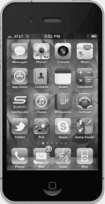

**图 19-4.** *ShakeAndBreak 应用看起来人畜无害……*

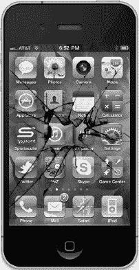

**图 19-5.** *……但只要对它太过粗暴——哦，不！*

**注意：** 为了完整起见，我们在项目归档中包含了基于内置摇晃检测方法的 ShakeAndBreak 修改版。你可以在项目归档中名为 *19 - ShakeAndBreak - Motion Methods* 的文件夹里找到它。其中的魔法在于 `BIDViewController` 的 `motionEnded:withEvent:` 方法。

在 Xcode 中使用 *Single View Application* 模板创建一个新项目。将这个新项目命名为 *ShakeAndBreak*。在项目归档的 *19 - ShakeAndBreak* 文件夹中，我们提供了此应用所需的两个图像文件和一个声音文件。将 *home.png*、*homebroken.png* 和 *glass.wav* 拖拽到你的项目中。该文件夹中还有一个 *icon.png* 文件，也一并添加到项目中。

接下来，展开 *Supporting Files* 文件夹，选择 *ShakeAndBreak-Info.plist* 以打开属性列表编辑器。我们需要向属性列表中添加一个条目，告诉我们的应用不要使用状态栏。首先，在属性列表编辑器中任意位置右键单击（或按住 Control 键单击），然后从上下文菜单中选择 *Show Raw Keys/Values* 选项，这样你就能看到我们所设置配置的真实名称。单击属性列表中的任意一行，然后按回车键添加一个新行。将新行的 *Key* 改为 *UIStatusBarHidden*。该行的 *Value* 默认为 *NO*，将其改为 *YES*。最后，展开名为 *CFBundleIconFiles* 的数组条目，按回车键添加一个新的 *String* 项。在 *Value* 列中输入 *icon.png*（参见图 19-6）。

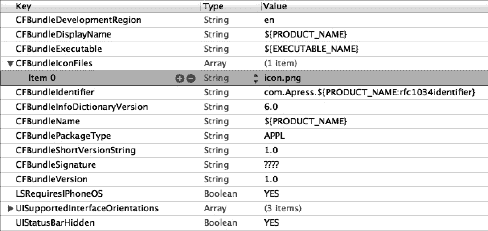

**图 19-6.** *更改 CFBundleIconFiles（高亮显示）和 UIStatusBarHidden（属性列表最后一行）的值*

现在，我们开始创建视图控制器。我们需要创建一个指向图像视图的出口，以便能够更改显示的图像。我们还需要几个 `UIImage` 实例来保存两张图片，一个用于引用声音的声音 ID，以及一个用于跟踪屏幕是否需要重置的布尔值。单击 *BIDViewController.h*，并添加以下代码：

```
#import <UIKit/UIKit.h>
#import <CoreMotion/CoreMotion.h>
#import <AudioToolbox/AudioToolbox.h>

#define kAccelerationThreshold       1.7
#define kUpdateInterval              (1.0f/10.0f)

@interface BIDViewController : UIViewController
    <UIAccelerometerDelegate>

@property (weak, nonatomic) IBOutlet UIImageView *imageView;
@property (strong, nonatomic) CMMotionManager *motionManager;
@property (assign, nonatomic) BOOL brokenScreenShowing;
@property (assign, nonatomic) SystemSoundID soundID;
@property (strong, nonatomic) UIImage *fixed;
@property (strong, nonatomic) UIImage *broken;
@end
```

保存头文件。现在，选择 *BIDViewController.xib* 以在 Interface Builder 中编辑该文件。单击 *View* 图标以选择视图，然后调出属性检查器，将 *Simulated Metrics* 下的 *Status Bar* 弹出菜单从 *Gray* 更改为 *None*。接下来，从库中拖拽一个 *Image View* 到布局区域中的视图上。图像视图应自动调整大小以充满整个窗口，因此只需将其放置好，使其完美契合在窗口内。

从 *File’s Owner* 图标按住 Control 键拖拽到图像视图，并选择 *imageView* 出口。然后保存 nib 文件。

接下来，选择 *BIDViewController.m* 文件，并在文件顶部附近添加以下代码：

```
#import "BIDViewController.h"

@implementation BIDViewController
@synthesize imageView;
@synthesize motionManager;
@synthesize brokenScreenShowing;
@synthesize soundID;
@synthesize fixed;
@synthesize broken;
.
.
.
```

为 `viewDidLoad` 方法提供以下实现：

```
- (void) viewDidLoad {
    [super viewDidLoad];
    // 在这里进行加载视图后的额外设置，通常来自 nib 文件。

    NSString *path = [[NSBundle mainBundle] pathForResource:@"glass"
                                                     ofType:@"wav"];
    NSURL *url = [NSURL fileURLWithPath:path];
    AudioServicesCreateSystemSoundID((__bridge CFURLRef)url,
                                      &soundID);
    self.fixed = [UIImage imageNamed:@"home.png"];
    self.broken = [UIImage imageNamed:@"homebroken.png"];

    imageView.image = fixed;

    self.motionManager = [[CMMotionManager alloc] init];
    motionManager.accelerometerUpdateInterval = kUpdateInterval;
    NSOperationQueue *queue = [[NSOperationQueue alloc] init];
    [motionManager startAccelerometerUpdatesToQueue:queue
                                        withHandler:
     ^(CMAccelerometerData *accelerometerData, NSError *error){
        if (error) {
            [motionManager stopAccelerometerUpdates];
        } else {
            if (!brokenScreenShowing) {
                CMAcceleration acceleration = accelerometerData.acceleration;
                if (acceleration.x > kAccelerationThreshold
                    || acceleration.y > kAccelerationThreshold
                    || acceleration.z > kAccelerationThreshold) {
                    [imageView performSelectorOnMainThread:@selector(setImage:)
                                                withObject:broken
                                             waitUntilDone:NO];
                    AudioServicesPlaySystemSound(soundID);
                    brokenScreenShowing = YES;
                }
            }
        }
    }];
}
```

将以下几行代码插入现有的 `viewDidUnload` 方法中：

```
- (void)viewDidUnload
{
    [super viewDidUnload];
    // 释放主视图的任何保留子视图。
    // 例如：self.myOutlet = nil;
    self.imageView = nil;
    self.motionManager = nil;
    self.fixed = nil;
    self.broken = nil;
}
```

最后，在文件底部添加以下新方法：

```
.
.
.
#pragma mark -
- (void)touchesBegan:(NSSet *)touches withEvent:(UIEvent *)event {
    imageView.image = fixed;
    brokenScreenShowing = NO;
}

@end
```

我们实现的第一个方法，也是大多数有趣事情发生的方法，是 `viewDidLoad`。首先，我们创建一个指向声音文件的 `NSURL` 对象，将其加载到内存中，并将分配好的标识符保存在 `soundID` 实例变量中。为了满足 ARC 的要求，我们需要告诉编译器如何管理 `NSURL` 对象的内存，然后再将其传递给 `AudioServicesCreateSystemSoundID()`，我们通过使用 `__bridge` 限定符对其进行转换来实现这一点。


`NSString *path = [[NSBundle mainBundle] pathForResource:@"glass"`  
`                                                     ofType:@"wav"];`  
`NSURL *url = [NSURL fileURLWithPath:path];`  
`AudioServicesCreateSystemSoundID((__bridge CFURLRef)url,`  
`                                     &soundID);`

**注意：** 对`__bridge`限定符不熟悉？它在第 7 章中讨论过。简而言之，它用于安全桥接到 ARC。

然后我们将两张图像加载到内存中。

`self.fixed = [UIImage imageNamed:@"home.png"];`  
`self.broken = [UIImage imageNamed:@"homebroken.png"];`

最后，我们将`imageView`设置为显示未损坏的截图，并将`brokenScreenShowing`设置为`NO`，以指示当前不需要重置屏幕。

`imageView.image = fixed;`  
`brokenScreenShowing = NO;`

然后我们创建一个`CMMotionManager`和一个`NSOperationQueue`（就像之前做的那样），并启动加速度计，向其发送一个每次加速度计值变化时运行的块。

`self.motionManager = [[CMMotionManager alloc] init];`  
`motionManager.accelerometerUpdateInterval = kUpdateInterval;`  
`NSOperationQueue *queue = [[NSOperationQueue alloc] init];`  
`[motionManager startAccelerometerUpdatesToQueue:queue`  
`                                        withHandler:`

如果块发现加速度计值高到足以触发破碎，它会使`imageView`切换到破碎图像并开始播放破碎声音。请注意，`imageView`是`UIImageView`类的成员，该类与 UIKit 的大部分组件一样，只应在主线程中运行。由于块可能在另一个线程中运行，我们强制`imageView`更新发生在主线程上。

`^(CMAccelerometerData *accelerometerData, NSError *error){`  
`    if (error) {`  
`        [motionManager stopAccelerometerUpdates];`  
`    } else {`  
`        if (!brokenScreenShowing) {`  
`            CMAcceleration acceleration = accelerometerData.acceleration;`  
`            if (acceleration.x > kAccelerationThreshold`  
`                || acceleration.y > kAccelerationThreshold`  
`                || acceleration.z > kAccelerationThreshold) {`  
`                [imageView performSelectorOnMainThread:@selector(setImage:)`  
`                                            withObject:broken`  
`                                         waitUntilDone:NO];`  
`                AudioServicesPlaySystemSound(soundID);`  
`                brokenScreenShowing = YES;`  
`            }`  
`        }`  
`    }`  
`}];`

最后一个方法是你现在应该非常熟悉的。它在屏幕被触摸时调用。我们在这个方法中所做的只是将图像设置回未损坏的屏幕，并将`brokenScreenShowing`设置回`NO`。

`imageView.image = fixed;`  
`brokenScreenShowing = NO;`

最后，添加`CoreMotion.framework`以及`AudioToolbox.framework`，以便我们能够播放声音文件。你可以按照本章前面的说明将框架链接到你的应用程序中。

编译并运行应用程序，进行测试。对于那些无法在 iOS 设备上运行此应用程序的人，你可能想试试基于摇动事件的版本。模拟器不模拟加速度计硬件，但它确实模拟了摇动事件，因此`19ShakeAndBreak - Motion Method`中的应用程序版本可以在模拟器中运行。

去玩一玩吧。完成后，请回来，你将看到如何使用加速度计作为游戏和其他程序的控制器。

### 加速度计作为方向控制器

通常，在游戏中，加速度计用于替代按钮来控制角色或对象的移动。例如，在赛车游戏中，像转动方向盘一样扭转 iOS 设备可以控制转向，向前倾斜可能加速，向后倾斜可能刹车。

如何使用加速度计作为控制器将根据游戏的具体机制而有很大差异。在最简单的情况下，你可能只需要从某个轴获取值，乘以一个数字，然后将其添加到被控制对象的坐标上。在更复杂、物理模拟更真实的游戏中，你需要根据加速度计返回的值对被控制对象的速度进行调整。

使用加速度计作为控制器的一个棘手方面是，委托方法不保证在你指定的时间间隔回调。如果你告诉运动管理器每秒读取加速度计 60 次，你能确定的只是它不会每秒更新超过 60 次。你不能保证每秒获得 60 个均匀间隔的更新。因此，如果你基于加速度计的输入进行动画制作，你必须跟踪更新之间经过的时间，并将其纳入方程中，以确定物体移动的距离。


#### 滚动弹珠

接下来的小把戏中，我们将让你通过倾斜 iPhone 来在屏幕上移动精灵。这是一个使用加速度传感器接收输入的简单范例。我们将使用 Quartz 2D 处理动画。

**注意：** 通常来说，当开发需要流畅动画的游戏或其他程序时，你可能更倾向于使用 OpenGL ES。本应用采用 Quartz 2D 是为了简化操作并减少与加速度传感器使用无关的代码量。虽然动画流畅度不及 OpenGL，但工作量会大幅减少。

在本应用中，当你倾斜 iPhone 时，弹珠会像在桌面上滚动（见图 19–7）。向左倾斜手机，弹珠向左滚动；倾斜角度越大，滚动速度越快；回正手机时，弹珠会减速并开始朝反方向运动。

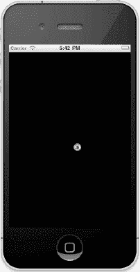

**图 19–7.** *弹珠应用让你可以在屏幕上滚动弹珠。*

在 Xcode 中，使用 *Single View Application* 模板创建新项目，并将其命名为 *Ball*。在项目归档的 *19 - Ball* 文件夹中，找到名为 *ball.png* 的图片文件，将其拖入你的项目中。

现在，单击 *Ball* 文件夹，选择 **File**  **New**  **New File…**。从 *Cocoa Touch* 类别中选择 *Objective-C class*，点击 Next，将新类命名为 `BIDBallView`。在 *Subclass of* 下拉菜单中选择 `UIView`，点击 *Create* 保存类文件。稍后我们将回来编辑这个类。

选择 *BIDViewController.xib* 在 Interface Builder 中编辑文件。单击 *View* 图标，使用身份检查器将视图的类从 `UIView` 改为 `BIDBallView`。接着切换到属性检查器，将视图的 *Background* 改为 *Black Color*，然后保存 nib 文件。

现在该编辑 *BIDViewController.h* 了。我们只需要在此处准备 Core Motion 框架，因此进行以下修改：

```
#import <UIKit/UIKit.h>
#import <CoreMotion/CoreMotion.h>

@interface BIDViewController : UIViewController

@property (strong, nonatomic) CMMotionManager *motionManager;
@end
```

接下来，切换到 *BIDViewController.m*，在文件顶部附近添加以下代码行：

```
#import "BIDViewController.h"
#import "BIDBallView.h"

#define kUpdateInterval    (1.0f / 60.0f)

@implementation BIDViewController
@synthesize motionManager;
.
.
.
```

然后，用以下代码填充 `viewDidLoad`：

```
- (void)viewDidLoad {
    [super viewDidLoad];
    // Do any additional setup after loading the view, typically from a nib.

    self.motionManager = [[CMMotionManager alloc] init];
    NSOperationQueue *queue = [[NSOperationQueue alloc] init];
    motionManager.accelerometerUpdateInterval = kUpdateInterval;
    [motionManager startAccelerometerUpdatesToQueue:queue withHandler:
     ^(CMAccelerometerData *accelerometerData, NSError *error) {
         [(BIDBallView *)self.view setAcceleration:accelerometerData.acceleration];
         [self.view performSelectorOnMainThread:@selector(update)
            withObject:nil waitUntilDone:NO];
     }];
}
```

这里的 `viewDidLoad` 方法与本章其他地方的实现类似。主要区别在于我们将更新间隔声明为更高的每秒 60 次。在告诉运动管理器在有加速度数据更新时执行的代码块中，我们将加速度对象传递给视图，然后调用名为 `update` 的方法，该方法根据加速度和自上次更新以来消耗的时间更新弹珠在视图中的位置。由于该代码块可能在任意线程中执行，而属于 UIKit 对象（包括 `UIView`）的方法只能安全地在主线程中使用，因此我们再次强制 `update` 方法在主线程中被调用。


### 编写“球体视图”

请注意，在上一节输入`viewDidLoad`的代码时，你可能会因为`BIDBallView`类不完整而看到一些错误。由于我们将在`BIDBallView`类中完成大部分工作，最好现在就来编写它，对吧？选择`BIDBallView.h`文件，并进行以下修改：

```
#import <UIKit/UIKit.h>
#import <CoreMotion/CoreMotion.h>

@interface BIDBallView : UIView
@property (strong, nonatomic) UIImage *image;
@property CGPoint currentPoint;
@property CGPoint previousPoint;
@property (assign, nonatomic) CMAcceleration acceleration;
@property CGFloat ballXVelocity;
@property CGFloat ballYVelocity;
- (void)update;
@end
```

让我们逐一查看这些属性，并讨论每个属性的用途。第一个属性是一个`UIImage`，它将指向我们要在屏幕上移动的精灵。

```
    UIImage *image;
```

之后，我们跟踪了两个`CGPoint`变量。`currentPoint`属性将保存球体的当前位置。我们还会记录上一次绘制精灵的位置。这样，我们就可以构建一个更新矩形，同时包含球体的新位置和旧位置，从而在新位置绘制它，并在旧位置擦除它。

```
    CGPoint    currentPoint;
    CGPoint    previousPoint;
```

接下来是一个`acceleration`结构体，我们将通过它从控制器获取加速度计信息。

```
    CMAcceleration acceleration;
```

我们还有两个变量，用于跟踪球体在二维空间中的当前速度。虽然这不会是一个非常复杂的模拟，但我们确实希望球体能以类似真实球体的方式运动。我们将在下一节计算球体的运动。我们将从加速度计获取加速度，并利用这些变量在两个轴上跟踪速度。

```
    CGFloat ballXVelocity;
    CGFloat ballYVelocity;
```

现在，切换到`BIDBallView.m`文件，编写代码来绘制并在屏幕上移动球体。首先，在`BIDBallView.m`文件的顶部进行以下修改：

```
#import "BIDBallView.h"

@implementation BIDBallView
@synthesize image;
@synthesize currentPoint;
@synthesize previousPoint;
@synthesize acceleration;
@synthesize ballXVelocity;
@synthesize ballYVelocity;

- (id)initWithCoder:(NSCoder *)coder {
    if (self = [super initWithCoder:coder]) {
        self.image = [UIImage imageNamed:@"ball.png"];
        self.currentPoint = CGPointMake((self.bounds.size.width / 2.0f) +
            (image.size.width / 2.0f),
            (self.bounds.size.height / 2.0f) + (image.size.height / 2.0f));
        ballXVelocity = 0.0f;
        ballYVelocity = 0.0f;
    }
    return self;
}
.
.
.
```

现在，取消注释被注释掉的`drawRect:`方法，并给出如下简单实现：

```
- (void)drawRect:(CGRect)rect {
    // 绘制代码
    [image drawAtPoint:currentPoint];
}
```

然后在类末尾添加以下方法：

```
.
.
.
#pragma mark -
- (CGPoint)currentPoint {
    return currentPoint;
}

- (void)setCurrentPoint:(CGPoint)newPoint {
    previousPoint = currentPoint;
    currentPoint = newPoint;

    if (currentPoint.x < 0) {
        currentPoint.x = 0;
        ballXVelocity = 0;
    }
    if (currentPoint.y < 0){
        currentPoint.y = 0;
        ballYVelocity = 0;
    }
    if (currentPoint.x > self.bounds.size.width - image.size.width) {
        currentPoint.x = self.bounds.size.width - image.size.width;
        ballXVelocity = 0;
    }
    if (currentPoint.y > self.bounds.size.height - image.size.height) {
        currentPoint.y = self.bounds.size.height - image.size.height;
        ballYVelocity = 0;
    }

    CGRect currentImageRect = CGRectMake(currentPoint.x, currentPoint.y,
             currentPoint.x + image.size.width,
             currentPoint.y + image.size.height);
    CGRect previousImageRect = CGRectMake(previousPoint.x, previousPoint.y,
              previousPoint.x + image.size.width,
              currentPoint.y + image.size.width);
    [self setNeedsDisplayInRect:CGRectUnion(currentImageRect,
        previousImageRect)];
}

- (void)update {
    static NSDate *lastUpdateTime;

    if (lastUpdateTime != nil) {
        NSTimeInterval secondsSinceLastDraw =
           -([lastUpdateTime timeIntervalSinceNow]);

        ballYVelocity = ballYVelocity + -(acceleration.y *
            secondsSinceLastDraw);
        ballXVelocity = ballXVelocity + acceleration.x *
            secondsSinceLastDraw;

        CGFloat xAcceleration = secondsSinceLastDraw * ballXVelocity * 500;
        CGFloat yAcceleration = secondsSinceLastDraw * ballYVelocity * 500;

        self.currentPoint = CGPointMake(self.currentPoint.x +
            xAcceleration, self.currentPoint.y + yAcceleration);
    }
    // 用当前时间更新上一次时间
    lastUpdateTime = [[NSDate alloc] init];
}
@end
```

首先要注意的是，我们的一个属性声明为`@synthesize`，但在代码中我们又实现了该属性的修改方法。这没问题。`@synthesize`指令不会覆盖你编写的访问器或修改器方法；它只会填补空白，并提供你没有编写的方法。


#### 计算球的移动

我们手动处理 `currentPoint` 属性，因为当 `currentPoint` 发生变化时，我们需要做一些清理工作，比如确保球没有滚出屏幕。我们稍后会查看那个方法。现在，让我们看看类中的第一个方法 `initWithCoder:`。

回顾一下，当你从 nib 文件加载视图时，该类的 `init` 或 `initWithFrame:` 方法永远不会被调用。Nib 文件包含归档对象，因此从 nib 加载的任何实例都将使用 `initWithCoder:` 方法进行初始化。如果我们需要执行任何额外的初始化，则必须在该方法中进行。

在这个视图中，我们确实有一些额外的初始化，所以重写了 `initWithCoder:`。首先，我们加载 *ball.png* 图片。其次，我们计算视图的中心并将其设为球的起始点，并将两个轴上的速度都设为 0。

```
self.image = [UIImage imageNamed:@"ball.png"];
self.currentPoint = CGPointMake((self.bounds.size.width / 2.0f) +
    (image.size.width / 2.0f), (self.bounds.size.height / 2.0f) +
    (image.size.height / 2.0f));

ballXVelocity = 0.0f;
ballYVelocity = 0.0f;
```

我们的 `drawRect:` 方法再简单不过了。我们只需将 `initWithCoder:` 中加载的图片绘制在 `currentPoint` 存储的位置上。`currentPoint` 的访问器是一个标准的访问器方法。然而，`setCurrentPoint:` 的修改器则是另一回事了。

在 `setCurrentPoint:` 中，我们首先将旧的 `currentPoint` 值存储到 `previousPoint` 中，并将新值赋给 `currentPoint`。

```
previousPoint = currentPoint;
currentPoint = newPoint;
```

接下来，我们进行边界检查。如果球的 `x` 或 `y` 位置小于 0，或者大于屏幕的宽度或高度（已考虑图片的宽度和高度），则停止该方向的加速度。

```
if (currentPoint.x < 0) {
    currentPoint.x = 0;
    ballXVelocity = 0;
}
if (currentPoint.y < 0){
    currentPoint.y = 0;
    ballYVelocity = 0;
}
if (currentPoint.x > self.bounds.size.width - image.size.width) {
    currentPoint.x = self.bounds.size.width - image.size.width;
    ballXVelocity = 0;
}
if (currentPoint.y > self.bounds.size.height - image.size.height) {
    currentPoint.y = self.bounds.size.height - image.size.height;
    ballYVelocity = 0;
}
```

**提示：** 想让球以更自然的方式从墙上弹开，而不是直接停止吗？这很容易做到。只需将 `setCurrentPoint:` 中当前为 `ballXVelocity = 0;` 的两行代码改为 `ballXVelocity = - (ballXVelocity / 2.0);`。并将当前为 `ballYVelocity = 0;` 的两行代码改为 `ballYVelocity = - (ballYVelocity / 2.0);`。通过这些更改，我们不再消除球的速度，而是将其减半并设置为相反方向。现在，球将以一半的速度朝相反方向移动。

之后，我们根据图片尺寸计算两个 `CGRect`。一个矩形包含新图片将要绘制的区域，另一个包含上一次绘制图片的区域。我们将使用这两个矩形来确保在绘制新球的同时擦除旧球。

```
CGRect currentImageRect = CGRectMake(currentPoint.x, currentPoint.y,
          currentPoint.x + image.size.width,
          currentPoint.y + image.size.height);
CGRect previousImageRect = CGRectMake(previousPoint.x, previousPoint.y,
          previousPoint.x + image.size.width,
          currentPoint.y + image.size.width);
```

最后，我们创建一个新的矩形，它是我们刚刚计算的两个矩形的并集，并将其传递给 `setNeedsDisplayInRect:`，以指示视图中需要重绘的部分。

```
[self setNeedsDisplayInRect:CGRectUnion(currentImageRect,
    previousImageRect)];
```

我们类中最后一个实质性的方法是 `update`，它用于计算球的正确新位置。当控制器类的加速计方法将新的加速度对象传递给视图后，会调用此方法。该方法首先声明一个静态的 `NSDate` 变量，用于记录自上次调用 `update` 方法以来经过的时间。第一次执行此方法时，`lastUpdateTime` 为 `nil`，我们不做任何操作，因为没有参考点。由于更新频率大约为每秒 60 次，没有人会注意到单独一帧的缺失。

```
static NSDate *lastUpdateTime;
if (lastUpdateTime != nil) {
```

在之后的每次调用中，我们计算自上次调用该方法以来经过的时间。我们对 `timeIntervalSinceNow` 返回的值取反，因为 `lastUpdateTime` 是过去的时间，所以返回的值将是一个负数，表示当前时间与 `lastUpdateTime` 之间的秒数。

```
NSTimeInterval secondsSinceLastDraw =
        -([lastUpdateTime timeIntervalSinceNow]);
```

接下来，我们通过将当前加速度加到当前速度上来计算两个方向的新速度。我们将加速度乘以 `secondsSinceLastDraw`，以确保加速度随时间保持一致。以相同角度倾斜手机时，始终会产生相同的加速度。

```
ballYVelocity = ballYVelocity + -(acceleration.y *
       secondsSinceLastDraw);
ballXVelocity = ballXVelocity + acceleration.x *
       secondsSinceLastDraw;
```

之后，我们根据速度计算出上次方法调用以来实际的像素变化。将速度与经过时间的乘积乘以 500，以产生看起来自然的移动。如果不乘以某个值，加速度将非常缓慢，仿佛球被卡在糖浆里一样。

```
CGFloat xAcceleration = secondsSinceLastDraw * ballXVelocity * 500;
CGFloat yAcceleration = secondsSinceLastDraw * ballYVelocity * 500;
```

一旦我们知道了像素变化量，就将当前位置与计算出的加速度相加，创建一个新点，并将其赋给 `currentPoint`。通过使用 `self.currentPoint`，我们调用之前编写的那个访问器方法，而不是直接将值赋给实例变量。

```
self.currentPoint = CGPointMake(self.currentPoint.x +
    xAcceleration, self.currentPoint.y + yAcceleration);
```

至此计算结束，剩下的就是用当前时间更新 `lastUpdateTime`。

```
lastUpdateTime = [[NSDate alloc] init];
```

在构建应用程序之前，使用前面提到的技术添加 Core Motion 框架。添加完成后，继续构建并运行该应用程序。

**注意：** 不幸的是，Ball 在模拟器上不会有太多动作。如果你想体验 Ball 完全遵循重力的趣味效果，你需要加入付费的 iOS 开发者计划，并将其安装到自己的设备上。

如果一切顺利，应用程序将启动，你应该能够通过倾斜手机来控制球的运动。当球到达屏幕边缘时，它应该会停止。将手机向另一方向倾斜，球将开始向另一方向滚动。呼，真好玩！


### 滚动前行

好吧，我们在本章中确实借助物理原理以及 iOS 强大的加速计和陀螺仪玩得很开心。我们创建了一个很棒的愚人节恶作剧，你也初步了解了如何将加速计用作控制设备。利用加速计和陀螺仪的应用可能性几乎和宇宙一样无穷无尽。既然你已经掌握了基础知识，那就去创造些酷炫的东西，给我们一个惊喜吧！

等你准备好了，我们将开始使用 iOS 的另一个硬件功能：内置摄像头。

# 第 20 章

## 摄像头与照片库

到现在为止，你应该不会对 iPhone、iPad 和 iPod touch 拥有内置摄像头以及一款名为“照片”的便捷应用来管理你拍摄的所有精彩照片和视频感到惊讶。但你可能不知道的是，你的程序可以利用内置摄像头来拍照。你的应用程序还可以允许用户从设备上已存储的媒体中进行选择。本章我们将探讨这两种功能。

### 使用图像选择器和 `UIImagePickerController`

由于 iOS 应用程序的沙盒机制，应用程序通常无法访问其沙盒外部的照片或其他数据。幸运的是，摄像头和媒体库都可以通过图像选择器提供给您的应用程序使用。

顾名思义，图像选择器是一种允许你从指定源中选择图像的机制。当这个类首次出现在 iOS 中时，它仅用于图像。如今，你也可以用它来捕获视频。

通常，图像选择器会使用图像和/或视频列表作为其来源（参见图 20-1 左侧）。不过，你可以指定选择器使用摄像头作为其来源（参见图 20-1 右侧）。

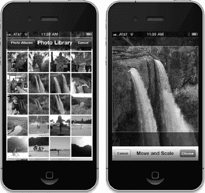

**图 20-1.** *运行中的图像选择器。向用户展示一系列图像（左图），用户选择图像后，可以移动和缩放该图像（右图）。*

图像选择器界面是通过一个名为 `UIImagePickerController` 的模态控制器类来实现的。你需要创建这个类的一个实例，指定一个委托（尽管你可能已经料到这一点），指定其图像来源以及你是想让用户选择图像还是视频，然后以模态方式启动它。图像选择器将接管设备控制权，让用户从现有媒体库中选择一张图片或一段视频，或者使用摄像头拍摄一张新图片或一段新视频。一旦用户做出选择，你可以给用户提供进行基本编辑的机会，例如缩放或裁剪图像，或者修剪视频片段。所有这些行为都由 `UIImagePickerController` 实现，因此你实际上不需要在此处承担太多繁重的工作。

假设用户没有按下取消按钮，用户拍摄或从库中选择的图像或视频将被传送到你的委托中。无论用户是选择了媒体文件还是取消，你的委托都有责任关闭 `UIImagePickerController`，以便用户可以返回到你的应用程序。

创建 `UIImagePickerController` 非常简单。你只需要像大多数类一样分配并初始化一个实例即可。但有一个问题。并非所有运行 iOS 的设备都有摄像头。早期的 iPod touch 是第一个例子，第一代 iPad 是最新的例子，但未来苹果的生产线上可能还会推出更多此类设备。在创建 `UIImagePickerController` 实例之前，你需要检查程序当前运行的设备是否支持你想要使用的图像源。例如，在让用户使用摄像头拍照之前，你应该确保程序运行在带有摄像头的设备上。你可以通过使用 `UIImagePickerController` 的类方法来检查，如下所示：

```
if ([UIImagePickerController isSourceTypeAvailable:
     UIImagePickerControllerSourceTypeCamera]) {
```

在这个例子中，我们传递了 `UIImagePickerControllerSourceTypeCamera` 来表明我们要让用户使用内置摄像头拍照或拍摄视频。如果指定的源当前可用，`isSourceTypeAvailable:` 方法会返回 `YES`。除了 `UIImagePickerControllerSourceTypeCamera` 之外，你还可以指定另外两个值：

- `UIImagePickerControllerSourceTypePhotoLibrary` 指定用户应从现有媒体库中选择图像或视频。该图像将被返回到你的委托。
- `UIImagePickerControllerSourceTypeSavedPhotosAlbum` 指定用户将从现有照片库中选择图像，但选择范围将仅限于最近的相机胶卷。此选项可在没有摄像头的设备上运行，但不会执行任何有用的操作。

在确保你的程序运行的设备支持你想要使用的图像源之后，启动图像选择器就相对容易了：

```
UIImagePickerController *picker = [[UIImagePickerController alloc] init];
picker.delegate = self;
picker.sourceType = UIImagePickerControllerSourceTypeCamera;
[self presentModalViewController:picker animated:YES];
```

在我们创建并配置好 `UIImagePickerController` 之后，我们使用从 `UIView` 继承来的方法 `presentModalViewController:animated:` 来向用户呈现图像选择器。

**提示：** `presentModalViewController:animated:` 方法不仅限于呈现图像选择器。你可以通过在当前可见视图的视图控制器上调用此方法，以模态方式向用户呈现任何视图控制器。


### 实现图像选择器控制器代理

您希望在使用图像选择器界面后收到通知的对象，需要遵循 `UIImagePickerControllerDelegate` 协议。该协议定义了两个方法：`imagePickerController:didFinishPickingMediaWithInfo:` 和 `imagePickerControllerDidCancel:`。

当用户成功拍摄照片或视频，或从媒体库中选择项目时，会调用 `imagePickerController:didFinishPickingMediaWithInfo:` 方法。第一个参数是指向您之前创建的 `UIImagePickerController` 的指针。第二个参数是一个 `NSDictionary` 实例，其中包含所选照片或所选视频的 URL，以及可选编辑信息（如果您启用了编辑功能并且用户确实进行了编辑）。该字典还将包含存储在键 `UIImagePickerControllerOriginalImage` 下的原始未编辑图像。以下是一个检索原始图像的代理方法示例：

```
- (void)imagePickerController:(UIImagePickerController *)picker
didFinishPickingMediaWithInfo:(NSDictionary *)info {

    UIImage *selectedImage = [info objectForKey:UIImagePickerControllerEditedImage];
    UIImage *originalImage = [info objectForKey:UIImagePickerControllerOriginalImage];

    // 对 selectedImage 和 originalImage 进行处理

    [picker dismissModalViewControllerAnimated:YES];
}
```

`editingInfo` 字典还会通过存储在键 `UIImagePickerControllerCropRect` 下的 `NSValue` 对象，告知您编辑过程中选择了整个图像的哪一部分。您可以像这样将此字符串转换为 `CGRect`：

```
   NSValue *cropValue = [editingInfo objectForKey:UIImagePickerControllerCropRect];
   CGRect cropRect = [cropValue CGRectValue];
```

转换之后，`cropRect` 将指定编辑过程中所选原始图像的部分。如果您不需要此信息，可以忽略它。

**注意：** 如果返回给代理的图像来自相机，则该图像不会存储在照片库中。如有必要，保存该图像是您应用程序的责任。

另一个代理方法 `imagePickerControllerDidCancel:` 在用户决定取消流程而未拍摄或选择任何媒体时被调用。当图像选择器调用此代理方法时，它只是通知您用户已完成了选择器的操作且未选择任何内容。

`UIImagePickerControllerDelegate` 协议中的两个方法都被标记为可选的，但实际上并非如此，原因如下：必须告知像图像选择器这样的模态视图去解除自身。因此，即使您在用户取消图像选择器时无需执行任何特定于应用程序的操作，您仍然需要解除该选择器。为了使程序正常运行，您的 `imagePickerControllerDidCancel:` 方法至少需要如下所示：

```
-  (void)imagePickerControllerDidCancel:(UIImagePickerController *)picker {

     [picker dismissModalViewControllerAnimated:YES];
}
```

### 实地测试相机和照片库

在本章中，我们将构建一个应用程序，允许用户使用相机拍摄照片或视频，或从照片库中选择一个，然后将所选内容显示在屏幕上（参见 图 20–2）。如果用户使用的设备没有相机，我们将隐藏“*新照片或视频*”按钮，仅允许从照片库中进行选择。

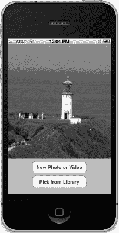

**图 20–2.** *运行中的相机应用程序*

在 Xcode 中使用“*单视图应用程序*”模板创建一个新项目，并将应用程序命名为 *Camera*。在处理代码本身之前，我们需要添加应用程序将使用的几个框架。使用您在之前章节中学到的技巧，添加 *MediaPlayer* 和 *MobileCoreServices* 框架。

我们将在该应用程序的视图控制器中添加几个属性。需要一个属性指向图像视图，以便我们可以用图像选择器返回的图像来更新它。我们还需要一个属性指向“*新照片或视频*”按钮，以便在设备没有相机时隐藏该按钮。

由于我们将允许用户决定是获取视频还是图像，我们将使用 `MPMoviePlayerController` 类来显示所选视频，因此我们需要一个属性用于此目的。另外两个属性用于跟踪最后选择的图像和视频，以及一个字符串来确定最后选择的是视频还是图像。最后，我们将跟踪图像视图的大小，以便调整捕获的图像以匹配我们的显示尺寸。

我们还需要两个操作方法：一个用于“*新照片或视频*”按钮，另一个用于让用户从照片库中选择现有图片。

展开 *Camera* 文件夹，以便能够访问所有相关文件。选择 *BIDViewController.h*，并进行以下修改：

```
#import <UIKit/UIKit.h>
#import <MediaPlayer/MediaPlayer.h>

@interface BIDViewController : UIViewController
        <UIImagePickerControllerDelegate, UINavigationControllerDelegate>

@property (weak, nonatomic) IBOutlet UIImageView *imageView;
@property (weak, nonatomic) IBOutlet UIButton *takePictureButton;
@property (strong, nonatomic) MPMoviePlayerController *moviePlayerController;
@property (strong, nonatomic) UIImage *image;
@property (strong, nonatomic) NSURL *movieURL;
@property (copy, nonatomic) NSString *lastChosenMediaType;
@property (assign, nonatomic) CGRect imageFrame;

- (IBAction)shootPictureOrVideo:(id)sender;
- (IBAction)selectExistingPictureOrVideo:(id)sender;
@end
```

您可能首先注意到，我们实际上使我们的类遵循了两个不同的协议：`UIImagePickerControllerDelegate` 和 `UINavigationControllerDelegate`。由于 `UIImagePickerController` 是 `UINavigationController` 的子类，我们必须使我们的类遵循这两个协议。`UINavigationControllerDelegate` 中的方法是可选的，并且我们不需要它们中的任何一个来使用图像选择器，但我们需要遵循该协议，否则编译器会发出警告。

您可能注意到的另一件事是，虽然我们将使用 `UIImageView` 的实例来显示所选图像，但我们没有类似的东西来显示所选视频。UIKit 不包含任何像 `UIImageView` 那样可用于显示视频内容的公开可用类，因此，我们将使用 `MPMoviePlayerController` 的实例，获取其 `view` 属性并将其插入到我们的视图层级中。这是一种非常不寻常的使用视图控制器的方式，但它实际上是 Apple 认可的、在视图层级中显示视频的技术。

其他所有内容都非常直接，因此保存它。现在，选择 *BIDViewController.xib* 以在 Interface Builder 中编辑该文件。


### 设计界面

从库中拖拽两个`Round Rect Buttons`到标记为*View*的窗口中，将它们上下排列，使下方的按钮与底部蓝色参考线对齐。双击顶部按钮，将其标题设置为*New Photo or Video*。接着双击底部按钮，将其标题设置为*Pick from Library*。然后，从库中拖拽一个`Image View`，并将其放置在按钮上方。将图像视图扩展至按钮上方视图的整个空间，如图 20–2 所示。

现在，按住 Control 键从*File’s Owner*图标拖拽至图像视图，选择`imageView`插座变量。再次从*File’s Owner*拖拽至*New Photo or Video*按钮，选择`takePictureButton`插座变量。

接下来，选择*New Photo or Video*按钮，打开连接检查器。从*Touch Up Inside*事件拖拽至*File’s Owner*，选择`shootPictureOrVideo:`动作。然后，点击*Pick from Library*按钮，从连接检查器中的*Touch Up Inside*事件拖拽至*File’s Owner*，选择`selectExistingPictureOrVideo:`动作。

完成这些连接后，保存更改并返回 Xcode。

### 实现相机视图控制器

选择`BIDViewController.m`，在文件开头进行以下修改：

```
#import "BIDViewController.h"
#import <MobileCoreServices/UTCoreTypes.h>

@interface BIDViewController ()
static UIImage *shrinkImage(UIImage *original, CGSize size);
- (void)updateDisplay;
- (void)getMediaFromSource:(UIImagePickerControllerSourceType)sourceType;
@end

@implementation BIDViewController
.
.
.
```

正如本书前文多次提到的，我们创建一个类扩展来声明一些方法，这些方法我们不希望暴露在类的接口中，但会在后续的类定义中实现。这里放置的方法都是工具方法，仅供类内部使用。请注意，我们还在代码中声明了一个普通的 C 函数。严格来说，类扩展只能包含方法，因此这个函数实际上并不属于类扩展。但从代码结构的角度看，它“属于”我们的类，因此我们也会在此列出它。

接下来，开始定义类如下：

```
.
.
.
@implementation BIDViewController
@synthesize imageView;
@synthesize takePictureButton;
@synthesize moviePlayerController;
@synthesize image;
@synthesize movieURL;
@synthesize lastChosenMediaType;
@synthesize imageFrame;

- (void)viewDidLoad
{
    [super viewDidLoad];
    // Do any additional setup after loading the view, typically from a nib.

    if (![UIImagePickerController isSourceTypeAvailable:
          UIImagePickerControllerSourceTypeCamera]) {
        takePictureButton.hidden = YES;
    }
    imageFrame = imageView.frame;
}
.
.
.
- (void)viewDidAppear:(BOOL)animated
{
    [super viewDidAppear:animated];
    [self updateDisplay];
}
.
.
.
```

如果当前运行的设备没有摄像头，`viewDidLoad`方法会隐藏`takePictureButton`，同时它还会获取图像视图的框架矩形，因为稍后我们会用到它。我们还实现了`viewDidAppear:`方法，让它调用尚未实现的`updateDisplay`方法。

理解`viewDidLoad`和`viewDidAppear:`方法之间的区别非常重要。前者仅在视图刚加载到内存时调用一次，后者则在每次视图显示时调用——包括启动时，以及当我们显示另一个全屏视图（如图像选择器）后返回控制器时。

接下来，在现有的`viewDidUnload`方法中插入以下代码行。通常，`viewDidUnload`仅释放视图，但在这个例子中，我们还将用它来释放`moviePlayerController`。否则，即使没有视图可以展示该控制器，它也会一直驻留。

```
.
.
.
- (void)viewDidUnload
{
    [super viewDidUnload];
    // Release any retained subviews of the main view.
    // e.g. self.myOutlet = nil;
    self.imageView = nil;
    self.takePictureButton = nil;
    self.moviePlayerController = nil;
}
.
.
.
```

接着，插入我们在头文件中声明的以下动作方法：

```
- (IBAction)shootPictureOrVideo:(id)sender {
    [self getMediaFromSource:UIImagePickerControllerSourceTypeCamera];
}

- (IBAction)selectExistingPictureOrVideo:(id)sender {
    [self getMediaFromSource:UIImagePickerControllerSourceTypePhotoLibrary];
}
```

每个方法都简单地调用了我们之前声明的（但尚未定义的）工具方法之一，并传入一个由`UIImagePickerController`定义的常量值，以指定图片或视频的来源。

接下来，让我们实现选择器视图的委托方法：


```objectivec
#pragma mark UIImagePickerController 代理方法

- (void)imagePickerController:(UIImagePickerController *)picker
        didFinishPickingMediaWithInfo:(NSDictionary *)info {
    self.lastChosenMediaType = [info objectForKey:UIImagePickerControllerMediaType];
    if ([lastChosenMediaType isEqual:(NSString *)kUTTypeImage]) {
        UIImage *chosenImage = [info objectForKey:UIImagePickerControllerEditedImage];
        UIImage *shrunkenImage = shrinkImage(chosenImage, imageFrame.size);
        self.image = shrunkenImage;
    } else if ([lastChosenMediaType isEqual:(NSString *)kUTTypeMovie]) {
        self.movieURL = [info objectForKey:UIImagePickerControllerMediaURL];
    }
    [picker dismissModalViewControllerAnimated:YES];
}

- (void)imagePickerControllerDidCancel:(UIImagePickerController *)picker {
    [picker dismissModalViewControllerAnimated:YES];
}
```

第一个代理方法检查用户选择的是图片还是视频，记录下选择内容（如果选择了图片，则将其缩小到精确适配显示尺寸），然后关闭模态图片选择器。第二个代理方法仅负责关闭图片选择器。

接下来，我们来处理在文件开头通过类扩展声明的函数和方法。首先是 `shrinkImage()` 函数，它用于将图片缩小到我们即将展示它的视图尺寸。这样做既能减小 `UIImage` 的大小，也能降低 `imageView` 显示图片所需的内存。将以下代码添加到文件末尾：

```objectivec
#pragma mark  -
static UIImage *shrinkImage(UIImage *original, CGSize size) {
    CGFloat scale = [UIScreen mainScreen].scale;
    CGColorSpaceRef colorSpace = CGColorSpaceCreateDeviceRGB();

    CGContextRef context = CGBitmapContextCreate(NULL, size.width*scale,
        size.height*scale, 8, 0, colorSpace, kCGImageAlphaPremultipliedFirst);
    CGContextDrawImage(context,
        CGRectMake(0, 0, size.width*scale, size.height*scale),
        original.CGImage);
    CGImageRef shrunken = CGBitmapContextCreateImage(context);
    UIImage *final = [UIImage imageWithCGImage:shrunken];

    CGContextRelease(context);
    CGImageRelease(shrunken);

    return final;
}
```

不必过于纠结细节。这里展示的是一系列 Core Graphics 调用，它们基于指定尺寸创建新图像，并将旧图像渲染到新图像中。

注意，我们从设备的**主屏幕**获取了一个名为 `scale` 的值，并在指定新图像尺寸时将其作为乘数使用。这个缩放比例本质上就是我们在所有调用中每单位点对应的物理屏幕像素数。配备“**Retina 显示屏**”的设备（如 iPhone 4、iPhone 4S 和第四代 iPod touch）的缩放比例为 2.0；而所有其他早期设备以及目前发布的两个 iPad 版本，该值均为 1.0。以这种方式使用缩放比例，可以让我们创建出以当前设备全分辨率渲染的图像。否则，图像在 iPhone 4 上可能会显得有点锯齿（如果你凑近看的话）。

接下来是 `updateDisplay` 方法。请记住，该方法由 `viewDidAppear:` 方法调用，而 `viewDidAppear:` 既会在视图首次创建时被调用，也会在用户选择图片或视频并关闭图片选择器后再次被调用。由于这种双重用途，它需要进行一些检查来确认当前状态，并据此设置图形用户界面。`MPMoviePlayerController` 不允许我们更改其读取的 URL，因此每次要显示视频时，都需要创建一个新的控制器。所有这些逻辑都在此方法中处理。将以下代码添加到文件底部附近：

```objectivec
- (void)updateDisplay {
    if ([lastChosenMediaType isEqual:(NSString *)kUTTypeImage]) {
        imageView.image = image;
        imageView.hidden = NO;
        moviePlayerController.view.hidden = YES;
    } else if ([lastChosenMediaType isEqual:(NSString *)kUTTypeMovie]) {
        [self.moviePlayerController.view removeFromSuperview];
        self.moviePlayerController = [[MPMoviePlayerController alloc]
            initWithContentURL:movieURL];
        moviePlayerController.view.frame = imageFrame;
        moviePlayerController.view.clipsToBounds = YES;
        [self.view addSubview:moviePlayerController.view];
        imageView.hidden = YES;
    }
}
```

最后一个新方法是 `getMediaFromSource:`，我们两个操作方法都会调用它。这个方法相当简单。它只是创建并配置一个图片选择器，利用传入的 `sourceType` 来决定是调出相机还是媒体库。将以下代码添加到文件底部附近：

```objectivec
- (void)getMediaFromSource:(UIImagePickerControllerSourceType)sourceType {
    NSArray *mediaTypes = [UIImagePickerController
        availableMediaTypesForSourceType:sourceType];
    if ([UIImagePickerController isSourceTypeAvailable:
         sourceType] && [mediaTypes count] > 0) {
        NSArray *mediaTypes = [UIImagePickerController
            availableMediaTypesForSourceType:sourceType];
        UIImagePickerController *picker =
        [[UIImagePickerController alloc] init];
        picker.mediaTypes = mediaTypes;
        picker.delegate = self;
        picker.allowsEditing = YES;
        picker.sourceType = sourceType;
        [self presentModalViewController:picker animated:YES];
     }else {
        UIAlertView *alert = [[UIAlertView alloc]
                              initWithTitle:@"访问媒体出错"
                              message:@"设备不支持该媒体源。"
                              delegate:nil
                              cancelButtonTitle:@"讨厌！"
                              otherButtonTitles:nil];
        [alert show];
    }
}
@end
```

所有工作就完成了。编译并运行应用程序。如果你在模拟器上运行，将无法选择拍摄新照片。如果有机会在真实设备上运行我们的应用，尽管去试试吧。你应该能够拍摄新照片，并且通过捏合手势放大和缩小照片。

如果在点击**使用照片**按钮之前放大了图像，那么裁剪后的图像将会通过代理方法返回给应用程序。

### 轻而易举！

信不信由你，要让用户用相机拍照并让应用使用这些照片，只需这些步骤。如果你愿意，甚至可以让用户对图像进行少量编辑。

在下一章中，我们将探讨如何通过让 iOS 应用易于翻译成其他语言，来触及更广泛的受众。*准备好了吗？翻到下一页，继续前进。来吧，来吧！*

# 第 21 章


## 应用本地化

在撰写本文时，iPhone 已可在超过 90 个不同的国家购买，而且这一数字还将持续增长。如今，除了南极洲，你可以在各大洲购买并使用 iPhone。iPad 的普及曾稍有滞后，因为苹果最初优先满足其认为最重要国家的需求，但现在 iPad 也已销往全球，几乎和 iPhone 一样无处不在。

如果你计划通过 App Store 发布应用，你的潜在市场将远不止于本国使用母语的用户。幸运的是，iOS 拥有强大的 `localization` 架构，让你不仅能轻松地将应用翻译（或委托他人翻译）成多种语言，还能翻译成同一语言的不同方言。你想为英国的英语用户提供与美国英语用户不同的术语吗？没问题。

也就是说，只要你的代码编写正确，本地化就不是难题。对现有应用进行改造以支持本地化，远比从一开始就以这种方式编写应用困难得多。在本章中，我们将演示如何编写易于本地化的代码，然后逐步对示例应用进行本地化。

### 本地化架构

当运行一个未经本地化的应用时，应用中的所有文本都将以开发者自己的语言显示，这种语言也被称为 `development base language`。

当开发者决定对应用进行本地化时，他们会在应用包中为每种支持的语言创建一个子目录。每个语言的子目录中都包含部分被翻译成该语言的应用资源。每个子目录被称为 `localization project` 或 `localization folder`。本地化文件夹的名称始终以扩展名 `.lproj` 结尾。

在 iOS 的“设置”应用中，用户可以设置设备的首选语言和地区格式。例如，如果用户的语言是英语，可选的地区可能包括美国、澳大利亚和香港——所有讲英语的地区。

当一个本地化应用需要加载资源（如图片、属性列表或 nib 文件）时，应用会检查用户的语言和地区设置，并寻找与之匹配的本地化文件夹。如果找到，它将加载该资源的本地化版本，而不是基础版本。

对于选择法语作为 iOS 语言、法国作为地区的用户，应用会首先寻找名为 `fr_FR.lproj` 的本地化文件夹。文件夹名称的前两个字母代表法语的国家代码 ISO。下划线后的两个字母则是代表法国的 ISO 代码。

如果应用无法通过两位字母代码找到匹配项，它会尝试使用该语言的三位字母 ISO 代码进行匹配。在我们的例子中，如果应用找不到名为 `fr_FR.lproj` 的文件夹，它会寻找名为 `fre_FR` 或 `fra_FR` 的本地化文件夹。

所有语言都至少有一个三位字母代码。有些语言拥有两个三位字母代码：一个用于该语言的英文拼写，另一个用于其本土拼写。只有部分语言拥有两位字母代码。当一种语言同时拥有两位和三位字母代码时，优先使用两位字母代码。

**注意：** 你可以在 ISO 官方网站 ([`http://www.iso.org/iso/country_codes.htm`](http://www.iso.org/iso/country_codes.htm)) 上找到当前的 ISO 国家代码列表。两位和三位字母代码都属于 ISO 3166 标准的一部分。

如果应用找不到完全匹配的文件夹，它会接着在应用包中寻找仅匹配语言代码（不包含地区代码）的本地化文件夹。因此，继续以上述来自法国的法语使用者为例，应用接下来会寻找名为 `fr.lproj` 的本地化项目。如果找不到，它会寻找 `fre.lproj`，然后是 `fra.lproj`。如果都没找到，它会检查 `French.lproj`。最后这种结构是为了支持旧版 Mac OS X 应用而存在的，一般来说应避免使用。

如果应用没有找到与语言/地区组合或仅语言匹配的语言项目，它将使用开发基础语言的资源。如果它找到了合适的本地化项目，则在需要任何资源时，都会优先在该项目中寻找。例如，如果你使用 `imageNamed:` 加载 `UIImage`，应用会首先在本地化项目中查找指定名称的图片。如果找到，就使用该图片；否则，它将回退使用基础语言的资源。

如果一个应用有多个匹配的本地化项目——例如，一个名为 `fr_FR.lproj` 的项目和一个名为 `fr.lproj` 的项目——它会在更具体的匹配项中优先查找，即此处的 `fr_FR.lproj`。如果在那里找不到资源，它会在 `fr.lproj` 中查找。这使你能够将所有该语言使用者通用的资源放在一个语言项目中，仅对受方言或地理区域差异影响的资源进行本地化。

你应该只对受语言或国家影响的资源进行本地化。例如，如果你的应用中有一张没有文字且含义具有普适性的图片，则无需对其进行本地化。

### 字符串文件

源代码中的字符串字面量和字符串常量该如何处理呢？思考一下上一章中的这段源代码：

```
   UIAlertView *alert = [[UIAlertView alloc]
       initWithTitle:@"Error accessing photo library"
             message:@"Device does not support a photo library"
            delegate:nil
   cancelButtonTitle:@"Drat!"
   otherButtonTitles:nil];
   [alert show];
```

如果你已不辞辛劳地为特定用户群体本地化了应用，你当然不希望向他们展示以开发基础语言编写的警告。解决方案是将这些字符串存储在名为 `strings files` 的特殊文本文件中。

#### 字符串文件中有什么？

字符串文件不过是包含一系列字符串对的 Unicode (UTF-16) 文本文件，每对字符串都由一个注释标识。以下是一个字符串文件在你应用中可能的样子：

```
/* Used to ask the user his/her first name */
"First Name" = "First Name";

/* Used to get the user's last name */
"Last Name" = "Last Name";

/* Used to ask the user's birth date */
"Birthday" = "Birthday";
```

位于 `/*` 和 `*/` 之间的值是给翻译人员的注释。它们在应用中不会被使用，你可以选择不加，但添加它们是个好主意。这些注释提供了上下文，说明某个特定字符串在应用中是如何使用的。

你会注意到，每一行都将同一个字符串列出了两次。等号左侧的字符串充当键，无论使用何种语言，它始终包含相同的值。等号右侧的值则是被翻译成当地语言的那一个。因此，上述字符串文件本地化为法语后，可能看起来像这样：

```
/* Used to ask the user his/her first name */
"First Name " = "Prénom";

/* Used to get the user's last name */
"Last Name " = "Nom de famille";

/* Used to ask the user's birth date */
"Birthday" = "Anniversaire";
```


#### 本地化字符串宏

实际上，你不需要手动创建字符串文件。相反，你需要在代码中将每个可本地化的文本字符串嵌入到一个特殊的宏中。当源代码最终定稿并准备进行本地化时，你将运行一个名为 `genstrings` 的命令行程序，它会搜索所有代码文件中该宏的出现位置，提取出所有唯一的字符串，并将它们嵌入到一个可本地化的字符串文件中。

我们来看看这个宏是如何工作的。首先，这是一个传统的字符串声明：

`NSString *myString = @"First Name";`

要使其可本地化，需要改为这样：

`NSString *myString = NSLocalizedString(@"First Name", @"Used to ask the user his/her first name");`

`NSLocalizedString` 宏包含两个参数：

*   第一个参数是基础语言中的字符串值。如果没有本地化文件，应用程序将使用该字符串。
*   第二个参数用作字符串文件中的注释。

`NSLocalizedString` 会在应用程序包内，针对相应的本地化项目，查找名为 `localizable.strings` 的字符串文件。如果找不到该文件，它会返回第一个参数，并且该字符串将以开发基础语言显示。在开发过程中，字符串通常只会以基础语言显示，因为应用程序尚未进行本地化。

如果 `NSLocalizedString` 找到了字符串文件，它会在文件中搜索与第一个参数匹配的行。在上述示例中，`NSLocalizedString` 会搜索字符串文件中 `"First Name"` 这一项。如果在与用户语言设置匹配的本地化项目中找不到匹配项，它会接着在基础语言的字符串文件中查找并使用那里的值。如果没有字符串文件，它就会直接使用你传递给 `NSLocalizedString` 宏的第一个参数。

现在你已经了解了本地化架构和字符串文件的工作原理，接下来让我们看看实际的本地化操作。

### 真实世界的 iOS：本地化你的应用程序

我们将创建一个小的应用程序，用于显示用户当前的**语言区域**。语言区域（`NSLocale` 的一个实例）表示用户的语言和区域。系统会使用它来决定与用户交互时使用哪种语言，以及如何显示日期、货币和时间等信息。创建完应用程序后，我们将把它本地化为其他语言。你将学习如何本地化 nib 文件、字符串文件、图像，甚至应用程序的显示名称。

你可以在图 21-1 中看到我们的应用程序效果。顶部的名称来自用户的语言区域设置。视图左侧的文字是在 nib 文件中设置的静态标签。右侧的文字是通过输出口以编程方式设置的。屏幕底部的旗帜图像是一个静态的 `UIImageView`。

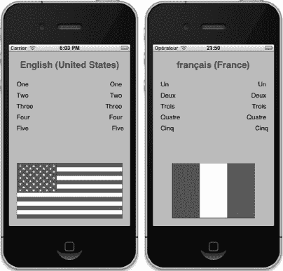

**图 21-1.** *展示了两种不同语言/区域设置下的 LocalizeMe 应用程序*

让我们马上开始吧。

#### 设置 LocalizeMe

在 Xcode 中使用 *Single View Application* 模板创建一个新项目，并将其命名为 *LocalizeMe*。

如果你查看源码归档文件，在 *21 - LocalizeMe* 文件夹内，会看到一个名为 *Images* 的文件夹。在该文件夹内部，你会找到两个文件夹，一个名为 *English*，另一个名为 *French*，每个文件夹都包含一个名为 `flag.png` 的文件。一个版本的旗帜是美国国旗，另一个是法国国旗。

首先，将 `flag.png` 的英文版本拖入项目导航器的 *LocalizeMe* 文件夹。当提示时，将该文件的副本添加到项目中。我们会在本章后续部分处理法文版本的旗帜文件。

现在，让我们为项目添加一些标签输出口。我们需要为总共六个标签创建输出口：一个用于视图顶部的蓝色标题，另外五个用于视图右侧的文字（参见图 21-1）。选择 `BIDViewController.h`，并进行如下更改：

```
#import <UIKit/UIKit.h>

@interface BIDViewController : UIViewController

@property (weak, nonatomic) IBOutlet UILabel *localeLabel;
@property (weak, nonatomic) IBOutlet UILabel *label1;
@property (weak, nonatomic) IBOutlet UILabel *label2;
@property (weak, nonatomic) IBOutlet UILabel *label3;
@property (weak, nonatomic) IBOutlet UILabel *label4;
@property (weak, nonatomic) IBOutlet UILabel *label5;
@end
```

现在选择 `BIDViewController.xib` 文件，在 Interface Builder 中编辑 GUI。确保 *View* 窗口可见，然后从库中拖出一个 *Label*，将其放在视图顶部，与顶部的蓝色参考线对齐。调整标签大小，使其占据视图的整个宽度，从一条蓝色参考线到另一条。选中标签，打开属性检查器。找到 *Font* 控件，点击其包含的小 *T* 图标，打开一个小的字体选择弹出窗口。点击 *System Bold*，让这个标题标签与其他的标签稍显不同。然后使用属性检查器将文本对齐方式设置为居中，并将文本颜色设置为亮蓝色。如果需要，你也可以使用字体选择器来放大字体大小。只要在对象属性检查器中选中了 *Autoshrink*，当文本过长无法容纳时，其大小将自动调整。

放置好标签后，按住 Control 键从 *File’s Owner* 图标拖拽到这个新标签上，并选择 `localeLabel` 输出口。

接下来，从库中再拖出五个 *Label*，使用蓝色参考线将它们放置在左边缘，一个在另一个上方（参见图 21-1）。调整标签的大小，使其大约跨越视图的一半宽度，或者更少一点。双击最上面的标签，将其文本从 *Label* 改为 *One*。对其余四个标签重复此操作，将文本改为 *Two* 到 *Five*。

再从库中拖出五个 *Label*，这次将它们放置在右边缘。使用对象属性检查器将文本对齐方式改为右对齐，并增大标签尺寸，使其从右侧蓝色参考线延伸到视图中间位置。按住 Control 键从 *File’s Owner* 拖拽到五个新标签中的每一个，并将每个连接到一个不同编号的标签输出口。现在，双击每一个新标签，并删除其文本。我们将通过编程方式设置这些值。


最后，从库中拖拽一个`Image View`到视图底部，使其紧贴底部和左侧的蓝色参考线。在属性检查器中，为视图的`Image`属性选择`flag.png`，并将图片调整为从蓝色参考线拉伸到蓝色参考线。在属性检查器中，将`Mode`属性从当前值改为`Aspect Fit`。并非所有旗帜都具有相同的宽高比，我们需要确保图片的本地化版本显示正确。选择此选项后，图像视图会自动调整放入其中的其他图片尺寸以适应显示，同时保持正确的宽高比（高度与宽度的比例）。最后，将旗帜放大，直到它触及右侧的蓝色参考线。

保存你的 nib 文件。然后切换到`BIDViewController.m`，在文件顶部插入以下代码：

```objc
#import "BIDViewController.h"

@implementation BIDViewController
@synthesize localeLabel;
@synthesize label1;
@synthesize label2;
@synthesize label3;
@synthesize label4;
@synthesize label5;
.
.
.
```

现在，为`viewDidLoad`方法提供以下实现：

```objc
- (void)viewDidLoad
{
    [super viewDidLoad];
    // 加载视图后执行任何额外的设置，通常从 nib 文件加载。

    NSLocale *locale = [NSLocale currentLocale];
    NSString *displayNameString = [locale
        displayNameForKey:NSLocaleIdentifier
        value:[locale localeIdentifier]];
    localeLabel.text = displayNameString;

    label1.text = NSLocalizedString(@"One", @"数字 1");
    label2.text = NSLocalizedString(@"Two", @"数字 2");
    label3.text = NSLocalizedString(@"Three", @"数字 3");
    label4.text = NSLocalizedString(@"Four", @"数字 4");
    label5.text = NSLocalizedString(@"Five", @"数字 5");
}
```

此外，在现有的`viewDidUnload`方法中添加以下代码：

```objc
- (void)viewDidUnload
{
    [super viewDidUnload];
    // 释放主视图的任何保留子视图。
    // 例如：self.myOutlet = nil;
    self.localeLabel = nil;
    self.label1 = nil;
    self.label2 = nil;
    self.label3 = nil;
    self.label4 = nil;
    self.label5 = nil;
}
```

这个类中唯一值得注意的方法是`viewDidLoad`。我们首先获取一个代表用户当前语言区域的`NSLocale`实例，它可以告诉我们用户在 iPhone 的“设置”应用中设置的语言和区域偏好。

```objc
NSLocale *locale = [NSLocale currentLocale];
```

下一行代码可能需要一些解释。`NSLocale`的工作方式类似于字典。它可以提供关于当前用户偏好的大量信息，包括货币名称和期望的日期格式。你可以在`NSLocale` API 参考文档中找到所有可检索信息的完整列表。

在这行代码中，我们正在检索**语言区域标识符**，即此语言区域所代表的语言和/或区域的名称。我们使用了一个名为`displayNameForKey:value:`的函数。此方法的目的是以特定语言返回我们所请求项的值。

例如，法语的显示名称在法语中是*Français*，但在英语中是*French*。这个方法使你能检索任何语言区域的数据，以便向任何用户适当显示。在这里，我们正以该语言区域本身的语言获取其显示名称，这就是为什么我们在第二个参数中传递了`[locale localeIdentifier]`。`localeIdentifier`是一个字符串，其格式与我们之前创建语言项目时使用的格式相同。对于美国英语使用者，它是`en_US`；对于来自法国的法语使用者，它是`fr_FR`。

```objc
NSString *displayNameString = [locale
              displayNameForKey:NSLocaleIdentifier
              value:[locale localeIdentifier]];
```

获取显示名称后，我们用它来设置视图顶部的标签。

```objc
localeLabel.text = displayNameString;
```

接下来，我们将另外五个标签设置为以开发基础语言拼写的数字一到五。我们还提供了注释来说明每个单词的含义。如果单词含义明确（就像这里的例子），你也可以只传递一个空字符串，但在第二个参数中传递的任何字符串都会在字符串文件中变成注释，因此你可以用这个注释与进行翻译的人员沟通。

```objc
label1.text = NSLocalizedString(@"One", @"数字 1");
label2.text = NSLocalizedString(@"Two", @"数字 2");
label3.text = NSLocalizedString(@"Three", @"数字 3");
label4.text = NSLocalizedString(@"Four", @"数字 4");
label5.text = NSLocalizedString(@"Five", @"数字 5");
```

现在让我们运行应用程序。

### 试用 LocalizeMe

你可以使用模拟器或真机来测试`LocalizeMe`。模拟器似乎会缓存一些语言和区域设置，因此如果你有条件，最好在真机上运行该应用程序。应用程序启动后，应该会像图 21-2 所示。

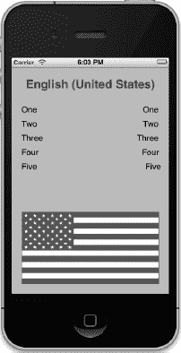

**图 21-2.** *在作者基础语言下运行的应用程序。我们的应用已为本地化做好准备，但尚未实际本地化。*

通过使用`NSLocalizedString`宏而不是静态字符串，我们已为本地化做好了准备，但尚未真正实现本地化。如果你在模拟器或 iPhone 上使用“设置”应用切换到另一种语言或区域，结果除了视图顶部的标签外，看起来基本相同（参见图 21-3）。

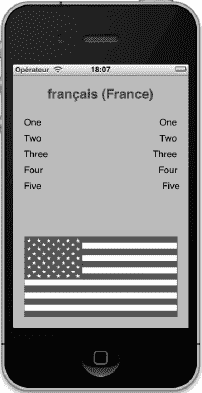

**图 21-3.** *在设置为法国法语的 iPhone 上运行的非本地化应用程序*


#### 本地化 Nib 文件

现在，让我们来本地化 nib 文件。本地化任何文件的基本过程都是相同的。在 Xcode 中，单击`BIDViewController.xib`，然后选择 **显示**  **工具**  **显示文件检查器** 打开文件检查器，查看 nib 文件的详细信息。

**注意：** Xcode 允许你本地化导航器中的几乎所有文件。但“能”不代表“应该”。永远不要本地化源代码文件。这样做会导致编译错误，因为会创建多个同名的目标文件。

在文件检查器中找到 *本地化* 部分。你会看到它显示一个本地化语言：*英文*。点击 *本地化* 部分底部的加号（`+`）按钮，在出现的弹出列表中选择 *法文 (fr)*（参见 图 21–4）。

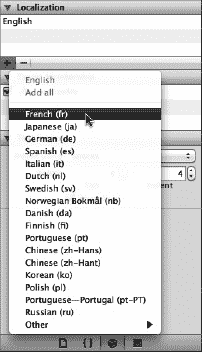

**图 21–4.** 文件检查器显示 `BIDViewController.xib` 的本地化及其他信息

添加本地化后，查看项目导航器。注意，`BIDViewController.xib` 文件现在旁边有一个展开三角形，就像它是一个组或文件夹一样。展开它，查看一下（参见 图 21–5）。

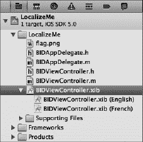

**图 21–5.** 可本地化文件有一个展开三角形，以及你添加的每种语言或地区的子项

在我们的项目中，`BIDViewController.xib` 现在显示为一个包含两个子项的组：一个标记为 *英文*，另一个标记为 *法文*。*英文* 版本是在你创建项目时自动创建的，它代表你的开发基础语言。

这些文件中的每一个都位于单独的文件夹中，一个名为`en.lproj`，另一个名为`fr.lproj`。前往访达，打开 *LocalizeMe* 项目文件夹中的 *LocalizeMe* 文件夹。除了所有项目文件外，你应该会看到名为`en.lproj`和`fr.lproj`的文件夹（参见 图 21–6）。

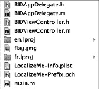

**图 21–6.** 从一开始，我们的 Xcode 项目就包含一个基础语言的语言项目文件夹。当我们选择使一个文件可本地化时，Xcode 也为所选语言创建了一个语言项目文件夹。

请注意，`en.lproj` 文件夹一直存在，其中包含 `BIDViewController.xib` 的副本。当 Xcode 发现某个资源只有一个本地化版本时，它将显示为单个项目。一旦一个文件有两个或更多本地化版本，它们就会显示为一个组。

**提示：** 处理区域设置时，语言代码是小写的，但国家/地区代码是大写的。因此，法语语言项目的正确名称是 `fr.lproj`，但巴黎法语（法国人说的法语）的项目是 `fr_FR.lproj`，而不是 `fr_fr.lproj` 或 `FR_fr.lproj`。iOS 文件系统区分大小写，因此正确匹配大小写非常重要。

当你要求 Xcode 创建法语本地化时，Xcode 会在你的项目文件夹中创建一个名为 `fr.lproj` 的新本地化项目，并将 `BIDViewController.xib` 的副本放入该文件夹。在 Xcode 的项目导航器中，`BIDViewController.xib` 现在应该有两个子项：*英文* 和 *法文*。选择 *法文* 打开将显示给法语用户的 nib 文件。

在 Interface Builder 中打开的 nib 文件看起来完全和你之前构建的一样，因为你刚刚创建的 nib 文件是之前那个的副本。你对这个文件所做的任何更改都会显示给说法语的人。双击左侧的每个标签，将它们从 *一*、*二*、*三*、*四* 和 *五* 改为 *Un*、*Deux*、*Trois*、*Quatre* 和 *Cinq*。然后保存 nib。

你的 nib 现在已本地化为法语。编译并运行程序。启动后，点击主页按钮。

如果你已经将设置更改为法语区域和语言，你应该会看到左侧的翻译标签。对于那些不太确定如何进行这些更改的人，我们将逐步引导你完成。

在模拟器中，前往“设置”应用程序，选择 *通用* 行，然后选择标有 *国际* 的行。在这里，你可以更改语言和区域偏好设置（参见 图 21–7）。

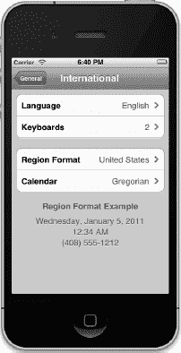

**图 21–7.** 更改语言和区域——这两个设置会影响用户的区域设置

你应该先更改 *区域格式*，因为一旦更改了语言，iOS 将重置并返回主屏幕。将 *区域格式* 从 *美国* 更改为 *法国*（先选择 *法文*，然后从新出现的表中选择 *法国*），然后将 *语言* 从 *英文* 更改为 *Français*。点击 *完成* 按钮，模拟器将重置其语言。现在，你的手机已设置为使用法语。

再次运行你的应用。这次，左侧的文字应该会以法语显示（参见 图 21–8）。但标志和右侧的文本列仍然是错误的。我们先处理标志。

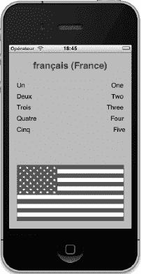

**图 21–8.** 应用程序现已部分翻译成法语。


#### 本地化图片

我们可以直接在 nib 文件中更改国旗图片，只需在法文本地化的 nib 文件中为图片视图选择不同的图片即可。不过，我们不打算这样做，而是选择对国旗图片本身进行本地化。

当 nib 文件使用的图片或其他资源被本地化后，nib 会自动显示对应语言的正确版本（不过，在撰写本文时，还不支持方言）。如果我们为 `flag.png` 文件本身提供法文版本并进行本地化，那么 nib 就会在适当的时候自动显示正确的国旗。

首先，退出模拟器，并确保你的应用程序已停止运行。回到 Xcode，在项目导航器中单击 `flag.png`。接着，调出文件检查器，找到 `Localization`（本地化）部分，目前它是空的。确保 `flag.png` 仍处于选中状态，然后点击 `Localization` 部分底部的 `+` 按钮。Xcode 会为文件添加一个 `English`（英文）本地化版本，并将 `flag.png` 移动到 `en.lproj` 文件夹中（你可以在访达中自行查看确认）。

**注意：** 在当前版本的 Xcode 4.2 中，此处图形用户界面似乎有一个小缺陷。当选中 `flag.png` 后，按照我们刚才描述的方法点击 `+` 按钮，会导致文件被取消选中，从而使检查器突然进入未选中任何项目的状态。但别担心；它实际上已经正确地完成了工作。只需在项目导航器中再次选中 `flag.png`，然后继续操作即可。

你会看到，在项目导航器中 `flag.png` 的旁边仍然没有显示展开三角形，这表明它还不是一个已本地化的资源。这是因为我们现在仍然只有一个版本，存放在 `en.lproj` 中，就像 `BIDViewController.xib` 刚开始时那样。

确保 `flag.png` 仍处于选中状态，使用文件检查器的 `Localization` 部分添加一个新的本地化版本。这次当弹出列表出现时，你会看到列表顶部有 `English` 和 `French` 两个选项，因为 Xcode 知道项目中已经存在这两种语言。选择 `French`（法文），你会看到 `flag.png` 立即多了一个展开图标。展开它，你会看到两个国旗文件：一个标记为 `English`（英文），另一个标记为 `French`（法文）。

切换回访达和你的项目目录，你会看到文件系统中也反映了同样的状况： `en.lproj` 和 `fr.lproj` 文件夹中各包含一个 `flag.png` 文件。`fr.lproj` 中的文件是原文件的一个副本，显然这不是我们需要的正确图片。由于 Xcode 不允许你直接编辑图片文件，将正确图片添加到本地化项目中最简单的方法就是使用访达直接将其复制到项目中。

转到 `21 - LocalizeMe` 文件夹，打开 `Images` 文件夹，再打开 `French` 文件夹，用该文件夹中的 `flag.png` 文件替换你在 `LocalizeMe/fr.lproj` 中找到的 `flag.png` 文件。

这样就完成了。操作结束。回到 Xcode，在项目导航器中点击图片文件 `flag.png (French)`。你应该能看到法国国旗。

现在，尝试再次运行应用程序。我们希望你能看到类似于图 21-9 中所示的画面。如果没有，不要灰心。很可能是美国国旗图片被模拟器或设备（如果你是直接运行在设备上）缓存了。下面我们将介绍几种你可以尝试的方法来获取正确的图片。

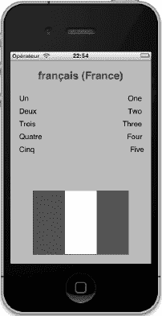

**图 21-9.** *国旗图片和应用程序 nib 文件现在都已本地化为法文。*

如果你是在模拟器中运行，首先退出应用程序（但*不是*退出模拟器）。点击 Xcode 并停止应用程序。返回模拟器，选择 **iOS 模拟器**  **重置内容和设置** 来重置模拟器，然后退出模拟器。返回 Xcode，选择 **产品**  **清空** 以强制完全重新构建。现在，再次运行应用程序。重新运行应用程序后，你需要重新设置区域和语言，才能让法国国旗出现。如果这仍然不起作用，尝试执行模拟器重置，退出模拟器，执行一次 **产品**  **清空**，退出 Xcode，然后重新启动整个流程。

如果你是在设备上运行，你的 iPhone 可能缓存了上次运行应用程序时的美国国旗。你可以使用 Xcode 的 `Organizer`（管理器）窗口从 iPhone 上删除旧应用程序。选择 **窗口**  **管理器** 调出 `Organizer` 窗口。在 `Devices`（设备）标签下，左侧会有一列显示所有 Xcode 已知的 iOS 设备。当前连接的设备名称旁边会有一个绿色圆点。选择属于你设备的 `Applications`（应用程序）项，你会看到一个列表，里面是你自己编译并安装的所有应用程序。在列表中找到 `LocalizeMe`，选中它，然后点击减号 (−) 按钮，以删除该应用程序的旧版本及其相关的缓存。现在，选择 **项目**  **清空**。完成后，再次构建并运行应用程序。应用程序启动后，你需要先重新设置区域，然后再设置语言。现在，法国国旗应该出现了，左侧也应该显示法文单词（参见图 21-9）。


#### 生成并本地化字符串文件

在图 21-9 中，请注意视图右侧的单词仍然是英文。为了翻译这些单词，我们需要生成基础语言的字符串文件，然后进行本地化。为此，我们需要暂时离开 Xcode 这个舒适的环境。

启动位于`/Applications/Utilities/`目录下的`终端.app`。当终端窗口打开后，输入`cd`并加一个空格。**先不要按回车键**。

现在，前往访达（Finder），将项目文件夹`21 - LocalizeMe`拖拽到终端窗口中。当您将文件夹拖放到终端窗口时，项目文件夹的路径应该会出现在命令行上。然后，按回车键。`cd`命令在 Unix 术语中意为“更改目录”，因此您刚才的操作是将终端会话从其默认目录切换到您的项目目录。

下一步是运行`genstrings`程序，并让它找到`Classes`文件夹中所有`.m`文件里出现的`NSLocalizedString`。为此，请键入以下命令，然后按回车：

```
genstrings ./LocalizeMe/*.m
```

当命令执行完毕后（对于这么小的项目，只需一秒钟），您会返回到命令行。在访达中，查看项目文件夹，找到一个名为`Localizable.strings`的新文件。将其拖拽到 Xcode 项目导航器的`LocalizeMe`文件夹中，但在弹出提示时，先不要点击`添加`按钮。首先取消选中“如果需要，将项目复制到目标组的文件夹中”这个复选框，因为该文件已经在您的项目文件夹中了。点击`完成`以导入文件。

**注意：** 您可以随时重新运行`genstrings`来重新创建您的基础语言文件，但是一旦您将字符串文件本地化为另一种语言，就*不能*更改任何`NSLocalizedString()`宏中使用的文本。该字符串的基础语言版本作为检索翻译的键，因此如果您更改了它们，将找不到翻译后的版本，您需要要么更新本地化后的字符串文件，要么重新进行翻译。

文件导入后，单击 `Localizable.strings` 文件，查看其内容。它包含五个条目，因为我们五次使用了 `NSLocalizedString`，且传入了五个不同的值。我们作为第二个参数传入的值成为了每个字符串的注释。

字符串是按字母顺序生成的。在这个例子中，由于我们处理的是数字，按字母顺序排列并不是最直观的展示方式，但在大多数情况下，按字母顺序排列会很有帮助。

```
/* 数字 5 */
"Five" = "Five";

/* 数字 4 */
"Four" = "Four";

/* 数字 1 */
"One" = "One";

/* 数字 3 */
"Three" = "Three";

/* 数字 2 */
"Two" = "Two";
```

让我们来把这个“家伙”本地化。

确保选中了 `Localizable.strings`，然后重复我们为其他本地化所执行的步骤：

*   如果文件检查器（File inspector）未显示，请打开它。
*   在`本地化`部分，点击`+`按钮一次以创建英文本地化。这可能会取消选中该文件，但会创建英文本地化。
*   重新选中 `Localizable.strings`。然后再次点击`+`按钮来创建法文本地化。

回到项目导航器，选择该文件的法文本地化版本。在编辑器中，进行以下更改：

```
/* 数字 5 */
"Five" = "Cinq";

/* 数字 4 */
"Four" = "Quatre";

/* 数字 1 */
"One" = "Un";

/* 数字 3 */
"Three" = "Trois";

/* 数字 2 */
"Two" = "Deux";
```

在现实应用中（除非您通晓多种语言），您通常会将这个文件发送给翻译服务，让他们翻译等号右侧的值。在这个简单的例子中，凭借多年来观看《芝麻街》积累的知识，我们可以自己完成翻译工作。

现在，保存、编译并运行应用。您应该会看到相关的数字被翻译成了法文。

#### 本地化应用显示名称

我们想向您展示最后一个常用的本地化工作：本地化在主屏幕和其他地方可见的应用名称。苹果公司为几个内置应用做了这件事，您可能也想这样做。

用于显示的应用名称存储在应用的 `Info.plist` 文件中，在我们的案例中，该文件实际上名为 `LocalizeMe-Info.plist`。您可以在`支持文件`文件夹中找到它。选择这个文件进行编辑，您会看到它包含的项目之一`Bundle 显示名称`当前设置为`${PRODUCT_NAME}`。

在`Info.plist`文件使用的语法中，任何以美元符号开头的内容都会进行变量替换。在这种情况下，这意味着当 Xcode 编译应用时，此项的值将被替换为此 Xcode 项目中产品的名称，也就是应用本身的名称。这就是我们要进行本地化的地方，用每种语言的本地化名称替换`${PRODUCT_NAME}`。然而，事实证明，这并不像您想象的那么简单。

`Info.plist`文件有点儿特殊，它本意是不被本地化的。相反，如果您想本地化`Info.plist`的内容，您需要创建一个名为`InfoPlist.strings`文件的本地化版本。幸运的是，Xcode 创建的每个项目都已经包含了这个文件，所以我们只需要将其本地化即可。

在`支持文件`文件夹中找到`InfoPlist.strings`文件。使用文件检查器的`本地化`部分，按照之前本地化的相同步骤创建一个法文本地化版本（它最初有一个位于`en.lproj`文件夹中的英文版本）。

现在，我们想添加一行来定义应用的显示名称。在`LocalizeMe-Info.plist`文件中，我们看到与字典键`Bundle 显示名称`关联的显示名称，但这不是真正的键名！这只是 Xcode 为了提供更友好、更易读的名称而做的优化。真正的名称是`CFBundleDisplayName`，您可以通过选中`LocalizeMe-Info.plist`，在视图中的任意位置右键单击，然后选择“显示原始键/值”来验证。这会向您展示所用键的真实名称。

因此，选择`InfoPlist.strings`的英文本地化版本，并添加以下行：

```
CFBundleDisplayName = "Localize Me";
```

现在，选择`InfoPlist.strings`文件的法文本地化版本。编辑文件，为应用提供一个合适的法文名称：

```
CFBundleDisplayName = "Localisez Moi";
```

如果您现在就在模拟器中构建并运行应用，可能看不到新名称。iOS 似乎在添加新应用时会缓存此信息，但在现有应用被新版本替换时，不一定会更改它——至少当 Xcode 执行替换操作时不会。所以，如果您在法文环境下运行模拟器但看不到新名称，请不要担心。只需从模拟器中删除该应用，返回 Xcode，然后再次构建并运行应用。

现在，我们的应用程序已经完全本地化为法文了。


### 再见

如果你希望最大化 iOS 应用的销量，请尽可能地进行本地化。幸运的是，iOS 的本地化架构让你在应用中支持多种语言，甚至同一种语言的不同方言，都变得轻而易举。正如你在本章中所见，几乎任何添加到应用中的文件类型都可以被本地化。

即使你目前不打算本地化应用，也要养成使用 `NSLocalizedString` 的习惯，而不是在代码中直接使用静态字符串。借助 Xcode 的代码感知功能，两者在输入时间上的差异微乎其微。但如果你将来有翻译应用的需求，这样做会让你的工作轻松许多。

至此，我们的旅程已接近尾声。我们共同走过的路即将到达终点。在下一章之后，我们将要说 *sayonara*、*au revoir*、*auf wiedersehen*、*avtío*、*arrivederci*、*hej då* 和 *adiós*。你现在已经拥有了坚实的基础，可以用来构建自己酷炫的 iOS 应用了。不过，请继续关注我们的告别派对，因为我们还有一些有用的信息要提供给你。

# 第 22 章

## 下一步去哪里？

哇哦！你还在坚持，是吗？太好了！自从我们共同构建第一个 iOS 应用以来，这确实是一段漫长的旅程。你无疑已经取得了长足的进步。我们很想告诉你，你现在已经无所不知了。但谈到技术，尤其是编程，你永远不可能学尽一切。

编程的核心在于解决问题和弄明白事情。这很有趣，也很有成就感。但有时，你会遇到看似无法逾越的难题——一个似乎没有解决方案的问题。有时，只要你暂时放下问题，答案就会浮现。睡个好觉，或者花几个小时做点别的事情，往往就足以让你渡过难关。请相信我们——你可能盯着同一个问题几个小时，过度分析，让自己筋疲力尽，结果却错过了显而易见的解决方案。但有时，即使是换换环境也不起作用。在这种情况下，有高人指点就很重要了。本章概述了一些在你遇到困境时可以求助的资源。

### Apple 的文档

小菜鸟，与 Xcode 的文档浏览器合为一体吧。文档浏览器是获取大量极具价值的示例源代码、概念指南、API 参考、视频教程等资源的前端入口。通过阅读 Apple 的文档，你几乎能在 iOS 的任何领域学到更多。如果你熟悉了 Apple 的文档，那么当 Apple 推出新功能时，你在未知领域和新技术中导航就会更容易。

**注意：** Xcode 的文档浏览器带你访问的信息与在 Apple 开发者网站 [`http://developer.apple.com`](http://developer.apple.com) 上获取的信息是相同的。

### 邮件列表

你可能会想订阅这些方便的邮件列表：

> **Cocoa-dev**：这个由 Apple 运营的列表流量适中，主要讨论 Mac OS X 的 Cocoa。然而，由于 Cocoa 和 Cocoa Touch 同源，这个列表上的许多人可能也能帮助你。（提问前请务必先搜索列表存档。）
> 
> [`http://lists.apple.com/mailman/listinfo/cocoa-dev`](http://lists.apple.com/mailman/listinfo/cocoa-dev)
> 
> **Xcode-users**：另一个由 Apple 维护的列表，专门讨论与 Xcode 相关的问题。
> 
> [`http://lists.apple.com/mailman/listinfo/xcode-users`](http://lists.apple.com/mailman/listinfo/xcode-users)
> 
> **Quartz-dev**：这是一个由 Apple 维护的邮件列表，用于讨论 Quartz 2D 和 Core Graphics 技术。
> 
> [`http://lists.apple.com/mailman/listinfo/quartz-dev`](http://lists.apple.com/mailman/listinfo/quartz-dev)
> 
> **Cocoa-unbound**：这个列表旨在讨论 Mac 和 iOS 开发，于 2010 年出现，以回应对一些 Apple 运营列表（尤其是 Cocoa-dev）有时过于严苛的监管。这里的发帖量较低，话题范围也可能更广一些。
> 
> [`http://groups.google.com/group/cocoa-unbound`](http://groups.google.com/group/cocoa-unbound)
> 
> **IPhone SDK Development**：另一个第三方列表，完全专注于 iOS 开发。你会在这里找到一个中等规模的社区，并有一群不错的常客。
> 
> [`http://groups.google.com/group/iphonesdkdevelopment`](http://groups.google.com/group/iphonesdkdevelopment)

### 讨论论坛

这些讨论论坛允许你向广泛的论坛读者提问：

> **iphonedevbook.com**：作为本书的官方论坛，它拥有一个活跃、充满活力的社区，里面都是像您一样有智慧、有眼光购买我们这本书的人。
> 
> [`http://iphonedevbook.com`](http://iphonedevbook.com)
> 
> **Apple 开发者论坛**：这是 Apple 设立的专门讨论 iOS 和 Mac 软件开发的网络论坛。许多 iOS 程序员，无论是新手还是经验丰富的老手（包括 Apple 工程师和布道师），都会为这些论坛做出贡献。这也是唯一可以合法讨论受保密协议约束的 SDK 预发布版本问题的地方。你需要使用你的 Apple ID 登录才能访问此论坛。
> 
> [`http://devforums.apple.com`](http://devforums.apple.com)
> 
> **Apple 讨论区，开发者论坛**：此链接将你连接到 Apple 面向 Mac 和 iOS 软件开发者的社区论坛：
> 
> [`http://discussions.apple.com/category.jspa?categoryID=164`](http://discussions.apple.com/category.jspa?categoryID=164)
> 
> **Apple 讨论区，iPhone**：此链接连接到 Apple 用于讨论 iPhone 的社区论坛：
> 
> [`http://discussions.apple.com/category.jspa?categoryID=201`](http://discussions.apple.com/category.jspa?categoryID=201)

### 网站

访问这些网站以获取有用的编码建议：

> **CocoaHeads**：这是一个致力于 Cocoa 同侪支持和推广的团体网站。它侧重于定期举行会议的本地小组，Cocoa 开发者可以在那里聚在一起，互相帮助，甚至进行一些社交。没有什么比认识一个能真正帮到你的人更好的了，所以如果你所在地区有 CocoaHeads 小组，就去看看吧。如果没有，为什么不自己组建一个呢？
> 
> [`http://cocoaheads.org`](http://cocoaheads.org)
> 
> **NSCoder Night**：NSCoder Nights 是每周组织的聚会，Cocoa 程序员们聚在一起编码和社交。和 CocoaHeads 聚会一样，NSCoder Nights 是独立组织的本地活动。
> 
> [`http://nscodernight.com`](http://nscodernight.com)
> 
> **Stack Overflow**：这是一个面向程序员的社区问答网站。许多经验丰富的 iOS 程序员会在这里闲逛并回答问题。
> 
> [`http://stackoverflow.com`](http://stackoverflow.com)
> 
> **iDeveloper TV**：这是一个很好的资源，提供深入的 iOS 和 Mac 开发视频培训（需付费）。它也有一些不错的免费视频内容，主要来自 NSConference（列于本章的“会议”部分），由 iDeveloper TV 的同一批人运营。
> 
> [`http://ideveloper.tv`](http://ideveloper.tv)
> 
> **Cocoa Controls**：在这里，你会找到适用于 iOS 和 Mac OS X 的大量 GUI 组件。其中大部分是免费且开源的。这些控件可以直接使用，或作为进一步学习的示例。
> 
> [`http://cocoacontrols.com/`](http://cocoacontrols.com/)


### 博客

如果你仍未找到解决编程难题的方法，或许可以阅读以下博客：

> **Wil Shipley 的博客**：Wil 是地球上最有经验的 Objective-C 程序员之一。他的《*Pimp My Code*》系列博文应当成为每位 Objective-C 程序员的必读内容。
>
> [`http://www.wilshipley.com/blog`](http://www.wilshipley.com/blog)
>
> **Wolf Rentzsch 的博客**：Wolf 是一位经验丰富的独立 Cocoa 程序员，也是现已解散的 C4 独立开发者大会的创始人。
>
> [`http://rentzsch.tumblr.com`](http://rentzsch.tumblr.com)
>
> **iDevBlogADay**：这是一个多作者博客，其作者每天由多位 iOS 和 Mac 软件的独立开发者轮流担任。关注这个博客，你将每天接触到来自不同开发者的新见解。
>
> [`http://idevblogaday.com`](http://idevblogaday.com)
>
> **CocoaCast**：该网站提供关于各种 Cocoa 编程主题的博客和播客，内容支持英语和法语。
>
> [`http://cocoacast.com/`](http://cocoacast.com/)
>
> **Twitter 上的 @ObjectiveC**：推特用户 `@objectivec` 会发布关于 Cocoa 相关新博文的信息。值得关注一下。
>
> [`http://mobile.twitter.com/objectivec`](http://mobile.twitter.com/objectivec)
>
> **Mike Ash 的博客**：Mike 只是“这个家伙，你懂的？”这个 RSS 订阅源提供了 Mike 持续更新的 iOS 周五问答系列文章。
>
> [`http://www.mikeash.com/pyblog/`](http://www.mikeash.com/pyblog/)

### 会议

有时候，书籍和网站是不够的。参加一个专注于 iOS 的会议是获得新见解和结识其他开发者的绝佳方式。幸运的是，这个领域在过去几年里蓬勃发展，iOS 开发者不乏有趣的会议可以参加。以下是一些：

> **WWDC**：苹果全球开发者大会是一年一度的盛会，苹果通常会在会上为其开发者社区发布下一个伟大的新产品。
>
> [`http://developer.apple.com/wwdc`](http://developer.apple.com/wwdc)
>
> **MacTech**：这是一个面向 Mac 和 iOS 程序员以及 IT 专业人士的会议。主办方也是《*MacTech 杂志*》的出版方。
>
> [`http://www.mactech.com/conference`](http://www.mactech.com/conference)
>
> **NSConference**：这个跨大洲的活动迄今已在英国和美国举办过。由 Steve “Scotty” Scott 运营和推广，他或许是 Mac/iOS 会议圈中最勤奋的人。
>
> [`http://nsconference.com`](http://nsconference.com)
>
> **360 iDev**：这个大约每年举办一次的会议始于 2009 年，地点在圣何塞或丹佛（每年交替举办）。
>
> [`http://www.360idev.com`](http://www.360idev.com)
>
> **iPhone/iPad DevCon**：这是一个新会议。在撰写本文时，它只举办过几次，但值得关注。
>
> [`http://www.iphonedevcon.com`](http://www.iphonedevcon.com)
>
> **Çingleton**：迄今为止，Çingleton 研讨会仅在 2011 年 10 月举办过一次，但计划举办更多场次。Çingleton 不会只是“单一的活动”（singleton）。
>
> [`http://www.cingleton.com`](http://www.cingleton.com)
>
> **Voices That Matter**：该系列会议不仅仅局限于 iOS。部分会议专注于其他移动平台和 Web 开发。关于 iOS 和 iPhone 的活动自 2009 年以来一直在持续。
>
> [`http://www.voicesthatmatter.com`](http://www.voicesthatmatter.com)
>
> **CocoaConf**：在撰写本文时，CocoaConf 的第二届会议仅剩几周时间，因此当你读到本文时它可能已经结束。但别担心，未来肯定还会有更多。
>
> [`http://www.cocoaconf.com`](http://www.cocoaconf.com)

### 关注作者

Dave、Jack 和 Jeff 都是活跃的 Twitter 用户。你可以分别通过 `@davemark`、`@jacknutting` 和 `@jeff_lamarche` 关注他们。他们也有博客：

- Jeff 的 iOS 开发博客包含大量精彩的技术资料。务必查看关于 OpenGL ES 的综合性系列文章。

  [`http://iphonedevelopment.blogspot.com`](http://iphonedevelopment.blogspot.com)

  [`http://www.davemark.com`](http://www.davemark.com)

- Jack 使用他的博客 `nuthole.com` 来谈论他职业生涯和生活中的事情（技术上或其他方面）。这是一个和许多其他博客类似的博客，但这个是 Jack 的。

  [`http://www.nuthole.com`](http://www.nuthole.com)

**提示：** 你是否认真想要深入研究 iOS SDK，特别是对 iOS 5 SDK 中引入的所有强大新功能感兴趣（我们在这本书里只是浅尝辄止）？如果是这样，你应该看看 Dave Mark、Alex Horovitz、Kevin Kim 和 Jeff LaMarche 合著的《*更多 iOS 5 开发：深入探索 iOS SDK*》（Apress，2012 年）。

如果所有方法都失败了，请给我们发电子邮件至 [`begin5errata@iphonedevbook.com`](http://begin5errata@iphonedevbook.com)。这是发送关于书中印刷错误或*我们*代码中 bug 信息的绝佳地方。我们无法保证回复每一封邮件，但我们会阅读所有邮件。在点击*发送*之前，请务必阅读 Apress 网站上的勘误表以及 [`http://iphonedevbook.com/forum`](http://iphonedevbook.com/forum) 上的论坛。并且请写邮件告诉我们你开发出的酷炫应用。

### 告别

我们在本书中使用的编程语言和框架是 20 多年演变的最终成果。而苹果的工程师们正在夜以继日地狂热工作，思考着下一个酷炫的新事物。iOS 平台才刚刚开始绽放。未来还有更多精彩。

通过读完这本书，你为自己打下了坚实的基础。你对 Objective-C、Cocoa Touch 以及将这些技术结合在一起创造出令人惊叹的新 iPhone、iPod touch 和 iPad 应用的工具有了扎实的了解。你理解了 iOS 软件架构——那些让 Cocoa Touch 大放异彩的设计模式。简而言之，你已经准备好规划自己的道路了。我们为你感到骄傲！

我们很高兴你能和我们一起踏上这段旅程。我们祝你一切顺利，并希望你像我们一样享受 iOS 编程的乐趣。

#### 索引

### 特殊字符和数字

`#pragma`, 190–191, 195, 200, 207


### A

加速度特性, 651

运动管理器的加速度值, 655–656

加速度计, 645–672

`Ball` 应用程序, 664–672

检测摇晃, 656–664

内置方法, 657–658

`ShakeAndBreak` 应用程序, 658–664

运动管理器, 647–656

加速度值, 655–656

基于事件的运动, 647–653

主动运动访问, 653–655

物理原理, 645–646

`accelerometerData`, 649, 651–652, 655, 661, 663, 666

`accelerometerLabel`, 648–652, 654–655

访问器方法, 210

定位管理器的精度, 634

操作方法, 51

关闭键盘的实现, 98

用户界面的操作方法, 63

实现操作表与警报, 105–109

操作（actions）与输出口（outlets）

用于多组件选择器, 193

用于单组件选择器, 186–187

主动控件、静态控件与被动控件, 72–73

`Active` 状态，将 `Inactive` 状态更改为, 546–547

`添加项目` 图标, 214–215

`自动调整适配` 复选框, 88

实现警报与操作表, 105–109

`Alerts` 方法, 545

从 `allNames` 字典中复制数据, 267

`Alpha` 值, 80

`altitude` 属性, 637

动画与转场, 159–161

`Animation` 方法, 556

应用委托, 146–147, 387–389

应用显示名称的本地化, 703–704

应用程序委托, 64

应用程序图标与设置包, 422–423

应用程序, 460–463

`AppSettings` 应用程序, 410–443

默认值, 437–440

读取设置, 431–436

刷新偏好设置, 440–443

设置包, 415–431

`Ball` 应用程序, 664–672

实现 `BIDFourLines` 类, 460–461

实现 `BIDViewController` 类, 461–463


#### 索引

- `Camera` 应用程序, 677–683
- 从 `AppSettings` 应用程序更改默认值, 437–440
- `CheckPlease` 应用程序
  - 概述, 628–630
  - 触摸方法, 630–632
- `Core Data` 框架, 479–491
  - 数据模型, 480–484
  - 持久化视图和控制器, 484–489
- `Empty Application` 模板, 143, 170
- `GLFun` 应用程序, 592–602
  - `BIDGLFunView` 类, 594–600
  - 设置, 593–594
  - 更新 `BIDViewController`, 601
  - 更新 nib, 602
- 生命周期, 541
- 限制, 6
- `LocalizeMe` 应用程序, 688–704
  - 应用程序显示名称, 703–704
  - 图片, 698–700
  - nib 文件, 694–697
  - 字符串文件, 701–702
  - 测试, 693
- `Master-Detail Application` 模板, 384–385, 394
- 多视图应用程序, 133–161
  - 架构, 138–142
  - 常见类型, 133–138
  - `View Switcher` 项目, 142–161
- `Nav` 应用程序, 280–352
  - 图片, 294
  - 将 `Done` 按钮替换为 `Return` 按钮, 349–352
  - 框架, 286–294
  - 子控制器, 280–286
- `Persistence` 应用程序, 451–456
  - 应用程序视图, 452–453
  - 编辑持久化类, 453–456
- `Photo` 应用程序, 673–684
  - 图像选择器, 673–676
  - 测试 `Camera` 应用程序和 `Photo` 库, 677–683
- `Pickers` 应用程序, 164–169
- `QuartzFun` 应用程序, 572–592
  - `BIDQuartzFunView` 类, 575–578
  - 创建并连接输出口, 578–582
  - 创建随机颜色, 573–574
  - 定义常量, 574
  - 绘制图像, 588–589
  - 绘制线条, 584–586
  - 绘制矩形和椭圆, 587–588
  - 实现动作方法, 583–584
  - 优化, 589–592
- 沙盒, 446–448


`Settings`应用程序，407–443

`AppSettings`应用程序，410–443

`settings`包，407–410

`ShakeAndBreak`应用程序，658–664

`Single View Application`模板，143

`SlowWorker`应用程序，526–529，533–539

并发块，538–539

反馈，535–537

主线程，535

`SQLite3`数据库，467–473

链接到`SQLite3`库，467–468

修改持久化视图控制器，468–473

`State Lab`应用程序，543–544

`Swipes`应用程序，613–619

其中的手势，616–617

多次滑动，618–619

`TouchExplorer`应用程序，608–613

用于 UI，73–74

`UIApplication`类，64，440，540，605

视图，452–453

`WhereAmI`应用程序，639–644

确定行驶距离，644

更新位置管理器，643

`AppSettings`应用程序，410–443

`default`值

从应用程序更改，437–440

注册，436–437

读取设置，431–436

`Main View Controller`，433–436

用户，431–433

刷新偏好设置，440–443

为它准备的`settings`包，415–431

子设置视图，430–431

图标，422–423，427–429

多值字段，423–425

属性列表，416–419

滑块，427

文本字段，420–423

开关，426

`ARC（自动引用计数）`，17

架构

本地化的架构，685–687

多点触控的架构，606–607

归档，模型对象，456–463

应用程序，460–463

数据对象，459–460

协议，457–458

`Array`类型，417，424

属性，更改，37–39

`Audio Toolbox`框架，链接，用于带自定义选择器的游戏，214–215

`AudioServicesCreateSystemSoundID( )`方法，211–214，662

值得关注的作者，710

`Auto-enable Return Key`复选框，88

`AutocapitalizationType`，421

`自动引用计数（ARC）`，17

自动旋转，113–132

使用自动调整大小属性，115–123

配置支持的屏幕方向，116

使用它设计界面，118–120

为按钮设置，122–123

尺寸检查器，120–122

指定旋转支持，117–118

其机制，114–115

自动旋转的方法，115

点、像素和视网膜显示屏，114–115

视图

旋转时重构，123–126

交换，126–132

自动调整大小属性，自动旋转使用，115–123

尺寸检查器的`autosize`属性，120–122

配置支持的屏幕方向，116

使用`autosize`属性设计界面，118–120

为按钮设置`autosize`属性，122–123

指定旋转支持，117–118


### B

`Background`字段，87

`background processing`（后台处理），539–561

```
application life cycle, 541
execution state, 544–546
```

`Background`，552–561

```
changes in, 546–547
Inactive, 547–552
state-change notifications, 541–543
State Lab application, 543–544
```

`Background property`（背景属性），80

`Background state`（后台状态），552–561

```
changing Inactive state to, 546–547
changing to Inactive state, 547
removing resources when entering, 552–555
requesting more time for, 559–561
saving state when entering, 555–556
user interaction for iOS 4.3, 556–557
```

`backgrounds`, closing keyboard by touching（触摸关闭键盘），93–95

`backgroundTap` action（`backgroundTap`动作），93–95

`backing stores`（后备存储），477–478

`Ball` application（`Ball`应用），664–672

`BIDAppDelegate` class（`BIDAppDelegate`类），145, 171–172, 175

`BIDAppDelegate.h`，172

`BIDAppDelegate.m` file（`BIDAppDelegate.m`文件），387–388, 543

`BIDBallView` class（`BIDBallView`类），666

`BIDBallView.m`，667

`BIDCustomPickerViewController`，171, 179, 203–205, 210–211

`BIDDatePickerViewController`，171, 178–179, 182, 185

`BIDDependentComponentPickerViewController`，171, 179, 197–199, 203

`BIDDetailViewController`，384, 389–391, 395, 398, 401–404

`BIDDisclosureButtonController` table（`BIDDisclosureButtonController`表格），301

`BIDDisclosureDetailController` class（`BIDDisclosureDetailController`类），297

`BIDDoubleComponentPickerViewController`，171, 179, 193–194

`BIDFirstLevelController` class（`BIDFirstLevelController`类），291

`BIDFourLines` class（`BIDFourLines`类），460–461, 463

`BIDFourLines` object（`BIDFourLines`对象），461

`BIDGLFunView` class（`BIDGLFunView`类），594–600

`BIDGLFunView.h` file（`BIDGLFunView.h`文件），594

`BIDLanguageListController`，401–404, 406

`BIDMasterViewController` class（`BIDMasterViewController`类），384, 389, 391, 394–396, 499

`BIDMasterViewController.h`，389, 395

`BIDMasterViewController.m` file（`BIDMasterViewController.m`文件），389

`BIDNameAndColorCell` class（`BIDNameAndColorCell`类），237, 239–243, 246–247

`BIDNameAndColorCell.h`，237, 240, 242

`BIDNameAndColorCell.m`，237, 242

`BIDNameAndColorCell.xib`，243

`BIDPresident` class（`BIDPresident`类），333, 335, 337

`BIDPresidentsViewController` table（`BIDPresidentsViewController`表格），336, 343

`BIDQuartzFunView` class（`BIDQuartzFunView`类），575–578

`BIDRowControlsController` class（`BIDRowControlsController`类），315

`BIDSecondLevelViewController` class（`BIDSecondLevelViewController`类），287, 292

`BIDSingleComponentPickerViewController` class（`BIDSingleComponentPickerViewController`类），171, 179, 186–188, 191

`BIDStaticCellsController`，364, 366

`BIDSwitchViewController`，144–150, 152, 159

`BIDTaskDetailViewController.m`，377

`BIDTaskListController` class（`BIDTaskListController`类），359, 361, 363, 372–374, 376–378

`BIDTinyPixDocument` class（`BIDTinyPixDocument`类），495–499

`BIDTinyPixView` class（`BIDTinyPixView`类），508–512

`BIDViewController`，354, 357, 364, 601

`BIDViewController` class（`BIDViewController`类），354, 461–463, 619

`BIDViewController.h` file（`BIDViewController.h`文件），58, 93, 249, 264, 272, 452, 580, 648, 690–691

`BIDViewController.m` file（`BIDViewController.m`文件），92, 106, 117, 226, 230, 246, 250, 264, 275, 691

`BIDViewController.xib` file（`BIDViewController.xib`文件），31, 118, 125, 221, 236, 248, 259, 641, 690, 695

`BIDYellowViewController.h`，152, 156, 158

`BIDYellowViewController.m`，145, 158

`bind variables`（绑定变量），466–467


`blocks`，532–533，538–539

`blogs`，708

`blueViewController`，155

`BlueView.xib`，146，154，156，158

`Build Phases tab`，214

`bundles`，199，201，212

`buttonL`，125–126

`buttonLL`，125–126

`buttonLR`，125–126

`buttonPressed` 行为，182，185–186，188，193–195，197，199，201

`buttonR`，125–126

`buttons`，102–104，109–112

`control states`，111

旋转时移动以重新排列视图，125–126

`buttons` 的插座变量和行为，104

`buttons` 的自动尺寸属性设置，122–123

可拉伸图像，111–112

用户界面相关，53–59

`viewDidLoad` 方法，110–111

`buttonTapped`，129，131

`buttonUL`，125

`buttonUR`，125–126

###  C

`C-language` 类型，532

相机应用与照片库，测试，677–683

实现相机视图控制器，679–683

`cellForRowAtIndexPath` 方法，396，403

表格单元格

自定义，235–248

子视图，236

`UITableViewCell` 子类，237–242

动态原型，358–364

编辑，359–360

加载，363–364

表格，358–359，361–363

`UITableViewCell` 子类中的新建单元格，237–239

静态单元格，364–367

表格视图，218–219

在 Interface Builder 中设计，243–246

新建，246–248

表格单元格样式，228–230

`CellTableIdentifier`，240–241，244–247

`CFBundleDisplayName`，703

`CFURLRef` 结构，212

`CGAffineTransformMakeRotation` 方法，130

`CGColor` 属性，567，585

`CGColorSpaceCreateDeviceRGB()` 方法，682

`CGContextLineToPoint()` 方法，566

`CGContextMoveToPoint()` 方法，565–566

`CGContextStrokePath()` 方法，566

`CGRect` 方法，126

`CGRectMake()` 方法，125–126，130，587

`CGRects` 方法，670

清单视图，282–283，304–309

`CheckPlease` 应用

概述，628–630

触摸方法，630–632

子设置视图，设置 bundles，430–431

类扩展，392–393

`Clear Button` 弹出按钮，87

`Clear when editing begins` 复选框，87

`Clears Graphics Context` 复选框，81，88–89

`CLLocation` 类，636–637，643

`CLLocationAccuracy`，634

`CLLocationManager`，634，640–643

`CLLocationManagerDelegate` 方法，634–635，640–642

`clockicon.png`，180

`CMAcceleration`，651，655，661，663，667


`CMAccelerometerData` 类，647、649、651、655、661、663、666

`CMGyroData` 类，647、650、655

`CMMotionManager` 类，647–648、650–651、654、658、661、663、665–666

`code master`，用于 `UIDocument` 类，499–505

编码的限制
- 对应用程序的限制，6
- 垃圾回收，8
- 响应时间，6–7
- 屏幕尺寸，7
- 系统资源，7–8
- 对窗口的限制，6

`colorLabel`，238–239、242–243、246

Quartz 中的颜色，567–569
- 颜色模型，567–569
- 便捷方法，569

`compiler`，在 Xcode 中，27

并发块，538–539

会议，708–709

`configureView` 方法，391–393、398、405

`Connection` 类型，374

内容视图，133、142、145、151、154、156–159

`contentView`，238–239、243

绘图上下文，569

控件状态，111

在 `UITableViewCell` 子类中实现控制器代码，239–242

控制器
- 用于清单视图，307–309
- 删除我，327–330
- 用于公开按钮视图，297–300
- 用于可编辑详细视图，336–347
- 用于分组和索引分区，249–252
- 更新头文件，258–259
- 实现
  - 用于带有自定义选择器的游戏，205–210
  - 用于多组件选择器，194–196
  - 用于单组件选择器，188–192
- 移动我，322–324
- 持久化视图与控制器，468–473、484–491
- 根控制器，141–142
- 根视图控制器，172–173
- 用于行控制视图，315–317
- 用于搜索栏，264–276
  - 在索引中添加放大镜图标，274–276


#### 索引

- 从`allNames`字典`复制数据`，267
- `数据源方法`，270
- `委托方法`，270–274
- `搜索方法`，267–269
- `viewDidLoad`方法，269–270
- `栈`，278–279
- `顶层视图`，287
- `视图`，148–150
- 和`nib 文件`，144–146
- `根`，152–156
- `为表格视图编写`，222–225
- `为其编写头文件`，用于带有自定义选择器的游戏，203–204
- `控件`，69–70，72–73
- `便捷方法`，用于 Quartz 中的颜色，569
- `坐标系`，用于 Quartz，566–567
- `副本`，深可变副本，256–258
- `复制数据`，从`allNames`字典，267

#### Core Data 框架

`Core Data 框架`，473–491
- `使用该框架的应用程序`，479–491
- `数据模型`，480–484
- `持久化视图和控制器`，484–489
- `实体和托管对象`，475–479
- `键值编码`，476–477
- `持久化存储`，477–478
- `检索`，478–479

#### Core Location

`Core Location`，633–644
- `位置管理器委托`，635–639
- `来自位置管理器的错误通知`，638–639
- `获取纬度和经度`，636–638
- `获取位置更新`，636
- `位置管理器`，634–635
- `设置精度`，634
- `设置距离筛选器`，634–635
- `启动`，635
- `停止`，635
- `WhereAmI 应用程序`，639–644
- `确定行进距离`，644
- `更新位置管理器`，643

### 其他

- `创建 Apple ID 按钮`，3
- `创建按钮`，143
- `CREATE 语句`，465
- `currentPoint 属性`，667–672
- `自定义手势`，`CheckPlease 应用程序`，627–632
- `自定义选择器`
  - 使用的游戏，203–215
  - 图像，205
  - 实现控制器，205–210
  - 改进，210–213
  - 链接`Audio Toolbox 框架`，214–215
  - 视图，204
  - 编写控制器头文件，203–204
  - 使用的图像，169
- `CustomCell.xib`，247


###  D

Dalrymple, Mark, 5

`Data` 方法，478

数据模型对象，331–333

数据模型，480–484

数据对象，459–460

数据持久化，445–491

应用沙盒，446–448

归档模型对象，456–463

应用程序，460–463

数据对象，459–460

协议，457–458

Core Data 框架，473–491

使用 Core Data 的应用程序，479–491

实体与托管对象，475–479

文件保存策略，448–449

多文件持久化，449

单文件持久化，448

属性列表，449–456

`Persistence` 应用程序，451–456

属性列表的序列化，449–450

`SQLite3` 数据库，463–473

使用 SQLite3 的应用程序，467–473

绑定变量，466–467

打开数据库，464–465

数据源方法

概述，270

表格视图

动态原型单元格，361–363

静态单元格，366–367

数据源与委托，169–170，188–192

`dataSource`，187，221，248，353，364，366–367

`Date picker`，165

`dateLabel`，366

`datePicker` 插座变量，185

Xcode 中的调试器，27

深层可变拷贝，256–258

`DefaultValue`，424，426–427

委托方法

操作表，遵守协议，106

为图像选取器实现委托方法，675–676

搜索栏，270–274

表格视图，270

委托与数据源，169–170，188–192

可删除行视图，285，324–330

删除我控制器，327–330

依赖组件，196–203

`Dependent` 标签页，190，202–203

`dequeueReusableCellWithIdentifier` 方法，247，362–363

`destinationViewController`，374–375


任务列表的详细信息显示，373–374

详细视图控制器，295–297、391–394

`detailItem` 属性，391

`detailViewController`，386、389、395–396、401–403、406

面向开发者的选项，3–4

设备方向，118

`didFailWithError` 方法，638–639、643

`didFinishLaunchingWithArguments`，357

`didFinishLaunchingWithOptions` 方法，368

`didReceiveMemoryWarning` 方法，153、155

`didSelectRowAtIndexPath` 方法，396、403

已禁用字段，87

公开按钮视图，281–282、295–304

控制器，297–300

详细视图，295–297

讨论论坛，706–707

`dispatch_async()` 方法，534–535

`dispatch_async.dispatch_get_main_queue()` 方法，535、537–538

`dispatch_get_global_queue()` 方法，534

`dispatch_get_main_queue()` 方法，535

`dispatch_group_async()` 方法，538

`dispatch_group_create()` 方法，538

`dispatch_group_notify()` 方法，538

`displayNameForKey` 函数，691–692

位置管理器的距离过滤器，634–635

使用 `UIDocument` 类管理文档存储，494–516

`BIDTinyPixDocument` 类，495–499

`BIDTinyPixView` 类，508–512

主代码，499–505

故事板，505–508、513–516

TinyPix 应用，494–495

来自 Apple 的文档，705

`Documents` 目录，447

完成按钮

通过点击关闭键盘，91–93

用返回按钮替换，349–352

双内容窗格，196

`DoublePicker`，198、202

`doublePicker` 输出口，193

绘图

复选框，80–81

在上下文中，569

`drawRect` 方法，668、670

动态原型单元格，358–364

编辑，359–360

加载，363–364

表格

内容，358–359

视图数据源方法，361–363

###  E

可编辑的详细视图，286、330–349

控制器，336–347

数据模型对象，331–333

`editedSelection`，377–379

Quartz 中的椭圆，587–588

空应用模板，143、170

已启用复选框，88、111

实体与托管对象，475–479

键值编码，476–477

持久化存储，477–478

检索，478–479

授权文件，为 iCloud 服务启用，518

来自位置管理器委托的错误通知，638–639

多点触摸事件

转发，606

响应，605–606

执行状态，544–546

后台，552–561

进入时移除资源，552–555

请求更多时间，559–561

进入时保存状态，555–556

针对 iOS 4.3 的用户交互，556–557

状态变化，546–547

活跃到非活跃状态，546

后台到非活跃状态，547

非活跃到活跃状态，547

非活跃到后台状态，546–547

非活跃状态，547–552


### F

- `fast enumeration`（快速枚举），257
- `feedback`（反馈），添加到 `SlowWorker` 应用程序，535–537
- `file-saving strategies`（文件保存策略），448–449
  - `multiple-file persistence`（多文件持久化），449
  - `single-file persistence`（单文件持久化），448
- `files`（文件），用于标签栏框架，171
- `File's Owner`（文件所有者）图标，148，151–152，156–158，221，248，262，264
- `First Responder`（第一响应者）图标，355–356，377
- `flag.png`（旗帜图片），689–690，698–699
- `Font`（字体）设置，87–88，204
- `fonts`（字体），更改大小，233–235
- `Foo`（Foo）按钮，129，131–132
- `fooLandscape`，126
- `fooPortrait`，126
- `fopen()` 方法，445
- `forPopoverController`，392–393，398
- `forums`（论坛），706–707
- `fr.lproj` 文件夹，686，696，699
- `functionality`（功能），定义代码，387–394
  - `app delegate`（应用委托），387–389
  - `detail view controller`（详细视图控制器），391–394
  - `master view controller`（主视图控制器），389–391

### G

- `games`（游戏），使用自定义选择器，203–215
  - `images`（图像），205
  - `implementing controller`（实现控制器），205–210
  - `improving`（改进），210–213
  - `linking in Audio Toolbox framework`（链接音频工具箱框架），214–215
  - `view`（视图），204
  - `writing controller header file`（编写控制器头文件），203–204
- `garbage collection`（垃圾回收），8
- `GCD (Grand Central Dispatch)`（GCD，Grand Central Dispatch）方法，525–562
  - `queueing`（队列），531–539
    - `blocks`（块），532–533
    - `SlowWorker` 应用程序，533–539
  - `SlowWorker` 应用程序，526–529
  - `threading`（线程），530
  - `units of work`（工作单元），531
- `genstrings`，688，701
- `gestures`（手势）
  - `custom`（自定义），627–632
    - `CheckPlease` 应用程序，628–630
    - `CheckPlease` 触摸方法，630–632
  - `pinches`（捏合），625–626
  - 在 `Swipes` 应用程序中，616–617
- `GLFun` 应用程序，592–602
  - `BIDGLFunView` 类，594–600
  - `setting up`（设置），593–594
  - `updating BIDViewController`（更新 BIDViewController），601
  - `updating nib`（更新 nib），602
- `glLoadIdentity()` 方法，595，598–599
- `glVertexPointer()` 方法，598
- `GMT (Greenwich Mean Time)`（GMT，格林威治标准时间），186
- `Grand Central Dispatch` 方法。*参见* `GCD`
- `graphics contexts`（图形上下文），在 `Quartz` 中，565–566
- `great-circle distance`（大圆距离），637–638
- `great-circle route`（大圆航线），638
- `Greenwich Mean Time (GMT)`（格林威治标准时间，GMT），186
- `grouped sections`（分组节），和 `indexed sections`（索引节），248–254
  - `controller`（控制器），249–252
  - `importing data`（导入数据），248–249
  - `index`（索引），254
  - `view`（视图），248
- `grouped tables`（分组表格），和 `plain tables`（普通表格），220–221
- `GUI` 对象，535
- `gyroscope`（陀螺仪），和 `rotation`（旋转），646–647

### H

- `header files`（头文件）
  - `controller`（控制器），更新，258–259
  - `writing for controllers`（为控制器编写），用于带有自定义选择器的游戏，203–204
- `headers`（页眉），节，275
- `Hello_World-Info.plist` 文件，41
- `highlightedImage`（高亮图像）属性，227–228
- `horizontalAccuracy`（水平精度），636，642–643


###  I

iCloud 服务，493–523

使用 `UIDocument` 类管理文档存储，516

`BIDTinyPixDocument` 类，495–499

`BIDTinyPixView` 类，508–512

代码大师，499–505

故事板，505–508，513–516

`TinyPix` 应用，494–495

使用 `UIDocument` 类管理文档存储，494

支持，516–522

启用 iCloud 服务授权文件，518

定位已保存的文档，520–521

预置描述文件，517–518

查询，518–520

在 iCloud 服务上存储偏好设置，521–522

#### 图标

针对应用，39–43

设置捆绑包，427–429

#### IDE（集成开发环境），3

`Identifier` 按钮，180

`Identifier` 字段，245

标识检查器，94

`Image` 组合框，180

#### 图像选取器

为其实施委托方法，675–676

以及 `UIImagePickerController` 类，673–675

图像视图，74–77

调整大小，77–78

设置其属性，79–82：`Alpha` 值，80；`Background` 属性，80；`Drawing` 复选框，80–81；`Interaction` 复选框，80；`Mode` 菜单，79；`Stretching` 部分，81–82；`Tag` 值，79

#### 图像

添加到表格，226–228

用于带有自定选取器的游戏，205

本地化，698–700

用于导航应用，294

在 Quartz 中，588–589

可拉伸的，111–112

`imageView` 属性，227–228，660–663

#### 非活跃状态，547–552

将活跃状态更改为，546

将后台状态更改为，547

更改为活跃状态，547

更改为后台状态，546–547

#### 缩进层级，针对表格，230

#### 索引分区，分组分区与，248–254

控制器，249–252

导入数据，248–249

索引，254

视图，248

#### 索引

向其中添加放大镜，274–276

向键数组添加特殊值，275

指示表格视图，275–276

抑制分区标题，275

用于分组和索引分区，254

`indexPath` 变量，223，225，227，230，232，234，240，247，266，273

`Info.plist` 文件，116，143，540，703

`InfoPlist.strings` 文件，143，703

`initWithCoder` 方法，667，669–670

`initWithContentsOfFile` 方法，190

`initWithStyle:reuseIdentifier` 方法，238，243

#### 检查器设置，针对文本字段，87–88

#### 集成开发环境（IDE），3

#### 交互，45–68

以及应用委托，64

以及模型-视图-控制器概念，46

用于交互的视图控制器，48–64：动作，51；插座变量，49–50；测试，64；用户界面，52–63

`Interaction` 复选框，80

#### 界面生成器，27，30–39

向视图添加标签，34–37

更改属性，37–39

在其中设计表格视图单元格，243–246

其中的资源库，33–34

以及 nib 文件，32

#### 界面方向，118

`interfaceOrientation` 参数，117，125，130

#### 界面

为相机应用和照片库设计，679

使用自动调整大小属性设计，118–120

iOS 4.3，用户交互，556–557

iOS 设备，189，205

#### iPad 平台，381–406

弹出窗口，381–394，401–406

Presidents 文件夹，394–400

###  J

跳转栏，在 Xcode 中，25–26


### K

- `kBreadComponent`，193–196
- `kCLDistanceFilterNone`，635
- `kCLErrorDenied`，639，643
- `kCLErrorLocationUnknown`，639
- `kCLLocationAccuracyBest`，634，641，643
- `Key column`（关键列），418
- `key-value coding`（键值编码，`KVC`），375，476–477
- `keyboard`（键盘），`关闭`，91–98
    - `actions`（动作）和 `outlets`（出口），97–98
    - `implementing action method`（实现动作方法），98
    - `slider`（滑块）和 `label`（标签），95–97
    - 通过点击 `Done`（完成）按钮，91–93
    - 通过触摸背景，93–95
- `keys arrays`（键数组），添加特殊值，275
- `kFillingComponent`，193–195
- `kNameValueTag`，237–239，242–243
- `Knaster`，`Scott`，5
- `KVC`（`键值编码`），375，476–477

### L

- `labeled switches`（带标签的开关），100
- `labels`（标签）
    - 添加到视图，34–37
    - 滑块与标签，用于关闭键盘，95–97
    - 用于用户界面，59–62
- `lastUpdateTime`（上次更新时间），669，671–672
- `lastVal`（上次值），206–208，212
- `latitude`（纬度）和 `longitude`（经度），来自位置管理器委托，636–638
- `leftSwitch`（左侧开关），101–102，105
- `Library`（库），在 Interface Builder 中，33–34
- `Line`（线条）对象，487
- `lines`（线条），在 Quartz 中，584–586
- `linking`（链接）
    - 在 Audio Toolbox 框架中，用于自定义选择器的游戏，214–215
    - 链接到 SQLite3 库，467–468
- `list controllers`（列表控制器），用于可编辑的详细视图，333–336
- `localeIdentifier`（区域标识符），691–692
- `localization`（本地化），685–704
    - 架构，685–687
    - `LocalizeMe` 应用程序，688–704
        - 应用显示名称，703–704
        - 图像，698–700
        - nib 文件，694–697
        - 字符串文件，701–702
        - 测试，693
    - 字符串文件，687–688
        - 内容，687
    - 本地化字符串宏，688
- `Localization section`（本地化章节），694，698–699
- `LocalizeMe` 应用程序，688–704
    - 应用显示名称，703–704
    - 图像，698–700
    - nib 文件，694–697
    - 字符串文件，701–702
    - 测试，693
- `LocalizeMe` 文件夹，689，696，699，701
- `LocalizeMe-Info.plist` 文件，703
- `location manager`（位置管理器），634–639
    - 来自的错误通知，638–639
    - 获取纬度和经度，636–638
    - 获取位置更新，636
    - 设置精度，634
    - 设置距离过滤器，634–635
    - 启动，635
    - 停止，635
- `Log in`（登录）按钮，3
- `loggerBlock()` 方法，532


### M

放大镜，添加到索引，274–276

向 `keys` 数组添加特殊值，275

指导表格视图，275–276

隐藏章节标头，275

邮件列表，706

`main()` 方法，29

主视图控制器，433–436

`MainStoryboard.storyboard` 文件，354、359、364、368、373、386、397、399–400、495

`malloc()` 方法，62、466

托管对象与实体，475–479

键值编码，476–477

持久化存储，477–478

检索托管对象，478–479

主从应用程序模板，384–385、394

主视图控制器，389–391

`masterPopoverController` 属性，391–394、398、405

`masterPopupController`，393

`masterViewController`，386

`MaximumValueImage`，428

`MinimumValueImage`，428

模式菜单，79

模型对象的归档，456–463

应用程序，460–463

数据对象，459–460

协议，457–458

模型-视图-控制器 (MVC)，46

`modifyUrlForLanguage()` 方法，405

`More.plist` 文件，430

运动管理器，647–656

其加速度值，655–656

基于事件的运动，647–653

主动运动访问，653–655

可移动行视图，284、317–324

“移动我”控制器，322–324

`MPMoviePlayerController` 类，677

多组件选择器，192–196

声明插座和动作，193

实现控制器，194–196

视图，193

多次

滑动，618–619

点击，620–625

多文件持久化，449

多点触控

其架构，606–607

其通知方法，607–608

响应者链，604–606

转发事件，606

响应事件，605–606

Swipes 应用程序，613–619

其中的手势，616–617

多次滑动，618–619

其术语，604

TouchExplorer 应用程序，608–613

多值字段，设置包，423–425

多视图应用程序，133–161

其架构，138–142

内容视图的结构，142

根控制器，141–142

常见类型，133–138

View Switcher 项目，142–161

动画过渡，159–161

应用程序委托，146–147

`BIDSwitchViewController.h` 文件，148

使用工具栏构建视图，150–152

内容视图，156–159

视图控制器，144–146、148–150

编写根视图控制器，152–156

深拷贝可变副本，256–258

`mutableCopy`，256–257

`mutableDeepCopy`，257–258、264、267、275

MVC (模型-视图-控制器)，46


### N

- **名称**：标签，85
- **nameField**，90，92–93，106–107，109

#### 导航应用

- 280–352
  - **图像**，294
  - **将“完成”按钮替换为“返回”按钮**，349–352
  - **骨架**，286–294
  - **导航控制器**，288–294
  - **顶级视图控制器**，287–288
  - **子控制器**，280–286
    - **检查表视图**，282–283，304–309
    - **可删除行视图**，285，324–330
    - **公开按钮视图**，281–282，295–304
    - **可编辑详情视图**，286，330–349
    - **可移动行视图**，284，317–324
    - **行控制视图**，283，310–317

#### 导航栏

- 135–137

#### 导航控制器

- 277–288，294–352
  - **描述**，277–279
  - **导航应用**，280–352
    - **图像**，294
    - **将“完成”按钮替换为“返回”按钮**，349–352
    - **骨架**，286–294
    - **子控制器**，280–286，295–349

#### 导航器视图（在 Xcode 中）

- 21–25

#### 导航器（用于 Segue）

- 368

#### nib 文件

- **和 Interface Builder**，32
- **从 nib 文件加载`UITableViewCell`子类**，242–248
- **本地化**，694–697
- **视图控制器与 nib 文件**，144–146

#### NIB 名称字段

- 178–179

#### 更新 nib

- 602

#### 多触摸通知方法

- 607–608

#### 状态变更通知

- 541–543

#### `NSArray` 对象

- 131，186，204，206–207，209，254，257，266，273

#### `NSArray` 属性

- 56，187，188 203，210，250–252

#### `NSBundle`

- 173，199，201，211，213

#### `NSCoding` 协议，遵循

- 457–458

#### `NSCopying` 协议，实现

- 458

#### `NSData` 对象

- 498

#### `NSDate` 对象

- 186，657，669，671–672

#### `NSDateFormatter` 类

- 186，367

#### `NSDictionary` 类

- 173，197，199，240，250，256，258，264–265，272

#### `NSError` 对象

- 479

#### `NSIndexPath` 属性

- 223–224，226，228，305

#### `NSInteger` 类

- 188–190，192，194，202–203，207，209–210

#### `NSKeyedUnarchiver` 方法

- 335

#### `NSLocale` 类

- 688，691–692

#### `NSLocalizedString` 函数

- 392–393，398，688，691–693，701，704

#### `NSLog()` 方法

- 551

#### `NSMutableData` 对象

- 498

#### `NSMutableDictionary` 对象

- 256

#### `NSMutableString`

- 237

#### `NSObject`

- 148–149，156

#### `NSOperationQueue`

- 649–651，661，663，666

#### `NSPredicate` 类

- 479

#### `NSSearchPathForDirectoriesInDomains()` 方法

- 447

#### `NSString` 方法

- 223–224，226，239，246，252，264，266，447，465

#### `NSTemporaryDirectory()` 方法

- 448

#### `NSUInteger` 列

- 509，511

#### `NSUInteger` 行列

- 496–498，509，511

#### `NSURL` 对象

- 662

#### `NSUserDefaults` 类

- 409，431，435，437，439–443

#### `NSValue` 对象

- 676

#### `NSZone` 参数

- 459

#### 数字

- **标签**，85
- **数字文本字段**，96

#### `numInRow`

- 206–208，212–213


### O

Objective-C 类，20, 28, 31, 237, 290, 304, 318, 460, 567, 629

Objective-C 对象，32, 39, 57, 62, 212, 288, 432

不透明复选框，80, 88–89

OpenGL

GLFun 应用程序，592–602

`BIDGLFunView` 类，594–600

设置，593–594

更新 `BIDViewController`，601

更新 nib，602

与 Quartz 对比，563–564

方向，配置支持的，116

操作系统控件，111

我们的 `tableView:cellForRowAtIndexPath:` 方法，252

输出口集合，126, 128–129, 132

输出口，49–50

以及操作

声明，186–187, 193

用于开关和分段控件，101

以及按钮的操作，104

用于旋转时重构视图

更改输出口集合，131–132

概述，125

用于文本字段，89–90

### P

被动控件，活动控件和静态控件及，72–73

`performSelector:withObject:afterDelay` 方法，212

Persistence 应用程序，451–456

应用程序视图，452–453

编辑持久化类，453–456

持久化类，编辑，453–456

持久化存储，477–478

持久化视图，以及控制器，484–491

持久化数据，445–491

应用程序沙盒，446–448

归档模型对象，456–463

应用程序，460–463

数据对象，459–460

协议，457–458

Core Data 框架，473–491

使用，479–491

实体和托管对象，475–479

文件保存策略，448–449

多文件持久化，449

单文件持久化，448

属性列表，449–456

Persistence 应用程序，451–456

序列化，449–450

SQLite3 数据库，463–473

使用，467–473

绑定变量，466–467

打开，464–465

`Person` 对象，476

Photo 应用程序，673–684

图像选择器

为其实现委托方法，675–676

以及 `UIImagePickerController` 类，673–675

测试 Camera 应用程序和 Photo 库，677–683

设计界面，679

实现相机视图控制器，679–683

Photo 库，Camera 应用程序及，677–683

物理，加速度计的，645–646

选择器组件，167

选择器视图控件，163, 187, 191, 193, 204, 212

带依赖组件的选择器，168

`pickerData` 数组，186, 188–192

选择器，163–215

自定义，简单的游戏，203–215

委托和数据源，169–170

实现，182–186

依赖组件，196–203

多组件选择器，192–196


`单组件选择器`，186–192

`选择器（Pickers）`应用，164–169

标签栏框架，170–182

文件，171

根视图控制器，172–173

`TabBarController.xib` 文件，173–181

测试运行，181–182

`选择器（Pickers）`应用，164–169

`Pickers` 文件夹，171，173，198，205，210

捏合手势，625–626

像素、点、Retina 显示屏，114–115

`占位符（Placeholder）`字段，87

纯表格、分组表格，220–221

`playerWon` 方法，212–213

`png` 格式，173

点、像素、Retina 显示屏，114–115

`popoverController` 属性，392–393

弹出框

概述，401–406

弹出框与分割视图，381–394

定义功能的代码，387–394

`SplitView` 项目，383–385

定义结构的故事板，385–387

`PreferenceSpecifiers`，418–420，426，430，432

`prepareForSegue` 方法，374–375，377

`Presidents` 文件夹，394–400

`Presidents.plist` 文件，333

`产品名称（Product Name）`字段，170

编程，所需知识，4–5

项目文件，在 Xcode 中，28–29

项目，创建，47

属性列表，416–419，449–456

`持久化（Persistence）`应用，451–456

应用视图，452–453

编辑持久化类，453–456

序列化，449–450

协议

`NSCoding`，遵循，457–458

`NSCopying`，实现，458

配置文件，用于 iCloud 服务，517–518

`PSGroupSpecifier`，419，427

`PSMultiValueSpecifier`，423

`PSTextFieldSpecifier`，420

`PSToggleSwitchSpecifier`，426

###  Q

`Quartz`

颜色，567–569

颜色模型，567–569

便捷方法，569

坐标系，566–567

曲线，569–570

虚线样式，570–571

在上下文中绘图，569

渐变，570–571

图形上下文，565–566

直线，569–570

与 `OpenGL` 对比，563–564

图案，570–571

多边形，569–570

`QuartzFun` 应用，572–592

`BIDQuartzFunView` 类，575–578

创建并连接插座变量，578–582

创建随机颜色，573–574

定义常量，574

绘制图像，588–589

绘制直线，584–586

绘制矩形和椭圆，587–588

实现操作方法，583–584

优化，589–592

查询，iCloud 服务，518–520

队列操作，531–539

代码块，532–533

`SlowWorker` 应用，533–539

并发代码块，538–539

反馈，535–537

主线程，535


### R

随机颜色，在 Quartz 中创建，573–574

矩形，在 Quartz 中，587–588

刷新，`AppSettings` 应用的偏好设置，440–443

`区域格式`，697

注册，`AppSettings` 应用的默认值，436–437

要求，1–5

开发者选项，3–4

编程知识，4–5

`resignFirstResponder` 方法，92–94

`从 NIB 调整视图大小` 复选框，178

资源，705–710

可关注的作者，710

博客，708

会议，708–709

讨论论坛，706–707

文档，705

邮件列表，706

网站，707–708

`Resources` 文件夹，189–190，201

响应者链，用于多点触控，604–606

转发事件，606

响应事件，605–606

响应时间，限制，6–7

视网膜显示屏，114–115

`Return` 按钮，用 `Done` 按钮替换，349–352

`Return Key` 弹出框，88

`Return Key` 值，89

`rightSwitch`，101–102，105

`铃声`，135

根控制器，141–142，152–156，172–173

`rootController`，172–173，175

`rootViewController`，369，372，386–388

旋转

与陀螺仪，646–647

旋转时重构视图，123–126

移动按钮，125–126

输出口，125

指定支持，117–118

旋转变换，130

`圆角矩形按钮`，102，157，184，188

行

更改行高与字体大小，233–235

处理行的选中，231–233

行控件视图，283，310–317

### S

场景，355

屏幕尺寸，限制，7

`SDK`（软件开发工具包），1，8

搜索栏，255–276

控制器实现，264–276

向索引添加放大镜，274–276

从 `allNames` 字典复制数据，267

数据源方法，270

委托方法，270–274

搜索，267–269

`viewDidLoad` 方法，269–270

深度可变复制，256–258

设计，255–256

更新控制器头文件，258–259

视图，259–264

`search` 方法，267–269

抑制段头，275

段，分组与索引，248–254

控制器，249–252

导入数据，248–249

索引，254

视图，248

`安全` 复选框，88

安全文本字段设置，设置捆绑包，423

分段控件，69

分段控件

实现操作，105

开关和

实现操作，102

已标记，100

输出口和操作，101

转场，367–379

首次过渡，372

初始场景，369–371

导航器，368

任务列表，372–373

详情，373–374，376–379

从中传递任务，374–376

`选择` 按钮，186

`SELECT` 命令，465

`SELECT` 语句，471

`Seq Nav` 文件夹，373

序列化，属性列表，449–450

`setDetailItem` 方法，391，393，405

`setNeedsDisplayInRect`，669，671

`设置` 应用，407–443

`AppSettings` 应用，410–443

默认值，436–440

在其中读取设置，431–436

为其刷新偏好设置，440–443

为其设置捆绑包，415–431

设置捆绑包，407–410

用于 `AppSettings` 应用的设置捆绑包，415–431

子设置视图，430–431

图标，422–423，427–429


`multivalue field`（多值字段），423–425

`property list`（属性列表），416–419

`slider setting`（滑块设置），427

`text field setting`（文本字段设置），420–423

`toggle switch setting`（切换开关设置），426

`Settings table`（设置表），419

`Settings.bundle` 文件，428

`setValue:forKey` 方法，209–210

`ShakeAndBreak` 应用，658–664

`shakes`，利用加速度计检测摇动，656–664 内置方法，657–658

`ShakeAndBreak` 应用，658–664

`Short Message Service (SMS)`（短信服务），143

`shouldAutorotateToInterfaceOrientation` 方法，117，390，392

`showButton` 方法，211–213

`shrinkImage()` 方法，682

`sillyBlock()` 方法，533

`Simple Storyboard`（简单故事板），354，357–359，364，372–373

`Simple Table` 文件夹，221，226

`SimpleTableIdentifier`，223–228，233–234

`Simulated Metrics` 部分，157，182，187，193，204

单组件选择器，186–192 声明出口和操作，186–187 将控制器实现为数据源和委托，188–192 视图，187–188

单文件持久化，448

`Single View Application` 模板，143

`singlePicker`，186–190

`size inspector`（尺寸检查器），120–123，128

`slider setting`（滑块设置），设置包，427

`sliderChanged`，98

滑块与标签，用于关闭键盘，95–97

`SlowWorker` 应用，526–529，533–539 并发块，538–539 反馈，535–537 主线程，535

`SlowWorker` 接口，529

`SMS (Short Message Service)`（短信服务），143

`software development kit (SDK)`（软件开发工具包），1，8

`sortednames.plist`，248–249

`sourceViewController`，375

特殊值，添加到键数组，275

`Spin` 按钮，169，207，210–211，213，215

`spin` 方法，207–208

拆分视图与弹出框，381–394


```markdown

- `code` 定义功能，387–394
- `SplitView` 项目，383–385
- `storyboard` 定义结构，385–387
- `SplitView` 项目，383–385
- `splitViewController`，387–389，392–395，398
- `SQL` 数据库，463，484
- `SQL` 语句，466，472，477
- `SQLite` 数据库，464，477
- `SQLite3` 数据库，463–473
    - 使用的应用程序，467–473
    - 链接到 `SQLite3` 库，467–468
    - 修改持久化视图控制器，468–473
    - 绑定变量，466–467
    - 打开，464–465
- `stacks`，控制器堆栈，278–279
- `star.png` 文件，226–228，234
- `startAccelerometerUpdates` 方法，653–654
- `startGyroUpdates` 方法，654
- `starting`，位置管理器，635
- `startingPoint`，640–644
- `state-change` 通知，541–543
- `State Lab` 应用程序，543–544
- `stateAtRow(NSUInteger)row column`，496–497
- `states` 数组，201
- `static cells`，364–367
- `static controls`，活动控件与被动控件，72–73
- `status bar`，114
- `stopping`，位置管理器，635
- `Storage` 弹出菜单，128
- `storyboards`，353–379
    - 单元格
        - 动态原型，358–364
        - 静态，364–367
    - 定义结构，385–387
    - Segue，367–379
        - 首次转场，372
        - 初始场景，369–371
        - 导航器，368
        - 任务列表，372–379
    - 用于 `UIDocument` 类
        - 详细说明，513–516
        - 初始，505–508
- `stretchable` 图像，111–112
- `Stretching` 部分，81–82
- `String` 类型，424
- `strings files`
    - 用于本地化，687–688
    - 内容，687
    - 本地化字符串宏，688
    - 在 `LocalizeMe` 应用程序中，701–702
- `StringsTable`，417–418
- `subclassing`，395
- `subcontrollers`，`Nav` 应用程序的子控制器，280–286
    - 复选框视图，282–283，304–309
    - 可删除行视图，285，324–330
    - 披露按钮视图，281–282，295–304
    - 可编辑详情视图，286，330–349
    - 可移动行视图，284，317–324
    - 行控制视图，283，310–317
- `subviews`，81，236
- `Summary` 标签页，116，357，368
- `Supporting Files` 文件夹，74，143，422
- `swap file`，7
- `SwapAppDelegate.m` 文件，147
- `Swipes` 应用程序，613–619
    - 手势，616–617
    - 多次滑动，618–619
- `Switch Views` 按钮，139–142，151–152，154–155，158–159
- `switchChanged`，101–102
- `Switcher-Info.plist` 文件，143
- `switches`，和分段控件
    - 实现开关动作，102
    - 带标签的开关，100
    - 输出口与动作，101
- `switchViews` 方法，149，151
- `SwitchView.xib`，146–148，150，157
- `system resources`，系统资源的限制，7–8

```


### T

- 标签栏，134
- `Tab Bar Controller`，174，176，180–181
- 标签栏框架，170–182
  - 文件，171
  - 根视图控制器，172–173
  - `TabBarController.xib` 文件，173–181
  - 测试运行，181–182
- `Tab Bar Item`，176–177，180–181
- `TabBarController.xib` 文件，173–181
- `Table View`，218，223，228，235，243，246，250，266，270，275
- 表格视图单元格
  - 在界面构建器中设计，243–246
  - 新建，246–248
  - 表格视图与，218–219
- 表格视图，217–276
  - 自定义单元格，235–248
    - 子视图，236
    - `UITableViewCell` 子类，237–242
  - 分组和索引分区，248–254
    - 控制器，249–252
    - 导入数据，248–249
    - 索引，254
    - 视图，248
  - 教学指导，275–276
  - 搜索栏，255–276
    - 控制器实现，264–276
    - 深可变复制，256–258
    - 设计，255–256
    - 更新控制器头文件，258–259
    - 视图，259–264
  - 与表格视图单元格，218–219
- 表格
  - 更改字体大小和行高，233–235
  - 设计视图，221
  - 分组与普通，220–221
  - 处理行选择，231–233
  - 图像，226–228
  - 缩进级别，230
  - 表格视图单元格样式，228–230
  - 编写控制器，222–225
- 表格
  - 更改字体大小和行高，233–235
  - 内容，358–359
  - 分组与普通，220–221
  - 处理行选择，231–233
  - 图像，226–228
  - 缩进级别，230
  - 表格视图单元格样式，228–230
  - 视图、数据源方法，361–363
  - 编写控制器，222–225
- `tableView:cellForRowAtIndexPath:` 方法，233
- `tableView:cellForRowWithIndexPath`，241
- `tableView:numberOfRowsInSection`，224
- `tableView:titleForHeaderInSection`，252
- `Tag value`，79
- 多次点击，620–625
- `TARGETS` 区域，214
- `Task Detail Controller`，374
- `Task List Controller Scene`，373
- 任务列表
  - 详细信息
    - 显示，373–374
    - 处理，376–377
    - 使列表接收，378–379
    - 传回，377–378
  - 概述，372–373
  - 从任务列表传递任务，374–376
- 术语，用于多点触控，604
- 标签栏框架的测试运行，181–182
- 测试
  - 相机应用程序和照片库，677–683
  - 设计界面，679
  - 实现相机视图控制器，679–683
  - 概述，64
- 文本字段设置，设置捆绑包，420–423
- 文本字段，82–89
  - 检查器设置，87–88
  - 输出口，89–90
  - 设置第二个文本字段的属性，88–89
- `textFieldDoneEditing` 方法，92–93
- 线程处理，530，535
- `timeIntervalSinceNow`，669，671
- `TinyPix` 应用程序，494–495，517，522
- `tmp` 目录，448
- 切换开关设置，设置捆绑包，426
- 工具栏
  - 使用工具栏构建视图，150–152
  - 在 Xcode 中，19–20
- 顶层视图控制器，287–288
- `TouchExplorer` 应用程序，608–613
- 变换，130
- 动画过渡，159–161


###  U

`UIActionSheet` 对象，107–108

`UIActionSheetDelegate` 方法，106，108

`UIApplication` 类，64，440，540，605

`UIBarButtonItem`，392–394，398，404–405

`UIColor` 对象，567，569

`UIControl`，73，88，93–95

`UIControlStateNormal` 参数，63

`UIDocument` 类，使用该类管理文档存储，494–516

`BIDTinyPixDocument` 类，495–499

`BIDTinyPixView` 类，508–512

主代码，499–505

故事板，505–508，513–516

`TinyPix` 应用，494–495

`UIGestureRecognizer` 类，604

`UIGraphicsGetCurrentContext()` 方法，565，585，587–588，591，597，599

`UIImage` 类，208，569，660–662，667，669

`UIImage` 属性，290，575

`UIImagePickerController` 类，图像选取器相关，673–675

`UIImageView` 类，72，75–76，79，663，689

`UIInterfaceOrientationLandscapeLeft`，117，130

`UIInterfaceOrientationLandscapeRight`，117，130

`UIInterfaceOrientationPortrait`，117，130

`UIInterfaceOrientationPortraitUpsideDown`，117

`UIKit` 类，288

`UILabel` 属性，225，238–239，242–243，362–363，372

`UIManagedDocument` 类，522

`UINavigationController` 类，138，142，369，386–388，394

`UINavigationItem`，394，405

`UINavigationViewController`，353

`UIPickerViewDataSource`，186–187，191，193，197，203，211

`UIPickerViewDelegate`，186–187，193，197，203，211


`UIPopoverController`，391–394，401，404，406

`UIResponder`，90

UIs（用户界面），52–63

 action method，63

 application，73–74

 buttons，53–59，102–104，109–112

 control states，111

 outlets and actions，104

 stretchable images，111–112

 `viewDidLoad` method，110–111

 关闭键盘，91–98

 actions and outlets，97–98

 实现 action method，98

 slider and label，95–97

 通过点击 Done 按钮，91–93

 通过触摸背景，93–95

 控件

 活跃、静态和被动，72–73

 概述，69–70

 image view，74–77

 调整大小，77–78

 设置属性，79–82

 实现

 action sheet 和 alert，105–109

 segmented control action，105

 labels，59–62

 switches 和 segmented control，100–102

 text fields，82–89

 inspector settings，87–88

 outlets，89–90

 设置第二个的属性，88–89

 `UISearchBar`，258–259，261，266–267，270–273

 `UISearchBarDelegate` protocol，258，272

 `UISlider` method，98，427，438

 `UISplitView` method，401

 `UISplitViewController`，386–389，392–394

 `UISupportedInterfaceOrientations`，116

 `UISwitch` class，607

 `UITabBarController` class，138，142，171–174

 `UITableView` class，273，275，353，362，366，396–397，401，403

 `UITableViewCell` class，237–242

 实现控制器代码，239–242

 从 nib 文件加载，242–248

 新单元格，237–239

 `UITableViewCell` object，219，235–237，240–242，246，251，266

 `UITableViewCellStyleDefault`，223，225，227–229，234，241，247，251

 `UITableViewCellStyleSubtitle`，229

 `UITableViewCellStyleValue1`，229

 `UITableViewCellStyleValue2`，229

 `UITableViewController` class，359，364，371，373，389–390，395，401

 `UITableViewDataSource`，219，222，239，249–250，258，272，364

 `UITableViewDelegate`，219，222，230，235，239，249–250，258，272

 `UITapGestureRecognizer` class，620

 `UITextField` class，340，345，351–352

 `UITextView`，373，376

 `UITouch` object，607–608，629

 `UIView` class，32，88，160，510，564

 `UIView` method，590

 `UIView` object，32

 `UIViewController` class，142，144，148，152，155，171，182，186，197，211

 `UIViewController` method，153，155，377，515

 `UIWebView`，398–399，404

 `UIWindow`，357，368

 UL（左上）按钮，121

 工作单元，531

 `updateDisplay` method，655

 左上（UL）按钮，121

 用户交互

 适用于 iOS 4.3，556–557

 概述，8

 用户界面。*参见* UIs

 用户设置，检索，431–433

 实用程序窗格，在 Xcode 中，27


###  V

值（Value）列, 420, 430, 660

`variables`，绑定（bind）, 466–467

`verticalAccuracy`, 637, 642, 644

视图控制器（View Controller）, 48–64

操作（actions）, 51

输出口（outlets）, 49–50

测试（testing）, 64

用户界面（user interface）, 52–63

操作方法（action method）, 63

按钮（buttons）, 53–59

标签（labels）, 59–62

视图控制器图标（View Controller icon）, 355–356, 359, 369, 372–373

视图控制器（view controllers）, 148–150

详细（detail）, 391–394

主（master）, 389–391

与 nib 文件（and nib files）, 144–146

持久化，修改（persistence, modifying）, 468–473

根（root）, 152–156, 172–173

顶层（top-level）, 287–288

视图切换器文件夹（View Switcher folder）, 143–146

视图切换器项目（View Switcher project）, 142–161

动画过渡（animating transition）, 159–161

应用程序委托（app delegate）, 146–147

`BIDSwitchViewController.h` 文件（`BIDSwitchViewController.h` file）, 148

使用工具栏构建视图（building view with toolbar）, 150–152

内容视图（content views）, 156–159

视图控制器（view controller）, 148–150

编写根视图控制器（writing root view controller）, 152–156

`viewControllers`, 387–389, 395

`viewDidDisappear`, 655

`viewDidLoad` 方法（`viewDidLoad` method）, 110–111, 208–210, 269–270

`viewDidUnload` 方法（`viewDidUnload` method）, 223, 240, 250, 265, 398, 403, 406, 649, 654, 662

视图（views）

向视图添加标签（adding labels to）, 34–37

应用程序（application）, 452–453

使用工具栏构建（building with toolbar）, 150–152

内容（content）, 142, 156–159

用于自定义选择器的游戏（for games with custom pickers）, 204

分组和索引部分（grouped and indexed sections）, 248

用于多组件选择器（for multicomponent pickers）, 193

旋转时重构（restructuring when rotated）, 123–126

移动按钮（moving buttons）, 125–126

输出口（outlets）, 125

搜索栏（search bar）, 259–264

用于单组件选择器（for single-component pickers）, 187–188

交换（swapping）, 126–132

更改输出口集合（changing outlet collections）, 131–132

设计两个视图（designing two views）, 128–129

`viewWillAppear`, 655

###  W

`warpFactor`, 427, 432, 436

网站，资源（web sites, for resources）, 707–708

`webView` 属性（`webView` property）, 398, 400, 404

WhereAmI 应用程序（WhereAmI application）, 639–644

确定行驶距离（determining distance traveled）, 644

更新位置管理器（updating location manager）, 643

`willAnimateRotationToInterfaceOrientation` 方法（`willAnimateRotationToInterfaceOrientation` method）, 125, 130–131

`willHideViewController`, 392–393, 398

窗口，限制（windows, limitations on）, 6

`winLabel` 输出口（`winLabel` outlet）, 204

`withBarButtonItem`, 392–393, 398

工作，单位（work, units of）, 531

工作区窗口，在 Xcode 中（workspace window, in Xcode）, 18

编译器和调试器（compiler and debugger）, 27

Interface Builder（Interface Builder）, 27

跳转栏（jump bar）, 25–26

导航器视图（navigator view）, 21–25

工具栏（toolbar）, 19–20

实用工具面板（utility pane）, 27

###  X

Xcode

应用程序图标（icons for apps）, 39–43

Interface Builder（Interface Builder）, 30–39

向视图添加标签（adding label to view）, 34–37

更改属性（changing attributes）, 37–39

库（Library）, 33–34

与 nib 文件（and nib files）, 32

项目文件（project files）, 28–29

工作区窗口（workspace window）, 18

编译器和调试器（compiler and debugger）, 27

Interface Builder（Interface Builder）, 27

跳转栏（jump bar）, 25–26

导航器视图（navigator view）, 21–25

工具栏（toolbar）, 19–20

实用工具面板（utility pane）, 27

Xcode 项目（Xcode project）, 198

XIB 文件（XIB file）, 359, 364

###  Y, Z

`yellowViewController`, 148, 152–156, 159

`YellowView.xib`, 15, 146, 157
