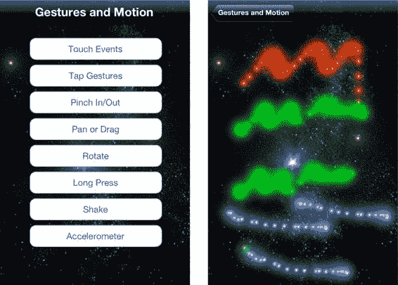
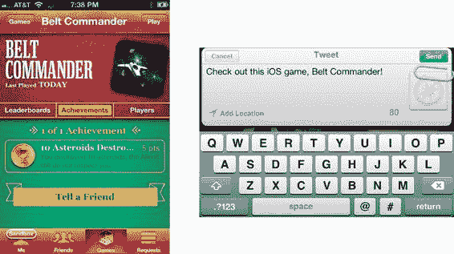
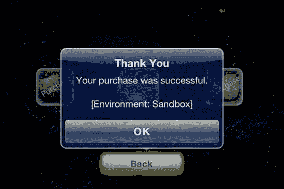
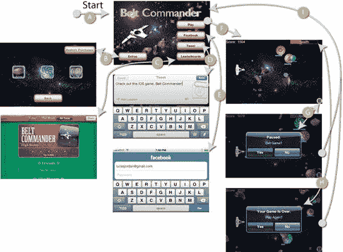
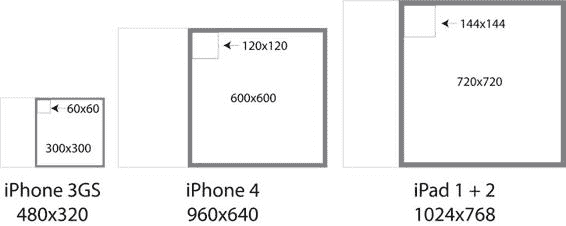

# 附录 A：设计与创建图形

电子游戏中的艺术

电子游戏中的风格

品牌与感知

创建图像文件

命名规范

辅助图像

多分辨率图像

多分辨率示例

创建最终资源

工具

GIMP

Blender 3D

Inkscape

总结

## 索引

## 关于作者

Lucas L. Jordan 是一位终身计算机爱好者，多年从事以用户界面设计为核心的开发工作。他是 *JavaFX 特效：通过动画、多媒体和游戏元素将 Java RIA 推向极致* 的作者，以及 *实用 Android 项目*（均由 Apress 出版）的合著者。Lucas 对多种形式的移动应用开发充满兴趣。时机成熟时，他将全心投入 ClayWare Games, LLC 的游戏开发事业。

## 关于技术审校者

Tony Hillerson 是 EffectiveUI 的软件架构师。他毕业于大使大学，获得管理信息系统学士学位。Tony 日常可能接触 Android、Rails、Objective-C、Java、Flex 或 shell 脚本。自早期测试版起，他就对 Android 开发产生兴趣。Hillerson 制作过 Android 教学视频，在会议上分享过 Android 主题，并担任多本 Android 书籍的技术审校。他偶尔也会编写 Android 代码。

他对从数据库到服务器再到界面的各个层面的可用性与体验设计均抱有浓厚兴趣。

业余时间，Hillerson 喜欢弹贝斯、玩《魔兽世界》以及制作电子音乐。Tony 与妻子和两个儿子居住在科罗拉多州丹佛市郊。

## 致谢

没有 Corbin Collins，本书将无法完成。感谢我的妻子和家人在时间上给予的支持，让我得以完成这项工作。感谢 Tony Hillerson 提供技术编辑。最后，特别感谢 Apress 团队的其他成员，使本书能赶在 iOS 5 发布之际顺利出版。

## 引言

### 本书：iOS 游戏开发入门指南

本书旨在为苹果 iOS 设备上的游戏开发提供入门指导。我希望你阅读此书是因为正为 iPhone 或 iPad 构思一款炫酷的新游戏而兴奋不已。本书的目标是让读者全面了解构建游戏的诸多方面，内容涵盖从组织启动画面这类常规任务，到精确实现动画所需的微妙数学知识。

学完本书后，你不仅会熟悉动画图像的细节，还将掌握游戏开发前需要考虑的其他诸多要素。例如，如果你计划在应用中集成**Game Center**，那么理解 Game Center 及其对游戏设计的影响就很有必要了。

本书通过大量示例循序渐进地为你呈现 iOS 游戏的完整面貌。为此，我编写了一个完整（尽管简单）的游戏作为示例背景，同时为你提供完整的游戏作为个人开发的参考蓝图。这款游戏名为《腰带指挥官》（Belt Commander），如图 1 所示。

图 1 展示了《腰带指挥官》的启动画面及游戏运行中的截图。

这款游戏包含了本书各章节讲解的元素，希望它能成为你的实用工具。

虽然这款游戏尚未达到我上架 App Store 的精细度，但它将成为我计划发布版本的起点。我特别指出这一点，是为了强调本书的实践性。在构建《腰带指挥官》过程中积累的经验已凝练于本书。你可以在 `claywaregames.com` 找到已发布的游戏。

如果你对本书代码或 iOS 开发有任何疑问，欢迎直接联系我：`lucasjordan@gmail.com`。

## 章节概览

本书各章涵盖游戏开发的相关主题。每章的源代码均来自可运行的示例项目。部分章节拥有独立项目，其余章节则共享一个更大的项目。

### 第 1 章

第 1 章将引导你使用 Xcode 搭建一个简单项目。借助本书提供的代码，你将创建自己的第一款简易游戏。

### 第 2 章

第 2 章继续深入探讨 Xcode 及游戏项目。我们将讨论`UIViewControllers`及其如何被设计为可复用组件的功能封装单元。同时，如图 2 所示，我们还将解决不同设备、屏幕方向及应用程序的适配问题。

**图 2.** iPhone 竖屏与 iPad 横屏下的简易游戏

图 2 展示了“石头、剪刀、布”游戏在 iPad 和 iPhone 上的运行效果。iPhone 上为竖屏模式，而 iPad 上为横屏模式。并非所有游戏都需要支持所有设备和方向，但部分游戏确有需求。在本章中，你将学会如何正确规划项目，避免后续开发中遇到适配难题。

### 第 3 章

第 3 章聚焦于理解 iOS 应用的生命周期。内容涵盖应用初始化、多视图间的导航方法，以及应用进入后台时的处理方式。图 3 展示了我们将要操作的项目中的不同视图。

**图 3.** 游戏《硬币分拣机》的四个视图

图 3 展示了游戏《硬币分拣机》的四个视图。在本章你将学习如何设计视图间的导航、持久化游戏状态与最高分，并深入探讨应用进入后台时状态保存的细节。这将为你创建游戏提供必要的上下文背景。

### 第 4 章

第 4 章我们将深入探讨如何打造游戏的趣味核心。在此之前，我们更关注游戏外围的支撑内容。本章将剖析《硬币分拣机》的实现过程，学习如何构建由用户输入驱动的游戏。图 4 预览了即将学习的知识要点。

**图 4.** `UIViews`工作原理预览

图 4 直观地展示了 iOS 中视图位置的描述方式。直到第 4 章，我们才首次深入探究视图在屏幕上的定位细节。本章将初步详解`UIView`类及如何使用 Core Graphics 描述`UIView`的位置。这些技术将为你构建输入驱动型游戏提供支持，并在后续章节大量操作`UIView`和`UIImageView`时发挥重要作用。

### 第 5 章

第 4 章构建的游戏采用适合“休闲”游戏的架构。第 5 章引入了逐帧游戏的概念——代码需负责绘制每一帧动画。图 5 展示了我们将要构建的架构概览及生成的示例动画。

**图 5.** 逐帧游戏架构及示例

图 5 左侧是描述逐帧游戏运作原理的流程图。我们将逐步演示如何创建右侧所示的示例游戏。同时，你将接触到本书后续内容的核心主题——太空题材，因为本章正是构建示例游戏《腰带指挥官》的核心基础。

掌握了逐帧游戏的基本原理后，我们将进入下一章，开始创建实现游戏所需核心功能的类。

### 第 6 章

第 6 章将第 5 章的核心原理封装成可复用的类。这相当于开始构建一个基础游戏引擎。我们将创建管理游戏的主类，并引入演员与行为的概念。图 6 展示了一个演员示例。

**图 6.** 演员示例：能量增强道具

图 6 展示了构成“能量增强道具”演员的图像序列。演员是游戏中封装其行为与视觉表现的对象。学完本章后，你将掌握创建游戏、添加演员，并观察演员按照其行为在屏幕上动画的基本模式。本章将识别构建此类游戏的核心要素。

### 第 7 章

第 7 章基于第 6 章的框架，新增了矢量绘图演员与粒子系统等特性。在学习创建这些新型演员的过程中，我们将构建几个引人注目的示例，如图 7 所示。

**图 7.** 由粒子系统构成的演员示例

图 7 展示了三颗彗星划过屏幕的景象。每颗彗星由众多称为粒子的小演员构成。粒子可用于创建单一图像或动画难以实现的震撼视觉效果。

本章结束时，我们将掌握几个设置游戏并创建自定义角色来填充游戏的示例。

### 第 8 章

在前两章中，我们已经了解了如何创建填充有自定义角色的场景，现在准备探讨用户交互。到目前为止，示例基本都是自主运行，或者仅支持非常有限的用户操作。在本章中，我们将探索所有用户输入选项，如图 8 所示。

xviii

[www.it-ebooks.info](http://www.it-ebooks.info/)

■ 引言

***图 8.** 用户输入示例列表，包含一个示例*

在图 8 的左侧，我们看到八个按钮，每个按钮都标有一种用户输入类型。在第 8 章中，我们将系统地介绍每种输入类型，并构建一个示例来展示其工作原理。

在图 8 的右侧，我们看到触摸事件的示例。我们使用在第 6 章和第 7 章中定义的类来构建每个示例，因此我们不仅能理解手势本身，还能理解它们如何与我们的游戏类协同工作。

### 第 9 章

如今开发游戏的一大优势是网络连接无处不在。这种网络连接使我们的游戏能够超越运行它的设备，利用互联网的丰富资源。对游戏而言，这意味着社交网络。在第 9 章中，我们将学习苹果的 Game Center 及相关的`GameKit`库。我们还将探讨 Twitter 和 Facebook。

图 9 展示了使用这些服务的一个示例。

xix

[www.it-ebooks.info](http://www.it-ebooks.info/)

■ 引言

***图 9.** 游戏内社交媒体*

在图 9 中，左侧是我们示例应用 Belt Commander 的 Game Center 成就视图。右侧是一条包含默认文本的推文（未显示 Facebook）。启用这些服务的代码已在我们示例游戏 Belt Commander 的项目中实现。通过这种方式，我们在将服务应用于真实游戏的背景下学习它们。

除了实现启用这些服务所需的代码外，我们还研究了如何在游戏代码之外启用这些服务。例如，要在你的应用中使用 Game Center 功能，你必须在 iTunes Connect 中启用该服务。我们还会探讨在代码之外需要做哪些工作来使 Facebook 和 Twitter 正常运行。

### 第 10 章

本书的最后一章致力于游戏的盈利。我们将详细探讨如何在你的应用中包含应用内购买。我们会逐步讲解在 iTunes Connect 中设置应用内购买的细节，以及应用内的相关代码。理想情况下，我们希望用户能够轻松到达图 10 所示的对话框。

xx

[www.it-ebooks.info](http://www.it-ebooks.info/)

■ 引言

***图 10.** 成功购买让开发者获得收益。*

### 第 11 章

在第 11 章中，我们将通过浏览示例游戏 Belt Commander 来回顾你所学的所有内容。我们将研究应用在视图层面以及视图间导航的组织方式。我们会审视扩展`GameController`以定义控制游戏进行方式及角色间交互逻辑的具体细节。我们还会分析赋予游戏中每个角色独特行为的代码。简言之，我们将展示游戏 Belt Commander 是如何实现的，如图 11 所示。

xxi

[www.it-ebooks.info](http://www.it-ebooks.info/)

■ 引言

***图 10.** Belt Commander 中的一个动作画面*

在图 10 中，我们看到了游戏 Belt Commander 的所有主屏幕。到本章结束时，你将了解每个屏幕的工作原理。届时，你将掌握自己创作引人入胜的游戏所需的所有知识。

### 附录 A

附录 A 将暂时离开 Belt Commander，探讨一些可用于制作游戏图形的技术。我们还会讨论确定最终美术资源尺寸时需要考虑的一些因素。图 12 展示了附录 A 中的一张图表。

xxii

[www.it-ebooks.info](http://www.it-ebooks.info/)

■ 引言

***图 12.** 图形尺寸对比*

在图 12 中，我们看到了 iOS 设备的三种屏幕尺寸。此图展示了在实现游戏时如何决定图像的尺寸。图像尺寸之所以重要，是因为它关系到内存使用和屏幕显示时的图像质量。

附录 A 还详细说明了如何创建和标识支持你应用的图像。例如，我们探讨了创建支持所有三种 iOS 设备的图标图像。附录 A 也花时间讨论了游戏中的风格。这段讨论阐述了在美术方面，一致性比质量更重要。

xxiii

[www.it-ebooks.info](http://www.it-ebooks.info/)

