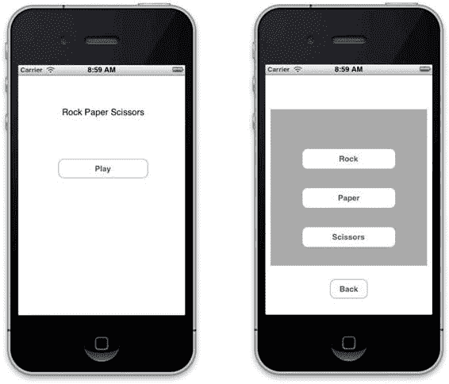
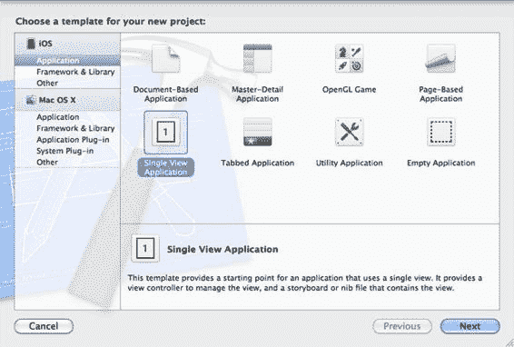
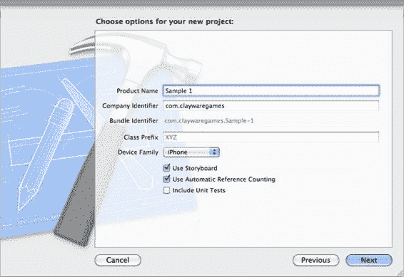
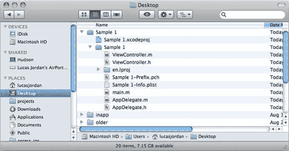

# 第 1 章：第一个简单游戏

在本章中，我们将构建一个非常简单的石头剪刀布游戏。我们将使用 Xcode 的 Storyboard 功能创建一个包含两个视图及它们之间导航的应用。

本书附带了示例 Xcode 项目；所有代码示例均直接取自这些项目。这样，你可以在 Xcode 中逐一跟着操作。在创建本书项目时，我使用了 Xcode 4.2 版本。本章附带的项目名为`Sample 1`。该项目是一个使用 Storyboard 创建两个场景的非常简单的游戏。第一个场景是起始视图，第二个场景是用户玩石头剪刀布游戏的地方。在第二个场景中，你将添加一个`UIView`并将其类指定为`RockPapaerScissorView`。

我们将逐步完成这些步骤，但首先让我们快速浏览一下我们的游戏，如图 1-1 所示。

在图 1-1 的左侧，我们看到起始视图。它只有一个简单的标题和一个“开始游戏”按钮。当用户点击“开始游戏”按钮时，会过渡到右侧所示的第二个视图。在此视图中，用户可以玩石头剪刀布。如果用户希望返回起始视图或主屏幕，可以按下“返回”按钮。这个简单的游戏由 Xcode 中的 Storyboard 布局和实现游戏的**自定义类**组成。

让我们看看我是如何创建这个游戏的，以及你可以通过哪些方式自定义项目。

L. Jordan, *Beginning iOS 5 Games Development*
© Lucas Jordan 2011

[www.it-ebooks.info](http://www.it-ebooks.info/)

**图 1-1.** *我们第一个游戏的两个视图：Sample 1*

### 在 Xcode 中创建项目：Sample 1

创建这个游戏只需几个步骤，我们将以此作为 Xcode 的入门介绍。

首先启动 Xcode。从“文件”菜单中，选择“新建项目”。你将看到一个屏幕，显示你可以用 Xcode 创建的项目类型（见图 1-2）。

[www.it-ebooks.info](http://www.it-ebooks.info/)

**图 1-2.** *Xcode 中的项目模板*

对于此项目，选择模板`Single View Application`。点击“下一步”，系统将提示你为项目命名，如图 1-3 所示。

**图 1-3.** *命名 Xcode 项目*

[www.it-ebooks.info](http://www.it-ebooks.info/)

你可以随意命名项目。你给项目起的名称将是包含该项目的根文件夹的名称。同时，确保选中`Use Storyboard`和`Use Automatic Reference Counting`选项。

