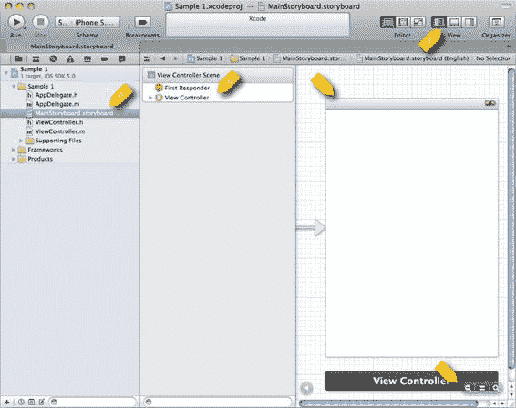
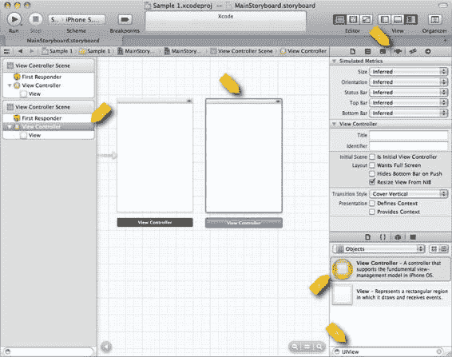
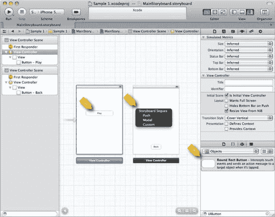

# 我们将专门为 iPhone 开发一款应用，不过你也能在“设备家族”下拉菜单中选择 iPad 或 Universal。点击“下一步”后，系统会提示你选择项目的保存位置。项目可以保存在电脑上的任意位置。

在继续之前，我们先花点时间了解一下 Xcode 项目的组织结构。

## 项目的文件结构

保存新项目后，Xcode 会在你选定的文件夹内创建一个新的子文件夹。这个子文件夹将包含项目文件。以后如果需要，移动这个文件夹也不会影响项目。图 1-4 展示了 Xcode 创建的文件。

**图 1-4.** *Xcode 创建的文件*

在图 1-4 中，我们看到一个 Finder 窗口，显示了创建的文件结构。我选择了将项目保存在桌面上，因此 Xcode 创建了一个名为 `Sample 1` 的根文件夹，其中包含 `Sample 1.xcodeproj` 文件。`xcodeproj` 文件用于向 Xcode 描述项目，所有资源默认都是相对于该文件路径的。项目保存后，Xcode 会自动打开你的新项目，然后你就可以根据需要开始自定义项目了。

[www.it-ebooks.info](http://www.it-ebooks.info/)

**第 1 章：第一个简单游戏**

**5**

## 自定义你的项目

我们已经了解了如何创建项目。现在，在添加用于实现游戏的新 `UIView` 之前，你将学习一些使用 Xcode 自定义项目的知识。

### 调整 Xcode 视图以方便操作

创建新项目后，你就可以开始自定义它了。此时你应该已打开 Xcode 并加载了新项目。请点击左侧的 `MainStoryboard.storyboard` 文件，这样你的项目界面会如图 1-5 所示。

**图 1-5.** *自定义前的 MainStoryboard.storyboard*

在图 1-5 中，我们看到 `MainStoryboard.storyboard` 文件已被选中（项目 A）。该文件用于描述多个视图以及它们之间的导航关系。它展示了选中的故事板文件，并描述了屏幕右侧的内容。在项目 B 中，我们看到一个名为“视图控制器”的项。这是项目 C 中描述的视图的控制器。我们将在接下来的几章中更详细地了解 Xcode 的工作原理。我想特别指出标记为项目 D 的控件。它们用于放大和缩小故事板视图，对于顺利导航至关重要。此外，项目 E 中的按钮用于控制 Xcode 中哪些主面板可见。你可以随意尝试这些按钮。

[www.it-ebooks.info](http://www.it-ebooks.info/)

**6** **第 1 章：第一个简单游戏**

接下来，让我们看看如何添加新视图。

### 添加新视图

当你稍微尝试了 Xcode 中不同的视图设置后，就可以继续为项目添加新视图了。调整 Xcode 布局，使最右侧面板可见，如果需要，可以隐藏最左侧面板。Xcode 界面应如图 1-6 所示。

**图 1-6.** *包含第二个视图的故事板*

在图 1-6 中，我们看到已向故事板添加了第二个视图。像所有优秀的苹果桌面应用一样，大部分工作都是通过拖放完成的。要添加第二个视图，我们在右下角的文本字段（项目 A）中输入 `UIView`。这会过滤列表，然后我们可以将标记为项目 B 的图标拖到中央的工作区。点击新视图使其被选中（见项目 C），我们可以看到这与项目 D 中选中的图标相对应。项目 E 显示了选中项的属性。

[www.it-ebooks.info](http://www.it-ebooks.info/)

**7** **第 1 章：第一个简单游戏**

现在项目中有了一个新视图，我们需要设置一种在视图之间导航的方式。

### 简单导航

现在我们要创建一些按钮，让我们能够在不同视图之间导航。第一步是添加按钮，然后配置导航。图 1-7 展示了这些视图正在连接导航的过程。

**图 1-7.** *带导航的故事板*

在图 1-7 中，我们看到我们将一个`UIButton`从库项目 A 拖到了每个视图上。我们将左侧的`UIButton`标记为"Play"，右侧的`UIButton`标记为"Back"。为了让 Play 按钮导航到右侧的视图，我们从 Play 按钮（项目 B）向右拖拽到右侧视图，然后在项目 C 处释放。执行此操作时，会弹出一个上下文对话框，让我们选择想要的过渡类型。我选择了 Model。我们可以对 Back 按钮重复此过程：将其向右拖拽到左侧视图，并选择返回时想要的过渡类型。此时你可以运行应用程序，并在两个视图之间导航。不过，要让它成为一个游戏，我们还需要加入石头、剪刀、布视图和按钮。

## 添加石头、剪刀、布视图

要添加石头、剪刀、布视图，我们需要从正在构建的项目中的示例代码里包含一个类。最简单的方法是打开示例项目，将文件`RockPaperScissorsView.h`和`RockPaperScissorsView.m`从示例项目拖拽到新项目中。图 1-8 显示了将文件拖入 Xcode 项目时弹出的对话框。

**图 1-8.** *将文件拖入 Xcode 项目*

在清单 1-8 中，我们看到确认要将新文件拖入 Xcode 项目的对话框。请确保"Destination"复选框已勾选。否则 Xcode 不会将文件复制到目标项目的位置。最好将所有项目资源保存在项目的根文件夹下。Xcode 足够灵活，不强制你这样做，但我的确被这种灵活性坑过很多次。不管怎样，既然我们项目中已经有了所需的类，让我们来连接界面以包含它。

## 自定义 UIView

创建简单应用程序的最后一步是在我们的界面中创建一个新的`UIView`，其类为`RockPaperScissorsView`。图 1-9 展示了如何操作。

**图 1-9.** *自定义的 UIView*

在图 1-9 中，我们看到在右侧的视图中添加了一个`UIView`。我们通过将项目 A 中的图标拖拽到项目 B 中的故事板上来完成此操作。调整新`UIView`的大小后，我们将其类设置为`RockPaperScissorsView`，如项目 C 所示。此时，从技术角度来说我们已经完成了。你创建了第一个游戏！显然，我们还没有研究`RockPaperScissorsView`的实现，这将在下一章讨论。

本书的其余部分将以示例 1 为起点。我们将学习许多新技术，来自定义简单的应用程序，打造一个真正完整的游戏。

## 总结

在本章中，你快速浏览了 Xcode，学习了如何用它创建项目并使用 Storyboard 构建简单的导航。后续章节将在本章所学基础知识之上，构建一个完整的游戏。

