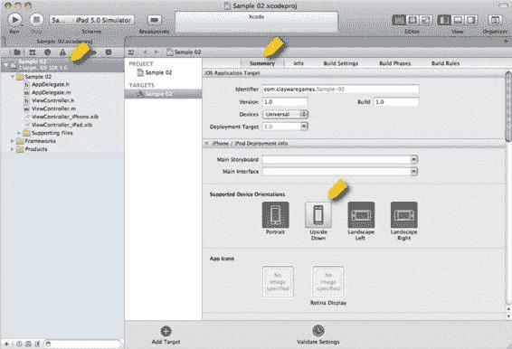
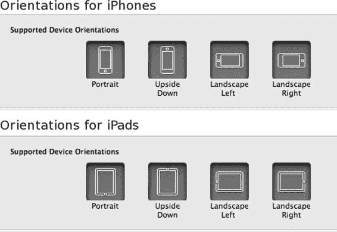
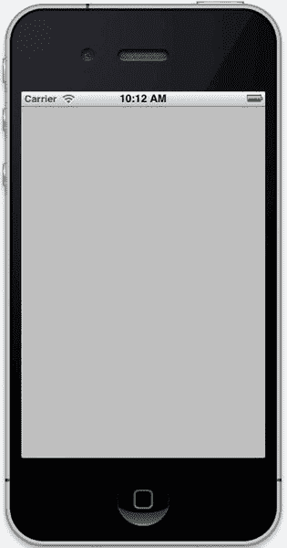
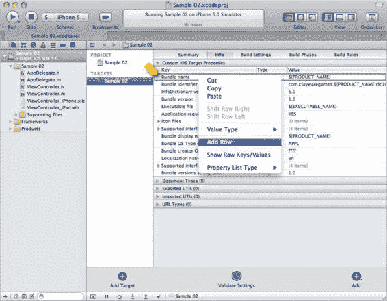
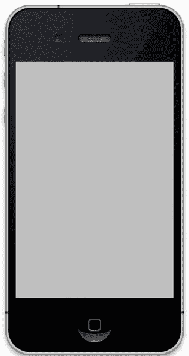

# 第 2 章：设置你的游戏项目

与所有软件项目一样，iOS 游戏开发从一开始就打下良好基础会受益匪浅。在本章中，我们将讨论如何设置一个新的 Xcode 项目，使其适合作为许多游戏的起点。这将包括创建一个可用于在 iPhone 和 iPad 上部署的项目，并同时处理横屏和竖屏方向。

我们将了解 iOS 应用程序是如何初始化的，以及我们可以从何处开始自定义行为，以匹配我们对应用程序应如何执行的期望。我们还将探索如何在 iOS 应用程序中创建和修改用户界面（UI）元素，并特别关注管理不同设备和屏幕方向。

本章创建的游戏将与第 1 章的简单示例非常相似——实际上，它的玩法完全相同。但我们将为后续章节打下基础，同时练习一些关键技术，例如使用`UIViewControllers`和 Interface Builder。

我们将探索 iOS 应用程序是如何组合在一起的，并解释关键的类。

我们还将创建新的 UI 元素，学习如何使用 Interface Builder 自定义它们，并探索使用 MVC 模式创建灵活、可重用的代码元素。在本章结束时，我们将创建图 2-1 所示的石头、剪刀、布应用程序。

**图 2-1.** *一个设计为在所有方向上适用于 iPhone 和 iPad 的应用程序*

图 2-1 显示了在 iPhone 和 iPad 模拟器上运行的应用程序。这是一个所谓的*通用*应用程序：它可以在两种设备上运行，并以此方式在 App Store 中呈现。除非有特定的业务原因需要编写仅适用于 iPhone 或 iPad 的应用程序，否则将应用程序做成通用的非常有意义。即使你最初只打算在一个设备上发布应用，这也会为你日后节省时间。

我们的示例应用程序非常简单，以至于可能很难看出图 2-1 中四种状态之间的差异。在左上角，iPhone 处于竖屏方向时，灰色区域的位置与左下角横屏时的布局不同。文本的布局也不同。应用程序在 iPad 上以横屏和竖屏方式运行时也是如此。让我们开始了解如何设置项目以适应这些不同的设备和方向。

## 创建游戏项目

要开始我们的示例游戏，首先需要在 Xcode 中创建一个新项目。

通过选择"文件" > "新建" > "新建项目..."来创建新项目。这将打开一个向导，让你选择想要的项目类型，如图 2-2 所示。

**图 2-2.** *创建新的基于窗口的应用程序*

在图 2-2 的左侧，我们看到我们从 iOS 部分选择了"Application"。右侧是可用于创建 iOS 应用程序的项目类型。这里提供的选项有助于为开发者提供合理的起点。这对 iOS 新手开发者尤其有帮助，因为这些模板为你提供了多种常见应用程序导航风格的起点。我们将选择"Single View Application"，因为我们只需要一个最小的起点，而 Single View Application 对通用应用程序提供了良好的支持。

点击"Next"后，会看到图 2-3 所示的选项。

**图 2-3.** *新项目的详细信息*


### 第一步：为产品命名

我们要做的第一件事就是为产品命名。你可以选择任何喜欢的名称。公司标识符（Company Identifier）将在应用提交过程中用于识别应用。你可以将公司标识符设置为任意值，但通常的做法是使用反向域名。如图 2-3 所示，套装标识符（Bundle Identifier）由产品名称和公司标识符合并而成。套装标识符之后可以修改——向导仅仅展示了默认值。当你将游戏提交至 App Store 时，套装标识符用于指明你上传的是哪个应用。

通过从“设备系列”列表中选择“通用”（Universal），你是在告知 Xcode 创建一个能同时在 iPhone 和 iPad 上运行的项目。在本例中，我们将不使用 Storyboard 或自动引用计数（Automatic Reference Counting）。同样地，我们也不会创建任何单元测试，因此“包含单元测试”选项也应取消勾选。点击“下一步”会提示你保存项目。Xcode 会在所选目录中创建一个新文件夹，因此如果你不想手动创建文件夹，也无需操作。保存新项目后，你会看到类似于图 2-4 的界面。

[www.it-ebooks.info](http://www.it-ebooks.info/)




**第 2 章：设置你的游戏项目**

**15**

**图 2-4.** *一个新创建的项目*

在图 2-4 左侧，有一个包含项目元素的树形结构，其中根元素处于选中状态（A）。右侧则选中了“摘要”（Summary）标签页（B）。在“摘要”标签页中，我们需要选择支持的设备方向（C）。若要支持每个设备上的所有方向，请点击“倒置”（Upside Down）按钮。向下滚动，确保 iPad 的所有方向也均已选中。图 2-5 显示了正确的设置。现在项目已创建，是时候开始定制它以符合我们的需求了。

[www.it-ebooks.info](http://www.it-ebooks.info/)




**16**

**第 2 章：设置你的游戏项目**

**图 2-5.** *支持所有设备方向*

## 定制通用应用程序

为了理解我们将对此项目进行的定制，最好先了解我们的起点是什么。空白项目本身是可运行的，尽管它显然没什么意思。花点时间运行一下这个应用。运行效果类似于图 2-6。接下来，我们将移除状态栏，并探索开始向项目添加自定义代码的最佳位置。

[www.it-ebooks.info](http://www.it-ebooks.info/)




**第 2 章：设置你的游戏项目**

**17**

**图 2-6.** *一个新的通用 iOS 应用程序*

在图 2-6 中，我们看到一个新的通用应用正在 iPhone 模拟器上运行。若要在 iPad 模拟器上运行该应用，请从 Xcode 中“停止”按钮右侧的“方案”下拉菜单中选择“iPad 模拟器”。我们可以看到，应用是空的；只有灰色背景。另一件需要注意的事情是，应用顶部的状态栏是显示的。尽管在很多应用中有充分的理由包含状态栏，但许多游戏可能希望移除状态栏以创造更具沉浸感的体验。要移除状态栏，请点击项目导航器（Project Navigator，即 Xcode 左侧的树形结构）中的根元素。选择目标（Target），然后点击右侧的“信息”（Info）标签页。图 2-7 显示了正确的视图。

[www.it-ebooks.info](http://www.it-ebooks.info/)




**18**

**第 2 章：设置你的游戏项目**

**图 2-7.** *配置状态栏*

一旦看到图 2-7 所示的视图，右键点击最顶层的元素（A），然后选择“添加行”（Add Row）。这将在项目列表中添加一个新元素。你需要将键（Key）值设置为“状态栏最初是隐藏的”（Status bar is initially hidden），并将值（Value）设置为“是”（Yes）。你在这里所做的实际上是编辑“Supporting Files”组下的 `plist` 文件。Xcode 只是为你提供了一个友好的界面来编辑这个配置文件。

**提示：** 导航到“Supporting Files”组下以 `info.plist` 结尾的文件。右键点击它，选择“打开方式 > 源代码”（Open As > Source Code）。这将显示 `plist` 文件的源代码内容。

请注意，键值实际上是以常量形式存储的，而不是“信息”编辑器（Info editor）中显示的人类可读文本。

当我们再次运行应用时，状态栏就被移除了，如图 2-8 所示。

[www.it-ebooks.info](http://www.it-ebooks.info/)




**第 2 章：设置你的游戏项目**

**19**

**图 2-8.** *没有状态栏的默认应用*

既然我们已经探索了一种开始定制应用的简单方法，现在是时候研究一下 iOS 应用是如何组合起来的，这样我们就能做出明智的决策来添加自己的功能。

## iOS 应用的初始化方式

我们知道，iOS 应用主要用 Objective C 编写，而 Objective C 是 C 的超集。Xcode 很好地隐藏了应用构建的细节，但在底层，我们知道它使用的是 LLVM 和其他常见的 Unix 工具来完成实际工作。

因为我们知道项目本质上是一个 C 应用，所以我们会预期应用的入口点是一个 C 语言的 `main` 函数。事实上，如果你查看“Supporting Files”组，你会找到 `main.m` 文件，如代码清单 2-1 所示。

**代码清单 2-1.** *main.m*

```
#import <UIKit/UIKit.h>

#import "AppDelegate.h"

int main(int argc, char *argv[])

{

@autoreleasepool {

[www.it-ebooks.info](http://www.it-ebooks.info/)


**20**

**第 2 章：设置你的游戏项目**

return UIApplicationMain(argc, argv, nil, NSStringFromClass([AppDelegate class]));

}

}
```

代码清单 2-1 中的 `main` 函数是一个 C 函数，但你会注意到函数体显然是 Objective C 语法。一个 `@autoreleasepool` 包裹了对 `UIApplicationMain` 的调用。`@autoreleasepool` 为这个应用设置了内存管理上下文；我们实际上无需担心这个。`UIApplicationMain` 函数为你做了很多方便的事情——它通过查看你的 `info.plist` 文件来初始化应用，设置事件循环，并通常以正确的方式启动一切。事实上，我从未有过任何理由需要修改这个函数，因为 iOS 提供了一个明确的位置来开始添加你的启动代码。开始添加初始化代码的最佳位置是在应用委托类（App Delegate）的实现文件中找到的 `application:didFinishLaunchingWithOptions:` 任务。在本例中，应用委托类名为 `AppDelegate`。代码清单 2-2 显示了来自 `AppDelegate.m` 的 `application:didFinishLaunchingWithOptions:` 任务的实现。

**代码清单 2-2.** *application:didFinishLaunchingWithOptions:*

```
- (BOOL)application:(UIApplication *)application

didFinishLaunchingWithOptions:(NSDictionary *)launchOptions

{

self.window = [[[UIWindow alloc] initWithFrame:[[UIScreen mainScreen] bounds]]

autorelease];

// 应用启动后用于自定义的覆盖点。

if ([[UIDevice currentDevice] userInterfaceIdiom] == UIUserInterfaceIdiomPhone) {

self.viewController = [[[ViewController_iPhone alloc]

initWithNibName:@"ViewController_iPhone" bundle:nil] autorelease];

} else {

self.viewController = [[[ViewController_iPad alloc]

initWithNibName:@"ViewController_iPad" bundle:nil] autorelease];

}

self.window.rootViewController = self.viewController;

[self.window makeKeyAndVisible];

return YES;

}
```


