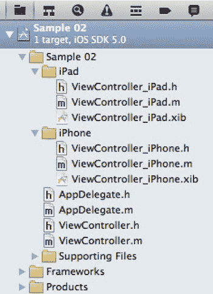

# 当应用程序启动时

当应用程序完全初始化并准备好开始运行其组成代码时，会调用 `application:didFinishLaunchingWithOptions:` 任务，如代码清单 2–2 所示。

这个任务除了名称极长之外，还接收一个 `UIApplication` 实例和一个 `NSDictionary` 作为参数。`UIApplication` 是一个代表正在运行的应用程序状态的对象。接收此消息的 `AppDelegate` 实例是 `UIApplication` 对象的委托。这意味着我们通过在 `AppDelegate` 中实现任务来修改应用程序的行为。`AppDelegate` 所实现的协议 `UIApplicationDelegate` 定义了将在应用程序上被调用的任务。

如果我们查看 `application:didFinishLaunchingWithOptions:` 的实现，首先会创建一个与屏幕尺寸相同的新 `UIWindow`。实例化 `UIWindow` 后，我们需要创建一个 `UIViewController` 来管理应用程序的用户界面。像我们创建的新 Xcode 项目，最初会有一个单一的 `ViewController` 类来管理界面。我们将创建 `ViewController` 的设备特定子类，以便有地方放置设备特定的代码。我们稍后会探讨创建这些子类的过程。为了确保实例化正确的 `ViewController` 子类，我们需要添加代码清单 2–2 中加粗的代码。

创建好 `ViewController` 后，我们将其设置为 `window` 的 `rootViewController`，并调用 `makeKeyAndVisible`。`window` 对象是 `UIWindow` 的实例，它是应用程序的根图形组件。`makeKeyAndVisible` 任务的作用是显示窗口。我们添加到应用程序中的任何自定义组件都将成为此 `window` 对象的子视图。

如果应用程序需要在用户界面加载之前进行配置，应将初始化代码放在调用 `makeKeyAndVisible` 之前。这可能包括读取应用程序特定的配置文件、初始化数据库、设置定位服务或任何其他操作。

接下来，在详细探讨如何使用 Interface Builder 之前，我们将大致了解 iOS 应用程序中的用户界面是如何组织的。

## 理解 UIViewController

iOS 开发及其相关库大量使用了模型-视图-控制器（MVC）模式。一般来说，MVC 是一种分离表现层（View）、数据层（Model）和业务逻辑层（Controller）的策略。具体来说，模型仅仅是数据，比如一个 `Person` 类或一个 `Address`。视图负责将数据渲染到屏幕上。在 iOS 开发中，这意味着 `UIView` 的子类。iOS 提供了一个特殊的类来充当 `UIView` 的控制器，这个类恰当地被命名为 `UIViewController`。

`UIViewController` 有两个关键特征：它通常与一个 XIB 文件相关联，并且它有一个名为 "view" 的属性，类型为 `UIView`。通过创建 `UIViewController` 的子类，我们还可以创建一个与类名相同的 XIB 文件。默认情况下，当实例化一个 `UIViewController` 子类时，它会加载同名的 XIB。XIB 中的根 `UIView` 将被连接为 `UIViewController` 的 `view` 属性。

除了提供用户界面布局与其驱动逻辑之间的清晰分离之外，iOS 还提供了许多 `UIViewController` 子类，这些子类期望与其他 `UIViewController` 而非 `UIView` 协同工作。一个例子是实现“设置”应用中导航类型的 `UINavigationController`。在代码中，当你想前进到下一个视图时，你传递的是一个 `UIViewController`，而不是一个 `UIView`，尽管显示在屏幕上的是 `UIViewController` 的 `view` 属性。

诚然，对于本章中的示例应用程序而言，使用 `UIViewController` 并不会带来太大差异。在第一章中，我们创建 `RockPaperScissorsView` 类时扩展了 `UIView`，并且效果良好。然而，理解 `UIViewController` 及其视图如何协同工作，将使第三章（我们将探讨游戏应用程序的生命周期）的工作更加轻松。

使用第一章中的 `RockPaperScissorsView`，让我们看看如果将这些功能实现为 `UIViewController` 会是什么样子。代码清单 2–3 显示了文件 `RockPaperScissorsController.h`。

**代码清单 2–3.** *RockPaperScissorsController.h*

```
@interface RockPaperScissorsController : UIViewController {

    UIView* buttonView;

    UIButton*
    rockButton;

    UIButton*
    paperButton;

    UIButton*
    scissersButton;

    UIView*
    resultView;

    UILabel*
    resultLabel;

    UIButton*
    continueButton;

    BOOL isSetup;
}

-(void)setup:(CGSize)size;
-(void)userSelected:(id)sender;
-(void)continueGame:(id)sender;
-(NSString*)getLostTo:(NSString*)selection;
-(NSString*)getWonTo:(NSString*)selection;

@end
```

在代码清单 2–3 中，我们看到类 `RockPaperScissorsController` 扩展了 `UIViewController`。除其他事项外，这意味着 `RockPaperScissorsController` 有一个名为 "view" 的属性，该属性将是此控制器的根 `UIView`。与 `RockPaperScissorsView` 类似，我们会有其他作为根视图子视图的 `UIView`，例如用于选择选项的按钮。尽管这些按钮理论上可以有它们自己的 `UIViewController`，但在某些情况下，让一个 `UIViewController` 管理其所涉及的所有 `UIView` 是合理的。为了完成从 `UIView` 到 `UIViewController` 的转换，实现方面只需要做很少的更改。基本上，凡是使用关键字 "self" 的地方，我们只需改为使用 `self.view`。代码清单 2–4 显示了所需的更改。

**代码清单 2–4.** *RockPaperScissorsController.m（部分）*

```
-(void)setup:(CGSize)size{

    if (!isSetup){

        isSetup = true;

        srand(time(NULL));

        buttonView = [[UIView alloc] initWithFrame:CGRectMake(0, 0, size.width, size.height)];

        [buttonView setBackgroundColor:[UIColor lightGrayColor]];

        [self.view addSubview:buttonView];

        float sixtyPercent = size.width * .6;

        float twentyPercent = size.width * .2;

        float twentFivePercent = size.height/4;

        float thirtyThreePercent = size.height/3;

        rockButton = [UIButton buttonWithType:UIButtonTypeRoundedRect];

        [rockButton setFrame:CGRectMake(twentyPercent, twentFivePercent, sixtyPercent, 40)];

        [rockButton setTitle:@"Rock" forState:UIControlStateNormal];

        [rockButton addTarget:self action:@selector(userSelected:)
                forControlEvents:UIControlEventTouchUpInside];

        paperButton = [UIButton buttonWithType:UIButtonTypeRoundedRect];

        [paperButton setFrame:CGRectMake(twentyPercent, twentFivePercent*2, sixtyPercent, 40)];

        [paperButton setTitle:@"Paper" forState:UIControlStateNormal];

        [paperButton addTarget:self action:@selector(userSelected:)
                forControlEvents:UIControlEventTouchUpInside];

        scissersButton = [UIButton buttonWithType:UIButtonTypeRoundedRect];

        [scissersButton setFrame:CGRectMake(twentyPercent, twentFivePercent*3, sixtyPercent, 40)];

        [scissersButton setTitle:@"Scissers" forState:UIControlStateNormal];

        [scissersButton addTarget:self action:@selector(userSelected:)
                forControlEvents:UIControlEventTouchUpInside];

        [buttonView addSubview:rockButton];

        [buttonView addSubview:paperButton];

        [buttonView addSubview:scissersButton];

        resultView = [[UIView alloc] initWithFrame:CGRectMake(0, 0, size.width, size.height)];

        [resultView setBackgroundColor:[UIColor lightGrayColor]];

        resultLabel = [[UILabel new] initWithFrame:CGRectMake(twentyPercent, thirtyThreePercent, sixtyPercent, 40)];

        [resultLabel setAdjustsFontSizeToFitWidth:YES];

        [resultView addSubview:resultLabel];
```


```objectivec
continueButton = [UIButton buttonWithType:UIButtonTypeRoundedRect];
[continueButton setFrame:CGRectMake(twentyPercent, thirtyThreePercent*2, sixtyPercent, 40)];
[continueButton setTitle:@"Continue" forState:UIControlStateNormal];
[continueButton addTarget:self action:@selector(continueGame:) forControlEvents:UIControlEventTouchUpInside];
[resultView addSubview:continueButton];
}

-(void)userSelected:(id)sender{
int result = random()%3;
UIButton* selectedButton = (UIButton*)sender;
NSString* selection = [[selectedButton titleLabel] text];
NSString* resultText;
if (result == 0){//输
NSString* computerSelection = [self getLostTo:selection];
resultText = [@"输，iOS 选择 " stringByAppendingString: computerSelection];
} else if (result == 1) {//平局
resultText = [@"平局，iOS 选择 " stringByAppendingString: selection];
} else {//赢
NSString* computerSelection = [self getWonTo:selection];
resultText = [@"赢，iOS 选择 " stringByAppendingString: computerSelection];
}
[resultLabel setText:resultText];
[buttonView removeFromSuperview];
[`self.view` addSubview:resultView];
}

-(void)continueGame:(id)sender{
[resultView removeFromSuperview];
[`self.view` addSubview:buttonView];
}
```

清单 2-4 中加粗的部分标明了我们已做出的必要更改。我们将在本章稍后部分，在完成其余用户界面设置后，使用这个基于`UIViewController`的“石头、剪刀、布”游戏版本。

## 根据设备类型自定义行为

如前所述，我们使用的项目是一个通用应用的示例，配置为可在 iPhone 和 iPad 上运行。由于应用在不同设备上运行时可能希望执行不同的操作，我们将为每种设备类型创建`ViewController`的子类。

要创建这些子类，请从文件菜单中选择“新建文件”。您将看到一个如图 2-9 所示的对话框。


从 Cocoa Touch 部分，我们选择`UIViewController`子类，然后点击“下一步”。这将允许我们命名新类并选择特定的子类，如图 2-10 所示。


类名应为`ViewController_iPhone`，且应为`ViewController`的子类。请记住，`ViewController`类本身是一个`UIViewController`，因此`ViewController_iPhone`也将是一个`UIViewController`。在此示例中，我们两个复选框都不勾选，因为我们已经有用于该类的 XIB 文件。

我们需要重复此过程，为我们的`UIViewController`创建 iPad 版本。创建该类时，将其命名为`UIViewController_iPad`，并保持两个复选框都不勾选。完成后，您的项目应如图 2-11 所示。



在图 2-11 中，我们可以看到我们的项目以及刚创建的新的`UIViewController`子类。为了保持组织有序，我发现将特定于设备的类放在它们自己的分组中会很方便。

现在，我们为每种设备类型（iPhone 和 iPad）都拥有了 XIB 文件和`UIViewController`类。如果我们要编写共享行为的代码，我们会将其添加到`ViewController`类中。如果我们要添加特定于某个设备的代码，我们会将其添加到`ViewController_iPad`或`ViewController_iPhone`中。现在，我们可以继续前进并开始实现我们的应用了，我们先来看看 UI 元素。

## 以通用方式图形化设计用户界面

在为 iPhone 和 iPad 构建应用时，我们必须考虑两种设备屏幕尺寸的差异。由于两种设备的宽高比不同，我们确实应该为每种设备创建一个布局。在本节中，我们将介绍如何为每种设备类型创建布局，以及如何创建根据应用运行设备而调用的类。

Xcode 提供了一种便捷而强大的工具，用于布局应用的图形元素。历史上，这是通过独立的应用程序 Interface Builder 来完成的。在近期的 Xcode 版本中，Interface Builder 的功能已整合到 Xcode 中，以提供无缝的开发环境。

尽管 Interface Builder 不再是一个独立的应用程序，但我将继续使用该术语来指代 Xcode 中的 UI 布局工具。这将有助于我们区分 Xcode 的代码编辑部分和所见即所得的部分。

Interface Builder 的核心是一个工具，用于创建对象集合以及这些对象之间的一组连接。这些对象是 UI 组件以及指定行为或数据的对象。这个对象集合保存在一个称为 XIB 文件的内容中。在运行时，XIB 文件会被读取，以实例化其中定义的对象。生成的对象会被“连接”起来，并准备好供应用使用。例如，在 Interface Builder 中，您可以向场景添加一个按钮，并指定它被点击时应调用特定对象上的某个任务。这很方便，因为您无需编写将按钮与处理对象链接起来的代码；一切都会像您在 XIB 文件中定义的那样设置好。

**注意：** 当在互联网上搜索有关 Interface Builder 的帮助时，请记住 XIB 文件过去被称为 NIB 文件。许多可用信息仍然使用这个旧术语，但仍然是有效的。Interface Builder 也是如此；关于旧版本的文章仍然能为新版本提供有价值的见解。

### Interface Builder 初探

在项目资源管理器的 iPhone 分组下，有一个名为`ViewController_iPhone.xib`的文件。此文件包含应用在 iPhone 上运行时该项目使用的起始视觉组件。类似地，在 iPad 分组下有一个名为`ViewController_iPad.xib`的文件，用于应用在 iPad 上运行时。让我们先关注 iPhone 版本，看看这个文件是什么以及它是如何工作的。点击`ViewController_iPhone.xib`，您应该会看到类似图 2-12 的内容。


在图 2-12 中，项目资源管理器右侧是一个包含四个图标的视图（A）。这些图标代表 XIB 文件中的根项目。要获取有关这些对象的更多详细信息，请点击视图底部的小箭头（B）。这将改变显示方式，使其与图 2-13 中最左侧的视图相匹配。如标签所示，“对象”下的项目是此 XIB 文件中定义的对象。“占位符”下的项目描述了与此文件中未定义对象的关系。实际上，“文件所有者”项是对加载此 XIB 文件的对象的引用；这通常是`UIViewController`的子类，但稍后会详细说明。


