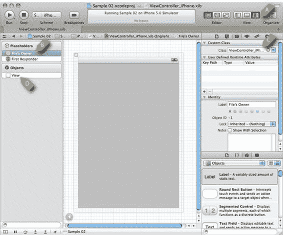
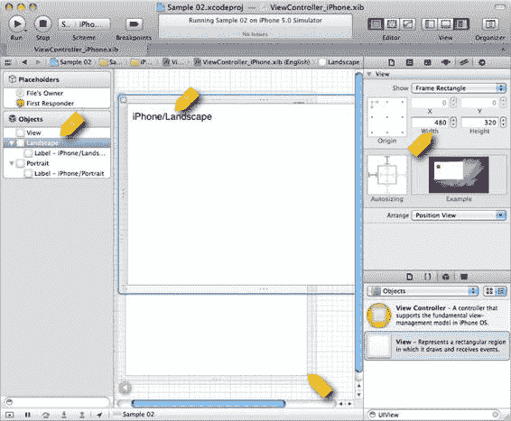
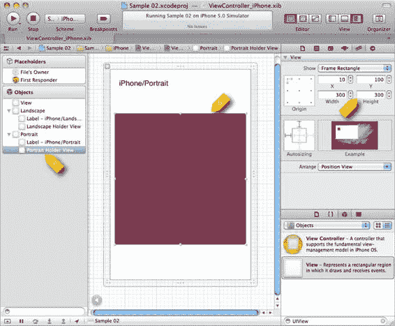
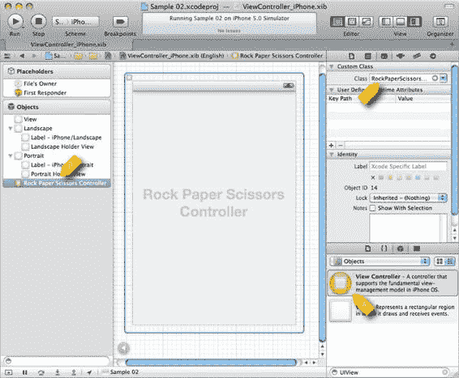
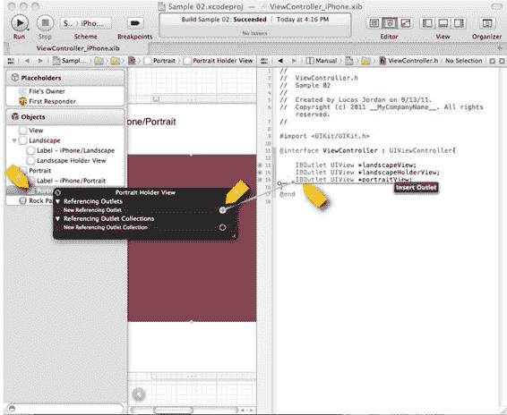

# 图 2-13 的另一个重要特征

图 2-13 的另一个重要特征是右侧区域。它展示了 UI 组件的图形化表示。在`Xcode`的标题栏中，标签`View (A)`上方有三个按钮。在使用`Interface Builder`时，我发现取消选中左侧按钮并选中右侧按钮会很有帮助。这会显示一个视图，展示`Objects`下所选项目的属性。完成`Xcode`的 UI 配置后，你应该会看到类似图 2-13 的内容。

[www.it-ebooks.info](http://www.it-ebooks.info/)




**第 2 章：设置你的游戏项目**

**29**

**图 2-13.** *配置为 UI 工作状态的 Xcode*

在图 2-10 的`Objects`部分下，有一个名为`View (D)`的单项。这个`View`是一个`UIView`，在应用程序运行时将成为根视图。在图 2-10 的中央，你可以看到这个视图的外观。

在`Placeholders`部分下，我们看到两个项目。目前我们无需关注`First Responder`。不过，我们需要选中`File’s Owner (B)`并对其进行修改。`File’s Owner`项是对加载此 XIB 文件的对象的引用。在我们的案例中，它将是`ViewController_iPhone`的一个实例，如清单 2-2 所示。为了让`Interface Builder`知道我们打算使用`UIViewController`的某个特定子类，我们在右侧的 C 项处输入要使用的类名。

这样，`Interface Builder`就会暴露`ViewController_iPhone`类的`IBOutlets`。我们稍后将详细探讨`IBOutlets`。

[www.it-ebooks.info](http://www.it-ebooks.info/)




**30**

**第 2 章：设置你的游戏项目**

**提示：** 从技术上讲，XIB 文件包含用于创建特定类实例的信息。在实践中，我发现自己简单地认为"XIB 文件包含一个对象"——这在技术上并不准确。尽管存在这种不准确，但"术语警察"至今还没有逮捕我。

现在我们已经介绍了 XIB 文件是什么，以及其中定义的对象如何与运行时对象关联。下一步是向我们的 XIB 文件中添加内容，特别是用于横向和纵向方向的`UIViews`。

### 向 XIB 文件添加 UI 元素

我们已经查看了 XIB 文件中的基本元素。我们知道有一个`File’s Owner`对象引用，它代表加载 XIB 文件的`UIViewController`。我们还知道 XIB 文件有一个根`UIView`。我们将向 XIB 文件添加额外的`UIViews`，并研究如何自定义应用程序，使其不仅支持不同的设备，还能根据方向拥有不同的布局。图 2-14 显示添加了几个项目的 iPhone XIB 文件。

**图 2-14.** *部分配置的 iPhone XIB 文件*

[www.it-ebooks.info](http://www.it-ebooks.info/)




**第 2 章：设置你的游戏项目**

**31**

在图 2-14 中，我们看到了添加了额外`UIView`对象的 XIB 文件。要添加新组件，只需将其从右下角的方框拖到`Objects`列表或直接拖到中央的场景中。在这种情况下，我们添加了两个名为`Landscape`和`Portrait`的`UIView`对象，作为名为`View (A)`的`UIView`的兄弟元素。我们将这两个`UIView`对象统称为方向视图。在每个新的`UIView`对象上，我们通过从右下角的库中拖拽`UILabel`到屏幕中央的视觉表示区(B)来添加一个`UILabel`。每个标签的文本将标识我们当前正在显示哪个视图。为了确保布局正确，`Landscape`和`Portrait` `UIView`对象的大小在右侧的属性面板中设置(C)。在屏幕中央，你可以看到`Landscape` `UIView`显示在`Portrait` `UIView`之上(D)。

下一步是向每个方向视图添加一个新的`UIView`。这个新的`UIView`将描述我们的石头、剪刀、布游戏显示的位置。图 2-15 显示了添加到`Portrait`方向视图的这个新`UIView`。

**图 2-15.** *添加到 iPhone XIB 文件中的容器视图*

[www.it-ebooks.info](http://www.it-ebooks.info/)




**32**

**第 2 章：设置你的游戏项目**

在图 2-15 中，我们看到已经向 XIB 文件添加了两个新的`UIView`对象。第一个称为`Portrait Holder View (A)`，第二个称为`Landscape Holder View`。在屏幕中央(B)，我们看到`Portrait Holder View`的大小为 300x300(C)点，颜色较深（红色）。`Landscape Holder View`是`Landscape`的一个子视图（未显示）。

### 向 XIB 添加 UIViewController

在完成项目添加之前，还有最后一项需要添加到 XIB 文件中。我们需要添加一个`UIViewController`，负责将显示在我们刚添加的容器视图中的子视图。我们将添加的`UIViewController`将是本章前面定义的`RockPaperScissorsController`类。图 2-16 显示了添加了一个新的`UIViewController`的 XIB 文件。

**图 2-16.** *将 RockPaperScissorsController 添加到 XIB 文件中*

在图 2-16 中，我们看到一个`View Controller`从库(A)拖到了`Objects`部分(B)，并被设置为类`RockPaperScissorsController`(C)。这样，当此 XIB 文件被实例化时，也会创建一个`RockPaperScissorsController`的实例。这就引出了一个问题：如何以编程方式访问 XIB 文件中的项目？答案在于创建`IBOutlets`，下一节将讨论这个问题。

[www.it-ebooks.info](http://www.it-ebooks.info/)




**第 2 章：设置你的游戏项目**

**33**

### 从 Interface Builder 创建新的 IBOutlets

`IBOutlet`是 XIB 文件中定义的项目与类中声明的变量之间的连接。要将一个字段指定为`IBOutlet`，只需在类头文件的字段声明前加上该关键字即可。另一种创建`IBOutlet`的方法是通过`Interface Builder`创建。图 2-17 展示了在`Interface Builder`中创建`IBOutlet`的过程。

**图 2-17.** *在 Interface Builder 中创建 IBOutlet*

在图 2-17 中，我们看到了在`Interface Builder`中创建`IBOutlet`的步骤。这是通过右键单击要为其创建`IBOutlet`的对象(A)（此处为`Portrait Holder`视图）完成的。从弹出的对话框中，将`New Referencing Outlet` (B)右侧的小圆点拖到代码中您希望创建`IBOutlet`的位置(C)。如图 2-17 所示，已经创建了许多`IBOutlet`引用。请注意，创建这些`IBOutlet`引用的头文件是`ViewController.h`。我们使用这个文件；`ViewController_iPhone`和`ViewController_iPad`将继承它们。让我们看一下清单 2-5 中`ViewController.h`的完整版本。

[www.it-ebooks.info](http://www.it-ebooks.info/)


**34**

**第 2 章：设置你的游戏项目**

#### 清单 2-5. `ViewController.h`

```
#import <UIKit/UIKit.h>

#import "RockPaperScissorsController.h"

@interface ViewController : UIViewController{

    IBOutlet UIView *landscapeView;
    IBOutlet UIView *landscapeHolderView;
    IBOutlet UIView *portraitView;
    IBOutlet UIView *portraitHolderView;
    IBOutlet RockPaperScissorsController *rockPaperScissorsController;

}

@end
```

在清单 2-5 中，我们看到有对 5 个`IBOutlet`引用的引用。这些将在运行时为我们提供对这些项目的编程访问。当`Interface Builder`创建这些引用时，它还在`ViewController`的实现中创建了一些清理代码。清单 2-6 显示了这些自动生成的代码。

#### 清单 2-6. `ViewController.m`（部分）

```
- (void)viewDidUnload
{
    [landscapeView release];
    landscapeView = nil;
    [landscapeHolderView release];
    landscapeHolderView = nil;
}
```


```objc
[portraitView release];
portraitView = nil;

[portraitHolderView release];
portraitHolderView = nil;

[rockPaperScissorsController release];
rockPaperScissorsController = nil;

[super viewDidUnload];

// 释放主视图中的任何保留子视图。
// 例如 self.myOutlet = nil;
}

///…
- (void)dealloc {
    [landscapeView release];
    [landscapeHolderView release];
    [portraitView release];
    [portraitHolderView release];
    [rockPaperScissorsController release];
    [super dealloc];
}
```

在代码清单 2-6 中，我们看到 Interface Builder 为创建的每个 `IBOutlet` 生成的代码。在 `viewDidUnload` 任务中，我们看到每个视图都被释放并设为 `nil`。类似地，在 `dealloc` 任务中，我们看到每个视图都被释放。下一节我们将复习如何响应屏幕方向变化，这段相同的代码将负责将我们一直在处理的不同视图显示到屏幕上。

[www.it-ebooks.info](http://www.it-ebooks.info/)


