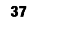
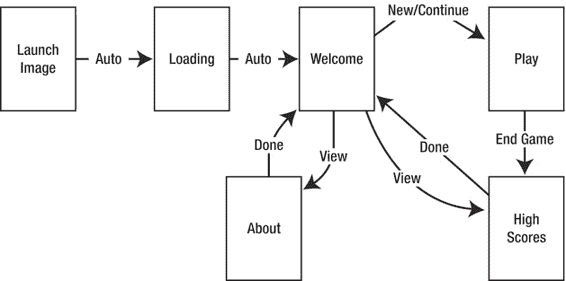

# 第 2 章：设置你的游戏项目

**36**

如果设备现在处于横屏方向，我们将 `portraitView` 从其父视图中移除——也就是说，将其从屏幕上移除。然后我们将视图 `landscapeView` 添加到根视图。我们调用 `rockPaperScissorsController` 的 `setup` 方法，以便为其提供布局其子视图的机会（如果尚未布局）。最后，我们将 `rockPaperScissorsController` 的视图属性作为子视图添加到 `landscapeHolder` 中。

此任务在应用程序启动时被调用，即使设备发生旋转也是如此。这样我们就可以将所有与屏幕方向相关的逻辑集中在一个地方，因为无需处理初始化这个特殊情况。然而，根据这是否是第一次调用 `shouldAutorotateToInterfaceOrientation:`，这些对象的状态会有所不同。例如，第一次调用此任务时，`portraitView` 和 `landscapeView` 都尚未附加到场景中，因此对 `removeFromSubview` 的调用将是一个空操作，不会产生错误。当此任务在后续的屏幕旋转中被调用时，`rockPaperScissorsController` 的视图将附加到场景中；不过，当一个视图被添加为子视图时，如果它已有父视图，会自动从其父视图中移除。

`removeFromSuperview` 和 `addSubview:` 具有这些合理的默认行为，这使得操作视图变得非常容易，减少了容易出错的清理代码。

如果运行该项目，你会看到应用在 iPad 和 iPhone 上都能运行，并根据屏幕方向改变布局。

## **总结**

在本章中，我们了解了如何创建一个适合开发通用应用的 Xcode 项目。我们探索了 iOS 应用的初始化过程，并找到了从何处开始修改项目以创建我们想要的应用。我们研究了 XIB 文件与类如何交互，以及 iOS 如何通过 `UIViewController` 类利用 MVC 模式。我们创建了一个应用，它能无缝支持在 iPhone 或 iPad 上以所有屏幕方向运行，为游戏开发奠定了基础。

[www.it-ebooks.info](http://www.it-ebooks.info/)

## **第 3 章：探索游戏应用生命周期**

游戏不仅仅是乐趣所在。市场上几乎所有的游戏，尤其是那些大作，都涉及多个视图和相当复杂的生命周期。

本章将探讨如何将一个简单的游戏转变为一个完整的应用。我们将了解一个典型游戏如何组织构成它的不同视图，包括加载视图、欢迎视图、高分视图，当然还有游戏本身。

除了用户导航，应用也有其生命周期。在 iOS 上，这包括响应应用程序被终止、从后台恢复，或者首次启动。当应用经历其生命周期时，它需要保存用户数据中的元素，比如高分和游戏状态。关注这些小细节将使你的游戏看起来精致，而非业余和令人厌烦。

虽然这里展示的游戏并不十分有趣，并且艺术设计也明显业余，但你可以采用这里提供的基本框架，并将你自己的游戏融入其中。

不过，你确实应该更新你的美术资源！

### **了解游戏中的视图**

本章展示的游戏叫做“硬币分类器”。这是一个简单的益智游戏，玩家需要将硬币按行和列进行分类。玩家有十次机会，尽可能多地凑出匹配的行或列。这个游戏的乐趣部分几乎是 iOS 游戏所能达到的最简单的程度。游戏的可玩部分仅由两个类组成：`CoinsController` 和 `CoinsGame`。正如这两个类的名称所示，`CoinsController` 负责将游戏渲染到屏幕上并解释玩家的操作。`CoinsGame` 负责存储游戏状态，并提供一些操作该状态的实用方法。关于这两个类如何工作的细节将在第 4 章中全面探讨。在本章中，我们将研究支撑这两个类并创建完整应用的所有周边代码。

L. Jordan, *Beginning iOS 5 Games Development*

© Lucas Jordan 2011

[www.it-ebooks.info](http://www.it-ebooks.info/)

