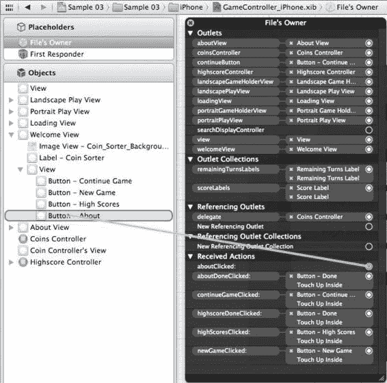
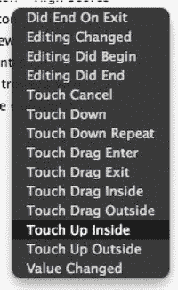

# 排版后内容

在清单`3–1`中，我们导入了该项目中定义的另外三个类，其中包括对`UIKit`的默认导入语句。其余的`IBOutlet`语句都是基本声明，允许访问多个不同的视图。`IBOutletCollection`的定义为我们提供了一种新型的连接方式。`IBOutletCollection`的行为与`IBOutlet`非常相似，只是它允许你将多个项目连接到一个`NSArray`上。在示例中，我们有两个用于显示分数的标签：横屏和竖屏。我们不需要为每个标签都使用一个`IBOutlet`（和变量），而是可以简单地使用一个`IBOutletCollection`，这样在运行时，`NSArray scoreLabels`将包含这两个标签。当需要用新分数更新用户界面时，我们只需更新数组`scoreLabels`中所有`UILabel`的文本。对于显示剩余回合数的标签，我们也遵循相同的模式，每个标签都存储在`NSArray remainingTurnsLabels`中。

**将视图显示在屏幕上**

以上就是对不同视图如何定义的概述。现在，让我们来看看每个视图是如何显示到屏幕上的，首先从`Loading`视图开始。

我们知道，当应用加载时，会显示`GameController`类的主视图，就像第 2 章中一样。但是，`GameController`的主视图是空的——它实际上是应用的根组件。当我们在应用中切换视图时，我们将从这个根视图中添加和移除视图。清单`3–2`展示了`GameController`中的`viewDidLoad`任务，在该任务中，我们添加了希望用户看到的第一个视图。

**清单 3–2.** *GameController.m (viewDidLoad)*

```
- (void)viewDidLoad
{
    [super viewDidLoad];
    [self.view addSubview:loadingView];

    NSOperationQueue *queue = [NSOperationQueue mainQueue];
    NSInvocationOperation *operation = [[NSInvocationOperation alloc]
                                        initWithTarget:self selector:@selector(loadImages) object:nil];
    [queue addOperation:operation];
    [operation release];
}
```

如清单`3–2`所示，当从 XIB 文件加载`GameController`实例时，会调用`viewDidLoad`任务。由于每个`MainWindow`XIB 文件中都包含一个`GameController`实例，因此这会在应用启动时立即发生。在调用`viewDidLoad`的父类实现（这是必需的）之后，我们将`UIView loadingView`添加到`GameController`类的主视图中。`addSubview:`任务会根据子视图的`frame`属性定义的位置和大小来显示新的子视图。由于`loadingView`是在 XIB 文件中定义的，因此其`frame`也在其中定义。

将`Loading`视图显示到屏幕上后，我们想要加载任何初始资源，以便防止在应用生命周期的后续阶段出现意外的暂停。从技术上讲，在这个应用中并不需要异步加载图像，但如果我们想显示进度条，则这是必需的。为了异步执行任务，我们通过调用`mainQueue`来获取主`NSOperationQueue`的访问权限。`NSOperationQueue`为我们的代码在另一个线程上执行工作提供了上下文。`NSInvocationOperation`类是一种定义工作单元的方式。在我们的示例中，工作单元是在`GameController`对象上调用`loadImages`任务。因此，我们通过调用`initWithTarget:selector:object:`任务并传入`self`、指向`loadImages`任务的选择器和`nil`来初始化一个`NSInvocationOperation`。最后，我们通过调用`addOperation:`并传入该`NSInvocationOperation`来开始执行。`loadImage`任务如清单`3–3`所示。

**清单 3–3.** *GameController.m (loadImage)*

```
-(void)loadImages{
    //sleeping so we can see the loading view. In a production app, don't sleep :)
    [NSThread sleepForTimeInterval:1.0];
    [coinsController loadImages];
    [loadingView removeFromSuperview];
    [self.view addSubview:welcomeView];
}
```


`loadImage`任务调用`sleepForTimeInterval`并使当前线程休眠一秒。这样做是为了确保在示例代码中能实际看到加载视图；在生产代码中请删除此类内容。休眠之后，调用`coinsController`上的`loadImages`。`CoinsController`的`loadImages`实现细节在第 4 章中描述——你现在需要知道的是，它会加载用于显示硬币的所有图像。加载完成后，我们移除`loadingView`并添加`welcomeView`。

欢迎视图实际上是用户应用启动的起点，从这里用户可以访问应用的有趣部分。

[www.it-ebooks.info](http://www.it-ebooks.info/)




**48**

**第三章：探索游戏应用生命周期**

**根据用户操作切换视图**

显示欢迎视图后，用户会看到多个按钮。

该视图如图 3-3 所示。顶部的“继续游戏”按钮仅在用户退出应用时游戏未完成时出现。每个按钮都会引导用户导航到新视图，这通过首先建立一个在用户触摸按钮时调用的任务来实现。在清单 3-1 中，我们看到`GameController.h`文件中声明了许多任务。以`IBAction`开头的任务是在触摸按钮时调用的。在头文件中声明任务后，可以将每个按钮连接到每个任务。图 3-9 展示了连接按钮的第一步。

**图 3-9.** *将`aboutClicked:`操作连接到“关于”按钮*  
在图 3-9 中，我们看到了通过右键点击“文件所有者”暴露的“文件所有者”的“连接”菜单。通过从`aboutClicked:`右侧的圆圈拖拽到左侧的正确按钮，可以选择触发`aboutClicked:`任务的操作。释放按钮后，会弹出第二个菜单，允许您选择具体的用户操作。图 3-10 展示了选择“触摸内部”操作，这通常是按钮的期望操作。

[www.it-ebooks.info](http://www.it-ebooks.info/)




**第三章：探索游戏应用生命周期**

**49**

**图 3-10.** *选择“触摸内部”操作*

一旦在 XIB 中连接了按钮的操作，您需要提供并实现该按钮的任务才能使其生效。在我们的示例应用中，我们希望每个按钮都能切换当前视图。清单 3-4 展示了`GameController.m`中这些操作任务的实现。

**清单 3-4.** *GameController.m（IBAction 任务）*

```
- (IBAction)continueGameClicked:(id)sender {
    [UIView beginAnimations:nil context:@"flipTransitionToBack"];
    [UIView setAnimationDuration:1.2];
    [UIView setAnimationTransition:UIViewAnimationTransitionFlipFromRight forView:self.view cache:YES];
    [welcomeView removeFromSuperview];
    UIInterfaceOrientation interfaceOrientation = [self interfaceOrientation];
    [self showPlayView:interfaceOrientation];
    [coinsController continueGame:previousGame];
    [UIView commitAnimations];
    isPlayingGame = YES;
}

- (IBAction)newGameClicked:(id)sender {
    [UIView beginAnimations:nil context:@"flipTransitionToBack"];
    [UIView setAnimationDuration:1.2];
    [UIView setAnimationTransition:UIViewAnimationTransitionFlipFromRight forView:self.view cache:YES];
    [welcomeView removeFromSuperview];
    UIInterfaceOrientation interfaceOrientation = [self interfaceOrientation];
    [self showPlayView:interfaceOrientation];
    [coinsController newGame];
    [UIView commitAnimations];
    isPlayingGame = YES;
}

- (IBAction)highScoresClicked:(id)sender {
    [UIView beginAnimations:nil context:@"flipTransitionToBack"];
    [UIView setAnimationDuration:1.2];
    [UIView setAnimationTransition:UIViewAnimationTransitionFlipFromRight forView:self.view cache:YES];
    [welcomeView removeFromSuperview];
}
```

[www.it-ebooks.info](http://www.it-ebooks.info/)


**50**

**第三章：探索游戏应用生命周期**


`[self.view addSubview:highscoreController.view];`

`[UIView commitAnimations];`

`}`

`- (IBAction)aboutClicked:(id)sender {`

`[UIView beginAnimations:nil context:@"flipTransitionToBack"];`

`[UIView setAnimationDuration:1.2];`

`[UIView setAnimationTransition:UIViewAnimationTransitionFlipFromRight forView:self.view cache:YES];`

`[welcomeView removeFromSuperview];`

`[self.view addSubview: aboutView];`

`[UIView commitAnimations];`

`}`

在代码清单 3–4 中，我们看到用于控制从 Welcome 视图显示哪个视图的所有任务。每个任务的前三行设置了用于从一个视图过渡到另一个视图的动画。最后一行调用了 `UIView` 的 `commitAnimations` 任务，表示你已经指定了所有需要动画效果的 UI 更改，并且应该向用户展示该动画。动画的类型是通过在 `UIView` 的 `beginAnimations:context:` 任务中设置上下文字符串来控制的。为了实际更改显示的视图，我们只需让 `welcomeView` 调用 `removeFromSuperview` 从父视图中移除自身。然后，我们通过调用任务 `addSubview:` 将目标视图添加到 `self.view`。

对于 High Score 视图和 About 视图，我们希望用户能够导航回 Welcome 视图。代码清单 3–5 展示了这些操作任务。

**代码清单 3–5.** *GameController.m（导航回 Welcome 视图）*

`- (IBAction)aboutDoneClicked:(id)sender {`

`[UIView beginAnimations:nil context:@"flipTransitionToBack"];`

`[UIView setAnimationDuration:1.2];`

`[UIView setAnimationTransition:UIViewAnimationTransitionFlipFromLeft forView:self.view cache:YES];`

`[aboutView removeFromSuperview];`

`[self.view addSubview: welcomeView];`

`[UIView commitAnimations];`

`[www.it-ebooks.info](http://www.it-ebooks.info/)`

``

**第 3 章：探索游戏应用程序生命周期**

**51**

`}`

`- (IBAction)highscoreDoneClicked:(id)sender {`

`[UIView beginAnimations:nil context:@"flipTransitionToBack"];`

`[UIView setAnimationDuration:1.2];`

`[UIView setAnimationTransition:UIViewAnimationTransitionFlipFromLeft forView:self.view cache:YES];`

`[highscoreController.view removeFromSuperview];`

`[self.view addSubview: welcomeView];`

`[UIView commitAnimations];`

`}`

代码清单 3–5 展示了用户在 About 视图和 High Score 视图中点击“完成”按钮时调用的两个任务。这些任务与代码清单 3–4 中的任务非常相似。唯一的区别在于，我们移除了 About 和 High Score 视图，然后添加了 Welcome 视图。这与代码清单 3–4 中的任务方向相反。

当用户导航到 Play 视图时，他们会停留在该视图上，直到游戏结束。在这种情况下，此应用程序设置为自动更改视图。下一节将解释 `GameController` 如何与 `CoinsController` 交互，不仅是为了知道何时将用户过渡到 High Score 视图，还为了更新剩余回合数和分数标签。

## 使用委托来通信应用程序状态

在 iOS 开发中，一种常见的对象间通信模式是委托模式。委托就是任何符合另一个对象所知的某个预定义协议的对象。例如，假设我们有一个类 A，它有一个名为 delegate 的属性，该属性必须符合协议 P。如果类 B 符合协议 P，我们可以将类 B 的实例分配给 A 的 delegate 属性。委托模式与其他语言（如 Java）中的监听器模式非常相似。

### 声明 CoinsControllerDelegate

为了让我们的 `CoinsController` 类与 `GameController` 类通信其状态，我们创建了一个描述这种关系的协议。代码清单 3–6 显示了文件 `CoinsController.h` 中协议 `CoinsControllerDelegate` 的声明。

**代码清单 3–6.** *CoinsControllerDelegate（来自 CoinsController.h）*

`@protocol CoinsControllerDelegate <NSObject>`

`-(void)gameDidStart:(CoinsController*)aCoinsController with:(CoinsGame*)game;`

`-(void)scoreIncreases:(CoinsController*)aCoinsController with:(int)newScore;`

`-(void)turnsRemainingDecreased:(CoinsController*)aCoinsController`

`with:(int)turnsRemaining;`

`-(void)gameOver:(CoinsController*)aCoinsController with:(CoinsGame*)game;`

`@end`

`[www.it-ebooks.info](http://www.it-ebooks.info/)`

``

**52**

**第 3 章：探索游戏应用程序生命周期**

从代码清单 3–6 可以看出，协议是一个相当简单的东西。协议的名称位于 `@protocol` 之后。`<NSObject>` 指定了哪些类型的对象可以符合此协议。在 `@protocol` 和 `@end` 之间，声明了许多任务。这些是将要发送给委托对象的消息，因此委托对象需要实现这些任务中的每一个。委托字段在 `CoinsController` 的接口部分中声明，如下所示：

`IBOutlet id<CoinsControllerDelegate> delegate;`

我们还通过以下属性声明为该字段定义了属性：

`@property (nonatomic, retain) id<CoinsControllerDelegate> delegate;`

关于委托属性的声明，有两点需要注意。首先，你可以将任何对象分配为委托。因为它的类型是 `id`，如果分配的对象已知不遵循 `CoinsControllerDelegate` 协议，你将收到编译器警告。其次要注意的是，我们将其定义为 `IBOutlet`，这使我们可以实际在 Interface Builder 中设置 `GameController` 对象和 `CoinsController` 对象之间的关系。这不是必需的，但如果你打算编写供其他开发者使用的代码，这可能是一个方便的补充。

查看 `GameController` 类的声明，我们可以看到它遵循 `CoinsControllerDelegate` 协议，如下所示：

`@interface GameController : UIViewController <CoinsControllerDelegate>{`

### 实现已定义的任务

仅仅声明一个类遵循某个协议只是第一步。遵循该协议的类还应该实现协议中定义的每一个任务。代码清单 3–7 展示了在 `GameController.m` 文件中 `CoinsControllerDelegate` 协议的实现。

**代码清单 3–7.** *GameController.m（CoinsControllerDelegate 任务）*

`//CoinsControllerDelegate tasks`

`-(void)gameDidStart:(CoinsController*)aCoinsController with:(CoinsGame*)game{`

`for (UILabel* label in scoreLabels){`

`[label setText:[NSString stringWithFormat:@"%d", [game score]]];`

`}`

`for (UILabel* label in remainingTurnsLabels){`

`[label setText:[NSString stringWithFormat:@"%d", [game remaingTurns]]];`

`}`

`}`

`-(void)scoreIncreases:(CoinsController*)aCoinsController with:(int)newScore{`

`for (UILabel* label in scoreLabels){`

`[label setText:[NSString stringWithFormat:@"%d", newScore]];`

`}`

`}`

`-(void)turnsRemainingDecreased:(CoinsController*)aCoinsController`

`with:(int)turnsRemaining{`

`for (UILabel* label in remainingTurnsLabels){`

`[label setText:[NSString stringWithFormat:@"%d", turnsRemaining]];`

`}`

`}`

`[www.it-ebooks.info](http://www.it-ebooks.info/)`

``

**第 3 章：探索游戏应用程序生命周期**

**53**

`-(void)gameOver:(CoinsController*)aCoinsController with:(CoinsGame*)game{`

`[continueButton setHidden:YES];`

`Score* score = [Score score:[game score] At:[NSDate date]];`

`[highscoreController addScore:score];`

`UIWindow* window = [[[UIApplication sharedApplication] windows] objectAtIndex:0];`

`window.rootViewController = nil;`

`window.rootViewController = self;`

`[UIView beginAnimations:nil context:@"flipTransitionToBack"];`

`[UIView setAnimationDuration:1.2];`

`[UIView setAnimationTransition:UIViewAnimationTransitionFlipFromRight forView:self.view cache:YES];`

`[coinsController.view removeFromSuperview];`

`[self.view addSubview:highscoreController.view];`

`[UIView commitAnimations];`

`}`


