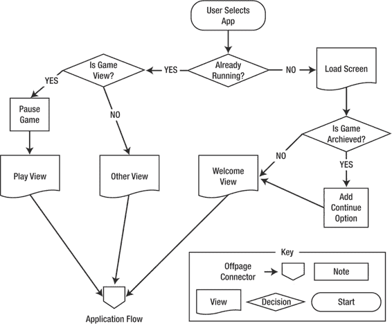

# `CoinsControllerDelegate` 协议中定义任务的各个实现

`GameController` 类对 `CoinsControllerDelegate` 协议中定义的任务的实现如代码清单 3–7 所示。当 `CoinsController` 开始一个新游戏时，它会在委托对象上调用 `gameDidStart:with:`。在我们的场景中，我们需要确保剩余回合标签和得分标签反映了游戏的初始值。这些值几乎可以是任何内容，因为我们不知道是开始一个新游戏还是继续一个旧游戏。类似地，每当调用 `scoreIncreases:with:` 和 `turnsRemainingDecreased:with:` 任务时，这些标签都会更新。

最后，在代码清单 3–7 中，当游戏结束时，会调用 `gameOver:with:` 任务。在这个任务中，我们记录最高分并切换到最高分视图。由于我们允许游戏在横屏或竖屏模式下运行，游戏结束时手机可能处于横屏状态。如果是这种情况，我们需要确保界面方向正确，以便最高分视图能正确显示。一种实现方法是简单地重置 `UIWindow` 的 `rootViewController` 属性。这将导致调用 `shouldAutorotateToInterfaceOrientation:`，从而确保我们的视图以正确的方向显示。

## `HighscoreController`：一个简单、可复用的组件

`HighscoreController` 类负责管理用于显示最高分的视图以及持久化这些最高分。`HighscoreController` 是一个相当简单的类——该类的头文件如代码清单 3–8 所示。

**代码清单 3–8.** *HighscoreController.h*

```
#define KEY_HIGHSCORES @"KEY_HIGHSCORES"

#import <UIKit/UIKit.h>

#import "Highscores.h"

#import "Score.h"

[www.it-ebooks.info](http://www.it-ebooks.info/)


**54**

**第 3 章：探索游戏应用程序生命周期**

@interface HighscoreController : UIViewController {

IBOutlet UIView* highscoresView;

Highscores* highscores;

}

-(void)saveHighscores;

-(void)layoutScores:(Score*)latestScore;

-(void)addScore:(Score*)newScore;

@end
```

如代码清单 3–8 所示，`HighscoreController` 有两个字段。第一个字段 `highscoresView` 是一个 `IBOutlet`。这是一个 `UIView`，用于在屏幕上布局实际的分数。`UIView` `highscoresView` 被认为是 `UIViewController` 类自带的 `view` 属性的一个子视图。它不必是直接子视图——只需出现在视图层次结构中的某个位置即可。这与我们之前看到的其他 `UIViewController` 的模式略有不同。这样做是为了让 `HighscoreController` 的实例可以同时添加到 iPhone 和 iPad 的 XIB 文件中，并且可以在其中控制视图的布局。检查 iPhone XIB 文件，你会看到最高分视图的布局直接定义在 `HighscoreController` 内部。

字段 `highscores` 是 `Highscores` 类型。这是一个包含 `Score` 对象数组的简单类。在查看了 `HighscoreController` 中定义的三个任务的实现之后，我们将仔细研究 `Highscores` 和 `Score` 类。

## `HighscoreController` 的实现与布局

一旦应用程序为 `HighscoreController` 配置好了视图，最重要的任务就是 `addScore:` 任务。当游戏结束时，会调用此任务，应用程序应更新最高分视图并确保最高分信息被存储。代码清单 3–9 显示了 `addScore:` 的实现。

**代码清单 3–9.** *HighscoreController.m (addScore:)*

```
-(void)addScore:(Score*)newScore{

[highscores addScore:newScore];

[self saveHighscores];

[self layoutScores: newScore];

}
```

在代码清单 3–9 中，我们看到 `addScore:` 任务接受一个新的 `Score` 作为参数。`newScore` 对象被传递给对象 `highscores` 的 `addScore:` 任务，在该任务中，如果它不够高而无法成为最高分，则会被丢弃，否则会被插入到 `highscores` 中存储的十个 `Score` 的数组中。我们还看到，代码清单 3–9 中的任务调用了 `saveHighscores` 任务，然后通过调用 `layoutScores:` 来更新视图的布局。

在查看保存最高分之前，我们先来看看视图是如何更新的。代码清单 3–10 显示了 `layoutScores:` 的实现。

**代码清单 3–10.** *HighscoreController.m (layoutScores:)*

```
-(void)layoutScores:(Score*)latestScore{

for (UIView* subview in [highscoresView subviews]){

[subview removeFromSuperview];

}

CGRect hvFrame = [highscoresView frame];

float oneTenthHeight = hvFrame.size.height/10.0;

float halfWidth = hvFrame.size.width/2.0;

NSDateFormatter *dateFormat = [[NSDateFormatter alloc] init];

[dateFormat setDateFormat:@"yyyy-MM-dd"];

int index = 0;

for (Score* score in [highscores theScores]){

CGRect dateFrame = CGRectMake(0, index*oneTenthHeight, halfWidth,

oneTenthHeight);

UILabel* dateLabel = [[UILabel alloc] initWithFrame:dateFrame];

[dateLabel setText: [dateFormat stringFromDate:[score date]]];

[dateLabel setTextAlignment:UITextAlignmentLeft];

[highscoresView addSubview:dateLabel];

CGRect scoreFrame = CGRectMake(halfWidth, index*oneTenthHeight, halfWidth, oneTenthHeight);

UILabel* scoreLabel = [[UILabel alloc] initWithFrame:scoreFrame];

[scoreLabel setText:[NSString stringWithFormat:@"%d", [score score]]];

[scoreLabel setTextAlignment:UITextAlignmentRight];

[highscoresView addSubview:scoreLabel];

if (latestScore != nil && latestScore == score){

[dateLabel setTextColor:[UIColor blueColor]];

[scoreLabel setTextColor:[UIColor blueColor]];

} else {

[dateLabel setTextColor:[UIColor blackColor]];

[scoreLabel setTextColor:[UIColor blackColor]];

}

index++;

}

}
```

来自代码清单 3–10 的任务 `layoutScores:` 接受一个 `Score` 对象作为参数。这个 `Score` 对象代表玩家最近获得的分数。这使得 `HighscoreController` 能够将最新的分数标记为蓝色；其他分数将用黑色绘制。`layoutScores:` 中的第一个循环简单地删除了 `UIView` `highscoreView` 中的所有子视图。接下来的三行检查 `highscoreView` 的大小，并预先计算一些稍后会用到的尺寸值。

`layoutScores:` 中的第二个循环遍历 `highscores` 对象中包含的所有 `Score` 对象。为每个 `Score` 创建两个 `UILabel`。第一个 `UILabel` 称为 `dateLabel`，使用 `CGRect` `dateFrame` 创建，该 `CGRect` 定义了 `UILabel` 应绘制的区域。基本上，`dateFrame` 指定了 `highscoreView` 上一行的左半部分。`dateLabel` 的文本基于 `Score` 对象的 `date` 属性设置。类似地，这个过程对 `UILabel` `scoreLabel` 重复；但它将显示用户获得的分数，并放置在右侧。

最后，我们检查正在显示的分数是否是对象 `latestScore`。如果是，我们将 `UILabel` 的颜色调整为蓝色。

如果我们回顾一下代码清单 3–9，我们会看到在通过调用 `saveHighscores` 任务更新视图之前，最高分已经被保存，如代码清单 3–11 所示。

**代码清单 3–11.** *HighscoreController.m (saveHighscores)*

```
-(void)saveHighscores{

NSUserDefaults* defaults = [NSUserDefaults standardUserDefaults];

NSData* highscoresData = [NSKeyedArchiver archivedDataWithRootObject: highscores];

[defaults setObject:highscoresData forKey: KEY_HIGHSCORES];

[defaults synchronize];

}
```

代码清单 3–11 中显示的 `saveHighscores` 任务负责归档 `highscores` 对象并将其写入到永久存储位置。这里的策略是将 `highscores` 对象放入该应用程序的用户偏好设置中。这样，如果用户在同步 iTunes 后删除了应用程序，最高分也会被保留下来。为了获取用户的偏好设置，我们在 `NSUserDefaults` 类上调用 `standardUserDefaults`。


`NSUserDefaults`类型的对象本质上是用于存储键值对的映射。键必须是`NSString`，值必须是属性列表，包括`NSData`、`NSString`、`NSNumber`、`NSDate`、`NSArray`和`NSDictionary`——基本上是核心的 iOS 对象类型。我们想要存储一个`Highscores`类型的对象，但它不在这个列表中。为了实现这一点，我们必须从`highscores`对象中存储的数据创建一个`NSData`对象。

要将对象归档为`NSData`对象，我们使用`NSKeyedArchiver`类，并将`highscores`对象传递给`archivedDataWithRootObject:`方法。顾名思义，`archivedDataWithRootObject`用于归档一组对象图。在我们的例子中，根对象是`highscores`，我们知道它包含多个`Score`对象。所以看起来我们走对了方向。要使对象能被`NSKeyedArchiver`归档，它必须遵循`NSCoding`协议。最后一步是在`defaults`上调用`synchronize`；这可以确保我们的更改被保存。

## Highscores 类

`Highscores`类的实例存储一个排序后的`Score`对象列表，并处理向列表添加`Score`对象的细节。让我们看看`Highscores`类的头文件，了解这一切是如何工作的，如列表 3-12 所示。

**列表 3-12** `Highscores.h`

```
#import <Foundation/Foundation.h>

#import "Score.h"

@interface Highscores : NSObject <NSCoding>{

NSMutableArray* theScores;

}
@property (nonatomic, retain) NSMutableArray* theScores;

-(id)initWithDefaults;
-(void)addScore:(Score*)newScore;

@end
```

列表 3-12 展示了`Highscores`类的接口。正如我们所见，`Highscores`确实遵循了`NSCoding`协议。我们还可以看到它包含一个名为`theScores`的`NSMutableArray`，可以作为属性访问。定义了两个方法：一个用于用十个默认分数初始化`Highscore`，另一个用于添加新的`Scores`对象。列表 3-13 展示了这个类的实现。

**列表 3-13** `Highscores.m`

```
#import "Highscores.h"

@implementation Highscores

@synthesize theScores;

-(id)initWithDefaults{
    self = [super init];
    if (self != nil){
        theScores = [NSMutableArray new];
        for (int i=0;i<10;i++){
            [self addScore:[Score score:1 At:[NSDate date]]];
        }
    }
    return self;
}

-(void)addScore:(Score*)newScore{
    [theScores addObject:newScore];
    [theScores sortUsingSelector:@selector(compare:)];
    while ([theScores count] > 10){
        [theScores removeObjectAtIndex:10];
    }
}

- (void)encodeWithCoder:(NSCoder *)encoder{
    [encoder encodeObject:theScores forKey:@"theScores"];
}

- (id)initWithCoder:(NSCoder *)decoder{
    theScores = [[decoder decodeObjectForKey:@"theScores"] retain];
    return self;
}

-(void)dealloc{
    for (Score* score in theScores){
        [score release];
    }
    [theScores release];
    [super dealloc];
}

@end
```

列表 3-13 中展示的`Highscores`类的实现非常紧凑。

`initWithDefaults`方法初始化`NSMutableArray theScore`，然后用十个新的`Score`对象填充`theScores`。`addScore:`方法将一个新的`Score`对象添加到`theScores`中，按玩家获得的分数排序，然后移除任何多余的`Scores`。这可能导致`newScore`这个`Score`实际上并不在`NSMutableArray theScores`中。这样实现是为了让调用者不必考虑`theScore`可能不够高而不能被视为实际高分的情况。

最后两个方法`encodeWithCoder:`和`initWithCoder:`来自`NSCoding`协议。这些方法描述了`Highscores`对象如何被归档和解档。

注意，这两个方法的参数传入的对象类型相同：`NSCoder`。


`NSCoder`类提供了用于编码和解码值的任务。`NSCoder`与 iOS 中的许多其他类非常相似，因为它提供了用于读取和写入数据的类映射接口。在`encodeWithCoder:`任务中，我们使用`NSCoder`的`encodeObject:forKey:`任务将`theScore`对象写入编码器。我们传入一个键值`NSString`，在取消归档该类时，将在`initWithCoder:`中使用该键值读取回`theScores`。另外请注意，从`decodeObjectForKey:`任务返回的对象已被保留。这样做是为了确保返回的对象不会在某个未指定的时间被回收。

当使用`NSCoder`编码`NSMutableArray`时，它知道如何编码数组中的元素，但这些元素必须知道如何编码。由于`theScores`是一个填充了`Score`对象的`NSMutableArray`，我们必须告诉`Score`类如何编码和解码自身，此过程才能工作。

## Score 类

`Score`对象表示一个日期和分数值。我们已经看到`Highscores`类如何管理`Score`对象的列表。让我们快速看一下这个简单的类。列表 3–14 展示了`Score`类的头文件。

**列表 3–14.** *Score.h*

```
#import <Foundation/Foundation.h>

@interface Score : NSObject <NSCoding>{

NSDate* date;

int score;

}

@property (nonatomic, retain) NSDate* date;

@property (nonatomic) int score;

+(id)score:(int)aScore At:(NSDate*)aDate;

@end
```

如列表 3–14 所示，它定义了两个属性：`date`和`score`。还有一个便捷构造函数，用于快速创建一个填充了这两个属性的`Score`对象。如前所述，为了使归档过程正常工作，`Score`类必须遵循`NSCoding`协议。列表 3–15 展示了`Score`类的实现。

[www.it-ebooks.info](http://www.it-ebooks.info/)


**第 3 章：探索游戏应用程序生命周期**

**59**

**列表 3–15.** *Score.m*

```
#import "Score.h"

@implementation Score

@synthesize date;

@synthesize score;

+(id)score:(int)aScore At:(NSDate*)aDate{

Score* highscore = [[Score alloc] init];

[highscore setScore:aScore];

[highscore setDate:aDate];

return highscore;

}

- (void)encodeWithCoder:(NSCoder *)encoder{

[encoder encodeObject:date forKey:@"date"];

[encoder encodeInt:score forKey:@"score"];

}

- (id)initWithCoder:(NSCoder *)decoder{

date = [[decoder decodeObjectForKey:@"date"] retain];

score = [decoder decodeIntForKey:@"score"];

return self;

}

- (NSComparisonResult)compare:(id)otherObject {

Score* otherScore = (Score*)otherObject;

if (score > [otherScore score]){

return NSOrderedAscending;

} else if (score < [otherScore score]){

return NSOrderedDescending;

} else {

return NSOrderedSame;

}

}

@end
```

列表 3–15 向我们展示了几个要点。我们看到`score:At:`的实现只是创建一个新的`Score`对象并填充属性。`compare:`任务由`Highscores`用于对`Score`对象进行排序（参见列表 3–13 中的`addScore`任务）。

最后，我们看到了现在熟悉的用于归档和解归档的任务：`encodeWithCoder:`和`initWithCoder:`。在`Score`类的情况下，我们使用`NSCoder`的对象方法存储`NSDate date`。对于`int score`，我们必须使用特殊任务，因为`int`不是对象。`NSCoder`为原始类型提供了特殊任务。在我们的例子中，我们使用了`decodeInt:ForKey:`和`encodeInt:ForKey:`。对于其他原始类型，如`BOOL`、`float`、`double`等，也存在类似的任务。

我们已经查看了我们想要归档（和解归档）的类所需的实现，但尚未查看如何从用户偏好设置中实际解归档对象。列表 3–16 展示了在`HighscoreController`类中如何完成此操作。

[www.it-ebooks.info](http://www.it-ebooks.info/)


**60**

**第 3 章：探索游戏应用程序生命周期**

**列表 3–16.** *HighscoreController（viewDidLoad）*

```
- (void)viewDidLoad

{

[super viewDidLoad];

[highscores release];

NSData* highscoresData = [[NSUserDefaults standardUserDefaults]

dataForKey:KEY_HIGHSCORES];
```


`if (highscoresData == nil){`

```
highscores = [[[Highscores alloc] initWithDefaults] retain];
[self saveHighscores];
} else {
highscores = [[NSKeyedUnarchiver unarchiveObjectWithData: highscoresData] retain];
}
[self layoutScores:nil];
```

`viewDidLoad`任务（来自代码清单 3–16）在`HighscoreController`的视图加载时被调用。在此任务中，我们希望准备好`HighscoreController`以供使用。这意味着要确保`highscores`处于可用且准确的状态，并且我们希望在添加新分数之前，布置好当前的最高分数集。为了检索当前的最高分数，我们从调用`standardUserDefaults`返回的`NSUserDefaults`对象中读取一个`NSData`对象。如果`NSData`对象为`nil`（首次运行应用时会发生），则初始化一个新的`Highscores`对象并立即保存它。如果`NSData`对象不为`nil`，则通过调用`NSKeyedUnarchiver`的任务`unarchiveObjectWithData`来解档它，并保留结果。

在本节中，我们已经了解了对象如何被归档和解档。现在，我们将使用相同的原理来展示如何归档和解档我们的游戏状态。

## 保留游戏状态

随着 iOS 设备上后台执行的出现，保留游戏或应用状态的重要性有所降低。但一个功能完善且用户友好的应用，在应用被终止时，应当能够优雅地处理状态恢复。保留状态所需的步骤与存储其他类型的数据并无本质区别。这是许多应用的一个关键特性。

我们首先需要理解的是，何时应尝试恢复状态或归档状态。图 3–11 是一个流程图，描述了示例应用在初始化方面的生命周期。

[www.it-ebooks.info](http://www.it-ebooks.info/)




**第 3 章：探索游戏应用生命周期**

**61**

**图 3–11.** *示例应用的初始化生命周期* 在图 3–11 中，我们看到所有应用都始于用户点击应用图标。此后会发生两种情况之一：要么应用（如果已在后台运行）会被带到前台，要么应用会从头启动。如果应用已在运行，它将在屏幕上精确显示为用户离开时的状态；我们无需编写任何代码来重建状态。在动作游戏中，您可能希望在应用被带到前台时暂停游戏；这会让用户在游戏恢复前有机会重新定位。无论是哪种情况，我们都会回到图 3–1 所示的应用流程。

如果应用尚未运行，我们照常显示加载屏幕，然后检查游戏状态是否已被归档。如果是，我们想要解档游戏状态并显示“继续”按钮。然后我们继续执行图 3–1 所示的流程。为了支持需要解档游戏状态的情况，我们显然需要在某个时间点归档它。让我们先来看归档逻辑，然后再看解档逻辑。

[www.it-ebooks.info](http://www.it-ebooks.info/)


**62**

**第 3 章：探索游戏应用生命周期**

## 归档与解档游戏状态

在示例应用中，我们将游戏状态存储在一个名为`CoinsGame`的类中。

我们将把这个类的一些实现细节留到下一章介绍，但既然我们知道它正在被归档和解档，我们就知道它可能遵循`NSCoding`协议。确实如此——代码清单 3–17 展示了这两个`NSCoding`任务的实现。

**代码清单 3–17.** *`CoinsGame.m`（`encodeWithCoder:` 和 `initWithCoder:`）*

```
- (void)encodeWithCoder:(NSCoder *)encoder{
    [encoder encodeObject:coins forKey:@"coins"];
    [encoder encodeInt:remaingTurns forKey:@"remaingTurns"];
    [encoder encodeInt:score forKey:@"score"];
}
```


`[encoder encodeInt:colCount forKey:@"colCount"];`

`[encoder encodeInt:rowCount forKey:@"rowCount"];`

```
}

- (id)initWithCoder:(NSCoder *)decoder{

coins = [[decoder decodeObjectForKey:@"coins"] retain];

remaingTurns = [decoder decodeIntForKey:@"remaingTurns"]; score = [decoder decodeIntForKey:@"score"];

colCount = [decoder decodeIntForKey:@"colCount"];

rowCount = [decoder decodeIntForKey:@"rowCount"];

return self;

}
```

在**清单 3–17**中，我们看到了 `CoinsGame` 用于支持归档和解归档的任务。

在每个任务中，一些属性被编码或解码——我想这并不令人惊讶。对象可以在应用生命周期的任何时间点被归档，但有一些特殊的任务会在应用关闭或终止时被调用。以下是这些任务：

- `(void)applicationWillTerminate:(UIApplication *)application`
- `(void)applicationDidEnterBackground:(UIApplication *)application`

`applicationWillTerminate:` 任务在应用被终止之前被调用。其对应任务 `applicationDidEnterBackground:` 类似，但它是在应用被发送到后台时被调用的。如果你的应用支持后台执行（新项目中的默认设置），则 `applicationWillTerminate:` 不会被调用；你必须将归档逻辑放在 `applicationDidEnterBackground:` 中。这是因为用户可以在任何时间点将应用退出到后台，因此在应用完全活跃时提前完成记账工作是有意义的。应用委托还有其他一些生命周期任务可用。当你在 Xcode 中创建新项目时，这些任务会自动添加到你的应用委托类中，并附带良好的文档说明。

[www.it-ebooks.info](http://www.it-ebooks.info/)


