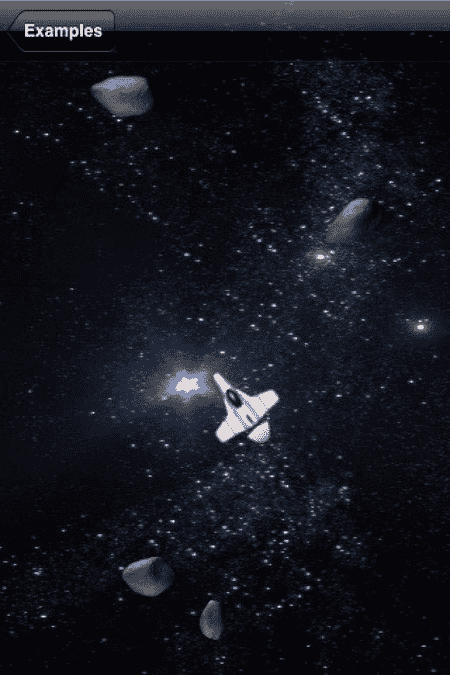
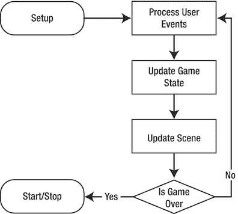

# 第 4 章：快速构建输入驱动型游戏

### 小结

在本章中，我们探讨了如何创建输入驱动型游戏。这包括理解游戏状态管理、用户输入基础知识，以及使用核心动画创建动画。游戏状态通过创建一个类来以不依赖显示的方式保存重新创建游戏所需的数据来进行管理。为了让用户与游戏交互，必须向正确的视图添加基本的手势识别器。控制器类在特定游戏上下文中解释每个用户手势，并生成反映游戏状态变化的动画。

[www.it-ebooks.info](http://www.it-ebooks.info/)

### 第 5 章

## 快速构建逐帧游戏

我们已经看过一个动作完全由用户输入驱动的简单游戏。在本章中，我们将研究无论用户是否提供输入都持续动画化的游戏。动作游戏是此类游戏的典型例子。我们不会在本章制作一个完整的游戏，但会实现其中的一部分。**图 5–1**展示了一个我们将要创建的场景。

**图 5–1.** *一个逐帧太空游戏*

L. Jordan, *Beginning iOS 5 Games Development*
© Lucas Jordan 2011

[www.it-ebooks.info](http://www.it-ebooks.info/)

**96**

