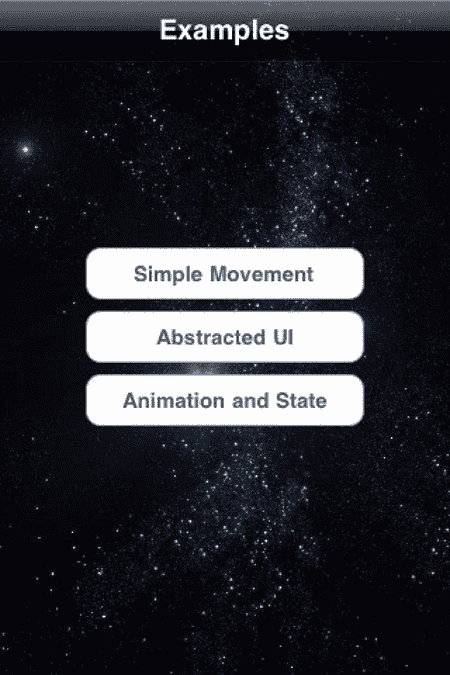

# 第 5 章：快速构建逐帧游戏

在**图 5–1**中，我们看到一艘宇宙飞船正在躲避一些小行星。你将学习如何为场景中的不同元素设置动画，根据用户输入移动飞船，并检测飞船与小行星之间的碰撞。

多年来，有多种不同的技术被用于创建这些类型的游戏。这些不同的技术关注的是内容如何在屏幕上绘制。一个例子是 OpenGL，它提供了对显示器的底层访问。UIKit 提供的类（如`UIView`及其同类）也非常适合这些类型的游戏。无论使用哪种技术来更新屏幕，这些类型的游戏通常都以相同的方式工作，通过创建如**图 5–2**所示的循环。

**图 5–2.** *典型的逐帧应用程序循环*

在**图 5–2**中，我们看到，在应用程序设置完成后，会创建一个循环，负责处理用户事件、更新游戏状态、更新屏幕上的场景，最后检查游戏是否结束。在 iOS 上创建以这种方式运行的应用程序时，我们不必显式创建循环——应用程序已经在运行一个与**图 5–1**中描述的非常相似的循环。让我们仔细看看如何设置一个 iOS 应用程序来实现逐帧动画。

[www.it-ebooks.info](http://www.it-ebooks.info/)

**97**

