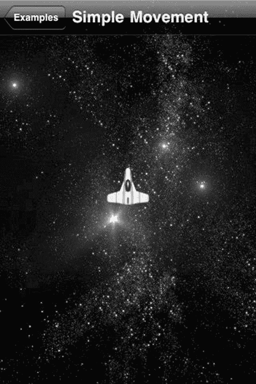

# 第 5 章：快速构建逐帧游戏

## 设置你的第一个逐帧动画

本章附带的示例代码包含三个示例。每个示例都基于前一个示例构建，以阐述不同的概念。运行示例代码时，你将看到一个类似于**图 5–3**的屏幕。

**图 5–3.** *示例菜单*

在**图 5–3**中，我们看到每个示例的按钮。点击每个按钮将动画化屏幕并显示示例。让我们从顶部的“简单移动”开始。

[www.it-ebooks.info](http://www.it-ebooks.info/)

**98**

