# 与飞船

飞船将重置到屏幕中央，小行星则被移除。这个简单游戏的目标是躲避迎面而来的小行星。

本节的目标之一是解释如何将游戏逻辑与屏幕绘制逻辑分离开。在第一个示例中，我们直接继承了`UIImageView`并添加了关于飞船的逻辑。这种方法虽然可行，但将游戏逻辑与其显示方式分离有很多充分的理由。首先，如果你想在 iPad 而不是 iPhone 上运行这个游戏，你很可能希望扩大游戏区域。此外，为了支持诸如游戏内缩放或显示小地图等功能，以不依赖于显示方式的方式存储游戏中每个物体的位置是合理的。将来，你可能会决定将游戏移植到另一个平台。在这种情况下，清晰分离游戏逻辑和显示逻辑将为你节省大量工作。

为了支持这种游戏逻辑与显示逻辑之间的抽象，我们引入了一个名为`Actor02`的新类。通常这个类会直接叫做`Actor`。名称中的`02`仅表示它是本章第二个示例的一部分。下一节将解释什么是 actor，以及它如何帮助实现游戏逻辑与显示之间的抽象。

## 理解 Actors

Actor 是游戏中移动的物体。在我们的例子中，飞船和小行星都是 actor。这区别于游戏中可能存在的其他东西，比如用于显示分数的标签或其他组件。

Actor 有时被称为精灵，但我更倾向于使用 actor 这个词，因为精灵一词也可以指代用于显示游戏物体的图像。在日常交流中，使用哪个术语差别不大——但我们就称它们为 actor。

## Example2Controller 概览

在我们的示例中，我们将定义类`Actor02`，并展示如何继承`Actor02`来创建我们的游戏物体：飞船和小行星。代码清单 5-7 展示了`Actor02`类的头文件。

### 代码清单 5-7. *Actor02.h*

```
#import <Foundation/Foundation.h>

@class Example02Controller;

long nextId;

@interface Actor02 : NSObject {

}

@property (nonatomic, retain) NSNumber* actorId;

@property (nonatomic) CGPoint center;

@property (nonatomic) float speed;

@property (nonatomic) float radius;

@property (nonatomic, retain) NSString* imageName;

-(id)initAt:(CGPoint)aPoint WithRadius:(float)aRadius AndImage:(NSString*)anImageName;

-(void)step:(Example02Controller*)controller;

-(BOOL)overlapsWith: (Actor02*) actor;

@end
```

在代码清单 5-7 中，我们看到`Actor02`类的头文件。其中有五个属性代表了本例所需的基本属性。属性`actorId`用于标识 actor；我们将会看到如何利用它把每个`Actor02`映射到一个`UIImageView`上。

属性`center`告诉我们每个`Actor02`的位置。属性`speed`表示这个 actor 的移动速度。属性`radius`代表这个 actor 的大小。最后，属性`imageName`描述了这个 actor 应该如何绘制在屏幕上。

属性`center`的类型是`CGPoint`。严格来说，我们不会直接用这个`CGPoint`来设置`UIView`或其他 Core Graphics 组件的位置。但`CGPoint`是一种封装 X 和 Y 值的简单方式，而且我们已经对它很熟悉了。对于本例来说，使用`CGPoint`还是我们自定义的结构体来表示一个点，差别不大。然而，如果你想确保代码完全不依赖于 Core Graphics，你就需要定义自己的类型来表示点。

在代码清单 5-7 中还需注意的是，一个`Actor02`没有宽度或高度，只有一个半径。这样做是为了简化示例，而且许多游戏只需要一个维度来描述 actor 的大小。如果你构建自己的游戏框架，你可能会选择让 actor 包含宽度和高度——这完全取决于游戏。当然，如果你查看预构建的游戏引擎，会发现它们的基础类型具有各种你可能用上也可能用不上的功能。使用游戏引擎也许很有道理，但在这里，我们为了理解而牺牲了复杂性。

## 一个简单的 Actor

代码清单 5-7 显示`Actor02`定义了三个任务。代码清单 5-8 展示了这些任务的实现。

### 代码清单 5-8. *Actor02.m*

```
#import "Actor02.h"

@implementation Actor02

@synthesize actorId;

@synthesize center;

@synthesize speed;

@synthesize radius;

@synthesize imageName;

-(id)initAt:(CGPoint)aPoint WithRadius:(float)aRadius AndImage:(NSString*)anImageName{

self = [super init];

if (self != nil){

[self setActorId:[NSNumber numberWithLong:nextId++]];

[self setCenter:aPoint];

[self setRadius:aRadius];

[self setImageName:anImageName];

}

return self;

}

-(void)step:(Example02Controller*)controller{

//由子类实现。

}

-(BOOL)overlapsWith: (Actor02*) actor {

float xdist = abs(self.center.x - actor.center.x);

float ydist = abs(self.center.y - actor.center.y);

float distance = sqrtf(xdist*xdist+ydist*ydist);

return distance < self.radius + actor.radius;

}

@end
```

在代码清单 5-8 中，我们看到`Actor02`类的实现。任务`initAt:WithRadius:AndImage:`用于使用一些基本信息初始化`Actor02`。该任务还通过使用`nextId`值并递增它来分配一个随机的`actorId`值。由于`nextId`的类型是`long`，你需要创建数量惊人的 actor 才能让两个 actor 拥有相同的 id。

任务`step:`接收一个`Example02Controller`的实例，用于逐步更新这个`Actor02`的位置和状态。子类将提供该任务的实现，以实现自定义行为和动画。

最后一个任务`overlapsWith:`用于检查这个`Actor02`是否与另一个`Actor02`重叠。本例中，该任务用于碰撞检测。

## Actor 子类：Viper02

我们知道，本例中有两种类型的 actor：小行星和飞船。让我们看看`Viper02`类，并了解它与`Viper01`有何不同。`Viper02`的头文件如代码清单 5-9 所示。

### 代码清单 5-9. *Viper02.h*

```
@class Example02Controller;

@interface Viper02 : Actor02 {

}

@property CGPoint moveToPoint;

+(id)viper:(Example02Controller*)controller;

-(void)doCollision:(Actor02*)actor In:(Example02Controller*)controller;

@end
```

在代码清单 5-9 中，我们看到`Viper02`的头文件与代码清单 5-2 中所示的`Viper01`没有太大区别。`Viper02`继承的是`Actor02`类，而非`UIImageView`。我们拥有属性`moveToPoint`，这与之前一样，但属性`speed`缺失了，因为它继承自`Actor02`。我们有一个新的构造方法来简化`Viper02`的创建，以及一个名为`doCollision:In:`的新任务，用于处理与小行星碰撞的新功能。代码清单 5-10 展示了`Viper02`类的实现。

### 代码清单 5-10. *Viper02.m*

```
#import "Viper02.h"

#import "Example02Controller.h"

@implementation Viper02

@synthesize moveToPoint;

+(id)viper:(Example02Controller*)controller{

CGSize gameAreaSize = [controller gameAreaSize];

CGPoint center = CGPointMake(gameAreaSize.width/2, gameAreaSize.height/2); Viper02* viper = [[Viper02 alloc] initAt:center WithRadius:16 AndImage:@"viper"];

[viper setMoveToPoint:center];

[viper setSpeed:.8];

return [viper autorelease];

}
```


```markdown

- (void)step:(Example02Controller*)controller {

    CGPoint c = [self center];

    float dx = (moveToPoint.x - c.x);

    float dy = (moveToPoint.y - c.y);

    float theta = atan(dy / dx);

    float dxf = cos(theta) * self.speed;

    float dyf = sin(theta) * self.speed;

    if (dx < 0) {
        dxf *= -1;
        dyf *= -1;
    }

    c.x += dxf;
    c.y += dyf;

    if (abs(moveToPoint.x - c.x) < self.speed && abs(moveToPoint.y - c.y) < self.speed) {
        c.x = moveToPoint.x;
        c.y = moveToPoint.y;
    }

    [self setCenter:c];
}

- (void)doCollision:(Actor02*)actor In:(Example02Controller*)controller {

    CGSize gameAreaSize = [controller gameAreaSize];
    CGPoint centerOfGame = CGPointMake(gameAreaSize.width / 2, gameAreaSize.height / 2);
    self.center = centerOfGame;
    self.moveToPoint = centerOfGame;
    [controller removeActor:actor];
}

@end

[www.it-ebooks.info](http://www.it-ebooks.info/)


# 第 5 章：快速构建逐帧游戏

在代码清单 5-10 中，我们看到构造函数任务`viper:`创建了一个新的`Viper02`对象，并使用父任务`initAt:WithRadius:AndImage`来设置对象的基本属性。此外，属性`moveToPoint`被设置为其当前位置，速度设置为 0.8。

任务`step:`是每帧动画调用一次的任务。该任务的实现与类`Actor01`中的任务`updateLocation:`的实现相同，如代码清单 5-5 所示。

代码清单 5-10 中的最后一个任务是`doCollision:In:`，当该`Viper02`与`Asteroid02`重叠时调用。该任务将`Viper02`重置回游戏区域中心的起始位置，并从游戏中移除违规的`Asteroid02`。

### Actor 子类：Asteroid02

在查看了类`Viper02`之后，可能不清楚它与`Viper01`到底有何不同。当然，有些事情发生了变动，但它看起来非常相似：它仍然主要负责更新一个中心点。在查看了类`Asteroid02`之后，我们将看到这些 actor 类是如何用于描述一个场景，而不是场景本身。类`Asteroid02`的头文件如代码清单 5-11 所示。

**代码清单 5-11.** *Asteroid02.h*

```
#import <Foundation/Foundation.h>
#import "Actor02.h"

NSMutableArray* imageNameVariations;

@interface Asteroid02 : Actor02 {
}

+(NSMutableArray*)imageNameVariations;
+(id)asteroid:(Example02Controller*)controller;

@end
```

在代码清单 5-11 中，类`Asteroid02`的头文件显示它继承了`Actor02`，并有两个静态任务。还有一个名为`imageNameVariations`的数组。该数组与任务`imageNameVariations`结合，允许我们创建图形相似但略有不同的`Asteroid02`。让我们看看这个类的实现，了解一下这意味着什么，如代码清单 5-12 所示。

**代码清单 5-12.** *Asteroid02.m*

```
#import "Asteroid02.h"
#import "Example02Controller.h"

@implementation Asteroid02

+(id)asteroid:(Example02Controller*)controller{

    CGSize gameAreaSize = [controller gameAreaSize];
    float radius = arc4random()%8+8;
    float x = radius + arc4random()%(int)(gameAreaSize.width+radius*2);
    CGPoint center = CGPointMake(x, -radius);
    NSString* imageName = [[Asteroid02 imageNameVariations]
                           objectAtIndex:arc4random()%3];
    Asteroid02* asteroid = [[Asteroid02 alloc] initAt:center WithRadius:radius AndImage:imageName];
    float speed = (arc4random()%10)/10.0 + .1;
    [asteroid setSpeed: speed];
    return asteroid;

}

+(NSMutableArray*)imageNameVariations{
    if (imageNameVariations == nil){
        imageNameVariations = [NSMutableArray new];
        [imageNameVariations addObject:@"AsteroidA"];
        [imageNameVariations addObject:@"AsteroidB"];
        [imageNameVariations addObject:@"AsteroidC"];
    }
    return imageNameVariations;
}

-(void)step:(Example02Controller*)controller{
    CGPoint newCenter = self.center;
    newCenter.y += self.speed;
    self.center = newCenter;
    if (newCenter.y - self.radius > controller.gameAreaSize.height){
        [controller removeActor: self];
    }
}

@end
```

在代码清单 5-12 中，构造函数任务`asteroid:`创建了一个新的`Asteroid02`对象并设置了其初始状态。为了增加多样性，每个小行星被分配一个随机的半径和随机的 X 位置。起始 Y 位置被设置为负半径，因此小行星从游戏区域顶部之外开始。每个`Asteroid02`还被分配了一个随机速度。

任务`step:`实现了`Asteroid02`的运动——它只是将属性`center`的 Y 值增加`speed`，直到到达游戏区域底部，此时它将自己从游戏中移除。

如前所述，我们希望用于表示`Asteroid02`的图形也有一定变化。为了实现这一点，我们有任务`imageNameVariations`，它惰性地填充全局的`NSMutableArray` `imageNameVariations`。在任务`asteroid:`中，从这个数组中随机抽取一个字符串，并设置为小行星的图形。图 5-8 显示了本例中使用的图像文件。

[www.it-ebooks.info](http://www.it-ebooks.info/)


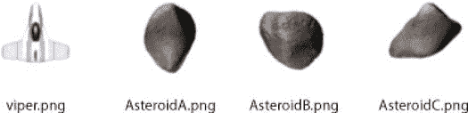

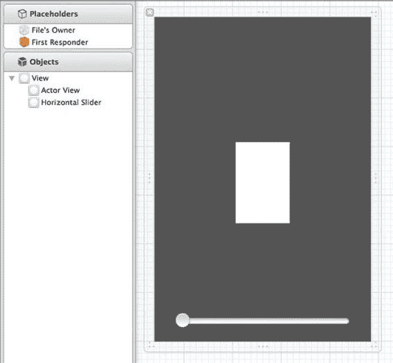

**图 5–8.** *用于 actor 的图像*

在图 5-8 中，我们看到了本例中用于 actor 的图像。每个图像由类`Actor02`的属性`imageName`指定。对于小行星，我们提供了三个不同的图像，它们被随机分配给每个新的`Asteroid02`对象。

我们已经了解了 actor 类，并看到了它们如何存储游戏中每个项目的基本信息。现在，我们来看看这些类是如何绘制在屏幕上的。

### 在屏幕上绘制 Actor

现在我们有了本例中涉及的 actor 的基本展示。将它们绑定在一起以创建我们游戏的类是`Example02Controller`。与其他`UIViewController`类一样，`Example02Controller`负责在屏幕上显示数据——在我们的例子中，是显示不同的 actor。`Example02Controller`的技巧在于创建和更新多个`UIImageView`，每个 actor 对应一个。图 5-9 显示了该 iPhone 版本的类在 Interface Builder 中的设置。

**图 5–9.** *Interface Builder 中的 Example02Controller_iPhone.xin*

[www.it-ebooks.info](http://www.it-ebooks.info/)


在图 5-9 中，我们看到左侧该`UIViewController`的根视图有两个子视图。第一个称为`Actor View`，是右侧灰色区域中间的白色区域。这是游戏将发生的视图——所有 actor 都将表示为`Actor View`子视图的`UIImageView`。另一个组件是灰色区域底部的`UISlider`。它用于控制`Actor View`的大小，使我们能够证明我们确实已将游戏的表现与游戏本身分离开来。类`Example02Controller`的头文件将概述如何实现这一点，如代码清单 5-12 所示。

**代码清单 5-13.** *Example02Controller.h*

```
#import <UIKit/UIKit.h>
#import <QuartzCore/CADisplayLink.h>
#import "Viper02.h"
#import "Actor02.h"
#import "Asteroid02.h"

@interface Example02Controller : UIViewController {

    IBOutlet UIView *actorView;
    CADisplayLink* displayLink;
    //Managing Actors
    NSMutableArray* actors;
    NSMutableDictionary* actorViews;
    //Game Logic
    Viper02* viper;
    long stepNumber;

}

@property (nonatomic) CGSize gameAreaSize;
-(void)updateScene;
-(void)removeActor:(Actor02*)actor;
-(void)addActor:(Actor02*)actor;
-(void)updateActorView:(Actor02*)actor;
- (void)tapGesture:(UIGestureRecognizer *)gestureRecognizer;
- (IBAction)sliderValueChanged:(id)sender;

@end
```


在`Listing 5–13`中，我们看到`UIView actorView`以及它是从图 5–9 所示 XIB 文件中连接出来的`IBOutlet`。在文件底部，我们看到任务`sliderValueChanged:`，它在图 5–9 中的滑块被移动时被调用。我们还看到了熟悉的`CADisplayLink`类型的`displayLink`对象，它将用于配置屏幕的重绘。`NSMutableArray actors`用于存储游戏中所有当前的演员，演员通过任务`addActor:`和`removeActor:`进行添加和移除。

`NSMutableDictionary actorViews`用于将每个演员映射到表示它的`UIImageView`。类型为`Viper02`的变量`viper`是对我们飞船的引用，最后一个变量`stepNumber`用于记录我们已经执行了多少帧游戏。与大多数`UIViewController`类一样，理解其工作原理始于查看`Listing 5–14`中所示的`viewDidLoad`任务。

[www.it-ebooks.info](http://www.it-ebooks.info/)


**114**

**第 5 章：快速构建逐帧游戏**

**Listing 5–14.** `Example02Controller.m (viewDidLoad)`

```
- (void)viewDidLoad
{
    [super viewDidLoad];
    [self setGameAreaSize:CGSizeMake(160, 240)];
    actors = [NSMutableArray new];
    actorViews = [NSMutableDictionary new];
    Actor02* background = [[Actor02 alloc] initAt:CGPointMake(80, 120) WithRadius:120
                                     AndImage:@"star_field_iphone"];
    [self addActor: background];
    viper = [Viper02 viper:self];
    // [viper setMoveToPoint:viper.center];
    [self addActor:viper];
    stepNumber = 0;
    UITapGestureRecognizer* tapRecognizer = [[UITapGestureRecognizer alloc]
                                            initWithTarget:self action:@selector(tapGesture:)];
    [tapRecognizer setNumberOfTapsRequired:1];
    [tapRecognizer setNumberOfTouchesRequired:1];
    [actorView addGestureRecognizer:tapRecognizer];
    displayLink = [CADisplayLink displayLinkWithTarget:self
                                            selector:@selector(updateScene)];
    [displayLink addToRunLoop:[NSRunLoop currentRunLoop]
                    forMode:NSDefaultRunLoopMode];
}
```

在`Listing 5–14`中，在调用`viewDidLoad`的父类实现之后，我们设置了属性`gameAreaSize`。在第一个示例中，我们使用`UIView`的坐标空间来描述飞船的位置。在这个示例中，我们必须独立于任何`UIView`来指定游戏区域的大小。然而，请注意，尺寸`160 x 240`恰好是 iPhone 点数的四分之一。尽管我们希望将游戏的坐标系与`UIView`层次结构的坐标系分开，但事实上 iPhone 的屏幕比例是 2:3，任何我们想在该设备上运行的游戏都应该考虑这一点。

在指定了`gameAreaSize`之后，我们初始化了`actors`和`actorViews`。然后我们添加了第一个演员。为了在其他演员后面添加星空背景，我们可以将一个新的`Actor02`添加到场景中，并指定`star_field_iphone`图像。由于基类`Actor02`没有指定任何行为，该演员将简单地位于背景中，提供漂亮的星空。使用演员作为背景的优点是它会与其他演员一起缩放和拉伸。缺点是将它与游戏中的其他演员同等对待，并消耗一些计算时间。

在添加背景之后，我们创建了`Viper02`，将其赋值给变量`viper`，并将其添加到场景中。我们存储了对它的引用，以便在用户触摸屏幕时可以轻松访问它。这是一个我们知道会频繁执行的操作，所以没有必要每次都在所有演员中搜索以找到正确的那个。对于任何给定的游戏，都需要仔细考虑哪些演员需要以特殊方式引用。

在易用性编程、执行速度和内存使用之间必须达到平衡。不幸的是，关于应该创建哪些额外的数据结构，没有硬性规定。在首次开发游戏（或应用）时，我尽量尽可能少地进行优化，而是等到游戏更加完整时，再尝试找出应用中的热点。在开发早期进行优化可能会使功能开发复杂化；然而，在开发结束时进行优化可能会更加复杂，并且可能永远无法完成。

`Listing 5–14`中的两个步骤是向`actorView`添加一个`UITapGestureRecognizer`以及设置`CADisplayLink`。这些步骤的执行方式与第一个示例完全相同。

在查看场景如何更新之前，让我们先看看任务`addActor:`和`removeActor:`，这样我们就能完整了解演员是如何被添加和移除出场景的。`Listing 5–15`显示了这两个任务。

**Listing 5–15.** `Example02Controller.m (addActor: and removeActor:)`

```
-(void)addActor:(Actor02*)actor{
    [actors addObject:actor];
}

-(void)removeActor:(Actor02*)actor{
    UIImageView* imageView = [actorViews objectForKey:[actor actorId]];
    [actorViews removeObjectForKey:actor];
    [imageView removeFromSuperview];
    [imageView release];
    [actors removeObject:actor];
    [actor release];
}
```

在`Listing 5–15`中，任务`addActor`只是将演员添加到`NSMutableArray actors`中。如果你想跟踪添加的演员，这就是你应该做的地方。

任务`removeActor`找到用于在屏幕上绘制它的`UIImageView`，并将其从`UIView actorViews`中移除。还通过调用`removeFromSuperview`将`UIImageView`从场景中移除，最后将其释放。对象`actor`也会从`NSMutableArray actors`中移除并被释放。现在我们已经了解了演员是如何被添加和移除出游戏的，让我们看看任务`updateScene`，它被周期性地调用来将我们的游戏推进一帧，如`Listing 5–16`所示。

**Listing 5–16.** `Example02Controller.m (updateScene)`

```
-(void)updateScene{
    if (stepNumber % (60*10) == 0){
        [self addActor:[Asteroid02 asteroid:self]];
    }
    for (Actor02* actor in actors){
        [actor step:self];
    }
    for (Actor02* actor in actors){
        if ([actor isKindOfClass:[Asteroid02 class]]){
            if ([viper overlapsWith:actor]){
                [viper doCollision:actor In:self];
                break;
            }
        }
    }
    for (Actor02* actor in actors){
        [self updateActorView:actor];
    }
    stepNumber++;
}
```

在`Listing 5–16`中，我们看到任务`updateScene`，这个任务是游戏的心跳，它大约每秒被调用 60 次，是我们推进游戏的地方。我们做的第一件事是检查是否要往游戏中添加新的小行星。这通过计算`stepNumber`除以 600 的余数并判断其值是否为零来实现。实际上，这相当于每 10 秒向场景中添加一个新的`Asteroid02`，因为游戏以大约每秒 60 帧的速度运行。

在测试是否应该添加新的小行星之后，我们遍历游戏中的所有演员并调用它们的`step:`方法。这使得每个演员都有机会根据其特定行为来更新其状态。背景将不做任何事，小行星将向下移动，飞船将朝着它的`moveToPoint`移动。在更新了每个演员的位置后，我们需要测试是否发生了碰撞。这通过再次遍历所有演员，找出那些是小行星的演员，并检查碰撞状态来实现。对于这个简单的例子，遍历所有演员来寻找碰撞是可以的。然而，在更复杂的应用中，改进这个算法（即使只是简单的改进）可能很重要。改进方法可以包括将所有小行星保存在它们自己的数组中，并根据位置对它们进行排序。

**为每个演员更新`UIView`**


我们已经测试过是否存在碰撞，现在需要确定每个角色的 `UIImageView` 的新位置。这一步骤在 `updateActorView:` 任务中完成，如代码清单 5-17 所示。

**代码清单 5–17.** *Example02Controller.m (updateActorView:)*

```
-(void)updateActorView:(Actor02*)actor{

UIImageView* imageView = [actorViews objectForKey:[actor actorId]]; if (imageView == nil){

UIImageView* imageView = [[UIImageView alloc] initWithImage:[UIImage imageNamed:[actor imageName]]];

[actorViews setObject:imageView forKey:[actor actorId]];

[imageView setFrame:CGRectMake(0, 0, 0, 0)];

[actorView addSubview:imageView];

}

float xFactor = actorView.frame.size.width/self.gameAreaSize.width;

float yFactor = actorView.frame.size.height/self.gameAreaSize.height; float x = (actor.center.x-actor.radius)*xFactor;

float y = (actor.center.y-actor.radius)*yFactor;

float width = actor.radius*xFactor*2;

float height = actor.radius*yFactor*2;

CGRect frame = CGRectMake(x, y, width, height);

[imageView setFrame:frame];

}
```

在代码清单 5-17 中，我们首先查找哪个 `UIImageView` 代表传入的角色。我们通过角色的 `actorId` 作为键，在 `NSMutableArray actorViews` 中查找 `UIImageView` 来实现。如果找不到 `UIImageView`，说明该角色是刚刚添加的，因此需要创建它。

创建 `UIImageView` 非常简单：只需根据角色的 `imageName` 创建一个 `UIImage`，然后用它创建一个新的 `UIImageView`。接着，我们再次使用角色 ID 作为键，将 `UIImageView` 放入 `NSMutableDictionary actorViews` 中。最后，将新的 `UIImageView` 添加到 `actorView` 中。我们将新 `UIImageView` 的 frame 设置为大小为零的 frame，以防止出现重绘问题。反正其 frame 很快就会更新。

**在屏幕上放置 UIImageView**

在创建 `UIImageView`（如果需要）之后，我们必须确定它应该绘制在屏幕上的位置。第一步是计算游戏区域大小与屏幕上 `actorView` 实际大小之间的比例关系。我们可以简单地将 `actorView` 的宽度除以游戏区域的宽度来得到 `xFactor`。对高度执行相同操作，得到 `yFactor`。一旦得到这些比例，就可以计算 `UIImageView` 的 frame。当我们计算出构成 `UIImageView` 新 frame 的四个值后，就对其进行设置。图 5-10 展示了这些值是如何计算的。

在图 5-10 中，左侧我们看到游戏区域，右侧是描述 `actorView` frame 的 `CGRect`。左侧的圆形是一个需要转换为 `actorView` 上 `CGRect` 的 `Actor02`。我们首先通过找到 `Actor02` 的左上角点来确定其 frame 的原点。通过从 `Actor02` 的中心 X 值减去其半径来找到左上角点的 X 值。通过从 `Actor02` 的中心 Y 值减去其半径来找到 Y 值。要将这些点转换到 `actorView` 的坐标空间，我们只需将左上角点的 X 值乘以 `xFactor`，Y 值乘以 `yFactor`。`xFactor` 和 `yFactor` 是 `gameAreaSize` 的宽度和高度与 `actorView` 的 frame 的宽度和高度之间的比例。为了找到 `actorView` 上 frame 的大小，我们只需将半径乘以 `xFactor` 和 `yFactor` 来得到宽度和高度。

**图 5–10.** *将游戏坐标转换为屏幕坐标*

当用户触摸 `UIView actorView` 时，我们必须反向执行此过程：将 `actorView` 上的点转换为游戏空间中的点。此转换在 `tapGesture:` 任务中完成，如代码清单 5-18 所示。

**代码清单 5–18.** *Example02Controller.h (tapGuesture:)*

```
- (void)tapGesture:(UIGestureRecognizer *)gestureRecognizer{

UITapGestureRecognizer* tapRecognizer = (UITapGestureRecognizer*)gestureRecognizer; CGPoint pointOnView = [tapRecognizer locationInView:actorView];

float xFactor = actorView.frame.size.width/self.gameAreaSize.width; float yFactor = actorView.frame.size.height/self.gameAreaSize.height; CGPoint pointInGame = CGPointMake(pointOnView.x/xFactor, pointOnView.y/yFactor);

[viper setMoveToPoint:pointInGame];

}
```

在代码清单 5-18 中，我们通过调用 `tapRecognizer` 上的 `locationInView:` 方法并传入 `actorView` 来找到用户触摸的位置，并将结果存储在 `pointOnView` 中。重新计算 `xFactor` 和 `yFactor` 值后，我们只需将 `pointOnView` 的 X 和 Y 值除以 `xFactor` 和 `yFactor`，得到 `pointInGame`。使用这个值，我们只需用 `pointInGame` 设置 `viper` 的 `moveToPoint` 属性。

为了结束这个例子，让我们看一下改变 `actorView` 大小的代码，如代码清单 5-19 所示。

**代码清单 5–19.** *Example02Controller.m (sliderValueChanged:)*

```
- (IBAction)sliderValueChanged:(id)sender {

UISlider* slider = (UISlider*)sender;

float newWidth = [slider value];

float newHeight = gameAreaSize.height/gameAreaSize.width*newWidth; CGRect parentFrame = [[actorView superview] frame];

float newX = (parentFrame.size.width-newWidth)/2.0;

float newY = (parentFrame.size.height-newHeight)/2.0;

CGRect newFrame = CGRectMake(newX, newY, newWidth, newHeight);

[actorView setFrame:newFrame];

}
```

在代码清单 5-19 中，当用户调整屏幕底部的滑块时，会调用 `sliderValueChanged:` 任务。滑块配置的值范围为 80 到 320，我们将这个值用作 `newWidth`。我们基于 `newWidth` 计算 `newHeight`，以保持宽高比。一旦我们为 `actorView` 获得了新的宽度和高度，我们就找到能让 `actorView` 保持居中的 X 和 Y 值。当我们计算出 `actorView` 新 frame 的所有值后，只需设置它即可。

## 角色状态与动画

现在我们具备了一套基本的动画，是时候为角色增添一些活力了。我们将扩展前面的例子并添加两个效果。第一个是让陨石看起来像是在太空中翻滚。第二个是让飞船在移动之前旋转。这两种技术都会更新用于表示每个角色的图像以营造视觉效果。我们还将为飞船添加一些状态逻辑，以便能够跟踪飞船应该做什么：保持不动、旋转还是向目标点移动。图 5-10 展示了这个新示例的运行效果。

**图 5–11.** *为角色添加动画和状态*

### 翻滚效果

在图 5-11 中，我们看到飞船正在向左上方的某个点推进。场景中有四个陨石，每个都有不同的图形。当你运行示例时，你会看到它们似乎在翻滚。这种翻滚效果是通过在动画的每几帧之间更换用于表示陨石的图像来实现的。

这些图像用于创建动画，就像手翻书一样。图 5-12 展示了用于创建动画的图像。

**图 5–12.** *构成陨石变体 B 动画的图像*


好的，作为高级文档工程师和翻译员，我已根据您提供的注意事项和示例格式，对给定的英文文本进行了翻译。


# 排版后的内容

在图 5-12 中，我们看到了 31 张小行星图像。如果这些图像按顺序依次显示，从左上角移动到右下角，就会看起来像小行星在滚动。这个动画是一个循环，因此可以在最后一张图像之后显示第一张图像，从而创建出平滑的动画效果。为了理解我们如何实现这个动画，让我们来看一下更新类`Actor03`的头文件，如清单 5-20 所示。

**清单 5-20.** `Actor03.h`

```
#import <Foundation/Foundation.h>

@class Example03Controller;

long nextId;

@interface Actor03 : NSObject {

}

@property (nonatomic, retain) NSNumber* actorId;

@property (nonatomic) CGPoint center;

@property float rotation;

@property (nonatomic) float speed;

@property (nonatomic) float radius;

@property (nonatomic, retain) NSString* imageName;

@property (nonatomic) BOOL needsImageUpdated;

-(id)initAt:(CGPoint)aPoint WithRadius:(float)aRadius AndImage:(NSString*)anImageName;

-(void)step:(Example03Controller*)controller;

-(BOOL)overlapsWith: (Actor03*) actor;

@end
```

在清单 5-20 中，我们看到了一些小的改动。我们添加了两个新属性：`rotation`和`needsImageUpdate`。`rotation`属性并不指小行星的旋转；`rotation`属性将被更新后的`Viper03`类用来指示其面向的方向。`needsImageUpdated`属性是一个指示符，表示应该为该 actor 使用新的`UIImage`。通过将这个值设置为`Yes`，我们让每一颗小行星在动画过程中请求一张新图像。让我们看看利用此属性的`Asteroid03`类中的改动——见清单 5-21。

**清单 5-21.** `Asteroid03.h`和`Asteroid03.m`（部分）

```
//From Asteroid.h

#define NUMBER_OF_IMAGES 31

…

@property (nonatomic) int imageNumber;

@property (nonatomic, retain) NSString* imageVariant;

//From Asteroid.m

-(NSString*)imageName{

return [[imageVariant stringByAppendingString:@"_"]

stringByAppendingString:[NSString stringWithFormat:@"%04d", self.imageNumber]];

}

-(void)step:(Example03Controller*)controller{

if ([controller stepNumber]%2 == 0){

self.imageNumber = imageNumber+1;

if (self.imageNumber > NUMBER_OF_IMAGES) {

self.imageNumber = 1;

}

self.needsImageUpdated = YES;

} else {

self.needsImageUpdated = NO;

}

CGPoint newCenter = self.center;

newCenter.y += self.speed;

self.center = newCenter;

if (newCenter.y - self.radius > controller.gameAreaSize.height){

[controller removeActor: self];

}

}
```

在清单 5-12 中，我们为小行星类添加了两个新属性：`imageNumber`和`imageVariant`。`imageNumber`属性跟踪当前应显示的图像。与之前的例子一样，有三种类型的小行星：A、B 和 C。`imageVariant`属性记录了应使用这三组图像序列中的哪一组。

在清单 5-12 中，我们可以看到我们添加了一个名为`imageName`的新方法。这个方法覆盖了`Actor03`中定义的合成方法。通过这种方式，我们改变了返回的图像名称。我们获取`imageVariant`并追加图像编号，如果小行星属于 B 类且`imageNumber`等于 4，则会创建一个形式如“Asteroid_B_0004”的字符串。

查看清单 5-12 中的`step`方法，我们看到我们在开头添加了一个新部分，用于更新应显示的图像。每隔一帧，我们将`imageNumber`的值加 1，当它超过常量`NUMBER_OF_IMAGES`时重置为 1。每次更改`imageNumber`时，我们希望将`needsImageUpdated`设置为`YES`，否则设置为`NO`。让我们看一下`updateActorView:`方法，看看`Example03Controller`如何使用这些信息来确保显示正确的图像。见清单 5-22。

**清单 5-22.** `Example03Controller.m`（`updateActorView:`）

```
-(void)updateActorView:(Actor03*)actor{

UIImageView* imageView = [actorViews objectForKey:[actor actorId]]; if (imageView == nil){

UIImageView* imageView = [[UIImageView alloc] initWithImage:[UIImage imageNamed:[actor imageName]]];

[actorViews setObject:imageView forKey:[actor actorId]];

[imageView setFrame:CGRectMake(0, 0, 0, 0)];

[actorView addSubview:imageView];

} else {

if ([actor needsImageUpdated]){

[imageView setImage:[UIImage imageNamed:[actor imageName]]];

}

}

float xFactor = actorView.frame.size.width/self.gameAreaSize.width; float yFactor = actorView.frame.size.height/self.gameAreaSize.height; float x = (actor.center.x-actor.radius)*xFactor;

float y = (actor.center.y-actor.radius)*yFactor;

float width = actor.radius*xFactor*2;

float height = actor.radius*yFactor*2;

CGRect frame = CGRectMake(x, y, width, height);

imageView.transform = CGAffineTransformIdentity;

[imageView setFrame:frame];

imageView.transform = CGAffineTransformRotate(imageView.transform, [actor rotation]);

}
```

在清单 5-22 中，如果`needsImageUpdated`属性被设置为`True`，我们通过简单地再次对 actor 调用`imageName`来更新`imageView`的图像。这就是让小行星看起来在太空中滚动所需的全部。

**旋转效果**

既然我们有方法指示应该更新 actor 的图像，我们可以利用同样的特性来赋予飞船一些生命。在清单 5-22 的底部，我们可以看到首先将`imageView`的变换修改为单位变换，然后设置其框架，最后再次修改变换，应用旋转。

清单 5-22 中旋转逻辑的添加使我们能够创建一艘在向其`moveToPoint`移动之前先旋转朝向该点的飞船。图 5-13 显示了飞船处于不同状态时我们将要使用的精灵。

**图 5-13.** 用于不同飞船状态的图像

在图 5-13 中，我们看到了四张图像。最左边的图像用于飞船停止时。左起第二张图像用于飞船运动时。右边的两张图像用于飞船转弯时——每个转向方向各一张。让我们看看`Viper03`类的头文件，看看需要做哪些改动才能实现这一点。见清单 5-23。

**清单 5-23.** `Viper03.h`

```
#define STATE_STOPPED 0

#define STATE_TURNING 1

#define STATE_TRAVELING 2

#import <Foundation/Foundation.h>

#import "Actor03.h"

@interface Viper03 : Actor03 {

}

@property CGPoint moveToPoint;

@property int state;

@property BOOL clockwise;

+(id)viper:(Example03Controller*)controller;

-(void)doCollision:(Actor03*)actor In:(Example03Controller*)controller;

@end
```

在清单 5-23 中，我们看到我们定义了一些常量来表示我们的三种状态。我们还添加了一个新的`state`属性来记录`Viper03`的当前状态。我们还添加了`clockwise`属性来跟踪我们正在转向的方向。因此，从`Asteroid03`类我们知道，我们将在`imageName`方法中指定将使用的图像，清单 5-25 显示了`Viper03`类的`imageName`方法的样子。

**清单 5-25.** `Viper03.m`（`imageName`）

```
-(NSString*)imageName{

if (self.state == STATE_STOPPED){

return @"viper_stopped";

} else if (self.state == STATE_TURNING){

if (self.clockwise){

return @"viper_clockwise";

} else {

return @"viper_counterclockwise";

}

} else {//STATE_TRAVELING

return @"viper_traveling";

}

}
```


好的，作为高级文档工程师和翻译员，我将严格遵循注意事项和示例格式，为您翻译提供的英文文本。


在`Listing 5–25`中，任务`viper name`仅根据对象的状态返回图像名称。如果状态为`STATE_TURNING`，我们会检查`clockwise`属性以决定应使用哪个图像。为了实现行为变更，我们需要查看任务`step:`的新实现，如`Listing 5–24`所示。

**Listing 5–24.** `Viper03.m (step:)`

```
-(void)step:(Example03Controller*)controller{

    CGPoint c = [self center];

    if (self.state == STATE_STOPPED){

        if (abs(moveToPoint.x - c.x) < self.speed && abs(moveToPoint.y - c.y) < self.speed){

            c.x = moveToPoint.x;

            c.y = moveToPoint.y;

            [self setCenter:c];

        } else {

            self.state = STATE_TURNING;

            self.needsImageUpdated = YES;

        }

    } else if (self.state == STATE_TURNING){

        float dx = (moveToPoint.x - c.x);

        float dy = (moveToPoint.y - c.y);

        float theta = -atan(dx/dy);

        float targetRotation;

        if (dy > 0){

            targetRotation = theta + M_PI;

        } else {

            targetRotation = theta;

        }

        if ( fabsf(self.rotation - targetRotation) < .1){

            self.rotation = targetRotation;

            self.state = STATE_TRAVELING;

            self.needsImageUpdated = YES;

            return;

        }

        if (self.rotation - targetRotation < 0){

            self.rotation += .1;

            self.clockwise = YES;

            self.needsImageUpdated = YES;

        } else {

            self.rotation -= .1;

            self.clockwise = NO;

            self.needsImageUpdated = YES;

        }

    } else {//STATE_TRAVELING

        float dx = (moveToPoint.x - c.x);

        float dy = (moveToPoint.y - c.y);

        float theta = atan(dy/dx);

        float dxf = cos(theta) * self.speed;

        float dyf = sin(theta) * self.speed;

        [www.it-ebooks.info](http://www.it-ebooks.info/)

        

        **126**

        **CHAPTER 5: Quickly Build a Frame-by-Frame Game**

        if (dx < 0){

            dxf *= -1;

            dyf *= -1;

        }

        c.x += dxf;

        c.y += dyf;

        if (abs(moveToPoint.x - c.x) < self.speed && abs(moveToPoint.y - c.y) < self.speed){

            c.x = moveToPoint.x;

            c.y = moveToPoint.y;

            self.state = STATE_STOPPED;

            self.needsImageUpdated = YES;

        }

        [self setCenter:c];

    }

}
```

在`Listing 5–24`中，我们看到现在有一组`if`语句，根据飞船的状态控制其行为。如果飞船处于停止状态，我们会检查它是否应保持停止；如果不是，则切换到转向状态，并通过将`needsImageUpdated`设置为`Yes`来指示需要更新图像。

如果飞船处于转向状态，则根据`moveToPoint`计算转向角度，并将结果存储在变量`theta`中。由于`atan`仅返回`-π/2`到`π/2`之间的值，我们需要测试是否需要添加`π`以获得`targetRotation`。

一旦获得了`targetRotation`值，我们检查`targetRotation`与当前旋转角度的接近程度。如果它们接近，则直接将`rotation`设置为`targetRotation`，并将状态更改为`STATE_TRAVELING`。如果尚未达到`targetRotation`值，则将飞船向`targetRotation`方向旋转一小步。如果飞船正在行进，则会像之前一样向`moveToPoint`移动。

**Summary**

在本章中，我们探讨了如何创建逐帧动画，其中游戏中的项目或角色每秒多次增量更新其位置。您学习了如何将动画循环与设备屏幕的刷新率同步，以及如何以与显示无关的方式描述游戏状态，从而摆脱宿主`UIView`的坐标系。通过研究一些创建动画和为角色增添活力的简单技术，我们继续探索了此类游戏。

[www.it-ebooks.info](http://www.it-ebooks.info/)


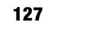

**6**

**Chapter**

**Create Your Characters:**

**Game Engine, Image**

**Actors, and Behaviors**

在本章及下一章中，我们将创建将在本书完整游戏中使用的角色类。但首先，我们需要重构前面章节的代码，以创建构成简单游戏引擎的可重用类。我们将探讨组成这个游戏引擎的类和协议，以便您理解它们如何协同工作。

我们将通过引入协议`Representation`来进一步抽象角色在屏幕上的绘制方式，该协议允许我们创建基于图像的角色以及通过程序绘制的角色（将在下一章中介绍）。

我们还将通过协议`Behavior`引入行为的概念。该协议为我们提供了一种模式，用于以可重用的方式描述角色在游戏中的行为。

通过构建我们的第一个角色——增强道具，您将开始学习如何使用游戏引擎。我们将创建一个`GameController`子类的示例，让一堆增强道具在屏幕上自由活动，以便您了解这个角色的外观和行为。

**理解游戏引擎类**

我们的简单游戏引擎从两个核心类开始：`GameController`和`Actor`。

`GameController`与前一章的控制器类非常相似，只是它已被优化用于更通用的用途。`Actor`类也进行了类似的改进，以适应更多类型的`Actor`。`Actor`类还定义了两个协议`Representation`和`Behavior`，用于以不同方式描述每个角色。协议`Representation`描述了创建和更新角色`UIView`所需的任务。协议`Behavior`描述了一个由任何希望创建共享、可重用行为的类实现的任务。以下各节将详细介绍这些类和协议。

**GameController 类**

`GameController`类协调游戏中的角色，并最终负责在屏幕上渲染每个角色。这包括将`GameController`设置为`UIViewController`，定义一种通过`CADisplayLink`重复调用`updateScene`任务的方法，最后回顾`updateScene`如何管理场景中的角色。`GameController`还提供了添加和移除角色的机制。让我们看一下`GameController`类的头文件，如`Listing 6–1`所示。

**Listing 6–1.** `GameController.h`

```
#import <UIKit/UIKit.h>

#import <QuartzCore/CADisplayLink.h>

#import "Actor.h"

@interface GameController : UIViewController {

    IBOutlet UIView* actorsView;

    CADisplayLink* displayLink;

    NSMutableSet* actors;

    NSMutableDictionary* actorClassToActorSet;

    NSMutableSet* actorsToBeAdded;

    NSMutableSet* actorsToBeRemoved;

    BOOL workComplete;

}

@property (nonatomic) long stepNumber;

@property (nonatomic) CGSize gameAreaSize;

@property (nonatomic) BOOL isSetup;

@property (nonatomic, retain) NSMutableArray* sortedActorClasses;

-(BOOL)doSetup;

-(void)displayLinkCalled;

-(void)updateScene;

-(void)removeActor:(Actor*)actor;

-(void)addActor:(Actor*)actor;

-(void)updateViewForActor:(Actor*)actor;

-(void)doAddActors;

-(void)doRemoveActors;

-(NSMutableSet*)actorsOfType:(Class)class;

@end
```

如您所见，`GameController`类的头文件扩展了`UIViewController`类。名为`actorsView`的`UIView`是一个`IBOutlet`，是包含游戏中每个角色视图的`UIView`。我们不打算将属性`view`用作角色的根视图，因为我们可能希望为`GameController`关联其他视图，例如背景图像或放置在游戏顶部的其他`UIView`。我们将在未来的章节中利用这种设置。目前，您只需知道`UIView actorsView`是属性`view`的子视图，并将包含所有角色视图。


# 在本列表中，你同样可以看到熟悉的 `CADisplayLink` 以及多个集合。`NSMutableSet actor` 存储了游戏中的所有角色。`NSMutableDictionary actorClassToActorSet` 用于跟踪特定类型的角色。两个 `NSMutableSets`，即 `actorsToBeAdded` 和 `actorsToBeRemoved`，分别用于跟踪在游戏单步执行期间创建的角色以及应在当前步骤结束后移除的角色。

声明的最后一个字段是 `BOOL workComplete`。该字段用于调试，本章后续探讨 `CADisplayLink` 的使用方式时会进一步说明。除了清单 6–1 中声明的字段外，我们还看到了四个属性。第一个属性 `stepNumber` 用于记录游戏开始以来经过的步数。`CGSize gameAreaSize` 是以游戏坐标表示的游戏区域尺寸。

`BOOL isSetup` 用于跟踪 `GameController` 是否已完成设置。最后一个属性 `sortedActorClasses` 用于告知 `GameController` 需要跟踪哪些类型的角色。

## 设置 GameController

当你查看 `GameController` 类的实现时，清单 6–1 中所有字段和属性的用途将变得清晰。我们从清单 6–2 所示的任务 `doSetup` 开始。

**清单 6–2.** *GameController.m (doSetup)*

```
-(BOOL)doSetup
{
    if (!isSetup){
        gameAreaSize = CGSizeMake(1024, 768);
        actors = [NSMutableSet new];
        actorsToBeAdded = [NSMutableSet new];
        actorsToBeRemoved = [NSMutableSet new];
        stepNumber = 0;
        workComplete = true;
        displayLink = [CADisplayLink displayLinkWithTarget:self
                                              selector:@selector(displayLinkCalled)];
        [displayLink addToRunLoop:[NSRunLoop currentRunLoop]
                         forMode:NSDefaultRunLoopMode];
        [displayLink setFrameInterval:1];
        isSetup = YES;
        return YES;
    }
    return NO;
}
```

[www.it-ebooks.info](http://www.it-ebooks.info/)

这里你可以看到 `GameController` 类的设置代码。因为我们只想设置 `GameController` 一次，所以将设置代码放在由变量 `isSetup` 控制的 `if` 语句内。如果执行了设置操作，`isSetup` 任务将返回 `YES`；否则返回 `NO`。

至于类的实际设置，我们需要初始化几个变量。首先将属性 `gameSizeArea` 设置为默认尺寸。然后初始化集合 `actors`、`actorsToBeAdded` 和 `actorsToBeRemoved`。最后，将 `stepNumber` 设置为零。

## 调用 `displayLinkCalled` 和 `updateScene`

在清单 6–2 中，最后一步是设置 `CADisplayLink`。在本章中，我们设置 `CADisplayLink` 的方式与之前的示例略有不同。我们没有让 `CADisplayLink` 直接调用 `updateScene`，而是让它调用 `displayLinkCalled`，后者再依次调用 `updateScene`，如清单 6–3 所示。

**清单 6–3.** *GameController.m (displayLinkCalled)*

```
-(void)displayLinkCalled{
    if (workComplete){
        workComplete = false;
        @try {
            [self updateScene];
            workComplete = true;
        }
        @catch (NSException *exception) {
            NSLog(@"%@", [exception reason]);
            NSLog(@"%@", [exception userInfo]);//此处设置断点
        }
    }
}
```

任务 `displayLinkCalled` 仅在变量 `workComplete` 为 true 时调用 `updateScene`。

变量 `workComplete` 仅在首次调用 `displayLinkCalled` 或 `updateScene` 成功完成时才可能为 true。如果 `updateScene` 抛出异常，则会记录异常，并且 `workComplete` 不会重置为 true。实际上，这会导致游戏在出现任何错误时停止。这是可取的行为，因为由 `CADisplayLink` 调用的任务抛出的异常会被静默忽略。为了便于调试任务 `displayLinkCalled`，需要同时记录异常并暂停游戏，让测试人员知道出现了问题。在生产环境中，你可能希望更改此行为；即使出现错误，保持应用继续运行可能更好。具体需要的行为将取决于应用程序。

## 更新 `updateScene`

任务 `updateScene` 也从前一章节进行了更新，如清单 6–4 所示。

**清单 6–4.** *GameController.m (updateScene)*

```
-(void)updateScene{
    for (Actor* actor in actors){
        [actor step:self];
    }
    for (Actor* actor in actors){
        for (NSObject<Behavior>* behavoir in [actor behaviors]){
            [behavoir applyToActor:actor In:self];
        }
    }
    for (Actor* actor in actors){
        [self updateViewForActor:actor];
    }
    [self doAddActors];
    [self doRemoveActors];
    stepNumber++;
}
```

在这个清单中，我们遍历了游戏中的所有角色三次。在第一个循环中，我们对每个角色调用 `step:`，使其有机会执行任何自定义代码。在第二个循环中，我们应用与角色关联的每个 `Behavior`。`Behavior` 是一个协议，描述角色之间的一些共享行为（该协议定义在 `Actor.h` 中，后续清单 6–9 会展示）。在第三个循环中，我们通过调用 `updateViewForActor:` 更新代表每个角色的 `UIView`。

由于角色和行为可以自由添加或移除其他角色，并且我们不想在遍历同一个集合时修改 `NSMutableSet actors`，因此我们必须分两步来添加和移除角色。为了实现这个两步过程，我们将新添加的角色存储在 `NSMutableSet actorsToBeAdded` 中，然后在任务 `doAddActors` 中处理该数组中的每个角色。对于要移除的角色，我们采用相同的模式，将它们存储在 `NSMutableSet actorsToBeRemoved` 中，然后在任务 `doRemoveActors` 中处理它们。

## 调用 `doAddActors` 和 `doRemoveActors`

我们在 `updateScene` 中采取的最后一步是调用 `doAddActors` 和 `doRemoveActors`，如清单 6–5 所示。

**清单 6–5.** *GameController.m (doAddActors 和 doRemoveActors)*

```
-(void)doAddActors{
    for (Actor* actor in actorsToBeAdded){
        [actors addObject:actor];
        UIView* view = [[actor representation] getViewForActor:actor In:self];
        [view setFrame:CGRectMake(0, 0, 0, 0)];
        [actorsView addSubview:view];
        NSMutableSet* sorted = [actorClassToActorSet valueForKey:[[actor class]
                                                                  description]];
        [sorted addObject:actor];
    }
    [actorsToBeAdded removeAllObjects];
}

-(void)doRemoveActors{
    for (Actor* actor in actorsToBeRemoved){
        UIView* view = [[actor representation] getViewForActor:actor In:self];
        [view removeFromSuperview];
        NSMutableSet* sorted = [actorClassToActorSet valueForKey:[[actor class]
                                                                  description]];
        [sorted removeObject:actor];
        [actors removeObject:actor];
    }
    [actorsToBeRemoved removeAllObjects];
}
```


好的，作为高级文档工程师和翻译员，我将按照您的要求，将给定的英文文本翻译成中文，并严格遵守格式规范。


任务`doAddActors`遍历`NSMutableSet` `actorsToBeAdded`中的所有演员，并将每个演员添加到`NSMutableSet` `actors`中。此外，每个演员的`UIView`会从其`representation`属性中获取，并作为子视图添加到`actorsView`中。`representation`属性是一个遵循`Representation`协议（定义在`Actor.h`中，见清单 6–9）的`NSObject`对象。添加视图后，我们在`NSMutableDictionary` `actorClassToActorSet`中找到与演员类对应的`NSMutableSet` `sorted`。然后，演员被添加到`NSMutableSet` `sorted`中。通过这种方式，我们可以在后续通过`NSMutableDictionary` `actorClassToActorSet`快速查找特定类型的所有演员。`doAddActors`的最后一步是从集合`actorsToBeRemoved`中移除所有演员。

在上面的清单中，我们看到与`doAddActors`并行的任务`doRemoveActors`。在`doRemoveActors`中，`NSMutableSet` `actorsToBeRemoved`中的每个演员，其关联的`UIView`会从父视图中移除，并会从对应的`NSMutableSet` `sorted`中移除。每个演员也会从`NSMutableSet` `actors`中移除。最后，通过调用`removeAllObjects`清空`NSMutableSet` `actorsToBeRemoved`。

**添加和移除演员**

要向游戏中添加或移除演员，我们分别调用`addActor`或`removeActor`，如清单 6–6 所示。

**清单 6–6.** *GameController.m (addActor 和 removeActor)*

```
-(void)addActor:(Actor*)actor{
    [actor setAdded:YES];
    [actorsToBeAdded addObject:actor];
}

-(void)removeActor:(Actor*)actor{
    [actor setRemoved:YES];
    [actorsToBeRemoved addObject:actor];
}
```

[www.it-ebooks.info](http://www.it-ebooks.info/)


**第 6 章：创建你的角色：游戏引擎、图像角色和行为** **133**

在这个清单中，你可以看到两个非常简单的任务：`addActor`和`removeActor`。在`addActor`中，传入的演员会将其`added`属性设置为`YES`，然后添加到`NSMutableSet` `actorsToBeAdded`中。同样，在`removeActor`任务中，传入的演员会将其`removed`属性设置为`YES`，并添加到`NSMutableSet` `actorsToBeRemoved`中。

之前在清单 6–5 中，当演员被添加或从集合`actors`中移除时，我们也会添加或移除存储在`NSMutableDictionary` `actorClassToActorSet`中的集合中的演员。这样做是为了能够在不遍历整个集合`actors`的情况下找到所有给定类型的演员。然而，我们并不希望为游戏中的每种演员类型都维护一个独立的集合。我们只需跟踪游戏逻辑中需要访问的演员类型。

**排序演员**

任务`setSortedActorClasses`用于指定哪些演员应该被排序，如清单 6–7 所示。

**清单 6–7.** *GameController.m (setSortedActorClasses:)*

```
-(void)setSortedActorClasses:(NSMutableArray *)aSortedActorClasses{
    [sortedActorClasses removeAllObjects];
    [sortedActorClasses release];
    sortedActorClasses = aSortedActorClasses;
    [actorClassToActorSet removeAllObjects];
    [actorClassToActorSet release];
    actorClassToActorSet = [NSMutableDictionary new];
    for (Class class in sortedActorClasses){
        [actorClassToActorSet setValue: [NSMutableSet new] forKey:[class description]];
    }
    for (Actor* actor in actors){
        NSMutableSet* sorted = [actorClassToActorSet objectForKey:[[actor class] description]];
        [sorted addObject:actor];
    }
}
```

我们首先进行一些内存管理：在重新将`sortedActorClasses`赋值给传入的`NSMutableArray` `aSortedActorClasses`之前，移除`NSMutableArray` `sortedActorClasses`中的所有对象并释放它。接下来，我们清空并释放旧的`NSMutableDictionary` `actorClassToActorSet`。完成这些管理操作后，我们为`sortedActorClass`中的每个类向`actorClassToActorSet`添加一个新的`NSMutableSet`。最后，我们遍历所有演员，并将每个演员添加到对应的`NSMutableSet`中。最后一步是必要的，以允许在应用程序中多次调用`setSortedActorClasses`；但考虑到这是一个相对昂贵的操作，最好在游戏开始时只调用一次`setSortedActorClasses`。

[www.it-ebooks.info](http://www.it-ebooks.info/)


**134**

**第 6 章：创建你的角色：游戏引擎、图像角色和行为** **管理 UIView**

对`GameController`类的最后一个改进是任务`updateViewForActor:`，如清单 6–8 所示。

**清单 6–8.** *GameController.m (updateViewForActor:)*

```
-(void)updateViewForActor:(Actor*)actor{
    NSObject<Representation>* rep = [actor representation];
    UIView* actorView = [rep getViewForActor:actor In:self];
    [rep updateView:actorView ForActor:actor In:self];
    float xFactor = actorsView.frame.size.width/self.gameAreaSize.width; 
    float yFactor = actorsView.frame.size.height/self.gameAreaSize.height; 
    float x = (actor.center.x-actor.radius)*xFactor;
    float y = (actor.center.y-actor.radius)*yFactor;
    float width = actor.radius*xFactor*2;
    float height = actor.radius*yFactor*2;
    CGRect frame = CGRectMake(x, y, width, height);
    actorView.transform = CGAffineTransformIdentity;
    [actorView setFrame:frame];
    actorView.transform = CGAffineTransformRotate(actorView.transform, [actor rotation]);
    [actorView setAlpha:[actor alpha]];
}
```

任务`updateViewForActor:`负责管理与每个演员关联的`UIView`。在该任务的第一行，我们获取演员的`representation`属性并将其存储在变量`rep`中。变量`rep`是一个遵循`Representation`协议的`NSObject`对象。`Representation`协议定义在`Actor.h`中（稍后见清单 6–9），描述了如何创建和更新给定演员的`UIView`。

`UIView`在调用`getViewForActor:In:`时被创建。当需要更新`UIView`以反映演员的变化时，会调用任务`updateView:ForActor:In:`。这两个任务将在本章后面讨论。

在确定了`UIView` `actorView`之后，我们计算它应该在父视图中所占的区域。该计算的详细描述见第 5 章。然而，我们增加了两个新特性：我们根据演员的`rotation`属性旋转`actorView`，并且设置`actorView`的`alpha`值，允许演员在游戏中改变透明度。

现在我们已经了解了`GameController`类以及它如何管理游戏中的演员，让我们来看看`Actor`类，以便了解它如何支持游戏中许多不同类型的演员。

[www.it-ebooks.info](http://www.it-ebooks.info/)


**第 6 章：创建你的角色：游戏引擎、图像角色和行为** **135**

**Actor 类**

`Actor`类是游戏中所有演员的超类。它主要提供关于演员位置的信息，但也描述了指示演员在屏幕上如何行为和呈现的协议。在本节中，我们将看到`Actor`是如何实现的，然后是一些具体的例子。我们先来看看`Actor`类的头文件，如清单 6–9 所示。

**清单 6–9.** *Actor.h*

```
#import <Foundation/Foundation.h>

@class GameController, Actor;

@protocol Representation

-(UIView*)getViewForActor:(Actor*)anActor In:(GameController*)aController;

-(void)updateView:(UIView*)aView ForActor:(Actor*)anActor
    In:(GameController*)aController;

@end

@protocol Behavior

-(void)applyToActor:(Actor*)anActor In:(GameController*)gameController;
```


# Objective-C 代码示例

```objc
@end

long nextId;

@interface Actor : NSObject {
    
}

//状态

@property (nonatomic, retain) NSNumber* actorId;

@property (nonatomic) BOOL added;

@property (nonatomic) BOOL removed;

//几何属性

@property (nonatomic) CGPoint center;

@property (nonatomic) float rotation;

@property (nonatomic) float speed;

@property (nonatomic) float radius;

//行为

@property (nonatomic, retain) NSMutableArray<Behavior>* behaviors;

//表现层

@property (nonatomic) BOOL needsViewUpdated;

@property (nonatomic, retain) NSObject<Representation>* representation;

@property (nonatomic) int variant;

@property (nonatomic) int state;

@property (nonatomic) float alpha;

-(id)initAt:(CGPoint)aPoint WithRadius:(float)aRadius
AndRepresentation:(NSObject<Representation>*)aRepresentation;

-(void)step:(GameController*)controller;

-(BOOL)overlapsWith: (Actor*) actor;

-(void)addBehavior:(NSObject<Behavior>*)behavior;

+(CGPoint)randomPointAround:(CGPoint)aCenter At:(float)aRadius;

@end
```

这里定义了`Representation`协议。任何管理`Actor`关联的`UIView`的对象都必须遵守此协议。其核心理念是，至少有两大类`UIView`用于绘制`Actor`：基于图像的和基于程序绘制的。当然，还有其他实现`UIView`的方式，例如包含子视图的`UIView`。本章不涉及这个例子，但我们会研究基于图像的`Actor`（本章）以及基于矢量的`Actor`（下一章）。

无论`Actor`的`UIView`如何实现，`GameController`类都需要知道如何获取正确的`UIView`引用，并让`Representation`有机会更新其外观。因此，我们规定了两个必需的方法：`getViewForActor:In:`和`updateView:ForActor:In:`。

在上述代码中，我们看到了第二个名为`Behavior`的协议。我们将创建一些简单的类，这些类描述`Actor`的特定行为，并且可以在不同类型的`Actor`之间共享。例如，我们将创建一个名为`LinearMotion`的行为，用来描述`Actor`如何在屏幕上移动。多种类型的`Actor`都将使用此行为。这正是`Behavior`协议的用武之地：它为我们提供了一个名为`applyToActor:From:`的必需方法，该方法会在游戏的每一步由`GameController`调用。

代码中还展示了许多属性。其中许多属性应该在上章中已经见过，包括`center`、`speed`和`radius`。此外，还添加了一些新属性，以尽可能提高`Actor`类的可复用性。`added`和`removed`这两个属性用于跟踪该`Actor`是否已被添加或移出游戏。

`behaviors`属性是一个包含遵守`Behavior`协议对象的`NSMutableArray`。通过向`behaviors`属性添加`Behavior`对象，我们可以自定义每个`Actor`的行为。这可以简单到描述`Actor`的运动，也可以复杂到实现人工智能。我们提供了一个名为`addBehavior:`的特殊方法，它是获取`NSMutableArray behaviors`并添加`Behavior`对象的快捷方式。`addBehavior:`方法也让我们有机会进行懒加载，这样如果不需要，我们就不会创建`NSMutableArray behaviors`。

你还可以在 Listing 6–9 中看到，我们添加了`variant`和`state`属性。`Actor`通常需要这两个属性，因此为了简便，它们被包含在`Actor`类中。最后一个属性是`alpha`，用于描述`Actor`在屏幕上的透明度。

Listing 6–9 中定义的方法与上一章中为`Actor`类描述的方法基本相同。唯一真正的区别在于，初始化`Actor`时必须传入一个`Representation`。我们还添加了一个实用方法`randomPointAround:At:`，用于在围绕点`aPoint`、半径为`aRadius`的圆上生成一个随机点。

---

**第六章：创建你的角色：游戏引擎、图像演员和行为** **137**

## 实现 Actor

`Actor`类的实现如 Listing 6–10 所示。

**Listing 6–10.** *Actor.m*

```objc
#import "Actor.h"

@implementation Actor

@synthesize actorId;
@synthesize added;
@synthesize removed;
@synthesize center;
@synthesize rotation;
@synthesize speed;
@synthesize radius;
@synthesize needsViewUpdated;
@synthesize representation;
@synthesize variant;
@synthesize state;
@synthesize alpha;
@synthesize behaviors;

-(id)initAt:(CGPoint)aPoint WithRadius:(float)aRadius
AndRepresentation:(NSObject<Representation>*)aRepresentation{
    self = [super init];
    if (self != nil){
        [self setActorId:[NSNumber numberWithLong:nextId++]];
        [self setCenter:aPoint];
        [self setRotation:0];
        [self setRadius:aRadius];
        [self setRepresentation:aRepresentation];
        [self setAlpha:1.0];
    }
    return self;
}

-(void)step:(GameController*)controller{
    //由子类实现。
}

-(BOOL)overlapsWith: (Actor*) actor {
    float xdist = abs(self.center.x - actor.center.x);
    float ydist = abs(self.center.y - actor.center.y);
    float distance = sqrtf(xdist*xdist+ydist*ydist);
    return distance < self.radius + actor.radius;
}

-(void)setVariant:(int)aVariant{
    if (aVariant != variant){
        variant = aVariant;
        needsViewUpdated = YES;
    }
}

-(void)setState:(int)aState{
    if (aState != state){
        state = aState;
        needsViewUpdated = YES;
    }
}

-(void)addBehavior:(NSObject<Behavior>*)behavior{
    if (behaviors == nil){
        behaviors = [NSMutableArray new];
    }
    [behaviors addObject:behavior];
}

-(void)dealloc{
    [actorId release];
    [behaviors removeAllObjects];
    [behaviors release];
    [representation release];
    [super dealloc];
}

+(CGPoint)randomPointAround:(CGPoint)aCenter At:(float)aRadius{
    float direction = arc4random()%1000/1000.0 * M_PI*2;
    return CGPointMake(aCenter.x + cosf(direction)*aRadius, aCenter.y +
                       sinf(direction)*aRadius);
}

@end
```

在这个文件的顶部，我们看到对于类的每个属性，我们简单地使用`@synthesize`来创建 getter 和 setter 方法，但`state`和`variant`属性除外。我们为`state`和`variant`属性的 setter 方法自定义了实现，以便当这些值发生变化时，将`needsViewUpdated`设置为`YES`。

这样做是为了确保当`Actor`的状态或变体发生变化时，`Actor`的`Representation`能够正确地更新代表此`Actor`的`UIView`。

`initAt:WithRadius:AndRepresentation:`方法简单地初始化`Actor`并设置传入的属性。我们还将`alpha`属性设置为`1.0`，使`Actor`默认完全不透明。

由于`Actor`现在持有了对其他多个对象的引用（例如`representation`和`behaviors`集合），我们必须为此类实现一个`dealloc`方法。如 Listing 6–10 所示，我们在调用`super dealloc`之前，释放了所有被持有的对象，并从`NSMutableArray behaviors`中移除了所有对象。

## 使用 Power-Up Actor


在上一节中，我们探讨了 `GameController` 和 `Actor` 类，了解到 `Actor` 类需要一个 `Representation` 对象才能被显示。`Representation` 协议描述了管理角色关联的 `UIView` 所必需的类应具备的条件。在本节中，我们将深入探索 `ImageRepresentation` 类，了解它如何利用图像来呈现角色。在前一章中，我们使用图像绘制了不同的角色。在本节中，我们将展示如何将这些技术整合到一个名为 `ImageRepresentation` 的简单、可复用的类中。

为了说明 `ImageRepresentation`，在第一个示例中，我们将创建增强道具并让它们动画穿过屏幕，如图 6-1 所示。

[www.it-ebooks.info](http://www.it-ebooks.info/)


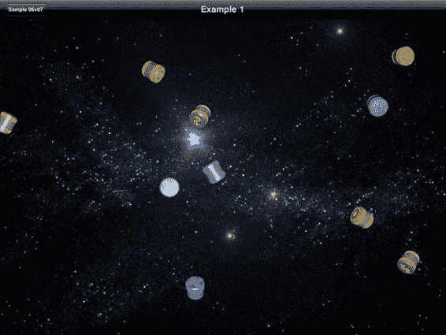

**第 6 章：创建你的角色：游戏引擎、图像角色和行为** **139**

**图 6-1.** *示例 1——增强道具*

在图中，你可以看到几个带有三种符号的圆柱体：美元符号、圆点和叉号。示例运行时，每个圆柱体沿着直线移动。当圆柱体到达屏幕边缘时，它会绕到对侧边缘。在移动过程中，每个圆柱体看起来也在自身旋转或翻转。几秒钟后，每个圆柱体上的色带和符号开始闪烁，提示它即将消失。启动示例时，屏幕上没有增强道具，但每过 5 秒，就会有一个新的增强道具从屏幕外出现并漂移进入视野。让我们仔细看看用来创建这个动画的图像。见图 6-2。

[www.it-ebooks.info](http://www.it-ebooks.info/)


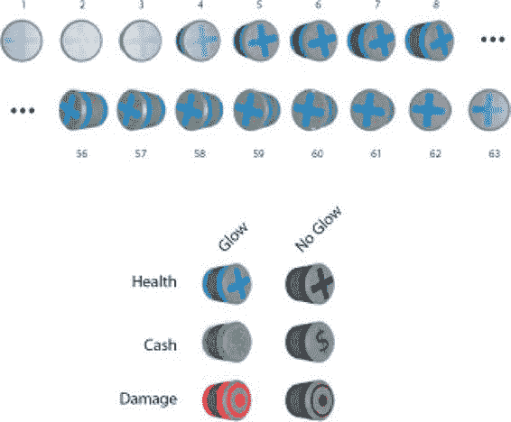

**140**

**第 6 章：创建你的角色：游戏引擎、图像角色和行为** **图 6-2.** *增强道具细节*

图 6-2 的上半部分展示了组成带有发光效果的旋转生命增强道具的 63 张图像中的首尾两张。在示例代码中，你会找到六组图像系列：每种增强道具分别有发光版和不发光版。通过在发光版和不发光版之间切换，我们可以创造出闪烁效果。

## 实现我们的增强道具角色

为了实现我们的增强道具角色，我们需要配置 `GameController` 的子类 `Example01Controller`，以便将增强道具添加到场景中。同时，我们还需要实现增强道具角色本身，赋予它绘制自身以及定义其运动和行为的机制。

关键类是 `ImageRepresentation` 和 `Powerup`，但我们应该从 `Example01Controller` 类中的 `updateScene` 任务开始，如代码清单 6-11 所示。

**代码清单 6-11.** *Example01Controller.m (updateScene)*

```
-(void)updateScene{
    if (self.stepNumber % (60*5) == 0){
        [self addActor:[Powerup powerup: self]];
    }
    [super updateScene];
}
```

这里展示了 `Example01Controller` 类中定义的 `updateScene` 任务。`Example01Controller` 类继承自 `GameController`，因此它继承了该父类中定义的游戏引擎逻辑。`updateScene` 任务简单地每 5 秒添加一个新的增强道具，然后调用父类的 `updateScene` 实现。`Powerup` 类的头文件如代码清单 6-12 所示。

**代码清单 6-12.** *Powerup.h*

```
#import <Foundation/Foundation.h>
#import "Actor.h"
#import "ImageRepresentation.h"
#import "ExpireAfterTime.h"

enum{
    STATE_GLOW = 0,
    STATE_NO_GLOW,
    PWR_STATE_COUNT
};

enum{
    VARIATION_HEALTH = 0,
    VARIATION_CASH,
    VARIATION_DAMAGE,
    PWR_VARIATION_COUNT
};

@interface Powerup : Actor <ImageRepresentationDelegate,ExpireAfterTimeDelegate>{
}
+(id)powerup:(GameController*)aController;
@end
```

这个头文件首先定义了两个枚举。第一个枚举定义了 `Powerup` 的两种状态值：`STATE_GLOW` 或 `STATE_NO_GLOW`。第二个枚举定义了 `Powerup` 的三种变体值。这两个枚举都以包含单词 `COUNT` 的值结尾。对于非 C 语言背景的开发者来说，这是一种老技巧，用于为枚举中的项数创建一个常量。例如，在第一个枚举中，`STATE_GLOW` 的值为 0，那么 `STATE_NO_GLOW` 的值就是 1。这使得 `PWR_STATE_COUNT` 的值为 2，正好是状态的数量。很巧妙，对吧？

如代码清单 6-12 所定义的，`Powerup` 类继承自 `Actor`，并遵循 `ImageRepresentationDelegate` 和 `ExpireAfterTimeDelegate` 这两个协议。在我们深入 `ImageRepresentation` 和 `ExpireAfterTime` 的细节时，会查看这些协议包含的任务。`Powerup` 类定义的新任务只有构造函数 `powerup:`。让我们看看代码清单 6-13 中的这个任务。

**代码清单 6-13.** *Powerup.m (powerup:（部分）)*

```
+(id)powerup:(GameController*)aController{
    CGSize gameSize = [aController gameAreaSize];
    CGPoint gameCenter = CGPointMake(gameSize.width/2.0, gameSize.height/2.0);
    float distanceFromCenter = sqrtf(gameCenter.x*gameCenter.x +
                                     gameCenter.y*gameCenter.y);
    CGPoint center = [Actor randomPointAround:gameCenter At:distanceFromCenter];

[www.it-ebooks.info](http://www.it-ebooks.info/)


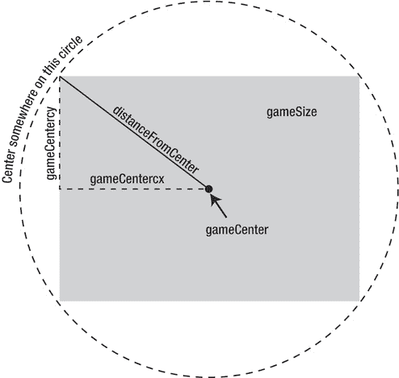

**142**

**第 6 章：创建你的角色：游戏引擎、图像角色和行为**

    ImageRepresentation* rep = [ImageRepresentation imageRep];
    [rep setBackwards:arc4random()%2 == 0];
    [rep setStepsPerFrame:1 + arc4random()%3];

    Powerup* powerup = [[Powerup alloc] initAt:center WithRadius:32
                            AndRepresentation:rep];
    [rep setDelegate:powerup];
    float rotation = arc4random()%100/100.0 * M_PI*2;
    [powerup setRotation:rotation];
    [powerup setVariant:arc4random()%PWR_VARIATION_COUNT];

    //省略部分，见代码清单 6-21
    return [powerup autorelease];
}
```

我们首先要计算出将传递给 `Actor` 的 `initAt:WithRadius:AndRepresentation` 任务的参数值。计算出这些值后，我们创建一个新的增强道具，然后设置一些初始值，例如增强道具的旋转角度和变体。在代码清单 6-13 中被省略的部分，我们设置了增强道具的行为。这部分代码见代码清单 6-21，将在本节后面讨论。

在深入 `ImageRepresentation` 的细节之前，让我们先简单看一下我们是如何计算增强道具的中心位置的。`CGPoint` 类型的 `center` 是通过在屏幕边界外的一个圆上随机选取一个点来生成的，如图 6-3 所示。

**图 6-3.** *屏幕外的随机点*

[www.it-ebooks.info](http://www.it-ebooks.info/)


**第 6 章：创建你的角色：游戏引擎、图像角色和行为** **143**

在这张图中，你可以看到灰色的矩形，其大小与变量 `gameSize` 相同。中间的圆点是 `CGPoint` 类型的 `gameCenter`。从 `gameCenter` 延伸至 `gameSize` 左上角的黑色线段长度即为 `distanceFromCenter`。`distanceFromCenter` 的值是基于 `gameCenter` 的 `x` 和 `y` 分量，通过勾股定理计算得出的。利用 `gameCenter` 和 `distanceFromCenter`，我们可以通过调用 `Actor` 类中的 `randomPointAround:At:` 方法（之前曾在代码清单 6-10 中展示）来获取外圆上的一个随机点。

在代码清单 6-13 中，计算中心点并选择半径为 32 之后，我们需要创建一个 `Representation` 对象来处理这个增强道具的绘制。因为我们想使用一系列图像来呈现增强道具，所以创建了一个名为 `rep` 的 `ImageRepresentation` 实例，并设置了 `backwards` 和 `stepsPerFrame` 这两个属性。


`ImageRepresentation`被传递给`Actor`的`initAt:WithRadius:AndRepresentation:`任务，以将`rep`设置为该增强道具的表现层。还需注意，我们将`Powerup`设置为`rep`的委托。这意味着我们正在创建的`Powerup`实例将用于指定绘制该演员所需的信息。

## 检查`ImageRepresentation`

因为我们希望将关于演员的游戏逻辑与绘制方式分离，所以引入了`ImageRepresentation`类。这个类负责创建用`UIView`渲染演员所需的对象。主要来说，`ImageRepresentation`将使用 PNG 文件创建`UIImageViews`来绘制我们的演员。让我们看一下`ImageRepresentation`的头文件，如代码清单 6-14 所示。

**代码清单 6-14.** *ImageRepresentation.h*

```
#import <Foundation/Foundation.h>

#import "Actor.h"

@protocol ImageRepresentationDelegate

@required

-(NSString*)baseImageName;

@optional

-(int)getFrameCountForVariant:(int)aVariant AndState:(int)aState;

-(NSString*)getNameForVariant:(int)aVariant;

-(NSString*)getNameForState:(int)aState;

@end

@interface ImageRepresentation : NSObject<Representation> {

UIView* view;

}

@property (nonatomic, assign) NSObject<ImageRepresentationDelegate>* delegate;

@property (nonatomic, retain) NSString* baseImageName;

@property (nonatomic) int currentFrame;

@property (nonatomic) BOOL backwards;

@property (nonatomic) int stepsPerFrame;

+(id)imageRep;

+(id)imageRepWithName:(NSString*)aBaseImageName;

+(id)imageRepWithDelegate:(NSObject<ImageRepresentationDelegate>*)aDelegate;

-(void)advanceFrame:(Actor*)actor ForStep:(int)step;

-(NSString*)getImageNameForActor:(Actor*)actor;

-(UIImage*)getImageForActor:(Actor*)actor;

@end
```

`ImageRepresentation`类的目标是封装用于处理表示演员的常见图片方式的代码。这些方式包括以下几种情况：

- 单张图片表示演员
- 一系列图片表示演员
- 具有多种状态的演员
- 具有多种变体的演员
- 针对每种状态和变体组合，具有不同数量图片的演员

每个我们创建的、使用`ImageRepresentation`的演员都将符合上述情况之一。我们通过设置一个`ImageRepresentationDelegate`类型的委托来指明我们打算使用哪种情况，如代码清单 6-14 所示。这使得`ImageRepresentationDelegate`的实例能够指明在任意时刻应使用的图片名称。

`ImageRepresentationDelegate`必须指定一个`baseImageName`，它被用于`ImageRepresentation`的所有用例。如果`ImageRepresentationDelegate`只实现了`baseImageName:`，这表明对于该演员的所有实例都将使用单张图片。如果要使用一系列图片，委托对象必须实现任务`getFrameCountForVariant:AndState:`。如果要根据演员的状态或变体使用不同的图片序列，委托则必须分别实现`getNameForState:`和`getNameForVariant:`。从技术上讲，如果只使用单张图片来表示特定类型的所有演员，则无需为`ImageRepresentation`指定委托。然而，`ImageRepresentation`仍然需要指定`baseImageName`。

## 创建`Powerup`的实现

`Powerup`类必须定义其绘制方式以及基本行为。由于`Powerup`类将为每种状态和变体的组合使用不同的图片序列，因此`ImageRepresentation`的委托必须实现全部这四个任务。

为简单起见，我们指定`Powerup`类遵循`ImageRepresentationDelegate`协议。让我们看一下这些方法在代码清单 6-15 中的实现。

**代码清单 6-15.** *Powerup.m（`ImageRepresentationDelegate` 任务）*

```
-(NSString*)baseImageName{

return @"powerup";

}

-(int)getFrameCountForVariant:(int)aVariant AndState:(int)aState{

return 63;

}

-(NSString*)getNameForVariant:(int)aVariant{

if (aVariant == VARIATION_HEALTH){

return @"health";

} else if (aVariant == VARIATION_CASH){

return @"cash";

} else if (aVariant == VARIATION_DAMAGE){

return @"damage";

} else {

return nil;

}

}

-(NSString*)getNameForState:(int)aState{

if (aState == STATE_GLOW){

return @"glow";

} else if (aState == STATE_NO_GLOW){

return @"noglow";

} else {

return nil;

}

}
```

在这个列表中，我们看到`ImageRepresentationDelegate`为了创建由针对每种状态和变体组合的不同图片序列表示的演员所需的四个任务。任务`baseImageName`返回字符串`@"powerup"`，表明该演员的所有图片都将以`"powerup"`开头。任务`getFrameCountForVariant:AndState:`简单地返回`63`，因为每种状态和变体组合都有 63 张图片。其他类型的演员可能希望为每种状态和变体组合设置不同数量的图片，并且可以在`getFrameCountForVariant:AndState:`中自由返回不同的数字。

任务`getNameForVariant:`和`getNameForState:`为适用于增强道具的每种变体和状态返回字符串表示，使得`ImageRepresentation`能够准确计算出在给定时间应该使用哪张图片。

## 查找演员的正确图片

让我们看一下`ImageRepresentation`的任务`getImageNameForActor:`，以便你了解如何利用`ImageRepresentationDelegate`的四个任务来确定图片名称。参见代码清单 6-16。

**代码清单 6-16.** *ImageRepresentation.m（`getImageNameForActor:`）*

```
-(NSString*)getImageNameForActor:(Actor*)actor{

NSString* imageName = baseImageName;

if (imageName == nil){

imageName = [delegate baseImageName];

}

NSString* variant = nil;

if ([delegate respondsToSelector:@selector(getNameForVariant:)]){

variant = [delegate getNameForVariant:[actor variant]];

}

NSString* state = nil;

if ([delegate respondsToSelector:@selector(getNameForState:)]){

state = [delegate getNameForState:[actor state]];

}

int frameCount = 0;

if ([delegate respondsToSelector:@selector(getFrameCountForVariant:AndState:)]){

frameCount = [delegate getFrameCountForVariant:[actor variant] AndState:[actor state]];

}

if (variant != nil){

imageName = [[imageName stringByAppendingString:@"_"]

stringByAppendingString:variant];

}

if (state != nil){

imageName = [[imageName stringByAppendingString:@"_"]

stringByAppendingString:state];

}

if (frameCount != 0){

imageName = [[imageName stringByAppendingString:@"_"]

stringByAppendingString:[NSString stringWithFormat:@"%04d", currentFrame] ];

}

return imageName;

}
```

这里的目标是确定应用于表示该演员的正确图片名称。最终的图片名称将存储在变量`imageName`中。首先我们要做的是确定`baseImageName`。这可以是`ImageRepresentation`的`baseImageName`属性，也可以来自委托。

下一步是获取演员变体的字符串表示。我们测试委托是否响应任务`getNameForVariant:`。如果是，我们将`variant`赋值给结果。我们遵循相同的模式来获取状态的字符串表示。


# 最后一块拼图：图片名称解析

我们需要委托完成的最后一项工作是确定该角色在特定状态和变体下是由单张图片还是由一系列图片表示的。如果委托响应了 `getFrameCountForVariation:AndState:` 方法，我们就将返回值记录在 `frameCount` 中。如果委托没有响应 `getFrameCountForVariation:AndState:` 方法，或者该方法返回值为零，则表示我们不应在最终图片名称中包含帧编号。

在调用 `getFrameCountForVariation:AndState:` 之后，我们就掌握了确定图片最终名称所需的所有信息。如果 `variant` 的字符串表示不为 nil，我们就在 `NSString imageName` 后追加 `"_"` 和 `variation`。类似地，如果 `state` 不为 nil，我们就在 `imageName` 后追加 `"_"` 和 `state`。最后，如果 `frameCount` 不为零，我们就在图片名称后追加 `currentFrame` 编号。我们不必为图片名称添加文件扩展名，因为 `UIImage` 会根据名称自动找到正确的图片。此任务将查找符合以下模式的图片文件：

[www.it-ebooks.info](http://www.it-ebooks.info/)


**第 6 章：创建角色：游戏引擎、图片角色和行为** **147**

```
baseImageName.png
baseImageName_variant.png
baseImageName_state.png
baseImageName_variant_state.png
baseImageName_00FN.png
baseImageName_state_00FN.png
baseImageName_variant_00FN.png
baseImageName_variant_state_00FN.png
```

现在你知道了 `ImageRepresentation` 和 `ImageRepresentationDelegate` 是如何被用来指定在特定时间应为某个角色使用哪张图片的。回顾一下列表 6-8，可以看到角色的表现负责创建和更新与该角色关联的 `UIView`。

# 为角色创建 UIImageView

`ImageRepresentation` 的最终目标是创建一个代表该角色的 `UIView`。这是通过实例化一个 `UIImageView` 来实现的，该视图会根据角色的类型、状态和变体，使用正确的图片来表示该角色。我们已经回顾了如何找到正确的图片，剩下的工作就是创建 `UIImageView`。这项工作在列表 6-17 所示的 `getViewForActor:In:` 任务中完成。

**列表 6-17.** `ImageRepresentation.m (getViewForActor:In:)`

```
-(UIView*)getViewForActor:(Actor*)actor In:(GameController*)aController{
    if (view == nil){
        UIImage* image = [self getImageForActor: actor];
        view = [[UIImageView alloc] initWithImage: image];
    }
    return view;
}
```

`ImageRepresentation` 简单地检查 `view` 是否已被创建，如果尚未创建则创建它。为了创建 `UIImageView`，我们调用 `getImageForActor:`，然后用返回的 `UIImage` 创建 `UIImageView`。`getImageForActor:` 任务如列表 6-18 所示。

**列表 6-18.** `ImageRepresentation.m (getImageForActor:)`

```
-(UIImage*)getImageForActor:(Actor*)actor{
    NSString* imageName = [self getImageNameForActor:actor];
    UIImage* result = [UIImage imageNamed: imageName];
    if (result == nil){
        NSLog(@"Image Not Found: %@", imageName);
    }
    return result;
}
```

[www.it-ebooks.info](http://www.it-ebooks.info/)


**148** **第 6 章：创建角色：游戏引擎、图片角色和行为**

`getImageForActor:` 任务简单地调用了 `getImageNameForActor` 并基于该名称创建了一个 `UIImage`。如果给定名称的图片不存在，结果将为 nil。在调试应用程序时，在 `NSLog` 语句处设置断点将为你省去很多麻烦，因为一旦角色使用了不存在的图片进行绘制，你将立即收到通知。

# 更新视图

现在我们已经了解了 `ImageRepresentation` 如何创建用于绘制角色的 `UIView`，接下来让我们看看 `ImageRepresentation` 如何更新该 `UIView` 以创建循环动画，并响应状态或变体的变化。列表 6-19 展示了 `ImageRepresentation` 的 `updateView:ForActor:In:` 任务。

**列表 6-19.** `ImageRepresentation.m (updateView:ForActor:In:)`

```
-(void)updateView:(UIView*)aView ForActor:(Actor*)anActor
```


`In:(GameController*)aController{`

```
if ([delegate respondsToSelector:@selector(getFrameCountForVariant:AndState:)]){
    [self advanceFrame: anActor ForStep:[aController stepNumber]];
}

if ([anActor needsViewUpdated]){
    UIImageView* imageView = (UIImageView*)aView;
    UIImage* image = [self getImageForActor: anActor];
    [imageView setImage:image];
    [anActor setNeedsViewUpdated:NO];
}
}
```

任务`updateView:ForActor:In:`负责确保使用正确的图像来表示角色`anActor`。第一步是通过检查代理是否响应`getFrameCountForVariation:AndState:`来判断`ImageRepresentation`是否在管理一系列图像。如果使用了一系列图像，则调用`advanceFrame:ForStep:`来推进角色的当前帧，如代码清单 6–20 所示。

**代码清单 6–20.** *ImageRepresentation.m (advanceFrame:ForTick:)*

```
-(void)advanceFrame:(Actor*)actor ForStep:(int)step{
    if (step % self.stepsPerFrame == 0){
        if (self.backwards){
            self.currentFrame -= 1;
        } else {
            self.currentFrame += 1;
        }

        int frameCount = [delegate getFrameCountForVariant:[actor variant]
                                                  AndState:[actor state]];

        if (self.currentFrame > frameCount){
            self.currentFrame = 1;
        }

        if (self.currentFrame < 1){
            self.currentFrame = frameCount;
        }

        [actor setNeedsViewUpdated:YES];
    }
}
```

仅当`step`对`stepsPerFrame`取模为零时，我们才更改当前帧。如果`backwards`为真，则对`currentFrame`减 1；反之则加 1。如果更改了`currentFrame`的值，我们必须确保该值不小于 1 且不大于帧数。请注意这里的`currentFrame`是从 1 开始计数，而非从 0 开始。这样设计是为了让`currentFrame`的值与图像文件的命名约定完全匹配，从而在调试时更轻松。在`advanceFrame:ForStep:`中，我们最后要做的事情就是将这个角色标记为需要更新其视图。

回顾代码清单 6–19，在调用`advanceFrame:ForStep:`之后，我们检查`needsViewUpdated`是否为真。如果我们在`advanceFrame:ForStep:`中调整了`currentFrame`的值，那么`needsViewUpdated`将为真。`needsViewUpdated`的值也可能因其他原因而为真（例如角色的状态或变体发生了变化）。无论`needsViewUpdated`是如何被设为 YES 的，我们只需通过调用`getImageForActor:`来为角色找到正确的图像，并更新`imageView`。最后，我们将`needsViewUpdated`设为 NO，因为我们知道此时已拥有了完全正确的图像，除非有东西再次将`needsViewUpdated`设回 YES，否则在下一步中无需再寻找不同的图像。

我们已经回顾了`ImageRepresentation`类，以及它如何用于协调角色的各种状态与预期表示它的图像。设计这个类的目标是使其易于促进创建使用它的新`Actor`类。在本章的其他示例中，我们将在各种配置中重用这个类，并观察它如何处理这些其他情况。

关于这个示例，最后需要理解的内容是强化道具如何横穿屏幕移动，以及它们如何改变状态以产生闪烁效果，这将在下一节中讨论。

## 通过示例理解行为

在这个示例中，强化道具在屏幕上翻滚移动。最终，它们会在消失前开始闪烁。这两种截然不同的行为可以直接在`Powerup`类中通过提供任务`step:`来实现。在前一章中，我们正是通过这种方式实现了不同角色的不同行为。而在本章中，我们将引入一种通用机制来定义行为，这些行为可以在不同类型的角色之间共享，或根据单个角色的状态进行更改。


# 第 6 章：创建你的角色：游戏引擎、图像演员与行为

此前，我们跳过了`Powerup`类构造函数中处理行为的部分。列表 6–21 展示了这部分被省略的代码。

**列表 6–21.** `Powerup.m`（增强道具：部分）

```
//Powerup* powerup = …
float direction = arc4random()%100/100.0 * M_PI*2;
LinearMotion* motion = [LinearMotion linearMotionInDirection:direction AndSpeed:1];
[motion setWrap:YES];
[powerup addBehavior: motion];

ExpireAfterTime* expire = [ExpireAfterTime expireAfter:60*30];
[expire setDelegate: powerup];
[powerup addBehavior: expire];

return [powerup autorelease];
```

我们刚刚创建了一个名为`powerup`的新`Powerup`对象，并设置了一些基本属性。下一步是创建`Behavior`对象，并将它们添加到新创建的`Powerup`中，然后再返回该对象。我们创建的第一个行为是一个名为`motion`的`LinearMotion`对象，通过任务`addBehavior:`将其添加到`powerup`中。第二个行为是一个名为`expire`的`ExpireAfterTime`对象。在将`expire`添加到`powerup`之前，我们将`powerup`注册为`expire`的委托。这为我们提供了一种简便方法，使增强道具在接近过期时闪烁。

## 行为：线性运动

这两个行为都将在其他`Actor`类中重复使用，因此值得详细了解。让我们从`LinearMotion`类开始，其头文件如列表 6–22 所示。

**列表 6–22.** `LinearMotion.h`

```
#import <Foundation/Foundation.h>
#import "Actor.h"

@interface LinearMotion : NSObject <Behavior>{
    float deltaX;
    float deltaY;
}

@property (nonatomic) float speed;
@property (nonatomic) float direction;
@property (nonatomic) BOOL wrap;

+(id)linearMotionInDirection:(float)aDirection AtSpeed:(float)aSpeed;
+(id)linearMotionRandomDirectionAndSpeed;

@end
```

`LinearMotion`类继承自`NSObject`，并遵循从`Actor.h`导入的`Behavior`协议。`LinearMotion`类有三个属性：`speed`、`direction`和`wrap`。`speed`和`direction`属性的含义应该很明确。`wrap`属性表示角色离开游戏区域后是否应从对侧重新进入。这两个任务是该类的构造函数，用于创建`LinearMotion`对象。我们可能还能为这个类想到更多方便的构造函数，但本章只需要这两个。

让我们通过查看这两个构造函数（如列表 6–23 所示）来开始探索`LinearMotion`类的实现。

**列表 6–23.** `LinearMotion.m`（构造函数）

```
+(id)linearMotionInDirection:(float)aDirection AtSpeed:(float)aSpeed{
    LinearMotion* motion = [LinearMotion new];
    [motion setDirection:aDirection];
    [motion setSpeed:aSpeed];
    return [motion autorelease];
}

+(id)linearMotionRandomDirectionAndSpeed{
    float direction = (arc4random()%100/100.0)*M_PI*2;
    float speed = (arc4random()%100/100.0)*3;
    return [LinearMotion linearMotionInDirection:direction AtSpeed:speed];
}
```

构造函数`linearMotionInDirection:AtSpeed:`只是创建一个新的`LinearMotion`对象并设置这两个属性。构造函数`linearMotionRandomDirectionAndSpeed`为`direction`和`speed`生成随机值，然后直接调用构造函数`linearMotionInDirection:AtSpeed:`。

列表 6–24 展示了`LinearMotion`类实现的剩余部分。

**列表 6–24.** `LinearMotion.m`

```
-(void)setSpeed:(float)aSpeed{
    speed = aSpeed;
    deltaX = cosf(direction)*speed;
    deltaY = sinf(direction)*speed;
}

-(void)setDirection:(float)aDirection{
    direction = aDirection;
    deltaX = cosf(direction)*speed;
    deltaY = sinf(direction)*speed;
}

-(void)applyToActor:(Actor*)anActor In:(GameController*)gameController{
    CGPoint center = anActor.center;
    center.x += deltaX;
    center.y += deltaY;
    if (wrap){
        CGSize gameSize = [gameController gameAreaSize];
        float radius = [anActor radius];
```


```c
if (center.x < -radius && deltaX < 0){
    center.x = gameSize.width + radius;
} else if (center.x > gameSize.width + radius && deltaX > 0){
    center.x = -radius;
}

if (center.y < -radius && deltaY < 0){
    center.y = gameSize.height + radius;
} else if (center.y > gameSize.height + radius && deltaY > 0){
    center.y = -radius;
}

[www.it-ebooks.info](http://www.it-ebooks.info/)


**152**

**第 6 章：创建你的角色：游戏引擎、图像演员和行为**

}

```

`[anActor setCenter:center];`

每当速度或方向值被设置时，我们都会计算 `deltaX` 和 `deltaY` 的值。任务 `applyToActor:In:` 由协议 `Behavior` 定义，并由 `GameController` 调用，使 `Behavior` 有机会修改一个演员。在 `applyToActor:In:` 方法对类 `LinearMotion` 的实现中，我们首先获取演员的当前中心点，然后将 x 和 y 分量分别增加 `deltaX` 和 `deltaY`。

如果 `wrap` 为真，我们必须检查演员是否在游戏区域之外。这比简单检查中心点是否位于 `gameArea` 内部要稍微复杂一些，因为还必须考虑演员的半径。我们希望演员看起来像是移出屏幕，而不是在触碰屏幕边缘时立即消失。同时，我们只希望在演员正远离游戏区域时移动它。带着这两个考虑，我们测试中心点的 x 值是否小于 `radius` 且 `deltaX` 为负值。这意味着演员位于游戏区域左侧，并且正在向左移动，远离游戏区域。因此，我们最好将其移动到游戏区域右侧，这样它的左向运动会将演员带回屏幕右侧。如果中心点的 x 值大于游戏区域宽度，并且正在向右移动，我们执行相反的操作，将演员移动到屏幕左侧。对中心点的 y 值重复这两个测试。

`LinearMotion` 的实现非常简单，只是由于环绕的概念而稍显复杂。接下来，我们将探讨类 `ExpireAfterTime`，它用于在经过指定步数后将演员从场景中移除。

## Behavior: ExpireAfterTime

类 `ExpireAfterTime` 被 `Powerup` 用来在经历一定步数后将其从场景中移除。在移除增益道具之前，我们希望让增益道具通过将其状态从发光切换为不发光来闪烁。为了支持这个附加功能，我们需要在 `ExpireAfterTime` 对象与其作用的演员之间建立某种通信。清单 6-25 显示了类 `ExpireAfterTime` 的头文件。

**清单 6-25.** *ExpireAfterTime.h*

```objc
#import <Foundation/Foundation.h>
#import "Actor.h"

@class ExpireAfterTime;
@protocol ExpireAfterTimeDelegate
-(void)stepsUpdated:(ExpireAfterTime*)expire In:(GameController*)controller;
@end

@interface ExpireAfterTime : NSObject <Behavior> {
}
@property (nonatomic) long stepsRemaining;
@property (nonatomic, assign) Actor<ExpireAfterTimeDelegate>* delegate;

+(id)expireAfter:(long)aNumberOfSteps;
@end
```

[www.it-ebooks.info](http://www.it-ebooks.info/)


**第 6 章：创建你的角色：游戏引擎、图像演员和行为** **153**

这里，类 `ExpireAfterTime` 与类 `LinearMotion` 一样，遵循协议 `Behavior`。`ExpireAfterTime` 还定义了一个名为 `ExpireAfterTimeDelegate` 的新协议，该协议定义了任务 `stepsUpdated:In:`，该任务会在每次调用 `applyToActor:In:` 时由 `ExpireAfterTime` 在其委托对象上执行，如清单 6-26 所示。

**清单 6-26.** *ExpireAfterTime.m*

```objc
#import "ExpireAfterTime.h"
#import "GameController.h"

@implementation ExpireAfterTime
@synthesize stepsRemaining;
@synthesize delegate;

+(id)expireAfter:(long)aNumberOfSteps {
    ExpireAfterTime* expires = [ExpireAfterTime new];
    [expires setStepsRemaining: aNumberOfSteps];
    return [expires autorelease];
}

-(void)applyToActor:(Actor*)anActor In:(GameController*)gameController{
    stepsRemaining--;
    [delegate stepsUpdated:self In:gameController];
    if (stepsRemaining <= 0){
        [gameController removeActor:anActor];
    }
}
@end
```

在这个类 `ExpireAfterTime` 的实现中，构造方法 `expireAfter:` 简单地创建一个新的 `ExpireAfterTime` 对象并设置 `stepsRemaining` 属性。任务 `applyToActor:In:` 由 `GameController` 在每个游戏步骤中调用。在此任务中，我们将 `stepsRemaining` 减一，并通知委托步数已更新。如果 `stepsRemaining` 小于或等于零，我们从 `GameController` 中移除该演员。

在我们向 `Powerup` 对象添加 `ExpireAfterTime` 之前，我们将 `Powerup` 对象设置为 `ExpireAfterTime` 的委托。这会导致 `ExpireAfterTime` 在 `Powerup` 对象上调用 `stepsUpdated:In:`。清单 6-27 显示了类 `Powerup` 对 `stepsUpdated:In:` 的实现。

**清单 6-27.** *Powerup.m (stepsUpdated:In:)*

```objc
-(void)stepsUpdated:(ExpireAfterTime*)expire In:(GameController*)controller{
    long stepsRemaining = [expire stepsRemaining];
    if (stepsRemaining < 60*5){
        if (stepsRemaining % 25 == 0){
            if (self.state == STATE_GLOW){
                self.state = STATE_NO_GLOW;
            } else {
                self.state = STATE_GLOW;
            }
        }
    }
}
```

[www.it-ebooks.info](http://www.it-ebooks.info/)


**154** **第 6 章：创建你的角色：游戏引擎、图像演员和行为**

在这个清单中，我们检查 `ExpireAfterTime` 对象还剩多少步。如果该值小于 300 步（在每秒 60 帧的情况下为 5 秒），我们希望应用闪烁逻辑。为了使增益道具闪烁，我们将 `Powerup` 的状态从 `STATE_GLOW` 切换为 `STATE_NO_GLOW`，反之亦然。

更改状态就足以改变代表 `Powerup` 演员的图像，因为（回顾清单 6-10）我们知道设置演员的状态会将其 `needViewUpdated` 属性置为 `YES`。此外，如果演员的 `needViewUpdated` 属性为 `YES`，并且该演员正在使用 `ImageRepresentation`，那么该 `ImageRepresentation` 会在任务 `updateView:In:` 中为演员获取正确的图像（如前文清单 6-19 所示）。

## 总结

在本章中，我们研究了我们基础游戏引擎中的类 `GameController` 和 `Actor`，并学习了如何使用这些类创建一个简单的场景来演练我们的新演员——增益道具。我们探讨了协议 `Behavior`，它为我们提供了一个框架，用于创建可复用的游戏逻辑片段以应用于我们的演员。我们还将渲染基于图像的演员所需的逻辑整合到了类 `ImageRepresentation` 中。这同时也为下一章将要讨论的基于矢量的演员奠定了基础。

[www.it-ebooks.info](http://www.it-ebooks.info/)


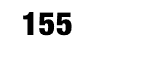

# **第 7 章**

# **构建你的游戏：矢量演员与粒子系统**

Core Graphics 是一个强大的二维绘图库，负责渲染 iOS 和 OS X 的很大一部分内容。在本章中，我们将了解如何使用这个库在我们的游戏中绘制演员。目标是让演员能够根据游戏状态动态绘制。为了说明这一点，我们将创建两个使用 Core Graphics 绘制的示例演员：一个用于显示演员剩余生命值的生命条，以及一个根据其威力大小以特定颜色绘制的子弹。这两个示例将说明如何在简单游戏引擎的上下文中使用 Core Graphics。

我们将通过创建一个名为 `VectorRepresentation` 的新类来实现这一点，该类与上一章中的类 `ImageRepresentation` 类似。类 `VectorRepresentation` 将用于创建一个 `UIView` 来代表我们的演员，并使用 Core Graphics 的自定义代码进行绘制。


# 我们还将探讨游戏中用于创造引人注目的视觉效果的另一项热门技术：粒子系统。简单来说，粒子系统是指游戏中生成大量微型图形元素的任何系统，这些元素在屏幕上组合后，能创造出比各部分简单叠加更令人着迷的整体效果。粒子系统在游戏中常用于创建火焰效果、水体效果和魔法效果，仅举几例。

在本章中，我们将利用粒子系统创建由大量简单粒子角色构成的彗星，使其呈现出流光溢彩、动态流畅的视觉效果。同时，我们还将运用这项技术，在小行星碎裂时展现些许真实感。

本章的示例代码可在 Xcode 项目 `Sample 06+07` 中找到。

L. Jordan, *Beginning iOS 5 Games Development*

©

Lucas Jordan 2011

[www.it-ebooks.info](http://www.it-ebooks.info/)

## 飞碟、子弹、护盾与生命条

在本例中，我们将探讨四种新角色：飞碟、子弹、护盾和生命条。本节代码位于 Xcode 项目 `Sample 06+07` 的 `Example 2` 组中。

生命条和子弹角色将使用 Core Graphics 以编程方式渲染，而非使用预渲染图像。其他角色——飞碟和护盾——在本例中主要用于提供上下文环境（总得有个目标来射击子弹），并从上章示例的行为层面进行扩展。图 7-1 展示了飞碟、子弹、护盾和生命条的实际运行效果。

**图 7-1.** *飞碟、子弹、护盾和生命条* 在图 7-1 中，我们看到屏幕中央有一架飞碟。从右侧向左飞来的是一系列圆形子弹。这些子弹有三种不同尺寸，分别代表其潜在伤害值。如果子弹击中飞碟，飞碟上会叠加一层护盾效果，同时生命条会下降，表示受到伤害。在本例中，子弹会持续发射，直到飞碟生命值归零，届时飞碟将被移除，并添加一架新的飞碟。图 7-2 展示了本例中使用的三种不同飞碟，以及护盾所用的图形。

**图 7-2.** *三种飞碟与一个护盾*

护盾图像是半透明的，设计用于叠加在飞碟之上，放大后的飞碟上覆盖护盾的效果可见一斑。

为了理解本例中所有组件的配合方式，我们首先来看类 `Example02Controller` 的实现，从 `doSetup` 任务开始，如列表 7-1 所示。

**列表 7-1.** *Example02Controller.m (doSetup)*

```
-(BOOL)doSetup
{
    if ([super doSetup]){
        NSMutableArray* classes = [NSMutableArray new];
        [classes addObject:[Saucer class]];
        [classes addObject:[Bullet class]];
        [self setSortedActorClasses:classes];
        return YES;
    }
    return NO;
}
```

在列表 7-1 中，我们看到了类 `Example02Controller` 的 `doSetup` 任务。该方法仅表明我们希望将类型为 `Saucer` 和 `Bullet` 的角色排序，以便后续轻松访问。我们通过创建一个名为 `classes` 的 `NSMutableArray`，并添加我们感兴趣的两个类的类对象来实现这一点。然后将 `NSMutableArray classes` 传递给 `setSortedActorClasses:`。这样，将来调用 `actorsOfType:` 时，我们就不必遍历所有角色来查找它们。接下来，我们来看类 `Example02Controller` 中 `updateScene` 任务内描述本例动作的代码。见列表 7-2。

**列表 7-2.** *Example02Controller.m (updateScene)*

```
-(void)updateScene{
    NSMutableSet* suacers = [self actorsOfType:[Saucer class]];
    if ([suacers count] == 0){
        Saucer* saucer = [Saucer saucer:self];
        [self addActor: saucer];
    }
    if (self.stepNumber % (30) == 0){
        float direction = M_PI - M_PI/30.0;
        float rand = (arc4random()%100)/100.0 * M_PI/15.0;
        direction += rand;
        Bullet* bullet = [Bullet bulletAt:CGPointMake(1000, 768/2)
                         WithDirection:direction];
        [self addActor: bullet];
        if (arc4random()%4 == 0){
            if (arc4random()%2 == 0){
                [bullet setDamage:20.0];
            } else {
                [bullet setDamage:30.0];
            }
        }
    }
    NSMutableSet* bullets = [self actorsOfType:[Bullet class]];
    for (Bullet* bullet in bullets){
        for (Saucer* saucer in suacers){
            if ([bullet overlapsWith:saucer]){
                [saucer doHit:bullet with:self];
            }
        }
    }
    [super updateScene];
}
```

在列表 7-2 中，我们首先获取场景中所有 `Saucer` 实例，并检查是否存在任何实例。如果没有，则创建一个新的 `Saucer` 并通过 `addActor:` 任务将其添加到场景中。这确保了屏幕中央始终恰好存在一个 `Saucer`。

然后，每 30 步，我们使用 `bullatAt:WithDirection:` 任务创建一个新的 `Bullet`。子弹的位置以游戏坐标指定，位于最右侧点的垂直中心。指定的方向将使子弹向左飞行，可能击中飞碟。子弹被添加到场景后，会随机分配其伤害值。

`updateScene` 任务最后要做的是检查是否有任何子弹与飞碟碰撞。这通过调用 `actorsOfType:` 获取存储在 `NSMutableSet* bullets` 中的所有 `Bullet` 对象来实现。我们简单地对每个子弹和飞碟进行迭代，通过调用 `overlapsWith:` 检查是否命中。如果命中，则在 `saucer` 上调用 `doHit:with:` 任务。

接下来，让我们更仔细地查看本例中使用的角色类的实现。

## 角色类

在本节中，我们将了解 `Saucer` 角色和 `HealthBar` 角色类。`HealthBar` 与我们目前看到过的其他角色不同。其不同之处在于，它在场景中的位置依赖于另一个角色（此处为 `Saucer`）的位置。在回顾了 `Saucer` 和 `HealthBar` 类之后，我们将研究 `Behavior` 类 `FollowActor`，并了解如何实现这一特性。

### 实例化飞碟类

我们首先来看 `Saucer` 类的构造函数。之所以从 `Saucer` 的构造函数开始，是因为这里是创建 `HealthBar` 的地方。这样，我们创建新 `Saucer` 时就无需担心添加 `HealthBar`，因为每次创建 `Saucer` 时都会自动创建一个。`Saucer` 的构造函数如列表 7-3 所示。

**列表 7-3.** *Saucer.m (saucer:)*

```
+(id)saucer:(GameController*)controller{
    CGSize gameAreaSize = [controller gameAreaSize];
    CGPoint gameCenter = CGPointMake(gameAreaSize.width/2.0, gameAreaSize.height/2.0);
    ImageRepresentation* rep = [ImageRepresentation imageRep];
    [rep setBackwards:arc4random()%2 == 0];
    [rep setStepsPerFrame:3];
    Saucer* saucer = [[Saucer alloc] initAt:gameCenter WithRadius:32
                          AndRepresentation:rep];
    [rep setDelegate:saucer];
    [saucer setVariant:arc4random()%VARIATION_COUNT];
    [saucer setMaxHealth:100];
    [saucer setCurrentHealth:100];
    HealthBar* healthBar = [HealthBar healthBar:saucer];
    [healthBar setPercent:1];
    [saucer setHealthBar:healthBar];
    [controller addActor:healthBar];
    return saucer;
}
```


在`Listing 7–3`中，我们首先找到游戏区域的中心，并将该值存储在`CGPoint gameCenter`中。接着，我们创建一个名为`rep`的`ImageRepresentation`。我们指示`rep`应在半数时间内以每帧动画 3 步的速度向后旋转飞碟。`CGRect gameCenter`和`ImageRepresentation rep`被传递给父类的初始化方法`initAt:WithRadius:AndRepresenation:`，以创建一个半径为 32 的`Saucer`对象。然后，`saucer`对象被设置为`ImageRepresenation`的委托，这样我们就可以通过`Saucer`类来指定表示细节。这与第六章中的演员（Actors）的工作方式完全相同。请查看源代码以了解这些任务具体是如何实现的。

[www.it-ebooks.info](http://www.it-ebooks.info/)


**160**

**第 7 章：构建你的游戏：向量演员与粒子**

创建`saucer`对象后，我们想为其初始化一些细节。我们通过调用`setVariant:`方法来选择要使用的三种变体之一。我们还将`max health`和`current health`属性设置为 100。接下来，让我们继续看看`HealthBar`类。

### 实例化`HealthBar`类

为了在飞碟下方渲染血条，我们创建一个`HealthBar`对象，并传入它要跟随的对象——`actor saucer`。我们还将`saucer`的`healthBar`属性设置为新创建的`healthBar`，这样当飞碟受到伤害时，`saucer`对象可以更新血条显示的百分比。最后，将`healthBar`添加到场景中。让我们看看`HealthBar`的构造方法，并理解它是如何设置和运作的。参见`Listing 7–4`。

**列表 7–4.** *HealthBar.m (healthBar:)*

```
+(id)healthBar:(Actor*)anActor{

VectorRepresentation* rep = [VectorRepresentation vectorRepresentation]; HealthBar* healthBar = [[HealthBar alloc] initAt:anActor.center

WithRadius:anActor.radius AndRepresentation:rep];

[rep setDelegate:healthBar];

[healthBar setColor:[UIColor blueColor]];

[healthBar setBackgroundColor:[UIColor colorWithRed:0 green:0 blue:0 alpha:.5]]; FollowActor* follow = [FollowActor followActor:anActor];

[follow setYOffset:[anActor radius]];

[healthBar addBehavior:follow];

return healthBar;

}
```

在`Listing 7–4`中，我们看到了构造方法`healthBar:`，它接受一个`Actor`作为参数。这个`Actor anActor`就是该`HealthBar`在其移动时要跟随的演员。在这个例子中，与之关联的`Saucer`不会移动，但我们在后续的示例中会使用这个类，届时其演员是可以移动的。在查看`FollowActor`行为之前，请注意`HealthBar`是通过传入一个`VectorRepresentation`实例而非`ImageRepresentation`对象来初始化的。这表明我们希望以编程方式绘制该对象。我们将在下一节中了解其工作原理。现在，让我们继续探讨这个例子。接下来我们要检查的类是`FollowActor`。

### `FollowActor`行为类

负责让`HealthBar`保持在`Saucer`附近的类是`FollowActor`。这个类是一种行为（Behavior），提供了与之前行为类相同的抽象。让我们通过查看`FollowActor`类来了解这一切是如何协同工作的。参见`Listing 7–5`。

[www.it-ebooks.info](http://www.it-ebooks.info/)


**第 7 章：构建你的游戏：向量演员与粒子**

**161**

**列表 7–5.** *FollowActor.m*

```
#import "FollowActor.h"

#import "GameController.h"

@implementation FollowActor

@synthesize actorToFollow;

@synthesize xOffset;

@synthesize yOffset;

+(id)followActor:(Actor*)anActorToFollow{

FollowActor* follow = [FollowActor new];

[follow setActorToFollow:anActorToFollow];

return follow;

}

-(void)applyToActor:(Actor*)anActor In:(GameController*)gameController{

if (![actorToFollow removed]){

CGPoint c = [actorToFollow center];

c.x += xOffset;

c.y += yOffset;

[anActor setCenter: c];

} else {

[gameController removeActor:anActor];

}

}

@end
```


# 排版后的内容

在`Listing 7–5`中，我们看到`FollowActor`类的完整实现。它使用任务`followActor:`构造，该任务接受要跟随的演员作为参数。

任务`applyToActor:In:`在游戏的每一步被调用，负责重新定位与此行为关联的演员。为此，我们只需将演员`anActor`的中心设置为要跟随的演员的中心，并通过`xOffset`和`yOffset`进行调整。查看`Listing7–4`，我们看到`HealthBar`被配置为跟随飞碟，`xOffset`等于飞碟的半径。这使`HealthBar`保持在飞碟下方居中。现在让我们探索`Bullet`类。

## `Bullet`类

我们已经看到`Saucer`和`HealthBar`类如何协同工作。现在我们要查看`Bullet`类，并理解它为什么以这种方式行为。`Listing7–6`展示了`Bullet`的构造函数。

### `Listing 7–6`. *Bullet.m (bulletAt:WithDirection:)*

```
+(id)bulletAt:(CGPoint)aCenter WithDirection:(float)aDirection{

VectorRepresentation* rep = [VectorRepresentation vectorRepresentation]; Bullet* bullet = [[Bullet alloc] initAt:aCenter WithRadius:4 AndRepresentation:rep];

[rep setDelegate:bullet];

[bullet setDamage: 10];

[www.it-ebooks.info](http://www.it-ebooks.info/)


**162**

**第 7 章 构建你的游戏：矢量演员与粒子**

LinearMotion* motion = [LinearMotion linearMotionInDirection:aDirection AtSpeed:3];

[motion setWrap:YES];

[bullet addBehavior: motion];

ExpireAfterTime* expires = [ExpireAfterTime expireAfter:240];

[bullet addBehavior:expires];

return bullet;

}
```

在`Listing7–6`中，我们看到该类由熟悉的构建块组成。它使用我们现在熟悉的`initAt:WithRadius:AndRepresentation:`任务进行初始化，并且我们添加了`LinearMotion`和`ExpiresAfterTime`类型的行为对象。这两个行为对象由`Powerup`类使用，并在第 6 章中进行了完整描述。`Bullet`类中唯一的新特性是`VectorRepresentation`类，该类也被`HealthBar`类用来指示这种类型的演员将使用 Core Graphics 绘制。

让我们更仔细地查看`VectorRepresentation`类，了解它如何与我们的游戏引擎和演员交互，为使用 Core Graphics 渲染演员提供简单的方法。

## 通过`VectorRepresentation`使用 Core Graphics 绘制演员

Core Graphics 库很有趣，因为它不是一个矢量图形库（如 SVG），但它擅长栅格化矢量数据结构。考虑到 Core Graphics 最初基于 PDF，这非常合理。Core Graphics 是一个出色的库，用于以分辨率无关的方式渲染高质量图形。这意味着我们的代码不会指定哪个像素是什么颜色，而是描述形状以及它们应如何填充。Core Graphics 也被称为 Quartz。完整的可用绘图函数描述可在此处找到：http://goo.gl/6i5gr

在 iOS 中，`UIView`可以通过重写`drawRect:`任务来指定其绘制方式，获取其图形上下文的引用，然后调用一些绘图方法。由于我们的游戏引擎使用`UIView`来表示每个演员，我们知道最终将创建一个`UIView`的子类，并为基于矢量的演员调用绘图代码。`VectorRepresentation`类的工作是管理演员和绘制它的视图之间的关系。

## `VectorRepresentation`类

`VectorRepresentation`类负责创建适合绘制演员的`UIView`。让我们从`VectorRepresentation`的头文件开始探索这个类。参见`Listing7–7`。

[www.it-ebooks.info](http://www.it-ebooks.info/)


**第 7 章 构建你的游戏：矢量演员与粒子**

**163**

### `Listing 7–7`. *VectorRepresentation.h*

```
#import <Foundation/Foundation.h>

#import "Actor.h"

@class VectorActorView;

@protocol VectorRepresentationDelegate

-(void)drawActor:(Actor*)anActor WithContext:(CGContextRef)context InRect:(CGRect)rect;

@end

@interface VectorRepresentation : NSObject<Representation> {

VectorActorView* view;

}

@property (nonatomic, assign) NSObject<VectorRepresentationDelegate>* delegate;

+(id)vectorRepresentation;

@end
```

在`Listing7–7`中，我们看到`VectorRepresentation`类定义了一个名为`VectorRepresentationDelegate`的协议，所有基于矢量的演员必须遵守该协议。该协议要求所有遵守它的类实现`drawActor:WithContext:InRect:`任务，这是实际绘图代码应放置的地方。

`VectorRepresentation`类扩展了`NSObject`并遵守`Representation`协议，就像`ImageRepresentation`类一样。这里的想法是，大多数代码不应关心我们使用哪种表示类型——矢量还是图像。我们只需创建正确的`Representation`对象，并将其与每个演员关联。

我们还看到`VectorRepresentation`类有一个类型为`VectorActorView`的单一属性`view`。`VectorActorView`是`UIView`的子类，最终将调用由`VectorRepresentationDelegate`协议定义的`drawActor:WithContext:InRect:`任务。在查看`VectorActorView`类之前，让我们先看看`VectorRepresentation`的实现，如`Listing7–8`所示。

### `Listing 7–8`. *VectorRepresentation.m*

```
#import "VectorRepresentation.h"

#import "VectorActorView.h"

@implementation VectorRepresentation

@synthesize delegate;

+(id)vectorRepresentation{

return [VectorRepresentation new];

}

-(UIView*)getViewForActor:(Actor*)anActor In:(GameController*)aController{

if (view == nil){

view = [VectorActorView new];

[view setBackgroundColor:[UIColor clearColor]];

[view setActor: anActor];

[view setDelegate:delegate];

[anActor setNeedsViewUpdated:YES];

}

return view;

}

-(void)updateView:(UIView*)aView ForActor:(Actor*)anActor

In:(GameController*)aController{

[www.it-ebooks.info](http://www.it-ebooks.info/)


**164**

**第 7 章 构建你的游戏：矢量演员与粒子**

if ([anActor needsViewUpdated]){

[aView setNeedsDisplay];

[anActor setNeedsViewUpdated:NO];

}

}

@end
```

在`Listing7–8`中，我们看到`VectorRepresentation`类的实现，它有一个简单的构造函数。我们还看到它实现了由`Representation`协议定义的`getViewForActor:In:`和`updateView:In:`任务。在`getViewForActor:In:`任务中，我们创建了一个新的`VectorActorView`，并指定要用于绘图的演员和委托。然后我们调用`setNeedsViewUpdated`，确保至少调用一次演员的绘图代码。

在`updateView:In:`任务中，我们检查演员是否需要更新，如果需要，我们在`UIView aView`上调用`setNeedsDisplay`。`setNeedsDisplay`任务由`UIView`类定义，并向底层图形系统指示`UIView`应重新绘制。实际上，这会导致调用`VectorActorView`的`drawRect:`任务，进而调用我们演员的`drawActor:WithContext:InRect:`。接下来，我们想查看`VectorActorView`类的详细信息。

## 用于基于矢量的演员的`UIView`：`VectorActorView`

`VectorActorView`类是`UIView`的子类，用于在场景中表示演员，方式与我们使用`UIImageView`实例表示基于图像的演员类似。让我们看一下`VectorActorView`类，了解它如何组合在一起，从头文件开始。参见`Listing7–9`。

### `Listing 7–9`. *VectorActorView.h*

```
#import <UIKit/UIKit.h>

#import "Actor.h"

#import "VectorRepresentation.h"

@interface VectorActorView : UIView {

}

@property (nonatomic, retain) Actor* actor;

@property (nonatomic, retain) NSObject<VectorRepresentationDelegate>* delegate;

@end
```


在 `Listing 7–9` 中，我们看到`VectorActorView`继承了`UIView`并有两个属性。第一个属性是一个`Actor`，即要被绘制的主角。第二个属性是`VectorRepresentationDelegate`，负责实际绘制该主角。在此示例中，这两个对象（主角与委托）将是同一个对象，即`Bullet`或`HealthBar`。`VectorActorView`类的实现非常简单，如`Listing 7–10`所示。

[www.it-ebooks.info](http://www.it-ebooks.info/)


**第 7 章：构建你的游戏：矢量主角与粒子**

**165**

**清单 7–10.** *VectorActorView.m*

```
- (void)drawRect:(CGRect)rect
{
    CGContextRef context = UIGraphicsGetCurrentContext();
    [delegate drawActor:actor WithContext:context InRect:rect];
}
```

在`Listing 7–10`中，我们看到`VectorActorView`类的实现只有一个方法，即`drawRect:`的实现。在此方法中，我们通过调用`UIGraphicsGetCurrentContext`获取当前图形上下文的引用，并将该上下文和主角传递给委托，以便在指定的`CGRect`中进行绘制。现在让我们看一个具体的例子。

**绘制`HealthBar`**

如前所述，本示例中使用的矢量化主角在绘制方面是它们自己的委托，因此我们再次查看`HealthBar`类并了解它如何绘制自身。

参见 `Listing 7–11`。

**清单 7–11.** *HealthBar.m (drawActor:WithContext:InRect:)*

```
-(void)drawActor:(Actor*)anActor WithContext:(CGContextRef)context InRect:(CGRect)rect{
    CGContextClearRect(context,rect);
    float height = 10;
    CGRect backgroundArea = CGRectMake(0, self.radius-height/2, self.radius*2, height);
    [self.backgroundColor setFill];
    CGContextFillRect(context, backgroundArea);
    CGRect healthArea = CGRectMake(0, self.radius-height/2, self.radius*2*percent, height);
    [self.color setFill];
    CGContextFillRect(context, healthArea);
}
```

在`Listing 7–11`中，我们首先调用`CGContectClearRect`。这会擦除给定矩形区域中的任何旧内容，为实际绘制做好准备。要绘制`HealthBar`，我们只需绘制两个矩形：一个用于背景，另一个位于背景之上，表示生命条的当前百分比。要绘制一个矩形区域（而不是绘制矩形的边缘），我们通过调用`CGRectMake`定义了一个矩形。然后通过调用`UIColor`对象`backgroundColor`的`setFill`来指定要使用的颜色，该对象是`HealthBar`的一个属性。

为了实际改变正在绘制的`UIView`像素的颜色，我们调用`CGContextFillRect`，传入上下文和`CGRect`的`backgroundArea`。要绘制前景矩形，我们重复该过程，但顶部矩形`healthArea`的宽度是根据属性`percent`的值计算的。这表明每次`HealthBar`的百分比发生变化时，我们都必须重绘`HealthBar`。为了确保这一点，我们必须提供自己的`setPercent:`实现，而不是依赖通过合成属性提供的默认实现。

[www.it-ebooks.info](http://www.it-ebooks.info/)


**166**

**第 7 章：构建你的游戏：矢量主角与粒子**

`Listing 7–12`展示了`HealthBar`类中`setPercent:`的自定义实现。

**清单 7–12.** *HealthBar.m (setPercent:)*

```
-(void)setPercent:(float)aPercent{
    if (percent != aPercent){
        percent = aPercent;
        if (percent < 0){
            percent = 0;
        }
        if (percent > 1){
            percent = 1;
        }
        [self setNeedsViewUpdated:YES];
    }
}
```

`Listing 7–12`展示了我们自定义的`setPercent:`实现。首先我们检查`percent`（属性的后备变量）和传入值`aPercent`是否不同。如果不同，我们将`percent`设置为`aPercent`，并通过确保其值在 0 和 1 之间对其进行归一化。最后，我们调用`setNeedsViewUpdate:`并传入`YES`。这确保`HealthBar`将在动画的下一步中被重绘。现在让我们看一下`Bullet`类是如何绘制的。

**绘制`Bullet`类**

我们已经查看了`HealthBar`类并检查了它的绘制方式。我们只使用了一个绘图函数`CGContextFillRect`来创建视觉效果。当然，还有更多更多的绘图函数可以让你创建任何想要的视觉效果。我们不会涵盖所有这些函数，但网上有极好的文档可供参考。话虽如此，让我们看看`Bullet`类的绘制实现。参见 `Listing 7–13`。

**清单 7–13.** *Bullet.m (drawRect:WithContext:InRect:)*

```
-(void)drawActor:(Actor*)anActor WithContext:(CGContextRef)context InRect:(CGRect)rect{
    CGContextAddEllipseInRect(context, rect);
    CGContextClip(context);
    CGFloat locations[2];
    locations[0] = 0.0;
    locations[1] = 1.0;
    CGColorSpaceRef space = CGColorSpaceCreateDeviceRGB();
    UIColor* color1 = nil;
    UIColor* color2 = nil;
    if (damage >= 30){
        color1 = [UIColor colorWithRed:1.0 green:0.8 blue:0.8 alpha:1.0];
        color2 = [UIColor colorWithRed:1.0 green:0.0 blue:0.0 alpha:1.0];
    } else if (damage >= 20){
        color1 = [UIColor colorWithRed:0.8 green:1.0 blue:0.8 alpha:1.0];
        color2 = [UIColor colorWithRed:0.0 green:1.0 blue:0.0 alpha:1.0];
    } else {
        color1 = [UIColor colorWithRed:0.8 green:0.8 blue:1.0 alpha:1.0];
        color2 = [UIColor colorWithRed:0.0 green:0.0 blue:1.0 alpha:1.0];
    }
    CGColorRef clr[] = { [color1 CGColor], [color2 CGColor] };
    CFArrayRef colors = CFArrayCreate(NULL, (const void**)clr, sizeof(clr) / sizeof(CGColorRef), &kCFTypeArrayCallBacks);
    CGGradientRef grad = CGGradientCreateWithColors(space, colors, locations);
    CGColorSpaceRelease(space);
    CGContextDrawLinearGradient(context, grad, rect.origin, CGPointMake(rect.origin.x + rect.size.width, rect.origin.y + rect.size.height), 0);
    CGGradientRelease(grad);
}
```

[www.it-ebooks.info](http://www.it-ebooks.info/)


**第 7 章：构建你的游戏：矢量主角与粒子**

**167**

在`Listing 7–13`中，我们看到在屏幕上绘制每个子弹的代码。这段代码根据`Bullet`的伤害值绘制一个带有渐变的圆形。在我看来，完成这么简单的事情需要这么多代码。让我们逐段分析。任务的第一行根据提供的矩形为图形上下文创建一个椭圆形裁剪区域。

这意味着后续的绘图操作将仅在此椭圆形区域内可见。

下一步是创建绘图操作所需的渐变。渐变由两个主要部分组成。第一部分是一个数组，指定渐变中每种颜色应应用的位置。在我们的例子中，我们只使用双色渐变，所以我们创建了一个名为`locations`的数组，将第一个值设为 0，第二个值设为 1。这意味着颜色应从渐变起点到终点均匀混合。

渐变的第二部分是使用的颜色。在我们的示例中，我们根据`damage`的值指定每种颜色。我们简单地将变量`color1`和`color2`分配给我们想要用来绘制`Bullet`的颜色。一旦我们有了颜色，我们就创建一个`CFArrayRef`来存储颜色。

一旦我们将颜色位置和颜色本身以正确的数组类型存储好之后，我们调用`CGGradientCreateWithColors`并将数组传入，以创建一个名为`grad`的`CGGradientRef`。注意，我们还传入了一个对颜色空间的引用，如`CGColorSpaceRef`的`space`所定义。这是显示器的默认颜色空间，只有在应用程序执行复杂颜色呈现时才需要更改。

一旦`CGGradientRef`创建完成，就调用`CGContextDrawLinearGradient`。它通常会用指定的渐变填充整个`UIView`，但由于我们在任务顶部指定了裁剪区域，我们得到了一个漂亮的圆形，上面均匀地绘制了渐变。


我们已经了解了如何创建使用 Core Graphics 绘制的演员，这开辟了动态绘制演员的可能性，从而无需为演员的每种可能状态创建图像。在下一节中，我们将讨论另一种绘制演员的策略，即基于粒子的策略。

[www.it-ebooks.info](http://www.it-ebooks.info/)


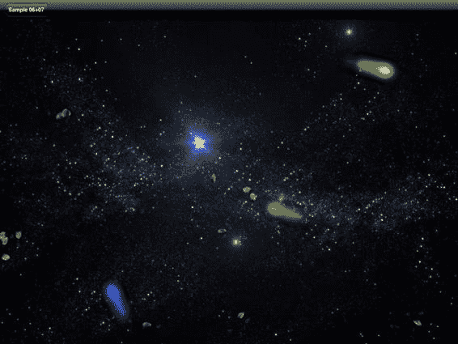

**168**

**第 7 章：构建你的游戏：矢量演员与粒子**

**为你的游戏添加粒子系统**

游戏中的粒子系统是由许多（通常是小尺寸的）图像组合在一起形成的集合，用以创造整体效果。粒子系统在计算机图形学中有许多不同的应用；一些常见的例子包括火、水、头发、草地等等。在我们的示例中，我们将创建一个名为`Particle`的新演员，用于绘制`Comet`演员，并通过使其看起来碎裂来改进我们的`Asteroid`演员。图 7–3 展示了这个新示例的运行效果。

**图 7–3.** *彗星与可摧毁的小行星*

在图 7–3 中，我们看到三颗彗星穿过屏幕。我们还看到许多小行星处于不同的爆炸状态。小行星从屏幕外飘入，当你点击屏幕时，它们会爆炸成许多更小的小行星。除了创建新的、更小的小行星外，我们还会发射出许多看起来像小行星碎片的粒子。这为较大行星的毁灭增加了更多的真实感，因为大块的岩石很少能干净利落地碎成小块。这两种不同的粒子效果——彗星和小行星碎片——截然不同，但各自都使用相同的基类`Particle`实现。让我们仔细看看`Example03Controller`类，以便在深入了解每个新演员的细节之前，更好地理解这个示例的工作原理。清单 7–14 展示了`Example03Controller`的重要部分。

[www.it-ebooks.info](http://www.it-ebooks.info/)


**第 7 章：构建你的游戏：矢量演员与粒子**

**169**

**清单 7–14.** *`Example03Controller.m` (`doSetup` 和 `updateScene`)*

```
-(BOOL)doSetup{

if ([super doSetup]){

NSMutableArray* classes = [NSMutableArray new];

[classes addObject:[Asteroid class]];

[self setSortedActorClasses:classes];

UITapGestureRecognizer* tapRecognizer = [[UITapGestureRecognizer alloc]

initWithTarget:self action:@selector(tapGesture:)];

[tapRecognizer setNumberOfTapsRequired:1];

[tapRecognizer setNumberOfTouchesRequired:1];

[actorsView addGestureRecognizer:tapRecognizer];

return YES;

}

return NO;

}

-(void)updateScene{

if (self.stepNumber % (60*5) == 0){

[self addActor:[Comet comet:self]];

}

if ([[self actorsOfType:[Asteroid class]] count] == 0){

int count = arc4random()%4+1;

for (int i=0;i<count;i++){

[self addActor:[Asteroid asteroid:self]];

}

}

[super updateScene];

}
```

在清单 7–14 中，我们看到了`Example03Controller`类的两个任务：`doSetup`和`updateScene`。`doSetup`任务遵循我们已经熟悉的模式，即通过调用`setSortedActorClass:`任务来识别我们想要高效访问的演员类，在本例中是`Asteroid`。我们还创建了一个名为`tapRecognizer`的`UITapGestureRecognizer`，并将其注册到`actorsView`对象上。通过这种方式，当我们点击屏幕时，`tapGesture:`任务将被调用。

`updateScene`任务，如清单 7–14 所示，每五秒（`60*5`）添加一个新的`Comet`演员，并且每当场景中零个小行星时，添加一到四个`Asteroid`演员。与之前的示例一样，控制器类中的代码相对简单。示例中大部分真正的逻辑存在于不同的演员类中。在我们查看`Asteroid`类之前，先考虑一下`tapGesture:`任务，如清单 7–15 所示。

[www.it-ebooks.info](http://www.it-ebooks.info/)


**170**

**第 7 章：构建你的游戏：矢量演员与粒子**

**清单 7–15.** *`Example03Controller.m` (`tapGesture:`) *

```
- (void)tapGesture:(UIGestureRecognizer *)gestureRecognizer{

for (Asteroid* asteroid in [self actorsOfType:[Asteroid class]]){

[asteroid doHit:self];

}

}
```

在清单 7–15 中，我们看到`tapGesture:`任务会在用户点击屏幕时被调用。它只是遍历场景中的每一个`Asteroid`，并对其调用`doHit:`。正是因为这个任务，我们才需要确保能够方便地访问场景中的`Asteroid`。

以下部分描述了`Asteroid`演员的实现细节，以及每个`Asteroid`爆炸时产生的粒子效果。

**简单粒子系统**

最简单的粒子系统涉及在屏幕上创建一堆短命的元素，这些元素相对较快地衰减或消失。让我们来看看`Asteroid`类，并了解如何创建一个非常简单的粒子效果。

**`Asteroid`类**

在我们研究如何为`Asteroid`的毁灭添加粒子效果之前，让我们花点时间全面了解`Asteroid`类。这将为我们理解粒子效果，同时构建另一个`Actor`类提供上下文。`Asteroid`类的头文件如清单 7–16 所示。

**清单 7–16.** *`Asteroid.h`*

```
@interface Asteroid : Actor{

}

@property (nonatomic) int level;

+(id)asteroid:(GameController*)aController;

+(id)asteroidOfLevel:(int)aLevel At:(CGPoint)aCenter;

-(void)doHit:(GameController*)controller;

@end
```

在清单 7–16 中，我们看到了`Asteroid`类的声明。我们看到`Asteroid`类扩展了`Actor`，并有两个构造函数。构造函数`asteroid:`被`Example03Controller`用来将最大的小行星添加到场景中。构造函数`asteroidOfLevel:At:`用于在点击事件后调用的`doHit:`任务中创建和添加更小的小行星。清单 7–17 展示了`Asteroid`类的第一个构造函数。

[www.it-ebooks.info](http://www.it-ebooks.info/)


**第 7 章：构建你的游戏：矢量演员与粒子**

**171**

**清单 7–17.** *`Asteroid.m` (`asteroid:`) *

```
+(id)asteroid:(GameController*)acontroller{

CGSize gameSize = [acontroller gameAreaSize];

CGPoint gameCenter = CGPointMake(gameSize.width/2.0, gameSize.height/2.0); float directionOffScreen = arc4random()%100/100.0 * M_PI*2;

float distanceFromCenter = MAX(gameCenter.x,gameCenter.y) * 1.2;

CGPoint center = CGPointMake(gameCenter.x +

cosf(directionOffScreen)*distanceFromCenter, gameCenter.y +

sinf(directionOffScreen)*distanceFromCenter);

return [Asteroid asteroidOfLevel:4 At:center];

}
```

在清单 7–17 中，我们看到了`asteroid:`任务，它通过调用另一个构造函数创建了一个大小为 4 的新`Asteroid`。大部分工作只是为`Asteroid`找到一个屏幕外的起始点。这与第 6 章中用于查找`Powerup`演员点的代码相同。详细信息可参见图 6-3。`Asteroid`的第二个构造函数如清单 7–18 所示。

**清单 7–18.** *`Asteroid.m` (`asteroidOfLevel:At:`) *

```
+(id)asteroidOfLevel:(int)aLevel At:(CGPoint)aCenter{

ImageRepresentation* rep = [ImageRepresentation

imageRepWithDelegate:[AsteroidRepresentationDelegate instance]];

[rep setBackwards:arc4random()%2 == 0];

if (aLevel >= 4){

[rep setStepsPerFrame:arc4random()%2+2];

} else {

[rep setStepsPerFrame:arc4random()%4+1];

}

Asteroid* asteroid = [[Asteroid alloc] initAt:aCenter WithRadius:4 + aLevel*7

AndRepresentation:rep];

[asteroid setLevel:aLevel];

[asteroid setVariant:arc4random()%AST_VARIATION_COUNT];

[asteroid setRotation: (arc4random()%100)/100.0*M_PI*2];

float direction = arc4random()%100/100.0 * M_PI*2;

LinearMotion* motion = [LinearMotion linearMotionInDirection:direction AtSpeed:1];

[motion setWrap:YES];

[asteroid addBehavior:motion];

return asteroid;

}
```


在`Listing 7–18`中，我们看到了`Asteroid`类的主构造函数。我们还看到我们根据`aLevel`的值创建了具有半径的`Asteroid`。通过这种方式，当小行星破裂时，它们会逐渐变小，因为每个新小行星的等级比其创建者低一级。在`asteroidOfLevel:At:`中，我们做的最后一件事是向`Asteroid`添加一个`LinearMotion`行为，使其沿直线移动并环绕屏幕。

[www.it-ebooks.info](http://www.it-ebooks.info/)


**172**

**第 7 章：构建你的游戏：矢量演员与粒子**

在`Listing 7–8`中需要注意的另一件事是，我们以一种与之前略有不同的方式创建`ImageRepresentation`。以前，我们创建的所有`ImageRepresentation`都使用 actor 作为委托，这是有道理的，因为它将所有关于`Actor`的信息放在一个文件中。然而，我们希望`Asteroid`类和我们将创建的`Particle`看起来相同，只是大小不同。为了简化这一点，我们创建了一个名为`AsteroidRepresentationDelegate`的新类，它负责指定如何渲染看起来像小行星的东西。让我们继续学习`AsteroidRepresentationDelegate`类。

**使用同一个类表示 Asteroid 和 Particle**

如前所述，`Asteroid`的绘制方式定义在`AsteroidRepresentationDelegate`类中。这个类将用于表示每个`Asteroid`以及在小行星破裂时创建的`Particle`。`AsteroidRepresentationDelegate`的实现如`Listing 7–19`所示。

**代码清单 7–19.** *AsteroidRepresentationDelegate.m*

```
+(AsteroidRepresentationDelegate*)instance{

static AsteroidRepresentationDelegate* instance;

@synchronized(self) {

if(!instance)

{

instance

=

[AsteroidRepresentationDelegate

new];

}

}

return

instance;

}

-(int)getFrameCountForVariant:(int)aVariant AndState:(int)aState{

return 31;

}

-(NSString*)getNameForVariant:(int)aVariant{

if (aVariant == VARIATION_A){

return @"A";

} else if (aVariant == VARIATION_B){

return @"B";

} else if (aVariant == VARIATION_C){

return @"C";

} else {

return nil;

}

}

-(NSString*)baseImageName{

return @"Asteroid";

}
```

在`Listing 7–19`中，我们看到了定义基于图像的 actor 的预期任务。我们看到图像文件将以字符串`"Asteroid"`开头，如`baseImageName`任务所示。

我们还看到，如`getFramesCountForVariant:AndState:`和`getNameForVariant:`所示，每个变体都有 31 张图像。

`Listing 7–19`中的`instance`任务对我们来说是新的。这个任务代表了一种为`AsteroidRepresentationDelegate`类创建单例的方法。我们通过同步`Asteroid`的类对象并仅在`instance`变量为`nil`时创建新的`AsteroidRepresentationDelegate`来实现这一点。这允许我们只创建该类的一个实例，即使我们可能有数百个`Asteroid`和`Particle`使用它来指定它们的外观。现在，让我们将所有部分组合起来，看看`Asteroid`是如何被销毁的。

**销毁 Asteroid**

我们已经为理解`Asteroid`如何在屏幕上创建和表示奠定了基础。让我们看看`doHit:`任务，以了解这些部分是如何组合在一起以产生预期行为的。请参阅`Listing 7–20`。

**代码清单 7–20.** *Asteroid.m (doHit:)*

```
-(void)doHit:(GameController*)controller{

if (level > 1){

int count = arc4random()%3+1;

for (int i=0;i<count;i++){

Asteroid* newAst = [Asteroid asteroidOfLevel:level-1 At:self.center];

[controller addActor:newAst];

}

}

int particles = arc4random()%5+1;

for (int i=0;i<particles;i++){

ImageRepresentation* rep = [ImageRepresentation

imageRepWithDelegate:[AsteroidRepresentationDelegate instance]];

Particle* particle = [Particle particleAt:self.center WithRep:rep Steps:25];

[particle setRadius:6];

[particle setVariant:arc4random()%AST_VARIATION_COUNT];

[particle setRotation: (arc4random()%100)/100.0*M_PI*2];

LinearMotion* motion = [LinearMotion linearMotionRandomDirectionAndSpeed];

[particle addBehavior:motion];

[controller addActor: particle];

}

[controller removeActor:self];

}
```

在`Listing 7–20`中，我们看到了`doHit:`任务。当我们点击屏幕时，会调用此任务，导致场景中的所有`Asteroid`分裂成许多更小的`Asteroid`。

我们还希望在此过程中生成一些看起来像小行星的`Particle`。我们做的第一件事是确保调用`doHit:`的`Asteroid`等级大于一级，因为这些小行星不应该再创建额外的`Asteroid`。如果`Asteroid`等级大于一级，我们会在当前`Asteroid`的相同位置创建一到三个等级小一级的`Asteroid`。这些新的`Asteroid`将从当前`Asteroid`处沿直线运动，直到它们爆炸。

为了在`Listing 7–20`中创建粒子效果，我们首先确定要添加到场景中的粒子数量。然后，我们使用`Asteroid`的当前位置、`AsteroidRepresentationDelegate`的单例实例创建一个新的`Particle`，并指示该粒子应存活 25 个动画步长。粒子的半径设置为`6`。这纯粹是一个美学选择；它可以是任何值。还设置了`variation`和`rotation`属性，以在创建的每个粒子中提供视觉变化。我们对粒子做的最后一件事是在将其添加到场景之前指定一个随机的`LinearMotion`。图 7–4 显示了正在创建的新`Asteroid`以及`Particle`的特写。

**图 7–4.** *小行星和粒子，放大视图*

**Particle 类**

我们研究了每个`Asteroid`爆炸时`Particle`是如何创建的，现在让我们详细看看`Particle`类以及它是如何实现的，从如`Listing 7–21`所示的头文件开始。

**代码清单 7–21.** *Particle.h*

```
@interface Particle : Actor<ExpireAfterTimeDelegate> {

}

@property (nonatomic) float totalStepsAlive;

+(id)particleAt:(CGPoint)aCenter WithRep:(NSObject<Representation>*)rep Steps:(float)numStepsToLive;

@end
```

在`Listing 7–21`中，`Particle`类的头文件继承自`Actor`并遵循`ExpireAfterTimeDelegate`协议。`Particle`遵循`ExpireAfterTimeDelegate`，因为我们希望改变粒子的不透明度，在其生命周期内淡出。属性`totalStepsAlive`指示`Particle`应在场景中存在多长时间，并在构造函数`particleAt:WithRep:Steps:`中设置。我们还可以看到`Particle`需要一个`Representation`作为参数传递给构造函数。`Particle`的实现如`Listing 7–22`所示。

**代码清单 7–22.** *Particle.m*

```
@implementation Particle

@synthesize totalStepsAlive;

+(id)particleAt:(CGPoint)aCenter WithRep:(NSObject<Representation>*)rep Steps:(float)numStepsToLive{

Particle* particle = [[Particle alloc] initAt:aCenter WithRadius:32

AndRepresentation:rep];

[particle setTotalStepsAlive:numStepsToLive];

ExpireAfterTime* expire = [ExpireAfterTime expireAfter:numStepsToLive];

[expire setDelegate: particle];

[particle addBehavior:expire];

return particle;

}

-(void)stepsUpdated:(ExpireAfterTime*)expire In:(GameController*)controller{

self.alpha = [expire stepsRemaining]/totalStepsAlive;

}

@end
```

[www.it-ebooks.info](http://www.it-ebooks.info/)


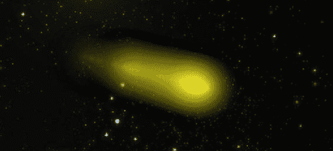

**第 7 章：构建你的游戏：矢量演员与粒子**

**175**


在清单 7-22 中，我们看到构造函数`particleAt:WithRep:Steps:`相当直接。我们创建了一个新的`Particle`对象，并向其传入提供的`Representation`对象。我们还设置了`totalStepsAlive`属性，并创建了一个`ExpiresAfterTime`行为。请注意，`particle`被设置为`expire`的委托，这将导致每次执行`expires`时都会调用任务`stepsUpdated:In:`。

在任务`stepsUpdated:In:`中，我们仅根据粒子生命周期所处的阶段来调整其`alpha`值。在更复杂的粒子实现中，这种淡出行为将是可配置的，不仅限于开启或关闭，还包括粒子淡出的速率。在这个简单的实现中，每个粒子只是线性地淡出。

我们已经查看了`Asteroid`和`Particle`的实现，并发现在我们的场景中创建粒子效果非常简单。在下一节中，我们将查看`Comet`角色，并看到一个视觉上更引人注目的例子，尽管其实现同样简单。

## 创建基于矢量的粒子

在前面的例子中，我们研究了由图像序列表示的粒子。由于我们有一种灵活的方式来渲染角色，我们可以同样轻松地创建通过程序绘制出来的粒子。在这个例子中，我们将创建停留在原地的粒子，但我们会移动它们被创建的点。这将为我们的`Comet`角色提供一个漂亮的发光尾巴，就像任何彗星应该有的那样。图 7-5 展示了我们的新角色——`Comet`。

**图 7-5.** *彗星细节*

[www.it-ebooks.info](http://www.it-ebooks.info/)


**176**

**第 7 章：构建你的游戏：矢量角色与粒子**

在图 7-5 中，我们看到一个彗星的放大细节图。它由许多粒子组成，每个粒子在原地慢慢淡出，从而产生彗星的尾巴。让我们看看`Comet`类，了解这个视觉效果是如何创建的。清单 7-23 展示了`Comet`类的头文件。

**清单 7-23.** *Comet.h*

```
enum{
    VARIATION_RED = 0,
    VARIATION_GREEN,
    VARIATION_BLUE,
    VARIATION_CYAN,
    VARIATION_MAGENTA,
    VARIATION_YELLOW,
    VARIATION_COUNT
};

@interface Comet : Actor<VectorRepresentationDelegate> {
}

+(id)comet:(GameController*)controller;

@end
```

在清单 7-23 中，我们看到`Comet`继承了`Actor`并遵循`VectorRepresentationDelegate`协议。有一个单一的构造函数，接受一个`GameController`作为唯一参数。让我们看看这个构造函数的实现，如清单 7-24 所示。

**清单 7-24.** *Comet.m (comet:)*

```
+(id)comet:(GameController*)controller{
    CGSize gameSize = [controller gameAreaSize];
    CGPoint gameCenter = CGPointMake(gameSize.width/2.0, gameSize.height/2.0);
    float directionOffScreen = arc4random()%100/100.0 * M_PI*2;
    float distanceFromCenter = MAX(gameCenter.x,gameCenter.y) * 1.2;
    CGPoint center = CGPointMake(gameCenter.x +
        cosf(directionOffScreen)*distanceFromCenter, gameCenter.y +
        sinf(directionOffScreen)*distanceFromCenter);
    ImageRepresentation* rep = [ImageRepresentation imageRep];
    Comet* comet = [[Comet alloc] initAt:center WithRadius:16 AndRepresentation:rep];
    [rep setDelegate:comet];
    [comet setVariant:arc4random()%VARIATION_COUNT];
    float direction = arc4random()%100/100.0 * M_PI*2;
    LinearMotion* motion = [LinearMotion linearMotionInDirection:direction AtSpeed:1];
    [motion setWrap:YES];
    [comet addBehavior: motion];
    ExpireAfterTime* expire = [ExpireAfterTime expireAfter:60*15];
    [comet addBehavior: expire];
    return comet;
}
```

[www.it-ebooks.info](http://www.it-ebooks.info/)


**第 7 章：构建你的游戏：矢量角色与粒子**

**177**

在清单 7-24 中，我们看到我们再次通过在游戏区域边缘外的一个圆上计算一个名为`center`的`CGPoint`，来在屏幕外创建每个`Comet`。我们还创建了一个`VectorRepesentation`，并将`Comet`用作委托。我们将使用相同的任务来绘制`Comet`和`Comet`的尾部粒子。在指定了`ExpireAfterTime`和`LinearMotion`作为彗星的行为后，它就可以被添加到场景中了。清单 7-25 展示了绘制每个`Comet`和`Particle`的任务。

**清单 7-25.** *Comet.m (drawActor:WithContect:InRect:)*

```
-(void)drawActor:(Actor*)anActor WithContext:(CGContextRef)context InRect:(CGRect)rect{
    CGContextClearRect(context,rect);
    CGColorSpaceRef space = CGColorSpaceCreateDeviceRGB();
    CGFloat locations[4];
    locations[0] = 0.0;
    locations[1] = 0.1;
    locations[2] = 0.2;
    locations[3] = 1.0;
    UIColor* color1 = nil;
    UIColor* color2 = nil;
    UIColor* color3 = nil;
    float whiter = 0.6;
    float c2alpha = 0.5;
    float c3aplha = 0.3;

    if (self.variant == VARIATION_RED){
        color1 = [UIColor colorWithRed:1.0 green:whiter blue:whiter alpha:1.0];
        color2 = [UIColor colorWithRed:1.0 green:0.0 blue:0.0 alpha:c2alpha];
        color3 = [UIColor colorWithRed:1.0 green:0.0 blue:0.0 alpha:c3aplha];
    } else if (self.variant == VARIATION_GREEN){
        color1 = [UIColor colorWithRed:whiter green:1.0 blue:whiter alpha:1.0];
        color2 = [UIColor colorWithRed:0.0 green:1.0 blue:0.0 alpha:c2alpha];
        color3 = [UIColor colorWithRed:0.0 green:1.0 blue:0.0 alpha:c3aplha];
    } else if (self.variant == VARIATION_BLUE){
        color1 = [UIColor colorWithRed:whiter green:whiter blue:1.0 alpha:1.0];
        color2 = [UIColor colorWithRed:0.0 green:0.0 blue:1.0 alpha:c2alpha];
        color3 = [UIColor colorWithRed:0.0 green:0.0 blue:1.0 alpha:c3aplha];
    } else if (self.variant == VARIATION_CYAN){
        color1 = [UIColor colorWithRed:whiter green:1.0 blue:1.0 alpha:1.0];
        color2 = [UIColor colorWithRed:0.0 green:1.0 blue:1.0 alpha:c2alpha];
        color3 = [UIColor colorWithRed:0.0 green:1.0 blue:1.0 alpha:c3aplha];
    } else if (self.variant == VARIATION_MAGENTA){
        color1 = [UIColor colorWithRed:1.0 green:whiter blue:1.0 alpha:1.0];
        color2 = [UIColor colorWithRed:1.0 green:0.0 blue:1.0 alpha:c2alpha];
        color3 = [UIColor colorWithRed:1.0 green:0.0 blue:1.0 alpha:c3aplha];
    } else if (self.variant == VARIATION_YELLOW){
        color1 = [UIColor colorWithRed:1.0 green:1.0 blue:whiter alpha:1.0];
        color2 = [UIColor colorWithRed:1.0 green:1.0 blue:0.0 alpha:c2alpha];
        color3 = [UIColor colorWithRed:1.0 green:1.0 blue:0.0 alpha:c3aplha];
    }
    UIColor* color4 = [UIColor colorWithRed:0.0 green:0.0 blue:0.0 alpha:0.0];
```

[www.it-ebooks.info](http://www.it-ebooks.info/)


**178**

**第 7 章：构建你的游戏：矢量角色与粒子**

```
    CGColorRef clr[] = { [color1 CGColor], [color2 CGColor] , [color3 CGColor], [color4 CGColor]};
    CFArrayRef colors = CFArrayCreate(NULL, (const void**)clr, sizeof(clr) / sizeof(CGColorRef), &kCFTypeArrayCallBacks);
    CGGradientRef grad = CGGradientCreateWithColors(space, colors, locations);
    CGColorSpaceRelease(space);
    CGContextDrawRadialGradient(context, grad, CGPointMake(self.radius, self.radius), 0, CGPointMake(self.radius, self.radius), self.radius, 0);
    CGGradientRelease(grad);
}
```

在清单 7-25 中，我们希望绘制一个简单的径向渐变，其中心颜色与变体相匹配，边缘为透明。我们必须创建一个四色渐变才能实现好看的彗星效果。第一种颜色几乎是白色且完全不透明，接下来的两种颜色是变体的颜色，但带有两种不同的`alpha`值。最后一种颜色将完全透明。函数`CGContextDrawRadialGradient`在角色的中心绘制了一个径向渐变，从第一种颜色平滑过渡到角色的透明边缘。

既然我们已经了解了每个粒子是如何绘制的，接下来应该看看粒子是如何创建的。清单 7-26 展示了`Comet`的`step:`任务的实现。

**清单 7-26.** *Comet.m (step:)*

```
-(void)step:(GameController*)controller{
    if ([controller stepNumber]%3 == 0){
```


```objectivec
VectorRepresentation* rep = [VectorRepresentation vectorRepresentation];
[rep setDelegate:self];
int totalStepsAlive = arc4random()%60 + 60;
Particle* particle = [Particle particleAt:self.center WithRep:rep Steps:totalStepsAlive];
[particle setRadius:self.radius];
[controller addActor: particle];
```

在`Listing 7–26`中，`step:`任务每三个步骤在动画中创建一个新的`Particle`。

对于每个新的`Particle`，都会创建一个`VectorRepresentation`，但请注意，其委托是`Comet`对象。`Particle`的创建带有从 1 秒到 2 秒的随机生命周期。这种随机性造成了彗星尾部轻微的闪烁变化。

请注意，此时`Particle`没有添加任何额外的行为，这会导致`Particle`停留在原地并逐渐消失。

[www.it-ebooks.info](http://www.it-ebooks.info/)


**第 7 章：打造你的游戏：矢量角色与粒子**

**179**

**总结**

在本章中，我们研究了一种在游戏中以编程方式绘制角色的技术。我们创建了一个名为`VectorRepresentation`的新类，用于处理创建供代码绘制的`UIView`的细节。我们使用这些新的基于矢量的角色创建了一个血条和一个简单的子弹。本章继续展示了两个创建粒子系统的简单示例。第一个示例重用了小行星的艺术资源，以在爆炸小行星时产生碎片效果。第二个示例使用基于矢量的粒子创建了带有发光尾巴的彗星。在本章和上一章中创建的角色将在第 10 章中用于创建一个完整的游戏。

[www.it-ebooks.info](http://www.it-ebooks.info/)


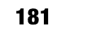

**8**

**第 8 章**

**打造你的游戏：**

**理解手势与动作**

为移动设备创建游戏真正令人兴奋的地方在于用户与游戏交互的独特方式。iOS 支持的复杂手势是一种相对较新的与计算机交互的方式，如果用户不熟悉新的界面技术，可能会给他们带来困扰。然而，iOS 用户已经熟悉双击、捏合和滑动等概念，因此在游戏中使用这些手势不会带来可用性问题。

在本章中，我们将探讨如何使用 iOS 提供的内置库向应用程序或游戏添加手势。我们还将探讨如何将特定手势绑定到游戏中的特定角色。到本章结束时，你将了解如何使用所有受支持的手势，并能够利用它们来驱动游戏中的用户交互。在我们的示例中，我们将使用熟悉的类，如`GameController`、`Actor`等。因此，你对这些手势事件的理解将直接与你前几章学到的知识联系起来。

除了简单的屏幕触摸，用户还可以通过较新设备中的加速计或陀螺仪与 iOS 5 应用程序进行交互。将设备的运动作为游戏输入，为用户体验开辟了新的维度。我们将探讨如何使用这些传感器并将其与游戏事件关联起来。

**触摸输入：基础知识**

实际上有三种方式可以接受用户的触摸输入。第一种是使用按钮或其他预构建的小部件，并实现响应用户事件的任务。我不会详细介绍这种输入方式，因为它是最基础的，并且在所有 iOS 入门书籍中都有详细介绍。第二种方法是创建`UIView`的子类，并实现一系列与触摸相关的任务。最后一种技术是将六个`UIGestureRecognizer`类之一连接到`UIView`，并注册一个对象来响应不同的手势。

L. Jordan, *Beginning iOS 5 Games Development*
© Lucas Jordan 2011

[www.it-ebooks.info](http://www.it-ebooks.info/)


**182**

**第 8 章：打造你的游戏：理解手势与动作**


# 扩展 UIView 以接收触摸事件

我认为在大多数情况下，最后一种技术最为稳健，因为它为用户提供了一种通过一组已知手势与应用交互的方式。然而，使用第二种技术（实现触摸相关任务）也有充分的理由，尤其是当你追求的用户交互本身并非手势时。例如，在一个绘图应用中，你只需获取屏幕上所有接触点来进行绘制。

下一节将回顾 `UIView` 的触摸相关任务。随后，我们将继续探讨 `UIGestureRecognizer` 类和运动事件。

本章附带的示例代码可在项目 Sample 08 中找到。虽然本书中的大部分代码既可在设备上运行，也可在模拟器上运行，但我强烈建议你在 iPhone（或 iPod touch）上运行此代码——如果可能的话，使用 iOS 4.2 或更高版本——因为复杂手势在模拟器上难以模拟。要真正获得用户体验的感受，最好用自己的手执行实际手势，并体会每种手势的感觉。

当用户在屏幕上触摸 `UIView` 时，该视图有四个任务会被调用。我统称它们为触摸相关任务，如代码清单 8-1 所示。

**代码清单 8-1.** *四个触摸相关任务*
```
-(void)touchesBegan:withEvent:

-(void)touchesCancelled:withEvent:

-(void)touchesEnded:withEvent:

-(void)touchesMoved:withEvent:
```

每个任务的第一个参数是一个 `NSSet`，其中包含屏幕上每次离散触摸对应的一个 `UITouch`。第二个参数是一个 `UIEvent`，它基本上是 iOS 上三种不同输入类型（触摸事件、运动事件和远程控制事件）的通用包装器。我们不会涉及远程控制事件；那些是由配件（如外部键盘）生成的事件。

任务 `touchesBegan:withEvent:` 在手指（或多根手指）触摸屏幕时立即被调用。任务 `touchesEnded:withEvent:` 在手指移开时被调用。如果手指滑动，则会调用 `touchesMoved:withEvent:`。任务 `touchesCancelled:withEvent:` 在系统必须接管屏幕时被调用。例如，如果另一个应用被启动，则在对第一个应用的控制权传递给新应用之前，会调用其 `touchesCancelled:withEvent:` 方法。示例代码提供了使用这些任务的范例，如图 8-1 所示。

[www.it-ebooks.info](http://www.it-ebooks.info/)


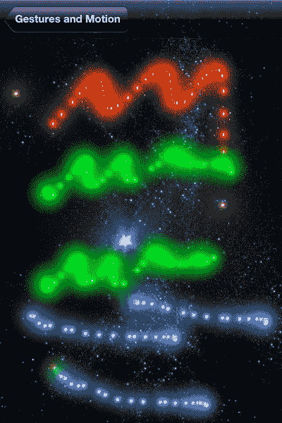

**第 8 章：构建你的游戏：理解手势与运动** **183**

**图 8–1.** *触摸事件*

在图 8-1 中，我们看到几条由点组成的线段。每条线段都是手指在屏幕上拖动的结果。最上面的线段是单指在屏幕上移动产生的——用红点绘制。从上数第二条线段是双指在屏幕上拖动产生的，它下面的那条线段同样如此，两者都是用绿点绘制的。下面的三条线段由三指绘制，由蓝点组成。如果你能看到图 8-1 的彩色版本（如果你有电子书的话），请观察最下面一行最左侧的点。注意，一个是红色，另一个是绿色。这是因为我没能让三根手指同时落在屏幕上。

在这个第一个示例中，除了用手指绘制点之外，你还可以通过单指或双指轻触分别放大或缩小这些点。缩放功能演示了触摸事件和手势如何协同工作。一旦我们理解了触摸事件的基础知识，将更详细地探讨这一点。

# 查看事件代码

这个简单演示的实现展示了我们如何接收触摸事件，并为屏幕上的每次触摸创建角色。涉及两个类：继承 `GameController` 的 `TouchEventsController` 和继承 `UIView` 的 `TouchEventsView`。让我们从查看 `TouchEventsView` 类开始。其头文件如代码清单 8-2 所示。

**代码清单 8-2.** *TouchEventsView.h*
```
@interface TouchEventsView : UIView{

IBOutlet TouchEventsController* controller;

NSMutableArray* sparks;

}

@end
```

在代码清单 8-2 中，我们看到了一个 `IBOutlet`，因此我们可以将 `TouchEventsView` 连接到 `TouchEventsController`。我们还看到了一个名为 `sparks` 的 `NSMutableArray`。这个集合用于在添加火花时进行追踪；如前所述，触摸事件可能被取消。通过追踪我们添加的火花，我们可以在调用 `touchCancelled:withEvent:` 之前清理任何已添加的火花。让我们看看 `TouchEventsView` 类的实现，如代码清单 8-3 所示。

**代码清单 8-3.** *TouchEventsView.m*
```
@implementation TouchEventsView

- (void)touchesBegan:(NSSet *)touches withEvent:(UIEvent *)event{

NSLog(@"Begin: %i", [touches count]);

sparks = [NSMutableArray new];

}

- (void)touchesCancelled:(NSSet *)touches withEvent:(UIEvent *)event{

NSLog(@"Cancelled: %i", [touches count]);

for (Spark* spark in sparks){

[controller removeActor:spark];

}

[sparks removeAllObjects];

}

- (void)touchesEnded:(NSSet *)touches withEvent:(UIEvent *)event{

NSLog(@"Ended: %i", [touches count]);

int count = [touches count];

for (UITouch* touch in touches){

Spark* spark = [Spark spark:count-1 At:[touch locationInView:self]];

[controller addActor:spark];

[sparks addObject:spark];

}

[sparks removeAllObjects];

}

- (void)touchesMoved:(NSSet *)touches withEvent:(UIEvent *)event{

NSLog(@"Moved: %i", [touches count]);

int count = [touches count];

for (UITouch* touch in touches){

Spark* spark = [Spark spark:count-1 At:[touch locationInView:self]];

[controller addActor:spark];

[sparks addObject:spark];

}

}

@end
```

在代码清单 8-3 中，我们看到之前讨论的四个任务。`UIResponder` 类（`UIView` 的父类）定义了每个任务。这些方法在用户与屏幕交互时被调用。通过实现它们，我们可以添加自定义行为。任务 `touchesBegan:withEvent:` 在手指触摸屏幕时被调用。此时，我们创建一个新的 `NSMutableArray` 来追踪我们将要添加的所有火花。接下来可能会调用其他三个任务中的任何一个。如果用户移动手指，或另一根新手指触屏，则会调用任务 `touchesMoved:withEvent:`。在此任务中，我们为每次触摸创建一个新的 `Spark`。我们使用触摸次数减 1 来指定 `Spark` 的变体或颜色，然后将其添加到场景中。火花只是一个简单的粒子类对象，会在五秒后自动消失。

触摸事件可以通过两种方式结束。第一种方式是当用户移开所有手指后，调用 `touchesEnded:withEvent:`。在这种情况下，我们执行与 `touchesMoved:withEvent:` 中相同的操作：为每次触摸创建一个 `Spark`。同时，我们清空 `NSMutableArray` 中的 `sparks`，以移除对火花对象的引用。

触摸事件结束的另一种方式是通过取消。当系统发生其他事件导致完成该事件不恰当，或者另一个视图的事件拦截了触摸序列时，事件会被取消。当此任务被调用时，我们将移除自上次调用 `touchesBegan:withEvent:` 以来创建的所有 `Spark` 对象，撤销到目前为止所做的工作。


`touchesCancelled:withEvent:`任务在切换应用或弹出对话框时可能被调用。另一个更常见的触摸事件取消方式是手势识别器被触发。手势识别器由`UIGestureRecognizer`类定义，它是一个用于检查`UIView`上触摸事件的对象，并在触摸可以被视为特定手势（如轻点、捏合或滑动）时做出响应。

要试验`touchesCancelled:withEvent:`任务，请执行双指双击操作。

注意，第一次轻点后，手指触摸的位置会出现两个`Sparks`。第二次轻点后，之前添加的`Spark`对象会被移除。这是因为当双指双击手势识别器被触摸事件激活时，调用了`touchesCancelled:withEvent:`。

手势识别器能够取消触摸事件这一特性，允许开发者在`UIView`上混合搭配任意数量的手势，而无需担心手势冲突。除了取消触摸事件，手势之间也可以相互取消。例如，捏合手势和双指拖拽手势都以相同的方式开始——两根手指大约同时落在屏幕上。如果没有一种机制来相互取消，这两种手势很容易发生冲突。

我们继续看看这些触摸事件如何应用于游戏相关的类。

[www.it-ebooks.info](http://www.it-ebooks.info/)


**186** **第 8 章：构建你的游戏：理解手势与动作** **将触摸事件应用于角色**

让我们快速浏览一下`TouchEventsController`类，看看我们如何设置演示来响应轻点手势。`TouchEventsController.m`的重要部分如代码清单 8-4 所示。

**代码清单 8-4.** *TouchEventsController.m (doSetup)*

```
-(BOOL)doSetup{
    if ([super doSetup]){
        [self setGameAreaSize:CGSizeMake(320, 480)];
        [self setSortedActorClasses:[NSMutableArray arrayWithObject:[Spark class]]];
        UITapGestureRecognizer* doubleTapTwoTouch = [[UITapGestureRecognizer alloc] initWithTarget:self action:@selector(doubleTap:)];
        [doubleTapTwoTouch setNumberOfTapsRequired:2];
        [doubleTapTwoTouch setNumberOfTouchesRequired:2];
        UITapGestureRecognizer* doubleTapOneTouch = [[UITapGestureRecognizer alloc] initWithTarget:self action:@selector(doubleTap:)];
        [doubleTapOneTouch setNumberOfTapsRequired:2];
        [doubleTapOneTouch setNumberOfTouchesRequired:1];
        [actorsView addGestureRecognizer:doubleTapOneTouch];
        [actorsView addGestureRecognizer:doubleTapTwoTouch];
        return YES;
    }
    return NO;
}
```

在代码清单 8-4 中，我们看到了来自`TouchEventsController`类的`doSetup`任务。当这个`UIViewController`实例的视图被加载时，该任务被调用。在设置了游戏区域大小并将`Spark`类标记为排序角色类之后，我们创建了两个`UITapGestureRecognizer`实例。第一个`UITapGestureRecognizer`实例名为`doubleTapTwoTouch`，配置为响应双指双击。第二个`UITapGestureRecognizer`名为`doubleTapOneTouch`，配置为响应单指双击。这两个`UITapGestureRecognizer`都通过`addGestureRecognizer:`任务添加到`actorsView`中。

查看用于创建这些手势识别器的构造函数，我们看到一个引用`doubleTap:`任务的选择器。每当这两个任务之一识别出一个手势时，就会调用此任务。我们本可以让每个手势识别器调用不同的任务，这在更复杂的应用中可能是可取的。在本例中，在`doubleTap:`任务中区分这两个手势识别器很容易，如代码清单 8-5 所示。

**代码清单 8-5.** *TouchEventsController.m (doubleTap:)*

```
-(void)doubleTap:(UITapGestureRecognizer*)doubleTap{
    float scale;
    if ([doubleTap numberOfTouches] == 1){
        scale = 2.0;
    } else {
        scale = 0.5;
    }
    NSLog(@"Touches: %i", [doubleTap numberOfTouches]);
    for (Spark* spark in [self actorsOfType:[Spark class]]){
        float radius = [spark radius]*scale;
        if (radius < 2){
            radius = 2;
        } else if (radius > 128){
            radius = 128;
        }
        [spark setRadius:radius];
    }
}
```

在代码清单 8-5 中，我们检查触发此任务的`UITapGestureRecognizer doubleTap`是否配置为单指触摸。根据检查结果，我们将`scale`的值设置为`2.0`或`0.5`。这样，单指双击将增大`Spark`对象的比例，而双指双击将减小`Spark`对象的尺寸。一旦我们得到了`scale`的正确值，只需遍历场景中的所有`Spark`对象，并根据`scale`调整它们的半径。

我们已经研究了触摸事件，以理解触摸事件的生命周期。我们还快速浏览了`UITapGestureRecognizer`类。下一节将更详细地讨论`UITapGestureRecognizer`。

**理解手势识别器**

iOS 允许用户通过丰富的手势集与应用程序交互。这些手势包括轻点、轻扫、捏合等。每种手势都包含一些相当复杂的逻辑，用于将触摸事件解释为连贯的手势。如果这留给每个开发者去实现，用户体验将会很差，因为每个开发者不可避免地会对每个手势做出不同的假设。例如，长按手势有一个默认持续时间。我们希望在所有应用程序中保持一致，因为我们不想为每个应用程序“重新训练”每个用户什么是长按。本着这种精神，苹果提供了许多类，用于识别开发者最可能需要的常见手势。

每个手势识别器都继承自抽象基类`UIGestureRecognizer`，如代码清单 8-6 所示。

**代码清单 8-6.** *`UIGestureRecognizer`的具体实现*

```
UITapGestureRecognizer
UIPinchGestureRecognizer
UIRotateGestureRecognizer
UISwipeGestureRecognizer
UIPanGestureRecognizer
UILongPressGestureRecognizer
```

在代码清单 8-6 中，我们看到了 iOS 5 内置的`UIGestureRecognizer`的每个子类。轻点可能是 iOS 中最常见的手势，无需描述。捏合手势是两根手指相互靠近或远离。旋转手势是两根手指在屏幕上移动，就像打开一瓶番茄酱。

轻扫手势是一根或多根手指在屏幕上快速拂过，就像翻阅杂志的一页。平移手势类似于轻扫，但更慢、更有意。长按手势很像轻点，但手指在屏幕上停留时间更长。

这些类中的每一个都为开发者提供了一种简单的方法，以请求在特定`UIView`上发生任何手势时调用一个任务。除了调用任务之外，每个手势都会随时间发生，并且在回调任务被调用时，它会处于几种状态之一。这些状态如代码清单 8-7 所示。

**代码清单 8-7.** *枚举`UIGestureRecognizerState`的值*

```
UIGestureRecognizerStatePossible
UIGestureRecognizerStateBegan
UIGestureRecognizerStateChanged
UIGestureRecognizerStateEnded
UIGestureRecognizerStateCancelled
UIGestureRecognizerStateFailed
UIGestureRecognizerStateRecognized = UIGestureRecognizerStateEnded
```

在代码清单 8-7 中，我们看到了手势识别器可能处于的七种状态，它们类似于触摸事件调用的四个任务（参见代码清单 8-1）。默认状态是`UIGestureRecognizerStatePossible`，如果没有触摸事件发生，所有`UIGestureRecognizer`实例都将处于此状态。


`UIGestureRecognizerStateBegan` 是手势开始但尚未改变或完成时的状态。对于捏合手势，这表示两个手指都已接触屏幕。`UIGestureRecognizerStateChanged` 是手势进行中的状态。当以下三种状态之一发生时，手势将结束：`UIGestureRecognizerStateEnded`、`UIGestureRecognizerStateCancelled` 或 `UIGestureRecognizerStateFailed`。状态 `UIGestureRecognizerStateEnded` 对应手势的成功完成。

`UIGestureRecognizerStateCancelled` 是无法完成的手势的状态。

`UIGestureRecognizerStateFailed` 是接收到与手势相矛盾的触摸事件的手势的状态。最后一个状态 `UIGestureRecognizerStateRecognized` 与 `UIGestureRecognizerStateEnded` 具有相同的值，仅提供可能在代码中有用的语义差异。

尽管清单 8–7 中的状态全面描述了手势识别器可能经历的所有状态，但并非所有手势识别器都使用所有这些状态。

例如，`UITapGestureRecognizer` 被称为“离散”手势识别器，不会报告变化。此外，离散手势不能失败或被取消。它们仅调用一次选择器任务，状态为 `UIGestureRecognizerStateRecognized`（即 `UIGestureRecognizerStateEnded`）。

可以实现一个新的 `UIGestureRecognizer`，但我们不会涉及这部分。

然而，我们将逐一介绍每个手势识别器，并通过示例探讨其工作原理。

[www.it-ebooks.info](http://www.it-ebooks.info/)


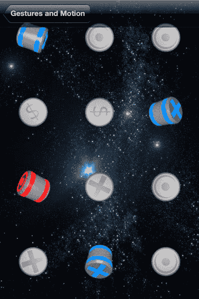

## 第 8 章 构建你的游戏：理解手势与动作 189

### 轻点手势

轻点手势在 iOS 中广泛使用。从启动应用程序到在地图应用中放置图钉，轻点手势是 iOS 界面的核心。这很合理，因为它们与桌面操作系统中的鼠标点击非常相似。

轻点手势与鼠标点击有相似之处；例如，在 OS X 中从系统 Dock 启动应用程序只需单击一次，而在 iOS 中启动应用程序则只需轻点一次。如果考虑 OS X 上的“辅助点击”（也称为控制点击或右键点击），这种类比仍然成立；这类似于 iOS 中的双指轻点。事实上，如果你使用 Mac 笔记本电脑，触控板可以配置为将双指轻点视为“辅助点击”。

在本例中，我们将配置一组`UITapGestureRecognizer`来响应不同的点击次数和手指数量（触摸点）组合。图 8–2 展示了此示例的实际效果。

**图 8–2.** *由轻点手势激活的能力提升项*

在图 8–2 中，我们看到 12 个能力提升项，排列成三列四行。这些能力提升项初始时为禁用状态，如右下角所示。当用户点击屏幕时，某个能力提升项会启用，变得明亮并旋转。启用的能力提升项取决于手势中使用的手指数量，以及是一指、两指还是三指点击。

[www.it-ebooks.info](http://www.it-ebooks.info/)


190 第 8 章 构建你的游戏：理解手势与动作

例如，双指三击启用了第二行最右侧的能力提升项。类似地，三指单击启用了第三行最左侧的能力提升项。简而言之，列表示点击次数，行表示手指数量。如果你想浪费一小时的时间，尝试让所有能力提升项都旋转起来。我*觉得*我做到了，但没来得及截图为证。

此演示在类`TapGestureController`中实现。清单 8–8 显示了`TapGestureController.h`文件。

**清单 8–8.** *TapGestureController.h*

```
@interface TapGesutureController : GameController<TemporaryBehaviorDelegate>{

NSMutableArray* powerups;

}
```


`- (void)tapGesture:(UITapGestureRecognizer *)sender;`

`@end`

在**列表 8–8**中，我们看到`TapGestureController`类的头部，它继承自`GameController`并遵循`TemporaryBehaviorDelegate`协议。我们还看到有一个名为`powerups`的`NSMutableArray`，用于存储本示例中的十二个强化物。在其他示例中，我们依赖`GameController`通过指定需要排序的类来跟踪不同类型的角色。在本示例中，我们使用一个单独的`NSMutableArray`，因为我们希望利用`powerups`中`Powerup`对象的顺序来跟踪行和列。最后，我们看到了任务`tapGesture:`的声明，当`UITapGestureRecognizer`识别到一个手势时，会调用该方法。`TapGestureController`的设置代码实现见**列表 8–9**。

**列表 8–9.** *`TapGestureController.m (doSetup)`*

```objc
-(BOOL)doSetup{
    if ([super doSetup]){
        [self setGameAreaSize:CGSizeMake(320, 480)];
        powerups = [NSMutableArray new];
        for (int tap=0;tap<=2;tap++){
            for (int touch=0;touch<=3;touch++){
                float x = 320.0/6.0 + tap*320.0/3;
                float y = 480.0/8.0 + touch*480/4;
                CGPoint center = CGPointMake(x, y);
                Powerup* powerup = [Powerup powerup:self At:center];
                [self addActor: powerup];
                [powerups addObject:powerup];
            }
        }
        for (int touch=1;touch<=4;touch++){
            UITapGestureRecognizer* tripleTap = [[UITapGestureRecognizer alloc]
                initWithTarget:self action:@selector(tapGesture:)];
            [tripleTap setNumberOfTapsRequired:3];
            [tripleTap setNumberOfTouchesRequired:touch];
            UITapGestureRecognizer* doubleTap = [[UITapGestureRecognizer alloc]
                initWithTarget:self action:@selector(tapGesture:)];
            [doubleTap setNumberOfTapsRequired:2];
            [doubleTap setNumberOfTouchesRequired:touch];
            [doubleTap requireGestureRecognizerToFail:tripleTap];
            UITapGestureRecognizer* singleTap = [[UITapGestureRecognizer alloc]
                initWithTarget:self action:@selector(tapGesture:)];
            [singleTap setNumberOfTapsRequired:1];
            [singleTap setNumberOfTouchesRequired:touch];
            [singleTap requireGestureRecognizerToFail:doubleTap];
            [actorsView addGestureRecognizer:tripleTap];
            [actorsView addGestureRecognizer:doubleTap];
            [actorsView addGestureRecognizer:singleTap];
        }
        return YES;
    }
    return NO;
}
```

在**列表 8–9**中，我们看到`TapGestureController`类的任务`doSetup`。在此任务中，我们生成 12 个`Powerup`对象并将它们添加为演员。我们还在`NSMutableArray` `powerups`中跟踪每个`Powerup`。创建`Powerup`对象后，我们又创建了 12 个`UITapGestureRecognizer`——每个`Powerup`对应一个。每个`UITapGestureRecognizer`通过任务`addGestureRecognizer:`添加到`actorsView`。注意，我们为点击次数和触摸次数的每种可能组合创建了`UITapGestureRecognizer`，而不是试图使用单个`UITapGestureRecognizer`来识别各种组合。

尽管在某些情况下这样做是可行的，但当你尽可能精确地使用`UIGestureRecognizer`时，一切都会好得多，因为手势识别器之间存在一些微妙的交互。例如，负责检测三次点击的识别器必须取消那些负责双击和单击的识别器。

每个`UITapGestureRecognizer`都被配置为在识别到手势时调用`tapGesture:`，如**列表 8–10**所示。

**列表 8–10.** *`TapGestureController.m (tapGesture:)`*

```objc
- (void)tapGesture:(UITapGestureRecognizer *)sender{
    int taps = [sender numberOfTapsRequired];
    int touches = [sender numberOfTouches];
    int index = (taps-1)*4+(touches-1);
    Powerup* powerup = [powerups objectAtIndex:index];
    TemporaryBehavior* tempBehav = [TemporaryBehavior temporaryBehavior:nil for:60*5];
    [tempBehav setDelegate:self];
    NSMutableArray* behaviors = [powerup behaviors];
}
```


`[behaviors addObject:tempBehav];`

`[powerup setState:STATE_GLOW];`

`}`

在`Listing 8–10`中，我们看到了任务`tapGesture:`，只要 12 个`UITapGestureRecognizer`中的任何一个识别到点击手势时，就会调用该任务。注意，我们没有检查`UITapGestureRecognizer`的状态，因为点击手势被认为是离散的，不使用状态信息。我们使用任务`numberOfTapsRequired`和`numberOfTouches`来确定哪个`UITapGestureRecognizer`做出了响应，并将这些值分别存储到`taps`和`touches`中。这些值告诉我们应该启用的`Powerup`在`NSMutableArray`（即`powerups`）中的索引。一旦我们找到了正确的`Powerup`，就创建一个`TemporaryBehavior`并将`self`设置为代理。

然后，该强化道具的行为会被设置为新创建的`TemporaryBehavior`，同时其状态被设置为`STATE_GLOW`。这使强化道具开始旋转。接下来，让我们仔细看看`TemporaryBehavior`类。

**TemporaryBehavior 类**

类`TemporaryBehavior`为一个角色应用一个行为，持续固定的步骤数。

在本例中，我们实际上并不想应用任何行为；我们只是想知道何时过了五秒钟。让我们快速看一下`TemporaryBehavior`类，了解它是如何工作的。`TemporaryBehavior`的声明如`Listing 8–11`所示。

**Listing 8–11.** *TemporaryBehavior.h*

```objectivec
@class TemporaryBehavior;

@protocol TemporaryBehaviorDelegate

-(void)stepsUpdatedOn:(Actor*)anActor By:(TemporaryBehavior*)tempBehavior In:(GameController*)controller;

@end

@interface TemporaryBehavior : NSObject <Behavior>{

}

@property (nonatomic) long stepsRemaining;

@property (nonatomic, strong) NSObject<Behavior>* behavior;

@property (nonatomic, strong) NSObject<TemporaryBehaviorDelegate>* delegate;

+(id)temporaryBehavior:(NSObject<Behavior>*)aBehavior for:(long)aNumberOfSteps;

@end
```

在`Listing 8–11`中，我们看到了`TemporaryBehavior`类的定义。我们注意到它定义了一个名为`TemporaryBehaviorDelegate`的协议，`TapGestureController`遵循该协议（参见`Listing 8–8`）。`TemporaryBehavior`的构造方法接受一个`Behavior`和一个步骤数作为参数。`Listing 8–12`展示了`TemporaryBehavior`的实现。

[www.it-ebooks.info](http://www.it-ebooks.info/)


**第 8 章：构建你的游戏：理解手势与移动** **193**

**Listing 8–12.** *TemporaryBehavior.m*

```objectivec
+(id)temporaryBehavior:(NSObject<Behavior>*)aBehavior for:(long)aNumberOfSteps{

TemporaryBehavior* temp = [TemporaryBehavior new];

[temp setBehavior:aBehavior];

[temp setStepsRemaining:aNumberOfSteps];

return temp;
}

-(void)applyToActor:(Actor*)anActor In:(GameController*)gameController{

stepsRemaining--;

[behavior applyToActor:anActor In:gameController];

[delegate stepsUpdatedOn:anActor By:self In:gameController];

if (stepsRemaining <= 0){

[[anActor behaviors] removeObject:self];
}
}

@end
```

在`Listing 8–12`中，我们看到了`TemporaryBehavior`类的实现。构造方法只是创建了一个`TemporaryBehavior`对象，并使用提供的参数填充它。任务`applyToActor:In:`来自`Behavior`协议（`TemporaryBehavior`遵循该协议），并在游戏的每一步被调用。在这个任务中，我们只是将提供的行为应用到角色上，并通知代理这项工作已完成。继续点击手势的例子，我们来看看`TapGestureController`如何响应任务`stepsUpdatedOn:By:In:`，如`Listing 8–13`所示。

**Listing 8–13.** *TapGestureController.m (stepsUpdatedOn:By:In:)*

```objectivec
-(void)stepsUpdatedOn:(Actor*)anActor By:(TemporaryBehavior*)tempBehavior In:(GameController*)controller{

if ([tempBehavior stepsRemaining]==0){

[anActor setState:STATE_NO_GLOW];
}
}
```

在`Listing 8–13`中，我们看到了由`TapGestureController`类定义的任务`stepsUpdatedOn:By:In:`。在这个任务中，我们只是检查`TemporaryBehavior`（即`tempBehavior`）是否处于其生命周期的末尾。如果是，我们将角色的状态设置为`STATE_NO_GLOW`，从而停止强化道具的旋转。


我们已经详细探讨了`UITapGestureRecognizer`可用的不同配置。下一节将介绍一种新的手势：捏合。

**第 8 章：构建你的游戏：理解手势与动作**

## 捏合手势

在 iOS 中，捏合手势通常用于放大缩小或缩放屏幕上的内容。该手势通过两个手指按下并相互靠近或远离来触发。图 8-3 展示了这一手势的实际效果。

**图 8-3.** *改变飞碟大小的捏合手势*

在图 8-3 中，我们看到了使用捏合手势的示例。左侧的飞碟因向外捏合手势而放大。右侧的同一个飞碟因向内捏合手势而缩小。当飞碟被缩放时，它会停止旋转。我们利用捏合手势的不同状态来控制旋转的启动与停止。

可以通过向`UIView`添加`UIPinchGestureRecognizer`实例来检测捏合手势。`UIPinchGestureRecognizer`不仅会在捏合手势发生时通知你，还会报告与该手势相关的缩放比例和速度值。`UIPinchGestureRecognizer`报告的缩放比例非常实用，因为这是捏合手势最常见的用途之一。

该示例在`PinchGestureController`类中实现。让我们快速看一下其头文件，如代码清单 8-14 所示。

**代码清单 8-14.** *PinchGestureController.h*

```
@interface PinchGestureController : GameController{

    Saucer* saucer;

    float startRadius;

}

-(void)pinchGesture:(UIPinchGestureRecognizer*)sender;

@end
```

在代码清单 8-14 中，我们看到了`PinchGestureController`类的头文件。与之前的示例类似，它继承自`GameController`，并维护了对`Saucer`对象的引用以及手势开始时`Saucer`对象的半径。任务`pinchGesture:`由手势识别器调用。该类的实现将更清楚地展示此示例的工作原理，首先从`doSetup`任务开始，如代码清单 8-15 所示。

**代码清单 8-15.** *PinchGestureController (doSetup)*

```
-(BOOL)doSetup{

    if ([super doSetup]){

        [self setGameAreaSize:CGSizeMake(320, 480)];

        saucer = [Saucer saucer:self];

        [self addActor:saucer];

        UIPinchGestureRecognizer* pinchRecognizer = [[UIPinchGestureRecognizer alloc]

            initWithTarget:self action:@selector(pinchGesture:)];

        [actorsView addGestureRecognizer:pinchRecognizer];

        return YES;

    }

    return NO;

}
```

在代码清单 8-15 中，`PinchGestureController`类的`doSetup`任务非常简单。我们只需添加一个新的`Saucer`，并设置一个`UIPinchGestureRecognizer`，使其在识别到捏合手势时调用`pinchGesture:`。

接下来，我们看看如何在下一节中响应手势。

## 响应捏合手势

我们已经了解了如何注册捏合手势识别器。`pinchGesture:`的实现如代码清单 8-16 所示。

**代码清单 8-16.** *PinchGestureController (pinchGesture:)*

```
-(void)pinchGesture:(UIPinchGestureRecognizer*)pinchRecognizer{

    if (pinchRecognizer.state == UIGestureRecognizerStateBegan){

        startRadius = [saucer radius];

        [saucer setAnimationPaused:YES];

    } else if (pinchRecognizer.state == UIGestureRecognizerStateChanged){

        float scale = [pinchRecognizer scale];

        float velocity = [pinchRecognizer velocity];

        NSLog(@"Scale: %f Velocty: %f",scale, velocity);

        float radius = startRadius*scale;

        if (radius < 8){

            radius = 8;

        } else if (radius > 128.0){

            radius = 128;

        }

        [saucer setRadius:radius];

    } else if (pinchRecognizer.state == UIGestureRecognizerStateEnded){

        [saucer setAnimationPaused:NO]; 
```


} else if (`pinchRecognizer.state == UIGestureRecognizerStateCancelled`){

    [`saucer setRadius:startRadius`];

    [`saucer setAnimationPaused:NO`];

}

}

在清单 8–16 中，我们看到任务`pinchGesture:`，每当在`UIView`的`actorsView`上检测到捏合手势时，就会调用该任务。在此示例中，我们检查手势识别器的状态。状态信息指示手势刚刚开始（`UIGestureRecognizerStateBegan`）、正在进行（`UIGestureRecognizerStateChanged`）还是已终止（`UIGestureRecognizerStateEnded` 或 `UIGestureRecognizerStateCancelled`）。

手势开始时，我们记录`saucer`的半径并将其存储在变量`startRadius`中。我们还在`saucer`上调用`setAnimationPaused:`，以在缩放时停止其动画。这并不是必须停止动画的要求。我们这样做只是为了在手机上玩示例时能够观察手势识别器状态的变化。

手势进行时，我们获取手势的比例和速度。比例值是从手势开始以来的比例变化。换句话说，比例是累积的，这就是为什么我们将比例应用于`startRadius`，而不是`saucer`的当前半径。一旦计算出新的半径，我们就将其应用于`saucer`。速度是每秒的比例因子。此值可用于计算在手势结束后应用于动画的漂移量。我们除了记录该值外，没有使用它。

手势结束时，通常我们只需将`saucer`的`animationPaused`属性设置为`NO`。这会使`saucer`再次开始动画。如果手势被取消，我们将`saucer`重置为其原始半径并取消暂停动画。要测试取消状态，请先将`saucer`一直缩小，然后用一只手开始放大它，同时另一只手按下 iPhone 顶部的电源按钮。这将把你踢出应用程序。然后重新启动示例应用程序，并注意`saucer`回到了其原始的小尺寸。

捏合手势是我们在本章中看到的第一个多状态手势。接下来我们将看到的手势是平移或拖拽手势，这是另一种多状态手势。我们会发现它的行为与捏合手势非常相似。

[www.it-ebooks.info](http://www.it-ebooks.info/)


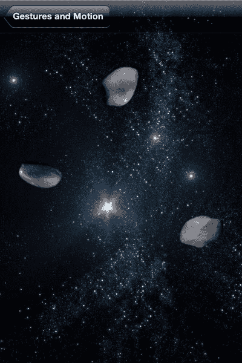

**第 8 章：构建游戏：理解手势与动作** **197**

**平移（或拖拽）手势**

平移手势是你在“地图”应用中用来查看地图不同部分的手势。拖拽手势也用于解锁手机或下拉通知中心。如果你仔细想想，这些手势实际上是同一回事；用户将手指放下，沿大致直线移动，然后抬起。区别在于应用程序的响应方式。当视图在内容（例如地图或图像）上平移时，我们称之为平移手势。当你在屏幕上移动 UI 组件（例如滑块旋钮）时，我们称之为拖拽。无论我们在描述中如何称呼，此手势都是通过`UIPanGestureRecognizer`类（抱歉，拖拽）实现的。图 8–4 展示了一个使用`UIPanGestureRecognizer`的示例。

**图 8–4.** *平移或拖拽示例*

在图 8–4 中，我们看到了三颗小行星。每颗小行星可以沿一条不可见的路径向上或向下拖拽。拖拽小行星时，你可以将手指一直向右或向左移动。这使得操作更加容易，因为用户一旦让目标小行星开始移动，就无需太在意手指移动的具体位置。

这个简单的示例从类`PanGestureController`的头文件开始，如清单 8–17 所示。

[www.it-ebooks.info](http://www.it-ebooks.info/)


**198**

**第 8 章：构建游戏：理解手势与动作** **清单 8–17.** *PanGestureController.h*

```
@interface PanGestureController : GameController{
```


```objc
NSMutableArray* asteroids;

int asteroidIndex;

CGPoint startCenter;

}

@property (nonatomic) float minYValue;

@property (nonatomic) float maxYValue;

-(void)panGesture:(UIPanGestureRecognizer*)panRecognizer;

@end
```

在清单 8-17 中，我们可以看到类 `PanGestureController` 的头文件，它同样继承了 `GameController`。我们在 `NSMutableArray asteroids` 中维护了一个小行星的有序列表。此外，我们还有两个变量用于跟踪手势持续期间的状态：`int asteroidIndex` 和 `CGPoint startCenter`。属性 `minYValue` 和 `maxYValue` 指定了每个 `Asteroid` 可以上下移动的范围。当检测到平移手势时，任务 `panGesture:` 会被 `UIPanGestureRecognizer` 调用。

本示例的核心内容位于类 `PanGestureController` 的实现中，让我们从 `doSetup` 任务开始，如清单 8-18 所示。

**清单 8-18.** *PanGestureController.m (doSetup)*
```objc
-(BOOL)doSetup{

if ([super doSetup]){

[self setGameAreaSize:CGSizeMake(320, 480)];

[self setMinYValue:72.0f];

[self setMaxYValue:480-[self minYValue]];

asteroids = [NSMutableArray new];

for (int i=0;i<3;i++){

Asteroid* asteroid = [Asteroid asteroid:self];

[[asteroid behaviors] removeAllObjects];

[self addActor:asteroid];

[asteroids addObject:asteroid];

CGPoint center = CGPointMake(i*320.0/3.0+320.0/6.0, [self minYValue]);

[asteroid setCenter:center];

}

UIPanGestureRecognizer* panRecognizer = [[UIPanGestureRecognizer alloc]

initWithTarget:self action:@selector(panGesture:)];

[panRecognizer setMinimumNumberOfTouches:1];

[actorsView addGestureRecognizer:panRecognizer];

return YES;

}

return NO;

}
```

在清单 8-18 中，我们看到了类 `PanGestureController` 的 `doSetup` 任务。在指定游戏区域大小之后，我们首先为小行星指定了 `minYValue` 和 `maxYValue`，这样它们就无法移动到距离屏幕顶部或底部 72 点以内的区域。接着，我们创建了三个 `Asteroid` 对象，将它们添加到场景中，并加入到 `NSMutableArray asteroids` 里。每个 `Asteroid` 都从屏幕顶部开始。

在 `doSetup` 中我们做的最后一件事是创建一个 `UIPanGestureRecognizer`，将其配置为调用 `panGesture:`，并添加到 `actorsView` 中。下一节将解释我们如何响应这些手势以实现所需的行为。

## 响应平移手势

我们已经回顾了如何设置类 `UIPanGestureRecognizer`。现在我们将探讨如何在任务 `panGesture:` 中响应此手势，如清单 8-19 所示。

**清单 8-19.** *PanGestureController.m (panGesture:)*
```objc
-(void)panGesture:(UIPanGestureRecognizer*)panRecognizer{

if ([panRecognizer state] == UIGestureRecognizerStateBegan){

CGSize gameAreaSize = [self gameAreaSize];

CGPoint locationInView = [panRecognizer locationInView:actorsView]; if (locationInView.x < gameAreaSize.width/3.0){

asteroidIndex = 0;

} else if (locationInView.x > gameAreaSize.width/3.0*2){

asteroidIndex = 2;

} else {

asteroidIndex = 1;

}

Asteroid* asteroid = [asteroids objectAtIndex:asteroidIndex];

startCenter = [asteroid center];

[asteroid setAnimationPaused:YES];

} else if ([panRecognizer state] == UIGestureRecognizerStateChanged){

Asteroid* asteroid = [asteroids objectAtIndex:asteroidIndex];

CGPoint locationInView = [panRecognizer locationInView:actorsView]; CGPoint center = [asteroid center];

center.y = locationInView.y;

if (center.y < [self minYValue]){

center.y = [self minYValue];

}

if (center.y > [self maxYValue]){

center.y = [self maxYValue];

}

[asteroid setCenter:center];

} else if ([panRecognizer state] == UIGestureRecognizerStateEnded){

Asteroid* asteroid = [asteroids objectAtIndex:asteroidIndex];

[asteroid setAnimationPaused:NO];

} else if ([panRecognizer state] == UIGestureRecognizerStateCancelled){

Asteroid* asteroid = [asteroids objectAtIndex:asteroidIndex];

[asteroid setAnimationPaused:NO];

[asteroid setCenter:startCenter];

}

}
```


# 构建你的游戏：理解手势与移动

在`代码清单 8-19`中，我们可以看到任务`panGesture:`根据`panRecognizer`的状态被分解，这与捏合放大的例子类似。如果`panRecognizer`的状态等于`UIGestureRecognizerStateBegan`，我们会计算三个小行星中哪个在水平方向上离手势最近。一旦我们在`asteroidIndex`中记录了正在操作的小行星，就可以从`NSMutableArray`（名为`asteroids`）中获取当前活跃的`Asteroid`对象，并将其位置记录在`startCenter`中。最后，我们通过将`animationPaused`设为`NO`来停止其旋转。

在后续对`panGesture:`的调用中，`panRecognizer`的状态将变为`UIGestureRecognizerStateChanged`。此时，我们只需使用`panRecognizer`的任务`locationInView:`，将所选小行星的 Y 值设置为手势的 Y 值。

与之前的例子类似，手势要么以`UIGestureRecognizerStateEnded`状态结束，要么以`UIGestureRecognizerStateCancelled`状态终止。在这两种情况下，我们都希望在取消状态下重新启动动画；同时，我们还想将所选小行星的中心点恢复为`startCenter`。

我希望到这里，大家已经看出这些手势识别器的工作模式了。基本模式是：设置识别器来检测`UIView`上的手势，配置回调任务以记录被操作对象（飞碟、小行星等）的起始状态，对场景应用变化，或者在取消的情况下回滚这些变化。接下来，我们来看旋转手势。

## 旋转手势

在核心 iOS 应用中，旋转手势并不像之前介绍的手势那样常见。事实上，我在 iPhone 自带的应用中找不到一个旋转手势的例子，不过也可能是我有所遗漏。然而，旋转手势确实出现在一些数字益智游戏中，你需要在游戏中以某种方式旋转一个物体。旋转手势的操作方法是：将两根手指放在屏幕上，然后旋转你的手，就像在开瓶盖一样。图 8-5 展示了一个旋转的例子。

在图 8-5 中，我们看到一艘宇宙飞船正在逆时针旋转。我们知道飞船是在逆时针旋转，因为它的右舷机动推进器正在点火。如果飞船是顺时针旋转，我们会看到左舷机动推进器在点火。负责这个例子的类是`RotationGestureController`，其头文件如代码清单 8-20 所示。

**图 8-5.** *使用旋转手势旋转一艘宇宙飞船*

**代码清单 8-20.** *RotationGestureController.h*

```
@interface RotationGestureController : GameController{

    Viper* viper;

    float startRotation;

}

-(void)rotationGesture:(UIRotationGestureRecognizer*)rotationRecognizer;

@end
```

在代码清单 8-20 中，我们看到了类`RotationGestureController`的头文件。我们看到有一个指向飞船的引用，名为`viper`。同时，我们在变量`startRotation`中记录了飞船的起始旋转角度。当`UIRotationGestureRecognizer`识别到一个手势时，会调用任务`rotationGesture:`。

我们来快速看一下类`RotationGestureController`的`doSetup`任务，以便理解`UIRotationGestureRecognizer`是如何设置的。请参见代码清单 8-21。

**代码清单 8-21.** *RotationGestureController.m (doSetup)*

```
-(BOOL)doSetup{

    if ([super doSetup]){

        [self setGameAreaSize:CGSizeMake(320, 480)];

        viper = [Viper viper:self];

        [self addActor:viper];

        UIRotationGestureRecognizer* rotationRecognizer = [[UIRotationGestureRecognizer alloc] initWithTarget:self action:@selector(rotationGesture:)];

        [actorsView addGestureRecognizer:rotationRecognizer];

        return YES;

    }

    return NO;

}
```

在代码清单 8-21 中，我们可以看到`RotationGestureController`的`doSetup`任务非常简单。我们添加了一个新的`Viper`对象，并注册了一个`UIRotationGestureRecognizer`。这一步应该不令人意外——我们知道，当对象`rotationRecognizer`检测到可以解释为旋转手势的触摸事件时，任务`rotationGesture:`将会被调用。我们来看看任务`rotationGesture:`，如代码清单 8-22 所示。

**代码清单 8-22.** *RotationGestureController.m (rotationGesture:)*

```
-(void)rotationGesture:(UIRotationGestureRecognizer*)rotationRecognizer{

    if ([rotationRecognizer state] == UIGestureRecognizerStateBegan){

        startRotation = [viper rotation];

    } else if ([rotationRecognizer state] == UIGestureRecognizerStateChanged){

        float rotation = [rotationRecognizer rotation];

        float finalRotation = startRotation + rotation*2.0;

        if (finalRotation > [viper rotation]){

            [viper setState:VPR_STATE_CLOCKWISE];

        } else {

            [viper setState:VPR_STATE_COUNTER_CLOCKWISE];

        }

        [viper setRotation: finalRotation];

    } else if ([rotationRecognizer state] == UIGestureRecognizerStateEnded){

        [viper setState:VPR_STATE_STOPPED];

    } else if ([rotationRecognizer state] == UIGestureRecognizerStateCancelled){

        [viper setState:VPR_STATE_STOPPED];

        [viper setRotation:startRotation];

    }

}
```

在代码清单 8-22 中，展示了类`RotationGestureController`的`rotationGesture:`任务。在这个任务中，我们根据`rotationRecognizer`的状态，执行现在已很熟悉的操作。如果状态是`UIGestureRecognizerStateBegan`，我们只需记录角色`viper`的起始旋转角度。如果状态是`UIGestureRecognizerStateChanged`，我们从`rotationRecognizer`获取旋转值。

旋转值是相对于用户最初放置手指的位置而言的。由于旋转值是相对于`startRotation`的，我们必须将旋转值加到`startRotation`上，才能让飞船像旋钮一样转动。我们将旋转值乘以 2.0，以使旋转更快、反应更灵敏。这样做仅仅是因为我们可能会在动作游戏中使用这种技术，我们希望用户能够相当快速地旋转飞船。一旦计算出`finalRotation`的值，我们就判断它是否大于或小于当前的旋转值。这使我们能够将`viper`的状态设置为`VPR_STATE_CLOCKWISE`（顺时针）或`VPR_STATE_COUNTER_CLOCKWISE`（逆时针）。

当手势结束时，我们只需将`viper`的状态设回`VPR_STATE_STOPPED`。此外，如果手势被取消，我们将飞船的旋转角度重置回`startRotation`。

接下来的例子更类似于点击例子，而非之前的例子，因为它处理的是所谓的长按手势。

## 长按手势

长按手势是指用户触摸手机上的某个点并保持一段时间的手势。它有点像点击，但时间更长——正如其名。用户通常在想要重新排列应用图标时会使用长按手势——当你按住一个应用图标使其开始晃动时，这就是长按。当你在键盘上按下带有子选项的按键时，也会用到长按。例如，打开 Safari，点击地址栏。键盘弹出后，将手指放在“.com”按钮上。片刻之后，会显示五个备选的顶级域名。在这个例子中，我们将点击与长按结合起来，以改变飞船发射子弹的大小，如图 8-6 所示。

**图 8-6.** *一艘飞船发射三种不同大小的子弹*


# 第八章：构建游戏：理解手势与移动

在图 8-6 中，我们看到屏幕底部有一艘飞船。飞船上方有许多圆形图案，这些是根据用户手势从飞船射出的子弹。左上角聚集的三个圆形是通过简单轻触产生的基础子弹。靠近底部最大的圆形是用户长按时产生的大型子弹。如果用户触摸超过两秒，则会发射出更大的子弹，如图 8-6 右上角所示。让我们来看看清单 8-23 中`LongPressController`类的头文件。

**清单 8-23.** `LongPressController.h`

```
@interface LongPressController : GameController{

Viper* viper;

NSDate* longStart;

}

-(void)tapGesture:(UITapGestureRecognizer*)tapRecognizer;

-(void)longPressGesture:(UILongPressGestureRecognizer*)longPressRecognizer;

-(void)fireBulletAt:(CGPoint)point WithDamage:(float)bulletSize;

@end
```

在清单 8-23 中，我们看到了`LongPressController`类的头文件，其中显示我们有一个对飞船的引用，以及一个用于记录长按手势开始时间的`NSDate`。当用户轻触屏幕发射小型子弹时，会调用`tapGesture:`任务；当用户执行长按手势发射大型子弹时，会调用`longPressGesture:`任务。最后一个任务用于创建`Bullet`对象并将其添加到场景中。让我们先来看看`LongPressController`的`doSetup`任务，如清单 8-24 所示。

**清单 8-24.** `LongPressController.m（doSetup 部分）`

```
-(BOOL)doSetup{

if ([super doSetup]){

[self setGameAreaSize:CGSizeMake(320, 480)];

viper = [Viper viper:self];

[self addActor:viper];

CGPoint center = [viper center];

center.y = [self gameAreaSize].height/5.0*4.0;

[viper setCenter:center];

UITapGestureRecognizer* tapRecognizer = [[UITapGestureRecognizer alloc]

initWithTarget:self action:@selector(tapGesture:)];

[actorsView addGestureRecognizer:tapRecognizer];

UILongPressGestureRecognizer* longPressRecognizer =

[[UILongPressGestureRecognizer alloc] initWithTarget:self

action:@selector(longPressGesture:)];

[longPressRecognizer setMinimumPressDuration:1.0f];

[actorsView addGestureRecognizer: longPressRecognizer];

return YES;

}

return NO;

}
```

[www.it-ebooks.info](http://www.it-ebooks.info)


## 第八章：构建游戏：理解手势与移动 205

在清单 8-24 中，我们看到了`doSetup`任务。在完成了设置游戏区域大小和添加`viper`对象这些常规步骤后，我们注册了两个手势响应器。第一个手势识别器是`UITapGestureRecognizer`，它会调用`tapGesture:`方法。第二个手势识别器是配置为调用`longPressGesture:`方法的`UILongPressGestureRecognizer`。该手势识别器的`minimumPressDuration`属性被设置为`1.0f`，这意味着用户必须按住屏幕一秒钟，该识别器才会将触摸视为长按手势。两个手势识别器都被添加到了`actorsView`中。

## 响应用户操作

在接下来的部分中，我们将根据触发的手势类型，了解如何添加子弹。我们首先处理轻触手势。`tapGesture:`方法的实现如清单 8-25 所示。

**清单 8-25.** `LongPressController.m（tapGesture:部分）`

```
-(void)tapGesture:(UITapGestureRecognizer*)tapRecognizer{

[self fireBulletAt:[tapRecognizer locationInView:actorsView] WithDamage:10];

}
```

在清单 8-25 中，我们看到每次识别到轻触手势时，都会调用`fireBulletAt:WithDamage:`方法，并指定触摸位置和伤害值`10`。更有趣的交互体现在`longPressGesture:`方法的实现中，如清单 8-26 所示。

**清单 8-26.** `LongPressController.m（longPressGesture:部分）`

```
-(void)longPressGesture:(UILongPressGestureRecognizer*)longPressRecognizer{

if ([longPressRecognizer state] == UIGestureRecognizerStateBegan){
```


```markdown

`[viper setState:VPR_STATE_TRAVELING]`;

`longStart = [NSDate date]`;

} else if ([`longPressRecognizer` state] == `UIGestureRecognizerStateEnded`){

`NSDate* now = [NSDate date]`;

`float damage = 20`;

if ([`now` `timeIntervalSinceDate:longStart`] > 1.0f){

`damage = 30`;

}

`[self fireBulletAt:[longPressRecognizer locationInView:actorsView] WithDamage:damage]`;

`[viper setState:VPR_STATE_STOPPED]`;

}

}

在 `列表 8–26` 中，我们使用 `longPressRecognizer` 的状态来决定要执行的操作。如果手势已经开始，我们将时间记录在变量 `longStart` 中；同时将 `viper` 对象的状态设置为 `VPR_STATE_TRAVELING`，这会显示飞船的推进效果。如果你已经体验过演示应用程序，你会注意到推进效果是在手势相关的 1 秒延迟后出现的。这意味着 `longPressGesture:` 在这段最短时间过去之前不会被调用。

如果 `longPressRecognizer` 的状态是 `UIGestureRecognizerStateEnded`，则我们知道用户已经松开了手指。当这种情况发生时，我们检查自手势开始以来是否已经过去了超过 1 秒。如果是，则将伤害从 20 升级到 30。这意味着如果用户按住手指 1 秒，下一颗子弹将造成 20 点伤害；如果按住 2 秒，伤害将变为 30。当长按手势结束时，我们将 `viper` 的状态设置回 `VPR_STATE_STOPPED`，并以相应的伤害发射子弹。

**添加子弹**

让我们看看 `fireBulletAt:WithDamage:` 的实现来完成这个示例。参见 `列表 8–27`。

**列表 8–27.** *LongPressController.m (fireBulletAt:WithDamage:)*

```
-(void)fireBulletAt:(CGPoint)point WithDamage:(float)damage{
    Bullet* bullet = [Bullet bulletAt:[viper center] TowardPoint:point];
    [bullet setDamage:damage];
    [self addActor:bullet];
}
```

在 `列表 8–27` 中，我们看到我们简单地创建了一个新的 `Bullet` 角色，它被配置为向指定点移动，并将其添加到场景中。

**滑动手势**

滑动手势最广为人知的用途可能是切换主屏幕上看到的应用程序集合。这种手势通常用于切换上下文，就像主屏幕一样。其他例子包括在 iPad 2 上用于切换前台应用程序的四指滑动。这有点像在你正在运行的应用程序中“扒拉”过去。在我们的示例中，我们将使用滑动手势向场景中添加彗星，如图 8–7 所示。

在图 8–7 中，我们看到屏幕上有几颗彗星。每颗彗星都是由一个滑动手势创建的，该手势决定了彗星的起始位置和移动方向。例如，向右滑动会导致彗星在左侧创建并向右移动。让我们看看 `列表 8–28` 中 `SwipeGestureController` 类的 `doSetup` 任务。

**图 8–7.** *滑动创建彗星*

**列表 8–28.** *SwipeGestureController.m (doSetup)*

```
-(BOOL)doSetup{
    if ([super doSetup]){
        [self setGameAreaSize:CGSizeMake(320, 480)];
        UISwipeGestureRecognizer* down = [[UISwipeGestureRecognizer alloc]
            initWithTarget:self action:@selector(swipeGesture:)];
        [down setDirection:UISwipeGestureRecognizerDirectionDown];
        [actorsView addGestureRecognizer:down];
        UISwipeGestureRecognizer* up = [[UISwipeGestureRecognizer alloc]
            initWithTarget:self action:@selector(swipeGesture:)];
        [up setDirection:UISwipeGestureRecognizerDirectionUp];
        [actorsView addGestureRecognizer:up];
        UISwipeGestureRecognizer* left = [[UISwipeGestureRecognizer alloc]
            initWithTarget:self action:@selector(swipeGesture:)];
        [left setDirection:UISwipeGestureRecognizerDirectionLeft];
        [actorsView addGestureRecognizer:left];
```

```


`UISwipeGestureRecognizer*` `right = [[UISwipeGestureRecognizer alloc]`

`initWithTarget:self action:@selector(swipeGesture:)]`;

`[right setDirection:UISwipeGestureRecognizerDirectionRight]`;

`[actorsView addGestureRecognizer:right]`;

[www.it-ebooks.info](http://www.it-ebooks.info/)


**208**

**第 8 章：构建你的游戏：理解手势与移动** `return YES;`

`}`

`return NO;`

`}`

在**列表 8–28**中，我们看到注册此示例手势识别器的代码。

我们看到，我们为想要监听的每个方向创建了一个`UISwipeGestureRecognizer`。此示例中唯一令人惊讶的是，它需要四个不同的手势识别器才能实现我们想要的效果。`UISwipeGestureRecognizer`确实允许您为多个方向指定一个识别器。但是，在响应滑动手势时，无法判断手势的方向。只有通过为每个方向创建一个识别器，我们才能判断用户手势的方向。

让我们看看`swipeGesture:`任务。参见**列表 8–29**。

**列表 8–29.** *SwipeGestureController.m (swipeGesture:)*

```
-(void)swipeGesture:(UISwipeGestureRecognizer*)swipeRecognizer{

    CGSize gameSize = [self gameAreaSize];

    UISwipeGestureRecognizerDirection direction = [swipeRecognizer direction]; CGPoint locationInView = [swipeRecognizer locationInView:actorsView]; CGPoint center = CGPointMake(0, 0);

    float directionInRadians = DIRECTION_DOWN;

    if (direction == UISwipeGestureRecognizerDirectionRight){

        center.x = -20;

        center.y = locationInView.y;

        directionInRadians = DIRECTION_RIGHT;

    } else if (direction == UISwipeGestureRecognizerDirectionDown){

        center.x = locationInView.x;

        center.y = -20;

        directionInRadians = DIRECTION_DOWN;

    } else if (direction == UISwipeGestureRecognizerDirectionLeft){

        center.x = gameSize.width+20;

        center.y = locationInView.y;

        directionInRadians = DIRECTION_LEFT;

    } else if (direction == UISwipeGestureRecognizerDirectionUp){

        center.x = locationInView.x;

        center.y = gameSize.height+20;

        directionInRadians = DIRECTION_UP;

    }

    Comet* comet = [Comet comet:self withDirection:directionInRadians andCenter:center];

    [self addActor:comet];

}
```

在**列表 8–29**中，我们看到当识别到滑动手势时被调用的代码。为了创建我们想要的效果，我们只需创建一个新的`Comet`actor，并为其指定正确的位置和方向。要确定`Comet`应该放置在哪里以及朝哪个方向移动，我们只需查看`swipeRecognizer`的`direction`属性。

[www.it-ebooks.info](http://www.it-ebooks.info/)


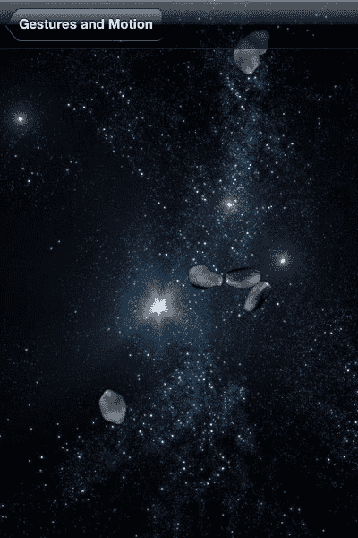

**第 8 章：构建你的游戏：理解手势与移动** **209**

我们不打算深入探讨`Comet`类是如何实现的细节；我们已经详细讨论过这一点。如果您真的感兴趣，请查看提供的源代码。

我们已经了解了 iOS 中内置的手势识别器，并探讨了它们的基本工作原理。在下一节中，我们将探讨如何将设备的移动集成到应用程序中。

## 解释设备移动

从 iPhone 4 开始，iOS 设备内置了加速度计和陀螺仪传感器。在应用程序中使用这些传感器有几种方法。最常见的两种方法是简单地对运动事件做出响应，这对应于摇动设备。另一种更精细的方法是通过`UIAccelerometer`类直接访问这些传感器的方向数据。让我们先看一下摇晃示例。

## 响应运动事件（摇晃）

每当 iOS 设备被摇动时，就会生成一个运动事件供应用程序使用。就个人而言，我觉得在应用程序中使用摇晃功能非常烦人；然而，有些人认为这是一个好主意，所以让我们看看如何利用这个功能。图 8-8 展示了我们的示例。

**图 8–8.** *小行星因设备摇晃而破碎*

[www.it-ebooks.info](http://www.it-ebooks.info/)


# 210

# 第 8 章：构建你的游戏：理解手势与动作

在图 8-8 中，我们看到一些**小行星**。这些小行星原本是一个整体，但几次摇晃事件导致它分裂了。本示例的类名为 `ShakeController`，它继承了 `GameController`。它的头文件没有什么特别之处，所以我们直接来看它的 `doSetup` 任务，如代码清单 8-30 所示。

**代码清单 8–30.** *`ShakeController.m` (`doSetup`)*

```
-(BOOL)doSetup{

if ([super doSetup]){

[self setGameAreaSize:CGSizeMake(320, 480)];

NSMutableArray* classes = [NSMutableArray new];

[classes addObject:[Asteroid class]];

[self setSortedActorClasses:classes];

return YES;

}

return NO;

}
```

在代码清单 8-30 中，我们看到 `doSetup` 任务配置了 `ShakeController`，将 `Asteroid` 标记为我们稍后需要访问的 `Actor` 类。我们在 `updateScene` 任务中添加了 `Asteroid`。之所以这样处理，是因为我们希望在场景中没有 `Asteroid` 对象时才添加一个新的 `Asteroid`，如代码清单 8-31 所示。

**代码清单 8–31.** *`ShakeController` (`updateScene`)*

```
-(void)updateScene{

if ([[self actorsOfType:[Asteroid class]] count] ==0 ){

Asteroid* asteroid = [Asteroid asteroid:self];

[self addActor:asteroid];

}

[super updateScene];

}
```

在代码清单 8-31 中，我们看到 `updateScene` 任务被调用来推进游戏在动画的每一步中前进。在此任务中，我们检查场景中是否存在 `Asteroid` 对象；如果没有，就继续添加一个。最后，我们调用父类的 `updateScene` 实现，以驱动游戏继续运行。

现在的问题是，我们如何响应摇晃事件来炸毁小行星？通过通知应用顶层视图可以成为“第一响应者”并实现相应的方法来响应运动事件，即可实现这一点。成为第一响应者的 `UIView` 是优先解释用户输入的 `UIView`。让视图成为第一响应者需要两个步骤。首先，你必须通知应用 `UIViewController` 的 `view` 属性可以成为第一响应者，然后你需要请求成为第一响应者。代码清单 8-32 展示了实现此功能的代码。

[www.it-ebooks.info](http://www.it-ebooks.info/)

# 211

## 第 8 章：构建你的游戏：理解手势与动作  

**代码清单 8–32.** *`ShakeController`（与第一响应者相关的任务）*

```
-(BOOL)canBecomeFirstResponder {

return YES;

}

-(void)viewDidAppear:(BOOL)animated {

[super viewDidAppear:animated];

[self becomeFirstResponder];

}

- (void)viewWillDisappear:(BOOL)animated {

[self resignFirstResponder];

[super viewWillDisappear:animated];

}
```

在代码清单 8-32 中，我们看到三个任务。第一个任务 `canBecomeFirstResponder` 只是通知应用此 `UIViewController` 的 `view` 属性有资格成为第一响应者，并且此 `UIViewController` 将处理其事件。接下来的两个任务是 `UIViewController` 生命周期的一部分：当此 `UIViewController` 实例的 `view` 属性被显示时，会调用 `viewDidAppear:`；此时，我们可以通过调用 `becomeFirstResponder` 成为第一响应者。相反，当此 `UIViewController` 从屏幕上移除时，我们不再希望它成为第一响应者，因此调用 `resignFirstResponder`。这三个任务只是让此类能够接收运动事件；这些事件在 `motionBegan:withEvent:` 和 `motionEnded:withEvent:` 任务的实现中进行处理。在我们的示例中，只需要实现其中一个；`motionBegan:withEvent:` 的实现如代码清单 8-33 所示。

**代码清单 8–33.** *`ShakeController.m` (`motionBegan:withEvent:`)*

```
- (void)motionBegan:(UIEventSubtype)motion withEvent:(UIEvent *)event

{

if (motion == UIEventSubtypeMotionShake)

{

for (Asteroid* asteroid in [self actorsOfType:[Asteroid class]]){

[asteroid doHit:self];

}

}

}
```


在`Listing 8–33`中，我们看到`motionBegan:withEvent:`任务，首先检查运动子类型是否为`UIEventSubtypeMotionShake`。如果是，我们只需遍历场景中的所有小行星并调用它们的`doHit:`方法。`doHit:`任务将在第 7 章讨论。

正如我们所见，响应摇动事件非常简单，与响应触摸事件非常相似。我觉得有点奇怪的是，摇动事件并没有作为手势来实现。我怀疑原因是摇动事件在众多不同的手势识别器加入`SDK`之前就已经存在了。

[www.it-ebooks.info](http://www.it-ebooks.info/)


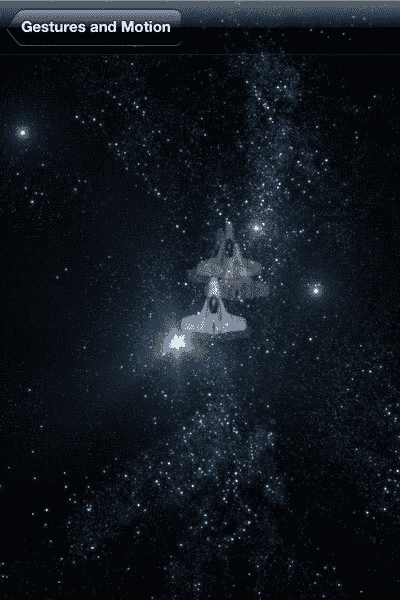

**212**

**第 8 章：构建你的游戏：理解手势与运动** **响应加速计数据**

作为一名开发者，能够获知设备的朝向对我来说非常酷。它让增强现实等应用成为可能，也带来了许多其他酷炫的功能。本章最后一个示例将使用加速计来操控场景中的角色。我不能保证它像增强现实游戏一样酷，但它应该能为其他开发者铺平道路。图 8–9 展示了正在运行的加速计示例。

**图 8–9.** *加速计演示的多个屏幕截图*

在图 8–9 中，我们看到该示例的多个屏幕截图。在此示例中，`viper`的位置基于`x`和`y`加速计值，因此当 iPhone 平放时，飞船应位于游戏区域的中心。当设备向左倾斜时，飞船向左移动；当设备向上倾斜时，飞船向上移动，依此类推。图 8–8 突显了加速计数据的波动性。所有这些截图都是在尝试保持设备水平时拍摄的（尽管同时也在尝试截图）。对于实际应用，加速计数据需要经过平滑处理。

负责我们示例的类是`AccelerometerController`，其头文件如`Listing 8–34`所示。

[www.it-ebooks.info](http://www.it-ebooks.info/)


**第 8 章：构建你的游戏：理解手势与运动** **213**

**Listing 8–34.** *`AccelerometerController.h`*

```objc
@interface AccelerometerController : GameController<UIAccelerometerDelegate>{

Viper* viper;

}

@end
```

在`Listing 8–34`中，我们看到了`AccelerometerController`类的头文件。需要注意的是，`AccelerometerController`类遵循`UIAccelerometerDelegate`协议，并且它有一个指向将在屏幕上移动的`Viper`的引用。遵循该协议允许`AccelerometerController`实时接收来自加速计的数据，我们稍后将看到这一点。我们首先来看看如何设置`AccelerometerController`类以使其接收数据，如`Listing 8–35`所示。

**Listing 8–35.** *`AccelerometerController.m` (`doSetup`)**

```objc
-(BOOL)doSetup{

if ([super doSetup]){

[self setGameAreaSize:CGSizeMake(320, 480)];

viper = [Viper viper:self];

[self addActor:viper];

UIAccelerometer* theAccelerometer = [UIAccelerometer sharedAccelerometer]; theAccelerometer.updateInterval = 1 / 50.0;

theAccelerometer.delegate = self;

return YES;

}

return NO;

}
```

在`Listing 8–35`中，我们进行常规设置，指定游戏区域大小并添加将用加速计数据移动的`viper`。要开始接收加速计数据，我们必须获得与正在运行的应用程序关联的单例`UIAccelerometer`。为此，我们使用`UIAccelerometer`类的静态任务`sharedAccelerometer`，然后将`self`设置为代理。另一件需要注意的事情是，我们必须指定获取数据的频率。在本例中，我们请求每秒获取 50 次数据，这对于实时输入来说已经足够快了。数据实际上是通过对`accelerometer:didAccelerate:`的调用接收的，如`Listing 8–36`所示。

**Listing 8–36.** *`AccelerometerController.m` (`accelerometer:didAccelerate:`)*


```objc
- (void)accelerometer:(UIAccelerometer *)accelerometer didAccelerate:(UIAcceleration *)acceleration{
    CGSize size = [self gameAreaSize];
    UIAccelerationValue x, y, z;
    x = acceleration.x;
    y = acceleration.y;
    z = acceleration.z;
    NSLog(@"x = %f y = %f z = %f", x, y, z);
    CGPoint center = CGPointMake(size.width/2.0 * x + size.width/2.0, size.height/2.0 * y + size.height/2.0);
    [viper setCenter:center];
}
```

[www.it-ebooks.info](http://www.it-ebooks.info/)


**214**

**第 8 章：构建你的游戏：理解手势与动作** 在代码清单 8-36 中，我们简单地从`UIAcceleration acceleration`获取了 x、y 和 z 的值。这些值的范围基于设备的朝向，在-1.0 到 1.0 之间。因为 x 值对应设备（在竖屏模式下）向左或向右倾斜，我们可以直接用 x 的值来指定新中心点的 x 值。

我们对 y 值也采用相同的方法，并设置`viper`的`center`属性。

这是一个非常简单的例子，但它有望引导你走上正确的方向。在我看来，像这个例子一样，实现基本功能相当简单，但要实现更复杂的用户交互，工作量则要大得多。我建议阅读名为《iOS 事件处理指南》的文档，该文档可在 http://developer.apple.com 获取。

**总结**

在本章中，我们探讨了如何响应基本的触摸事件。我们还了解了如何利用`UIGestureRecognizer`的子类将这些触摸事件解释为简洁的手势，比如捏合、长按、旋转等。在最后一节中，我们研究了使用加速度计控制游戏角色的两种方法。第一种方法让我们能够简单地响应摇晃事件。第二种技术展示了如何直接访问加速度计数据来控制应用程序，为比简单摇晃更复杂的基于动作的手势奠定了基础。

[www.it-ebooks.info](http://www.it-ebooks.info/)


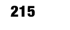

# 第 9 章：Game Center 与社交媒体

如今，推广游戏的关键方式之一是将你的应用程序与一个或多个社交媒体服务整合。其理念是，用户会在游戏过程中推广你的游戏，并与朋友分享他们的体验。为了让用户更频繁地玩你的游戏，提供一种机制让用户与其他玩家比较分数也非常常见。在游戏开发中，为用户提供追踪与他人分数差距以及发布进度的方法非常普遍，以至于苹果公司特意提供了支持这些需求的库。

苹果提供的主要服务被称为 Game Center，它在名为 `GameKit` 的库中实现。Game Center 是一项允许用户在所谓的排行榜上与其他玩家比较分数的服务。Game Center 还允许用户达成所谓的成就。成就由每个游戏自行定义，旨在激励玩家持续游戏。例如，如果你有一个难以达成的成就，玩家就会渴望获得它，以便在同玩此游戏的朋友中脱颖而出。Game Center 还提供了多人游戏的机制，但本章我们将更侧重于其服务中的社交方面。

为了广播玩家在游戏中的进度，通常会使用现有的社交媒体网站（如 Twitter 或 Facebook），以便用户的朋友能够收到通知。iOS 5 的一个新特性是内置了 Twitter 账户。在本章中，我们将研究如何使用公开 Twitter 账户的类来代表用户发送推文。虽然 iOS 5 没有内置 Facebook，但 Facebook 提供了一个优秀的库，能实现几乎与 Twitter 一样整合的体验。我们将研究如何在 iOS 上使用 Facebook，以方便用户进行身份验证以及在个人墙上发帖。


# 本章示例均取自项目《Belt Commander》。我们将继续在接下来几页中运用所学知识，作为最后两章的示例，一同探索一个完整的游戏。

L. Jordan，*《Beginning iOS 5 Games Development》*

©

Lucas Jordan 2011

[www.it-ebooks.info](http://www.it-ebooks.info/)

## Game Center

从用户的角度来看，Game Center 是 iOS 设备上的一款应用，用于聚合用户游戏的相关信息。这些信息包括登录及管理账户的入口、好友列表以及游戏列表。对于列出的每款游戏，都有多个用于显示得分的排行榜，以及游戏中可获得的成就列表。图 9–1 展示了一个典型的 Game Center 界面。

**图 9–1.** *展示游戏的 Game Center*

在图 9–1 中，我们看到九款已安装的支持 Game Center 的游戏。选择一款游戏即可查看其排行榜以及用户已获得的任何成就。

从开发者的角度来看，Game Center 是一组用于与 Game Center 交互以定义排行榜和成就的类。这些类统称为 `GameKit`，是标准 iOS SDK 安装包的一部分。

一旦将 `GameKit` 集成到你的游戏中，你就能让用户登录并代表她执行 `GameKit` 操作。图 9–2 展示了用户正在登录 `GameKit` 的过程。

**图 9–2.** *登录 GameKit*

在图 9–2 中，我们看到游戏《Belt Commander》的欢迎界面。顶部有一条来自 Game Center 的通知，告知用户本游戏正在使用 `GameKit`，并显示了用户账户。同时我们还能看到“沙盒”字样。这提示我们当前并非在使用 Game Center 的正式版本，而是开发版本。在大多数情况下，你无需为此担心；在开发过程中，你将完全使用沙盒环境。

要在你的项目中启用 `GameKit`，显然你需要使用 `GameKit` 中的类，但你还必须告知 Apple 你希望特定游戏获得 `GameKit` 支持。下一节将介绍如何在 iTunes Connect 中设置 `GameKit`。

### 在 iTunes Connect 中启用 Game Center

Game Center 不仅仅是 iOS 设备上的一个应用或一组库，它还是由 Apple 托管的一组 Web 服务，提供了大量功能。为了让你的游戏能使用这些服务，你需要配置你的应用。你必须在配置门户中创建一个 App ID，配置 Xcode 使用生成的 Bundle Identifier，并在 iTunes Connect 中配置你的应用以使用 Game Center。假设我们正在制作一款新游戏，并从配置门户开始，如图 9–3 所示。

**图 9–3.** *在配置门户中创建 App ID*

在图 9–3 中，我们看到用于创建 App ID 的表单。顶部的“描述”字段可以填写任何你希望提醒自己创建此 App ID 原因的内容。你可以选择任何你想要的 Bundle Seed ID，但我发现有一个重要理由不直接使用默认值：选择默认的 `Bundle Seed ID` 会省去使用 `Xcode` 时的一些配置步骤。

最后一项是 Bundle Identifier。它用于在运行时标识你的应用。对于需要支持 Game Center 的游戏，你必须指定一个不含通配符的 `Bundle Identifier`。点击“提交”后，你应该在 `Xcode` 中打开你的游戏项目。

`Bundle Identifier` 必须在 `Xcode` 中设置，这样 iOS 才能知道如何将设备上运行的二进制文件与 iTunes Connect 中定义的应用关联起来。图 9–4 展示了设置 `Bundle Identifier` 的位置。


# 第 1 章：App Cubby

**219**

**图 9–4.** *Xcode 中的 Bundle Identifier*

在图 9–4 中，`Identifier` 字段包含了我们在 Xcode 中设置的 Bundle Identifier。该值与版本号共同用于向 iTunes Connect 标识当前运行的应用程序。设置好 Bundle Identifier 后，你需要在 iTunes Connect 中创建一个新应用，如图 9–5 所示。

**图 9–5.** *iTunes Connect 中的新应用*

在图 9–5 中，我们展示了在 iTunes Connect 中创建新应用的第一步。我们指定了应用名称并选择了 SKU 编号。SKU 编号可以任意设置，其作用是让游戏制作方能够在内部系统中跟踪销量。我们还可以看到，可以通过下拉菜单选择 Bundle ID，而这个值正是我们在创建新 App ID 时指定的。在 iTunes Connect 中创建新应用还需要几个步骤，但这些步骤仅涉及填写应用信息，并非启用 Game Center 的必要步骤。

系统会要求你提供描述、版权信息及其他细节。最后一步添加的所有信息都可以跳过，后续再补填。

当应用创建完成后，查看其详细信息并找到 `Manage Game Center` 按钮，如图 9–6 所示。

**220**

**第 1 章：App Cubby**

**图 9–6.** *iTunes Connect 中应用的配置按钮*

在图 9–6 中，我们看到了 `Manage Game Center` 按钮（标记为 A）。点击该按钮，系统将提示你启用 Game Center 并创建一个排行榜。图 9–7 展示了创建或编辑排行榜的页面。

**图 9–7.** *创建或编辑排行榜*

**第 1 章：App Cubby**

**221**

在图 9–7 中，我们看到了 iTunes Connect 中用于编辑和创建排行榜的网页。在项目 A 处，我们看到了排行榜的名称。该名称并非显示名称，仅用于内部使用，可以任意设置。项目 B 指示了排行榜的 ID。这是代码中引用排行榜时使用的值。

项目 C 和 D 指明了该排行榜中分数的排序方式。我们选择将分数显示为整数值（不含小数位），并且认为分数越高越好。项目 E 显示我们已为一种语言添加了显示信息。通过点击 `Add Language` 按钮并指定排行榜的显示名称，以及在本例中将数值称为“点数”，可以添加其他语言。创建或编辑成就与操作排行榜非常相似，如图 9–8 所示。

**图 9–8.** *创建或编辑成就*

在图 9–8 中，我们看到了在 iTunes Connect 中创建和编辑成就的网页。项目 A 展示了成就内部使用的名称。项目 B 显示了成就的 ID。项目 C 表明该成就非隐藏状态。默认情况下，即使用户尚未达成成就，这些成就也是可见的。不过，设置一些隐藏成就也会很有趣，这样用户达成时会有惊喜。项目 E 显示我们已指定了英语的显示文本。当然，通过点击 `Add Language` 按钮，可以添加其他语言的文本。

我们已经了解了如何在 iTunes Connect 中创建新的 App ID 和新应用。我们还简要浏览了创建排行榜和成就所需的界面。现在，让我们来看看利用这些新资源的代码。

**222**

**第 1 章：App Cubby**

**在游戏中使用 Game Center**


使用 GameKit 来启用排行榜和成就功能出乎意料地简单，前提是 Game Center 已设置包含这些功能。以下章节将讨论如何连接用户的 Game Center 账户，将他的分数提交到排行榜，以及获取成就。

**为用户启用 Game Center**

当游戏启用了 Game Center 时，用户仍需选择加入 Game Center 功能。用户需要使用 Game Center 创建一个账户，并在当前 iOS 设备上使用该账户进行身份验证。值得庆幸的是，苹果公司简化了 Game Center 的入门流程。

要开始使用 Game Center，所有应用都必须获取代表本地玩家的 `GKLocalPlayer` 实例，并对其进行身份验证。清单 9-1 展示了执行此操作的典型示例。

**清单 9-1.** *RootViewController.m (initGameCenter)*

```
-(void)initGameCenter{

Class gkClass = NSClassFromString(@"GKLocalPlayer");

BOOL iosSupported = [[[UIDevice currentDevice] systemVersion] compare:@"4.1"

options:NSNumericSearch] != NSOrderedAscending;

if (gkClass && iosSupported){

localPlayer = [GKLocalPlayer localPlayer];

[localPlayer authenticateWithCompletionHandler:^(NSError *error) {

if (localPlayer.authenticated){

[leaderBoardButton setEnabled:YES];

} else {

[leaderBoardButton setEnabled:NO];

}

}];

}

}
```

在清单 9-1 中，我们看到了 `RootViewController` 类的任务 `initGameCenter`。此任务在应用程序启动时被调用一次。它首先通过查找 `GKLocalPlayer` 类来检查此 iOS 设备上是否可用 GameKit。该任务还会检查 iOS 版本是否足够新以支持 Game Center。

如果检查通过，我们通过调用 `GKLocalPlayer` 类的 `localPlayer` 方法来获取一个指向本地玩家的指针。

为了对本地玩家进行身份验证，我们只需调用 `authenticateWithCompletionHandler:` 并传入一个代码块，该代码块将在用户完成身份验证（或取消）时异步执行。代码块是一种将函数声明为可传递值的方式。在此例中，我们使用代码块的方式与在 Java 等语言中使用匿名类的方式相同。此代码首次运行时，用户将看到类似图 9-9 的界面。

**图 9-9.** *首次使用 Game Center 进行身份验证*

在图 9-9 中，我们看到了调用 GameKit 身份验证任务的结果。系统会提示用户使用现有账户登录 Game Center、创建新账户或取消登录。如果用户多次取消，应用程序将不再显示此对话框。在取消操作发生之前用户必须取消的确切次数似乎随不同版本而改变。对于 iOS 5，大约是三次。一旦用户成功通过身份验证，应用程序就会连接到该用户账户的 Game Center。当应用程序再次运行时，对 `authenticateWithCompletionHandler:` 的调用将执行处理代码，而不会再次打扰用户登录。用户将看到类似图 9-2 的界面。

一旦 Game Center 启用，我们将开始利用其功能。下一节将介绍如何向排行榜报告分数。

**向排行榜提交分数**

Game Center 提供的最佳功能之一是一个内置机制，用于跨设备跟踪用户的高分。它允许用户将自己的分数与朋友的分数以及全球其他玩家的分数进行比较。提交分数的代码非常直接，如清单 9-2 所示。

**清单 9-2.** *RootViewController.m (notifyGameCenter)*

```
-(void)notifyGameCenter{

if ([localPlayer isAuthenticated]){

GKScore* score = [[GKScore alloc] initWithCategory:@"beltcommander.highscores"]; score.value = ([beltCommanderController score];

[score reportScoreWithCompletionHandler:^(NSError *error){

if (error){

//handle error

}

}];

}

}
```

在清单 9-2 中，我们看到了每次游戏结束时调用的任务 `notifyGameCenter`。在此任务中，我们检查 `localPlayer` 是否已验证。如果是，我们只需创建一个 `GKScore` 对象，指定我们提交分数所对应的排行榜 ID，在本例中为 “beltcommander.highscores”。一旦获得 `GKScore` 对象的引用，我们将 `score` 属性设置为上一局游戏的分数。`score` 属性可以是任何类型的数字——在此例中它是一个长整型。最后，我们调用 `reportScoreWithCompletionHandler:` 并传入一个代码块来处理任何错误。在我们的示例中，我们没有对错误进行任何处理。

**注意：** 如果用户离线或出现某种网络问题，GameKit 将在未来运行时自动重新提交分数，确保玩家的辛勤工作得到正确记录。

图 9-10 显示了排行榜上的一个分数。

**图 9-10.** *包含示例分数的排行榜*

在图 9-10 中，我们看到排行榜上显示了一个分数。目前只有一个分数，因为截图是在游戏开发期间拍摄的。在顶部，我们可以看到三个查看高分的选项：今日、本周或全部。

显示高分的组件是一个预构建的组件，称为 `GKLeaderboardViewController`，它随 GameKit 提供；调出此组件的代码如清单 9-3 所示。

**清单 9-3.** *RootViewController.m (leaderBoardClicked:)*

```
- (IBAction)leaderBoardClicked:(id)sender {

GKLeaderboardViewController* leaderBoardController =

[[GKLeaderboardViewController alloc] init];

leaderBoardController.category = @"beltcommander.highscores"; leaderBoardController.leaderboardDelegate = self;

[self presentModalViewController:leaderBoardController animated:YES];

}
```

在清单 9-3 中，我们看到了当用户点击排行榜按钮时被调用的任务 `leaderBoardClicked:`。此类被调用在 `RootViewController` 实例上，`RootViewController` 是我们示例游戏 Belt Commander 的主 `UIViewController`。我们不需要了解 `RootViewController` 的太多细节，只需要知道它是一个 `UIViewContoller` 并遵循 `GKLeaderboardViewControllerDelegate` 协议。要显示图 9-10 所示的视图，首先创建一个 `GKLeaderboardView` 并将 `category` 属性设置为我们排行榜的 ID。然后在 `self` 上调用 `presentModalViewController:animated:`，这将显示排行榜视图。为了在用户点击“完成”时移除排行榜，将 `self` 设置为 `leaderbordDelegate`，这意味着当用户完成操作时，`GKLeaderboardViewControllerDelegate` 协议中的任务 `leaderboardViewControllerDidFinish:` 将被调用。`leaderboadViewControllerDidFinish:` 的实现应该如清单 9-4 所示。

**清单 9-4.** *RootViewController.m (leaderboardViewControllerDidFinish:)*

```
- (void)leaderboardViewControllerDidFinish:(GKLeaderboardViewController

*)viewController{

[self dismissModalViewControllerAnimated:YES];

}
```

在清单 9-4 中，我们看到了 `leaderboardViewControllerDidFinish:` 的实现，我们只需调用 `dismissModalViewControllerAnimated:` 来从屏幕上移除排行榜视图。

如您所见，使用 GameKit 处理分数和排行榜非常简单——只需不到 10 行代码即可开始。接下来，让我们看看如何处理成就以及如何将成就授予用户。

**授予成就**


## 成就系统

成就是游戏进程中达成的小里程碑。它们旨在通过向玩家展示已取得的成果来鼓励其继续游玩。除了提供进度感外，你还可以通过设置隐藏成就让玩家感觉自己很聪明。此前，我们探讨了如何在`iTunes Connect`中添加成就（见图 9-8）。在示例游戏《Belt Commander》中，玩家需要击毁一波波小行星。当玩家首次击毁 10 颗小行星时，我们想授予其成就——虽然这个成就很简单，但它能在游戏早期提醒用户还有其他成就可争取。图 9-11 展示了 Game Center 应用中的成就界面。


在图 9-11 中，我们看到 Game Center 应用展示《Belt Commander》成就的截图。可以看到该视图中的成就已被授予。代码清单 9-5 展示了授予成就的代码。

**代码清单 9-5.** *`BeltCommanderController.m` (checkAchievements)*

```
-(void)checkAchievements{
    if (asteroids_destroyed >= 10){
        GKAchievement* achievement = [[GKAchievement alloc]
            initWithIdentifier:@"beltcommander.10asteroids"];
        achievement.percentComplete = 100.0;
        [achievement reportAchievementWithCompletionHandler:^(NSError *error) {
            if (error){
                // 报告错误
            }
        }];
    }
}
```

在代码清单 9-5 中，我们看到`BeltCommanderController`类中的`checkAchievements`方法，该方法负责处理游戏逻辑。首先，我们检查`asteroids_destroyed`是否大于等于 10。变量`asteroids_destroyed`会在游戏中每颗小行星被摧毁时递增。如果`asteroids_destroyed`至少为 10，我们就通过将成就 ID（在`iTunes Connect`中定义）传递给`GKAchievement`的`initWithIdentifier`方法来获取`GKAchievement`对象的引用。获得引用后，只需将属性`percentComplete`设为 100，然后调用`reportAchievementWithCompletionHandler`即可完成操作。

关于成就，有几点需要注意。首先，如代码清单 9-5 所示，成就可以部分完成。我们可以将`percentComplete`设为 30 或 50。这对于长期成就而言是重要功能。举例来说，如果我们的成就是摧毁 10,000 颗小行星，我们就需要让用户了解目前的进度，否则他们可能永远不会去追求这个成就。

关于成就的另一要点是每个成就都有分值。如图 9-11 所示，我们的成就价值 5 分。成就分值可由开发者任意设定，但单个游戏的总成就分值限制为 1,000 分。这样用户就知道，当达到 1,000 成就分时，就已解锁该游戏的所有成就。这避免了用户需要重新学习每个游戏中成就的相对价值。用户明白 1 分或 5 分的成就没什么大不了的，但 100 分的成就才是真正的成就。

我们已经了解了 Game Center 和 GameKit，以及如何使用排行榜和成就。如前所述，GameKit 还可用于协调多人游戏。这里我们不打算深入探讨这个话题，因为我认为这对于本书来说过于高级。但我鼓励您继续研究 GameKit 对多人游戏的支持，这应该能大大简化您的工作。接下来，让我们看看 iOS 5 新增的 Twitter 集成功能。

## Twitter 集成

无论喜爱与否，Twitter 确实存在。作为移动应用开发者，客户要求在其应用中集成社交媒体越来越常见。在社交媒体服务列表中，Twitter 始终占有一席之地。Twitter 提供了一个非常出色且实用的 REST 服务，可用于代表用户发布推文。iOS 5 新增了一项功能，允许用户使用其 Twitter 账号进行单点登录，从而使应用开发者能够轻松请求访问这个全局账号。这项功能对用户来说非常棒，因为他们只需在设备上认证一次，同时仍能控制哪些应用被允许代表他们发布推文。

这项功能对开发者来说也很棒。它让发布推文变得极其简单。如果你曾在嵌入式设备上使用过 OAuth 服务，就会知道 OAuth 的工作方式与原生应用之间存在一些脱节。简而言之，OAuth 是为在浏览器内运行而设计的，而我们的应用并非基于 HTML 编写。一种解决方案是弹出`UIWebView`并通过它进行认证。这种方法可行，但很笨拙。而这种新方法要好得多。

这个新的 Twitter API 不仅提供了简单的认证方式，还提供了一个简单组件，用户可以在其中输入推文，如图 9-12 所示。


在图 9-12 中，我们看到 iOS 内置的推文撰写组件。顶部是输入 120 个字符的区域。右侧有一个回形针图标托着 Safari 图标，表示该推文附带了链接。用户还可以添加位置、取消或发送推文。用于填充默认值并显示此视图的代码如代码清单 9-6 所示。

**代码清单 9-6.** *`RootViewController.m` (tweetButtonClicked:)*

```
- (IBAction)tweetButtonClicked:(id)sender {
    TWTweetComposeViewController* tweetSheet = [[TWTweetComposeViewController alloc]
        init];
    tweetSheet.completionHandler = ^(TWTweetComposeViewControllerResult result) {
        //在这里查看结果
    };
    [tweetSheet setInitialText:@"看看这款 iOS 游戏《Belt Commander》！"];
    NSURL* url = [NSURL URLWithString:@"http://itunes.apple.com/us/app/beltcommander/id460769032?ls=1&mt=8"];
    [tweetSheet addURL: url];
    [self presentModalViewController:tweetSheet animated:YES];
}
```

在代码清单 9-6 中，我们看到`RootViewController`类中的`tweetButtonClicked:`方法。当用户点击推文按钮时会调用此方法。要显示 Twitter 组件，只需创建一个新的`TWTweetComposeViewController`并将其传递给`presentModalViewController`。如果我们想知道推文是否已发送，可以为`tweetSheet`的`completionHandler`属性分配一个代码块。要设置推文的初始文本，我们调用`setInitialText`并传入文本。可以通过调用`addURL:`或`addImage:`添加 URL 和图片。

当然，并非所有用户都会在设备上设置 Twitter。作为开发者，你需要能够测试这一点，而测试方法就像代码清单 9-7 中的代码一样简单。

**代码清单 9-7.** *`RootViewController.m` (initTwitter)*

```
-(void)initTwitter{
    [tweetButton setEnabled:[TWTweetComposeViewController canSendTweet]];
}
```

在代码清单 9-7 中，我们看到简单的`initTwitter`方法，它在包含的`UIViewController`加载时被调用。在此方法中，我们只需调用`canSendTweet`来检查是否可以发送推文。通过使用返回值设置`tweetButton`的启用状态，我们可以防止用户在该设备未启用 Twitter 时点击按钮。

Twitter 集成非常棒。它让包含此功能变得非常简单。接下来让我们看看如何在应用中集成 Facebook 功能，并与这个内置功能进行比较。

## Facebook 集成


# 将 Facebook 集成到 iOS 应用中

很难说集成 Twitter 还是集成 Facebook 是更常见的需求。

值得庆幸的是，Facebook 在提供自身集成方面已经完成了最困难的部分。与 Twitter 类似，Facebook 提供了一组可用于与其社交图谱集成的 Web 服务。但这是比较困难的方式；简单的方式是使用一个名为 **Facebook iOS SDK** 的库，该库同样由 Facebook 编写。

### 开始使用 iOS 与 Facebook

最好的入手点是从 GitHub 上的 `facebook-ios-sdk` 项目下载源代码。该项目可以在以下地址找到：

https://github.com/facebook/facebook-ios-sdk

下载后，你会发现代码是以 Xcode 项目形式发布的，方便打开和浏览。将重要代码引入你项目的最简单方法是，只需将名为 `FBConnect` 的文件组从 Facebook 项目拖拽到你的项目中。图 9-13 显示了 `FBConnect` 项目的内容。

  
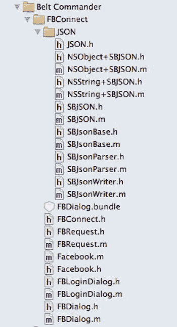

**图 9–13.** *Facebook iOS Xcode 项目中的重要类*

在图 9-13 中，我们看到了来自 Facebook iOS 项目的多个文件。以 `FB` 开头的类是 Facebook 专用的，而 `JSON` 组中的类是用于处理 JSON 字符串的通用类，并且是 Facebook 类的依赖项。文件 `FBConnect.h` 是主头文件，很可能就是你想要导入的文件。`Facebook` 类是与 Facebook 交互的主类。

通常，你会创建这个类的一个单例，并通过它来执行所有与 Facebook 相关的操作。

不过，在查看源代码之前，我们需要先登录我们的 Facebook 账号，并创建一个 Facebook 应用。

### 创建一个 Facebook 应用

可以将 Facebook 应用视为我们应用中的 Facebook 组件。Facebook 要求我们这样做，是为了确保代表用户执行的任何 Facebook 操作都有一个关联的身份。Facebook 也将该 Facebook 应用用作一个安全上下文。当用户同意让我们的应用进行发帖时，他们实际上是在授权我们新创建的 Facebook 应用能够进行发帖。

  
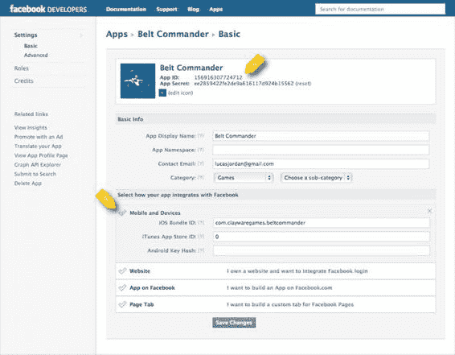

图 9-14 显示了我为示例游戏 *Belt Commander* 创建的 Facebook 应用。

**图 9–14.** *Facebook 应用*

在图 9-14 中，我们看到了一个 Facebook 应用的设置页面。在项目 A 处，你可以看到**应用 ID**。我们在代码中创建 `Facebook` 对象并进行身份验证时，会用到这个值。在项目 B 处，你会注意到 Facebook 要求你添加 **iOS 包标识符**。我不知道它用这个信息做什么。我在编写本章代码时，填错了这个值，但一切运行正常。你的情况可能会有所不同。创建 Facebook 应用并不难，但我不想在此处详细说明，因为这个过程似乎每隔几个月就会变化。基本上，你需要将你的 Facebook 账号注册为开发者，然后添加一个新应用。具体指南可以在 https://developers.facebook.com/apps 找到。

一旦你将源代码复制到你的项目中并创建好 Facebook 应用，就可以开始将 Facebook 集成到应用中去了。接下来，让我们先看一下如何验证用户身份。

### Facebook 身份验证

如果你在浏览器中使用 Facebook，显然是通过 Facebook 拥有的网页进行身份验证。通过这种方式，你可以信任密码信息直接发送给 Facebook，而不会被其他人截获。这在 Web 上非常有意义，因为你不想让其他网站处理你的用户凭据。老实说，作为应用开发者，我很高兴永远不必担心用户用于第三方服务的凭据。

然而，对于在浏览器之外开发应用来说，这种身份验证机制可能会有些麻烦，因为你需要弹出一个浏览器窗口来处理身份验证，然后将相应的身份验证信息传递回你的应用。这挺烦人的。为了让事情更简单，Facebook 为你实现了所有这些功能，并且实现方式能够为用户启用单点登录。这意味着，如果用户已经通过另一个使用 Facebook iOS SDK 的应用与 Facebook 进行了身份验证，他们就无需重新输入用户名和密码。不过，用户仍然需要授权给你的应用。

图 9-15 展示了 Facebook 请求用户授予权限的界面。

**图 9–15.** *Facebook 请求用户授权应用*

在图 9-15 中，我们看到了 Safari 中的一个 Facebook 页面，要求用户授权给名为 *Belt Commander* 的 Facebook 应用。这个页面是在 iOS 应用 *Belt Commander* 要求通过 Facebook 验证用户身份时弹出的。我们包含在项目中的 Facebook 代码，如果本地 Facebook 应用未安装，则会使用 Safari 来验证用户身份；否则，会使用本地应用。为了让 Facebook 能够使用本地 Facebook 应用或 Safari，我们的应用必须注册为能够打开一个包含我们 Facebook 应用 ID 的 URL。

**注意：** 如果应用未配置为能打开某个 URL，那么 Facebook 将退而使用应用内的 `UIWebView` 弹出窗口进行验证。我认为最佳的用户体验是通过确保你的应用能够打开正确的 URL，来争取使用本地应用或 Safari。

我们稍后会再讨论这一点。

### 初始化 Facebook

在进行身份验证之前，我们必须创建并初始化我们的 `Facebook` 对象，以便执行身份验证流程。让我们看看如何在应用中初始化 Facebook，如列表 9-7 所示。

**列表 9–7.** *RootViewController.m (initFacebook)*

```
-(void)initFacebook{

    facebook = [[Facebook alloc] initWithAppId:FB_APP_ID andDelegate:self];
    NSUserDefaults* defaults = [NSUserDefaults standardUserDefaults];

    facebook.accessToken = [defaults objectForKey:@"AccessToken"];
    facebook.expirationDate = [defaults objectForKey:@"ExpirationDate"];

}
```

在列表 9-7 中，我们看到了 `initFacebook` 任务，它在父级 `UIViewController` 加载时被调用一次。在这个任务中，我们通过传入一个包含应用 ID 的 `NSString` 并将 `self` 指定为委托，来创建一个新的 `Facebook` 对象。之后，我们从标准的用户默认设置中取出两个对象：一个**访问令牌**和一个**过期日期**。如果这些对象存在，它们来自之前的身份验证会话，可以防止用户在稍后调用验证方法时需要重新验证。

传递给 `initWithAppId:andDelegate:` 的委托对象必须遵循 `FBSessionDelegate` 协议，该协议定义了 `fbDidLogin`、`fbDidNotLogin` 和 `fbDidLogout` 这些任务。对于这个示例，我们只关心 `fbDidLogin`，如列表 9-8 所示。

**列表 9–8.** *RootViewController.m (fbDidLogin)*

```
- (void)fbDidLogin{

    NSUserDefaults* defaults = [NSUserDefaults standardUserDefaults];

    [defaults setObject:facebook.accessToken forKey:@"AccessToken"];
    [defaults setObject:facebook.expirationDate forKey:@"ExpirationDate"];
    [defaults synchronize];

}
```


# 在清单 9–8 中，我们看到由 `FBSessionDelegate` 定义、`RootViewController` 实现的任务 `fbDidLogin`。当用户成功通过身份验证时，会调用此任务。为了优化用户体验，我们将访问令牌和到期日期记录在标准用户默认设置中，以便在下次应用程序启动时能够检索它们，如清单 9–7 所示。

[www.it-ebooks.info](http://www.it-ebooks.info/)


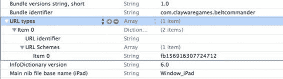

**234**

# 第 1 章：App Cubby

### 通过 Facebook 进行身份验证

一旦 `Facebook` 对象被创建并配置好，我们就可以进行身份验证了。在我们的示例应用程序中，我们将让用户点击欢迎屏幕上的 Facebook 按钮来进行身份验证。在其他应用程序中，也许在其它时间尝试进行身份验证更合理。只要你在使用 `Facebook` 对象执行任何其他操作之前进行身份验证，具体何时验证其实并不重要。清单 9–9 展示了身份验证代码。

**清单 9–9.** *RootViewController.m (facebookButtonClicked:)*

```
- (IBAction)facebookButtonClicked:(id)sender {

NSMutableArray* permissions = [NSMutableArray new];

[permissions addObject: @"publish_stream"];

[permissions addObject:@"publish_checkins"];

[permissions addObject:@"user_about_me"];

[facebook authorize:permissions];

}
```

在清单 9–9 中，我们看到了点击 Facebook 按钮时调用的代码。在此任务中，我们创建了一个 `NSMutableArray`，其中包含我们请求的每个 Facebook 权限的 `NSString` 实例。在本例中，我们希望能够发布到信息流、发布签到信息以及获取用户的一些基本信息。这些基本上是该应用程序的示例权限——我们真正需要的只是 `publish_stream`。权限数组被简单地传递给 `authorize`，后者随后会调出任何适当的授权机制，无论是原生 Facebook、Safari，还是弹出窗口中的 `UIWebView`。

如前所述，为了支持原生 Facebook 身份验证或 Safari 身份验证，应用程序必须配置为打开一个 URL，该 URL 将 Facebook 应用程序名称作为 URL 的协议部分。图 9–16 显示了此配置的第一步。

**图 9–16.** *设置 `URL types` 以响应具有给定协议的 URL*

在图 9–16 中，我们看到了 Xcode 中信息面板的一部分。我们添加了一个类型为数组的新行，名为 `URL types`。在该数组的第一项中，我们添加了一个字典，其中包含另一个名为 `URL Schemes` 的数组。`URL Schemes` 中的第一项值为 `fb[your_fb_app_id]`，如图所示，其应用 ID 对应 Facebook 应用程序 Belt Commander。配置应用程序以正确使用 Facebook 进行身份验证的下一步是让应用程序委托响应 `application:handleOpenURL:`，如清单 9–10 所示。

[www.it-ebooks.info](http://www.it-ebooks.info/)


**第 1 章：App Cubby**

**235**

**清单 9–10.** *AppDelegate.m (application:handleOpenURL:)*

```
-(BOOL)application:(UIApplication *)application handleOpenURL:(NSURL *)url{

UIWindow* window = [application.windows objectAtIndex:0];

RootViewController* rvc = (RootViewController*)[window rootViewController]; Facebook* facebook = [rvc facebook];

return [facebook handleOpenURL:url];

}
```

在清单 9–10 中，我们看到了由 `AppDelegate` 定义的任务 `application:handleOpenURL:`。当 Safari 或原生 Facebook 应用程序试图将控制权交还给我们的应用程序时，会调用此任务。通过在我们 `Facebook` 对象上调用 `handleOpenURL` 并传入 URL，我们完成了 Facebook 身份验证设置。当这被调用时，`fbDidLogin` 将被调用（来自清单 9–8），并且我们可以记录身份验证信息。更重要的是，我们现在可以代表我们的用户进行 Facebook API 调用。接下来我们来看看这个。

### Facebook API 调用

既然我们已经了解了如何设置 Facebook 进行身份验证，我们想进一步探讨如何使用 Facebook 进行 API 调用。这才是我们想要在应用程序中集成 Facebook 的真正原因。Facebook 提供了许多有用的任务来配合其社交图谱 API 执行操作。我们不打算涵盖此 API 的所有细节。Facebook 的优秀文档可以在以下位置找到：

[`developers.facebook.com/docs/reference/api/`](http://developers.facebook.com/docs/reference/api/).

在我们的示例应用程序中，我们将在每次游戏结束时发布一条消息，报告我们的得分。实现此功能的代码如清单 9–11 所示。

**清单 9–11.** *RootViewController.m (notifyFacebook)*

```
-(void)notifyFacebook{

if ([facebook isSessionValid]){

NSString* desc = [[@"I just scored " stringByAppendingFormat:@"%i",

[beltCommanderController score]] stringByAppendingString:@" points, on Belt Commander"]; NSString* appLink = @"http://itunes.apple.com/us/app/beltcommander/id460769032?ls=1&mt=8";

NSMutableDictionary* params = [NSMutableDictionary dictionaryWithObjectsAndKeys: FB_APP_ID, @"app_id",

appLink, @"link",

@"Presented by ClayWare Games, LLC", @"caption", desc, @"description",

@"A new high score!", @"message",

nil];

[facebook requestWithGraphPath:@"me/feed" andParams:params andHttpMethod:@"POST"

andDelegate:self];

}

}
```

[www.it-ebooks.info](http://www.it-ebooks.info/)


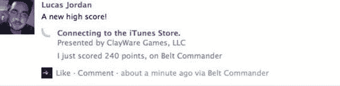

**236**

**第 1 章：App Cubby**

在清单 9–11 中，我们看到了由 `RootViewController` 定义的任务 `notifyFacebook`。此任务在每场游戏结束时被调用。我们做的第一件事是检查用户是否已经通过 Facebook 进行了身份验证。如果她已认证，那么我们将消息的所有部分组装到一个 `NSMutableDictionary` 中。将包含的唯一项是键为 `app_id` 的 Facebook 应用程序 ID。请注意，我们还包含了一个指向我们应用程序 iTunes Store 页面的链接；这有望从我们用户的 Facebook 好友那里带来更多的下载量。

一旦消息的所有部分都组装完毕，我们只需调用 `requestWithGraphPath:andParams:andHttpMethod:andDelegate:`。通过指定 POST，我们表明我们希望将此内容发布到用户的信息流（`me/feed`），而无需用户交互。通过将委托设置为 `self`，如果此操作成功（或失败），我们将收到通知。在这个简单的示例中，我们实际上并不关心它是否成功。如果一切顺利，用户将看到类似图 9–17 的内容。

**图 9–17.** *在 Facebook 上成功发布*

在图 9–17 中，我们看到发布到我 Facebook 页面的帖子成功了。如我之前所说，你可以用 Facebook 做更多事情，我鼓励读者深入研究一下。

正如我们所见，Facebook API 不像内置的 Twitter 支持那样易于使用。但我仍然认为，一旦你第一次完成整个过程，它就相当简单了。看看 Facebook 是否会像 Twitter 那样获得苹果 iOS 开发人员的同等待遇，这将会很有趣。

## 摘要

在本章中，我们探讨了 Game Center，并介绍了它为用户提供的服务。我们通过 `GameKit` 探讨了这些功能，了解了如何将用户的分数发布到排行榜以及颁发成就。延续社交趋势，我们研究了 iOS 5 中对 Twitter 的内置支持。最后，我们探讨了如何将 Facebook 集成到 iOS 应用程序中。我们涵盖了如何处理身份验证，以及如何向用户的信息流发布简单的消息。

[www.it-ebooks.info](http://www.it-ebooks.info/)

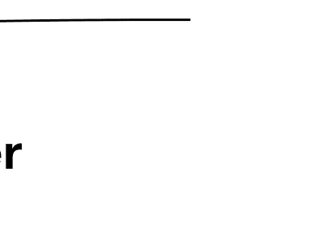

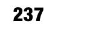

### 第 10 章

## 通过 Apple App Store 实现货币化

在 Apple App Store 中通过应用程序赚钱主要有三种方式。最明显的方式就是直接为应用程序收费。第二种是免费提供应用程序，但包含广告。另一种适用于免费和付费应用程序的方式，是在应用程序内销售物品。这被称为应用内购买，在某些类型的游戏中非常流行。


# 第 10 章：通过 Apple App Store 实现盈利

本章将不会探讨如何打造优质的应用内购买项目，也不讨论你的应用应该免费还是收费。本章将介绍设置应用内购买的基本知识，并解释可用的不同类型购买项目。

## 应用内购买

应用内购买是指应用内可供付费获取的虚拟物品或服务。许多不同类型的应用——不仅仅是游戏——都利用应用内购买来盈利。一些非游戏例子包括下载文章或漫画、烹饪食谱以及详细的地图数据。一些游戏内的例子包括额外关卡、新能力、额外游戏币以及用于定制游戏外观的新奇物品。

我们将继续使用《Belt Commander》游戏中的示例代码。在图 10-1 中，你可以看到《Belt Commander》的应用内购买选项。

在图 10-1 中，我们看到一张来自《Belt Commander》游戏的截图。这里有三个按钮，每个按钮指定了游戏运行时应该出现哪种类型的角色。游戏默认带有小行星；右侧的两个按钮用于购买游戏中额外的角色类型。中间的按钮是飞碟，它已被购买但不会包含在下一局游戏中（未激活）。最右边的按钮表示用户可以选择购买在游戏中加入增强道具角色的能力。用户通过点击该按钮并完成购买对话框流程来发起购买。

L. Jordan, *Beginning iOS 5 Games Development* © Lucas Jordan 2011 [www.it-ebooks.info](http://www.it-ebooks.info/)

**图 10-1.** *《Belt Commander》中的应用内购买*

在实现这些功能之前，我们将先了解可用的不同类型的应用内购买，以及如何在我们应用中启用应用内购买。

## 购买类型概述

共有四种不同类型的应用内购买，每种都支持不同的业务需求。如果这四种应用内购买类型不适合你的业务需求，你将不得不自行开发。编写自己的应用内购买服务可能会非常耗时。我建议看看能否调整你的业务需求以适应苹果的模型。这样做的好处不仅在于缩短开发时间，而且对用户也有利。当你使用苹果系统时，你的用户将看到一个熟悉的界面，并使用一组熟悉的凭据登录：他们的 Apple ID。四种应用内购买类型如下：

- 非消耗型
- 消耗型
- 订阅
- 自动续期订阅

让我们仔细看看这四种应用内购买类型中的每一种。

### 非消耗型

非消耗型应用内购买是指一次性购买、并授予对某个物品或服务的持久访问权限的项目。非消耗型物品可被用户重新下载，并且应可在用户的所有设备上使用。非消耗型购买可以包括额外的游戏关卡、新型敌人或用于定制用户游戏角色的搞笑帽子。

### 消耗型

消耗型应用内购买旨在支持会被消耗的物品或服务。在游戏中，这可能包括额外的生命值、用于购买游戏内物品的点数或其他可被用完的东西。消耗型购买被设计为可重复进行。

消耗型购买无法再次下载，因此其性质决定了它们无法在用户的设备间通用，除非你实现自己的服务器来跨账户共享此信息。

### 订阅

订阅是有时间限制的购买。在给定时间后，用户将不再能访问该购买项目。这些类型的购买可能包括对文章、位置信息或其他一些有价值数据集的访问权限。订阅购买无法重新下载，如果在设备恢复后（备份失败时）或用户在另一台拥有的 iOS 设备上，必须重新购买才能获得相同的服务。

### 自动续期订阅

自动续期订阅是对在特定期限内可使用的物品或服务的购买，与常规订阅非常相似。区别在于自动续期订阅是可重新下载的。它们代表对一项与用户（而非设备）关联的服务的访问权限。用户可以在他们拥有的任何 iOS 设备上访问此购买项目。

现在，让我们看看让应用准备支持应用内购买需要什么条件。

## 准备应用内购买

与 Game Center 非常相似，必须在 iTunes Connect 中启用应用内购买功能的应用才能包含内购项目。要求完全相同：你必须使用不带通配符的 App ID。在第 9 章中，我们介绍了在配置中心创建可与 Game Center 配合使用的 App ID 的流程。你可以按照说明创建第二个 App ID，或者直接为同一个游戏添加应用内购买功能。

## 启用与创建应用内购买

一旦你在 iTunes Connect 中拥有一个应用，启用应用内购买可通过点击“管理应用内购买”按钮来完成，如图 10-2 所示。

**图 10-2.** *在 iTunes Connect 中启用应用内购买*

在图 10-2 中，我们看到 iTunes Connect 中用于配置应用的视图。项目 A 显示了用于启用应用内购买的按钮。点击此按钮后，你将能够向应用添加可供用户购买的项目。图 10-3 展示了我为《Belt Commander》准备的项目。

**图 10-3.** *《Belt Commander》可用的应用内购买*

在图 10-3 中，我们看到了 iTunes Connect 中列出应用内购买项目的界面。我们可以看到我们添加了两个项目：分别对应玩家可以添加到游戏中的每种额外角色类型。对于每个应用内购买项目，我们都能看到参考名称、产品 ID、产品类型以及产品状态。参考名称用于内部管理——用户不会看到它。产品 ID 是一个在所有 iOS 应用中唯一的名称，用于标识该购买项目。产品 ID 将是在代码中引用此购买项目的方式。

类型指的是我们之前讨论过的不同购买类型——在这个例子中是非消耗型。状态值指示了该应用内购买项目需要满足什么条件才能被苹果接受。苹果必须审核你创建的每个应用内购买项目，就像每个应用在销售前都必须经过审核一样。在此例中，我们被告知苹果正在等待该购买项目的截图，之后才会进行审核。这些截图不会展示给用户——它们只是向苹果提供关于该应用内购买项目的背景信息。在图 10-4 中，我们看到了 iTunes Connect 中用于创建新应用内购买项目的界面。

**图 10-4.** *一个新的应用内购买项目*

图 10-4 中的项目 A 处是我们输入应用内购买项目参考名称的地方。项目 B 处显示了该应用内购买项目的产品 ID。为了创建应用内购买项目，你必须通过点击“添加语言”按钮（项目 C）为该应用内购买项目提供本地化字符串。


# 通过 Apple App Store 实现盈利

## 定价与上架

在图 10-4 的*定价与上架*部分，你必须将项目 D 处的商品设置为“已上架销售”，才能测试购买。同时，你还必须在项目 E 处指定一个*价格等级*。这些价格等级与应用程序的价格等级相同，只是没有免费等级。

一旦你为应用程序定义了应用内购买项目，就必须配置一个测试用户，以便测试购买过程。强烈建议你在提交应用之前先对应用内购买功能进行测试。

## 创建测试用户

定义好应用内购买项目后，你需要创建一个测试用户，让其在应用中“购买”这些商品。这样你就有机会按照真实用户将会经历的工作流程，测试启用或禁用每项已购买功能。图 10-5 展示了在 `iTunes Connect` 中开始添加测试用户的入口位置。

[www.it-ebooks.info](http://www.it-ebooks.info/)


在图 10-5 中，我们可以看到从*选择用户类型*视图中创建*测试用户*的选项。在 `iTunes Connect` 中，通过点击主屏幕上的*管理用户*按钮即可进入该视图。

**注意：** 我之所以强调务必使用测试用户来调试应用内购买，是因为如果使用真实用户进行调试，会让你的努力事倍功半。

点击图 10-5 中所示的*测试用户*按钮后，系统会提示你创建一个新用户。这没有什么特别之处——只需注意，不要使用当前作为 `Apple ID` 的电子邮件地址即可。

我们已经了解了如何在 `iTunes Connect` 中为应用添加应用内购买项目，以及如何确保拥有测试用户来调试应用。接下来，我们将探讨应用内购买是如何集成到 `Belt Commander` 中的，从而了解所涉及的类以及如何使用它们。

## 应用内购买的类与代码

在 `iTunes Connect` 中创建应用内购买项目只是让应用真正支持应用内购买的第一步。下一步是了解应用内购买的实际购买流程以及涉及哪些类。包含相关类的框架名为 `StoreKit`，它作为 `iOS SDK` 安装包的一部分提供。我们将使用这些类来实现图 10-6 所示的工作流程，该图展示了确定哪些产品可用以及如何处理购买请求的过程。

[www.it-ebooks.info](http://www.it-ebooks.info/)


从图 10-6 的左上角开始，我们首先获取一组想要呈现给用户的*产品标识符*。这个列表可能来自外部 Web 服务，也可能只是应用中硬编码的一组字符串。如何获取这个列表取决于你如何管理应用中的销售商品。如果你经常添加新产品，你可能希望从 Web 服务拉取产品列表。如果你刚开始接触应用内购买，使用固定列表可能适合你，但你需要更新应用才能修改列表。

获取可能的*产品标识符*列表后，向 `iTunes Store` 发送请求，询问我们传递的哪些标识符是有效的并且可以销售。`iTunes Store` 返回的标识符代表我们想要提供给用户的商品。`iTunes Store` 不会返回未知或尚不可用于销售的*产品标识符*。这确保了我们只呈现经过 Apple 审核流程的有效商品。除了告知我们标识符是否有效外，`iTunes Store` 还会返回本地化的

[www.it-ebooks.info](http://www.it-ebooks.info/)


# 第 10 章：通过苹果应用商店实现盈利

**245**

与购买关联的字符串，以便我们向用户展示与 iTunes Connect 中输入的完全匹配的本地化文本。

继续图 10-6 所示的工作流程，用户会在某个时刻点击按钮购买项目。当此操作发生时，我们只需创建一个支付请求并提交，随后用户将看到一系列确认购买的对话框。如果一切顺利，我们将收到一个回调，告知购买成功。此时，我们需要记录购买已完成。我们可以通过将产品 ID 存入标准的`NSUserDefaults`来实现，或者采用更复杂的方式（如保存到网络服务）。用户为确认购买而需要依次操作的对话框如图 10-7 所示。

**图 10-7.** *进行购买*

图中左上角的对话框将始终显示，右下角的对话框也是如此。如果用户需要使用其 Apple ID 登录，则会在第一个和最后一个对话框之间显示另外两个对话框。作为开发者，务必记住我们无法控制具体显示哪些对话框，也无法控制用户完成流程所需的时间。切记不要期望用户在游戏进程进行中完成此流程。

现在让我们来看一个具体示例：为我们的游戏《腰带指挥官》实现非消耗性应用内购买。我们将实现图 10-1 中的视图，用户可以在其中选择游戏中涉及的角色，并购买新的可用角色。

[www.it-ebooks.info](http://www.it-ebooks.info/)


**246**

## 应用内购买实现

正如我们讨论过的，进行购买的过程实际上只是向 iTunes 商店发起两次调用。在本节中，我们将看到这确实只涉及少数几个类。在我们的示例中，大部分处理 StoreKit 和 UI 的细节都将在一个名为`ExtrasController`的类中完成，其头文件如代码清单 10-1 所示。

**代码清单 10-1.** *ExtrasController.h*

```objectivec
@interface ExtrasController : UIViewController<SKPaymentTransactionObserver, SKProductsRequestDelegate>{
    GameParameters* gameParams;
}

@property (strong, nonatomic) IBOutlet UIButton *asteroidButton;
@property (strong, nonatomic) IBOutlet UIButton *saucerButton;
@property (strong, nonatomic) IBOutlet UIButton *powerupButton;

-(void)setGameParams:(GameParameters*)params;

@end
```

在代码清单 10-1 中，我们看到了`ExtrasController`类的头文件。`ExtrasController`类扮演两个角色：它管理购买流程，并相应地更新三个按钮。`gameParams`对象负责存储哪些角色已在游戏中启用以及哪些购买已完成。为了与 StoreKit 交互，`ExtrasController`遵循`SKPaymentTransactionObserver`和`SKProductsRequestDelegate`协议。这些协议提供了应用响应商店交互所需的一切。我们将在代码实现过程中看到`ExtrasController`如何实现这两个协议中的任务。

使用 StoreKit 的第一步是设置一个响应购买状态变化的对象。我们通过向默认的`SKPaymentQueue`添加观察者来创建这样一个对象，如代码清单 10-2 所示。

**代码清单 10-2.** *ExtrasController.m (viewDidLoad)*

```objectivec
#define PURCHASE_INGAME_SAUCERS @"com.beltcommander.ingame.saucers"
#define PURCHASE_INGAME_POWERUPS @"com.beltcommander.ingame.powerups"

//….

- (void)viewDidLoad
{
    [super viewDidLoad];

    [[SKPaymentQueue defaultQueue] addTransactionObserver:self];

    //获取产品 ID 集合
    NSSet* potentialProcucts = [NSSet setWithObjects:PURCHASE_INGAME_POWERUPS, PURCHASE_INGAME_SAUCERS, nil];
```


```objc
SKProductsRequest* request = [[SKProductsRequest alloc]
    initWithProductIdentifiers:potentialProcucts];
[request setDelegate:self];
[request start];
[self setGameParams: [GameParameters readFromDefaults]];
}
```

[www.it-ebooks.info](http://www.it-ebooks.info/)


## 第 10 章：通过苹果 App Store 盈利

**247**

在`Listing 10–2`中，我们看到了类`ExtrasController`的任务`viewDidLoad`。在该任务中，我们首先通过调用`defaultQueue`获取默认的`SKPaymentQueue`，并将`self`添加为观察者。由于`self`遵循`SKPaymentTransactionObserver`协议，我们的`ExtrasController`将获知所有购买状态的变化。一旦注册了观察者，我们便创建一个已知产品 ID 的集合。在本例中，`NSSet`类型的`potentialProducts`由两个常量`PURCHASE_INGAME_POWERUPS`和`PURCHASE_INGAME_SAUCERS`创建。如我们所见，这些常量与我们在`iTunes Connect`中创建产品时指定的字符串相同。

指定了潜在产品集合后，我们创建一个`SKProductsRequest`，将`self`设为代理，并调用其`start`方法。当`StoreKit`正在确定哪些产品 ID 有效时，我们调用`setGameParams`并指定应使用存储在默认`NSUserDefaults`中的`GameParameters`对象。当`StoreKit`获取结果后，将调用`Listing 10–3`中所示的任务`productsRequest:didReceiveResponse:`。

**Listing 10–3.** *ExtrasController.m (productsRequest:didRecieveResponse:)*

```objc
- (void)productsRequest:(SKProductsRequest *)request
    didReceiveResponse:(SKProductsResponse *)response {
    for (SKProduct* aProduct in response.products){
        if ([aProduct.productIdentifier isEqualToString:PURCHASE_INGAME_SAUCERS]){
            [saucerButton setEnabled:YES];
            [saucerButton setHidden:NO];
        }
        if ([aProduct.productIdentifier isEqualToString:PURCHASE_INGAME_POWERUPS]){
            [powerupButton setEnabled:YES];
            [powerupButton setHidden:NO];
        }
    }
}
```

在`Listing 10–3`中，我们看到了当获取到有效的产品 ID 集合时会调用的任务`productsRequest:didReceiveResponse:`。在此任务中，我们简单地遍历所有返回的产品，并使购买飞碟和道具的按钮可见。通过这种方式，我们确保用户只看到可行的购买选项。

我们已经了解了如何确定哪些购买是有效的。在查看实际如何进行购买之前，我们先看看`GameParameters`类。`GameParameters`类负责存储哪些产品已被购买以及用户希望在游戏中启用哪些角色。

## 从已有购买中驱动 UI

图 10-1 所示的三个按钮允许用户在游戏中选择可用的角色。相同的 UI 还允许用户购买新角色。为了跟踪这些信息，我们创建了模型类`GameParameters`，其头文件如`Listing 10–4`所示。

[www.it-ebooks.info](http://www.it-ebooks.info/)


**248**

## 第 10 章：通过苹果 App Store 盈利

**Listing 10–4.** *GameParameters.h*

```objc
@interface GameParameters : NSObject<NSCoding>

@property (nonatomic) BOOL includeAsteroids;
@property (nonatomic) BOOL includeSaucers;
@property (nonatomic) BOOL includePowerups;
@property (nonatomic, retain) NSMutableSet* purchases;

+(id)gameParameters;
+(id)readFromDefaults;
-(void)writeToDefaults;

@end
```

在`Listing 10–4`中，我们看到了`GameParameters`类的头文件。我们有三个`BOOL`属性来跟踪用户在游戏中希望包含哪些角色。我们还有一个`NSMutableSet`类型的`purchases`，用于存储产品 ID 字符串的集合。构造函数`gameParameters`将创建一个新的`GameParameters`对象，不包含任何购买，并且仅将`includeAsteroids`设置为`YES`（实现未显示）。类方法`readFromDefaults`用于从默认的`NSUserDefaults`中提取`GameParameters`对象，而`writeToDefaults`则用于将`GameParameters`序列化回默认的`NSUserDefaults`。`Listing 10–5`同时展示了`readFromDefaults`和`writeToDefaults`方法。


### 排版后的内容

**清单 10–5.** *GameParameters.m (readFromDefaults 和 writeToDefaults)*

```
+(id)readFromDefaults{
    NSUserDefaults* defaults = [NSUserDefaults standardUserDefaults];
    NSData* data = [defaults objectForKey:GAME_PARAM_KEY];
    if (data == nil){
        GameParameters* params = [GameParameters gameParameters];
        [params writeToDefaults];
        return params;
    } else{
        return [NSKeyedUnarchiver unarchiveObjectWithData: data];
    }
}

-(void)writeToDefaults{
    NSData* data = [NSKeyedArchiver archivedDataWithRootObject:self];
    NSUserDefaults* defaults = [NSUserDefaults standardUserDefaults];
    [defaults setObject:data forKey:GAME_PARAM_KEY];
    [defaults synchronize];
}
```

在`Listing 10–5`中，我们看到任务`readFromDefaults`和`writeToDefaults`。这两个任务是互逆的：`readFromDefaults`将为存储在用户默认设置中的键`GAME_PARAM_KEY`返回一个`GameParameter`。任务`writeToDefaults`为键`GAME_PARAM_KEY`将一个`GameParameter`写入用户默认设置。这两个任务的关键在于，我们通过记录属性`purchases`中的键，在用户默认设置中存储一个`GameParameter`，以记住用户的购买记录。类`GameParameters`可以存储在`NSUserDefaults`中，因为它实现了来自协议`NSCoder`的任务。有关该过程的描述，请参见第 2 章。

让我们来看看如何使用这个类来驱动用户界面，并设置图 10–1 中三个不同按钮的状态。这在任务`setGameParameters:`中处理，如`Listing 10–6`所示。

[www.it-ebooks.info](http://www.it-ebooks.info/)


**第 10 章：通过苹果应用商店盈利**

**249**

**清单 10–6.** *GameParameters.m (setGameParameters:)*

```
-(void)setGameParams:(GameParameters*)params{
    gameParams = params;
    NSSet* purchases = [gameParams purchases];
    if ([params includeAsteroids]){
        [asteroidButton setImage:[UIImage imageNamed:@"asteroid_active"]
                        forState:UIControlStateNormal];
    } else {
        [asteroidButton setImage:[UIImage imageNamed:@"asteroid_inactive"]
                        forState:UIControlStateNormal];
    }
    if ([purchases containsObject:PURCHASE_INGAME_SAUCERS]){
        if ([params includeSaucers]){
            [saucerButton setImage:[UIImage imageNamed:@"saucer_active"]
                          forState:UIControlStateNormal];
        } else {
            [saucerButton setImage:[UIImage imageNamed:@"saucer_inactive"]
                          forState:UIControlStateNormal];
        }
    } else {
        [saucerButton setImage:[UIImage imageNamed:@"saucer_purchase"]
                      forState:UIControlStateNormal];
    }
    if ([purchases containsObject:PURCHASE_INGAME_POWERUPS]){
        if ([params includePowerups]){
            [powerupButton setImage:[UIImage imageNamed:@"powerup_active"]
                           forState:UIControlStateNormal];
        } else {
            [powerupButton setImage:[UIImage imageNamed:@"powerup_inactive"]
                           forState:UIControlStateNormal];
        }
    } else {
        [powerupButton setImage:[UIImage imageNamed:@"powerup_purchase"]
                       forState:UIControlStateNormal];
    }
}
```

在`Listing 10–6`中，我们看到任务`setGameParameters`。该任务负责使 UI 反映传入的`GameParameters`对象（名为`param`）的状态。对于`asteroidButton`，我们简单地根据属性`includeAsteroids`的值指示应显示哪个图像。对于`saucerButton`，我们执行类似的测试，但仅当飞船的产品 ID 包含在`NSSet`对象`purchases`中时才进行。如果该 ID 不存在，我们将按钮上的图像设置为显示购买版本。我们对`UIButton`对象`powerButton`进行类似的处理，将其背景设置为激活、未激活或购买状态。

[www.it-ebooks.info](http://www.it-ebooks.info/)


**250**

**第 10 章：通过苹果应用商店盈利**

### 进行购买

既然我们已经了解了按钮状态是如何管理的，接下来看看点击其中一个购买按钮如何触发购买。`Listing 10–7`显示了当用户按下飞船按钮时运行的代码。

**清单 10–7.** *ExtrasController.m (saucerButtonClicked:)*

```
- (IBAction)saucerButtonClicked:(id)sender {
    if ([gameParams.purchases containsObject:PURCHASE_INGAME_SAUCERS]){
        [gameParams setIncludeSaucers:![gameParams includeSaucers]];
```


`[self setGameParams:gameParams];`

`[gameParams writeToDefaults];`

} else {

`SKPayment* payRequest = [SKPayment paymentWithProductIdentifier:PURCHASE_INGAME_SAUCERS];`

`[[SKPaymentQueue defaultQueue] addPayment:payRequest];`

}

}

在列表 10-7 中，我们看到当用户点击飞碟按钮时调用的任务`saucerButtonClicked`。如果我们已经购买了飞碟功能，我们知道用户只是想切换是否包含飞碟。我们通过翻转`includeSaucers`的值、调用`setGameParams`更新 UI 以及将更改写入磁盘来响应。如果用户尚未购买飞碟功能，我们知道她想要进行购买。为了启动此过程，我们只需使用相应的产品 ID 创建一个`SKPayment`对象，并将该`SKPayment`对象添加到默认的`SKPaymentQueue`。

这会触发对话框流程，如图 10-7 所示。管理能量增强的代码与列表 10-7 中的代码几乎相同，不值得深入研究。

接下来，让我们看看如何响应成功购买。

## 响应成功购买

为了响应成功购买，我们必须在列表 10-2 中向默认的`SKPaymentQueue`添加一个`SKPaymentTransactionObserver`实例。现在我们准备查看当`SKPaymentQueue`成功处理购买时调用的代码，如列表 10-8 所示。

**列表 10-8.** *ExtrasController.m (paymentQueue: updatedTransactions:)*

```
- (void)paymentQueue:(SKPaymentQueue *)queue updatedTransactions:(NSArray *)transactions{
    for (SKPaymentTransaction* transaction in transactions){
        if (transaction.transactionState == SKPaymentTransactionStatePurchased ||
            transaction.transactionState == SKPaymentTransactionStateRestored){
            NSString* productIdentifier = transaction.payment.productIdentifier;
            [[gameParams purchases] addObject: productIdentifier];
            [gameParams writeToDefaults];
            [self setGameParams:gameParams];
            [queue finishTransaction:transaction];
        }
    }
}
```

在列表 10-8 中，我们看到由`ExtrasController`类实现的任务`paymentQueue:updatedTransactions:`。在此任务中，我们遍历数组`transactions`中的每个`SKPaymentTransaction`。对于每个`SKPaymentTransaction`，我们检查其状态是否为`SKPaymentTransactionStatePurchased`或`SKPaymentTransactionStateRestored`。如果是，我们将交易的产品 ID 添加到`gameParams`的`purchases`属性中并保存。我们还通过调用`setGameParams:`更新 UI。最后，我们通过调用`finishTransaction:`通知队列我们已经完成该交易的处理。

从技术上讲，如果任务`paymentQueue:updatedTransactions:`是由于用户进行新购买而被调用，则交易的状态将是`SKPaymentTransactionStatePurchased`。但由于我们使用的产品类型是非消耗品，我们需要确保用户在其设备重置或他在其他 iOS 设备上进行了购买时能够恢复其购买。为了处理这个问题，我们确保允许交易状态为`SKPaymentTransactionStateRestored`，并像对待新购买一样对待它。为了允许用户恢复，我们提供了一个恢复购买按钮，该按钮会调用列表 10-9 中的代码。

**列表 10-9.** *ExtrasController.m (restorePurchasesClicked:)*

```
- (IBAction)restorePurchasesClicked:(id)sender {
    [[SKPaymentQueue defaultQueue] restoreCompletedTransactions];
}
```

在列表 10-9 中，我们看到当用户点击恢复购买按钮时调用的任务`restorePurchasesClicked`。在此任务中，我们只需在默认的`SKPaymentQueue`上调用`restoreCompletedTransactions`。这会使 StoreKit 联系 iTunes Store，并为当前应用和用户重新下载所有产品 ID。

完成后，它会调用`paymentQueue:updatedTransaction:`，如列表 10-8 所示。这就是允许用户访问其购买所需的所有操作。

## 总结

在本章中，我们回顾了应用内购买的概念及其四种不同类型。我们还研究了如何在我们的游戏《Belt Commander》中实现应用内产品的购买。我们回顾了如何从 iTunes Store 获取有效的产品 ID 列表，以及如何基于该列表创建 UI。我们还研究了如何触发购买过程，以及如何响应成功完成，同时牢记如何为用户存储购买记录。

---

### 第 11 章

# 完成的视图：Belt Commander

在本书中，我们介绍了构建 iOS 游戏的多种技术。

我们在第 3 章中学习了如何构建游戏的基本应用流程。在第 4 章中学习构建简单的回合制游戏时，我们研究了《Coin Sorter》。接着，我们在第 5 章中进入了逐帧游戏，学习了如何构建不断运动的游戏。在第 6 章和第 7 章中，我们探讨了如何创建不同类型的角色来填充我们的游戏。第 8 章涵盖了如何捕捉用户输入以操控游戏元素，而第 9 章则介绍了如何通过 Game Center 和其他社交服务与玩家互动。在第 10 章中，我们讨论了如何添加应用内购买以通过游戏盈利。

在本章中，我们将把所有这些元素整合起来，创建一个完整的游戏《Belt Commander》。标题图形如图 11-1 所示。

**图 11-1.** *Belt Commander 的标题图形*

在本章中，我们将从高层视角审视《Belt Commander》游戏。我们还将逐步讲解游戏是如何组合起来的，包括视图的组织方式以及应用游戏逻辑的实现方式。我们将讨论游戏中的不同角色及其添加方式。从某些方面来说，本章是对前几章所学技术的回顾。然而，探索这些技术如何融合在一起，将为你提供构建自己游戏的路线图。事实上，你可以随意使用本章的示例代码来开始自己的游戏。我本人也打算这样做，并在 iTunes Store 中发布《Belt Commander》的商业版本。那么，让我们开始吧。

*L. Jordan, 《Beginning iOS 5 Games Development》* © Lucas Jordan 2011

---

## Belt Commander：游戏回顾

《Belt Commander》是一款动作游戏，在游戏中你控制一艘穿越小行星带的飞船。摧毁小行星和外星飞碟可以为玩家赢得积分。在游戏过程中，偶尔会有一个能量增强道具飘到屏幕上，让玩家有机会恢复一些损伤、赚取额外积分或升级武器。这是一款节奏相对较快、交互简单的游戏。让我们看一下游戏的开始画面，如图 11-2 所示。

**图 11-2.** *Belt Commander 的开始画面*

在图 11-2 中，我们看到了游戏的第一屏。屏幕顶部有一个标题以及多个按钮。Facebook、Tweet 和 Leaderboards 按钮启用了我们在第 9 章中讨论的各种社交功能。Extras 按钮允许用户配置游戏并购买游戏的新部分。购买的处理方式在第 10 章中已有描述。对于本章，我们将假设所有额外内容都已购买。Play 按钮将带用户进入游戏的动作部分，如图 11-3 所示。


好的，作为一名高级文档工程师和翻译员，我将严格遵循您提供的注意事项和示例，将给定的英文文本翻译成中文。


### 图 11–3. *运行中的 Belt Commander*

在图 11–3 中，我们看到游戏的动作部分。左侧是由用户控制的宇宙飞船。用户可以点击屏幕，飞船将向上或向下移动到点击位置。这样用户就可以躲避许多从屏幕右侧移动到左侧的小行星。除了小行星之外，还有外星飞碟在屏幕上上下移动，向用户的飞船发射子弹。

小行星和飞碟的子弹击中飞船时都会对其造成伤害。游戏会一直进行，直到飞船受到的伤害超过其承受能力。为了帮助玩家，道具会出现在屏幕右侧并移动到左侧。如果用户能拦截到一个道具，他将获得其提供的任何奖励：生命值、更多伤害或额外积分。

在图 11–3 的右下角，我们看到一个暂停按钮 (II)。这将暂停游戏并允许用户退出或继续游戏，如图 11–4 所示。

[www.it-ebooks.info](http://www.it-ebooks.info/)


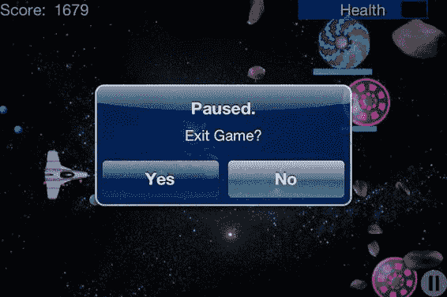

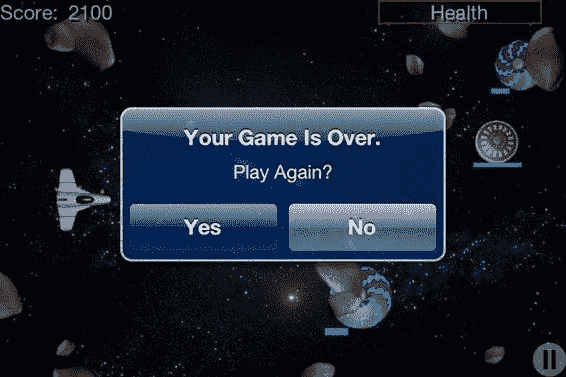

**第 11 章：一个完成的视图：Belt Commander**

### 图 11–4. *暂停中的 Belt Commander*

在图 11–4 中，我们看到用户点击屏幕右下角的触摸按钮时弹出的对话框。该对话框允许用户通过点击“是”退出游戏，或通过点击“否”继续游戏。如果用户正在玩游戏而应用程序被另一个启动的应用程序发送到后台，那么当用户将游戏带回前台时，将显示此对话框。当用户生命值归零时，游戏结束。将显示图 11–5 所示的对话框。

### 图 11–5. *游戏结束*

[www.it-ebooks.info](http://www.it-ebooks.info/)


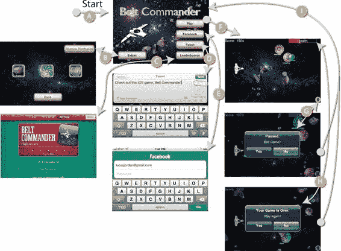

**第 11 章：一个完成的视图：Belt Commander**

在图 11–4 中，我们看到游戏结束时呈现的对话框。该对话框允许用户通过点击“是”立即重返战斗。如果用户点击“否”，她将被送回游戏的开始界面。整个应用程序流程如图 11–6 所示。

### 图 11–6. *应用程序流程*

在图 11–6 中，我们看到了游戏的八个界面。箭头指示了用户如何从一个视图导航到另一个视图。每个转换都用字母标记，如下所述：

应用程序从 A 处开始，即开始视图。这是用户首先看到的内容。

通过按“附加内容”按钮，用户被带到附加内容视图，在那里他们可以选择游戏中有哪些角色：小行星、飞碟和道具。他们通过点击“返回”按钮返回到开始视图。

点击“排行榜”按钮会调出标准的排行榜视图。点击右上角的“完成”将用户返回到开始视图。

“推文”按钮会调出 Twitter 对话框。虽然严格来说不是一个单独的视图，因为 Twitter 对话框是一个弹出窗口，但它仍然占据了屏幕的大部分。点击“发送”或“取消”按钮将用户返回到开始视图。

[www.it-ebooks.info](http://www.it-ebooks.info/)


**第 11 章：一个完成的视图：Belt Commander**

点击 Facebook 按钮将退出应用并调出 Facebook 身份验证界面。当用户输入其凭据后，他会被带回开始视图。

点击“开始”按钮将开始游戏。在动作视图中，用户玩游戏。他们上下移动飞船，试图通过摧毁小行星和飞碟来获得尽可能多的分数。

在游戏过程中，用户可以点击暂停按钮来停止游戏。当按下暂停按钮时，会弹出一个对话框，询问用户是否要退出游戏。如果在游戏进行中应用程序被发送到后台，也会弹出此对话框。

当飞船生命值降至零时，游戏结束。发生这种情况时，会显示一个对话框，询问用户是否想再玩一次。

如果用户已暂停游戏并选择不结束它，她将被带回开始视图。同样，当游戏结束时，如果用户选择不再玩，她会被带回主视图。

我们已经了解了构成游戏的视图，并对游戏如何在视图之间流转有了概念。接下来，让我们看看这种导航是如何实现的，从构成游戏的 XIB 文件开始。

## 实现视图到视图的导航

我们已经介绍了 Belt Commander 中涉及的视图。让我们更仔细地看看游戏是如何初始化的，构成游戏的 XIB 文件，以及我们如何以编程方式处理导航。这些信息将有助于您构建自己的游戏，因为这里运用了许多不同的技术。让我们从查看如何启动应用程序开始。

### 启动应用程序

与所有 iOS 应用程序一样，起点是 `main.m` 文件中的 `main` 函数。

然而，在这个应用程序中，我们根本没有自定义它，所以我们可以跳过描述它。

这个应用程序真正的起点是 plist 文件 `Belt Commander-Info.plist`。

图 11–7 显示了 Xcode 对这个文件的表示。

[www.it-ebooks.info](http://www.it-ebooks.info/)


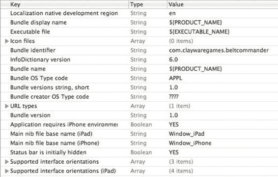

**第 11 章：一个完成的视图：Belt Commander**

### 图 11–7. *Xcode 中的 Belt Commander-Info.plist*

在图 11–7 中，我们看到了 Xcode 呈现的 `Belt Commander-Info.plist` 文件。在这个文件中，我们看到一个非常标准的 iOS 应用程序设置。我们看到 Bundle 标识符是 `com.claywaregames.beltcommander`，这对应于我们在 iTunes Connect 中创建的、支持应用内购买和 Game Center 的应用程序。这个文件中与本书其他示例略有不同的是，我们在此文件中指定了起始 XIB 文件。起始 XIB 文件由键值 `Main nib file base name (iPad)` 和 `Main nib file base name (iPhone)` 指示。这些键分别被设置为 `Window_iPad` 和 `Window_iPhone`。通过设置这些值，我们请求 iOS 应用程序自动使用这些文件来创建我们的主 `UIWindow` 并对其调用 `makeKeyAndVisible`。这消除了我们需要在应用程序委托的 `application:didFinishLaunchingWithOptions:` 任务中编写任何代码的需要。

为了理解应用程序中其他对象如何相互关联，让我们来看看这个游戏的 XIB 文件。

### XIB 文件

此应用程序中的 XIB 文件将关键类的实例绑定在一起，并允许它们相互协调。虽然这个应用程序是一个通用应用程序，可以在 iPhone 和 iPad 上运行，但我们只关注 iPhone 的 XIB 文件，因为 iPad 版本仅在布局上有所不同。通过查看此 XIB 文件的内容，我们将理解应用程序是如何组合在一起的。概述如图 11–8 所示。

[www.it-ebooks.info](http://www.it-ebooks.info/)


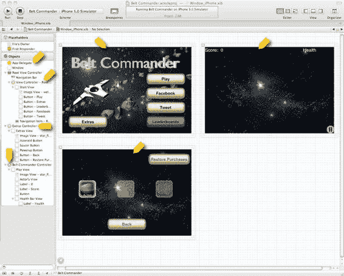

**第 11 章：一个完成的视图：Belt Commander**

### 图 11–8. *iPhone XIB 文件概览*

在图 11–8 中，我们看到已完全展开的该游戏的 iPhone 版 XIB 文件。

在左侧，项目 A 处，我们看到了对游戏主 `UIWindow` 的引用以及对 `AppDelegate` 的引用。项目 B 处的视图控制器是 `RootViewController` 类的一个实例，它是 `UINavigationController` 的一个子类。视图控制器 `Root View Controller` 被连接到 Window，使其成为根控制器；这导致 `Root View Controller` 的顶层 `UIViewController` 被显示。简而言之，一切都被连接起来，以便在启动时显示项目 E 处的视图。


在`Figure 11–8`中，我们看到还有两个其他的`UIViewController`：`Extras Controller`（项目 C）和`Belt Commander Controller`（项目 D）。`Extras Controller`对象对应于项目 G 处的视图，而`Belt Commander Controller`对象对应于项目 G 处的视图。这两个控制器在我们的`RootViewController`类中都有一个`IBOutlet`，以便它们可以被引用。事实上，XIB 文件中的许多对象都连接到`RootViewController`，如`Listing 11–1`所示。

[www.it-ebooks.info](http://www.it-ebooks.info/)


**第 11 章：一个完成的视图 Belt Commander**

**261**

**Listing 11–1.** *RootViewController.m*

```
@interface RootViewController : UINavigationController<BeltCommanderDelegate, UIAlertViewDelegate, GKLeaderboardViewControllerDelegate, FBSessionDelegate, FBRequestDelegate>{

    IBOutlet UIViewController* welcomeController;

    IBOutlet BeltCommanderController* beltCommanderController;

    IBOutlet ExtrasController *extrasController;

    IBOutlet UIButton *leaderBoardButton;

    IBOutlet UIButton *tweetButton;

    UIAlertView* newGameAlertView;

    UIAlertView* pauseGameAlerTView;

    GKLocalPlayer* localPlayer;

    Facebook* facebook;

    BOOL isPlaying;

}

-(void)doPause;

-(void)endOfGameCleanup;

-(void)initGameCenter;

-(void)initFacebook;

-(void)initTwitter;

-(void)notifyGameCenter;

-(void)notifyFacebook;

-(BOOL)handleOpenURL:(NSURL *)url;

-(Facebook*)facebook;

@end
```

在`Listing 11–1`中，我们看到了类`RootViewController`的头文件。类`RootViewController`负责管理不涉及实际游戏玩法的应用程序状态。这包括在视图之间切换、处理应用程序启动以及管理来自第 9 章的社会化服务。正如我们在`Listing 11–1`中所见，我们有三个`UIViewController`的`IBOutlet`：`welcomeController`、`beltCommanderController`和`extrasController`。

`Listing 11–1`还显示类`RootViewController`有两个按钮的`IBOutlet`：`leaderBoardButton`和`tweetButton`。需要对这些对象的引用，因为它们将在运行时被启用或禁用。`GKLocalPlayer`用于管理 Game Center，`Facebook`对象用于管理与 Facebook 的交互。

让我们看看如何处理视图之间的导航。

**视图导航**

为了在用户点击按钮时更改视图，我们在`RootViewController`的实现中创建了许多`IBAction`任务，并在 XIB 文件中将它们连接到相应的按钮。`Listing 11–2`显示了其中的两个`IBAction`任务。

[www.it-ebooks.info](http://www.it-ebooks.info/)


**262**

**第 11 章：一个完成的视图 Belt Commander**

**Listing 11–2.** *RootViewController.m (extrasButtonClicked: 和 playButtonClicked:)*

```
- (IBAction)extrasButtonClicked:(id)sender {
    [self pushViewController:extrasController animated:YES];
}

- (IBAction)playButtonClicked:(id)sender {
    [self pushViewController:beltCommanderController animated:YES];
    [beltCommanderController doNewGame: [extrasController gameParams]];
}
```

在`Listing 11–2`中，我们看到两个负责处理按钮点击的任务。当用户按下起始视图上的`Extras`按钮时，会调用任务`extrasButtonClicked:`。该任务简单地使用由`UINavigationController`定义的任务`pushViewController:animated:`来呈现与`extrasController`关联的视图。

类似地，任务`playButtonClicked:`使用相同的任务来显示与`beltCommandController`关联的视图，并在`beltCommanderController`上调用`doNewGame:`。`Listing 11–3`显示了我们如何导航回起始视图。

**Listing 11–3.** *RootViewController.m (backFromExtras:)*

```
- (IBAction)backFromExtras:(id)sender {
    [self popViewControllerAnimated:YES];
}
```

在`Listing 11–3`中，我们看到任务`backFromExtras:`，当用户在额外视图上点击`Back`按钮时被调用。为了导航回起始视图，我们调用`popViewControllerAnimated:`来移除额外视图并显示起始视图。任务`popViewControllerAnimated:`由`UINavigationController`定义，而`RootViewController`是其子类。

还有最后一段处理导航的代码，即响应游戏视图中出现的两个对话框的代码，如`Listing 11–4`所示。

**Listing 11–4.** *RootViewController.m (alertView:clickedButtonIndex:)*

```
- (void)alertView:(UIAlertView *)alertView clickedButtonAtIndex:(NSInteger)buttonIndex{
    if (alertView == pauseGameAlerTView){
        if (buttonIndex == 0) {
            [self endOfGameCleanup];
            [self popViewControllerAnimated:YES];
        } else {
            [beltCommanderController setIsPaused:NO];
        }
    }
    if (alertView == newGameAlertView){
        if (buttonIndex == 0) {
            [beltCommanderController doNewGame: [extrasController gameParams]];
        } else {
            [self popViewControllerAnimated:YES];
        }
    }
}
```

在`Listing 11–4`中，我们看到任务`alertView:clickedButtonAtIndex:`，它由协议`UIAlertViewDelegate`定义并由`RootViewController`实现。在此任务中，我们首先检查点击的是哪个`UIAlertView`。

[www.it-ebooks.info](http://www.it-ebooks.info/)


**第 11 章：一个完成的视图 Belt Commander**

**263**

如果`alertView`等于`pauseGameAlertView`，那么我们知道用户点击了游戏视图上的暂停按钮，并且正在响应弹出的对话框。如果用户在对话框上点击`Yes`（`buttonIndex == 0`），则用户想要退出当前的游戏。我们调用`endOfGameCleanup`和`popViewControllerAnimated:`；后者当然会将我们返回到起始视图。任务`endOfGameCleanup`负责向社交媒体服务报告，我们稍后会查看它。如果用户点击了`No`，我们只需通过调用`setIsPaused:`并传入`NO`来取消暂停`beltCommanderController`。

在`Listing 11–4`中，可能有两个`UIAlertView`导致调用了`alertView:clickedButtonAtIndex:`。我们看了`UIAlertView pauseGameAlertView`的情况；另一种选择是`newGameAlertView`负责。这个`UIAlertView`在游戏结束、用户失去所有生命时显示。此对话框允许用户简单地开始一个新游戏或返回到起始视图。可以看出，开始一个新游戏就像在`beltCommanderController`上调用`doNewGame:`一样简单。要返回起始视图，我们使用现在已经很熟悉的任务`popViewControllerAnimated:`。

负责显示这两个不同`UIAlertView`的代码非常相似；让我们只关注其中一个来理解它。游戏结束时显示`UIAlertView`的代码如`Listing 11–5`所示。

**Listing 11–5.** *RootViewController.m (gameOver:)*

```
-(void)gameOver:(BeltCommanderController*)aBeltCommanderController{
    if (newGameAlertView == nil){
        newGameAlertView = [[UIAlertView alloc] initWithTitle:@"Your Game Is Over."
                                                      message:@"Play Again?" delegate:self cancelButtonTitle:@"Yes" otherButtonTitles:@"No", nil];
    }
    [newGameAlertView show];
    [self endOfGameCleanup];
}
```

在`Listing 11–5`中，我们看到由`RootViewController`实现的任务`gameOver:`。任务`gameOver:`由协议`BeltCommanderDelegate`定义，该协议是在游戏开始或停止时用于在`RootViewController`和`BeltCommanderController`之间通信的委托协议。也就是说，`RootViewController`是`beltCommanderView`的委托。这种关系在 XIB 文件中定义。在此例中，我们正在查看游戏结束时被调用的代码。

在此任务中，我们懒加载创建`UIAlertView newGameAlertView`，指定要显示的文本，并将`self`设置为委托。为了显示`UIAlertView`，我们调用`show`，导致视图在用户屏幕上弹出。我们做的最后一件事是调用`endOfGameCleanup`，如`Listing 11–6`所示。


```objc
-(void)endOfGameCleanup{

isPlaying = NO;

[self notifyGameCenter];

[self notifyFacebook];

}
```

**第 264 页**

**第 11 章：完整的视图 Belt Commander**

在`Listing 11–6`中，我们看到任务`endOfGameCleanup`，它在游戏结束时被调用，无论是用户失去所有生命值还是从暂停对话框退出当前游戏。在此任务中，我们通过将`isPlaying`设置为`NO`来记录我们不再进行游戏。

任务`notifyGameCenter`和`notifyFacebook`会通知这两个服务用户的分数，这些内容在第 9 章中有描述。

我们已经通过检查`XIB`文件、理解应用程序流程以及实现方式，了解了应用程序的组织结构。接下来，我们来看看游戏本身，并理解`BeltCommanderController`类以及`Actor`子类是如何创建游戏的。

### 实现游戏

我们已经大致了解了应用程序是如何组合在一起的。我们知道视图是如何显示在屏幕上的，并研究了应用程序的生命周期。在本节中，我们将只关注游戏机制。我们将探讨如何将角色加入游戏、它们的行为方式以及交互方式。

首先，我们将回顾贯穿本书所创建的简单游戏框架中的类。然后，我们将探索`BeltCommanderController`类，并理解它如何管理游戏。最后，我们将查看每个`Actor`，并理解其实现方式如何使其按照预期的方式工作。

### 游戏类

在前面的章节中，我们构建了一组用于实现游戏的类。我们有负责向游戏添加和移除角色，以及将它们渲染到屏幕上的`GameController`类。我们还有代表游戏角色和交互元素的`Actor`类。`Actor`的子类指定了一个`Representation`、一组`Behaviors`以及一些自定义代码。以下是这些类的回顾。

`GameController`类是游戏的核心；该类的子类只需添加角色，动画就会开始执行。要自定义`GameController`，子类应实现任务`applyGameLogic`来执行任何游戏特定的逻辑，例如添加或移除角色、检查胜利或失败条件，或任何特定于某款游戏的其他操作。

除了更新`Actor`和游戏逻辑外，`GameController`还负责将`Actor`渲染到屏幕上。`GameController`通过两种方式实现这一点。首先，`GameController`扩展了`UIControllerView`，因此它有一个名为`view`的主`UIView`，该视图可以作为应用程序场景的一部分。其次，`GameController`有一个名为`actorsView`的`UIView`，它是游戏中代表所有角色的所有`UIView`的父视图。

通过在`XIB`文件中指定`view`和`actorsView`，`GameController`的实例可以绘制到屏幕上。`GameController`负责渲染游戏的第二种方式是：与每个`Actor`的`Representation`协作，创建一个`UIView`作为子视图添加到`actorsView`中。对于动画的每一步，`GameController`都会更改每个`Actor`的`UIView`的位置、缩放和透明度。`GameController`的关键任务如下：

*   **`doSetup`**：在任务`doSetup`中，`GameController`的子类应通过调用`setSortedActorClasses:`来指定应保持排序的`Actor`子类。
*   **`applyGameLogic`**：任务`applyGameLogic`在动画的每一步被调用一次。子类应在此任务中实现所有游戏逻辑，包括：
    *   设置游戏结束条件
    *   添加和移除`Actor`
    *   计分
    *   追踪成就
    *   更新抬头显示（HUD）
    *   管理用户输入（触摸、手势等）


# 排版后的文本

`actorsOfType:`。任务`actorsOfType:`在`applyGameLogic`内部使用，用于查找特定类的所有`Actor`。需要在`doSetup`期间使用`setSortedActorClasses:`任务指定所请求的`Actor`类型。

`addActor:`/`removeActor:`。任务`addActor:`和`removeActor:`用于将`Actor`添加或移除出游戏。这些任务会收集在一个动画步骤期间被添加或移除的所有`Actor`，然后在动画循环结束时一次性应用这些更改。这防止了对持有`Actor`的集合进行修改，因此任何`Actor`或`GameController`的子类都可以在其`apply`任务期间添加或移除任何`Actor`。

#### `Actor`

`Actor`类代表游戏中任何动态的对象。在我们的示例中，飞船、小行星、飞碟、能量增强道具、血条、粒子和子弹都是`Actor`。在创建游戏时，`GameController`的子类将处理游戏的宏观细节，但正是`Actor`的子类提供了游戏中每个项目的独特且有趣的行为。在实践中，游戏中的每个`Actor`都是由其属性、绘制方式（`Representation`）、行为方式（`Behaviors`）以及在子类中定义的自定义代码组合而成的。在我们查看`Actor`类之后，我们将研究`Representation`和`Behaviors`。以下是`Actor`的属性列表及其含义。

`long actorId`：`actorId`是分配给每个`Actor`的唯一编号。此值可用于提供对游戏中`Actor`的软引用。

[www.it-ebooks.info](http://www.it-ebooks.info/)


**266** **第 11 章：完成的视图 Belt Commander**

`BOOL added/removed`：属性`added`和`removed`可用于测试`Actor`是否已成功添加或移除出游戏。

`CGPoint center`：属性`center`定义了游戏坐标系中`Actor`中心的位置。

`float rotation`：属性`rotation`表示`Actor`的旋转角度（以弧度为单位）。

`float radius`：`Actor`的`radius`描述了它的大小。`center`和`radius`共同描述了`Actor`在游戏中所占的区域。

`NSMutableArray* behaviors`：属性`behaviors`是一个`Behavior`对象的集合。`Behavior`对象描述了`Actor`的某些方面。它可能描述如何移动，或者何时从游戏中移除。在游戏的每一步中，`behaviors`数组中的每个`Behavior`都将应用于该`Actor`。

`BOOL needsViewUpdated`：在游戏的一个步骤中，`Actor`可能会经历需要其`UIView`更新的更改。这些可能包括更新应表示它的图像或状态更改。此标志通知`GameController`需要工作来将`Actor`与其表示同步。

`NSObject<Representation> representation`：游戏中的每个`Actor`都需要一个符合`Representation`协议的对象来描述如何创建`UIView`以在游戏中表示它。`Representation`将在下一节讨论。

`int variant`：在游戏中拥有仅略有不同的`Actor`是很常见的。也许它们是不同的颜色，或者有稍微不同的行为。由于这是一个常见需求，属性`variant`提供了一种区分同一类`Actor`的简单方法。

`int state`：属性`state`用于描述`Actor`的状态。这个状态可以是任何东西，并且由子类来定义它具体表示什么。属性`state`和`variant`与`ImageRepresentation`类一起工作，以确定应该为`Actor`使用哪个图像。

`float alpha`：属性`alpha`描述了`Actor`的不透明度。`alpha`值为`0.0`的`Actor`是完全透明的，而`alpha`值为`1.0`则是完全不透明的。`Actor`表示中的透明区域不受影响。

`BOOL animationPaused`：属性`animationPaused`用于暂停应用于`Actor`的任何动画。动画的实现需要遵循此值。如果此属性为`true`，则`ImageRepresentation`将不会更新用于表示`Actor`的图像序列中的图像。

[www.it-ebooks.info](http://www.it-ebooks.info/)


**第 11 章：完成的视图 Belt Commander** **267**

除了定义`Actor`的属性之外，`Actor`类还附带了一些任务。它们是：

`-(id)initAt:(CGPoint)aPoint WithRadius:(float)aRadius AndRepresentation:(NSObject<Representation>*)aRepresentation`：此任务是`Actor`类的指定构造器。它要求每个`Actor`都有一个中心、一个半径和一个表示。所有`Actor`的子类都应确保在创建`Actor`时调用此任务。

`-(void)step:(GameController*)controller`：任务`step:`由`GameController`在每个游戏步骤中调用一次。`Actor`的子类可以在其对此任务的实现中提供自定义逻辑。

`-(BOOL)overlapsWith: (Actor*) actor`：任务`overlapsWith:`用于测试一个`Actor`是否与另一个`Actor`占据相同空间。这可用于实现简单的碰撞检测。

`-(void)addBehavior:(NSObject<Behavior>*)behavior`：任务`addBehavior:`是一个工具方法，用于在单个步骤中向`Actor`添加`Behaviors`。

#### `Representation`

每个`Actor`必须描述`GameController`应如何渲染它。协议`Representation`（在`Actor.h`中定义）描述了`GameController`如何获取和更新每个`Actor`的`UIView`。`Representation`有两个具体实现：`ImageRepresentation`和`VectorRepresentation`。`ImageRepresentation`类使用`UIImages`和`UIImageViews`来创建适合呈现`Actor`的`UIView`。`VectorRepresentation`类使用`Core Graphics`动态绘制`Actor`。关于`ImageRepresentation`的详细信息在第 6 章中介绍，而`VectorRepresentation`的实现则在第 7 章中介绍。该协议定义了两个任务：

`-(UIView*)getViewForActor:(Actor*)anActor In:(GameController*)aController`：此任务在`Actor`添加到`GameController`后不久被调用一次。它负责创建并返回一个适合渲染`Actor`的`UIView`。

`-(void)updateView:(UIView*)aView ForActor:(Actor*)anActor In:(GameController*)aController`：每当`Actor`的`needsViewUpdated`属性为`true`时，将调用此任务。此任务应对`UIView`进行必要的更改，以使其准确地表示`Actor`。

#### `Behavior`

在创建游戏时，许多不同的`Actor`将需要非常相似的代码来实现。虽然完全可以构建一个类层次结构来为每个类提供恰好所需的代码，但我发现这很繁琐。一个解决方案是`Behavior`协议及其实现类。协议`Behavior`的每个实例负责在每一步将一个逻辑应用于`Actor`。`Behavior`协议定义了一个任务：

`-(void)applyToActor:(Actor*)anActor In:(GameController*)gameController`：任务`applyToActor:In:`由遵守此协议的类实现，以向它们所附加的`Actor`提供某种行为。游戏`Belt Commander`中包含了几种`Behavior`的实现，它们是：

- `LinearMotion`：`LinearMotion`类用于在游戏期间沿直线移动`Actor`。该类提供了几个便捷构造器，使得基于方向或目标点来定义运动变得容易。

- `ExpireAfterTime`：`ExpireAfterTime`类用于在给定步数后移除`Actor`。这对于粒子非常方便，因为你想要创建它们，将它们添加到场景中，然后忘记它们。

- `FollowActor`：这个类用于使一个`Actor`与另一个`Actor`保持固定距离。这被附加到飞碟上的血条使用，以使它们在一起。


既然我们已经回顾了用于创建游戏 `BeltCommander` 的核心类，现在是时候看看刚刚描述的类的子类，以便理解如何扩展和自定义它们来创建游戏 `BeltCommander`。

### 理解 `BeltCommanderController`

在前几章中，我们通过扩展 `GameController` 类来制作示例。为了创建整个游戏，我们将采用同样的方式，创建 `BeltCommanderController` 类。`BeltCommanderController` 类负责管理游戏中的 `Actors`，判断结束条件，更新生命值和分数，以及解释用户的输入。让我们再次审视游戏中的动作，回顾游戏的玩法以及玩家面临的挑战。游戏截图如图 11–9 所示。

[www.it-ebooks.info](http://www.it-ebooks.info/)


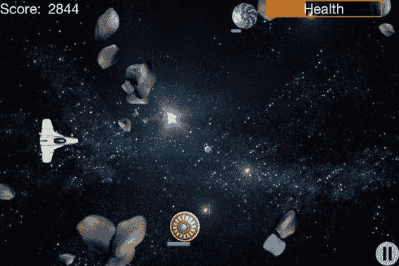

**第 11 章：完整的游戏视图 Belt Commander** **269**

**图 11–9.** *《Belt Commander》游戏进行中*

在图 11–9 中，我们看到了游戏 `BeltCommander`。玩家通过点击屏幕来控制左侧的战舰。战舰会移动到点击位置的相同高度。战舰会持续向右发射子弹，如图中背景明亮恒星右下方的圆圈所示。从右侧向左移动的是源源不断的小行星浪潮。如果子弹与小行星相撞，小行星会碎裂成更小的部分，并且分数会增加。如果小行星与战舰相撞，小行星会被摧毁，但战舰的生命值会减少。为了给游戏增添一些混乱，飞碟会出现在游戏右侧并上下移动，向战舰发射子弹。这些子弹会摧毁小行星，但它们的主要目的是击中战舰并减少其生命值。为了帮助我们可怜的战舰，有三种类型的强化道具从左侧出现并向右侧移动。如果战舰足够幸运，正好在强化道具的路径上，它就能获得增益效果。这些增益包括增加生命值、更强大的子弹和额外分数。游戏会持续进行，直到战舰的生命值降为零。

现在我们对游戏玩法有了一个概述，接下来我们将查看 `BeltCommanderController` 类，首先看看新游戏是如何设置的，然后看看每步游戏运行的代码。

### `BeltCommanderController`：开始

要理解这个游戏是如何实现的，我们需要了解 `BeltCommanderController` 是如何设置以运行游戏的。以下部分概述了启动并运行游戏所需的初始代码。让我们从 `BeltCommanderController` 类的头文件开始，如列表 11–7 所示。

[www.it-ebooks.info](http://www.it-ebooks.info/)


**270** **第 11 章：完整的游戏视图 Belt Commander**

**列表 11–7.** *`BeltCommanderController.h`*

```
@class BeltCommanderDelegate, BeltCommanderController;

@protocol BeltCommanderDelegate

@required

-(void)gameStarted:(BeltCommanderController*)aBeltCommanderController;

-(void)gameOver:(BeltCommanderController*)aBeltCommanderController;

@end

@interface BeltCommanderController : GameController{

IBOutlet HealthBarView* healthBarView;

IBOutlet UILabel* scoreLabel;

GameParameters* gameParameters;

Viper* viper;

//成就追踪
int asteroids_destroyed;

}

@property (nonatomic, retain) IBOutlet NSObject<BeltCommanderDelegate>* delegate;

-(void)doNewGame:(GameParameters*)aGameParameters;

-(void)tapGesture:(UITapGestureRecognizer*)tapRecognizer;

-(void)doEndGame;

-(void)doAddNewTrouble;

-(void)doCollisionDetection;

-(void)doUpdateHUD;

-(void)checkAchievements;

-(Viper*)viper;

@end
```

在列表 11–7 中，我们看到了 `BeltCommanderController` 类的头文件。正如预期的那样，该类扩展了 `GameController`。它还定义了一个名为 `BeltCommanderDelegate` 的协议。该协议由 `RootViewController` 实现，用于传递游戏状态。与此类关联的有两个 `IBOutlets`。第一个是 `HealthBarView`，它是 `UIView` 的子类，负责在屏幕右上角渲染生命值条。第二个是 `scoreLabel`，用于在游戏进行时显示玩家的分数。

在列表 11–7 中，我们看到有一个名为 `gameParameters` 的 `GameParameters` 对象。此对象用于确定游戏中应包含哪些类型的 `Actors`。其思路是，该游戏是免费的，玩家可以购买不同类型的 `Actors` 来增加趣味性（以及盈利）。此类应用内购买在第 10 章中讨论过。在本章中，我们假设所有应用内购买已完成。

`Viper` 对象用于保留对游戏中战舰的引用。由于我们需要方便地访问此对象，因此直接保留一个指向它的指针，而不是在其他 `Actors` 中搜索它，这样做是合理的。最后一个字段名为 `asteroids_destroyed`，用于追踪成就，如第 9 章所述。

[www.it-ebooks.info](http://www.it-ebooks.info/)


**第 11 章：完整的游戏视图 Belt Commander** **271**

`BeltCommanderController` 类有许多相关的任务。目前我们需要关注的只有 `doNewGame:` 和 `tapGesture:`，其他任务我们将在实现过程中逐步介绍。`doNewGame:` 任务由 `RootViewController` 调用以开始新游戏——我们很快就会看到它的实现。

当 `UITapGestureRecognizer` 检测到屏幕上的点击时，会调用 `tapGesture:` 任务，我们稍后也会看到这一点。关于手势如何工作的更多信息在第 8 章中有介绍。让我们先专注于设置。

### 理解设置过程

要完成 `BeltCommanderController` 的设置，我们需要执行几个步骤。由于我们知道 `BeltCommanderController` 扩展了 `GameController`，因此它应该实现一个 `doSetup` 任务，如列表 11–8 所示。

**列表 11–8.** *`BeltCommanderController.m` (`doSetup`)*

```
-(BOOL)doSetup{

if ([super doSetup]){

[self setGameAreaSize:CGSizeMake(480, 320)];

[self setIsPaused:YES];

NSMutableArray* classes = [NSMutableArray new];

[classes addObject:[Saucer class]];

[classes addObject:[Bullet class]];

[classes addObject:[Asteroid class]];

[classes addObject:[Powerup class]];

[self setSortedActorClasses:classes];

UITapGestureRecognizer* tapRecognizer = [[UITapGestureRecognizer alloc]

initWithTarget:self action:@selector(tapGesture:)];

[actorsView addGestureRecognizer:tapRecognizer];

return YES;

}

return NO;

}
```

在列表 11–8 中，我们看到了 `BeltCommanderController` 类定义的 `doSetup` 任务。在此任务中，我们将游戏区域大小定义为 `480x320`，这恰好是 iPhone 屏幕的本地点尺寸。我们还设置了 `isPaused` 属性为 `YES`，因此直到稍后调用 `doNewGame:` 之前，不会有任何动画。下一步是指定我们希望在游戏进行过程中方便访问的 `Actors` 类。在本例中，我们指定了 `Saucer`、`Bullet`、`Asteroid` 和 `Powerup` 类。

请记住，游戏中只有一个 `Viper`，并且我们在头文件中保留了对它的引用。我们做的最后一件事是创建一个 `UITapGestureRecognizer` 并将其添加到 `actorsView` 中。这样，当用户点击屏幕时，`tapGesture:` 任务就会被调用。在此之前，我们需要了解新游戏是如何创建的。

[www.it-ebooks.info](http://www.it-ebooks.info/)


**272** **第 11 章：完整的游戏视图 Belt Commander**

### 新游戏

无论是运行第一局还是第一百局游戏，它们都以 `doNewGame:` 任务开始，如列表 11–9 所示。

**列表 11–9.** *`BeltCommanderController.m` (`doNewGame:`)*

```
-(void)doNewGame:(GameParameters*)aGameParameters{
```


```objc
gameParameters = aGameParameters;

[self removeAllActors];

[self setScore:0];

[self setStepNumber:0];

[self setScoreChangedOnStep:0];

viper = [Viper viper:self];

[self addActor:viper];

asteroids_destroyed = 0;

[self setIsPaused:NO];

[delegate gameStarted:self];

}
```

在**代码清单 11–9**中，我们看到任务`doNewGame:`，它由`RootViewController`调用以启动新游戏。在此任务中，我们设置`gameParameters`以供将来参考。然后我们必须重置此对象，使其准备好进行新游戏。要移除所有`Actor`，我们调用`removeAllActors`。我们还希望重置分数、步数以及摧毁的小行星数量。我们还创建了一个`Viper`对象并将其存储在变量`viper`中。重置完成后，我们将`isPaused`设置为`NO`，并通知代理游戏已开始。接下来我们将了解如何处理输入，然后就可以进入后续工作了。

### 处理输入

一旦`isPaused`被设置为`NO`，游戏就启动并运行。此时，游戏中唯一的`Actor`是`viper`。我们先花点时间了解如何在 asteroids 和 aliens 出现之前拦截输入使其移动。任务`tapGesture:`如**代码清单 11–10**所示。

**代码清单 11–10.** *BeltCommanderController.m (tapGesture:)*

```objc
-(void)tapGesture:(UITapGestureRecognizer*)tapRecognizer{

if (![self isPaused]){

CGSize gameSize = [self gameAreaSize];

CGSize viewSize = [actorsView frame].size;

float xRatio = gameSize.width/viewSize.width;

float yRatio = gameSize.height/viewSize.height;

CGPoint locationInView = [tapRecognizer locationInView:actorsView];

[www.it-ebooks.info](http://www.it-ebooks.info/)

// 图片占位符（原始内容中的图片链接，未做实质性修改）
// 

**第 11 章：完成视图 Belt Commander**

**273**

CGPoint pointInGame = CGPointMake(locationInView.x*xRatio,

locationInView.y*yRatio);

[viper setMoveToPoint: pointInGame within:self];

}

}
```

在**代码清单 11–10**中，我们看到任务`tapGesture:`，它在用户点击屏幕时被调用。在此任务中，检查是否暂停后，我们必须将触摸点转换为游戏坐标。在 iPhone 上，这并非绝对必要，因为`actorsView`视图的像素点宽度和高度与游戏尺寸相同。

然而，当在 iPad 上运行此游戏时，`actorsView`的尺寸为 1024x682，而我们的游戏仍然是 640x480。为了从一个坐标空间转换到另一个坐标空间，我们将游戏宽度除以`actorsView`的宽度，再乘以触摸点的 X 坐标。我们重复此过程处理高度和 Y 值。计算出点坐标后，我们在`viper`上调用`setMoveToPoint:within:`，使其开始运动。我们将在下一节更详细地查看`Viper`类时，研究`setMoveToPoint:within:`的实现。

我们已经涵盖了关于让`BeltCommanderController`设置好以开始游戏的所有知识。一切都已准备好开始处理用户输入并向场景添加新的`Actor`。以下部分描述了`BeltCommanderController`如何检查结束条件、添加`Actor`以及其他适合`BeltCommanderController`类的任务。

### BeltCommanderController 逐步执行

我们已经设置好`BeltCommanderController`类并准备好运行游戏。接下来我们将研究每一步运行的代码，以管理游戏的整体状态。我们将看到如何测试结束条件、如何向场景添加新的`Actor`，以及如何管理`Actor`之间的交互。由于`BeltCommanderController`是`GameController`的子类，我们在任务`applyGameLogic`中开始游戏逻辑，如**代码清单 11–11**所示。

**代码清单 11–11.** *BeltCommanderController.m (applyGameLogic)*

```objc
-(void)applyGameLogic{

if ([viper health] <= 0.0f){

[self doEndGame];

} else {

[self doAddNewTrouble];

[self doCollisionDetection];

[self doUpdateHUD];

if ([self stepNumber]%30 == 0){

[self checkAchievements];

}

}

}
```


在`Listing 11–11`中，我们看到`doApplyGameLogic`任务在游戏的每一步都会被调用。我们首先检查`viper`的生命值是否低于`0.0`。如果是，我们就结束游戏——就这么简单。如果`viper`仍然存活，我们继续调用`doAddNewTrouble`、`doCollisionDetection`和`doUpdateHUD`。对`checkAchievements`的调用每`30`步才执行一次。这是出于性能考虑，因为我们并不想真的每一步都进行这些额外的调用。这确实有一个缺点，即玩家可能达成了成就但未被记录。对于一个更复杂的游戏，我们会分解哪些成就何时被检测。

我们刚刚列出了相当多的任务，我们将逐一介绍它们，从`doEndGame`任务开始，如`Listing 11–12`所示。

**Listing 11–12.** `BeltCommanderController.m` (`doEndGame`)

```
-(void)doEndGame{

[self setIsPaused:YES];

[delegate gameOver:self];

}
```

在`Listing 11–12`中，我们看到非常简单的`doEndGame`任务，我们只是暂停游戏并在代理上调用`gameOver:`。`gameOver:`任务由`RootViewController`实现，可以在`Listing 11–5`中看到。接下来，让我们回顾一下`Actor`是如何添加到游戏中的。

### 添加 Actors

根据经验，我们知道`Actor`是通过调用`addActor:`来添加的。然而，要制作一个游戏，我们必须包含一些逻辑，这些逻辑规定了何时以及如何添加`Actor`。让我们继续，看看在`doAddNewTrouble`任务中我们是如何向游戏中添加新的`Actor`的，如`Listing 11–13`所示。

**Listing 11–13.** `BeltCommanderController.m` (`doAddNewTrouble`)

```
-(void)doAddNewTrouble{

if ([gameParameters includeAsteroids] && arc4random() % (5*60) == 0){

if ([[self actorsOfType:[Asteroid class]] count] < 20){

[self addActor:[Asteroid asteroid:self]];

}

}

if ([gameParameters includeSaucers] && arc4random() % (10*60) == 0){

if ([[self actorsOfType:[Saucer class]] count] < 3){

[self addActor:[Saucer saucer:self]];

}

}

if ([gameParameters includePowerups] && arc4random() % (20*60) == 0){

[self addActor:[Powerup powerup:self]];

}

}
```

在`Listing 11–13`中，我们看到`doAddNewTrouble`任务负责向游戏添加新的`Actor`。对于可能添加的三种类型的`Actor`中的每一种，我们首先检查`gameParameters`是否指示我们应该添加它。如果`gameParameters`指示我们应该添加特定类型的`Actor`，我们执行一个随机检查来决定是否实际添加它。例如，小行星有`1/300`的概率被添加。为了添加每个`Actor`，我们创建它并调用`addActor:`。`Actor`的构造函数处理每个`Actor`如何以及在哪里创建的细节。我们现在将继续检查`Actor`之间如何相互作用。

### 碰撞检测

现在我们知道每个`Actor`是如何添加到场景中的了。让我们继续看看它们是如何交互的。如果我们考虑这个游戏中的五个主要`Actor`，必须考虑以下几种交互，如下所示：

- 子弹和小行星
- 小行星和飞船
- 子弹和飞船
- 子弹和飞碟
- 能量增强道具和飞船

这些交互在`doCollisionDetection`任务中处理，其第一部分如`Listing 11–14`所示。

**Listing 11–14.** `BeltCommanderController.m` (`doCollisionDetection`, 第 1 部分)

```
-(void)doCollisionDetection{

NSSet* bullets = [self actorsOfType:[Bullet class]];

NSSet* asteroids = [self actorsOfType:[Asteroid class]];

NSSet* saucers = [self actorsOfType:[Saucer class]];

NSSet* powerups = [self actorsOfType:[Powerup class]];

for (Asteroid* asteroid in asteroids){

for (Bullet* bullet in bullets){

if ([bullet overlapsWith:asteroid]){

[bullet decrementDamage: self];

asteroids_destroyed++;

[asteroid doHit:self];

[self incrementScore: [asteroid level]*10];

break;

}

}

if ([asteroid overlapsWith:viper]){

[viper decrementHealth: [asteroid level]*2];

Shield* shield = [Shield shieldProtecting:viper From: asteroid];

[self addActor:shield];

asteroids_destroyed++;

[asteroid doHit:self];

}

}
```

在`Listing 11–14`中，我们看到`doCollisionDetection`任务的第一部分，我们处理与小行星相关的交互。在这个任务中，我们首先要做的是获取所有我们将要与之交互的不同`Actor`的引用。一旦我们有了对所有小行星、子弹和飞船的引用，我们就可以开始测试是否有碰撞发生。在`Listing 11–14`的最外层循环内，我们开始测试每个小行星是否与每个子弹重叠。如果是，我们让子弹减少它的伤害值，这通常会使它从游戏中移除，但稍后会详细说明。在调用`doHit`作用于小行星之前，我们还记录下我们摧毁了另一个小行星。最后，我们增加得分。

在`Listing 11–14`中，在我们考虑了每个小行星和子弹之间的关系之后，我们检查小行星是否与飞船重叠。如果是，我们减少飞船的生命值，并向场景中添加一个护盾。护盾是一个`Actor`，它只是一个装饰品，除此之外没有游戏功能。它看起来像是护盾升起保护宇宙飞船。

让我们看看`doCollisionDetection`任务的其余部分，了解其余`Actor`之间的关系是如何处理的。该任务在`Listing 11–15`中继续。

**Listing 11–15.** `BeltCommanderController.m` (`doCollisionDetection`, 第 2 部分)

```
for (Bullet* bullet in bullets){

if ([[bullet source] isKindOfClass:[Saucer class]]){

if ([viper overlapsWith: bullet]){

[viper decrementHealth: [bullet damage]];

Shield* shield = [Shield shieldProtecting:viper From: bullet];

[self addActor:shield];

[self removeActor:bullet];

break;

}

} else {

for (Saucer* saucer in saucers){

if ([saucer overlapsWith: bullet]){

[saucer decrementHealth:[bullet damage]];

Shield* shield = [Shield shieldProtecting:saucer From:bullet];

[self addActor:shield];

[self removeActor:bullet];

break;

}

}

}

}

for (Powerup* powerup in powerups){

if ([powerup overlapsWith:viper]){

[powerup doHitOn:viper in:self];

}

}

}
```

在`Listing 11–15`中，我们继续查看`doCollisionDetection`任务。在遍历所有子弹的同时，我们首先考虑子弹和飞船之间的相互作用。我们通过检查`bullet`上的`source`属性来实现这一点。如果`source`是一个飞碟，那么这颗子弹的目标就是飞船，并且不能伤害飞碟。如果子弹与飞船重叠，我们减少飞船的生命值，添加一个护盾，并将子弹从游戏中移除。

如果子弹不是由飞碟发射的，那么它一定来自飞船。所以我们检查`bullet`是否与任何飞碟重叠。如果是，我们减少飞碟的生命值，为飞碟添加一个护盾，并移除子弹。

在`doCollisionDetection`中我们必须考虑的最后一个关系是能量增强道具和飞船之间的关系。我们遍历游戏中的所有能量增强道具并检查它们是否重叠。如果重叠，我们在能量增强道具上调用`doHitOn:in:`来应用增益效果。`doHit:in:`的实现将在我们详细考虑`Powerup`类时进行描述。

我们现在已经查看了不同`Actor`之间的所有交互，在查看每个不同的`Actor`类之前，让我们先看看如何更新屏幕上的得分和生命值条。

### 更新 HUD


在游戏的每一步中，分数或生命值条都可能会发生变化。这两个组件共同被称为平视显示界面（HUD）。回顾清单 11-7，我们发现这两个组件通过 `IBOutlet` 连接到了 `BeltCommanderController`。可以看到 `scoreLabel` 是一个简单的 `UILabel`，但 `HealthBarView` 类则比较陌生。我们稍后将讨论 `HealthBarView` 类；首先，让我们看看在任务 `doUpdateHUD` 中更新这些组件的代码，如清单 11-16 所示。

**清单 11-16.** *BeltCommanderController.m (doUpdateHUD)*

```
-(void)doUpdateHUD{

if ([self stepNumber] == [self scoreChangedOnStep]){

[scoreLabel setText: [[NSNumber numberWithLong:[self score]] stringValue] ];

}

[healthBarView setHealth:[viper health]/[viper maxHealth]];

}
```

在清单 11-16 中，我们看到任务 `doUpdateHUD` 会在游戏的每一步中被调用。

在此任务中，我们检查当前 `stepNumber` 是否等于属性 `scoreChangedOnStep`。属性 `scoreChangedOnStep` 是上次更新分数时的 `stepNumber` 值。因此，如果 `stepNumber` 等于 `scoreChangedOnStep`，我们就知道在这一步中分数发生了改变，因此需要更新 `scoreLabel`。要更新 `scoreLabel`，我们只需调用 `setText:` 并传入分数的 `NSString` 版本。

在清单 11-16 中，我们还调用了 `healthBarView` 的 `setHealth:` 方法来更新生命值条的绘制方式。对象 `healthBarView` 的类型是 `HealthBarView`，它实际上是一个带有自定义 `drawRect:` 任务的 `UIView`，如清单 11-17 所示。

**清单 11-17.** *HealthBarView.m (drawRect:)*

```
- (void)drawRect:(CGRect)rect

{

[self setDefaults];

int index = 0;

float marker = [[percents objectAtIndex:index] floatValue];

[www.it-ebooks.info](http://www.it-ebooks.info/)


**278**

**第 11 章：一个完整的视图 Belt Commander**

while (percent > marker) {

marker = [[percents objectAtIndex:++index] floatValue];

}

UIColor* baseColor = [colors objectAtIndex:index];

const float* rgb = CGColorGetComponents( baseColor.CGColor );

UIColor* frameColor = [UIColor colorWithRed:rgb[0] green:rgb[1] blue:rgb[2]

alpha:.8f];

UIColor* healthColor = [UIColor colorWithRed:rgb[0] green:rgb[1] blue:rgb[2]

alpha:.5f];

[frameColor setStroke];

[healthColor setFill];

CGSize size = [self frame].size;

CGContextRef context = UIGraphicsGetCurrentContext();

CGRect frameRect = CGRectMake(1, 1, size.width-2, size.height-2

);

CGContextStrokeRect(context, frameRect);

CGRect heatlhRect = CGRectMake(1, 1, (size.width-2)*percent, size.height-2); CGContextFillRect(context, heatlhRect);

}
```

在清单 11-17 中，我们看到了类 `HealthBarView` 的任务 `drawRect:`。在此任务中，我们绘制了两个矩形。第一个矩形是填充的，第二个只是轮廓。除了绘制矩形之外，我们还想调整矩形的颜色，以反映飞船的受损程度。为了确定应该使用哪种颜色作为 `baseColor`，我们遍历 `NSArray` `percents`，直到要绘制的百分比高于索引处的百分比。

一旦我们有了基础颜色，我们从中创建两种修改后的颜色。第一种颜色是用于生命值条轮廓的 `frameColor`，其 alpha 值为 0.8。第二种颜色是 `healthColor`，用于绘制生命值条的内部，其 alpha 值为 0.5。

为了绘制矩形，我们首先通过调用 `CGRectMake` 来定义它们。创建 `CGRect` 后，我们分别调用 `CGContextStrokeRect` 和 `CGContextFillRect`。

我们已经查看了 `BeltCommanderController` 类，并知道它是如何工作的。在下一节中，我们将考虑五个主要的角色，并理解它们为何拥有现有的特性。

### 实现角色

我们已经回顾了 `BeltCommanderController` 类是如何处理全局的。它控制着角色如何以及何时被创建，并管理它们之间的交互。

然而，游戏的许多功能是在构成不同角色的类中实现的。在本节中，我们将对四个主要角色逐一进行


好的，作为一名高级文档工程师和翻译员，我将遵循您提供的格式和注意事项，将给定的英文文本翻译成中文。


# 第 11 章：完整的 Belt Commander 视图

### 279

了解关键的定制项，以使它们按照我们的意愿工作。在前几章中，我们实现了不同类型的 Actor。因此，我们只会查看使 Actor 每个有趣功能得以实现的代码片段。如果你想复习如何实现 Actor，请查看第 6 章和第 7 章。当然，你也可以随时查阅完整的源代码。让我们从 `Viper` 类开始。

## Viper Actor

`Viper` 类代表屏幕左侧的宇宙飞船。这是用户控制以获得高分的 Actor。`Viper` 持续向右发射子弹。为了移动 `Viper`，用户点击屏幕，指示飞船应该移动到的上方或下方的某个点。移动时，图形会发生变化，以显示飞船顶部或底部的推进器已开启。此外，`Viper` 可以拦截一个能升级其武器的 Powerup。最后，`Viper` 拥有固定数量的生命值，并且会缓慢恢复。总之，`Viper` 的关键特性如下：

-   移动到用户指定的点。
-   飞船移动时推进器点火。
-   持续发射子弹。
-   “强化”后提升子弹质量。
-   `Viper` 拥有可再生的生命值。

让我们看看源代码，了解我们如何实现这些特性，先从头文件开始了解上下文，如列表 11–18 所示。

**列表 11–18.** *Viper.h*

```
enum{
    VPR_STATE_STOPPED = 0,
    VPR_STATE_UP,
    VPR_STATE_DOWN,
    VPR_STATE_COUNT
};

@interface Viper : Actor <ImageRepresentationDelegate, LinearMotionDelegate>{
    LinearMotion* motion;
    long lastStepDamageWasModified;
}

@property (nonatomic) float health;
@property (nonatomic) float maxHealth;
@property (nonatomic) long lastShot;
@property (nonatomic) long stepsPerShot;
@property (nonatomic) BOOL shootTop;
@property (nonatomic) int damage;

+(id)viper:(GameController*)gameController;
-(void)setMoveToPoint:(CGPoint)aPoint within:(GameController*)gameController;
-(void)incrementHealth:(float)amount;
-(void)decrementHealth:(float)amount;
-(void)incrementDamage:(GameController*)gameController;
-(void)decrementDamage:(GameController*)gameController;

@end
```

## 280 第 11 章：完整的 Belt Commander 视图

在列表 11–18 中，我们看到 `Viper` 类的头文件。在这个文件中，我们看到我们定义了一个包含三种状态的枚举。这与我们之前为指定 Actor 状态而声明的枚举非常相似。查看属性，我们可以看到有 `health` 和 `maxHealth` 属性。我们还有一个名为 `lastShot` 的属性，它将与 `stepsPerShot` 属性一起用于跟踪是否到了再次射击的时间。BOOL 属性 `shootTop` 用于跟踪下一颗子弹是否应该从 `Viper` 的顶部射出。最后一个属性 `damage` 表示下一颗子弹的伤害值。

列表 11–18 中列出的任务相当简单。有四个用于增加和减少生命值和伤害的任务。每个任务都使 `health` 和 `damage` 的值保持在合理范围内。有趣的任务是 `setMoveToPoint:within:`，如列表 11–19 所示。

**列表 11–19.** *Viper.m (setMoveToPoint:within:)*

```
-(void)setMoveToPoint:(CGPoint)aPoint within:(GameController*)gameController{
    if (motion){
        [[self behaviors] removeObject: motion];
    }
    CGPoint point = CGPointMake([self center].x, aPoint.y);
    if (point.y < self.center.y){
        [self setState:VPR_STATE_UP];
    } else if (point.y > self.center.y){
        [self setState:VPR_STATE_DOWN];
    }
    motion = [LinearMotion linearMotionFromPoint:[self center] toPoint:point AtSpeed:1.2f];
    [motion setDelegate:self];
    [motion setStopAtPoint:YES];
    [motion setPointToStopAt:point];
    [motion setStayInRect:YES];
    CGSize gameSize = [gameController gameAreaSize];
    [motion setRectToStayIn:CGRectMake(63, 31, 2, gameSize.height - 63)];
    [motion setWrap:NO];
    [[self behaviors] addObject:motion];
}
```

在列表 11–19 中，我们看到了 `setMoveToPoint:within:` 这个任务。在此任务中，目标是设置一个 `LinearMotion` 对象，该对象将把 `Viper` 移动到指定的点。第一步是查看变量 `motion` 中是否已存在 `LinearMotion` 对象。如果存在，我们希望将其从活动行为集中移除。下一步是基于传入的 `CGPoint` 创建一个新的 `CGPoint`，称为 `point`。由于此方法将接受来自游戏中任何位置的点，我们必须找到一个能保持 `Viper`

## 281 第 11 章：完整的 Belt Commander 视图

水平位置固定的点。一旦我们知道了目标点，就可以将状态设置为 `VPR_STATE_UP` 或 `VPR_STATE_DOWN`。

创建新的 `LinearMotion` 很简单，只需将 `Viper` 的当前中心和 `point` 传递给构造函数 `linearMotionFromPoint:toPoint:AtSpeed:`。将 `self` 设置为代理，并告诉它在到达指定点时停止，这进一步修改了 `LinearMotion`。最后一个修改是设置 `LinearMotion` 使其保持在指定的矩形内。这可以防止 `Viper` 移出屏幕边界。

我们已经了解了 `Viper` 如何在屏幕上移动。其余有趣的特性都在 `step:` 任务中实现，如列表 11–20 所示。

**列表 11–20.** *Viper.m (step:)*

```
-(void)step:(GameController*)gameController{
    long stepNumber = [gameController stepNumber];
    if (stepNumber - lastShot > stepsPerShot - damage){
        CGPoint center = [self center];
        CGSize gameSize = [gameController gameAreaSize];
        float offset;
        if (shootTop){
            offset = -15;
        } else {
            offset = 15;
        }
        CGPoint bCenter = CGPointMake(center.x + 20, center.y + offset);
        CGPoint bToward = CGPointMake(gameSize.width, bCenter.y);
        Bullet* bullet = [Bullet bulletAt:bCenter TowardPoint:bToward From:self];
        [bullet setDamage:damage];
        [gameController addActor:bullet];
        shootTop = !shootTop;
        lastShot = stepNumber;
    }

    if (stepNumber % 60 == 0){
        [self incrementHealth:1];
    }

    if (lastStepDamageWasModified + 10*60 == stepNumber){
        [self decrementDamage:gameController];
    }
}
```

在列表 11–20 中，我们看到了 `step:` 任务，该任务在游戏的每一步都会被调用。我们在此任务中做了几件事；主要是判断是否应该发射子弹，如果是，则发射。但同时，我们也会恢复生命值，并跟踪我们是否仍然受到 Powerup 的影响。为了判断是否应该发射子弹，我们检查 `stepNumber` 减去 `lastShot` 是否大于 `stepsPerShot` 减去 `damage`。通过这种方式，当 `damage` 越高时，我们的射击频率就越高，这种情况发生在 Powerup 为 `Viper` 提供了额外伤害时。

## 282 第 11 章：完整的 Belt Commander 视图

要发射子弹，我们要判断子弹应该从飞船的顶部还是底部射出。然后，只需要创建描述其运动的 `CGPoint` 即可。最后，我们通过翻转 `shootTop` 的值并将 `lastShot` 设置为 `stepNumber` 来进行收尾。

在列表 11–20 中，我们还增加了生命值。这是通过每 60 帧调用一次 `incrementHealth` 来完成的。计算是否应该减少伤害，是通过检查上次伤害增加的时间，并判断是否已经过去了 600 帧（约 10 秒）。

总而言之，让我们的 `Viper` 类按照我们的意愿工作所需的工作量非常少。让我们继续看看 `Asteroid` 类。

## Asteroid 类

小行星是 Belt Commander 中的主要对手（大概这个词是


# 排版后内容

标题中的“belt”指的是小行星带（asteroid belt）。这些`Actor`从右侧开始并向左移动。当它们到达左侧时，会从右侧重新开始。我们在本书中多次使用了`Asteroid`类的变体，并且它们有详细的文档记录。然而，使`Asteroid`有趣的功能是它在发射`Particle`时如何分裂成多个更小的小行星。此代码修改自之前的示例，如代码清单 11–21 所示。

**代码清单 11–21.** `Asteroid.m` (`doHit:`)

```
-(void)doHit:(GameController*)controller{

if (level > 1){

int count = 1;

float percent = arc4random()%1000/1000.0f;

if (percent > 0.9){

count = 3;

} else if (percent > 0.5){

count = 2;

}

for (int i=0;i<count;i++){

float radius = [self radius];

float rx = arc4random()%1000/1000.0*radius*2 - radius;

float ry = arc4random()%1000/1000.0*radius*2 - radius;

CGPoint newCenter = CGPointMake(self.center.x + rx, self.center.y + ry); Asteroid* newAst = [Asteroid asteroidOfLevel:level-1 At: newCenter];

[controller addActor:newAst];

}

}

int particles = arc4random()%4+1;

for (int i=0;i<particles;i++){

ImageRepresentation* rep = [ImageRepresentation

imageRepWithDelegate:[AsteroidRepresentationDelegate instance]];

Particle* particle = [Particle particleAt:self.center WithRep:rep Steps:25];

[particle setRadius:6];

[particle setVariant:arc4random()%AST_VARIATION_COUNT];

[particle setRotation: (arc4random()%100)/100.0*M_PI*2];

LinearMotion* motion = [LinearMotion linearMotionRandomDirectionAndSpeed];

[particle addBehavior:motion];

[controller addActor: particle];

}

[controller removeActor:self];

}
```

在代码清单 11–21 中，我们看到了由`Asteroid`类实现的`doHit:`任务。在此任务中，我们检查当前处理的`Asteroid`是否高于一级。如果是，则需要创建子`Asteroid`来替换当前小行星。在其他示例中，我们只是随机选择要创建的子`Asteroid`数量。然而，在`Belt Commander`的试玩过程中，这种做法并不令人满意，因为生成的小行星数量过多。为了减少创建的小行星数量，对`count`的每个可能值都赋予了一个百分比。因此，只有 10%的情况下`Asteroid`会创建三个子`Asteroid`，40%的情况下会创建两个子`Asteroid`，其余时间只创建一个`Asteroid`。通过这种方式，游戏达到了平衡，保持了趣味性和可玩性。

关于`doHit:`任务的另一个有趣之处，如代码清单 11–21 所示，是如何创建`Particle`来强调父`Asteroid`的毁灭。通过创建 1 到 5 个外观类似小行星的`Particle`，并将它们随机方向发射出去，我们实现了非常令人满意的小行星毁灭效果。

接下来，让我们继续探索一下`Saucer`类。

## Saucer 类

`Saucer`类主要是个捣蛋鬼。它会出现在屏幕的顶部或底部，向`Viper`发射`Bullet`。`Saucer`类之所以麻烦，是因为`Bullet`经常击碎小行星，产生不可预测的模式。本章中`Saucer`类的实现与其它章节中的实现非常相似。但是，对`step:`任务做了一些修改，如代码清单 11–22 所示。

**代码清单 11–22.** `Saucer.m` (`step:`)

```
-(void)step:(GameController*)gameController{

if (health <= 0){

[gameController incrementScore:[self radius]*10];

[gameController removeActor:self];

return;

}

CGSize gameAreaSize = [gameController gameAreaSize];

CGPoint center = [self center];

if (center.y < -[self radius]){

[linearMotion setDirection:DIRECTION_DOWN];

} else if (center.y > gameAreaSize.height + [self radius]){

[linearMotion setDirection:DIRECTION_UP];

}

if (arc4random()%180 == 0){
```


```objectivec
BeltCommanderController* bc = (BeltCommanderController*)gameController;

[gameController addActor:[Bullet bulletAt:[self center] TowardPoint:[bc viper].center From:self]];
```

In Listing 11-22, we saw the implementation of the `step:` method in the `Saucer` class. In this task, we check if the `Saucer`'s health is below zero. If so, we increment the `gameController`'s score and remove the `Saucer` from the game. The next part of the `step:` task determines whether the `Saucer` needs to change direction because it has moved off-screen. The final part of the `step:` task is responsible for firing a bullet. To do this, we obtain the `gameController`'s `viper` property so that we can aim the bullet at it. This is the first instance where we need to cast `gameController` to `BeltCommanderController`. This raises the question of how to add a generic way to reference a specific character (like the `viper`) without relying on class definitions. But that is an exercise for another time.

The last character we will examine is `Powerup`.

## The `Powerup` Class

The `Powerup` class is actually quite simple. It is just a character that moves from right to left. We have already covered in other chapters how it can appear to rotate and how it can flash at the end of its life. In this game, the interesting part is the effect it has on the `Viper`. This functionality is implemented in the `doHitOn:in:` task, as shown in Listing 11-23.

**Listing 11-23.** *Powerup.m (doHitOn:in:)*

```objectivec
-(void)doHitOn:(Viper*)viper in:(GameController*)gameController{
    if (self.variant == VARIATION_HEALTH){
        [viper incrementHealth:30];
    } else if (self.variant == VARIATION_DAMAGE){
        [viper incrementDamage:gameController];
    } else if (self.variant == VARIATION_CASH){
        [gameController incrementScore:1000];
    }
    [gameController removeActor:self];
}
```

In Listing 11-23, we see the `doHitOn:in:` task of the `Powerup` class. This method is called when a `Powerup` collides with a `Viper`. The implementation is straightforward: we simply check the `Powerup`'s variant and apply the correct effect. For `VARIATION_HEALTH`, we increase the `Viper`'s health by 30. For `VARIATION_DAMAGE`, we increase the `Viper`'s damage value. Finally, for `VARIATION_CASH`, we simply increase the score by 1000. I believe the simplicity of this task stems directly from our use of the `Actor` model. It turns out that this is a powerful object-oriented design.

[www.it-ebooks.info](http://www.it-ebooks.info/)

## Chapter 11: A Complete View – `Belt Commander`

### Summary

In this chapter, we have brought together all the techniques discussed in this book. We first explored what our game, `Belt Commander`, is and how to play it. Then we reviewed the application's flow and learned how to switch between views using the `UINavigationController` class. Next, we examined the `BeltCommanderController` class and learned how to implement the main part of the game. Finally, we looked at some specific implementation choices that brought our `Actor` to life.

When creating a game, there are always unique codes and techniques involved. Every game is unique and requires a unique effort to realize. It is impossible to write a book that explains every challenge a game developer might face.

However, many developers and game designers will face requirements very similar to those I have outlined here. I hope this book has demonstrated how to solve these common challenges. From the most basic issues of screen switching and user data persistence, to more complex topics like particle animation and in-app purchases, I consider this book to be a map of the code and classes that constitute a game's infrastructure. Ultimately, it is up to each developer to fill in the middle part and create new games. Thank you for reading this book.

[www.it-ebooks.info](http://www.it-ebooks.info/)

## Appendix A

### Designing and Making Graphics

In this appendix, we will cover three main topics: designing graphics, making graphics, and some open-source tools for this purpose.

When creating video games, a significant amount of work goes into producing the graphics used in the game. In this appendix, we will consider 2D games. These graphics will be images of characters, backgrounds, buttons, and other decorative elements within the game. These images are a vital part of the game; they are the first thing people see and can determine whether people will download the game. Images are what draw people's attention. People remember the image of Link or Mario – not the collision detection algorithm. This is not to say that no popular games use simple graphics, because there are. But even creators of successful games (using simple graphics) spend a great deal of time ensuring their artwork meets a unified design goal.

Beyond stylistic considerations, game designers must also consider what is required to create images suitable for building the game. We must consider the size of the final images and how the images are organized. Should we use separate images for everything, or can we create composite images of backgrounds? How do we organize images so they can be easily modified? Do we have a budget for the megabyte size of our images? These are just a few of the questions I will address in this appendix.

The final part of this appendix will offer a quick review of some excellent open-source tools for game designers. These tools are not only important for small game developers but were also crucial for the writing of this book.

[www.it-ebooks.info](http://www.it-ebooks.info/)

## Art in Video Games

Before creating a video game, someone has an idea of what the gameplay and its appearance will be. That initial vision may or may not make it into the final release version. Regardless, it is best for one person or a group to be responsible for shaping the game's art so that it has a consistent style. Once the game has an art direction, work begins on building the game's assets. As the game takes shape, other artwork will be created to support the game, such as websites or advertisements. These other works should maintain the same visual style. In this section, we will briefly review what an artistic style is and how it shapes user expectations.

### Style in Video Games

The style of a video game refers to all the choices made by the designer and artist to create the game's art, and how this art fits together. The style of a game is no different from the style of other products. For example, consider a bottle of teriyaki sauce. It is not unreasonable to draw the word "teriyaki" in a font that looks like it comes from the Far East, perhaps like the word in Figure A-1.

**Figure A-1.** *"Teriyaki" Presented in a Far Eastern Style*

Figure A-1 shows a word presented in a style that matches the expectations of teriyaki sauce users. Over the years, many teriyaki sauce manufacturers have set this expectation. Not all products have a socially expected style to draw upon. In fact, if you are creating a new game of a new genre, users may have no expectations of style at all. If you are making a game about knights and castles, users will welcome a game that looks medieval in style. Regardless, it is important to maintain consistency of artistic style throughout the game.

Maintaining a consistent style does not require the art to be overly complex. The goal is simply to make the art look as if it were created by the same hand, as shown in the example in Figure A-2.

[www.it-ebooks.info](http://www.it-ebooks.info/)
```


**图 A–2.** *《灭虫者》，由 SUMO Productions 制作。© 2011 Table Mountain Church*

在图的左侧，我们看到游戏的欢迎界面。Phil Hassey 与 Table Mountain Church（拥有版权）的几位青少年合作开发了这款简单的游戏。由于这是 Phil 与一群缺乏多年图形或游戏设计经验的年轻人合作的成果，他们采用了简单的手绘风格。这一选择使得几位绘画技巧有限的人也能为游戏贡献美术作品。为了在整个游戏中保持这种风格，我们可以看到左侧屏幕角落的四个按钮也是手绘的。右下角的按钮是一个 Facebook 按钮。通过制作自己的 Facebook 按钮，他们保持了风格的一致性。如果他们使用标准 Facebook 按钮中的某一个，就会与整体视觉体验显得格格不入。我们还应该考虑一款风格不一致的游戏，如图 A–3 所示。

[www.it-ebooks.info](http://www.it-ebooks.info/)


**图 A–3.** *《颜色与形状》。© ClayWare Games。背景图由 txd 发布于 Flickr*

在图 A–3 中，我们看到我为初代 iPhone 制作的一款老游戏，名为《颜色与形状》。左侧是欢迎界面，孩子或家长可以在三项活动中选择一项。对于每项活动，玩家会通过语音和文字提示，完成一系列涉及彩色气球的简单任务。3D 文字和气球是用 Blender 3D 渲染的，我认为它们相当一致。两者都使用了强烈的原色，并具有深度感——虽然不是完美匹配，但非常接近。然而，我认为背景图不是个好选择。虽然它是一张很漂亮的照片，但与气球完全不搭，并且在视觉上分散注意力。

[www.it-ebooks.info](http://www.it-ebooks.info/)


**提示:** 知识共享协议提供了一种许可选项，你只需在游戏致谢中包含署名，即可使用其创意作品。Flickr 允许你搜索以该许可发布的图片。《颜色与形状》的背景图就是通过这种方式找到的。

**品牌与感知**

如前所述，游戏的美术不仅仅是在屏幕上移动的图像。人们会记住美术，并将其与游戏关联起来。图 A–4 展示了为游戏《太空攻击!!》制作的一则广告。

**图 A–4.** *《太空攻击》广告*

这张传单是在一次大会上分发的。制作这张传单时，我正忙于更新游戏的美术资源，所以我决定在传单上使用新美术，尽管当时 App Store 中的游戏尚未更新为新美术。因此，当人们下载游戏时，他们下载的是带有旧美术的版本，如图 A–5 所示。

[www.it-ebooks.info](http://www.it-ebooks.info/)


**图 A–5.** *《太空攻击!!》，旧版美术*

由于游戏内的美术与传单上的美术不匹配，且游戏中的美术质量明显更差，人们感觉被欺骗了，尽管游戏是免费的。我没有意识到用户的期望，结果为此付出了一些负面评价的代价。这本可以通过及时更新游戏以适应大会，或者在广告中使用旧版美术来轻松避免。

我们快速了解了电子游戏中的风格是什么，以及为什么它很重要。现在，让我们将注意力转移到创建图像文件的更实际问题上。之后，我们将回顾一些用于创建 2D 美术的优秀工具。

**创建图像文件**

无论游戏的美术方向如何，最终你都需要一定数量的、特定尺寸的图像文件来实际实现游戏。我们首先将探讨一些命名规范，这些规范将帮助你管理需要为不同设备使用不同图像的情况。然后，我们将回顾所有 iOS 应用所需的图像——比如图标和启动屏幕。本节的最后，我们将讨论如何选择合适的图像尺寸。

[www.it-ebooks.info](http://www.it-ebooks.info/)


**命名规范**

在撰写本文时，创建应用时需要考虑三种不同的屏幕分辨率。根据应用运行在三种分辨率中的哪一种来使用不同的图像，这是非常常见的。为了支持这些分辨率，创建了一种命名规范，以几乎无痛的方式促进这一过程。其思路是，通过以特定方式命名图像，将根据设备加载不同的图像。因此，无需在代码中测试你正在使用的设备。这种命名规范的模式是 `Basename[@2x][~iphone|~pad].extension`。所以 `basename` 可以是任意名称——例如 `background`。然后你可以选择性地附加 `@2x` 来表示该图像用于高分辨率显示屏，比如 iPhone 4 的视网膜屏。在指明图像是否为高分辨率版本之后，你可以指定设备类别，即 `iPhone` 或 `iPad`。最后，像通常一样添加扩展名。表 A–1 展示了对于一个本应名为 `background.png` 的图像，这种命名规范如何工作。

**表 A–1.** *竖屏背景图像的命名规范*

| 设备 | 文件名 | 图像像素分辨率 |
|---|---|---|
| iPhone 3GS，iPod Touch 第三代 | `background~iphone.png` | 320x480 |
| iPhone 4，iPod Touch 第四代 | `background@2x~iphone.png` | 640x960 |
| iPad 1，iPad 2 | `background~ipad.png` | 768x1024 |
| iPad 3* | `background@2x~ipad.png` | 1536x2048 |

* 在撰写本文时，iPad 3 尚未发布。我假设 iPad 3 具有像 iPhone 4 那样的视网膜显示屏，从而对命名规范做出逻辑推测。

在表 A–1 中，我们看到第一列是每行对应的设备集合。为了为每组设备提供全屏竖屏背景图像，我们按照第二列所示的方式命名背景文件。最右列显示了图像的像素分辨率。在本附录的示例代码中，应用的背景图像配置为支持模拟器中可用的设备。我已更改每个背景图像，使其包含指示正在加载哪个文件的文本。图 A–6 展示了不同设备加载的不同图像。

[www.it-ebooks.info](http://www.it-ebooks.info/)


**图 A–6.** *每个设备有不同的背景*

在图的左侧，我们看到 iPhone 运行着与 iPhone 3GS 相同的显示效果。中间是模拟在 iPhone 4 上运行时的屏幕尺寸（相对于 3GS）。右侧是第一代和第二代 iPad 的屏幕尺寸。清单 A–1 设置了此应用的背景图像。

**清单 A–1.** *ViewController.m (viewDidLoad)*

```objective-c
- (void)viewDidLoad
{
[super viewDidLoad];
UIImage* image = [UIImage imageNamed:@"background"];
[backgroundImageView setImage:image];
}
```

在清单 A–1 中，我们看到 `ViewController` 类的 `viewDidLoad` 任务。我们通过调用 `imageNamed` 并仅传入基本名称来加载一个 `UIImage`。返回的是根据项目中包含的图像文件名，适用于特定设备的图像。在此例中，我们使用的文件名与表 A–1 中所示的相同。


## 支持图片

现在让我们来看看如何根据设备类型指定其他支持图片，例如图标和启动画面。

## 支持图片

每个 iOS 应用程序都附带一些必须随应用提供的图片。至少，必须指定一个图标。可选地，可以指定一张在应用程序启动时显示的图片。通常，提供一张启动图片是个好主意，特别是当你的应用程序需要一点时间才能启动时。指定要使用哪张图片非常简单：Xcode 提供了可以拖放图片以指定图标和启动图片的位置，如图 A-7 和图 A-8 所示。

[www.it-ebooks.info](http://www.it-ebooks.info/)


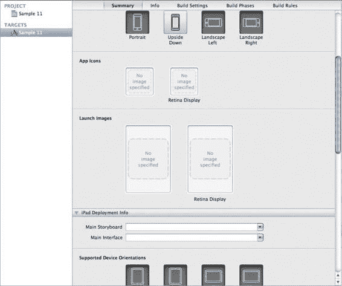

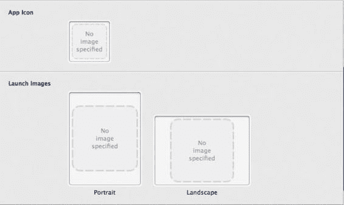

