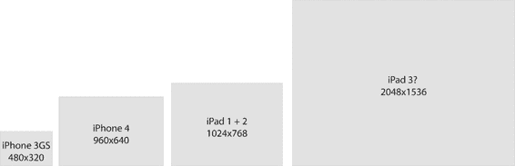
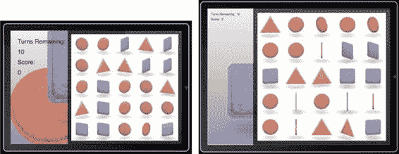
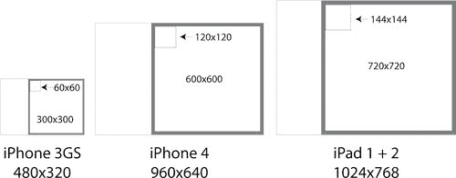
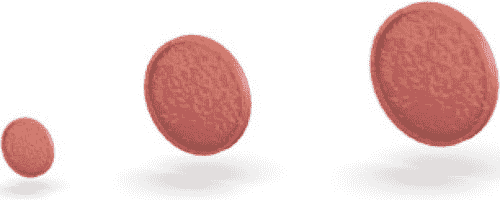
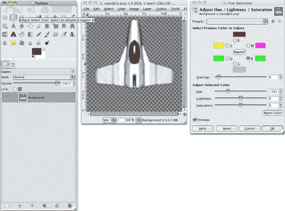
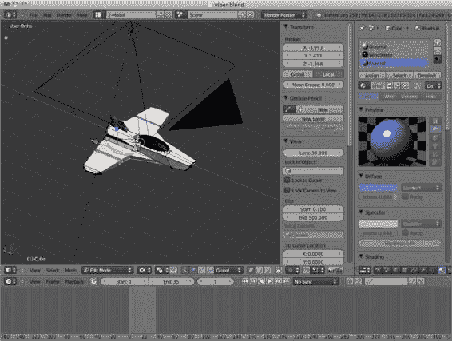
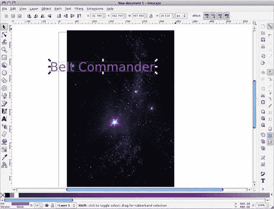

# 附录 A：设计与创建图形

### 多分辨率示例

让我们来看一个例子。假设你正在使用 Adobe Illustrator（或类似应用程序）为你的应用程序创建一个图标。如果你创建一个 57 点 x 57 点的新文件，你可以以 72 dpi 导出此文件，得到一个 57 像素 x 57 像素的图片，这正好适用于低分辨率 iPhone 图标。然后，你可以再次以 144 dpi 导出此图片，得到一个 114 像素 x 114 像素的图片，这对于 iPhone 的 Retina 版本来说完美。要为 iPad 制作图标，你可以再次以 92 dpi 导出，生成一个 72 像素 x 72 像素的图片。图 A-10 展示了以不同比例渲染与缩小图片之间的区别。

**图 A–10.** *渲染 vs 缩放*

在图 A-10 中，我们看到了图标的三个不同版本。中间是一个矢量表示，漂亮且光滑。左边是 Illustrator 在导出中间图片的 57x57 版本时生成的图片。该图片看起来有像素感，因为被放大了，以便我们能看清渲染质量。右边的图片是 Illustrator 创建了一个 114x114 的图片，然后由 GIMP 将其缩小到 57x57（Sinc Lanczos3）的结果。即使是这个简单的两步过程也引入了噪点。

#### 注意右侧字母 i 的点周围的浅色像素。  
在这种情况下，或许影响不大，但我觉得，如果你愿意花费时间（和金钱）创作高质量的艺术作品，那么额外花点功夫来避免这类问题是值得的。

遵循本章关于质量和渲染的理念，接下来将通过一个示例，引导你了解如何为应用程序选择最终的图像尺寸。

## 创建最终资源

我们已经了解了如何用多种分辨率表示图像，以及为何这很重要。但在游戏艺术方面，我们仍未解答一个问题：图像应该有多大？在本节中，我们将以一个同时在 iPad 和两种 iPhone 版本上运行的游戏为例，找出该游戏所用图像的最佳尺寸。我们将使用第 3 章“硬币分拣器”中的游戏。

由于我们要处理三种可能的图像尺寸——一种用于 iPad，两种用于 iPhone——因此需要查看这些屏幕的像素相对尺寸，以了解它们在尺寸上的差异。图 A-11 展示了不同的屏幕尺寸。

[www.it-ebooks.info](http://www.it-ebooks.info/)

**附录 A：设计与创建图形**

**299**

**图 A-11.** *不同屏幕的相对分辨率*  
在图 A-11 中，我们看到一个矩形代表市场上每款 iOS 设备的屏幕尺寸。最左边的图像是 iPhone 3GS（及其前两代）的尺寸。左数第二个矩形显示了 iPhone 4 的尺寸，其像素数量是 iPhone 3GS 的四倍。第三个矩形代表 iPad 1 和 iPad 2 的像素尺寸。请注意，iPhone 4 的像素数量几乎与 iPad 1 和 iPad 2 相当。最右边的矩形很可能是下一代 iPad 3（或任何其他名称）的分辨率。让我们看看这些不同尺寸如何影响我们在布局游戏时的决策。

## 屏幕可用空间

虽然我们有三种不同的屏幕尺寸（以像素计），但只有两种宽高比。两款 iPhone 的宽高比相同，均为 2:3，而 iPad 的宽高比为 3:4。针对这些差异，我们希望找出如何布局应用程序，以最佳方式利用屏幕空间。让我们从第 3 章中游戏的布局开始，如图 A-12 所示。

**图 A-12.** *iPhone（视网膜屏）和 iPad 上的硬币分拣器*  
在图 A-12 中，左侧是游戏在 iPhone 横屏模式下运行，右侧是游戏在 iPad 横屏模式下运行。两种情况下，我们都使用右侧被灰色边框包围的游戏区域。由于游戏区域是正方形，我们只需计算一个维度，但仍需根据游戏区域占用的空间，找出硬币图像的最佳尺寸。图 A-13 显示了这两个区域的大小以及它们与硬币尺寸的关系。

[www.it-ebooks.info](http://www.it-ebooks.info/)

**300**

**附录 A：设计与创建图形**

**图 A-13.** *游戏区域和硬币图像的相对尺寸（以像素计）*  
在图 A-13 中，我们看到了三个设备的屏幕尺寸。对于两款 iPhone 版本，带有粗灰色边框的白色游戏区域在点（`points`）上大小相同，都是 300x300。当然，iPhone 4 版本是 600x600 像素，而 iPhone 3GS 是 300x300 像素，但因为我们关心的是找到图像的最佳尺寸，所以我们关注的是像素，而不是点。iPad 1 和 iPad 2 右侧的游戏区域大小为 720 像素（也是 720 点）。因此，要计算每个硬币图像的尺寸，只需除以 5。我们得到：3GS 为 60x60，iPhone 4 为 120x120，iPad 为 144x144。图 A-14 显示了其中一个硬币图像在所有三种尺寸下的效果。

## **图 A–14.** *三种不同尺寸的硬币*

在图 A–14 中，我们看到文件 `coin_circle0029` 的三种不同版本。通过提供这些不同分辨率，我们确保图像能以 1:1 的像素比例（图像像素与屏幕像素一一对应）进行渲染。这保证了我们尽最大努力来渲染这些图像。接下来，我们来了解一些用于创建图形资源的工具。

## **工具**

以下是三款可用于创建精美图形资源的开源图形工具的简要介绍。这些工具是我在本书中创作大部分美术文件时使用的。这些工具不仅是开源的，而且可以在 Windows、OS X、Linux 以及其他平台上运行。

[www.it-ebooks.info](http://www.it-ebooks.info/)

**附录 A：设计与创建图形**

**301**

## **GIMP**

GNU 图像处理程序（简称 GIMP）是一款开源的图像编辑应用程序。它提供了类似 Adobe Photoshop 的功能，而价格却低至免费。在游戏开发过程中，我们有必要拥有一款图像处理程序来处理众多任务。图 A–15 展示了 GIMP 的一个示例。

**图 A–15.** *在 GIMP 中调整飞船颜色*

在图 A–15 中，我们看到了前面章节中的飞船在 GIMP 中打开的样子。GIMP 允许你调整图像的颜色以生成其变体。在图 A–15 中，我们从一个具有蓝色高光的飞船开始，并将其转换为绿色，或许是为了实现多人游戏场景。

使用 GIMP (www.gimp.org)，你可以：

- 查看图像
- 裁剪图像
- 调整图像大小
- 调整颜色

[www.it-ebooks.info](http://www.it-ebooks.info/)

**302**

**附录 A：设计与创建图形**

- 合并图像
- 精细调整图像
- 执行游戏开发中其他上千种与图像相关的任务

## **Blender 3D**

Blender 3D 是一款用于创建 3D 动画和辅助 3D 游戏开发的 3D 建模工具。对于 2D 游戏开发，Blender 提供了一种创建风格非常统一的美术资源的绝佳方式。我个人画画不太好，但我已经学会了如何在 Blender 中“绘制”物体，并让它完成应用光照、阴影、反射以及从光线追踪图像中获得的其它酷炫效果等艰巨工作。图 A–16 展示了 Blender 的界面。

**图 A–16.** *Blender 3D*

在图 A–16 中，我们看到的是 Blender 的用户界面。老实说，Blender 需要学习的东西很多。但掌握这个应用程序的每一个新技术都非常有成就感。Blender 的开发者最近对整个应用程序进行了改造，使其更易于使用。如果你过去尝试过 Blender 但感到沮丧，请再给它一次机会。它现在好用多了。

[www.it-ebooks.info](http://www.it-ebooks.info/)

**附录 A：设计与创建图形**

**303**

使用 Blender (www.blender.org)，你可以：

1. 创建在游戏中用作角色的 2D 图像
2. 为过场动画预渲染高质量影片
3. 渲染高质量背景图像
4. 渲染图像序列以创建动画角色
5. 创建等距瓦片集

## **Inkscape**

Inkscape 是一款矢量绘图应用程序。虽然大多数游戏在运行时不会大量使用矢量绘图，但矢量编辑应用程序非常擅长进行所见即所得的布局。

对于使用 GIMP 和 Blender 创建的所有精美艺术品的布局，Inkscape 无与伦比。图 A–17 展示了 Inkscape 应用程序。

**图 A–17.** *Inkscape*

[www.it-ebooks.info](http://www.it-ebooks.info/)

**304**

**附录 A：设计与创建图形**

该图展示了我为《Belt Commander》应用程序欢迎界面所做的早期布局工作。如你所见，我导入了贯穿本书使用的星空背景图像，并开始添加标题文本。

使用 Inkscape (http://inkscape.org)，你可以：

1. 创建文本图像

