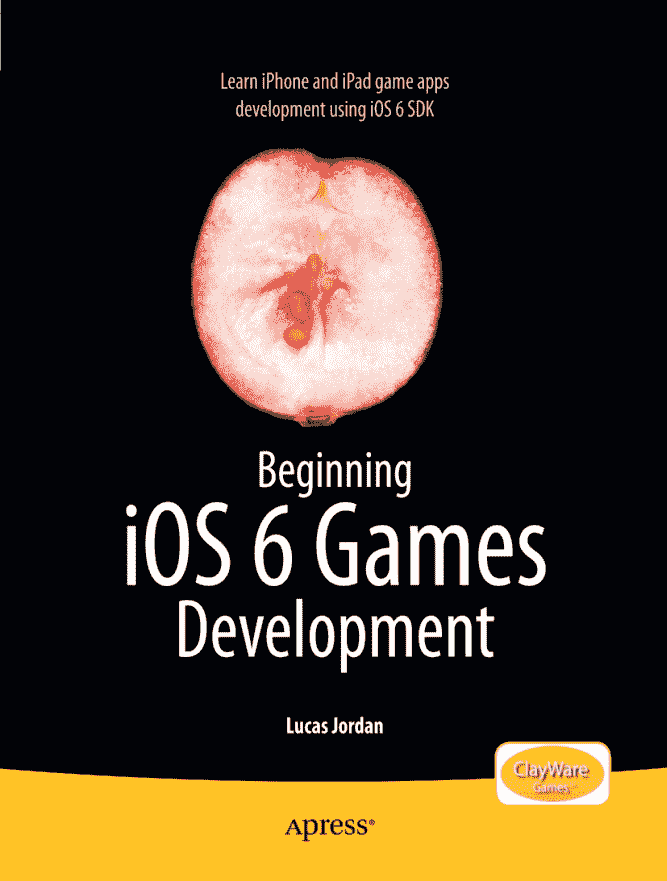

# iOS6 游戏开发入门

**卢卡斯·乔丹**

**iOS6 游戏开发入门**

版权所有 © 2012，卢卡斯·乔丹

本作品受版权保护。出版商保留所有权利，无论涉及材料的全部或部分，特别是翻译、重印、重用插图、朗诵、广播、缩微胶片复制或任何其他物理方式，以及电子信息存储与检索、电子改编、计算机软件，或当今已知或未来开发的类似或不同方法的权利。与本评论或学术分析相关的简短摘录，或专门为在计算机系统上输入和执行而提供、仅供作品购买者使用的材料，不受此法律限制。仅允许在出版商所在地现行版权法的规定下复制本出版物或其部分内容，并且必须始终从 Springer 获得使用许可。使用许可可通过 Copyright Clearance Center 的 RightsLink 获取。违反行为将根据相应的版权法受到起诉。

ISBN-13（平装本）：978-1-4302-4422-6

ISBN-13（电子版）：978-1-4302-4423-3

本书中可能出现商标名称、徽标和图像。我们没有在每次出现商标名称、徽标或图像时使用商标符号，而是仅以编辑方式使用这些名称、徽标和图像，以惠及商标所有者，并无意侵犯商标。

本出版物中使用的商品名、商标、服务标志和类似术语，即使未明确标识，也不应被视为对其是否受所有权保护的表达。

尽管本书中的建议和信息在出版时被认为是真实准确的，但作者、编辑和出版商均不对可能出现的任何错误或遗漏承担法律责任。出版商对本书所含内容不作任何明示或暗示的保证。

总裁兼出版人：保罗·曼宁

首席编辑：史蒂夫·安格林

开发编辑：汤姆·韦尔什

技术审校：托尼·希勒森

编辑委员会：史蒂夫·安格林、尤安·白金汉、加里·康奈尔、路易丝·科里根、摩根·埃特尔、乔纳森·格尼克、乔纳森·哈塞尔、罗伯特·哈钦森、米歇尔·洛曼、詹姆斯·马克汉姆、马修·穆迪、杰夫·奥尔森、杰弗里·佩珀、道格拉斯·庞迪克、本·雷诺-克拉克、多米尼克·沙克沙夫特、格温南·斯皮林、马特·韦德、汤姆·韦尔什

协调编辑：凯蒂·沙利文

文字编辑：卡罗尔·伯格利

排版：SPi Global

索引制作：SPi Global

美工：SPi Global

封面设计：安娜·伊什琴科

全球图书贸易发行由 Springer Science+Business Media New York 负责，地址：233 Spring Street, 6th Floor, New York, NY 10013。电话：1-800-SPRINGER，传真：(201) 348-4505，电子邮件：`orders-ny@springer-sbm.com`，或访问：`www.springeronline.com`。

有关翻译信息，请发送电子邮件至：`rights@apress.com`，或访问：`www.apress.com`。

Apress 和 friends of ED 的图书可用于学术、企业或促销用途的批量购买。大多数图书也提供电子版和许可证。如需更多信息，请参考我们的批量销售与电子书许可网页：`www.apress.com/bulk-sales`。

作者在本文中引用的任何源代码或其他补充材料，读者可在 `www.apress.com` 获取。有关如何查找图书源代码的详细信息，请访问 `www.apress.com/source-code`。

*献给做自己老板的人。*

