# 第 1 章：第一个简单游戏

在本章中，你将学习许多关于 iOS 开发的知识。目标当然是能够构建一个在 iOS 上运行的游戏。为此，你必须了解一个完整游戏所包含的许多不同元素，例如基本 UI 控件、音频、复杂触摸输入、游戏中心、应用内购买，当然还有图形。本书将探讨这些概念以及其他许多内容。你可以将其视为一份构建块指南，这些构建块是你制作一个引人入胜的、专为 iOS 和 Apple 移动设备量身定制的游戏所必需的。所有 iOS 应用都有一个共同点——应用程序 `Xcode`，因此从它开始是合理的。

在第一章中，我们将构建一个非常简单的石头-剪刀-布游戏。我们将使用 `Xcode` 的 Storyboard 功能来创建一个包含两个视图以及它们之间导航的应用。

本书附带示例 Xcode 项目，所有代码示例均直接取自这些项目。这样，您便可以在 Xcode 中逐一跟进。我在创建本书项目时使用了 Xcode 4.5 版本。本章附带的项目名为 `Sample 1`；您只需按照本章概述的步骤操作，即可轻松自行构建。

该项目是一个非常简单的游戏，我们使用 Storyboard 创建了两个场景。第一个场景是起始视图，第二个场景是用户玩“石头、剪刀、布”游戏的地方。在第二个场景中，您将添加一个 `UIView` 并指定其类为 `RockPaperScissorView`。类 `RockPaperScissorView` 的源代码可以在 `Sample 1` 项目找到。

我们将逐步介绍这些步骤，但首先让我们快速浏览一下我们的游戏，如 图 1-1 所示。

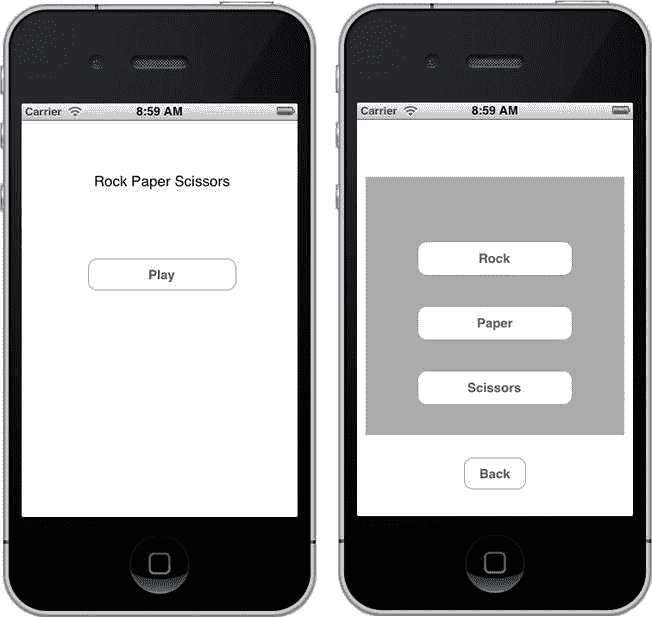

图 1-1.  我们的第一个游戏的两个视图：`Sample 1`

在 图 1-1 的左侧，我们看到起始视图。它只有一个简单的标题和一个“Play”按钮。当用户点击“Play”按钮时，会转换到图右侧所示的第二个视图。在此视图中，用户可以玩“石头、剪刀、布”。如果用户希望返回起始视图（即主屏幕），可以按下“Back”按钮。这个简单的游戏由 Xcode 中的 Storyboard 布局和一个实现游戏逻辑的自定义类组成。

让我们来看看我如何创建这个游戏，以及一些自定义项目的方法。

## 在 Xcode 中创建项目：`Sample 1`

创建这个游戏只需几个步骤，我们将通过它们来初步了解 Xcode。

首先启动 Xcode。从“File”菜单中选择“New Project”。您将看到一个屏幕，显示可以用 Xcode 创建的项目类型（参见 图 1-2）。

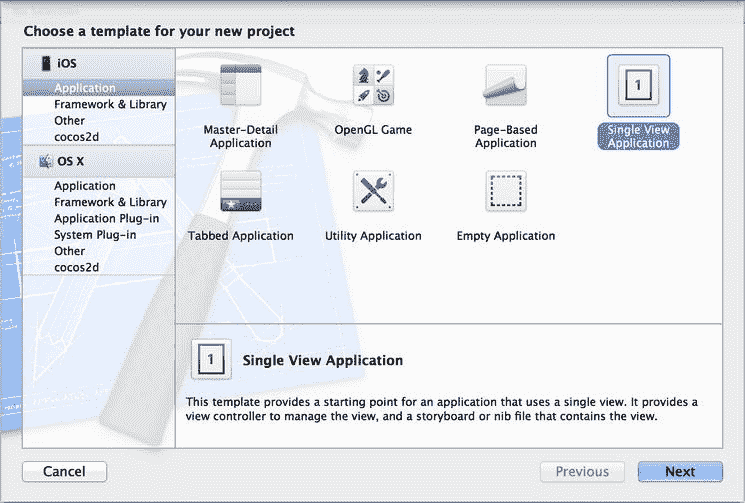

图 1-2.  Xcode 中的项目模板

对于此项目，选择模板“Single View Application”。点击“Next”，系统将提示您为项目命名，如 图 1-3 所示。

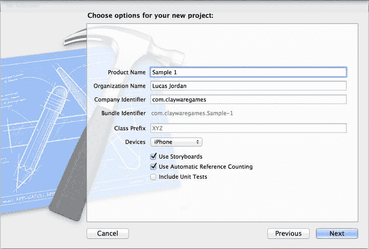

图 1-3.  命名 Xcode 项目

为您的项目起任何名字。您给项目起的名字将是包含它的根文件夹的名称。您还需要确保选中“Use Storyboard”和“Use Automatic Reference Counting”。

这次我们将制作一个仅适用于 iPhone 的应用程序，但从“Device Family”下拉菜单中，您也可以选择“iPad”或“Universal”。点击“Next”后，系统会提示您选择一个位置来保存项目。项目可以保存在您电脑上的任何位置。

在继续之前，让我们花点时间来了解一下 Xcode 项目的组织结构。

### 项目的文件结构

保存新项目后，Xcode 会在您选择的文件夹中创建一个新的单一文件夹。这个单一文件夹将包含该项目。如果需要，您以后可以移动此文件夹，而不会影响项目。图 1-4 显示了由 Xcode 创建的文件。

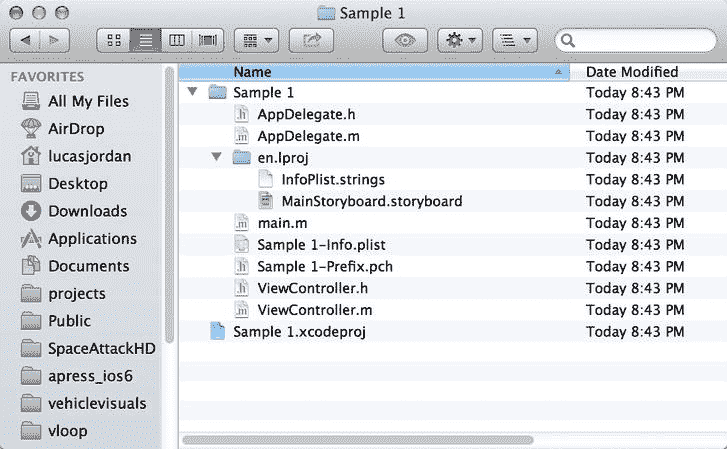

图 1-4.  Xcode 创建的文件

在 图 1-4 中，我们看到一个 Finder 窗口，显示了创建的文件结构。我选择了将项目保存在桌面上，因此 Xcode 创建了一个名为 `Sample 1` 的根文件夹，其中包含 `Sample 1.xcodeproj` 文件。`xcodeproj` 文件是向 Xcode 描述项目的文件，所有资源默认都相对于该文件。保存项目后，Xcode 会自动打开您的新项目。然后，您可以根据需要开始自定义它。

### 自定义您的项目

我们已经了解了如何创建项目。现在，在继续添加实现游戏逻辑的新 `UIView` 之前，您将学习一些使用 Xcode 自定义项目的知识。

### 排列 Xcode 视图以简化操作

创建新项目后，您可以开始自定义它。此时，您的 Xcode 应该已经打开并显示了新项目。继续点击左侧的 `MainStoryboard.storyboard` 文件，使您的项目看起来像 图 1-5。

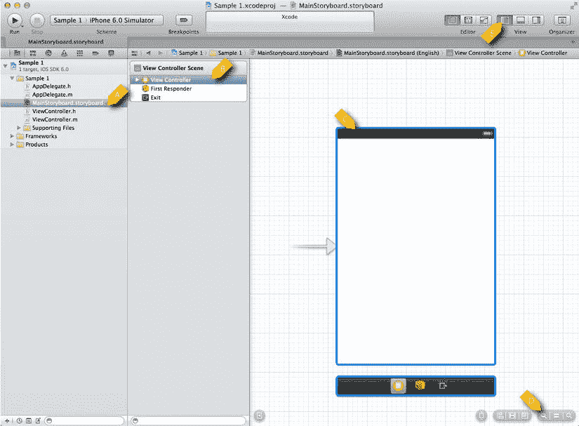

图 1-5.  自定义前的 `MainStoryboard.storyboard`

在 图 1-5 中，我们看到选中了 `MainStoryboard.storyboard` 文件（项目 A）。该文件用于描述多个视图以及它们之间的导航关系。它显示选中的 storyboard 文件，并描述屏幕右侧的内容。在项目 B 中，我们看到一个名为“View Controller”的项目。这是项目 C 中描述的视图的控制器。项目 D 处的项目用于放大和缩小 storyboard 视图，对于成功导航至关重要。此外，项目 E 中的按钮用于控制 Xcode 中哪些主面板可见。随意操作这些按钮。

接下来，让我们看看如何添加一个新视图。

### 添加新视图

当您有机会尝试 Xcode 中可用的不同视图设置后，就可以继续为项目添加新视图了。排列 Xcode，使最右侧的面板可见，如果需要，可以隐藏最左侧的面板。Xcode 应该看起来像 图 1-6。

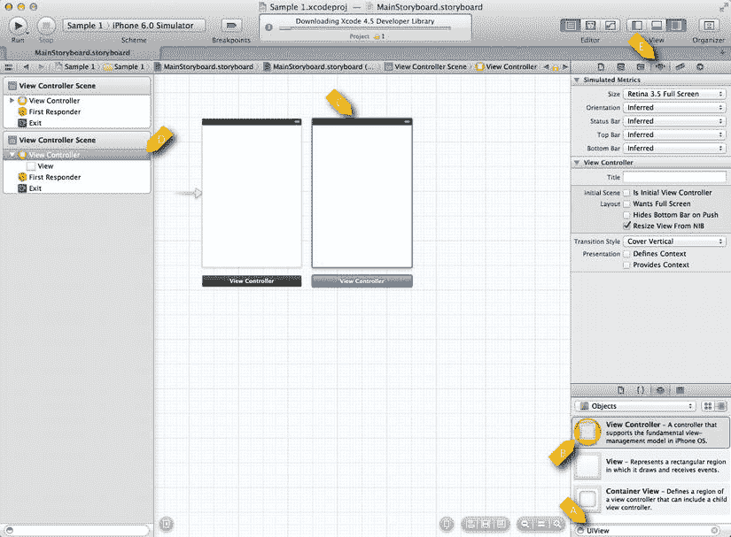

图 1-6.  包含第二个视图的 Storyboard

在 图 1-6 中，我们看到已向 storyboard 添加了第二个视图。像任何优秀的 Apple 桌面应用程序一样，大部分工作都是通过拖放完成的。要添加第二个视图，我们在右下角的文本字段（项目 A）中输入“UIView”。这会过滤列表，以便我们可以将标记为项目 B 的图标拖到中央的工作区域。点击新视图以选中它（参见项目 C），我们可以看到它与项目 D 中选中的图标相对应。项目 E 显示选中项目的属性。

现在我们的项目中有了一个新视图，我们想要设置一种在视图之间导航的方式。

### 简单导航

我们现在想要创建一些按钮，使我们能够从一个视图导航到另一个视图。第一步是添加按钮，第二步是配置导航。图 1-7 展示了这些视图正在连接导航。

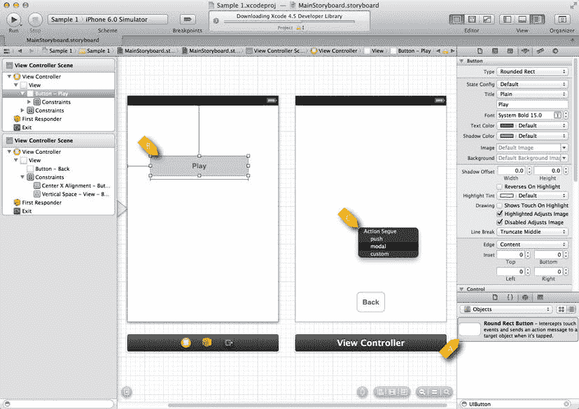

图 1-7.  包含导航的 Storyboard

在 Figure 1-7 中，我们看到已将`UIButton`从库项目 A 拖到每个视图上。我们将左侧的`UIButton`标记为“Play”，右侧的`UIButton`标记为“Back”。要使“Play”按钮导航到右侧视图，我们从“Play”按钮（项目 B）向右拖动到右侧视图，并在项目 C 处释放。此时，会弹出一个上下文对话框，允许我们选择所需的过渡类型。我选择了“Modal”。我们可以对“Back”按钮重复此过程：将其向右拖动到左侧视图，并选择返回所需的过渡。此时您可以运行应用程序，并在两个视图之间导航。然而，为了使其成为一个游戏，我们需要包含“Rock, Paper, Scissors”视图和按钮。

### 添加 Rock, Paper, Scissors 视图

要添加“Rock, Paper, Scissors”视图，我们需要从示例代码中包含一个类到您正在构建的项目中。最简单的方法是打开示例项目，并将文件`RockPaperScissorsView.h`和`RockPaperScissorsView.m`从示例项目拖到您的新项目中。Figure 1-8 显示了将文件拖入 Xcode 项目时弹出的对话框。

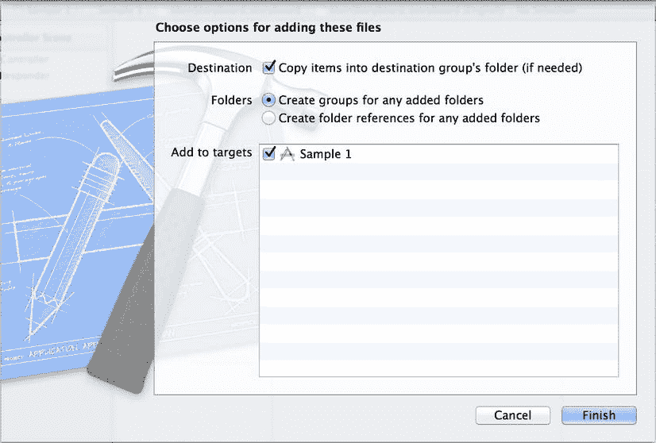

*Figure 1-8. 将文件拖入 Xcode 项目*

在 Figure 1-8 中，我们看到一个对话框，确认我们要将新文件拖入 Xcode 项目。请确保勾选“Destination”复选框。否则，Xcode 不会将文件复制到目标项目的位置。最好将所有项目资源保留在项目的根文件夹中。Xcode 足够灵活，并不强制您这样做，但我曾多次因这种灵活性而吃亏。好了，既然我们已将所需的类添加到项目中，接下来就让我们连接界面以包含它。

## 自定义 UIView

准备简单应用程序的最后一步是在界面中创建一个属于`RockPaperScissorsView`类的新`UIView`。Figure 1-9 展示了如何做到这一点。

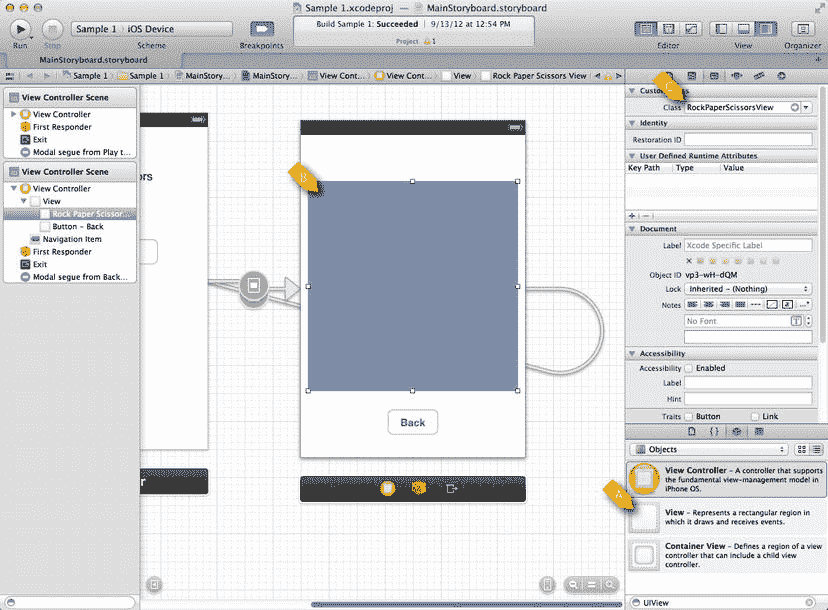

*Figure 1-9. 自定义的 UIView*

在 Figure 1-9 中，我们看到在右侧视图中添加了一个`UIView`。我们通过将项目 A 中的图标拖到项目 B 中的故事板上来实现。调整新`UIView`的大小后，我们将其类设置为`RockPaperScissorsView`，如项目 C 所示。至此，技术上我们已经完成了。我们创建了我们的第一个游戏！显然，我们还没有查看`RockPaperScissorsView`的实现，这将在下一章讨论。

本书的其余部分将以示例 1 作为起点。您将学习许多新技术来定制一个简单的应用程序，以制作一个真正完整的游戏。

## 总结

在本章中，我们快速浏览了 Xcode，学习了如何用它创建项目，并使用 Storyboard 构建简单的导航。后续章节将在这些基础知识上补充内容，向您展示如何构建一个完整的游戏。

## 第二章 设置您的游戏项目

与所有软件项目一样，iOS 游戏开发受益于良好的开端。在本章中，我们将讨论设置一个新的 Xcode 项目，作为许多游戏的合适起点。这将包括创建一个可用于在 iPhone 和 iPad 上部署的项目，同时处理横屏和竖屏方向。

我们将研究 iOS 应用程序是如何初始化的，以及我们可以在何处开始自定义行为，以匹配我们对应用程序应该如何执行的期望。我们还将探索 iOS 应用程序中用户界面(UI)元素的创建和修改方式，特别关注管理不同设备和方向。

我们将在本章创建的游戏与第一章中的简单示例非常相似——事实上，玩法完全相同。但我们将为后续章节打下基础，同时练习一些关键技巧，例如使用`UIViewControllers`和 Interface Builder。

我们将探索 iOS 应用程序是如何组合在一起的，并解释关键的类。我们还将创建新的 UI 元素，并学习如何使用 Interface Builder 自定义它们。我们还将探索使用 MVC 模式创建灵活、可重用的代码元素。到本章结束时，我们将创建如图 Figure 2-1 所示的“Rock, Paper, Scissors”应用程序。

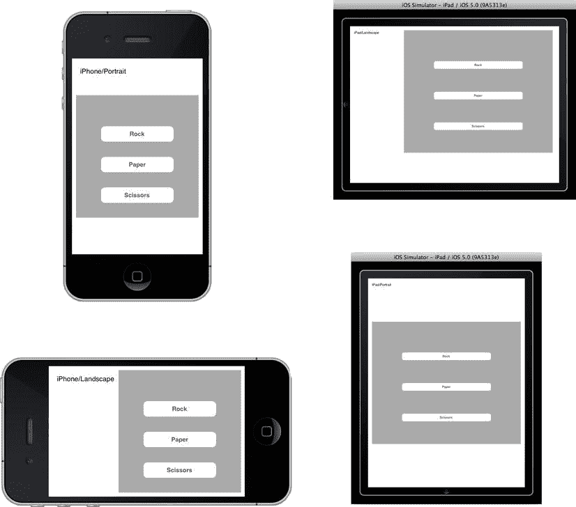

*Figure 2-1. 适用于 iPhone 和 iPad 所有方向的应用程序设计*

Figure 2-1 展示了在 iPhone 和 iPad 模拟器上运行的应用程序。这是一个所谓的通用应用程序：它可以在这两种设备上运行，并以此方式在 App Store 中呈现。除非有特定的商业理由编写仅适用于 iPhone 或 iPad 的应用程序，否则将您的应用程序做成通用版是很有意义的。即使您最初只打算在其中一个设备上发布应用，从长远来看，这也会为您节省时间。

我们的示例应用程序非常简单，以至于可能很难看出 Figure 2-1 中呈现的四种状态之间的差异。在左上角（iPhone 竖屏方向），灰色区域的位置与左下角 iPhone 横屏时的布局不同。文本的布局也不同。应用程序在 iPad 上运行时，横屏与竖屏的情况也是如此。让我们开始了解如何设置一个项目来适应这些不同的设备和方向。

### 创建您的游戏项目

要开始我们的示例游戏，我们首先必须在 Xcode 中创建一个新项目。

通过选择 File ➤ New ➤ New Project...来创建一个新项目。这将打开一个向导，允许您选择所需项目的类型，如 Figure 2-2 所示。

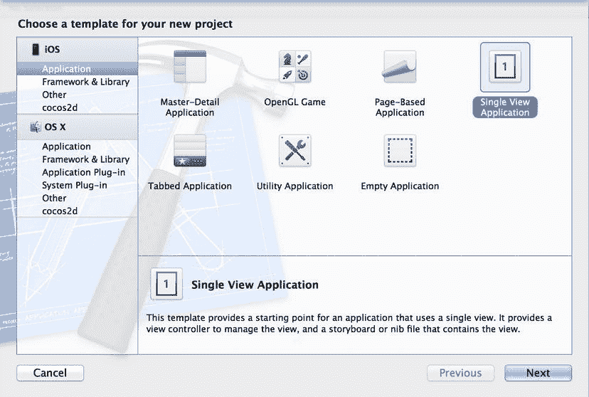

*Figure 2-2. 创建新的 Single View Application*

在 Figure 2-2 的左侧，我们从 iOS 部分选择了 Application。右侧是可用于创建 iOS 应用程序的项目类型。这里提供的选择通过为开发人员提供一个合理的起点来帮助他们。这对于刚接触 iOS 的开发人员尤其有帮助，因为这些模板为多种常见的应用导航风格提供了起点。我们将选择 Single View Application，因为我们只需要一个非常简洁的起点，并且 Single View Application 为通用应用程序提供了良好的支持。点击 Next 后，我们看到 Figure 2-3 所示的选项。

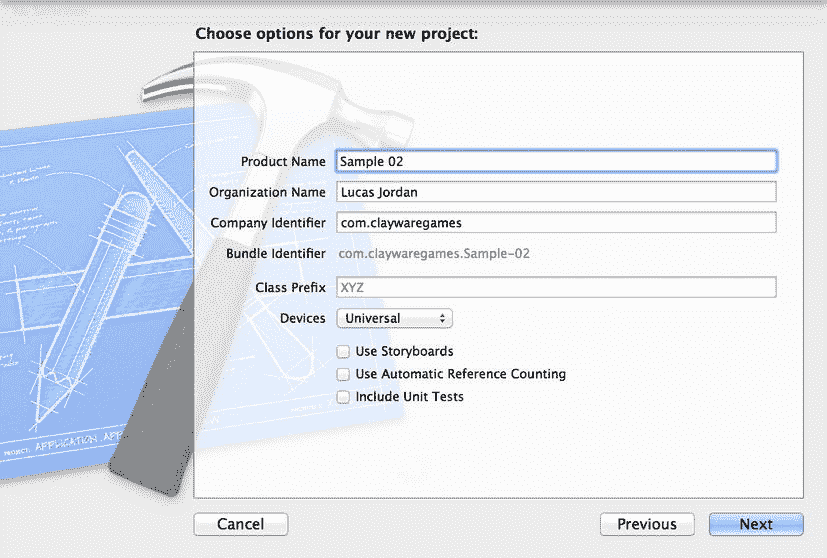

*Figure 2-3. 新项目的详细信息*

我们要做的第一件事是命名我们的产品。您可以选择任何您喜欢的名称。公司标识符将在应用提交过程中用于标识应用。您可以输入任何值作为公司标识符，但通常的做法是使用反向域名。如 Figure 2-3 所示，Bundle Identifier 是产品名称和公司标识符的组合。Bundle Identifier 稍后可以更改——向导只是显示默认值。当您将游戏提交到 App Store 时，Bundle Identifier 用于指示您正在上传的是哪个应用程序。

