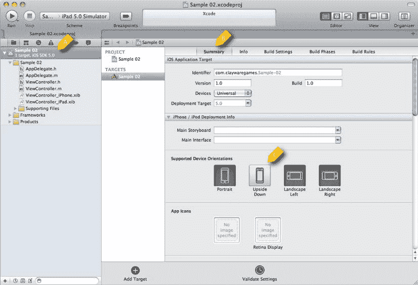
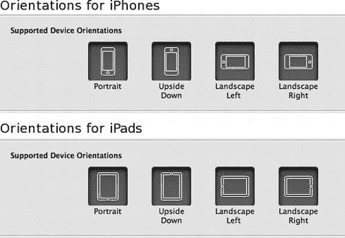
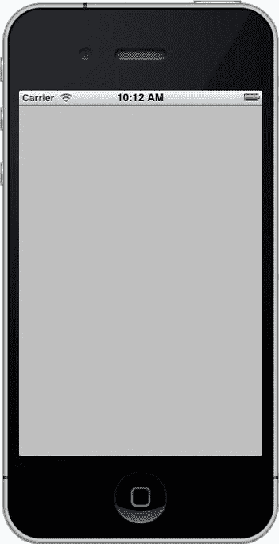
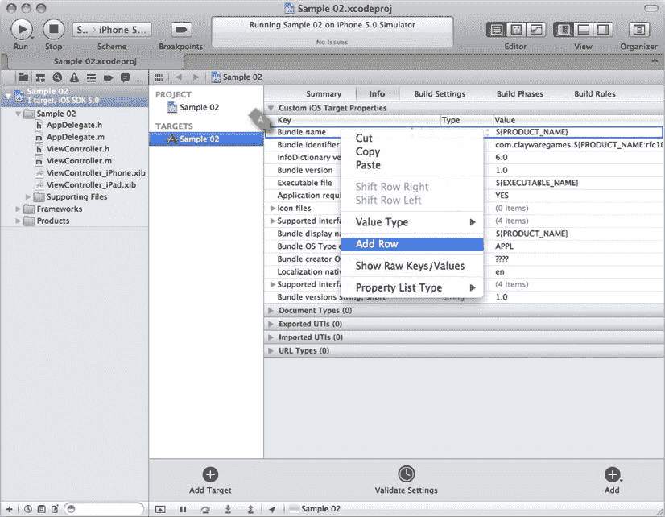
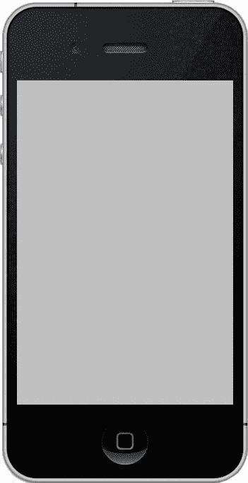

# 在设备列表中选择"通用"(Universal)，即告知 Xcode 创建一个可在 iPhone 和 iPad 上同时运行的项目

在本例中，我们将不会使用 Storyboard 或自动引用计数（Automatic Reference Counting）。同样地，我们也不会创建任何单元测试，因此"包含单元测试"(Include Unit Tests)选项也应取消勾选。点击"下一步"(Next)会提示您保存项目。Xcode 会在所选目录中创建一个新文件夹，因此如果不需要，您无需手动创建文件夹。当新项目保存完成后，您将看到类似图 2-4 的界面。



图 2-4.  新创建的项目

在图 2-4 的左侧，有一个包含项目元素的树状结构，其中根元素处于选中状态 (A)。在右侧，则选中了"摘要"(Summary)标签页 (B)。在"摘要"标签页中，我们需要选择支持的设备方向 (C)。要支持每种设备上的两种方向，请点击"倒置"(Upside Down)按钮。向下滚动，并确保 iPad 的所有方向也都已按下。图 2-5 显示了正确的设置。既然项目已经创建完成，现在就可以开始根据我们的需求对其进行定制了。



图 2-5.  支持所有设备方向

## 定制通用应用程序

为了理解我们将要对这个项目进行的定制，有必要先了解我们的起点。这个空项目本身即可运行，尽管它显然并不有趣。花点时间运行一下这个应用程序。它看起来会类似于图 2-6 中运行的应用。接下来，我们将移除状态栏，并探索在项目中开始添加自定义代码的最佳位置。



图 2-6.  一个全新的通用 iOS 应用程序

在图 2-6 中，我们看到一个全新的通用应用正在 iPhone 模拟器上运行。要在 iPad 模拟器上运行该应用，请从 Xcode 中停止按钮右侧的方案下拉菜单中选择 iPad 模拟器。正如我们所见，这个应用是空的，只有一个灰色背景。另外值得注意的是，应用顶部的状态栏是显示的。尽管在应用中包含状态栏有很多充分的理由，但许多游戏开发者可能希望移除状态栏，以营造更具沉浸感的体验。要移除状态栏，请点击项目导航器（Xcode 左侧的树状结构）中的根元素。选择目标（Target），然后点击右侧的"信息"(Info)标签页。图 2-7 显示了正确的视图。



图 2-7.  配置状态栏

当您看到图 2-7 所示的视图后，右键点击最顶部的元素 (A) 并选择"添加行"(Add Row)。这将在项目列表中添加一个新元素。您需要将键值设置为 `"Status bar is initially hidden"`，并将值设置为 `"Yes."`。您在这里所做的实际上是编辑位于 Supporting Files 分组下的 `plist` 文件。Xcode 只是为您提供了一个友好的界面来编辑这个配置文件。

**提示**  导航到 Supporting Files 分组下以 `info.plist` 结尾的文件。右键点击它，选择"打开方式"➤"源代码"(Open As ➤ Source Code)。这将向您展示 `plist` 文件的源码内容。请注意，这些键值实际上是以常量的形式存储的，而不是 Info 编辑器中使用的可读文本。

当我们再次运行应用程序时，状态栏就被移除了，如图 2-8 所示。



图 2-8.  移除状态栏后的默认应用程序

既然我们已经探索了一种开始定制应用的简单方法，那么接下来是时候研究一下 iOS 应用是如何组合起来的，以便我们能够明智地决定如何添加自己的功能。

## iOS 应用程序的初始化过程

众所周知，iOS 应用程序主要用 Objective-C 编写，而 Objective-C 是 C 语言的超集。Xcode 很好地隐藏了应用的构建细节，但在底层，我们知道它使用了 LLVM 和其他常见的 Unix 工具来完成实际工作。由于我们知道项目本质上是一个 C 应用程序，因此可以预期应用程序的入口点是一个 C 语言的 `main` 函数。事实上，如果你查看 Supporting Files 分组，你会找到 `main.m` 文件，如代码清单 2-1 所示。

**代码清单 2-1.**  `main.m`

```objective-c
#import <UIKit/UIKit.h>

#import "AppDelegate.h"

int main(int argc, char *argv[])
{
    @autoreleasepool {
        return UIApplicationMain(argc, argv, nil, NSStringFromClass([AppDelegate class]));
    }
}
```

代码清单 2-1 中的 `main` 函数是一个 C 函数，但你会注意到函数体明显是 Objective-C 语法。一个 `@autoreleasepool` 包裹着对 `UIApplicationMain` 的调用。`@autoreleasepool` 为这个应用程序设置了内存管理上下文，我们无需过分担心这一点。`UIApplicationMain` 函数为你做了很多有用的事情：它通过查看你的 `info.plist` 文件来初始化应用程序，建立一个事件循环，并通常能让一切以正确的方式启动。事实上，我从未有过修改这个函数的理由，因为 iOS 提供了一个明确的位置来开始添加你的启动代码。添加初始化代码的最佳位置是在应用委托类的实现文件中的 `application:didFinishLaunchingWithOptions:` 任务里。在这个例子中，应用委托类名为 `AppDelegate`。代码清单 2-2 展示了来自 `AppDelegate.m` 的 `application:didFinishLaunchingWithOptions:` 任务的实现。

**代码清单 2-2.**  `application:didFinishLaunchingWithOptions:`:

```objective-c
- (BOOL)application:(UIApplication *)application didFinishLaunchingWithOptions:(NSDictionary *)launchOptions
{
    self.window = [[[UIWindow alloc] initWithFrame:[[UIScreen mainScreen] bounds]] autorelease];
    // Override point for customization after application launch.
    if ([[UIDevice currentDevice] userInterfaceIdiom] == UIUserInterfaceIdiomPhone) {
        self.viewController = [[[ViewController_iPhone alloc] initWithNibName:@"ViewController_iPhone" bundle:nil] autorelease];
    } else {
        self.viewController = [[[ViewController_iPad alloc] initWithNibName:@"ViewController_iPad" bundle:nil] autorelease];
    }
    self.window.rootViewController = self.viewController;
    [self.window makeKeyAndVisible];
    return YES;
}
```

当一个应用程序完全初始化并准备好开始运行构成它的代码时，`application:didFinishLaunchingWithOptions:` 任务就会被调用，如代码清单 2-2 所示。这个任务除了名字特别长之外，还接收一个 `UIApplication` 实例和一个 `NSDictionary` 作为参数。`UIApplication` 是一个代表正在运行的应用程序状态的对象。接收此消息的 `AppDelegate` 实例是 `UIApplication` 对象的委托。这意味着我们通过在 `AppDelegate` 中实现任务来修改应用程序的行为。`AppDelegate` 所实现的协议 `UIApplicationDelegate` 定义了那些将代表应用程序被调用的任务。


