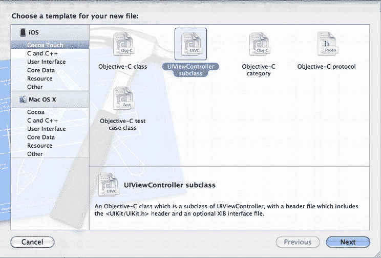
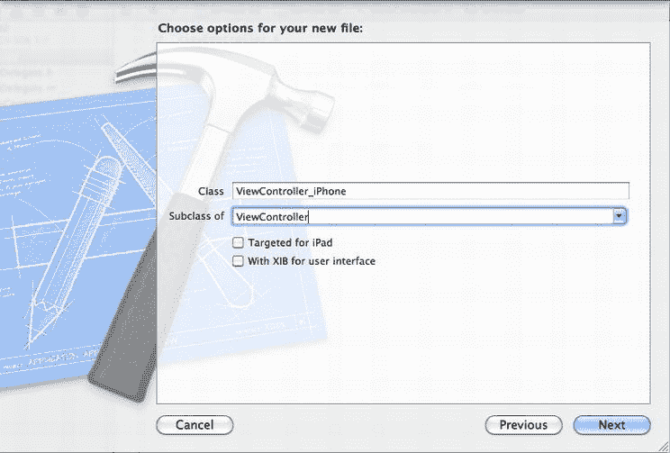
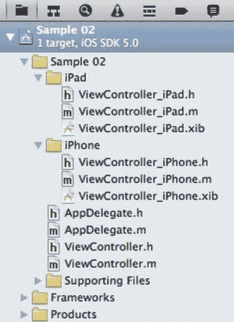

# 排版后的内容

如果我们来看一下 `application:didFinishLaunchingWithOptions:` 的实现，我们首先会创建一个新的 `UIWindow`，其大小与屏幕尺寸相同。一旦 `UIWindow` 被实例化，我们就需要创建一个 `UIViewController` 来管理我们应用程序的用户界面。像我们刚创建的这个新 Xcode 项目，一开始会有一个单独的 `ViewController` 类来管理我们的用户界面。我们将为 `ViewController` 创建设备特定的子类，这样就有了存放设备特定代码的空间。稍后我们会介绍创建这些子类的过程。为了确保我们实例化正确的 `ViewController` 子类，我们需要添加 清单 2-2 中加粗的代码。

一旦 `ViewController` 被创建，我们将其设置为 `window` 的 `rootViewController`，并调用 `makeKeyAndVisible`。这个 window 对象是 `UIWindow` 的一个实例，也是应用程序的根图形组件。`makeKeyAndVisible` 任务本质上就是显示该窗口。我们添加到应用程序中的任何自定义组件，都将是这个 `window` 对象的子视图。

如果你的应用程序需要在用户界面加载之前完成配置，你应该将那些初始化代码放在调用 `makeKeyAndVisible` 之前。这可能包括读取应用程序特定的配置文件、初始化数据库、设置位置服务，或任何其他操作。

接下来，我们将在查看 Interface Builder 的具体细节之前，先大致了解一下 iOS 应用程序中的用户界面是如何组织的。

## 理解 UIViewControllers

iOS 开发及其相关库大量使用了模型-视图-控制器（MVC）模式。总的来说，MVC 是一种将表现层（View）、数据（Model）和业务逻辑（Controller）分离的策略。具体来说，模型就是数据，比如一个 `Person` 类或一个 `Address`。视图负责将数据渲染到屏幕上。在 iOS 开发中，这意味着 `UIView` 的一个子类。iOS 提供了一个特殊的类来充当 `UIView` 的控制器，这个类恰如其分地被命名为 `UIViewController`。

`UIViewController` 有两个关键特征：它通常与一个 XIB 文件相关联，并且它有一个名为“view”的属性，类型为 `UIView`。通过创建 `UIViewController` 的子类，我们也可以创建一个与类同名的 XIB 文件。默认情况下，当你实例化一个 `UIViewController` 子类时，它会加载一个同名的 XIB。XIB 中的根 `UIView` 会被连接为 `UIViewController` 的 `view` 属性。

除了提供用户界面布局与其驱动逻辑之间的清晰分离之外，iOS 还提供了许多期望与其他 `UIViewControllers` 而非 `UIViews` 一起工作的 `UIViewController` 子类。一个例子是 `UINavigationController`，它实现了在“设置”应用中找到的那种导航方式。在代码中，当你想前进到下一个视图时，你传递的是一个 `UIViewController` 而不是一个 `UIView`，尽管屏幕上显示的是 `UIViewController` 的 `view` 属性。

不可否认，对于我们本章的示例应用来说，使用 `UIViewController` 并没有太大区别。在第 1 章中，我们创建 `RockPaperScissorsView` 类时扩展了 `UIView`，并且效果良好。然而，理解 `UIViewControllers` 及其视图如何协同工作，将让我们在第 3 章（我们将探讨游戏的应用生命周期）中更轻松。

使用第 1 章中的 `RockPaperScissorsView`，让我们来看看如果将此功能实现为 `UIViewController` 会是什么样子。清单 2-3 展示了文件 `RockPaperScissorsController`。

**清单 2-3.**  `RockPaperScissorsController.h`

```
@interface RockPaperScissorsController : UIViewController {
    UIView* buttonView;
    UIButton* rockButton;
    UIButton* paperButton;
    UIButton* scissersButton;

    UIView* resultView;
    UILabel* resultLabel;
    UIButton* continueButton;

    BOOL isSetup;
}
-(void)setup:(CGSize)size;
-(void)userSelected:(id)sender;
-(void)continueGame:(id)sender;

-(NSString*)getLostTo:(NSString*)selection;
-(NSString*)getWonTo:(NSString*)selection;
@end
```

在清单 2-3 中，我们看到类 `RockPaperScissorsController` 扩展了 `UIViewController`。除其他事项外，这意味着 `RockPaperScissorsController` 有一个名为 `view` 的属性，该属性将是此控制器的根 `UIView`。与 `RockPaperScissorsView` 相同，我们会有其他作为根 `view` 子视图的 `UIViews`，例如用于选择选项的按钮。虽然这些按钮理论上可能拥有自己的 `UIViewControllers`，但最终会有一个点让允许一个 `UIViewController` 管理所有与其相关的 `UIViews` 变得合理。在实现方面，完成从 `UIView` 到 `UIViewController` 的转换几乎不需要什么改动。基本上，只要把原来使用关键字 `self` 的地方替换为 `self.view` 即可。清单 2-4 展示了所需的改动。


**代码清单 2-4.** `RockPaperScissorsController.m`（部分）

```objective-c
-(void)setup:(CGSize)size{
    if (!isSetup){
        isSetup = true;
        
        srand(time(NULL));
        
        buttonView = [[UIView alloc] initWithFrame:CGRectMake(0, 0, size.width, size.height)];
        [buttonView setBackgroundColor:[UIColor lightGrayColor]];
        [self.view addSubview:buttonView];
        
        float sixtyPercent = size.width * .6;
        float twentyPercent = size.width * .2;
        float twentFivePercent = size.height/4;
        float thirtyThreePercent = size.height/3;
        
        rockButton = [UIButton buttonWithType:UIButtonTypeRoundedRect];
        [rockButton setFrame:CGRectMake(twentyPercent, twentFivePercent, sixtyPercent, 40)];
        [rockButton setTitle:@"Rock" forState:UIControlStateNormal];
        [rockButton addTarget:self action:@selector(userSelected:) forControlEvents:UIControlEventTouchUpInside];
        
        paperButton = [UIButton buttonWithType:UIButtonTypeRoundedRect];
        [paperButton setFrame:CGRectMake(twentyPercent, twentFivePercent*2, sixtyPercent, 40)];
        [paperButton setTitle:@"Paper" forState:UIControlStateNormal];
        [paperButton addTarget:self action:@selector(userSelected:) forControlEvents:UIControlEventTouchUpInside];
        
        scissersButton = [UIButton buttonWithType:UIButtonTypeRoundedRect];
        [scissersButton setFrame:CGRectMake(twentyPercent, twentFivePercent*3, sixtyPercent, 40)];
        [scissersButton setTitle:@"Scissers" forState:UIControlStateNormal];
        [scissersButton addTarget:self action:@selector(userSelected:) forControlEvents:UIControlEventTouchUpInside];
        
        [buttonView addSubview:rockButton];
        [buttonView addSubview:paperButton];
        [buttonView addSubview:scissersButton];
        
        
        resultView = [[UIView alloc] initWithFrame:CGRectMake(0, 0, size.width, size.height)];
        [resultView setBackgroundColor:[UIColor lightGrayColor]];
        
        resultLabel = [[UILabel new] initWithFrame:CGRectMake(twentyPercent, thirtyThreePercent, sixtyPercent, 40)];
        [resultLabel setAdjustsFontSizeToFitWidth:YES];
        [resultView addSubview:resultLabel];
        
        continueButton = [UIButton buttonWithType:UIButtonTypeRoundedRect];
        [continueButton setFrame:CGRectMake(twentyPercent, thirtyThreePercent*2, sixtyPercent, 40)];
        [continueButton setTitle:@"Continue" forState:UIControlStateNormal];
        [continueButton addTarget:self action:@selector(continueGame:) forControlEvents:UIControlEventTouchUpInside];
        [resultView addSubview:continueButton];
        
    }
}
-(void)userSelected:(id)sender{
        int result = random()%3;
        
        UIButton* selectedButton = (UIButton*)sender;
        NSString* selection = [[selectedButton titleLabel] text];
        
        NSString* resultText;
        if (result == 0){//lost
                NSString* computerSelection = [self getLostTo:selection];
                resultText = [@"Lost, iOS selected " stringByAppendingString: computerSelection];
        } else if (result == 1) {//tie
                resultText = [@"Tie, iOS selected " stringByAppendingString: selection];
        } else {//win
                NSString* computerSelection = [self getWonTo:selection];
                resultText = [@"Won, iOS selected " stringByAppendingString: computerSelection];
        }
        
        [resultLabel setText:resultText];
        
        [buttonView removeFromSuperview];
        [self.view addSubview:resultView];
     
}
-(void)continueGame:(id)sender{
        
        [resultView removeFromSuperview];
        [self.view addSubview:buttonView];
}
```

代码清单 2-4 中的加粗部分标明了我们做出必要修改的位置。

在本章后面，当我们设置好其余用户界面后，就会使用这个基于 `UIViewController` 的“石头剪刀布”版本。

## 根据设备类型自定义行为

如前所述，我们使用的项目是一个通用应用程序的示例，配置为可在 iPhone 和 iPad 上运行。由于应用程序在不同设备上运行时，很可能需要执行不同的操作，我们将为每种设备类型创建 `ViewController` 的子类。

要创建这些子类，请从文件菜单中选择“新建文件”。随后会弹出一个对话框，如图 2-9 所示。



图 2-9. 新建文件对话框

在 Cocoa Touch 部分，我们选择 `UIViewController` 子类，然后点击“下一步”。这样我们就可以为新建的类命名，并选择特定的子类，如图 2-10 所示。



图 2-10. 创建新 `UIViewController` 类的详细信息

类名应为 `ViewController_iPhone`，并且它应该是 `ViewController` 的子类。请记住，`ViewController` 类本身是一个 `UIViewController`，因此 `ViewController_iPhone` 也将是一个 `UIViewController`。在这个例子中，我们不希望勾选任何一个复选框，因为我们已经有一个与该类配合使用的 XIB 文件。我们需要重复这个过程，创建 `UIViewController` 的 iPad 版本。创建该类时，将其命名为 `UIViewController_iPad`，并保持两个复选框均未勾选。完成后，你的项目应该如图 2-11 所示。



图 2-11. 已添加的特定于设备的 `UIViewController` 子类

在图 2-11 中，我们看到了项目以及刚刚创建的新 `UIViewController` 子类。为了保持条理清晰，我发现将特定于设备的类放在它们自己的分组中会很方便。

现在，我们为每种设备类型（iPhone 和 iPad）都准备好了 XIB 文件和 `UIViewController` 类。如果希望将代码作为共享行为，我们会将其添加到 `ViewController` 类中。如果希望添加特定于某个设备的代码，则会将其添加到 `ViewController_iPad` 或 `ViewController_iPhone` 中。现在，我们可以继续前进，开始实现我们的应用程序了。让我们先看看 UI 元素。

## 以通用方式图形化设计你的 UI

在为 iPhone 和 iPad 构建应用程序时，我们必须考虑每种设备屏幕尺寸的差异。由于这两种设备的宽高比不同，我们确实应该为每种设备创建一个布局。在本节中，我们将介绍如何为每种设备类型创建布局，以及如何创建根据应用程序运行设备类型而使用的类。

`Xcode` 提供了一个便捷而强大的工具，用于布置应用程序的图形元素。从历史上看，这是由独立的应用程序 Interface Builder 完成的。在 `Xcode` 的最近版本中，Interface Builder 的功能已集成到 `Xcode` 中，以提供无缝的开发环境。尽管 Interface Builder 不再是一个独立的应用程序，但我仍会继续使用这个术语来指代 `Xcode` 中的 UI 布局工具。这将有助于我们将 `Xcode` 的代码编辑部分与其所见即所得的元素区分开来。

本质上，Interface Builder 是一个用于创建对象集合以及这些对象之间连接集合的工具。这些对象是 UI 组件以及指定行为或数据的对象。这个对象集合保存在一种称为 XIB 的文件中。


