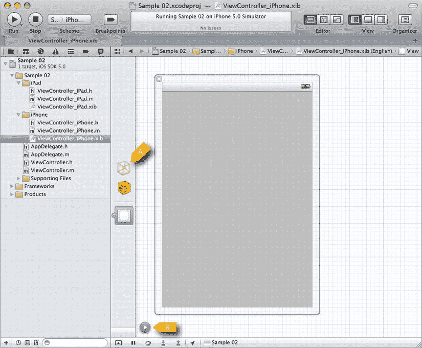
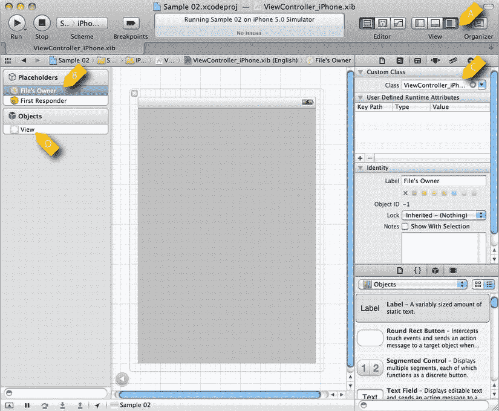
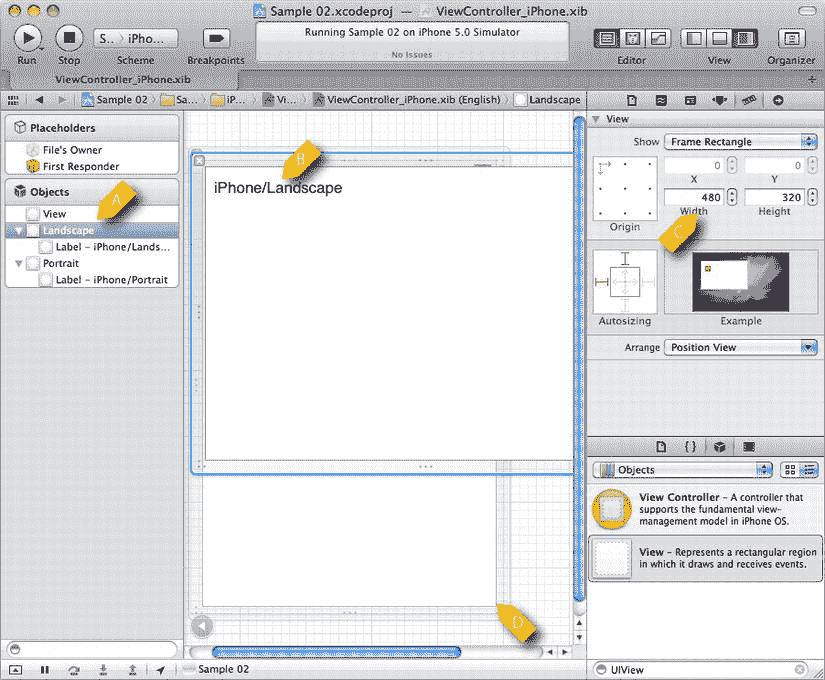
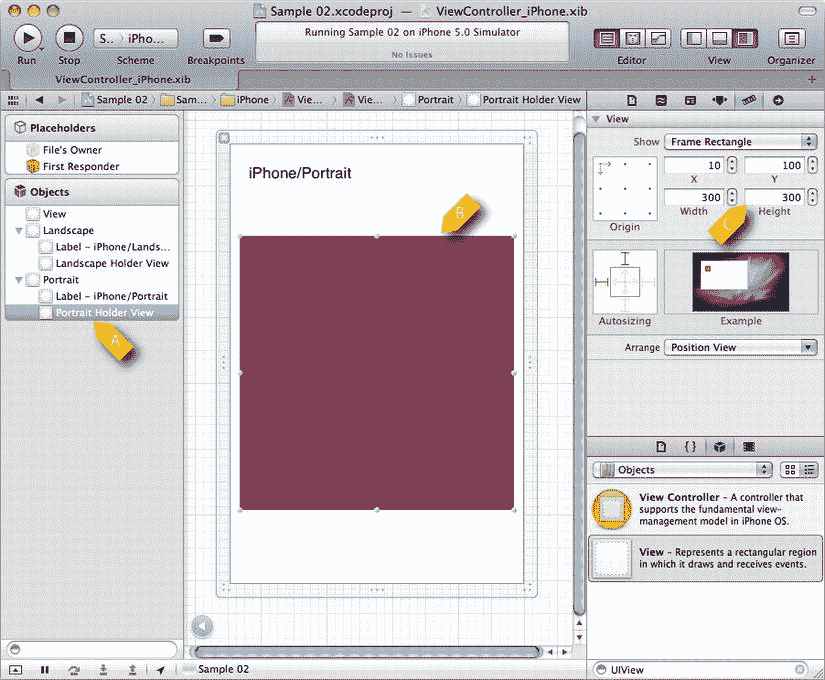
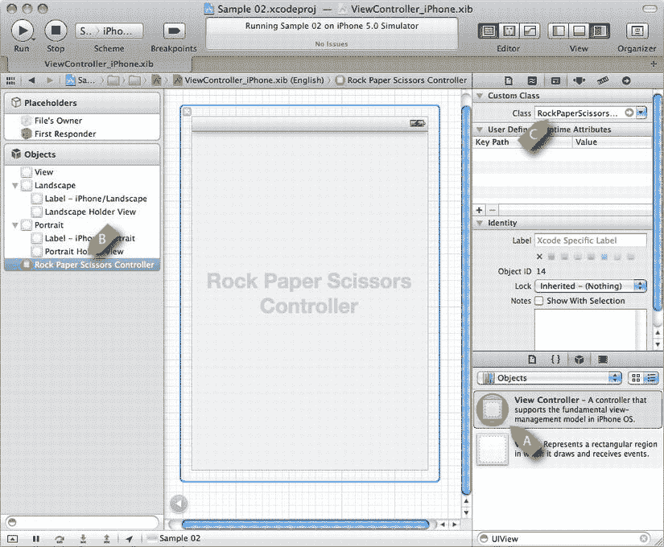
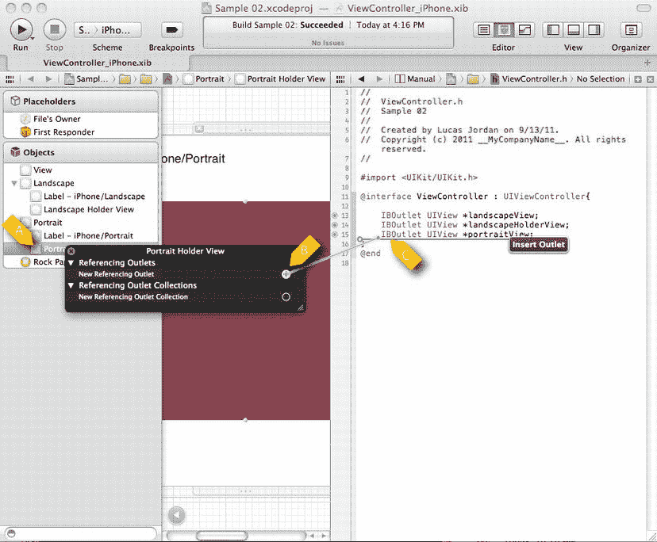

# XIB 文件与 Interface Builder

XIB 文件在运行时被读取，用于实例化其中定义的对象。生成的对象会被"连接起来"，随时可供应用程序使用。例如，在 Interface Builder 中，你可以向场景添加一个按钮，并指定它在被点击时应调用某个特定对象的任务。这非常方便，因为你无需编写将按钮与处理程序对象链接的代码；一切都会按照你在 XIB 文件中的定义自动设置。

**注意**：在互联网上搜索有关 Interface Builder 的帮助时，请记住 XIB 文件过去被称为 NIB 文件。许多可用信息都使用这个旧术语，但它仍然有效。Interface Builder 也是如此；关于旧版本的文章仍然能为新版本提供宝贵的见解。

## 初探 Interface Builder

在项目浏览器的 iPhone 分组下，有一个名为 `ViewController_iPhone.xib` 的文件。该文件包含了应用在 iPhone 上运行时使用的起始视觉组件。类似地，在 iPad 分组下有一个名为 `ViewController_iPad.xib` 的文件，用于应用在 iPad 上运行时的场景。我们先聚焦于 iPhone 版本，看看这个文件是什么以及它是如何工作的。点击 `ViewController_iPhone.xib`，你应该会看到类似图 2-12 的内容。



图 2-12.  准备编辑 `ViewController_iPhone.xib` 的 Interface Builder

在图 2-12 中，项目浏览器右侧是一个包含四个图标的视图（A）。这些图标代表了 XIB 文件中的根项目。若要查看对象的更多详情，请点击视图底部的小箭头（B）。这将改变显示方式，使其与图 2-13 中最左侧的视图一致。正如标签所示，"Object"下的项目是在此 XIB 文件中定义的对象。"Placeholders"下的项目描述了与此文件中未定义对象的关系。实际上，"File's Owner"项是对加载此 XIB 文件的对象的引用；它通常是 `UIViewController` 的子类，这一点稍后会详细说明。



图 2-13.  为 UI 工作配置的 Xcode

图 2-13 的另一重要特征是右侧区域。它展示了 UI 组件的图形化表示。在 Xcode 的标题栏上，View 标签（A）上方有三个按钮。使用 Interface Builder 时，我发现取消选择左侧按钮并选择右侧按钮会很有帮助。这会显示一个视图，展示在 Objects 下所选项目的属性。当你完成 Xcode 界面的配置后，应该会看到类似图 2-13 的内容。

在图 2-10 的 Objects 部分下，有一个名为 View（D）的单项。这个 View 是一个 `UIView`，在应用运行时将是根视图。在图 2-10 的中心，你可以看到这个视图的外观。

在 Placeholders 部分下，我们看到两个项目。此时我们无需关注 First Responder。不过，我们需要选择 File's Owner（B）并对其进行修改。File's Owner 项是对加载此 XIB 文件的对象的引用。在我们的例子中，它将是 `ViewController_iPhone` 的一个实例，如代码清单 2-2 所示。为了让 Interface Builder 知道我们打算使用 `UIViewController` 的某个特定子类，我们在右侧位置（C）输入要使用的类名。这样，Interface Builder 就会暴露 `ViewController_iPhone` 类的 `IBOutlets`。

我们稍后会进一步探讨 `IBOutlets`。

**提示**：从技术上讲，XIB 文件包含用于创建特定类实例的信息。在实践中，我经常简单地认为"XIB 文件包含一个对象"，这在技术上并不准确。尽管存在这种不精确性，但术语警察至今尚未逮捕我。

现在，我们已经介绍了 XIB 文件是什么，以及其中定义的对象如何在运行时与对象相关联。下一步是为我们的 XIB 文件添加内容——具体来说，是为横屏和竖屏方向添加 `UIViews`。

## 向 XIB 文件添加 UI 元素

我们已经了解了 XIB 文件中的基本元素。我们知道有一个代表着加载 XIB 文件的 `UIViewController` 的 File's Owner 对象引用。我们还知道 XIB 文件有一个根 `UIView`。我们将向 XIB 文件添加额外的 `UIViews`，并了解如何自定义应用，使其不仅支持不同设备，还能根据不同方向拥有不同布局。图 2-14 展示了 iPhone 的 XIB 文件，其中添加了一些项目。



图 2-14.  部分配置好的 iPhone XIB 文件

在图 2-14 中，我们看到 XIB 文件中添加了额外的 `UIView` 对象。要添加新组件，只需将其从右下角的框中拖放到 Objects 列表或直接拖到中间的场景中。在本例中，我们添加了两个名为 Landscape 和 Portrait 的 `UIView` 对象，它们与名为 View（A）的 `UIView` 是同级关系。我们将这两个 `UIView` 对象统称为方向视图。在每个新的 `UIView` 对象上，我们通过从右下角的库中拖拽 `UILabel` 到屏幕中间的视觉表示区域（B），添加了一个 `UILabel`。每个标签的文本将标识当前显示的是哪个视图。为了确保布局正确，Landscape 和 Portrait `UIView` 对象的大小在右侧的属性面板（C）中进行了设置。在屏幕中央，你可以看到 Landscape `UIView` 显示在 Portrait `UIView`（D）之上。

下一步是为每个方向视图添加一个新的 `UIView`。这个新的 `UIView` 将描述我们的石头、剪刀、布游戏将显示在哪里。图 2-15 展示了添加到竖屏方向视图的这个新 `UIView`。



图 2-15.  添加到 iPhone XIB 文件的容器视图

在图 2-15 中，我们看到已向 XIB 文件添加了两个新的 `UIView` 对象。第一个称为 Portrait Holder View（A），第二个称为 Landscape Holder View。在屏幕中央（B），我们看到 Portrait Holder View 的大小为 300x300（C）点，颜色较深（红色）。Landscape Holder View 是 Landscape 的子视图（未显示）。

## 向 XIB 添加 `UIViewController`

在添加完项目之前，还有最后一项需要添加到 XIB 文件中。我们需要添加一个 `UIViewController`，它负责管理将在我们刚刚添加的容器视图中显示的子视图。我们将添加的 `UIViewController` 将是本章前面定义的 `RockPaperScissorsController` 类。图 2-16 展示了添加了一个新 `UIViewController` 的 XIB 文件。



图 2-16.  添加到 XIB 文件的 `RockPaperScissorsController`

在图 2-16 中，我们看到一个视图控制器从库（A）拖到了 Objects 部分（B），并被设置为 `RockPaperScissorsController` 类（C）。


这样一来，当 XIB 文件被实例化时，`RockPaperScissorsController` 的一个实例也会随之创建。这引发了一个问题：我们如何通过编程方式访问 XIB 文件中的条目？答案在于创建 `IBOutlet`，这将在下一节中讨论。

## 从 Interface Builder 创建新的 IBOutlet

`IBOutlet` 是 XIB 文件中定义的条目与类中声明的变量之间的连接。要将某个字段指定为 `IBOutlet`，只需在类头文件的字段声明前加上该关键字。另一种创建 `IBOutlet` 的方法是通过 Interface Builder 创建。图 2-17 展示了如何在 Interface Builder 中创建 `IBOutlet`。



图 2-17. 在 Interface Builder 中创建 IBOutlet

在图 2-17 中，我们看到了在 Interface Builder 中创建 IBOutlet 的步骤。首先需要注意的是，右侧的视图被分割为 Interface Builder 和一个代码窗口。要启用这种分割视图，请按 `command+option+return`。要创建 IBOutlet，首先右键单击你想要创建 IBOutlet 的对象（A）——在本例中，是 Portrait Holder 视图。从弹出的对话框中，将鼠标从 New Referencing Outlet（B）右侧的小圆圈拖到你希望创建 `IBOutlet` 的代码位置（C）。如图 2-17 所示，已经创建了一些 `IBOutlet` 引用。请注意，这些 `IBOutlet` 引用所在头文件是 `ViewController.h`。我们使用这个文件，而 `ViewController_iPhone` 和 `ViewController_iPad` 将继承这些引用。让我们在代码清单 2-5 中查看 `ViewController.h` 的完整版本。

**代码清单 2-5.** `ViewController.h`

```
#import <UIKit/UIKit.h>
#import "RockPaperScissorsController.h"
 
@interface ViewController : UIViewController{
    IBOutlet UIView *landscapeView;
    IBOutlet UIView *landscapeHolderView;
    IBOutlet UIView *portraitView;
    IBOutlet UIView *portraitHolderView;
    IBOutlet RockPaperScissorsController *rockPaperScissorsController;
}
@end
```

在代码清单 2-5 中，我们看到我们引用了五个 `IBOutlet` 引用。这些引用将使我们能够在运行时以编程方式访问这些条目。当 Interface Builder 创建这些引用时，它还在 `ViewController` 的实现中创建了一些清理代码。代码清单 2-6 展示了这些自动生成的代码。

**代码清单 2-6.** `ViewController.m`（部分）

```
- (void)viewDidUnload {
    [landscapeView release];
    landscapeView = nil;
    [landscapeHolderView release];
    landscapeHolderView = nil;
    [portraitView release];
    portraitView = nil;
    [portraitHolderView release];
    portraitHolderView = nil;
    [rockPaperScissorsController release];
    rockPaperScissorsController = nil;
    [super viewDidUnload];
    // 释放主视图的所有保留子视图。
    // 例如 self.myOutlet = nil;
}
//...
- (void)dealloc {
    [landscapeView release];
    [landscapeHolderView release];
    [portraitView release];
    [portraitHolderView release];
    [rockPaperScissorsController release];
    [super dealloc];
}
```

在代码清单 2-6 中，我们看到 Interface Builder 为每个创建的 `IBOutlet` 生成的代码。在任务 `viewDidUnload` 中，我们看到每个视图都被释放并设置为 `nil`。同样，在任务 `dealloc` 中，我们看到每个视图都被释放。在下一节中，我们将回顾如何响应方向变化；同样的代码将负责将在我们一直使用的不同视图显示到屏幕上。

## 响应方向变化

我们要做的最后一件事是添加一些逻辑，根据设备的方向切换显示的 `UIView`。类 `UIViewController` 指定了一个在设备旋转后被调用的任务。这个任务名为 `didRotateFromInterfaceOrientation:`，它会收到一个常量，指示设备之前的方向。通过向此任务添加逻辑，我们可以更新 UI 以反映新方向。新的方向可以通过使用 `UIDevice` 类来获取。代码清单 2-7 展示了实现我们所需行为的代码。

**代码清单 2-7.** `GameController.m` (`shouldAutorotateToInterfaceOrientation:`)

```
-(void)didRotateFromInterfaceOrientation:(UIInterfaceOrientation)fromInterfaceOrientation{
    UIDevice* device = [UIDevice currentDevice];
    [self setOrientation: [device orientation]];
}
-(void)setOrientation:(UIInterfaceOrientation)interfaceOrientation{
    if (interfaceOrientation == UIInterfaceOrientationLandscapeLeft || interfaceOrientation == UIInterfaceOrientationLandscapeRight){
        [portraitView removeFromSuperview];
        [self.view addSubview:landscapeView];
        
        [rockPaperScissorsController setup:landscapeHolderView.frame.size];
        [landscapeHolderView addSubview:rockPaperScissorsController.view];
        
    } else {
        [landscapeView removeFromSuperview];
        [self.view addSubview:portraitView];
        
        [rockPaperScissorsController setup:portraitHolderView.frame.size];
        [portraitHolderView addSubview:rockPaperScissorsController.view];
    }
}
```

在代码清单 2-7 中，我们看到此任务传递了变量 `fromInterfaceOrientation`，它指示设备之前的方向。在我们的应用中，我们并不关心之前的方向，因此我们通过从 `UIDevice` 类获取当前设备，然后读取属性 `orientation` 来找到当前的（旋转后的）方向。一旦获得方向，我们就调用 `setOrientation:`，该方法也在代码清单 2-7 中定义。

任务 `setOrientation:` 将更新 UI 以使用传入的任何一个方向。如果设备现在处于横向方向，我们将 `portraitView` 从其父视图中移除，这意味着将其从屏幕上移除。然后我们将视图 `landscapeView` 添加到最根部的视图中。我们对 `rockPaperScissorsController` 调用 `setup`，以便让它有机会布置其子视图（如果它尚未这样做）。最后，我们将 `rockPaperScissorsController` 的视图属性作为子视图添加到 `landscapeHolder` 中。

我们希望将布局逻辑放在单独任务中的原因是，我们希望当视图控制器首次加载时也调用此任务，这样当游戏启动时 UI 就能正确设置。这允许我们将所有方向逻辑放在一个地方。

第一次时，这些对象的状态会不同。例如，第一次调用此任务时， `portraitView` 和 `landscapeView` 都尚未附加到场景中，因此对 `removeFromSubview` 的调用将是一个空操作，不会出错。当在后续的旋转中调用此任务时，`rockPaperScissorsController` 的视图将附加到场景中；然而，当一个视图被添加为子视图时，如果它有父视图，它会自动从其父视图中移除。

`removeFromSuperview` 和 `addSubview:` 具有这些合理的默认行为这一事实，使得在操作视图时变得相当容易。它减少容易出错的清理代码。代码清单 2-8 展示了我们在应用首次启动时如何调用 `setOrientation:`。

**代码清单 2-8.** `ViewController.`（不完整）


`- (void)viewDidLoad {  
    [super viewDidLoad];  
    UIDevice* device = [UIDevice currentDevice];  
    [self setOrientation: [device orientation]];  
}`

在清单 2-8 中，当 `ViewController` 完成初始化并显示在屏幕上时，会调用 `viewDidLoad` 任务。此处，我们简单获取当前设备的朝向，并将该值传递给 `setOrientation:`，确保应用程序启动时界面方向正确。

如果运行该项目，您会看到应用在 iPad 和 iPhone 上均可运行，并会根据朝向改变布局。

## 总结

本章我们探讨了如何创建适用于开发通用应用的 Xcode 项目。我们研究了 iOS 应用的初始化过程，并了解了从何处开始修改项目以创建所需应用。我们掌握了 XIB 文件与类的交互方式，以及 iOS 如何通过 `UIViewController` 类运用 MVC 模式。我们创建了一个应用，使其在 iPhone 或 iPad 上能够以所有方向无缝运行，为游戏开发奠定了基础。

