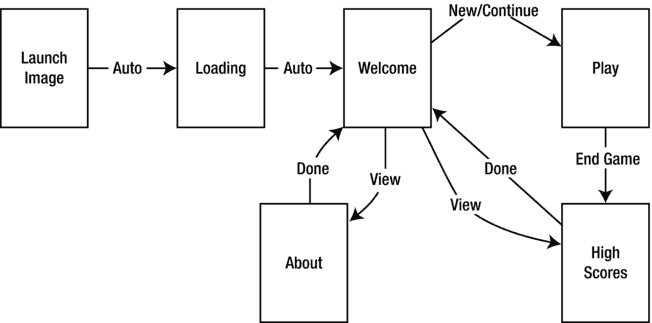
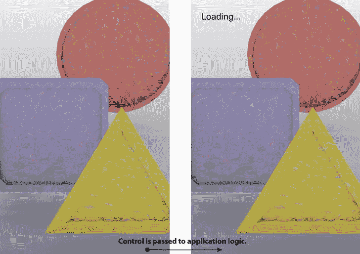
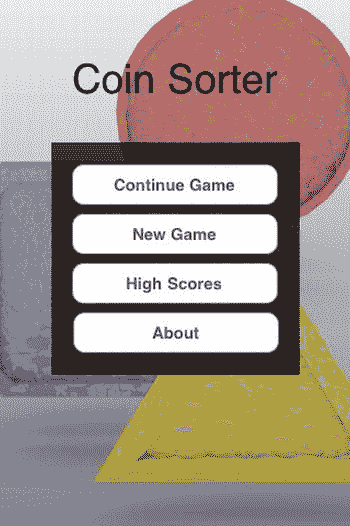
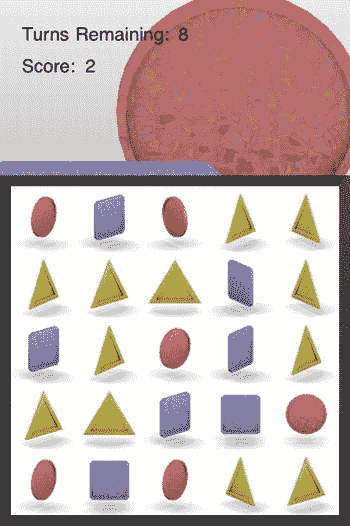

# 第 3 章 探索游戏应用生命周期

游戏不仅仅包含有趣的部分。市场上几乎所有游戏，尤其是大型作品，都涉及多个视图和相当复杂的生命周期。本章将探讨如何将一个简单的游戏转变为一个完整的应用。我们将研究典型游戏如何组织构成其的各个视图，包括加载视图、欢迎视图、高分视图以及游戏本身。

除了用户导航，应用也有其生命周期。在 iOS 上，该生命周期包括响应应用被终止、从后台恢复或首次启动。当应用在其生命周期中移动时，它需要保存用户数据的元素，如高分和游戏状态。关注这些细节将使您的游戏看起来精致而非业余和恼人。

虽然这里展示的游戏并不令人兴奋，且图像也承认是业余水平，但您可以采用此处展示的基本框架，并将自己的游戏融入其中。不过，建议您更新自己的图像！

## 理解游戏中的视图

本章介绍的游戏名为 Coin Sorter。这是一个简单的益智游戏，玩家将硬币按行和列排序。玩家有十次机会尽可能多地匹配行或列。这个游戏的有趣部分几乎就是 iOS 游戏能有的最简单形式。游戏的可玩部分仅由两个类组成：`CoinsController` 和 `CoinsGame`。正如这两个类的名称所示，`CoinsController` 负责将游戏渲染到屏幕并解释玩家操作。`CoinsGame` 负责存储游戏状态并提供一些操作该状态的实用方法。这两个类如何工作的细节将在第 4 章中全面探讨。在本章中，我们将研究支持这两个类以创建完整应用的所有周边代码。

大多数游戏包含多个视图——不仅仅是游戏主要动作发生的视图。这些视图通常包括欢迎视图、高分视图，可能还有一些其他视图。本章附带的示例代码旨在概述如何管理这些支持视图。图 3-1 是此游戏中视图的流程图。

图 3-1. CoinSorter 应用流程

在图 3-1 中，每个矩形都是游戏中的一个视图。箭头指示这些视图之间的转换。

从左侧开始，有一个标题为“启动图像”的框。此视图与其他视图不同，它只是一个 PNG 文件，在应用控制权传递给应用委托之前显示。配置此图像的详细信息见附录 A。当应用完全加载后，我们会显示加载视图。此视图会在屏幕上停留几秒钟，同时应用预加载一些图像。图像加载完成后，我们会向用户显示欢迎视图。

图 3-1 中的欢迎视图为玩家提供了多个选项。他们可以继续旧游戏、开始新游戏、查看高分或查看游戏信息。如果用户玩游戏，他们会被引导至游戏视图，这是应用主要动作发生的地方。游戏结束后，用户会看到高分视图。当他们查看完高分后，会被送回欢迎视图，以便再次从可用选项中选择。

图 3-1 中展示的应用流程绝非唯一选择，但它展示了一种常见模式。一旦您理解每个视图的作用以及应用状态如何管理，扩展或修改此示例应该非常简单。

> **注意** 虽然使用 Xcode 的 Storyboard 功能来布置此类工作流可能很吸引人，但支持多种方向和多种设备使得 Storyboard 不实用。理想情况下，Storyboard 将在未来版本的 Xcode 中改进，并成为管理应用生命周期的唯一工具。

## 探索每个视图扮演的角色

应用中的每个视图都有不同的用途。通过理解每个视图的作用，您将理解此示例为何如此组织。让我们先看图 3-2，它展示了启动图像和加载视图。

图 3-2. 启动图像和加载视图

在图 3-2 中，我们看到左侧的启动图像，它在初始化过程控制权传递给应用委托时出现。我们在图 3-2 的右侧看到加载视图。在此例中，加载视图有一个 `UIImageView`，其图像与启动图像相同。这不是必须的，但这是为用户提供无缝视觉体验的好方法。在更复杂的应用中，您可能希望在加载图像时显示进度条。对于如此简单的应用，您实际上并不需要加载屏幕，因为使用的图像数量和大小都很小。在我们的案例中，我们简单地在加载视图中添加了一个带有文本“加载中...”的 `UILabel`。一旦应用的初始资源加载完成，就会显示欢迎视图，如图 3-3 所示。

图 3-3. 显示“继续游戏”按钮的欢迎视图

图 3-3 中显示的欢迎视图向玩家展示了四个按钮。第一个按钮允许玩家继续之前的游戏。“新游戏”按钮开始一个新游戏。“高分”和“关于”按钮允许玩家查看过去的高分和关于屏幕。欢迎视图是玩家的主屏幕。查看图 3-1，我们看到所有未来的操作最终都会将玩家带回此视图。如果玩家选择继续之前的游戏或开始新游戏，则会显示游戏视图，如图 3-4 所示。

图 3-4.

