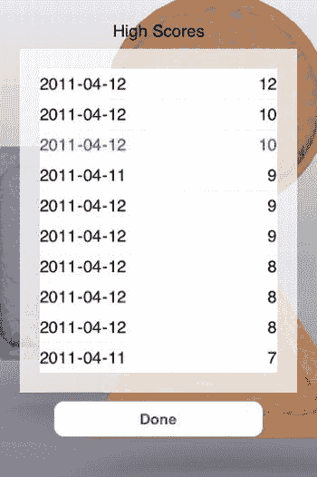
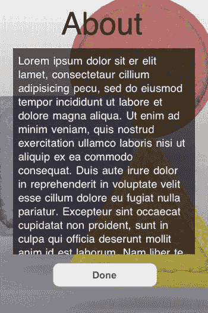
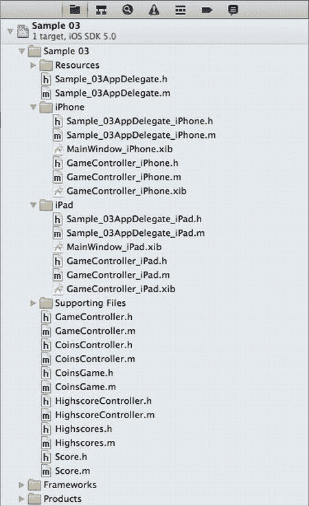
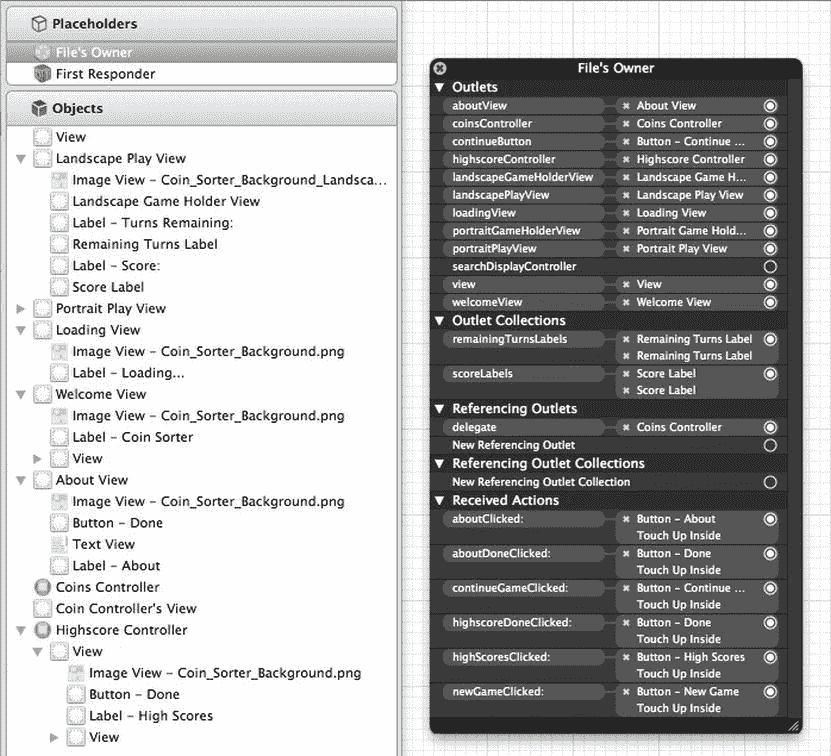

# 游戏视图——进行中的游戏

游戏视图是实际进行游戏的地方。在图 3-4 中，屏幕顶部显示剩余回合数和当前得分。带有几何形状的方形区域是游戏进行的区域。每个三角形、正方形和圆形代表一种不同类型的硬币。游戏的目标是创建由相同硬币组成的行和列。重新排列硬币的唯一方法是选择两枚硬币交换位置。当创建出一行或一列相同硬币时，玩家的得分会增加，新的硬币会出现以替换匹配行或列中的硬币。玩家在游戏结束前只能交换十次硬币，但通过精心计划，玩家可以在一次交换中创建多次匹配。游戏结束时，将显示最高分视图，并突出显示玩家可能获得的新最高分。图 3-5 展示了最高分视图。



图 3-5. 最高分视图

在图 3-5 中，你可以看到最高分视图；它突出显示了上一局游戏的得分，即从上往下的第三个分数（在黑白图像中比其他的略浅）。此视图中呈现的最高分会在应用程序会话之间保存。本章后面部分，我们将探讨最高分数据是如何保存的。当用户查看完他们过去和当前的成功记录后，可以选择“完成”按钮返回欢迎视图。在欢迎视图中，他们可以点击“关于”按钮并查看一些关于游戏的信息，如图 3-6 所示。



图 3-6. 欢迎视图

图 3-6 中展示的欢迎视图在很大程度上是一个占位视图。你需要将“Lorem ipsem . . .”替换为你对游戏的描述。

在第 2 章中，我们探讨了如何配置包含游戏中各种 UI 元素的 XIB 文件。在这个游戏中，我们遵循了非常类似的模式。

## 理解项目结构

即使是一个简单的游戏，在 Xcode 项目中也可能包含数量惊人的构件。探索这些是什么有助于你理解应用程序的每个部分在哪里定义，以及它们如何组合在一起。图 3-7 展示了 Xcode 中的项目浏览器，其中列出了此项目中使用的多个文件。



图 3-7. 示例项目 03 的项目文件

图 3-7 中展示的项目文件遵循与第 2 章项目相同的模式。共享类位于`Sample 03`组下，而设备特定的类存储在 iPhone 和 iPad 组下。`Sample_03AppDelegate`类包含应用程序的初始化代码以及当玩家退出应用程序时保存用户状态的代码。XIB 文件也与第 2 章中的 XIB 文件非常相似：以`MainWindow`开头的 XIB 文件各包含一个适当子类的`GameController`。`GameController`类包含管理应用程序状态的所有逻辑，而每个子类的 XIB 文件包含适合各设备的 UI 元素。

`CoinsController`类描述了游戏中有趣的部分，而`CoinGame`类是一个模型类，描述了哪些类型的硬币在什么位置，以及当前得分和剩余回合数。

通过归档`CoinGame`类的对象，我们可以在应用程序退出时保存当前游戏的状态。

`HighscoreController`类管理最高分视图，并显示`Highscores`类中的数据。`Highscores`类包含一个`Score`对象数组，每个`Score`对象代表一个得分以及获得该得分的日期。通过对`Highscores`实例进行序列化，我们可以在游戏会话之间保留用户的最高分。

视图配置的核心定义在两个`GameController` XIB 文件中。让我们看看它们。

## 为多视图配置应用程序

虽然此应用程序在 iPhone 和 iPad 上都能同样良好地运行，但我们只看一下 iPhone 版本的 GameController XIB 文件，如图 3-8 所示。



图 3-8. `GameController_iPhone.xib`

在图 3-8 中，我们在左侧看到文件`GameController_iPhone.xib`的详细信息。在右侧，我们看到在文件`GameController.h`中定义的`IBOutlets`和`IBActions`。

### 回顾 `GameController_iPhone.xib`

在左侧的“对象”部分下，我们看到多个`UIViews`。横向游戏视图和纵向游戏视图在游戏进行时显示，这是此应用程序唯一支持两种方向的场景。为简化起见，其余视图仅支持纵向方向。

当应用程序初始化时，我们知道用户看到的第一个视图是加载视图。之后，用户会被导向欢迎视图。在图 3-8 中，我们可以看到这两个视图都定义在 XIB 文件中。我们还看到关于视图也定义在 XIB 文件中。对于实际游戏和最高分视图，我们在 XIB 中看到对应的`UIViewControllers`。这两个视图由`UIViewController`处理，因为每个都贡献了相当数量的功能，所以在它们自己的`UIViewController`类中定义行为是合理的。作为此设计决策的副作用，我们可以在其他应用程序中重用最高分`UIViewController`。

### 回顾 `GameController.h`

在图 3-8 的右侧，我们看到在`GameController`类中定义的连接。我们还可以看到大多数列出的对象都连接到了各种连接上。以这种方式连接这些组件使我们能够在代码中轻松引用这些不同的组件。清单 3-1 展示了`GameController.h`中这些连接的定义。

**清单 3-1.** `GameController.h`

```
#import <UIKit/UIKit.h>
#import "CoinsController.h"
#import "CoinsGame.h"
#import "HighscoreController.h"
```


