# `@interface GameController : UIViewController <CoinsControllerDelegate>` 

```objc
{
    IBOutlet UIView *landscapePlayView;
    IBOutlet UIView *landscapeGameHolderView;
    IBOutlet UIView *portraitPlayView;
    IBOutlet UIView *portraitGameHolderView;
    IBOutlet UIView *loadingView;
    IBOutlet UIView *welcomeView;
    IBOutlet UIButton *continueButton;
    IBOutlet UIView *aboutView;
    IBOutlet CoinsController *coinsController;
    IBOutletCollection(UILabel) NSArray *remainingTurnsLabels;
    IBOutletCollection(UILabel) NSArray *scoreLabels;
    IBOutlet HighscoreController *highscoreController;
    CoinsGame* previousGame;
    BOOL isPlayingGame;
}
-(void)setPreviousGame:(CoinsGame*)aCoinsGame;
-(CoinsGame*)currentGame;
- (IBAction)continueGameClicked:(id)sender;
- (IBAction)newGameClicked:(id)sender;
- (IBAction)highScoresClicked:(id)sender;
- (IBAction)aboutClicked:(id)sender;
- (IBAction)aboutDoneClicked:(id)sender;
- (IBAction)highscoreDoneClicked:(id)sender;
-(void)loadImages;
-(void)showPlayView:(UIInterfaceOrientation)interfaceOrientation;
@end
```

在代码清单 3-1 中，我们导入了该项目中定义的另外三个类，其中包括 UIKit 的默认导入语句。其余 `IBOutlet` 语句均为基本声明，用于访问多个不同的视图。`IBOutletCollection` 定义对我们来说是一种新型的连接方式。`IBOutletCollection` 的行为与 `IBOutlet` 非常相似，区别在于它允许你将多个项目连接到一个 `NSArray` 中。在我们的案例中，有两个用于显示分数的标签：横屏和竖屏。我们无需为每个标签都分别声明一个 `IBOutlet`（及对应的变量），只需使用一个 `IBOutletCollection`，这样 `NSArray scoreLabels` 在运行时就会同时包含这两个标签。当需要更新 UI 显示新分数时，我们只需更新数组 `scoreLabels` 中所有 `UILabel` 的文本即可。对于显示剩余回合数的标签，我们也采用相同的模式，每个标签都存储在 `NSArray remainingTurnsLabels` 中。

## 将视图呈现在屏幕上

至此，我们完成了对不同视图定义方式的概述。现在，我们来看看每个视图是如何显示到屏幕上的，先从加载视图开始。

我们知道，当应用程序加载时，`GameController` 类的主视图会显示出来，就像第 2 章中那样。然而，`GameController` 的主视图是空的——它实际上是我们应用程序的根组件。当我们在应用程序中切换视图时，我们会对这个根视图进行子视图的添加和移除操作。代码清单 3-2 展示了 `GameController` 中的 `viewDidLoad` 任务，我们在其中添加了希望用户首先看到的视图。

**代码清单 3-2.** GameController.m (viewDidLoad)

```objc
- (void)viewDidLoad {
    [super viewDidLoad];
    [self.view addSubview:loadingView];
    [self performSelectorInBackground:@selector(loadImages) withObject:nil];
}
```

如代码清单 3-2 所示，当从 XIB 文件加载 `GameController` 实例时，会调用 `viewDidLoad` 任务。由于每个 `MainWindow` XIB 文件中都包含一个 `GameController` 实例，因此该任务在应用程序启动后会立即执行。在调用 `viewDidLoad` 的父类实现（此为必需步骤）之后，我们将 `UIView loadingView` 添加到 `GameController` 类的主视图中。`addSubview:` 任务会根据子视图的 `frame` 属性所定义的位置和大小来显示这个新的子视图。因为 `loadingView` 是在 XIB 文件中定义的，所以它的 `frame` 也在那里定义。

在屏幕显示加载视图后，我们需要加载初始资源，以避免应用程序生命周期后期出现无法预期的暂停。

从技术上讲，此应用程序中并非必须异步加载图像，但如果我们想显示进度条，则需要这样做。为了异步执行任务，我们只需调用 `performSelectorInBackground:withObject:` 并传入任务 `loadImages` 即可。随后，`loadImage` 任务将在后台运行，如代码清单 3-3 所示。

**代码清单 3-3.** GameController.m (loadImage)

```objc
-(void)loadImages {
    //sleeping so we can see the loading view. In a production app, don't sleep :)
    [NSThread sleepForTimeInterval:1.0];
    [coinsController loadImages];
    [loadingView removeFromSuperview];
    [self.view addSubview:welcomeView];
}
```

`loadImage` 任务调用了 `sleepForTimeInterval`，使当前线程休眠一秒钟。这样做是为了确保你能在示例代码中实际看到加载视图；在生产代码中请删除此类代码。休眠结束后，调用 `coinsController` 上的 `loadImages` 方法。关于 `CoinsController` 实现 `loadImages` 的详细说明，请参阅第 4 章——目前你只需知道它会加载所有用于显示硬币的图像即可。加载完成后，我们移除 `loadingView` 并添加 `welcomeView`。

欢迎视图才是用户真正开始使用应用程序的地方。从这里开始，用户可以访问应用程序中感兴趣的部分。

## 响应用户操作切换视图

一旦显示欢迎视图，用户便会看到多个按钮（该视图如图 3-3 所示）。顶部的“继续游戏”按钮仅在用户退出应用程序时游戏尚未完成的情况下才会出现。每个按钮都会引导用户导航至一个新视图。实现方式是先建立一个当用户触摸按钮时会被调用的任务。在代码清单 3-1 中，我们看到 `GameController.h` 文件中声明了许多任务。以 `IBAction` 开头的任务就是按钮被触摸时会被调用的任务。在头文件中声明这些任务后，你就可以将每个按钮连接到对应的任务。图 3-9 展示了连接按钮的第一步。

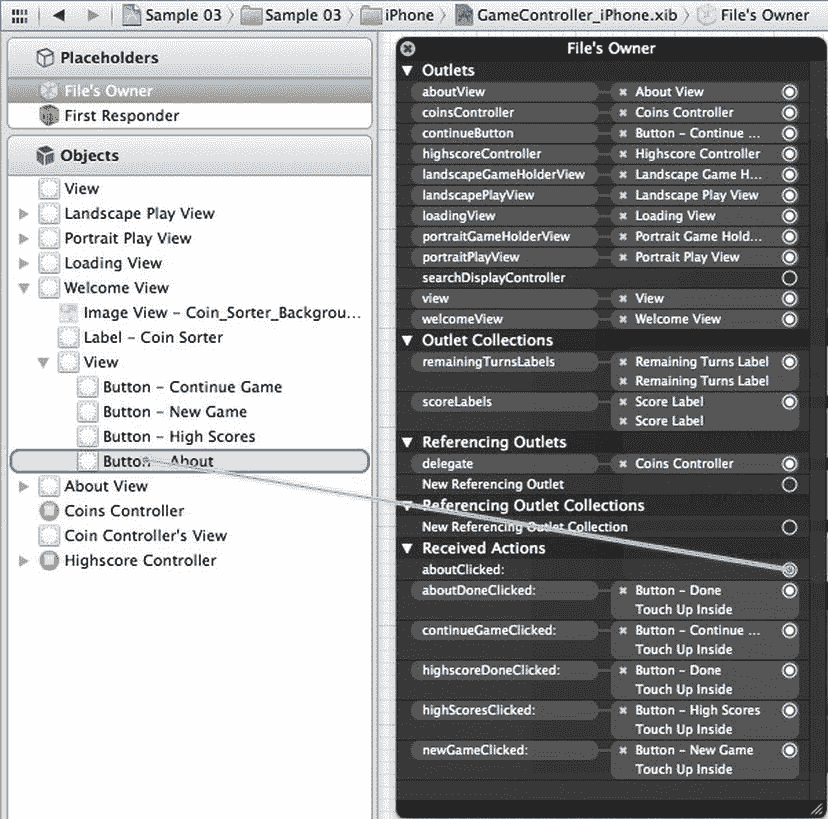

图 3-9.  将 `aboutClicked:` 操作连接到“关于”按钮

在图 3-9 中，我们看到通过右键点击“文件所有者”显露出的“连接”菜单。通过从 `aboutClicked:` 右侧的圆圈拖拽至左侧对应的按钮，你可以选择触发 `aboutClicked:` 任务的操作。松开按钮时，会弹出第二个菜单，允许你选择具体的用户操作。图 3-10 展示了选择“Touch Up Inside”操作的过程，这通常是按钮的期望操作。

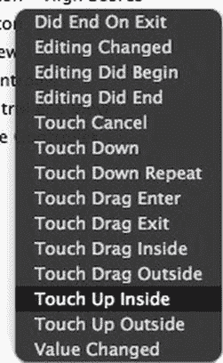

图 3-10.  选择“Touch Up Inside”操作

一旦在 XIB 中连接好按钮的操作，你就需要提供并实现该按钮要执行的对应任务。在我们的示例应用程序中，我们希望每个按钮都能切换当前视图。代码清单 3-4 展示了 `GameController.m` 中这些操作任务的实现。

**代码清单 3-4.** GameController.m (IBAction tasks)

```objc
- (IBAction)continueGameClicked:(id)sender {
    [UIView beginAnimations:nil context:@"flipTransitionToBack"];
    [UIView setAnimationDuration:1.2];
    [UIView setAnimationTransition:UIViewAnimationTransitionFlipFromRight forView:self.
```


```objc
view cache:YES];
    [welcomeView removeFromSuperview];
    UIInterfaceOrientation interfaceOrientation = [self interfaceOrientation];
    [self showPlayView:interfaceOrientation];
    [coinsController continueGame:previousGame];
    [UIView commitAnimations];
    isPlayingGame = YES;
}
- (IBAction)newGameClicked:(id)sender {
    [UIView beginAnimations:nil context:@"flipTransitionToBack"];
    [UIView setAnimationDuration:1.2];
    [UIView setAnimationTransition:UIViewAnimationTransitionFlipFromRight forView:self.view cache:YES];
    [welcomeView removeFromSuperview];
    UIInterfaceOrientation interfaceOrientation = [self interfaceOrientation];
    [self showPlayView:interfaceOrientation];
    [coinsController newGame];
    [UIView commitAnimations];
    isPlayingGame = YES;
}
- (IBAction)highScoresClicked:(id)sender {
    [UIView beginAnimations:nil context:@"flipTransitionToBack"];
    [UIView setAnimationDuration:1.2];
    [UIView setAnimationTransition:UIViewAnimationTransitionFlipFromRight forView:self.view cache:YES];
    [welcomeView removeFromSuperview];
    [self.view addSubview:highscoreController.view];
    [UIView commitAnimations];
}
- (IBAction)aboutClicked:(id)sender {
    [UIView beginAnimations:nil context:@"flipTransitionToBack"];
    [UIView setAnimationDuration:1.2];
    [UIView setAnimationTransition:UIViewAnimationTransitionFlipFromRight forView:self.view cache:YES];
    [welcomeView removeFromSuperview];
    [self.view addSubview: aboutView];
    [UIView commitAnimations];
}
```

清单 3-4 展示了所有用于控制从 Welcome 视图中选择显示哪个视图的任务。每个任务的前三行设置了用于从一个视图过渡到另一个视图的动画。最后一行的 `UIView` 的 `commitAnimations` 任务表明我们已经指定了所有想要动画化的 UI 更改，并且应将动画展示给用户。动画类型通过设置 `UIView` 的 `beginAnimations:context:` 任务中的上下文字符串来控制。为了实际更改显示的视图，我们只需让 `welcomeView` 通过调用 `removeFromSuperview` 从它的父视图中移除自身，然后通过调用 `addSubview:` 任务将所需的 `view` 添加到 `self.view` 中。

对于高分视图和关于视图，我们希望用户能够导航回 Welcome 视图。清单 3-5 展示了这些操作任务。

**清单 3-5.** `GameController.m`（导航回 Welcome 视图）

```objc
- (IBAction)aboutDoneClicked:(id)sender {
    [UIView beginAnimations:nil context:@"flipTransitionToBack"];
    [UIView setAnimationDuration:1.2];
    [UIView setAnimationTransition:UIViewAnimationTransitionFlipFromLeft forView:self.view cache:YES];
    [aboutView removeFromSuperview];
    [self.view addSubview: welcomeView];
    [UIView commitAnimations];
}
- (IBAction)highscoreDoneClicked:(id)sender {
    [UIView beginAnimations:nil context:@"flipTransitionToBack"];
    [UIView setAnimationDuration:1.2];
    [UIView setAnimationTransition:UIViewAnimationTransitionFlipFromLeft forView:self.view cache:YES];
    [highscoreController.view removeFromSuperview];
    [self.view addSubview: welcomeView];
    [UIView commitAnimations];
}
```

清单 3-5 展示了当用户在关于视图和高分视图上点击"完成"按钮时调用的两个任务。这些任务与清单 3-4 中的任务非常相似。唯一的区别是我们移除了关于视图和高分视图，然后添加了 Welcome 视图。这与清单 3-4 中的任务正好相反。

当用户导航到 Play 视图时，他们会一直停留在该视图上直到游戏结束。在这种情况下，应用程序会自动切换视图。

下一节将解释 `GameController` 如何与 `CoinsController` 交互，不仅是为了知道何时将用户过渡到高分视图，还为了更新剩余的回合数和得分标签。

## 使用委托来传递应用程序状态

在 iOS 开发中，一个对象与另一个对象通信的常见模式是委托模式。委托就是符合另一个对象所知的某个预定义协议的任何对象。例如，假设我们有一个类 A，它有一个必须符合协议 P 的属性 `delegate`。如果类 B 符合协议 P，我们就可以将类 B 的实例分配给类 A 的 `delegate` 属性。这种委托模式与其他语言（如 Java）中的监听器模式非常相似。

### 声明 `CoinsControllerDelegate`

为了让 `CoinsController` 类将其状态传达给 `GameController` 类，我们创建一个描述这种关系的协议。清单 3-6 展示了文件 `CoinsController.h` 中协议 `CoinsControllerDelegate` 的声明。

**清单 3-6.** `CoinsControllerDelegate`（来自 `CoinsController.h`）

```objc
@protocol CoinsControllerDelegate < NSObject>
-(void)gameDidStart:(CoinsController*)aCoinsController with:(CoinsGame*)game;
-(void)scoreIncreases:(CoinsController*)aCoinsController with:(int)newScore;
-(void)turnsRemainingDecreased:(CoinsController*)aCoinsController with:(int)turnsRemaining;
-(void)gameOver:(CoinsController*)aCoinsController with:(CoinsGame*)game;
@end
```

如清单 3-6 所示，协议非常简单。协议的名称跟在 `@protocol` 之后。`<NSObject>` 指定了哪些类型的对象可以符合这个协议。在 `@protocol` 和 `@end` 之间声明了一些任务。这些是将要发送给委托对象的消息，因此委托对象应该实现这些任务中的每一个。委托字段在 `CoinsController` 的接口部分中声明如下：

```objc
IBOutlet id <CoinsControllerDelegate> delegate;
```

我们还为此字段定义了一个属性，属性声明如下：

```objc
@property (nonatomic, retain) id <CoinsControllerDelegate> delegate;
```

关于 `delegate` 属性的声明，需要注意两点。第一，我们可以将任何对象分配为委托。由于它是 `id` 类型，如果分配的对象已知不符合 `CoinsControllerDelegate` 协议，我们将收到编译器警告。第二，我们将其定义为 `IBOutlet`，这允许我们在 Interface Builder 中实际设置 `GameController` 对象和 `CoinsController` 对象之间的关系。这并不是必需的，但如果你打算编写供其他开发者使用的代码，这会是一个方便的补充。

查看 `GameController` 类的声明，我们可以看到它符合 `CoinsControllerDelegate` 协议，如下所示：

```objc
@interface GameController : UIViewController <CoinsControllerDelegate> {
```

### 实现定义的任务

仅仅声明一个类符合某个协议只是第一步。符合协议的类还应该实现协议中定义的每个任务。清单 3-7 展示了 `GameController.m` 文件中 `CoinsControllerDelegate` 协议的实现。

**清单 3-7.** `GameController.m`（`CoinsControllerDelegate` 的实现）


m（CoinsControllerDelegate 任务）

```objc
// CoinsControllerDelegate 任务
-(void)gameDidStart:(CoinsController*)aCoinsController with:(CoinsGame*)game{
    for (UILabel* label in scoreLabels){
        [label setText:[NSString stringWithFormat:@"%d", [game score]]];
    }
    for (UILabel* label in remainingTurnsLabels){
        [label setText:[NSString stringWithFormat:@"%d", [game remaingTurns]]];
    }
}
-(void)scoreIncreases:(CoinsController*)aCoinsController with:(int)newScore{
    for (UILabel* label in scoreLabels){
        [label setText:[NSString stringWithFormat:@"%d", newScore]];
    }
}
-(void)turnsRemainingDecreased:(CoinsController*)aCoinsController with:(int)turnsRemaining{
    for (UILabel* label in remainingTurnsLabels){
        [label setText:[NSString stringWithFormat:@"%d", turnsRemaining]];
    }
}
-(void)gameOver:(CoinsController*)aCoinsController with:(CoinsGame*)game{
    [continueButton setHidden:YES];
    Score* score = [Score score:[game score] At:[NSDate date]];
    [highscoreController addScore:score];
    UIWindow* window = [[[UIApplication sharedApplication] windows] objectAtIndex:0];
    window.rootViewController = nil;
    window.rootViewController = self;
    [UIView beginAnimations:nil context:@"flipTransitionToBack"];
    [UIView setAnimationDuration:1.2];
    [UIView setAnimationTransition:UIViewAnimationTransitionFlipFromRight forView:self.view cache:YES];
    [coinsController.view removeFromSuperview];
    [self.view addSubview:highscoreController.view];
    [UIView commitAnimations];
}
```

清单 3-7 展示了 `GameController` 类对 `CoinsControllerDelegate` 协议所定义任务的每个实现。当 `CoinsController` 开始一个新游戏时，它会调用 `delegate` 对象上的 `gameDidStart:with:` 方法。在我们的场景中，我们要确保剩余回合标签和分数标签能够反映游戏的初始值。这些值可能是任何数值，因为我们不知道是开始一个新游戏还是继续一个旧游戏。同样地，每当调用 `scoreIncreases:with:` 和 `turnsRemainingDecreased:with:` 任务时，这些标签也会被更新。

最后，在清单 3-7 中，当游戏结束时，会调用 `gameOver:with:` 任务。在此任务中，我们记录最高分并切换到最高分视图。由于我们允许游戏在横屏或竖屏模式下进行，游戏结束时手机可能处于横屏状态。如果是这种情况，我们需要确保界面方向正确，以便最高分视图能够正确显示。一种方法是简单地重置 `UIWindow` 的 `rootViewController` 属性。这会触发调用 `shouldAutorotateToInterfaceOrientation:`，从而确保我们的视图以正确的方向显示。

## HighscoreController：一个简单可复用的组件

`HighscoreController` 类负责管理用于显示最高分的视图，以及持久化存储这些最高分。`HighscoreController` 是一个相当简单的类——该类的头文件如清单 3-8 所示。

**清单 3-8.** HighscoreController.h

```objc
#define KEY_HIGHSCORES @"KEY_HIGHSCORES"
#import <UIKit/UIKit.h>
#import "Highscores.h"
#import "Score.h"
@interface HighscoreController : UIViewController {
    IBOutlet UIView* highscoresView;
    Highscores* highscores;
}
-(void)saveHighscores;
-(void)layoutScores:(Score*)latestScore;
-(void)addScore:(Score*)newScore;
@end
```

如清单 3-8 所示，`HighscoreController` 有两个字段。第一个字段 `highscoresView` 是一个 `IBoutlet`。这是一个 `UIView`，用于在屏幕上布局实际的分数。`UIView highscoresView` 被假定为 `UIViewController` 类自带视图属性的子视图。

它不一定是直接子视图——只需出现在视图层次结构中的某个位置即可。这与我们之前看到的其他 `UIViewControllers` 的模式略有不同。之所以这样做，是为了让 `HighscoreController` 的实例能够同时添加到 iPhone 和 iPad 的 XIB 文件中，从而可以在其中控制视图的布局。查看 iPhone XIB 文件，你会看到最高分视图的布局直接定义在 `HighscoreController` 内部。

字段 `highscores` 的类型是 `Highscores`。这是一个简单的类，包含一个 `Score` 对象数组。在查看了 `HighscoreController` 中定义的三个任务的实现之后，我们将更仔细地研究 `Highscores` 和 `Score` 类。

## HighscoreController 的实现与布局

一旦应用程序将 `HighscoreController` 的视图连接好，最重要的任务就是 `addScore:` 方法。当游戏结束时，会调用此方法，应用程序应更新最高分视图，并确保最高分信息被存储。清单 3-9 展示了 `addScore:` 的实现。

**清单 3-9.** HighscoreController.m (addScore:)

```objc
-(void)addScore:(Score*)newScore{
    [highscores addScore:newScore];
    [self saveHighscores];
    [self layoutScores: newScore];
}
```

在清单 3-9 中，我们看到 `addScore:` 方法接受一个新的 `Score` 作为参数。`newScore` 对象被传递给 `highscores` 对象的 `addScore:` 方法，在那里，如果分数不够高而无法成为最高分，它将被丢弃；否则，它会被插入到 `highscores` 中存储的十个 `Score` 对象的数组中。我们还可以看到，清单 3-9 中的任务调用了 `saveHighscores` 方法，然后通过调用 `layoutScores:` 更新视图布局。在查看如何保存最高分之前，我们先来看看视图是如何更新的。清单 3-10 展示了 `layoutScores:` 的实现。

**清单 3-10.** HighscoreController.m (layoutScores:)

```objc
-(void)layoutScores:(Score*)latestScore{
    for (UIView* subview in [highscoresView subviews]){
        [subview removeFromSuperview];
    }
    CGRect hvFrame = [highscoresView frame];
    float oneTenthHeight = hvFrame.size.height/10.0;
    float halfWidth = hvFrame.size.width/2.0;
    NSDateFormatter *dateFormat = [[NSDateFormatter alloc] init];
    [dateFormat setDateFormat:@"yyyy-MM-dd"];
    int index = 0;
    for (Score* score in [highscores theScores]){
        CGRect dateFrame = CGRectMake(0, index*oneTenthHeight, halfWidth, oneTenthHeight);
        UILabel* dateLabel = [[UILabel alloc] initWithFrame:dateFrame];
        [dateLabel setText: [dateFormat stringFromDate:[score date]]];
        [dateLabel setTextAlignment:UITextAlignmentLeft];
        [highscoresView addSubview:dateLabel];
        CGRect scoreFrame = CGRectMake(halfWidth, index*oneTenthHeight, halfWidth, oneTenthHeight);
        UILabel* scoreLabel = [[UILabel alloc] initWithFrame:scoreFrame];
        [scoreLabel setText:[NSString stringWithFormat:@"%d", [score score]]];
        [scoreLabel setTextAlignment:UITextAlignmentRight];
        [highscoresView addSubview:scoreLabel];
        if (latestScore != nil && latestScore == score){
            [dateLabel setTextColor:[UIColor blueColor]];
            [scoreLabel setTextColor:[UIColor blueColor]];
        } else {
            [dateLabel setTextColor:[UIColor blackColor]];
            [scoreLabel setTextColor:[UIColor blackColor]];
        }
        index++;
    }
}
```

来自清单 3-10 的 `layoutScores:` 方法接受一个 `Score` 对象作为参数。这个 `Score` 对象表示玩家最近获得的一个分数。


这让`HighscoreController`能够将最新分数标记为蓝色；其他分数将用黑色绘制。`layoutScores:`中的第一个循环会从`UIView highscoreView`中移除所有子视图。接下来的三行代码检查`highscoreView`的大小，并预计算一些稍后会用到的尺寸值。

`layoutScores:`中的第二个循环遍历`highscores`对象包含的所有`Score`对象。针对每个`Score`，创建两个`UILabel`。第一个`UILabel`名为`dateLabel`，使用`CGRect dateFrame`创建，该框架定义了`UILabel`的绘制区域。基本上，`dateFrame`指定了`highscoreView`上一行的左半部分。`dateLabel`的文本基于`Score`对象的`date`属性设置。类似地，这个过程会为`UILabel scoreLabel`重复；不过，它将显示用户获得的分数，并放置在右侧。

最后，我们检查正在显示的分数是否是`latestScore`对象。如果是，则将`UILabel`的颜色调整为蓝色。

如果我们回顾一下清单 3-9，就会发现最高分是在我们通过调用`saveHighscores`任务更新视图之前保存的，如清单 3-11 所示。

**清单 3-11.** `HighscoreController.m` (`saveHighscores`)

```
-(void)saveHighscores{
    NSUserDefaults* defaults = [NSUserDefaults standardUserDefaults];
    NSData* highscoresData = [NSKeyedArchiver archivedDataWithRootObject:
highscores];
    [defaults setObject:highscoresData forKey: KEY_HIGHSCORES];
    [defaults synchronize];
}
```

清单 3-11 中所示的`saveHighscores`任务负责归档`highscores`对象并将其写入持久化位置。这里的策略是将`highscores`对象存入该应用的用户偏好设置中。这样，即使用户在与 iTunes 同步后删除了应用，最高分也能得以保留。要读取用户偏好设置，我们在`NSUserDefaults`类上调用`standardUserDefaults`。`NSUserDefaults`类型的对象本质上是用于存储键值对的映射。键是`NSStrings`，值必须是属性列表。这包括`NSData`、`NSString`、`NSNumber`、`NSDate`、`NSArray`和`NSDictionary`——基本上是 iOS 的核心对象类型。我们要存储一个`Highscores`类型的对象，但它不在此列表中。为了实现这一点，我们必须根据`highscores`对象中存储的数据创建一个`NSData`对象。

要将对象归档为`NSData`对象，我们使用`NSKeyedArchiver`类，并将`highscores`对象传递给`archivedDataWithRootObject:`任务。顾名思义，`archivedDataWithRootObject`用于归档一个对象图。在我们的例子中，根对象是`highscores`，我们知道它包含多个`Score`对象。所以看起来我们走对了方向。要使对象能被`NSKeyedArchiver`归档，它必须遵循`NSCoding`协议。最后一步是在`defaults`上调用`synchronize`；这能确保我们的更改被保存。

## `Highscores`类

`Highscores`类的实例存储一个排序后的`Score`对象列表，并处理向列表中添加`Score`对象的细节。我们来看看`Highscores`类的头文件，了解这一切是如何工作的，如清单 3-12 所示。

**清单 3-12.** `Highscores.h`

```
#import <Foundation/Foundation.h>
#import "Score.h"
@interface Highscores : NSObject <NSCoding> {
    NSMutableArray* theScores;
}
@property (nonatomic, retain) NSMutableArray* theScores;
-(id)initWithDefaults;
-(void)addScore:(Score*)newScore;
@end
```

清单 3-12 展示了`Highscores`类的接口。

正如我们所见，`Highscores`确实遵循了`NSCoding`协议。我们还看到它包含一个名为`theScores`的`NSMutableArray`，该数组作为一个属性可被访问。定义了两个任务：一个用于初始化带有十个默认`Scores`的`Highscore`，另一个用于添加新的`Scores`对象。清单 3-13 展示了这个类是如何实现的。

**清单 3-13.** `Highscores.m`

```
#import "Highscores.h"
@implementation Highscores
@synthesize theScores;
-(id)initWithDefaults{
    self = [super init];
    if (self != nil){
        theScores = [NSMutableArray new];
        for (int i = 0;i <10;i++){
            [self addScore:[Score score:1 At:[NSDate date]]];
        }
    }
    return self;
}
-(void)addScore:(Score*)newScore{
    [theScores addObject:newScore];
    [theScores sortUsingSelector:@selector(compare:)];
    while ([theScores count] > 10){
        [theScores removeObjectAtIndex:10];
    }
}
- (void)encodeWithCoder:(NSCoder *)encoder{
    [encoder encodeObject:theScores forKey:@"theScores"];
}
- (id)initWithCoder:(NSCoder *)decoder{
    theScores = [[decoder decodeObjectForKey:@"theScores"] retain];
    return self;
}
-(void)dealloc{
    for (Score* score in theScores){
        [score release];
    }
    [theScores release];
    [super dealloc];
}
@end
```

清单 3-13 中所示的`Highscores`类的实现相当简洁。`initWithDefaults`任务初始化`NSMutableArray theScore`，然后用十个新的`Score`对象填充`theScores`。`addScore:`任务向`theScores`添加一个新的`Score`对象，按玩家获得的分数对其进行排序，然后移除任何多余的`Scores`。这可能导致`Score newScore`实际上并不在`NSMutableArray theScores`中。然而，这样实现是为了让调用者不必考虑`theScore`可能不够高而不被视为实际最高分。最后两个任务`encodeWithCoder:`和`initWithCoder:`来自`NSCoding`协议。这些任务描述了如何归档和取消归档`Highscores`对象。注意，传递给这两个参数的对象类型相同：`NSCoder`。`NSCoder`类提供了编码和解码值的任务。`NSCoder`与其他 iOS 类非常相似，它提供了一个类似映射的接口用于读写数据。在`encodeWithCoder:`任务中，我们使用`NSCoder`的任务`encodeObject:forKey:`将`theScore`对象写入编码器。我们传入一个键值`NSString`，在`initWithCoder:`中将使用它来读取`theScores`，以便在取消归档此类时还原。还要注意，从`decodeObjectForKey:`任务返回的对象会被保留。这样做是为了确保返回的对象不会在某个未指定的时间被回收。

当使用`NSCoder`编码`NSMutableArray`时，它知道要编码数组中的元素，但这些元素必须知道如何被编码。因为`theScores`是一个填充了`Score`对象的`NSMutableArray`，我们必须告诉`Score`类如何对自身进行编码和解码，这个过程才能正常工作。

## `Score`类

`Score`对象代表一个日期和一个分数值。我们已经看到`Highscores`类如何管理`Score`对象的列表。我们快速看一下这个简单的类。清单 3-14 展示了`Score`类的头文件。

**清单 3-14.** `Score.h`

```
#import <Foundation/Foundation.h>
@interface Score : NSObject  <NSCoding> {
    NSDate* date;
    int score;
}
@property (nonatomic, retain) NSDate* date;
@property (nonatomic) int score;
+(id)score:(int)aScore At:(NSDate*)aDate;
@end
```

如清单 3-14 所示，我们看到它定义了两个属性：`date`和`score`。


另外，还有一个便捷构造方法，可快速创建同时填充了这两个属性的 `Score` 对象。如前所述，为了使归档过程正常工作，`Score` 类必须遵循 `NSCoding` 协议。列表 3-15 展示了 `Score` 类的实现。

**列表 3-15.** Score.m
```
#import "Score.h"

@implementation Score
@synthesize date;
@synthesize score;

+(id)score:(int)aScore At:(NSDate*)aDate{
    Score* highscore = [[Score alloc] init];
    [highscore setScore:aScore];
    [highscore setDate:aDate];
    return highscore;
}
- (void)encodeWithCoder:(NSCoder *)encoder{
    [encoder encodeObject:date forKey:@"date"];
    [encoder encodeInt:score forKey:@"score"];
}
- (id)initWithCoder:(NSCoder *)decoder{
    date = [[decoder decodeObjectForKey:@"date"] retain];
    score = [decoder decodeIntForKey:@"score"];
    return self;
}
- (NSComparisonResult)compare:(id)otherObject {
    Score* otherScore = (Score*)otherObject;
    if (score > [otherScore score]){
        return NSOrderedAscending;
    } else if (score < [otherScore score]){
        return NSOrderedDescending;
    } else {
        return NSOrderedSame;
    }
}
@end
```
列表 3-15 向我们展示了几个要点。我们看到 `score:At:` 的实现只是简单地创建了一个新的 `Score` 对象并填充属性。任务 `compare:` 被 `Highscores` 用来对 `Score` 对象进行排序（参见列表 3-13 中的 `addScore` 任务）。我们还看到了现在熟悉的归档和解档任务：`encodeWithCoder:` 和 `initWithCoder:`。对于 `Score` 类，我们使用 `NSCoder` 的对象方法来存储 `NSDate date`。对于 `int score`，我们必须使用特殊任务，因为 `int` 不是对象。`NSCoder` 为原始类型提供了特殊任务。在我们的例子中，我们使用了 `decodeInt:ForKey:` 和 `encodeInt:ForKey:`。对于其他原始类型，例如 `BOOL`、`float`、`double` 等，也存在类似的任务。

我们已经了解了希望进行归档（和解档）的类所需的实现，但还没有了解如何实际从用户的偏好设置中解档一个对象。列表 3-16 展示了在 `HighscoreController` 类中是如何完成此操作的。

**列表 3-16.** HighscoreController（viewDidLoad）
```
- (void)viewDidLoad {
    [super viewDidLoad];
    [highscores release];

    NSData* highscoresData = [[NSUserDefaults standardUserDefaults] dataForKey:KEY_HIGHSCORES];

    if (highscoresData == nil){
        highscores = [[[Highscores alloc] initWithDefaults] retain];
        [self saveHighscores];
    } else {
        highscores = [[NSKeyedUnarchiver unarchiveObjectWithData: highscoresData] retain];
    }
    [self layoutScores:nil];
}
```
当 `HighscoreController` 的视图被加载时，会调用列表 3-16 中的 `viewDidLoad` 任务。在此任务中，我们希望准备好 `HighscoreController` 以供使用。这意味着要确保 `highscores` 处于可用且准确的状态，并且我们希望布局当前的最高分集合，以防在此视图显示之前尚未添加新的 `Score`。为了检索当前的最高分，我们从 `NSUserDefaults` 对象（通过调用 `standardUserDefaults` 返回）中读取了一个 `NSData` 对象。如果该 `NSData` 对象是 `nil`（这种情况会在你首次运行应用程序时发生），我们会初始化一个新的 `Highscores` 对象并立即保存它。如果该 `NSData` 对象不是 `nil`，我们则通过调用 `NSKeyedUnarchiver` 的任务 `unarchiveObjectWithData` 来解档它，并保留结果。

在本节中，我们已经了解了如何对对象进行归档和解档。现在，我们将运用相同的原理来展示如何归档和解档我们的游戏状态。

## 保存游戏状态

随着 iOS 设备上后台执行的到来，保存游戏或应用程序状态的重要性有所降低。但一个功能齐全且用户友好的应用程序，如果被终止，应该能够优雅地处理状态恢复。保存状态所需的步骤与存储其他类型的数据实际上并没有太大区别。这是许多应用程序的一个关键特性。

我们首先需要理解的是，何时应该尝试恢复状态或归档状态。图 3-11 是一个流程图，描述了示例应用程序在初始化方面的生命周期。

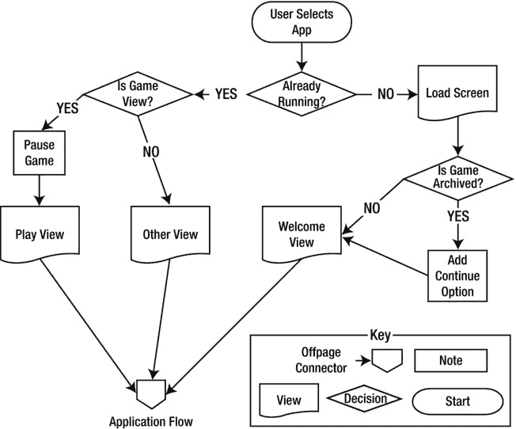

图 3-11.  示例应用程序的初始化生命周期

在图 3-11 中，我们看到所有应用程序都是通过用户点击应用程序图标启动的。然后，会发生两种情况之一：要么应用程序（如果已在后台运行）会被带到前台；要么应用程序将全新启动。如果应用程序已经在运行，它就会完全按照用户离开时的样子显示在屏幕上；我们不需要编写任何代码来重新建立状态。在动作游戏中，你可能希望在应用程序被带到前台时暂停游戏；这会给用户在恢复游戏前一个重新适应的机会。无论哪种方式，我们都会回到图 3-1 中展示的应用程序流程。

如果应用程序尚未运行，我们会正常显示加载屏幕，然后检查游戏状态是否已被归档。如果是，我们希望解档游戏状态并显示“继续”按钮。然后，我们继续执行图 3-1 中展示的流程。为了支持需要解档游戏状态的情况，我们显然需要在某个时间点对其进行归档。让我们先来看一下归档逻辑，然后再看解档逻辑。

## 归档和解档游戏状态

在示例应用程序中，我们将游戏状态存储在一个名为 `CoinsGame` 的类中。我们将把这个类的一些实现细节留到下一章介绍，但由于我们知道它正在被归档和解档，因此我们知道它可能遵循 `NSCoding` 协议。事实也确实如此——列表 3-17 展示了两个 `NSCoding` 任务的实现。

**列表 3-17.** CoinsGame.m（encodeWithCoder: 和 initWithCoder:）
```
- (void)encodeWithCoder:(NSCoder *)encoder{
    [encoder encodeObject:coins forKey:@"coins"];
    [encoder encodeInt:remaingTurns forKey:@"remaingTurns"];
    [encoder encodeInt:score forKey:@"score"];
    [encoder encodeInt:colCount forKey:@"colCount"];
    [encoder encodeInt:rowCount forKey:@"rowCount"];
}
- (id)initWithCoder:(NSCoder *)decoder{
    coins = [[decoder decodeObjectForKey:@"coins"] retain];
    remaingTurns = [decoder decodeIntForKey:@"remaingTurns"];
    score = [decoder decodeIntForKey:@"score"];
    colCount = [decoder decodeIntForKey:@"colCount"];
    rowCount = [decoder decodeIntForKey:@"rowCount"];
    return self;
}
```
在列表 3-17 中，我们看到 `CoinsGame` 用于支持归档和解档的任务。在每个任务中，都会对许多属性进行编码或解码——想必这没什么令人惊讶的。对象可以在应用程序生命周期的任何时间点进行归档，但是当应用程序即将关闭或终止时，会调用一些特殊任务。它们如下所示：

```
- (void)applicationWillTerminate:(UIApplication *)application
- (void)applicationDidEnterBackground:(UIApplication *)application
```

`applicationWillTerminate:` 任务恰好在应用程序被终止之前被调用。


其同级任务`applicationDidEnterBackground:`类似，但在应用被发送到后台时调用。如果你的应用支持后台执行（新项目中的默认设置），则不会调用`applicationWillTerminate:`；你必须将归档逻辑放在`applicationDidEnterBackground:`中。这是因为用户可能随时在后台退出应用，因此在应用完全活跃时预先处理记账工作是合理的。应用委托还有许多其他生命周期任务可用。当你在 Xcode 中创建新项目时，这些任务会自动添加到你的应用委托类中，并附有良好的文档。

## 实现生命周期任务

由于我们的应用支持后台执行，我们将归档逻辑放入`applicationDidEnterBackground:`任务中，如清单 3-18 所示。

**清单 3-18.** `Sample_03AppDelegate.m` (`applicationDidEnterBackground:`)

```objective-c
- (void)applicationDidEnterBackground:(UIApplication *)application {
    NSString* gameArchivePath = [self gameArchivePath];
    [NSKeyedArchiver archiveRootObject:[gameController currentGame] toFile: gameArchivePath];
}
```

为了归档游戏状态，清单 3-18 显示我们再次使用`NSKeyedArchiver`类归档`CoinsGame`对象，但这次将其归档到文件中。变量`gameArchivePath`是我们将用作存档的文件的路径。我们通过调用任务`gameArchivePath`获得此路径，如清单 3-19 所示。

**清单 3-19.** `Sample_03AppDelegate.m` (`gameArchivePath`)

```objective-c
-(NSString*)gameArchivePath{
    NSArray* paths = NSSearchPathForDirectoriesInDomains(NSDocumentDirectory, NSUserDomainMask, YES);
    NSString* documentDirPath = [paths objectAtIndex:0];
    return [documentDirPath stringByAppendingPathComponent:@"GameArchive"];
}
```

清单 3-19 中的`gameArchivePath`任务显示，我们使用函数`NSSearchPathForDirectoriesInDomains`，并传入`NSDocumentDirectory`，与`NSUserDomainMask`进行掩码操作。结尾的`YES`表示我们希望用于指示用户主目录的波浪号被扩展为完整路径。iOS 设备上的每个应用都有一个根目录，可以从中读取和写入文件。通过获取路径`NSArray`中的第零个元素，我们可以访问该目录。我们只需指定要使用的文件名，将`NSString`传递给`documentDirPath`的`stringByAppendingPathComponent`任务即可。

当我们解归档`CoinsGame`对象时，显然也需要存档文件的路径。清单 3-20 显示了我们在何处解归档此对象。

**清单 3-20.** `Sample_03AppDelegate.m` (`application:didFinishLaunchingWithOptions:`)

```objective-c
- (BOOL)application:(UIApplication *)application didFinishLaunchingWithOptions:(NSDictionary *)launchOptions {
    NSString* gameArchivePath = [self gameArchivePath];
    CoinsGame* existingGame;
    @try {
        existingGame = [[NSKeyedUnarchiver unarchiveObjectWithFile:gameArchivePath] retain];
    }
    @catch (NSException *exception) {
        existingGame = nil;
    }
    [gameController setPreviousGame:existingGame];
    [existingGame release];
    [self.window makeKeyAndVisible];
    return YES;
}
```

在清单 3-20 中，我们看到的是当我们的应用完全加载并准备就绪时调用的任务。你会想起上一章的最后两行：它们将`UIWindow`放到屏幕上，并返回一切正常。任务的前面部分与解归档游戏状态有关。

使用`gameArchivePath`，我们在类`NSKeyedUnarchiver`上调用`unarchiveObjectFromFile`。如果之前归档的`CoinsGame`对象存在，则返回该对象。如果这是应用首次运行，`existingGame`将为`nil`。此外，如果发生异常，我们也将`existingGame`设置为`nil`，因为我们知道在`gameController`上调用`setPreviousGame`可以处理`nil`值。为了完成这个流程，让我们看看`GameController`如何处理这个解归档后的`CoinsGame`，如清单 3-21 所示。

**清单 3-21.** `GameController.m` (`setPreviousGame:`)

```objective-c
-(void)setPreviousGame:(CoinsGame*)aCoinsGame{
    previousGame = [aCoinsGame retain];

    if (previousGame != nil && [previousGame remaingTurns] > 0){
        [continueButton setHidden:NO];
    } else {
        [continueButton setHidden:YES];
    }
}
```

在清单 3-21 中，我们看到传入的`CoinsGame`被保存为本地字段`previousGame`并进行了保留。如果`previousGame`不为`nil`并且还有剩余回合，我们显示按钮`continueButton`；否则将其隐藏。一旦用户看到欢迎视图，他们将能够从之前离开的地方继续玩游戏。

## 总结

在本章中，我们探讨了完整游戏所需的支持元素。这些元素包括建立应用程序的流程以及管理构成此流程的视图。我们研究了一种协调游戏行为的方法，例如分数变化或游戏结束，并使用委托模式与应用程序的其余部分进行交互。我们还研究了两种持久化数据的方式：通过用户设置或在磁盘上存储对象。这两种技术都使用了协议`NSCoding`提供的相同归档和解归档技术。

## 第四章 快速构建一个输入驱动的游戏

所有游戏都由用户输入驱动，但根据游戏在用户操作之间的行为方式，游戏可以分为两种类型。一种是动作游戏，无论用户是否提供输入，屏幕上的事件都会展开。动作游戏将在第 5 章中探讨。在本章中，我们将讨论等待用户做出选择的游戏。这类游戏包括益智游戏和策略游戏。在本章中，我们将其称为输入驱动的游戏。

尽管输入驱动游戏的酷炫程度确实低于动作游戏，但市场上有很多成功的此类游戏。从扫雷到数独再到愤怒的小鸟，这类游戏吸引了大量用户，因此了解如何实现此类游戏非常重要。图 4-1 展示了输入驱动游戏的典型生命周期。

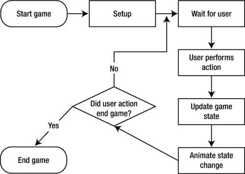

图 4-1. Coin Sorter——一个简单的输入驱动游戏

在图 4-1 中，在任何初始设置之后，应用程序等待用户采取某些操作。当用户执行操作时，游戏状态会更新，并创建动画来反映用户的操作。由此用户操作创建的动画可以很简单，例如高亮选择，也可以很复杂，例如完整的物理模拟。动画完成后，应用程序测试是否已到达游戏结束。如果尚未结束，应用程序将再次等待用户输入。

在本章中，你将探索如何创建遵循图 4-1 概述的流程的游戏。你还将了解将内容显示到屏幕上以及创建动画的细节。

## 探索如何将内容显示到屏幕上

在上一章中，我们组装了视图以创建一个完整的应用程序。


我们曾使用 Interface Builder 创建 UI 元素，并且大多数情况下只是通过将一个视图替换为另一个视图来引导用户在不同视图间切换。在本章中，我们将深入探究 `UIView`，以及如何利用它以编程方式创建动态内容。这包括探索如何在屏幕上放置组件以及为它们添加动画效果。

## 理解 `UIView`

`UIView` 类是 UIKit 的基础组件类。其他所有 UI 元素，如按钮、开关和滚动视图等，都是 `UIView` 的子类。甚至 `UIWindow` 类本身也是 `UIView` 的子类，因此当我们在屏幕上操作内容时，大部分工作实际上都是在与 `UIView` 类进行交互。

`UIView` 类的工作方式与其他编程环境中的基础 UI 组件类非常相似。每个 `UIView` 都定义了屏幕上的一个区域，并拥有若干子视图（subviews），这些子视图是相对于其父视图进行绘制的。图 4-2 展示了 `UIView` 实例的示例布局。

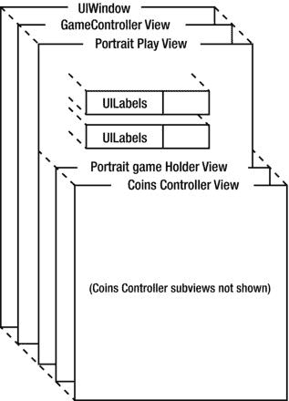

图 4-2. 嵌套的 `UIView` 实例

在图 4-2 中，你可以在背景中看到示例应用的根 `UIWindow`。当用户看到游戏视图时，`UIWindow` 有一个子视图，即与 `GameController` 类关联的 `view` 属性。当用户点击“新游戏”按钮时，`GameController` 会将纵向游戏视图（Portrait Play view）作为其视图的子视图添加。纵向游戏视图有五个子视图，这些子视图在 XIB 文件中定义。其中四个子视图是用于显示和追踪用户得分及剩余回合数的 `UILabel`。第五个 `UIView` 是纵向游戏容器视图（Portrait Game Holder view），它负责定义来自 `CoinsController` 的视图所放置的区域。来自 `CoinsController` 的视图有多个子视图，它们构成了游戏的交互部分。稍后你将更详细地了解这些视图，但现在只需明白，这些视图的添加方式与其他视图完全相同。

关于图 4-2，另一点需要注意的是，并非所有视图都放置在相对于其父视图的相同位置上。例如，纵向游戏视图位于 `GameController` 视图的左上角，而纵向游戏容器视图则大致放置在其父视图（纵向游戏视图）的中间偏下位置。子视图的 `frame` 属性决定了它相对于父视图的位置。图 4-3 更详细地展示了这一点。

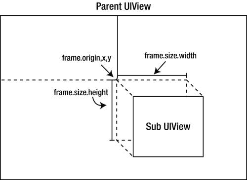

图 4-3. `UIView` 的 frame

如图 4-3 所示，`UIView` 的 frame 不仅描述了子视图的位置，还描述了视图的大小。通常来说，`frame` 用于描述子视图的区域。`frame` 属性是一个 `CGRect` 类型的结构体，由另外两个结构体 `origin` 和 `size` 组成。`origin` 字段是 `CGPoint` 类型，以点（points）为单位描述了子视图左上角的位置。`size` 字段是 `CGSize` 类型，描述了子视图的宽度和高度（以点为单位）。

### 核心图形类型定义

Core Graphics 定义了许多类型、结构体和函数。其中包括前面提到的 `CGRect`、`CGPoint` 和 `CGSize`。代码清单 4-1 展示了这三个结构体的定义。

**代码清单 4-1.** `CGGeometry.h (CGRect、CGPoint 和 CGSize)`

```
/* 点。 */
struct CGPoint {
  CGFloat x;
  CGFloat y;
};
typedef struct CGPoint CGPoint;

/* 尺寸。

*/
struct CGSize {
  CGFloat width;
  CGFloat height;
};
typedef struct CGSize CGSize;

/* 矩形 */
{
  CGPoint origin;
  CGSize size;
};
typedef struct CGRect CGRect;
```

代码清单 4-1 列出了定义子视图相对于其父视图区域的核心结构体。这些结构体定义于 `CGGeometry.h` 文件中，该文件属于 Core Graphics 框架，是任何 iOS 项目的标准组成部分。注意，`x`、`y`、`width` 和 `height` 值的类型被定义为 `CGFloat`。这些值的单位是点（points），而非像素（pixels）。这种差异起初可能不易察觉，但其含义在于，你通过这些值指定的坐标和大小是与分辨率无关的。关于点与像素的进一步讨论，请参见附录 A。

**提示：** 在诸如 `CGRect` 这样的结构体名称中，字母 CG 指的是 Core Graphics 框架。因此，当需要精确表达时，`CGRect` 被称为 Core Graphics 矩形。

要创建代码清单 4-1 中的任何基本几何类型，可以在 `CGGeometry.h` 中使用内联实用函数，如代码清单 4-2 所示。

**代码清单 4-2.** `CGGeometry.h (CGPointMake、CGSizeMake 和 CGRectMake)`

```
/*** 内联函数定义。 ***/

CG_INLINE CGPoint CGPointMake(CGFloat x, CGFloat y) {
  CGPoint p; p.x = x; p.y = y; return p;
}
CG_INLINE CGSize CGSizeMake(CGFloat width, CGFloat height) {
  CGSize size; size.width = width; size.height = height; return size;
}
CG_INLINE CGRect CGRectMake(CGFloat x, CGFloat y, CGFloat width, CGFloat height) {
    CGRect rect;
    rect.origin.x = x; rect.origin.y = y;
    rect.size.width = width; rect.size.height = height;
    return rect;
}
```

代码清单 4-2 展示了可用于创建新几何值的实用函数。这里只展示了定义，因为这些函数的声明很简单。`CGFloat` 类型被简单地定义为 `float`。推测这样做是为了将来可能更改以支持不同的架构。另外，`CG_INLINE` 只是被定义为 `static inline`，表示编译器可能会将编译后的版本内联到调用代码中。

### 使用 Core Graphics 类型

Core Graphics 定义的类型和函数非常直观。让我们看一个例子来说明它们的用法。代码清单 4-3 展示了将一个 `UIView` 添加到另一个 `UIView` 的特定区域。

**代码清单 4-3.** `添加子视图并指定 frame 的示例`

```
UIView* parentView = [[UIView alloc] initWithFrame:CGRectMake(0, 0, 480, 320)];
UIView* subView = [UIView new];

CGRect frame = CGRectMake(200, 100, 30, 40);
[subView setFrame:frame];

[parentView addSubview:subView];
```

在代码清单 4-3 中，我们以两种不同的方式创建了两个 `UIView`。`UIView parentView` 是通过更标准的方式创建的：调用 `alloc`，然后调用 `initWithFrame:` 并传入一个新的 `CGRect` 来指定其位置和尺寸。另一种完全有效的创建 `UIView` 的方式是直接调用 `new`，然后设置 `frame` 属性，正如我们对 `subView` 所做的。这段代码片段的最后一步是通过调用 `addSubview:` 将 `subView` 添加到 `parentView`。结果将类似于前面展示的图 4-3。

既然你已经了解了 `UIView` 子类的基本概念，以及它们如何嵌套和放置，现在可以看看一些基本的动画效果。这将为你理解我们简单游戏所需的知识打下基础。

## 理解动画

创建一个事件驱动的游戏有两个关键组成部分：第一是创建动画，第二是管理游戏状态。在 iOS 应用中有多种创建动画的方式。


在前一章中，我们实现了视图之间的过渡动画。在本节中，我们将回顾这些动画的实现方式，并展示一个类似的示例以加深你的理解。在本章末尾，你将了解第三种技术，该技术探讨了前两个示例所使用的支持类。

## UIView 的静态动画任务

类`UIView`提供了静态任务，旨在简化基本动画的创建。这些任务同样可用于触发预设动画，例如切换视图时的过渡效果。图 4-4 展示了用户从高分视图切换到欢迎视图时发生的预设动画。

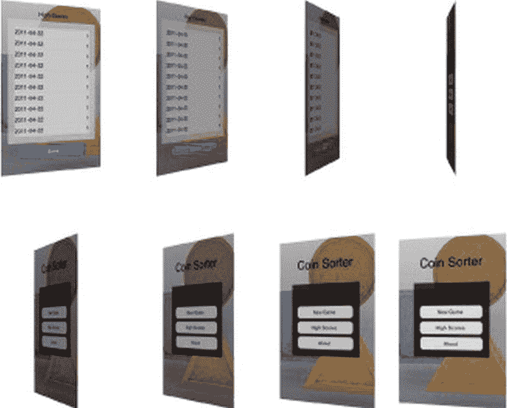

图 4-4. 翻转动画

从图 4-4 的左上角开始，高分视图从左向右翻转，直到变成一条细线。动画继续，以平滑且视觉上吸引人的过渡方式显示欢迎视图。这只是 iOS 众多内置动画之一。用户已学会这种标准过渡表示上下文的变化。要理解此动画如何触发，让我们先查看第 3 章中用于从高分视图切换到欢迎视图的步骤。这些步骤如代码清单 4-4 所示。

**代码清单 4-4.** `GameController.m (highscoreDoneClicked:)`

```objc
- (IBAction)highscoreDoneClicked:(id)sender {
    [UIView beginAnimations:@"AnimationId" context:@"flipTransitionToBack"];
    [UIView setAnimationDuration:1.0];
    [UIView setAnimationTransition:UIViewAnimationTransitionFlipFromLeft forView:self.view cache:YES];
    [highscoreController.view removeFromSuperview];
    [self.view addSubview: welcomeView];
    [UIView commitAnimations];
}
```

代码清单 4-4 显示了用户在“完成”按钮上触摸时调用的任务。该任务的第一行调用了静态任务`beginAnimations:context:`。这个任务有点像启动数据库事务，因为它创建了一个动画对象，并且在调用`commitAnimations`之前对`UIView`实例所做的任何更改都将成为此动画的一部分。传递给`beginAnimations:context:`的第一个`NSString`是支持动画对象的标识符。第二个`NSString`与之类似，用于提供有关动画创建时间的额外上下文。在此示例中，这两个字符串可以为`nil`，因为定义动画后我们并不真正关心它。在下一个示例中，我们将利用这些字符串来定义动画完成时要运行的代码。

调用`beginAnimations:context:`之后，通过调用`setAnimationDuration:`来定义动画的持续时间。传入的值是动画应运行的秒数。调用`setAnimationTransition:forView:cache:`表示我们希望使用 iOS 提供的某种预设动画。我们选择的动画是`UIViewAnimationFlipFromLeftForView`。由于这是一个过渡动画，我们指定视图`self.view`，即内容正在变化的父视图。

设置动画后，下一步（如代码清单 4-4 所示）是对场景进行我们想要动画化的更改。由于此任务负责将显示的视图从高分视图切换到欢迎视图，我们只需从父视图（`self.view`）中移除视图`highscoreController.view`，并将`welcomeView`添加到`self.view`。最后，我们提交动画，使其显示给用户。

我们可以使用`UIView`的这些静态任务来创建其他动画，而不仅仅是 iOS 提供的那些。让我们更新从欢迎屏幕到高分屏幕的过渡，使其像图 4-5 所示那样淡入淡出。

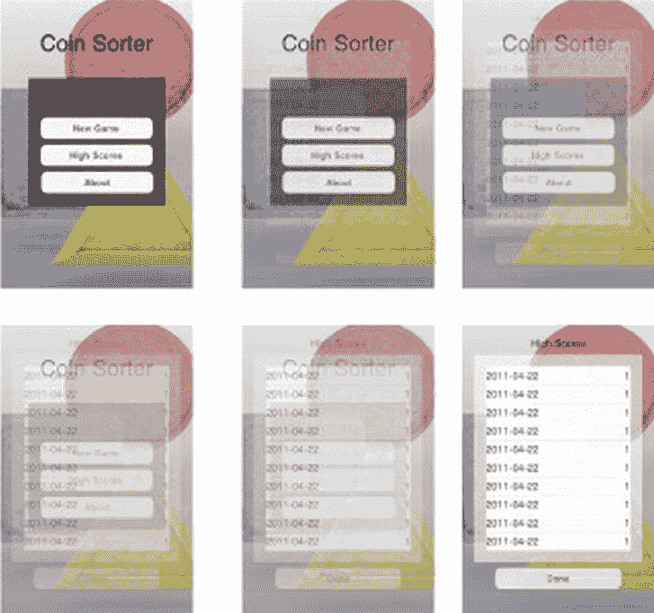

图 4-5. 淡入淡出过渡动画

在此淡入淡出过渡中，欢迎视图被高分视图替换。这是通过在一段时间内改变每个视图的不透明度来实现的。在此动画期间，两个视图都是场景的一部分。结束时，我们想要移除欢迎视图，以与游戏中管理视图的方式保持一致。创建此过渡的代码如代码清单 4-5 所示。

**代码清单 4-5.** `GameController.m (highScoresClicked:)`

```objc
- (IBAction)highScoresClicked:(id)sender {
    //Make high score view 100% clear and add it on top of the welcome view.
    [highscoreController.view setAlpha:0.0];
    [self.view addSubview:highscoreController.view];
    //set up animation
    [UIView beginAnimations:nil context:@"fadeInHighScoreView"];
    [UIView setAnimationDuration:1.0];
    [UIView setAnimationDelegate:self];
    [UIView setAnimationDidStopSelector:@selector(animationDidStop:finished:context:)];
    //make changes
    [welcomeView setAlpha:0.0];
    [highscoreController.view setAlpha:1.0];
    [UIView commitAnimations];
}
```

代码清单 4-5 中所示的任务在用户点击主视图中的“Highscores”按钮时调用。为了创建淡入淡出效果，我们利用了`UIView`类的静态动画任务，但首先需要设置一些东西。我们首先将与`highscoreController`关联的视图的`alpha`属性设置为`0.0`，即完全透明。然后，我们将高分视图添加到根视图。这将其放置到已存在的`welcomeView`之上，但由于它是透明的，我们只能看到欢迎屏幕。

通过调用任务`beginAnimations:context:`来设置动画，持续时间通过任务`setAnimationDuration:`设置。下一步是为正在创建的动画设置一个委托。我们还想通过调用`setAnimationDidStopSelector:`来设置动画完成时应调用的任务。动画设置完成后，我们只需将`welcomeView`的`alpha`属性设置为`0.0`，并将高分视图的`alpha`设置为`1.0`。这表明在动画结束时，我们希望欢迎视图透明，高分视图完全不透明。然后，我们通过调用`commitAnimations`指示已设置完成状态。

我们将`self`设置为动画的委托，并设置任务`animationDidStop:finished:context:`在动画结束时被调用。这样做的目的是在动画结束时进行一些清理工作，并确保应用程序处于正确状态。代码清单 4-6 展示了此回调方法的实现。

**代码清单 4-6.** `GameController.m (animationDidStop:finished:context:)`

```objc
- (void)animationDidStop:(NSString *)animationID finished:(NSNumber *)finished context:(void *)context{
    if ([@"fadeInHighScoreView" isEqual:context]){
        [welcomeView removeFromSuperview];
        [welcomeView setAlpha:1.0];
    }
}
```

代码清单 4-6 中的任务在淡入淡出动画结束时被调用。在此任务中，我们想要从场景中移除`welcomeView`，并将其`alpha`重置为`1.0`。我们将其移除，因为这是其他过渡的预期状态。将`alpha`重置回`1.0`确保`welcomeView`在重新添加回场景时是可见的。


你已经了解到，通过使用 `frame` 属性可以将一个视图添加到其父视图中。你也学会了如何通过探索淡入淡出转场来创建影响 `UIView` 属性的动画。我们将结合这些概念，向你展示如何为游戏中的金币制作动画，但首先你需要了解我们是如何设置相关类，以使这一切有意义的。

## 构建游戏 Coin Sorter

到目前为止，我们已经了解了将内容显示到屏幕上的部分细节。在前几章中，我们探讨了控制器类的作用，以及它们如何管理数据与视图之间的关系。创建 Coin Sorter 游戏的最后一步就是结合这些概念。本节将介绍 `CoinController` 类的生命周期，并涉及我们已经探讨过的基础概念。Figure 4-6 展示了由 `CoinController` 类控制的屏幕区域。

在这个 5×5 的金币网格中，用户可以选择两个金币进行交换。目标是创建由相同金币组成的行或列，以形成匹配集。当匹配成功时，金币会在屏幕上产生动画效果，并且用户的得分会增加。用户有 10 次机会来尽可能多地完成匹配。Figure 4-7 展示了游戏的生命周期。

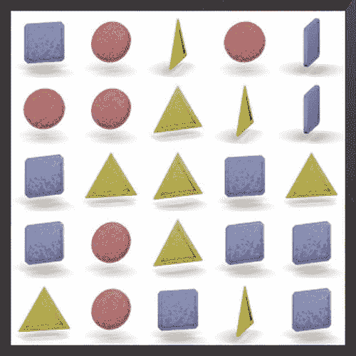

Figure 4-6.  `CoinController` 的视图

Figure 4-7 展示了单次游戏的应用程序流程。设置完成后，应用程序等待用户选择一枚金币。如果未选择第一枚金币，应用程序仅会记录被选中的金币，然后返回等待用户操作。当用户第二次选择金币时，应用程序会检查此次选中的金币是否与第一枚相同。如果是，则取消选择该金币，这允许用户改变主意。如果用户选择了不同的金币，游戏状态会通过修改 `CoinGame` 对象来更新，并创建动画显示两枚金币交换位置。当金币交换动画完成后，应用程序会检查是否存在任何匹配。如果存在，则播放移除匹配金币的动画，并用新金币更新 `CoinGame` 以替换刚被移除的那些金币。由于添加新金币可能会产生更多匹配，应用程序会再次检查匹配。理论上，这个过程可能无限循环，但实际上不会。最终，将没有匹配需要移除。

当没有匹配时，应用程序会检查用户是否还有剩余回合。如果有，则返回等待用户输入。如果没有，游戏结束。

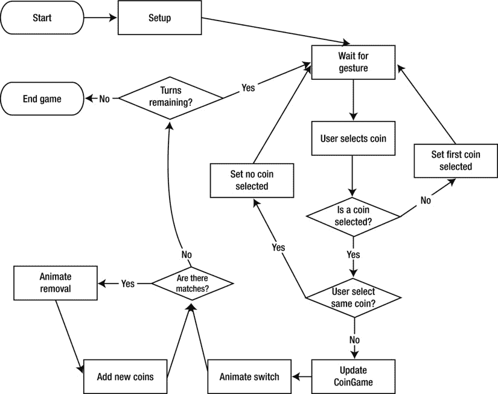

Figure 4-7.  Coin Sorter 生命周期

## 实现游戏状态

Figure 4-7 中展示的逻辑在 `CoinsController` 类中实现。为了帮助你理解 `CoinsController` 类如何创建 Coin Sorter 游戏，让我们来看看头文件。你可以从中获得该类的概览，如 Listing 4-7 所示。

**Listing 4-7.**  `CoinsController.h`

```objective-c
#import <UIKit/UIKit.h>
#import "CoinsGame.h"

@class CoinsController;
@protocol CoinsControllerDelegate <NSObject>

-(void)gameDidStart:(CoinsController*)aCoinsController with:(CoinsGame*)game;
-(void)scoreIncreases:(CoinsController*)aCoinsController with:(int)newScore;
-(void)turnsRemainingDecreased:(CoinsController*)aCoinsController with:(int)turnsRemaining;
-(void)gameOver:(CoinsController*)aCoinsController with:(CoinsGame*)game;
s
@end

@interface CoinsController : UIViewController {
    CoinsGame* coinsGame;
    UIView* coinsView;
    NSMutableArray* imageSequences;
    BOOL isFirstCoinSelected;
    Coord firstSelectedCoin;
    Coord secondSelectedCoin;
    BOOL acceptingInput;
    UIImageView* coinViewA;
    UIImageView* coinViewB;
    NSMutableArray* matchingRows;
    NSMutableArray* matchingCols;
    IBOutlet id <CoinsControllerDelegate> delegate;
}
@property (nonatomic, retain) CoinsGame* coinsGame;
@property (nonatomic, retain) id <CoinsControllerDelegate> delegate;
+(NSArray*)fillImageArray:(int)coin;

-(void)loadImages;
-(void)newGame;
-(void)continueGame:(CoinsGame*)aCoinsGame;
-(void)createAndLayoutImages;
-(void)tapGesture:(UIGestureRecognizer *)gestureRecognizer;
-(Coord)coordFromLocation:(CGPoint) location;
-(void)doSwitch:(Coord)coordA With:(Coord)coordB;
-(void)checkMatches;
-(void)updateCoinViews;

-(void)spinCoinAt:(Coord)coord;
-(void)stopCoinAt:(Coord)coord;

-(void)doEndGame;
@end
```

`CoinsController` 类的这个头文件描述了这个类以及委托协议 `CoinsControllerDelegate`，该协议在 Chapter 3 中已讨论过。`CoinsGame` 字段用于存储游戏状态。该对象可以被归档以保存游戏状态，或者传递给 `CoinsController` 的实例以恢复游戏。`UIView coinsView` 是白色的游戏区域。`BOOL isFirstCoinSelected` 用于记录用户是否已经选择了一枚金币。两个 `Coord` 结构体记录了哪些金币被选中。我们很快会看一下 `Coord` 结构体。`BOOL acceptingInput` 用于在动画播放时阻止用户输入。

两个 `UIImageView` 字段 `coinViewA` 和 `coinViewB`，以及 `NSMutableArray` 变量 `matchingRows` 和 `matchingCols` 在动画期间用于跟踪正在被动画化的内容。最后一个字段是该类的委托，它必须实现 `CoinsControllerDelegate` 协议。

## 初始化与设置

`CoinController` 对象的生命周期始于调用 `viewDidLoad` 任务时。由于我们在 XIB 文件中拥有一个 `CoinController` 实例，该任务会被自动调用。Listing 4-8 展示了这个任务。

**Listing 4-8.**  `CoinController.m (viewDidLoad)`

```objective-c
- (void)viewDidLoad {
    [super viewDidLoad];
    [self.view setBackgroundColor:[UIColor clearColor]];
    CGRect viewFrame = [self.view frame];
    //border is 3.125%
    float border = viewFrame.size.width*.03125;
    float coinsViewWidth = viewFrame.size.width-border*2;
    CGRect coinsFrame = CGRectMake(border, border, coinsViewWidth, coinsViewWidth);
    coinsView = [[UIView alloc] initWithFrame: coinsFrame];
    [coinsView setBackgroundColor:[UIColor whiteColor]];
    [coinsView setClipsToBounds:YES];
    [self.view addSubview:coinsView];
    UITapGestureRecognizer* tapRecognizer = [[UITapGestureRecognizer alloc] initWithTarget:self action:@selector(tapGesture:)];
    [tapRecognizer setNumberOfTapsRequired:1];
    [tapRecognizer setNumberOfTouchesRequired:1];
    [coinsView addGestureRecognizer:tapRecognizer];
}
```

在 `viewDidLoad` 任务中，我们需要处理几个小问题。首先，我们调用 `viewDidLoad` 的父类实现。虽然这不是严格必需的，但这是一个好习惯。如果我们将来想要更改 `CoinsController` 的父类，我们可能会花费大量时间排查为何初始化不正确的各种问题。


```markdown
任务`viewDidLoad`的下一步是设置一些`UIView`实例来完成我们想要的操作。参考图 4-6，我们看到包含硬币的白色区域周围有一个半透明的边框。这个半透明视图实际上是容器视图（`holder view`），为了确保其可见，我们将该类的根视图设置为完全透明。白色方形区域是名为`coinsView`的`UIView`，它是作为硬币的子视图的父视图。我们根据父视图的`frame`计算`coinsView`的大小。在 iPhone 上，`coinsViewWidth`的值为 300 点；在 iPad 上，`coinsViewWidth`的值为 720 点。将`coinsView`的背景设置为白色后，我们将`clipToBounds`属性设置为`true`。这将防止硬币在动画移出屏幕时被绘制到白色区域之外。

`viewDidLoad`中最后一项任务是向`coinsView`注册一个手势识别器。在这里，我们希望在用户点击`coinsView`时得到通知，因此我们使用一个名为`tapRecognizer`的`UITapGestureRecognizer`。初始化`tapRecognizer`时，我们将`self`设置为目标，并指定任务`tapGesture:`作为`tapRecognizer`检测到点击手势时要调用的任务。通过设置所需的点击次数和触摸次数，我们确保拾取到用户发出的正确手势。将`tapRecognizer`添加到`coinsView`完成了手势识别器的设置。关于 iOS 如何处理手势的更多信息，请参见第 8 章。

## 开始新游戏

在调用`viewDidLoad`之后，`CoinsController`将用于开始新游戏或继续旧游戏。我们先来看一下`newGame`任务，如代码清单 4-9 所示。

**代码清单 4-9.** `CoinsController.m (newGame)`

```
-(void)newGame{
    for (UIView* view in [coinsView subviews]){
        [view removeFromSuperview];
    }

    [coinsGame release];
    coinsGame = [[CoinsGame alloc] initRandomWithRows:5 Cols:5];
    [self createAndLayoutImages];
    [delegate gameDidStart:self with: coinsGame];

    acceptingInput = YES;
}
```

当欢迎界面上点击“新游戏”按钮时，会调用`newGame`任务。首先要做的是从`coinsView`中移除旧的子视图。（如果用户刚刚启动应用程序，可能没有任何子视图需要移除。）`coinsGame`对象先被释放，然后被设置为一个预填充了随机硬币值的新实例。下一步是调用`createAndLayoutImages`，它将在屏幕上放置硬币。`continueGame:`和`newGame`都会调用此任务，因此我们将在查看`continueGame:`之后再看它。最后要做的是通知所有代理新游戏已开始，并将`acceptingInput`设置为`YES`。

## 继续游戏

如果用户上次退出时游戏正在进行中，用户可能希望从上次停止的地方继续游戏。这可以通过点击欢迎视图中的“继续”按钮来完成。按下该按钮时，会调用`continueGame`任务，它与`newGame`非常相似。代码清单 4-10 展示了`continueGame:`。

**代码清单 4-10.** `CoinsController.m (continueGame:)`

```
-(void)continueGame:(CoinsGame*)aCoinsGame{
    for (UIView* view in [coinsView subviews]){
        [view removeFromSuperview];
    }
    [coinsGame release];
    coinsGame = aCoinsGame;

    [self createAndLayoutImages];
    [delegate gameDidStart:self with: coinsGame];

    acceptingInput = YES;
}
```

任务`continueGame:`接受一个`CoinsGame`对象作为参数，参数名为`aCoinsGame`。清除`coinsView`的旧子视图后，我们将`coinsGame`设置为传入的`aCoinsGame`对象。然后调用`createAndLayoutImages`，将硬币添加到场景中。我们调用代理任务`gameDidStart:coinsGame:`，以便代理有机会更新跟踪当前分数和剩余回合的`UILabel`对象。最后，我们将`acceptingInput`设置为`YES`。

## 为每个硬币初始化 UIView

如前所述，`newGame`和`continueGame:`都会调用`createAndLayoutImages`任务。此任务负责游戏的初始设置，主要是为游戏中的每个硬币创建一个`UIImageView`。该任务如代码清单 4-11 所示。

**代码清单 4-11.** `CoinsController.m (createAndLayoutImages)`

```
-(void)createAndLayoutImages{
    int rowCount = [coinsGame rowCount];
    int colCount = [coinsGame colCount];

    CGRect coinsFrame = [coinsView frame];
    float width = coinsFrame.size.width/colCount;
    float height = coinsFrame.size.height/rowCount;

    for (int r = 0;r < rowCount;r++){
        for (int c = 0;c < colCount;c++){

            UIImageView* imageView = [[UIImageView alloc] init];
            CGRect frame = NnCGRectMake(c*width, r*height, width, height);
            [imageView setFrame:frame];

            [coinsView addSubview: imageView];
            [self spinCoinAt:CoordMake(r, c)];
        }
    }
}
```

代码清单 4-11 显示了游戏中要使用的行数和列数。在此示例中，两者都是 5。`coinsView`的`frame`存储在变量`coinsFrame`中以便引用，并计算每个硬币视图的`width`和`height`。两个`for`循环为每一行和每一列创建一个`imageView`，设置其`frame`，并将其添加到`coinsView`中。在嵌套循环中，调用了`spinCoinAt:`，它创建了硬币旋转效果。请注意，传递给`spinCoinAt:`的参数是函数`CoordMake`的结果。我们在查看`spinCoinAt:`（如代码清单 4-12 所示）之后，再查看这个函数和`CoinsGame`类。

**代码清单 4-12.** `CoinsController.m (spinCoinAt:)`

```
-(void)spinCoinAt:(Coord)coord{
    UIImageView* coinView = [[coinsView subviews] objectAtIndex:[coinsGame indexForCoord:coord]];

    NSNumber* coin = [coinsGame coinForCoord:coord];
    NSArray* images = [imageSequences objectAtIndex:[coin intValue]];
    [coinView setAnimationImages: images];
    NSTimeInterval interval = (random()%4)/10.0 + .6;
    [coinView setAnimationDuration: interval];
    [coinView startAnimating];
}
```

你可以看到`spinCoinAt:`接受一个`Coord`类型的参数。该类型在`CoinsGame.h`中定义，是一个表示特定行和列上硬币的结构体。在此任务的第一行中，使用`Coord`结构体来查找代表该特定硬币的`UIView`的索引。之所以能这样做，是因为每个硬币恰好对应一个`UIImageView`（这是在代码清单 4-11 中设置的）。找到正确的`UIImageView`后，我们从`coinsGame`对象中获取该硬币的值。`NSNumber coin`表示这组特定坐标的硬币类型——要么是三角形、正方形，要么是圆形。使用`coin`的`intValue`，我们从`imageSequences`中取出一个名为`images`的`NSArray`。`NSArray image`存储了构成旋转硬币动画的所有图片。通过在`UIImageView coinView`上调用`setAnimationImages:`，我们指示这个`UIIMageView`循环遍历`images`中的每个`UIIMage`以产生动画效果。将动画持续时间设置为随机值并调用`startAnimating`，就创建了旋转效果。在设置的这一阶段，应用程序看起来会非常像之前显示的图 4-6。我们现在已经准备好开始接受用户输入。
```


在开始之前，我们先仔细看看`CoinsGame`类，以便理解我们是如何表示这 25 枚硬币及其类型的。  
**模型**  
你已经看过了设置代码，它使用`UIViews`和`UIImageViews`在屏幕上创建了表示游戏的场景。你知道游戏由 25 枚硬币组成，排列成 5x5 的网格。现在，我们来看看负责管理这些数据的类，让我们先看`CoinsGame.h`，如清单 4-13 所示。

**[清单 4-13.]** `CoinsGame.h`

```objc
#import <Foundation/Foundation.h>

#define COIN_TRIANGLE 0
#define COIN_SQUARE 1
#define COIN_CIRCLE 2

struct Coord {
    int row;
    int col;
};
typedef struct Coord Coord;

CG_INLINE Coord CoordMake(int r, int c) {
    Coord coord;
    coord.row = r;
    coord.col = c;
    return coord;
}

CG_INLINE BOOL CoordEqual(Coord a, Coord b) {
    return a.col == b.col && a.row == b.row;
}

@interface CoinsGame : NSObject < NSCoding > {
    NSMutableArray* coins;
    int remaingTurns;
    int score;
    int colCount;
    int rowCount;
}

@property (nonatomic, retain) NSMutableArray* coins;
@property (nonatomic) int remaingTurns;
@property (nonatomic) int score;
@property (nonatomic) int colCount;
@property (nonatomic) int rowCount;

-(id)initRandomWithRows:(int)rows Cols:(int)cols;

-(NSNumber*)coinForCoord:(Coord)coord;
-(int)indexForCoord:(Coord)coord;

-(void)swap:(Coord)coordA With:(Coord)coordB;
-(NSMutableArray*)findMatchingRows;
-(NSMutableArray*)findMatchingCols;
-(void)randomizeRows:(NSMutableArray*)matchingRows;
-(void)randomizeCols:(NSMutableArray*)matchingCols;

@end
```

清单 4-13 展示了`CoinsGame`类的头文件。在类的顶部，我们定义了三个常量：`COIN_TRIANGLE`、`COIN_SQUARE`和`COIN_CIRCLE`。这些值代表了游戏中三种类型的硬币。我们还定义了一个名为`Coord`的结构体，用于存储行/列值对。`Coord`结构体早在清单 4-12 中就已用于标识特定的硬币。还有两个与`Coord`结构体配合使用的函数。第一个名为`CoordMake`，用于创建包含相应行和列值的`Coord`。第二个名为`CoordEqual`，用于判断两个`Coord`是否指向同一枚硬币。

清单 4-13 中显示的`CoinsGame`类接口声明遵循了`NSCoding`协议，因此我们知道可以对该类的实例进行归档和解档。我们还看到定义了一个名为`coins`的`NSMutableArray`。`coins`对象用于存储表示每个坐标上硬币类型的`NSNumber`值。此外，使用`int`类型来跟踪剩余回合数、分数以及本游戏中使用的行数和列数。

`CoinsGame`类定义了多种任务，希望其中一些已经很明确了。我们知道需要一种方法来交换两枚硬币，因此使用`swap:With:`任务是有意义的。还有两个任务，`findMatchingRows`和`findMatchingCols`，用于判断是否存在匹配。在找到匹配后，使用`randomizeRows`和`randomizeCols`任务来设置新的硬币值。请注意，`findMatchingRows`返回一个`NSMutableArray`，而`randomizeRows`接受一个`NSMutableArray`。这里的思路是，在找到匹配并且动画完成后，我们可以使用表示该匹配的同一个`NSMutableArray`来指示哪些硬币应该被随机化。

清单 4-13 还有两个以`Coord`为参数的任务。第一个是`coinForCoord:`，它接受一个`Coord`并返回`NSNumber`，表示该坐标处的硬币类型。

第二个任务是`indexForCoord`，用于将`Coord`转换为适合用作数组索引的`int`类型。该任务在`coinForCoord`中用于查找硬币对应的`NSNumber`，同时也被`CoinsController`用来查找硬币对应的正确`UIImageView`。

我们来看一些任务的实现，因为`CoinsController`会在不同阶段调用它们。我们从`initRandomWithRow:Col:`开始，如清单 4-14 所示。

**[清单 4-14.]** `CoinsGame.m (initRandomWithRows:Cols:)`

```objc
-(id)initRandomWithRows:(int)rows Cols:(int)cols{
    self = [super init];
    if (self != nil){
        coins = [NSMutableArray new];

        colCount = cols;
        rowCount = rows;

        int numberOfCoins = colCount*rowCount;

        for (int i=0;i<numberOfCoins;i++){
            int result = arc4random()%3;
            [coins addObject:[NSNumber numberWithInt:result]];
        }

        //确保初始状态没有匹配的行和列
        NSMutableArray* matchingRows = [self findMatchingRows];
        NSMutableArray* matchingCols = [self findMatchingCols];
        while ([matchingCols count] > 0 || [matchingRows count] > 0){
            [self randomizeRows: matchingRows];
            [self randomizeCols: matchingCols];

            matchingRows = [self findMatchingRows];
            matchingCols = [self findMatchingCols];
        }

        remaingTurns = 10;
        score = 0;
    }
    return self;
}
```

在清单 4-14 中，我们看到了用于创建包含随机硬币的`CoinsGame`对象的初始化任务。在创建了一个新的`NSMutableArray`并将其赋值给变量`coins`后，我们用游戏中所有硬币的总数填充它。结果的值将为 0、1 或 2。设置完第一组随机值后，我们需要确保游戏开始时没有任何匹配。这通过首先调用`findMatchingRows`和`findMatchingCols`并检查它们是否包含内容来实现。如果包含，我们就对这些匹配进行随机化，直到找不到更多的匹配。最后，我们将剩余回合数设置为 10，并确保分数从 0 开始。继续探索`CoinsGame`类，我们来看看`coinForCoord:`，如清单 4-15 所示。

**[清单 4-15.]** `CoinsGame.m (coinForCoord:)`

```objc
-(NSNumber*)coinForCoord:(Coord)coord{
    int index = [self indexForCoord:coord];
    return [coins objectAtIndex:index];
}
```

任务`coinForCoord:`接受一个`Coord`并返回该位置处的硬币类型。这是通过查找`NSMutableArray coins`中给定索引处的`NSNumber`对象来实现的。该`index`由调用`indexForCoord:`确定，如清单 4-16 所示。

**[清单 4-16.]** `CoinsGame.m (indexForCoord:)`

```objc
-(int)indexForCoord:(Coord)coord{
    return coord.row*colCount + coord.col;
}
```

任务`indexForCoord:`接受一个`Coord`结构体。这个简单的任务将游戏中的列数乘以`coord`的行值，再加上列值。

`CoinsGame.m`中还有几个任务需要探讨，以帮助您理解`CoinsController`在其生命周期不同阶段的行为。我们接着看任务`swap:With:`，如清单 4-17 所示。

**[清单 4-17.]** `CoinsGame.m (swap:With:)`


### `swap:With:`

```objectivec
-(void)swap:(Coord)coordA With:(Coord)coordB{
    int indexA = [self indexForCoord:coordA];
    int indexB = [self indexForCoord:coordB];
    
    NSNumber* coinA = [coins objectAtIndex:indexA];
    NSNumber* coinB = [coins objectAtIndex:indexB];
    
    [coins replaceObjectAtIndex:indexA withObject:coinB];
    [coins replaceObjectAtIndex:indexB withObject:coinA];
}
```

任务 `swap:With:` 接收两个 `Coords`，即 `coordA` 和 `coordB`。该任务通过查找每个坐标的索引，获取 `coins` 中该索引的当前值，并进行交换，从而切换这两个坐标上的硬币类型。我们知道，交换硬币后，`CoinsController` 需要查找是否有匹配项。这通过任务 `findMatchingRows` 和 `findMatchingCols` 来完成。代码清单 4-18 展示了 `findMatchingRows`。

**代码清单 4-18.**  `CoinsGame.m (findMatchingRows)`

```objectivec
-(NSMutableArray*)findMatchingRows{
    NSMutableArray* matchingRows = [NSMutableArray new];
    
    for (int r=0;r<rowCount;r++){
        NSNumber* coin0 = [self coinForCoord:CoordMake(r, 0)];
        BOOL mismatch = false;
        
        for (int c=1;c<colCount;c++){
            NSNumber* coinN = [self coinForCoord:CoordMake(r,c)];
            if (![coin0 isEqual:coinN]){
                mismatch = true;
                break;
            }
        }
        if (!mismatch){
            [matchingRows addObject:[NSNumber numberWithInt:r]];
        }
    }
    return matchingRows;
}
```

任务 `findMatchingRows` 创建一个名为 `matchingRows` 的新 `NSMutableArray` 来存储结果。匹配行的查找方式是依次查看每一行，并检查该行每一列的硬币。具体做法是：将第 0 列的硬币存储为变量 `coin0`，然后将 `coin0` 与其他列中的每个硬币进行比较。如果发现某个硬币与 `coin0` 不匹配，我们就知道不存在匹配行，并将 `mismatch` 设置为 `true`。如果没有发现不匹配项，我们将值 `r` 添加到 `NSMutableArray matchingRows` 中，这就是该任务的结果。`findMatchingCols` 的实现基本相同，只是方向不同，为简洁起见，这里省略。

另外我们知道，找到匹配行后，`CoinsController` 需要随机化所有匹配项，为用户的下一步操作做准备。这通过任务 `randomizeRows:` 和 `randomizeCols:` 来完成。任务 `randomizeRows:` 如代码清单 4-19 所示。

**代码清单 4-19.**  `CoinsGame.m (randomizeRows:)`

```objectivec
-(void)randomizeRows:(NSMutableArray*)matchingRows{
    for (NSNumber* row in matchingRows){
        for (int c=0;c<colCount;c++){
            int index = [self indexForCoord:CoordMake([row intValue], c)];
            int newCoin = arc4random()%3;
            [coins replaceObjectAtIndex:index withObject:[NSNumber numberWithInt:newCoin]];
        }
    }
}
```

任务 `randomizeRows:` 接收一个填充了 `NSNumbers` 的 `NSMutableArray`。每个 `NSNumber` 代表一行。通过遍历每一行，我们为该行中的每一个硬币设置一个新的随机值。`randomizeCols:` 的实现类似；我们只需对传入的每一列中的每个硬币进行随机化。

现在你已经了解了 `CoinsGame` 类，可以进一步查看 `CoinsController`，了解该类如何使用 `CoinsGame` 中存储的数据来解释用户输入、管理代表硬币的视图，以及根据游戏状态创建动画。

## 解释用户输入

当用户触摸其中一个硬币时，我们想要将其标记为已选中。回顾代码清单 4-8，我们知道创建了一个 `UITapGestureRecognizer` 并添加到了 `UIView coinsView` 上。每当这个 `UITapGestureRecognizer` 检测到一次点击手势时，它就会调用任务 `tapGesture:`。我们来看看代码清单 4-20 中 `tapGesture:` 的第一部分。

**代码清单 4-20.**  `CoinsController.m (tapGesture:, 部分)`

```objectivec
- (void)tapGesture:(UIGestureRecognizer *)gestureRecognizer{
    
    if ([coinsGame remainingTurns] > 0 && acceptingInput){
        UITapGestureRecognizer* tapRecognizer = (UITapGestureRecognizer*)gestureRecognizer;
        CGPoint location = [tapRecognizer locationInView:coinsView];
        Coord coinCoord = [self coordFromLocation:location];
        
        if (!isFirstCoinSelected){//第一枚
            isFirstCoinSelected = true;
            firstSelectedCoin = coinCoord;
            [self stopCoinAt: firstSelectedCoin];
        } else {
          // 显示在代码清单 4-24
        }
    }
}
```

代码清单 4-20 将触发此事件的 `UIGestureRecognizer` 作为参数。我们将使用这个对象来确定用户点击的位置。该任务中的第一个 `if` 语句检查是否还有剩余次数，以及当前是否正在接受输入。变量 `acceptingInput` 在动画期间被设置为 `false`，以防止用户在动画过渡期间选择硬币，否则可能会引起混淆。将 `gestureRecognizer` 转换为名为 `tapRecognizer` 的 `UITapGestureRecognizer` 后，我们通过调用 `locationInView` 并传入 `coinsView` 来获取点击的位置。点击的位置以 `CGPoint` 类型返回，名为 `location`。为了知道点击的是哪个硬币，我们通过调用 `coordFromLocation` 将 `location` 转换为 `Coord`，如代码清单 4-21 所示。

**代码清单 4-21.**  `CoinsController.m (coordFromLocation:)`

```objectivec
-(Coord)coordFromLocation:(CGPoint) location{
    CGRect coinsFrame = [coinsView frame];
    Coord result;
    result.col = location.x / coinsFrame.size.width * [coinsGame colCount];
    result.row = location.y / coinsFrame.size.height * [coinsGame rowCount];
    
    return result;
}
```

任务 `coordFromLocation:` 接收一个 `CGPoint` 并将其转换为一个 `Coord`，该 `Coord` 将告诉我们用户点击的是哪个硬币。为了找到硬币，将 `location` 的 `x` 值除以 `coinsView` 的 `width`，然后乘以列数。`row` 的计算方式类似。

在代码清单 4-20 中，在我们确定点击了哪个硬币并将结果存储为变量 `coinCoord` 之后，我们检查该硬币是否之前已被选中。如果没有，则将 `isFirstCoinSelected` 设置为 `true`，记录选中的硬币，并调用 `stopCoinAt:`，如代码清单 4-22 所示。

**代码清单 4-22.**  `CoinsController.m (stopCoinAt:)`

```objectivec
-(void)stopCoinAt:(Coord)coord{
    UIImageView* coinView = [[coinsView subviews] objectAtIndex:[coinsGame indexForCoord:coord]];
    NSNumber* coin = [coinsGame coinForCoord:coord];
    
    UIImage* image = imageForCoin([coin intValue]);
    [coinView stopAnimating];
    [coinView setImage: image];
}
```

任务 `stopCoinAt:` 接收要停止旋转的硬币的坐标。这首先需要找到代表该硬币的相应 `UIImageView`，称为 `coinView`。我们通过调用 `stopAnimating` 来停止旋转动画，但我们不想仅仅停止它，还想显示硬币的正面。我们可以通过先调用 `coinsGame` 中的 `coinForCoord` 来确定硬币的类型，然后调用 `imageForCoin` 来返回我们想要使用的 `UIImage`。我们只需在 `coinView` 上调用 `setImage` 并传入名为 `image` 的 `UIImage`。函数 `imageForCoin` 根据传入的 `int` 值简单地返回一个 `UIImage`，如代码清单 4-23 所示。

**代码清单 4-23.**  `CoinsController.


```objective-c
`UIImage* imageForCoin(int coin) {  
    if (coin == COIN_TRIANGLE) {  
        return [UIImage imageNamed:@"coin_triangle0001"];  
    } else if (coin == COIN_SQUARE) {  
        return [UIImage imageNamed:@"coin_square0001"];  
    } else if (coin == COIN_CIRCLE) {  
        return [UIImage imageNamed:@"coin_circle0001"];  
    }  
    return nil;  
}`
```

在清单 4-24 中，我们可以看到当之前选择了一个硬币时执行的代码。

**清单 4-24.** `CoinsController.m (tapGesture:, continued)`

```
if (CoordEqual(firstSelectedCoin, coinCoord)){
    // 重新选中了第一个硬币
    isFirstCoinSelected = false;
    [self spinCoinAt:firstSelectedCoin];
} else {
    // 选中了另一个硬币，执行交换操作
    acceptingInput = false;
    [coinsGame setRemaingTurns: [coinsGame remaingTurns] - 1];
    [delegate turnsRemainingDecreased:self with: [coinsGame remaingTurns]];
    
    isFirstCoinSelected = false;
    secondSelectedCoin = coinCoord;
    [self stopCoinAt:secondSelectedCoin];
    [self doSwitch:firstSelectedCoin With:secondSelectedCoin];
}
```

如果用户选择了同一个硬币，我们只需再次旋转该硬币并将`isFirstCoinSelected`设置为`false`。然而，如果用户选择了不同的硬币，则需要进行交换。首先将`acceptingInput`设置为`false`，这样在动画进行时用户无法中断。我们还需要减少剩余回合数，并通知委托。接着将`isFirstCoinSelected`设置为`false`，以便下次调用该方法时不会选中任何硬币。在将第二个硬币的坐标记录到变量`secondSelectedCoin`后，停止选中的硬币并调用`doSwitch:With:`，传入第一个和第二个选中的硬币。`doSwitch`任务将在下一节的清单 4-25 中展示，负责创建硬币交换位置的动画。

接下来讨论如何在不使用前面描述的静态`UIView`任务的情况下创建动画。

## 使用 Core Animation 对视图进行动画处理

之前我们探讨了`UIView`类中用于创建动画的任务。这些任务提供了 iOS 上动画实现方式的不透明视图。本节将更深入地探讨如何利用称为 Core Animation 的框架来定义动画。Core Animation 是负责 iOS 设备上大多数动画的框架，也是静态`UIView`任务在底层使用的框架。

理解 Core Animation 的最佳方式是继续我们的示例，看看如何创建硬币交换位置的动画。图 4-8 展示了硬币交换位置的动画。

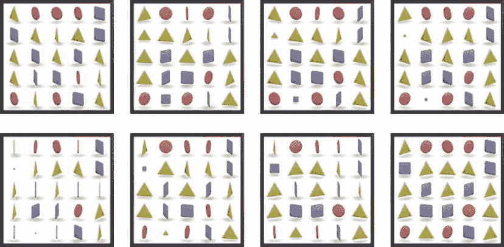

**图 4-8.** 硬币交换位置

第一列第二行的一个正方形硬币与第二列最后一行的一个三角形硬币进行交换。每个硬币先缩小到几乎看不见，然后交换硬币类型，再恢复到正常大小。这通过在`doSwitch:With:`任务中实现，如清单 4-25 所示。

**清单 4-25.** `CoinsController.m (doSwitch:With:)`

```
-(void)doSwitch:(Coord)coordA With:(Coord)coordB {
    [coinsGame swap:coordA With:coordB];
    
    coinViewA = [[coinsView subviews] objectAtIndex:[coinsGame indexForCoord:coordA]];
    coinViewB = [[coinsView subviews] objectAtIndex:[coinsGame indexForCoord:coordB]];
    
    for (UIView* coinView in [NSArray arrayWithObjects:coinViewA, coinViewB, nil]){
        CABasicAnimation* animScaleDown = [CABasicAnimation animationWithKeyPath:@"transform.scale"];
        [animScaleDown setValue:@"animScaleDown" forKey:@"name"];
        animScaleDown.fromValue = [NSNumber numberWithFloat:1.0f];
        animScaleDown.toValue = [NSNumber numberWithFloat:0.0f];
        animScaleDown.duration = 1.0;
        animScaleDown.timingFunction = [CAMediaTimingFunction functionWithName:kCAMediaTimingFunctionEaseIn];
        
        CABasicAnimation* animScaleUp = [CABasicAnimation animationWithKeyPath:@"transform.scale"];
        [animScaleUp setValue:@"animScaleUp" forKey:@"name"];
        animScaleUp.fromValue = [NSNumber numberWithFloat:0.0f];
        animScaleUp.toValue = [NSNumber numberWithFloat:1.0f];
        animScaleUp.duration = 1.0;
        animScaleUp.beginTime = CACurrentMediaTime() + 1.0;
        animScaleUp.timingFunction = [CAMediaTimingFunction functionWithName:kCAMediaTimingFunctionEaseOut];
        
        if (coinViewA == coinView){
            [animScaleDown setDelegate:self];
            [animScaleUp setDelegate:self];
        }
        
        [coinView.layer addAnimation:animScaleDown forKey:@"animScaleDown"];
        [coinView.layer addAnimation:animScaleUp forKey:@"animScaleUp"];
    }
}
```

`doSwitch:With:`任务负责更新模型和创建动画。为了更新模型，我们只需在`coinsGame`上调用`swap:With:`。为了创建动画，我们需要使用名为`CABasicAnimation`的类。`CABasicAnimation`对象描述了`CALayer`中的变化。`CALayer`是代表`UIView`视觉内容的对象。

到目前为止，我们一直说`UIView`提供屏幕上的内容，这仍然是正确的，但`UIView`使用 Core Animation 层来实现它的绘制方式。因此，每个`UIView`都有一个类型为`CALayer`的`layer`属性。你需要理解这一点才能明白`CABasicAnimation`的工作原理。查看清单 4-25，你可以看到`CABasicAnimation`是通过指定路径来创建的。在我们的例子中，路径是`transform.scale`。这是指向我们想要动画化的`UIView`所关联的`CALayer`对象的路径。

对于每个`UIView`（`coinViewA`和`coinViewB`），我们都会创建两个`CABasicAnimation`对象。当我们创建`CABasicAnimation`对象`animScaleDown`时，我们指定该`CABasicAnimation`将操纵`transform`属性上的`scale`值。我们通过设置`animScaleDown`的`fromValue`来指定`scale`的起始值，并通过设置`toValue`来指定结束值。`duration`值表示我们希望此动画持续多少秒。通过指定`timingFunction`，我们控制此动画的播放速率。在这种情况下，我们指定`kCAMediaTimingFunctionEaseIn`，告诉`CABasicAnimation`先慢后快。

`CABasicAnimation animScaleUp`与`animScaleDown`类似。主要区别在于`fromValue`和`toValue`相反。我们还将`beginTime`的值设置为未来 1 秒。这里的思路是，我们希望`animScaleDown`动画运行一秒，使硬币缩小到消失，然后当`animScaleDown`完成时，运行`animScaleUp`动画，将硬币缩放回正常大小。关键在于在这两个动画之间交换两个硬币视图所使用的图像。


我们可以通过将`self`设置为动画`animScaleDown`的`delegate`来实现此操作，前提是我们正在处理`coinViewA`，因为我们只需要被通知一次。我们还希望在所有这些动画结束时得到通知，因此也将`self`设置为`animScaleUp`的`delegate`。已设置委托的动画在完成后将调用任务`animationDidStop:finished:`，如清单 4-26 所示。

**清单 4-26.** `CoinsController (animationDidStop:finished:)`

```objc
- (void)animationDidStop:(CAAnimation *)theAnimation finished:(BOOL)flag{
    if ([[theAnimation valueForKey:@"name"] isEqual:@"animScaleDown"]){
        UIImage* imageA = [coinViewA image];
        [coinViewA setImage:[coinViewB image]];
        [coinViewB setImage:imageA];
    } else if ([[theAnimation valueForKey:@"name"] isEqual:@"animScaleUp"]){
        [self checkMatches];
        [self spinCoinAt:firstSelectedCoin];
        [self spinCoinAt:secondSelectedCoin];
    } else if ([[theAnimation valueForKey:@"name"] isEqual:@"animateOffScreen"]){
        [coinsGame randomizeRows: matchingRows];
        [coinsGame randomizeCols: matchingCols];
        [self updateCoinViews];
    }
}
```

这里我们看到了任务`animationDidStop:finished:`。注意有三个动画调用了此任务。前两个`if`语句用于处理清单 4-25 中描述的动画。当`animScaleDown`动画完成时，我们交换`UIImageViews`所使用的`UIImages`，以表示两个被选中的硬币。

当动画`animScaleUp`完成时，我们希望检查是否存在匹配。调用`checkMatches`即可实现。我们还希望重新开始旋转最近选中的硬币。`checkMatches`的实现如清单 4-27 所示。

**清单 4-27.** `CoinsController.m (checkMatches)`

```objc
-(void)checkMatches{
    matchingRows = [coinsGame findMatchingRows];
    matchingCols = [coinsGame findMatchingCols];
    int rowCount = [coinsGame rowCount];
    int colCount = [coinsGame colCount];
    BOOL isDelegateSet = NO;

    if ([matchingRows count] > 0){
        for (NSNumber* row in matchingRows){
            for (int c = 0;c < colCount;c++){
                CABasicAnimation* animateOffScreen = [CABasicAnimation animationWithKeyPath:@"position.x"];
                [animateOffScreen setValue:@"animateOffScreen" forKey:@"name"];
                animateOffScreen.byValue = [NSNumber numberWithFloat:coinsView.frame.size.width];
                animateOffScreen.duration = 2.0;
                animateOffScreen.timingFunction = [CAMediaTimingFunction functionWithName:kCAMediaTimingFunctionEaseIn];
                Coord coord = CoordMake([row intValue], c);
                int index = [coinsGame indexForCoord:coord];
                UIImageView* coinView = [[coinsView subviews] objectAtIndex: index];
                if (c == 0){
                    [animateOffScreen setDelegate:self];
                    isDelegateSet = YES;
                }
                [coinView.layer addAnimation:animateOffScreen forKey:@"animateOffScreenX"];
            }
        }
    }

    if ([matchingCols count] > 0){
        for (NSNumber* col in matchingCols){
            for (int r = 0;r < rowCount;r++){
                CABasicAnimation* animateOffScreen = [CABasicAnimation animationWithKeyPath:@"position.y"];
                [animateOffScreen setValue:@"animateOffScreen" forKey:@"name"];
                animateOffScreen.byValue = [NSNumber numberWithFloat:coinsView.frame.size.height];
                animateOffScreen.duration = 2.0;
                animateOffScreen.timingFunction = [CAMediaTimingFunction functionWithName:kCAMediaTimingFunctionEaseIn];
                Coord coord = CoordMake(r, [col intValue]);
                int index = [coinsGame indexForCoord:coord];
                UIImageView* coinView = [[coinsView subviews] objectAtIndex: index];
                if (!isDelegateSet && r == 0){
                    [animateOffScreen setDelegate:self];
                }
                [coinView.layer addAnimation:animateOffScreen forKey:@"animateOffScreenY"];
            }
        }
    }

    int totalMatches = [matchingCols count] + [matchingRows count];
    if (totalMatches > 0){
        [coinsGame setScore:[coinsGame score] + totalMatches];
        [delegate scoreIncreases:self with:[coinsGame score]];
    } else {
        if ([coinsGame remaingTurns] <= 0){
            // delay calling gameOver on the delegate so the coin's UIImageViews show the correct coin.
            [NSTimer scheduledTimerWithTimeInterval:1 target:self selector:@selector(doEndGame) userInfo:nil repeats:FALSE];
        } else {
            // all matches are done animating and we have turns left.
            acceptingInput = YES;
        }
    }
}
```

我们通过在`coinsGame`上调用`findMatchingRows`和`findMatchinCols`来找出所有匹配的行和列。获得这些匹配数组后，我们希望将所有参与匹配的硬币动画移出屏幕。如果存在`matchingRows`，我们为每个硬币创建一个新的`CABasicAnimation`，用于修改底层`CALayer`对象的`x`位置值。我们不需要设置`x`的确切起始值和结束值，只需指定`byValue`，并将其设置为`coinsView`的`width`。通过指定`byValue`，我们可以将此动画用于行中的所有硬币，因为该动画将简单地将`fromValue`推断为每个硬币视图的起始`x`值，而`toValue`将是`fromValue` + `byValue`。

创建匹配行和列的动画后，我们检查本轮总共生成了多少个匹配。如果该值大于零，我们更新`coinsGame`对象的分数，并通知`delegate`分数已更改。如果没有找到匹配，我们检查游戏是否结束。如果游戏结束，我们使用`NSTimer`类在 1 秒后调用`doEndGame`。此延迟是出于美观原因；在显示高分之前稍作停顿是很好的。如果游戏尚未结束，我们只需再次开始接受输入。清单 4-28 显示了任务`doEndGame`，它只是通知委托游戏结束。

**清单 4-28.** `CoinsController.m (doEndGame)`

```objc
-(void)doEndGame{
    [delegate gameOver:self with: coinsGame];
}
```

之前清单 4-27 中创建的动画，在完成时会像缩放动画一样调用任务`animationDidStop:finished:`。我们利用这个回调来随机化匹配并调用`updateCoinViews`，如清单 4-29 所示。

**清单 4-29.** `CoinsController.m (updateCoinViews)`

```objc
-(void)updateCoinViews{
    int rowCount = [coinsGame rowCount];
    int colCount = [coinsGame colCount];

    for (NSNumber* row in matchingRows){
        for (int c = 0;c < colCount;c++){
            Coord coord = CoordMake([row intValue], c);
            [self spinCoinAt:coord];
        }
    }

    for (NSNumber* col in matchingCols){
        for (int r = 0;r < rowCount;r++){
            Coord coord = CoordMake(r, [col intValue]);
            [self spinCoinAt:coord];
        }
    }

    [self checkMatches];
}
```

任务`updateCoinView`在代表硬币的`UIImageViews`完全移出屏幕后被调用。


此任务会遍历之前匹配的每组行列，并在原始位置让硬币重新旋转，但会显示与新值匹配的图像。最后，再次调用 `checkMatches`，以处理新随机值可能产生新匹配的情况。

## 总结

在本章中，我们探讨了如何创建一款输入驱动的游戏。这包括理解游戏状态的管理、用户输入的基础知识，以及使用核心动画来创建动画。游戏状态通过创建一个类来管理，这个类以与显示无关的方式保存重新创建游戏所需的数据。为了让用户能够与游戏交互，必须为正确的视图添加基本手势识别器。控制器类在特定游戏上下文中解读每个用户手势，并生成反映游戏状态变化的动画。

## 第 5 章：快速构建逐帧游戏

我们已经看过一个完全由用户输入驱动的简单游戏。在本章中，我们将研究那些无论用户是否提供输入都会持续动画化的游戏。动作游戏就是这类游戏的典型例子。我们不会在本章中制作一个完整的游戏，而是实现其中的一部分。图 5-1 展示了我们将要创建的一个场景。

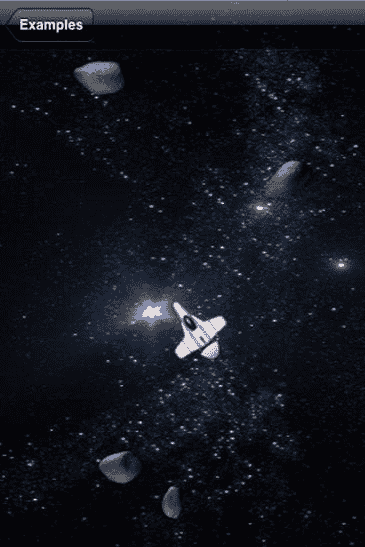

图 5-1 一款逐帧太空游戏

在图 5-1 中，我们看到一艘宇宙飞船正在躲避一些小行星。你将学习如何为场景中的不同元素制作动画、如何根据用户输入移动飞船，以及如何检测飞船与小行星之间的碰撞。

多年来，用来创建这类游戏的技术有很多种。这些不同的技术关注的是如何在屏幕上绘制内容。例如，`OpenGL` 提供了对显示器的底层访问。`UIKit` 提供的类（如 `UIView`）也非常适合这类游戏。无论使用哪种技术来更新屏幕，这类游戏通常都以相同的方式工作，即创建图 5-2 所示的循环。

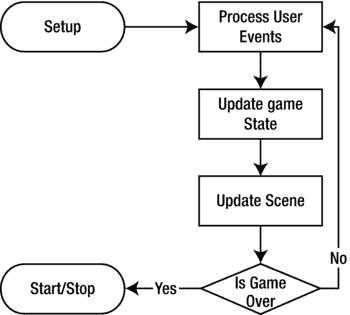

图 5-2 典型的逐帧应用循环

在图 5-2 中，我们看到，在应用程序设置好之后，会创建一个循环，负责处理用户事件、更新游戏状态、更新屏幕上的场景，最后检查游戏是否结束。在 iOS 上创建以这种方式运行的应用程序时，我们不必显式地创建一个循环——应用程序本身已经在运行一个与图 5-1 中描述的非常相似的循环。让我们仔细看看如何设置一个 iOS 应用程序来实现逐帧动画。

## 设置你的第一个逐帧动画

本章附带的示例代码包含三个示例。每个示例都建立在前一个示例的基础上，以阐述不同的概念。当你运行示例代码时，你将看到一个类似于图 5-3 的屏幕。

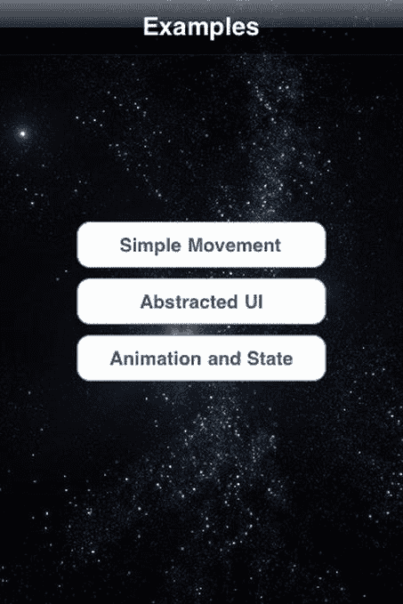

图 5-3 示例菜单

在图 5-3 中，我们看到了三个示例各自的按钮。单击每个按钮将播放动画并显示该示例。让我们从最上方的“简单移动”开始。

### 简单移动

“简单移动”将应用程序设置为持续更新宇宙飞船的位置。飞船将移动到用户点击的任何点，如图 5-4 所示。

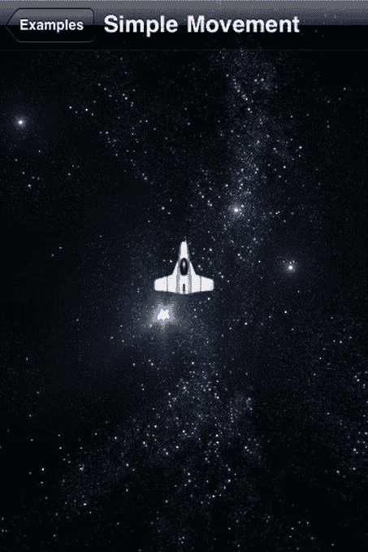

图 5-4 简单移动

在图 5-4 中，我们看到一艘从俯视角度观察的宇宙飞船，背景是星空。当用户触摸屏幕上的任何点时，飞船将动画移动到该点。这种动画可以很容易地使用前一章介绍的动画类型来实现，但这并不能成为一个好的起点。就视图而言，忽略顶部导航栏，你在图 5-4 中看到的是一个带有两个 `UIImageView` 子视图的 `UIView`。其中一个 `UIImageView` 是背景星空，另一个是宇宙飞船。这里的基本思路是，我们可以定期更新宇宙飞船的 `UIImageView` 的位置，从而创建动画。与其他示例一样，管理这些不同 `UIView` 状态的逻辑位于一个 `UIViewController` 子类中。对于这个示例，该类名为 `Example01Controller`，其头文件如代码清单 5-1 所示。

**代码清单 5-1** `Example01Controller.h`

```
#import <UIKit/UIKit.h>
#import <QuartzCore/CADisplayLink.h>
#import "Viper01.h"

@interface Example01Controller : UIViewController {
    CADisplayLink* displayLink;
    Viper01* viper;
}
-(void)updateScene;
-(void)viewTapped:(UIGestureRecognizer*)aGestureRecognizer;
@end
```

在代码清单 5-1 中，我们看到该类继承了 `UIViewController`，并且有两个字段。第一个字段名为 `displayLink`，类型为 `CADisplayLink`，从 QuartzCore 框架中导入。第二个字段名为 `viper`，类型为 `Viper01`，用于表示宇宙飞船。该类还定义了两个任务：第一个任务名为 `updateScene`，用于更新构成场景的 `UIViews`；第二个任务名为 `viewTapped`，用于管理用户输入。让我们看看代码清单 5-2 中的 `Viper01` 头文件，看看我们是如何表示宇宙飞船的。

**代码清单 5-2** `Viper01.h`

```
#import <Foundation/Foundation.h>

@interface Viper01 : UIImageView {

}
@property float speed;
@property CGPoint moveToPoint;
-(void)updateLocation;
@end
```

在代码清单 5-2 中，我们看到 `Viper01` 继承了 `UIImageView`，并有两个属性。`speed` 属性描述了“毒蛇”飞船的移动速度，`moveToPoint` 属性则跟踪飞船在屏幕上的目标移动点。`updateLocation` 任务负责递增地更新飞船的位置。

### 实现这些类

现在我们已经了解了本例中将使用的类的定义，接下来让我们看看它们的实现，从代码清单 5-3 中展示的 `Example01Controller` 类的 `viewDidLoad` 任务开始。

**代码清单 5-3** `Example01Controller.m` (`viewDidLoad`)

```
- (void)viewDidLoad {
    [super viewDidLoad];

    [self setTitle:@"Simple Movement"];

    UITapGestureRecognizer* tapRecognizer = [[UITapGestureRecognizer alloc] initWithTarget:self action:@selector(viewTapped:)];
    [self.view addGestureRecognizer:tapRecognizer];

    viper = [Viper01 new];
    CGRect frame = [self.view frame];
    viper.center = CGPointMake(frame.size.width/2.0, frame.size.height/2.0);
    [self.view addSubview:viper];
    [viper setMoveToPoint:viper.center];

    displayLink = [CADisplayLink displayLinkWithTarget:self selector:@selector(updateScene)];
    [displayLink addToRunLoop:[NSRunLoop currentRunLoop] forMode:NSDefaultRunLoopMode];
}
```

在代码清单 5-3 中，我们...

在设置标题后，我们创建一个`UITapGestureRecognizer`并将其添加到与此`UIViewController`关联的根`UIView`上。将`UITapGestureRecognizer`添加到`UIView`后，当用户点击屏幕时，将调用任务`viewTapped:`，使我们有机会更新飞船移动的目标位置。下一步是创建一个新的`Viper01`实例，并将其放置在根`UIView`的中心。我们还将`viper`的`moveToPoint`属性设置为屏幕中心，这样飞船一开始就是静止的。最后要做的是指定一个定期调用的任务，以便我们可以更新飞船的位置并创建动画。我们通过创建一个`CADisplayLink`并指定任务`updateScene`来实现这一点。一旦调用`addToRunLoop`，`updateScene`将在每次屏幕刷新时被调用。在下一节中，我们将研究`CADisplayLink`和`NSRunLoop`类，了解它们的用途。接下来让我们看看`updateScene`，如清单 5-4 所示。

**清单 5-4.** Example01Controller.m (updateScene)

```
-(void)updateScene{
    [viper updateLocation];
}
```

在清单 5-4 中，在任务`updateScene`里，我们只是在对象`viper`上调用了`updateLocation`。在未来的示例中，我们会在任务`updateScene`中做更多的事情，但现在让我们先看看如何实现移动这一艘飞船。

## 移动飞船

每次调用`updateScene`时，我们都必须更新飞船的位置。这需要通过一点几何计算来确定动画每一帧中飞船的新位置。让我们看一下`updateLocation`，了解该任务如何移动飞船。请参见清单 5-5。

**清单 5-5.** Viper01.m (updateLocation)

```
-(void)updateLocation{
    CGPoint c = [self center];
    float dx = (moveToPoint.x - c.x);
    float dy = (moveToPoint.y - c.y);
    float theta = atan(dy/dx);

    float dxf = cos(theta) * self.speed;
    float dyf = sin(theta) * self.speed;

    if (dx < 0){
        dxf *= −1;
        dyf *= −1;
    }
    c.x += dxf;
    c.y += dyf;

    if (abs(moveToPoint.x - c.x) < speed && abs(moveToPoint.y - c.y) < speed){
        c.x = moveToPoint.x;
        c.y = moveToPoint.y;
    }

    [self setCenter:c];
}
```

在清单 5-5 中，我们看到了类`Viper01`的任务`updateLocation`。此任务负责将飞船向目标点`moveToPoint`移动一帧的距离。由于类`Viper01`继承自`UIImageView`，我们可以通过简单地设置用于指定其相对于父视图位置的标准属性来移动它。我们可以使用`frame`属性，但还有一个名为`center`的属性，它是操作`UIView`框架的简写方式。

我们首先获取飞船当前`center`的副本并将其存储在变量`c`中，然后开始计算飞船的新`center`位置。接下来，我们计算当前位置与目标位置在 X 轴和 Y 轴上的差值，并将值存储在`dx`和`dy`中。查阅高中数学课本中的公式后，我们通过将`dy`除以`dx`并将结果传递给`atan`（反正切）函数来计算描述移动方向的角度，并将结果存储为`theta`。

我们希望将飞船沿`theta`方向移动`speed`个点。要计算这在 X 和 Y 坐标上意味着什么，我们需要做一些几何运算。为了计算我们将要移动的 X 点数，我们取`theta`的余弦值乘以`speed`，并将值存储在`dxf`中。类似地，为了计算在此`frame`中必须移动的 Y 点数，我们取`theta`的正弦值乘以`speed`，并将结果存储为`dyf`。为了最终确定这些值，我们检查`dx`是否为负数；如果是，则翻转`dxf`和`dyf`的符号。

一旦计算完`dxf`和`dyf`，我们将这些值加到变量`c`的`x`和`y`部分。我们要做的最后一件事是使用`c`中存储的新值设置`center`属性。但是，如果我们距离`moveToPoint`小于`speed`个点，我们将会超过它。我们不希望超过目标点，因为在下一帧中，我们会在相反的方向上再次超调，从而导致飞船在屏幕上抖动。为了解决这个问题，如果我们接近`moveToPoint`，我们只需将`X`和`Y`值设置为与`moveToPoint`的`X`和`Y`值相同。图 5-5 展示了一些相关的几何关系。

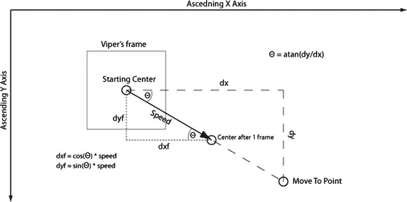

**图 5-5.** updateLocation 任务中涉及的几何关系

在图 5-5 中，我们看到 X 轴和 Y 轴，原点位于左上角，Y 轴正方向向下。飞船的框架显示为一个灰色矩形，起始中心点位于其中间。虚线三角形说明了如何根据`dx`、`dy`和移动目标点的位置来计算`theta`。黑色的箭头长度为`speed`，显示单帧后中心应位于的位置。点线三角形显示了如何根据角度计算`dxf`和`dyf`。

## 响应用户点击

我们现在知道了如何让飞船一帧一帧地移动。但我们还没有研究如何告诉飞船要移动到何处。回顾一下，我们在`Example01Controller`的根`UIView`上注册了一个`UITapGestureRecognizer`。这个`UITapGestureRecognizer`被配置为调用任务`viewTapped:`。这如清单 5-6 所示。

**清单 5-6.** Example01Controller.m (viewTapped:)

```
-(void)viewTapped:(UIGestureRecognizer*)aGestureRecognizer{
    UITapGestureRecognizer* tapRecognizer = (UITapGestureRecognizer*)aGestureRecognizer;
    CGPoint tapPoint = [tapRecognizer locationInView:self.view];
    [viper setMoveToPoint: tapPoint];
}
```

在清单 5-6 中，我们在`viewTapped:`中做的第一件事是将传入的`UIGestureRecognizer`强制转换为`UITapGestureRecognizer`。然后，通过调用`locationInView:`，找到点击在根视图中发生的位置。一旦得到点击发生的位置，我们只需在`viper`对象上设置`moveToPoint`属性。请注意，我们不必中断任何现有的动画——我们只是更新了`viper`对象的状态，当它的`updateLocation`任务再次被调用时，它将开始向这个新点移动。这是一个非常简单的例子，但我希望它能说明逐帧动画相对于我们在上一章中看到的预定义动画的一个优势。

我们研究了如何设置这个简单动画，以及如何通过重复调用清单 5-4 中的`updateScene`来驱动它。我们应该花点时间了解负责进行这些重复调用的类。

## 理解 CADisplayLink 和 NSRunLoop

通常，要创建流畅的动画，每秒至少需要更新 25 张图片，以避免眼睛看到单个帧。这意味着我们的游戏必须找到一种方法，以每秒 25 次的速度调用`updateScene`来实现流畅的动画。这可以通过创建一个`NSTimer`来实现，该`NSTimer`以我们选择的任何速率调用`updateScene`。


