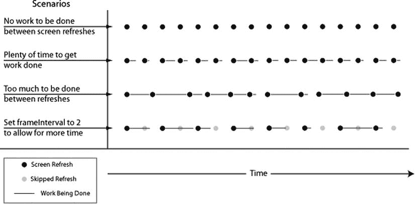
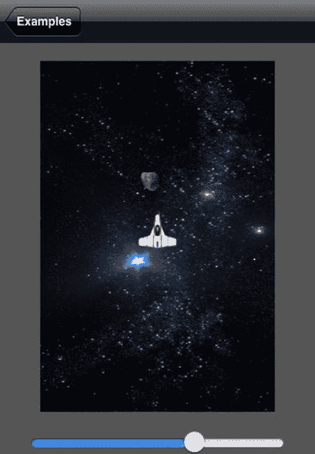

# 排版后的内容

然而，如果这样做，我们更新场景的代码将无法与屏幕硬件的原生刷新率保持同步。Core Animation 框架提供了一个专门用于创建此类动画的类：`CADisplayLink`。在代码清单 5-3 中，我们创建了一个 `CADisplayLink`，并指定每当屏幕准备好重绘时，它应调用 `updateScene`。然后，我们通过在 `NSRunLoop` 类上调用 `currentRunLoop`，将这个 `CADisplayLink` 添加到了调用 `viewDidLoad` 的同一个运行循环中。`NSRunLoop` 类管理着一个线程，以生成图 5-1 所示的那种循环。`NSRunLoop` 负责处理来自用户和 `CADisplayLink` 的输入，并调度 `Example01Controller` 中相应任务的调用时机。我们无需深入了解 `NSRunLoop` 的工作机制；只需知道 `viewTapped:` 和 `updateScene` 这两个任务将由同一个线程调用，这样我们就不必担心多线程的复杂性了。

如前所述，`CADisplayLink` 与我们的主线程中的 `NSRunLoop` 协同工作，使得每次屏幕重绘时，`updateScene` 任务都会被调用一次。`CADisplayLink` 的 `duration` 属性以秒为单位报告屏幕每次重绘之间的时间间隔。稍加观察会发现，每次调用 `updateScene` 时，该属性报告的数值都略有不同，但大致在 0.0166648757 秒左右。这个数值略低于每秒 60 帧，因此我们完全满足了所需的每秒 25 帧的要求。

在更复杂的应用中，很可能无法在 1.5 毫秒内更新游戏状态；可能仅仅是簿记工作就太多了。如果是这种情况，你可以将 `CADisplayLink` 的 `frameInterval` 属性设置为大于 1 的值。这将导致 `CADisplayLink` 跳过一些屏幕重绘。图 5-6 展示了使用 `CADisplayLink` 时可能出现的四种不同场景。

图 5-6.  屏幕刷新场景

在图 5-6 中，我们看到左侧列出了四种场景。每种场景右侧的一些点代表了该场景下的屏幕刷新。看最上面的场景，即屏幕刷新之间无事可做的情况，每个点之间的间距相等，这意味着随着时间向右推移，屏幕刷新以均匀的间隔发生。第二种场景显示了屏幕刷新之间有一些工作需要处理的情况，由每个点右侧延伸出的线条表示。每条线的长度都短于每个点之间的间距，表明工作是在屏幕刷新的时间间隔内完成的。第三种场景显示的是屏幕刷新之间需要完成的工作过多，但程序员并未考虑到这一点的情况。每次工作耗时超过屏幕刷新之间的正常时间量时，下一帧画面的绘制就会延迟。由于在各帧之间更新游戏所需的时间不同，屏幕的刷新速率变得不规则。当屏幕刷新不规则时，动画看起来会卡顿，给用户带来糟糕的体验。为了避免这种情况，我们通过将 `frameInterval` 设置为 2，将 `CADisplayLink` 配置为每隔一帧才触发一次更新。这样我们完成工作的时间就翻倍了，从而能够实现流畅的动画。

对某些开发者来说，这种策略可能看似违反直觉，因为在第四种场景中，可能会有很长一段时间没有工作在进行。事实上，在给定的时间段内，场景 3 渲染的帧数要比场景 4 多。

但事实是，相比一个运行不那么快的游戏，卡顿的更新几乎总是更让用户厌烦。还要记住，iOS 设备的原生刷新率是每秒 60 帧，因此即使每隔一帧被跳过，动画速率仍然有每秒 30 帧。这对于创建令人信服的动画来说已经足够。

我们已经研究了一个简单的逐帧动画，现在你应该理解了基本原理。接下来的两个示例将基于这种模式进行构建，以创建屏幕上包含多个对象的动画，同时还会进行一些重构，以开始构建一个适用于复杂游戏的框架。

## 抽象 UI

在前面的示例中，我们研究了创建逐帧动画的基础知识。我们探讨了如何利用 `CADisplayLink` 类与现有事件循环协同工作，来调用一个任务，并在该任务中实现我们的动画。我们根据用户输入在屏幕上动画显示了一个图像。那是一个非常简单的示例。我略过了一些实际的考量，以便我们能够专注于以这种方式创建动画的基本思想。在本节中，我们将进行一些重构，以便更好地支持更复杂的游戏。图 5-7 展示我们将要构建的示例。

图 5-7.  抽象 UI

在图 5-7 中，我们看到与第一个示例相比有一些不同。首先要注意的是，游戏的可玩区域并未占满整个屏幕。屏幕底部的滑块可以改变可玩区域的大小，而不会影响游戏玩法。屏幕上还有第二个物体，一颗小行星。小行星每 10 秒生成一次，从屏幕顶部开始，垂直向下移动。如果小行星与飞船发生碰撞，飞船会重置到屏幕中央，小行星则被移除。这个简单游戏的目标就是避开迎面而来的小行星。

本节的目标之一是解释如何将游戏逻辑与游戏在屏幕上的绘制方式分离开来。在第一个示例中，我们只是扩展了 `UIImageView`，并添加了关于飞船的逻辑。这已经足够好用了，但有很多充分的理由将游戏逻辑与游戏显示方式分离开。首先，如果你想在 iPad 而非 iPhone 上运行这个游戏，你很可能希望让可玩区域更大一些。此外，为了支持诸如缩放游戏画面或显示小地图等功能，将游戏中每个物体的位置以独立于显示的方式存储是合理的。将来，你可能决定将游戏移植到其他平台。在这种情况下，清晰地将游戏逻辑与显示逻辑分离将为你省去大量工作。

为了支持游戏逻辑与显示逻辑之间的这种抽象，我们引入了一个名为 `Actor02` 的新类。通常情况下，这个类就直接叫做 `Actor`。名称中的 `02` 仅表示它是本章第二个示例的一部分。接下来的部分将解释什么是 actor，以及它如何帮助实现游戏逻辑与显示之间的抽象。

### 理解 Actor

Actor 是游戏中移动的物体。在我们的示例中，飞船和小行星都是 actor。这区别于游戏中可能存在的其他元素，比如用于显示分数的标签或其他组件。

Actor 有时被称为精灵（sprite），但我更倾向于使用 actor 这个词，因为 *sprite* 一词也可以指代用于显示游戏物体的图像。在日常对话中，使用哪个术语差别不大——但我们还是称它们为 actor 吧。

### Example2Controller 概述

在我们的示例中，我们将定义 `Actor02` 类，并展示如何通过继承 `Actor02` 来创建我们的游戏物体：飞船和小行星。

