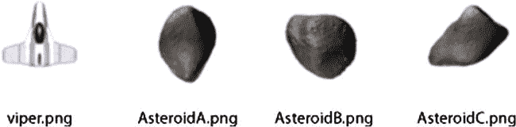
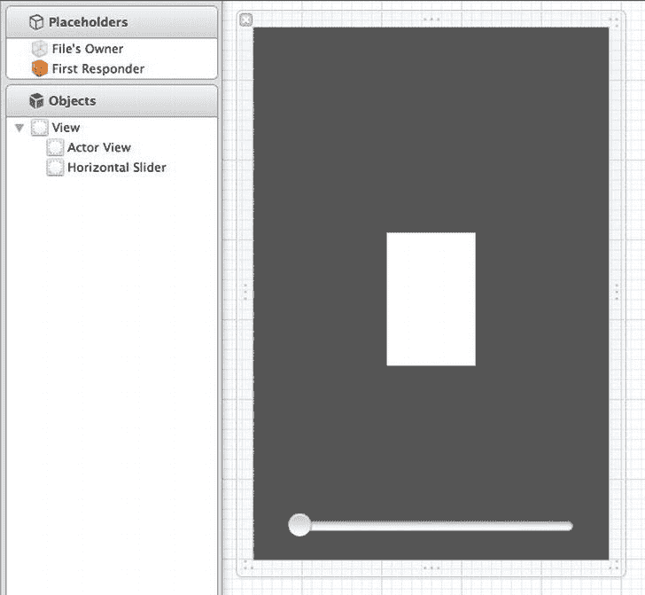

# Listing 5-7 与 `Actor02` 类

`Listing 5-7` 展示了 `Actor02` 类的头文件。  
```
#import <Foundation/Foundation.h>
@class Example02Controller;

long nextId;
@interface Actor02 : NSObject {
}
@property (nonatomic, retain) NSNumber* actorId;
@property (nonatomic) CGPoint center;
@property (nonatomic) float speed;
@property (nonatomic) float radius;
@property (nonatomic, retain) NSString* imageName;

-(id)initAt:(CGPoint)aPoint WithRadius:(float)aRadius AndImage:(NSString*)anImageName;
-(void)step:(Example02Controller*)controller;
-(BOOL)overlapsWith: (Actor02*) actor;
@end
```

在 `Listing 5-7` 中，我们看到 `Actor02` 类的头文件。它有五个属性，代表了本示例所需的基本属性。`actorId` 属性用于标识演员；我们稍后将看到如何使用它将每个 `Actor02` 映射到一个 `UIImageView`。`center` 属性告诉我们每个 `Actor02` 的位置。`speed` 属性表示该演员移动的速度。`radius` 属性代表演员的大小。最后，`imageName` 属性描述了演员应如何在屏幕上绘制。

`center` 属性的类型是 `CGPoint`。严格来说，我们不会直接使用这个 `CGPoint` 来设置 `UIView` 或其他 Core Graphics 组件的位置。但 `CGPoint` 是一种封装 X 和 Y 值的简单方式，并且我们已经对它很熟悉。在本示例中，使用 `CGPoint` 或我们自己定义的结构体来表示一个点，差别不大。不过，如果你希望代码完全不依赖 Core Graphics，你需要定义自己的类型来表示点。

在 `Listing 5-7` 中还需注意，`Actor02` 没有宽度或高度，只有 `radius`。这样做是为了简化示例，也因为许多游戏只需要一个维度来描述演员的大小。如果你构建自己的游戏框架，你可能会选择让演员包含宽度和高度——这实际上取决于游戏本身。当然，如果你研究预制的游戏引擎，你会发现它们的基础类型包含了各种你可能用到也可能用不到的特性。使用游戏引擎可能很有意义，但在这里，我们以复杂性换取理解。

### 一个简单的演员

`Listing 5-7` 显示 `Actor02` 定义了三个任务。`Listing 5-8` 展示了这些任务的实现。

**Listing 5-8.**  `Actor02.m`
```
#import "Actor02.h"

@implementation Actor02
@synthesize actorId;
@synthesize center;
@synthesize speed;
@synthesize radius;
@synthesize imageName;

-(id)initAt:(CGPoint)aPoint WithRadius:(float)aRadius AndImage:(NSString*)anImageName{
    self = [super init];
    if (self != nil){
        [self setActorId:[NSNumber numberWithLong:nextId++]];
        [self setCenter:aPoint];
        [self setRadius:aRadius];
        [self setImageName:anImageName];
    }
    return self;
}
-(void)step:(Example02Controller*)controller{
    //implemented by subclasses.
}
-(BOOL)overlapsWith: (Actor02*) actor {
    float xdist = abs(self.center.x - actor.center.x);
    float ydist = abs(self.center.y - actor.center.y);
    float distance = sqrtf(xdist*xdist + ydist*ydist);
    return distance < self.radius + actor.radius;
}
@end
```

在 `Listing 5-8` 中，我们看到了 `Actor02` 类的实现。任务 `initAt:WithRadius:AndImage:` 用于用一些基本信息初始化一个 `Actor02`。该任务还通过使用 `nextId` 值并递增它来分配一个随机的 `actorId` 值。由于 `nextId` 是 `long` 类型，你必须创建极其大量的演员，才可能让两个演员拥有相同的 ID。

任务 `step:` 接受一个 `Example02Controller` 实例，并用于增量更新该 `Actor02` 的位置和状态。子类将提供该任务的实现，以实现自定义行为和动画。

最后一个任务 `overlapsWith:` 用于检查该 `Actor02` 是否与另一个 `Actor02` 重叠。在本示例中，该任务用于检测碰撞。

### 演员子类：`Viper02`

我们知道，本示例中有两种类型的演员：小行星和宇宙飞船。让我们看看 `Viper02` 类，以及它与 `Viper01` 的不同之处。`Viper02` 的头文件如 `Listing 5-9` 所示。

**Listing 5-9.**  `Viper02.h`
```
@class Example02Controller;
@interface Viper02 : Actor02 {
}
@property CGPoint moveToPoint;

+(id)viper:(Example02Controller*)controller;
-(void)doCollision:(Actor02*)actor In:(Example02Controller*)controller;
@end
```

在 `Listing 5-9` 中，我们看到 `Viper02` 的头文件与 `Viper01` 差别不大，后者如 `Listing 5-2` 所示。`Viper02` 扩展了 `Actor02` 类，而不是 `UIImageView`。我们有 `moveToPoint` 属性，与之前相同，但 `speed` 属性不存在，因为它继承自 `Actor02`。我们有一个新的构造函数来简化 `Viper02` 的创建，以及一个名为 `doCollision:In:` 的新任务，用于处理与小行星碰撞的新功能。`Listing 5-10` 展示了 `Viper02` 类的实现。

**Listing 5-10.**  `Viper02.m`
```
#import "Viper02.h"
#import "Example02Controller.h"

@implementation Viper02
@synthesize moveToPoint;

+(id)viper:(Example02Controller*)controller{
    CGSize gameAreaSize = [controller gameAreaSize];
    CGPoint center = CGPointMake(gameAreaSize.width/2, gameAreaSize.height/2);

    Viper02* viper = [[Viper02 alloc] initAt:center WithRadius:16 AndImage:@"viper"];
    [viper setMoveToPoint:center];
    [viper setSpeed:.8];

    return [viper autorelease];
}

-(void)step:(Example02Controller*)controller{
    CGPoint c = [self center];

    float dx = (moveToPoint.x - c.x);
    float dy = (moveToPoint.y - c.y);
    float theta = atan(dy/dx);

    float dxf = cos(theta) * self.speed;
    float dyf = sin(theta) * self.speed;
    if (dx < 0){
        dxf *= -1;
        dyf *= -1;
    }

    c.x += dxf;
    c.y += dyf;

    if (abs(moveToPoint.x - c.x) < self.speed && abs(moveToPoint.y - c.y) < self.speed){
        c.x =  moveToPoint.x;
        c.y =  moveToPoint.y;
    }
    [self setCenter:c];
}
-(void)doCollision:(Actor02*)actor In:(Example02Controller*)controller{
    CGSize gameAreaSize = [controller gameAreaSize];
    CGPoint centerOfGame = CGPointMake(gameAreaSize.width/2, gameAreaSize.height/2);
    self.center = centerOfGame;
    self.moveToPoint = centerOfGame;

    [controller removeActor:actor];
}
@end
```

在 `Listing 5-10` 中，我们看到构造函数任务 `viper:` 创建了一个新的 `Viper02` 对象，并使用超类任务 `initAt:WithRadius:AndImage:` 来设置对象的基本属性。此外，`moveToPoint` 属性被设置为当前位置，速度被设置为 `.8`。

任务 `step:` 是每帧动画中被调用的任务。该任务的实现与 `Actor01` 类中任务 `updateLocation:` 的实现完全相同，如 `Listing 5-5` 所示。

`Listing 5-10` 中的最后一个任务是 `doCollision:In:`，当该 `Viper02` 与一个 `Asteroid02` 重叠时被调用。该任务将 `Viper02` 重置回游戏区域中心的起始位置，并从游戏中移除碰撞到的 `Asteroid02`。


### Actor 子类：`Asteroid02`

在看过 `Viper02` 类之后，你可能无法准确看出它与 `Viper01` 有何不同。确实，虽有部分内容被重新组织，但二者看起来非常相似：本质上都仍负责更新中心点。等我们看完 `Asteroid02` 类，就会发现这些 actor 类如何被用来描述场景，而非成为场景本身。`Asteroid02` 类的头文件如代码清单 5-11 所示。

**代码清单 5-11.** `Asteroid02.h`

```objectivec
#import <Foundation/Foundation.h>
#import "Actor02.h"

NSMutableArray* imageNameVariations;

@interface Asteroid02 : Actor02 {
}
+(NSMutableArray*)imageNameVariations;
+(id)asteroid:(Example02Controller*)controller;
@end
```

在代码清单 5-11 中，`Asteroid02` 类的头文件显示它继承自 `Actor02` 并包含两个静态任务。此外还有一个名为 `imageNameVariations` 的数组。该数组结合 `imageNameVariations` 任务，使我们能够创建外观相似但图形不同的 `Asteroid02`。让我们看看这个类的实现，理解其中的含义，如代码清单 5-12 所示。

**代码清单 5-12.** `Asteroid02.m`

```objectivec
#import "Asteroid02.h"
#import "Example02Controller.h"

@implementation Asteroid02

+(id)asteroid:(Example02Controller*)controller{
    CGSize gameAreaSize = [controller gameAreaSize];
    float radius = arc4random()%8 + 8;
    float x = radius + arc4random()%(int)(gameAreaSize.width + radius*2);
    CGPoint center = CGPointMake(x, -radius);
    NSString* imageName = [[Asteroid02 imageNameVariations] objectAtIndex:arc4random()%3];

    Asteroid02* asteroid = [[Asteroid02 alloc] initAt:center WithRadius:radius AndImage: imageName];
    float speed = (arc4random()%10)/10.0 + .1;
    [asteroid setSpeed: speed];
    return asteroid;
}
+(NSMutableArray*)imageNameVariations{
    if (imageNameVariations == nil){
        imageNameVariations = [NSMutableArray new];
        [imageNameVariations addObject:@"AsteroidA"];
        [imageNameVariations addObject:@"AsteroidB"];
        [imageNameVariations addObject:@"AsteroidC"];
    }
    return imageNameVariations;
}

-(void)step:(Example02Controller*)controller{
    CGPoint newCenter = self.center;
    newCenter.y + = self.speed;
    self.center = newCenter;

    if (newCenter.y - self.radius > controller.gameAreaSize.height){
        [controller removeActor: self];
    }
}
@end
```

在代码清单 5-12 中，构造函数任务 `asteroid:` 创建了一个新的 `Asteroid02` 对象并设置了其初始状态。为了增加多样性，每个小行星被分配了随机的 `radius` 和随机的 X 位置。起始 Y 位置被设置为负的 `radius`，因此小行星从游戏区域顶部稍上方开始出现。每个 `Asteroid02` 还被分配了随机的 `speed`。

任务 `step:` 实现了 `Asteroid02` 的运动——它只是将属性 `center` 的 Y 值增加 `speed`，直到到达游戏区域底部，此时它会将自己从游戏中移除。

如前所述，我们希望用于表示 `Asteroid02` 的图形也有一定的变化。为此，我们设计了任务 `imageNameVariations`，它采用懒加载方式填充全局的 `NSMutableArray imageNameVariations`。在任务 `asteroid:` 中，从该数组中随机抽取一个字符串作为小行星的图像。图 5-8 展示了此示例中使用的图像文件。



图 5-8. 用于 actor 的图像

在图 5-8 中，我们看到此示例中用于 actor 的图像。这些图像均由 `Actor02` 类的属性 `imageName` 指定。

对于小行星，我们提供了三种不同的图像，它们被随机分配给每个新的 `Asteroid02` 对象。

我们已经审视了 actor 类，了解了它们如何存储游戏中每个对象的基本信息。现在我们来看看这些类是如何在屏幕上被绘制的。

## 在屏幕上绘制 Actor

现在，我们对本例中涉及的 actor 有了基本了解。将它们整合起来创建游戏的类是 `Example02Controller`。与其他 `UIViewController` 类一样，`Example02Controller` 负责在屏幕上显示数据——在本例中，就是显示不同的 actor。`Example02Controller` 的技巧在于创建并更新多个 `UIImageViews`，每个 actor 对应一个。图 5-9 展示了如何在 Interface Builder 中设置该类的 iPhone 版本。



图 5-9. Interface Builder 中的 `Example02Controller_iPhone.xib`

在图 5-9 中，我们看到左侧该 `UIViewController` 的根视图有两个子视图。第一个称为 Actor view，是右侧灰色区域中间的白色区域。这是游戏发生的视图——所有 actor 都将表示为作为 Actor view 子视图的 `UIImageViews`。另一个组件是灰色区域底部的 `UISlider`。它用于控制 Actor view 的大小，使我们能够证明确实将游戏的表示与游戏本身进行了抽象。`Example02Controller` 类的头文件将概述如何实现这一点，如代码清单 5-13 所示。

**代码清单 5-13.** `Example02Controller.h`

```objectivec
#import < UIKit/UIKit.h>
#import < QuartzCore/CADisplayLink.h>
#import "Viper02.h"
#import "Actor02.h"
#import "Asteroid02.h"

@interface Example02Controller : UIViewController {
    IBOutlet UIView *actorView;
    CADisplayLink* displayLink;

    //Managing Actors
    NSMutableArray* actors;
    NSMutableDictionary* actorViews;
    NSMutableArray* toBeRemoved;

    //Game Logic
    Viper02* viper;
    long stepNumber;

}

@property (nonatomic) CGSize gameAreaSize;

-(void)updateScene;
-(void)removeActor:(Actor02*)actor;
-(void)addActor:(Actor02*)actor;
-(void)updateActorView:(Actor02*)actor;
-(void)tapGesture:(UIGestureRecognizer *)gestureRecognizer;
-(IBAction)sliderValueChanged:(id)sender;
-(void)doRemove;

@end
```

在代码清单 5-13 中，我们看到 `UIView actorView`，它是一个从图 5-9 所示的 XIB 文件连接的 `IBoutlet`。在文件底部，我们看到任务 `sliderValueChanged:`，当图 5-9 中的滑块被移动时会调用此任务。我们还看到了熟悉的 `displayLink` 对象，其类型为 `CADisplayLink`，将用于配置屏幕的重绘。`NSMutableArray actors` 用于存储游戏中所有当前的 actor，通过任务 `addActor:` 和 `removeActor:` 进行添加和移除。`NSMutableArray toBeRemoved` 用于保存标记为通过任务 `removeActor:` 移除的 actor。任务 `doRemove` 在每次调用 `updateScene` 结束时被调用，以实际移除每个 actor。`NSMutableDictionary actorViews` 用于将每个 actor 映射到表示它的 `UIImageView`。类型为 `Viper02` 的变量 `viper` 是对我们飞船的引用，最后一个变量 `stepNumber` 记录我们已执行的游戏帧数。与大多数 `UIViewController` 类一样，理解其工作原理要从查看 `viewDidLoad` 任务开始，如代码清单 5-14 所示。

**代码清单 5-14.** `Example02Controller.`


m (viewDidLoad)

```
- (void)viewDidLoad {
    [super viewDidLoad];
    [self setGameAreaSize:CGSizeMake(160, 240)];
    actors = [NSMutableArray new];
    actorViews = [NSMutableDictionary new];
    toBeRemoved = [NSMutableArray new];
    Actor02* background = [[Actor02 alloc] initAt:CGPointMake(80, 120) WithRadius:120 AndImage:@"star_field_iphone"];
    [self addActor: background];
    viper = [Viper02 viper:self];
    // [viper setMoveToPoint:viper.center];
    [self addActor:viper];
    stepNumber = 0;
    UITapGestureRecognizer* tapRecognizer = [[UITapGestureRecognizer alloc] initWithTarget:self action:@selector(tapGesture:)];
    [tapRecognizer setNumberOfTapsRequired:1];
    [tapRecognizer setNumberOfTouchesRequired:1];
    [actorView addGestureRecognizer:tapRecognizer];
    displayLink = [CADisplayLink displayLinkWithTarget:self selector:@selector(updateScene)];
    [displayLink addToRunLoop:[NSRunLoop currentRunLoop] forMode:NSDefaultRunLoopMode];
}
```

在 Listing 5-14 中，调用了 `viewDidLoad` 的父类实现之后，我们设置了 `gameAreaSize` 属性。在第一个示例中，我们使用了 `UIView` 的坐标空间来描述飞船的位置。在这个示例中，我们必须指定独立于任何 `UIView` 的游戏区域大小。请注意，160 x 240 的大小正好是 iPhone 点数的四分之一。尽管我们希望将游戏的坐标系与 `UIView` 层级体系的坐标系分离，但事实上 iPhone 屏幕的宽高比为 2:3，因此在该设备上运行任何游戏都需要考虑这一点。

指定 `gameAreaSize` 后，我们初始化了 `actors` 和 `actorViews`。然后我们添加了第一个演员。为了在其他演员后面添加星空背景，我们可以向场景中添加一个新的 `Actor02`，并指定 `star_field_iphone` 图像。由于基类 `Actor02` 没有指定任何行为，这个演员将简单地停留在背景中，提供漂亮的星空。使用演员作为背景的好处是它会与其他演员一起缩放和拉伸。缺点则是它会像游戏中的其他演员一样被对待，并消耗一点计算时间。

添加背景后，我们创建了 `Viper02`，将其赋值给变量 `viper`，并将其添加到场景中。我们保留了对它的引用，以便在用户触摸屏幕时可以轻松访问它。我们知道这将是一个频繁执行的操作，所以每次都遍历所有演员来查找正确的对象是没有意义的。对于任何特定的游戏，都需要仔细考虑哪些演员需要以特殊方式引用。在编程便捷性、执行速度和内存使用之间需要找到一个平衡点。遗憾的是，关于应该创建哪些额外的数据结构，并没有硬性规定。在第一次开发游戏（或应用程序）时，我会尽量少做优化，等到游戏更完整时再找出应用中的热点。在开发过程的早期进行优化可能会使功能开发复杂化；然而，在开发结束时进行优化可能会更加复杂，甚至可能永远无法完成。Listing 5-14 中的两个步骤是向 `actorView` 添加一个 `UITapGestureRecognizer`，以及设置 `CADisplayLink`。这些步骤的执行方式与第一个示例完全相同。

在查看场景如何更新之前，我们先看看 `addActor:` 和 `removeActor:` 这两个任务，以便我们能够完整理解演员是如何从场景中添加和移除的。Listing 5-15 展示了这两个任务。

**Listing 5-15.**  Example02Controller.m (addActor: 和 removeActor:)

```
-(void)removeActor:(Actor02*)actor{
    [toBeRemoved addObject:actor];
}
-(void)doRemove{
    for (Actor02* actor in toBeRemoved){
        UIImageView* imageView = [actorViews objectForKey:[actor actorId]];
        [actorViews removeObjectForKey:actor];
        [imageView removeFromSuperview];
        [actors removeObject:actor];
    }
    [toBeRemoved removeAllObjects];
}
```

在 Listing 5-15 中，`addActor` 任务只是将演员添加到 `NSMutableArray actors` 中。如果你想跟踪添加的演员，这就是你该做的地方。同样地，`removeActor` 任务只是将演员添加到 `NSMutableArray toBeRemoved` 中，以便稍后清理。`doRemove` 任务找到用于在屏幕上绘制该演员的 `UIImageView`，并将其从 `UIView actorViews` 中移除。通过调用 `removeFromSuperview`，该 `UIImageView` 也会从场景中被移除。对象 `actor` 也会从 `NSMutableArray actors` 中被移除。现在我们已经了解了演员是如何从游戏中添加和移除的，接下来我们看一下 `updateScene` 任务，它会被定期调用来将游戏推进一帧，如 Listing 5-16 所示。

**Listing 5-16.**  Example02Controller.m (updateScene)

```
-(void)updateScene{
    if (stepNumber % (60*10) == 0){
        [self addActor:[Asteroid02 asteroid:self]];
    }
    for (Actor02* actor in actors){
        [actor step:self];
    }
    for (Actor02* actor in actors){
        if ([actor isKindOfClass:[Asteroid02 class]]){
            if ([viper overlapsWith:actor]){
                [viper doCollision:actor In:self];
                break;
            }
        }
    }
    for (Actor02* actor in actors){
        [self updateActorView:actor];
    }
    [self doRemove];
    stepNumber++;
}
```

在 Listing 5-16 中，我们看到了 `updateScene` 任务，这是游戏的心脏，它每秒被调用大约 60 次，我们在这里推进游戏进程。我们要做的第一件事是检查是否要向游戏中添加一颗新小行星。这是通过对 `stepNumber` 取模 600 并检查结果是否为零来完成的。实际上，由于游戏以大约每秒 60 帧的速度运行，这相当于每 10 秒向场景中添加一个新的 `Asteroid02`。

在测试完是否应该添加新小行星后，我们遍历游戏中的所有演员，并对它们调用 `step:`。这给了每个演员一个根据其特定行为推进状态的机会。背景将不做任何事，小行星会向下移动，而飞船则会朝其 `moveToPoint` 移动。在更新完每个演员的位置后，我们需要测试是否发生碰撞。这通过再次遍历所有演员，找到那些是小行星的演员，并检查碰撞状态来完成。对于这个简单的例子，遍历所有演员来寻找碰撞是可以接受的。然而，在一个更复杂的应用程序中，改进这个算法（哪怕是当前这样的算法）可能很重要。改进措施包括将所有小行星保存在它们自己的数组中，并可能按位置进行排序。

### 为每个演员更新 UIView

我们已经测试了是否发生碰撞，现在我们必须确定每个演员的 `UIImageView` 的新位置。这通过 `updateActorView:` 任务完成，如 Listing 5-17 所示。

**Listing 5-17.**  Example02Controller.


