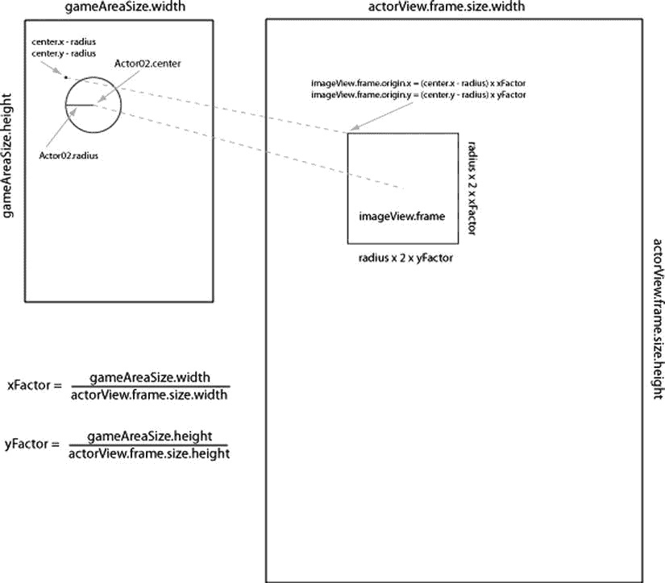
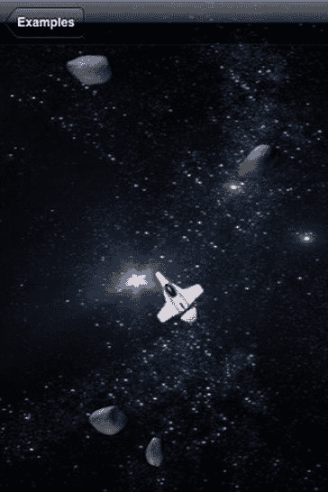
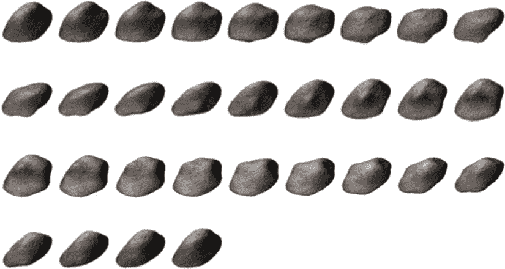

# `updateActorView:`

```objective-c
-(void)updateActorView:(Actor02*)actor{
    UIImageView* imageView = [actorViews objectForKey:[actor actorId]];
    if (imageView == nil){
        UIImageView* imageView = [[UIImageView alloc] initWithImage:[UIImage imageNamed:[actor imageName]]];
        [actorViews setObject:imageView forKey:[actor actorId]];
        [imageView setFrame:CGRectMake(0, 0, 0, 0)];
        [actorView addSubview:imageView];
    }

    float xFactor = actorView.frame.size.width/self.gameAreaSize.width;
    float yFactor = actorView.frame.size.height/self.gameAreaSize.height;

    float x = (actor.center.x-actor.radius)*xFactor;
    float y = (actor.center.y-actor.radius)*yFactor;
    float width = actor.radius*xFactor*2;
    float height = actor.radius*yFactor*2;
    CGRect frame = CGRectMake(x, y, width, height);
    [imageView setFrame:frame];
}
```

在列表 5-17 中，我们首先找到表示传入演员的`UIImageView`。我们通过使用演员的`actorId`作为键，在`NSMutableArray actorViews`中查找`UIImageView`。如果没有找到`UIImageView`，则说明这个演员刚刚被添加，因此我们必须创建它。

创建`UIImageView`很简单：基于演员的`imageName`创建一个`UIImage`，然后用它创建一个新的`UIImageView`。然后我们将`UIImageView`放入`NSMutableDictionary actorViews`中，同样使用演员的 ID 作为键。最后，我们将新的`UIImageView`添加到`actorView`。我们将新的`UIImageView`的`frame`设置为零大小，以防止一些重绘问题。这个`frame`很快就会更新。

### 在屏幕上放置`UIImageView`

创建`UIImageView`（如果需要）之后，我们必须确定它在屏幕上的绘制位置。第一步是找出游戏区域大小与屏幕上`actorView`实际大小之间的关系。我们可以简单地将`actorView`的宽度除以游戏区域的宽度来计算`xFactor`。对高度进行同样的操作来计算`yFactor`。一旦有了这些比例，我们就可以计算`UIImageView`的`frame`。当我们计算出构成`UIImageView`新`frame`的四个值后，就设置它。图 5-10 说明了如何计算这些值。



**图 5-10.** 将游戏坐标转换为屏幕坐标

在图 5-10 中，左侧我们看到游戏区域，右侧是描述`actorView`的`frame`的`CGRect`。左侧的圆形是一个需要转换为`actorView`上`CGRect`的`Actor02`。我们首先通过找到`Actor02`的左上角点来确定`GCFrame`的原点。通过从`Actor02`的`center` X 值减去`Actor02`的`radius`来找到左上角点的 X 值。要找到 Y 值，我们从`Actor02`的`center` Y 值减去`radius`。为了将这些点转换为`actorView`的坐标空间，我们只需将左上角点的 X 值乘以`xFactor`，并将 Y 值乘以`yFactor`。`xFactor`和`yFactor`值是`gameAreaSize`的宽度和高度与`actorView`的`frame`的宽度和高度之间的比例。要找到`actorView`的`frame`的大小，我们只需将`radius`乘以`xFactor`和`yFactor`来得到宽度和高度。

当用户触摸`UIView actorView`时，我们必须反向进行这个过程：将`actorView`上的点转换为游戏空间中的点。这个转换发生在`tapGesture:`任务中，如列表 5-18 所示。

**列表 5-18.** Example02Controller.h (`tapGesture:`)

```objective-c
- (void)tapGesture:(UIGestureRecognizer *)gestureRecognizer{
    UITapGestureRecognizer* tapRecognizer = (UITapGestureRecognizer*)gestureRecognizer;

    CGPoint pointOnView = [tapRecognizer locationInView:actorView];

    float xFactor = actorView.frame.size.width/self.gameAreaSize.width;
    float yFactor = actorView.frame.size.height/self.gameAreaSize.height;

    CGPoint pointInGame = CGPointMake(pointOnView.x/xFactor, pointOnView.y/yFactor);

    [viper setMoveToPoint:pointInGame];
}
```

在列表 5-18 中，我们通过调用`tapRecognizer`上的`locationInView:`并传入`actorView`，将结果存储在`pointOnView`中，来找到用户触摸的位置。重新计算`xFactor`和`yFactor`值后，我们简单地将`pointOnView`的 X 和 Y 值除以`xFactor`和`yFactor`，得到`pointInGame`。使用这个值，我们只需设置`viper`的`moveToPoint`属性为`pointInGame`。

为了结束这个示例，让我们看一下改变`actorView`大小的代码，如列表 5-19 所示。

**列表 5-19.** Example02Controller.m (`sliderValueChanged:`)

```objective-c
- (IBAction)sliderValueChanged:(id)sender {
    UISlider* slider = (UISlider*)sender;
    float newWidth = [slider value];
    float newHeight = gameAreaSize.height/gameAreaSize.width*newWidth;

    CGRect parentFrame = [[actorView superview] frame];
    float newX = (parentFrame.size.width-newWidth)/2.0;
    float newY = (parentFrame.size.height-newHeight)/2.0;

    CGRect newFrame = CGRectMake(newX, newY, newWidth, newHeight);
    [actorView setFrame:newFrame];
}
```

列表 5-19 中的`sliderValueChanged:`任务在用户调整屏幕底部的滑块时被调用。滑块被配置为在 80 到 320 之间的值，我们将其用作`newWidth`的值。我们基于`newWidth`计算`newHeight`，保持宽高比。一旦有了`actorView`的新宽度和高度，我们找到使`actorView`保持居中的 X 和 Y 值。一旦我们有了`actorView`新`frame`的所有必要值，就设置它。

## 演员状态与动画

现在我们有了基本的动画集，是时候为演员增加一些活力了。我们将在上一个示例的基础上进行扩展，并添加两种效果。第一种是让小行星看起来像是在太空中翻滚。第二种是让飞船在移动之前旋转。这两种技术都会更新每个演员使用的图像，以产生视觉效果。我们还会为飞船添加一些状态逻辑，以便能够跟踪飞船应该做什么——保持不动、旋转或移动到目标点。图 5-10 展示了这个下一个示例的实际效果。

### 翻滚效果

在图 5-11 中，我们看到飞船正在向左上角的某个点推进。场景中有四个小行星，每个都有不同的图形。当你运行示例时，你会看到它们似乎在翻滚。这种翻滚效果是通过每隔几帧动画更改表示小行星的图像来实现的。也就是说，所使用的图像创建了动画，就像翻页书一样。图 5-12 显示了用于创建动画的图像。



**图 5-11.** 为演员添加动画和状态



**图 5-12.** 构成小行星变体 B 动画的图像

在图 5-12 中，我们看到小行星的 31 张图像。


