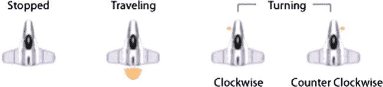

# 排版后的内容

如果图像按顺序显示，从左上角移动到右下角，那么小行星看起来就像在滚动。动画是一个循环，因此最后一幅图像之后可以显示第一幅图像，从而创建平滑的动画。为了理解我们如何实现这个动画，让我们看一下更新类`Actor03`的头文件，如清单 5-20 所示。

**清单 5-20.**  `Actor03.h`

```objc
#import <Foundation/Foundation.h>

@class Example03Controller;
long nextId;
@interface Actor03 : NSObject {
  
}
@property (nonatomic, retain) NSNumber* actorId;
@property (nonatomic) CGPoint center;
@property float rotation;
@property (nonatomic) float speed;
@property (nonatomic) float radius;
@property (nonatomic, retain) NSString* imageName;
@property (nonatomic) BOOL needsImageUpdated;

-(id)initAt:(CGPoint)aPoint WithRadius:(float)aRadius AndImage:(NSString*)anImageName;
-(void)step:(Example03Controller*)controller;
-(BOOL)overlapsWith: (Actor03*) actor;

@end
```

在清单 5-20 中，我们看到一些小的变化。我们添加了两个新属性：`rotation`和`needsImageUpdate`。`rotation`属性并不是指小行星的旋转；`rotation`属性将由更新后的`Viper03`类用于指示它面向的方向。属性`needsImageUpdated`是一个指示符，表示应为此角色使用新的`UIImage`。通过将此值设置为`YES`，我们使每个小行星在动画过程中请求新图像。让我们看看利用此属性的`Asteroid03`类中的变化——参见清单 5-21。

**清单 5-21.**  `Asteroid03.h`和`Asteroid03.m`（部分）

```objc
//From Asteroid.h
#define NUMBER_OF_IMAGES 31
...
@property (nonatomic) int imageNumber;
@property (nonatomic, retain) NSString* imageVariant;

//From Asteroid.m
-(NSString*)imageName{
    return [[imageVariant stringByAppendingString:@"_"] stringByAppendingString:[NSString stringWithFormat:@"%04d", self.imageNumber]];
}

-(void)step:(Example03Controller*)controller{
    if ([controller stepNumber]%2 == 0){
        self.imageNumber = imageNumber + 1;
        if (self.imageNumber > NUMBER_OF_IMAGES) {
            self.imageNumber = 1;
        }
        self.needsImageUpdated = YES;
    } else {
        self.needsImageUpdated = NO;
    }

    CGPoint newCenter = self.center;
    newCenter.y + = self.speed;
    self.center = newCenter;

    if (newCenter.y - self.radius > controller.gameAreaSize.height){
        [controller removeActor: self];
    }
}
```

在清单 5-12 中，我们向小行星类添加了两个新属性：`imageNumber`和`imageVariant`。属性`imageNumber`跟踪应显示的当前图像。与前面的示例一样，有三种类型的小行星：A、B 和 C。属性`imageVariant`记录应使用这些图像序列中的哪一个。

在清单 5-12 中，我们可以看到我们添加了一个名为`imageName`的新任务。此任务覆盖由`Actor03`定义的合成任务。通过这种方式，我们更改了返回的图像名称。我们获取`imageVariant`并附加图像编号，创建一个形式为“`Asteroid_B_0004`”的字符串（如果小行星是 B 类型且`imageNumber`等于 4）。

查看清单 5-12 中的`step`任务，我们看到我们在开头添加了一个新部分，用于更新应显示的图像。每隔一帧，我们将`imageNumber`的值增加 1，当它超过常量`NUMBER_OF_IMAGES`时重置回 1。每次更改`imageNumber`时，我们都希望将`needsImageUpdated`设置为`YES`；否则，我们将其设置为`NO`。

让我们看一下`updateActorView:`任务，了解`Example03Controller`如何使用此信息来确保显示正确的图像。参见清单 5-22。

**清单 5-22.**  `Example03Controller.m`（`updateActorView:`）

```objc
-(void)updateActorView:(Actor03*)actor{
    UIImageView* imageView = [actorViews objectForKey:[actor actorId]];

    if (imageView == nil){
        UIImageView* imageView = [[UIImageView alloc] initWithImage:[UIImage imageNamed:[actor imageName]]];
        [actorViews setObject:imageView forKey:[actor actorId]];
        [imageView setFrame:CGRectMake(0, 0, 0, 0)];
        [actorView addSubview:imageView];
    } else {
        if ([actor needsImageUpdated]){
            [imageView setImage:[UIImage imageNamed:[actor imageName]]];
        }
    }

    float xFactor = actorView.frame.size.width/self.gameAreaSize.width;

    float yFactor = actorView.frame.size.height/self.gameAreaSize.height;
    float x = (actor.center.x-actor.radius)*xFactor;
    float y = (actor.center.y-actor.radius)*yFactor;
    float width = actor.radius*xFactor*2;
    float height = actor.radius*yFactor*2;
    CGRect frame = CGRectMake(x, y, width, height);

    imageView.transform = CGAffineTransformIdentity;
    [imageView setFrame:frame];
    imageView.transform = CGAffineTransformRotate(imageView.transform, [actor rotation]);
}
```

在清单 5-22 中，如果属性`needsImageUpdated`设置为`YES`，我们只需再次在角色上调用`imageName`来更新`imageView`的图像。这就是让小行星看起来在太空中滚动所需的全部操作。

### 旋转效果

现在我们有办法指示应更新角色的图像，我们可以使用相同的功能为飞船赋予一些生命力。在清单 5-22 的底部，我们可以看到`imageView`的变换首先被修改为单位变换，然后设置其`frame`，最后再次修改变换，应用旋转。

在清单 5-22 中添加旋转逻辑使我们能够创建一个在移动到目标点`moveToPoint`之前旋转朝向它的飞船。图 5-13 显示了飞船在不同状态下将使用的精灵。



**图 5-13.**  用于不同飞船状态的图像

在图 5-13 中，我们看到四个图像。左边的图像在飞船停止时使用。左起第二个图像在飞船运动时使用。右边的两个图像在飞船转弯时使用——每个方向一个。让我们看一下类`Viper03`的头文件，了解需要进行哪些更改才能使其工作。参见清单 5-23。

**清单 5-23.**  `Viper03.h`

```objc
#define STATE_STOPPED 0
#define STATE_TURNING 1
#define STATE_TRAVELING 2

#import <Foundation/Foundation.h>
#import "Actor03.h"

@interface Viper03 : Actor03 {
  
}
@property CGPoint moveToPoint;
@property int state;
@property BOOL clockwise;

+(id)viper:(Example03Controller*)controller;
-(void)doCollision:(Actor03*)actor In:(Example03Controller*)controller;
@end
```

在清单 5-23 中，我们看到我们定义了一些表示三种状态的常量。我们还添加了一个新的`state`属性来记录`Viper03`的当前状态。我们还添加了属性`clockwise`来跟踪我们转弯的方向。因此，从`Asteroid03`类我们知道，我们将在任务`imageName`中指定将使用的图像，参见清单 5-24。


